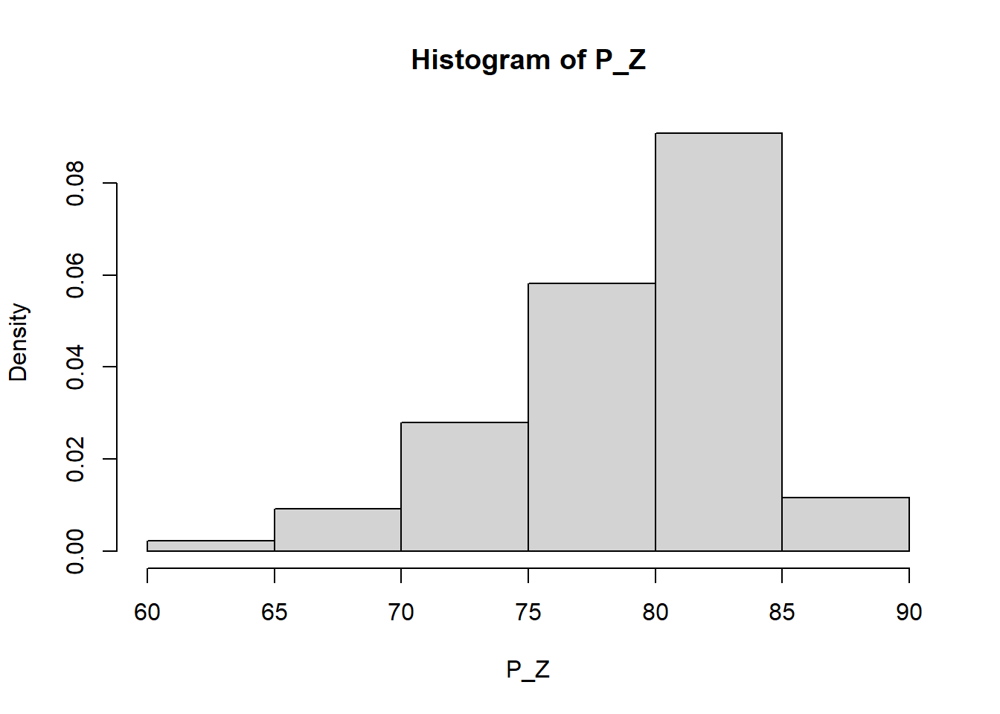
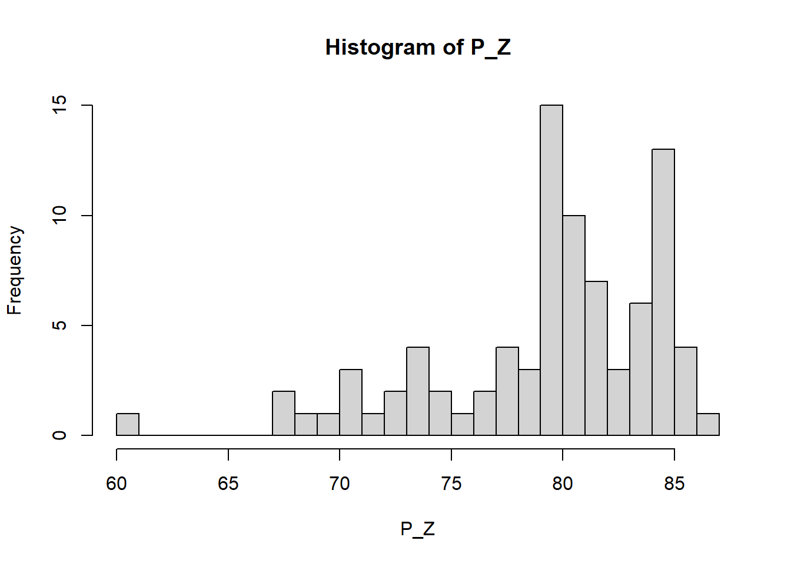
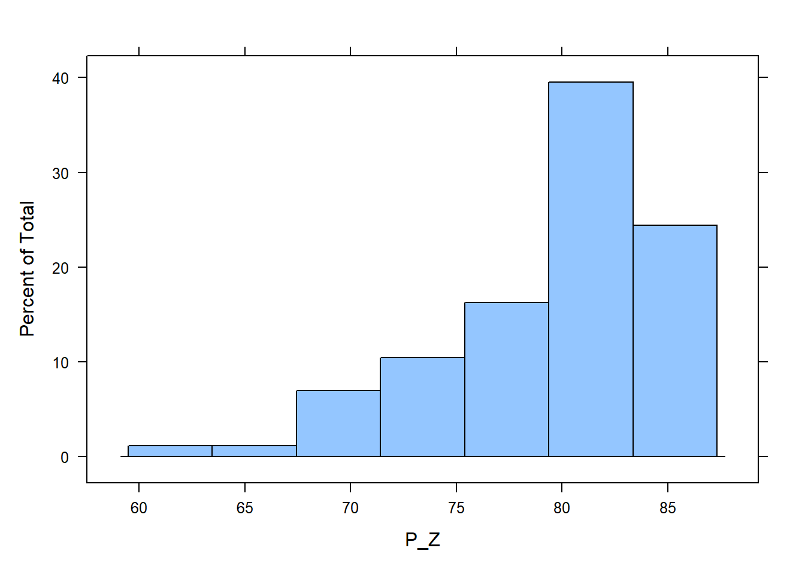
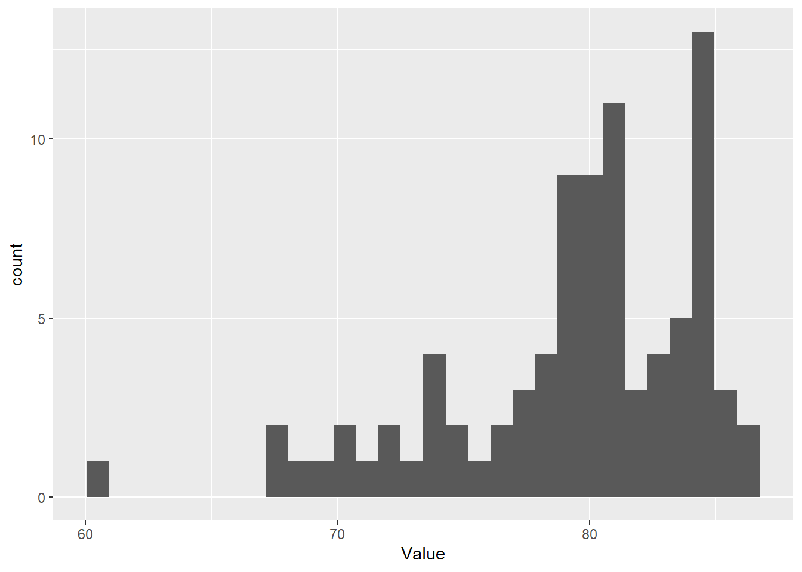
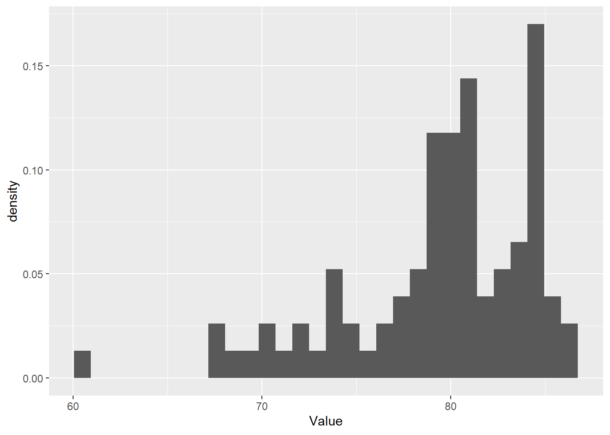
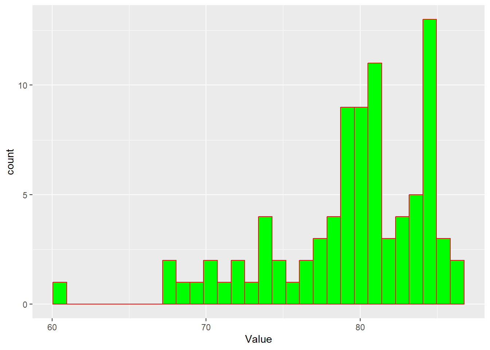
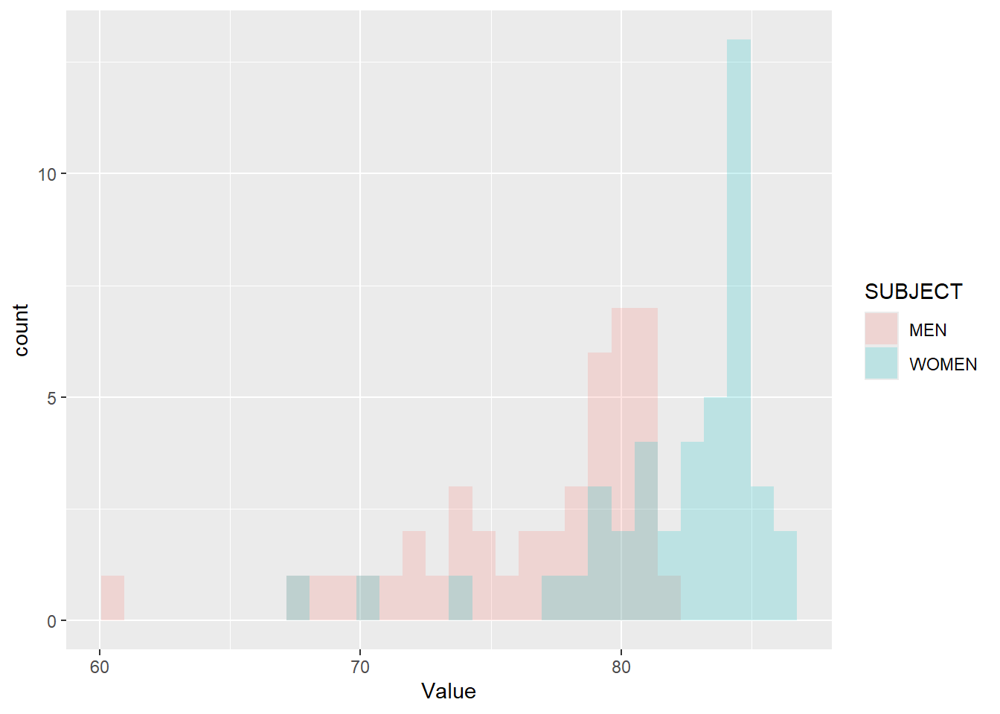
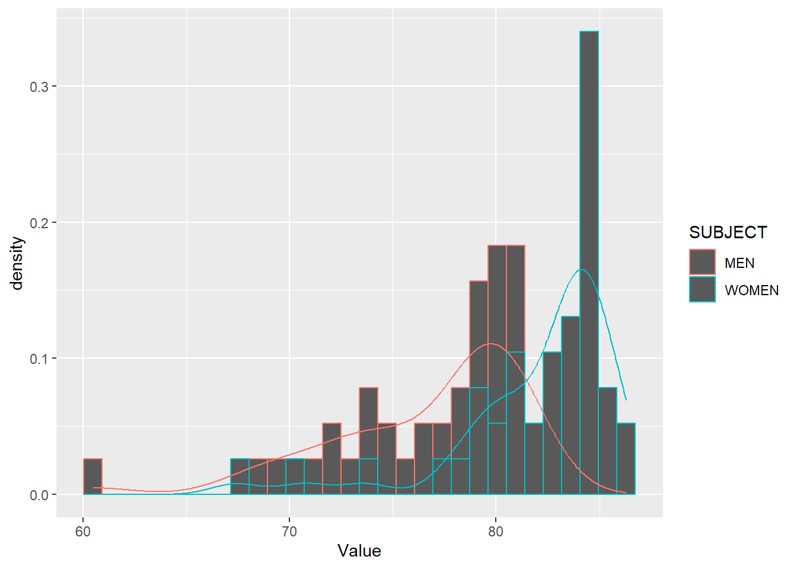
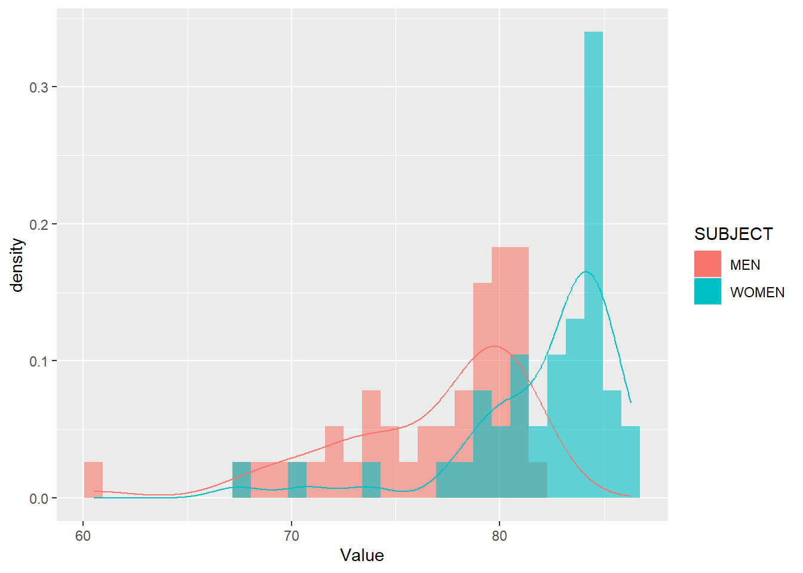

Εδώ θα μελετήσουμε το προσδόκιμο ζωής στη Γη. Αντλήσαμε πληροφορίες από τον [OECD](https://data.oecd.org/healthstat/life-expectancy-at-birth.htm) για το προσδόκιμο ζωής σε κάθε χώρα. Τα δεδομένα αποθηκεύτηκαν σε αρχείο ονόματι LifeExpectancyBirth.csv, αφού πρώτα διαγράψαμε τις μεταβλητές της προηγούμενης ενότητας:


``` r
rm(list = ls())
```

<div style="border: 1px solid #ddd; padding: 0px; overflow-y: scroll; height:200px; overflow-x: scroll; width:100%; "><table class="table table-striped" style="width: auto !important; margin-left: auto; margin-right: auto;">
 <thead>
  <tr>
   <th style="text-align:left;position: sticky; top:0; background-color: #FFFFFF;"> LOCATION </th>
   <th style="text-align:left;position: sticky; top:0; background-color: #FFFFFF;"> INDICATOR </th>
   <th style="text-align:left;position: sticky; top:0; background-color: #FFFFFF;"> SUBJECT </th>
   <th style="text-align:left;position: sticky; top:0; background-color: #FFFFFF;"> MEASURE </th>
   <th style="text-align:left;position: sticky; top:0; background-color: #FFFFFF;"> FREQUENCY </th>
   <th style="text-align:right;position: sticky; top:0; background-color: #FFFFFF;"> TIME </th>
   <th style="text-align:right;position: sticky; top:0; background-color: #FFFFFF;"> Value </th>
   <th style="text-align:left;position: sticky; top:0; background-color: #FFFFFF;"> Flag.Codes </th>
  </tr>
 </thead>
<tbody>
  <tr>
   <td style="text-align:left;"> AUS </td>
   <td style="text-align:left;"> LIFEEXP </td>
   <td style="text-align:left;"> MEN </td>
   <td style="text-align:left;"> YR </td>
   <td style="text-align:left;"> A </td>
   <td style="text-align:right;"> 1960 </td>
   <td style="text-align:right;"> 67.9 </td>
   <td style="text-align:left;">  </td>
  </tr>
  <tr>
   <td style="text-align:left;"> AUS </td>
   <td style="text-align:left;"> LIFEEXP </td>
   <td style="text-align:left;"> MEN </td>
   <td style="text-align:left;"> YR </td>
   <td style="text-align:left;"> A </td>
   <td style="text-align:right;"> 1961 </td>
   <td style="text-align:right;"> 68.0 </td>
   <td style="text-align:left;">  </td>
  </tr>
  <tr>
   <td style="text-align:left;"> AUS </td>
   <td style="text-align:left;"> LIFEEXP </td>
   <td style="text-align:left;"> MEN </td>
   <td style="text-align:left;"> YR </td>
   <td style="text-align:left;"> A </td>
   <td style="text-align:right;"> 1962 </td>
   <td style="text-align:right;"> 67.8 </td>
   <td style="text-align:left;">  </td>
  </tr>
  <tr>
   <td style="text-align:left;"> AUS </td>
   <td style="text-align:left;"> LIFEEXP </td>
   <td style="text-align:left;"> MEN </td>
   <td style="text-align:left;"> YR </td>
   <td style="text-align:left;"> A </td>
   <td style="text-align:right;"> 1963 </td>
   <td style="text-align:right;"> 67.9 </td>
   <td style="text-align:left;">  </td>
  </tr>
  <tr>
   <td style="text-align:left;"> AUS </td>
   <td style="text-align:left;"> LIFEEXP </td>
   <td style="text-align:left;"> MEN </td>
   <td style="text-align:left;"> YR </td>
   <td style="text-align:left;"> A </td>
   <td style="text-align:right;"> 1964 </td>
   <td style="text-align:right;"> 67.5 </td>
   <td style="text-align:left;">  </td>
  </tr>
  <tr>
   <td style="text-align:left;"> AUS </td>
   <td style="text-align:left;"> LIFEEXP </td>
   <td style="text-align:left;"> MEN </td>
   <td style="text-align:left;"> YR </td>
   <td style="text-align:left;"> A </td>
   <td style="text-align:right;"> 1965 </td>
   <td style="text-align:right;"> 67.7 </td>
   <td style="text-align:left;">  </td>
  </tr>
  <tr>
   <td style="text-align:left;"> AUS </td>
   <td style="text-align:left;"> LIFEEXP </td>
   <td style="text-align:left;"> MEN </td>
   <td style="text-align:left;"> YR </td>
   <td style="text-align:left;"> A </td>
   <td style="text-align:right;"> 1966 </td>
   <td style="text-align:right;"> 67.6 </td>
   <td style="text-align:left;">  </td>
  </tr>
  <tr>
   <td style="text-align:left;"> AUS </td>
   <td style="text-align:left;"> LIFEEXP </td>
   <td style="text-align:left;"> MEN </td>
   <td style="text-align:left;"> YR </td>
   <td style="text-align:left;"> A </td>
   <td style="text-align:right;"> 1967 </td>
   <td style="text-align:right;"> 67.8 </td>
   <td style="text-align:left;">  </td>
  </tr>
  <tr>
   <td style="text-align:left;"> AUS </td>
   <td style="text-align:left;"> LIFEEXP </td>
   <td style="text-align:left;"> MEN </td>
   <td style="text-align:left;"> YR </td>
   <td style="text-align:left;"> A </td>
   <td style="text-align:right;"> 1968 </td>
   <td style="text-align:right;"> 67.5 </td>
   <td style="text-align:left;">  </td>
  </tr>
  <tr>
   <td style="text-align:left;"> AUS </td>
   <td style="text-align:left;"> LIFEEXP </td>
   <td style="text-align:left;"> MEN </td>
   <td style="text-align:left;"> YR </td>
   <td style="text-align:left;"> A </td>
   <td style="text-align:right;"> 1969 </td>
   <td style="text-align:right;"> 67.5 </td>
   <td style="text-align:left;">  </td>
  </tr>
  <tr>
   <td style="text-align:left;"> AUS </td>
   <td style="text-align:left;"> LIFEEXP </td>
   <td style="text-align:left;"> MEN </td>
   <td style="text-align:left;"> YR </td>
   <td style="text-align:left;"> A </td>
   <td style="text-align:right;"> 1970 </td>
   <td style="text-align:right;"> 67.4 </td>
   <td style="text-align:left;">  </td>
  </tr>
  <tr>
   <td style="text-align:left;"> AUS </td>
   <td style="text-align:left;"> LIFEEXP </td>
   <td style="text-align:left;"> MEN </td>
   <td style="text-align:left;"> YR </td>
   <td style="text-align:left;"> A </td>
   <td style="text-align:right;"> 1971 </td>
   <td style="text-align:right;"> 68.3 </td>
   <td style="text-align:left;">  </td>
  </tr>
  <tr>
   <td style="text-align:left;"> AUS </td>
   <td style="text-align:left;"> LIFEEXP </td>
   <td style="text-align:left;"> MEN </td>
   <td style="text-align:left;"> YR </td>
   <td style="text-align:left;"> A </td>
   <td style="text-align:right;"> 1972 </td>
   <td style="text-align:right;"> 68.6 </td>
   <td style="text-align:left;">  </td>
  </tr>
  <tr>
   <td style="text-align:left;"> AUS </td>
   <td style="text-align:left;"> LIFEEXP </td>
   <td style="text-align:left;"> MEN </td>
   <td style="text-align:left;"> YR </td>
   <td style="text-align:left;"> A </td>
   <td style="text-align:right;"> 1973 </td>
   <td style="text-align:right;"> 68.6 </td>
   <td style="text-align:left;">  </td>
  </tr>
  <tr>
   <td style="text-align:left;"> AUS </td>
   <td style="text-align:left;"> LIFEEXP </td>
   <td style="text-align:left;"> MEN </td>
   <td style="text-align:left;"> YR </td>
   <td style="text-align:left;"> A </td>
   <td style="text-align:right;"> 1974 </td>
   <td style="text-align:right;"> 68.4 </td>
   <td style="text-align:left;">  </td>
  </tr>
  <tr>
   <td style="text-align:left;"> AUS </td>
   <td style="text-align:left;"> LIFEEXP </td>
   <td style="text-align:left;"> MEN </td>
   <td style="text-align:left;"> YR </td>
   <td style="text-align:left;"> A </td>
   <td style="text-align:right;"> 1975 </td>
   <td style="text-align:right;"> 69.2 </td>
   <td style="text-align:left;">  </td>
  </tr>
  <tr>
   <td style="text-align:left;"> AUS </td>
   <td style="text-align:left;"> LIFEEXP </td>
   <td style="text-align:left;"> MEN </td>
   <td style="text-align:left;"> YR </td>
   <td style="text-align:left;"> A </td>
   <td style="text-align:right;"> 1976 </td>
   <td style="text-align:right;"> 69.3 </td>
   <td style="text-align:left;">  </td>
  </tr>
  <tr>
   <td style="text-align:left;"> AUS </td>
   <td style="text-align:left;"> LIFEEXP </td>
   <td style="text-align:left;"> MEN </td>
   <td style="text-align:left;"> YR </td>
   <td style="text-align:left;"> A </td>
   <td style="text-align:right;"> 1977 </td>
   <td style="text-align:right;"> 69.9 </td>
   <td style="text-align:left;">  </td>
  </tr>
  <tr>
   <td style="text-align:left;"> AUS </td>
   <td style="text-align:left;"> LIFEEXP </td>
   <td style="text-align:left;"> MEN </td>
   <td style="text-align:left;"> YR </td>
   <td style="text-align:left;"> A </td>
   <td style="text-align:right;"> 1978 </td>
   <td style="text-align:right;"> 70.2 </td>
   <td style="text-align:left;">  </td>
  </tr>
  <tr>
   <td style="text-align:left;"> AUS </td>
   <td style="text-align:left;"> LIFEEXP </td>
   <td style="text-align:left;"> MEN </td>
   <td style="text-align:left;"> YR </td>
   <td style="text-align:left;"> A </td>
   <td style="text-align:right;"> 1979 </td>
   <td style="text-align:right;"> 70.8 </td>
   <td style="text-align:left;">  </td>
  </tr>
  <tr>
   <td style="text-align:left;"> AUS </td>
   <td style="text-align:left;"> LIFEEXP </td>
   <td style="text-align:left;"> MEN </td>
   <td style="text-align:left;"> YR </td>
   <td style="text-align:left;"> A </td>
   <td style="text-align:right;"> 1980 </td>
   <td style="text-align:right;"> 71.0 </td>
   <td style="text-align:left;">  </td>
  </tr>
  <tr>
   <td style="text-align:left;"> AUS </td>
   <td style="text-align:left;"> LIFEEXP </td>
   <td style="text-align:left;"> MEN </td>
   <td style="text-align:left;"> YR </td>
   <td style="text-align:left;"> A </td>
   <td style="text-align:right;"> 1981 </td>
   <td style="text-align:right;"> 71.4 </td>
   <td style="text-align:left;">  </td>
  </tr>
  <tr>
   <td style="text-align:left;"> AUS </td>
   <td style="text-align:left;"> LIFEEXP </td>
   <td style="text-align:left;"> MEN </td>
   <td style="text-align:left;"> YR </td>
   <td style="text-align:left;"> A </td>
   <td style="text-align:right;"> 1982 </td>
   <td style="text-align:right;"> 71.2 </td>
   <td style="text-align:left;">  </td>
  </tr>
  <tr>
   <td style="text-align:left;"> AUS </td>
   <td style="text-align:left;"> LIFEEXP </td>
   <td style="text-align:left;"> MEN </td>
   <td style="text-align:left;"> YR </td>
   <td style="text-align:left;"> A </td>
   <td style="text-align:right;"> 1983 </td>
   <td style="text-align:right;"> 72.1 </td>
   <td style="text-align:left;">  </td>
  </tr>
  <tr>
   <td style="text-align:left;"> AUS </td>
   <td style="text-align:left;"> LIFEEXP </td>
   <td style="text-align:left;"> MEN </td>
   <td style="text-align:left;"> YR </td>
   <td style="text-align:left;"> A </td>
   <td style="text-align:right;"> 1984 </td>
   <td style="text-align:right;"> 72.5 </td>
   <td style="text-align:left;">  </td>
  </tr>
  <tr>
   <td style="text-align:left;"> AUS </td>
   <td style="text-align:left;"> LIFEEXP </td>
   <td style="text-align:left;"> MEN </td>
   <td style="text-align:left;"> YR </td>
   <td style="text-align:left;"> A </td>
   <td style="text-align:right;"> 1985 </td>
   <td style="text-align:right;"> 72.4 </td>
   <td style="text-align:left;">  </td>
  </tr>
  <tr>
   <td style="text-align:left;"> AUS </td>
   <td style="text-align:left;"> LIFEEXP </td>
   <td style="text-align:left;"> MEN </td>
   <td style="text-align:left;"> YR </td>
   <td style="text-align:left;"> A </td>
   <td style="text-align:right;"> 1986 </td>
   <td style="text-align:right;"> 72.9 </td>
   <td style="text-align:left;">  </td>
  </tr>
  <tr>
   <td style="text-align:left;"> AUS </td>
   <td style="text-align:left;"> LIFEEXP </td>
   <td style="text-align:left;"> MEN </td>
   <td style="text-align:left;"> YR </td>
   <td style="text-align:left;"> A </td>
   <td style="text-align:right;"> 1987 </td>
   <td style="text-align:right;"> 73.1 </td>
   <td style="text-align:left;">  </td>
  </tr>
  <tr>
   <td style="text-align:left;"> AUS </td>
   <td style="text-align:left;"> LIFEEXP </td>
   <td style="text-align:left;"> MEN </td>
   <td style="text-align:left;"> YR </td>
   <td style="text-align:left;"> A </td>
   <td style="text-align:right;"> 1988 </td>
   <td style="text-align:right;"> 73.1 </td>
   <td style="text-align:left;">  </td>
  </tr>
  <tr>
   <td style="text-align:left;"> AUS </td>
   <td style="text-align:left;"> LIFEEXP </td>
   <td style="text-align:left;"> MEN </td>
   <td style="text-align:left;"> YR </td>
   <td style="text-align:left;"> A </td>
   <td style="text-align:right;"> 1989 </td>
   <td style="text-align:right;"> 73.3 </td>
   <td style="text-align:left;">  </td>
  </tr>
  <tr>
   <td style="text-align:left;"> AUS </td>
   <td style="text-align:left;"> LIFEEXP </td>
   <td style="text-align:left;"> MEN </td>
   <td style="text-align:left;"> YR </td>
   <td style="text-align:left;"> A </td>
   <td style="text-align:right;"> 1990 </td>
   <td style="text-align:right;"> 73.9 </td>
   <td style="text-align:left;">  </td>
  </tr>
  <tr>
   <td style="text-align:left;"> AUS </td>
   <td style="text-align:left;"> LIFEEXP </td>
   <td style="text-align:left;"> MEN </td>
   <td style="text-align:left;"> YR </td>
   <td style="text-align:left;"> A </td>
   <td style="text-align:right;"> 1991 </td>
   <td style="text-align:right;"> 74.4 </td>
   <td style="text-align:left;">  </td>
  </tr>
  <tr>
   <td style="text-align:left;"> AUS </td>
   <td style="text-align:left;"> LIFEEXP </td>
   <td style="text-align:left;"> MEN </td>
   <td style="text-align:left;"> YR </td>
   <td style="text-align:left;"> A </td>
   <td style="text-align:right;"> 1992 </td>
   <td style="text-align:right;"> 74.5 </td>
   <td style="text-align:left;">  </td>
  </tr>
  <tr>
   <td style="text-align:left;"> AUS </td>
   <td style="text-align:left;"> LIFEEXP </td>
   <td style="text-align:left;"> MEN </td>
   <td style="text-align:left;"> YR </td>
   <td style="text-align:left;"> A </td>
   <td style="text-align:right;"> 1993 </td>
   <td style="text-align:right;"> 75.0 </td>
   <td style="text-align:left;">  </td>
  </tr>
  <tr>
   <td style="text-align:left;"> AUS </td>
   <td style="text-align:left;"> LIFEEXP </td>
   <td style="text-align:left;"> MEN </td>
   <td style="text-align:left;"> YR </td>
   <td style="text-align:left;"> A </td>
   <td style="text-align:right;"> 1994 </td>
   <td style="text-align:right;"> 75.0 </td>
   <td style="text-align:left;">  </td>
  </tr>
  <tr>
   <td style="text-align:left;"> AUS </td>
   <td style="text-align:left;"> LIFEEXP </td>
   <td style="text-align:left;"> MEN </td>
   <td style="text-align:left;"> YR </td>
   <td style="text-align:left;"> A </td>
   <td style="text-align:right;"> 1995 </td>
   <td style="text-align:right;"> 75.0 </td>
   <td style="text-align:left;">  </td>
  </tr>
  <tr>
   <td style="text-align:left;"> AUS </td>
   <td style="text-align:left;"> LIFEEXP </td>
   <td style="text-align:left;"> MEN </td>
   <td style="text-align:left;"> YR </td>
   <td style="text-align:left;"> A </td>
   <td style="text-align:right;"> 1996 </td>
   <td style="text-align:right;"> 75.2 </td>
   <td style="text-align:left;">  </td>
  </tr>
  <tr>
   <td style="text-align:left;"> AUS </td>
   <td style="text-align:left;"> LIFEEXP </td>
   <td style="text-align:left;"> MEN </td>
   <td style="text-align:left;"> YR </td>
   <td style="text-align:left;"> A </td>
   <td style="text-align:right;"> 1997 </td>
   <td style="text-align:right;"> 75.6 </td>
   <td style="text-align:left;">  </td>
  </tr>
  <tr>
   <td style="text-align:left;"> AUS </td>
   <td style="text-align:left;"> LIFEEXP </td>
   <td style="text-align:left;"> MEN </td>
   <td style="text-align:left;"> YR </td>
   <td style="text-align:left;"> A </td>
   <td style="text-align:right;"> 1998 </td>
   <td style="text-align:right;"> 75.9 </td>
   <td style="text-align:left;">  </td>
  </tr>
  <tr>
   <td style="text-align:left;"> AUS </td>
   <td style="text-align:left;"> LIFEEXP </td>
   <td style="text-align:left;"> MEN </td>
   <td style="text-align:left;"> YR </td>
   <td style="text-align:left;"> A </td>
   <td style="text-align:right;"> 1999 </td>
   <td style="text-align:right;"> 76.2 </td>
   <td style="text-align:left;">  </td>
  </tr>
  <tr>
   <td style="text-align:left;"> AUS </td>
   <td style="text-align:left;"> LIFEEXP </td>
   <td style="text-align:left;"> MEN </td>
   <td style="text-align:left;"> YR </td>
   <td style="text-align:left;"> A </td>
   <td style="text-align:right;"> 2000 </td>
   <td style="text-align:right;"> 76.6 </td>
   <td style="text-align:left;">  </td>
  </tr>
  <tr>
   <td style="text-align:left;"> AUS </td>
   <td style="text-align:left;"> LIFEEXP </td>
   <td style="text-align:left;"> MEN </td>
   <td style="text-align:left;"> YR </td>
   <td style="text-align:left;"> A </td>
   <td style="text-align:right;"> 2001 </td>
   <td style="text-align:right;"> 77.0 </td>
   <td style="text-align:left;">  </td>
  </tr>
  <tr>
   <td style="text-align:left;"> AUS </td>
   <td style="text-align:left;"> LIFEEXP </td>
   <td style="text-align:left;"> MEN </td>
   <td style="text-align:left;"> YR </td>
   <td style="text-align:left;"> A </td>
   <td style="text-align:right;"> 2002 </td>
   <td style="text-align:right;"> 77.4 </td>
   <td style="text-align:left;">  </td>
  </tr>
  <tr>
   <td style="text-align:left;"> AUS </td>
   <td style="text-align:left;"> LIFEEXP </td>
   <td style="text-align:left;"> MEN </td>
   <td style="text-align:left;"> YR </td>
   <td style="text-align:left;"> A </td>
   <td style="text-align:right;"> 2003 </td>
   <td style="text-align:right;"> 77.8 </td>
   <td style="text-align:left;">  </td>
  </tr>
  <tr>
   <td style="text-align:left;"> AUS </td>
   <td style="text-align:left;"> LIFEEXP </td>
   <td style="text-align:left;"> MEN </td>
   <td style="text-align:left;"> YR </td>
   <td style="text-align:left;"> A </td>
   <td style="text-align:right;"> 2004 </td>
   <td style="text-align:right;"> 78.1 </td>
   <td style="text-align:left;">  </td>
  </tr>
  <tr>
   <td style="text-align:left;"> AUS </td>
   <td style="text-align:left;"> LIFEEXP </td>
   <td style="text-align:left;"> MEN </td>
   <td style="text-align:left;"> YR </td>
   <td style="text-align:left;"> A </td>
   <td style="text-align:right;"> 2005 </td>
   <td style="text-align:right;"> 78.5 </td>
   <td style="text-align:left;">  </td>
  </tr>
  <tr>
   <td style="text-align:left;"> AUS </td>
   <td style="text-align:left;"> LIFEEXP </td>
   <td style="text-align:left;"> MEN </td>
   <td style="text-align:left;"> YR </td>
   <td style="text-align:left;"> A </td>
   <td style="text-align:right;"> 2006 </td>
   <td style="text-align:right;"> 78.7 </td>
   <td style="text-align:left;">  </td>
  </tr>
  <tr>
   <td style="text-align:left;"> AUS </td>
   <td style="text-align:left;"> LIFEEXP </td>
   <td style="text-align:left;"> MEN </td>
   <td style="text-align:left;"> YR </td>
   <td style="text-align:left;"> A </td>
   <td style="text-align:right;"> 2007 </td>
   <td style="text-align:right;"> 79.0 </td>
   <td style="text-align:left;">  </td>
  </tr>
  <tr>
   <td style="text-align:left;"> AUS </td>
   <td style="text-align:left;"> LIFEEXP </td>
   <td style="text-align:left;"> MEN </td>
   <td style="text-align:left;"> YR </td>
   <td style="text-align:left;"> A </td>
   <td style="text-align:right;"> 2008 </td>
   <td style="text-align:right;"> 79.2 </td>
   <td style="text-align:left;">  </td>
  </tr>
  <tr>
   <td style="text-align:left;"> AUS </td>
   <td style="text-align:left;"> LIFEEXP </td>
   <td style="text-align:left;"> MEN </td>
   <td style="text-align:left;"> YR </td>
   <td style="text-align:left;"> A </td>
   <td style="text-align:right;"> 2009 </td>
   <td style="text-align:right;"> 79.3 </td>
   <td style="text-align:left;">  </td>
  </tr>
  <tr>
   <td style="text-align:left;"> AUS </td>
   <td style="text-align:left;"> LIFEEXP </td>
   <td style="text-align:left;"> MEN </td>
   <td style="text-align:left;"> YR </td>
   <td style="text-align:left;"> A </td>
   <td style="text-align:right;"> 2010 </td>
   <td style="text-align:right;"> 79.5 </td>
   <td style="text-align:left;">  </td>
  </tr>
  <tr>
   <td style="text-align:left;"> AUS </td>
   <td style="text-align:left;"> LIFEEXP </td>
   <td style="text-align:left;"> MEN </td>
   <td style="text-align:left;"> YR </td>
   <td style="text-align:left;"> A </td>
   <td style="text-align:right;"> 2011 </td>
   <td style="text-align:right;"> 79.7 </td>
   <td style="text-align:left;">  </td>
  </tr>
  <tr>
   <td style="text-align:left;"> AUS </td>
   <td style="text-align:left;"> LIFEEXP </td>
   <td style="text-align:left;"> MEN </td>
   <td style="text-align:left;"> YR </td>
   <td style="text-align:left;"> A </td>
   <td style="text-align:right;"> 2012 </td>
   <td style="text-align:right;"> 79.9 </td>
   <td style="text-align:left;">  </td>
  </tr>
  <tr>
   <td style="text-align:left;"> AUS </td>
   <td style="text-align:left;"> LIFEEXP </td>
   <td style="text-align:left;"> MEN </td>
   <td style="text-align:left;"> YR </td>
   <td style="text-align:left;"> A </td>
   <td style="text-align:right;"> 2013 </td>
   <td style="text-align:right;"> 80.1 </td>
   <td style="text-align:left;">  </td>
  </tr>
  <tr>
   <td style="text-align:left;"> AUS </td>
   <td style="text-align:left;"> LIFEEXP </td>
   <td style="text-align:left;"> MEN </td>
   <td style="text-align:left;"> YR </td>
   <td style="text-align:left;"> A </td>
   <td style="text-align:right;"> 2014 </td>
   <td style="text-align:right;"> 80.3 </td>
   <td style="text-align:left;">  </td>
  </tr>
  <tr>
   <td style="text-align:left;"> AUS </td>
   <td style="text-align:left;"> LIFEEXP </td>
   <td style="text-align:left;"> MEN </td>
   <td style="text-align:left;"> YR </td>
   <td style="text-align:left;"> A </td>
   <td style="text-align:right;"> 2015 </td>
   <td style="text-align:right;"> 80.4 </td>
   <td style="text-align:left;">  </td>
  </tr>
  <tr>
   <td style="text-align:left;"> AUS </td>
   <td style="text-align:left;"> LIFEEXP </td>
   <td style="text-align:left;"> MEN </td>
   <td style="text-align:left;"> YR </td>
   <td style="text-align:left;"> A </td>
   <td style="text-align:right;"> 2016 </td>
   <td style="text-align:right;"> 80.4 </td>
   <td style="text-align:left;">  </td>
  </tr>
  <tr>
   <td style="text-align:left;"> AUS </td>
   <td style="text-align:left;"> LIFEEXP </td>
   <td style="text-align:left;"> MEN </td>
   <td style="text-align:left;"> YR </td>
   <td style="text-align:left;"> A </td>
   <td style="text-align:right;"> 2017 </td>
   <td style="text-align:right;"> 80.5 </td>
   <td style="text-align:left;">  </td>
  </tr>
  <tr>
   <td style="text-align:left;"> AUS </td>
   <td style="text-align:left;"> LIFEEXP </td>
   <td style="text-align:left;"> MEN </td>
   <td style="text-align:left;"> YR </td>
   <td style="text-align:left;"> A </td>
   <td style="text-align:right;"> 2018 </td>
   <td style="text-align:right;"> 80.7 </td>
   <td style="text-align:left;">  </td>
  </tr>
  <tr>
   <td style="text-align:left;"> AUS </td>
   <td style="text-align:left;"> LIFEEXP </td>
   <td style="text-align:left;"> TOT </td>
   <td style="text-align:left;"> YR </td>
   <td style="text-align:left;"> A </td>
   <td style="text-align:right;"> 1960 </td>
   <td style="text-align:right;"> 70.9 </td>
   <td style="text-align:left;">  </td>
  </tr>
  <tr>
   <td style="text-align:left;"> AUS </td>
   <td style="text-align:left;"> LIFEEXP </td>
   <td style="text-align:left;"> TOT </td>
   <td style="text-align:left;"> YR </td>
   <td style="text-align:left;"> A </td>
   <td style="text-align:right;"> 1961 </td>
   <td style="text-align:right;"> 71.2 </td>
   <td style="text-align:left;">  </td>
  </tr>
  <tr>
   <td style="text-align:left;"> AUS </td>
   <td style="text-align:left;"> LIFEEXP </td>
   <td style="text-align:left;"> TOT </td>
   <td style="text-align:left;"> YR </td>
   <td style="text-align:left;"> A </td>
   <td style="text-align:right;"> 1962 </td>
   <td style="text-align:right;"> 71.0 </td>
   <td style="text-align:left;">  </td>
  </tr>
  <tr>
   <td style="text-align:left;"> AUS </td>
   <td style="text-align:left;"> LIFEEXP </td>
   <td style="text-align:left;"> TOT </td>
   <td style="text-align:left;"> YR </td>
   <td style="text-align:left;"> A </td>
   <td style="text-align:right;"> 1963 </td>
   <td style="text-align:right;"> 71.1 </td>
   <td style="text-align:left;">  </td>
  </tr>
  <tr>
   <td style="text-align:left;"> AUS </td>
   <td style="text-align:left;"> LIFEEXP </td>
   <td style="text-align:left;"> TOT </td>
   <td style="text-align:left;"> YR </td>
   <td style="text-align:left;"> A </td>
   <td style="text-align:right;"> 1964 </td>
   <td style="text-align:right;"> 70.7 </td>
   <td style="text-align:left;">  </td>
  </tr>
  <tr>
   <td style="text-align:left;"> AUS </td>
   <td style="text-align:left;"> LIFEEXP </td>
   <td style="text-align:left;"> TOT </td>
   <td style="text-align:left;"> YR </td>
   <td style="text-align:left;"> A </td>
   <td style="text-align:right;"> 1965 </td>
   <td style="text-align:right;"> 71.0 </td>
   <td style="text-align:left;">  </td>
  </tr>
  <tr>
   <td style="text-align:left;"> AUS </td>
   <td style="text-align:left;"> LIFEEXP </td>
   <td style="text-align:left;"> TOT </td>
   <td style="text-align:left;"> YR </td>
   <td style="text-align:left;"> A </td>
   <td style="text-align:right;"> 1966 </td>
   <td style="text-align:right;"> 70.8 </td>
   <td style="text-align:left;">  </td>
  </tr>
  <tr>
   <td style="text-align:left;"> AUS </td>
   <td style="text-align:left;"> LIFEEXP </td>
   <td style="text-align:left;"> TOT </td>
   <td style="text-align:left;"> YR </td>
   <td style="text-align:left;"> A </td>
   <td style="text-align:right;"> 1967 </td>
   <td style="text-align:right;"> 71.2 </td>
   <td style="text-align:left;">  </td>
  </tr>
  <tr>
   <td style="text-align:left;"> AUS </td>
   <td style="text-align:left;"> LIFEEXP </td>
   <td style="text-align:left;"> TOT </td>
   <td style="text-align:left;"> YR </td>
   <td style="text-align:left;"> A </td>
   <td style="text-align:right;"> 1968 </td>
   <td style="text-align:right;"> 70.9 </td>
   <td style="text-align:left;">  </td>
  </tr>
  <tr>
   <td style="text-align:left;"> AUS </td>
   <td style="text-align:left;"> LIFEEXP </td>
   <td style="text-align:left;"> TOT </td>
   <td style="text-align:left;"> YR </td>
   <td style="text-align:left;"> A </td>
   <td style="text-align:right;"> 1969 </td>
   <td style="text-align:right;"> 71.1 </td>
   <td style="text-align:left;">  </td>
  </tr>
  <tr>
   <td style="text-align:left;"> AUS </td>
   <td style="text-align:left;"> LIFEEXP </td>
   <td style="text-align:left;"> TOT </td>
   <td style="text-align:left;"> YR </td>
   <td style="text-align:left;"> A </td>
   <td style="text-align:right;"> 1970 </td>
   <td style="text-align:right;"> 70.8 </td>
   <td style="text-align:left;">  </td>
  </tr>
  <tr>
   <td style="text-align:left;"> AUS </td>
   <td style="text-align:left;"> LIFEEXP </td>
   <td style="text-align:left;"> TOT </td>
   <td style="text-align:left;"> YR </td>
   <td style="text-align:left;"> A </td>
   <td style="text-align:right;"> 1971 </td>
   <td style="text-align:right;"> 71.6 </td>
   <td style="text-align:left;">  </td>
  </tr>
  <tr>
   <td style="text-align:left;"> AUS </td>
   <td style="text-align:left;"> LIFEEXP </td>
   <td style="text-align:left;"> TOT </td>
   <td style="text-align:left;"> YR </td>
   <td style="text-align:left;"> A </td>
   <td style="text-align:right;"> 1972 </td>
   <td style="text-align:right;"> 72.0 </td>
   <td style="text-align:left;">  </td>
  </tr>
  <tr>
   <td style="text-align:left;"> AUS </td>
   <td style="text-align:left;"> LIFEEXP </td>
   <td style="text-align:left;"> TOT </td>
   <td style="text-align:left;"> YR </td>
   <td style="text-align:left;"> A </td>
   <td style="text-align:right;"> 1973 </td>
   <td style="text-align:right;"> 72.1 </td>
   <td style="text-align:left;">  </td>
  </tr>
  <tr>
   <td style="text-align:left;"> AUS </td>
   <td style="text-align:left;"> LIFEEXP </td>
   <td style="text-align:left;"> TOT </td>
   <td style="text-align:left;"> YR </td>
   <td style="text-align:left;"> A </td>
   <td style="text-align:right;"> 1974 </td>
   <td style="text-align:right;"> 71.9 </td>
   <td style="text-align:left;">  </td>
  </tr>
  <tr>
   <td style="text-align:left;"> AUS </td>
   <td style="text-align:left;"> LIFEEXP </td>
   <td style="text-align:left;"> TOT </td>
   <td style="text-align:left;"> YR </td>
   <td style="text-align:left;"> A </td>
   <td style="text-align:right;"> 1975 </td>
   <td style="text-align:right;"> 72.7 </td>
   <td style="text-align:left;">  </td>
  </tr>
  <tr>
   <td style="text-align:left;"> AUS </td>
   <td style="text-align:left;"> LIFEEXP </td>
   <td style="text-align:left;"> TOT </td>
   <td style="text-align:left;"> YR </td>
   <td style="text-align:left;"> A </td>
   <td style="text-align:right;"> 1976 </td>
   <td style="text-align:right;"> 72.8 </td>
   <td style="text-align:left;">  </td>
  </tr>
  <tr>
   <td style="text-align:left;"> AUS </td>
   <td style="text-align:left;"> LIFEEXP </td>
   <td style="text-align:left;"> TOT </td>
   <td style="text-align:left;"> YR </td>
   <td style="text-align:left;"> A </td>
   <td style="text-align:right;"> 1977 </td>
   <td style="text-align:right;"> 73.4 </td>
   <td style="text-align:left;">  </td>
  </tr>
  <tr>
   <td style="text-align:left;"> AUS </td>
   <td style="text-align:left;"> LIFEEXP </td>
   <td style="text-align:left;"> TOT </td>
   <td style="text-align:left;"> YR </td>
   <td style="text-align:left;"> A </td>
   <td style="text-align:right;"> 1978 </td>
   <td style="text-align:right;"> 73.7 </td>
   <td style="text-align:left;">  </td>
  </tr>
  <tr>
   <td style="text-align:left;"> AUS </td>
   <td style="text-align:left;"> LIFEEXP </td>
   <td style="text-align:left;"> TOT </td>
   <td style="text-align:left;"> YR </td>
   <td style="text-align:left;"> A </td>
   <td style="text-align:right;"> 1979 </td>
   <td style="text-align:right;"> 74.3 </td>
   <td style="text-align:left;">  </td>
  </tr>
  <tr>
   <td style="text-align:left;"> AUS </td>
   <td style="text-align:left;"> LIFEEXP </td>
   <td style="text-align:left;"> TOT </td>
   <td style="text-align:left;"> YR </td>
   <td style="text-align:left;"> A </td>
   <td style="text-align:right;"> 1980 </td>
   <td style="text-align:right;"> 74.6 </td>
   <td style="text-align:left;">  </td>
  </tr>
  <tr>
   <td style="text-align:left;"> AUS </td>
   <td style="text-align:left;"> LIFEEXP </td>
   <td style="text-align:left;"> TOT </td>
   <td style="text-align:left;"> YR </td>
   <td style="text-align:left;"> A </td>
   <td style="text-align:right;"> 1981 </td>
   <td style="text-align:right;"> 74.9 </td>
   <td style="text-align:left;">  </td>
  </tr>
  <tr>
   <td style="text-align:left;"> AUS </td>
   <td style="text-align:left;"> LIFEEXP </td>
   <td style="text-align:left;"> TOT </td>
   <td style="text-align:left;"> YR </td>
   <td style="text-align:left;"> A </td>
   <td style="text-align:right;"> 1982 </td>
   <td style="text-align:right;"> 74.7 </td>
   <td style="text-align:left;">  </td>
  </tr>
  <tr>
   <td style="text-align:left;"> AUS </td>
   <td style="text-align:left;"> LIFEEXP </td>
   <td style="text-align:left;"> TOT </td>
   <td style="text-align:left;"> YR </td>
   <td style="text-align:left;"> A </td>
   <td style="text-align:right;"> 1983 </td>
   <td style="text-align:right;"> 75.5 </td>
   <td style="text-align:left;">  </td>
  </tr>
  <tr>
   <td style="text-align:left;"> AUS </td>
   <td style="text-align:left;"> LIFEEXP </td>
   <td style="text-align:left;"> TOT </td>
   <td style="text-align:left;"> YR </td>
   <td style="text-align:left;"> A </td>
   <td style="text-align:right;"> 1984 </td>
   <td style="text-align:right;"> 75.8 </td>
   <td style="text-align:left;">  </td>
  </tr>
  <tr>
   <td style="text-align:left;"> AUS </td>
   <td style="text-align:left;"> LIFEEXP </td>
   <td style="text-align:left;"> TOT </td>
   <td style="text-align:left;"> YR </td>
   <td style="text-align:left;"> A </td>
   <td style="text-align:right;"> 1985 </td>
   <td style="text-align:right;"> 75.6 </td>
   <td style="text-align:left;">  </td>
  </tr>
  <tr>
   <td style="text-align:left;"> AUS </td>
   <td style="text-align:left;"> LIFEEXP </td>
   <td style="text-align:left;"> TOT </td>
   <td style="text-align:left;"> YR </td>
   <td style="text-align:left;"> A </td>
   <td style="text-align:right;"> 1986 </td>
   <td style="text-align:right;"> 76.1 </td>
   <td style="text-align:left;">  </td>
  </tr>
  <tr>
   <td style="text-align:left;"> AUS </td>
   <td style="text-align:left;"> LIFEEXP </td>
   <td style="text-align:left;"> TOT </td>
   <td style="text-align:left;"> YR </td>
   <td style="text-align:left;"> A </td>
   <td style="text-align:right;"> 1987 </td>
   <td style="text-align:right;"> 76.3 </td>
   <td style="text-align:left;">  </td>
  </tr>
  <tr>
   <td style="text-align:left;"> AUS </td>
   <td style="text-align:left;"> LIFEEXP </td>
   <td style="text-align:left;"> TOT </td>
   <td style="text-align:left;"> YR </td>
   <td style="text-align:left;"> A </td>
   <td style="text-align:right;"> 1988 </td>
   <td style="text-align:right;"> 76.3 </td>
   <td style="text-align:left;">  </td>
  </tr>
  <tr>
   <td style="text-align:left;"> AUS </td>
   <td style="text-align:left;"> LIFEEXP </td>
   <td style="text-align:left;"> TOT </td>
   <td style="text-align:left;"> YR </td>
   <td style="text-align:left;"> A </td>
   <td style="text-align:right;"> 1989 </td>
   <td style="text-align:right;"> 76.5 </td>
   <td style="text-align:left;">  </td>
  </tr>
  <tr>
   <td style="text-align:left;"> AUS </td>
   <td style="text-align:left;"> LIFEEXP </td>
   <td style="text-align:left;"> TOT </td>
   <td style="text-align:left;"> YR </td>
   <td style="text-align:left;"> A </td>
   <td style="text-align:right;"> 1990 </td>
   <td style="text-align:right;"> 77.0 </td>
   <td style="text-align:left;">  </td>
  </tr>
  <tr>
   <td style="text-align:left;"> AUS </td>
   <td style="text-align:left;"> LIFEEXP </td>
   <td style="text-align:left;"> TOT </td>
   <td style="text-align:left;"> YR </td>
   <td style="text-align:left;"> A </td>
   <td style="text-align:right;"> 1991 </td>
   <td style="text-align:right;"> 77.4 </td>
   <td style="text-align:left;">  </td>
  </tr>
  <tr>
   <td style="text-align:left;"> AUS </td>
   <td style="text-align:left;"> LIFEEXP </td>
   <td style="text-align:left;"> TOT </td>
   <td style="text-align:left;"> YR </td>
   <td style="text-align:left;"> A </td>
   <td style="text-align:right;"> 1992 </td>
   <td style="text-align:right;"> 77.5 </td>
   <td style="text-align:left;">  </td>
  </tr>
  <tr>
   <td style="text-align:left;"> AUS </td>
   <td style="text-align:left;"> LIFEEXP </td>
   <td style="text-align:left;"> TOT </td>
   <td style="text-align:left;"> YR </td>
   <td style="text-align:left;"> A </td>
   <td style="text-align:right;"> 1993 </td>
   <td style="text-align:right;"> 78.0 </td>
   <td style="text-align:left;">  </td>
  </tr>
  <tr>
   <td style="text-align:left;"> AUS </td>
   <td style="text-align:left;"> LIFEEXP </td>
   <td style="text-align:left;"> TOT </td>
   <td style="text-align:left;"> YR </td>
   <td style="text-align:left;"> A </td>
   <td style="text-align:right;"> 1994 </td>
   <td style="text-align:right;"> 78.0 </td>
   <td style="text-align:left;">  </td>
  </tr>
  <tr>
   <td style="text-align:left;"> AUS </td>
   <td style="text-align:left;"> LIFEEXP </td>
   <td style="text-align:left;"> TOT </td>
   <td style="text-align:left;"> YR </td>
   <td style="text-align:left;"> A </td>
   <td style="text-align:right;"> 1995 </td>
   <td style="text-align:right;"> 77.9 </td>
   <td style="text-align:left;">  </td>
  </tr>
  <tr>
   <td style="text-align:left;"> AUS </td>
   <td style="text-align:left;"> LIFEEXP </td>
   <td style="text-align:left;"> TOT </td>
   <td style="text-align:left;"> YR </td>
   <td style="text-align:left;"> A </td>
   <td style="text-align:right;"> 1996 </td>
   <td style="text-align:right;"> 78.2 </td>
   <td style="text-align:left;">  </td>
  </tr>
  <tr>
   <td style="text-align:left;"> AUS </td>
   <td style="text-align:left;"> LIFEEXP </td>
   <td style="text-align:left;"> TOT </td>
   <td style="text-align:left;"> YR </td>
   <td style="text-align:left;"> A </td>
   <td style="text-align:right;"> 1997 </td>
   <td style="text-align:right;"> 78.5 </td>
   <td style="text-align:left;">  </td>
  </tr>
  <tr>
   <td style="text-align:left;"> AUS </td>
   <td style="text-align:left;"> LIFEEXP </td>
   <td style="text-align:left;"> TOT </td>
   <td style="text-align:left;"> YR </td>
   <td style="text-align:left;"> A </td>
   <td style="text-align:right;"> 1998 </td>
   <td style="text-align:right;"> 78.7 </td>
   <td style="text-align:left;">  </td>
  </tr>
  <tr>
   <td style="text-align:left;"> AUS </td>
   <td style="text-align:left;"> LIFEEXP </td>
   <td style="text-align:left;"> TOT </td>
   <td style="text-align:left;"> YR </td>
   <td style="text-align:left;"> A </td>
   <td style="text-align:right;"> 1999 </td>
   <td style="text-align:right;"> 79.0 </td>
   <td style="text-align:left;">  </td>
  </tr>
  <tr>
   <td style="text-align:left;"> AUS </td>
   <td style="text-align:left;"> LIFEEXP </td>
   <td style="text-align:left;"> TOT </td>
   <td style="text-align:left;"> YR </td>
   <td style="text-align:left;"> A </td>
   <td style="text-align:right;"> 2000 </td>
   <td style="text-align:right;"> 79.3 </td>
   <td style="text-align:left;">  </td>
  </tr>
  <tr>
   <td style="text-align:left;"> AUS </td>
   <td style="text-align:left;"> LIFEEXP </td>
   <td style="text-align:left;"> TOT </td>
   <td style="text-align:left;"> YR </td>
   <td style="text-align:left;"> A </td>
   <td style="text-align:right;"> 2001 </td>
   <td style="text-align:right;"> 79.7 </td>
   <td style="text-align:left;">  </td>
  </tr>
  <tr>
   <td style="text-align:left;"> AUS </td>
   <td style="text-align:left;"> LIFEEXP </td>
   <td style="text-align:left;"> TOT </td>
   <td style="text-align:left;"> YR </td>
   <td style="text-align:left;"> A </td>
   <td style="text-align:right;"> 2002 </td>
   <td style="text-align:right;"> 80.0 </td>
   <td style="text-align:left;">  </td>
  </tr>
  <tr>
   <td style="text-align:left;"> AUS </td>
   <td style="text-align:left;"> LIFEEXP </td>
   <td style="text-align:left;"> TOT </td>
   <td style="text-align:left;"> YR </td>
   <td style="text-align:left;"> A </td>
   <td style="text-align:right;"> 2003 </td>
   <td style="text-align:right;"> 80.3 </td>
   <td style="text-align:left;">  </td>
  </tr>
  <tr>
   <td style="text-align:left;"> AUS </td>
   <td style="text-align:left;"> LIFEEXP </td>
   <td style="text-align:left;"> TOT </td>
   <td style="text-align:left;"> YR </td>
   <td style="text-align:left;"> A </td>
   <td style="text-align:right;"> 2004 </td>
   <td style="text-align:right;"> 80.6 </td>
   <td style="text-align:left;">  </td>
  </tr>
  <tr>
   <td style="text-align:left;"> AUS </td>
   <td style="text-align:left;"> LIFEEXP </td>
   <td style="text-align:left;"> TOT </td>
   <td style="text-align:left;"> YR </td>
   <td style="text-align:left;"> A </td>
   <td style="text-align:right;"> 2005 </td>
   <td style="text-align:right;"> 80.9 </td>
   <td style="text-align:left;">  </td>
  </tr>
  <tr>
   <td style="text-align:left;"> AUS </td>
   <td style="text-align:left;"> LIFEEXP </td>
   <td style="text-align:left;"> TOT </td>
   <td style="text-align:left;"> YR </td>
   <td style="text-align:left;"> A </td>
   <td style="text-align:right;"> 2006 </td>
   <td style="text-align:right;"> 81.1 </td>
   <td style="text-align:left;">  </td>
  </tr>
  <tr>
   <td style="text-align:left;"> AUS </td>
   <td style="text-align:left;"> LIFEEXP </td>
   <td style="text-align:left;"> TOT </td>
   <td style="text-align:left;"> YR </td>
   <td style="text-align:left;"> A </td>
   <td style="text-align:right;"> 2007 </td>
   <td style="text-align:right;"> 81.4 </td>
   <td style="text-align:left;">  </td>
  </tr>
  <tr>
   <td style="text-align:left;"> AUS </td>
   <td style="text-align:left;"> LIFEEXP </td>
   <td style="text-align:left;"> TOT </td>
   <td style="text-align:left;"> YR </td>
   <td style="text-align:left;"> A </td>
   <td style="text-align:right;"> 2008 </td>
   <td style="text-align:right;"> 81.5 </td>
   <td style="text-align:left;">  </td>
  </tr>
  <tr>
   <td style="text-align:left;"> AUS </td>
   <td style="text-align:left;"> LIFEEXP </td>
   <td style="text-align:left;"> TOT </td>
   <td style="text-align:left;"> YR </td>
   <td style="text-align:left;"> A </td>
   <td style="text-align:right;"> 2009 </td>
   <td style="text-align:right;"> 81.6 </td>
   <td style="text-align:left;">  </td>
  </tr>
  <tr>
   <td style="text-align:left;"> AUS </td>
   <td style="text-align:left;"> LIFEEXP </td>
   <td style="text-align:left;"> TOT </td>
   <td style="text-align:left;"> YR </td>
   <td style="text-align:left;"> A </td>
   <td style="text-align:right;"> 2010 </td>
   <td style="text-align:right;"> 81.8 </td>
   <td style="text-align:left;">  </td>
  </tr>
  <tr>
   <td style="text-align:left;"> AUS </td>
   <td style="text-align:left;"> LIFEEXP </td>
   <td style="text-align:left;"> TOT </td>
   <td style="text-align:left;"> YR </td>
   <td style="text-align:left;"> A </td>
   <td style="text-align:right;"> 2011 </td>
   <td style="text-align:right;"> 82.0 </td>
   <td style="text-align:left;">  </td>
  </tr>
  <tr>
   <td style="text-align:left;"> AUS </td>
   <td style="text-align:left;"> LIFEEXP </td>
   <td style="text-align:left;"> TOT </td>
   <td style="text-align:left;"> YR </td>
   <td style="text-align:left;"> A </td>
   <td style="text-align:right;"> 2012 </td>
   <td style="text-align:right;"> 82.1 </td>
   <td style="text-align:left;">  </td>
  </tr>
  <tr>
   <td style="text-align:left;"> AUS </td>
   <td style="text-align:left;"> LIFEEXP </td>
   <td style="text-align:left;"> TOT </td>
   <td style="text-align:left;"> YR </td>
   <td style="text-align:left;"> A </td>
   <td style="text-align:right;"> 2013 </td>
   <td style="text-align:right;"> 82.2 </td>
   <td style="text-align:left;">  </td>
  </tr>
  <tr>
   <td style="text-align:left;"> AUS </td>
   <td style="text-align:left;"> LIFEEXP </td>
   <td style="text-align:left;"> TOT </td>
   <td style="text-align:left;"> YR </td>
   <td style="text-align:left;"> A </td>
   <td style="text-align:right;"> 2014 </td>
   <td style="text-align:right;"> 82.4 </td>
   <td style="text-align:left;">  </td>
  </tr>
  <tr>
   <td style="text-align:left;"> AUS </td>
   <td style="text-align:left;"> LIFEEXP </td>
   <td style="text-align:left;"> TOT </td>
   <td style="text-align:left;"> YR </td>
   <td style="text-align:left;"> A </td>
   <td style="text-align:right;"> 2015 </td>
   <td style="text-align:right;"> 82.5 </td>
   <td style="text-align:left;">  </td>
  </tr>
  <tr>
   <td style="text-align:left;"> AUS </td>
   <td style="text-align:left;"> LIFEEXP </td>
   <td style="text-align:left;"> TOT </td>
   <td style="text-align:left;"> YR </td>
   <td style="text-align:left;"> A </td>
   <td style="text-align:right;"> 2016 </td>
   <td style="text-align:right;"> 82.5 </td>
   <td style="text-align:left;">  </td>
  </tr>
  <tr>
   <td style="text-align:left;"> AUS </td>
   <td style="text-align:left;"> LIFEEXP </td>
   <td style="text-align:left;"> TOT </td>
   <td style="text-align:left;"> YR </td>
   <td style="text-align:left;"> A </td>
   <td style="text-align:right;"> 2017 </td>
   <td style="text-align:right;"> 82.6 </td>
   <td style="text-align:left;">  </td>
  </tr>
  <tr>
   <td style="text-align:left;"> AUS </td>
   <td style="text-align:left;"> LIFEEXP </td>
   <td style="text-align:left;"> TOT </td>
   <td style="text-align:left;"> YR </td>
   <td style="text-align:left;"> A </td>
   <td style="text-align:right;"> 2018 </td>
   <td style="text-align:right;"> 82.8 </td>
   <td style="text-align:left;">  </td>
  </tr>
  <tr>
   <td style="text-align:left;"> AUS </td>
   <td style="text-align:left;"> LIFEEXP </td>
   <td style="text-align:left;"> WOMEN </td>
   <td style="text-align:left;"> YR </td>
   <td style="text-align:left;"> A </td>
   <td style="text-align:right;"> 1960 </td>
   <td style="text-align:right;"> 73.9 </td>
   <td style="text-align:left;">  </td>
  </tr>
  <tr>
   <td style="text-align:left;"> AUS </td>
   <td style="text-align:left;"> LIFEEXP </td>
   <td style="text-align:left;"> WOMEN </td>
   <td style="text-align:left;"> YR </td>
   <td style="text-align:left;"> A </td>
   <td style="text-align:right;"> 1961 </td>
   <td style="text-align:right;"> 74.4 </td>
   <td style="text-align:left;">  </td>
  </tr>
  <tr>
   <td style="text-align:left;"> AUS </td>
   <td style="text-align:left;"> LIFEEXP </td>
   <td style="text-align:left;"> WOMEN </td>
   <td style="text-align:left;"> YR </td>
   <td style="text-align:left;"> A </td>
   <td style="text-align:right;"> 1962 </td>
   <td style="text-align:right;"> 74.2 </td>
   <td style="text-align:left;">  </td>
  </tr>
  <tr>
   <td style="text-align:left;"> AUS </td>
   <td style="text-align:left;"> LIFEEXP </td>
   <td style="text-align:left;"> WOMEN </td>
   <td style="text-align:left;"> YR </td>
   <td style="text-align:left;"> A </td>
   <td style="text-align:right;"> 1963 </td>
   <td style="text-align:right;"> 74.2 </td>
   <td style="text-align:left;">  </td>
  </tr>
  <tr>
   <td style="text-align:left;"> AUS </td>
   <td style="text-align:left;"> LIFEEXP </td>
   <td style="text-align:left;"> WOMEN </td>
   <td style="text-align:left;"> YR </td>
   <td style="text-align:left;"> A </td>
   <td style="text-align:right;"> 1964 </td>
   <td style="text-align:right;"> 73.9 </td>
   <td style="text-align:left;">  </td>
  </tr>
  <tr>
   <td style="text-align:left;"> AUS </td>
   <td style="text-align:left;"> LIFEEXP </td>
   <td style="text-align:left;"> WOMEN </td>
   <td style="text-align:left;"> YR </td>
   <td style="text-align:left;"> A </td>
   <td style="text-align:right;"> 1965 </td>
   <td style="text-align:right;"> 74.2 </td>
   <td style="text-align:left;">  </td>
  </tr>
  <tr>
   <td style="text-align:left;"> AUS </td>
   <td style="text-align:left;"> LIFEEXP </td>
   <td style="text-align:left;"> WOMEN </td>
   <td style="text-align:left;"> YR </td>
   <td style="text-align:left;"> A </td>
   <td style="text-align:right;"> 1966 </td>
   <td style="text-align:right;"> 74.0 </td>
   <td style="text-align:left;">  </td>
  </tr>
  <tr>
   <td style="text-align:left;"> AUS </td>
   <td style="text-align:left;"> LIFEEXP </td>
   <td style="text-align:left;"> WOMEN </td>
   <td style="text-align:left;"> YR </td>
   <td style="text-align:left;"> A </td>
   <td style="text-align:right;"> 1967 </td>
   <td style="text-align:right;"> 74.5 </td>
   <td style="text-align:left;">  </td>
  </tr>
  <tr>
   <td style="text-align:left;"> AUS </td>
   <td style="text-align:left;"> LIFEEXP </td>
   <td style="text-align:left;"> WOMEN </td>
   <td style="text-align:left;"> YR </td>
   <td style="text-align:left;"> A </td>
   <td style="text-align:right;"> 1968 </td>
   <td style="text-align:right;"> 74.2 </td>
   <td style="text-align:left;">  </td>
  </tr>
  <tr>
   <td style="text-align:left;"> AUS </td>
   <td style="text-align:left;"> LIFEEXP </td>
   <td style="text-align:left;"> WOMEN </td>
   <td style="text-align:left;"> YR </td>
   <td style="text-align:left;"> A </td>
   <td style="text-align:right;"> 1969 </td>
   <td style="text-align:right;"> 74.6 </td>
   <td style="text-align:left;">  </td>
  </tr>
  <tr>
   <td style="text-align:left;"> AUS </td>
   <td style="text-align:left;"> LIFEEXP </td>
   <td style="text-align:left;"> WOMEN </td>
   <td style="text-align:left;"> YR </td>
   <td style="text-align:left;"> A </td>
   <td style="text-align:right;"> 1970 </td>
   <td style="text-align:right;"> 74.2 </td>
   <td style="text-align:left;">  </td>
  </tr>
  <tr>
   <td style="text-align:left;"> AUS </td>
   <td style="text-align:left;"> LIFEEXP </td>
   <td style="text-align:left;"> WOMEN </td>
   <td style="text-align:left;"> YR </td>
   <td style="text-align:left;"> A </td>
   <td style="text-align:right;"> 1971 </td>
   <td style="text-align:right;"> 74.9 </td>
   <td style="text-align:left;">  </td>
  </tr>
  <tr>
   <td style="text-align:left;"> AUS </td>
   <td style="text-align:left;"> LIFEEXP </td>
   <td style="text-align:left;"> WOMEN </td>
   <td style="text-align:left;"> YR </td>
   <td style="text-align:left;"> A </td>
   <td style="text-align:right;"> 1972 </td>
   <td style="text-align:right;"> 75.4 </td>
   <td style="text-align:left;">  </td>
  </tr>
  <tr>
   <td style="text-align:left;"> AUS </td>
   <td style="text-align:left;"> LIFEEXP </td>
   <td style="text-align:left;"> WOMEN </td>
   <td style="text-align:left;"> YR </td>
   <td style="text-align:left;"> A </td>
   <td style="text-align:right;"> 1973 </td>
   <td style="text-align:right;"> 75.5 </td>
   <td style="text-align:left;">  </td>
  </tr>
  <tr>
   <td style="text-align:left;"> AUS </td>
   <td style="text-align:left;"> LIFEEXP </td>
   <td style="text-align:left;"> WOMEN </td>
   <td style="text-align:left;"> YR </td>
   <td style="text-align:left;"> A </td>
   <td style="text-align:right;"> 1974 </td>
   <td style="text-align:right;"> 75.4 </td>
   <td style="text-align:left;">  </td>
  </tr>
  <tr>
   <td style="text-align:left;"> AUS </td>
   <td style="text-align:left;"> LIFEEXP </td>
   <td style="text-align:left;"> WOMEN </td>
   <td style="text-align:left;"> YR </td>
   <td style="text-align:left;"> A </td>
   <td style="text-align:right;"> 1975 </td>
   <td style="text-align:right;"> 76.2 </td>
   <td style="text-align:left;">  </td>
  </tr>
  <tr>
   <td style="text-align:left;"> AUS </td>
   <td style="text-align:left;"> LIFEEXP </td>
   <td style="text-align:left;"> WOMEN </td>
   <td style="text-align:left;"> YR </td>
   <td style="text-align:left;"> A </td>
   <td style="text-align:right;"> 1976 </td>
   <td style="text-align:right;"> 76.3 </td>
   <td style="text-align:left;">  </td>
  </tr>
  <tr>
   <td style="text-align:left;"> AUS </td>
   <td style="text-align:left;"> LIFEEXP </td>
   <td style="text-align:left;"> WOMEN </td>
   <td style="text-align:left;"> YR </td>
   <td style="text-align:left;"> A </td>
   <td style="text-align:right;"> 1977 </td>
   <td style="text-align:right;"> 76.8 </td>
   <td style="text-align:left;">  </td>
  </tr>
  <tr>
   <td style="text-align:left;"> AUS </td>
   <td style="text-align:left;"> LIFEEXP </td>
   <td style="text-align:left;"> WOMEN </td>
   <td style="text-align:left;"> YR </td>
   <td style="text-align:left;"> A </td>
   <td style="text-align:right;"> 1978 </td>
   <td style="text-align:right;"> 77.2 </td>
   <td style="text-align:left;">  </td>
  </tr>
  <tr>
   <td style="text-align:left;"> AUS </td>
   <td style="text-align:left;"> LIFEEXP </td>
   <td style="text-align:left;"> WOMEN </td>
   <td style="text-align:left;"> YR </td>
   <td style="text-align:left;"> A </td>
   <td style="text-align:right;"> 1979 </td>
   <td style="text-align:right;"> 77.8 </td>
   <td style="text-align:left;">  </td>
  </tr>
  <tr>
   <td style="text-align:left;"> AUS </td>
   <td style="text-align:left;"> LIFEEXP </td>
   <td style="text-align:left;"> WOMEN </td>
   <td style="text-align:left;"> YR </td>
   <td style="text-align:left;"> A </td>
   <td style="text-align:right;"> 1980 </td>
   <td style="text-align:right;"> 78.1 </td>
   <td style="text-align:left;">  </td>
  </tr>
  <tr>
   <td style="text-align:left;"> AUS </td>
   <td style="text-align:left;"> LIFEEXP </td>
   <td style="text-align:left;"> WOMEN </td>
   <td style="text-align:left;"> YR </td>
   <td style="text-align:left;"> A </td>
   <td style="text-align:right;"> 1981 </td>
   <td style="text-align:right;"> 78.4 </td>
   <td style="text-align:left;">  </td>
  </tr>
  <tr>
   <td style="text-align:left;"> AUS </td>
   <td style="text-align:left;"> LIFEEXP </td>
   <td style="text-align:left;"> WOMEN </td>
   <td style="text-align:left;"> YR </td>
   <td style="text-align:left;"> A </td>
   <td style="text-align:right;"> 1982 </td>
   <td style="text-align:right;"> 78.2 </td>
   <td style="text-align:left;">  </td>
  </tr>
  <tr>
   <td style="text-align:left;"> AUS </td>
   <td style="text-align:left;"> LIFEEXP </td>
   <td style="text-align:left;"> WOMEN </td>
   <td style="text-align:left;"> YR </td>
   <td style="text-align:left;"> A </td>
   <td style="text-align:right;"> 1983 </td>
   <td style="text-align:right;"> 78.8 </td>
   <td style="text-align:left;">  </td>
  </tr>
  <tr>
   <td style="text-align:left;"> AUS </td>
   <td style="text-align:left;"> LIFEEXP </td>
   <td style="text-align:left;"> WOMEN </td>
   <td style="text-align:left;"> YR </td>
   <td style="text-align:left;"> A </td>
   <td style="text-align:right;"> 1984 </td>
   <td style="text-align:right;"> 79.0 </td>
   <td style="text-align:left;">  </td>
  </tr>
  <tr>
   <td style="text-align:left;"> AUS </td>
   <td style="text-align:left;"> LIFEEXP </td>
   <td style="text-align:left;"> WOMEN </td>
   <td style="text-align:left;"> YR </td>
   <td style="text-align:left;"> A </td>
   <td style="text-align:right;"> 1985 </td>
   <td style="text-align:right;"> 78.8 </td>
   <td style="text-align:left;">  </td>
  </tr>
  <tr>
   <td style="text-align:left;"> AUS </td>
   <td style="text-align:left;"> LIFEEXP </td>
   <td style="text-align:left;"> WOMEN </td>
   <td style="text-align:left;"> YR </td>
   <td style="text-align:left;"> A </td>
   <td style="text-align:right;"> 1986 </td>
   <td style="text-align:right;"> 79.2 </td>
   <td style="text-align:left;">  </td>
  </tr>
  <tr>
   <td style="text-align:left;"> AUS </td>
   <td style="text-align:left;"> LIFEEXP </td>
   <td style="text-align:left;"> WOMEN </td>
   <td style="text-align:left;"> YR </td>
   <td style="text-align:left;"> A </td>
   <td style="text-align:right;"> 1987 </td>
   <td style="text-align:right;"> 79.5 </td>
   <td style="text-align:left;">  </td>
  </tr>
  <tr>
   <td style="text-align:left;"> AUS </td>
   <td style="text-align:left;"> LIFEEXP </td>
   <td style="text-align:left;"> WOMEN </td>
   <td style="text-align:left;"> YR </td>
   <td style="text-align:left;"> A </td>
   <td style="text-align:right;"> 1988 </td>
   <td style="text-align:right;"> 79.5 </td>
   <td style="text-align:left;">  </td>
  </tr>
  <tr>
   <td style="text-align:left;"> AUS </td>
   <td style="text-align:left;"> LIFEEXP </td>
   <td style="text-align:left;"> WOMEN </td>
   <td style="text-align:left;"> YR </td>
   <td style="text-align:left;"> A </td>
   <td style="text-align:right;"> 1989 </td>
   <td style="text-align:right;"> 79.6 </td>
   <td style="text-align:left;">  </td>
  </tr>
  <tr>
   <td style="text-align:left;"> AUS </td>
   <td style="text-align:left;"> LIFEEXP </td>
   <td style="text-align:left;"> WOMEN </td>
   <td style="text-align:left;"> YR </td>
   <td style="text-align:left;"> A </td>
   <td style="text-align:right;"> 1990 </td>
   <td style="text-align:right;"> 80.1 </td>
   <td style="text-align:left;">  </td>
  </tr>
  <tr>
   <td style="text-align:left;"> AUS </td>
   <td style="text-align:left;"> LIFEEXP </td>
   <td style="text-align:left;"> WOMEN </td>
   <td style="text-align:left;"> YR </td>
   <td style="text-align:left;"> A </td>
   <td style="text-align:right;"> 1991 </td>
   <td style="text-align:right;"> 80.4 </td>
   <td style="text-align:left;">  </td>
  </tr>
  <tr>
   <td style="text-align:left;"> AUS </td>
   <td style="text-align:left;"> LIFEEXP </td>
   <td style="text-align:left;"> WOMEN </td>
   <td style="text-align:left;"> YR </td>
   <td style="text-align:left;"> A </td>
   <td style="text-align:right;"> 1992 </td>
   <td style="text-align:right;"> 80.4 </td>
   <td style="text-align:left;">  </td>
  </tr>
  <tr>
   <td style="text-align:left;"> AUS </td>
   <td style="text-align:left;"> LIFEEXP </td>
   <td style="text-align:left;"> WOMEN </td>
   <td style="text-align:left;"> YR </td>
   <td style="text-align:left;"> A </td>
   <td style="text-align:right;"> 1993 </td>
   <td style="text-align:right;"> 80.9 </td>
   <td style="text-align:left;">  </td>
  </tr>
  <tr>
   <td style="text-align:left;"> AUS </td>
   <td style="text-align:left;"> LIFEEXP </td>
   <td style="text-align:left;"> WOMEN </td>
   <td style="text-align:left;"> YR </td>
   <td style="text-align:left;"> A </td>
   <td style="text-align:right;"> 1994 </td>
   <td style="text-align:right;"> 80.9 </td>
   <td style="text-align:left;">  </td>
  </tr>
  <tr>
   <td style="text-align:left;"> AUS </td>
   <td style="text-align:left;"> LIFEEXP </td>
   <td style="text-align:left;"> WOMEN </td>
   <td style="text-align:left;"> YR </td>
   <td style="text-align:left;"> A </td>
   <td style="text-align:right;"> 1995 </td>
   <td style="text-align:right;"> 80.8 </td>
   <td style="text-align:left;">  </td>
  </tr>
  <tr>
   <td style="text-align:left;"> AUS </td>
   <td style="text-align:left;"> LIFEEXP </td>
   <td style="text-align:left;"> WOMEN </td>
   <td style="text-align:left;"> YR </td>
   <td style="text-align:left;"> A </td>
   <td style="text-align:right;"> 1996 </td>
   <td style="text-align:right;"> 81.1 </td>
   <td style="text-align:left;">  </td>
  </tr>
  <tr>
   <td style="text-align:left;"> AUS </td>
   <td style="text-align:left;"> LIFEEXP </td>
   <td style="text-align:left;"> WOMEN </td>
   <td style="text-align:left;"> YR </td>
   <td style="text-align:left;"> A </td>
   <td style="text-align:right;"> 1997 </td>
   <td style="text-align:right;"> 81.3 </td>
   <td style="text-align:left;">  </td>
  </tr>
  <tr>
   <td style="text-align:left;"> AUS </td>
   <td style="text-align:left;"> LIFEEXP </td>
   <td style="text-align:left;"> WOMEN </td>
   <td style="text-align:left;"> YR </td>
   <td style="text-align:left;"> A </td>
   <td style="text-align:right;"> 1998 </td>
   <td style="text-align:right;"> 81.5 </td>
   <td style="text-align:left;">  </td>
  </tr>
  <tr>
   <td style="text-align:left;"> AUS </td>
   <td style="text-align:left;"> LIFEEXP </td>
   <td style="text-align:left;"> WOMEN </td>
   <td style="text-align:left;"> YR </td>
   <td style="text-align:left;"> A </td>
   <td style="text-align:right;"> 1999 </td>
   <td style="text-align:right;"> 81.8 </td>
   <td style="text-align:left;">  </td>
  </tr>
  <tr>
   <td style="text-align:left;"> AUS </td>
   <td style="text-align:left;"> LIFEEXP </td>
   <td style="text-align:left;"> WOMEN </td>
   <td style="text-align:left;"> YR </td>
   <td style="text-align:left;"> A </td>
   <td style="text-align:right;"> 2000 </td>
   <td style="text-align:right;"> 82.0 </td>
   <td style="text-align:left;">  </td>
  </tr>
  <tr>
   <td style="text-align:left;"> AUS </td>
   <td style="text-align:left;"> LIFEEXP </td>
   <td style="text-align:left;"> WOMEN </td>
   <td style="text-align:left;"> YR </td>
   <td style="text-align:left;"> A </td>
   <td style="text-align:right;"> 2001 </td>
   <td style="text-align:right;"> 82.4 </td>
   <td style="text-align:left;">  </td>
  </tr>
  <tr>
   <td style="text-align:left;"> AUS </td>
   <td style="text-align:left;"> LIFEEXP </td>
   <td style="text-align:left;"> WOMEN </td>
   <td style="text-align:left;"> YR </td>
   <td style="text-align:left;"> A </td>
   <td style="text-align:right;"> 2002 </td>
   <td style="text-align:right;"> 82.6 </td>
   <td style="text-align:left;">  </td>
  </tr>
  <tr>
   <td style="text-align:left;"> AUS </td>
   <td style="text-align:left;"> LIFEEXP </td>
   <td style="text-align:left;"> WOMEN </td>
   <td style="text-align:left;"> YR </td>
   <td style="text-align:left;"> A </td>
   <td style="text-align:right;"> 2003 </td>
   <td style="text-align:right;"> 82.8 </td>
   <td style="text-align:left;">  </td>
  </tr>
  <tr>
   <td style="text-align:left;"> AUS </td>
   <td style="text-align:left;"> LIFEEXP </td>
   <td style="text-align:left;"> WOMEN </td>
   <td style="text-align:left;"> YR </td>
   <td style="text-align:left;"> A </td>
   <td style="text-align:right;"> 2004 </td>
   <td style="text-align:right;"> 83.0 </td>
   <td style="text-align:left;">  </td>
  </tr>
  <tr>
   <td style="text-align:left;"> AUS </td>
   <td style="text-align:left;"> LIFEEXP </td>
   <td style="text-align:left;"> WOMEN </td>
   <td style="text-align:left;"> YR </td>
   <td style="text-align:left;"> A </td>
   <td style="text-align:right;"> 2005 </td>
   <td style="text-align:right;"> 83.3 </td>
   <td style="text-align:left;">  </td>
  </tr>
  <tr>
   <td style="text-align:left;"> AUS </td>
   <td style="text-align:left;"> LIFEEXP </td>
   <td style="text-align:left;"> WOMEN </td>
   <td style="text-align:left;"> YR </td>
   <td style="text-align:left;"> A </td>
   <td style="text-align:right;"> 2006 </td>
   <td style="text-align:right;"> 83.5 </td>
   <td style="text-align:left;">  </td>
  </tr>
  <tr>
   <td style="text-align:left;"> AUS </td>
   <td style="text-align:left;"> LIFEEXP </td>
   <td style="text-align:left;"> WOMEN </td>
   <td style="text-align:left;"> YR </td>
   <td style="text-align:left;"> A </td>
   <td style="text-align:right;"> 2007 </td>
   <td style="text-align:right;"> 83.7 </td>
   <td style="text-align:left;">  </td>
  </tr>
  <tr>
   <td style="text-align:left;"> AUS </td>
   <td style="text-align:left;"> LIFEEXP </td>
   <td style="text-align:left;"> WOMEN </td>
   <td style="text-align:left;"> YR </td>
   <td style="text-align:left;"> A </td>
   <td style="text-align:right;"> 2008 </td>
   <td style="text-align:right;"> 83.7 </td>
   <td style="text-align:left;">  </td>
  </tr>
  <tr>
   <td style="text-align:left;"> AUS </td>
   <td style="text-align:left;"> LIFEEXP </td>
   <td style="text-align:left;"> WOMEN </td>
   <td style="text-align:left;"> YR </td>
   <td style="text-align:left;"> A </td>
   <td style="text-align:right;"> 2009 </td>
   <td style="text-align:right;"> 83.9 </td>
   <td style="text-align:left;">  </td>
  </tr>
  <tr>
   <td style="text-align:left;"> AUS </td>
   <td style="text-align:left;"> LIFEEXP </td>
   <td style="text-align:left;"> WOMEN </td>
   <td style="text-align:left;"> YR </td>
   <td style="text-align:left;"> A </td>
   <td style="text-align:right;"> 2010 </td>
   <td style="text-align:right;"> 84.0 </td>
   <td style="text-align:left;">  </td>
  </tr>
  <tr>
   <td style="text-align:left;"> AUS </td>
   <td style="text-align:left;"> LIFEEXP </td>
   <td style="text-align:left;"> WOMEN </td>
   <td style="text-align:left;"> YR </td>
   <td style="text-align:left;"> A </td>
   <td style="text-align:right;"> 2011 </td>
   <td style="text-align:right;"> 84.2 </td>
   <td style="text-align:left;">  </td>
  </tr>
  <tr>
   <td style="text-align:left;"> AUS </td>
   <td style="text-align:left;"> LIFEEXP </td>
   <td style="text-align:left;"> WOMEN </td>
   <td style="text-align:left;"> YR </td>
   <td style="text-align:left;"> A </td>
   <td style="text-align:right;"> 2012 </td>
   <td style="text-align:right;"> 84.3 </td>
   <td style="text-align:left;">  </td>
  </tr>
  <tr>
   <td style="text-align:left;"> AUS </td>
   <td style="text-align:left;"> LIFEEXP </td>
   <td style="text-align:left;"> WOMEN </td>
   <td style="text-align:left;"> YR </td>
   <td style="text-align:left;"> A </td>
   <td style="text-align:right;"> 2013 </td>
   <td style="text-align:right;"> 84.3 </td>
   <td style="text-align:left;">  </td>
  </tr>
  <tr>
   <td style="text-align:left;"> AUS </td>
   <td style="text-align:left;"> LIFEEXP </td>
   <td style="text-align:left;"> WOMEN </td>
   <td style="text-align:left;"> YR </td>
   <td style="text-align:left;"> A </td>
   <td style="text-align:right;"> 2014 </td>
   <td style="text-align:right;"> 84.4 </td>
   <td style="text-align:left;">  </td>
  </tr>
  <tr>
   <td style="text-align:left;"> AUS </td>
   <td style="text-align:left;"> LIFEEXP </td>
   <td style="text-align:left;"> WOMEN </td>
   <td style="text-align:left;"> YR </td>
   <td style="text-align:left;"> A </td>
   <td style="text-align:right;"> 2015 </td>
   <td style="text-align:right;"> 84.5 </td>
   <td style="text-align:left;">  </td>
  </tr>
  <tr>
   <td style="text-align:left;"> AUS </td>
   <td style="text-align:left;"> LIFEEXP </td>
   <td style="text-align:left;"> WOMEN </td>
   <td style="text-align:left;"> YR </td>
   <td style="text-align:left;"> A </td>
   <td style="text-align:right;"> 2016 </td>
   <td style="text-align:right;"> 84.6 </td>
   <td style="text-align:left;">  </td>
  </tr>
  <tr>
   <td style="text-align:left;"> AUS </td>
   <td style="text-align:left;"> LIFEEXP </td>
   <td style="text-align:left;"> WOMEN </td>
   <td style="text-align:left;"> YR </td>
   <td style="text-align:left;"> A </td>
   <td style="text-align:right;"> 2017 </td>
   <td style="text-align:right;"> 84.6 </td>
   <td style="text-align:left;">  </td>
  </tr>
  <tr>
   <td style="text-align:left;"> AUS </td>
   <td style="text-align:left;"> LIFEEXP </td>
   <td style="text-align:left;"> WOMEN </td>
   <td style="text-align:left;"> YR </td>
   <td style="text-align:left;"> A </td>
   <td style="text-align:right;"> 2018 </td>
   <td style="text-align:right;"> 84.9 </td>
   <td style="text-align:left;">  </td>
  </tr>
  <tr>
   <td style="text-align:left;"> AUT </td>
   <td style="text-align:left;"> LIFEEXP </td>
   <td style="text-align:left;"> MEN </td>
   <td style="text-align:left;"> YR </td>
   <td style="text-align:left;"> A </td>
   <td style="text-align:right;"> 1960 </td>
   <td style="text-align:right;"> 65.4 </td>
   <td style="text-align:left;">  </td>
  </tr>
  <tr>
   <td style="text-align:left;"> AUT </td>
   <td style="text-align:left;"> LIFEEXP </td>
   <td style="text-align:left;"> MEN </td>
   <td style="text-align:left;"> YR </td>
   <td style="text-align:left;"> A </td>
   <td style="text-align:right;"> 1961 </td>
   <td style="text-align:right;"> 66.5 </td>
   <td style="text-align:left;">  </td>
  </tr>
  <tr>
   <td style="text-align:left;"> AUT </td>
   <td style="text-align:left;"> LIFEEXP </td>
   <td style="text-align:left;"> MEN </td>
   <td style="text-align:left;"> YR </td>
   <td style="text-align:left;"> A </td>
   <td style="text-align:right;"> 1962 </td>
   <td style="text-align:right;"> 66.3 </td>
   <td style="text-align:left;">  </td>
  </tr>
  <tr>
   <td style="text-align:left;"> AUT </td>
   <td style="text-align:left;"> LIFEEXP </td>
   <td style="text-align:left;"> MEN </td>
   <td style="text-align:left;"> YR </td>
   <td style="text-align:left;"> A </td>
   <td style="text-align:right;"> 1963 </td>
   <td style="text-align:right;"> 66.4 </td>
   <td style="text-align:left;">  </td>
  </tr>
  <tr>
   <td style="text-align:left;"> AUT </td>
   <td style="text-align:left;"> LIFEEXP </td>
   <td style="text-align:left;"> MEN </td>
   <td style="text-align:left;"> YR </td>
   <td style="text-align:left;"> A </td>
   <td style="text-align:right;"> 1964 </td>
   <td style="text-align:right;"> 66.8 </td>
   <td style="text-align:left;">  </td>
  </tr>
  <tr>
   <td style="text-align:left;"> AUT </td>
   <td style="text-align:left;"> LIFEEXP </td>
   <td style="text-align:left;"> MEN </td>
   <td style="text-align:left;"> YR </td>
   <td style="text-align:left;"> A </td>
   <td style="text-align:right;"> 1965 </td>
   <td style="text-align:right;"> 66.6 </td>
   <td style="text-align:left;">  </td>
  </tr>
  <tr>
   <td style="text-align:left;"> AUT </td>
   <td style="text-align:left;"> LIFEEXP </td>
   <td style="text-align:left;"> MEN </td>
   <td style="text-align:left;"> YR </td>
   <td style="text-align:left;"> A </td>
   <td style="text-align:right;"> 1966 </td>
   <td style="text-align:right;"> 66.9 </td>
   <td style="text-align:left;">  </td>
  </tr>
  <tr>
   <td style="text-align:left;"> AUT </td>
   <td style="text-align:left;"> LIFEEXP </td>
   <td style="text-align:left;"> MEN </td>
   <td style="text-align:left;"> YR </td>
   <td style="text-align:left;"> A </td>
   <td style="text-align:right;"> 1967 </td>
   <td style="text-align:right;"> 66.6 </td>
   <td style="text-align:left;">  </td>
  </tr>
  <tr>
   <td style="text-align:left;"> AUT </td>
   <td style="text-align:left;"> LIFEEXP </td>
   <td style="text-align:left;"> MEN </td>
   <td style="text-align:left;"> YR </td>
   <td style="text-align:left;"> A </td>
   <td style="text-align:right;"> 1968 </td>
   <td style="text-align:right;"> 66.8 </td>
   <td style="text-align:left;">  </td>
  </tr>
  <tr>
   <td style="text-align:left;"> AUT </td>
   <td style="text-align:left;"> LIFEEXP </td>
   <td style="text-align:left;"> MEN </td>
   <td style="text-align:left;"> YR </td>
   <td style="text-align:left;"> A </td>
   <td style="text-align:right;"> 1969 </td>
   <td style="text-align:right;"> 66.5 </td>
   <td style="text-align:left;">  </td>
  </tr>
  <tr>
   <td style="text-align:left;"> AUT </td>
   <td style="text-align:left;"> LIFEEXP </td>
   <td style="text-align:left;"> MEN </td>
   <td style="text-align:left;"> YR </td>
   <td style="text-align:left;"> A </td>
   <td style="text-align:right;"> 1970 </td>
   <td style="text-align:right;"> 66.5 </td>
   <td style="text-align:left;">  </td>
  </tr>
  <tr>
   <td style="text-align:left;"> AUT </td>
   <td style="text-align:left;"> LIFEEXP </td>
   <td style="text-align:left;"> MEN </td>
   <td style="text-align:left;"> YR </td>
   <td style="text-align:left;"> A </td>
   <td style="text-align:right;"> 1971 </td>
   <td style="text-align:right;"> 66.7 </td>
   <td style="text-align:left;">  </td>
  </tr>
  <tr>
   <td style="text-align:left;"> AUT </td>
   <td style="text-align:left;"> LIFEEXP </td>
   <td style="text-align:left;"> MEN </td>
   <td style="text-align:left;"> YR </td>
   <td style="text-align:left;"> A </td>
   <td style="text-align:right;"> 1972 </td>
   <td style="text-align:right;"> 67.0 </td>
   <td style="text-align:left;">  </td>
  </tr>
  <tr>
   <td style="text-align:left;"> AUT </td>
   <td style="text-align:left;"> LIFEEXP </td>
   <td style="text-align:left;"> MEN </td>
   <td style="text-align:left;"> YR </td>
   <td style="text-align:left;"> A </td>
   <td style="text-align:right;"> 1973 </td>
   <td style="text-align:right;"> 67.6 </td>
   <td style="text-align:left;">  </td>
  </tr>
  <tr>
   <td style="text-align:left;"> AUT </td>
   <td style="text-align:left;"> LIFEEXP </td>
   <td style="text-align:left;"> MEN </td>
   <td style="text-align:left;"> YR </td>
   <td style="text-align:left;"> A </td>
   <td style="text-align:right;"> 1974 </td>
   <td style="text-align:right;"> 67.5 </td>
   <td style="text-align:left;">  </td>
  </tr>
  <tr>
   <td style="text-align:left;"> AUT </td>
   <td style="text-align:left;"> LIFEEXP </td>
   <td style="text-align:left;"> MEN </td>
   <td style="text-align:left;"> YR </td>
   <td style="text-align:left;"> A </td>
   <td style="text-align:right;"> 1975 </td>
   <td style="text-align:right;"> 67.7 </td>
   <td style="text-align:left;">  </td>
  </tr>
  <tr>
   <td style="text-align:left;"> AUT </td>
   <td style="text-align:left;"> LIFEEXP </td>
   <td style="text-align:left;"> MEN </td>
   <td style="text-align:left;"> YR </td>
   <td style="text-align:left;"> A </td>
   <td style="text-align:right;"> 1976 </td>
   <td style="text-align:right;"> 68.2 </td>
   <td style="text-align:left;">  </td>
  </tr>
  <tr>
   <td style="text-align:left;"> AUT </td>
   <td style="text-align:left;"> LIFEEXP </td>
   <td style="text-align:left;"> MEN </td>
   <td style="text-align:left;"> YR </td>
   <td style="text-align:left;"> A </td>
   <td style="text-align:right;"> 1977 </td>
   <td style="text-align:right;"> 68.5 </td>
   <td style="text-align:left;">  </td>
  </tr>
  <tr>
   <td style="text-align:left;"> AUT </td>
   <td style="text-align:left;"> LIFEEXP </td>
   <td style="text-align:left;"> MEN </td>
   <td style="text-align:left;"> YR </td>
   <td style="text-align:left;"> A </td>
   <td style="text-align:right;"> 1978 </td>
   <td style="text-align:right;"> 68.5 </td>
   <td style="text-align:left;">  </td>
  </tr>
  <tr>
   <td style="text-align:left;"> AUT </td>
   <td style="text-align:left;"> LIFEEXP </td>
   <td style="text-align:left;"> MEN </td>
   <td style="text-align:left;"> YR </td>
   <td style="text-align:left;"> A </td>
   <td style="text-align:right;"> 1979 </td>
   <td style="text-align:right;"> 68.8 </td>
   <td style="text-align:left;">  </td>
  </tr>
  <tr>
   <td style="text-align:left;"> AUT </td>
   <td style="text-align:left;"> LIFEEXP </td>
   <td style="text-align:left;"> MEN </td>
   <td style="text-align:left;"> YR </td>
   <td style="text-align:left;"> A </td>
   <td style="text-align:right;"> 1980 </td>
   <td style="text-align:right;"> 69.0 </td>
   <td style="text-align:left;">  </td>
  </tr>
  <tr>
   <td style="text-align:left;"> AUT </td>
   <td style="text-align:left;"> LIFEEXP </td>
   <td style="text-align:left;"> MEN </td>
   <td style="text-align:left;"> YR </td>
   <td style="text-align:left;"> A </td>
   <td style="text-align:right;"> 1981 </td>
   <td style="text-align:right;"> 69.3 </td>
   <td style="text-align:left;">  </td>
  </tr>
  <tr>
   <td style="text-align:left;"> AUT </td>
   <td style="text-align:left;"> LIFEEXP </td>
   <td style="text-align:left;"> MEN </td>
   <td style="text-align:left;"> YR </td>
   <td style="text-align:left;"> A </td>
   <td style="text-align:right;"> 1982 </td>
   <td style="text-align:right;"> 69.4 </td>
   <td style="text-align:left;">  </td>
  </tr>
  <tr>
   <td style="text-align:left;"> AUT </td>
   <td style="text-align:left;"> LIFEEXP </td>
   <td style="text-align:left;"> MEN </td>
   <td style="text-align:left;"> YR </td>
   <td style="text-align:left;"> A </td>
   <td style="text-align:right;"> 1983 </td>
   <td style="text-align:right;"> 69.5 </td>
   <td style="text-align:left;">  </td>
  </tr>
  <tr>
   <td style="text-align:left;"> AUT </td>
   <td style="text-align:left;"> LIFEEXP </td>
   <td style="text-align:left;"> MEN </td>
   <td style="text-align:left;"> YR </td>
   <td style="text-align:left;"> A </td>
   <td style="text-align:right;"> 1984 </td>
   <td style="text-align:right;"> 70.1 </td>
   <td style="text-align:left;">  </td>
  </tr>
  <tr>
   <td style="text-align:left;"> AUT </td>
   <td style="text-align:left;"> LIFEEXP </td>
   <td style="text-align:left;"> MEN </td>
   <td style="text-align:left;"> YR </td>
   <td style="text-align:left;"> A </td>
   <td style="text-align:right;"> 1985 </td>
   <td style="text-align:right;"> 70.4 </td>
   <td style="text-align:left;">  </td>
  </tr>
  <tr>
   <td style="text-align:left;"> AUT </td>
   <td style="text-align:left;"> LIFEEXP </td>
   <td style="text-align:left;"> MEN </td>
   <td style="text-align:left;"> YR </td>
   <td style="text-align:left;"> A </td>
   <td style="text-align:right;"> 1986 </td>
   <td style="text-align:right;"> 71.0 </td>
   <td style="text-align:left;">  </td>
  </tr>
  <tr>
   <td style="text-align:left;"> AUT </td>
   <td style="text-align:left;"> LIFEEXP </td>
   <td style="text-align:left;"> MEN </td>
   <td style="text-align:left;"> YR </td>
   <td style="text-align:left;"> A </td>
   <td style="text-align:right;"> 1987 </td>
   <td style="text-align:right;"> 71.5 </td>
   <td style="text-align:left;">  </td>
  </tr>
  <tr>
   <td style="text-align:left;"> AUT </td>
   <td style="text-align:left;"> LIFEEXP </td>
   <td style="text-align:left;"> MEN </td>
   <td style="text-align:left;"> YR </td>
   <td style="text-align:left;"> A </td>
   <td style="text-align:right;"> 1988 </td>
   <td style="text-align:right;"> 71.9 </td>
   <td style="text-align:left;">  </td>
  </tr>
  <tr>
   <td style="text-align:left;"> AUT </td>
   <td style="text-align:left;"> LIFEEXP </td>
   <td style="text-align:left;"> MEN </td>
   <td style="text-align:left;"> YR </td>
   <td style="text-align:left;"> A </td>
   <td style="text-align:right;"> 1989 </td>
   <td style="text-align:right;"> 71.9 </td>
   <td style="text-align:left;">  </td>
  </tr>
  <tr>
   <td style="text-align:left;"> AUT </td>
   <td style="text-align:left;"> LIFEEXP </td>
   <td style="text-align:left;"> MEN </td>
   <td style="text-align:left;"> YR </td>
   <td style="text-align:left;"> A </td>
   <td style="text-align:right;"> 1990 </td>
   <td style="text-align:right;"> 72.3 </td>
   <td style="text-align:left;">  </td>
  </tr>
  <tr>
   <td style="text-align:left;"> AUT </td>
   <td style="text-align:left;"> LIFEEXP </td>
   <td style="text-align:left;"> MEN </td>
   <td style="text-align:left;"> YR </td>
   <td style="text-align:left;"> A </td>
   <td style="text-align:right;"> 1991 </td>
   <td style="text-align:right;"> 72.3 </td>
   <td style="text-align:left;">  </td>
  </tr>
  <tr>
   <td style="text-align:left;"> AUT </td>
   <td style="text-align:left;"> LIFEEXP </td>
   <td style="text-align:left;"> MEN </td>
   <td style="text-align:left;"> YR </td>
   <td style="text-align:left;"> A </td>
   <td style="text-align:right;"> 1992 </td>
   <td style="text-align:right;"> 72.5 </td>
   <td style="text-align:left;">  </td>
  </tr>
  <tr>
   <td style="text-align:left;"> AUT </td>
   <td style="text-align:left;"> LIFEEXP </td>
   <td style="text-align:left;"> MEN </td>
   <td style="text-align:left;"> YR </td>
   <td style="text-align:left;"> A </td>
   <td style="text-align:right;"> 1993 </td>
   <td style="text-align:right;"> 72.8 </td>
   <td style="text-align:left;">  </td>
  </tr>
  <tr>
   <td style="text-align:left;"> AUT </td>
   <td style="text-align:left;"> LIFEEXP </td>
   <td style="text-align:left;"> MEN </td>
   <td style="text-align:left;"> YR </td>
   <td style="text-align:left;"> A </td>
   <td style="text-align:right;"> 1994 </td>
   <td style="text-align:right;"> 73.2 </td>
   <td style="text-align:left;">  </td>
  </tr>
  <tr>
   <td style="text-align:left;"> AUT </td>
   <td style="text-align:left;"> LIFEEXP </td>
   <td style="text-align:left;"> MEN </td>
   <td style="text-align:left;"> YR </td>
   <td style="text-align:left;"> A </td>
   <td style="text-align:right;"> 1995 </td>
   <td style="text-align:right;"> 73.4 </td>
   <td style="text-align:left;">  </td>
  </tr>
  <tr>
   <td style="text-align:left;"> AUT </td>
   <td style="text-align:left;"> LIFEEXP </td>
   <td style="text-align:left;"> MEN </td>
   <td style="text-align:left;"> YR </td>
   <td style="text-align:left;"> A </td>
   <td style="text-align:right;"> 1996 </td>
   <td style="text-align:right;"> 73.7 </td>
   <td style="text-align:left;">  </td>
  </tr>
  <tr>
   <td style="text-align:left;"> AUT </td>
   <td style="text-align:left;"> LIFEEXP </td>
   <td style="text-align:left;"> MEN </td>
   <td style="text-align:left;"> YR </td>
   <td style="text-align:left;"> A </td>
   <td style="text-align:right;"> 1997 </td>
   <td style="text-align:right;"> 74.1 </td>
   <td style="text-align:left;">  </td>
  </tr>
  <tr>
   <td style="text-align:left;"> AUT </td>
   <td style="text-align:left;"> LIFEEXP </td>
   <td style="text-align:left;"> MEN </td>
   <td style="text-align:left;"> YR </td>
   <td style="text-align:left;"> A </td>
   <td style="text-align:right;"> 1998 </td>
   <td style="text-align:right;"> 74.5 </td>
   <td style="text-align:left;">  </td>
  </tr>
  <tr>
   <td style="text-align:left;"> AUT </td>
   <td style="text-align:left;"> LIFEEXP </td>
   <td style="text-align:left;"> MEN </td>
   <td style="text-align:left;"> YR </td>
   <td style="text-align:left;"> A </td>
   <td style="text-align:right;"> 1999 </td>
   <td style="text-align:right;"> 74.9 </td>
   <td style="text-align:left;">  </td>
  </tr>
  <tr>
   <td style="text-align:left;"> AUT </td>
   <td style="text-align:left;"> LIFEEXP </td>
   <td style="text-align:left;"> MEN </td>
   <td style="text-align:left;"> YR </td>
   <td style="text-align:left;"> A </td>
   <td style="text-align:right;"> 2000 </td>
   <td style="text-align:right;"> 75.2 </td>
   <td style="text-align:left;">  </td>
  </tr>
  <tr>
   <td style="text-align:left;"> AUT </td>
   <td style="text-align:left;"> LIFEEXP </td>
   <td style="text-align:left;"> MEN </td>
   <td style="text-align:left;"> YR </td>
   <td style="text-align:left;"> A </td>
   <td style="text-align:right;"> 2001 </td>
   <td style="text-align:right;"> 75.6 </td>
   <td style="text-align:left;">  </td>
  </tr>
  <tr>
   <td style="text-align:left;"> AUT </td>
   <td style="text-align:left;"> LIFEEXP </td>
   <td style="text-align:left;"> MEN </td>
   <td style="text-align:left;"> YR </td>
   <td style="text-align:left;"> A </td>
   <td style="text-align:right;"> 2002 </td>
   <td style="text-align:right;"> 75.8 </td>
   <td style="text-align:left;">  </td>
  </tr>
  <tr>
   <td style="text-align:left;"> AUT </td>
   <td style="text-align:left;"> LIFEEXP </td>
   <td style="text-align:left;"> MEN </td>
   <td style="text-align:left;"> YR </td>
   <td style="text-align:left;"> A </td>
   <td style="text-align:right;"> 2003 </td>
   <td style="text-align:right;"> 75.9 </td>
   <td style="text-align:left;">  </td>
  </tr>
  <tr>
   <td style="text-align:left;"> AUT </td>
   <td style="text-align:left;"> LIFEEXP </td>
   <td style="text-align:left;"> MEN </td>
   <td style="text-align:left;"> YR </td>
   <td style="text-align:left;"> A </td>
   <td style="text-align:right;"> 2004 </td>
   <td style="text-align:right;"> 76.4 </td>
   <td style="text-align:left;">  </td>
  </tr>
  <tr>
   <td style="text-align:left;"> AUT </td>
   <td style="text-align:left;"> LIFEEXP </td>
   <td style="text-align:left;"> MEN </td>
   <td style="text-align:left;"> YR </td>
   <td style="text-align:left;"> A </td>
   <td style="text-align:right;"> 2005 </td>
   <td style="text-align:right;"> 76.6 </td>
   <td style="text-align:left;">  </td>
  </tr>
  <tr>
   <td style="text-align:left;"> AUT </td>
   <td style="text-align:left;"> LIFEEXP </td>
   <td style="text-align:left;"> MEN </td>
   <td style="text-align:left;"> YR </td>
   <td style="text-align:left;"> A </td>
   <td style="text-align:right;"> 2006 </td>
   <td style="text-align:right;"> 77.1 </td>
   <td style="text-align:left;">  </td>
  </tr>
  <tr>
   <td style="text-align:left;"> AUT </td>
   <td style="text-align:left;"> LIFEEXP </td>
   <td style="text-align:left;"> MEN </td>
   <td style="text-align:left;"> YR </td>
   <td style="text-align:left;"> A </td>
   <td style="text-align:right;"> 2007 </td>
   <td style="text-align:right;"> 77.4 </td>
   <td style="text-align:left;">  </td>
  </tr>
  <tr>
   <td style="text-align:left;"> AUT </td>
   <td style="text-align:left;"> LIFEEXP </td>
   <td style="text-align:left;"> MEN </td>
   <td style="text-align:left;"> YR </td>
   <td style="text-align:left;"> A </td>
   <td style="text-align:right;"> 2008 </td>
   <td style="text-align:right;"> 77.7 </td>
   <td style="text-align:left;">  </td>
  </tr>
  <tr>
   <td style="text-align:left;"> AUT </td>
   <td style="text-align:left;"> LIFEEXP </td>
   <td style="text-align:left;"> MEN </td>
   <td style="text-align:left;"> YR </td>
   <td style="text-align:left;"> A </td>
   <td style="text-align:right;"> 2009 </td>
   <td style="text-align:right;"> 77.6 </td>
   <td style="text-align:left;">  </td>
  </tr>
  <tr>
   <td style="text-align:left;"> AUT </td>
   <td style="text-align:left;"> LIFEEXP </td>
   <td style="text-align:left;"> MEN </td>
   <td style="text-align:left;"> YR </td>
   <td style="text-align:left;"> A </td>
   <td style="text-align:right;"> 2010 </td>
   <td style="text-align:right;"> 77.8 </td>
   <td style="text-align:left;">  </td>
  </tr>
  <tr>
   <td style="text-align:left;"> AUT </td>
   <td style="text-align:left;"> LIFEEXP </td>
   <td style="text-align:left;"> MEN </td>
   <td style="text-align:left;"> YR </td>
   <td style="text-align:left;"> A </td>
   <td style="text-align:right;"> 2011 </td>
   <td style="text-align:right;"> 78.3 </td>
   <td style="text-align:left;">  </td>
  </tr>
  <tr>
   <td style="text-align:left;"> AUT </td>
   <td style="text-align:left;"> LIFEEXP </td>
   <td style="text-align:left;"> MEN </td>
   <td style="text-align:left;"> YR </td>
   <td style="text-align:left;"> A </td>
   <td style="text-align:right;"> 2012 </td>
   <td style="text-align:right;"> 78.4 </td>
   <td style="text-align:left;">  </td>
  </tr>
  <tr>
   <td style="text-align:left;"> AUT </td>
   <td style="text-align:left;"> LIFEEXP </td>
   <td style="text-align:left;"> MEN </td>
   <td style="text-align:left;"> YR </td>
   <td style="text-align:left;"> A </td>
   <td style="text-align:right;"> 2013 </td>
   <td style="text-align:right;"> 78.6 </td>
   <td style="text-align:left;">  </td>
  </tr>
  <tr>
   <td style="text-align:left;"> AUT </td>
   <td style="text-align:left;"> LIFEEXP </td>
   <td style="text-align:left;"> MEN </td>
   <td style="text-align:left;"> YR </td>
   <td style="text-align:left;"> A </td>
   <td style="text-align:right;"> 2014 </td>
   <td style="text-align:right;"> 79.1 </td>
   <td style="text-align:left;">  </td>
  </tr>
  <tr>
   <td style="text-align:left;"> AUT </td>
   <td style="text-align:left;"> LIFEEXP </td>
   <td style="text-align:left;"> MEN </td>
   <td style="text-align:left;"> YR </td>
   <td style="text-align:left;"> A </td>
   <td style="text-align:right;"> 2015 </td>
   <td style="text-align:right;"> 78.8 </td>
   <td style="text-align:left;">  </td>
  </tr>
  <tr>
   <td style="text-align:left;"> AUT </td>
   <td style="text-align:left;"> LIFEEXP </td>
   <td style="text-align:left;"> MEN </td>
   <td style="text-align:left;"> YR </td>
   <td style="text-align:left;"> A </td>
   <td style="text-align:right;"> 2016 </td>
   <td style="text-align:right;"> 79.3 </td>
   <td style="text-align:left;">  </td>
  </tr>
  <tr>
   <td style="text-align:left;"> AUT </td>
   <td style="text-align:left;"> LIFEEXP </td>
   <td style="text-align:left;"> MEN </td>
   <td style="text-align:left;"> YR </td>
   <td style="text-align:left;"> A </td>
   <td style="text-align:right;"> 2017 </td>
   <td style="text-align:right;"> 79.4 </td>
   <td style="text-align:left;">  </td>
  </tr>
  <tr>
   <td style="text-align:left;"> AUT </td>
   <td style="text-align:left;"> LIFEEXP </td>
   <td style="text-align:left;"> MEN </td>
   <td style="text-align:left;"> YR </td>
   <td style="text-align:left;"> A </td>
   <td style="text-align:right;"> 2018 </td>
   <td style="text-align:right;"> 79.4 </td>
   <td style="text-align:left;">  </td>
  </tr>
  <tr>
   <td style="text-align:left;"> AUT </td>
   <td style="text-align:left;"> LIFEEXP </td>
   <td style="text-align:left;"> TOT </td>
   <td style="text-align:left;"> YR </td>
   <td style="text-align:left;"> A </td>
   <td style="text-align:right;"> 1960 </td>
   <td style="text-align:right;"> 68.7 </td>
   <td style="text-align:left;">  </td>
  </tr>
  <tr>
   <td style="text-align:left;"> AUT </td>
   <td style="text-align:left;"> LIFEEXP </td>
   <td style="text-align:left;"> TOT </td>
   <td style="text-align:left;"> YR </td>
   <td style="text-align:left;"> A </td>
   <td style="text-align:right;"> 1961 </td>
   <td style="text-align:right;"> 69.7 </td>
   <td style="text-align:left;">  </td>
  </tr>
  <tr>
   <td style="text-align:left;"> AUT </td>
   <td style="text-align:left;"> LIFEEXP </td>
   <td style="text-align:left;"> TOT </td>
   <td style="text-align:left;"> YR </td>
   <td style="text-align:left;"> A </td>
   <td style="text-align:right;"> 1962 </td>
   <td style="text-align:right;"> 69.4 </td>
   <td style="text-align:left;">  </td>
  </tr>
  <tr>
   <td style="text-align:left;"> AUT </td>
   <td style="text-align:left;"> LIFEEXP </td>
   <td style="text-align:left;"> TOT </td>
   <td style="text-align:left;"> YR </td>
   <td style="text-align:left;"> A </td>
   <td style="text-align:right;"> 1963 </td>
   <td style="text-align:right;"> 69.6 </td>
   <td style="text-align:left;">  </td>
  </tr>
  <tr>
   <td style="text-align:left;"> AUT </td>
   <td style="text-align:left;"> LIFEEXP </td>
   <td style="text-align:left;"> TOT </td>
   <td style="text-align:left;"> YR </td>
   <td style="text-align:left;"> A </td>
   <td style="text-align:right;"> 1964 </td>
   <td style="text-align:right;"> 70.0 </td>
   <td style="text-align:left;">  </td>
  </tr>
  <tr>
   <td style="text-align:left;"> AUT </td>
   <td style="text-align:left;"> LIFEEXP </td>
   <td style="text-align:left;"> TOT </td>
   <td style="text-align:left;"> YR </td>
   <td style="text-align:left;"> A </td>
   <td style="text-align:right;"> 1965 </td>
   <td style="text-align:right;"> 69.8 </td>
   <td style="text-align:left;">  </td>
  </tr>
  <tr>
   <td style="text-align:left;"> AUT </td>
   <td style="text-align:left;"> LIFEEXP </td>
   <td style="text-align:left;"> TOT </td>
   <td style="text-align:left;"> YR </td>
   <td style="text-align:left;"> A </td>
   <td style="text-align:right;"> 1966 </td>
   <td style="text-align:right;"> 70.2 </td>
   <td style="text-align:left;">  </td>
  </tr>
  <tr>
   <td style="text-align:left;"> AUT </td>
   <td style="text-align:left;"> LIFEEXP </td>
   <td style="text-align:left;"> TOT </td>
   <td style="text-align:left;"> YR </td>
   <td style="text-align:left;"> A </td>
   <td style="text-align:right;"> 1967 </td>
   <td style="text-align:right;"> 70.0 </td>
   <td style="text-align:left;">  </td>
  </tr>
  <tr>
   <td style="text-align:left;"> AUT </td>
   <td style="text-align:left;"> LIFEEXP </td>
   <td style="text-align:left;"> TOT </td>
   <td style="text-align:left;"> YR </td>
   <td style="text-align:left;"> A </td>
   <td style="text-align:right;"> 1968 </td>
   <td style="text-align:right;"> 70.2 </td>
   <td style="text-align:left;">  </td>
  </tr>
  <tr>
   <td style="text-align:left;"> AUT </td>
   <td style="text-align:left;"> LIFEEXP </td>
   <td style="text-align:left;"> TOT </td>
   <td style="text-align:left;"> YR </td>
   <td style="text-align:left;"> A </td>
   <td style="text-align:right;"> 1969 </td>
   <td style="text-align:right;"> 69.9 </td>
   <td style="text-align:left;">  </td>
  </tr>
  <tr>
   <td style="text-align:left;"> AUT </td>
   <td style="text-align:left;"> LIFEEXP </td>
   <td style="text-align:left;"> TOT </td>
   <td style="text-align:left;"> YR </td>
   <td style="text-align:left;"> A </td>
   <td style="text-align:right;"> 1970 </td>
   <td style="text-align:right;"> 70.0 </td>
   <td style="text-align:left;">  </td>
  </tr>
  <tr>
   <td style="text-align:left;"> AUT </td>
   <td style="text-align:left;"> LIFEEXP </td>
   <td style="text-align:left;"> TOT </td>
   <td style="text-align:left;"> YR </td>
   <td style="text-align:left;"> A </td>
   <td style="text-align:right;"> 1971 </td>
   <td style="text-align:right;"> 70.2 </td>
   <td style="text-align:left;">  </td>
  </tr>
  <tr>
   <td style="text-align:left;"> AUT </td>
   <td style="text-align:left;"> LIFEEXP </td>
   <td style="text-align:left;"> TOT </td>
   <td style="text-align:left;"> YR </td>
   <td style="text-align:left;"> A </td>
   <td style="text-align:right;"> 1972 </td>
   <td style="text-align:right;"> 70.6 </td>
   <td style="text-align:left;">  </td>
  </tr>
  <tr>
   <td style="text-align:left;"> AUT </td>
   <td style="text-align:left;"> LIFEEXP </td>
   <td style="text-align:left;"> TOT </td>
   <td style="text-align:left;"> YR </td>
   <td style="text-align:left;"> A </td>
   <td style="text-align:right;"> 1973 </td>
   <td style="text-align:right;"> 71.1 </td>
   <td style="text-align:left;">  </td>
  </tr>
  <tr>
   <td style="text-align:left;"> AUT </td>
   <td style="text-align:left;"> LIFEEXP </td>
   <td style="text-align:left;"> TOT </td>
   <td style="text-align:left;"> YR </td>
   <td style="text-align:left;"> A </td>
   <td style="text-align:right;"> 1974 </td>
   <td style="text-align:right;"> 71.1 </td>
   <td style="text-align:left;">  </td>
  </tr>
  <tr>
   <td style="text-align:left;"> AUT </td>
   <td style="text-align:left;"> LIFEEXP </td>
   <td style="text-align:left;"> TOT </td>
   <td style="text-align:left;"> YR </td>
   <td style="text-align:left;"> A </td>
   <td style="text-align:right;"> 1975 </td>
   <td style="text-align:right;"> 71.2 </td>
   <td style="text-align:left;">  </td>
  </tr>
  <tr>
   <td style="text-align:left;"> AUT </td>
   <td style="text-align:left;"> LIFEEXP </td>
   <td style="text-align:left;"> TOT </td>
   <td style="text-align:left;"> YR </td>
   <td style="text-align:left;"> A </td>
   <td style="text-align:right;"> 1976 </td>
   <td style="text-align:right;"> 71.7 </td>
   <td style="text-align:left;">  </td>
  </tr>
  <tr>
   <td style="text-align:left;"> AUT </td>
   <td style="text-align:left;"> LIFEEXP </td>
   <td style="text-align:left;"> TOT </td>
   <td style="text-align:left;"> YR </td>
   <td style="text-align:left;"> A </td>
   <td style="text-align:right;"> 1977 </td>
   <td style="text-align:right;"> 72.0 </td>
   <td style="text-align:left;">  </td>
  </tr>
  <tr>
   <td style="text-align:left;"> AUT </td>
   <td style="text-align:left;"> LIFEEXP </td>
   <td style="text-align:left;"> TOT </td>
   <td style="text-align:left;"> YR </td>
   <td style="text-align:left;"> A </td>
   <td style="text-align:right;"> 1978 </td>
   <td style="text-align:right;"> 72.1 </td>
   <td style="text-align:left;">  </td>
  </tr>
  <tr>
   <td style="text-align:left;"> AUT </td>
   <td style="text-align:left;"> LIFEEXP </td>
   <td style="text-align:left;"> TOT </td>
   <td style="text-align:left;"> YR </td>
   <td style="text-align:left;"> A </td>
   <td style="text-align:right;"> 1979 </td>
   <td style="text-align:right;"> 72.4 </td>
   <td style="text-align:left;">  </td>
  </tr>
  <tr>
   <td style="text-align:left;"> AUT </td>
   <td style="text-align:left;"> LIFEEXP </td>
   <td style="text-align:left;"> TOT </td>
   <td style="text-align:left;"> YR </td>
   <td style="text-align:left;"> A </td>
   <td style="text-align:right;"> 1980 </td>
   <td style="text-align:right;"> 72.6 </td>
   <td style="text-align:left;">  </td>
  </tr>
  <tr>
   <td style="text-align:left;"> AUT </td>
   <td style="text-align:left;"> LIFEEXP </td>
   <td style="text-align:left;"> TOT </td>
   <td style="text-align:left;"> YR </td>
   <td style="text-align:left;"> A </td>
   <td style="text-align:right;"> 1981 </td>
   <td style="text-align:right;"> 72.9 </td>
   <td style="text-align:left;">  </td>
  </tr>
  <tr>
   <td style="text-align:left;"> AUT </td>
   <td style="text-align:left;"> LIFEEXP </td>
   <td style="text-align:left;"> TOT </td>
   <td style="text-align:left;"> YR </td>
   <td style="text-align:left;"> A </td>
   <td style="text-align:right;"> 1982 </td>
   <td style="text-align:right;"> 73.1 </td>
   <td style="text-align:left;">  </td>
  </tr>
  <tr>
   <td style="text-align:left;"> AUT </td>
   <td style="text-align:left;"> LIFEEXP </td>
   <td style="text-align:left;"> TOT </td>
   <td style="text-align:left;"> YR </td>
   <td style="text-align:left;"> A </td>
   <td style="text-align:right;"> 1983 </td>
   <td style="text-align:right;"> 73.1 </td>
   <td style="text-align:left;">  </td>
  </tr>
  <tr>
   <td style="text-align:left;"> AUT </td>
   <td style="text-align:left;"> LIFEEXP </td>
   <td style="text-align:left;"> TOT </td>
   <td style="text-align:left;"> YR </td>
   <td style="text-align:left;"> A </td>
   <td style="text-align:right;"> 1984 </td>
   <td style="text-align:right;"> 73.7 </td>
   <td style="text-align:left;">  </td>
  </tr>
  <tr>
   <td style="text-align:left;"> AUT </td>
   <td style="text-align:left;"> LIFEEXP </td>
   <td style="text-align:left;"> TOT </td>
   <td style="text-align:left;"> YR </td>
   <td style="text-align:left;"> A </td>
   <td style="text-align:right;"> 1985 </td>
   <td style="text-align:right;"> 73.9 </td>
   <td style="text-align:left;">  </td>
  </tr>
  <tr>
   <td style="text-align:left;"> AUT </td>
   <td style="text-align:left;"> LIFEEXP </td>
   <td style="text-align:left;"> TOT </td>
   <td style="text-align:left;"> YR </td>
   <td style="text-align:left;"> A </td>
   <td style="text-align:right;"> 1986 </td>
   <td style="text-align:right;"> 74.4 </td>
   <td style="text-align:left;">  </td>
  </tr>
  <tr>
   <td style="text-align:left;"> AUT </td>
   <td style="text-align:left;"> LIFEEXP </td>
   <td style="text-align:left;"> TOT </td>
   <td style="text-align:left;"> YR </td>
   <td style="text-align:left;"> A </td>
   <td style="text-align:right;"> 1987 </td>
   <td style="text-align:right;"> 74.9 </td>
   <td style="text-align:left;">  </td>
  </tr>
  <tr>
   <td style="text-align:left;"> AUT </td>
   <td style="text-align:left;"> LIFEEXP </td>
   <td style="text-align:left;"> TOT </td>
   <td style="text-align:left;"> YR </td>
   <td style="text-align:left;"> A </td>
   <td style="text-align:right;"> 1988 </td>
   <td style="text-align:right;"> 75.3 </td>
   <td style="text-align:left;">  </td>
  </tr>
  <tr>
   <td style="text-align:left;"> AUT </td>
   <td style="text-align:left;"> LIFEEXP </td>
   <td style="text-align:left;"> TOT </td>
   <td style="text-align:left;"> YR </td>
   <td style="text-align:left;"> A </td>
   <td style="text-align:right;"> 1989 </td>
   <td style="text-align:right;"> 75.4 </td>
   <td style="text-align:left;">  </td>
  </tr>
  <tr>
   <td style="text-align:left;"> AUT </td>
   <td style="text-align:left;"> LIFEEXP </td>
   <td style="text-align:left;"> TOT </td>
   <td style="text-align:left;"> YR </td>
   <td style="text-align:left;"> A </td>
   <td style="text-align:right;"> 1990 </td>
   <td style="text-align:right;"> 75.7 </td>
   <td style="text-align:left;">  </td>
  </tr>
  <tr>
   <td style="text-align:left;"> AUT </td>
   <td style="text-align:left;"> LIFEEXP </td>
   <td style="text-align:left;"> TOT </td>
   <td style="text-align:left;"> YR </td>
   <td style="text-align:left;"> A </td>
   <td style="text-align:right;"> 1991 </td>
   <td style="text-align:right;"> 75.7 </td>
   <td style="text-align:left;">  </td>
  </tr>
  <tr>
   <td style="text-align:left;"> AUT </td>
   <td style="text-align:left;"> LIFEEXP </td>
   <td style="text-align:left;"> TOT </td>
   <td style="text-align:left;"> YR </td>
   <td style="text-align:left;"> A </td>
   <td style="text-align:right;"> 1992 </td>
   <td style="text-align:right;"> 75.9 </td>
   <td style="text-align:left;">  </td>
  </tr>
  <tr>
   <td style="text-align:left;"> AUT </td>
   <td style="text-align:left;"> LIFEEXP </td>
   <td style="text-align:left;"> TOT </td>
   <td style="text-align:left;"> YR </td>
   <td style="text-align:left;"> A </td>
   <td style="text-align:right;"> 1993 </td>
   <td style="text-align:right;"> 76.2 </td>
   <td style="text-align:left;">  </td>
  </tr>
  <tr>
   <td style="text-align:left;"> AUT </td>
   <td style="text-align:left;"> LIFEEXP </td>
   <td style="text-align:left;"> TOT </td>
   <td style="text-align:left;"> YR </td>
   <td style="text-align:left;"> A </td>
   <td style="text-align:right;"> 1994 </td>
   <td style="text-align:right;"> 76.5 </td>
   <td style="text-align:left;">  </td>
  </tr>
  <tr>
   <td style="text-align:left;"> AUT </td>
   <td style="text-align:left;"> LIFEEXP </td>
   <td style="text-align:left;"> TOT </td>
   <td style="text-align:left;"> YR </td>
   <td style="text-align:left;"> A </td>
   <td style="text-align:right;"> 1995 </td>
   <td style="text-align:right;"> 76.8 </td>
   <td style="text-align:left;">  </td>
  </tr>
  <tr>
   <td style="text-align:left;"> AUT </td>
   <td style="text-align:left;"> LIFEEXP </td>
   <td style="text-align:left;"> TOT </td>
   <td style="text-align:left;"> YR </td>
   <td style="text-align:left;"> A </td>
   <td style="text-align:right;"> 1996 </td>
   <td style="text-align:right;"> 77.0 </td>
   <td style="text-align:left;">  </td>
  </tr>
  <tr>
   <td style="text-align:left;"> AUT </td>
   <td style="text-align:left;"> LIFEEXP </td>
   <td style="text-align:left;"> TOT </td>
   <td style="text-align:left;"> YR </td>
   <td style="text-align:left;"> A </td>
   <td style="text-align:right;"> 1997 </td>
   <td style="text-align:right;"> 77.4 </td>
   <td style="text-align:left;">  </td>
  </tr>
  <tr>
   <td style="text-align:left;"> AUT </td>
   <td style="text-align:left;"> LIFEEXP </td>
   <td style="text-align:left;"> TOT </td>
   <td style="text-align:left;"> YR </td>
   <td style="text-align:left;"> A </td>
   <td style="text-align:right;"> 1998 </td>
   <td style="text-align:right;"> 77.8 </td>
   <td style="text-align:left;">  </td>
  </tr>
  <tr>
   <td style="text-align:left;"> AUT </td>
   <td style="text-align:left;"> LIFEEXP </td>
   <td style="text-align:left;"> TOT </td>
   <td style="text-align:left;"> YR </td>
   <td style="text-align:left;"> A </td>
   <td style="text-align:right;"> 1999 </td>
   <td style="text-align:right;"> 78.0 </td>
   <td style="text-align:left;">  </td>
  </tr>
  <tr>
   <td style="text-align:left;"> AUT </td>
   <td style="text-align:left;"> LIFEEXP </td>
   <td style="text-align:left;"> TOT </td>
   <td style="text-align:left;"> YR </td>
   <td style="text-align:left;"> A </td>
   <td style="text-align:right;"> 2000 </td>
   <td style="text-align:right;"> 78.2 </td>
   <td style="text-align:left;">  </td>
  </tr>
  <tr>
   <td style="text-align:left;"> AUT </td>
   <td style="text-align:left;"> LIFEEXP </td>
   <td style="text-align:left;"> TOT </td>
   <td style="text-align:left;"> YR </td>
   <td style="text-align:left;"> A </td>
   <td style="text-align:right;"> 2001 </td>
   <td style="text-align:right;"> 78.7 </td>
   <td style="text-align:left;">  </td>
  </tr>
  <tr>
   <td style="text-align:left;"> AUT </td>
   <td style="text-align:left;"> LIFEEXP </td>
   <td style="text-align:left;"> TOT </td>
   <td style="text-align:left;"> YR </td>
   <td style="text-align:left;"> A </td>
   <td style="text-align:right;"> 2002 </td>
   <td style="text-align:right;"> 78.8 </td>
   <td style="text-align:left;">  </td>
  </tr>
  <tr>
   <td style="text-align:left;"> AUT </td>
   <td style="text-align:left;"> LIFEEXP </td>
   <td style="text-align:left;"> TOT </td>
   <td style="text-align:left;"> YR </td>
   <td style="text-align:left;"> A </td>
   <td style="text-align:right;"> 2003 </td>
   <td style="text-align:right;"> 78.7 </td>
   <td style="text-align:left;">  </td>
  </tr>
  <tr>
   <td style="text-align:left;"> AUT </td>
   <td style="text-align:left;"> LIFEEXP </td>
   <td style="text-align:left;"> TOT </td>
   <td style="text-align:left;"> YR </td>
   <td style="text-align:left;"> A </td>
   <td style="text-align:right;"> 2004 </td>
   <td style="text-align:right;"> 79.3 </td>
   <td style="text-align:left;">  </td>
  </tr>
  <tr>
   <td style="text-align:left;"> AUT </td>
   <td style="text-align:left;"> LIFEEXP </td>
   <td style="text-align:left;"> TOT </td>
   <td style="text-align:left;"> YR </td>
   <td style="text-align:left;"> A </td>
   <td style="text-align:right;"> 2005 </td>
   <td style="text-align:right;"> 79.4 </td>
   <td style="text-align:left;">  </td>
  </tr>
  <tr>
   <td style="text-align:left;"> AUT </td>
   <td style="text-align:left;"> LIFEEXP </td>
   <td style="text-align:left;"> TOT </td>
   <td style="text-align:left;"> YR </td>
   <td style="text-align:left;"> A </td>
   <td style="text-align:right;"> 2006 </td>
   <td style="text-align:right;"> 80.0 </td>
   <td style="text-align:left;">  </td>
  </tr>
  <tr>
   <td style="text-align:left;"> AUT </td>
   <td style="text-align:left;"> LIFEEXP </td>
   <td style="text-align:left;"> TOT </td>
   <td style="text-align:left;"> YR </td>
   <td style="text-align:left;"> A </td>
   <td style="text-align:right;"> 2007 </td>
   <td style="text-align:right;"> 80.3 </td>
   <td style="text-align:left;">  </td>
  </tr>
  <tr>
   <td style="text-align:left;"> AUT </td>
   <td style="text-align:left;"> LIFEEXP </td>
   <td style="text-align:left;"> TOT </td>
   <td style="text-align:left;"> YR </td>
   <td style="text-align:left;"> A </td>
   <td style="text-align:right;"> 2008 </td>
   <td style="text-align:right;"> 80.5 </td>
   <td style="text-align:left;">  </td>
  </tr>
  <tr>
   <td style="text-align:left;"> AUT </td>
   <td style="text-align:left;"> LIFEEXP </td>
   <td style="text-align:left;"> TOT </td>
   <td style="text-align:left;"> YR </td>
   <td style="text-align:left;"> A </td>
   <td style="text-align:right;"> 2009 </td>
   <td style="text-align:right;"> 80.4 </td>
   <td style="text-align:left;">  </td>
  </tr>
  <tr>
   <td style="text-align:left;"> AUT </td>
   <td style="text-align:left;"> LIFEEXP </td>
   <td style="text-align:left;"> TOT </td>
   <td style="text-align:left;"> YR </td>
   <td style="text-align:left;"> A </td>
   <td style="text-align:right;"> 2010 </td>
   <td style="text-align:right;"> 80.7 </td>
   <td style="text-align:left;">  </td>
  </tr>
  <tr>
   <td style="text-align:left;"> AUT </td>
   <td style="text-align:left;"> LIFEEXP </td>
   <td style="text-align:left;"> TOT </td>
   <td style="text-align:left;"> YR </td>
   <td style="text-align:left;"> A </td>
   <td style="text-align:right;"> 2011 </td>
   <td style="text-align:right;"> 81.1 </td>
   <td style="text-align:left;">  </td>
  </tr>
  <tr>
   <td style="text-align:left;"> AUT </td>
   <td style="text-align:left;"> LIFEEXP </td>
   <td style="text-align:left;"> TOT </td>
   <td style="text-align:left;"> YR </td>
   <td style="text-align:left;"> A </td>
   <td style="text-align:right;"> 2012 </td>
   <td style="text-align:right;"> 81.0 </td>
   <td style="text-align:left;">  </td>
  </tr>
  <tr>
   <td style="text-align:left;"> AUT </td>
   <td style="text-align:left;"> LIFEEXP </td>
   <td style="text-align:left;"> TOT </td>
   <td style="text-align:left;"> YR </td>
   <td style="text-align:left;"> A </td>
   <td style="text-align:right;"> 2013 </td>
   <td style="text-align:right;"> 81.2 </td>
   <td style="text-align:left;">  </td>
  </tr>
  <tr>
   <td style="text-align:left;"> AUT </td>
   <td style="text-align:left;"> LIFEEXP </td>
   <td style="text-align:left;"> TOT </td>
   <td style="text-align:left;"> YR </td>
   <td style="text-align:left;"> A </td>
   <td style="text-align:right;"> 2014 </td>
   <td style="text-align:right;"> 81.6 </td>
   <td style="text-align:left;">  </td>
  </tr>
  <tr>
   <td style="text-align:left;"> AUT </td>
   <td style="text-align:left;"> LIFEEXP </td>
   <td style="text-align:left;"> TOT </td>
   <td style="text-align:left;"> YR </td>
   <td style="text-align:left;"> A </td>
   <td style="text-align:right;"> 2015 </td>
   <td style="text-align:right;"> 81.3 </td>
   <td style="text-align:left;">  </td>
  </tr>
  <tr>
   <td style="text-align:left;"> AUT </td>
   <td style="text-align:left;"> LIFEEXP </td>
   <td style="text-align:left;"> TOT </td>
   <td style="text-align:left;"> YR </td>
   <td style="text-align:left;"> A </td>
   <td style="text-align:right;"> 2016 </td>
   <td style="text-align:right;"> 81.7 </td>
   <td style="text-align:left;">  </td>
  </tr>
  <tr>
   <td style="text-align:left;"> AUT </td>
   <td style="text-align:left;"> LIFEEXP </td>
   <td style="text-align:left;"> TOT </td>
   <td style="text-align:left;"> YR </td>
   <td style="text-align:left;"> A </td>
   <td style="text-align:right;"> 2017 </td>
   <td style="text-align:right;"> 81.7 </td>
   <td style="text-align:left;">  </td>
  </tr>
  <tr>
   <td style="text-align:left;"> AUT </td>
   <td style="text-align:left;"> LIFEEXP </td>
   <td style="text-align:left;"> TOT </td>
   <td style="text-align:left;"> YR </td>
   <td style="text-align:left;"> A </td>
   <td style="text-align:right;"> 2018 </td>
   <td style="text-align:right;"> 81.8 </td>
   <td style="text-align:left;">  </td>
  </tr>
  <tr>
   <td style="text-align:left;"> AUT </td>
   <td style="text-align:left;"> LIFEEXP </td>
   <td style="text-align:left;"> WOMEN </td>
   <td style="text-align:left;"> YR </td>
   <td style="text-align:left;"> A </td>
   <td style="text-align:right;"> 1960 </td>
   <td style="text-align:right;"> 71.9 </td>
   <td style="text-align:left;">  </td>
  </tr>
  <tr>
   <td style="text-align:left;"> AUT </td>
   <td style="text-align:left;"> LIFEEXP </td>
   <td style="text-align:left;"> WOMEN </td>
   <td style="text-align:left;"> YR </td>
   <td style="text-align:left;"> A </td>
   <td style="text-align:right;"> 1961 </td>
   <td style="text-align:right;"> 72.8 </td>
   <td style="text-align:left;">  </td>
  </tr>
  <tr>
   <td style="text-align:left;"> AUT </td>
   <td style="text-align:left;"> LIFEEXP </td>
   <td style="text-align:left;"> WOMEN </td>
   <td style="text-align:left;"> YR </td>
   <td style="text-align:left;"> A </td>
   <td style="text-align:right;"> 1962 </td>
   <td style="text-align:right;"> 72.5 </td>
   <td style="text-align:left;">  </td>
  </tr>
  <tr>
   <td style="text-align:left;"> AUT </td>
   <td style="text-align:left;"> LIFEEXP </td>
   <td style="text-align:left;"> WOMEN </td>
   <td style="text-align:left;"> YR </td>
   <td style="text-align:left;"> A </td>
   <td style="text-align:right;"> 1963 </td>
   <td style="text-align:right;"> 72.7 </td>
   <td style="text-align:left;">  </td>
  </tr>
  <tr>
   <td style="text-align:left;"> AUT </td>
   <td style="text-align:left;"> LIFEEXP </td>
   <td style="text-align:left;"> WOMEN </td>
   <td style="text-align:left;"> YR </td>
   <td style="text-align:left;"> A </td>
   <td style="text-align:right;"> 1964 </td>
   <td style="text-align:right;"> 73.2 </td>
   <td style="text-align:left;">  </td>
  </tr>
  <tr>
   <td style="text-align:left;"> AUT </td>
   <td style="text-align:left;"> LIFEEXP </td>
   <td style="text-align:left;"> WOMEN </td>
   <td style="text-align:left;"> YR </td>
   <td style="text-align:left;"> A </td>
   <td style="text-align:right;"> 1965 </td>
   <td style="text-align:right;"> 73.0 </td>
   <td style="text-align:left;">  </td>
  </tr>
  <tr>
   <td style="text-align:left;"> AUT </td>
   <td style="text-align:left;"> LIFEEXP </td>
   <td style="text-align:left;"> WOMEN </td>
   <td style="text-align:left;"> YR </td>
   <td style="text-align:left;"> A </td>
   <td style="text-align:right;"> 1966 </td>
   <td style="text-align:right;"> 73.4 </td>
   <td style="text-align:left;">  </td>
  </tr>
  <tr>
   <td style="text-align:left;"> AUT </td>
   <td style="text-align:left;"> LIFEEXP </td>
   <td style="text-align:left;"> WOMEN </td>
   <td style="text-align:left;"> YR </td>
   <td style="text-align:left;"> A </td>
   <td style="text-align:right;"> 1967 </td>
   <td style="text-align:right;"> 73.4 </td>
   <td style="text-align:left;">  </td>
  </tr>
  <tr>
   <td style="text-align:left;"> AUT </td>
   <td style="text-align:left;"> LIFEEXP </td>
   <td style="text-align:left;"> WOMEN </td>
   <td style="text-align:left;"> YR </td>
   <td style="text-align:left;"> A </td>
   <td style="text-align:right;"> 1968 </td>
   <td style="text-align:right;"> 73.5 </td>
   <td style="text-align:left;">  </td>
  </tr>
  <tr>
   <td style="text-align:left;"> AUT </td>
   <td style="text-align:left;"> LIFEEXP </td>
   <td style="text-align:left;"> WOMEN </td>
   <td style="text-align:left;"> YR </td>
   <td style="text-align:left;"> A </td>
   <td style="text-align:right;"> 1969 </td>
   <td style="text-align:right;"> 73.3 </td>
   <td style="text-align:left;">  </td>
  </tr>
  <tr>
   <td style="text-align:left;"> AUT </td>
   <td style="text-align:left;"> LIFEEXP </td>
   <td style="text-align:left;"> WOMEN </td>
   <td style="text-align:left;"> YR </td>
   <td style="text-align:left;"> A </td>
   <td style="text-align:right;"> 1970 </td>
   <td style="text-align:right;"> 73.5 </td>
   <td style="text-align:left;">  </td>
  </tr>
  <tr>
   <td style="text-align:left;"> AUT </td>
   <td style="text-align:left;"> LIFEEXP </td>
   <td style="text-align:left;"> WOMEN </td>
   <td style="text-align:left;"> YR </td>
   <td style="text-align:left;"> A </td>
   <td style="text-align:right;"> 1971 </td>
   <td style="text-align:right;"> 73.7 </td>
   <td style="text-align:left;">  </td>
  </tr>
  <tr>
   <td style="text-align:left;"> AUT </td>
   <td style="text-align:left;"> LIFEEXP </td>
   <td style="text-align:left;"> WOMEN </td>
   <td style="text-align:left;"> YR </td>
   <td style="text-align:left;"> A </td>
   <td style="text-align:right;"> 1972 </td>
   <td style="text-align:right;"> 74.1 </td>
   <td style="text-align:left;">  </td>
  </tr>
  <tr>
   <td style="text-align:left;"> AUT </td>
   <td style="text-align:left;"> LIFEEXP </td>
   <td style="text-align:left;"> WOMEN </td>
   <td style="text-align:left;"> YR </td>
   <td style="text-align:left;"> A </td>
   <td style="text-align:right;"> 1973 </td>
   <td style="text-align:right;"> 74.6 </td>
   <td style="text-align:left;">  </td>
  </tr>
  <tr>
   <td style="text-align:left;"> AUT </td>
   <td style="text-align:left;"> LIFEEXP </td>
   <td style="text-align:left;"> WOMEN </td>
   <td style="text-align:left;"> YR </td>
   <td style="text-align:left;"> A </td>
   <td style="text-align:right;"> 1974 </td>
   <td style="text-align:right;"> 74.7 </td>
   <td style="text-align:left;">  </td>
  </tr>
  <tr>
   <td style="text-align:left;"> AUT </td>
   <td style="text-align:left;"> LIFEEXP </td>
   <td style="text-align:left;"> WOMEN </td>
   <td style="text-align:left;"> YR </td>
   <td style="text-align:left;"> A </td>
   <td style="text-align:right;"> 1975 </td>
   <td style="text-align:right;"> 74.7 </td>
   <td style="text-align:left;">  </td>
  </tr>
  <tr>
   <td style="text-align:left;"> AUT </td>
   <td style="text-align:left;"> LIFEEXP </td>
   <td style="text-align:left;"> WOMEN </td>
   <td style="text-align:left;"> YR </td>
   <td style="text-align:left;"> A </td>
   <td style="text-align:right;"> 1976 </td>
   <td style="text-align:right;"> 75.1 </td>
   <td style="text-align:left;">  </td>
  </tr>
  <tr>
   <td style="text-align:left;"> AUT </td>
   <td style="text-align:left;"> LIFEEXP </td>
   <td style="text-align:left;"> WOMEN </td>
   <td style="text-align:left;"> YR </td>
   <td style="text-align:left;"> A </td>
   <td style="text-align:right;"> 1977 </td>
   <td style="text-align:right;"> 75.5 </td>
   <td style="text-align:left;">  </td>
  </tr>
  <tr>
   <td style="text-align:left;"> AUT </td>
   <td style="text-align:left;"> LIFEEXP </td>
   <td style="text-align:left;"> WOMEN </td>
   <td style="text-align:left;"> YR </td>
   <td style="text-align:left;"> A </td>
   <td style="text-align:right;"> 1978 </td>
   <td style="text-align:right;"> 75.7 </td>
   <td style="text-align:left;">  </td>
  </tr>
  <tr>
   <td style="text-align:left;"> AUT </td>
   <td style="text-align:left;"> LIFEEXP </td>
   <td style="text-align:left;"> WOMEN </td>
   <td style="text-align:left;"> YR </td>
   <td style="text-align:left;"> A </td>
   <td style="text-align:right;"> 1979 </td>
   <td style="text-align:right;"> 76.0 </td>
   <td style="text-align:left;">  </td>
  </tr>
  <tr>
   <td style="text-align:left;"> AUT </td>
   <td style="text-align:left;"> LIFEEXP </td>
   <td style="text-align:left;"> WOMEN </td>
   <td style="text-align:left;"> YR </td>
   <td style="text-align:left;"> A </td>
   <td style="text-align:right;"> 1980 </td>
   <td style="text-align:right;"> 76.1 </td>
   <td style="text-align:left;">  </td>
  </tr>
  <tr>
   <td style="text-align:left;"> AUT </td>
   <td style="text-align:left;"> LIFEEXP </td>
   <td style="text-align:left;"> WOMEN </td>
   <td style="text-align:left;"> YR </td>
   <td style="text-align:left;"> A </td>
   <td style="text-align:right;"> 1981 </td>
   <td style="text-align:right;"> 76.5 </td>
   <td style="text-align:left;">  </td>
  </tr>
  <tr>
   <td style="text-align:left;"> AUT </td>
   <td style="text-align:left;"> LIFEEXP </td>
   <td style="text-align:left;"> WOMEN </td>
   <td style="text-align:left;"> YR </td>
   <td style="text-align:left;"> A </td>
   <td style="text-align:right;"> 1982 </td>
   <td style="text-align:right;"> 76.7 </td>
   <td style="text-align:left;">  </td>
  </tr>
  <tr>
   <td style="text-align:left;"> AUT </td>
   <td style="text-align:left;"> LIFEEXP </td>
   <td style="text-align:left;"> WOMEN </td>
   <td style="text-align:left;"> YR </td>
   <td style="text-align:left;"> A </td>
   <td style="text-align:right;"> 1983 </td>
   <td style="text-align:right;"> 76.7 </td>
   <td style="text-align:left;">  </td>
  </tr>
  <tr>
   <td style="text-align:left;"> AUT </td>
   <td style="text-align:left;"> LIFEEXP </td>
   <td style="text-align:left;"> WOMEN </td>
   <td style="text-align:left;"> YR </td>
   <td style="text-align:left;"> A </td>
   <td style="text-align:right;"> 1984 </td>
   <td style="text-align:right;"> 77.3 </td>
   <td style="text-align:left;">  </td>
  </tr>
  <tr>
   <td style="text-align:left;"> AUT </td>
   <td style="text-align:left;"> LIFEEXP </td>
   <td style="text-align:left;"> WOMEN </td>
   <td style="text-align:left;"> YR </td>
   <td style="text-align:left;"> A </td>
   <td style="text-align:right;"> 1985 </td>
   <td style="text-align:right;"> 77.4 </td>
   <td style="text-align:left;">  </td>
  </tr>
  <tr>
   <td style="text-align:left;"> AUT </td>
   <td style="text-align:left;"> LIFEEXP </td>
   <td style="text-align:left;"> WOMEN </td>
   <td style="text-align:left;"> YR </td>
   <td style="text-align:left;"> A </td>
   <td style="text-align:right;"> 1986 </td>
   <td style="text-align:right;"> 77.8 </td>
   <td style="text-align:left;">  </td>
  </tr>
  <tr>
   <td style="text-align:left;"> AUT </td>
   <td style="text-align:left;"> LIFEEXP </td>
   <td style="text-align:left;"> WOMEN </td>
   <td style="text-align:left;"> YR </td>
   <td style="text-align:left;"> A </td>
   <td style="text-align:right;"> 1987 </td>
   <td style="text-align:right;"> 78.2 </td>
   <td style="text-align:left;">  </td>
  </tr>
  <tr>
   <td style="text-align:left;"> AUT </td>
   <td style="text-align:left;"> LIFEEXP </td>
   <td style="text-align:left;"> WOMEN </td>
   <td style="text-align:left;"> YR </td>
   <td style="text-align:left;"> A </td>
   <td style="text-align:right;"> 1988 </td>
   <td style="text-align:right;"> 78.7 </td>
   <td style="text-align:left;">  </td>
  </tr>
  <tr>
   <td style="text-align:left;"> AUT </td>
   <td style="text-align:left;"> LIFEEXP </td>
   <td style="text-align:left;"> WOMEN </td>
   <td style="text-align:left;"> YR </td>
   <td style="text-align:left;"> A </td>
   <td style="text-align:right;"> 1989 </td>
   <td style="text-align:right;"> 78.8 </td>
   <td style="text-align:left;">  </td>
  </tr>
  <tr>
   <td style="text-align:left;"> AUT </td>
   <td style="text-align:left;"> LIFEEXP </td>
   <td style="text-align:left;"> WOMEN </td>
   <td style="text-align:left;"> YR </td>
   <td style="text-align:left;"> A </td>
   <td style="text-align:right;"> 1990 </td>
   <td style="text-align:right;"> 79.0 </td>
   <td style="text-align:left;">  </td>
  </tr>
  <tr>
   <td style="text-align:left;"> AUT </td>
   <td style="text-align:left;"> LIFEEXP </td>
   <td style="text-align:left;"> WOMEN </td>
   <td style="text-align:left;"> YR </td>
   <td style="text-align:left;"> A </td>
   <td style="text-align:right;"> 1991 </td>
   <td style="text-align:right;"> 79.1 </td>
   <td style="text-align:left;">  </td>
  </tr>
  <tr>
   <td style="text-align:left;"> AUT </td>
   <td style="text-align:left;"> LIFEEXP </td>
   <td style="text-align:left;"> WOMEN </td>
   <td style="text-align:left;"> YR </td>
   <td style="text-align:left;"> A </td>
   <td style="text-align:right;"> 1992 </td>
   <td style="text-align:right;"> 79.3 </td>
   <td style="text-align:left;">  </td>
  </tr>
  <tr>
   <td style="text-align:left;"> AUT </td>
   <td style="text-align:left;"> LIFEEXP </td>
   <td style="text-align:left;"> WOMEN </td>
   <td style="text-align:left;"> YR </td>
   <td style="text-align:left;"> A </td>
   <td style="text-align:right;"> 1993 </td>
   <td style="text-align:right;"> 79.5 </td>
   <td style="text-align:left;">  </td>
  </tr>
  <tr>
   <td style="text-align:left;"> AUT </td>
   <td style="text-align:left;"> LIFEEXP </td>
   <td style="text-align:left;"> WOMEN </td>
   <td style="text-align:left;"> YR </td>
   <td style="text-align:left;"> A </td>
   <td style="text-align:right;"> 1994 </td>
   <td style="text-align:right;"> 79.8 </td>
   <td style="text-align:left;">  </td>
  </tr>
  <tr>
   <td style="text-align:left;"> AUT </td>
   <td style="text-align:left;"> LIFEEXP </td>
   <td style="text-align:left;"> WOMEN </td>
   <td style="text-align:left;"> YR </td>
   <td style="text-align:left;"> A </td>
   <td style="text-align:right;"> 1995 </td>
   <td style="text-align:right;"> 80.1 </td>
   <td style="text-align:left;">  </td>
  </tr>
  <tr>
   <td style="text-align:left;"> AUT </td>
   <td style="text-align:left;"> LIFEEXP </td>
   <td style="text-align:left;"> WOMEN </td>
   <td style="text-align:left;"> YR </td>
   <td style="text-align:left;"> A </td>
   <td style="text-align:right;"> 1996 </td>
   <td style="text-align:right;"> 80.2 </td>
   <td style="text-align:left;">  </td>
  </tr>
  <tr>
   <td style="text-align:left;"> AUT </td>
   <td style="text-align:left;"> LIFEEXP </td>
   <td style="text-align:left;"> WOMEN </td>
   <td style="text-align:left;"> YR </td>
   <td style="text-align:left;"> A </td>
   <td style="text-align:right;"> 1997 </td>
   <td style="text-align:right;"> 80.7 </td>
   <td style="text-align:left;">  </td>
  </tr>
  <tr>
   <td style="text-align:left;"> AUT </td>
   <td style="text-align:left;"> LIFEEXP </td>
   <td style="text-align:left;"> WOMEN </td>
   <td style="text-align:left;"> YR </td>
   <td style="text-align:left;"> A </td>
   <td style="text-align:right;"> 1998 </td>
   <td style="text-align:right;"> 81.0 </td>
   <td style="text-align:left;">  </td>
  </tr>
  <tr>
   <td style="text-align:left;"> AUT </td>
   <td style="text-align:left;"> LIFEEXP </td>
   <td style="text-align:left;"> WOMEN </td>
   <td style="text-align:left;"> YR </td>
   <td style="text-align:left;"> A </td>
   <td style="text-align:right;"> 1999 </td>
   <td style="text-align:right;"> 81.0 </td>
   <td style="text-align:left;">  </td>
  </tr>
  <tr>
   <td style="text-align:left;"> AUT </td>
   <td style="text-align:left;"> LIFEEXP </td>
   <td style="text-align:left;"> WOMEN </td>
   <td style="text-align:left;"> YR </td>
   <td style="text-align:left;"> A </td>
   <td style="text-align:right;"> 2000 </td>
   <td style="text-align:right;"> 81.2 </td>
   <td style="text-align:left;">  </td>
  </tr>
  <tr>
   <td style="text-align:left;"> AUT </td>
   <td style="text-align:left;"> LIFEEXP </td>
   <td style="text-align:left;"> WOMEN </td>
   <td style="text-align:left;"> YR </td>
   <td style="text-align:left;"> A </td>
   <td style="text-align:right;"> 2001 </td>
   <td style="text-align:right;"> 81.7 </td>
   <td style="text-align:left;">  </td>
  </tr>
  <tr>
   <td style="text-align:left;"> AUT </td>
   <td style="text-align:left;"> LIFEEXP </td>
   <td style="text-align:left;"> WOMEN </td>
   <td style="text-align:left;"> YR </td>
   <td style="text-align:left;"> A </td>
   <td style="text-align:right;"> 2002 </td>
   <td style="text-align:right;"> 81.7 </td>
   <td style="text-align:left;">  </td>
  </tr>
  <tr>
   <td style="text-align:left;"> AUT </td>
   <td style="text-align:left;"> LIFEEXP </td>
   <td style="text-align:left;"> WOMEN </td>
   <td style="text-align:left;"> YR </td>
   <td style="text-align:left;"> A </td>
   <td style="text-align:right;"> 2003 </td>
   <td style="text-align:right;"> 81.5 </td>
   <td style="text-align:left;">  </td>
  </tr>
  <tr>
   <td style="text-align:left;"> AUT </td>
   <td style="text-align:left;"> LIFEEXP </td>
   <td style="text-align:left;"> WOMEN </td>
   <td style="text-align:left;"> YR </td>
   <td style="text-align:left;"> A </td>
   <td style="text-align:right;"> 2004 </td>
   <td style="text-align:right;"> 82.1 </td>
   <td style="text-align:left;">  </td>
  </tr>
  <tr>
   <td style="text-align:left;"> AUT </td>
   <td style="text-align:left;"> LIFEEXP </td>
   <td style="text-align:left;"> WOMEN </td>
   <td style="text-align:left;"> YR </td>
   <td style="text-align:left;"> A </td>
   <td style="text-align:right;"> 2005 </td>
   <td style="text-align:right;"> 82.2 </td>
   <td style="text-align:left;">  </td>
  </tr>
  <tr>
   <td style="text-align:left;"> AUT </td>
   <td style="text-align:left;"> LIFEEXP </td>
   <td style="text-align:left;"> WOMEN </td>
   <td style="text-align:left;"> YR </td>
   <td style="text-align:left;"> A </td>
   <td style="text-align:right;"> 2006 </td>
   <td style="text-align:right;"> 82.8 </td>
   <td style="text-align:left;">  </td>
  </tr>
  <tr>
   <td style="text-align:left;"> AUT </td>
   <td style="text-align:left;"> LIFEEXP </td>
   <td style="text-align:left;"> WOMEN </td>
   <td style="text-align:left;"> YR </td>
   <td style="text-align:left;"> A </td>
   <td style="text-align:right;"> 2007 </td>
   <td style="text-align:right;"> 83.1 </td>
   <td style="text-align:left;">  </td>
  </tr>
  <tr>
   <td style="text-align:left;"> AUT </td>
   <td style="text-align:left;"> LIFEEXP </td>
   <td style="text-align:left;"> WOMEN </td>
   <td style="text-align:left;"> YR </td>
   <td style="text-align:left;"> A </td>
   <td style="text-align:right;"> 2008 </td>
   <td style="text-align:right;"> 83.3 </td>
   <td style="text-align:left;">  </td>
  </tr>
  <tr>
   <td style="text-align:left;"> AUT </td>
   <td style="text-align:left;"> LIFEEXP </td>
   <td style="text-align:left;"> WOMEN </td>
   <td style="text-align:left;"> YR </td>
   <td style="text-align:left;"> A </td>
   <td style="text-align:right;"> 2009 </td>
   <td style="text-align:right;"> 83.2 </td>
   <td style="text-align:left;">  </td>
  </tr>
  <tr>
   <td style="text-align:left;"> AUT </td>
   <td style="text-align:left;"> LIFEEXP </td>
   <td style="text-align:left;"> WOMEN </td>
   <td style="text-align:left;"> YR </td>
   <td style="text-align:left;"> A </td>
   <td style="text-align:right;"> 2010 </td>
   <td style="text-align:right;"> 83.5 </td>
   <td style="text-align:left;">  </td>
  </tr>
  <tr>
   <td style="text-align:left;"> AUT </td>
   <td style="text-align:left;"> LIFEEXP </td>
   <td style="text-align:left;"> WOMEN </td>
   <td style="text-align:left;"> YR </td>
   <td style="text-align:left;"> A </td>
   <td style="text-align:right;"> 2011 </td>
   <td style="text-align:right;"> 83.8 </td>
   <td style="text-align:left;">  </td>
  </tr>
  <tr>
   <td style="text-align:left;"> AUT </td>
   <td style="text-align:left;"> LIFEEXP </td>
   <td style="text-align:left;"> WOMEN </td>
   <td style="text-align:left;"> YR </td>
   <td style="text-align:left;"> A </td>
   <td style="text-align:right;"> 2012 </td>
   <td style="text-align:right;"> 83.6 </td>
   <td style="text-align:left;">  </td>
  </tr>
  <tr>
   <td style="text-align:left;"> AUT </td>
   <td style="text-align:left;"> LIFEEXP </td>
   <td style="text-align:left;"> WOMEN </td>
   <td style="text-align:left;"> YR </td>
   <td style="text-align:left;"> A </td>
   <td style="text-align:right;"> 2013 </td>
   <td style="text-align:right;"> 83.8 </td>
   <td style="text-align:left;">  </td>
  </tr>
  <tr>
   <td style="text-align:left;"> AUT </td>
   <td style="text-align:left;"> LIFEEXP </td>
   <td style="text-align:left;"> WOMEN </td>
   <td style="text-align:left;"> YR </td>
   <td style="text-align:left;"> A </td>
   <td style="text-align:right;"> 2014 </td>
   <td style="text-align:right;"> 84.0 </td>
   <td style="text-align:left;">  </td>
  </tr>
  <tr>
   <td style="text-align:left;"> AUT </td>
   <td style="text-align:left;"> LIFEEXP </td>
   <td style="text-align:left;"> WOMEN </td>
   <td style="text-align:left;"> YR </td>
   <td style="text-align:left;"> A </td>
   <td style="text-align:right;"> 2015 </td>
   <td style="text-align:right;"> 83.7 </td>
   <td style="text-align:left;">  </td>
  </tr>
  <tr>
   <td style="text-align:left;"> AUT </td>
   <td style="text-align:left;"> LIFEEXP </td>
   <td style="text-align:left;"> WOMEN </td>
   <td style="text-align:left;"> YR </td>
   <td style="text-align:left;"> A </td>
   <td style="text-align:right;"> 2016 </td>
   <td style="text-align:right;"> 84.1 </td>
   <td style="text-align:left;">  </td>
  </tr>
  <tr>
   <td style="text-align:left;"> AUT </td>
   <td style="text-align:left;"> LIFEEXP </td>
   <td style="text-align:left;"> WOMEN </td>
   <td style="text-align:left;"> YR </td>
   <td style="text-align:left;"> A </td>
   <td style="text-align:right;"> 2017 </td>
   <td style="text-align:right;"> 84.0 </td>
   <td style="text-align:left;">  </td>
  </tr>
  <tr>
   <td style="text-align:left;"> AUT </td>
   <td style="text-align:left;"> LIFEEXP </td>
   <td style="text-align:left;"> WOMEN </td>
   <td style="text-align:left;"> YR </td>
   <td style="text-align:left;"> A </td>
   <td style="text-align:right;"> 2018 </td>
   <td style="text-align:right;"> 84.1 </td>
   <td style="text-align:left;">  </td>
  </tr>
  <tr>
   <td style="text-align:left;"> BEL </td>
   <td style="text-align:left;"> LIFEEXP </td>
   <td style="text-align:left;"> MEN </td>
   <td style="text-align:left;"> YR </td>
   <td style="text-align:left;"> A </td>
   <td style="text-align:right;"> 1960 </td>
   <td style="text-align:right;"> 66.8 </td>
   <td style="text-align:left;">  </td>
  </tr>
  <tr>
   <td style="text-align:left;"> BEL </td>
   <td style="text-align:left;"> LIFEEXP </td>
   <td style="text-align:left;"> MEN </td>
   <td style="text-align:left;"> YR </td>
   <td style="text-align:left;"> A </td>
   <td style="text-align:right;"> 1961 </td>
   <td style="text-align:right;"> 67.6 </td>
   <td style="text-align:left;">  </td>
  </tr>
  <tr>
   <td style="text-align:left;"> BEL </td>
   <td style="text-align:left;"> LIFEEXP </td>
   <td style="text-align:left;"> MEN </td>
   <td style="text-align:left;"> YR </td>
   <td style="text-align:left;"> A </td>
   <td style="text-align:right;"> 1962 </td>
   <td style="text-align:right;"> 67.4 </td>
   <td style="text-align:left;">  </td>
  </tr>
  <tr>
   <td style="text-align:left;"> BEL </td>
   <td style="text-align:left;"> LIFEEXP </td>
   <td style="text-align:left;"> MEN </td>
   <td style="text-align:left;"> YR </td>
   <td style="text-align:left;"> A </td>
   <td style="text-align:right;"> 1963 </td>
   <td style="text-align:right;"> 67.1 </td>
   <td style="text-align:left;">  </td>
  </tr>
  <tr>
   <td style="text-align:left;"> BEL </td>
   <td style="text-align:left;"> LIFEEXP </td>
   <td style="text-align:left;"> MEN </td>
   <td style="text-align:left;"> YR </td>
   <td style="text-align:left;"> A </td>
   <td style="text-align:right;"> 1964 </td>
   <td style="text-align:right;"> 67.8 </td>
   <td style="text-align:left;">  </td>
  </tr>
  <tr>
   <td style="text-align:left;"> BEL </td>
   <td style="text-align:left;"> LIFEEXP </td>
   <td style="text-align:left;"> MEN </td>
   <td style="text-align:left;"> YR </td>
   <td style="text-align:left;"> A </td>
   <td style="text-align:right;"> 1965 </td>
   <td style="text-align:right;"> 67.6 </td>
   <td style="text-align:left;">  </td>
  </tr>
  <tr>
   <td style="text-align:left;"> BEL </td>
   <td style="text-align:left;"> LIFEEXP </td>
   <td style="text-align:left;"> MEN </td>
   <td style="text-align:left;"> YR </td>
   <td style="text-align:left;"> A </td>
   <td style="text-align:right;"> 1966 </td>
   <td style="text-align:right;"> 67.8 </td>
   <td style="text-align:left;">  </td>
  </tr>
  <tr>
   <td style="text-align:left;"> BEL </td>
   <td style="text-align:left;"> LIFEEXP </td>
   <td style="text-align:left;"> MEN </td>
   <td style="text-align:left;"> YR </td>
   <td style="text-align:left;"> A </td>
   <td style="text-align:right;"> 1967 </td>
   <td style="text-align:right;"> 67.9 </td>
   <td style="text-align:left;">  </td>
  </tr>
  <tr>
   <td style="text-align:left;"> BEL </td>
   <td style="text-align:left;"> LIFEEXP </td>
   <td style="text-align:left;"> MEN </td>
   <td style="text-align:left;"> YR </td>
   <td style="text-align:left;"> A </td>
   <td style="text-align:right;"> 1968 </td>
   <td style="text-align:right;"> 67.6 </td>
   <td style="text-align:left;">  </td>
  </tr>
  <tr>
   <td style="text-align:left;"> BEL </td>
   <td style="text-align:left;"> LIFEEXP </td>
   <td style="text-align:left;"> MEN </td>
   <td style="text-align:left;"> YR </td>
   <td style="text-align:left;"> A </td>
   <td style="text-align:right;"> 1969 </td>
   <td style="text-align:right;"> 67.6 </td>
   <td style="text-align:left;">  </td>
  </tr>
  <tr>
   <td style="text-align:left;"> BEL </td>
   <td style="text-align:left;"> LIFEEXP </td>
   <td style="text-align:left;"> MEN </td>
   <td style="text-align:left;"> YR </td>
   <td style="text-align:left;"> A </td>
   <td style="text-align:right;"> 1970 </td>
   <td style="text-align:right;"> 67.9 </td>
   <td style="text-align:left;">  </td>
  </tr>
  <tr>
   <td style="text-align:left;"> BEL </td>
   <td style="text-align:left;"> LIFEEXP </td>
   <td style="text-align:left;"> MEN </td>
   <td style="text-align:left;"> YR </td>
   <td style="text-align:left;"> A </td>
   <td style="text-align:right;"> 1971 </td>
   <td style="text-align:right;"> 67.9 </td>
   <td style="text-align:left;">  </td>
  </tr>
  <tr>
   <td style="text-align:left;"> BEL </td>
   <td style="text-align:left;"> LIFEEXP </td>
   <td style="text-align:left;"> MEN </td>
   <td style="text-align:left;"> YR </td>
   <td style="text-align:left;"> A </td>
   <td style="text-align:right;"> 1972 </td>
   <td style="text-align:right;"> 68.2 </td>
   <td style="text-align:left;">  </td>
  </tr>
  <tr>
   <td style="text-align:left;"> BEL </td>
   <td style="text-align:left;"> LIFEEXP </td>
   <td style="text-align:left;"> MEN </td>
   <td style="text-align:left;"> YR </td>
   <td style="text-align:left;"> A </td>
   <td style="text-align:right;"> 1973 </td>
   <td style="text-align:right;"> 68.4 </td>
   <td style="text-align:left;">  </td>
  </tr>
  <tr>
   <td style="text-align:left;"> BEL </td>
   <td style="text-align:left;"> LIFEEXP </td>
   <td style="text-align:left;"> MEN </td>
   <td style="text-align:left;"> YR </td>
   <td style="text-align:left;"> A </td>
   <td style="text-align:right;"> 1974 </td>
   <td style="text-align:right;"> 68.8 </td>
   <td style="text-align:left;">  </td>
  </tr>
  <tr>
   <td style="text-align:left;"> BEL </td>
   <td style="text-align:left;"> LIFEEXP </td>
   <td style="text-align:left;"> MEN </td>
   <td style="text-align:left;"> YR </td>
   <td style="text-align:left;"> A </td>
   <td style="text-align:right;"> 1975 </td>
   <td style="text-align:right;"> 68.8 </td>
   <td style="text-align:left;">  </td>
  </tr>
  <tr>
   <td style="text-align:left;"> BEL </td>
   <td style="text-align:left;"> LIFEEXP </td>
   <td style="text-align:left;"> MEN </td>
   <td style="text-align:left;"> YR </td>
   <td style="text-align:left;"> A </td>
   <td style="text-align:right;"> 1976 </td>
   <td style="text-align:right;"> 68.9 </td>
   <td style="text-align:left;">  </td>
  </tr>
  <tr>
   <td style="text-align:left;"> BEL </td>
   <td style="text-align:left;"> LIFEEXP </td>
   <td style="text-align:left;"> MEN </td>
   <td style="text-align:left;"> YR </td>
   <td style="text-align:left;"> A </td>
   <td style="text-align:right;"> 1977 </td>
   <td style="text-align:right;"> 69.5 </td>
   <td style="text-align:left;">  </td>
  </tr>
  <tr>
   <td style="text-align:left;"> BEL </td>
   <td style="text-align:left;"> LIFEEXP </td>
   <td style="text-align:left;"> MEN </td>
   <td style="text-align:left;"> YR </td>
   <td style="text-align:left;"> A </td>
   <td style="text-align:right;"> 1978 </td>
   <td style="text-align:right;"> 69.4 </td>
   <td style="text-align:left;">  </td>
  </tr>
  <tr>
   <td style="text-align:left;"> BEL </td>
   <td style="text-align:left;"> LIFEEXP </td>
   <td style="text-align:left;"> MEN </td>
   <td style="text-align:left;"> YR </td>
   <td style="text-align:left;"> A </td>
   <td style="text-align:right;"> 1979 </td>
   <td style="text-align:right;"> 69.9 </td>
   <td style="text-align:left;">  </td>
  </tr>
  <tr>
   <td style="text-align:left;"> BEL </td>
   <td style="text-align:left;"> LIFEEXP </td>
   <td style="text-align:left;"> MEN </td>
   <td style="text-align:left;"> YR </td>
   <td style="text-align:left;"> A </td>
   <td style="text-align:right;"> 1980 </td>
   <td style="text-align:right;"> 69.9 </td>
   <td style="text-align:left;">  </td>
  </tr>
  <tr>
   <td style="text-align:left;"> BEL </td>
   <td style="text-align:left;"> LIFEEXP </td>
   <td style="text-align:left;"> MEN </td>
   <td style="text-align:left;"> YR </td>
   <td style="text-align:left;"> A </td>
   <td style="text-align:right;"> 1981 </td>
   <td style="text-align:right;"> 70.3 </td>
   <td style="text-align:left;">  </td>
  </tr>
  <tr>
   <td style="text-align:left;"> BEL </td>
   <td style="text-align:left;"> LIFEEXP </td>
   <td style="text-align:left;"> MEN </td>
   <td style="text-align:left;"> YR </td>
   <td style="text-align:left;"> A </td>
   <td style="text-align:right;"> 1982 </td>
   <td style="text-align:right;"> 70.6 </td>
   <td style="text-align:left;">  </td>
  </tr>
  <tr>
   <td style="text-align:left;"> BEL </td>
   <td style="text-align:left;"> LIFEEXP </td>
   <td style="text-align:left;"> MEN </td>
   <td style="text-align:left;"> YR </td>
   <td style="text-align:left;"> A </td>
   <td style="text-align:right;"> 1983 </td>
   <td style="text-align:right;"> 70.6 </td>
   <td style="text-align:left;">  </td>
  </tr>
  <tr>
   <td style="text-align:left;"> BEL </td>
   <td style="text-align:left;"> LIFEEXP </td>
   <td style="text-align:left;"> MEN </td>
   <td style="text-align:left;"> YR </td>
   <td style="text-align:left;"> A </td>
   <td style="text-align:right;"> 1984 </td>
   <td style="text-align:right;"> 71.0 </td>
   <td style="text-align:left;">  </td>
  </tr>
  <tr>
   <td style="text-align:left;"> BEL </td>
   <td style="text-align:left;"> LIFEEXP </td>
   <td style="text-align:left;"> MEN </td>
   <td style="text-align:left;"> YR </td>
   <td style="text-align:left;"> A </td>
   <td style="text-align:right;"> 1985 </td>
   <td style="text-align:right;"> 71.1 </td>
   <td style="text-align:left;">  </td>
  </tr>
  <tr>
   <td style="text-align:left;"> BEL </td>
   <td style="text-align:left;"> LIFEEXP </td>
   <td style="text-align:left;"> MEN </td>
   <td style="text-align:left;"> YR </td>
   <td style="text-align:left;"> A </td>
   <td style="text-align:right;"> 1986 </td>
   <td style="text-align:right;"> 71.4 </td>
   <td style="text-align:left;">  </td>
  </tr>
  <tr>
   <td style="text-align:left;"> BEL </td>
   <td style="text-align:left;"> LIFEEXP </td>
   <td style="text-align:left;"> MEN </td>
   <td style="text-align:left;"> YR </td>
   <td style="text-align:left;"> A </td>
   <td style="text-align:right;"> 1987 </td>
   <td style="text-align:right;"> 72.0 </td>
   <td style="text-align:left;">  </td>
  </tr>
  <tr>
   <td style="text-align:left;"> BEL </td>
   <td style="text-align:left;"> LIFEEXP </td>
   <td style="text-align:left;"> MEN </td>
   <td style="text-align:left;"> YR </td>
   <td style="text-align:left;"> A </td>
   <td style="text-align:right;"> 1988 </td>
   <td style="text-align:right;"> 72.2 </td>
   <td style="text-align:left;">  </td>
  </tr>
  <tr>
   <td style="text-align:left;"> BEL </td>
   <td style="text-align:left;"> LIFEEXP </td>
   <td style="text-align:left;"> MEN </td>
   <td style="text-align:left;"> YR </td>
   <td style="text-align:left;"> A </td>
   <td style="text-align:right;"> 1989 </td>
   <td style="text-align:right;"> 72.3 </td>
   <td style="text-align:left;">  </td>
  </tr>
  <tr>
   <td style="text-align:left;"> BEL </td>
   <td style="text-align:left;"> LIFEEXP </td>
   <td style="text-align:left;"> MEN </td>
   <td style="text-align:left;"> YR </td>
   <td style="text-align:left;"> A </td>
   <td style="text-align:right;"> 1990 </td>
   <td style="text-align:right;"> 72.7 </td>
   <td style="text-align:left;">  </td>
  </tr>
  <tr>
   <td style="text-align:left;"> BEL </td>
   <td style="text-align:left;"> LIFEEXP </td>
   <td style="text-align:left;"> MEN </td>
   <td style="text-align:left;"> YR </td>
   <td style="text-align:left;"> A </td>
   <td style="text-align:right;"> 1991 </td>
   <td style="text-align:right;"> 72.9 </td>
   <td style="text-align:left;">  </td>
  </tr>
  <tr>
   <td style="text-align:left;"> BEL </td>
   <td style="text-align:left;"> LIFEEXP </td>
   <td style="text-align:left;"> MEN </td>
   <td style="text-align:left;"> YR </td>
   <td style="text-align:left;"> A </td>
   <td style="text-align:right;"> 1992 </td>
   <td style="text-align:right;"> 73.0 </td>
   <td style="text-align:left;">  </td>
  </tr>
  <tr>
   <td style="text-align:left;"> BEL </td>
   <td style="text-align:left;"> LIFEEXP </td>
   <td style="text-align:left;"> MEN </td>
   <td style="text-align:left;"> YR </td>
   <td style="text-align:left;"> A </td>
   <td style="text-align:right;"> 1993 </td>
   <td style="text-align:right;"> 73.0 </td>
   <td style="text-align:left;">  </td>
  </tr>
  <tr>
   <td style="text-align:left;"> BEL </td>
   <td style="text-align:left;"> LIFEEXP </td>
   <td style="text-align:left;"> MEN </td>
   <td style="text-align:left;"> YR </td>
   <td style="text-align:left;"> A </td>
   <td style="text-align:right;"> 1994 </td>
   <td style="text-align:right;"> 73.4 </td>
   <td style="text-align:left;">  </td>
  </tr>
  <tr>
   <td style="text-align:left;"> BEL </td>
   <td style="text-align:left;"> LIFEEXP </td>
   <td style="text-align:left;"> MEN </td>
   <td style="text-align:left;"> YR </td>
   <td style="text-align:left;"> A </td>
   <td style="text-align:right;"> 1995 </td>
   <td style="text-align:right;"> 73.5 </td>
   <td style="text-align:left;">  </td>
  </tr>
  <tr>
   <td style="text-align:left;"> BEL </td>
   <td style="text-align:left;"> LIFEEXP </td>
   <td style="text-align:left;"> MEN </td>
   <td style="text-align:left;"> YR </td>
   <td style="text-align:left;"> A </td>
   <td style="text-align:right;"> 1996 </td>
   <td style="text-align:right;"> 73.9 </td>
   <td style="text-align:left;">  </td>
  </tr>
  <tr>
   <td style="text-align:left;"> BEL </td>
   <td style="text-align:left;"> LIFEEXP </td>
   <td style="text-align:left;"> MEN </td>
   <td style="text-align:left;"> YR </td>
   <td style="text-align:left;"> A </td>
   <td style="text-align:right;"> 1997 </td>
   <td style="text-align:right;"> 74.2 </td>
   <td style="text-align:left;">  </td>
  </tr>
  <tr>
   <td style="text-align:left;"> BEL </td>
   <td style="text-align:left;"> LIFEEXP </td>
   <td style="text-align:left;"> MEN </td>
   <td style="text-align:left;"> YR </td>
   <td style="text-align:left;"> A </td>
   <td style="text-align:right;"> 1998 </td>
   <td style="text-align:right;"> 74.4 </td>
   <td style="text-align:left;">  </td>
  </tr>
  <tr>
   <td style="text-align:left;"> BEL </td>
   <td style="text-align:left;"> LIFEEXP </td>
   <td style="text-align:left;"> MEN </td>
   <td style="text-align:left;"> YR </td>
   <td style="text-align:left;"> A </td>
   <td style="text-align:right;"> 1999 </td>
   <td style="text-align:right;"> 74.4 </td>
   <td style="text-align:left;">  </td>
  </tr>
  <tr>
   <td style="text-align:left;"> BEL </td>
   <td style="text-align:left;"> LIFEEXP </td>
   <td style="text-align:left;"> MEN </td>
   <td style="text-align:left;"> YR </td>
   <td style="text-align:left;"> A </td>
   <td style="text-align:right;"> 2000 </td>
   <td style="text-align:right;"> 74.6 </td>
   <td style="text-align:left;">  </td>
  </tr>
  <tr>
   <td style="text-align:left;"> BEL </td>
   <td style="text-align:left;"> LIFEEXP </td>
   <td style="text-align:left;"> MEN </td>
   <td style="text-align:left;"> YR </td>
   <td style="text-align:left;"> A </td>
   <td style="text-align:right;"> 2001 </td>
   <td style="text-align:right;"> 74.9 </td>
   <td style="text-align:left;">  </td>
  </tr>
  <tr>
   <td style="text-align:left;"> BEL </td>
   <td style="text-align:left;"> LIFEEXP </td>
   <td style="text-align:left;"> MEN </td>
   <td style="text-align:left;"> YR </td>
   <td style="text-align:left;"> A </td>
   <td style="text-align:right;"> 2002 </td>
   <td style="text-align:right;"> 75.1 </td>
   <td style="text-align:left;">  </td>
  </tr>
  <tr>
   <td style="text-align:left;"> BEL </td>
   <td style="text-align:left;"> LIFEEXP </td>
   <td style="text-align:left;"> MEN </td>
   <td style="text-align:left;"> YR </td>
   <td style="text-align:left;"> A </td>
   <td style="text-align:right;"> 2003 </td>
   <td style="text-align:right;"> 75.3 </td>
   <td style="text-align:left;">  </td>
  </tr>
  <tr>
   <td style="text-align:left;"> BEL </td>
   <td style="text-align:left;"> LIFEEXP </td>
   <td style="text-align:left;"> MEN </td>
   <td style="text-align:left;"> YR </td>
   <td style="text-align:left;"> A </td>
   <td style="text-align:right;"> 2004 </td>
   <td style="text-align:right;"> 76.0 </td>
   <td style="text-align:left;">  </td>
  </tr>
  <tr>
   <td style="text-align:left;"> BEL </td>
   <td style="text-align:left;"> LIFEEXP </td>
   <td style="text-align:left;"> MEN </td>
   <td style="text-align:left;"> YR </td>
   <td style="text-align:left;"> A </td>
   <td style="text-align:right;"> 2005 </td>
   <td style="text-align:right;"> 76.2 </td>
   <td style="text-align:left;">  </td>
  </tr>
  <tr>
   <td style="text-align:left;"> BEL </td>
   <td style="text-align:left;"> LIFEEXP </td>
   <td style="text-align:left;"> MEN </td>
   <td style="text-align:left;"> YR </td>
   <td style="text-align:left;"> A </td>
   <td style="text-align:right;"> 2006 </td>
   <td style="text-align:right;"> 76.6 </td>
   <td style="text-align:left;">  </td>
  </tr>
  <tr>
   <td style="text-align:left;"> BEL </td>
   <td style="text-align:left;"> LIFEEXP </td>
   <td style="text-align:left;"> MEN </td>
   <td style="text-align:left;"> YR </td>
   <td style="text-align:left;"> A </td>
   <td style="text-align:right;"> 2007 </td>
   <td style="text-align:right;"> 77.1 </td>
   <td style="text-align:left;">  </td>
  </tr>
  <tr>
   <td style="text-align:left;"> BEL </td>
   <td style="text-align:left;"> LIFEEXP </td>
   <td style="text-align:left;"> MEN </td>
   <td style="text-align:left;"> YR </td>
   <td style="text-align:left;"> A </td>
   <td style="text-align:right;"> 2008 </td>
   <td style="text-align:right;"> 76.9 </td>
   <td style="text-align:left;">  </td>
  </tr>
  <tr>
   <td style="text-align:left;"> BEL </td>
   <td style="text-align:left;"> LIFEEXP </td>
   <td style="text-align:left;"> MEN </td>
   <td style="text-align:left;"> YR </td>
   <td style="text-align:left;"> A </td>
   <td style="text-align:right;"> 2009 </td>
   <td style="text-align:right;"> 77.4 </td>
   <td style="text-align:left;">  </td>
  </tr>
  <tr>
   <td style="text-align:left;"> BEL </td>
   <td style="text-align:left;"> LIFEEXP </td>
   <td style="text-align:left;"> MEN </td>
   <td style="text-align:left;"> YR </td>
   <td style="text-align:left;"> A </td>
   <td style="text-align:right;"> 2010 </td>
   <td style="text-align:right;"> 77.5 </td>
   <td style="text-align:left;">  </td>
  </tr>
  <tr>
   <td style="text-align:left;"> BEL </td>
   <td style="text-align:left;"> LIFEEXP </td>
   <td style="text-align:left;"> MEN </td>
   <td style="text-align:left;"> YR </td>
   <td style="text-align:left;"> A </td>
   <td style="text-align:right;"> 2011 </td>
   <td style="text-align:right;"> 78.0 </td>
   <td style="text-align:left;"> B </td>
  </tr>
  <tr>
   <td style="text-align:left;"> BEL </td>
   <td style="text-align:left;"> LIFEEXP </td>
   <td style="text-align:left;"> MEN </td>
   <td style="text-align:left;"> YR </td>
   <td style="text-align:left;"> A </td>
   <td style="text-align:right;"> 2012 </td>
   <td style="text-align:right;"> 77.8 </td>
   <td style="text-align:left;">  </td>
  </tr>
  <tr>
   <td style="text-align:left;"> BEL </td>
   <td style="text-align:left;"> LIFEEXP </td>
   <td style="text-align:left;"> MEN </td>
   <td style="text-align:left;"> YR </td>
   <td style="text-align:left;"> A </td>
   <td style="text-align:right;"> 2013 </td>
   <td style="text-align:right;"> 78.1 </td>
   <td style="text-align:left;">  </td>
  </tr>
  <tr>
   <td style="text-align:left;"> BEL </td>
   <td style="text-align:left;"> LIFEEXP </td>
   <td style="text-align:left;"> MEN </td>
   <td style="text-align:left;"> YR </td>
   <td style="text-align:left;"> A </td>
   <td style="text-align:right;"> 2014 </td>
   <td style="text-align:right;"> 78.8 </td>
   <td style="text-align:left;">  </td>
  </tr>
  <tr>
   <td style="text-align:left;"> BEL </td>
   <td style="text-align:left;"> LIFEEXP </td>
   <td style="text-align:left;"> MEN </td>
   <td style="text-align:left;"> YR </td>
   <td style="text-align:left;"> A </td>
   <td style="text-align:right;"> 2015 </td>
   <td style="text-align:right;"> 78.7 </td>
   <td style="text-align:left;">  </td>
  </tr>
  <tr>
   <td style="text-align:left;"> BEL </td>
   <td style="text-align:left;"> LIFEEXP </td>
   <td style="text-align:left;"> MEN </td>
   <td style="text-align:left;"> YR </td>
   <td style="text-align:left;"> A </td>
   <td style="text-align:right;"> 2016 </td>
   <td style="text-align:right;"> 79.0 </td>
   <td style="text-align:left;">  </td>
  </tr>
  <tr>
   <td style="text-align:left;"> BEL </td>
   <td style="text-align:left;"> LIFEEXP </td>
   <td style="text-align:left;"> MEN </td>
   <td style="text-align:left;"> YR </td>
   <td style="text-align:left;"> A </td>
   <td style="text-align:right;"> 2017 </td>
   <td style="text-align:right;"> 79.2 </td>
   <td style="text-align:left;">  </td>
  </tr>
  <tr>
   <td style="text-align:left;"> BEL </td>
   <td style="text-align:left;"> LIFEEXP </td>
   <td style="text-align:left;"> MEN </td>
   <td style="text-align:left;"> YR </td>
   <td style="text-align:left;"> A </td>
   <td style="text-align:right;"> 2018 </td>
   <td style="text-align:right;"> 79.4 </td>
   <td style="text-align:left;">  </td>
  </tr>
  <tr>
   <td style="text-align:left;"> BEL </td>
   <td style="text-align:left;"> LIFEEXP </td>
   <td style="text-align:left;"> TOT </td>
   <td style="text-align:left;"> YR </td>
   <td style="text-align:left;"> A </td>
   <td style="text-align:right;"> 1960 </td>
   <td style="text-align:right;"> 69.8 </td>
   <td style="text-align:left;">  </td>
  </tr>
  <tr>
   <td style="text-align:left;"> BEL </td>
   <td style="text-align:left;"> LIFEEXP </td>
   <td style="text-align:left;"> TOT </td>
   <td style="text-align:left;"> YR </td>
   <td style="text-align:left;"> A </td>
   <td style="text-align:right;"> 1961 </td>
   <td style="text-align:right;"> 70.6 </td>
   <td style="text-align:left;">  </td>
  </tr>
  <tr>
   <td style="text-align:left;"> BEL </td>
   <td style="text-align:left;"> LIFEEXP </td>
   <td style="text-align:left;"> TOT </td>
   <td style="text-align:left;"> YR </td>
   <td style="text-align:left;"> A </td>
   <td style="text-align:right;"> 1962 </td>
   <td style="text-align:right;"> 70.3 </td>
   <td style="text-align:left;">  </td>
  </tr>
  <tr>
   <td style="text-align:left;"> BEL </td>
   <td style="text-align:left;"> LIFEEXP </td>
   <td style="text-align:left;"> TOT </td>
   <td style="text-align:left;"> YR </td>
   <td style="text-align:left;"> A </td>
   <td style="text-align:right;"> 1963 </td>
   <td style="text-align:right;"> 70.1 </td>
   <td style="text-align:left;">  </td>
  </tr>
  <tr>
   <td style="text-align:left;"> BEL </td>
   <td style="text-align:left;"> LIFEEXP </td>
   <td style="text-align:left;"> TOT </td>
   <td style="text-align:left;"> YR </td>
   <td style="text-align:left;"> A </td>
   <td style="text-align:right;"> 1964 </td>
   <td style="text-align:right;"> 70.9 </td>
   <td style="text-align:left;">  </td>
  </tr>
  <tr>
   <td style="text-align:left;"> BEL </td>
   <td style="text-align:left;"> LIFEEXP </td>
   <td style="text-align:left;"> TOT </td>
   <td style="text-align:left;"> YR </td>
   <td style="text-align:left;"> A </td>
   <td style="text-align:right;"> 1965 </td>
   <td style="text-align:right;"> 70.7 </td>
   <td style="text-align:left;">  </td>
  </tr>
  <tr>
   <td style="text-align:left;"> BEL </td>
   <td style="text-align:left;"> LIFEEXP </td>
   <td style="text-align:left;"> TOT </td>
   <td style="text-align:left;"> YR </td>
   <td style="text-align:left;"> A </td>
   <td style="text-align:right;"> 1966 </td>
   <td style="text-align:right;"> 70.8 </td>
   <td style="text-align:left;">  </td>
  </tr>
  <tr>
   <td style="text-align:left;"> BEL </td>
   <td style="text-align:left;"> LIFEEXP </td>
   <td style="text-align:left;"> TOT </td>
   <td style="text-align:left;"> YR </td>
   <td style="text-align:left;"> A </td>
   <td style="text-align:right;"> 1967 </td>
   <td style="text-align:right;"> 71.1 </td>
   <td style="text-align:left;">  </td>
  </tr>
  <tr>
   <td style="text-align:left;"> BEL </td>
   <td style="text-align:left;"> LIFEEXP </td>
   <td style="text-align:left;"> TOT </td>
   <td style="text-align:left;"> YR </td>
   <td style="text-align:left;"> A </td>
   <td style="text-align:right;"> 1968 </td>
   <td style="text-align:right;"> 70.8 </td>
   <td style="text-align:left;">  </td>
  </tr>
  <tr>
   <td style="text-align:left;"> BEL </td>
   <td style="text-align:left;"> LIFEEXP </td>
   <td style="text-align:left;"> TOT </td>
   <td style="text-align:left;"> YR </td>
   <td style="text-align:left;"> A </td>
   <td style="text-align:right;"> 1969 </td>
   <td style="text-align:right;"> 70.9 </td>
   <td style="text-align:left;">  </td>
  </tr>
  <tr>
   <td style="text-align:left;"> BEL </td>
   <td style="text-align:left;"> LIFEEXP </td>
   <td style="text-align:left;"> TOT </td>
   <td style="text-align:left;"> YR </td>
   <td style="text-align:left;"> A </td>
   <td style="text-align:right;"> 1970 </td>
   <td style="text-align:right;"> 71.1 </td>
   <td style="text-align:left;">  </td>
  </tr>
  <tr>
   <td style="text-align:left;"> BEL </td>
   <td style="text-align:left;"> LIFEEXP </td>
   <td style="text-align:left;"> TOT </td>
   <td style="text-align:left;"> YR </td>
   <td style="text-align:left;"> A </td>
   <td style="text-align:right;"> 1971 </td>
   <td style="text-align:right;"> 71.2 </td>
   <td style="text-align:left;">  </td>
  </tr>
  <tr>
   <td style="text-align:left;"> BEL </td>
   <td style="text-align:left;"> LIFEEXP </td>
   <td style="text-align:left;"> TOT </td>
   <td style="text-align:left;"> YR </td>
   <td style="text-align:left;"> A </td>
   <td style="text-align:right;"> 1972 </td>
   <td style="text-align:right;"> 71.5 </td>
   <td style="text-align:left;">  </td>
  </tr>
  <tr>
   <td style="text-align:left;"> BEL </td>
   <td style="text-align:left;"> LIFEEXP </td>
   <td style="text-align:left;"> TOT </td>
   <td style="text-align:left;"> YR </td>
   <td style="text-align:left;"> A </td>
   <td style="text-align:right;"> 1973 </td>
   <td style="text-align:right;"> 71.7 </td>
   <td style="text-align:left;">  </td>
  </tr>
  <tr>
   <td style="text-align:left;"> BEL </td>
   <td style="text-align:left;"> LIFEEXP </td>
   <td style="text-align:left;"> TOT </td>
   <td style="text-align:left;"> YR </td>
   <td style="text-align:left;"> A </td>
   <td style="text-align:right;"> 1974 </td>
   <td style="text-align:right;"> 72.1 </td>
   <td style="text-align:left;">  </td>
  </tr>
  <tr>
   <td style="text-align:left;"> BEL </td>
   <td style="text-align:left;"> LIFEEXP </td>
   <td style="text-align:left;"> TOT </td>
   <td style="text-align:left;"> YR </td>
   <td style="text-align:left;"> A </td>
   <td style="text-align:right;"> 1975 </td>
   <td style="text-align:right;"> 72.1 </td>
   <td style="text-align:left;">  </td>
  </tr>
  <tr>
   <td style="text-align:left;"> BEL </td>
   <td style="text-align:left;"> LIFEEXP </td>
   <td style="text-align:left;"> TOT </td>
   <td style="text-align:left;"> YR </td>
   <td style="text-align:left;"> A </td>
   <td style="text-align:right;"> 1976 </td>
   <td style="text-align:right;"> 72.2 </td>
   <td style="text-align:left;">  </td>
  </tr>
  <tr>
   <td style="text-align:left;"> BEL </td>
   <td style="text-align:left;"> LIFEEXP </td>
   <td style="text-align:left;"> TOT </td>
   <td style="text-align:left;"> YR </td>
   <td style="text-align:left;"> A </td>
   <td style="text-align:right;"> 1977 </td>
   <td style="text-align:right;"> 72.9 </td>
   <td style="text-align:left;">  </td>
  </tr>
  <tr>
   <td style="text-align:left;"> BEL </td>
   <td style="text-align:left;"> LIFEEXP </td>
   <td style="text-align:left;"> TOT </td>
   <td style="text-align:left;"> YR </td>
   <td style="text-align:left;"> A </td>
   <td style="text-align:right;"> 1978 </td>
   <td style="text-align:right;"> 72.8 </td>
   <td style="text-align:left;">  </td>
  </tr>
  <tr>
   <td style="text-align:left;"> BEL </td>
   <td style="text-align:left;"> LIFEEXP </td>
   <td style="text-align:left;"> TOT </td>
   <td style="text-align:left;"> YR </td>
   <td style="text-align:left;"> A </td>
   <td style="text-align:right;"> 1979 </td>
   <td style="text-align:right;"> 73.3 </td>
   <td style="text-align:left;">  </td>
  </tr>
  <tr>
   <td style="text-align:left;"> BEL </td>
   <td style="text-align:left;"> LIFEEXP </td>
   <td style="text-align:left;"> TOT </td>
   <td style="text-align:left;"> YR </td>
   <td style="text-align:left;"> A </td>
   <td style="text-align:right;"> 1980 </td>
   <td style="text-align:right;"> 73.3 </td>
   <td style="text-align:left;">  </td>
  </tr>
  <tr>
   <td style="text-align:left;"> BEL </td>
   <td style="text-align:left;"> LIFEEXP </td>
   <td style="text-align:left;"> TOT </td>
   <td style="text-align:left;"> YR </td>
   <td style="text-align:left;"> A </td>
   <td style="text-align:right;"> 1981 </td>
   <td style="text-align:right;"> 73.7 </td>
   <td style="text-align:left;">  </td>
  </tr>
  <tr>
   <td style="text-align:left;"> BEL </td>
   <td style="text-align:left;"> LIFEEXP </td>
   <td style="text-align:left;"> TOT </td>
   <td style="text-align:left;"> YR </td>
   <td style="text-align:left;"> A </td>
   <td style="text-align:right;"> 1982 </td>
   <td style="text-align:right;"> 74.0 </td>
   <td style="text-align:left;">  </td>
  </tr>
  <tr>
   <td style="text-align:left;"> BEL </td>
   <td style="text-align:left;"> LIFEEXP </td>
   <td style="text-align:left;"> TOT </td>
   <td style="text-align:left;"> YR </td>
   <td style="text-align:left;"> A </td>
   <td style="text-align:right;"> 1983 </td>
   <td style="text-align:right;"> 74.0 </td>
   <td style="text-align:left;">  </td>
  </tr>
  <tr>
   <td style="text-align:left;"> BEL </td>
   <td style="text-align:left;"> LIFEEXP </td>
   <td style="text-align:left;"> TOT </td>
   <td style="text-align:left;"> YR </td>
   <td style="text-align:left;"> A </td>
   <td style="text-align:right;"> 1984 </td>
   <td style="text-align:right;"> 74.5 </td>
   <td style="text-align:left;">  </td>
  </tr>
  <tr>
   <td style="text-align:left;"> BEL </td>
   <td style="text-align:left;"> LIFEEXP </td>
   <td style="text-align:left;"> TOT </td>
   <td style="text-align:left;"> YR </td>
   <td style="text-align:left;"> A </td>
   <td style="text-align:right;"> 1985 </td>
   <td style="text-align:right;"> 74.6 </td>
   <td style="text-align:left;">  </td>
  </tr>
  <tr>
   <td style="text-align:left;"> BEL </td>
   <td style="text-align:left;"> LIFEEXP </td>
   <td style="text-align:left;"> TOT </td>
   <td style="text-align:left;"> YR </td>
   <td style="text-align:left;"> A </td>
   <td style="text-align:right;"> 1986 </td>
   <td style="text-align:right;"> 74.8 </td>
   <td style="text-align:left;">  </td>
  </tr>
  <tr>
   <td style="text-align:left;"> BEL </td>
   <td style="text-align:left;"> LIFEEXP </td>
   <td style="text-align:left;"> TOT </td>
   <td style="text-align:left;"> YR </td>
   <td style="text-align:left;"> A </td>
   <td style="text-align:right;"> 1987 </td>
   <td style="text-align:right;"> 75.5 </td>
   <td style="text-align:left;">  </td>
  </tr>
  <tr>
   <td style="text-align:left;"> BEL </td>
   <td style="text-align:left;"> LIFEEXP </td>
   <td style="text-align:left;"> TOT </td>
   <td style="text-align:left;"> YR </td>
   <td style="text-align:left;"> A </td>
   <td style="text-align:right;"> 1988 </td>
   <td style="text-align:right;"> 75.7 </td>
   <td style="text-align:left;">  </td>
  </tr>
  <tr>
   <td style="text-align:left;"> BEL </td>
   <td style="text-align:left;"> LIFEEXP </td>
   <td style="text-align:left;"> TOT </td>
   <td style="text-align:left;"> YR </td>
   <td style="text-align:left;"> A </td>
   <td style="text-align:right;"> 1989 </td>
   <td style="text-align:right;"> 75.7 </td>
   <td style="text-align:left;">  </td>
  </tr>
  <tr>
   <td style="text-align:left;"> BEL </td>
   <td style="text-align:left;"> LIFEEXP </td>
   <td style="text-align:left;"> TOT </td>
   <td style="text-align:left;"> YR </td>
   <td style="text-align:left;"> A </td>
   <td style="text-align:right;"> 1990 </td>
   <td style="text-align:right;"> 76.1 </td>
   <td style="text-align:left;">  </td>
  </tr>
  <tr>
   <td style="text-align:left;"> BEL </td>
   <td style="text-align:left;"> LIFEEXP </td>
   <td style="text-align:left;"> TOT </td>
   <td style="text-align:left;"> YR </td>
   <td style="text-align:left;"> A </td>
   <td style="text-align:right;"> 1991 </td>
   <td style="text-align:right;"> 76.3 </td>
   <td style="text-align:left;">  </td>
  </tr>
  <tr>
   <td style="text-align:left;"> BEL </td>
   <td style="text-align:left;"> LIFEEXP </td>
   <td style="text-align:left;"> TOT </td>
   <td style="text-align:left;"> YR </td>
   <td style="text-align:left;"> A </td>
   <td style="text-align:right;"> 1992 </td>
   <td style="text-align:right;"> 76.5 </td>
   <td style="text-align:left;">  </td>
  </tr>
  <tr>
   <td style="text-align:left;"> BEL </td>
   <td style="text-align:left;"> LIFEEXP </td>
   <td style="text-align:left;"> TOT </td>
   <td style="text-align:left;"> YR </td>
   <td style="text-align:left;"> A </td>
   <td style="text-align:right;"> 1993 </td>
   <td style="text-align:right;"> 76.5 </td>
   <td style="text-align:left;">  </td>
  </tr>
  <tr>
   <td style="text-align:left;"> BEL </td>
   <td style="text-align:left;"> LIFEEXP </td>
   <td style="text-align:left;"> TOT </td>
   <td style="text-align:left;"> YR </td>
   <td style="text-align:left;"> A </td>
   <td style="text-align:right;"> 1994 </td>
   <td style="text-align:right;"> 76.8 </td>
   <td style="text-align:left;">  </td>
  </tr>
  <tr>
   <td style="text-align:left;"> BEL </td>
   <td style="text-align:left;"> LIFEEXP </td>
   <td style="text-align:left;"> TOT </td>
   <td style="text-align:left;"> YR </td>
   <td style="text-align:left;"> A </td>
   <td style="text-align:right;"> 1995 </td>
   <td style="text-align:right;"> 77.0 </td>
   <td style="text-align:left;">  </td>
  </tr>
  <tr>
   <td style="text-align:left;"> BEL </td>
   <td style="text-align:left;"> LIFEEXP </td>
   <td style="text-align:left;"> TOT </td>
   <td style="text-align:left;"> YR </td>
   <td style="text-align:left;"> A </td>
   <td style="text-align:right;"> 1996 </td>
   <td style="text-align:right;"> 77.3 </td>
   <td style="text-align:left;">  </td>
  </tr>
  <tr>
   <td style="text-align:left;"> BEL </td>
   <td style="text-align:left;"> LIFEEXP </td>
   <td style="text-align:left;"> TOT </td>
   <td style="text-align:left;"> YR </td>
   <td style="text-align:left;"> A </td>
   <td style="text-align:right;"> 1997 </td>
   <td style="text-align:right;"> 77.5 </td>
   <td style="text-align:left;">  </td>
  </tr>
  <tr>
   <td style="text-align:left;"> BEL </td>
   <td style="text-align:left;"> LIFEEXP </td>
   <td style="text-align:left;"> TOT </td>
   <td style="text-align:left;"> YR </td>
   <td style="text-align:left;"> A </td>
   <td style="text-align:right;"> 1998 </td>
   <td style="text-align:right;"> 77.6 </td>
   <td style="text-align:left;">  </td>
  </tr>
  <tr>
   <td style="text-align:left;"> BEL </td>
   <td style="text-align:left;"> LIFEEXP </td>
   <td style="text-align:left;"> TOT </td>
   <td style="text-align:left;"> YR </td>
   <td style="text-align:left;"> A </td>
   <td style="text-align:right;"> 1999 </td>
   <td style="text-align:right;"> 77.7 </td>
   <td style="text-align:left;">  </td>
  </tr>
  <tr>
   <td style="text-align:left;"> BEL </td>
   <td style="text-align:left;"> LIFEEXP </td>
   <td style="text-align:left;"> TOT </td>
   <td style="text-align:left;"> YR </td>
   <td style="text-align:left;"> A </td>
   <td style="text-align:right;"> 2000 </td>
   <td style="text-align:right;"> 77.8 </td>
   <td style="text-align:left;">  </td>
  </tr>
  <tr>
   <td style="text-align:left;"> BEL </td>
   <td style="text-align:left;"> LIFEEXP </td>
   <td style="text-align:left;"> TOT </td>
   <td style="text-align:left;"> YR </td>
   <td style="text-align:left;"> A </td>
   <td style="text-align:right;"> 2001 </td>
   <td style="text-align:right;"> 78.1 </td>
   <td style="text-align:left;">  </td>
  </tr>
  <tr>
   <td style="text-align:left;"> BEL </td>
   <td style="text-align:left;"> LIFEEXP </td>
   <td style="text-align:left;"> TOT </td>
   <td style="text-align:left;"> YR </td>
   <td style="text-align:left;"> A </td>
   <td style="text-align:right;"> 2002 </td>
   <td style="text-align:right;"> 78.2 </td>
   <td style="text-align:left;">  </td>
  </tr>
  <tr>
   <td style="text-align:left;"> BEL </td>
   <td style="text-align:left;"> LIFEEXP </td>
   <td style="text-align:left;"> TOT </td>
   <td style="text-align:left;"> YR </td>
   <td style="text-align:left;"> A </td>
   <td style="text-align:right;"> 2003 </td>
   <td style="text-align:right;"> 78.2 </td>
   <td style="text-align:left;">  </td>
  </tr>
  <tr>
   <td style="text-align:left;"> BEL </td>
   <td style="text-align:left;"> LIFEEXP </td>
   <td style="text-align:left;"> TOT </td>
   <td style="text-align:left;"> YR </td>
   <td style="text-align:left;"> A </td>
   <td style="text-align:right;"> 2004 </td>
   <td style="text-align:right;"> 79.0 </td>
   <td style="text-align:left;">  </td>
  </tr>
  <tr>
   <td style="text-align:left;"> BEL </td>
   <td style="text-align:left;"> LIFEEXP </td>
   <td style="text-align:left;"> TOT </td>
   <td style="text-align:left;"> YR </td>
   <td style="text-align:left;"> A </td>
   <td style="text-align:right;"> 2005 </td>
   <td style="text-align:right;"> 79.1 </td>
   <td style="text-align:left;">  </td>
  </tr>
  <tr>
   <td style="text-align:left;"> BEL </td>
   <td style="text-align:left;"> LIFEEXP </td>
   <td style="text-align:left;"> TOT </td>
   <td style="text-align:left;"> YR </td>
   <td style="text-align:left;"> A </td>
   <td style="text-align:right;"> 2006 </td>
   <td style="text-align:right;"> 79.5 </td>
   <td style="text-align:left;">  </td>
  </tr>
  <tr>
   <td style="text-align:left;"> BEL </td>
   <td style="text-align:left;"> LIFEEXP </td>
   <td style="text-align:left;"> TOT </td>
   <td style="text-align:left;"> YR </td>
   <td style="text-align:left;"> A </td>
   <td style="text-align:right;"> 2007 </td>
   <td style="text-align:right;"> 79.9 </td>
   <td style="text-align:left;">  </td>
  </tr>
  <tr>
   <td style="text-align:left;"> BEL </td>
   <td style="text-align:left;"> LIFEEXP </td>
   <td style="text-align:left;"> TOT </td>
   <td style="text-align:left;"> YR </td>
   <td style="text-align:left;"> A </td>
   <td style="text-align:right;"> 2008 </td>
   <td style="text-align:right;"> 79.8 </td>
   <td style="text-align:left;">  </td>
  </tr>
  <tr>
   <td style="text-align:left;"> BEL </td>
   <td style="text-align:left;"> LIFEEXP </td>
   <td style="text-align:left;"> TOT </td>
   <td style="text-align:left;"> YR </td>
   <td style="text-align:left;"> A </td>
   <td style="text-align:right;"> 2009 </td>
   <td style="text-align:right;"> 80.1 </td>
   <td style="text-align:left;">  </td>
  </tr>
  <tr>
   <td style="text-align:left;"> BEL </td>
   <td style="text-align:left;"> LIFEEXP </td>
   <td style="text-align:left;"> TOT </td>
   <td style="text-align:left;"> YR </td>
   <td style="text-align:left;"> A </td>
   <td style="text-align:right;"> 2010 </td>
   <td style="text-align:right;"> 80.3 </td>
   <td style="text-align:left;">  </td>
  </tr>
  <tr>
   <td style="text-align:left;"> BEL </td>
   <td style="text-align:left;"> LIFEEXP </td>
   <td style="text-align:left;"> TOT </td>
   <td style="text-align:left;"> YR </td>
   <td style="text-align:left;"> A </td>
   <td style="text-align:right;"> 2011 </td>
   <td style="text-align:right;"> 80.7 </td>
   <td style="text-align:left;"> B </td>
  </tr>
  <tr>
   <td style="text-align:left;"> BEL </td>
   <td style="text-align:left;"> LIFEEXP </td>
   <td style="text-align:left;"> TOT </td>
   <td style="text-align:left;"> YR </td>
   <td style="text-align:left;"> A </td>
   <td style="text-align:right;"> 2012 </td>
   <td style="text-align:right;"> 80.5 </td>
   <td style="text-align:left;">  </td>
  </tr>
  <tr>
   <td style="text-align:left;"> BEL </td>
   <td style="text-align:left;"> LIFEEXP </td>
   <td style="text-align:left;"> TOT </td>
   <td style="text-align:left;"> YR </td>
   <td style="text-align:left;"> A </td>
   <td style="text-align:right;"> 2013 </td>
   <td style="text-align:right;"> 80.7 </td>
   <td style="text-align:left;">  </td>
  </tr>
  <tr>
   <td style="text-align:left;"> BEL </td>
   <td style="text-align:left;"> LIFEEXP </td>
   <td style="text-align:left;"> TOT </td>
   <td style="text-align:left;"> YR </td>
   <td style="text-align:left;"> A </td>
   <td style="text-align:right;"> 2014 </td>
   <td style="text-align:right;"> 81.4 </td>
   <td style="text-align:left;">  </td>
  </tr>
  <tr>
   <td style="text-align:left;"> BEL </td>
   <td style="text-align:left;"> LIFEEXP </td>
   <td style="text-align:left;"> TOT </td>
   <td style="text-align:left;"> YR </td>
   <td style="text-align:left;"> A </td>
   <td style="text-align:right;"> 2015 </td>
   <td style="text-align:right;"> 81.1 </td>
   <td style="text-align:left;">  </td>
  </tr>
  <tr>
   <td style="text-align:left;"> BEL </td>
   <td style="text-align:left;"> LIFEEXP </td>
   <td style="text-align:left;"> TOT </td>
   <td style="text-align:left;"> YR </td>
   <td style="text-align:left;"> A </td>
   <td style="text-align:right;"> 2016 </td>
   <td style="text-align:right;"> 81.5 </td>
   <td style="text-align:left;">  </td>
  </tr>
  <tr>
   <td style="text-align:left;"> BEL </td>
   <td style="text-align:left;"> LIFEEXP </td>
   <td style="text-align:left;"> TOT </td>
   <td style="text-align:left;"> YR </td>
   <td style="text-align:left;"> A </td>
   <td style="text-align:right;"> 2017 </td>
   <td style="text-align:right;"> 81.6 </td>
   <td style="text-align:left;">  </td>
  </tr>
  <tr>
   <td style="text-align:left;"> BEL </td>
   <td style="text-align:left;"> LIFEEXP </td>
   <td style="text-align:left;"> TOT </td>
   <td style="text-align:left;"> YR </td>
   <td style="text-align:left;"> A </td>
   <td style="text-align:right;"> 2018 </td>
   <td style="text-align:right;"> 81.7 </td>
   <td style="text-align:left;">  </td>
  </tr>
  <tr>
   <td style="text-align:left;"> BEL </td>
   <td style="text-align:left;"> LIFEEXP </td>
   <td style="text-align:left;"> WOMEN </td>
   <td style="text-align:left;"> YR </td>
   <td style="text-align:left;"> A </td>
   <td style="text-align:right;"> 1960 </td>
   <td style="text-align:right;"> 72.8 </td>
   <td style="text-align:left;">  </td>
  </tr>
  <tr>
   <td style="text-align:left;"> BEL </td>
   <td style="text-align:left;"> LIFEEXP </td>
   <td style="text-align:left;"> WOMEN </td>
   <td style="text-align:left;"> YR </td>
   <td style="text-align:left;"> A </td>
   <td style="text-align:right;"> 1961 </td>
   <td style="text-align:right;"> 73.6 </td>
   <td style="text-align:left;">  </td>
  </tr>
  <tr>
   <td style="text-align:left;"> BEL </td>
   <td style="text-align:left;"> LIFEEXP </td>
   <td style="text-align:left;"> WOMEN </td>
   <td style="text-align:left;"> YR </td>
   <td style="text-align:left;"> A </td>
   <td style="text-align:right;"> 1962 </td>
   <td style="text-align:right;"> 73.2 </td>
   <td style="text-align:left;">  </td>
  </tr>
  <tr>
   <td style="text-align:left;"> BEL </td>
   <td style="text-align:left;"> LIFEEXP </td>
   <td style="text-align:left;"> WOMEN </td>
   <td style="text-align:left;"> YR </td>
   <td style="text-align:left;"> A </td>
   <td style="text-align:right;"> 1963 </td>
   <td style="text-align:right;"> 73.1 </td>
   <td style="text-align:left;">  </td>
  </tr>
  <tr>
   <td style="text-align:left;"> BEL </td>
   <td style="text-align:left;"> LIFEEXP </td>
   <td style="text-align:left;"> WOMEN </td>
   <td style="text-align:left;"> YR </td>
   <td style="text-align:left;"> A </td>
   <td style="text-align:right;"> 1964 </td>
   <td style="text-align:right;"> 73.9 </td>
   <td style="text-align:left;">  </td>
  </tr>
  <tr>
   <td style="text-align:left;"> BEL </td>
   <td style="text-align:left;"> LIFEEXP </td>
   <td style="text-align:left;"> WOMEN </td>
   <td style="text-align:left;"> YR </td>
   <td style="text-align:left;"> A </td>
   <td style="text-align:right;"> 1965 </td>
   <td style="text-align:right;"> 73.8 </td>
   <td style="text-align:left;">  </td>
  </tr>
  <tr>
   <td style="text-align:left;"> BEL </td>
   <td style="text-align:left;"> LIFEEXP </td>
   <td style="text-align:left;"> WOMEN </td>
   <td style="text-align:left;"> YR </td>
   <td style="text-align:left;"> A </td>
   <td style="text-align:right;"> 1966 </td>
   <td style="text-align:right;"> 73.8 </td>
   <td style="text-align:left;">  </td>
  </tr>
  <tr>
   <td style="text-align:left;"> BEL </td>
   <td style="text-align:left;"> LIFEEXP </td>
   <td style="text-align:left;"> WOMEN </td>
   <td style="text-align:left;"> YR </td>
   <td style="text-align:left;"> A </td>
   <td style="text-align:right;"> 1967 </td>
   <td style="text-align:right;"> 74.2 </td>
   <td style="text-align:left;">  </td>
  </tr>
  <tr>
   <td style="text-align:left;"> BEL </td>
   <td style="text-align:left;"> LIFEEXP </td>
   <td style="text-align:left;"> WOMEN </td>
   <td style="text-align:left;"> YR </td>
   <td style="text-align:left;"> A </td>
   <td style="text-align:right;"> 1968 </td>
   <td style="text-align:right;"> 73.9 </td>
   <td style="text-align:left;">  </td>
  </tr>
  <tr>
   <td style="text-align:left;"> BEL </td>
   <td style="text-align:left;"> LIFEEXP </td>
   <td style="text-align:left;"> WOMEN </td>
   <td style="text-align:left;"> YR </td>
   <td style="text-align:left;"> A </td>
   <td style="text-align:right;"> 1969 </td>
   <td style="text-align:right;"> 74.1 </td>
   <td style="text-align:left;">  </td>
  </tr>
  <tr>
   <td style="text-align:left;"> BEL </td>
   <td style="text-align:left;"> LIFEEXP </td>
   <td style="text-align:left;"> WOMEN </td>
   <td style="text-align:left;"> YR </td>
   <td style="text-align:left;"> A </td>
   <td style="text-align:right;"> 1970 </td>
   <td style="text-align:right;"> 74.2 </td>
   <td style="text-align:left;">  </td>
  </tr>
  <tr>
   <td style="text-align:left;"> BEL </td>
   <td style="text-align:left;"> LIFEEXP </td>
   <td style="text-align:left;"> WOMEN </td>
   <td style="text-align:left;"> YR </td>
   <td style="text-align:left;"> A </td>
   <td style="text-align:right;"> 1971 </td>
   <td style="text-align:right;"> 74.4 </td>
   <td style="text-align:left;">  </td>
  </tr>
  <tr>
   <td style="text-align:left;"> BEL </td>
   <td style="text-align:left;"> LIFEEXP </td>
   <td style="text-align:left;"> WOMEN </td>
   <td style="text-align:left;"> YR </td>
   <td style="text-align:left;"> A </td>
   <td style="text-align:right;"> 1972 </td>
   <td style="text-align:right;"> 74.8 </td>
   <td style="text-align:left;">  </td>
  </tr>
  <tr>
   <td style="text-align:left;"> BEL </td>
   <td style="text-align:left;"> LIFEEXP </td>
   <td style="text-align:left;"> WOMEN </td>
   <td style="text-align:left;"> YR </td>
   <td style="text-align:left;"> A </td>
   <td style="text-align:right;"> 1973 </td>
   <td style="text-align:right;"> 75.0 </td>
   <td style="text-align:left;">  </td>
  </tr>
  <tr>
   <td style="text-align:left;"> BEL </td>
   <td style="text-align:left;"> LIFEEXP </td>
   <td style="text-align:left;"> WOMEN </td>
   <td style="text-align:left;"> YR </td>
   <td style="text-align:left;"> A </td>
   <td style="text-align:right;"> 1974 </td>
   <td style="text-align:right;"> 75.3 </td>
   <td style="text-align:left;">  </td>
  </tr>
  <tr>
   <td style="text-align:left;"> BEL </td>
   <td style="text-align:left;"> LIFEEXP </td>
   <td style="text-align:left;"> WOMEN </td>
   <td style="text-align:left;"> YR </td>
   <td style="text-align:left;"> A </td>
   <td style="text-align:right;"> 1975 </td>
   <td style="text-align:right;"> 75.3 </td>
   <td style="text-align:left;">  </td>
  </tr>
  <tr>
   <td style="text-align:left;"> BEL </td>
   <td style="text-align:left;"> LIFEEXP </td>
   <td style="text-align:left;"> WOMEN </td>
   <td style="text-align:left;"> YR </td>
   <td style="text-align:left;"> A </td>
   <td style="text-align:right;"> 1976 </td>
   <td style="text-align:right;"> 75.5 </td>
   <td style="text-align:left;">  </td>
  </tr>
  <tr>
   <td style="text-align:left;"> BEL </td>
   <td style="text-align:left;"> LIFEEXP </td>
   <td style="text-align:left;"> WOMEN </td>
   <td style="text-align:left;"> YR </td>
   <td style="text-align:left;"> A </td>
   <td style="text-align:right;"> 1977 </td>
   <td style="text-align:right;"> 76.2 </td>
   <td style="text-align:left;">  </td>
  </tr>
  <tr>
   <td style="text-align:left;"> BEL </td>
   <td style="text-align:left;"> LIFEEXP </td>
   <td style="text-align:left;"> WOMEN </td>
   <td style="text-align:left;"> YR </td>
   <td style="text-align:left;"> A </td>
   <td style="text-align:right;"> 1978 </td>
   <td style="text-align:right;"> 76.1 </td>
   <td style="text-align:left;">  </td>
  </tr>
  <tr>
   <td style="text-align:left;"> BEL </td>
   <td style="text-align:left;"> LIFEEXP </td>
   <td style="text-align:left;"> WOMEN </td>
   <td style="text-align:left;"> YR </td>
   <td style="text-align:left;"> A </td>
   <td style="text-align:right;"> 1979 </td>
   <td style="text-align:right;"> 76.6 </td>
   <td style="text-align:left;">  </td>
  </tr>
  <tr>
   <td style="text-align:left;"> BEL </td>
   <td style="text-align:left;"> LIFEEXP </td>
   <td style="text-align:left;"> WOMEN </td>
   <td style="text-align:left;"> YR </td>
   <td style="text-align:left;"> A </td>
   <td style="text-align:right;"> 1980 </td>
   <td style="text-align:right;"> 76.7 </td>
   <td style="text-align:left;">  </td>
  </tr>
  <tr>
   <td style="text-align:left;"> BEL </td>
   <td style="text-align:left;"> LIFEEXP </td>
   <td style="text-align:left;"> WOMEN </td>
   <td style="text-align:left;"> YR </td>
   <td style="text-align:left;"> A </td>
   <td style="text-align:right;"> 1981 </td>
   <td style="text-align:right;"> 77.1 </td>
   <td style="text-align:left;">  </td>
  </tr>
  <tr>
   <td style="text-align:left;"> BEL </td>
   <td style="text-align:left;"> LIFEEXP </td>
   <td style="text-align:left;"> WOMEN </td>
   <td style="text-align:left;"> YR </td>
   <td style="text-align:left;"> A </td>
   <td style="text-align:right;"> 1982 </td>
   <td style="text-align:right;"> 77.3 </td>
   <td style="text-align:left;">  </td>
  </tr>
  <tr>
   <td style="text-align:left;"> BEL </td>
   <td style="text-align:left;"> LIFEEXP </td>
   <td style="text-align:left;"> WOMEN </td>
   <td style="text-align:left;"> YR </td>
   <td style="text-align:left;"> A </td>
   <td style="text-align:right;"> 1983 </td>
   <td style="text-align:right;"> 77.3 </td>
   <td style="text-align:left;">  </td>
  </tr>
  <tr>
   <td style="text-align:left;"> BEL </td>
   <td style="text-align:left;"> LIFEEXP </td>
   <td style="text-align:left;"> WOMEN </td>
   <td style="text-align:left;"> YR </td>
   <td style="text-align:left;"> A </td>
   <td style="text-align:right;"> 1984 </td>
   <td style="text-align:right;"> 78.0 </td>
   <td style="text-align:left;">  </td>
  </tr>
  <tr>
   <td style="text-align:left;"> BEL </td>
   <td style="text-align:left;"> LIFEEXP </td>
   <td style="text-align:left;"> WOMEN </td>
   <td style="text-align:left;"> YR </td>
   <td style="text-align:left;"> A </td>
   <td style="text-align:right;"> 1985 </td>
   <td style="text-align:right;"> 78.1 </td>
   <td style="text-align:left;">  </td>
  </tr>
  <tr>
   <td style="text-align:left;"> BEL </td>
   <td style="text-align:left;"> LIFEEXP </td>
   <td style="text-align:left;"> WOMEN </td>
   <td style="text-align:left;"> YR </td>
   <td style="text-align:left;"> A </td>
   <td style="text-align:right;"> 1986 </td>
   <td style="text-align:right;"> 78.2 </td>
   <td style="text-align:left;">  </td>
  </tr>
  <tr>
   <td style="text-align:left;"> BEL </td>
   <td style="text-align:left;"> LIFEEXP </td>
   <td style="text-align:left;"> WOMEN </td>
   <td style="text-align:left;"> YR </td>
   <td style="text-align:left;"> A </td>
   <td style="text-align:right;"> 1987 </td>
   <td style="text-align:right;"> 78.9 </td>
   <td style="text-align:left;">  </td>
  </tr>
  <tr>
   <td style="text-align:left;"> BEL </td>
   <td style="text-align:left;"> LIFEEXP </td>
   <td style="text-align:left;"> WOMEN </td>
   <td style="text-align:left;"> YR </td>
   <td style="text-align:left;"> A </td>
   <td style="text-align:right;"> 1988 </td>
   <td style="text-align:right;"> 79.1 </td>
   <td style="text-align:left;">  </td>
  </tr>
  <tr>
   <td style="text-align:left;"> BEL </td>
   <td style="text-align:left;"> LIFEEXP </td>
   <td style="text-align:left;"> WOMEN </td>
   <td style="text-align:left;"> YR </td>
   <td style="text-align:left;"> A </td>
   <td style="text-align:right;"> 1989 </td>
   <td style="text-align:right;"> 79.1 </td>
   <td style="text-align:left;">  </td>
  </tr>
  <tr>
   <td style="text-align:left;"> BEL </td>
   <td style="text-align:left;"> LIFEEXP </td>
   <td style="text-align:left;"> WOMEN </td>
   <td style="text-align:left;"> YR </td>
   <td style="text-align:left;"> A </td>
   <td style="text-align:right;"> 1990 </td>
   <td style="text-align:right;"> 79.5 </td>
   <td style="text-align:left;">  </td>
  </tr>
  <tr>
   <td style="text-align:left;"> BEL </td>
   <td style="text-align:left;"> LIFEEXP </td>
   <td style="text-align:left;"> WOMEN </td>
   <td style="text-align:left;"> YR </td>
   <td style="text-align:left;"> A </td>
   <td style="text-align:right;"> 1991 </td>
   <td style="text-align:right;"> 79.7 </td>
   <td style="text-align:left;">  </td>
  </tr>
  <tr>
   <td style="text-align:left;"> BEL </td>
   <td style="text-align:left;"> LIFEEXP </td>
   <td style="text-align:left;"> WOMEN </td>
   <td style="text-align:left;"> YR </td>
   <td style="text-align:left;"> A </td>
   <td style="text-align:right;"> 1992 </td>
   <td style="text-align:right;"> 79.9 </td>
   <td style="text-align:left;">  </td>
  </tr>
  <tr>
   <td style="text-align:left;"> BEL </td>
   <td style="text-align:left;"> LIFEEXP </td>
   <td style="text-align:left;"> WOMEN </td>
   <td style="text-align:left;"> YR </td>
   <td style="text-align:left;"> A </td>
   <td style="text-align:right;"> 1993 </td>
   <td style="text-align:right;"> 79.9 </td>
   <td style="text-align:left;">  </td>
  </tr>
  <tr>
   <td style="text-align:left;"> BEL </td>
   <td style="text-align:left;"> LIFEEXP </td>
   <td style="text-align:left;"> WOMEN </td>
   <td style="text-align:left;"> YR </td>
   <td style="text-align:left;"> A </td>
   <td style="text-align:right;"> 1994 </td>
   <td style="text-align:right;"> 80.2 </td>
   <td style="text-align:left;">  </td>
  </tr>
  <tr>
   <td style="text-align:left;"> BEL </td>
   <td style="text-align:left;"> LIFEEXP </td>
   <td style="text-align:left;"> WOMEN </td>
   <td style="text-align:left;"> YR </td>
   <td style="text-align:left;"> A </td>
   <td style="text-align:right;"> 1995 </td>
   <td style="text-align:right;"> 80.4 </td>
   <td style="text-align:left;">  </td>
  </tr>
  <tr>
   <td style="text-align:left;"> BEL </td>
   <td style="text-align:left;"> LIFEEXP </td>
   <td style="text-align:left;"> WOMEN </td>
   <td style="text-align:left;"> YR </td>
   <td style="text-align:left;"> A </td>
   <td style="text-align:right;"> 1996 </td>
   <td style="text-align:right;"> 80.7 </td>
   <td style="text-align:left;">  </td>
  </tr>
  <tr>
   <td style="text-align:left;"> BEL </td>
   <td style="text-align:left;"> LIFEEXP </td>
   <td style="text-align:left;"> WOMEN </td>
   <td style="text-align:left;"> YR </td>
   <td style="text-align:left;"> A </td>
   <td style="text-align:right;"> 1997 </td>
   <td style="text-align:right;"> 80.7 </td>
   <td style="text-align:left;">  </td>
  </tr>
  <tr>
   <td style="text-align:left;"> BEL </td>
   <td style="text-align:left;"> LIFEEXP </td>
   <td style="text-align:left;"> WOMEN </td>
   <td style="text-align:left;"> YR </td>
   <td style="text-align:left;"> A </td>
   <td style="text-align:right;"> 1998 </td>
   <td style="text-align:right;"> 80.7 </td>
   <td style="text-align:left;">  </td>
  </tr>
  <tr>
   <td style="text-align:left;"> BEL </td>
   <td style="text-align:left;"> LIFEEXP </td>
   <td style="text-align:left;"> WOMEN </td>
   <td style="text-align:left;"> YR </td>
   <td style="text-align:left;"> A </td>
   <td style="text-align:right;"> 1999 </td>
   <td style="text-align:right;"> 81.0 </td>
   <td style="text-align:left;">  </td>
  </tr>
  <tr>
   <td style="text-align:left;"> BEL </td>
   <td style="text-align:left;"> LIFEEXP </td>
   <td style="text-align:left;"> WOMEN </td>
   <td style="text-align:left;"> YR </td>
   <td style="text-align:left;"> A </td>
   <td style="text-align:right;"> 2000 </td>
   <td style="text-align:right;"> 81.0 </td>
   <td style="text-align:left;">  </td>
  </tr>
  <tr>
   <td style="text-align:left;"> BEL </td>
   <td style="text-align:left;"> LIFEEXP </td>
   <td style="text-align:left;"> WOMEN </td>
   <td style="text-align:left;"> YR </td>
   <td style="text-align:left;"> A </td>
   <td style="text-align:right;"> 2001 </td>
   <td style="text-align:right;"> 81.2 </td>
   <td style="text-align:left;">  </td>
  </tr>
  <tr>
   <td style="text-align:left;"> BEL </td>
   <td style="text-align:left;"> LIFEEXP </td>
   <td style="text-align:left;"> WOMEN </td>
   <td style="text-align:left;"> YR </td>
   <td style="text-align:left;"> A </td>
   <td style="text-align:right;"> 2002 </td>
   <td style="text-align:right;"> 81.2 </td>
   <td style="text-align:left;">  </td>
  </tr>
  <tr>
   <td style="text-align:left;"> BEL </td>
   <td style="text-align:left;"> LIFEEXP </td>
   <td style="text-align:left;"> WOMEN </td>
   <td style="text-align:left;"> YR </td>
   <td style="text-align:left;"> A </td>
   <td style="text-align:right;"> 2003 </td>
   <td style="text-align:right;"> 81.1 </td>
   <td style="text-align:left;">  </td>
  </tr>
  <tr>
   <td style="text-align:left;"> BEL </td>
   <td style="text-align:left;"> LIFEEXP </td>
   <td style="text-align:left;"> WOMEN </td>
   <td style="text-align:left;"> YR </td>
   <td style="text-align:left;"> A </td>
   <td style="text-align:right;"> 2004 </td>
   <td style="text-align:right;"> 81.9 </td>
   <td style="text-align:left;">  </td>
  </tr>
  <tr>
   <td style="text-align:left;"> BEL </td>
   <td style="text-align:left;"> LIFEEXP </td>
   <td style="text-align:left;"> WOMEN </td>
   <td style="text-align:left;"> YR </td>
   <td style="text-align:left;"> A </td>
   <td style="text-align:right;"> 2005 </td>
   <td style="text-align:right;"> 81.9 </td>
   <td style="text-align:left;">  </td>
  </tr>
  <tr>
   <td style="text-align:left;"> BEL </td>
   <td style="text-align:left;"> LIFEEXP </td>
   <td style="text-align:left;"> WOMEN </td>
   <td style="text-align:left;"> YR </td>
   <td style="text-align:left;"> A </td>
   <td style="text-align:right;"> 2006 </td>
   <td style="text-align:right;"> 82.3 </td>
   <td style="text-align:left;">  </td>
  </tr>
  <tr>
   <td style="text-align:left;"> BEL </td>
   <td style="text-align:left;"> LIFEEXP </td>
   <td style="text-align:left;"> WOMEN </td>
   <td style="text-align:left;"> YR </td>
   <td style="text-align:left;"> A </td>
   <td style="text-align:right;"> 2007 </td>
   <td style="text-align:right;"> 82.6 </td>
   <td style="text-align:left;">  </td>
  </tr>
  <tr>
   <td style="text-align:left;"> BEL </td>
   <td style="text-align:left;"> LIFEEXP </td>
   <td style="text-align:left;"> WOMEN </td>
   <td style="text-align:left;"> YR </td>
   <td style="text-align:left;"> A </td>
   <td style="text-align:right;"> 2008 </td>
   <td style="text-align:right;"> 82.6 </td>
   <td style="text-align:left;">  </td>
  </tr>
  <tr>
   <td style="text-align:left;"> BEL </td>
   <td style="text-align:left;"> LIFEEXP </td>
   <td style="text-align:left;"> WOMEN </td>
   <td style="text-align:left;"> YR </td>
   <td style="text-align:left;"> A </td>
   <td style="text-align:right;"> 2009 </td>
   <td style="text-align:right;"> 82.8 </td>
   <td style="text-align:left;">  </td>
  </tr>
  <tr>
   <td style="text-align:left;"> BEL </td>
   <td style="text-align:left;"> LIFEEXP </td>
   <td style="text-align:left;"> WOMEN </td>
   <td style="text-align:left;"> YR </td>
   <td style="text-align:left;"> A </td>
   <td style="text-align:right;"> 2010 </td>
   <td style="text-align:right;"> 83.0 </td>
   <td style="text-align:left;">  </td>
  </tr>
  <tr>
   <td style="text-align:left;"> BEL </td>
   <td style="text-align:left;"> LIFEEXP </td>
   <td style="text-align:left;"> WOMEN </td>
   <td style="text-align:left;"> YR </td>
   <td style="text-align:left;"> A </td>
   <td style="text-align:right;"> 2011 </td>
   <td style="text-align:right;"> 83.3 </td>
   <td style="text-align:left;"> B </td>
  </tr>
  <tr>
   <td style="text-align:left;"> BEL </td>
   <td style="text-align:left;"> LIFEEXP </td>
   <td style="text-align:left;"> WOMEN </td>
   <td style="text-align:left;"> YR </td>
   <td style="text-align:left;"> A </td>
   <td style="text-align:right;"> 2012 </td>
   <td style="text-align:right;"> 83.1 </td>
   <td style="text-align:left;">  </td>
  </tr>
  <tr>
   <td style="text-align:left;"> BEL </td>
   <td style="text-align:left;"> LIFEEXP </td>
   <td style="text-align:left;"> WOMEN </td>
   <td style="text-align:left;"> YR </td>
   <td style="text-align:left;"> A </td>
   <td style="text-align:right;"> 2013 </td>
   <td style="text-align:right;"> 83.2 </td>
   <td style="text-align:left;">  </td>
  </tr>
  <tr>
   <td style="text-align:left;"> BEL </td>
   <td style="text-align:left;"> LIFEEXP </td>
   <td style="text-align:left;"> WOMEN </td>
   <td style="text-align:left;"> YR </td>
   <td style="text-align:left;"> A </td>
   <td style="text-align:right;"> 2014 </td>
   <td style="text-align:right;"> 83.9 </td>
   <td style="text-align:left;">  </td>
  </tr>
  <tr>
   <td style="text-align:left;"> BEL </td>
   <td style="text-align:left;"> LIFEEXP </td>
   <td style="text-align:left;"> WOMEN </td>
   <td style="text-align:left;"> YR </td>
   <td style="text-align:left;"> A </td>
   <td style="text-align:right;"> 2015 </td>
   <td style="text-align:right;"> 83.4 </td>
   <td style="text-align:left;">  </td>
  </tr>
  <tr>
   <td style="text-align:left;"> BEL </td>
   <td style="text-align:left;"> LIFEEXP </td>
   <td style="text-align:left;"> WOMEN </td>
   <td style="text-align:left;"> YR </td>
   <td style="text-align:left;"> A </td>
   <td style="text-align:right;"> 2016 </td>
   <td style="text-align:right;"> 84.0 </td>
   <td style="text-align:left;">  </td>
  </tr>
  <tr>
   <td style="text-align:left;"> BEL </td>
   <td style="text-align:left;"> LIFEEXP </td>
   <td style="text-align:left;"> WOMEN </td>
   <td style="text-align:left;"> YR </td>
   <td style="text-align:left;"> A </td>
   <td style="text-align:right;"> 2017 </td>
   <td style="text-align:right;"> 83.9 </td>
   <td style="text-align:left;">  </td>
  </tr>
  <tr>
   <td style="text-align:left;"> BEL </td>
   <td style="text-align:left;"> LIFEEXP </td>
   <td style="text-align:left;"> WOMEN </td>
   <td style="text-align:left;"> YR </td>
   <td style="text-align:left;"> A </td>
   <td style="text-align:right;"> 2018 </td>
   <td style="text-align:right;"> 83.9 </td>
   <td style="text-align:left;">  </td>
  </tr>
  <tr>
   <td style="text-align:left;"> CAN </td>
   <td style="text-align:left;"> LIFEEXP </td>
   <td style="text-align:left;"> MEN </td>
   <td style="text-align:left;"> YR </td>
   <td style="text-align:left;"> A </td>
   <td style="text-align:right;"> 1961 </td>
   <td style="text-align:right;"> 68.4 </td>
   <td style="text-align:left;">  </td>
  </tr>
  <tr>
   <td style="text-align:left;"> CAN </td>
   <td style="text-align:left;"> LIFEEXP </td>
   <td style="text-align:left;"> MEN </td>
   <td style="text-align:left;"> YR </td>
   <td style="text-align:left;"> A </td>
   <td style="text-align:right;"> 1966 </td>
   <td style="text-align:right;"> 68.8 </td>
   <td style="text-align:left;">  </td>
  </tr>
  <tr>
   <td style="text-align:left;"> CAN </td>
   <td style="text-align:left;"> LIFEEXP </td>
   <td style="text-align:left;"> MEN </td>
   <td style="text-align:left;"> YR </td>
   <td style="text-align:left;"> A </td>
   <td style="text-align:right;"> 1971 </td>
   <td style="text-align:right;"> 69.3 </td>
   <td style="text-align:left;">  </td>
  </tr>
  <tr>
   <td style="text-align:left;"> CAN </td>
   <td style="text-align:left;"> LIFEEXP </td>
   <td style="text-align:left;"> MEN </td>
   <td style="text-align:left;"> YR </td>
   <td style="text-align:left;"> A </td>
   <td style="text-align:right;"> 1976 </td>
   <td style="text-align:right;"> 70.2 </td>
   <td style="text-align:left;">  </td>
  </tr>
  <tr>
   <td style="text-align:left;"> CAN </td>
   <td style="text-align:left;"> LIFEEXP </td>
   <td style="text-align:left;"> MEN </td>
   <td style="text-align:left;"> YR </td>
   <td style="text-align:left;"> A </td>
   <td style="text-align:right;"> 1979 </td>
   <td style="text-align:right;"> 71.4 </td>
   <td style="text-align:left;">  </td>
  </tr>
  <tr>
   <td style="text-align:left;"> CAN </td>
   <td style="text-align:left;"> LIFEEXP </td>
   <td style="text-align:left;"> MEN </td>
   <td style="text-align:left;"> YR </td>
   <td style="text-align:left;"> A </td>
   <td style="text-align:right;"> 1980 </td>
   <td style="text-align:right;"> 71.7 </td>
   <td style="text-align:left;">  </td>
  </tr>
  <tr>
   <td style="text-align:left;"> CAN </td>
   <td style="text-align:left;"> LIFEEXP </td>
   <td style="text-align:left;"> MEN </td>
   <td style="text-align:left;"> YR </td>
   <td style="text-align:left;"> A </td>
   <td style="text-align:right;"> 1981 </td>
   <td style="text-align:right;"> 71.9 </td>
   <td style="text-align:left;">  </td>
  </tr>
  <tr>
   <td style="text-align:left;"> CAN </td>
   <td style="text-align:left;"> LIFEEXP </td>
   <td style="text-align:left;"> MEN </td>
   <td style="text-align:left;"> YR </td>
   <td style="text-align:left;"> A </td>
   <td style="text-align:right;"> 1982 </td>
   <td style="text-align:right;"> 72.0 </td>
   <td style="text-align:left;"> B </td>
  </tr>
  <tr>
   <td style="text-align:left;"> CAN </td>
   <td style="text-align:left;"> LIFEEXP </td>
   <td style="text-align:left;"> MEN </td>
   <td style="text-align:left;"> YR </td>
   <td style="text-align:left;"> A </td>
   <td style="text-align:right;"> 1983 </td>
   <td style="text-align:right;"> 72.3 </td>
   <td style="text-align:left;">  </td>
  </tr>
  <tr>
   <td style="text-align:left;"> CAN </td>
   <td style="text-align:left;"> LIFEEXP </td>
   <td style="text-align:left;"> MEN </td>
   <td style="text-align:left;"> YR </td>
   <td style="text-align:left;"> A </td>
   <td style="text-align:right;"> 1984 </td>
   <td style="text-align:right;"> 72.7 </td>
   <td style="text-align:left;">  </td>
  </tr>
  <tr>
   <td style="text-align:left;"> CAN </td>
   <td style="text-align:left;"> LIFEEXP </td>
   <td style="text-align:left;"> MEN </td>
   <td style="text-align:left;"> YR </td>
   <td style="text-align:left;"> A </td>
   <td style="text-align:right;"> 1985 </td>
   <td style="text-align:right;"> 72.9 </td>
   <td style="text-align:left;">  </td>
  </tr>
  <tr>
   <td style="text-align:left;"> CAN </td>
   <td style="text-align:left;"> LIFEEXP </td>
   <td style="text-align:left;"> MEN </td>
   <td style="text-align:left;"> YR </td>
   <td style="text-align:left;"> A </td>
   <td style="text-align:right;"> 1986 </td>
   <td style="text-align:right;"> 73.1 </td>
   <td style="text-align:left;">  </td>
  </tr>
  <tr>
   <td style="text-align:left;"> CAN </td>
   <td style="text-align:left;"> LIFEEXP </td>
   <td style="text-align:left;"> MEN </td>
   <td style="text-align:left;"> YR </td>
   <td style="text-align:left;"> A </td>
   <td style="text-align:right;"> 1987 </td>
   <td style="text-align:right;"> 73.3 </td>
   <td style="text-align:left;">  </td>
  </tr>
  <tr>
   <td style="text-align:left;"> CAN </td>
   <td style="text-align:left;"> LIFEEXP </td>
   <td style="text-align:left;"> MEN </td>
   <td style="text-align:left;"> YR </td>
   <td style="text-align:left;"> A </td>
   <td style="text-align:right;"> 1988 </td>
   <td style="text-align:right;"> 73.5 </td>
   <td style="text-align:left;">  </td>
  </tr>
  <tr>
   <td style="text-align:left;"> CAN </td>
   <td style="text-align:left;"> LIFEEXP </td>
   <td style="text-align:left;"> MEN </td>
   <td style="text-align:left;"> YR </td>
   <td style="text-align:left;"> A </td>
   <td style="text-align:right;"> 1989 </td>
   <td style="text-align:right;"> 73.7 </td>
   <td style="text-align:left;">  </td>
  </tr>
  <tr>
   <td style="text-align:left;"> CAN </td>
   <td style="text-align:left;"> LIFEEXP </td>
   <td style="text-align:left;"> MEN </td>
   <td style="text-align:left;"> YR </td>
   <td style="text-align:left;"> A </td>
   <td style="text-align:right;"> 1990 </td>
   <td style="text-align:right;"> 73.9 </td>
   <td style="text-align:left;">  </td>
  </tr>
  <tr>
   <td style="text-align:left;"> CAN </td>
   <td style="text-align:left;"> LIFEEXP </td>
   <td style="text-align:left;"> MEN </td>
   <td style="text-align:left;"> YR </td>
   <td style="text-align:left;"> A </td>
   <td style="text-align:right;"> 1991 </td>
   <td style="text-align:right;"> 74.3 </td>
   <td style="text-align:left;">  </td>
  </tr>
  <tr>
   <td style="text-align:left;"> CAN </td>
   <td style="text-align:left;"> LIFEEXP </td>
   <td style="text-align:left;"> MEN </td>
   <td style="text-align:left;"> YR </td>
   <td style="text-align:left;"> A </td>
   <td style="text-align:right;"> 1992 </td>
   <td style="text-align:right;"> 74.5 </td>
   <td style="text-align:left;">  </td>
  </tr>
  <tr>
   <td style="text-align:left;"> CAN </td>
   <td style="text-align:left;"> LIFEEXP </td>
   <td style="text-align:left;"> MEN </td>
   <td style="text-align:left;"> YR </td>
   <td style="text-align:left;"> A </td>
   <td style="text-align:right;"> 1993 </td>
   <td style="text-align:right;"> 74.7 </td>
   <td style="text-align:left;">  </td>
  </tr>
  <tr>
   <td style="text-align:left;"> CAN </td>
   <td style="text-align:left;"> LIFEEXP </td>
   <td style="text-align:left;"> MEN </td>
   <td style="text-align:left;"> YR </td>
   <td style="text-align:left;"> A </td>
   <td style="text-align:right;"> 1994 </td>
   <td style="text-align:right;"> 74.8 </td>
   <td style="text-align:left;">  </td>
  </tr>
  <tr>
   <td style="text-align:left;"> CAN </td>
   <td style="text-align:left;"> LIFEEXP </td>
   <td style="text-align:left;"> MEN </td>
   <td style="text-align:left;"> YR </td>
   <td style="text-align:left;"> A </td>
   <td style="text-align:right;"> 1995 </td>
   <td style="text-align:right;"> 74.9 </td>
   <td style="text-align:left;">  </td>
  </tr>
  <tr>
   <td style="text-align:left;"> CAN </td>
   <td style="text-align:left;"> LIFEEXP </td>
   <td style="text-align:left;"> MEN </td>
   <td style="text-align:left;"> YR </td>
   <td style="text-align:left;"> A </td>
   <td style="text-align:right;"> 1996 </td>
   <td style="text-align:right;"> 75.2 </td>
   <td style="text-align:left;">  </td>
  </tr>
  <tr>
   <td style="text-align:left;"> CAN </td>
   <td style="text-align:left;"> LIFEEXP </td>
   <td style="text-align:left;"> MEN </td>
   <td style="text-align:left;"> YR </td>
   <td style="text-align:left;"> A </td>
   <td style="text-align:right;"> 1997 </td>
   <td style="text-align:right;"> 75.4 </td>
   <td style="text-align:left;">  </td>
  </tr>
  <tr>
   <td style="text-align:left;"> CAN </td>
   <td style="text-align:left;"> LIFEEXP </td>
   <td style="text-align:left;"> MEN </td>
   <td style="text-align:left;"> YR </td>
   <td style="text-align:left;"> A </td>
   <td style="text-align:right;"> 1998 </td>
   <td style="text-align:right;"> 75.7 </td>
   <td style="text-align:left;">  </td>
  </tr>
  <tr>
   <td style="text-align:left;"> CAN </td>
   <td style="text-align:left;"> LIFEEXP </td>
   <td style="text-align:left;"> MEN </td>
   <td style="text-align:left;"> YR </td>
   <td style="text-align:left;"> A </td>
   <td style="text-align:right;"> 1999 </td>
   <td style="text-align:right;"> 76.0 </td>
   <td style="text-align:left;">  </td>
  </tr>
  <tr>
   <td style="text-align:left;"> CAN </td>
   <td style="text-align:left;"> LIFEEXP </td>
   <td style="text-align:left;"> MEN </td>
   <td style="text-align:left;"> YR </td>
   <td style="text-align:left;"> A </td>
   <td style="text-align:right;"> 2000 </td>
   <td style="text-align:right;"> 76.3 </td>
   <td style="text-align:left;">  </td>
  </tr>
  <tr>
   <td style="text-align:left;"> CAN </td>
   <td style="text-align:left;"> LIFEEXP </td>
   <td style="text-align:left;"> MEN </td>
   <td style="text-align:left;"> YR </td>
   <td style="text-align:left;"> A </td>
   <td style="text-align:right;"> 2001 </td>
   <td style="text-align:right;"> 76.6 </td>
   <td style="text-align:left;">  </td>
  </tr>
  <tr>
   <td style="text-align:left;"> CAN </td>
   <td style="text-align:left;"> LIFEEXP </td>
   <td style="text-align:left;"> MEN </td>
   <td style="text-align:left;"> YR </td>
   <td style="text-align:left;"> A </td>
   <td style="text-align:right;"> 2002 </td>
   <td style="text-align:right;"> 76.9 </td>
   <td style="text-align:left;">  </td>
  </tr>
  <tr>
   <td style="text-align:left;"> CAN </td>
   <td style="text-align:left;"> LIFEEXP </td>
   <td style="text-align:left;"> MEN </td>
   <td style="text-align:left;"> YR </td>
   <td style="text-align:left;"> A </td>
   <td style="text-align:right;"> 2003 </td>
   <td style="text-align:right;"> 77.1 </td>
   <td style="text-align:left;">  </td>
  </tr>
  <tr>
   <td style="text-align:left;"> CAN </td>
   <td style="text-align:left;"> LIFEEXP </td>
   <td style="text-align:left;"> MEN </td>
   <td style="text-align:left;"> YR </td>
   <td style="text-align:left;"> A </td>
   <td style="text-align:right;"> 2004 </td>
   <td style="text-align:right;"> 77.4 </td>
   <td style="text-align:left;">  </td>
  </tr>
  <tr>
   <td style="text-align:left;"> CAN </td>
   <td style="text-align:left;"> LIFEEXP </td>
   <td style="text-align:left;"> MEN </td>
   <td style="text-align:left;"> YR </td>
   <td style="text-align:left;"> A </td>
   <td style="text-align:right;"> 2005 </td>
   <td style="text-align:right;"> 77.6 </td>
   <td style="text-align:left;">  </td>
  </tr>
  <tr>
   <td style="text-align:left;"> CAN </td>
   <td style="text-align:left;"> LIFEEXP </td>
   <td style="text-align:left;"> MEN </td>
   <td style="text-align:left;"> YR </td>
   <td style="text-align:left;"> A </td>
   <td style="text-align:right;"> 2006 </td>
   <td style="text-align:right;"> 77.9 </td>
   <td style="text-align:left;">  </td>
  </tr>
  <tr>
   <td style="text-align:left;"> CAN </td>
   <td style="text-align:left;"> LIFEEXP </td>
   <td style="text-align:left;"> MEN </td>
   <td style="text-align:left;"> YR </td>
   <td style="text-align:left;"> A </td>
   <td style="text-align:right;"> 2007 </td>
   <td style="text-align:right;"> 78.1 </td>
   <td style="text-align:left;">  </td>
  </tr>
  <tr>
   <td style="text-align:left;"> CAN </td>
   <td style="text-align:left;"> LIFEEXP </td>
   <td style="text-align:left;"> MEN </td>
   <td style="text-align:left;"> YR </td>
   <td style="text-align:left;"> A </td>
   <td style="text-align:right;"> 2008 </td>
   <td style="text-align:right;"> 78.3 </td>
   <td style="text-align:left;">  </td>
  </tr>
  <tr>
   <td style="text-align:left;"> CAN </td>
   <td style="text-align:left;"> LIFEEXP </td>
   <td style="text-align:left;"> MEN </td>
   <td style="text-align:left;"> YR </td>
   <td style="text-align:left;"> A </td>
   <td style="text-align:right;"> 2009 </td>
   <td style="text-align:right;"> 78.5 </td>
   <td style="text-align:left;">  </td>
  </tr>
  <tr>
   <td style="text-align:left;"> CAN </td>
   <td style="text-align:left;"> LIFEEXP </td>
   <td style="text-align:left;"> MEN </td>
   <td style="text-align:left;"> YR </td>
   <td style="text-align:left;"> A </td>
   <td style="text-align:right;"> 2010 </td>
   <td style="text-align:right;"> 78.8 </td>
   <td style="text-align:left;">  </td>
  </tr>
  <tr>
   <td style="text-align:left;"> CAN </td>
   <td style="text-align:left;"> LIFEEXP </td>
   <td style="text-align:left;"> MEN </td>
   <td style="text-align:left;"> YR </td>
   <td style="text-align:left;"> A </td>
   <td style="text-align:right;"> 2011 </td>
   <td style="text-align:right;"> 79.1 </td>
   <td style="text-align:left;">  </td>
  </tr>
  <tr>
   <td style="text-align:left;"> CAN </td>
   <td style="text-align:left;"> LIFEEXP </td>
   <td style="text-align:left;"> MEN </td>
   <td style="text-align:left;"> YR </td>
   <td style="text-align:left;"> A </td>
   <td style="text-align:right;"> 2012 </td>
   <td style="text-align:right;"> 79.4 </td>
   <td style="text-align:left;">  </td>
  </tr>
  <tr>
   <td style="text-align:left;"> CAN </td>
   <td style="text-align:left;"> LIFEEXP </td>
   <td style="text-align:left;"> MEN </td>
   <td style="text-align:left;"> YR </td>
   <td style="text-align:left;"> A </td>
   <td style="text-align:right;"> 2013 </td>
   <td style="text-align:right;"> 79.6 </td>
   <td style="text-align:left;">  </td>
  </tr>
  <tr>
   <td style="text-align:left;"> CAN </td>
   <td style="text-align:left;"> LIFEEXP </td>
   <td style="text-align:left;"> MEN </td>
   <td style="text-align:left;"> YR </td>
   <td style="text-align:left;"> A </td>
   <td style="text-align:right;"> 2014 </td>
   <td style="text-align:right;"> 79.7 </td>
   <td style="text-align:left;">  </td>
  </tr>
  <tr>
   <td style="text-align:left;"> CAN </td>
   <td style="text-align:left;"> LIFEEXP </td>
   <td style="text-align:left;"> MEN </td>
   <td style="text-align:left;"> YR </td>
   <td style="text-align:left;"> A </td>
   <td style="text-align:right;"> 2015 </td>
   <td style="text-align:right;"> 79.8 </td>
   <td style="text-align:left;">  </td>
  </tr>
  <tr>
   <td style="text-align:left;"> CAN </td>
   <td style="text-align:left;"> LIFEEXP </td>
   <td style="text-align:left;"> MEN </td>
   <td style="text-align:left;"> YR </td>
   <td style="text-align:left;"> A </td>
   <td style="text-align:right;"> 2016 </td>
   <td style="text-align:right;"> 79.9 </td>
   <td style="text-align:left;">  </td>
  </tr>
  <tr>
   <td style="text-align:left;"> CAN </td>
   <td style="text-align:left;"> LIFEEXP </td>
   <td style="text-align:left;"> MEN </td>
   <td style="text-align:left;"> YR </td>
   <td style="text-align:left;"> A </td>
   <td style="text-align:right;"> 2017 </td>
   <td style="text-align:right;"> 79.9 </td>
   <td style="text-align:left;">  </td>
  </tr>
  <tr>
   <td style="text-align:left;"> CAN </td>
   <td style="text-align:left;"> LIFEEXP </td>
   <td style="text-align:left;"> MEN </td>
   <td style="text-align:left;"> YR </td>
   <td style="text-align:left;"> A </td>
   <td style="text-align:right;"> 2018 </td>
   <td style="text-align:right;"> 79.9 </td>
   <td style="text-align:left;">  </td>
  </tr>
  <tr>
   <td style="text-align:left;"> CAN </td>
   <td style="text-align:left;"> LIFEEXP </td>
   <td style="text-align:left;"> TOT </td>
   <td style="text-align:left;"> YR </td>
   <td style="text-align:left;"> A </td>
   <td style="text-align:right;"> 1961 </td>
   <td style="text-align:right;"> 71.3 </td>
   <td style="text-align:left;">  </td>
  </tr>
  <tr>
   <td style="text-align:left;"> CAN </td>
   <td style="text-align:left;"> LIFEEXP </td>
   <td style="text-align:left;"> TOT </td>
   <td style="text-align:left;"> YR </td>
   <td style="text-align:left;"> A </td>
   <td style="text-align:right;"> 1966 </td>
   <td style="text-align:right;"> 72.0 </td>
   <td style="text-align:left;">  </td>
  </tr>
  <tr>
   <td style="text-align:left;"> CAN </td>
   <td style="text-align:left;"> LIFEEXP </td>
   <td style="text-align:left;"> TOT </td>
   <td style="text-align:left;"> YR </td>
   <td style="text-align:left;"> A </td>
   <td style="text-align:right;"> 1971 </td>
   <td style="text-align:right;"> 72.9 </td>
   <td style="text-align:left;">  </td>
  </tr>
  <tr>
   <td style="text-align:left;"> CAN </td>
   <td style="text-align:left;"> LIFEEXP </td>
   <td style="text-align:left;"> TOT </td>
   <td style="text-align:left;"> YR </td>
   <td style="text-align:left;"> A </td>
   <td style="text-align:right;"> 1976 </td>
   <td style="text-align:right;"> 73.9 </td>
   <td style="text-align:left;">  </td>
  </tr>
  <tr>
   <td style="text-align:left;"> CAN </td>
   <td style="text-align:left;"> LIFEEXP </td>
   <td style="text-align:left;"> TOT </td>
   <td style="text-align:left;"> YR </td>
   <td style="text-align:left;"> A </td>
   <td style="text-align:right;"> 1979 </td>
   <td style="text-align:right;"> 75.1 </td>
   <td style="text-align:left;">  </td>
  </tr>
  <tr>
   <td style="text-align:left;"> CAN </td>
   <td style="text-align:left;"> LIFEEXP </td>
   <td style="text-align:left;"> TOT </td>
   <td style="text-align:left;"> YR </td>
   <td style="text-align:left;"> A </td>
   <td style="text-align:right;"> 1980 </td>
   <td style="text-align:right;"> 75.3 </td>
   <td style="text-align:left;">  </td>
  </tr>
  <tr>
   <td style="text-align:left;"> CAN </td>
   <td style="text-align:left;"> LIFEEXP </td>
   <td style="text-align:left;"> TOT </td>
   <td style="text-align:left;"> YR </td>
   <td style="text-align:left;"> A </td>
   <td style="text-align:right;"> 1981 </td>
   <td style="text-align:right;"> 75.5 </td>
   <td style="text-align:left;">  </td>
  </tr>
  <tr>
   <td style="text-align:left;"> CAN </td>
   <td style="text-align:left;"> LIFEEXP </td>
   <td style="text-align:left;"> TOT </td>
   <td style="text-align:left;"> YR </td>
   <td style="text-align:left;"> A </td>
   <td style="text-align:right;"> 1982 </td>
   <td style="text-align:right;"> 75.6 </td>
   <td style="text-align:left;"> B </td>
  </tr>
  <tr>
   <td style="text-align:left;"> CAN </td>
   <td style="text-align:left;"> LIFEEXP </td>
   <td style="text-align:left;"> TOT </td>
   <td style="text-align:left;"> YR </td>
   <td style="text-align:left;"> A </td>
   <td style="text-align:right;"> 1983 </td>
   <td style="text-align:right;"> 75.9 </td>
   <td style="text-align:left;">  </td>
  </tr>
  <tr>
   <td style="text-align:left;"> CAN </td>
   <td style="text-align:left;"> LIFEEXP </td>
   <td style="text-align:left;"> TOT </td>
   <td style="text-align:left;"> YR </td>
   <td style="text-align:left;"> A </td>
   <td style="text-align:right;"> 1984 </td>
   <td style="text-align:right;"> 76.2 </td>
   <td style="text-align:left;">  </td>
  </tr>
  <tr>
   <td style="text-align:left;"> CAN </td>
   <td style="text-align:left;"> LIFEEXP </td>
   <td style="text-align:left;"> TOT </td>
   <td style="text-align:left;"> YR </td>
   <td style="text-align:left;"> A </td>
   <td style="text-align:right;"> 1985 </td>
   <td style="text-align:right;"> 76.3 </td>
   <td style="text-align:left;">  </td>
  </tr>
  <tr>
   <td style="text-align:left;"> CAN </td>
   <td style="text-align:left;"> LIFEEXP </td>
   <td style="text-align:left;"> TOT </td>
   <td style="text-align:left;"> YR </td>
   <td style="text-align:left;"> A </td>
   <td style="text-align:right;"> 1986 </td>
   <td style="text-align:right;"> 76.5 </td>
   <td style="text-align:left;">  </td>
  </tr>
  <tr>
   <td style="text-align:left;"> CAN </td>
   <td style="text-align:left;"> LIFEEXP </td>
   <td style="text-align:left;"> TOT </td>
   <td style="text-align:left;"> YR </td>
   <td style="text-align:left;"> A </td>
   <td style="text-align:right;"> 1987 </td>
   <td style="text-align:right;"> 76.6 </td>
   <td style="text-align:left;">  </td>
  </tr>
  <tr>
   <td style="text-align:left;"> CAN </td>
   <td style="text-align:left;"> LIFEEXP </td>
   <td style="text-align:left;"> TOT </td>
   <td style="text-align:left;"> YR </td>
   <td style="text-align:left;"> A </td>
   <td style="text-align:right;"> 1988 </td>
   <td style="text-align:right;"> 76.8 </td>
   <td style="text-align:left;">  </td>
  </tr>
  <tr>
   <td style="text-align:left;"> CAN </td>
   <td style="text-align:left;"> LIFEEXP </td>
   <td style="text-align:left;"> TOT </td>
   <td style="text-align:left;"> YR </td>
   <td style="text-align:left;"> A </td>
   <td style="text-align:right;"> 1989 </td>
   <td style="text-align:right;"> 77.0 </td>
   <td style="text-align:left;">  </td>
  </tr>
  <tr>
   <td style="text-align:left;"> CAN </td>
   <td style="text-align:left;"> LIFEEXP </td>
   <td style="text-align:left;"> TOT </td>
   <td style="text-align:left;"> YR </td>
   <td style="text-align:left;"> A </td>
   <td style="text-align:right;"> 1990 </td>
   <td style="text-align:right;"> 77.2 </td>
   <td style="text-align:left;">  </td>
  </tr>
  <tr>
   <td style="text-align:left;"> CAN </td>
   <td style="text-align:left;"> LIFEEXP </td>
   <td style="text-align:left;"> TOT </td>
   <td style="text-align:left;"> YR </td>
   <td style="text-align:left;"> A </td>
   <td style="text-align:right;"> 1991 </td>
   <td style="text-align:right;"> 77.5 </td>
   <td style="text-align:left;">  </td>
  </tr>
  <tr>
   <td style="text-align:left;"> CAN </td>
   <td style="text-align:left;"> LIFEEXP </td>
   <td style="text-align:left;"> TOT </td>
   <td style="text-align:left;"> YR </td>
   <td style="text-align:left;"> A </td>
   <td style="text-align:right;"> 1992 </td>
   <td style="text-align:right;"> 77.7 </td>
   <td style="text-align:left;">  </td>
  </tr>
  <tr>
   <td style="text-align:left;"> CAN </td>
   <td style="text-align:left;"> LIFEEXP </td>
   <td style="text-align:left;"> TOT </td>
   <td style="text-align:left;"> YR </td>
   <td style="text-align:left;"> A </td>
   <td style="text-align:right;"> 1993 </td>
   <td style="text-align:right;"> 77.8 </td>
   <td style="text-align:left;">  </td>
  </tr>
  <tr>
   <td style="text-align:left;"> CAN </td>
   <td style="text-align:left;"> LIFEEXP </td>
   <td style="text-align:left;"> TOT </td>
   <td style="text-align:left;"> YR </td>
   <td style="text-align:left;"> A </td>
   <td style="text-align:right;"> 1994 </td>
   <td style="text-align:right;"> 77.9 </td>
   <td style="text-align:left;">  </td>
  </tr>
  <tr>
   <td style="text-align:left;"> CAN </td>
   <td style="text-align:left;"> LIFEEXP </td>
   <td style="text-align:left;"> TOT </td>
   <td style="text-align:left;"> YR </td>
   <td style="text-align:left;"> A </td>
   <td style="text-align:right;"> 1995 </td>
   <td style="text-align:right;"> 77.9 </td>
   <td style="text-align:left;">  </td>
  </tr>
  <tr>
   <td style="text-align:left;"> CAN </td>
   <td style="text-align:left;"> LIFEEXP </td>
   <td style="text-align:left;"> TOT </td>
   <td style="text-align:left;"> YR </td>
   <td style="text-align:left;"> A </td>
   <td style="text-align:right;"> 1996 </td>
   <td style="text-align:right;"> 78.1 </td>
   <td style="text-align:left;">  </td>
  </tr>
  <tr>
   <td style="text-align:left;"> CAN </td>
   <td style="text-align:left;"> LIFEEXP </td>
   <td style="text-align:left;"> TOT </td>
   <td style="text-align:left;"> YR </td>
   <td style="text-align:left;"> A </td>
   <td style="text-align:right;"> 1997 </td>
   <td style="text-align:right;"> 78.3 </td>
   <td style="text-align:left;">  </td>
  </tr>
  <tr>
   <td style="text-align:left;"> CAN </td>
   <td style="text-align:left;"> LIFEEXP </td>
   <td style="text-align:left;"> TOT </td>
   <td style="text-align:left;"> YR </td>
   <td style="text-align:left;"> A </td>
   <td style="text-align:right;"> 1998 </td>
   <td style="text-align:right;"> 78.5 </td>
   <td style="text-align:left;">  </td>
  </tr>
  <tr>
   <td style="text-align:left;"> CAN </td>
   <td style="text-align:left;"> LIFEEXP </td>
   <td style="text-align:left;"> TOT </td>
   <td style="text-align:left;"> YR </td>
   <td style="text-align:left;"> A </td>
   <td style="text-align:right;"> 1999 </td>
   <td style="text-align:right;"> 78.7 </td>
   <td style="text-align:left;">  </td>
  </tr>
  <tr>
   <td style="text-align:left;"> CAN </td>
   <td style="text-align:left;"> LIFEEXP </td>
   <td style="text-align:left;"> TOT </td>
   <td style="text-align:left;"> YR </td>
   <td style="text-align:left;"> A </td>
   <td style="text-align:right;"> 2000 </td>
   <td style="text-align:right;"> 79.0 </td>
   <td style="text-align:left;">  </td>
  </tr>
  <tr>
   <td style="text-align:left;"> CAN </td>
   <td style="text-align:left;"> LIFEEXP </td>
   <td style="text-align:left;"> TOT </td>
   <td style="text-align:left;"> YR </td>
   <td style="text-align:left;"> A </td>
   <td style="text-align:right;"> 2001 </td>
   <td style="text-align:right;"> 79.2 </td>
   <td style="text-align:left;">  </td>
  </tr>
  <tr>
   <td style="text-align:left;"> CAN </td>
   <td style="text-align:left;"> LIFEEXP </td>
   <td style="text-align:left;"> TOT </td>
   <td style="text-align:left;"> YR </td>
   <td style="text-align:left;"> A </td>
   <td style="text-align:right;"> 2002 </td>
   <td style="text-align:right;"> 79.4 </td>
   <td style="text-align:left;">  </td>
  </tr>
  <tr>
   <td style="text-align:left;"> CAN </td>
   <td style="text-align:left;"> LIFEEXP </td>
   <td style="text-align:left;"> TOT </td>
   <td style="text-align:left;"> YR </td>
   <td style="text-align:left;"> A </td>
   <td style="text-align:right;"> 2003 </td>
   <td style="text-align:right;"> 79.6 </td>
   <td style="text-align:left;">  </td>
  </tr>
  <tr>
   <td style="text-align:left;"> CAN </td>
   <td style="text-align:left;"> LIFEEXP </td>
   <td style="text-align:left;"> TOT </td>
   <td style="text-align:left;"> YR </td>
   <td style="text-align:left;"> A </td>
   <td style="text-align:right;"> 2004 </td>
   <td style="text-align:right;"> 79.8 </td>
   <td style="text-align:left;">  </td>
  </tr>
  <tr>
   <td style="text-align:left;"> CAN </td>
   <td style="text-align:left;"> LIFEEXP </td>
   <td style="text-align:left;"> TOT </td>
   <td style="text-align:left;"> YR </td>
   <td style="text-align:left;"> A </td>
   <td style="text-align:right;"> 2005 </td>
   <td style="text-align:right;"> 80.0 </td>
   <td style="text-align:left;">  </td>
  </tr>
  <tr>
   <td style="text-align:left;"> CAN </td>
   <td style="text-align:left;"> LIFEEXP </td>
   <td style="text-align:left;"> TOT </td>
   <td style="text-align:left;"> YR </td>
   <td style="text-align:left;"> A </td>
   <td style="text-align:right;"> 2006 </td>
   <td style="text-align:right;"> 80.3 </td>
   <td style="text-align:left;">  </td>
  </tr>
  <tr>
   <td style="text-align:left;"> CAN </td>
   <td style="text-align:left;"> LIFEEXP </td>
   <td style="text-align:left;"> TOT </td>
   <td style="text-align:left;"> YR </td>
   <td style="text-align:left;"> A </td>
   <td style="text-align:right;"> 2007 </td>
   <td style="text-align:right;"> 80.4 </td>
   <td style="text-align:left;">  </td>
  </tr>
  <tr>
   <td style="text-align:left;"> CAN </td>
   <td style="text-align:left;"> LIFEEXP </td>
   <td style="text-align:left;"> TOT </td>
   <td style="text-align:left;"> YR </td>
   <td style="text-align:left;"> A </td>
   <td style="text-align:right;"> 2008 </td>
   <td style="text-align:right;"> 80.6 </td>
   <td style="text-align:left;">  </td>
  </tr>
  <tr>
   <td style="text-align:left;"> CAN </td>
   <td style="text-align:left;"> LIFEEXP </td>
   <td style="text-align:left;"> TOT </td>
   <td style="text-align:left;"> YR </td>
   <td style="text-align:left;"> A </td>
   <td style="text-align:right;"> 2009 </td>
   <td style="text-align:right;"> 80.8 </td>
   <td style="text-align:left;">  </td>
  </tr>
  <tr>
   <td style="text-align:left;"> CAN </td>
   <td style="text-align:left;"> LIFEEXP </td>
   <td style="text-align:left;"> TOT </td>
   <td style="text-align:left;"> YR </td>
   <td style="text-align:left;"> A </td>
   <td style="text-align:right;"> 2010 </td>
   <td style="text-align:right;"> 81.1 </td>
   <td style="text-align:left;">  </td>
  </tr>
  <tr>
   <td style="text-align:left;"> CAN </td>
   <td style="text-align:left;"> LIFEEXP </td>
   <td style="text-align:left;"> TOT </td>
   <td style="text-align:left;"> YR </td>
   <td style="text-align:left;"> A </td>
   <td style="text-align:right;"> 2011 </td>
   <td style="text-align:right;"> 81.3 </td>
   <td style="text-align:left;">  </td>
  </tr>
  <tr>
   <td style="text-align:left;"> CAN </td>
   <td style="text-align:left;"> LIFEEXP </td>
   <td style="text-align:left;"> TOT </td>
   <td style="text-align:left;"> YR </td>
   <td style="text-align:left;"> A </td>
   <td style="text-align:right;"> 2012 </td>
   <td style="text-align:right;"> 81.5 </td>
   <td style="text-align:left;">  </td>
  </tr>
  <tr>
   <td style="text-align:left;"> CAN </td>
   <td style="text-align:left;"> LIFEEXP </td>
   <td style="text-align:left;"> TOT </td>
   <td style="text-align:left;"> YR </td>
   <td style="text-align:left;"> A </td>
   <td style="text-align:right;"> 2013 </td>
   <td style="text-align:right;"> 81.7 </td>
   <td style="text-align:left;">  </td>
  </tr>
  <tr>
   <td style="text-align:left;"> CAN </td>
   <td style="text-align:left;"> LIFEEXP </td>
   <td style="text-align:left;"> TOT </td>
   <td style="text-align:left;"> YR </td>
   <td style="text-align:left;"> A </td>
   <td style="text-align:right;"> 2014 </td>
   <td style="text-align:right;"> 81.8 </td>
   <td style="text-align:left;">  </td>
  </tr>
  <tr>
   <td style="text-align:left;"> CAN </td>
   <td style="text-align:left;"> LIFEEXP </td>
   <td style="text-align:left;"> TOT </td>
   <td style="text-align:left;"> YR </td>
   <td style="text-align:left;"> A </td>
   <td style="text-align:right;"> 2015 </td>
   <td style="text-align:right;"> 81.9 </td>
   <td style="text-align:left;">  </td>
  </tr>
  <tr>
   <td style="text-align:left;"> CAN </td>
   <td style="text-align:left;"> LIFEEXP </td>
   <td style="text-align:left;"> TOT </td>
   <td style="text-align:left;"> YR </td>
   <td style="text-align:left;"> A </td>
   <td style="text-align:right;"> 2016 </td>
   <td style="text-align:right;"> 82.0 </td>
   <td style="text-align:left;">  </td>
  </tr>
  <tr>
   <td style="text-align:left;"> CAN </td>
   <td style="text-align:left;"> LIFEEXP </td>
   <td style="text-align:left;"> TOT </td>
   <td style="text-align:left;"> YR </td>
   <td style="text-align:left;"> A </td>
   <td style="text-align:right;"> 2017 </td>
   <td style="text-align:right;"> 82.0 </td>
   <td style="text-align:left;">  </td>
  </tr>
  <tr>
   <td style="text-align:left;"> CAN </td>
   <td style="text-align:left;"> LIFEEXP </td>
   <td style="text-align:left;"> TOT </td>
   <td style="text-align:left;"> YR </td>
   <td style="text-align:left;"> A </td>
   <td style="text-align:right;"> 2018 </td>
   <td style="text-align:right;"> 82.0 </td>
   <td style="text-align:left;">  </td>
  </tr>
  <tr>
   <td style="text-align:left;"> CAN </td>
   <td style="text-align:left;"> LIFEEXP </td>
   <td style="text-align:left;"> WOMEN </td>
   <td style="text-align:left;"> YR </td>
   <td style="text-align:left;"> A </td>
   <td style="text-align:right;"> 1961 </td>
   <td style="text-align:right;"> 74.2 </td>
   <td style="text-align:left;">  </td>
  </tr>
  <tr>
   <td style="text-align:left;"> CAN </td>
   <td style="text-align:left;"> LIFEEXP </td>
   <td style="text-align:left;"> WOMEN </td>
   <td style="text-align:left;"> YR </td>
   <td style="text-align:left;"> A </td>
   <td style="text-align:right;"> 1966 </td>
   <td style="text-align:right;"> 75.2 </td>
   <td style="text-align:left;">  </td>
  </tr>
  <tr>
   <td style="text-align:left;"> CAN </td>
   <td style="text-align:left;"> LIFEEXP </td>
   <td style="text-align:left;"> WOMEN </td>
   <td style="text-align:left;"> YR </td>
   <td style="text-align:left;"> A </td>
   <td style="text-align:right;"> 1971 </td>
   <td style="text-align:right;"> 76.4 </td>
   <td style="text-align:left;">  </td>
  </tr>
  <tr>
   <td style="text-align:left;"> CAN </td>
   <td style="text-align:left;"> LIFEEXP </td>
   <td style="text-align:left;"> WOMEN </td>
   <td style="text-align:left;"> YR </td>
   <td style="text-align:left;"> A </td>
   <td style="text-align:right;"> 1976 </td>
   <td style="text-align:right;"> 77.5 </td>
   <td style="text-align:left;">  </td>
  </tr>
  <tr>
   <td style="text-align:left;"> CAN </td>
   <td style="text-align:left;"> LIFEEXP </td>
   <td style="text-align:left;"> WOMEN </td>
   <td style="text-align:left;"> YR </td>
   <td style="text-align:left;"> A </td>
   <td style="text-align:right;"> 1979 </td>
   <td style="text-align:right;"> 78.8 </td>
   <td style="text-align:left;">  </td>
  </tr>
  <tr>
   <td style="text-align:left;"> CAN </td>
   <td style="text-align:left;"> LIFEEXP </td>
   <td style="text-align:left;"> WOMEN </td>
   <td style="text-align:left;"> YR </td>
   <td style="text-align:left;"> A </td>
   <td style="text-align:right;"> 1980 </td>
   <td style="text-align:right;"> 78.9 </td>
   <td style="text-align:left;">  </td>
  </tr>
  <tr>
   <td style="text-align:left;"> CAN </td>
   <td style="text-align:left;"> LIFEEXP </td>
   <td style="text-align:left;"> WOMEN </td>
   <td style="text-align:left;"> YR </td>
   <td style="text-align:left;"> A </td>
   <td style="text-align:right;"> 1981 </td>
   <td style="text-align:right;"> 79.0 </td>
   <td style="text-align:left;">  </td>
  </tr>
  <tr>
   <td style="text-align:left;"> CAN </td>
   <td style="text-align:left;"> LIFEEXP </td>
   <td style="text-align:left;"> WOMEN </td>
   <td style="text-align:left;"> YR </td>
   <td style="text-align:left;"> A </td>
   <td style="text-align:right;"> 1982 </td>
   <td style="text-align:right;"> 79.1 </td>
   <td style="text-align:left;"> B </td>
  </tr>
  <tr>
   <td style="text-align:left;"> CAN </td>
   <td style="text-align:left;"> LIFEEXP </td>
   <td style="text-align:left;"> WOMEN </td>
   <td style="text-align:left;"> YR </td>
   <td style="text-align:left;"> A </td>
   <td style="text-align:right;"> 1983 </td>
   <td style="text-align:right;"> 79.4 </td>
   <td style="text-align:left;">  </td>
  </tr>
  <tr>
   <td style="text-align:left;"> CAN </td>
   <td style="text-align:left;"> LIFEEXP </td>
   <td style="text-align:left;"> WOMEN </td>
   <td style="text-align:left;"> YR </td>
   <td style="text-align:left;"> A </td>
   <td style="text-align:right;"> 1984 </td>
   <td style="text-align:right;"> 79.6 </td>
   <td style="text-align:left;">  </td>
  </tr>
  <tr>
   <td style="text-align:left;"> CAN </td>
   <td style="text-align:left;"> LIFEEXP </td>
   <td style="text-align:left;"> WOMEN </td>
   <td style="text-align:left;"> YR </td>
   <td style="text-align:left;"> A </td>
   <td style="text-align:right;"> 1985 </td>
   <td style="text-align:right;"> 79.7 </td>
   <td style="text-align:left;">  </td>
  </tr>
  <tr>
   <td style="text-align:left;"> CAN </td>
   <td style="text-align:left;"> LIFEEXP </td>
   <td style="text-align:left;"> WOMEN </td>
   <td style="text-align:left;"> YR </td>
   <td style="text-align:left;"> A </td>
   <td style="text-align:right;"> 1986 </td>
   <td style="text-align:right;"> 79.8 </td>
   <td style="text-align:left;">  </td>
  </tr>
  <tr>
   <td style="text-align:left;"> CAN </td>
   <td style="text-align:left;"> LIFEEXP </td>
   <td style="text-align:left;"> WOMEN </td>
   <td style="text-align:left;"> YR </td>
   <td style="text-align:left;"> A </td>
   <td style="text-align:right;"> 1987 </td>
   <td style="text-align:right;"> 79.9 </td>
   <td style="text-align:left;">  </td>
  </tr>
  <tr>
   <td style="text-align:left;"> CAN </td>
   <td style="text-align:left;"> LIFEEXP </td>
   <td style="text-align:left;"> WOMEN </td>
   <td style="text-align:left;"> YR </td>
   <td style="text-align:left;"> A </td>
   <td style="text-align:right;"> 1988 </td>
   <td style="text-align:right;"> 80.1 </td>
   <td style="text-align:left;">  </td>
  </tr>
  <tr>
   <td style="text-align:left;"> CAN </td>
   <td style="text-align:left;"> LIFEEXP </td>
   <td style="text-align:left;"> WOMEN </td>
   <td style="text-align:left;"> YR </td>
   <td style="text-align:left;"> A </td>
   <td style="text-align:right;"> 1989 </td>
   <td style="text-align:right;"> 80.3 </td>
   <td style="text-align:left;">  </td>
  </tr>
  <tr>
   <td style="text-align:left;"> CAN </td>
   <td style="text-align:left;"> LIFEEXP </td>
   <td style="text-align:left;"> WOMEN </td>
   <td style="text-align:left;"> YR </td>
   <td style="text-align:left;"> A </td>
   <td style="text-align:right;"> 1990 </td>
   <td style="text-align:right;"> 80.5 </td>
   <td style="text-align:left;">  </td>
  </tr>
  <tr>
   <td style="text-align:left;"> CAN </td>
   <td style="text-align:left;"> LIFEEXP </td>
   <td style="text-align:left;"> WOMEN </td>
   <td style="text-align:left;"> YR </td>
   <td style="text-align:left;"> A </td>
   <td style="text-align:right;"> 1991 </td>
   <td style="text-align:right;"> 80.7 </td>
   <td style="text-align:left;">  </td>
  </tr>
  <tr>
   <td style="text-align:left;"> CAN </td>
   <td style="text-align:left;"> LIFEEXP </td>
   <td style="text-align:left;"> WOMEN </td>
   <td style="text-align:left;"> YR </td>
   <td style="text-align:left;"> A </td>
   <td style="text-align:right;"> 1992 </td>
   <td style="text-align:right;"> 80.9 </td>
   <td style="text-align:left;">  </td>
  </tr>
  <tr>
   <td style="text-align:left;"> CAN </td>
   <td style="text-align:left;"> LIFEEXP </td>
   <td style="text-align:left;"> WOMEN </td>
   <td style="text-align:left;"> YR </td>
   <td style="text-align:left;"> A </td>
   <td style="text-align:right;"> 1993 </td>
   <td style="text-align:right;"> 80.9 </td>
   <td style="text-align:left;">  </td>
  </tr>
  <tr>
   <td style="text-align:left;"> CAN </td>
   <td style="text-align:left;"> LIFEEXP </td>
   <td style="text-align:left;"> WOMEN </td>
   <td style="text-align:left;"> YR </td>
   <td style="text-align:left;"> A </td>
   <td style="text-align:right;"> 1994 </td>
   <td style="text-align:right;"> 81.0 </td>
   <td style="text-align:left;">  </td>
  </tr>
  <tr>
   <td style="text-align:left;"> CAN </td>
   <td style="text-align:left;"> LIFEEXP </td>
   <td style="text-align:left;"> WOMEN </td>
   <td style="text-align:left;"> YR </td>
   <td style="text-align:left;"> A </td>
   <td style="text-align:right;"> 1995 </td>
   <td style="text-align:right;"> 80.9 </td>
   <td style="text-align:left;">  </td>
  </tr>
  <tr>
   <td style="text-align:left;"> CAN </td>
   <td style="text-align:left;"> LIFEEXP </td>
   <td style="text-align:left;"> WOMEN </td>
   <td style="text-align:left;"> YR </td>
   <td style="text-align:left;"> A </td>
   <td style="text-align:right;"> 1996 </td>
   <td style="text-align:right;"> 81.0 </td>
   <td style="text-align:left;">  </td>
  </tr>
  <tr>
   <td style="text-align:left;"> CAN </td>
   <td style="text-align:left;"> LIFEEXP </td>
   <td style="text-align:left;"> WOMEN </td>
   <td style="text-align:left;"> YR </td>
   <td style="text-align:left;"> A </td>
   <td style="text-align:right;"> 1997 </td>
   <td style="text-align:right;"> 81.1 </td>
   <td style="text-align:left;">  </td>
  </tr>
  <tr>
   <td style="text-align:left;"> CAN </td>
   <td style="text-align:left;"> LIFEEXP </td>
   <td style="text-align:left;"> WOMEN </td>
   <td style="text-align:left;"> YR </td>
   <td style="text-align:left;"> A </td>
   <td style="text-align:right;"> 1998 </td>
   <td style="text-align:right;"> 81.3 </td>
   <td style="text-align:left;">  </td>
  </tr>
  <tr>
   <td style="text-align:left;"> CAN </td>
   <td style="text-align:left;"> LIFEEXP </td>
   <td style="text-align:left;"> WOMEN </td>
   <td style="text-align:left;"> YR </td>
   <td style="text-align:left;"> A </td>
   <td style="text-align:right;"> 1999 </td>
   <td style="text-align:right;"> 81.4 </td>
   <td style="text-align:left;">  </td>
  </tr>
  <tr>
   <td style="text-align:left;"> CAN </td>
   <td style="text-align:left;"> LIFEEXP </td>
   <td style="text-align:left;"> WOMEN </td>
   <td style="text-align:left;"> YR </td>
   <td style="text-align:left;"> A </td>
   <td style="text-align:right;"> 2000 </td>
   <td style="text-align:right;"> 81.6 </td>
   <td style="text-align:left;">  </td>
  </tr>
  <tr>
   <td style="text-align:left;"> CAN </td>
   <td style="text-align:left;"> LIFEEXP </td>
   <td style="text-align:left;"> WOMEN </td>
   <td style="text-align:left;"> YR </td>
   <td style="text-align:left;"> A </td>
   <td style="text-align:right;"> 2001 </td>
   <td style="text-align:right;"> 81.8 </td>
   <td style="text-align:left;">  </td>
  </tr>
  <tr>
   <td style="text-align:left;"> CAN </td>
   <td style="text-align:left;"> LIFEEXP </td>
   <td style="text-align:left;"> WOMEN </td>
   <td style="text-align:left;"> YR </td>
   <td style="text-align:left;"> A </td>
   <td style="text-align:right;"> 2002 </td>
   <td style="text-align:right;"> 81.9 </td>
   <td style="text-align:left;">  </td>
  </tr>
  <tr>
   <td style="text-align:left;"> CAN </td>
   <td style="text-align:left;"> LIFEEXP </td>
   <td style="text-align:left;"> WOMEN </td>
   <td style="text-align:left;"> YR </td>
   <td style="text-align:left;"> A </td>
   <td style="text-align:right;"> 2003 </td>
   <td style="text-align:right;"> 82.0 </td>
   <td style="text-align:left;">  </td>
  </tr>
  <tr>
   <td style="text-align:left;"> CAN </td>
   <td style="text-align:left;"> LIFEEXP </td>
   <td style="text-align:left;"> WOMEN </td>
   <td style="text-align:left;"> YR </td>
   <td style="text-align:left;"> A </td>
   <td style="text-align:right;"> 2004 </td>
   <td style="text-align:right;"> 82.2 </td>
   <td style="text-align:left;">  </td>
  </tr>
  <tr>
   <td style="text-align:left;"> CAN </td>
   <td style="text-align:left;"> LIFEEXP </td>
   <td style="text-align:left;"> WOMEN </td>
   <td style="text-align:left;"> YR </td>
   <td style="text-align:left;"> A </td>
   <td style="text-align:right;"> 2005 </td>
   <td style="text-align:right;"> 82.3 </td>
   <td style="text-align:left;">  </td>
  </tr>
  <tr>
   <td style="text-align:left;"> CAN </td>
   <td style="text-align:left;"> LIFEEXP </td>
   <td style="text-align:left;"> WOMEN </td>
   <td style="text-align:left;"> YR </td>
   <td style="text-align:left;"> A </td>
   <td style="text-align:right;"> 2006 </td>
   <td style="text-align:right;"> 82.6 </td>
   <td style="text-align:left;">  </td>
  </tr>
  <tr>
   <td style="text-align:left;"> CAN </td>
   <td style="text-align:left;"> LIFEEXP </td>
   <td style="text-align:left;"> WOMEN </td>
   <td style="text-align:left;"> YR </td>
   <td style="text-align:left;"> A </td>
   <td style="text-align:right;"> 2007 </td>
   <td style="text-align:right;"> 82.7 </td>
   <td style="text-align:left;">  </td>
  </tr>
  <tr>
   <td style="text-align:left;"> CAN </td>
   <td style="text-align:left;"> LIFEEXP </td>
   <td style="text-align:left;"> WOMEN </td>
   <td style="text-align:left;"> YR </td>
   <td style="text-align:left;"> A </td>
   <td style="text-align:right;"> 2008 </td>
   <td style="text-align:right;"> 82.9 </td>
   <td style="text-align:left;">  </td>
  </tr>
  <tr>
   <td style="text-align:left;"> CAN </td>
   <td style="text-align:left;"> LIFEEXP </td>
   <td style="text-align:left;"> WOMEN </td>
   <td style="text-align:left;"> YR </td>
   <td style="text-align:left;"> A </td>
   <td style="text-align:right;"> 2009 </td>
   <td style="text-align:right;"> 83.0 </td>
   <td style="text-align:left;">  </td>
  </tr>
  <tr>
   <td style="text-align:left;"> CAN </td>
   <td style="text-align:left;"> LIFEEXP </td>
   <td style="text-align:left;"> WOMEN </td>
   <td style="text-align:left;"> YR </td>
   <td style="text-align:left;"> A </td>
   <td style="text-align:right;"> 2010 </td>
   <td style="text-align:right;"> 83.3 </td>
   <td style="text-align:left;">  </td>
  </tr>
  <tr>
   <td style="text-align:left;"> CAN </td>
   <td style="text-align:left;"> LIFEEXP </td>
   <td style="text-align:left;"> WOMEN </td>
   <td style="text-align:left;"> YR </td>
   <td style="text-align:left;"> A </td>
   <td style="text-align:right;"> 2011 </td>
   <td style="text-align:right;"> 83.5 </td>
   <td style="text-align:left;">  </td>
  </tr>
  <tr>
   <td style="text-align:left;"> CAN </td>
   <td style="text-align:left;"> LIFEEXP </td>
   <td style="text-align:left;"> WOMEN </td>
   <td style="text-align:left;"> YR </td>
   <td style="text-align:left;"> A </td>
   <td style="text-align:right;"> 2012 </td>
   <td style="text-align:right;"> 83.6 </td>
   <td style="text-align:left;">  </td>
  </tr>
  <tr>
   <td style="text-align:left;"> CAN </td>
   <td style="text-align:left;"> LIFEEXP </td>
   <td style="text-align:left;"> WOMEN </td>
   <td style="text-align:left;"> YR </td>
   <td style="text-align:left;"> A </td>
   <td style="text-align:right;"> 2013 </td>
   <td style="text-align:right;"> 83.8 </td>
   <td style="text-align:left;">  </td>
  </tr>
  <tr>
   <td style="text-align:left;"> CAN </td>
   <td style="text-align:left;"> LIFEEXP </td>
   <td style="text-align:left;"> WOMEN </td>
   <td style="text-align:left;"> YR </td>
   <td style="text-align:left;"> A </td>
   <td style="text-align:right;"> 2014 </td>
   <td style="text-align:right;"> 83.9 </td>
   <td style="text-align:left;">  </td>
  </tr>
  <tr>
   <td style="text-align:left;"> CAN </td>
   <td style="text-align:left;"> LIFEEXP </td>
   <td style="text-align:left;"> WOMEN </td>
   <td style="text-align:left;"> YR </td>
   <td style="text-align:left;"> A </td>
   <td style="text-align:right;"> 2015 </td>
   <td style="text-align:right;"> 83.9 </td>
   <td style="text-align:left;">  </td>
  </tr>
  <tr>
   <td style="text-align:left;"> CAN </td>
   <td style="text-align:left;"> LIFEEXP </td>
   <td style="text-align:left;"> WOMEN </td>
   <td style="text-align:left;"> YR </td>
   <td style="text-align:left;"> A </td>
   <td style="text-align:right;"> 2016 </td>
   <td style="text-align:right;"> 84.0 </td>
   <td style="text-align:left;">  </td>
  </tr>
  <tr>
   <td style="text-align:left;"> CAN </td>
   <td style="text-align:left;"> LIFEEXP </td>
   <td style="text-align:left;"> WOMEN </td>
   <td style="text-align:left;"> YR </td>
   <td style="text-align:left;"> A </td>
   <td style="text-align:right;"> 2017 </td>
   <td style="text-align:right;"> 84.0 </td>
   <td style="text-align:left;">  </td>
  </tr>
  <tr>
   <td style="text-align:left;"> CAN </td>
   <td style="text-align:left;"> LIFEEXP </td>
   <td style="text-align:left;"> WOMEN </td>
   <td style="text-align:left;"> YR </td>
   <td style="text-align:left;"> A </td>
   <td style="text-align:right;"> 2018 </td>
   <td style="text-align:right;"> 84.1 </td>
   <td style="text-align:left;">  </td>
  </tr>
  <tr>
   <td style="text-align:left;"> CZE </td>
   <td style="text-align:left;"> LIFEEXP </td>
   <td style="text-align:left;"> MEN </td>
   <td style="text-align:left;"> YR </td>
   <td style="text-align:left;"> A </td>
   <td style="text-align:right;"> 1960 </td>
   <td style="text-align:right;"> 67.8 </td>
   <td style="text-align:left;">  </td>
  </tr>
  <tr>
   <td style="text-align:left;"> CZE </td>
   <td style="text-align:left;"> LIFEEXP </td>
   <td style="text-align:left;"> MEN </td>
   <td style="text-align:left;"> YR </td>
   <td style="text-align:left;"> A </td>
   <td style="text-align:right;"> 1961 </td>
   <td style="text-align:right;"> 67.7 </td>
   <td style="text-align:left;">  </td>
  </tr>
  <tr>
   <td style="text-align:left;"> CZE </td>
   <td style="text-align:left;"> LIFEEXP </td>
   <td style="text-align:left;"> MEN </td>
   <td style="text-align:left;"> YR </td>
   <td style="text-align:left;"> A </td>
   <td style="text-align:right;"> 1962 </td>
   <td style="text-align:right;"> 66.9 </td>
   <td style="text-align:left;">  </td>
  </tr>
  <tr>
   <td style="text-align:left;"> CZE </td>
   <td style="text-align:left;"> LIFEEXP </td>
   <td style="text-align:left;"> MEN </td>
   <td style="text-align:left;"> YR </td>
   <td style="text-align:left;"> A </td>
   <td style="text-align:right;"> 1963 </td>
   <td style="text-align:right;"> 67.3 </td>
   <td style="text-align:left;">  </td>
  </tr>
  <tr>
   <td style="text-align:left;"> CZE </td>
   <td style="text-align:left;"> LIFEEXP </td>
   <td style="text-align:left;"> MEN </td>
   <td style="text-align:left;"> YR </td>
   <td style="text-align:left;"> A </td>
   <td style="text-align:right;"> 1964 </td>
   <td style="text-align:right;"> 67.5 </td>
   <td style="text-align:left;">  </td>
  </tr>
  <tr>
   <td style="text-align:left;"> CZE </td>
   <td style="text-align:left;"> LIFEEXP </td>
   <td style="text-align:left;"> MEN </td>
   <td style="text-align:left;"> YR </td>
   <td style="text-align:left;"> A </td>
   <td style="text-align:right;"> 1965 </td>
   <td style="text-align:right;"> 67.2 </td>
   <td style="text-align:left;">  </td>
  </tr>
  <tr>
   <td style="text-align:left;"> CZE </td>
   <td style="text-align:left;"> LIFEEXP </td>
   <td style="text-align:left;"> MEN </td>
   <td style="text-align:left;"> YR </td>
   <td style="text-align:left;"> A </td>
   <td style="text-align:right;"> 1966 </td>
   <td style="text-align:right;"> 67.3 </td>
   <td style="text-align:left;">  </td>
  </tr>
  <tr>
   <td style="text-align:left;"> CZE </td>
   <td style="text-align:left;"> LIFEEXP </td>
   <td style="text-align:left;"> MEN </td>
   <td style="text-align:left;"> YR </td>
   <td style="text-align:left;"> A </td>
   <td style="text-align:right;"> 1967 </td>
   <td style="text-align:right;"> 67.1 </td>
   <td style="text-align:left;">  </td>
  </tr>
  <tr>
   <td style="text-align:left;"> CZE </td>
   <td style="text-align:left;"> LIFEEXP </td>
   <td style="text-align:left;"> MEN </td>
   <td style="text-align:left;"> YR </td>
   <td style="text-align:left;"> A </td>
   <td style="text-align:right;"> 1968 </td>
   <td style="text-align:right;"> 66.6 </td>
   <td style="text-align:left;">  </td>
  </tr>
  <tr>
   <td style="text-align:left;"> CZE </td>
   <td style="text-align:left;"> LIFEEXP </td>
   <td style="text-align:left;"> MEN </td>
   <td style="text-align:left;"> YR </td>
   <td style="text-align:left;"> A </td>
   <td style="text-align:right;"> 1969 </td>
   <td style="text-align:right;"> 66.0 </td>
   <td style="text-align:left;">  </td>
  </tr>
  <tr>
   <td style="text-align:left;"> CZE </td>
   <td style="text-align:left;"> LIFEEXP </td>
   <td style="text-align:left;"> MEN </td>
   <td style="text-align:left;"> YR </td>
   <td style="text-align:left;"> A </td>
   <td style="text-align:right;"> 1970 </td>
   <td style="text-align:right;"> 66.1 </td>
   <td style="text-align:left;">  </td>
  </tr>
  <tr>
   <td style="text-align:left;"> CZE </td>
   <td style="text-align:left;"> LIFEEXP </td>
   <td style="text-align:left;"> MEN </td>
   <td style="text-align:left;"> YR </td>
   <td style="text-align:left;"> A </td>
   <td style="text-align:right;"> 1971 </td>
   <td style="text-align:right;"> 66.2 </td>
   <td style="text-align:left;">  </td>
  </tr>
  <tr>
   <td style="text-align:left;"> CZE </td>
   <td style="text-align:left;"> LIFEEXP </td>
   <td style="text-align:left;"> MEN </td>
   <td style="text-align:left;"> YR </td>
   <td style="text-align:left;"> A </td>
   <td style="text-align:right;"> 1972 </td>
   <td style="text-align:right;"> 66.9 </td>
   <td style="text-align:left;">  </td>
  </tr>
  <tr>
   <td style="text-align:left;"> CZE </td>
   <td style="text-align:left;"> LIFEEXP </td>
   <td style="text-align:left;"> MEN </td>
   <td style="text-align:left;"> YR </td>
   <td style="text-align:left;"> A </td>
   <td style="text-align:right;"> 1973 </td>
   <td style="text-align:right;"> 66.6 </td>
   <td style="text-align:left;">  </td>
  </tr>
  <tr>
   <td style="text-align:left;"> CZE </td>
   <td style="text-align:left;"> LIFEEXP </td>
   <td style="text-align:left;"> MEN </td>
   <td style="text-align:left;"> YR </td>
   <td style="text-align:left;"> A </td>
   <td style="text-align:right;"> 1974 </td>
   <td style="text-align:right;"> 66.8 </td>
   <td style="text-align:left;">  </td>
  </tr>
  <tr>
   <td style="text-align:left;"> CZE </td>
   <td style="text-align:left;"> LIFEEXP </td>
   <td style="text-align:left;"> MEN </td>
   <td style="text-align:left;"> YR </td>
   <td style="text-align:left;"> A </td>
   <td style="text-align:right;"> 1975 </td>
   <td style="text-align:right;"> 67.0 </td>
   <td style="text-align:left;">  </td>
  </tr>
  <tr>
   <td style="text-align:left;"> CZE </td>
   <td style="text-align:left;"> LIFEEXP </td>
   <td style="text-align:left;"> MEN </td>
   <td style="text-align:left;"> YR </td>
   <td style="text-align:left;"> A </td>
   <td style="text-align:right;"> 1976 </td>
   <td style="text-align:right;"> 67.1 </td>
   <td style="text-align:left;">  </td>
  </tr>
  <tr>
   <td style="text-align:left;"> CZE </td>
   <td style="text-align:left;"> LIFEEXP </td>
   <td style="text-align:left;"> MEN </td>
   <td style="text-align:left;"> YR </td>
   <td style="text-align:left;"> A </td>
   <td style="text-align:right;"> 1977 </td>
   <td style="text-align:right;"> 67.2 </td>
   <td style="text-align:left;">  </td>
  </tr>
  <tr>
   <td style="text-align:left;"> CZE </td>
   <td style="text-align:left;"> LIFEEXP </td>
   <td style="text-align:left;"> MEN </td>
   <td style="text-align:left;"> YR </td>
   <td style="text-align:left;"> A </td>
   <td style="text-align:right;"> 1978 </td>
   <td style="text-align:right;"> 67.3 </td>
   <td style="text-align:left;">  </td>
  </tr>
  <tr>
   <td style="text-align:left;"> CZE </td>
   <td style="text-align:left;"> LIFEEXP </td>
   <td style="text-align:left;"> MEN </td>
   <td style="text-align:left;"> YR </td>
   <td style="text-align:left;"> A </td>
   <td style="text-align:right;"> 1979 </td>
   <td style="text-align:right;"> 67.4 </td>
   <td style="text-align:left;">  </td>
  </tr>
  <tr>
   <td style="text-align:left;"> CZE </td>
   <td style="text-align:left;"> LIFEEXP </td>
   <td style="text-align:left;"> MEN </td>
   <td style="text-align:left;"> YR </td>
   <td style="text-align:left;"> A </td>
   <td style="text-align:right;"> 1980 </td>
   <td style="text-align:right;"> 66.9 </td>
   <td style="text-align:left;">  </td>
  </tr>
  <tr>
   <td style="text-align:left;"> CZE </td>
   <td style="text-align:left;"> LIFEEXP </td>
   <td style="text-align:left;"> MEN </td>
   <td style="text-align:left;"> YR </td>
   <td style="text-align:left;"> A </td>
   <td style="text-align:right;"> 1981 </td>
   <td style="text-align:right;"> 67.2 </td>
   <td style="text-align:left;">  </td>
  </tr>
  <tr>
   <td style="text-align:left;"> CZE </td>
   <td style="text-align:left;"> LIFEEXP </td>
   <td style="text-align:left;"> MEN </td>
   <td style="text-align:left;"> YR </td>
   <td style="text-align:left;"> A </td>
   <td style="text-align:right;"> 1982 </td>
   <td style="text-align:right;"> 67.3 </td>
   <td style="text-align:left;">  </td>
  </tr>
  <tr>
   <td style="text-align:left;"> CZE </td>
   <td style="text-align:left;"> LIFEEXP </td>
   <td style="text-align:left;"> MEN </td>
   <td style="text-align:left;"> YR </td>
   <td style="text-align:left;"> A </td>
   <td style="text-align:right;"> 1983 </td>
   <td style="text-align:right;"> 67.1 </td>
   <td style="text-align:left;">  </td>
  </tr>
  <tr>
   <td style="text-align:left;"> CZE </td>
   <td style="text-align:left;"> LIFEEXP </td>
   <td style="text-align:left;"> MEN </td>
   <td style="text-align:left;"> YR </td>
   <td style="text-align:left;"> A </td>
   <td style="text-align:right;"> 1984 </td>
   <td style="text-align:right;"> 67.4 </td>
   <td style="text-align:left;">  </td>
  </tr>
  <tr>
   <td style="text-align:left;"> CZE </td>
   <td style="text-align:left;"> LIFEEXP </td>
   <td style="text-align:left;"> MEN </td>
   <td style="text-align:left;"> YR </td>
   <td style="text-align:left;"> A </td>
   <td style="text-align:right;"> 1985 </td>
   <td style="text-align:right;"> 67.5 </td>
   <td style="text-align:left;">  </td>
  </tr>
  <tr>
   <td style="text-align:left;"> CZE </td>
   <td style="text-align:left;"> LIFEEXP </td>
   <td style="text-align:left;"> MEN </td>
   <td style="text-align:left;"> YR </td>
   <td style="text-align:left;"> A </td>
   <td style="text-align:right;"> 1986 </td>
   <td style="text-align:right;"> 67.5 </td>
   <td style="text-align:left;">  </td>
  </tr>
  <tr>
   <td style="text-align:left;"> CZE </td>
   <td style="text-align:left;"> LIFEEXP </td>
   <td style="text-align:left;"> MEN </td>
   <td style="text-align:left;"> YR </td>
   <td style="text-align:left;"> A </td>
   <td style="text-align:right;"> 1987 </td>
   <td style="text-align:right;"> 67.9 </td>
   <td style="text-align:left;">  </td>
  </tr>
  <tr>
   <td style="text-align:left;"> CZE </td>
   <td style="text-align:left;"> LIFEEXP </td>
   <td style="text-align:left;"> MEN </td>
   <td style="text-align:left;"> YR </td>
   <td style="text-align:left;"> A </td>
   <td style="text-align:right;"> 1988 </td>
   <td style="text-align:right;"> 68.2 </td>
   <td style="text-align:left;">  </td>
  </tr>
  <tr>
   <td style="text-align:left;"> CZE </td>
   <td style="text-align:left;"> LIFEEXP </td>
   <td style="text-align:left;"> MEN </td>
   <td style="text-align:left;"> YR </td>
   <td style="text-align:left;"> A </td>
   <td style="text-align:right;"> 1989 </td>
   <td style="text-align:right;"> 68.2 </td>
   <td style="text-align:left;">  </td>
  </tr>
  <tr>
   <td style="text-align:left;"> CZE </td>
   <td style="text-align:left;"> LIFEEXP </td>
   <td style="text-align:left;"> MEN </td>
   <td style="text-align:left;"> YR </td>
   <td style="text-align:left;"> A </td>
   <td style="text-align:right;"> 1990 </td>
   <td style="text-align:right;"> 67.6 </td>
   <td style="text-align:left;">  </td>
  </tr>
  <tr>
   <td style="text-align:left;"> CZE </td>
   <td style="text-align:left;"> LIFEEXP </td>
   <td style="text-align:left;"> MEN </td>
   <td style="text-align:left;"> YR </td>
   <td style="text-align:left;"> A </td>
   <td style="text-align:right;"> 1991 </td>
   <td style="text-align:right;"> 68.2 </td>
   <td style="text-align:left;">  </td>
  </tr>
  <tr>
   <td style="text-align:left;"> CZE </td>
   <td style="text-align:left;"> LIFEEXP </td>
   <td style="text-align:left;"> MEN </td>
   <td style="text-align:left;"> YR </td>
   <td style="text-align:left;"> A </td>
   <td style="text-align:right;"> 1992 </td>
   <td style="text-align:right;"> 68.6 </td>
   <td style="text-align:left;">  </td>
  </tr>
  <tr>
   <td style="text-align:left;"> CZE </td>
   <td style="text-align:left;"> LIFEEXP </td>
   <td style="text-align:left;"> MEN </td>
   <td style="text-align:left;"> YR </td>
   <td style="text-align:left;"> A </td>
   <td style="text-align:right;"> 1993 </td>
   <td style="text-align:right;"> 69.3 </td>
   <td style="text-align:left;">  </td>
  </tr>
  <tr>
   <td style="text-align:left;"> CZE </td>
   <td style="text-align:left;"> LIFEEXP </td>
   <td style="text-align:left;"> MEN </td>
   <td style="text-align:left;"> YR </td>
   <td style="text-align:left;"> A </td>
   <td style="text-align:right;"> 1994 </td>
   <td style="text-align:right;"> 69.5 </td>
   <td style="text-align:left;">  </td>
  </tr>
  <tr>
   <td style="text-align:left;"> CZE </td>
   <td style="text-align:left;"> LIFEEXP </td>
   <td style="text-align:left;"> MEN </td>
   <td style="text-align:left;"> YR </td>
   <td style="text-align:left;"> A </td>
   <td style="text-align:right;"> 1995 </td>
   <td style="text-align:right;"> 69.7 </td>
   <td style="text-align:left;">  </td>
  </tr>
  <tr>
   <td style="text-align:left;"> CZE </td>
   <td style="text-align:left;"> LIFEEXP </td>
   <td style="text-align:left;"> MEN </td>
   <td style="text-align:left;"> YR </td>
   <td style="text-align:left;"> A </td>
   <td style="text-align:right;"> 1996 </td>
   <td style="text-align:right;"> 70.4 </td>
   <td style="text-align:left;">  </td>
  </tr>
  <tr>
   <td style="text-align:left;"> CZE </td>
   <td style="text-align:left;"> LIFEEXP </td>
   <td style="text-align:left;"> MEN </td>
   <td style="text-align:left;"> YR </td>
   <td style="text-align:left;"> A </td>
   <td style="text-align:right;"> 1997 </td>
   <td style="text-align:right;"> 70.5 </td>
   <td style="text-align:left;">  </td>
  </tr>
  <tr>
   <td style="text-align:left;"> CZE </td>
   <td style="text-align:left;"> LIFEEXP </td>
   <td style="text-align:left;"> MEN </td>
   <td style="text-align:left;"> YR </td>
   <td style="text-align:left;"> A </td>
   <td style="text-align:right;"> 1998 </td>
   <td style="text-align:right;"> 71.2 </td>
   <td style="text-align:left;">  </td>
  </tr>
  <tr>
   <td style="text-align:left;"> CZE </td>
   <td style="text-align:left;"> LIFEEXP </td>
   <td style="text-align:left;"> MEN </td>
   <td style="text-align:left;"> YR </td>
   <td style="text-align:left;"> A </td>
   <td style="text-align:right;"> 1999 </td>
   <td style="text-align:right;"> 71.5 </td>
   <td style="text-align:left;">  </td>
  </tr>
  <tr>
   <td style="text-align:left;"> CZE </td>
   <td style="text-align:left;"> LIFEEXP </td>
   <td style="text-align:left;"> MEN </td>
   <td style="text-align:left;"> YR </td>
   <td style="text-align:left;"> A </td>
   <td style="text-align:right;"> 2000 </td>
   <td style="text-align:right;"> 71.6 </td>
   <td style="text-align:left;">  </td>
  </tr>
  <tr>
   <td style="text-align:left;"> CZE </td>
   <td style="text-align:left;"> LIFEEXP </td>
   <td style="text-align:left;"> MEN </td>
   <td style="text-align:left;"> YR </td>
   <td style="text-align:left;"> A </td>
   <td style="text-align:right;"> 2001 </td>
   <td style="text-align:right;"> 72.0 </td>
   <td style="text-align:left;">  </td>
  </tr>
  <tr>
   <td style="text-align:left;"> CZE </td>
   <td style="text-align:left;"> LIFEEXP </td>
   <td style="text-align:left;"> MEN </td>
   <td style="text-align:left;"> YR </td>
   <td style="text-align:left;"> A </td>
   <td style="text-align:right;"> 2002 </td>
   <td style="text-align:right;"> 72.1 </td>
   <td style="text-align:left;">  </td>
  </tr>
  <tr>
   <td style="text-align:left;"> CZE </td>
   <td style="text-align:left;"> LIFEEXP </td>
   <td style="text-align:left;"> MEN </td>
   <td style="text-align:left;"> YR </td>
   <td style="text-align:left;"> A </td>
   <td style="text-align:right;"> 2003 </td>
   <td style="text-align:right;"> 72.0 </td>
   <td style="text-align:left;">  </td>
  </tr>
  <tr>
   <td style="text-align:left;"> CZE </td>
   <td style="text-align:left;"> LIFEEXP </td>
   <td style="text-align:left;"> MEN </td>
   <td style="text-align:left;"> YR </td>
   <td style="text-align:left;"> A </td>
   <td style="text-align:right;"> 2004 </td>
   <td style="text-align:right;"> 72.5 </td>
   <td style="text-align:left;">  </td>
  </tr>
  <tr>
   <td style="text-align:left;"> CZE </td>
   <td style="text-align:left;"> LIFEEXP </td>
   <td style="text-align:left;"> MEN </td>
   <td style="text-align:left;"> YR </td>
   <td style="text-align:left;"> A </td>
   <td style="text-align:right;"> 2005 </td>
   <td style="text-align:right;"> 72.9 </td>
   <td style="text-align:left;">  </td>
  </tr>
  <tr>
   <td style="text-align:left;"> CZE </td>
   <td style="text-align:left;"> LIFEEXP </td>
   <td style="text-align:left;"> MEN </td>
   <td style="text-align:left;"> YR </td>
   <td style="text-align:left;"> A </td>
   <td style="text-align:right;"> 2006 </td>
   <td style="text-align:right;"> 73.5 </td>
   <td style="text-align:left;">  </td>
  </tr>
  <tr>
   <td style="text-align:left;"> CZE </td>
   <td style="text-align:left;"> LIFEEXP </td>
   <td style="text-align:left;"> MEN </td>
   <td style="text-align:left;"> YR </td>
   <td style="text-align:left;"> A </td>
   <td style="text-align:right;"> 2007 </td>
   <td style="text-align:right;"> 73.8 </td>
   <td style="text-align:left;">  </td>
  </tr>
  <tr>
   <td style="text-align:left;"> CZE </td>
   <td style="text-align:left;"> LIFEEXP </td>
   <td style="text-align:left;"> MEN </td>
   <td style="text-align:left;"> YR </td>
   <td style="text-align:left;"> A </td>
   <td style="text-align:right;"> 2008 </td>
   <td style="text-align:right;"> 74.1 </td>
   <td style="text-align:left;">  </td>
  </tr>
  <tr>
   <td style="text-align:left;"> CZE </td>
   <td style="text-align:left;"> LIFEEXP </td>
   <td style="text-align:left;"> MEN </td>
   <td style="text-align:left;"> YR </td>
   <td style="text-align:left;"> A </td>
   <td style="text-align:right;"> 2009 </td>
   <td style="text-align:right;"> 74.3 </td>
   <td style="text-align:left;">  </td>
  </tr>
  <tr>
   <td style="text-align:left;"> CZE </td>
   <td style="text-align:left;"> LIFEEXP </td>
   <td style="text-align:left;"> MEN </td>
   <td style="text-align:left;"> YR </td>
   <td style="text-align:left;"> A </td>
   <td style="text-align:right;"> 2010 </td>
   <td style="text-align:right;"> 74.5 </td>
   <td style="text-align:left;">  </td>
  </tr>
  <tr>
   <td style="text-align:left;"> CZE </td>
   <td style="text-align:left;"> LIFEEXP </td>
   <td style="text-align:left;"> MEN </td>
   <td style="text-align:left;"> YR </td>
   <td style="text-align:left;"> A </td>
   <td style="text-align:right;"> 2011 </td>
   <td style="text-align:right;"> 74.8 </td>
   <td style="text-align:left;">  </td>
  </tr>
  <tr>
   <td style="text-align:left;"> CZE </td>
   <td style="text-align:left;"> LIFEEXP </td>
   <td style="text-align:left;"> MEN </td>
   <td style="text-align:left;"> YR </td>
   <td style="text-align:left;"> A </td>
   <td style="text-align:right;"> 2012 </td>
   <td style="text-align:right;"> 75.1 </td>
   <td style="text-align:left;">  </td>
  </tr>
  <tr>
   <td style="text-align:left;"> CZE </td>
   <td style="text-align:left;"> LIFEEXP </td>
   <td style="text-align:left;"> MEN </td>
   <td style="text-align:left;"> YR </td>
   <td style="text-align:left;"> A </td>
   <td style="text-align:right;"> 2013 </td>
   <td style="text-align:right;"> 75.2 </td>
   <td style="text-align:left;">  </td>
  </tr>
  <tr>
   <td style="text-align:left;"> CZE </td>
   <td style="text-align:left;"> LIFEEXP </td>
   <td style="text-align:left;"> MEN </td>
   <td style="text-align:left;"> YR </td>
   <td style="text-align:left;"> A </td>
   <td style="text-align:right;"> 2014 </td>
   <td style="text-align:right;"> 75.8 </td>
   <td style="text-align:left;">  </td>
  </tr>
  <tr>
   <td style="text-align:left;"> CZE </td>
   <td style="text-align:left;"> LIFEEXP </td>
   <td style="text-align:left;"> MEN </td>
   <td style="text-align:left;"> YR </td>
   <td style="text-align:left;"> A </td>
   <td style="text-align:right;"> 2015 </td>
   <td style="text-align:right;"> 75.7 </td>
   <td style="text-align:left;">  </td>
  </tr>
  <tr>
   <td style="text-align:left;"> CZE </td>
   <td style="text-align:left;"> LIFEEXP </td>
   <td style="text-align:left;"> MEN </td>
   <td style="text-align:left;"> YR </td>
   <td style="text-align:left;"> A </td>
   <td style="text-align:right;"> 2016 </td>
   <td style="text-align:right;"> 76.1 </td>
   <td style="text-align:left;">  </td>
  </tr>
  <tr>
   <td style="text-align:left;"> CZE </td>
   <td style="text-align:left;"> LIFEEXP </td>
   <td style="text-align:left;"> MEN </td>
   <td style="text-align:left;"> YR </td>
   <td style="text-align:left;"> A </td>
   <td style="text-align:right;"> 2017 </td>
   <td style="text-align:right;"> 76.1 </td>
   <td style="text-align:left;">  </td>
  </tr>
  <tr>
   <td style="text-align:left;"> CZE </td>
   <td style="text-align:left;"> LIFEEXP </td>
   <td style="text-align:left;"> MEN </td>
   <td style="text-align:left;"> YR </td>
   <td style="text-align:left;"> A </td>
   <td style="text-align:right;"> 2018 </td>
   <td style="text-align:right;"> 76.2 </td>
   <td style="text-align:left;">  </td>
  </tr>
  <tr>
   <td style="text-align:left;"> CZE </td>
   <td style="text-align:left;"> LIFEEXP </td>
   <td style="text-align:left;"> TOT </td>
   <td style="text-align:left;"> YR </td>
   <td style="text-align:left;"> A </td>
   <td style="text-align:right;"> 1960 </td>
   <td style="text-align:right;"> 70.7 </td>
   <td style="text-align:left;">  </td>
  </tr>
  <tr>
   <td style="text-align:left;"> CZE </td>
   <td style="text-align:left;"> LIFEEXP </td>
   <td style="text-align:left;"> TOT </td>
   <td style="text-align:left;"> YR </td>
   <td style="text-align:left;"> A </td>
   <td style="text-align:right;"> 1961 </td>
   <td style="text-align:right;"> 70.7 </td>
   <td style="text-align:left;">  </td>
  </tr>
  <tr>
   <td style="text-align:left;"> CZE </td>
   <td style="text-align:left;"> LIFEEXP </td>
   <td style="text-align:left;"> TOT </td>
   <td style="text-align:left;"> YR </td>
   <td style="text-align:left;"> A </td>
   <td style="text-align:right;"> 1962 </td>
   <td style="text-align:right;"> 69.9 </td>
   <td style="text-align:left;">  </td>
  </tr>
  <tr>
   <td style="text-align:left;"> CZE </td>
   <td style="text-align:left;"> LIFEEXP </td>
   <td style="text-align:left;"> TOT </td>
   <td style="text-align:left;"> YR </td>
   <td style="text-align:left;"> A </td>
   <td style="text-align:right;"> 1963 </td>
   <td style="text-align:right;"> 70.5 </td>
   <td style="text-align:left;">  </td>
  </tr>
  <tr>
   <td style="text-align:left;"> CZE </td>
   <td style="text-align:left;"> LIFEEXP </td>
   <td style="text-align:left;"> TOT </td>
   <td style="text-align:left;"> YR </td>
   <td style="text-align:left;"> A </td>
   <td style="text-align:right;"> 1964 </td>
   <td style="text-align:right;"> 70.7 </td>
   <td style="text-align:left;">  </td>
  </tr>
  <tr>
   <td style="text-align:left;"> CZE </td>
   <td style="text-align:left;"> LIFEEXP </td>
   <td style="text-align:left;"> TOT </td>
   <td style="text-align:left;"> YR </td>
   <td style="text-align:left;"> A </td>
   <td style="text-align:right;"> 1965 </td>
   <td style="text-align:right;"> 70.4 </td>
   <td style="text-align:left;">  </td>
  </tr>
  <tr>
   <td style="text-align:left;"> CZE </td>
   <td style="text-align:left;"> LIFEEXP </td>
   <td style="text-align:left;"> TOT </td>
   <td style="text-align:left;"> YR </td>
   <td style="text-align:left;"> A </td>
   <td style="text-align:right;"> 1966 </td>
   <td style="text-align:right;"> 70.6 </td>
   <td style="text-align:left;">  </td>
  </tr>
  <tr>
   <td style="text-align:left;"> CZE </td>
   <td style="text-align:left;"> LIFEEXP </td>
   <td style="text-align:left;"> TOT </td>
   <td style="text-align:left;"> YR </td>
   <td style="text-align:left;"> A </td>
   <td style="text-align:right;"> 1967 </td>
   <td style="text-align:right;"> 70.5 </td>
   <td style="text-align:left;">  </td>
  </tr>
  <tr>
   <td style="text-align:left;"> CZE </td>
   <td style="text-align:left;"> LIFEEXP </td>
   <td style="text-align:left;"> TOT </td>
   <td style="text-align:left;"> YR </td>
   <td style="text-align:left;"> A </td>
   <td style="text-align:right;"> 1968 </td>
   <td style="text-align:right;"> 70.1 </td>
   <td style="text-align:left;">  </td>
  </tr>
  <tr>
   <td style="text-align:left;"> CZE </td>
   <td style="text-align:left;"> LIFEEXP </td>
   <td style="text-align:left;"> TOT </td>
   <td style="text-align:left;"> YR </td>
   <td style="text-align:left;"> A </td>
   <td style="text-align:right;"> 1969 </td>
   <td style="text-align:right;"> 69.6 </td>
   <td style="text-align:left;">  </td>
  </tr>
  <tr>
   <td style="text-align:left;"> CZE </td>
   <td style="text-align:left;"> LIFEEXP </td>
   <td style="text-align:left;"> TOT </td>
   <td style="text-align:left;"> YR </td>
   <td style="text-align:left;"> A </td>
   <td style="text-align:right;"> 1970 </td>
   <td style="text-align:right;"> 69.6 </td>
   <td style="text-align:left;">  </td>
  </tr>
  <tr>
   <td style="text-align:left;"> CZE </td>
   <td style="text-align:left;"> LIFEEXP </td>
   <td style="text-align:left;"> TOT </td>
   <td style="text-align:left;"> YR </td>
   <td style="text-align:left;"> A </td>
   <td style="text-align:right;"> 1971 </td>
   <td style="text-align:right;"> 69.8 </td>
   <td style="text-align:left;">  </td>
  </tr>
  <tr>
   <td style="text-align:left;"> CZE </td>
   <td style="text-align:left;"> LIFEEXP </td>
   <td style="text-align:left;"> TOT </td>
   <td style="text-align:left;"> YR </td>
   <td style="text-align:left;"> A </td>
   <td style="text-align:right;"> 1972 </td>
   <td style="text-align:right;"> 70.3 </td>
   <td style="text-align:left;">  </td>
  </tr>
  <tr>
   <td style="text-align:left;"> CZE </td>
   <td style="text-align:left;"> LIFEEXP </td>
   <td style="text-align:left;"> TOT </td>
   <td style="text-align:left;"> YR </td>
   <td style="text-align:left;"> A </td>
   <td style="text-align:right;"> 1973 </td>
   <td style="text-align:right;"> 70.2 </td>
   <td style="text-align:left;">  </td>
  </tr>
  <tr>
   <td style="text-align:left;"> CZE </td>
   <td style="text-align:left;"> LIFEEXP </td>
   <td style="text-align:left;"> TOT </td>
   <td style="text-align:left;"> YR </td>
   <td style="text-align:left;"> A </td>
   <td style="text-align:right;"> 1974 </td>
   <td style="text-align:right;"> 70.2 </td>
   <td style="text-align:left;">  </td>
  </tr>
  <tr>
   <td style="text-align:left;"> CZE </td>
   <td style="text-align:left;"> LIFEEXP </td>
   <td style="text-align:left;"> TOT </td>
   <td style="text-align:left;"> YR </td>
   <td style="text-align:left;"> A </td>
   <td style="text-align:right;"> 1975 </td>
   <td style="text-align:right;"> 70.6 </td>
   <td style="text-align:left;">  </td>
  </tr>
  <tr>
   <td style="text-align:left;"> CZE </td>
   <td style="text-align:left;"> LIFEEXP </td>
   <td style="text-align:left;"> TOT </td>
   <td style="text-align:left;"> YR </td>
   <td style="text-align:left;"> A </td>
   <td style="text-align:right;"> 1976 </td>
   <td style="text-align:right;"> 70.7 </td>
   <td style="text-align:left;">  </td>
  </tr>
  <tr>
   <td style="text-align:left;"> CZE </td>
   <td style="text-align:left;"> LIFEEXP </td>
   <td style="text-align:left;"> TOT </td>
   <td style="text-align:left;"> YR </td>
   <td style="text-align:left;"> A </td>
   <td style="text-align:right;"> 1977 </td>
   <td style="text-align:right;"> 70.8 </td>
   <td style="text-align:left;">  </td>
  </tr>
  <tr>
   <td style="text-align:left;"> CZE </td>
   <td style="text-align:left;"> LIFEEXP </td>
   <td style="text-align:left;"> TOT </td>
   <td style="text-align:left;"> YR </td>
   <td style="text-align:left;"> A </td>
   <td style="text-align:right;"> 1978 </td>
   <td style="text-align:right;"> 70.9 </td>
   <td style="text-align:left;">  </td>
  </tr>
  <tr>
   <td style="text-align:left;"> CZE </td>
   <td style="text-align:left;"> LIFEEXP </td>
   <td style="text-align:left;"> TOT </td>
   <td style="text-align:left;"> YR </td>
   <td style="text-align:left;"> A </td>
   <td style="text-align:right;"> 1979 </td>
   <td style="text-align:right;"> 70.9 </td>
   <td style="text-align:left;">  </td>
  </tr>
  <tr>
   <td style="text-align:left;"> CZE </td>
   <td style="text-align:left;"> LIFEEXP </td>
   <td style="text-align:left;"> TOT </td>
   <td style="text-align:left;"> YR </td>
   <td style="text-align:left;"> A </td>
   <td style="text-align:right;"> 1980 </td>
   <td style="text-align:right;"> 70.5 </td>
   <td style="text-align:left;">  </td>
  </tr>
  <tr>
   <td style="text-align:left;"> CZE </td>
   <td style="text-align:left;"> LIFEEXP </td>
   <td style="text-align:left;"> TOT </td>
   <td style="text-align:left;"> YR </td>
   <td style="text-align:left;"> A </td>
   <td style="text-align:right;"> 1981 </td>
   <td style="text-align:right;"> 70.8 </td>
   <td style="text-align:left;">  </td>
  </tr>
  <tr>
   <td style="text-align:left;"> CZE </td>
   <td style="text-align:left;"> LIFEEXP </td>
   <td style="text-align:left;"> TOT </td>
   <td style="text-align:left;"> YR </td>
   <td style="text-align:left;"> A </td>
   <td style="text-align:right;"> 1982 </td>
   <td style="text-align:right;"> 70.9 </td>
   <td style="text-align:left;">  </td>
  </tr>
  <tr>
   <td style="text-align:left;"> CZE </td>
   <td style="text-align:left;"> LIFEEXP </td>
   <td style="text-align:left;"> TOT </td>
   <td style="text-align:left;"> YR </td>
   <td style="text-align:left;"> A </td>
   <td style="text-align:right;"> 1983 </td>
   <td style="text-align:right;"> 70.8 </td>
   <td style="text-align:left;">  </td>
  </tr>
  <tr>
   <td style="text-align:left;"> CZE </td>
   <td style="text-align:left;"> LIFEEXP </td>
   <td style="text-align:left;"> TOT </td>
   <td style="text-align:left;"> YR </td>
   <td style="text-align:left;"> A </td>
   <td style="text-align:right;"> 1984 </td>
   <td style="text-align:right;"> 71.0 </td>
   <td style="text-align:left;">  </td>
  </tr>
  <tr>
   <td style="text-align:left;"> CZE </td>
   <td style="text-align:left;"> LIFEEXP </td>
   <td style="text-align:left;"> TOT </td>
   <td style="text-align:left;"> YR </td>
   <td style="text-align:left;"> A </td>
   <td style="text-align:right;"> 1985 </td>
   <td style="text-align:right;"> 71.2 </td>
   <td style="text-align:left;">  </td>
  </tr>
  <tr>
   <td style="text-align:left;"> CZE </td>
   <td style="text-align:left;"> LIFEEXP </td>
   <td style="text-align:left;"> TOT </td>
   <td style="text-align:left;"> YR </td>
   <td style="text-align:left;"> A </td>
   <td style="text-align:right;"> 1986 </td>
   <td style="text-align:right;"> 71.1 </td>
   <td style="text-align:left;">  </td>
  </tr>
  <tr>
   <td style="text-align:left;"> CZE </td>
   <td style="text-align:left;"> LIFEEXP </td>
   <td style="text-align:left;"> TOT </td>
   <td style="text-align:left;"> YR </td>
   <td style="text-align:left;"> A </td>
   <td style="text-align:right;"> 1987 </td>
   <td style="text-align:right;"> 71.6 </td>
   <td style="text-align:left;">  </td>
  </tr>
  <tr>
   <td style="text-align:left;"> CZE </td>
   <td style="text-align:left;"> LIFEEXP </td>
   <td style="text-align:left;"> TOT </td>
   <td style="text-align:left;"> YR </td>
   <td style="text-align:left;"> A </td>
   <td style="text-align:right;"> 1988 </td>
   <td style="text-align:right;"> 71.8 </td>
   <td style="text-align:left;">  </td>
  </tr>
  <tr>
   <td style="text-align:left;"> CZE </td>
   <td style="text-align:left;"> LIFEEXP </td>
   <td style="text-align:left;"> TOT </td>
   <td style="text-align:left;"> YR </td>
   <td style="text-align:left;"> A </td>
   <td style="text-align:right;"> 1989 </td>
   <td style="text-align:right;"> 71.9 </td>
   <td style="text-align:left;">  </td>
  </tr>
  <tr>
   <td style="text-align:left;"> CZE </td>
   <td style="text-align:left;"> LIFEEXP </td>
   <td style="text-align:left;"> TOT </td>
   <td style="text-align:left;"> YR </td>
   <td style="text-align:left;"> A </td>
   <td style="text-align:right;"> 1990 </td>
   <td style="text-align:right;"> 71.6 </td>
   <td style="text-align:left;">  </td>
  </tr>
  <tr>
   <td style="text-align:left;"> CZE </td>
   <td style="text-align:left;"> LIFEEXP </td>
   <td style="text-align:left;"> TOT </td>
   <td style="text-align:left;"> YR </td>
   <td style="text-align:left;"> A </td>
   <td style="text-align:right;"> 1991 </td>
   <td style="text-align:right;"> 72.0 </td>
   <td style="text-align:left;">  </td>
  </tr>
  <tr>
   <td style="text-align:left;"> CZE </td>
   <td style="text-align:left;"> LIFEEXP </td>
   <td style="text-align:left;"> TOT </td>
   <td style="text-align:left;"> YR </td>
   <td style="text-align:left;"> A </td>
   <td style="text-align:right;"> 1992 </td>
   <td style="text-align:right;"> 72.5 </td>
   <td style="text-align:left;">  </td>
  </tr>
  <tr>
   <td style="text-align:left;"> CZE </td>
   <td style="text-align:left;"> LIFEEXP </td>
   <td style="text-align:left;"> TOT </td>
   <td style="text-align:left;"> YR </td>
   <td style="text-align:left;"> A </td>
   <td style="text-align:right;"> 1993 </td>
   <td style="text-align:right;"> 72.9 </td>
   <td style="text-align:left;">  </td>
  </tr>
  <tr>
   <td style="text-align:left;"> CZE </td>
   <td style="text-align:left;"> LIFEEXP </td>
   <td style="text-align:left;"> TOT </td>
   <td style="text-align:left;"> YR </td>
   <td style="text-align:left;"> A </td>
   <td style="text-align:right;"> 1994 </td>
   <td style="text-align:right;"> 73.2 </td>
   <td style="text-align:left;">  </td>
  </tr>
  <tr>
   <td style="text-align:left;"> CZE </td>
   <td style="text-align:left;"> LIFEEXP </td>
   <td style="text-align:left;"> TOT </td>
   <td style="text-align:left;"> YR </td>
   <td style="text-align:left;"> A </td>
   <td style="text-align:right;"> 1995 </td>
   <td style="text-align:right;"> 73.3 </td>
   <td style="text-align:left;">  </td>
  </tr>
  <tr>
   <td style="text-align:left;"> CZE </td>
   <td style="text-align:left;"> LIFEEXP </td>
   <td style="text-align:left;"> TOT </td>
   <td style="text-align:left;"> YR </td>
   <td style="text-align:left;"> A </td>
   <td style="text-align:right;"> 1996 </td>
   <td style="text-align:right;"> 74.0 </td>
   <td style="text-align:left;">  </td>
  </tr>
  <tr>
   <td style="text-align:left;"> CZE </td>
   <td style="text-align:left;"> LIFEEXP </td>
   <td style="text-align:left;"> TOT </td>
   <td style="text-align:left;"> YR </td>
   <td style="text-align:left;"> A </td>
   <td style="text-align:right;"> 1997 </td>
   <td style="text-align:right;"> 74.1 </td>
   <td style="text-align:left;">  </td>
  </tr>
  <tr>
   <td style="text-align:left;"> CZE </td>
   <td style="text-align:left;"> LIFEEXP </td>
   <td style="text-align:left;"> TOT </td>
   <td style="text-align:left;"> YR </td>
   <td style="text-align:left;"> A </td>
   <td style="text-align:right;"> 1998 </td>
   <td style="text-align:right;"> 74.7 </td>
   <td style="text-align:left;">  </td>
  </tr>
  <tr>
   <td style="text-align:left;"> CZE </td>
   <td style="text-align:left;"> LIFEEXP </td>
   <td style="text-align:left;"> TOT </td>
   <td style="text-align:left;"> YR </td>
   <td style="text-align:left;"> A </td>
   <td style="text-align:right;"> 1999 </td>
   <td style="text-align:right;"> 74.9 </td>
   <td style="text-align:left;">  </td>
  </tr>
  <tr>
   <td style="text-align:left;"> CZE </td>
   <td style="text-align:left;"> LIFEEXP </td>
   <td style="text-align:left;"> TOT </td>
   <td style="text-align:left;"> YR </td>
   <td style="text-align:left;"> A </td>
   <td style="text-align:right;"> 2000 </td>
   <td style="text-align:right;"> 75.1 </td>
   <td style="text-align:left;">  </td>
  </tr>
  <tr>
   <td style="text-align:left;"> CZE </td>
   <td style="text-align:left;"> LIFEEXP </td>
   <td style="text-align:left;"> TOT </td>
   <td style="text-align:left;"> YR </td>
   <td style="text-align:left;"> A </td>
   <td style="text-align:right;"> 2001 </td>
   <td style="text-align:right;"> 75.3 </td>
   <td style="text-align:left;">  </td>
  </tr>
  <tr>
   <td style="text-align:left;"> CZE </td>
   <td style="text-align:left;"> LIFEEXP </td>
   <td style="text-align:left;"> TOT </td>
   <td style="text-align:left;"> YR </td>
   <td style="text-align:left;"> A </td>
   <td style="text-align:right;"> 2002 </td>
   <td style="text-align:right;"> 75.4 </td>
   <td style="text-align:left;">  </td>
  </tr>
  <tr>
   <td style="text-align:left;"> CZE </td>
   <td style="text-align:left;"> LIFEEXP </td>
   <td style="text-align:left;"> TOT </td>
   <td style="text-align:left;"> YR </td>
   <td style="text-align:left;"> A </td>
   <td style="text-align:right;"> 2003 </td>
   <td style="text-align:right;"> 75.3 </td>
   <td style="text-align:left;">  </td>
  </tr>
  <tr>
   <td style="text-align:left;"> CZE </td>
   <td style="text-align:left;"> LIFEEXP </td>
   <td style="text-align:left;"> TOT </td>
   <td style="text-align:left;"> YR </td>
   <td style="text-align:left;"> A </td>
   <td style="text-align:right;"> 2004 </td>
   <td style="text-align:right;"> 75.8 </td>
   <td style="text-align:left;">  </td>
  </tr>
  <tr>
   <td style="text-align:left;"> CZE </td>
   <td style="text-align:left;"> LIFEEXP </td>
   <td style="text-align:left;"> TOT </td>
   <td style="text-align:left;"> YR </td>
   <td style="text-align:left;"> A </td>
   <td style="text-align:right;"> 2005 </td>
   <td style="text-align:right;"> 76.1 </td>
   <td style="text-align:left;">  </td>
  </tr>
  <tr>
   <td style="text-align:left;"> CZE </td>
   <td style="text-align:left;"> LIFEEXP </td>
   <td style="text-align:left;"> TOT </td>
   <td style="text-align:left;"> YR </td>
   <td style="text-align:left;"> A </td>
   <td style="text-align:right;"> 2006 </td>
   <td style="text-align:right;"> 76.7 </td>
   <td style="text-align:left;">  </td>
  </tr>
  <tr>
   <td style="text-align:left;"> CZE </td>
   <td style="text-align:left;"> LIFEEXP </td>
   <td style="text-align:left;"> TOT </td>
   <td style="text-align:left;"> YR </td>
   <td style="text-align:left;"> A </td>
   <td style="text-align:right;"> 2007 </td>
   <td style="text-align:right;"> 77.0 </td>
   <td style="text-align:left;">  </td>
  </tr>
  <tr>
   <td style="text-align:left;"> CZE </td>
   <td style="text-align:left;"> LIFEEXP </td>
   <td style="text-align:left;"> TOT </td>
   <td style="text-align:left;"> YR </td>
   <td style="text-align:left;"> A </td>
   <td style="text-align:right;"> 2008 </td>
   <td style="text-align:right;"> 77.3 </td>
   <td style="text-align:left;">  </td>
  </tr>
  <tr>
   <td style="text-align:left;"> CZE </td>
   <td style="text-align:left;"> LIFEEXP </td>
   <td style="text-align:left;"> TOT </td>
   <td style="text-align:left;"> YR </td>
   <td style="text-align:left;"> A </td>
   <td style="text-align:right;"> 2009 </td>
   <td style="text-align:right;"> 77.4 </td>
   <td style="text-align:left;">  </td>
  </tr>
  <tr>
   <td style="text-align:left;"> CZE </td>
   <td style="text-align:left;"> LIFEEXP </td>
   <td style="text-align:left;"> TOT </td>
   <td style="text-align:left;"> YR </td>
   <td style="text-align:left;"> A </td>
   <td style="text-align:right;"> 2010 </td>
   <td style="text-align:right;"> 77.7 </td>
   <td style="text-align:left;">  </td>
  </tr>
  <tr>
   <td style="text-align:left;"> CZE </td>
   <td style="text-align:left;"> LIFEEXP </td>
   <td style="text-align:left;"> TOT </td>
   <td style="text-align:left;"> YR </td>
   <td style="text-align:left;"> A </td>
   <td style="text-align:right;"> 2011 </td>
   <td style="text-align:right;"> 78.0 </td>
   <td style="text-align:left;">  </td>
  </tr>
  <tr>
   <td style="text-align:left;"> CZE </td>
   <td style="text-align:left;"> LIFEEXP </td>
   <td style="text-align:left;"> TOT </td>
   <td style="text-align:left;"> YR </td>
   <td style="text-align:left;"> A </td>
   <td style="text-align:right;"> 2012 </td>
   <td style="text-align:right;"> 78.2 </td>
   <td style="text-align:left;">  </td>
  </tr>
  <tr>
   <td style="text-align:left;"> CZE </td>
   <td style="text-align:left;"> LIFEEXP </td>
   <td style="text-align:left;"> TOT </td>
   <td style="text-align:left;"> YR </td>
   <td style="text-align:left;"> A </td>
   <td style="text-align:right;"> 2013 </td>
   <td style="text-align:right;"> 78.3 </td>
   <td style="text-align:left;">  </td>
  </tr>
  <tr>
   <td style="text-align:left;"> CZE </td>
   <td style="text-align:left;"> LIFEEXP </td>
   <td style="text-align:left;"> TOT </td>
   <td style="text-align:left;"> YR </td>
   <td style="text-align:left;"> A </td>
   <td style="text-align:right;"> 2014 </td>
   <td style="text-align:right;"> 78.9 </td>
   <td style="text-align:left;">  </td>
  </tr>
  <tr>
   <td style="text-align:left;"> CZE </td>
   <td style="text-align:left;"> LIFEEXP </td>
   <td style="text-align:left;"> TOT </td>
   <td style="text-align:left;"> YR </td>
   <td style="text-align:left;"> A </td>
   <td style="text-align:right;"> 2015 </td>
   <td style="text-align:right;"> 78.7 </td>
   <td style="text-align:left;">  </td>
  </tr>
  <tr>
   <td style="text-align:left;"> CZE </td>
   <td style="text-align:left;"> LIFEEXP </td>
   <td style="text-align:left;"> TOT </td>
   <td style="text-align:left;"> YR </td>
   <td style="text-align:left;"> A </td>
   <td style="text-align:right;"> 2016 </td>
   <td style="text-align:right;"> 79.1 </td>
   <td style="text-align:left;">  </td>
  </tr>
  <tr>
   <td style="text-align:left;"> CZE </td>
   <td style="text-align:left;"> LIFEEXP </td>
   <td style="text-align:left;"> TOT </td>
   <td style="text-align:left;"> YR </td>
   <td style="text-align:left;"> A </td>
   <td style="text-align:right;"> 2017 </td>
   <td style="text-align:right;"> 79.1 </td>
   <td style="text-align:left;">  </td>
  </tr>
  <tr>
   <td style="text-align:left;"> CZE </td>
   <td style="text-align:left;"> LIFEEXP </td>
   <td style="text-align:left;"> TOT </td>
   <td style="text-align:left;"> YR </td>
   <td style="text-align:left;"> A </td>
   <td style="text-align:right;"> 2018 </td>
   <td style="text-align:right;"> 79.1 </td>
   <td style="text-align:left;">  </td>
  </tr>
  <tr>
   <td style="text-align:left;"> CZE </td>
   <td style="text-align:left;"> LIFEEXP </td>
   <td style="text-align:left;"> WOMEN </td>
   <td style="text-align:left;"> YR </td>
   <td style="text-align:left;"> A </td>
   <td style="text-align:right;"> 1960 </td>
   <td style="text-align:right;"> 73.5 </td>
   <td style="text-align:left;">  </td>
  </tr>
  <tr>
   <td style="text-align:left;"> CZE </td>
   <td style="text-align:left;"> LIFEEXP </td>
   <td style="text-align:left;"> WOMEN </td>
   <td style="text-align:left;"> YR </td>
   <td style="text-align:left;"> A </td>
   <td style="text-align:right;"> 1961 </td>
   <td style="text-align:right;"> 73.6 </td>
   <td style="text-align:left;">  </td>
  </tr>
  <tr>
   <td style="text-align:left;"> CZE </td>
   <td style="text-align:left;"> LIFEEXP </td>
   <td style="text-align:left;"> WOMEN </td>
   <td style="text-align:left;"> YR </td>
   <td style="text-align:left;"> A </td>
   <td style="text-align:right;"> 1962 </td>
   <td style="text-align:right;"> 72.9 </td>
   <td style="text-align:left;">  </td>
  </tr>
  <tr>
   <td style="text-align:left;"> CZE </td>
   <td style="text-align:left;"> LIFEEXP </td>
   <td style="text-align:left;"> WOMEN </td>
   <td style="text-align:left;"> YR </td>
   <td style="text-align:left;"> A </td>
   <td style="text-align:right;"> 1963 </td>
   <td style="text-align:right;"> 73.6 </td>
   <td style="text-align:left;">  </td>
  </tr>
  <tr>
   <td style="text-align:left;"> CZE </td>
   <td style="text-align:left;"> LIFEEXP </td>
   <td style="text-align:left;"> WOMEN </td>
   <td style="text-align:left;"> YR </td>
   <td style="text-align:left;"> A </td>
   <td style="text-align:right;"> 1964 </td>
   <td style="text-align:right;"> 73.8 </td>
   <td style="text-align:left;">  </td>
  </tr>
  <tr>
   <td style="text-align:left;"> CZE </td>
   <td style="text-align:left;"> LIFEEXP </td>
   <td style="text-align:left;"> WOMEN </td>
   <td style="text-align:left;"> YR </td>
   <td style="text-align:left;"> A </td>
   <td style="text-align:right;"> 1965 </td>
   <td style="text-align:right;"> 73.5 </td>
   <td style="text-align:left;">  </td>
  </tr>
  <tr>
   <td style="text-align:left;"> CZE </td>
   <td style="text-align:left;"> LIFEEXP </td>
   <td style="text-align:left;"> WOMEN </td>
   <td style="text-align:left;"> YR </td>
   <td style="text-align:left;"> A </td>
   <td style="text-align:right;"> 1966 </td>
   <td style="text-align:right;"> 73.9 </td>
   <td style="text-align:left;">  </td>
  </tr>
  <tr>
   <td style="text-align:left;"> CZE </td>
   <td style="text-align:left;"> LIFEEXP </td>
   <td style="text-align:left;"> WOMEN </td>
   <td style="text-align:left;"> YR </td>
   <td style="text-align:left;"> A </td>
   <td style="text-align:right;"> 1967 </td>
   <td style="text-align:right;"> 73.8 </td>
   <td style="text-align:left;">  </td>
  </tr>
  <tr>
   <td style="text-align:left;"> CZE </td>
   <td style="text-align:left;"> LIFEEXP </td>
   <td style="text-align:left;"> WOMEN </td>
   <td style="text-align:left;"> YR </td>
   <td style="text-align:left;"> A </td>
   <td style="text-align:right;"> 1968 </td>
   <td style="text-align:right;"> 73.5 </td>
   <td style="text-align:left;">  </td>
  </tr>
  <tr>
   <td style="text-align:left;"> CZE </td>
   <td style="text-align:left;"> LIFEEXP </td>
   <td style="text-align:left;"> WOMEN </td>
   <td style="text-align:left;"> YR </td>
   <td style="text-align:left;"> A </td>
   <td style="text-align:right;"> 1969 </td>
   <td style="text-align:right;"> 73.2 </td>
   <td style="text-align:left;">  </td>
  </tr>
  <tr>
   <td style="text-align:left;"> CZE </td>
   <td style="text-align:left;"> LIFEEXP </td>
   <td style="text-align:left;"> WOMEN </td>
   <td style="text-align:left;"> YR </td>
   <td style="text-align:left;"> A </td>
   <td style="text-align:right;"> 1970 </td>
   <td style="text-align:right;"> 73.1 </td>
   <td style="text-align:left;">  </td>
  </tr>
  <tr>
   <td style="text-align:left;"> CZE </td>
   <td style="text-align:left;"> LIFEEXP </td>
   <td style="text-align:left;"> WOMEN </td>
   <td style="text-align:left;"> YR </td>
   <td style="text-align:left;"> A </td>
   <td style="text-align:right;"> 1971 </td>
   <td style="text-align:right;"> 73.4 </td>
   <td style="text-align:left;">  </td>
  </tr>
  <tr>
   <td style="text-align:left;"> CZE </td>
   <td style="text-align:left;"> LIFEEXP </td>
   <td style="text-align:left;"> WOMEN </td>
   <td style="text-align:left;"> YR </td>
   <td style="text-align:left;"> A </td>
   <td style="text-align:right;"> 1972 </td>
   <td style="text-align:right;"> 73.7 </td>
   <td style="text-align:left;">  </td>
  </tr>
  <tr>
   <td style="text-align:left;"> CZE </td>
   <td style="text-align:left;"> LIFEEXP </td>
   <td style="text-align:left;"> WOMEN </td>
   <td style="text-align:left;"> YR </td>
   <td style="text-align:left;"> A </td>
   <td style="text-align:right;"> 1973 </td>
   <td style="text-align:right;"> 73.8 </td>
   <td style="text-align:left;">  </td>
  </tr>
  <tr>
   <td style="text-align:left;"> CZE </td>
   <td style="text-align:left;"> LIFEEXP </td>
   <td style="text-align:left;"> WOMEN </td>
   <td style="text-align:left;"> YR </td>
   <td style="text-align:left;"> A </td>
   <td style="text-align:right;"> 1974 </td>
   <td style="text-align:right;"> 73.6 </td>
   <td style="text-align:left;">  </td>
  </tr>
  <tr>
   <td style="text-align:left;"> CZE </td>
   <td style="text-align:left;"> LIFEEXP </td>
   <td style="text-align:left;"> WOMEN </td>
   <td style="text-align:left;"> YR </td>
   <td style="text-align:left;"> A </td>
   <td style="text-align:right;"> 1975 </td>
   <td style="text-align:right;"> 74.1 </td>
   <td style="text-align:left;">  </td>
  </tr>
  <tr>
   <td style="text-align:left;"> CZE </td>
   <td style="text-align:left;"> LIFEEXP </td>
   <td style="text-align:left;"> WOMEN </td>
   <td style="text-align:left;"> YR </td>
   <td style="text-align:left;"> A </td>
   <td style="text-align:right;"> 1976 </td>
   <td style="text-align:right;"> 74.3 </td>
   <td style="text-align:left;">  </td>
  </tr>
  <tr>
   <td style="text-align:left;"> CZE </td>
   <td style="text-align:left;"> LIFEEXP </td>
   <td style="text-align:left;"> WOMEN </td>
   <td style="text-align:left;"> YR </td>
   <td style="text-align:left;"> A </td>
   <td style="text-align:right;"> 1977 </td>
   <td style="text-align:right;"> 74.3 </td>
   <td style="text-align:left;">  </td>
  </tr>
  <tr>
   <td style="text-align:left;"> CZE </td>
   <td style="text-align:left;"> LIFEEXP </td>
   <td style="text-align:left;"> WOMEN </td>
   <td style="text-align:left;"> YR </td>
   <td style="text-align:left;"> A </td>
   <td style="text-align:right;"> 1978 </td>
   <td style="text-align:right;"> 74.4 </td>
   <td style="text-align:left;">  </td>
  </tr>
  <tr>
   <td style="text-align:left;"> CZE </td>
   <td style="text-align:left;"> LIFEEXP </td>
   <td style="text-align:left;"> WOMEN </td>
   <td style="text-align:left;"> YR </td>
   <td style="text-align:left;"> A </td>
   <td style="text-align:right;"> 1979 </td>
   <td style="text-align:right;"> 74.4 </td>
   <td style="text-align:left;">  </td>
  </tr>
  <tr>
   <td style="text-align:left;"> CZE </td>
   <td style="text-align:left;"> LIFEEXP </td>
   <td style="text-align:left;"> WOMEN </td>
   <td style="text-align:left;"> YR </td>
   <td style="text-align:left;"> A </td>
   <td style="text-align:right;"> 1980 </td>
   <td style="text-align:right;"> 74.0 </td>
   <td style="text-align:left;">  </td>
  </tr>
  <tr>
   <td style="text-align:left;"> CZE </td>
   <td style="text-align:left;"> LIFEEXP </td>
   <td style="text-align:left;"> WOMEN </td>
   <td style="text-align:left;"> YR </td>
   <td style="text-align:left;"> A </td>
   <td style="text-align:right;"> 1981 </td>
   <td style="text-align:right;"> 74.4 </td>
   <td style="text-align:left;">  </td>
  </tr>
  <tr>
   <td style="text-align:left;"> CZE </td>
   <td style="text-align:left;"> LIFEEXP </td>
   <td style="text-align:left;"> WOMEN </td>
   <td style="text-align:left;"> YR </td>
   <td style="text-align:left;"> A </td>
   <td style="text-align:right;"> 1982 </td>
   <td style="text-align:right;"> 74.5 </td>
   <td style="text-align:left;">  </td>
  </tr>
  <tr>
   <td style="text-align:left;"> CZE </td>
   <td style="text-align:left;"> LIFEEXP </td>
   <td style="text-align:left;"> WOMEN </td>
   <td style="text-align:left;"> YR </td>
   <td style="text-align:left;"> A </td>
   <td style="text-align:right;"> 1983 </td>
   <td style="text-align:right;"> 74.4 </td>
   <td style="text-align:left;">  </td>
  </tr>
  <tr>
   <td style="text-align:left;"> CZE </td>
   <td style="text-align:left;"> LIFEEXP </td>
   <td style="text-align:left;"> WOMEN </td>
   <td style="text-align:left;"> YR </td>
   <td style="text-align:left;"> A </td>
   <td style="text-align:right;"> 1984 </td>
   <td style="text-align:right;"> 74.6 </td>
   <td style="text-align:left;">  </td>
  </tr>
  <tr>
   <td style="text-align:left;"> CZE </td>
   <td style="text-align:left;"> LIFEEXP </td>
   <td style="text-align:left;"> WOMEN </td>
   <td style="text-align:left;"> YR </td>
   <td style="text-align:left;"> A </td>
   <td style="text-align:right;"> 1985 </td>
   <td style="text-align:right;"> 74.8 </td>
   <td style="text-align:left;">  </td>
  </tr>
  <tr>
   <td style="text-align:left;"> CZE </td>
   <td style="text-align:left;"> LIFEEXP </td>
   <td style="text-align:left;"> WOMEN </td>
   <td style="text-align:left;"> YR </td>
   <td style="text-align:left;"> A </td>
   <td style="text-align:right;"> 1986 </td>
   <td style="text-align:right;"> 74.7 </td>
   <td style="text-align:left;">  </td>
  </tr>
  <tr>
   <td style="text-align:left;"> CZE </td>
   <td style="text-align:left;"> LIFEEXP </td>
   <td style="text-align:left;"> WOMEN </td>
   <td style="text-align:left;"> YR </td>
   <td style="text-align:left;"> A </td>
   <td style="text-align:right;"> 1987 </td>
   <td style="text-align:right;"> 75.3 </td>
   <td style="text-align:left;">  </td>
  </tr>
  <tr>
   <td style="text-align:left;"> CZE </td>
   <td style="text-align:left;"> LIFEEXP </td>
   <td style="text-align:left;"> WOMEN </td>
   <td style="text-align:left;"> YR </td>
   <td style="text-align:left;"> A </td>
   <td style="text-align:right;"> 1988 </td>
   <td style="text-align:right;"> 75.4 </td>
   <td style="text-align:left;">  </td>
  </tr>
  <tr>
   <td style="text-align:left;"> CZE </td>
   <td style="text-align:left;"> LIFEEXP </td>
   <td style="text-align:left;"> WOMEN </td>
   <td style="text-align:left;"> YR </td>
   <td style="text-align:left;"> A </td>
   <td style="text-align:right;"> 1989 </td>
   <td style="text-align:right;"> 75.5 </td>
   <td style="text-align:left;">  </td>
  </tr>
  <tr>
   <td style="text-align:left;"> CZE </td>
   <td style="text-align:left;"> LIFEEXP </td>
   <td style="text-align:left;"> WOMEN </td>
   <td style="text-align:left;"> YR </td>
   <td style="text-align:left;"> A </td>
   <td style="text-align:right;"> 1990 </td>
   <td style="text-align:right;"> 75.5 </td>
   <td style="text-align:left;">  </td>
  </tr>
  <tr>
   <td style="text-align:left;"> CZE </td>
   <td style="text-align:left;"> LIFEEXP </td>
   <td style="text-align:left;"> WOMEN </td>
   <td style="text-align:left;"> YR </td>
   <td style="text-align:left;"> A </td>
   <td style="text-align:right;"> 1991 </td>
   <td style="text-align:right;"> 75.8 </td>
   <td style="text-align:left;">  </td>
  </tr>
  <tr>
   <td style="text-align:left;"> CZE </td>
   <td style="text-align:left;"> LIFEEXP </td>
   <td style="text-align:left;"> WOMEN </td>
   <td style="text-align:left;"> YR </td>
   <td style="text-align:left;"> A </td>
   <td style="text-align:right;"> 1992 </td>
   <td style="text-align:right;"> 76.3 </td>
   <td style="text-align:left;">  </td>
  </tr>
  <tr>
   <td style="text-align:left;"> CZE </td>
   <td style="text-align:left;"> LIFEEXP </td>
   <td style="text-align:left;"> WOMEN </td>
   <td style="text-align:left;"> YR </td>
   <td style="text-align:left;"> A </td>
   <td style="text-align:right;"> 1993 </td>
   <td style="text-align:right;"> 76.5 </td>
   <td style="text-align:left;">  </td>
  </tr>
  <tr>
   <td style="text-align:left;"> CZE </td>
   <td style="text-align:left;"> LIFEEXP </td>
   <td style="text-align:left;"> WOMEN </td>
   <td style="text-align:left;"> YR </td>
   <td style="text-align:left;"> A </td>
   <td style="text-align:right;"> 1994 </td>
   <td style="text-align:right;"> 76.8 </td>
   <td style="text-align:left;">  </td>
  </tr>
  <tr>
   <td style="text-align:left;"> CZE </td>
   <td style="text-align:left;"> LIFEEXP </td>
   <td style="text-align:left;"> WOMEN </td>
   <td style="text-align:left;"> YR </td>
   <td style="text-align:left;"> A </td>
   <td style="text-align:right;"> 1995 </td>
   <td style="text-align:right;"> 76.8 </td>
   <td style="text-align:left;">  </td>
  </tr>
  <tr>
   <td style="text-align:left;"> CZE </td>
   <td style="text-align:left;"> LIFEEXP </td>
   <td style="text-align:left;"> WOMEN </td>
   <td style="text-align:left;"> YR </td>
   <td style="text-align:left;"> A </td>
   <td style="text-align:right;"> 1996 </td>
   <td style="text-align:right;"> 77.5 </td>
   <td style="text-align:left;">  </td>
  </tr>
  <tr>
   <td style="text-align:left;"> CZE </td>
   <td style="text-align:left;"> LIFEEXP </td>
   <td style="text-align:left;"> WOMEN </td>
   <td style="text-align:left;"> YR </td>
   <td style="text-align:left;"> A </td>
   <td style="text-align:right;"> 1997 </td>
   <td style="text-align:right;"> 77.6 </td>
   <td style="text-align:left;">  </td>
  </tr>
  <tr>
   <td style="text-align:left;"> CZE </td>
   <td style="text-align:left;"> LIFEEXP </td>
   <td style="text-align:left;"> WOMEN </td>
   <td style="text-align:left;"> YR </td>
   <td style="text-align:left;"> A </td>
   <td style="text-align:right;"> 1998 </td>
   <td style="text-align:right;"> 78.2 </td>
   <td style="text-align:left;">  </td>
  </tr>
  <tr>
   <td style="text-align:left;"> CZE </td>
   <td style="text-align:left;"> LIFEEXP </td>
   <td style="text-align:left;"> WOMEN </td>
   <td style="text-align:left;"> YR </td>
   <td style="text-align:left;"> A </td>
   <td style="text-align:right;"> 1999 </td>
   <td style="text-align:right;"> 78.3 </td>
   <td style="text-align:left;">  </td>
  </tr>
  <tr>
   <td style="text-align:left;"> CZE </td>
   <td style="text-align:left;"> LIFEEXP </td>
   <td style="text-align:left;"> WOMEN </td>
   <td style="text-align:left;"> YR </td>
   <td style="text-align:left;"> A </td>
   <td style="text-align:right;"> 2000 </td>
   <td style="text-align:right;"> 78.5 </td>
   <td style="text-align:left;">  </td>
  </tr>
  <tr>
   <td style="text-align:left;"> CZE </td>
   <td style="text-align:left;"> LIFEEXP </td>
   <td style="text-align:left;"> WOMEN </td>
   <td style="text-align:left;"> YR </td>
   <td style="text-align:left;"> A </td>
   <td style="text-align:right;"> 2001 </td>
   <td style="text-align:right;"> 78.5 </td>
   <td style="text-align:left;">  </td>
  </tr>
  <tr>
   <td style="text-align:left;"> CZE </td>
   <td style="text-align:left;"> LIFEEXP </td>
   <td style="text-align:left;"> WOMEN </td>
   <td style="text-align:left;"> YR </td>
   <td style="text-align:left;"> A </td>
   <td style="text-align:right;"> 2002 </td>
   <td style="text-align:right;"> 78.7 </td>
   <td style="text-align:left;">  </td>
  </tr>
  <tr>
   <td style="text-align:left;"> CZE </td>
   <td style="text-align:left;"> LIFEEXP </td>
   <td style="text-align:left;"> WOMEN </td>
   <td style="text-align:left;"> YR </td>
   <td style="text-align:left;"> A </td>
   <td style="text-align:right;"> 2003 </td>
   <td style="text-align:right;"> 78.6 </td>
   <td style="text-align:left;">  </td>
  </tr>
  <tr>
   <td style="text-align:left;"> CZE </td>
   <td style="text-align:left;"> LIFEEXP </td>
   <td style="text-align:left;"> WOMEN </td>
   <td style="text-align:left;"> YR </td>
   <td style="text-align:left;"> A </td>
   <td style="text-align:right;"> 2004 </td>
   <td style="text-align:right;"> 79.1 </td>
   <td style="text-align:left;">  </td>
  </tr>
  <tr>
   <td style="text-align:left;"> CZE </td>
   <td style="text-align:left;"> LIFEEXP </td>
   <td style="text-align:left;"> WOMEN </td>
   <td style="text-align:left;"> YR </td>
   <td style="text-align:left;"> A </td>
   <td style="text-align:right;"> 2005 </td>
   <td style="text-align:right;"> 79.2 </td>
   <td style="text-align:left;">  </td>
  </tr>
  <tr>
   <td style="text-align:left;"> CZE </td>
   <td style="text-align:left;"> LIFEEXP </td>
   <td style="text-align:left;"> WOMEN </td>
   <td style="text-align:left;"> YR </td>
   <td style="text-align:left;"> A </td>
   <td style="text-align:right;"> 2006 </td>
   <td style="text-align:right;"> 79.9 </td>
   <td style="text-align:left;">  </td>
  </tr>
  <tr>
   <td style="text-align:left;"> CZE </td>
   <td style="text-align:left;"> LIFEEXP </td>
   <td style="text-align:left;"> WOMEN </td>
   <td style="text-align:left;"> YR </td>
   <td style="text-align:left;"> A </td>
   <td style="text-align:right;"> 2007 </td>
   <td style="text-align:right;"> 80.2 </td>
   <td style="text-align:left;">  </td>
  </tr>
  <tr>
   <td style="text-align:left;"> CZE </td>
   <td style="text-align:left;"> LIFEEXP </td>
   <td style="text-align:left;"> WOMEN </td>
   <td style="text-align:left;"> YR </td>
   <td style="text-align:left;"> A </td>
   <td style="text-align:right;"> 2008 </td>
   <td style="text-align:right;"> 80.5 </td>
   <td style="text-align:left;">  </td>
  </tr>
  <tr>
   <td style="text-align:left;"> CZE </td>
   <td style="text-align:left;"> LIFEEXP </td>
   <td style="text-align:left;"> WOMEN </td>
   <td style="text-align:left;"> YR </td>
   <td style="text-align:left;"> A </td>
   <td style="text-align:right;"> 2009 </td>
   <td style="text-align:right;"> 80.5 </td>
   <td style="text-align:left;">  </td>
  </tr>
  <tr>
   <td style="text-align:left;"> CZE </td>
   <td style="text-align:left;"> LIFEEXP </td>
   <td style="text-align:left;"> WOMEN </td>
   <td style="text-align:left;"> YR </td>
   <td style="text-align:left;"> A </td>
   <td style="text-align:right;"> 2010 </td>
   <td style="text-align:right;"> 80.9 </td>
   <td style="text-align:left;">  </td>
  </tr>
  <tr>
   <td style="text-align:left;"> CZE </td>
   <td style="text-align:left;"> LIFEEXP </td>
   <td style="text-align:left;"> WOMEN </td>
   <td style="text-align:left;"> YR </td>
   <td style="text-align:left;"> A </td>
   <td style="text-align:right;"> 2011 </td>
   <td style="text-align:right;"> 81.1 </td>
   <td style="text-align:left;">  </td>
  </tr>
  <tr>
   <td style="text-align:left;"> CZE </td>
   <td style="text-align:left;"> LIFEEXP </td>
   <td style="text-align:left;"> WOMEN </td>
   <td style="text-align:left;"> YR </td>
   <td style="text-align:left;"> A </td>
   <td style="text-align:right;"> 2012 </td>
   <td style="text-align:right;"> 81.2 </td>
   <td style="text-align:left;">  </td>
  </tr>
  <tr>
   <td style="text-align:left;"> CZE </td>
   <td style="text-align:left;"> LIFEEXP </td>
   <td style="text-align:left;"> WOMEN </td>
   <td style="text-align:left;"> YR </td>
   <td style="text-align:left;"> A </td>
   <td style="text-align:right;"> 2013 </td>
   <td style="text-align:right;"> 81.3 </td>
   <td style="text-align:left;">  </td>
  </tr>
  <tr>
   <td style="text-align:left;"> CZE </td>
   <td style="text-align:left;"> LIFEEXP </td>
   <td style="text-align:left;"> WOMEN </td>
   <td style="text-align:left;"> YR </td>
   <td style="text-align:left;"> A </td>
   <td style="text-align:right;"> 2014 </td>
   <td style="text-align:right;"> 82.0 </td>
   <td style="text-align:left;">  </td>
  </tr>
  <tr>
   <td style="text-align:left;"> CZE </td>
   <td style="text-align:left;"> LIFEEXP </td>
   <td style="text-align:left;"> WOMEN </td>
   <td style="text-align:left;"> YR </td>
   <td style="text-align:left;"> A </td>
   <td style="text-align:right;"> 2015 </td>
   <td style="text-align:right;"> 81.6 </td>
   <td style="text-align:left;">  </td>
  </tr>
  <tr>
   <td style="text-align:left;"> CZE </td>
   <td style="text-align:left;"> LIFEEXP </td>
   <td style="text-align:left;"> WOMEN </td>
   <td style="text-align:left;"> YR </td>
   <td style="text-align:left;"> A </td>
   <td style="text-align:right;"> 2016 </td>
   <td style="text-align:right;"> 82.1 </td>
   <td style="text-align:left;">  </td>
  </tr>
  <tr>
   <td style="text-align:left;"> CZE </td>
   <td style="text-align:left;"> LIFEEXP </td>
   <td style="text-align:left;"> WOMEN </td>
   <td style="text-align:left;"> YR </td>
   <td style="text-align:left;"> A </td>
   <td style="text-align:right;"> 2017 </td>
   <td style="text-align:right;"> 82.0 </td>
   <td style="text-align:left;">  </td>
  </tr>
  <tr>
   <td style="text-align:left;"> CZE </td>
   <td style="text-align:left;"> LIFEEXP </td>
   <td style="text-align:left;"> WOMEN </td>
   <td style="text-align:left;"> YR </td>
   <td style="text-align:left;"> A </td>
   <td style="text-align:right;"> 2018 </td>
   <td style="text-align:right;"> 82.0 </td>
   <td style="text-align:left;">  </td>
  </tr>
  <tr>
   <td style="text-align:left;"> DNK </td>
   <td style="text-align:left;"> LIFEEXP </td>
   <td style="text-align:left;"> MEN </td>
   <td style="text-align:left;"> YR </td>
   <td style="text-align:left;"> A </td>
   <td style="text-align:right;"> 1960 </td>
   <td style="text-align:right;"> 70.4 </td>
   <td style="text-align:left;">  </td>
  </tr>
  <tr>
   <td style="text-align:left;"> DNK </td>
   <td style="text-align:left;"> LIFEEXP </td>
   <td style="text-align:left;"> MEN </td>
   <td style="text-align:left;"> YR </td>
   <td style="text-align:left;"> A </td>
   <td style="text-align:right;"> 1967 </td>
   <td style="text-align:right;"> 70.3 </td>
   <td style="text-align:left;">  </td>
  </tr>
  <tr>
   <td style="text-align:left;"> DNK </td>
   <td style="text-align:left;"> LIFEEXP </td>
   <td style="text-align:left;"> MEN </td>
   <td style="text-align:left;"> YR </td>
   <td style="text-align:left;"> A </td>
   <td style="text-align:right;"> 1968 </td>
   <td style="text-align:right;"> 70.6 </td>
   <td style="text-align:left;">  </td>
  </tr>
  <tr>
   <td style="text-align:left;"> DNK </td>
   <td style="text-align:left;"> LIFEEXP </td>
   <td style="text-align:left;"> MEN </td>
   <td style="text-align:left;"> YR </td>
   <td style="text-align:left;"> A </td>
   <td style="text-align:right;"> 1969 </td>
   <td style="text-align:right;"> 70.7 </td>
   <td style="text-align:left;">  </td>
  </tr>
  <tr>
   <td style="text-align:left;"> DNK </td>
   <td style="text-align:left;"> LIFEEXP </td>
   <td style="text-align:left;"> MEN </td>
   <td style="text-align:left;"> YR </td>
   <td style="text-align:left;"> A </td>
   <td style="text-align:right;"> 1970 </td>
   <td style="text-align:right;"> 70.7 </td>
   <td style="text-align:left;">  </td>
  </tr>
  <tr>
   <td style="text-align:left;"> DNK </td>
   <td style="text-align:left;"> LIFEEXP </td>
   <td style="text-align:left;"> MEN </td>
   <td style="text-align:left;"> YR </td>
   <td style="text-align:left;"> A </td>
   <td style="text-align:right;"> 1971 </td>
   <td style="text-align:right;"> 70.7 </td>
   <td style="text-align:left;">  </td>
  </tr>
  <tr>
   <td style="text-align:left;"> DNK </td>
   <td style="text-align:left;"> LIFEEXP </td>
   <td style="text-align:left;"> MEN </td>
   <td style="text-align:left;"> YR </td>
   <td style="text-align:left;"> A </td>
   <td style="text-align:right;"> 1972 </td>
   <td style="text-align:right;"> 70.7 </td>
   <td style="text-align:left;">  </td>
  </tr>
  <tr>
   <td style="text-align:left;"> DNK </td>
   <td style="text-align:left;"> LIFEEXP </td>
   <td style="text-align:left;"> MEN </td>
   <td style="text-align:left;"> YR </td>
   <td style="text-align:left;"> A </td>
   <td style="text-align:right;"> 1973 </td>
   <td style="text-align:right;"> 70.8 </td>
   <td style="text-align:left;">  </td>
  </tr>
  <tr>
   <td style="text-align:left;"> DNK </td>
   <td style="text-align:left;"> LIFEEXP </td>
   <td style="text-align:left;"> MEN </td>
   <td style="text-align:left;"> YR </td>
   <td style="text-align:left;"> A </td>
   <td style="text-align:right;"> 1974 </td>
   <td style="text-align:right;"> 71.0 </td>
   <td style="text-align:left;">  </td>
  </tr>
  <tr>
   <td style="text-align:left;"> DNK </td>
   <td style="text-align:left;"> LIFEEXP </td>
   <td style="text-align:left;"> MEN </td>
   <td style="text-align:left;"> YR </td>
   <td style="text-align:left;"> A </td>
   <td style="text-align:right;"> 1975 </td>
   <td style="text-align:right;"> 71.3 </td>
   <td style="text-align:left;">  </td>
  </tr>
  <tr>
   <td style="text-align:left;"> DNK </td>
   <td style="text-align:left;"> LIFEEXP </td>
   <td style="text-align:left;"> MEN </td>
   <td style="text-align:left;"> YR </td>
   <td style="text-align:left;"> A </td>
   <td style="text-align:right;"> 1976 </td>
   <td style="text-align:right;"> 70.9 </td>
   <td style="text-align:left;">  </td>
  </tr>
  <tr>
   <td style="text-align:left;"> DNK </td>
   <td style="text-align:left;"> LIFEEXP </td>
   <td style="text-align:left;"> MEN </td>
   <td style="text-align:left;"> YR </td>
   <td style="text-align:left;"> A </td>
   <td style="text-align:right;"> 1977 </td>
   <td style="text-align:right;"> 71.8 </td>
   <td style="text-align:left;">  </td>
  </tr>
  <tr>
   <td style="text-align:left;"> DNK </td>
   <td style="text-align:left;"> LIFEEXP </td>
   <td style="text-align:left;"> MEN </td>
   <td style="text-align:left;"> YR </td>
   <td style="text-align:left;"> A </td>
   <td style="text-align:right;"> 1978 </td>
   <td style="text-align:right;"> 71.5 </td>
   <td style="text-align:left;">  </td>
  </tr>
  <tr>
   <td style="text-align:left;"> DNK </td>
   <td style="text-align:left;"> LIFEEXP </td>
   <td style="text-align:left;"> MEN </td>
   <td style="text-align:left;"> YR </td>
   <td style="text-align:left;"> A </td>
   <td style="text-align:right;"> 1979 </td>
   <td style="text-align:right;"> 71.2 </td>
   <td style="text-align:left;">  </td>
  </tr>
  <tr>
   <td style="text-align:left;"> DNK </td>
   <td style="text-align:left;"> LIFEEXP </td>
   <td style="text-align:left;"> MEN </td>
   <td style="text-align:left;"> YR </td>
   <td style="text-align:left;"> A </td>
   <td style="text-align:right;"> 1980 </td>
   <td style="text-align:right;"> 71.2 </td>
   <td style="text-align:left;">  </td>
  </tr>
  <tr>
   <td style="text-align:left;"> DNK </td>
   <td style="text-align:left;"> LIFEEXP </td>
   <td style="text-align:left;"> MEN </td>
   <td style="text-align:left;"> YR </td>
   <td style="text-align:left;"> A </td>
   <td style="text-align:right;"> 1981 </td>
   <td style="text-align:right;"> 71.3 </td>
   <td style="text-align:left;">  </td>
  </tr>
  <tr>
   <td style="text-align:left;"> DNK </td>
   <td style="text-align:left;"> LIFEEXP </td>
   <td style="text-align:left;"> MEN </td>
   <td style="text-align:left;"> YR </td>
   <td style="text-align:left;"> A </td>
   <td style="text-align:right;"> 1982 </td>
   <td style="text-align:right;"> 71.6 </td>
   <td style="text-align:left;">  </td>
  </tr>
  <tr>
   <td style="text-align:left;"> DNK </td>
   <td style="text-align:left;"> LIFEEXP </td>
   <td style="text-align:left;"> MEN </td>
   <td style="text-align:left;"> YR </td>
   <td style="text-align:left;"> A </td>
   <td style="text-align:right;"> 1983 </td>
   <td style="text-align:right;"> 71.5 </td>
   <td style="text-align:left;">  </td>
  </tr>
  <tr>
   <td style="text-align:left;"> DNK </td>
   <td style="text-align:left;"> LIFEEXP </td>
   <td style="text-align:left;"> MEN </td>
   <td style="text-align:left;"> YR </td>
   <td style="text-align:left;"> A </td>
   <td style="text-align:right;"> 1984 </td>
   <td style="text-align:right;"> 71.7 </td>
   <td style="text-align:left;">  </td>
  </tr>
  <tr>
   <td style="text-align:left;"> DNK </td>
   <td style="text-align:left;"> LIFEEXP </td>
   <td style="text-align:left;"> MEN </td>
   <td style="text-align:left;"> YR </td>
   <td style="text-align:left;"> A </td>
   <td style="text-align:right;"> 1985 </td>
   <td style="text-align:right;"> 71.5 </td>
   <td style="text-align:left;">  </td>
  </tr>
  <tr>
   <td style="text-align:left;"> DNK </td>
   <td style="text-align:left;"> LIFEEXP </td>
   <td style="text-align:left;"> MEN </td>
   <td style="text-align:left;"> YR </td>
   <td style="text-align:left;"> A </td>
   <td style="text-align:right;"> 1986 </td>
   <td style="text-align:right;"> 71.8 </td>
   <td style="text-align:left;">  </td>
  </tr>
  <tr>
   <td style="text-align:left;"> DNK </td>
   <td style="text-align:left;"> LIFEEXP </td>
   <td style="text-align:left;"> MEN </td>
   <td style="text-align:left;"> YR </td>
   <td style="text-align:left;"> A </td>
   <td style="text-align:right;"> 1987 </td>
   <td style="text-align:right;"> 71.8 </td>
   <td style="text-align:left;">  </td>
  </tr>
  <tr>
   <td style="text-align:left;"> DNK </td>
   <td style="text-align:left;"> LIFEEXP </td>
   <td style="text-align:left;"> MEN </td>
   <td style="text-align:left;"> YR </td>
   <td style="text-align:left;"> A </td>
   <td style="text-align:right;"> 1988 </td>
   <td style="text-align:right;"> 72.1 </td>
   <td style="text-align:left;">  </td>
  </tr>
  <tr>
   <td style="text-align:left;"> DNK </td>
   <td style="text-align:left;"> LIFEEXP </td>
   <td style="text-align:left;"> MEN </td>
   <td style="text-align:left;"> YR </td>
   <td style="text-align:left;"> A </td>
   <td style="text-align:right;"> 1989 </td>
   <td style="text-align:right;"> 72.0 </td>
   <td style="text-align:left;">  </td>
  </tr>
  <tr>
   <td style="text-align:left;"> DNK </td>
   <td style="text-align:left;"> LIFEEXP </td>
   <td style="text-align:left;"> MEN </td>
   <td style="text-align:left;"> YR </td>
   <td style="text-align:left;"> A </td>
   <td style="text-align:right;"> 1990 </td>
   <td style="text-align:right;"> 72.0 </td>
   <td style="text-align:left;">  </td>
  </tr>
  <tr>
   <td style="text-align:left;"> DNK </td>
   <td style="text-align:left;"> LIFEEXP </td>
   <td style="text-align:left;"> MEN </td>
   <td style="text-align:left;"> YR </td>
   <td style="text-align:left;"> A </td>
   <td style="text-align:right;"> 1991 </td>
   <td style="text-align:right;"> 72.5 </td>
   <td style="text-align:left;">  </td>
  </tr>
  <tr>
   <td style="text-align:left;"> DNK </td>
   <td style="text-align:left;"> LIFEEXP </td>
   <td style="text-align:left;"> MEN </td>
   <td style="text-align:left;"> YR </td>
   <td style="text-align:left;"> A </td>
   <td style="text-align:right;"> 1992 </td>
   <td style="text-align:right;"> 72.6 </td>
   <td style="text-align:left;">  </td>
  </tr>
  <tr>
   <td style="text-align:left;"> DNK </td>
   <td style="text-align:left;"> LIFEEXP </td>
   <td style="text-align:left;"> MEN </td>
   <td style="text-align:left;"> YR </td>
   <td style="text-align:left;"> A </td>
   <td style="text-align:right;"> 1993 </td>
   <td style="text-align:right;"> 72.6 </td>
   <td style="text-align:left;">  </td>
  </tr>
  <tr>
   <td style="text-align:left;"> DNK </td>
   <td style="text-align:left;"> LIFEEXP </td>
   <td style="text-align:left;"> MEN </td>
   <td style="text-align:left;"> YR </td>
   <td style="text-align:left;"> A </td>
   <td style="text-align:right;"> 1994 </td>
   <td style="text-align:right;"> 72.8 </td>
   <td style="text-align:left;">  </td>
  </tr>
  <tr>
   <td style="text-align:left;"> DNK </td>
   <td style="text-align:left;"> LIFEEXP </td>
   <td style="text-align:left;"> MEN </td>
   <td style="text-align:left;"> YR </td>
   <td style="text-align:left;"> A </td>
   <td style="text-align:right;"> 1995 </td>
   <td style="text-align:right;"> 72.7 </td>
   <td style="text-align:left;">  </td>
  </tr>
  <tr>
   <td style="text-align:left;"> DNK </td>
   <td style="text-align:left;"> LIFEEXP </td>
   <td style="text-align:left;"> MEN </td>
   <td style="text-align:left;"> YR </td>
   <td style="text-align:left;"> A </td>
   <td style="text-align:right;"> 1996 </td>
   <td style="text-align:right;"> 73.1 </td>
   <td style="text-align:left;">  </td>
  </tr>
  <tr>
   <td style="text-align:left;"> DNK </td>
   <td style="text-align:left;"> LIFEEXP </td>
   <td style="text-align:left;"> MEN </td>
   <td style="text-align:left;"> YR </td>
   <td style="text-align:left;"> A </td>
   <td style="text-align:right;"> 1997 </td>
   <td style="text-align:right;"> 73.6 </td>
   <td style="text-align:left;">  </td>
  </tr>
  <tr>
   <td style="text-align:left;"> DNK </td>
   <td style="text-align:left;"> LIFEEXP </td>
   <td style="text-align:left;"> MEN </td>
   <td style="text-align:left;"> YR </td>
   <td style="text-align:left;"> A </td>
   <td style="text-align:right;"> 1998 </td>
   <td style="text-align:right;"> 74.0 </td>
   <td style="text-align:left;">  </td>
  </tr>
  <tr>
   <td style="text-align:left;"> DNK </td>
   <td style="text-align:left;"> LIFEEXP </td>
   <td style="text-align:left;"> MEN </td>
   <td style="text-align:left;"> YR </td>
   <td style="text-align:left;"> A </td>
   <td style="text-align:right;"> 1999 </td>
   <td style="text-align:right;"> 74.2 </td>
   <td style="text-align:left;">  </td>
  </tr>
  <tr>
   <td style="text-align:left;"> DNK </td>
   <td style="text-align:left;"> LIFEEXP </td>
   <td style="text-align:left;"> MEN </td>
   <td style="text-align:left;"> YR </td>
   <td style="text-align:left;"> A </td>
   <td style="text-align:right;"> 2000 </td>
   <td style="text-align:right;"> 74.5 </td>
   <td style="text-align:left;">  </td>
  </tr>
  <tr>
   <td style="text-align:left;"> DNK </td>
   <td style="text-align:left;"> LIFEEXP </td>
   <td style="text-align:left;"> MEN </td>
   <td style="text-align:left;"> YR </td>
   <td style="text-align:left;"> A </td>
   <td style="text-align:right;"> 2001 </td>
   <td style="text-align:right;"> 74.7 </td>
   <td style="text-align:left;">  </td>
  </tr>
  <tr>
   <td style="text-align:left;"> DNK </td>
   <td style="text-align:left;"> LIFEEXP </td>
   <td style="text-align:left;"> MEN </td>
   <td style="text-align:left;"> YR </td>
   <td style="text-align:left;"> A </td>
   <td style="text-align:right;"> 2002 </td>
   <td style="text-align:right;"> 74.8 </td>
   <td style="text-align:left;">  </td>
  </tr>
  <tr>
   <td style="text-align:left;"> DNK </td>
   <td style="text-align:left;"> LIFEEXP </td>
   <td style="text-align:left;"> MEN </td>
   <td style="text-align:left;"> YR </td>
   <td style="text-align:left;"> A </td>
   <td style="text-align:right;"> 2003 </td>
   <td style="text-align:right;"> 75.0 </td>
   <td style="text-align:left;">  </td>
  </tr>
  <tr>
   <td style="text-align:left;"> DNK </td>
   <td style="text-align:left;"> LIFEEXP </td>
   <td style="text-align:left;"> MEN </td>
   <td style="text-align:left;"> YR </td>
   <td style="text-align:left;"> A </td>
   <td style="text-align:right;"> 2004 </td>
   <td style="text-align:right;"> 75.4 </td>
   <td style="text-align:left;">  </td>
  </tr>
  <tr>
   <td style="text-align:left;"> DNK </td>
   <td style="text-align:left;"> LIFEEXP </td>
   <td style="text-align:left;"> MEN </td>
   <td style="text-align:left;"> YR </td>
   <td style="text-align:left;"> A </td>
   <td style="text-align:right;"> 2005 </td>
   <td style="text-align:right;"> 76.0 </td>
   <td style="text-align:left;">  </td>
  </tr>
  <tr>
   <td style="text-align:left;"> DNK </td>
   <td style="text-align:left;"> LIFEEXP </td>
   <td style="text-align:left;"> MEN </td>
   <td style="text-align:left;"> YR </td>
   <td style="text-align:left;"> A </td>
   <td style="text-align:right;"> 2006 </td>
   <td style="text-align:right;"> 76.1 </td>
   <td style="text-align:left;">  </td>
  </tr>
  <tr>
   <td style="text-align:left;"> DNK </td>
   <td style="text-align:left;"> LIFEEXP </td>
   <td style="text-align:left;"> MEN </td>
   <td style="text-align:left;"> YR </td>
   <td style="text-align:left;"> A </td>
   <td style="text-align:right;"> 2007 </td>
   <td style="text-align:right;"> 76.2 </td>
   <td style="text-align:left;">  </td>
  </tr>
  <tr>
   <td style="text-align:left;"> DNK </td>
   <td style="text-align:left;"> LIFEEXP </td>
   <td style="text-align:left;"> MEN </td>
   <td style="text-align:left;"> YR </td>
   <td style="text-align:left;"> A </td>
   <td style="text-align:right;"> 2008 </td>
   <td style="text-align:right;"> 76.5 </td>
   <td style="text-align:left;">  </td>
  </tr>
  <tr>
   <td style="text-align:left;"> DNK </td>
   <td style="text-align:left;"> LIFEEXP </td>
   <td style="text-align:left;"> MEN </td>
   <td style="text-align:left;"> YR </td>
   <td style="text-align:left;"> A </td>
   <td style="text-align:right;"> 2009 </td>
   <td style="text-align:right;"> 76.9 </td>
   <td style="text-align:left;">  </td>
  </tr>
  <tr>
   <td style="text-align:left;"> DNK </td>
   <td style="text-align:left;"> LIFEEXP </td>
   <td style="text-align:left;"> MEN </td>
   <td style="text-align:left;"> YR </td>
   <td style="text-align:left;"> A </td>
   <td style="text-align:right;"> 2010 </td>
   <td style="text-align:right;"> 77.2 </td>
   <td style="text-align:left;">  </td>
  </tr>
  <tr>
   <td style="text-align:left;"> DNK </td>
   <td style="text-align:left;"> LIFEEXP </td>
   <td style="text-align:left;"> MEN </td>
   <td style="text-align:left;"> YR </td>
   <td style="text-align:left;"> A </td>
   <td style="text-align:right;"> 2011 </td>
   <td style="text-align:right;"> 77.8 </td>
   <td style="text-align:left;">  </td>
  </tr>
  <tr>
   <td style="text-align:left;"> DNK </td>
   <td style="text-align:left;"> LIFEEXP </td>
   <td style="text-align:left;"> MEN </td>
   <td style="text-align:left;"> YR </td>
   <td style="text-align:left;"> A </td>
   <td style="text-align:right;"> 2012 </td>
   <td style="text-align:right;"> 78.1 </td>
   <td style="text-align:left;">  </td>
  </tr>
  <tr>
   <td style="text-align:left;"> DNK </td>
   <td style="text-align:left;"> LIFEEXP </td>
   <td style="text-align:left;"> MEN </td>
   <td style="text-align:left;"> YR </td>
   <td style="text-align:left;"> A </td>
   <td style="text-align:right;"> 2013 </td>
   <td style="text-align:right;"> 78.3 </td>
   <td style="text-align:left;">  </td>
  </tr>
  <tr>
   <td style="text-align:left;"> DNK </td>
   <td style="text-align:left;"> LIFEEXP </td>
   <td style="text-align:left;"> MEN </td>
   <td style="text-align:left;"> YR </td>
   <td style="text-align:left;"> A </td>
   <td style="text-align:right;"> 2014 </td>
   <td style="text-align:right;"> 78.7 </td>
   <td style="text-align:left;">  </td>
  </tr>
  <tr>
   <td style="text-align:left;"> DNK </td>
   <td style="text-align:left;"> LIFEEXP </td>
   <td style="text-align:left;"> MEN </td>
   <td style="text-align:left;"> YR </td>
   <td style="text-align:left;"> A </td>
   <td style="text-align:right;"> 2015 </td>
   <td style="text-align:right;"> 78.8 </td>
   <td style="text-align:left;">  </td>
  </tr>
  <tr>
   <td style="text-align:left;"> DNK </td>
   <td style="text-align:left;"> LIFEEXP </td>
   <td style="text-align:left;"> MEN </td>
   <td style="text-align:left;"> YR </td>
   <td style="text-align:left;"> A </td>
   <td style="text-align:right;"> 2016 </td>
   <td style="text-align:right;"> 79.0 </td>
   <td style="text-align:left;">  </td>
  </tr>
  <tr>
   <td style="text-align:left;"> DNK </td>
   <td style="text-align:left;"> LIFEEXP </td>
   <td style="text-align:left;"> MEN </td>
   <td style="text-align:left;"> YR </td>
   <td style="text-align:left;"> A </td>
   <td style="text-align:right;"> 2017 </td>
   <td style="text-align:right;"> 79.2 </td>
   <td style="text-align:left;">  </td>
  </tr>
  <tr>
   <td style="text-align:left;"> DNK </td>
   <td style="text-align:left;"> LIFEEXP </td>
   <td style="text-align:left;"> MEN </td>
   <td style="text-align:left;"> YR </td>
   <td style="text-align:left;"> A </td>
   <td style="text-align:right;"> 2018 </td>
   <td style="text-align:right;"> 79.1 </td>
   <td style="text-align:left;">  </td>
  </tr>
  <tr>
   <td style="text-align:left;"> DNK </td>
   <td style="text-align:left;"> LIFEEXP </td>
   <td style="text-align:left;"> TOT </td>
   <td style="text-align:left;"> YR </td>
   <td style="text-align:left;"> A </td>
   <td style="text-align:right;"> 1960 </td>
   <td style="text-align:right;"> 72.4 </td>
   <td style="text-align:left;">  </td>
  </tr>
  <tr>
   <td style="text-align:left;"> DNK </td>
   <td style="text-align:left;"> LIFEEXP </td>
   <td style="text-align:left;"> TOT </td>
   <td style="text-align:left;"> YR </td>
   <td style="text-align:left;"> A </td>
   <td style="text-align:right;"> 1967 </td>
   <td style="text-align:right;"> 72.6 </td>
   <td style="text-align:left;">  </td>
  </tr>
  <tr>
   <td style="text-align:left;"> DNK </td>
   <td style="text-align:left;"> LIFEEXP </td>
   <td style="text-align:left;"> TOT </td>
   <td style="text-align:left;"> YR </td>
   <td style="text-align:left;"> A </td>
   <td style="text-align:right;"> 1968 </td>
   <td style="text-align:right;"> 73.0 </td>
   <td style="text-align:left;">  </td>
  </tr>
  <tr>
   <td style="text-align:left;"> DNK </td>
   <td style="text-align:left;"> LIFEEXP </td>
   <td style="text-align:left;"> TOT </td>
   <td style="text-align:left;"> YR </td>
   <td style="text-align:left;"> A </td>
   <td style="text-align:right;"> 1969 </td>
   <td style="text-align:right;"> 73.2 </td>
   <td style="text-align:left;">  </td>
  </tr>
  <tr>
   <td style="text-align:left;"> DNK </td>
   <td style="text-align:left;"> LIFEEXP </td>
   <td style="text-align:left;"> TOT </td>
   <td style="text-align:left;"> YR </td>
   <td style="text-align:left;"> A </td>
   <td style="text-align:right;"> 1970 </td>
   <td style="text-align:right;"> 73.3 </td>
   <td style="text-align:left;">  </td>
  </tr>
  <tr>
   <td style="text-align:left;"> DNK </td>
   <td style="text-align:left;"> LIFEEXP </td>
   <td style="text-align:left;"> TOT </td>
   <td style="text-align:left;"> YR </td>
   <td style="text-align:left;"> A </td>
   <td style="text-align:right;"> 1971 </td>
   <td style="text-align:right;"> 73.3 </td>
   <td style="text-align:left;">  </td>
  </tr>
  <tr>
   <td style="text-align:left;"> DNK </td>
   <td style="text-align:left;"> LIFEEXP </td>
   <td style="text-align:left;"> TOT </td>
   <td style="text-align:left;"> YR </td>
   <td style="text-align:left;"> A </td>
   <td style="text-align:right;"> 1972 </td>
   <td style="text-align:right;"> 73.4 </td>
   <td style="text-align:left;">  </td>
  </tr>
  <tr>
   <td style="text-align:left;"> DNK </td>
   <td style="text-align:left;"> LIFEEXP </td>
   <td style="text-align:left;"> TOT </td>
   <td style="text-align:left;"> YR </td>
   <td style="text-align:left;"> A </td>
   <td style="text-align:right;"> 1973 </td>
   <td style="text-align:right;"> 73.6 </td>
   <td style="text-align:left;">  </td>
  </tr>
  <tr>
   <td style="text-align:left;"> DNK </td>
   <td style="text-align:left;"> LIFEEXP </td>
   <td style="text-align:left;"> TOT </td>
   <td style="text-align:left;"> YR </td>
   <td style="text-align:left;"> A </td>
   <td style="text-align:right;"> 1974 </td>
   <td style="text-align:right;"> 74.0 </td>
   <td style="text-align:left;">  </td>
  </tr>
  <tr>
   <td style="text-align:left;"> DNK </td>
   <td style="text-align:left;"> LIFEEXP </td>
   <td style="text-align:left;"> TOT </td>
   <td style="text-align:left;"> YR </td>
   <td style="text-align:left;"> A </td>
   <td style="text-align:right;"> 1975 </td>
   <td style="text-align:right;"> 74.2 </td>
   <td style="text-align:left;">  </td>
  </tr>
  <tr>
   <td style="text-align:left;"> DNK </td>
   <td style="text-align:left;"> LIFEEXP </td>
   <td style="text-align:left;"> TOT </td>
   <td style="text-align:left;"> YR </td>
   <td style="text-align:left;"> A </td>
   <td style="text-align:right;"> 1976 </td>
   <td style="text-align:right;"> 73.9 </td>
   <td style="text-align:left;">  </td>
  </tr>
  <tr>
   <td style="text-align:left;"> DNK </td>
   <td style="text-align:left;"> LIFEEXP </td>
   <td style="text-align:left;"> TOT </td>
   <td style="text-align:left;"> YR </td>
   <td style="text-align:left;"> A </td>
   <td style="text-align:right;"> 1977 </td>
   <td style="text-align:right;"> 74.9 </td>
   <td style="text-align:left;">  </td>
  </tr>
  <tr>
   <td style="text-align:left;"> DNK </td>
   <td style="text-align:left;"> LIFEEXP </td>
   <td style="text-align:left;"> TOT </td>
   <td style="text-align:left;"> YR </td>
   <td style="text-align:left;"> A </td>
   <td style="text-align:right;"> 1978 </td>
   <td style="text-align:right;"> 74.6 </td>
   <td style="text-align:left;">  </td>
  </tr>
  <tr>
   <td style="text-align:left;"> DNK </td>
   <td style="text-align:left;"> LIFEEXP </td>
   <td style="text-align:left;"> TOT </td>
   <td style="text-align:left;"> YR </td>
   <td style="text-align:left;"> A </td>
   <td style="text-align:right;"> 1979 </td>
   <td style="text-align:right;"> 74.4 </td>
   <td style="text-align:left;">  </td>
  </tr>
  <tr>
   <td style="text-align:left;"> DNK </td>
   <td style="text-align:left;"> LIFEEXP </td>
   <td style="text-align:left;"> TOT </td>
   <td style="text-align:left;"> YR </td>
   <td style="text-align:left;"> A </td>
   <td style="text-align:right;"> 1980 </td>
   <td style="text-align:right;"> 74.3 </td>
   <td style="text-align:left;">  </td>
  </tr>
  <tr>
   <td style="text-align:left;"> DNK </td>
   <td style="text-align:left;"> LIFEEXP </td>
   <td style="text-align:left;"> TOT </td>
   <td style="text-align:left;"> YR </td>
   <td style="text-align:left;"> A </td>
   <td style="text-align:right;"> 1981 </td>
   <td style="text-align:right;"> 74.4 </td>
   <td style="text-align:left;">  </td>
  </tr>
  <tr>
   <td style="text-align:left;"> DNK </td>
   <td style="text-align:left;"> LIFEEXP </td>
   <td style="text-align:left;"> TOT </td>
   <td style="text-align:left;"> YR </td>
   <td style="text-align:left;"> A </td>
   <td style="text-align:right;"> 1982 </td>
   <td style="text-align:right;"> 74.7 </td>
   <td style="text-align:left;">  </td>
  </tr>
  <tr>
   <td style="text-align:left;"> DNK </td>
   <td style="text-align:left;"> LIFEEXP </td>
   <td style="text-align:left;"> TOT </td>
   <td style="text-align:left;"> YR </td>
   <td style="text-align:left;"> A </td>
   <td style="text-align:right;"> 1983 </td>
   <td style="text-align:right;"> 74.6 </td>
   <td style="text-align:left;">  </td>
  </tr>
  <tr>
   <td style="text-align:left;"> DNK </td>
   <td style="text-align:left;"> LIFEEXP </td>
   <td style="text-align:left;"> TOT </td>
   <td style="text-align:left;"> YR </td>
   <td style="text-align:left;"> A </td>
   <td style="text-align:right;"> 1984 </td>
   <td style="text-align:right;"> 74.8 </td>
   <td style="text-align:left;">  </td>
  </tr>
  <tr>
   <td style="text-align:left;"> DNK </td>
   <td style="text-align:left;"> LIFEEXP </td>
   <td style="text-align:left;"> TOT </td>
   <td style="text-align:left;"> YR </td>
   <td style="text-align:left;"> A </td>
   <td style="text-align:right;"> 1985 </td>
   <td style="text-align:right;"> 74.6 </td>
   <td style="text-align:left;">  </td>
  </tr>
  <tr>
   <td style="text-align:left;"> DNK </td>
   <td style="text-align:left;"> LIFEEXP </td>
   <td style="text-align:left;"> TOT </td>
   <td style="text-align:left;"> YR </td>
   <td style="text-align:left;"> A </td>
   <td style="text-align:right;"> 1986 </td>
   <td style="text-align:right;"> 74.8 </td>
   <td style="text-align:left;">  </td>
  </tr>
  <tr>
   <td style="text-align:left;"> DNK </td>
   <td style="text-align:left;"> LIFEEXP </td>
   <td style="text-align:left;"> TOT </td>
   <td style="text-align:left;"> YR </td>
   <td style="text-align:left;"> A </td>
   <td style="text-align:right;"> 1987 </td>
   <td style="text-align:right;"> 74.9 </td>
   <td style="text-align:left;">  </td>
  </tr>
  <tr>
   <td style="text-align:left;"> DNK </td>
   <td style="text-align:left;"> LIFEEXP </td>
   <td style="text-align:left;"> TOT </td>
   <td style="text-align:left;"> YR </td>
   <td style="text-align:left;"> A </td>
   <td style="text-align:right;"> 1988 </td>
   <td style="text-align:right;"> 75.0 </td>
   <td style="text-align:left;">  </td>
  </tr>
  <tr>
   <td style="text-align:left;"> DNK </td>
   <td style="text-align:left;"> LIFEEXP </td>
   <td style="text-align:left;"> TOT </td>
   <td style="text-align:left;"> YR </td>
   <td style="text-align:left;"> A </td>
   <td style="text-align:right;"> 1989 </td>
   <td style="text-align:right;"> 75.0 </td>
   <td style="text-align:left;">  </td>
  </tr>
  <tr>
   <td style="text-align:left;"> DNK </td>
   <td style="text-align:left;"> LIFEEXP </td>
   <td style="text-align:left;"> TOT </td>
   <td style="text-align:left;"> YR </td>
   <td style="text-align:left;"> A </td>
   <td style="text-align:right;"> 1990 </td>
   <td style="text-align:right;"> 74.9 </td>
   <td style="text-align:left;">  </td>
  </tr>
  <tr>
   <td style="text-align:left;"> DNK </td>
   <td style="text-align:left;"> LIFEEXP </td>
   <td style="text-align:left;"> TOT </td>
   <td style="text-align:left;"> YR </td>
   <td style="text-align:left;"> A </td>
   <td style="text-align:right;"> 1991 </td>
   <td style="text-align:right;"> 75.3 </td>
   <td style="text-align:left;">  </td>
  </tr>
  <tr>
   <td style="text-align:left;"> DNK </td>
   <td style="text-align:left;"> LIFEEXP </td>
   <td style="text-align:left;"> TOT </td>
   <td style="text-align:left;"> YR </td>
   <td style="text-align:left;"> A </td>
   <td style="text-align:right;"> 1992 </td>
   <td style="text-align:right;"> 75.3 </td>
   <td style="text-align:left;">  </td>
  </tr>
  <tr>
   <td style="text-align:left;"> DNK </td>
   <td style="text-align:left;"> LIFEEXP </td>
   <td style="text-align:left;"> TOT </td>
   <td style="text-align:left;"> YR </td>
   <td style="text-align:left;"> A </td>
   <td style="text-align:right;"> 1993 </td>
   <td style="text-align:right;"> 75.2 </td>
   <td style="text-align:left;">  </td>
  </tr>
  <tr>
   <td style="text-align:left;"> DNK </td>
   <td style="text-align:left;"> LIFEEXP </td>
   <td style="text-align:left;"> TOT </td>
   <td style="text-align:left;"> YR </td>
   <td style="text-align:left;"> A </td>
   <td style="text-align:right;"> 1994 </td>
   <td style="text-align:right;"> 75.5 </td>
   <td style="text-align:left;">  </td>
  </tr>
  <tr>
   <td style="text-align:left;"> DNK </td>
   <td style="text-align:left;"> LIFEEXP </td>
   <td style="text-align:left;"> TOT </td>
   <td style="text-align:left;"> YR </td>
   <td style="text-align:left;"> A </td>
   <td style="text-align:right;"> 1995 </td>
   <td style="text-align:right;"> 75.3 </td>
   <td style="text-align:left;">  </td>
  </tr>
  <tr>
   <td style="text-align:left;"> DNK </td>
   <td style="text-align:left;"> LIFEEXP </td>
   <td style="text-align:left;"> TOT </td>
   <td style="text-align:left;"> YR </td>
   <td style="text-align:left;"> A </td>
   <td style="text-align:right;"> 1996 </td>
   <td style="text-align:right;"> 75.7 </td>
   <td style="text-align:left;">  </td>
  </tr>
  <tr>
   <td style="text-align:left;"> DNK </td>
   <td style="text-align:left;"> LIFEEXP </td>
   <td style="text-align:left;"> TOT </td>
   <td style="text-align:left;"> YR </td>
   <td style="text-align:left;"> A </td>
   <td style="text-align:right;"> 1997 </td>
   <td style="text-align:right;"> 76.1 </td>
   <td style="text-align:left;">  </td>
  </tr>
  <tr>
   <td style="text-align:left;"> DNK </td>
   <td style="text-align:left;"> LIFEEXP </td>
   <td style="text-align:left;"> TOT </td>
   <td style="text-align:left;"> YR </td>
   <td style="text-align:left;"> A </td>
   <td style="text-align:right;"> 1998 </td>
   <td style="text-align:right;"> 76.5 </td>
   <td style="text-align:left;">  </td>
  </tr>
  <tr>
   <td style="text-align:left;"> DNK </td>
   <td style="text-align:left;"> LIFEEXP </td>
   <td style="text-align:left;"> TOT </td>
   <td style="text-align:left;"> YR </td>
   <td style="text-align:left;"> A </td>
   <td style="text-align:right;"> 1999 </td>
   <td style="text-align:right;"> 76.6 </td>
   <td style="text-align:left;">  </td>
  </tr>
  <tr>
   <td style="text-align:left;"> DNK </td>
   <td style="text-align:left;"> LIFEEXP </td>
   <td style="text-align:left;"> TOT </td>
   <td style="text-align:left;"> YR </td>
   <td style="text-align:left;"> A </td>
   <td style="text-align:right;"> 2000 </td>
   <td style="text-align:right;"> 76.9 </td>
   <td style="text-align:left;">  </td>
  </tr>
  <tr>
   <td style="text-align:left;"> DNK </td>
   <td style="text-align:left;"> LIFEEXP </td>
   <td style="text-align:left;"> TOT </td>
   <td style="text-align:left;"> YR </td>
   <td style="text-align:left;"> A </td>
   <td style="text-align:right;"> 2001 </td>
   <td style="text-align:right;"> 77.0 </td>
   <td style="text-align:left;">  </td>
  </tr>
  <tr>
   <td style="text-align:left;"> DNK </td>
   <td style="text-align:left;"> LIFEEXP </td>
   <td style="text-align:left;"> TOT </td>
   <td style="text-align:left;"> YR </td>
   <td style="text-align:left;"> A </td>
   <td style="text-align:right;"> 2002 </td>
   <td style="text-align:right;"> 77.1 </td>
   <td style="text-align:left;">  </td>
  </tr>
  <tr>
   <td style="text-align:left;"> DNK </td>
   <td style="text-align:left;"> LIFEEXP </td>
   <td style="text-align:left;"> TOT </td>
   <td style="text-align:left;"> YR </td>
   <td style="text-align:left;"> A </td>
   <td style="text-align:right;"> 2003 </td>
   <td style="text-align:right;"> 77.4 </td>
   <td style="text-align:left;">  </td>
  </tr>
  <tr>
   <td style="text-align:left;"> DNK </td>
   <td style="text-align:left;"> LIFEEXP </td>
   <td style="text-align:left;"> TOT </td>
   <td style="text-align:left;"> YR </td>
   <td style="text-align:left;"> A </td>
   <td style="text-align:right;"> 2004 </td>
   <td style="text-align:right;"> 77.8 </td>
   <td style="text-align:left;">  </td>
  </tr>
  <tr>
   <td style="text-align:left;"> DNK </td>
   <td style="text-align:left;"> LIFEEXP </td>
   <td style="text-align:left;"> TOT </td>
   <td style="text-align:left;"> YR </td>
   <td style="text-align:left;"> A </td>
   <td style="text-align:right;"> 2005 </td>
   <td style="text-align:right;"> 78.3 </td>
   <td style="text-align:left;">  </td>
  </tr>
  <tr>
   <td style="text-align:left;"> DNK </td>
   <td style="text-align:left;"> LIFEEXP </td>
   <td style="text-align:left;"> TOT </td>
   <td style="text-align:left;"> YR </td>
   <td style="text-align:left;"> A </td>
   <td style="text-align:right;"> 2006 </td>
   <td style="text-align:right;"> 78.4 </td>
   <td style="text-align:left;">  </td>
  </tr>
  <tr>
   <td style="text-align:left;"> DNK </td>
   <td style="text-align:left;"> LIFEEXP </td>
   <td style="text-align:left;"> TOT </td>
   <td style="text-align:left;"> YR </td>
   <td style="text-align:left;"> A </td>
   <td style="text-align:right;"> 2007 </td>
   <td style="text-align:right;"> 78.4 </td>
   <td style="text-align:left;">  </td>
  </tr>
  <tr>
   <td style="text-align:left;"> DNK </td>
   <td style="text-align:left;"> LIFEEXP </td>
   <td style="text-align:left;"> TOT </td>
   <td style="text-align:left;"> YR </td>
   <td style="text-align:left;"> A </td>
   <td style="text-align:right;"> 2008 </td>
   <td style="text-align:right;"> 78.8 </td>
   <td style="text-align:left;">  </td>
  </tr>
  <tr>
   <td style="text-align:left;"> DNK </td>
   <td style="text-align:left;"> LIFEEXP </td>
   <td style="text-align:left;"> TOT </td>
   <td style="text-align:left;"> YR </td>
   <td style="text-align:left;"> A </td>
   <td style="text-align:right;"> 2009 </td>
   <td style="text-align:right;"> 79.0 </td>
   <td style="text-align:left;">  </td>
  </tr>
  <tr>
   <td style="text-align:left;"> DNK </td>
   <td style="text-align:left;"> LIFEEXP </td>
   <td style="text-align:left;"> TOT </td>
   <td style="text-align:left;"> YR </td>
   <td style="text-align:left;"> A </td>
   <td style="text-align:right;"> 2010 </td>
   <td style="text-align:right;"> 79.3 </td>
   <td style="text-align:left;">  </td>
  </tr>
  <tr>
   <td style="text-align:left;"> DNK </td>
   <td style="text-align:left;"> LIFEEXP </td>
   <td style="text-align:left;"> TOT </td>
   <td style="text-align:left;"> YR </td>
   <td style="text-align:left;"> A </td>
   <td style="text-align:right;"> 2011 </td>
   <td style="text-align:right;"> 79.9 </td>
   <td style="text-align:left;">  </td>
  </tr>
  <tr>
   <td style="text-align:left;"> DNK </td>
   <td style="text-align:left;"> LIFEEXP </td>
   <td style="text-align:left;"> TOT </td>
   <td style="text-align:left;"> YR </td>
   <td style="text-align:left;"> A </td>
   <td style="text-align:right;"> 2012 </td>
   <td style="text-align:right;"> 80.1 </td>
   <td style="text-align:left;">  </td>
  </tr>
  <tr>
   <td style="text-align:left;"> DNK </td>
   <td style="text-align:left;"> LIFEEXP </td>
   <td style="text-align:left;"> TOT </td>
   <td style="text-align:left;"> YR </td>
   <td style="text-align:left;"> A </td>
   <td style="text-align:right;"> 2013 </td>
   <td style="text-align:right;"> 80.4 </td>
   <td style="text-align:left;">  </td>
  </tr>
  <tr>
   <td style="text-align:left;"> DNK </td>
   <td style="text-align:left;"> LIFEEXP </td>
   <td style="text-align:left;"> TOT </td>
   <td style="text-align:left;"> YR </td>
   <td style="text-align:left;"> A </td>
   <td style="text-align:right;"> 2014 </td>
   <td style="text-align:right;"> 80.8 </td>
   <td style="text-align:left;">  </td>
  </tr>
  <tr>
   <td style="text-align:left;"> DNK </td>
   <td style="text-align:left;"> LIFEEXP </td>
   <td style="text-align:left;"> TOT </td>
   <td style="text-align:left;"> YR </td>
   <td style="text-align:left;"> A </td>
   <td style="text-align:right;"> 2015 </td>
   <td style="text-align:right;"> 80.8 </td>
   <td style="text-align:left;">  </td>
  </tr>
  <tr>
   <td style="text-align:left;"> DNK </td>
   <td style="text-align:left;"> LIFEEXP </td>
   <td style="text-align:left;"> TOT </td>
   <td style="text-align:left;"> YR </td>
   <td style="text-align:left;"> A </td>
   <td style="text-align:right;"> 2016 </td>
   <td style="text-align:right;"> 80.9 </td>
   <td style="text-align:left;">  </td>
  </tr>
  <tr>
   <td style="text-align:left;"> DNK </td>
   <td style="text-align:left;"> LIFEEXP </td>
   <td style="text-align:left;"> TOT </td>
   <td style="text-align:left;"> YR </td>
   <td style="text-align:left;"> A </td>
   <td style="text-align:right;"> 2017 </td>
   <td style="text-align:right;"> 81.2 </td>
   <td style="text-align:left;">  </td>
  </tr>
  <tr>
   <td style="text-align:left;"> DNK </td>
   <td style="text-align:left;"> LIFEEXP </td>
   <td style="text-align:left;"> TOT </td>
   <td style="text-align:left;"> YR </td>
   <td style="text-align:left;"> A </td>
   <td style="text-align:right;"> 2018 </td>
   <td style="text-align:right;"> 81.0 </td>
   <td style="text-align:left;">  </td>
  </tr>
  <tr>
   <td style="text-align:left;"> DNK </td>
   <td style="text-align:left;"> LIFEEXP </td>
   <td style="text-align:left;"> WOMEN </td>
   <td style="text-align:left;"> YR </td>
   <td style="text-align:left;"> A </td>
   <td style="text-align:right;"> 1960 </td>
   <td style="text-align:right;"> 74.4 </td>
   <td style="text-align:left;">  </td>
  </tr>
  <tr>
   <td style="text-align:left;"> DNK </td>
   <td style="text-align:left;"> LIFEEXP </td>
   <td style="text-align:left;"> WOMEN </td>
   <td style="text-align:left;"> YR </td>
   <td style="text-align:left;"> A </td>
   <td style="text-align:right;"> 1967 </td>
   <td style="text-align:right;"> 74.9 </td>
   <td style="text-align:left;">  </td>
  </tr>
  <tr>
   <td style="text-align:left;"> DNK </td>
   <td style="text-align:left;"> LIFEEXP </td>
   <td style="text-align:left;"> WOMEN </td>
   <td style="text-align:left;"> YR </td>
   <td style="text-align:left;"> A </td>
   <td style="text-align:right;"> 1968 </td>
   <td style="text-align:right;"> 75.4 </td>
   <td style="text-align:left;">  </td>
  </tr>
  <tr>
   <td style="text-align:left;"> DNK </td>
   <td style="text-align:left;"> LIFEEXP </td>
   <td style="text-align:left;"> WOMEN </td>
   <td style="text-align:left;"> YR </td>
   <td style="text-align:left;"> A </td>
   <td style="text-align:right;"> 1969 </td>
   <td style="text-align:right;"> 75.6 </td>
   <td style="text-align:left;">  </td>
  </tr>
  <tr>
   <td style="text-align:left;"> DNK </td>
   <td style="text-align:left;"> LIFEEXP </td>
   <td style="text-align:left;"> WOMEN </td>
   <td style="text-align:left;"> YR </td>
   <td style="text-align:left;"> A </td>
   <td style="text-align:right;"> 1970 </td>
   <td style="text-align:right;"> 75.9 </td>
   <td style="text-align:left;">  </td>
  </tr>
  <tr>
   <td style="text-align:left;"> DNK </td>
   <td style="text-align:left;"> LIFEEXP </td>
   <td style="text-align:left;"> WOMEN </td>
   <td style="text-align:left;"> YR </td>
   <td style="text-align:left;"> A </td>
   <td style="text-align:right;"> 1971 </td>
   <td style="text-align:right;"> 75.9 </td>
   <td style="text-align:left;">  </td>
  </tr>
  <tr>
   <td style="text-align:left;"> DNK </td>
   <td style="text-align:left;"> LIFEEXP </td>
   <td style="text-align:left;"> WOMEN </td>
   <td style="text-align:left;"> YR </td>
   <td style="text-align:left;"> A </td>
   <td style="text-align:right;"> 1972 </td>
   <td style="text-align:right;"> 76.1 </td>
   <td style="text-align:left;">  </td>
  </tr>
  <tr>
   <td style="text-align:left;"> DNK </td>
   <td style="text-align:left;"> LIFEEXP </td>
   <td style="text-align:left;"> WOMEN </td>
   <td style="text-align:left;"> YR </td>
   <td style="text-align:left;"> A </td>
   <td style="text-align:right;"> 1973 </td>
   <td style="text-align:right;"> 76.3 </td>
   <td style="text-align:left;">  </td>
  </tr>
  <tr>
   <td style="text-align:left;"> DNK </td>
   <td style="text-align:left;"> LIFEEXP </td>
   <td style="text-align:left;"> WOMEN </td>
   <td style="text-align:left;"> YR </td>
   <td style="text-align:left;"> A </td>
   <td style="text-align:right;"> 1974 </td>
   <td style="text-align:right;"> 76.9 </td>
   <td style="text-align:left;">  </td>
  </tr>
  <tr>
   <td style="text-align:left;"> DNK </td>
   <td style="text-align:left;"> LIFEEXP </td>
   <td style="text-align:left;"> WOMEN </td>
   <td style="text-align:left;"> YR </td>
   <td style="text-align:left;"> A </td>
   <td style="text-align:right;"> 1975 </td>
   <td style="text-align:right;"> 77.1 </td>
   <td style="text-align:left;">  </td>
  </tr>
  <tr>
   <td style="text-align:left;"> DNK </td>
   <td style="text-align:left;"> LIFEEXP </td>
   <td style="text-align:left;"> WOMEN </td>
   <td style="text-align:left;"> YR </td>
   <td style="text-align:left;"> A </td>
   <td style="text-align:right;"> 1976 </td>
   <td style="text-align:right;"> 76.8 </td>
   <td style="text-align:left;">  </td>
  </tr>
  <tr>
   <td style="text-align:left;"> DNK </td>
   <td style="text-align:left;"> LIFEEXP </td>
   <td style="text-align:left;"> WOMEN </td>
   <td style="text-align:left;"> YR </td>
   <td style="text-align:left;"> A </td>
   <td style="text-align:right;"> 1977 </td>
   <td style="text-align:right;"> 77.9 </td>
   <td style="text-align:left;">  </td>
  </tr>
  <tr>
   <td style="text-align:left;"> DNK </td>
   <td style="text-align:left;"> LIFEEXP </td>
   <td style="text-align:left;"> WOMEN </td>
   <td style="text-align:left;"> YR </td>
   <td style="text-align:left;"> A </td>
   <td style="text-align:right;"> 1978 </td>
   <td style="text-align:right;"> 77.6 </td>
   <td style="text-align:left;">  </td>
  </tr>
  <tr>
   <td style="text-align:left;"> DNK </td>
   <td style="text-align:left;"> LIFEEXP </td>
   <td style="text-align:left;"> WOMEN </td>
   <td style="text-align:left;"> YR </td>
   <td style="text-align:left;"> A </td>
   <td style="text-align:right;"> 1979 </td>
   <td style="text-align:right;"> 77.5 </td>
   <td style="text-align:left;">  </td>
  </tr>
  <tr>
   <td style="text-align:left;"> DNK </td>
   <td style="text-align:left;"> LIFEEXP </td>
   <td style="text-align:left;"> WOMEN </td>
   <td style="text-align:left;"> YR </td>
   <td style="text-align:left;"> A </td>
   <td style="text-align:right;"> 1980 </td>
   <td style="text-align:right;"> 77.3 </td>
   <td style="text-align:left;">  </td>
  </tr>
  <tr>
   <td style="text-align:left;"> DNK </td>
   <td style="text-align:left;"> LIFEEXP </td>
   <td style="text-align:left;"> WOMEN </td>
   <td style="text-align:left;"> YR </td>
   <td style="text-align:left;"> A </td>
   <td style="text-align:right;"> 1981 </td>
   <td style="text-align:right;"> 77.5 </td>
   <td style="text-align:left;">  </td>
  </tr>
  <tr>
   <td style="text-align:left;"> DNK </td>
   <td style="text-align:left;"> LIFEEXP </td>
   <td style="text-align:left;"> WOMEN </td>
   <td style="text-align:left;"> YR </td>
   <td style="text-align:left;"> A </td>
   <td style="text-align:right;"> 1982 </td>
   <td style="text-align:right;"> 77.8 </td>
   <td style="text-align:left;">  </td>
  </tr>
  <tr>
   <td style="text-align:left;"> DNK </td>
   <td style="text-align:left;"> LIFEEXP </td>
   <td style="text-align:left;"> WOMEN </td>
   <td style="text-align:left;"> YR </td>
   <td style="text-align:left;"> A </td>
   <td style="text-align:right;"> 1983 </td>
   <td style="text-align:right;"> 77.7 </td>
   <td style="text-align:left;">  </td>
  </tr>
  <tr>
   <td style="text-align:left;"> DNK </td>
   <td style="text-align:left;"> LIFEEXP </td>
   <td style="text-align:left;"> WOMEN </td>
   <td style="text-align:left;"> YR </td>
   <td style="text-align:left;"> A </td>
   <td style="text-align:right;"> 1984 </td>
   <td style="text-align:right;"> 77.8 </td>
   <td style="text-align:left;">  </td>
  </tr>
  <tr>
   <td style="text-align:left;"> DNK </td>
   <td style="text-align:left;"> LIFEEXP </td>
   <td style="text-align:left;"> WOMEN </td>
   <td style="text-align:left;"> YR </td>
   <td style="text-align:left;"> A </td>
   <td style="text-align:right;"> 1985 </td>
   <td style="text-align:right;"> 77.6 </td>
   <td style="text-align:left;">  </td>
  </tr>
  <tr>
   <td style="text-align:left;"> DNK </td>
   <td style="text-align:left;"> LIFEEXP </td>
   <td style="text-align:left;"> WOMEN </td>
   <td style="text-align:left;"> YR </td>
   <td style="text-align:left;"> A </td>
   <td style="text-align:right;"> 1986 </td>
   <td style="text-align:right;"> 77.7 </td>
   <td style="text-align:left;">  </td>
  </tr>
  <tr>
   <td style="text-align:left;"> DNK </td>
   <td style="text-align:left;"> LIFEEXP </td>
   <td style="text-align:left;"> WOMEN </td>
   <td style="text-align:left;"> YR </td>
   <td style="text-align:left;"> A </td>
   <td style="text-align:right;"> 1987 </td>
   <td style="text-align:right;"> 77.9 </td>
   <td style="text-align:left;">  </td>
  </tr>
  <tr>
   <td style="text-align:left;"> DNK </td>
   <td style="text-align:left;"> LIFEEXP </td>
   <td style="text-align:left;"> WOMEN </td>
   <td style="text-align:left;"> YR </td>
   <td style="text-align:left;"> A </td>
   <td style="text-align:right;"> 1988 </td>
   <td style="text-align:right;"> 77.8 </td>
   <td style="text-align:left;">  </td>
  </tr>
  <tr>
   <td style="text-align:left;"> DNK </td>
   <td style="text-align:left;"> LIFEEXP </td>
   <td style="text-align:left;"> WOMEN </td>
   <td style="text-align:left;"> YR </td>
   <td style="text-align:left;"> A </td>
   <td style="text-align:right;"> 1989 </td>
   <td style="text-align:right;"> 77.9 </td>
   <td style="text-align:left;">  </td>
  </tr>
  <tr>
   <td style="text-align:left;"> DNK </td>
   <td style="text-align:left;"> LIFEEXP </td>
   <td style="text-align:left;"> WOMEN </td>
   <td style="text-align:left;"> YR </td>
   <td style="text-align:left;"> A </td>
   <td style="text-align:right;"> 1990 </td>
   <td style="text-align:right;"> 77.8 </td>
   <td style="text-align:left;">  </td>
  </tr>
  <tr>
   <td style="text-align:left;"> DNK </td>
   <td style="text-align:left;"> LIFEEXP </td>
   <td style="text-align:left;"> WOMEN </td>
   <td style="text-align:left;"> YR </td>
   <td style="text-align:left;"> A </td>
   <td style="text-align:right;"> 1991 </td>
   <td style="text-align:right;"> 78.1 </td>
   <td style="text-align:left;">  </td>
  </tr>
  <tr>
   <td style="text-align:left;"> DNK </td>
   <td style="text-align:left;"> LIFEEXP </td>
   <td style="text-align:left;"> WOMEN </td>
   <td style="text-align:left;"> YR </td>
   <td style="text-align:left;"> A </td>
   <td style="text-align:right;"> 1992 </td>
   <td style="text-align:right;"> 78.0 </td>
   <td style="text-align:left;">  </td>
  </tr>
  <tr>
   <td style="text-align:left;"> DNK </td>
   <td style="text-align:left;"> LIFEEXP </td>
   <td style="text-align:left;"> WOMEN </td>
   <td style="text-align:left;"> YR </td>
   <td style="text-align:left;"> A </td>
   <td style="text-align:right;"> 1993 </td>
   <td style="text-align:right;"> 77.8 </td>
   <td style="text-align:left;">  </td>
  </tr>
  <tr>
   <td style="text-align:left;"> DNK </td>
   <td style="text-align:left;"> LIFEEXP </td>
   <td style="text-align:left;"> WOMEN </td>
   <td style="text-align:left;"> YR </td>
   <td style="text-align:left;"> A </td>
   <td style="text-align:right;"> 1994 </td>
   <td style="text-align:right;"> 78.2 </td>
   <td style="text-align:left;">  </td>
  </tr>
  <tr>
   <td style="text-align:left;"> DNK </td>
   <td style="text-align:left;"> LIFEEXP </td>
   <td style="text-align:left;"> WOMEN </td>
   <td style="text-align:left;"> YR </td>
   <td style="text-align:left;"> A </td>
   <td style="text-align:right;"> 1995 </td>
   <td style="text-align:right;"> 77.9 </td>
   <td style="text-align:left;">  </td>
  </tr>
  <tr>
   <td style="text-align:left;"> DNK </td>
   <td style="text-align:left;"> LIFEEXP </td>
   <td style="text-align:left;"> WOMEN </td>
   <td style="text-align:left;"> YR </td>
   <td style="text-align:left;"> A </td>
   <td style="text-align:right;"> 1996 </td>
   <td style="text-align:right;"> 78.3 </td>
   <td style="text-align:left;">  </td>
  </tr>
  <tr>
   <td style="text-align:left;"> DNK </td>
   <td style="text-align:left;"> LIFEEXP </td>
   <td style="text-align:left;"> WOMEN </td>
   <td style="text-align:left;"> YR </td>
   <td style="text-align:left;"> A </td>
   <td style="text-align:right;"> 1997 </td>
   <td style="text-align:right;"> 78.6 </td>
   <td style="text-align:left;">  </td>
  </tr>
  <tr>
   <td style="text-align:left;"> DNK </td>
   <td style="text-align:left;"> LIFEEXP </td>
   <td style="text-align:left;"> WOMEN </td>
   <td style="text-align:left;"> YR </td>
   <td style="text-align:left;"> A </td>
   <td style="text-align:right;"> 1998 </td>
   <td style="text-align:right;"> 79.0 </td>
   <td style="text-align:left;">  </td>
  </tr>
  <tr>
   <td style="text-align:left;"> DNK </td>
   <td style="text-align:left;"> LIFEEXP </td>
   <td style="text-align:left;"> WOMEN </td>
   <td style="text-align:left;"> YR </td>
   <td style="text-align:left;"> A </td>
   <td style="text-align:right;"> 1999 </td>
   <td style="text-align:right;"> 79.0 </td>
   <td style="text-align:left;">  </td>
  </tr>
  <tr>
   <td style="text-align:left;"> DNK </td>
   <td style="text-align:left;"> LIFEEXP </td>
   <td style="text-align:left;"> WOMEN </td>
   <td style="text-align:left;"> YR </td>
   <td style="text-align:left;"> A </td>
   <td style="text-align:right;"> 2000 </td>
   <td style="text-align:right;"> 79.2 </td>
   <td style="text-align:left;">  </td>
  </tr>
  <tr>
   <td style="text-align:left;"> DNK </td>
   <td style="text-align:left;"> LIFEEXP </td>
   <td style="text-align:left;"> WOMEN </td>
   <td style="text-align:left;"> YR </td>
   <td style="text-align:left;"> A </td>
   <td style="text-align:right;"> 2001 </td>
   <td style="text-align:right;"> 79.3 </td>
   <td style="text-align:left;">  </td>
  </tr>
  <tr>
   <td style="text-align:left;"> DNK </td>
   <td style="text-align:left;"> LIFEEXP </td>
   <td style="text-align:left;"> WOMEN </td>
   <td style="text-align:left;"> YR </td>
   <td style="text-align:left;"> A </td>
   <td style="text-align:right;"> 2002 </td>
   <td style="text-align:right;"> 79.4 </td>
   <td style="text-align:left;">  </td>
  </tr>
  <tr>
   <td style="text-align:left;"> DNK </td>
   <td style="text-align:left;"> LIFEEXP </td>
   <td style="text-align:left;"> WOMEN </td>
   <td style="text-align:left;"> YR </td>
   <td style="text-align:left;"> A </td>
   <td style="text-align:right;"> 2003 </td>
   <td style="text-align:right;"> 79.8 </td>
   <td style="text-align:left;">  </td>
  </tr>
  <tr>
   <td style="text-align:left;"> DNK </td>
   <td style="text-align:left;"> LIFEEXP </td>
   <td style="text-align:left;"> WOMEN </td>
   <td style="text-align:left;"> YR </td>
   <td style="text-align:left;"> A </td>
   <td style="text-align:right;"> 2004 </td>
   <td style="text-align:right;"> 80.2 </td>
   <td style="text-align:left;">  </td>
  </tr>
  <tr>
   <td style="text-align:left;"> DNK </td>
   <td style="text-align:left;"> LIFEEXP </td>
   <td style="text-align:left;"> WOMEN </td>
   <td style="text-align:left;"> YR </td>
   <td style="text-align:left;"> A </td>
   <td style="text-align:right;"> 2005 </td>
   <td style="text-align:right;"> 80.5 </td>
   <td style="text-align:left;">  </td>
  </tr>
  <tr>
   <td style="text-align:left;"> DNK </td>
   <td style="text-align:left;"> LIFEEXP </td>
   <td style="text-align:left;"> WOMEN </td>
   <td style="text-align:left;"> YR </td>
   <td style="text-align:left;"> A </td>
   <td style="text-align:right;"> 2006 </td>
   <td style="text-align:right;"> 80.7 </td>
   <td style="text-align:left;">  </td>
  </tr>
  <tr>
   <td style="text-align:left;"> DNK </td>
   <td style="text-align:left;"> LIFEEXP </td>
   <td style="text-align:left;"> WOMEN </td>
   <td style="text-align:left;"> YR </td>
   <td style="text-align:left;"> A </td>
   <td style="text-align:right;"> 2007 </td>
   <td style="text-align:right;"> 80.6 </td>
   <td style="text-align:left;">  </td>
  </tr>
  <tr>
   <td style="text-align:left;"> DNK </td>
   <td style="text-align:left;"> LIFEEXP </td>
   <td style="text-align:left;"> WOMEN </td>
   <td style="text-align:left;"> YR </td>
   <td style="text-align:left;"> A </td>
   <td style="text-align:right;"> 2008 </td>
   <td style="text-align:right;"> 81.0 </td>
   <td style="text-align:left;">  </td>
  </tr>
  <tr>
   <td style="text-align:left;"> DNK </td>
   <td style="text-align:left;"> LIFEEXP </td>
   <td style="text-align:left;"> WOMEN </td>
   <td style="text-align:left;"> YR </td>
   <td style="text-align:left;"> A </td>
   <td style="text-align:right;"> 2009 </td>
   <td style="text-align:right;"> 81.1 </td>
   <td style="text-align:left;">  </td>
  </tr>
  <tr>
   <td style="text-align:left;"> DNK </td>
   <td style="text-align:left;"> LIFEEXP </td>
   <td style="text-align:left;"> WOMEN </td>
   <td style="text-align:left;"> YR </td>
   <td style="text-align:left;"> A </td>
   <td style="text-align:right;"> 2010 </td>
   <td style="text-align:right;"> 81.4 </td>
   <td style="text-align:left;">  </td>
  </tr>
  <tr>
   <td style="text-align:left;"> DNK </td>
   <td style="text-align:left;"> LIFEEXP </td>
   <td style="text-align:left;"> WOMEN </td>
   <td style="text-align:left;"> YR </td>
   <td style="text-align:left;"> A </td>
   <td style="text-align:right;"> 2011 </td>
   <td style="text-align:right;"> 81.9 </td>
   <td style="text-align:left;">  </td>
  </tr>
  <tr>
   <td style="text-align:left;"> DNK </td>
   <td style="text-align:left;"> LIFEEXP </td>
   <td style="text-align:left;"> WOMEN </td>
   <td style="text-align:left;"> YR </td>
   <td style="text-align:left;"> A </td>
   <td style="text-align:right;"> 2012 </td>
   <td style="text-align:right;"> 82.1 </td>
   <td style="text-align:left;">  </td>
  </tr>
  <tr>
   <td style="text-align:left;"> DNK </td>
   <td style="text-align:left;"> LIFEEXP </td>
   <td style="text-align:left;"> WOMEN </td>
   <td style="text-align:left;"> YR </td>
   <td style="text-align:left;"> A </td>
   <td style="text-align:right;"> 2013 </td>
   <td style="text-align:right;"> 82.4 </td>
   <td style="text-align:left;">  </td>
  </tr>
  <tr>
   <td style="text-align:left;"> DNK </td>
   <td style="text-align:left;"> LIFEEXP </td>
   <td style="text-align:left;"> WOMEN </td>
   <td style="text-align:left;"> YR </td>
   <td style="text-align:left;"> A </td>
   <td style="text-align:right;"> 2014 </td>
   <td style="text-align:right;"> 82.8 </td>
   <td style="text-align:left;">  </td>
  </tr>
  <tr>
   <td style="text-align:left;"> DNK </td>
   <td style="text-align:left;"> LIFEEXP </td>
   <td style="text-align:left;"> WOMEN </td>
   <td style="text-align:left;"> YR </td>
   <td style="text-align:left;"> A </td>
   <td style="text-align:right;"> 2015 </td>
   <td style="text-align:right;"> 82.7 </td>
   <td style="text-align:left;">  </td>
  </tr>
  <tr>
   <td style="text-align:left;"> DNK </td>
   <td style="text-align:left;"> LIFEEXP </td>
   <td style="text-align:left;"> WOMEN </td>
   <td style="text-align:left;"> YR </td>
   <td style="text-align:left;"> A </td>
   <td style="text-align:right;"> 2016 </td>
   <td style="text-align:right;"> 82.8 </td>
   <td style="text-align:left;">  </td>
  </tr>
  <tr>
   <td style="text-align:left;"> DNK </td>
   <td style="text-align:left;"> LIFEEXP </td>
   <td style="text-align:left;"> WOMEN </td>
   <td style="text-align:left;"> YR </td>
   <td style="text-align:left;"> A </td>
   <td style="text-align:right;"> 2017 </td>
   <td style="text-align:right;"> 83.1 </td>
   <td style="text-align:left;">  </td>
  </tr>
  <tr>
   <td style="text-align:left;"> DNK </td>
   <td style="text-align:left;"> LIFEEXP </td>
   <td style="text-align:left;"> WOMEN </td>
   <td style="text-align:left;"> YR </td>
   <td style="text-align:left;"> A </td>
   <td style="text-align:right;"> 2018 </td>
   <td style="text-align:right;"> 82.9 </td>
   <td style="text-align:left;">  </td>
  </tr>
  <tr>
   <td style="text-align:left;"> FIN </td>
   <td style="text-align:left;"> LIFEEXP </td>
   <td style="text-align:left;"> MEN </td>
   <td style="text-align:left;"> YR </td>
   <td style="text-align:left;"> A </td>
   <td style="text-align:right;"> 1960 </td>
   <td style="text-align:right;"> 65.5 </td>
   <td style="text-align:left;">  </td>
  </tr>
  <tr>
   <td style="text-align:left;"> FIN </td>
   <td style="text-align:left;"> LIFEEXP </td>
   <td style="text-align:left;"> MEN </td>
   <td style="text-align:left;"> YR </td>
   <td style="text-align:left;"> A </td>
   <td style="text-align:right;"> 1963 </td>
   <td style="text-align:right;"> 65.4 </td>
   <td style="text-align:left;">  </td>
  </tr>
  <tr>
   <td style="text-align:left;"> FIN </td>
   <td style="text-align:left;"> LIFEEXP </td>
   <td style="text-align:left;"> MEN </td>
   <td style="text-align:left;"> YR </td>
   <td style="text-align:left;"> A </td>
   <td style="text-align:right;"> 1968 </td>
   <td style="text-align:right;"> 65.9 </td>
   <td style="text-align:left;">  </td>
  </tr>
  <tr>
   <td style="text-align:left;"> FIN </td>
   <td style="text-align:left;"> LIFEEXP </td>
   <td style="text-align:left;"> MEN </td>
   <td style="text-align:left;"> YR </td>
   <td style="text-align:left;"> A </td>
   <td style="text-align:right;"> 1970 </td>
   <td style="text-align:right;"> 66.5 </td>
   <td style="text-align:left;">  </td>
  </tr>
  <tr>
   <td style="text-align:left;"> FIN </td>
   <td style="text-align:left;"> LIFEEXP </td>
   <td style="text-align:left;"> MEN </td>
   <td style="text-align:left;"> YR </td>
   <td style="text-align:left;"> A </td>
   <td style="text-align:right;"> 1971 </td>
   <td style="text-align:right;"> 65.9 </td>
   <td style="text-align:left;">  </td>
  </tr>
  <tr>
   <td style="text-align:left;"> FIN </td>
   <td style="text-align:left;"> LIFEEXP </td>
   <td style="text-align:left;"> MEN </td>
   <td style="text-align:left;"> YR </td>
   <td style="text-align:left;"> A </td>
   <td style="text-align:right;"> 1972 </td>
   <td style="text-align:right;"> 66.6 </td>
   <td style="text-align:left;">  </td>
  </tr>
  <tr>
   <td style="text-align:left;"> FIN </td>
   <td style="text-align:left;"> LIFEEXP </td>
   <td style="text-align:left;"> MEN </td>
   <td style="text-align:left;"> YR </td>
   <td style="text-align:left;"> A </td>
   <td style="text-align:right;"> 1973 </td>
   <td style="text-align:right;"> 66.9 </td>
   <td style="text-align:left;">  </td>
  </tr>
  <tr>
   <td style="text-align:left;"> FIN </td>
   <td style="text-align:left;"> LIFEEXP </td>
   <td style="text-align:left;"> MEN </td>
   <td style="text-align:left;"> YR </td>
   <td style="text-align:left;"> A </td>
   <td style="text-align:right;"> 1974 </td>
   <td style="text-align:right;"> 66.9 </td>
   <td style="text-align:left;">  </td>
  </tr>
  <tr>
   <td style="text-align:left;"> FIN </td>
   <td style="text-align:left;"> LIFEEXP </td>
   <td style="text-align:left;"> MEN </td>
   <td style="text-align:left;"> YR </td>
   <td style="text-align:left;"> A </td>
   <td style="text-align:right;"> 1975 </td>
   <td style="text-align:right;"> 67.4 </td>
   <td style="text-align:left;">  </td>
  </tr>
  <tr>
   <td style="text-align:left;"> FIN </td>
   <td style="text-align:left;"> LIFEEXP </td>
   <td style="text-align:left;"> MEN </td>
   <td style="text-align:left;"> YR </td>
   <td style="text-align:left;"> A </td>
   <td style="text-align:right;"> 1976 </td>
   <td style="text-align:right;"> 67.6 </td>
   <td style="text-align:left;">  </td>
  </tr>
  <tr>
   <td style="text-align:left;"> FIN </td>
   <td style="text-align:left;"> LIFEEXP </td>
   <td style="text-align:left;"> MEN </td>
   <td style="text-align:left;"> YR </td>
   <td style="text-align:left;"> A </td>
   <td style="text-align:right;"> 1977 </td>
   <td style="text-align:right;"> 67.9 </td>
   <td style="text-align:left;">  </td>
  </tr>
  <tr>
   <td style="text-align:left;"> FIN </td>
   <td style="text-align:left;"> LIFEEXP </td>
   <td style="text-align:left;"> MEN </td>
   <td style="text-align:left;"> YR </td>
   <td style="text-align:left;"> A </td>
   <td style="text-align:right;"> 1978 </td>
   <td style="text-align:right;"> 68.5 </td>
   <td style="text-align:left;">  </td>
  </tr>
  <tr>
   <td style="text-align:left;"> FIN </td>
   <td style="text-align:left;"> LIFEEXP </td>
   <td style="text-align:left;"> MEN </td>
   <td style="text-align:left;"> YR </td>
   <td style="text-align:left;"> A </td>
   <td style="text-align:right;"> 1979 </td>
   <td style="text-align:right;"> 69.0 </td>
   <td style="text-align:left;">  </td>
  </tr>
  <tr>
   <td style="text-align:left;"> FIN </td>
   <td style="text-align:left;"> LIFEEXP </td>
   <td style="text-align:left;"> MEN </td>
   <td style="text-align:left;"> YR </td>
   <td style="text-align:left;"> A </td>
   <td style="text-align:right;"> 1980 </td>
   <td style="text-align:right;"> 69.2 </td>
   <td style="text-align:left;">  </td>
  </tr>
  <tr>
   <td style="text-align:left;"> FIN </td>
   <td style="text-align:left;"> LIFEEXP </td>
   <td style="text-align:left;"> MEN </td>
   <td style="text-align:left;"> YR </td>
   <td style="text-align:left;"> A </td>
   <td style="text-align:right;"> 1981 </td>
   <td style="text-align:right;"> 69.6 </td>
   <td style="text-align:left;">  </td>
  </tr>
  <tr>
   <td style="text-align:left;"> FIN </td>
   <td style="text-align:left;"> LIFEEXP </td>
   <td style="text-align:left;"> MEN </td>
   <td style="text-align:left;"> YR </td>
   <td style="text-align:left;"> A </td>
   <td style="text-align:right;"> 1982 </td>
   <td style="text-align:right;"> 70.3 </td>
   <td style="text-align:left;">  </td>
  </tr>
  <tr>
   <td style="text-align:left;"> FIN </td>
   <td style="text-align:left;"> LIFEEXP </td>
   <td style="text-align:left;"> MEN </td>
   <td style="text-align:left;"> YR </td>
   <td style="text-align:left;"> A </td>
   <td style="text-align:right;"> 1983 </td>
   <td style="text-align:right;"> 70.3 </td>
   <td style="text-align:left;">  </td>
  </tr>
  <tr>
   <td style="text-align:left;"> FIN </td>
   <td style="text-align:left;"> LIFEEXP </td>
   <td style="text-align:left;"> MEN </td>
   <td style="text-align:left;"> YR </td>
   <td style="text-align:left;"> A </td>
   <td style="text-align:right;"> 1984 </td>
   <td style="text-align:right;"> 70.5 </td>
   <td style="text-align:left;">  </td>
  </tr>
  <tr>
   <td style="text-align:left;"> FIN </td>
   <td style="text-align:left;"> LIFEEXP </td>
   <td style="text-align:left;"> MEN </td>
   <td style="text-align:left;"> YR </td>
   <td style="text-align:left;"> A </td>
   <td style="text-align:right;"> 1985 </td>
   <td style="text-align:right;"> 70.2 </td>
   <td style="text-align:left;">  </td>
  </tr>
  <tr>
   <td style="text-align:left;"> FIN </td>
   <td style="text-align:left;"> LIFEEXP </td>
   <td style="text-align:left;"> MEN </td>
   <td style="text-align:left;"> YR </td>
   <td style="text-align:left;"> A </td>
   <td style="text-align:right;"> 1986 </td>
   <td style="text-align:right;"> 70.6 </td>
   <td style="text-align:left;">  </td>
  </tr>
  <tr>
   <td style="text-align:left;"> FIN </td>
   <td style="text-align:left;"> LIFEEXP </td>
   <td style="text-align:left;"> MEN </td>
   <td style="text-align:left;"> YR </td>
   <td style="text-align:left;"> A </td>
   <td style="text-align:right;"> 1987 </td>
   <td style="text-align:right;"> 70.7 </td>
   <td style="text-align:left;">  </td>
  </tr>
  <tr>
   <td style="text-align:left;"> FIN </td>
   <td style="text-align:left;"> LIFEEXP </td>
   <td style="text-align:left;"> MEN </td>
   <td style="text-align:left;"> YR </td>
   <td style="text-align:left;"> A </td>
   <td style="text-align:right;"> 1988 </td>
   <td style="text-align:right;"> 70.7 </td>
   <td style="text-align:left;">  </td>
  </tr>
  <tr>
   <td style="text-align:left;"> FIN </td>
   <td style="text-align:left;"> LIFEEXP </td>
   <td style="text-align:left;"> MEN </td>
   <td style="text-align:left;"> YR </td>
   <td style="text-align:left;"> A </td>
   <td style="text-align:right;"> 1989 </td>
   <td style="text-align:right;"> 70.9 </td>
   <td style="text-align:left;">  </td>
  </tr>
  <tr>
   <td style="text-align:left;"> FIN </td>
   <td style="text-align:left;"> LIFEEXP </td>
   <td style="text-align:left;"> MEN </td>
   <td style="text-align:left;"> YR </td>
   <td style="text-align:left;"> A </td>
   <td style="text-align:right;"> 1990 </td>
   <td style="text-align:right;"> 71.0 </td>
   <td style="text-align:left;">  </td>
  </tr>
  <tr>
   <td style="text-align:left;"> FIN </td>
   <td style="text-align:left;"> LIFEEXP </td>
   <td style="text-align:left;"> MEN </td>
   <td style="text-align:left;"> YR </td>
   <td style="text-align:left;"> A </td>
   <td style="text-align:right;"> 1991 </td>
   <td style="text-align:right;"> 71.4 </td>
   <td style="text-align:left;">  </td>
  </tr>
  <tr>
   <td style="text-align:left;"> FIN </td>
   <td style="text-align:left;"> LIFEEXP </td>
   <td style="text-align:left;"> MEN </td>
   <td style="text-align:left;"> YR </td>
   <td style="text-align:left;"> A </td>
   <td style="text-align:right;"> 1992 </td>
   <td style="text-align:right;"> 71.7 </td>
   <td style="text-align:left;">  </td>
  </tr>
  <tr>
   <td style="text-align:left;"> FIN </td>
   <td style="text-align:left;"> LIFEEXP </td>
   <td style="text-align:left;"> MEN </td>
   <td style="text-align:left;"> YR </td>
   <td style="text-align:left;"> A </td>
   <td style="text-align:right;"> 1993 </td>
   <td style="text-align:right;"> 72.1 </td>
   <td style="text-align:left;">  </td>
  </tr>
  <tr>
   <td style="text-align:left;"> FIN </td>
   <td style="text-align:left;"> LIFEEXP </td>
   <td style="text-align:left;"> MEN </td>
   <td style="text-align:left;"> YR </td>
   <td style="text-align:left;"> A </td>
   <td style="text-align:right;"> 1994 </td>
   <td style="text-align:right;"> 72.8 </td>
   <td style="text-align:left;">  </td>
  </tr>
  <tr>
   <td style="text-align:left;"> FIN </td>
   <td style="text-align:left;"> LIFEEXP </td>
   <td style="text-align:left;"> MEN </td>
   <td style="text-align:left;"> YR </td>
   <td style="text-align:left;"> A </td>
   <td style="text-align:right;"> 1995 </td>
   <td style="text-align:right;"> 72.8 </td>
   <td style="text-align:left;">  </td>
  </tr>
  <tr>
   <td style="text-align:left;"> FIN </td>
   <td style="text-align:left;"> LIFEEXP </td>
   <td style="text-align:left;"> MEN </td>
   <td style="text-align:left;"> YR </td>
   <td style="text-align:left;"> A </td>
   <td style="text-align:right;"> 1996 </td>
   <td style="text-align:right;"> 73.1 </td>
   <td style="text-align:left;">  </td>
  </tr>
  <tr>
   <td style="text-align:left;"> FIN </td>
   <td style="text-align:left;"> LIFEEXP </td>
   <td style="text-align:left;"> MEN </td>
   <td style="text-align:left;"> YR </td>
   <td style="text-align:left;"> A </td>
   <td style="text-align:right;"> 1997 </td>
   <td style="text-align:right;"> 73.5 </td>
   <td style="text-align:left;">  </td>
  </tr>
  <tr>
   <td style="text-align:left;"> FIN </td>
   <td style="text-align:left;"> LIFEEXP </td>
   <td style="text-align:left;"> MEN </td>
   <td style="text-align:left;"> YR </td>
   <td style="text-align:left;"> A </td>
   <td style="text-align:right;"> 1998 </td>
   <td style="text-align:right;"> 73.6 </td>
   <td style="text-align:left;">  </td>
  </tr>
  <tr>
   <td style="text-align:left;"> FIN </td>
   <td style="text-align:left;"> LIFEEXP </td>
   <td style="text-align:left;"> MEN </td>
   <td style="text-align:left;"> YR </td>
   <td style="text-align:left;"> A </td>
   <td style="text-align:right;"> 1999 </td>
   <td style="text-align:right;"> 73.8 </td>
   <td style="text-align:left;">  </td>
  </tr>
  <tr>
   <td style="text-align:left;"> FIN </td>
   <td style="text-align:left;"> LIFEEXP </td>
   <td style="text-align:left;"> MEN </td>
   <td style="text-align:left;"> YR </td>
   <td style="text-align:left;"> A </td>
   <td style="text-align:right;"> 2000 </td>
   <td style="text-align:right;"> 74.2 </td>
   <td style="text-align:left;">  </td>
  </tr>
  <tr>
   <td style="text-align:left;"> FIN </td>
   <td style="text-align:left;"> LIFEEXP </td>
   <td style="text-align:left;"> MEN </td>
   <td style="text-align:left;"> YR </td>
   <td style="text-align:left;"> A </td>
   <td style="text-align:right;"> 2001 </td>
   <td style="text-align:right;"> 74.6 </td>
   <td style="text-align:left;">  </td>
  </tr>
  <tr>
   <td style="text-align:left;"> FIN </td>
   <td style="text-align:left;"> LIFEEXP </td>
   <td style="text-align:left;"> MEN </td>
   <td style="text-align:left;"> YR </td>
   <td style="text-align:left;"> A </td>
   <td style="text-align:right;"> 2002 </td>
   <td style="text-align:right;"> 74.9 </td>
   <td style="text-align:left;">  </td>
  </tr>
  <tr>
   <td style="text-align:left;"> FIN </td>
   <td style="text-align:left;"> LIFEEXP </td>
   <td style="text-align:left;"> MEN </td>
   <td style="text-align:left;"> YR </td>
   <td style="text-align:left;"> A </td>
   <td style="text-align:right;"> 2003 </td>
   <td style="text-align:right;"> 75.1 </td>
   <td style="text-align:left;">  </td>
  </tr>
  <tr>
   <td style="text-align:left;"> FIN </td>
   <td style="text-align:left;"> LIFEEXP </td>
   <td style="text-align:left;"> MEN </td>
   <td style="text-align:left;"> YR </td>
   <td style="text-align:left;"> A </td>
   <td style="text-align:right;"> 2004 </td>
   <td style="text-align:right;"> 75.4 </td>
   <td style="text-align:left;">  </td>
  </tr>
  <tr>
   <td style="text-align:left;"> FIN </td>
   <td style="text-align:left;"> LIFEEXP </td>
   <td style="text-align:left;"> MEN </td>
   <td style="text-align:left;"> YR </td>
   <td style="text-align:left;"> A </td>
   <td style="text-align:right;"> 2005 </td>
   <td style="text-align:right;"> 75.6 </td>
   <td style="text-align:left;">  </td>
  </tr>
  <tr>
   <td style="text-align:left;"> FIN </td>
   <td style="text-align:left;"> LIFEEXP </td>
   <td style="text-align:left;"> MEN </td>
   <td style="text-align:left;"> YR </td>
   <td style="text-align:left;"> A </td>
   <td style="text-align:right;"> 2006 </td>
   <td style="text-align:right;"> 75.9 </td>
   <td style="text-align:left;">  </td>
  </tr>
  <tr>
   <td style="text-align:left;"> FIN </td>
   <td style="text-align:left;"> LIFEEXP </td>
   <td style="text-align:left;"> MEN </td>
   <td style="text-align:left;"> YR </td>
   <td style="text-align:left;"> A </td>
   <td style="text-align:right;"> 2007 </td>
   <td style="text-align:right;"> 76.0 </td>
   <td style="text-align:left;">  </td>
  </tr>
  <tr>
   <td style="text-align:left;"> FIN </td>
   <td style="text-align:left;"> LIFEEXP </td>
   <td style="text-align:left;"> MEN </td>
   <td style="text-align:left;"> YR </td>
   <td style="text-align:left;"> A </td>
   <td style="text-align:right;"> 2008 </td>
   <td style="text-align:right;"> 76.5 </td>
   <td style="text-align:left;">  </td>
  </tr>
  <tr>
   <td style="text-align:left;"> FIN </td>
   <td style="text-align:left;"> LIFEEXP </td>
   <td style="text-align:left;"> MEN </td>
   <td style="text-align:left;"> YR </td>
   <td style="text-align:left;"> A </td>
   <td style="text-align:right;"> 2009 </td>
   <td style="text-align:right;"> 76.6 </td>
   <td style="text-align:left;">  </td>
  </tr>
  <tr>
   <td style="text-align:left;"> FIN </td>
   <td style="text-align:left;"> LIFEEXP </td>
   <td style="text-align:left;"> MEN </td>
   <td style="text-align:left;"> YR </td>
   <td style="text-align:left;"> A </td>
   <td style="text-align:right;"> 2010 </td>
   <td style="text-align:right;"> 76.9 </td>
   <td style="text-align:left;">  </td>
  </tr>
  <tr>
   <td style="text-align:left;"> FIN </td>
   <td style="text-align:left;"> LIFEEXP </td>
   <td style="text-align:left;"> MEN </td>
   <td style="text-align:left;"> YR </td>
   <td style="text-align:left;"> A </td>
   <td style="text-align:right;"> 2011 </td>
   <td style="text-align:right;"> 77.3 </td>
   <td style="text-align:left;">  </td>
  </tr>
  <tr>
   <td style="text-align:left;"> FIN </td>
   <td style="text-align:left;"> LIFEEXP </td>
   <td style="text-align:left;"> MEN </td>
   <td style="text-align:left;"> YR </td>
   <td style="text-align:left;"> A </td>
   <td style="text-align:right;"> 2012 </td>
   <td style="text-align:right;"> 77.7 </td>
   <td style="text-align:left;">  </td>
  </tr>
  <tr>
   <td style="text-align:left;"> FIN </td>
   <td style="text-align:left;"> LIFEEXP </td>
   <td style="text-align:left;"> MEN </td>
   <td style="text-align:left;"> YR </td>
   <td style="text-align:left;"> A </td>
   <td style="text-align:right;"> 2013 </td>
   <td style="text-align:right;"> 78.0 </td>
   <td style="text-align:left;">  </td>
  </tr>
  <tr>
   <td style="text-align:left;"> FIN </td>
   <td style="text-align:left;"> LIFEEXP </td>
   <td style="text-align:left;"> MEN </td>
   <td style="text-align:left;"> YR </td>
   <td style="text-align:left;"> A </td>
   <td style="text-align:right;"> 2014 </td>
   <td style="text-align:right;"> 78.4 </td>
   <td style="text-align:left;">  </td>
  </tr>
  <tr>
   <td style="text-align:left;"> FIN </td>
   <td style="text-align:left;"> LIFEEXP </td>
   <td style="text-align:left;"> MEN </td>
   <td style="text-align:left;"> YR </td>
   <td style="text-align:left;"> A </td>
   <td style="text-align:right;"> 2015 </td>
   <td style="text-align:right;"> 78.7 </td>
   <td style="text-align:left;">  </td>
  </tr>
  <tr>
   <td style="text-align:left;"> FIN </td>
   <td style="text-align:left;"> LIFEEXP </td>
   <td style="text-align:left;"> MEN </td>
   <td style="text-align:left;"> YR </td>
   <td style="text-align:left;"> A </td>
   <td style="text-align:right;"> 2016 </td>
   <td style="text-align:right;"> 78.6 </td>
   <td style="text-align:left;">  </td>
  </tr>
  <tr>
   <td style="text-align:left;"> FIN </td>
   <td style="text-align:left;"> LIFEEXP </td>
   <td style="text-align:left;"> MEN </td>
   <td style="text-align:left;"> YR </td>
   <td style="text-align:left;"> A </td>
   <td style="text-align:right;"> 2017 </td>
   <td style="text-align:right;"> 78.9 </td>
   <td style="text-align:left;">  </td>
  </tr>
  <tr>
   <td style="text-align:left;"> FIN </td>
   <td style="text-align:left;"> LIFEEXP </td>
   <td style="text-align:left;"> MEN </td>
   <td style="text-align:left;"> YR </td>
   <td style="text-align:left;"> A </td>
   <td style="text-align:right;"> 2018 </td>
   <td style="text-align:right;"> 79.1 </td>
   <td style="text-align:left;">  </td>
  </tr>
  <tr>
   <td style="text-align:left;"> FIN </td>
   <td style="text-align:left;"> LIFEEXP </td>
   <td style="text-align:left;"> TOT </td>
   <td style="text-align:left;"> YR </td>
   <td style="text-align:left;"> A </td>
   <td style="text-align:right;"> 1960 </td>
   <td style="text-align:right;"> 69.0 </td>
   <td style="text-align:left;">  </td>
  </tr>
  <tr>
   <td style="text-align:left;"> FIN </td>
   <td style="text-align:left;"> LIFEEXP </td>
   <td style="text-align:left;"> TOT </td>
   <td style="text-align:left;"> YR </td>
   <td style="text-align:left;"> A </td>
   <td style="text-align:right;"> 1963 </td>
   <td style="text-align:right;"> 69.0 </td>
   <td style="text-align:left;">  </td>
  </tr>
  <tr>
   <td style="text-align:left;"> FIN </td>
   <td style="text-align:left;"> LIFEEXP </td>
   <td style="text-align:left;"> TOT </td>
   <td style="text-align:left;"> YR </td>
   <td style="text-align:left;"> A </td>
   <td style="text-align:right;"> 1968 </td>
   <td style="text-align:right;"> 69.8 </td>
   <td style="text-align:left;">  </td>
  </tr>
  <tr>
   <td style="text-align:left;"> FIN </td>
   <td style="text-align:left;"> LIFEEXP </td>
   <td style="text-align:left;"> TOT </td>
   <td style="text-align:left;"> YR </td>
   <td style="text-align:left;"> A </td>
   <td style="text-align:right;"> 1970 </td>
   <td style="text-align:right;"> 70.8 </td>
   <td style="text-align:left;">  </td>
  </tr>
  <tr>
   <td style="text-align:left;"> FIN </td>
   <td style="text-align:left;"> LIFEEXP </td>
   <td style="text-align:left;"> TOT </td>
   <td style="text-align:left;"> YR </td>
   <td style="text-align:left;"> A </td>
   <td style="text-align:right;"> 1971 </td>
   <td style="text-align:right;"> 70.1 </td>
   <td style="text-align:left;">  </td>
  </tr>
  <tr>
   <td style="text-align:left;"> FIN </td>
   <td style="text-align:left;"> LIFEEXP </td>
   <td style="text-align:left;"> TOT </td>
   <td style="text-align:left;"> YR </td>
   <td style="text-align:left;"> A </td>
   <td style="text-align:right;"> 1972 </td>
   <td style="text-align:right;"> 70.7 </td>
   <td style="text-align:left;">  </td>
  </tr>
  <tr>
   <td style="text-align:left;"> FIN </td>
   <td style="text-align:left;"> LIFEEXP </td>
   <td style="text-align:left;"> TOT </td>
   <td style="text-align:left;"> YR </td>
   <td style="text-align:left;"> A </td>
   <td style="text-align:right;"> 1973 </td>
   <td style="text-align:right;"> 71.2 </td>
   <td style="text-align:left;">  </td>
  </tr>
  <tr>
   <td style="text-align:left;"> FIN </td>
   <td style="text-align:left;"> LIFEEXP </td>
   <td style="text-align:left;"> TOT </td>
   <td style="text-align:left;"> YR </td>
   <td style="text-align:left;"> A </td>
   <td style="text-align:right;"> 1974 </td>
   <td style="text-align:right;"> 71.2 </td>
   <td style="text-align:left;">  </td>
  </tr>
  <tr>
   <td style="text-align:left;"> FIN </td>
   <td style="text-align:left;"> LIFEEXP </td>
   <td style="text-align:left;"> TOT </td>
   <td style="text-align:left;"> YR </td>
   <td style="text-align:left;"> A </td>
   <td style="text-align:right;"> 1975 </td>
   <td style="text-align:right;"> 71.7 </td>
   <td style="text-align:left;">  </td>
  </tr>
  <tr>
   <td style="text-align:left;"> FIN </td>
   <td style="text-align:left;"> LIFEEXP </td>
   <td style="text-align:left;"> TOT </td>
   <td style="text-align:left;"> YR </td>
   <td style="text-align:left;"> A </td>
   <td style="text-align:right;"> 1976 </td>
   <td style="text-align:right;"> 72.0 </td>
   <td style="text-align:left;">  </td>
  </tr>
  <tr>
   <td style="text-align:left;"> FIN </td>
   <td style="text-align:left;"> LIFEEXP </td>
   <td style="text-align:left;"> TOT </td>
   <td style="text-align:left;"> YR </td>
   <td style="text-align:left;"> A </td>
   <td style="text-align:right;"> 1977 </td>
   <td style="text-align:right;"> 72.4 </td>
   <td style="text-align:left;">  </td>
  </tr>
  <tr>
   <td style="text-align:left;"> FIN </td>
   <td style="text-align:left;"> LIFEEXP </td>
   <td style="text-align:left;"> TOT </td>
   <td style="text-align:left;"> YR </td>
   <td style="text-align:left;"> A </td>
   <td style="text-align:right;"> 1978 </td>
   <td style="text-align:right;"> 73.0 </td>
   <td style="text-align:left;">  </td>
  </tr>
  <tr>
   <td style="text-align:left;"> FIN </td>
   <td style="text-align:left;"> LIFEEXP </td>
   <td style="text-align:left;"> TOT </td>
   <td style="text-align:left;"> YR </td>
   <td style="text-align:left;"> A </td>
   <td style="text-align:right;"> 1979 </td>
   <td style="text-align:right;"> 73.2 </td>
   <td style="text-align:left;">  </td>
  </tr>
  <tr>
   <td style="text-align:left;"> FIN </td>
   <td style="text-align:left;"> LIFEEXP </td>
   <td style="text-align:left;"> TOT </td>
   <td style="text-align:left;"> YR </td>
   <td style="text-align:left;"> A </td>
   <td style="text-align:right;"> 1980 </td>
   <td style="text-align:right;"> 73.6 </td>
   <td style="text-align:left;">  </td>
  </tr>
  <tr>
   <td style="text-align:left;"> FIN </td>
   <td style="text-align:left;"> LIFEEXP </td>
   <td style="text-align:left;"> TOT </td>
   <td style="text-align:left;"> YR </td>
   <td style="text-align:left;"> A </td>
   <td style="text-align:right;"> 1981 </td>
   <td style="text-align:right;"> 73.9 </td>
   <td style="text-align:left;">  </td>
  </tr>
  <tr>
   <td style="text-align:left;"> FIN </td>
   <td style="text-align:left;"> LIFEEXP </td>
   <td style="text-align:left;"> TOT </td>
   <td style="text-align:left;"> YR </td>
   <td style="text-align:left;"> A </td>
   <td style="text-align:right;"> 1982 </td>
   <td style="text-align:right;"> 74.6 </td>
   <td style="text-align:left;">  </td>
  </tr>
  <tr>
   <td style="text-align:left;"> FIN </td>
   <td style="text-align:left;"> LIFEEXP </td>
   <td style="text-align:left;"> TOT </td>
   <td style="text-align:left;"> YR </td>
   <td style="text-align:left;"> A </td>
   <td style="text-align:right;"> 1983 </td>
   <td style="text-align:right;"> 74.4 </td>
   <td style="text-align:left;">  </td>
  </tr>
  <tr>
   <td style="text-align:left;"> FIN </td>
   <td style="text-align:left;"> LIFEEXP </td>
   <td style="text-align:left;"> TOT </td>
   <td style="text-align:left;"> YR </td>
   <td style="text-align:left;"> A </td>
   <td style="text-align:right;"> 1984 </td>
   <td style="text-align:right;"> 74.8 </td>
   <td style="text-align:left;">  </td>
  </tr>
  <tr>
   <td style="text-align:left;"> FIN </td>
   <td style="text-align:left;"> LIFEEXP </td>
   <td style="text-align:left;"> TOT </td>
   <td style="text-align:left;"> YR </td>
   <td style="text-align:left;"> A </td>
   <td style="text-align:right;"> 1985 </td>
   <td style="text-align:right;"> 74.5 </td>
   <td style="text-align:left;">  </td>
  </tr>
  <tr>
   <td style="text-align:left;"> FIN </td>
   <td style="text-align:left;"> LIFEEXP </td>
   <td style="text-align:left;"> TOT </td>
   <td style="text-align:left;"> YR </td>
   <td style="text-align:left;"> A </td>
   <td style="text-align:right;"> 1986 </td>
   <td style="text-align:right;"> 74.8 </td>
   <td style="text-align:left;">  </td>
  </tr>
  <tr>
   <td style="text-align:left;"> FIN </td>
   <td style="text-align:left;"> LIFEEXP </td>
   <td style="text-align:left;"> TOT </td>
   <td style="text-align:left;"> YR </td>
   <td style="text-align:left;"> A </td>
   <td style="text-align:right;"> 1987 </td>
   <td style="text-align:right;"> 74.8 </td>
   <td style="text-align:left;">  </td>
  </tr>
  <tr>
   <td style="text-align:left;"> FIN </td>
   <td style="text-align:left;"> LIFEEXP </td>
   <td style="text-align:left;"> TOT </td>
   <td style="text-align:left;"> YR </td>
   <td style="text-align:left;"> A </td>
   <td style="text-align:right;"> 1988 </td>
   <td style="text-align:right;"> 74.8 </td>
   <td style="text-align:left;">  </td>
  </tr>
  <tr>
   <td style="text-align:left;"> FIN </td>
   <td style="text-align:left;"> LIFEEXP </td>
   <td style="text-align:left;"> TOT </td>
   <td style="text-align:left;"> YR </td>
   <td style="text-align:left;"> A </td>
   <td style="text-align:right;"> 1989 </td>
   <td style="text-align:right;"> 75.0 </td>
   <td style="text-align:left;">  </td>
  </tr>
  <tr>
   <td style="text-align:left;"> FIN </td>
   <td style="text-align:left;"> LIFEEXP </td>
   <td style="text-align:left;"> TOT </td>
   <td style="text-align:left;"> YR </td>
   <td style="text-align:left;"> A </td>
   <td style="text-align:right;"> 1990 </td>
   <td style="text-align:right;"> 75.0 </td>
   <td style="text-align:left;">  </td>
  </tr>
  <tr>
   <td style="text-align:left;"> FIN </td>
   <td style="text-align:left;"> LIFEEXP </td>
   <td style="text-align:left;"> TOT </td>
   <td style="text-align:left;"> YR </td>
   <td style="text-align:left;"> A </td>
   <td style="text-align:right;"> 1991 </td>
   <td style="text-align:right;"> 75.5 </td>
   <td style="text-align:left;">  </td>
  </tr>
  <tr>
   <td style="text-align:left;"> FIN </td>
   <td style="text-align:left;"> LIFEEXP </td>
   <td style="text-align:left;"> TOT </td>
   <td style="text-align:left;"> YR </td>
   <td style="text-align:left;"> A </td>
   <td style="text-align:right;"> 1992 </td>
   <td style="text-align:right;"> 75.7 </td>
   <td style="text-align:left;">  </td>
  </tr>
  <tr>
   <td style="text-align:left;"> FIN </td>
   <td style="text-align:left;"> LIFEEXP </td>
   <td style="text-align:left;"> TOT </td>
   <td style="text-align:left;"> YR </td>
   <td style="text-align:left;"> A </td>
   <td style="text-align:right;"> 1993 </td>
   <td style="text-align:right;"> 75.8 </td>
   <td style="text-align:left;">  </td>
  </tr>
  <tr>
   <td style="text-align:left;"> FIN </td>
   <td style="text-align:left;"> LIFEEXP </td>
   <td style="text-align:left;"> TOT </td>
   <td style="text-align:left;"> YR </td>
   <td style="text-align:left;"> A </td>
   <td style="text-align:right;"> 1994 </td>
   <td style="text-align:right;"> 76.6 </td>
   <td style="text-align:left;">  </td>
  </tr>
  <tr>
   <td style="text-align:left;"> FIN </td>
   <td style="text-align:left;"> LIFEEXP </td>
   <td style="text-align:left;"> TOT </td>
   <td style="text-align:left;"> YR </td>
   <td style="text-align:left;"> A </td>
   <td style="text-align:right;"> 1995 </td>
   <td style="text-align:right;"> 76.6 </td>
   <td style="text-align:left;">  </td>
  </tr>
  <tr>
   <td style="text-align:left;"> FIN </td>
   <td style="text-align:left;"> LIFEEXP </td>
   <td style="text-align:left;"> TOT </td>
   <td style="text-align:left;"> YR </td>
   <td style="text-align:left;"> A </td>
   <td style="text-align:right;"> 1996 </td>
   <td style="text-align:right;"> 76.9 </td>
   <td style="text-align:left;">  </td>
  </tr>
  <tr>
   <td style="text-align:left;"> FIN </td>
   <td style="text-align:left;"> LIFEEXP </td>
   <td style="text-align:left;"> TOT </td>
   <td style="text-align:left;"> YR </td>
   <td style="text-align:left;"> A </td>
   <td style="text-align:right;"> 1997 </td>
   <td style="text-align:right;"> 77.1 </td>
   <td style="text-align:left;">  </td>
  </tr>
  <tr>
   <td style="text-align:left;"> FIN </td>
   <td style="text-align:left;"> LIFEEXP </td>
   <td style="text-align:left;"> TOT </td>
   <td style="text-align:left;"> YR </td>
   <td style="text-align:left;"> A </td>
   <td style="text-align:right;"> 1998 </td>
   <td style="text-align:right;"> 77.3 </td>
   <td style="text-align:left;">  </td>
  </tr>
  <tr>
   <td style="text-align:left;"> FIN </td>
   <td style="text-align:left;"> LIFEEXP </td>
   <td style="text-align:left;"> TOT </td>
   <td style="text-align:left;"> YR </td>
   <td style="text-align:left;"> A </td>
   <td style="text-align:right;"> 1999 </td>
   <td style="text-align:right;"> 77.5 </td>
   <td style="text-align:left;">  </td>
  </tr>
  <tr>
   <td style="text-align:left;"> FIN </td>
   <td style="text-align:left;"> LIFEEXP </td>
   <td style="text-align:left;"> TOT </td>
   <td style="text-align:left;"> YR </td>
   <td style="text-align:left;"> A </td>
   <td style="text-align:right;"> 2000 </td>
   <td style="text-align:right;"> 77.7 </td>
   <td style="text-align:left;">  </td>
  </tr>
  <tr>
   <td style="text-align:left;"> FIN </td>
   <td style="text-align:left;"> LIFEEXP </td>
   <td style="text-align:left;"> TOT </td>
   <td style="text-align:left;"> YR </td>
   <td style="text-align:left;"> A </td>
   <td style="text-align:right;"> 2001 </td>
   <td style="text-align:right;"> 78.2 </td>
   <td style="text-align:left;">  </td>
  </tr>
  <tr>
   <td style="text-align:left;"> FIN </td>
   <td style="text-align:left;"> LIFEEXP </td>
   <td style="text-align:left;"> TOT </td>
   <td style="text-align:left;"> YR </td>
   <td style="text-align:left;"> A </td>
   <td style="text-align:right;"> 2002 </td>
   <td style="text-align:right;"> 78.3 </td>
   <td style="text-align:left;">  </td>
  </tr>
  <tr>
   <td style="text-align:left;"> FIN </td>
   <td style="text-align:left;"> LIFEEXP </td>
   <td style="text-align:left;"> TOT </td>
   <td style="text-align:left;"> YR </td>
   <td style="text-align:left;"> A </td>
   <td style="text-align:right;"> 2003 </td>
   <td style="text-align:right;"> 78.5 </td>
   <td style="text-align:left;">  </td>
  </tr>
  <tr>
   <td style="text-align:left;"> FIN </td>
   <td style="text-align:left;"> LIFEEXP </td>
   <td style="text-align:left;"> TOT </td>
   <td style="text-align:left;"> YR </td>
   <td style="text-align:left;"> A </td>
   <td style="text-align:right;"> 2004 </td>
   <td style="text-align:right;"> 79.0 </td>
   <td style="text-align:left;">  </td>
  </tr>
  <tr>
   <td style="text-align:left;"> FIN </td>
   <td style="text-align:left;"> LIFEEXP </td>
   <td style="text-align:left;"> TOT </td>
   <td style="text-align:left;"> YR </td>
   <td style="text-align:left;"> A </td>
   <td style="text-align:right;"> 2005 </td>
   <td style="text-align:right;"> 79.1 </td>
   <td style="text-align:left;">  </td>
  </tr>
  <tr>
   <td style="text-align:left;"> FIN </td>
   <td style="text-align:left;"> LIFEEXP </td>
   <td style="text-align:left;"> TOT </td>
   <td style="text-align:left;"> YR </td>
   <td style="text-align:left;"> A </td>
   <td style="text-align:right;"> 2006 </td>
   <td style="text-align:right;"> 79.5 </td>
   <td style="text-align:left;">  </td>
  </tr>
  <tr>
   <td style="text-align:left;"> FIN </td>
   <td style="text-align:left;"> LIFEEXP </td>
   <td style="text-align:left;"> TOT </td>
   <td style="text-align:left;"> YR </td>
   <td style="text-align:left;"> A </td>
   <td style="text-align:right;"> 2007 </td>
   <td style="text-align:right;"> 79.6 </td>
   <td style="text-align:left;">  </td>
  </tr>
  <tr>
   <td style="text-align:left;"> FIN </td>
   <td style="text-align:left;"> LIFEEXP </td>
   <td style="text-align:left;"> TOT </td>
   <td style="text-align:left;"> YR </td>
   <td style="text-align:left;"> A </td>
   <td style="text-align:right;"> 2008 </td>
   <td style="text-align:right;"> 79.9 </td>
   <td style="text-align:left;">  </td>
  </tr>
  <tr>
   <td style="text-align:left;"> FIN </td>
   <td style="text-align:left;"> LIFEEXP </td>
   <td style="text-align:left;"> TOT </td>
   <td style="text-align:left;"> YR </td>
   <td style="text-align:left;"> A </td>
   <td style="text-align:right;"> 2009 </td>
   <td style="text-align:right;"> 80.1 </td>
   <td style="text-align:left;">  </td>
  </tr>
  <tr>
   <td style="text-align:left;"> FIN </td>
   <td style="text-align:left;"> LIFEEXP </td>
   <td style="text-align:left;"> TOT </td>
   <td style="text-align:left;"> YR </td>
   <td style="text-align:left;"> A </td>
   <td style="text-align:right;"> 2010 </td>
   <td style="text-align:right;"> 80.2 </td>
   <td style="text-align:left;">  </td>
  </tr>
  <tr>
   <td style="text-align:left;"> FIN </td>
   <td style="text-align:left;"> LIFEEXP </td>
   <td style="text-align:left;"> TOT </td>
   <td style="text-align:left;"> YR </td>
   <td style="text-align:left;"> A </td>
   <td style="text-align:right;"> 2011 </td>
   <td style="text-align:right;"> 80.6 </td>
   <td style="text-align:left;">  </td>
  </tr>
  <tr>
   <td style="text-align:left;"> FIN </td>
   <td style="text-align:left;"> LIFEEXP </td>
   <td style="text-align:left;"> TOT </td>
   <td style="text-align:left;"> YR </td>
   <td style="text-align:left;"> A </td>
   <td style="text-align:right;"> 2012 </td>
   <td style="text-align:right;"> 80.7 </td>
   <td style="text-align:left;">  </td>
  </tr>
  <tr>
   <td style="text-align:left;"> FIN </td>
   <td style="text-align:left;"> LIFEEXP </td>
   <td style="text-align:left;"> TOT </td>
   <td style="text-align:left;"> YR </td>
   <td style="text-align:left;"> A </td>
   <td style="text-align:right;"> 2013 </td>
   <td style="text-align:right;"> 81.1 </td>
   <td style="text-align:left;">  </td>
  </tr>
  <tr>
   <td style="text-align:left;"> FIN </td>
   <td style="text-align:left;"> LIFEEXP </td>
   <td style="text-align:left;"> TOT </td>
   <td style="text-align:left;"> YR </td>
   <td style="text-align:left;"> A </td>
   <td style="text-align:right;"> 2014 </td>
   <td style="text-align:right;"> 81.3 </td>
   <td style="text-align:left;">  </td>
  </tr>
  <tr>
   <td style="text-align:left;"> FIN </td>
   <td style="text-align:left;"> LIFEEXP </td>
   <td style="text-align:left;"> TOT </td>
   <td style="text-align:left;"> YR </td>
   <td style="text-align:left;"> A </td>
   <td style="text-align:right;"> 2015 </td>
   <td style="text-align:right;"> 81.6 </td>
   <td style="text-align:left;">  </td>
  </tr>
  <tr>
   <td style="text-align:left;"> FIN </td>
   <td style="text-align:left;"> LIFEEXP </td>
   <td style="text-align:left;"> TOT </td>
   <td style="text-align:left;"> YR </td>
   <td style="text-align:left;"> A </td>
   <td style="text-align:right;"> 2016 </td>
   <td style="text-align:right;"> 81.5 </td>
   <td style="text-align:left;">  </td>
  </tr>
  <tr>
   <td style="text-align:left;"> FIN </td>
   <td style="text-align:left;"> LIFEEXP </td>
   <td style="text-align:left;"> TOT </td>
   <td style="text-align:left;"> YR </td>
   <td style="text-align:left;"> A </td>
   <td style="text-align:right;"> 2017 </td>
   <td style="text-align:right;"> 81.7 </td>
   <td style="text-align:left;">  </td>
  </tr>
  <tr>
   <td style="text-align:left;"> FIN </td>
   <td style="text-align:left;"> LIFEEXP </td>
   <td style="text-align:left;"> TOT </td>
   <td style="text-align:left;"> YR </td>
   <td style="text-align:left;"> A </td>
   <td style="text-align:right;"> 2018 </td>
   <td style="text-align:right;"> 81.8 </td>
   <td style="text-align:left;">  </td>
  </tr>
  <tr>
   <td style="text-align:left;"> FIN </td>
   <td style="text-align:left;"> LIFEEXP </td>
   <td style="text-align:left;"> WOMEN </td>
   <td style="text-align:left;"> YR </td>
   <td style="text-align:left;"> A </td>
   <td style="text-align:right;"> 1960 </td>
   <td style="text-align:right;"> 72.5 </td>
   <td style="text-align:left;">  </td>
  </tr>
  <tr>
   <td style="text-align:left;"> FIN </td>
   <td style="text-align:left;"> LIFEEXP </td>
   <td style="text-align:left;"> WOMEN </td>
   <td style="text-align:left;"> YR </td>
   <td style="text-align:left;"> A </td>
   <td style="text-align:right;"> 1963 </td>
   <td style="text-align:right;"> 72.6 </td>
   <td style="text-align:left;">  </td>
  </tr>
  <tr>
   <td style="text-align:left;"> FIN </td>
   <td style="text-align:left;"> LIFEEXP </td>
   <td style="text-align:left;"> WOMEN </td>
   <td style="text-align:left;"> YR </td>
   <td style="text-align:left;"> A </td>
   <td style="text-align:right;"> 1968 </td>
   <td style="text-align:right;"> 73.7 </td>
   <td style="text-align:left;">  </td>
  </tr>
  <tr>
   <td style="text-align:left;"> FIN </td>
   <td style="text-align:left;"> LIFEEXP </td>
   <td style="text-align:left;"> WOMEN </td>
   <td style="text-align:left;"> YR </td>
   <td style="text-align:left;"> A </td>
   <td style="text-align:right;"> 1970 </td>
   <td style="text-align:right;"> 75.0 </td>
   <td style="text-align:left;">  </td>
  </tr>
  <tr>
   <td style="text-align:left;"> FIN </td>
   <td style="text-align:left;"> LIFEEXP </td>
   <td style="text-align:left;"> WOMEN </td>
   <td style="text-align:left;"> YR </td>
   <td style="text-align:left;"> A </td>
   <td style="text-align:right;"> 1971 </td>
   <td style="text-align:right;"> 74.2 </td>
   <td style="text-align:left;">  </td>
  </tr>
  <tr>
   <td style="text-align:left;"> FIN </td>
   <td style="text-align:left;"> LIFEEXP </td>
   <td style="text-align:left;"> WOMEN </td>
   <td style="text-align:left;"> YR </td>
   <td style="text-align:left;"> A </td>
   <td style="text-align:right;"> 1972 </td>
   <td style="text-align:right;"> 74.9 </td>
   <td style="text-align:left;">  </td>
  </tr>
  <tr>
   <td style="text-align:left;"> FIN </td>
   <td style="text-align:left;"> LIFEEXP </td>
   <td style="text-align:left;"> WOMEN </td>
   <td style="text-align:left;"> YR </td>
   <td style="text-align:left;"> A </td>
   <td style="text-align:right;"> 1973 </td>
   <td style="text-align:right;"> 75.5 </td>
   <td style="text-align:left;">  </td>
  </tr>
  <tr>
   <td style="text-align:left;"> FIN </td>
   <td style="text-align:left;"> LIFEEXP </td>
   <td style="text-align:left;"> WOMEN </td>
   <td style="text-align:left;"> YR </td>
   <td style="text-align:left;"> A </td>
   <td style="text-align:right;"> 1974 </td>
   <td style="text-align:right;"> 75.4 </td>
   <td style="text-align:left;">  </td>
  </tr>
  <tr>
   <td style="text-align:left;"> FIN </td>
   <td style="text-align:left;"> LIFEEXP </td>
   <td style="text-align:left;"> WOMEN </td>
   <td style="text-align:left;"> YR </td>
   <td style="text-align:left;"> A </td>
   <td style="text-align:right;"> 1975 </td>
   <td style="text-align:right;"> 75.9 </td>
   <td style="text-align:left;">  </td>
  </tr>
  <tr>
   <td style="text-align:left;"> FIN </td>
   <td style="text-align:left;"> LIFEEXP </td>
   <td style="text-align:left;"> WOMEN </td>
   <td style="text-align:left;"> YR </td>
   <td style="text-align:left;"> A </td>
   <td style="text-align:right;"> 1976 </td>
   <td style="text-align:right;"> 76.3 </td>
   <td style="text-align:left;">  </td>
  </tr>
  <tr>
   <td style="text-align:left;"> FIN </td>
   <td style="text-align:left;"> LIFEEXP </td>
   <td style="text-align:left;"> WOMEN </td>
   <td style="text-align:left;"> YR </td>
   <td style="text-align:left;"> A </td>
   <td style="text-align:right;"> 1977 </td>
   <td style="text-align:right;"> 76.9 </td>
   <td style="text-align:left;">  </td>
  </tr>
  <tr>
   <td style="text-align:left;"> FIN </td>
   <td style="text-align:left;"> LIFEEXP </td>
   <td style="text-align:left;"> WOMEN </td>
   <td style="text-align:left;"> YR </td>
   <td style="text-align:left;"> A </td>
   <td style="text-align:right;"> 1978 </td>
   <td style="text-align:right;"> 77.6 </td>
   <td style="text-align:left;">  </td>
  </tr>
  <tr>
   <td style="text-align:left;"> FIN </td>
   <td style="text-align:left;"> LIFEEXP </td>
   <td style="text-align:left;"> WOMEN </td>
   <td style="text-align:left;"> YR </td>
   <td style="text-align:left;"> A </td>
   <td style="text-align:right;"> 1979 </td>
   <td style="text-align:right;"> 77.5 </td>
   <td style="text-align:left;">  </td>
  </tr>
  <tr>
   <td style="text-align:left;"> FIN </td>
   <td style="text-align:left;"> LIFEEXP </td>
   <td style="text-align:left;"> WOMEN </td>
   <td style="text-align:left;"> YR </td>
   <td style="text-align:left;"> A </td>
   <td style="text-align:right;"> 1980 </td>
   <td style="text-align:right;"> 78.0 </td>
   <td style="text-align:left;">  </td>
  </tr>
  <tr>
   <td style="text-align:left;"> FIN </td>
   <td style="text-align:left;"> LIFEEXP </td>
   <td style="text-align:left;"> WOMEN </td>
   <td style="text-align:left;"> YR </td>
   <td style="text-align:left;"> A </td>
   <td style="text-align:right;"> 1981 </td>
   <td style="text-align:right;"> 78.2 </td>
   <td style="text-align:left;">  </td>
  </tr>
  <tr>
   <td style="text-align:left;"> FIN </td>
   <td style="text-align:left;"> LIFEEXP </td>
   <td style="text-align:left;"> WOMEN </td>
   <td style="text-align:left;"> YR </td>
   <td style="text-align:left;"> A </td>
   <td style="text-align:right;"> 1982 </td>
   <td style="text-align:right;"> 78.8 </td>
   <td style="text-align:left;">  </td>
  </tr>
  <tr>
   <td style="text-align:left;"> FIN </td>
   <td style="text-align:left;"> LIFEEXP </td>
   <td style="text-align:left;"> WOMEN </td>
   <td style="text-align:left;"> YR </td>
   <td style="text-align:left;"> A </td>
   <td style="text-align:right;"> 1983 </td>
   <td style="text-align:right;"> 78.5 </td>
   <td style="text-align:left;">  </td>
  </tr>
  <tr>
   <td style="text-align:left;"> FIN </td>
   <td style="text-align:left;"> LIFEEXP </td>
   <td style="text-align:left;"> WOMEN </td>
   <td style="text-align:left;"> YR </td>
   <td style="text-align:left;"> A </td>
   <td style="text-align:right;"> 1984 </td>
   <td style="text-align:right;"> 79.0 </td>
   <td style="text-align:left;">  </td>
  </tr>
  <tr>
   <td style="text-align:left;"> FIN </td>
   <td style="text-align:left;"> LIFEEXP </td>
   <td style="text-align:left;"> WOMEN </td>
   <td style="text-align:left;"> YR </td>
   <td style="text-align:left;"> A </td>
   <td style="text-align:right;"> 1985 </td>
   <td style="text-align:right;"> 78.7 </td>
   <td style="text-align:left;">  </td>
  </tr>
  <tr>
   <td style="text-align:left;"> FIN </td>
   <td style="text-align:left;"> LIFEEXP </td>
   <td style="text-align:left;"> WOMEN </td>
   <td style="text-align:left;"> YR </td>
   <td style="text-align:left;"> A </td>
   <td style="text-align:right;"> 1986 </td>
   <td style="text-align:right;"> 78.9 </td>
   <td style="text-align:left;">  </td>
  </tr>
  <tr>
   <td style="text-align:left;"> FIN </td>
   <td style="text-align:left;"> LIFEEXP </td>
   <td style="text-align:left;"> WOMEN </td>
   <td style="text-align:left;"> YR </td>
   <td style="text-align:left;"> A </td>
   <td style="text-align:right;"> 1987 </td>
   <td style="text-align:right;"> 78.8 </td>
   <td style="text-align:left;">  </td>
  </tr>
  <tr>
   <td style="text-align:left;"> FIN </td>
   <td style="text-align:left;"> LIFEEXP </td>
   <td style="text-align:left;"> WOMEN </td>
   <td style="text-align:left;"> YR </td>
   <td style="text-align:left;"> A </td>
   <td style="text-align:right;"> 1988 </td>
   <td style="text-align:right;"> 78.8 </td>
   <td style="text-align:left;">  </td>
  </tr>
  <tr>
   <td style="text-align:left;"> FIN </td>
   <td style="text-align:left;"> LIFEEXP </td>
   <td style="text-align:left;"> WOMEN </td>
   <td style="text-align:left;"> YR </td>
   <td style="text-align:left;"> A </td>
   <td style="text-align:right;"> 1989 </td>
   <td style="text-align:right;"> 79.0 </td>
   <td style="text-align:left;">  </td>
  </tr>
  <tr>
   <td style="text-align:left;"> FIN </td>
   <td style="text-align:left;"> LIFEEXP </td>
   <td style="text-align:left;"> WOMEN </td>
   <td style="text-align:left;"> YR </td>
   <td style="text-align:left;"> A </td>
   <td style="text-align:right;"> 1990 </td>
   <td style="text-align:right;"> 79.0 </td>
   <td style="text-align:left;">  </td>
  </tr>
  <tr>
   <td style="text-align:left;"> FIN </td>
   <td style="text-align:left;"> LIFEEXP </td>
   <td style="text-align:left;"> WOMEN </td>
   <td style="text-align:left;"> YR </td>
   <td style="text-align:left;"> A </td>
   <td style="text-align:right;"> 1991 </td>
   <td style="text-align:right;"> 79.5 </td>
   <td style="text-align:left;">  </td>
  </tr>
  <tr>
   <td style="text-align:left;"> FIN </td>
   <td style="text-align:left;"> LIFEEXP </td>
   <td style="text-align:left;"> WOMEN </td>
   <td style="text-align:left;"> YR </td>
   <td style="text-align:left;"> A </td>
   <td style="text-align:right;"> 1992 </td>
   <td style="text-align:right;"> 79.6 </td>
   <td style="text-align:left;">  </td>
  </tr>
  <tr>
   <td style="text-align:left;"> FIN </td>
   <td style="text-align:left;"> LIFEEXP </td>
   <td style="text-align:left;"> WOMEN </td>
   <td style="text-align:left;"> YR </td>
   <td style="text-align:left;"> A </td>
   <td style="text-align:right;"> 1993 </td>
   <td style="text-align:right;"> 79.5 </td>
   <td style="text-align:left;">  </td>
  </tr>
  <tr>
   <td style="text-align:left;"> FIN </td>
   <td style="text-align:left;"> LIFEEXP </td>
   <td style="text-align:left;"> WOMEN </td>
   <td style="text-align:left;"> YR </td>
   <td style="text-align:left;"> A </td>
   <td style="text-align:right;"> 1994 </td>
   <td style="text-align:right;"> 80.3 </td>
   <td style="text-align:left;">  </td>
  </tr>
  <tr>
   <td style="text-align:left;"> FIN </td>
   <td style="text-align:left;"> LIFEEXP </td>
   <td style="text-align:left;"> WOMEN </td>
   <td style="text-align:left;"> YR </td>
   <td style="text-align:left;"> A </td>
   <td style="text-align:right;"> 1995 </td>
   <td style="text-align:right;"> 80.4 </td>
   <td style="text-align:left;">  </td>
  </tr>
  <tr>
   <td style="text-align:left;"> FIN </td>
   <td style="text-align:left;"> LIFEEXP </td>
   <td style="text-align:left;"> WOMEN </td>
   <td style="text-align:left;"> YR </td>
   <td style="text-align:left;"> A </td>
   <td style="text-align:right;"> 1996 </td>
   <td style="text-align:right;"> 80.7 </td>
   <td style="text-align:left;">  </td>
  </tr>
  <tr>
   <td style="text-align:left;"> FIN </td>
   <td style="text-align:left;"> LIFEEXP </td>
   <td style="text-align:left;"> WOMEN </td>
   <td style="text-align:left;"> YR </td>
   <td style="text-align:left;"> A </td>
   <td style="text-align:right;"> 1997 </td>
   <td style="text-align:right;"> 80.7 </td>
   <td style="text-align:left;">  </td>
  </tr>
  <tr>
   <td style="text-align:left;"> FIN </td>
   <td style="text-align:left;"> LIFEEXP </td>
   <td style="text-align:left;"> WOMEN </td>
   <td style="text-align:left;"> YR </td>
   <td style="text-align:left;"> A </td>
   <td style="text-align:right;"> 1998 </td>
   <td style="text-align:right;"> 81.0 </td>
   <td style="text-align:left;">  </td>
  </tr>
  <tr>
   <td style="text-align:left;"> FIN </td>
   <td style="text-align:left;"> LIFEEXP </td>
   <td style="text-align:left;"> WOMEN </td>
   <td style="text-align:left;"> YR </td>
   <td style="text-align:left;"> A </td>
   <td style="text-align:right;"> 1999 </td>
   <td style="text-align:right;"> 81.2 </td>
   <td style="text-align:left;">  </td>
  </tr>
  <tr>
   <td style="text-align:left;"> FIN </td>
   <td style="text-align:left;"> LIFEEXP </td>
   <td style="text-align:left;"> WOMEN </td>
   <td style="text-align:left;"> YR </td>
   <td style="text-align:left;"> A </td>
   <td style="text-align:right;"> 2000 </td>
   <td style="text-align:right;"> 81.2 </td>
   <td style="text-align:left;">  </td>
  </tr>
  <tr>
   <td style="text-align:left;"> FIN </td>
   <td style="text-align:left;"> LIFEEXP </td>
   <td style="text-align:left;"> WOMEN </td>
   <td style="text-align:left;"> YR </td>
   <td style="text-align:left;"> A </td>
   <td style="text-align:right;"> 2001 </td>
   <td style="text-align:right;"> 81.7 </td>
   <td style="text-align:left;">  </td>
  </tr>
  <tr>
   <td style="text-align:left;"> FIN </td>
   <td style="text-align:left;"> LIFEEXP </td>
   <td style="text-align:left;"> WOMEN </td>
   <td style="text-align:left;"> YR </td>
   <td style="text-align:left;"> A </td>
   <td style="text-align:right;"> 2002 </td>
   <td style="text-align:right;"> 81.6 </td>
   <td style="text-align:left;">  </td>
  </tr>
  <tr>
   <td style="text-align:left;"> FIN </td>
   <td style="text-align:left;"> LIFEEXP </td>
   <td style="text-align:left;"> WOMEN </td>
   <td style="text-align:left;"> YR </td>
   <td style="text-align:left;"> A </td>
   <td style="text-align:right;"> 2003 </td>
   <td style="text-align:right;"> 81.9 </td>
   <td style="text-align:left;">  </td>
  </tr>
  <tr>
   <td style="text-align:left;"> FIN </td>
   <td style="text-align:left;"> LIFEEXP </td>
   <td style="text-align:left;"> WOMEN </td>
   <td style="text-align:left;"> YR </td>
   <td style="text-align:left;"> A </td>
   <td style="text-align:right;"> 2004 </td>
   <td style="text-align:right;"> 82.5 </td>
   <td style="text-align:left;">  </td>
  </tr>
  <tr>
   <td style="text-align:left;"> FIN </td>
   <td style="text-align:left;"> LIFEEXP </td>
   <td style="text-align:left;"> WOMEN </td>
   <td style="text-align:left;"> YR </td>
   <td style="text-align:left;"> A </td>
   <td style="text-align:right;"> 2005 </td>
   <td style="text-align:right;"> 82.5 </td>
   <td style="text-align:left;">  </td>
  </tr>
  <tr>
   <td style="text-align:left;"> FIN </td>
   <td style="text-align:left;"> LIFEEXP </td>
   <td style="text-align:left;"> WOMEN </td>
   <td style="text-align:left;"> YR </td>
   <td style="text-align:left;"> A </td>
   <td style="text-align:right;"> 2006 </td>
   <td style="text-align:right;"> 83.1 </td>
   <td style="text-align:left;">  </td>
  </tr>
  <tr>
   <td style="text-align:left;"> FIN </td>
   <td style="text-align:left;"> LIFEEXP </td>
   <td style="text-align:left;"> WOMEN </td>
   <td style="text-align:left;"> YR </td>
   <td style="text-align:left;"> A </td>
   <td style="text-align:right;"> 2007 </td>
   <td style="text-align:right;"> 83.1 </td>
   <td style="text-align:left;">  </td>
  </tr>
  <tr>
   <td style="text-align:left;"> FIN </td>
   <td style="text-align:left;"> LIFEEXP </td>
   <td style="text-align:left;"> WOMEN </td>
   <td style="text-align:left;"> YR </td>
   <td style="text-align:left;"> A </td>
   <td style="text-align:right;"> 2008 </td>
   <td style="text-align:right;"> 83.3 </td>
   <td style="text-align:left;">  </td>
  </tr>
  <tr>
   <td style="text-align:left;"> FIN </td>
   <td style="text-align:left;"> LIFEEXP </td>
   <td style="text-align:left;"> WOMEN </td>
   <td style="text-align:left;"> YR </td>
   <td style="text-align:left;"> A </td>
   <td style="text-align:right;"> 2009 </td>
   <td style="text-align:right;"> 83.5 </td>
   <td style="text-align:left;">  </td>
  </tr>
  <tr>
   <td style="text-align:left;"> FIN </td>
   <td style="text-align:left;"> LIFEEXP </td>
   <td style="text-align:left;"> WOMEN </td>
   <td style="text-align:left;"> YR </td>
   <td style="text-align:left;"> A </td>
   <td style="text-align:right;"> 2010 </td>
   <td style="text-align:right;"> 83.5 </td>
   <td style="text-align:left;">  </td>
  </tr>
  <tr>
   <td style="text-align:left;"> FIN </td>
   <td style="text-align:left;"> LIFEEXP </td>
   <td style="text-align:left;"> WOMEN </td>
   <td style="text-align:left;"> YR </td>
   <td style="text-align:left;"> A </td>
   <td style="text-align:right;"> 2011 </td>
   <td style="text-align:right;"> 83.8 </td>
   <td style="text-align:left;">  </td>
  </tr>
  <tr>
   <td style="text-align:left;"> FIN </td>
   <td style="text-align:left;"> LIFEEXP </td>
   <td style="text-align:left;"> WOMEN </td>
   <td style="text-align:left;"> YR </td>
   <td style="text-align:left;"> A </td>
   <td style="text-align:right;"> 2012 </td>
   <td style="text-align:right;"> 83.7 </td>
   <td style="text-align:left;">  </td>
  </tr>
  <tr>
   <td style="text-align:left;"> FIN </td>
   <td style="text-align:left;"> LIFEEXP </td>
   <td style="text-align:left;"> WOMEN </td>
   <td style="text-align:left;"> YR </td>
   <td style="text-align:left;"> A </td>
   <td style="text-align:right;"> 2013 </td>
   <td style="text-align:right;"> 84.1 </td>
   <td style="text-align:left;">  </td>
  </tr>
  <tr>
   <td style="text-align:left;"> FIN </td>
   <td style="text-align:left;"> LIFEEXP </td>
   <td style="text-align:left;"> WOMEN </td>
   <td style="text-align:left;"> YR </td>
   <td style="text-align:left;"> A </td>
   <td style="text-align:right;"> 2014 </td>
   <td style="text-align:right;"> 84.1 </td>
   <td style="text-align:left;">  </td>
  </tr>
  <tr>
   <td style="text-align:left;"> FIN </td>
   <td style="text-align:left;"> LIFEEXP </td>
   <td style="text-align:left;"> WOMEN </td>
   <td style="text-align:left;"> YR </td>
   <td style="text-align:left;"> A </td>
   <td style="text-align:right;"> 2015 </td>
   <td style="text-align:right;"> 84.4 </td>
   <td style="text-align:left;">  </td>
  </tr>
  <tr>
   <td style="text-align:left;"> FIN </td>
   <td style="text-align:left;"> LIFEEXP </td>
   <td style="text-align:left;"> WOMEN </td>
   <td style="text-align:left;"> YR </td>
   <td style="text-align:left;"> A </td>
   <td style="text-align:right;"> 2016 </td>
   <td style="text-align:right;"> 84.4 </td>
   <td style="text-align:left;">  </td>
  </tr>
  <tr>
   <td style="text-align:left;"> FIN </td>
   <td style="text-align:left;"> LIFEEXP </td>
   <td style="text-align:left;"> WOMEN </td>
   <td style="text-align:left;"> YR </td>
   <td style="text-align:left;"> A </td>
   <td style="text-align:right;"> 2017 </td>
   <td style="text-align:right;"> 84.5 </td>
   <td style="text-align:left;">  </td>
  </tr>
  <tr>
   <td style="text-align:left;"> FIN </td>
   <td style="text-align:left;"> LIFEEXP </td>
   <td style="text-align:left;"> WOMEN </td>
   <td style="text-align:left;"> YR </td>
   <td style="text-align:left;"> A </td>
   <td style="text-align:right;"> 2018 </td>
   <td style="text-align:right;"> 84.5 </td>
   <td style="text-align:left;">  </td>
  </tr>
  <tr>
   <td style="text-align:left;"> FRA </td>
   <td style="text-align:left;"> LIFEEXP </td>
   <td style="text-align:left;"> MEN </td>
   <td style="text-align:left;"> YR </td>
   <td style="text-align:left;"> A </td>
   <td style="text-align:right;"> 1960 </td>
   <td style="text-align:right;"> 67.0 </td>
   <td style="text-align:left;">  </td>
  </tr>
  <tr>
   <td style="text-align:left;"> FRA </td>
   <td style="text-align:left;"> LIFEEXP </td>
   <td style="text-align:left;"> MEN </td>
   <td style="text-align:left;"> YR </td>
   <td style="text-align:left;"> A </td>
   <td style="text-align:right;"> 1961 </td>
   <td style="text-align:right;"> 67.5 </td>
   <td style="text-align:left;">  </td>
  </tr>
  <tr>
   <td style="text-align:left;"> FRA </td>
   <td style="text-align:left;"> LIFEEXP </td>
   <td style="text-align:left;"> MEN </td>
   <td style="text-align:left;"> YR </td>
   <td style="text-align:left;"> A </td>
   <td style="text-align:right;"> 1962 </td>
   <td style="text-align:right;"> 67.0 </td>
   <td style="text-align:left;">  </td>
  </tr>
  <tr>
   <td style="text-align:left;"> FRA </td>
   <td style="text-align:left;"> LIFEEXP </td>
   <td style="text-align:left;"> MEN </td>
   <td style="text-align:left;"> YR </td>
   <td style="text-align:left;"> A </td>
   <td style="text-align:right;"> 1963 </td>
   <td style="text-align:right;"> 66.8 </td>
   <td style="text-align:left;">  </td>
  </tr>
  <tr>
   <td style="text-align:left;"> FRA </td>
   <td style="text-align:left;"> LIFEEXP </td>
   <td style="text-align:left;"> MEN </td>
   <td style="text-align:left;"> YR </td>
   <td style="text-align:left;"> A </td>
   <td style="text-align:right;"> 1964 </td>
   <td style="text-align:right;"> 67.7 </td>
   <td style="text-align:left;">  </td>
  </tr>
  <tr>
   <td style="text-align:left;"> FRA </td>
   <td style="text-align:left;"> LIFEEXP </td>
   <td style="text-align:left;"> MEN </td>
   <td style="text-align:left;"> YR </td>
   <td style="text-align:left;"> A </td>
   <td style="text-align:right;"> 1965 </td>
   <td style="text-align:right;"> 67.5 </td>
   <td style="text-align:left;">  </td>
  </tr>
  <tr>
   <td style="text-align:left;"> FRA </td>
   <td style="text-align:left;"> LIFEEXP </td>
   <td style="text-align:left;"> MEN </td>
   <td style="text-align:left;"> YR </td>
   <td style="text-align:left;"> A </td>
   <td style="text-align:right;"> 1966 </td>
   <td style="text-align:right;"> 67.8 </td>
   <td style="text-align:left;">  </td>
  </tr>
  <tr>
   <td style="text-align:left;"> FRA </td>
   <td style="text-align:left;"> LIFEEXP </td>
   <td style="text-align:left;"> MEN </td>
   <td style="text-align:left;"> YR </td>
   <td style="text-align:left;"> A </td>
   <td style="text-align:right;"> 1967 </td>
   <td style="text-align:right;"> 67.8 </td>
   <td style="text-align:left;">  </td>
  </tr>
  <tr>
   <td style="text-align:left;"> FRA </td>
   <td style="text-align:left;"> LIFEEXP </td>
   <td style="text-align:left;"> MEN </td>
   <td style="text-align:left;"> YR </td>
   <td style="text-align:left;"> A </td>
   <td style="text-align:right;"> 1968 </td>
   <td style="text-align:right;"> 67.8 </td>
   <td style="text-align:left;">  </td>
  </tr>
  <tr>
   <td style="text-align:left;"> FRA </td>
   <td style="text-align:left;"> LIFEEXP </td>
   <td style="text-align:left;"> MEN </td>
   <td style="text-align:left;"> YR </td>
   <td style="text-align:left;"> A </td>
   <td style="text-align:right;"> 1969 </td>
   <td style="text-align:right;"> 67.4 </td>
   <td style="text-align:left;">  </td>
  </tr>
  <tr>
   <td style="text-align:left;"> FRA </td>
   <td style="text-align:left;"> LIFEEXP </td>
   <td style="text-align:left;"> MEN </td>
   <td style="text-align:left;"> YR </td>
   <td style="text-align:left;"> A </td>
   <td style="text-align:right;"> 1970 </td>
   <td style="text-align:right;"> 68.4 </td>
   <td style="text-align:left;">  </td>
  </tr>
  <tr>
   <td style="text-align:left;"> FRA </td>
   <td style="text-align:left;"> LIFEEXP </td>
   <td style="text-align:left;"> MEN </td>
   <td style="text-align:left;"> YR </td>
   <td style="text-align:left;"> A </td>
   <td style="text-align:right;"> 1971 </td>
   <td style="text-align:right;"> 68.3 </td>
   <td style="text-align:left;">  </td>
  </tr>
  <tr>
   <td style="text-align:left;"> FRA </td>
   <td style="text-align:left;"> LIFEEXP </td>
   <td style="text-align:left;"> MEN </td>
   <td style="text-align:left;"> YR </td>
   <td style="text-align:left;"> A </td>
   <td style="text-align:right;"> 1972 </td>
   <td style="text-align:right;"> 68.5 </td>
   <td style="text-align:left;">  </td>
  </tr>
  <tr>
   <td style="text-align:left;"> FRA </td>
   <td style="text-align:left;"> LIFEEXP </td>
   <td style="text-align:left;"> MEN </td>
   <td style="text-align:left;"> YR </td>
   <td style="text-align:left;"> A </td>
   <td style="text-align:right;"> 1973 </td>
   <td style="text-align:right;"> 68.7 </td>
   <td style="text-align:left;">  </td>
  </tr>
  <tr>
   <td style="text-align:left;"> FRA </td>
   <td style="text-align:left;"> LIFEEXP </td>
   <td style="text-align:left;"> MEN </td>
   <td style="text-align:left;"> YR </td>
   <td style="text-align:left;"> A </td>
   <td style="text-align:right;"> 1974 </td>
   <td style="text-align:right;"> 68.9 </td>
   <td style="text-align:left;">  </td>
  </tr>
  <tr>
   <td style="text-align:left;"> FRA </td>
   <td style="text-align:left;"> LIFEEXP </td>
   <td style="text-align:left;"> MEN </td>
   <td style="text-align:left;"> YR </td>
   <td style="text-align:left;"> A </td>
   <td style="text-align:right;"> 1975 </td>
   <td style="text-align:right;"> 69.0 </td>
   <td style="text-align:left;">  </td>
  </tr>
  <tr>
   <td style="text-align:left;"> FRA </td>
   <td style="text-align:left;"> LIFEEXP </td>
   <td style="text-align:left;"> MEN </td>
   <td style="text-align:left;"> YR </td>
   <td style="text-align:left;"> A </td>
   <td style="text-align:right;"> 1976 </td>
   <td style="text-align:right;"> 69.2 </td>
   <td style="text-align:left;">  </td>
  </tr>
  <tr>
   <td style="text-align:left;"> FRA </td>
   <td style="text-align:left;"> LIFEEXP </td>
   <td style="text-align:left;"> MEN </td>
   <td style="text-align:left;"> YR </td>
   <td style="text-align:left;"> A </td>
   <td style="text-align:right;"> 1977 </td>
   <td style="text-align:right;"> 69.7 </td>
   <td style="text-align:left;">  </td>
  </tr>
  <tr>
   <td style="text-align:left;"> FRA </td>
   <td style="text-align:left;"> LIFEEXP </td>
   <td style="text-align:left;"> MEN </td>
   <td style="text-align:left;"> YR </td>
   <td style="text-align:left;"> A </td>
   <td style="text-align:right;"> 1978 </td>
   <td style="text-align:right;"> 69.8 </td>
   <td style="text-align:left;">  </td>
  </tr>
  <tr>
   <td style="text-align:left;"> FRA </td>
   <td style="text-align:left;"> LIFEEXP </td>
   <td style="text-align:left;"> MEN </td>
   <td style="text-align:left;"> YR </td>
   <td style="text-align:left;"> A </td>
   <td style="text-align:right;"> 1979 </td>
   <td style="text-align:right;"> 70.1 </td>
   <td style="text-align:left;">  </td>
  </tr>
  <tr>
   <td style="text-align:left;"> FRA </td>
   <td style="text-align:left;"> LIFEEXP </td>
   <td style="text-align:left;"> MEN </td>
   <td style="text-align:left;"> YR </td>
   <td style="text-align:left;"> A </td>
   <td style="text-align:right;"> 1980 </td>
   <td style="text-align:right;"> 70.2 </td>
   <td style="text-align:left;">  </td>
  </tr>
  <tr>
   <td style="text-align:left;"> FRA </td>
   <td style="text-align:left;"> LIFEEXP </td>
   <td style="text-align:left;"> MEN </td>
   <td style="text-align:left;"> YR </td>
   <td style="text-align:left;"> A </td>
   <td style="text-align:right;"> 1981 </td>
   <td style="text-align:right;"> 70.4 </td>
   <td style="text-align:left;">  </td>
  </tr>
  <tr>
   <td style="text-align:left;"> FRA </td>
   <td style="text-align:left;"> LIFEEXP </td>
   <td style="text-align:left;"> MEN </td>
   <td style="text-align:left;"> YR </td>
   <td style="text-align:left;"> A </td>
   <td style="text-align:right;"> 1982 </td>
   <td style="text-align:right;"> 70.7 </td>
   <td style="text-align:left;">  </td>
  </tr>
  <tr>
   <td style="text-align:left;"> FRA </td>
   <td style="text-align:left;"> LIFEEXP </td>
   <td style="text-align:left;"> MEN </td>
   <td style="text-align:left;"> YR </td>
   <td style="text-align:left;"> A </td>
   <td style="text-align:right;"> 1983 </td>
   <td style="text-align:right;"> 70.7 </td>
   <td style="text-align:left;">  </td>
  </tr>
  <tr>
   <td style="text-align:left;"> FRA </td>
   <td style="text-align:left;"> LIFEEXP </td>
   <td style="text-align:left;"> MEN </td>
   <td style="text-align:left;"> YR </td>
   <td style="text-align:left;"> A </td>
   <td style="text-align:right;"> 1984 </td>
   <td style="text-align:right;"> 71.2 </td>
   <td style="text-align:left;">  </td>
  </tr>
  <tr>
   <td style="text-align:left;"> FRA </td>
   <td style="text-align:left;"> LIFEEXP </td>
   <td style="text-align:left;"> MEN </td>
   <td style="text-align:left;"> YR </td>
   <td style="text-align:left;"> A </td>
   <td style="text-align:right;"> 1985 </td>
   <td style="text-align:right;"> 71.3 </td>
   <td style="text-align:left;">  </td>
  </tr>
  <tr>
   <td style="text-align:left;"> FRA </td>
   <td style="text-align:left;"> LIFEEXP </td>
   <td style="text-align:left;"> MEN </td>
   <td style="text-align:left;"> YR </td>
   <td style="text-align:left;"> A </td>
   <td style="text-align:right;"> 1986 </td>
   <td style="text-align:right;"> 71.6 </td>
   <td style="text-align:left;">  </td>
  </tr>
  <tr>
   <td style="text-align:left;"> FRA </td>
   <td style="text-align:left;"> LIFEEXP </td>
   <td style="text-align:left;"> MEN </td>
   <td style="text-align:left;"> YR </td>
   <td style="text-align:left;"> A </td>
   <td style="text-align:right;"> 1987 </td>
   <td style="text-align:right;"> 72.1 </td>
   <td style="text-align:left;">  </td>
  </tr>
  <tr>
   <td style="text-align:left;"> FRA </td>
   <td style="text-align:left;"> LIFEEXP </td>
   <td style="text-align:left;"> MEN </td>
   <td style="text-align:left;"> YR </td>
   <td style="text-align:left;"> A </td>
   <td style="text-align:right;"> 1988 </td>
   <td style="text-align:right;"> 72.4 </td>
   <td style="text-align:left;">  </td>
  </tr>
  <tr>
   <td style="text-align:left;"> FRA </td>
   <td style="text-align:left;"> LIFEEXP </td>
   <td style="text-align:left;"> MEN </td>
   <td style="text-align:left;"> YR </td>
   <td style="text-align:left;"> A </td>
   <td style="text-align:right;"> 1989 </td>
   <td style="text-align:right;"> 72.5 </td>
   <td style="text-align:left;">  </td>
  </tr>
  <tr>
   <td style="text-align:left;"> FRA </td>
   <td style="text-align:left;"> LIFEEXP </td>
   <td style="text-align:left;"> MEN </td>
   <td style="text-align:left;"> YR </td>
   <td style="text-align:left;"> A </td>
   <td style="text-align:right;"> 1990 </td>
   <td style="text-align:right;"> 72.8 </td>
   <td style="text-align:left;">  </td>
  </tr>
  <tr>
   <td style="text-align:left;"> FRA </td>
   <td style="text-align:left;"> LIFEEXP </td>
   <td style="text-align:left;"> MEN </td>
   <td style="text-align:left;"> YR </td>
   <td style="text-align:left;"> A </td>
   <td style="text-align:right;"> 1991 </td>
   <td style="text-align:right;"> 73.0 </td>
   <td style="text-align:left;">  </td>
  </tr>
  <tr>
   <td style="text-align:left;"> FRA </td>
   <td style="text-align:left;"> LIFEEXP </td>
   <td style="text-align:left;"> MEN </td>
   <td style="text-align:left;"> YR </td>
   <td style="text-align:left;"> A </td>
   <td style="text-align:right;"> 1992 </td>
   <td style="text-align:right;"> 73.3 </td>
   <td style="text-align:left;">  </td>
  </tr>
  <tr>
   <td style="text-align:left;"> FRA </td>
   <td style="text-align:left;"> LIFEEXP </td>
   <td style="text-align:left;"> MEN </td>
   <td style="text-align:left;"> YR </td>
   <td style="text-align:left;"> A </td>
   <td style="text-align:right;"> 1993 </td>
   <td style="text-align:right;"> 73.4 </td>
   <td style="text-align:left;">  </td>
  </tr>
  <tr>
   <td style="text-align:left;"> FRA </td>
   <td style="text-align:left;"> LIFEEXP </td>
   <td style="text-align:left;"> MEN </td>
   <td style="text-align:left;"> YR </td>
   <td style="text-align:left;"> A </td>
   <td style="text-align:right;"> 1994 </td>
   <td style="text-align:right;"> 73.8 </td>
   <td style="text-align:left;">  </td>
  </tr>
  <tr>
   <td style="text-align:left;"> FRA </td>
   <td style="text-align:left;"> LIFEEXP </td>
   <td style="text-align:left;"> MEN </td>
   <td style="text-align:left;"> YR </td>
   <td style="text-align:left;"> A </td>
   <td style="text-align:right;"> 1995 </td>
   <td style="text-align:right;"> 73.9 </td>
   <td style="text-align:left;">  </td>
  </tr>
  <tr>
   <td style="text-align:left;"> FRA </td>
   <td style="text-align:left;"> LIFEEXP </td>
   <td style="text-align:left;"> MEN </td>
   <td style="text-align:left;"> YR </td>
   <td style="text-align:left;"> A </td>
   <td style="text-align:right;"> 1996 </td>
   <td style="text-align:right;"> 74.2 </td>
   <td style="text-align:left;">  </td>
  </tr>
  <tr>
   <td style="text-align:left;"> FRA </td>
   <td style="text-align:left;"> LIFEEXP </td>
   <td style="text-align:left;"> MEN </td>
   <td style="text-align:left;"> YR </td>
   <td style="text-align:left;"> A </td>
   <td style="text-align:right;"> 1997 </td>
   <td style="text-align:right;"> 74.6 </td>
   <td style="text-align:left;">  </td>
  </tr>
  <tr>
   <td style="text-align:left;"> FRA </td>
   <td style="text-align:left;"> LIFEEXP </td>
   <td style="text-align:left;"> MEN </td>
   <td style="text-align:left;"> YR </td>
   <td style="text-align:left;"> A </td>
   <td style="text-align:right;"> 1998 </td>
   <td style="text-align:right;"> 74.9 </td>
   <td style="text-align:left;">  </td>
  </tr>
  <tr>
   <td style="text-align:left;"> FRA </td>
   <td style="text-align:left;"> LIFEEXP </td>
   <td style="text-align:left;"> MEN </td>
   <td style="text-align:left;"> YR </td>
   <td style="text-align:left;"> A </td>
   <td style="text-align:right;"> 1999 </td>
   <td style="text-align:right;"> 75.1 </td>
   <td style="text-align:left;">  </td>
  </tr>
  <tr>
   <td style="text-align:left;"> FRA </td>
   <td style="text-align:left;"> LIFEEXP </td>
   <td style="text-align:left;"> MEN </td>
   <td style="text-align:left;"> YR </td>
   <td style="text-align:left;"> A </td>
   <td style="text-align:right;"> 2000 </td>
   <td style="text-align:right;"> 75.4 </td>
   <td style="text-align:left;">  </td>
  </tr>
  <tr>
   <td style="text-align:left;"> FRA </td>
   <td style="text-align:left;"> LIFEEXP </td>
   <td style="text-align:left;"> MEN </td>
   <td style="text-align:left;"> YR </td>
   <td style="text-align:left;"> A </td>
   <td style="text-align:right;"> 2001 </td>
   <td style="text-align:right;"> 75.5 </td>
   <td style="text-align:left;">  </td>
  </tr>
  <tr>
   <td style="text-align:left;"> FRA </td>
   <td style="text-align:left;"> LIFEEXP </td>
   <td style="text-align:left;"> MEN </td>
   <td style="text-align:left;"> YR </td>
   <td style="text-align:left;"> A </td>
   <td style="text-align:right;"> 2002 </td>
   <td style="text-align:right;"> 75.8 </td>
   <td style="text-align:left;">  </td>
  </tr>
  <tr>
   <td style="text-align:left;"> FRA </td>
   <td style="text-align:left;"> LIFEEXP </td>
   <td style="text-align:left;"> MEN </td>
   <td style="text-align:left;"> YR </td>
   <td style="text-align:left;"> A </td>
   <td style="text-align:right;"> 2003 </td>
   <td style="text-align:right;"> 75.8 </td>
   <td style="text-align:left;">  </td>
  </tr>
  <tr>
   <td style="text-align:left;"> FRA </td>
   <td style="text-align:left;"> LIFEEXP </td>
   <td style="text-align:left;"> MEN </td>
   <td style="text-align:left;"> YR </td>
   <td style="text-align:left;"> A </td>
   <td style="text-align:right;"> 2004 </td>
   <td style="text-align:right;"> 76.7 </td>
   <td style="text-align:left;">  </td>
  </tr>
  <tr>
   <td style="text-align:left;"> FRA </td>
   <td style="text-align:left;"> LIFEEXP </td>
   <td style="text-align:left;"> MEN </td>
   <td style="text-align:left;"> YR </td>
   <td style="text-align:left;"> A </td>
   <td style="text-align:right;"> 2005 </td>
   <td style="text-align:right;"> 76.8 </td>
   <td style="text-align:left;">  </td>
  </tr>
  <tr>
   <td style="text-align:left;"> FRA </td>
   <td style="text-align:left;"> LIFEEXP </td>
   <td style="text-align:left;"> MEN </td>
   <td style="text-align:left;"> YR </td>
   <td style="text-align:left;"> A </td>
   <td style="text-align:right;"> 2006 </td>
   <td style="text-align:right;"> 77.4 </td>
   <td style="text-align:left;">  </td>
  </tr>
  <tr>
   <td style="text-align:left;"> FRA </td>
   <td style="text-align:left;"> LIFEEXP </td>
   <td style="text-align:left;"> MEN </td>
   <td style="text-align:left;"> YR </td>
   <td style="text-align:left;"> A </td>
   <td style="text-align:right;"> 2007 </td>
   <td style="text-align:right;"> 77.6 </td>
   <td style="text-align:left;">  </td>
  </tr>
  <tr>
   <td style="text-align:left;"> FRA </td>
   <td style="text-align:left;"> LIFEEXP </td>
   <td style="text-align:left;"> MEN </td>
   <td style="text-align:left;"> YR </td>
   <td style="text-align:left;"> A </td>
   <td style="text-align:right;"> 2008 </td>
   <td style="text-align:right;"> 77.9 </td>
   <td style="text-align:left;">  </td>
  </tr>
  <tr>
   <td style="text-align:left;"> FRA </td>
   <td style="text-align:left;"> LIFEEXP </td>
   <td style="text-align:left;"> MEN </td>
   <td style="text-align:left;"> YR </td>
   <td style="text-align:left;"> A </td>
   <td style="text-align:right;"> 2009 </td>
   <td style="text-align:right;"> 78.0 </td>
   <td style="text-align:left;">  </td>
  </tr>
  <tr>
   <td style="text-align:left;"> FRA </td>
   <td style="text-align:left;"> LIFEEXP </td>
   <td style="text-align:left;"> MEN </td>
   <td style="text-align:left;"> YR </td>
   <td style="text-align:left;"> A </td>
   <td style="text-align:right;"> 2010 </td>
   <td style="text-align:right;"> 78.3 </td>
   <td style="text-align:left;">  </td>
  </tr>
  <tr>
   <td style="text-align:left;"> FRA </td>
   <td style="text-align:left;"> LIFEEXP </td>
   <td style="text-align:left;"> MEN </td>
   <td style="text-align:left;"> YR </td>
   <td style="text-align:left;"> A </td>
   <td style="text-align:right;"> 2011 </td>
   <td style="text-align:right;"> 78.8 </td>
   <td style="text-align:left;">  </td>
  </tr>
  <tr>
   <td style="text-align:left;"> FRA </td>
   <td style="text-align:left;"> LIFEEXP </td>
   <td style="text-align:left;"> MEN </td>
   <td style="text-align:left;"> YR </td>
   <td style="text-align:left;"> A </td>
   <td style="text-align:right;"> 2012 </td>
   <td style="text-align:right;"> 78.7 </td>
   <td style="text-align:left;">  </td>
  </tr>
  <tr>
   <td style="text-align:left;"> FRA </td>
   <td style="text-align:left;"> LIFEEXP </td>
   <td style="text-align:left;"> MEN </td>
   <td style="text-align:left;"> YR </td>
   <td style="text-align:left;"> A </td>
   <td style="text-align:right;"> 2013 </td>
   <td style="text-align:right;"> 79.0 </td>
   <td style="text-align:left;">  </td>
  </tr>
  <tr>
   <td style="text-align:left;"> FRA </td>
   <td style="text-align:left;"> LIFEEXP </td>
   <td style="text-align:left;"> MEN </td>
   <td style="text-align:left;"> YR </td>
   <td style="text-align:left;"> A </td>
   <td style="text-align:right;"> 2014 </td>
   <td style="text-align:right;"> 79.5 </td>
   <td style="text-align:left;">  </td>
  </tr>
  <tr>
   <td style="text-align:left;"> FRA </td>
   <td style="text-align:left;"> LIFEEXP </td>
   <td style="text-align:left;"> MEN </td>
   <td style="text-align:left;"> YR </td>
   <td style="text-align:left;"> A </td>
   <td style="text-align:right;"> 2015 </td>
   <td style="text-align:right;"> 79.2 </td>
   <td style="text-align:left;">  </td>
  </tr>
  <tr>
   <td style="text-align:left;"> FRA </td>
   <td style="text-align:left;"> LIFEEXP </td>
   <td style="text-align:left;"> MEN </td>
   <td style="text-align:left;"> YR </td>
   <td style="text-align:left;"> A </td>
   <td style="text-align:right;"> 2016 </td>
   <td style="text-align:right;"> 79.5 </td>
   <td style="text-align:left;">  </td>
  </tr>
  <tr>
   <td style="text-align:left;"> FRA </td>
   <td style="text-align:left;"> LIFEEXP </td>
   <td style="text-align:left;"> MEN </td>
   <td style="text-align:left;"> YR </td>
   <td style="text-align:left;"> A </td>
   <td style="text-align:right;"> 2017 </td>
   <td style="text-align:right;"> 79.6 </td>
   <td style="text-align:left;">  </td>
  </tr>
  <tr>
   <td style="text-align:left;"> FRA </td>
   <td style="text-align:left;"> LIFEEXP </td>
   <td style="text-align:left;"> MEN </td>
   <td style="text-align:left;"> YR </td>
   <td style="text-align:left;"> A </td>
   <td style="text-align:right;"> 2018 </td>
   <td style="text-align:right;"> 79.7 </td>
   <td style="text-align:left;">  </td>
  </tr>
  <tr>
   <td style="text-align:left;"> FRA </td>
   <td style="text-align:left;"> LIFEEXP </td>
   <td style="text-align:left;"> TOT </td>
   <td style="text-align:left;"> YR </td>
   <td style="text-align:left;"> A </td>
   <td style="text-align:right;"> 1960 </td>
   <td style="text-align:right;"> 70.3 </td>
   <td style="text-align:left;">  </td>
  </tr>
  <tr>
   <td style="text-align:left;"> FRA </td>
   <td style="text-align:left;"> LIFEEXP </td>
   <td style="text-align:left;"> TOT </td>
   <td style="text-align:left;"> YR </td>
   <td style="text-align:left;"> A </td>
   <td style="text-align:right;"> 1961 </td>
   <td style="text-align:right;"> 71.0 </td>
   <td style="text-align:left;">  </td>
  </tr>
  <tr>
   <td style="text-align:left;"> FRA </td>
   <td style="text-align:left;"> LIFEEXP </td>
   <td style="text-align:left;"> TOT </td>
   <td style="text-align:left;"> YR </td>
   <td style="text-align:left;"> A </td>
   <td style="text-align:right;"> 1962 </td>
   <td style="text-align:right;"> 70.5 </td>
   <td style="text-align:left;">  </td>
  </tr>
  <tr>
   <td style="text-align:left;"> FRA </td>
   <td style="text-align:left;"> LIFEEXP </td>
   <td style="text-align:left;"> TOT </td>
   <td style="text-align:left;"> YR </td>
   <td style="text-align:left;"> A </td>
   <td style="text-align:right;"> 1963 </td>
   <td style="text-align:right;"> 70.5 </td>
   <td style="text-align:left;">  </td>
  </tr>
  <tr>
   <td style="text-align:left;"> FRA </td>
   <td style="text-align:left;"> LIFEEXP </td>
   <td style="text-align:left;"> TOT </td>
   <td style="text-align:left;"> YR </td>
   <td style="text-align:left;"> A </td>
   <td style="text-align:right;"> 1964 </td>
   <td style="text-align:right;"> 71.4 </td>
   <td style="text-align:left;">  </td>
  </tr>
  <tr>
   <td style="text-align:left;"> FRA </td>
   <td style="text-align:left;"> LIFEEXP </td>
   <td style="text-align:left;"> TOT </td>
   <td style="text-align:left;"> YR </td>
   <td style="text-align:left;"> A </td>
   <td style="text-align:right;"> 1965 </td>
   <td style="text-align:right;"> 71.3 </td>
   <td style="text-align:left;">  </td>
  </tr>
  <tr>
   <td style="text-align:left;"> FRA </td>
   <td style="text-align:left;"> LIFEEXP </td>
   <td style="text-align:left;"> TOT </td>
   <td style="text-align:left;"> YR </td>
   <td style="text-align:left;"> A </td>
   <td style="text-align:right;"> 1966 </td>
   <td style="text-align:right;"> 71.5 </td>
   <td style="text-align:left;">  </td>
  </tr>
  <tr>
   <td style="text-align:left;"> FRA </td>
   <td style="text-align:left;"> LIFEEXP </td>
   <td style="text-align:left;"> TOT </td>
   <td style="text-align:left;"> YR </td>
   <td style="text-align:left;"> A </td>
   <td style="text-align:right;"> 1967 </td>
   <td style="text-align:right;"> 71.5 </td>
   <td style="text-align:left;">  </td>
  </tr>
  <tr>
   <td style="text-align:left;"> FRA </td>
   <td style="text-align:left;"> LIFEEXP </td>
   <td style="text-align:left;"> TOT </td>
   <td style="text-align:left;"> YR </td>
   <td style="text-align:left;"> A </td>
   <td style="text-align:right;"> 1968 </td>
   <td style="text-align:right;"> 71.5 </td>
   <td style="text-align:left;">  </td>
  </tr>
  <tr>
   <td style="text-align:left;"> FRA </td>
   <td style="text-align:left;"> LIFEEXP </td>
   <td style="text-align:left;"> TOT </td>
   <td style="text-align:left;"> YR </td>
   <td style="text-align:left;"> A </td>
   <td style="text-align:right;"> 1969 </td>
   <td style="text-align:right;"> 71.3 </td>
   <td style="text-align:left;">  </td>
  </tr>
  <tr>
   <td style="text-align:left;"> FRA </td>
   <td style="text-align:left;"> LIFEEXP </td>
   <td style="text-align:left;"> TOT </td>
   <td style="text-align:left;"> YR </td>
   <td style="text-align:left;"> A </td>
   <td style="text-align:right;"> 1970 </td>
   <td style="text-align:right;"> 72.2 </td>
   <td style="text-align:left;">  </td>
  </tr>
  <tr>
   <td style="text-align:left;"> FRA </td>
   <td style="text-align:left;"> LIFEEXP </td>
   <td style="text-align:left;"> TOT </td>
   <td style="text-align:left;"> YR </td>
   <td style="text-align:left;"> A </td>
   <td style="text-align:right;"> 1971 </td>
   <td style="text-align:right;"> 72.1 </td>
   <td style="text-align:left;">  </td>
  </tr>
  <tr>
   <td style="text-align:left;"> FRA </td>
   <td style="text-align:left;"> LIFEEXP </td>
   <td style="text-align:left;"> TOT </td>
   <td style="text-align:left;"> YR </td>
   <td style="text-align:left;"> A </td>
   <td style="text-align:right;"> 1972 </td>
   <td style="text-align:right;"> 72.4 </td>
   <td style="text-align:left;">  </td>
  </tr>
  <tr>
   <td style="text-align:left;"> FRA </td>
   <td style="text-align:left;"> LIFEEXP </td>
   <td style="text-align:left;"> TOT </td>
   <td style="text-align:left;"> YR </td>
   <td style="text-align:left;"> A </td>
   <td style="text-align:right;"> 1973 </td>
   <td style="text-align:right;"> 72.5 </td>
   <td style="text-align:left;">  </td>
  </tr>
  <tr>
   <td style="text-align:left;"> FRA </td>
   <td style="text-align:left;"> LIFEEXP </td>
   <td style="text-align:left;"> TOT </td>
   <td style="text-align:left;"> YR </td>
   <td style="text-align:left;"> A </td>
   <td style="text-align:right;"> 1974 </td>
   <td style="text-align:right;"> 72.8 </td>
   <td style="text-align:left;">  </td>
  </tr>
  <tr>
   <td style="text-align:left;"> FRA </td>
   <td style="text-align:left;"> LIFEEXP </td>
   <td style="text-align:left;"> TOT </td>
   <td style="text-align:left;"> YR </td>
   <td style="text-align:left;"> A </td>
   <td style="text-align:right;"> 1975 </td>
   <td style="text-align:right;"> 73.0 </td>
   <td style="text-align:left;">  </td>
  </tr>
  <tr>
   <td style="text-align:left;"> FRA </td>
   <td style="text-align:left;"> LIFEEXP </td>
   <td style="text-align:left;"> TOT </td>
   <td style="text-align:left;"> YR </td>
   <td style="text-align:left;"> A </td>
   <td style="text-align:right;"> 1976 </td>
   <td style="text-align:right;"> 73.2 </td>
   <td style="text-align:left;">  </td>
  </tr>
  <tr>
   <td style="text-align:left;"> FRA </td>
   <td style="text-align:left;"> LIFEEXP </td>
   <td style="text-align:left;"> TOT </td>
   <td style="text-align:left;"> YR </td>
   <td style="text-align:left;"> A </td>
   <td style="text-align:right;"> 1977 </td>
   <td style="text-align:right;"> 73.8 </td>
   <td style="text-align:left;">  </td>
  </tr>
  <tr>
   <td style="text-align:left;"> FRA </td>
   <td style="text-align:left;"> LIFEEXP </td>
   <td style="text-align:left;"> TOT </td>
   <td style="text-align:left;"> YR </td>
   <td style="text-align:left;"> A </td>
   <td style="text-align:right;"> 1978 </td>
   <td style="text-align:right;"> 73.9 </td>
   <td style="text-align:left;">  </td>
  </tr>
  <tr>
   <td style="text-align:left;"> FRA </td>
   <td style="text-align:left;"> LIFEEXP </td>
   <td style="text-align:left;"> TOT </td>
   <td style="text-align:left;"> YR </td>
   <td style="text-align:left;"> A </td>
   <td style="text-align:right;"> 1979 </td>
   <td style="text-align:right;"> 74.2 </td>
   <td style="text-align:left;">  </td>
  </tr>
  <tr>
   <td style="text-align:left;"> FRA </td>
   <td style="text-align:left;"> LIFEEXP </td>
   <td style="text-align:left;"> TOT </td>
   <td style="text-align:left;"> YR </td>
   <td style="text-align:left;"> A </td>
   <td style="text-align:right;"> 1980 </td>
   <td style="text-align:right;"> 74.3 </td>
   <td style="text-align:left;">  </td>
  </tr>
  <tr>
   <td style="text-align:left;"> FRA </td>
   <td style="text-align:left;"> LIFEEXP </td>
   <td style="text-align:left;"> TOT </td>
   <td style="text-align:left;"> YR </td>
   <td style="text-align:left;"> A </td>
   <td style="text-align:right;"> 1981 </td>
   <td style="text-align:right;"> 74.5 </td>
   <td style="text-align:left;">  </td>
  </tr>
  <tr>
   <td style="text-align:left;"> FRA </td>
   <td style="text-align:left;"> LIFEEXP </td>
   <td style="text-align:left;"> TOT </td>
   <td style="text-align:left;"> YR </td>
   <td style="text-align:left;"> A </td>
   <td style="text-align:right;"> 1982 </td>
   <td style="text-align:right;"> 74.8 </td>
   <td style="text-align:left;">  </td>
  </tr>
  <tr>
   <td style="text-align:left;"> FRA </td>
   <td style="text-align:left;"> LIFEEXP </td>
   <td style="text-align:left;"> TOT </td>
   <td style="text-align:left;"> YR </td>
   <td style="text-align:left;"> A </td>
   <td style="text-align:right;"> 1983 </td>
   <td style="text-align:right;"> 74.8 </td>
   <td style="text-align:left;">  </td>
  </tr>
  <tr>
   <td style="text-align:left;"> FRA </td>
   <td style="text-align:left;"> LIFEEXP </td>
   <td style="text-align:left;"> TOT </td>
   <td style="text-align:left;"> YR </td>
   <td style="text-align:left;"> A </td>
   <td style="text-align:right;"> 1984 </td>
   <td style="text-align:right;"> 75.3 </td>
   <td style="text-align:left;">  </td>
  </tr>
  <tr>
   <td style="text-align:left;"> FRA </td>
   <td style="text-align:left;"> LIFEEXP </td>
   <td style="text-align:left;"> TOT </td>
   <td style="text-align:left;"> YR </td>
   <td style="text-align:left;"> A </td>
   <td style="text-align:right;"> 1985 </td>
   <td style="text-align:right;"> 75.4 </td>
   <td style="text-align:left;">  </td>
  </tr>
  <tr>
   <td style="text-align:left;"> FRA </td>
   <td style="text-align:left;"> LIFEEXP </td>
   <td style="text-align:left;"> TOT </td>
   <td style="text-align:left;"> YR </td>
   <td style="text-align:left;"> A </td>
   <td style="text-align:right;"> 1986 </td>
   <td style="text-align:right;"> 75.7 </td>
   <td style="text-align:left;">  </td>
  </tr>
  <tr>
   <td style="text-align:left;"> FRA </td>
   <td style="text-align:left;"> LIFEEXP </td>
   <td style="text-align:left;"> TOT </td>
   <td style="text-align:left;"> YR </td>
   <td style="text-align:left;"> A </td>
   <td style="text-align:right;"> 1987 </td>
   <td style="text-align:right;"> 76.3 </td>
   <td style="text-align:left;">  </td>
  </tr>
  <tr>
   <td style="text-align:left;"> FRA </td>
   <td style="text-align:left;"> LIFEEXP </td>
   <td style="text-align:left;"> TOT </td>
   <td style="text-align:left;"> YR </td>
   <td style="text-align:left;"> A </td>
   <td style="text-align:right;"> 1988 </td>
   <td style="text-align:right;"> 76.6 </td>
   <td style="text-align:left;">  </td>
  </tr>
  <tr>
   <td style="text-align:left;"> FRA </td>
   <td style="text-align:left;"> LIFEEXP </td>
   <td style="text-align:left;"> TOT </td>
   <td style="text-align:left;"> YR </td>
   <td style="text-align:left;"> A </td>
   <td style="text-align:right;"> 1989 </td>
   <td style="text-align:right;"> 76.7 </td>
   <td style="text-align:left;">  </td>
  </tr>
  <tr>
   <td style="text-align:left;"> FRA </td>
   <td style="text-align:left;"> LIFEEXP </td>
   <td style="text-align:left;"> TOT </td>
   <td style="text-align:left;"> YR </td>
   <td style="text-align:left;"> A </td>
   <td style="text-align:right;"> 1990 </td>
   <td style="text-align:right;"> 77.0 </td>
   <td style="text-align:left;">  </td>
  </tr>
  <tr>
   <td style="text-align:left;"> FRA </td>
   <td style="text-align:left;"> LIFEEXP </td>
   <td style="text-align:left;"> TOT </td>
   <td style="text-align:left;"> YR </td>
   <td style="text-align:left;"> A </td>
   <td style="text-align:right;"> 1991 </td>
   <td style="text-align:right;"> 77.2 </td>
   <td style="text-align:left;">  </td>
  </tr>
  <tr>
   <td style="text-align:left;"> FRA </td>
   <td style="text-align:left;"> LIFEEXP </td>
   <td style="text-align:left;"> TOT </td>
   <td style="text-align:left;"> YR </td>
   <td style="text-align:left;"> A </td>
   <td style="text-align:right;"> 1992 </td>
   <td style="text-align:right;"> 77.5 </td>
   <td style="text-align:left;">  </td>
  </tr>
  <tr>
   <td style="text-align:left;"> FRA </td>
   <td style="text-align:left;"> LIFEEXP </td>
   <td style="text-align:left;"> TOT </td>
   <td style="text-align:left;"> YR </td>
   <td style="text-align:left;"> A </td>
   <td style="text-align:right;"> 1993 </td>
   <td style="text-align:right;"> 77.6 </td>
   <td style="text-align:left;">  </td>
  </tr>
  <tr>
   <td style="text-align:left;"> FRA </td>
   <td style="text-align:left;"> LIFEEXP </td>
   <td style="text-align:left;"> TOT </td>
   <td style="text-align:left;"> YR </td>
   <td style="text-align:left;"> A </td>
   <td style="text-align:right;"> 1994 </td>
   <td style="text-align:right;"> 78.0 </td>
   <td style="text-align:left;">  </td>
  </tr>
  <tr>
   <td style="text-align:left;"> FRA </td>
   <td style="text-align:left;"> LIFEEXP </td>
   <td style="text-align:left;"> TOT </td>
   <td style="text-align:left;"> YR </td>
   <td style="text-align:left;"> A </td>
   <td style="text-align:right;"> 1995 </td>
   <td style="text-align:right;"> 78.1 </td>
   <td style="text-align:left;">  </td>
  </tr>
  <tr>
   <td style="text-align:left;"> FRA </td>
   <td style="text-align:left;"> LIFEEXP </td>
   <td style="text-align:left;"> TOT </td>
   <td style="text-align:left;"> YR </td>
   <td style="text-align:left;"> A </td>
   <td style="text-align:right;"> 1996 </td>
   <td style="text-align:right;"> 78.3 </td>
   <td style="text-align:left;">  </td>
  </tr>
  <tr>
   <td style="text-align:left;"> FRA </td>
   <td style="text-align:left;"> LIFEEXP </td>
   <td style="text-align:left;"> TOT </td>
   <td style="text-align:left;"> YR </td>
   <td style="text-align:left;"> A </td>
   <td style="text-align:right;"> 1997 </td>
   <td style="text-align:right;"> 78.6 </td>
   <td style="text-align:left;">  </td>
  </tr>
  <tr>
   <td style="text-align:left;"> FRA </td>
   <td style="text-align:left;"> LIFEEXP </td>
   <td style="text-align:left;"> TOT </td>
   <td style="text-align:left;"> YR </td>
   <td style="text-align:left;"> A </td>
   <td style="text-align:right;"> 1998 </td>
   <td style="text-align:right;"> 78.8 </td>
   <td style="text-align:left;">  </td>
  </tr>
  <tr>
   <td style="text-align:left;"> FRA </td>
   <td style="text-align:left;"> LIFEEXP </td>
   <td style="text-align:left;"> TOT </td>
   <td style="text-align:left;"> YR </td>
   <td style="text-align:left;"> A </td>
   <td style="text-align:right;"> 1999 </td>
   <td style="text-align:right;"> 78.9 </td>
   <td style="text-align:left;">  </td>
  </tr>
  <tr>
   <td style="text-align:left;"> FRA </td>
   <td style="text-align:left;"> LIFEEXP </td>
   <td style="text-align:left;"> TOT </td>
   <td style="text-align:left;"> YR </td>
   <td style="text-align:left;"> A </td>
   <td style="text-align:right;"> 2000 </td>
   <td style="text-align:right;"> 79.2 </td>
   <td style="text-align:left;">  </td>
  </tr>
  <tr>
   <td style="text-align:left;"> FRA </td>
   <td style="text-align:left;"> LIFEEXP </td>
   <td style="text-align:left;"> TOT </td>
   <td style="text-align:left;"> YR </td>
   <td style="text-align:left;"> A </td>
   <td style="text-align:right;"> 2001 </td>
   <td style="text-align:right;"> 79.3 </td>
   <td style="text-align:left;">  </td>
  </tr>
  <tr>
   <td style="text-align:left;"> FRA </td>
   <td style="text-align:left;"> LIFEEXP </td>
   <td style="text-align:left;"> TOT </td>
   <td style="text-align:left;"> YR </td>
   <td style="text-align:left;"> A </td>
   <td style="text-align:right;"> 2002 </td>
   <td style="text-align:right;"> 79.4 </td>
   <td style="text-align:left;">  </td>
  </tr>
  <tr>
   <td style="text-align:left;"> FRA </td>
   <td style="text-align:left;"> LIFEEXP </td>
   <td style="text-align:left;"> TOT </td>
   <td style="text-align:left;"> YR </td>
   <td style="text-align:left;"> A </td>
   <td style="text-align:right;"> 2003 </td>
   <td style="text-align:right;"> 79.3 </td>
   <td style="text-align:left;">  </td>
  </tr>
  <tr>
   <td style="text-align:left;"> FRA </td>
   <td style="text-align:left;"> LIFEEXP </td>
   <td style="text-align:left;"> TOT </td>
   <td style="text-align:left;"> YR </td>
   <td style="text-align:left;"> A </td>
   <td style="text-align:right;"> 2004 </td>
   <td style="text-align:right;"> 80.3 </td>
   <td style="text-align:left;">  </td>
  </tr>
  <tr>
   <td style="text-align:left;"> FRA </td>
   <td style="text-align:left;"> LIFEEXP </td>
   <td style="text-align:left;"> TOT </td>
   <td style="text-align:left;"> YR </td>
   <td style="text-align:left;"> A </td>
   <td style="text-align:right;"> 2005 </td>
   <td style="text-align:right;"> 80.4 </td>
   <td style="text-align:left;">  </td>
  </tr>
  <tr>
   <td style="text-align:left;"> FRA </td>
   <td style="text-align:left;"> LIFEEXP </td>
   <td style="text-align:left;"> TOT </td>
   <td style="text-align:left;"> YR </td>
   <td style="text-align:left;"> A </td>
   <td style="text-align:right;"> 2006 </td>
   <td style="text-align:right;"> 81.0 </td>
   <td style="text-align:left;">  </td>
  </tr>
  <tr>
   <td style="text-align:left;"> FRA </td>
   <td style="text-align:left;"> LIFEEXP </td>
   <td style="text-align:left;"> TOT </td>
   <td style="text-align:left;"> YR </td>
   <td style="text-align:left;"> A </td>
   <td style="text-align:right;"> 2007 </td>
   <td style="text-align:right;"> 81.2 </td>
   <td style="text-align:left;">  </td>
  </tr>
  <tr>
   <td style="text-align:left;"> FRA </td>
   <td style="text-align:left;"> LIFEEXP </td>
   <td style="text-align:left;"> TOT </td>
   <td style="text-align:left;"> YR </td>
   <td style="text-align:left;"> A </td>
   <td style="text-align:right;"> 2008 </td>
   <td style="text-align:right;"> 81.4 </td>
   <td style="text-align:left;">  </td>
  </tr>
  <tr>
   <td style="text-align:left;"> FRA </td>
   <td style="text-align:left;"> LIFEEXP </td>
   <td style="text-align:left;"> TOT </td>
   <td style="text-align:left;"> YR </td>
   <td style="text-align:left;"> A </td>
   <td style="text-align:right;"> 2009 </td>
   <td style="text-align:right;"> 81.5 </td>
   <td style="text-align:left;">  </td>
  </tr>
  <tr>
   <td style="text-align:left;"> FRA </td>
   <td style="text-align:left;"> LIFEEXP </td>
   <td style="text-align:left;"> TOT </td>
   <td style="text-align:left;"> YR </td>
   <td style="text-align:left;"> A </td>
   <td style="text-align:right;"> 2010 </td>
   <td style="text-align:right;"> 81.8 </td>
   <td style="text-align:left;">  </td>
  </tr>
  <tr>
   <td style="text-align:left;"> FRA </td>
   <td style="text-align:left;"> LIFEEXP </td>
   <td style="text-align:left;"> TOT </td>
   <td style="text-align:left;"> YR </td>
   <td style="text-align:left;"> A </td>
   <td style="text-align:right;"> 2011 </td>
   <td style="text-align:right;"> 82.3 </td>
   <td style="text-align:left;">  </td>
  </tr>
  <tr>
   <td style="text-align:left;"> FRA </td>
   <td style="text-align:left;"> LIFEEXP </td>
   <td style="text-align:left;"> TOT </td>
   <td style="text-align:left;"> YR </td>
   <td style="text-align:left;"> A </td>
   <td style="text-align:right;"> 2012 </td>
   <td style="text-align:right;"> 82.1 </td>
   <td style="text-align:left;">  </td>
  </tr>
  <tr>
   <td style="text-align:left;"> FRA </td>
   <td style="text-align:left;"> LIFEEXP </td>
   <td style="text-align:left;"> TOT </td>
   <td style="text-align:left;"> YR </td>
   <td style="text-align:left;"> A </td>
   <td style="text-align:right;"> 2013 </td>
   <td style="text-align:right;"> 82.3 </td>
   <td style="text-align:left;">  </td>
  </tr>
  <tr>
   <td style="text-align:left;"> FRA </td>
   <td style="text-align:left;"> LIFEEXP </td>
   <td style="text-align:left;"> TOT </td>
   <td style="text-align:left;"> YR </td>
   <td style="text-align:left;"> A </td>
   <td style="text-align:right;"> 2014 </td>
   <td style="text-align:right;"> 82.8 </td>
   <td style="text-align:left;">  </td>
  </tr>
  <tr>
   <td style="text-align:left;"> FRA </td>
   <td style="text-align:left;"> LIFEEXP </td>
   <td style="text-align:left;"> TOT </td>
   <td style="text-align:left;"> YR </td>
   <td style="text-align:left;"> A </td>
   <td style="text-align:right;"> 2015 </td>
   <td style="text-align:right;"> 82.4 </td>
   <td style="text-align:left;">  </td>
  </tr>
  <tr>
   <td style="text-align:left;"> FRA </td>
   <td style="text-align:left;"> LIFEEXP </td>
   <td style="text-align:left;"> TOT </td>
   <td style="text-align:left;"> YR </td>
   <td style="text-align:left;"> A </td>
   <td style="text-align:right;"> 2016 </td>
   <td style="text-align:right;"> 82.7 </td>
   <td style="text-align:left;">  </td>
  </tr>
  <tr>
   <td style="text-align:left;"> FRA </td>
   <td style="text-align:left;"> LIFEEXP </td>
   <td style="text-align:left;"> TOT </td>
   <td style="text-align:left;"> YR </td>
   <td style="text-align:left;"> A </td>
   <td style="text-align:right;"> 2017 </td>
   <td style="text-align:right;"> 82.7 </td>
   <td style="text-align:left;">  </td>
  </tr>
  <tr>
   <td style="text-align:left;"> FRA </td>
   <td style="text-align:left;"> LIFEEXP </td>
   <td style="text-align:left;"> TOT </td>
   <td style="text-align:left;"> YR </td>
   <td style="text-align:left;"> A </td>
   <td style="text-align:right;"> 2018 </td>
   <td style="text-align:right;"> 82.8 </td>
   <td style="text-align:left;">  </td>
  </tr>
  <tr>
   <td style="text-align:left;"> FRA </td>
   <td style="text-align:left;"> LIFEEXP </td>
   <td style="text-align:left;"> WOMEN </td>
   <td style="text-align:left;"> YR </td>
   <td style="text-align:left;"> A </td>
   <td style="text-align:right;"> 1960 </td>
   <td style="text-align:right;"> 73.6 </td>
   <td style="text-align:left;">  </td>
  </tr>
  <tr>
   <td style="text-align:left;"> FRA </td>
   <td style="text-align:left;"> LIFEEXP </td>
   <td style="text-align:left;"> WOMEN </td>
   <td style="text-align:left;"> YR </td>
   <td style="text-align:left;"> A </td>
   <td style="text-align:right;"> 1961 </td>
   <td style="text-align:right;"> 74.4 </td>
   <td style="text-align:left;">  </td>
  </tr>
  <tr>
   <td style="text-align:left;"> FRA </td>
   <td style="text-align:left;"> LIFEEXP </td>
   <td style="text-align:left;"> WOMEN </td>
   <td style="text-align:left;"> YR </td>
   <td style="text-align:left;"> A </td>
   <td style="text-align:right;"> 1962 </td>
   <td style="text-align:right;"> 73.9 </td>
   <td style="text-align:left;">  </td>
  </tr>
  <tr>
   <td style="text-align:left;"> FRA </td>
   <td style="text-align:left;"> LIFEEXP </td>
   <td style="text-align:left;"> WOMEN </td>
   <td style="text-align:left;"> YR </td>
   <td style="text-align:left;"> A </td>
   <td style="text-align:right;"> 1963 </td>
   <td style="text-align:right;"> 74.1 </td>
   <td style="text-align:left;">  </td>
  </tr>
  <tr>
   <td style="text-align:left;"> FRA </td>
   <td style="text-align:left;"> LIFEEXP </td>
   <td style="text-align:left;"> WOMEN </td>
   <td style="text-align:left;"> YR </td>
   <td style="text-align:left;"> A </td>
   <td style="text-align:right;"> 1964 </td>
   <td style="text-align:right;"> 75.1 </td>
   <td style="text-align:left;">  </td>
  </tr>
  <tr>
   <td style="text-align:left;"> FRA </td>
   <td style="text-align:left;"> LIFEEXP </td>
   <td style="text-align:left;"> WOMEN </td>
   <td style="text-align:left;"> YR </td>
   <td style="text-align:left;"> A </td>
   <td style="text-align:right;"> 1965 </td>
   <td style="text-align:right;"> 75.0 </td>
   <td style="text-align:left;">  </td>
  </tr>
  <tr>
   <td style="text-align:left;"> FRA </td>
   <td style="text-align:left;"> LIFEEXP </td>
   <td style="text-align:left;"> WOMEN </td>
   <td style="text-align:left;"> YR </td>
   <td style="text-align:left;"> A </td>
   <td style="text-align:right;"> 1966 </td>
   <td style="text-align:right;"> 75.2 </td>
   <td style="text-align:left;">  </td>
  </tr>
  <tr>
   <td style="text-align:left;"> FRA </td>
   <td style="text-align:left;"> LIFEEXP </td>
   <td style="text-align:left;"> WOMEN </td>
   <td style="text-align:left;"> YR </td>
   <td style="text-align:left;"> A </td>
   <td style="text-align:right;"> 1967 </td>
   <td style="text-align:right;"> 75.2 </td>
   <td style="text-align:left;">  </td>
  </tr>
  <tr>
   <td style="text-align:left;"> FRA </td>
   <td style="text-align:left;"> LIFEEXP </td>
   <td style="text-align:left;"> WOMEN </td>
   <td style="text-align:left;"> YR </td>
   <td style="text-align:left;"> A </td>
   <td style="text-align:right;"> 1968 </td>
   <td style="text-align:right;"> 75.2 </td>
   <td style="text-align:left;">  </td>
  </tr>
  <tr>
   <td style="text-align:left;"> FRA </td>
   <td style="text-align:left;"> LIFEEXP </td>
   <td style="text-align:left;"> WOMEN </td>
   <td style="text-align:left;"> YR </td>
   <td style="text-align:left;"> A </td>
   <td style="text-align:right;"> 1969 </td>
   <td style="text-align:right;"> 75.1 </td>
   <td style="text-align:left;">  </td>
  </tr>
  <tr>
   <td style="text-align:left;"> FRA </td>
   <td style="text-align:left;"> LIFEEXP </td>
   <td style="text-align:left;"> WOMEN </td>
   <td style="text-align:left;"> YR </td>
   <td style="text-align:left;"> A </td>
   <td style="text-align:right;"> 1970 </td>
   <td style="text-align:right;"> 75.9 </td>
   <td style="text-align:left;">  </td>
  </tr>
  <tr>
   <td style="text-align:left;"> FRA </td>
   <td style="text-align:left;"> LIFEEXP </td>
   <td style="text-align:left;"> WOMEN </td>
   <td style="text-align:left;"> YR </td>
   <td style="text-align:left;"> A </td>
   <td style="text-align:right;"> 1971 </td>
   <td style="text-align:right;"> 75.9 </td>
   <td style="text-align:left;">  </td>
  </tr>
  <tr>
   <td style="text-align:left;"> FRA </td>
   <td style="text-align:left;"> LIFEEXP </td>
   <td style="text-align:left;"> WOMEN </td>
   <td style="text-align:left;"> YR </td>
   <td style="text-align:left;"> A </td>
   <td style="text-align:right;"> 1972 </td>
   <td style="text-align:right;"> 76.2 </td>
   <td style="text-align:left;">  </td>
  </tr>
  <tr>
   <td style="text-align:left;"> FRA </td>
   <td style="text-align:left;"> LIFEEXP </td>
   <td style="text-align:left;"> WOMEN </td>
   <td style="text-align:left;"> YR </td>
   <td style="text-align:left;"> A </td>
   <td style="text-align:right;"> 1973 </td>
   <td style="text-align:right;"> 76.3 </td>
   <td style="text-align:left;">  </td>
  </tr>
  <tr>
   <td style="text-align:left;"> FRA </td>
   <td style="text-align:left;"> LIFEEXP </td>
   <td style="text-align:left;"> WOMEN </td>
   <td style="text-align:left;"> YR </td>
   <td style="text-align:left;"> A </td>
   <td style="text-align:right;"> 1974 </td>
   <td style="text-align:right;"> 76.7 </td>
   <td style="text-align:left;">  </td>
  </tr>
  <tr>
   <td style="text-align:left;"> FRA </td>
   <td style="text-align:left;"> LIFEEXP </td>
   <td style="text-align:left;"> WOMEN </td>
   <td style="text-align:left;"> YR </td>
   <td style="text-align:left;"> A </td>
   <td style="text-align:right;"> 1975 </td>
   <td style="text-align:right;"> 76.9 </td>
   <td style="text-align:left;">  </td>
  </tr>
  <tr>
   <td style="text-align:left;"> FRA </td>
   <td style="text-align:left;"> LIFEEXP </td>
   <td style="text-align:left;"> WOMEN </td>
   <td style="text-align:left;"> YR </td>
   <td style="text-align:left;"> A </td>
   <td style="text-align:right;"> 1976 </td>
   <td style="text-align:right;"> 77.2 </td>
   <td style="text-align:left;">  </td>
  </tr>
  <tr>
   <td style="text-align:left;"> FRA </td>
   <td style="text-align:left;"> LIFEEXP </td>
   <td style="text-align:left;"> WOMEN </td>
   <td style="text-align:left;"> YR </td>
   <td style="text-align:left;"> A </td>
   <td style="text-align:right;"> 1977 </td>
   <td style="text-align:right;"> 77.8 </td>
   <td style="text-align:left;">  </td>
  </tr>
  <tr>
   <td style="text-align:left;"> FRA </td>
   <td style="text-align:left;"> LIFEEXP </td>
   <td style="text-align:left;"> WOMEN </td>
   <td style="text-align:left;"> YR </td>
   <td style="text-align:left;"> A </td>
   <td style="text-align:right;"> 1978 </td>
   <td style="text-align:right;"> 77.9 </td>
   <td style="text-align:left;">  </td>
  </tr>
  <tr>
   <td style="text-align:left;"> FRA </td>
   <td style="text-align:left;"> LIFEEXP </td>
   <td style="text-align:left;"> WOMEN </td>
   <td style="text-align:left;"> YR </td>
   <td style="text-align:left;"> A </td>
   <td style="text-align:right;"> 1979 </td>
   <td style="text-align:right;"> 78.3 </td>
   <td style="text-align:left;">  </td>
  </tr>
  <tr>
   <td style="text-align:left;"> FRA </td>
   <td style="text-align:left;"> LIFEEXP </td>
   <td style="text-align:left;"> WOMEN </td>
   <td style="text-align:left;"> YR </td>
   <td style="text-align:left;"> A </td>
   <td style="text-align:right;"> 1980 </td>
   <td style="text-align:right;"> 78.4 </td>
   <td style="text-align:left;">  </td>
  </tr>
  <tr>
   <td style="text-align:left;"> FRA </td>
   <td style="text-align:left;"> LIFEEXP </td>
   <td style="text-align:left;"> WOMEN </td>
   <td style="text-align:left;"> YR </td>
   <td style="text-align:left;"> A </td>
   <td style="text-align:right;"> 1981 </td>
   <td style="text-align:right;"> 78.5 </td>
   <td style="text-align:left;">  </td>
  </tr>
  <tr>
   <td style="text-align:left;"> FRA </td>
   <td style="text-align:left;"> LIFEEXP </td>
   <td style="text-align:left;"> WOMEN </td>
   <td style="text-align:left;"> YR </td>
   <td style="text-align:left;"> A </td>
   <td style="text-align:right;"> 1982 </td>
   <td style="text-align:right;"> 78.9 </td>
   <td style="text-align:left;">  </td>
  </tr>
  <tr>
   <td style="text-align:left;"> FRA </td>
   <td style="text-align:left;"> LIFEEXP </td>
   <td style="text-align:left;"> WOMEN </td>
   <td style="text-align:left;"> YR </td>
   <td style="text-align:left;"> A </td>
   <td style="text-align:right;"> 1983 </td>
   <td style="text-align:right;"> 78.8 </td>
   <td style="text-align:left;">  </td>
  </tr>
  <tr>
   <td style="text-align:left;"> FRA </td>
   <td style="text-align:left;"> LIFEEXP </td>
   <td style="text-align:left;"> WOMEN </td>
   <td style="text-align:left;"> YR </td>
   <td style="text-align:left;"> A </td>
   <td style="text-align:right;"> 1984 </td>
   <td style="text-align:right;"> 79.3 </td>
   <td style="text-align:left;">  </td>
  </tr>
  <tr>
   <td style="text-align:left;"> FRA </td>
   <td style="text-align:left;"> LIFEEXP </td>
   <td style="text-align:left;"> WOMEN </td>
   <td style="text-align:left;"> YR </td>
   <td style="text-align:left;"> A </td>
   <td style="text-align:right;"> 1985 </td>
   <td style="text-align:right;"> 79.4 </td>
   <td style="text-align:left;">  </td>
  </tr>
  <tr>
   <td style="text-align:left;"> FRA </td>
   <td style="text-align:left;"> LIFEEXP </td>
   <td style="text-align:left;"> WOMEN </td>
   <td style="text-align:left;"> YR </td>
   <td style="text-align:left;"> A </td>
   <td style="text-align:right;"> 1986 </td>
   <td style="text-align:right;"> 79.8 </td>
   <td style="text-align:left;">  </td>
  </tr>
  <tr>
   <td style="text-align:left;"> FRA </td>
   <td style="text-align:left;"> LIFEEXP </td>
   <td style="text-align:left;"> WOMEN </td>
   <td style="text-align:left;"> YR </td>
   <td style="text-align:left;"> A </td>
   <td style="text-align:right;"> 1987 </td>
   <td style="text-align:right;"> 80.5 </td>
   <td style="text-align:left;">  </td>
  </tr>
  <tr>
   <td style="text-align:left;"> FRA </td>
   <td style="text-align:left;"> LIFEEXP </td>
   <td style="text-align:left;"> WOMEN </td>
   <td style="text-align:left;"> YR </td>
   <td style="text-align:left;"> A </td>
   <td style="text-align:right;"> 1988 </td>
   <td style="text-align:right;"> 80.7 </td>
   <td style="text-align:left;">  </td>
  </tr>
  <tr>
   <td style="text-align:left;"> FRA </td>
   <td style="text-align:left;"> LIFEEXP </td>
   <td style="text-align:left;"> WOMEN </td>
   <td style="text-align:left;"> YR </td>
   <td style="text-align:left;"> A </td>
   <td style="text-align:right;"> 1989 </td>
   <td style="text-align:right;"> 80.9 </td>
   <td style="text-align:left;">  </td>
  </tr>
  <tr>
   <td style="text-align:left;"> FRA </td>
   <td style="text-align:left;"> LIFEEXP </td>
   <td style="text-align:left;"> WOMEN </td>
   <td style="text-align:left;"> YR </td>
   <td style="text-align:left;"> A </td>
   <td style="text-align:right;"> 1990 </td>
   <td style="text-align:right;"> 81.2 </td>
   <td style="text-align:left;">  </td>
  </tr>
  <tr>
   <td style="text-align:left;"> FRA </td>
   <td style="text-align:left;"> LIFEEXP </td>
   <td style="text-align:left;"> WOMEN </td>
   <td style="text-align:left;"> YR </td>
   <td style="text-align:left;"> A </td>
   <td style="text-align:right;"> 1991 </td>
   <td style="text-align:right;"> 81.4 </td>
   <td style="text-align:left;">  </td>
  </tr>
  <tr>
   <td style="text-align:left;"> FRA </td>
   <td style="text-align:left;"> LIFEEXP </td>
   <td style="text-align:left;"> WOMEN </td>
   <td style="text-align:left;"> YR </td>
   <td style="text-align:left;"> A </td>
   <td style="text-align:right;"> 1992 </td>
   <td style="text-align:right;"> 81.7 </td>
   <td style="text-align:left;">  </td>
  </tr>
  <tr>
   <td style="text-align:left;"> FRA </td>
   <td style="text-align:left;"> LIFEEXP </td>
   <td style="text-align:left;"> WOMEN </td>
   <td style="text-align:left;"> YR </td>
   <td style="text-align:left;"> A </td>
   <td style="text-align:right;"> 1993 </td>
   <td style="text-align:right;"> 81.7 </td>
   <td style="text-align:left;">  </td>
  </tr>
  <tr>
   <td style="text-align:left;"> FRA </td>
   <td style="text-align:left;"> LIFEEXP </td>
   <td style="text-align:left;"> WOMEN </td>
   <td style="text-align:left;"> YR </td>
   <td style="text-align:left;"> A </td>
   <td style="text-align:right;"> 1994 </td>
   <td style="text-align:right;"> 82.2 </td>
   <td style="text-align:left;">  </td>
  </tr>
  <tr>
   <td style="text-align:left;"> FRA </td>
   <td style="text-align:left;"> LIFEEXP </td>
   <td style="text-align:left;"> WOMEN </td>
   <td style="text-align:left;"> YR </td>
   <td style="text-align:left;"> A </td>
   <td style="text-align:right;"> 1995 </td>
   <td style="text-align:right;"> 82.2 </td>
   <td style="text-align:left;">  </td>
  </tr>
  <tr>
   <td style="text-align:left;"> FRA </td>
   <td style="text-align:left;"> LIFEEXP </td>
   <td style="text-align:left;"> WOMEN </td>
   <td style="text-align:left;"> YR </td>
   <td style="text-align:left;"> A </td>
   <td style="text-align:right;"> 1996 </td>
   <td style="text-align:right;"> 82.3 </td>
   <td style="text-align:left;">  </td>
  </tr>
  <tr>
   <td style="text-align:left;"> FRA </td>
   <td style="text-align:left;"> LIFEEXP </td>
   <td style="text-align:left;"> WOMEN </td>
   <td style="text-align:left;"> YR </td>
   <td style="text-align:left;"> A </td>
   <td style="text-align:right;"> 1997 </td>
   <td style="text-align:right;"> 82.6 </td>
   <td style="text-align:left;">  </td>
  </tr>
  <tr>
   <td style="text-align:left;"> FRA </td>
   <td style="text-align:left;"> LIFEEXP </td>
   <td style="text-align:left;"> WOMEN </td>
   <td style="text-align:left;"> YR </td>
   <td style="text-align:left;"> A </td>
   <td style="text-align:right;"> 1998 </td>
   <td style="text-align:right;"> 82.7 </td>
   <td style="text-align:left;">  </td>
  </tr>
  <tr>
   <td style="text-align:left;"> FRA </td>
   <td style="text-align:left;"> LIFEEXP </td>
   <td style="text-align:left;"> WOMEN </td>
   <td style="text-align:left;"> YR </td>
   <td style="text-align:left;"> A </td>
   <td style="text-align:right;"> 1999 </td>
   <td style="text-align:right;"> 82.7 </td>
   <td style="text-align:left;">  </td>
  </tr>
  <tr>
   <td style="text-align:left;"> FRA </td>
   <td style="text-align:left;"> LIFEEXP </td>
   <td style="text-align:left;"> WOMEN </td>
   <td style="text-align:left;"> YR </td>
   <td style="text-align:left;"> A </td>
   <td style="text-align:right;"> 2000 </td>
   <td style="text-align:right;"> 83.0 </td>
   <td style="text-align:left;">  </td>
  </tr>
  <tr>
   <td style="text-align:left;"> FRA </td>
   <td style="text-align:left;"> LIFEEXP </td>
   <td style="text-align:left;"> WOMEN </td>
   <td style="text-align:left;"> YR </td>
   <td style="text-align:left;"> A </td>
   <td style="text-align:right;"> 2001 </td>
   <td style="text-align:right;"> 83.0 </td>
   <td style="text-align:left;">  </td>
  </tr>
  <tr>
   <td style="text-align:left;"> FRA </td>
   <td style="text-align:left;"> LIFEEXP </td>
   <td style="text-align:left;"> WOMEN </td>
   <td style="text-align:left;"> YR </td>
   <td style="text-align:left;"> A </td>
   <td style="text-align:right;"> 2002 </td>
   <td style="text-align:right;"> 83.0 </td>
   <td style="text-align:left;">  </td>
  </tr>
  <tr>
   <td style="text-align:left;"> FRA </td>
   <td style="text-align:left;"> LIFEEXP </td>
   <td style="text-align:left;"> WOMEN </td>
   <td style="text-align:left;"> YR </td>
   <td style="text-align:left;"> A </td>
   <td style="text-align:right;"> 2003 </td>
   <td style="text-align:right;"> 82.8 </td>
   <td style="text-align:left;">  </td>
  </tr>
  <tr>
   <td style="text-align:left;"> FRA </td>
   <td style="text-align:left;"> LIFEEXP </td>
   <td style="text-align:left;"> WOMEN </td>
   <td style="text-align:left;"> YR </td>
   <td style="text-align:left;"> A </td>
   <td style="text-align:right;"> 2004 </td>
   <td style="text-align:right;"> 83.9 </td>
   <td style="text-align:left;">  </td>
  </tr>
  <tr>
   <td style="text-align:left;"> FRA </td>
   <td style="text-align:left;"> LIFEEXP </td>
   <td style="text-align:left;"> WOMEN </td>
   <td style="text-align:left;"> YR </td>
   <td style="text-align:left;"> A </td>
   <td style="text-align:right;"> 2005 </td>
   <td style="text-align:right;"> 83.9 </td>
   <td style="text-align:left;">  </td>
  </tr>
  <tr>
   <td style="text-align:left;"> FRA </td>
   <td style="text-align:left;"> LIFEEXP </td>
   <td style="text-align:left;"> WOMEN </td>
   <td style="text-align:left;"> YR </td>
   <td style="text-align:left;"> A </td>
   <td style="text-align:right;"> 2006 </td>
   <td style="text-align:right;"> 84.5 </td>
   <td style="text-align:left;">  </td>
  </tr>
  <tr>
   <td style="text-align:left;"> FRA </td>
   <td style="text-align:left;"> LIFEEXP </td>
   <td style="text-align:left;"> WOMEN </td>
   <td style="text-align:left;"> YR </td>
   <td style="text-align:left;"> A </td>
   <td style="text-align:right;"> 2007 </td>
   <td style="text-align:right;"> 84.8 </td>
   <td style="text-align:left;">  </td>
  </tr>
  <tr>
   <td style="text-align:left;"> FRA </td>
   <td style="text-align:left;"> LIFEEXP </td>
   <td style="text-align:left;"> WOMEN </td>
   <td style="text-align:left;"> YR </td>
   <td style="text-align:left;"> A </td>
   <td style="text-align:right;"> 2008 </td>
   <td style="text-align:right;"> 84.8 </td>
   <td style="text-align:left;">  </td>
  </tr>
  <tr>
   <td style="text-align:left;"> FRA </td>
   <td style="text-align:left;"> LIFEEXP </td>
   <td style="text-align:left;"> WOMEN </td>
   <td style="text-align:left;"> YR </td>
   <td style="text-align:left;"> A </td>
   <td style="text-align:right;"> 2009 </td>
   <td style="text-align:right;"> 85.0 </td>
   <td style="text-align:left;">  </td>
  </tr>
  <tr>
   <td style="text-align:left;"> FRA </td>
   <td style="text-align:left;"> LIFEEXP </td>
   <td style="text-align:left;"> WOMEN </td>
   <td style="text-align:left;"> YR </td>
   <td style="text-align:left;"> A </td>
   <td style="text-align:right;"> 2010 </td>
   <td style="text-align:right;"> 85.3 </td>
   <td style="text-align:left;">  </td>
  </tr>
  <tr>
   <td style="text-align:left;"> FRA </td>
   <td style="text-align:left;"> LIFEEXP </td>
   <td style="text-align:left;"> WOMEN </td>
   <td style="text-align:left;"> YR </td>
   <td style="text-align:left;"> A </td>
   <td style="text-align:right;"> 2011 </td>
   <td style="text-align:right;"> 85.7 </td>
   <td style="text-align:left;">  </td>
  </tr>
  <tr>
   <td style="text-align:left;"> FRA </td>
   <td style="text-align:left;"> LIFEEXP </td>
   <td style="text-align:left;"> WOMEN </td>
   <td style="text-align:left;"> YR </td>
   <td style="text-align:left;"> A </td>
   <td style="text-align:right;"> 2012 </td>
   <td style="text-align:right;"> 85.4 </td>
   <td style="text-align:left;">  </td>
  </tr>
  <tr>
   <td style="text-align:left;"> FRA </td>
   <td style="text-align:left;"> LIFEEXP </td>
   <td style="text-align:left;"> WOMEN </td>
   <td style="text-align:left;"> YR </td>
   <td style="text-align:left;"> A </td>
   <td style="text-align:right;"> 2013 </td>
   <td style="text-align:right;"> 85.6 </td>
   <td style="text-align:left;">  </td>
  </tr>
  <tr>
   <td style="text-align:left;"> FRA </td>
   <td style="text-align:left;"> LIFEEXP </td>
   <td style="text-align:left;"> WOMEN </td>
   <td style="text-align:left;"> YR </td>
   <td style="text-align:left;"> A </td>
   <td style="text-align:right;"> 2014 </td>
   <td style="text-align:right;"> 86.1 </td>
   <td style="text-align:left;">  </td>
  </tr>
  <tr>
   <td style="text-align:left;"> FRA </td>
   <td style="text-align:left;"> LIFEEXP </td>
   <td style="text-align:left;"> WOMEN </td>
   <td style="text-align:left;"> YR </td>
   <td style="text-align:left;"> A </td>
   <td style="text-align:right;"> 2015 </td>
   <td style="text-align:right;"> 85.6 </td>
   <td style="text-align:left;">  </td>
  </tr>
  <tr>
   <td style="text-align:left;"> FRA </td>
   <td style="text-align:left;"> LIFEEXP </td>
   <td style="text-align:left;"> WOMEN </td>
   <td style="text-align:left;"> YR </td>
   <td style="text-align:left;"> A </td>
   <td style="text-align:right;"> 2016 </td>
   <td style="text-align:right;"> 85.8 </td>
   <td style="text-align:left;">  </td>
  </tr>
  <tr>
   <td style="text-align:left;"> FRA </td>
   <td style="text-align:left;"> LIFEEXP </td>
   <td style="text-align:left;"> WOMEN </td>
   <td style="text-align:left;"> YR </td>
   <td style="text-align:left;"> A </td>
   <td style="text-align:right;"> 2017 </td>
   <td style="text-align:right;"> 85.7 </td>
   <td style="text-align:left;">  </td>
  </tr>
  <tr>
   <td style="text-align:left;"> FRA </td>
   <td style="text-align:left;"> LIFEEXP </td>
   <td style="text-align:left;"> WOMEN </td>
   <td style="text-align:left;"> YR </td>
   <td style="text-align:left;"> A </td>
   <td style="text-align:right;"> 2018 </td>
   <td style="text-align:right;"> 85.9 </td>
   <td style="text-align:left;">  </td>
  </tr>
  <tr>
   <td style="text-align:left;"> DEU </td>
   <td style="text-align:left;"> LIFEEXP </td>
   <td style="text-align:left;"> MEN </td>
   <td style="text-align:left;"> YR </td>
   <td style="text-align:left;"> A </td>
   <td style="text-align:right;"> 1960 </td>
   <td style="text-align:right;"> 66.5 </td>
   <td style="text-align:left;">  </td>
  </tr>
  <tr>
   <td style="text-align:left;"> DEU </td>
   <td style="text-align:left;"> LIFEEXP </td>
   <td style="text-align:left;"> MEN </td>
   <td style="text-align:left;"> YR </td>
   <td style="text-align:left;"> A </td>
   <td style="text-align:right;"> 1961 </td>
   <td style="text-align:right;"> 67.0 </td>
   <td style="text-align:left;">  </td>
  </tr>
  <tr>
   <td style="text-align:left;"> DEU </td>
   <td style="text-align:left;"> LIFEEXP </td>
   <td style="text-align:left;"> MEN </td>
   <td style="text-align:left;"> YR </td>
   <td style="text-align:left;"> A </td>
   <td style="text-align:right;"> 1962 </td>
   <td style="text-align:right;"> 67.1 </td>
   <td style="text-align:left;">  </td>
  </tr>
  <tr>
   <td style="text-align:left;"> DEU </td>
   <td style="text-align:left;"> LIFEEXP </td>
   <td style="text-align:left;"> MEN </td>
   <td style="text-align:left;"> YR </td>
   <td style="text-align:left;"> A </td>
   <td style="text-align:right;"> 1963 </td>
   <td style="text-align:right;"> 67.2 </td>
   <td style="text-align:left;">  </td>
  </tr>
  <tr>
   <td style="text-align:left;"> DEU </td>
   <td style="text-align:left;"> LIFEEXP </td>
   <td style="text-align:left;"> MEN </td>
   <td style="text-align:left;"> YR </td>
   <td style="text-align:left;"> A </td>
   <td style="text-align:right;"> 1964 </td>
   <td style="text-align:right;"> 67.7 </td>
   <td style="text-align:left;">  </td>
  </tr>
  <tr>
   <td style="text-align:left;"> DEU </td>
   <td style="text-align:left;"> LIFEEXP </td>
   <td style="text-align:left;"> MEN </td>
   <td style="text-align:left;"> YR </td>
   <td style="text-align:left;"> A </td>
   <td style="text-align:right;"> 1965 </td>
   <td style="text-align:right;"> 67.7 </td>
   <td style="text-align:left;">  </td>
  </tr>
  <tr>
   <td style="text-align:left;"> DEU </td>
   <td style="text-align:left;"> LIFEEXP </td>
   <td style="text-align:left;"> MEN </td>
   <td style="text-align:left;"> YR </td>
   <td style="text-align:left;"> A </td>
   <td style="text-align:right;"> 1966 </td>
   <td style="text-align:right;"> 67.7 </td>
   <td style="text-align:left;">  </td>
  </tr>
  <tr>
   <td style="text-align:left;"> DEU </td>
   <td style="text-align:left;"> LIFEEXP </td>
   <td style="text-align:left;"> MEN </td>
   <td style="text-align:left;"> YR </td>
   <td style="text-align:left;"> A </td>
   <td style="text-align:right;"> 1967 </td>
   <td style="text-align:right;"> 67.9 </td>
   <td style="text-align:left;">  </td>
  </tr>
  <tr>
   <td style="text-align:left;"> DEU </td>
   <td style="text-align:left;"> LIFEEXP </td>
   <td style="text-align:left;"> MEN </td>
   <td style="text-align:left;"> YR </td>
   <td style="text-align:left;"> A </td>
   <td style="text-align:right;"> 1968 </td>
   <td style="text-align:right;"> 67.5 </td>
   <td style="text-align:left;">  </td>
  </tr>
  <tr>
   <td style="text-align:left;"> DEU </td>
   <td style="text-align:left;"> LIFEEXP </td>
   <td style="text-align:left;"> MEN </td>
   <td style="text-align:left;"> YR </td>
   <td style="text-align:left;"> A </td>
   <td style="text-align:right;"> 1969 </td>
   <td style="text-align:right;"> 67.3 </td>
   <td style="text-align:left;">  </td>
  </tr>
  <tr>
   <td style="text-align:left;"> DEU </td>
   <td style="text-align:left;"> LIFEEXP </td>
   <td style="text-align:left;"> MEN </td>
   <td style="text-align:left;"> YR </td>
   <td style="text-align:left;"> A </td>
   <td style="text-align:right;"> 1970 </td>
   <td style="text-align:right;"> 67.5 </td>
   <td style="text-align:left;">  </td>
  </tr>
  <tr>
   <td style="text-align:left;"> DEU </td>
   <td style="text-align:left;"> LIFEEXP </td>
   <td style="text-align:left;"> MEN </td>
   <td style="text-align:left;"> YR </td>
   <td style="text-align:left;"> A </td>
   <td style="text-align:right;"> 1971 </td>
   <td style="text-align:right;"> 67.7 </td>
   <td style="text-align:left;">  </td>
  </tr>
  <tr>
   <td style="text-align:left;"> DEU </td>
   <td style="text-align:left;"> LIFEEXP </td>
   <td style="text-align:left;"> MEN </td>
   <td style="text-align:left;"> YR </td>
   <td style="text-align:left;"> A </td>
   <td style="text-align:right;"> 1972 </td>
   <td style="text-align:right;"> 67.8 </td>
   <td style="text-align:left;">  </td>
  </tr>
  <tr>
   <td style="text-align:left;"> DEU </td>
   <td style="text-align:left;"> LIFEEXP </td>
   <td style="text-align:left;"> MEN </td>
   <td style="text-align:left;"> YR </td>
   <td style="text-align:left;"> A </td>
   <td style="text-align:right;"> 1973 </td>
   <td style="text-align:right;"> 68.1 </td>
   <td style="text-align:left;">  </td>
  </tr>
  <tr>
   <td style="text-align:left;"> DEU </td>
   <td style="text-align:left;"> LIFEEXP </td>
   <td style="text-align:left;"> MEN </td>
   <td style="text-align:left;"> YR </td>
   <td style="text-align:left;"> A </td>
   <td style="text-align:right;"> 1974 </td>
   <td style="text-align:right;"> 68.4 </td>
   <td style="text-align:left;">  </td>
  </tr>
  <tr>
   <td style="text-align:left;"> DEU </td>
   <td style="text-align:left;"> LIFEEXP </td>
   <td style="text-align:left;"> MEN </td>
   <td style="text-align:left;"> YR </td>
   <td style="text-align:left;"> A </td>
   <td style="text-align:right;"> 1975 </td>
   <td style="text-align:right;"> 68.2 </td>
   <td style="text-align:left;">  </td>
  </tr>
  <tr>
   <td style="text-align:left;"> DEU </td>
   <td style="text-align:left;"> LIFEEXP </td>
   <td style="text-align:left;"> MEN </td>
   <td style="text-align:left;"> YR </td>
   <td style="text-align:left;"> A </td>
   <td style="text-align:right;"> 1976 </td>
   <td style="text-align:right;"> 68.6 </td>
   <td style="text-align:left;">  </td>
  </tr>
  <tr>
   <td style="text-align:left;"> DEU </td>
   <td style="text-align:left;"> LIFEEXP </td>
   <td style="text-align:left;"> MEN </td>
   <td style="text-align:left;"> YR </td>
   <td style="text-align:left;"> A </td>
   <td style="text-align:right;"> 1977 </td>
   <td style="text-align:right;"> 69.2 </td>
   <td style="text-align:left;">  </td>
  </tr>
  <tr>
   <td style="text-align:left;"> DEU </td>
   <td style="text-align:left;"> LIFEEXP </td>
   <td style="text-align:left;"> MEN </td>
   <td style="text-align:left;"> YR </td>
   <td style="text-align:left;"> A </td>
   <td style="text-align:right;"> 1978 </td>
   <td style="text-align:right;"> 69.1 </td>
   <td style="text-align:left;">  </td>
  </tr>
  <tr>
   <td style="text-align:left;"> DEU </td>
   <td style="text-align:left;"> LIFEEXP </td>
   <td style="text-align:left;"> MEN </td>
   <td style="text-align:left;"> YR </td>
   <td style="text-align:left;"> A </td>
   <td style="text-align:right;"> 1979 </td>
   <td style="text-align:right;"> 69.5 </td>
   <td style="text-align:left;">  </td>
  </tr>
  <tr>
   <td style="text-align:left;"> DEU </td>
   <td style="text-align:left;"> LIFEEXP </td>
   <td style="text-align:left;"> MEN </td>
   <td style="text-align:left;"> YR </td>
   <td style="text-align:left;"> A </td>
   <td style="text-align:right;"> 1980 </td>
   <td style="text-align:right;"> 69.6 </td>
   <td style="text-align:left;">  </td>
  </tr>
  <tr>
   <td style="text-align:left;"> DEU </td>
   <td style="text-align:left;"> LIFEEXP </td>
   <td style="text-align:left;"> MEN </td>
   <td style="text-align:left;"> YR </td>
   <td style="text-align:left;"> A </td>
   <td style="text-align:right;"> 1981 </td>
   <td style="text-align:right;"> 69.9 </td>
   <td style="text-align:left;">  </td>
  </tr>
  <tr>
   <td style="text-align:left;"> DEU </td>
   <td style="text-align:left;"> LIFEEXP </td>
   <td style="text-align:left;"> MEN </td>
   <td style="text-align:left;"> YR </td>
   <td style="text-align:left;"> A </td>
   <td style="text-align:right;"> 1982 </td>
   <td style="text-align:right;"> 70.2 </td>
   <td style="text-align:left;">  </td>
  </tr>
  <tr>
   <td style="text-align:left;"> DEU </td>
   <td style="text-align:left;"> LIFEEXP </td>
   <td style="text-align:left;"> MEN </td>
   <td style="text-align:left;"> YR </td>
   <td style="text-align:left;"> A </td>
   <td style="text-align:right;"> 1983 </td>
   <td style="text-align:right;"> 70.5 </td>
   <td style="text-align:left;">  </td>
  </tr>
  <tr>
   <td style="text-align:left;"> DEU </td>
   <td style="text-align:left;"> LIFEEXP </td>
   <td style="text-align:left;"> MEN </td>
   <td style="text-align:left;"> YR </td>
   <td style="text-align:left;"> A </td>
   <td style="text-align:right;"> 1984 </td>
   <td style="text-align:right;"> 71.0 </td>
   <td style="text-align:left;">  </td>
  </tr>
  <tr>
   <td style="text-align:left;"> DEU </td>
   <td style="text-align:left;"> LIFEEXP </td>
   <td style="text-align:left;"> MEN </td>
   <td style="text-align:left;"> YR </td>
   <td style="text-align:left;"> A </td>
   <td style="text-align:right;"> 1985 </td>
   <td style="text-align:right;"> 71.6 </td>
   <td style="text-align:left;">  </td>
  </tr>
  <tr>
   <td style="text-align:left;"> DEU </td>
   <td style="text-align:left;"> LIFEEXP </td>
   <td style="text-align:left;"> MEN </td>
   <td style="text-align:left;"> YR </td>
   <td style="text-align:left;"> A </td>
   <td style="text-align:right;"> 1986 </td>
   <td style="text-align:right;"> 71.8 </td>
   <td style="text-align:left;">  </td>
  </tr>
  <tr>
   <td style="text-align:left;"> DEU </td>
   <td style="text-align:left;"> LIFEEXP </td>
   <td style="text-align:left;"> MEN </td>
   <td style="text-align:left;"> YR </td>
   <td style="text-align:left;"> A </td>
   <td style="text-align:right;"> 1987 </td>
   <td style="text-align:right;"> 72.2 </td>
   <td style="text-align:left;">  </td>
  </tr>
  <tr>
   <td style="text-align:left;"> DEU </td>
   <td style="text-align:left;"> LIFEEXP </td>
   <td style="text-align:left;"> MEN </td>
   <td style="text-align:left;"> YR </td>
   <td style="text-align:left;"> A </td>
   <td style="text-align:right;"> 1988 </td>
   <td style="text-align:right;"> 72.5 </td>
   <td style="text-align:left;">  </td>
  </tr>
  <tr>
   <td style="text-align:left;"> DEU </td>
   <td style="text-align:left;"> LIFEEXP </td>
   <td style="text-align:left;"> MEN </td>
   <td style="text-align:left;"> YR </td>
   <td style="text-align:left;"> A </td>
   <td style="text-align:right;"> 1989 </td>
   <td style="text-align:right;"> 72.6 </td>
   <td style="text-align:left;">  </td>
  </tr>
  <tr>
   <td style="text-align:left;"> DEU </td>
   <td style="text-align:left;"> LIFEEXP </td>
   <td style="text-align:left;"> MEN </td>
   <td style="text-align:left;"> YR </td>
   <td style="text-align:left;"> A </td>
   <td style="text-align:right;"> 1990 </td>
   <td style="text-align:right;"> 74.0 </td>
   <td style="text-align:left;">  </td>
  </tr>
  <tr>
   <td style="text-align:left;"> DEU </td>
   <td style="text-align:left;"> LIFEEXP </td>
   <td style="text-align:left;"> MEN </td>
   <td style="text-align:left;"> YR </td>
   <td style="text-align:left;"> A </td>
   <td style="text-align:right;"> 1991 </td>
   <td style="text-align:right;"> 72.2 </td>
   <td style="text-align:left;"> B </td>
  </tr>
  <tr>
   <td style="text-align:left;"> DEU </td>
   <td style="text-align:left;"> LIFEEXP </td>
   <td style="text-align:left;"> MEN </td>
   <td style="text-align:left;"> YR </td>
   <td style="text-align:left;"> A </td>
   <td style="text-align:right;"> 1992 </td>
   <td style="text-align:right;"> 72.7 </td>
   <td style="text-align:left;">  </td>
  </tr>
  <tr>
   <td style="text-align:left;"> DEU </td>
   <td style="text-align:left;"> LIFEEXP </td>
   <td style="text-align:left;"> MEN </td>
   <td style="text-align:left;"> YR </td>
   <td style="text-align:left;"> A </td>
   <td style="text-align:right;"> 1993 </td>
   <td style="text-align:right;"> 72.8 </td>
   <td style="text-align:left;">  </td>
  </tr>
  <tr>
   <td style="text-align:left;"> DEU </td>
   <td style="text-align:left;"> LIFEEXP </td>
   <td style="text-align:left;"> MEN </td>
   <td style="text-align:left;"> YR </td>
   <td style="text-align:left;"> A </td>
   <td style="text-align:right;"> 1994 </td>
   <td style="text-align:right;"> 73.1 </td>
   <td style="text-align:left;">  </td>
  </tr>
  <tr>
   <td style="text-align:left;"> DEU </td>
   <td style="text-align:left;"> LIFEEXP </td>
   <td style="text-align:left;"> MEN </td>
   <td style="text-align:left;"> YR </td>
   <td style="text-align:left;"> A </td>
   <td style="text-align:right;"> 1995 </td>
   <td style="text-align:right;"> 73.3 </td>
   <td style="text-align:left;">  </td>
  </tr>
  <tr>
   <td style="text-align:left;"> DEU </td>
   <td style="text-align:left;"> LIFEEXP </td>
   <td style="text-align:left;"> MEN </td>
   <td style="text-align:left;"> YR </td>
   <td style="text-align:left;"> A </td>
   <td style="text-align:right;"> 1996 </td>
   <td style="text-align:right;"> 73.6 </td>
   <td style="text-align:left;">  </td>
  </tr>
  <tr>
   <td style="text-align:left;"> DEU </td>
   <td style="text-align:left;"> LIFEEXP </td>
   <td style="text-align:left;"> MEN </td>
   <td style="text-align:left;"> YR </td>
   <td style="text-align:left;"> A </td>
   <td style="text-align:right;"> 1997 </td>
   <td style="text-align:right;"> 74.1 </td>
   <td style="text-align:left;">  </td>
  </tr>
  <tr>
   <td style="text-align:left;"> DEU </td>
   <td style="text-align:left;"> LIFEEXP </td>
   <td style="text-align:left;"> MEN </td>
   <td style="text-align:left;"> YR </td>
   <td style="text-align:left;"> A </td>
   <td style="text-align:right;"> 1998 </td>
   <td style="text-align:right;"> 74.5 </td>
   <td style="text-align:left;">  </td>
  </tr>
  <tr>
   <td style="text-align:left;"> DEU </td>
   <td style="text-align:left;"> LIFEEXP </td>
   <td style="text-align:left;"> MEN </td>
   <td style="text-align:left;"> YR </td>
   <td style="text-align:left;"> A </td>
   <td style="text-align:right;"> 1999 </td>
   <td style="text-align:right;"> 74.8 </td>
   <td style="text-align:left;">  </td>
  </tr>
  <tr>
   <td style="text-align:left;"> DEU </td>
   <td style="text-align:left;"> LIFEEXP </td>
   <td style="text-align:left;"> MEN </td>
   <td style="text-align:left;"> YR </td>
   <td style="text-align:left;"> A </td>
   <td style="text-align:right;"> 2000 </td>
   <td style="text-align:right;"> 75.1 </td>
   <td style="text-align:left;">  </td>
  </tr>
  <tr>
   <td style="text-align:left;"> DEU </td>
   <td style="text-align:left;"> LIFEEXP </td>
   <td style="text-align:left;"> MEN </td>
   <td style="text-align:left;"> YR </td>
   <td style="text-align:left;"> A </td>
   <td style="text-align:right;"> 2001 </td>
   <td style="text-align:right;"> 75.6 </td>
   <td style="text-align:left;">  </td>
  </tr>
  <tr>
   <td style="text-align:left;"> DEU </td>
   <td style="text-align:left;"> LIFEEXP </td>
   <td style="text-align:left;"> MEN </td>
   <td style="text-align:left;"> YR </td>
   <td style="text-align:left;"> A </td>
   <td style="text-align:right;"> 2002 </td>
   <td style="text-align:right;"> 75.7 </td>
   <td style="text-align:left;">  </td>
  </tr>
  <tr>
   <td style="text-align:left;"> DEU </td>
   <td style="text-align:left;"> LIFEEXP </td>
   <td style="text-align:left;"> MEN </td>
   <td style="text-align:left;"> YR </td>
   <td style="text-align:left;"> A </td>
   <td style="text-align:right;"> 2003 </td>
   <td style="text-align:right;"> 75.8 </td>
   <td style="text-align:left;">  </td>
  </tr>
  <tr>
   <td style="text-align:left;"> DEU </td>
   <td style="text-align:left;"> LIFEEXP </td>
   <td style="text-align:left;"> MEN </td>
   <td style="text-align:left;"> YR </td>
   <td style="text-align:left;"> A </td>
   <td style="text-align:right;"> 2004 </td>
   <td style="text-align:right;"> 76.5 </td>
   <td style="text-align:left;">  </td>
  </tr>
  <tr>
   <td style="text-align:left;"> DEU </td>
   <td style="text-align:left;"> LIFEEXP </td>
   <td style="text-align:left;"> MEN </td>
   <td style="text-align:left;"> YR </td>
   <td style="text-align:left;"> A </td>
   <td style="text-align:right;"> 2005 </td>
   <td style="text-align:right;"> 76.7 </td>
   <td style="text-align:left;">  </td>
  </tr>
  <tr>
   <td style="text-align:left;"> DEU </td>
   <td style="text-align:left;"> LIFEEXP </td>
   <td style="text-align:left;"> MEN </td>
   <td style="text-align:left;"> YR </td>
   <td style="text-align:left;"> A </td>
   <td style="text-align:right;"> 2006 </td>
   <td style="text-align:right;"> 77.2 </td>
   <td style="text-align:left;">  </td>
  </tr>
  <tr>
   <td style="text-align:left;"> DEU </td>
   <td style="text-align:left;"> LIFEEXP </td>
   <td style="text-align:left;"> MEN </td>
   <td style="text-align:left;"> YR </td>
   <td style="text-align:left;"> A </td>
   <td style="text-align:right;"> 2007 </td>
   <td style="text-align:right;"> 77.4 </td>
   <td style="text-align:left;">  </td>
  </tr>
  <tr>
   <td style="text-align:left;"> DEU </td>
   <td style="text-align:left;"> LIFEEXP </td>
   <td style="text-align:left;"> MEN </td>
   <td style="text-align:left;"> YR </td>
   <td style="text-align:left;"> A </td>
   <td style="text-align:right;"> 2008 </td>
   <td style="text-align:right;"> 77.6 </td>
   <td style="text-align:left;">  </td>
  </tr>
  <tr>
   <td style="text-align:left;"> DEU </td>
   <td style="text-align:left;"> LIFEEXP </td>
   <td style="text-align:left;"> MEN </td>
   <td style="text-align:left;"> YR </td>
   <td style="text-align:left;"> A </td>
   <td style="text-align:right;"> 2009 </td>
   <td style="text-align:right;"> 77.8 </td>
   <td style="text-align:left;">  </td>
  </tr>
  <tr>
   <td style="text-align:left;"> DEU </td>
   <td style="text-align:left;"> LIFEEXP </td>
   <td style="text-align:left;"> MEN </td>
   <td style="text-align:left;"> YR </td>
   <td style="text-align:left;"> A </td>
   <td style="text-align:right;"> 2010 </td>
   <td style="text-align:right;"> 78.0 </td>
   <td style="text-align:left;">  </td>
  </tr>
  <tr>
   <td style="text-align:left;"> DEU </td>
   <td style="text-align:left;"> LIFEEXP </td>
   <td style="text-align:left;"> MEN </td>
   <td style="text-align:left;"> YR </td>
   <td style="text-align:left;"> A </td>
   <td style="text-align:right;"> 2011 </td>
   <td style="text-align:right;"> 77.9 </td>
   <td style="text-align:left;">  </td>
  </tr>
  <tr>
   <td style="text-align:left;"> DEU </td>
   <td style="text-align:left;"> LIFEEXP </td>
   <td style="text-align:left;"> MEN </td>
   <td style="text-align:left;"> YR </td>
   <td style="text-align:left;"> A </td>
   <td style="text-align:right;"> 2012 </td>
   <td style="text-align:right;"> 78.1 </td>
   <td style="text-align:left;">  </td>
  </tr>
  <tr>
   <td style="text-align:left;"> DEU </td>
   <td style="text-align:left;"> LIFEEXP </td>
   <td style="text-align:left;"> MEN </td>
   <td style="text-align:left;"> YR </td>
   <td style="text-align:left;"> A </td>
   <td style="text-align:right;"> 2013 </td>
   <td style="text-align:right;"> 78.1 </td>
   <td style="text-align:left;">  </td>
  </tr>
  <tr>
   <td style="text-align:left;"> DEU </td>
   <td style="text-align:left;"> LIFEEXP </td>
   <td style="text-align:left;"> MEN </td>
   <td style="text-align:left;"> YR </td>
   <td style="text-align:left;"> A </td>
   <td style="text-align:right;"> 2014 </td>
   <td style="text-align:right;"> 78.7 </td>
   <td style="text-align:left;">  </td>
  </tr>
  <tr>
   <td style="text-align:left;"> DEU </td>
   <td style="text-align:left;"> LIFEEXP </td>
   <td style="text-align:left;"> MEN </td>
   <td style="text-align:left;"> YR </td>
   <td style="text-align:left;"> A </td>
   <td style="text-align:right;"> 2015 </td>
   <td style="text-align:right;"> 78.3 </td>
   <td style="text-align:left;">  </td>
  </tr>
  <tr>
   <td style="text-align:left;"> DEU </td>
   <td style="text-align:left;"> LIFEEXP </td>
   <td style="text-align:left;"> MEN </td>
   <td style="text-align:left;"> YR </td>
   <td style="text-align:left;"> A </td>
   <td style="text-align:right;"> 2016 </td>
   <td style="text-align:right;"> 78.6 </td>
   <td style="text-align:left;">  </td>
  </tr>
  <tr>
   <td style="text-align:left;"> DEU </td>
   <td style="text-align:left;"> LIFEEXP </td>
   <td style="text-align:left;"> MEN </td>
   <td style="text-align:left;"> YR </td>
   <td style="text-align:left;"> A </td>
   <td style="text-align:right;"> 2017 </td>
   <td style="text-align:right;"> 78.7 </td>
   <td style="text-align:left;">  </td>
  </tr>
  <tr>
   <td style="text-align:left;"> DEU </td>
   <td style="text-align:left;"> LIFEEXP </td>
   <td style="text-align:left;"> MEN </td>
   <td style="text-align:left;"> YR </td>
   <td style="text-align:left;"> A </td>
   <td style="text-align:right;"> 2018 </td>
   <td style="text-align:right;"> 78.6 </td>
   <td style="text-align:left;">  </td>
  </tr>
  <tr>
   <td style="text-align:left;"> DEU </td>
   <td style="text-align:left;"> LIFEEXP </td>
   <td style="text-align:left;"> TOT </td>
   <td style="text-align:left;"> YR </td>
   <td style="text-align:left;"> A </td>
   <td style="text-align:right;"> 1960 </td>
   <td style="text-align:right;"> 69.1 </td>
   <td style="text-align:left;">  </td>
  </tr>
  <tr>
   <td style="text-align:left;"> DEU </td>
   <td style="text-align:left;"> LIFEEXP </td>
   <td style="text-align:left;"> TOT </td>
   <td style="text-align:left;"> YR </td>
   <td style="text-align:left;"> A </td>
   <td style="text-align:right;"> 1961 </td>
   <td style="text-align:right;"> 69.7 </td>
   <td style="text-align:left;">  </td>
  </tr>
  <tr>
   <td style="text-align:left;"> DEU </td>
   <td style="text-align:left;"> LIFEEXP </td>
   <td style="text-align:left;"> TOT </td>
   <td style="text-align:left;"> YR </td>
   <td style="text-align:left;"> A </td>
   <td style="text-align:right;"> 1962 </td>
   <td style="text-align:right;"> 69.9 </td>
   <td style="text-align:left;">  </td>
  </tr>
  <tr>
   <td style="text-align:left;"> DEU </td>
   <td style="text-align:left;"> LIFEEXP </td>
   <td style="text-align:left;"> TOT </td>
   <td style="text-align:left;"> YR </td>
   <td style="text-align:left;"> A </td>
   <td style="text-align:right;"> 1963 </td>
   <td style="text-align:right;"> 70.0 </td>
   <td style="text-align:left;">  </td>
  </tr>
  <tr>
   <td style="text-align:left;"> DEU </td>
   <td style="text-align:left;"> LIFEEXP </td>
   <td style="text-align:left;"> TOT </td>
   <td style="text-align:left;"> YR </td>
   <td style="text-align:left;"> A </td>
   <td style="text-align:right;"> 1964 </td>
   <td style="text-align:right;"> 70.6 </td>
   <td style="text-align:left;">  </td>
  </tr>
  <tr>
   <td style="text-align:left;"> DEU </td>
   <td style="text-align:left;"> LIFEEXP </td>
   <td style="text-align:left;"> TOT </td>
   <td style="text-align:left;"> YR </td>
   <td style="text-align:left;"> A </td>
   <td style="text-align:right;"> 1965 </td>
   <td style="text-align:right;"> 70.5 </td>
   <td style="text-align:left;">  </td>
  </tr>
  <tr>
   <td style="text-align:left;"> DEU </td>
   <td style="text-align:left;"> LIFEEXP </td>
   <td style="text-align:left;"> TOT </td>
   <td style="text-align:left;"> YR </td>
   <td style="text-align:left;"> A </td>
   <td style="text-align:right;"> 1966 </td>
   <td style="text-align:right;"> 70.6 </td>
   <td style="text-align:left;">  </td>
  </tr>
  <tr>
   <td style="text-align:left;"> DEU </td>
   <td style="text-align:left;"> LIFEEXP </td>
   <td style="text-align:left;"> TOT </td>
   <td style="text-align:left;"> YR </td>
   <td style="text-align:left;"> A </td>
   <td style="text-align:right;"> 1967 </td>
   <td style="text-align:right;"> 70.9 </td>
   <td style="text-align:left;">  </td>
  </tr>
  <tr>
   <td style="text-align:left;"> DEU </td>
   <td style="text-align:left;"> LIFEEXP </td>
   <td style="text-align:left;"> TOT </td>
   <td style="text-align:left;"> YR </td>
   <td style="text-align:left;"> A </td>
   <td style="text-align:right;"> 1968 </td>
   <td style="text-align:right;"> 70.5 </td>
   <td style="text-align:left;">  </td>
  </tr>
  <tr>
   <td style="text-align:left;"> DEU </td>
   <td style="text-align:left;"> LIFEEXP </td>
   <td style="text-align:left;"> TOT </td>
   <td style="text-align:left;"> YR </td>
   <td style="text-align:left;"> A </td>
   <td style="text-align:right;"> 1969 </td>
   <td style="text-align:right;"> 70.3 </td>
   <td style="text-align:left;">  </td>
  </tr>
  <tr>
   <td style="text-align:left;"> DEU </td>
   <td style="text-align:left;"> LIFEEXP </td>
   <td style="text-align:left;"> TOT </td>
   <td style="text-align:left;"> YR </td>
   <td style="text-align:left;"> A </td>
   <td style="text-align:right;"> 1970 </td>
   <td style="text-align:right;"> 70.6 </td>
   <td style="text-align:left;">  </td>
  </tr>
  <tr>
   <td style="text-align:left;"> DEU </td>
   <td style="text-align:left;"> LIFEEXP </td>
   <td style="text-align:left;"> TOT </td>
   <td style="text-align:left;"> YR </td>
   <td style="text-align:left;"> A </td>
   <td style="text-align:right;"> 1971 </td>
   <td style="text-align:right;"> 70.8 </td>
   <td style="text-align:left;">  </td>
  </tr>
  <tr>
   <td style="text-align:left;"> DEU </td>
   <td style="text-align:left;"> LIFEEXP </td>
   <td style="text-align:left;"> TOT </td>
   <td style="text-align:left;"> YR </td>
   <td style="text-align:left;"> A </td>
   <td style="text-align:right;"> 1972 </td>
   <td style="text-align:right;"> 71.0 </td>
   <td style="text-align:left;">  </td>
  </tr>
  <tr>
   <td style="text-align:left;"> DEU </td>
   <td style="text-align:left;"> LIFEEXP </td>
   <td style="text-align:left;"> TOT </td>
   <td style="text-align:left;"> YR </td>
   <td style="text-align:left;"> A </td>
   <td style="text-align:right;"> 1973 </td>
   <td style="text-align:right;"> 71.3 </td>
   <td style="text-align:left;">  </td>
  </tr>
  <tr>
   <td style="text-align:left;"> DEU </td>
   <td style="text-align:left;"> LIFEEXP </td>
   <td style="text-align:left;"> TOT </td>
   <td style="text-align:left;"> YR </td>
   <td style="text-align:left;"> A </td>
   <td style="text-align:right;"> 1974 </td>
   <td style="text-align:right;"> 71.5 </td>
   <td style="text-align:left;">  </td>
  </tr>
  <tr>
   <td style="text-align:left;"> DEU </td>
   <td style="text-align:left;"> LIFEEXP </td>
   <td style="text-align:left;"> TOT </td>
   <td style="text-align:left;"> YR </td>
   <td style="text-align:left;"> A </td>
   <td style="text-align:right;"> 1975 </td>
   <td style="text-align:right;"> 71.4 </td>
   <td style="text-align:left;">  </td>
  </tr>
  <tr>
   <td style="text-align:left;"> DEU </td>
   <td style="text-align:left;"> LIFEEXP </td>
   <td style="text-align:left;"> TOT </td>
   <td style="text-align:left;"> YR </td>
   <td style="text-align:left;"> A </td>
   <td style="text-align:right;"> 1976 </td>
   <td style="text-align:right;"> 71.8 </td>
   <td style="text-align:left;">  </td>
  </tr>
  <tr>
   <td style="text-align:left;"> DEU </td>
   <td style="text-align:left;"> LIFEEXP </td>
   <td style="text-align:left;"> TOT </td>
   <td style="text-align:left;"> YR </td>
   <td style="text-align:left;"> A </td>
   <td style="text-align:right;"> 1977 </td>
   <td style="text-align:right;"> 72.5 </td>
   <td style="text-align:left;">  </td>
  </tr>
  <tr>
   <td style="text-align:left;"> DEU </td>
   <td style="text-align:left;"> LIFEEXP </td>
   <td style="text-align:left;"> TOT </td>
   <td style="text-align:left;"> YR </td>
   <td style="text-align:left;"> A </td>
   <td style="text-align:right;"> 1978 </td>
   <td style="text-align:right;"> 72.4 </td>
   <td style="text-align:left;">  </td>
  </tr>
  <tr>
   <td style="text-align:left;"> DEU </td>
   <td style="text-align:left;"> LIFEEXP </td>
   <td style="text-align:left;"> TOT </td>
   <td style="text-align:left;"> YR </td>
   <td style="text-align:left;"> A </td>
   <td style="text-align:right;"> 1979 </td>
   <td style="text-align:right;"> 72.8 </td>
   <td style="text-align:left;">  </td>
  </tr>
  <tr>
   <td style="text-align:left;"> DEU </td>
   <td style="text-align:left;"> LIFEEXP </td>
   <td style="text-align:left;"> TOT </td>
   <td style="text-align:left;"> YR </td>
   <td style="text-align:left;"> A </td>
   <td style="text-align:right;"> 1980 </td>
   <td style="text-align:right;"> 72.9 </td>
   <td style="text-align:left;">  </td>
  </tr>
  <tr>
   <td style="text-align:left;"> DEU </td>
   <td style="text-align:left;"> LIFEEXP </td>
   <td style="text-align:left;"> TOT </td>
   <td style="text-align:left;"> YR </td>
   <td style="text-align:left;"> A </td>
   <td style="text-align:right;"> 1981 </td>
   <td style="text-align:right;"> 73.2 </td>
   <td style="text-align:left;">  </td>
  </tr>
  <tr>
   <td style="text-align:left;"> DEU </td>
   <td style="text-align:left;"> LIFEEXP </td>
   <td style="text-align:left;"> TOT </td>
   <td style="text-align:left;"> YR </td>
   <td style="text-align:left;"> A </td>
   <td style="text-align:right;"> 1982 </td>
   <td style="text-align:right;"> 73.5 </td>
   <td style="text-align:left;">  </td>
  </tr>
  <tr>
   <td style="text-align:left;"> DEU </td>
   <td style="text-align:left;"> LIFEEXP </td>
   <td style="text-align:left;"> TOT </td>
   <td style="text-align:left;"> YR </td>
   <td style="text-align:left;"> A </td>
   <td style="text-align:right;"> 1983 </td>
   <td style="text-align:right;"> 73.8 </td>
   <td style="text-align:left;">  </td>
  </tr>
  <tr>
   <td style="text-align:left;"> DEU </td>
   <td style="text-align:left;"> LIFEEXP </td>
   <td style="text-align:left;"> TOT </td>
   <td style="text-align:left;"> YR </td>
   <td style="text-align:left;"> A </td>
   <td style="text-align:right;"> 1984 </td>
   <td style="text-align:right;"> 74.3 </td>
   <td style="text-align:left;">  </td>
  </tr>
  <tr>
   <td style="text-align:left;"> DEU </td>
   <td style="text-align:left;"> LIFEEXP </td>
   <td style="text-align:left;"> TOT </td>
   <td style="text-align:left;"> YR </td>
   <td style="text-align:left;"> A </td>
   <td style="text-align:right;"> 1985 </td>
   <td style="text-align:right;"> 74.9 </td>
   <td style="text-align:left;">  </td>
  </tr>
  <tr>
   <td style="text-align:left;"> DEU </td>
   <td style="text-align:left;"> LIFEEXP </td>
   <td style="text-align:left;"> TOT </td>
   <td style="text-align:left;"> YR </td>
   <td style="text-align:left;"> A </td>
   <td style="text-align:right;"> 1986 </td>
   <td style="text-align:right;"> 75.1 </td>
   <td style="text-align:left;">  </td>
  </tr>
  <tr>
   <td style="text-align:left;"> DEU </td>
   <td style="text-align:left;"> LIFEEXP </td>
   <td style="text-align:left;"> TOT </td>
   <td style="text-align:left;"> YR </td>
   <td style="text-align:left;"> A </td>
   <td style="text-align:right;"> 1987 </td>
   <td style="text-align:right;"> 75.6 </td>
   <td style="text-align:left;">  </td>
  </tr>
  <tr>
   <td style="text-align:left;"> DEU </td>
   <td style="text-align:left;"> LIFEEXP </td>
   <td style="text-align:left;"> TOT </td>
   <td style="text-align:left;"> YR </td>
   <td style="text-align:left;"> A </td>
   <td style="text-align:right;"> 1988 </td>
   <td style="text-align:right;"> 75.8 </td>
   <td style="text-align:left;">  </td>
  </tr>
  <tr>
   <td style="text-align:left;"> DEU </td>
   <td style="text-align:left;"> LIFEEXP </td>
   <td style="text-align:left;"> TOT </td>
   <td style="text-align:left;"> YR </td>
   <td style="text-align:left;"> A </td>
   <td style="text-align:right;"> 1989 </td>
   <td style="text-align:right;"> 75.9 </td>
   <td style="text-align:left;">  </td>
  </tr>
  <tr>
   <td style="text-align:left;"> DEU </td>
   <td style="text-align:left;"> LIFEEXP </td>
   <td style="text-align:left;"> TOT </td>
   <td style="text-align:left;"> YR </td>
   <td style="text-align:left;"> A </td>
   <td style="text-align:right;"> 1990 </td>
   <td style="text-align:right;"> 77.2 </td>
   <td style="text-align:left;">  </td>
  </tr>
  <tr>
   <td style="text-align:left;"> DEU </td>
   <td style="text-align:left;"> LIFEEXP </td>
   <td style="text-align:left;"> TOT </td>
   <td style="text-align:left;"> YR </td>
   <td style="text-align:left;"> A </td>
   <td style="text-align:right;"> 1991 </td>
   <td style="text-align:right;"> 75.5 </td>
   <td style="text-align:left;"> B </td>
  </tr>
  <tr>
   <td style="text-align:left;"> DEU </td>
   <td style="text-align:left;"> LIFEEXP </td>
   <td style="text-align:left;"> TOT </td>
   <td style="text-align:left;"> YR </td>
   <td style="text-align:left;"> A </td>
   <td style="text-align:right;"> 1992 </td>
   <td style="text-align:right;"> 76.0 </td>
   <td style="text-align:left;">  </td>
  </tr>
  <tr>
   <td style="text-align:left;"> DEU </td>
   <td style="text-align:left;"> LIFEEXP </td>
   <td style="text-align:left;"> TOT </td>
   <td style="text-align:left;"> YR </td>
   <td style="text-align:left;"> A </td>
   <td style="text-align:right;"> 1993 </td>
   <td style="text-align:right;"> 76.1 </td>
   <td style="text-align:left;">  </td>
  </tr>
  <tr>
   <td style="text-align:left;"> DEU </td>
   <td style="text-align:left;"> LIFEEXP </td>
   <td style="text-align:left;"> TOT </td>
   <td style="text-align:left;"> YR </td>
   <td style="text-align:left;"> A </td>
   <td style="text-align:right;"> 1994 </td>
   <td style="text-align:right;"> 76.4 </td>
   <td style="text-align:left;">  </td>
  </tr>
  <tr>
   <td style="text-align:left;"> DEU </td>
   <td style="text-align:left;"> LIFEEXP </td>
   <td style="text-align:left;"> TOT </td>
   <td style="text-align:left;"> YR </td>
   <td style="text-align:left;"> A </td>
   <td style="text-align:right;"> 1995 </td>
   <td style="text-align:right;"> 76.6 </td>
   <td style="text-align:left;">  </td>
  </tr>
  <tr>
   <td style="text-align:left;"> DEU </td>
   <td style="text-align:left;"> LIFEEXP </td>
   <td style="text-align:left;"> TOT </td>
   <td style="text-align:left;"> YR </td>
   <td style="text-align:left;"> A </td>
   <td style="text-align:right;"> 1996 </td>
   <td style="text-align:right;"> 76.9 </td>
   <td style="text-align:left;">  </td>
  </tr>
  <tr>
   <td style="text-align:left;"> DEU </td>
   <td style="text-align:left;"> LIFEEXP </td>
   <td style="text-align:left;"> TOT </td>
   <td style="text-align:left;"> YR </td>
   <td style="text-align:left;"> A </td>
   <td style="text-align:right;"> 1997 </td>
   <td style="text-align:right;"> 77.3 </td>
   <td style="text-align:left;">  </td>
  </tr>
  <tr>
   <td style="text-align:left;"> DEU </td>
   <td style="text-align:left;"> LIFEEXP </td>
   <td style="text-align:left;"> TOT </td>
   <td style="text-align:left;"> YR </td>
   <td style="text-align:left;"> A </td>
   <td style="text-align:right;"> 1998 </td>
   <td style="text-align:right;"> 77.7 </td>
   <td style="text-align:left;">  </td>
  </tr>
  <tr>
   <td style="text-align:left;"> DEU </td>
   <td style="text-align:left;"> LIFEEXP </td>
   <td style="text-align:left;"> TOT </td>
   <td style="text-align:left;"> YR </td>
   <td style="text-align:left;"> A </td>
   <td style="text-align:right;"> 1999 </td>
   <td style="text-align:right;"> 77.9 </td>
   <td style="text-align:left;">  </td>
  </tr>
  <tr>
   <td style="text-align:left;"> DEU </td>
   <td style="text-align:left;"> LIFEEXP </td>
   <td style="text-align:left;"> TOT </td>
   <td style="text-align:left;"> YR </td>
   <td style="text-align:left;"> A </td>
   <td style="text-align:right;"> 2000 </td>
   <td style="text-align:right;"> 78.2 </td>
   <td style="text-align:left;">  </td>
  </tr>
  <tr>
   <td style="text-align:left;"> DEU </td>
   <td style="text-align:left;"> LIFEEXP </td>
   <td style="text-align:left;"> TOT </td>
   <td style="text-align:left;"> YR </td>
   <td style="text-align:left;"> A </td>
   <td style="text-align:right;"> 2001 </td>
   <td style="text-align:right;"> 78.5 </td>
   <td style="text-align:left;">  </td>
  </tr>
  <tr>
   <td style="text-align:left;"> DEU </td>
   <td style="text-align:left;"> LIFEEXP </td>
   <td style="text-align:left;"> TOT </td>
   <td style="text-align:left;"> YR </td>
   <td style="text-align:left;"> A </td>
   <td style="text-align:right;"> 2002 </td>
   <td style="text-align:right;"> 78.5 </td>
   <td style="text-align:left;">  </td>
  </tr>
  <tr>
   <td style="text-align:left;"> DEU </td>
   <td style="text-align:left;"> LIFEEXP </td>
   <td style="text-align:left;"> TOT </td>
   <td style="text-align:left;"> YR </td>
   <td style="text-align:left;"> A </td>
   <td style="text-align:right;"> 2003 </td>
   <td style="text-align:right;"> 78.6 </td>
   <td style="text-align:left;">  </td>
  </tr>
  <tr>
   <td style="text-align:left;"> DEU </td>
   <td style="text-align:left;"> LIFEEXP </td>
   <td style="text-align:left;"> TOT </td>
   <td style="text-align:left;"> YR </td>
   <td style="text-align:left;"> A </td>
   <td style="text-align:right;"> 2004 </td>
   <td style="text-align:right;"> 79.2 </td>
   <td style="text-align:left;">  </td>
  </tr>
  <tr>
   <td style="text-align:left;"> DEU </td>
   <td style="text-align:left;"> LIFEEXP </td>
   <td style="text-align:left;"> TOT </td>
   <td style="text-align:left;"> YR </td>
   <td style="text-align:left;"> A </td>
   <td style="text-align:right;"> 2005 </td>
   <td style="text-align:right;"> 79.4 </td>
   <td style="text-align:left;">  </td>
  </tr>
  <tr>
   <td style="text-align:left;"> DEU </td>
   <td style="text-align:left;"> LIFEEXP </td>
   <td style="text-align:left;"> TOT </td>
   <td style="text-align:left;"> YR </td>
   <td style="text-align:left;"> A </td>
   <td style="text-align:right;"> 2006 </td>
   <td style="text-align:right;"> 79.8 </td>
   <td style="text-align:left;">  </td>
  </tr>
  <tr>
   <td style="text-align:left;"> DEU </td>
   <td style="text-align:left;"> LIFEEXP </td>
   <td style="text-align:left;"> TOT </td>
   <td style="text-align:left;"> YR </td>
   <td style="text-align:left;"> A </td>
   <td style="text-align:right;"> 2007 </td>
   <td style="text-align:right;"> 80.1 </td>
   <td style="text-align:left;">  </td>
  </tr>
  <tr>
   <td style="text-align:left;"> DEU </td>
   <td style="text-align:left;"> LIFEEXP </td>
   <td style="text-align:left;"> TOT </td>
   <td style="text-align:left;"> YR </td>
   <td style="text-align:left;"> A </td>
   <td style="text-align:right;"> 2008 </td>
   <td style="text-align:right;"> 80.2 </td>
   <td style="text-align:left;">  </td>
  </tr>
  <tr>
   <td style="text-align:left;"> DEU </td>
   <td style="text-align:left;"> LIFEEXP </td>
   <td style="text-align:left;"> TOT </td>
   <td style="text-align:left;"> YR </td>
   <td style="text-align:left;"> A </td>
   <td style="text-align:right;"> 2009 </td>
   <td style="text-align:right;"> 80.3 </td>
   <td style="text-align:left;">  </td>
  </tr>
  <tr>
   <td style="text-align:left;"> DEU </td>
   <td style="text-align:left;"> LIFEEXP </td>
   <td style="text-align:left;"> TOT </td>
   <td style="text-align:left;"> YR </td>
   <td style="text-align:left;"> A </td>
   <td style="text-align:right;"> 2010 </td>
   <td style="text-align:right;"> 80.5 </td>
   <td style="text-align:left;">  </td>
  </tr>
  <tr>
   <td style="text-align:left;"> DEU </td>
   <td style="text-align:left;"> LIFEEXP </td>
   <td style="text-align:left;"> TOT </td>
   <td style="text-align:left;"> YR </td>
   <td style="text-align:left;"> A </td>
   <td style="text-align:right;"> 2011 </td>
   <td style="text-align:right;"> 80.5 </td>
   <td style="text-align:left;">  </td>
  </tr>
  <tr>
   <td style="text-align:left;"> DEU </td>
   <td style="text-align:left;"> LIFEEXP </td>
   <td style="text-align:left;"> TOT </td>
   <td style="text-align:left;"> YR </td>
   <td style="text-align:left;"> A </td>
   <td style="text-align:right;"> 2012 </td>
   <td style="text-align:right;"> 80.6 </td>
   <td style="text-align:left;">  </td>
  </tr>
  <tr>
   <td style="text-align:left;"> DEU </td>
   <td style="text-align:left;"> LIFEEXP </td>
   <td style="text-align:left;"> TOT </td>
   <td style="text-align:left;"> YR </td>
   <td style="text-align:left;"> A </td>
   <td style="text-align:right;"> 2013 </td>
   <td style="text-align:right;"> 80.6 </td>
   <td style="text-align:left;">  </td>
  </tr>
  <tr>
   <td style="text-align:left;"> DEU </td>
   <td style="text-align:left;"> LIFEEXP </td>
   <td style="text-align:left;"> TOT </td>
   <td style="text-align:left;"> YR </td>
   <td style="text-align:left;"> A </td>
   <td style="text-align:right;"> 2014 </td>
   <td style="text-align:right;"> 81.2 </td>
   <td style="text-align:left;">  </td>
  </tr>
  <tr>
   <td style="text-align:left;"> DEU </td>
   <td style="text-align:left;"> LIFEEXP </td>
   <td style="text-align:left;"> TOT </td>
   <td style="text-align:left;"> YR </td>
   <td style="text-align:left;"> A </td>
   <td style="text-align:right;"> 2015 </td>
   <td style="text-align:right;"> 80.7 </td>
   <td style="text-align:left;">  </td>
  </tr>
  <tr>
   <td style="text-align:left;"> DEU </td>
   <td style="text-align:left;"> LIFEEXP </td>
   <td style="text-align:left;"> TOT </td>
   <td style="text-align:left;"> YR </td>
   <td style="text-align:left;"> A </td>
   <td style="text-align:right;"> 2016 </td>
   <td style="text-align:right;"> 81.1 </td>
   <td style="text-align:left;">  </td>
  </tr>
  <tr>
   <td style="text-align:left;"> DEU </td>
   <td style="text-align:left;"> LIFEEXP </td>
   <td style="text-align:left;"> TOT </td>
   <td style="text-align:left;"> YR </td>
   <td style="text-align:left;"> A </td>
   <td style="text-align:right;"> 2017 </td>
   <td style="text-align:right;"> 81.1 </td>
   <td style="text-align:left;">  </td>
  </tr>
  <tr>
   <td style="text-align:left;"> DEU </td>
   <td style="text-align:left;"> LIFEEXP </td>
   <td style="text-align:left;"> TOT </td>
   <td style="text-align:left;"> YR </td>
   <td style="text-align:left;"> A </td>
   <td style="text-align:right;"> 2018 </td>
   <td style="text-align:right;"> 81.0 </td>
   <td style="text-align:left;">  </td>
  </tr>
  <tr>
   <td style="text-align:left;"> DEU </td>
   <td style="text-align:left;"> LIFEEXP </td>
   <td style="text-align:left;"> WOMEN </td>
   <td style="text-align:left;"> YR </td>
   <td style="text-align:left;"> A </td>
   <td style="text-align:right;"> 1960 </td>
   <td style="text-align:right;"> 71.7 </td>
   <td style="text-align:left;">  </td>
  </tr>
  <tr>
   <td style="text-align:left;"> DEU </td>
   <td style="text-align:left;"> LIFEEXP </td>
   <td style="text-align:left;"> WOMEN </td>
   <td style="text-align:left;"> YR </td>
   <td style="text-align:left;"> A </td>
   <td style="text-align:right;"> 1961 </td>
   <td style="text-align:right;"> 72.3 </td>
   <td style="text-align:left;">  </td>
  </tr>
  <tr>
   <td style="text-align:left;"> DEU </td>
   <td style="text-align:left;"> LIFEEXP </td>
   <td style="text-align:left;"> WOMEN </td>
   <td style="text-align:left;"> YR </td>
   <td style="text-align:left;"> A </td>
   <td style="text-align:right;"> 1962 </td>
   <td style="text-align:right;"> 72.6 </td>
   <td style="text-align:left;">  </td>
  </tr>
  <tr>
   <td style="text-align:left;"> DEU </td>
   <td style="text-align:left;"> LIFEEXP </td>
   <td style="text-align:left;"> WOMEN </td>
   <td style="text-align:left;"> YR </td>
   <td style="text-align:left;"> A </td>
   <td style="text-align:right;"> 1963 </td>
   <td style="text-align:right;"> 72.8 </td>
   <td style="text-align:left;">  </td>
  </tr>
  <tr>
   <td style="text-align:left;"> DEU </td>
   <td style="text-align:left;"> LIFEEXP </td>
   <td style="text-align:left;"> WOMEN </td>
   <td style="text-align:left;"> YR </td>
   <td style="text-align:left;"> A </td>
   <td style="text-align:right;"> 1964 </td>
   <td style="text-align:right;"> 73.4 </td>
   <td style="text-align:left;">  </td>
  </tr>
  <tr>
   <td style="text-align:left;"> DEU </td>
   <td style="text-align:left;"> LIFEEXP </td>
   <td style="text-align:left;"> WOMEN </td>
   <td style="text-align:left;"> YR </td>
   <td style="text-align:left;"> A </td>
   <td style="text-align:right;"> 1965 </td>
   <td style="text-align:right;"> 73.3 </td>
   <td style="text-align:left;">  </td>
  </tr>
  <tr>
   <td style="text-align:left;"> DEU </td>
   <td style="text-align:left;"> LIFEEXP </td>
   <td style="text-align:left;"> WOMEN </td>
   <td style="text-align:left;"> YR </td>
   <td style="text-align:left;"> A </td>
   <td style="text-align:right;"> 1966 </td>
   <td style="text-align:right;"> 73.5 </td>
   <td style="text-align:left;">  </td>
  </tr>
  <tr>
   <td style="text-align:left;"> DEU </td>
   <td style="text-align:left;"> LIFEEXP </td>
   <td style="text-align:left;"> WOMEN </td>
   <td style="text-align:left;"> YR </td>
   <td style="text-align:left;"> A </td>
   <td style="text-align:right;"> 1967 </td>
   <td style="text-align:right;"> 73.8 </td>
   <td style="text-align:left;">  </td>
  </tr>
  <tr>
   <td style="text-align:left;"> DEU </td>
   <td style="text-align:left;"> LIFEEXP </td>
   <td style="text-align:left;"> WOMEN </td>
   <td style="text-align:left;"> YR </td>
   <td style="text-align:left;"> A </td>
   <td style="text-align:right;"> 1968 </td>
   <td style="text-align:right;"> 73.4 </td>
   <td style="text-align:left;">  </td>
  </tr>
  <tr>
   <td style="text-align:left;"> DEU </td>
   <td style="text-align:left;"> LIFEEXP </td>
   <td style="text-align:left;"> WOMEN </td>
   <td style="text-align:left;"> YR </td>
   <td style="text-align:left;"> A </td>
   <td style="text-align:right;"> 1969 </td>
   <td style="text-align:right;"> 73.3 </td>
   <td style="text-align:left;">  </td>
  </tr>
  <tr>
   <td style="text-align:left;"> DEU </td>
   <td style="text-align:left;"> LIFEEXP </td>
   <td style="text-align:left;"> WOMEN </td>
   <td style="text-align:left;"> YR </td>
   <td style="text-align:left;"> A </td>
   <td style="text-align:right;"> 1970 </td>
   <td style="text-align:right;"> 73.6 </td>
   <td style="text-align:left;">  </td>
  </tr>
  <tr>
   <td style="text-align:left;"> DEU </td>
   <td style="text-align:left;"> LIFEEXP </td>
   <td style="text-align:left;"> WOMEN </td>
   <td style="text-align:left;"> YR </td>
   <td style="text-align:left;"> A </td>
   <td style="text-align:right;"> 1971 </td>
   <td style="text-align:right;"> 73.8 </td>
   <td style="text-align:left;">  </td>
  </tr>
  <tr>
   <td style="text-align:left;"> DEU </td>
   <td style="text-align:left;"> LIFEEXP </td>
   <td style="text-align:left;"> WOMEN </td>
   <td style="text-align:left;"> YR </td>
   <td style="text-align:left;"> A </td>
   <td style="text-align:right;"> 1972 </td>
   <td style="text-align:right;"> 74.1 </td>
   <td style="text-align:left;">  </td>
  </tr>
  <tr>
   <td style="text-align:left;"> DEU </td>
   <td style="text-align:left;"> LIFEEXP </td>
   <td style="text-align:left;"> WOMEN </td>
   <td style="text-align:left;"> YR </td>
   <td style="text-align:left;"> A </td>
   <td style="text-align:right;"> 1973 </td>
   <td style="text-align:right;"> 74.4 </td>
   <td style="text-align:left;">  </td>
  </tr>
  <tr>
   <td style="text-align:left;"> DEU </td>
   <td style="text-align:left;"> LIFEEXP </td>
   <td style="text-align:left;"> WOMEN </td>
   <td style="text-align:left;"> YR </td>
   <td style="text-align:left;"> A </td>
   <td style="text-align:right;"> 1974 </td>
   <td style="text-align:right;"> 74.6 </td>
   <td style="text-align:left;">  </td>
  </tr>
  <tr>
   <td style="text-align:left;"> DEU </td>
   <td style="text-align:left;"> LIFEEXP </td>
   <td style="text-align:left;"> WOMEN </td>
   <td style="text-align:left;"> YR </td>
   <td style="text-align:left;"> A </td>
   <td style="text-align:right;"> 1975 </td>
   <td style="text-align:right;"> 74.5 </td>
   <td style="text-align:left;">  </td>
  </tr>
  <tr>
   <td style="text-align:left;"> DEU </td>
   <td style="text-align:left;"> LIFEEXP </td>
   <td style="text-align:left;"> WOMEN </td>
   <td style="text-align:left;"> YR </td>
   <td style="text-align:left;"> A </td>
   <td style="text-align:right;"> 1976 </td>
   <td style="text-align:right;"> 75.0 </td>
   <td style="text-align:left;">  </td>
  </tr>
  <tr>
   <td style="text-align:left;"> DEU </td>
   <td style="text-align:left;"> LIFEEXP </td>
   <td style="text-align:left;"> WOMEN </td>
   <td style="text-align:left;"> YR </td>
   <td style="text-align:left;"> A </td>
   <td style="text-align:right;"> 1977 </td>
   <td style="text-align:right;"> 75.7 </td>
   <td style="text-align:left;">  </td>
  </tr>
  <tr>
   <td style="text-align:left;"> DEU </td>
   <td style="text-align:left;"> LIFEEXP </td>
   <td style="text-align:left;"> WOMEN </td>
   <td style="text-align:left;"> YR </td>
   <td style="text-align:left;"> A </td>
   <td style="text-align:right;"> 1978 </td>
   <td style="text-align:right;"> 75.7 </td>
   <td style="text-align:left;">  </td>
  </tr>
  <tr>
   <td style="text-align:left;"> DEU </td>
   <td style="text-align:left;"> LIFEEXP </td>
   <td style="text-align:left;"> WOMEN </td>
   <td style="text-align:left;"> YR </td>
   <td style="text-align:left;"> A </td>
   <td style="text-align:right;"> 1979 </td>
   <td style="text-align:right;"> 76.0 </td>
   <td style="text-align:left;">  </td>
  </tr>
  <tr>
   <td style="text-align:left;"> DEU </td>
   <td style="text-align:left;"> LIFEEXP </td>
   <td style="text-align:left;"> WOMEN </td>
   <td style="text-align:left;"> YR </td>
   <td style="text-align:left;"> A </td>
   <td style="text-align:right;"> 1980 </td>
   <td style="text-align:right;"> 76.2 </td>
   <td style="text-align:left;">  </td>
  </tr>
  <tr>
   <td style="text-align:left;"> DEU </td>
   <td style="text-align:left;"> LIFEEXP </td>
   <td style="text-align:left;"> WOMEN </td>
   <td style="text-align:left;"> YR </td>
   <td style="text-align:left;"> A </td>
   <td style="text-align:right;"> 1981 </td>
   <td style="text-align:right;"> 76.4 </td>
   <td style="text-align:left;">  </td>
  </tr>
  <tr>
   <td style="text-align:left;"> DEU </td>
   <td style="text-align:left;"> LIFEEXP </td>
   <td style="text-align:left;"> WOMEN </td>
   <td style="text-align:left;"> YR </td>
   <td style="text-align:left;"> A </td>
   <td style="text-align:right;"> 1982 </td>
   <td style="text-align:right;"> 76.7 </td>
   <td style="text-align:left;">  </td>
  </tr>
  <tr>
   <td style="text-align:left;"> DEU </td>
   <td style="text-align:left;"> LIFEEXP </td>
   <td style="text-align:left;"> WOMEN </td>
   <td style="text-align:left;"> YR </td>
   <td style="text-align:left;"> A </td>
   <td style="text-align:right;"> 1983 </td>
   <td style="text-align:right;"> 77.0 </td>
   <td style="text-align:left;">  </td>
  </tr>
  <tr>
   <td style="text-align:left;"> DEU </td>
   <td style="text-align:left;"> LIFEEXP </td>
   <td style="text-align:left;"> WOMEN </td>
   <td style="text-align:left;"> YR </td>
   <td style="text-align:left;"> A </td>
   <td style="text-align:right;"> 1984 </td>
   <td style="text-align:right;"> 77.5 </td>
   <td style="text-align:left;">  </td>
  </tr>
  <tr>
   <td style="text-align:left;"> DEU </td>
   <td style="text-align:left;"> LIFEEXP </td>
   <td style="text-align:left;"> WOMEN </td>
   <td style="text-align:left;"> YR </td>
   <td style="text-align:left;"> A </td>
   <td style="text-align:right;"> 1985 </td>
   <td style="text-align:right;"> 78.2 </td>
   <td style="text-align:left;">  </td>
  </tr>
  <tr>
   <td style="text-align:left;"> DEU </td>
   <td style="text-align:left;"> LIFEEXP </td>
   <td style="text-align:left;"> WOMEN </td>
   <td style="text-align:left;"> YR </td>
   <td style="text-align:left;"> A </td>
   <td style="text-align:right;"> 1986 </td>
   <td style="text-align:right;"> 78.4 </td>
   <td style="text-align:left;">  </td>
  </tr>
  <tr>
   <td style="text-align:left;"> DEU </td>
   <td style="text-align:left;"> LIFEEXP </td>
   <td style="text-align:left;"> WOMEN </td>
   <td style="text-align:left;"> YR </td>
   <td style="text-align:left;"> A </td>
   <td style="text-align:right;"> 1987 </td>
   <td style="text-align:right;"> 78.9 </td>
   <td style="text-align:left;">  </td>
  </tr>
  <tr>
   <td style="text-align:left;"> DEU </td>
   <td style="text-align:left;"> LIFEEXP </td>
   <td style="text-align:left;"> WOMEN </td>
   <td style="text-align:left;"> YR </td>
   <td style="text-align:left;"> A </td>
   <td style="text-align:right;"> 1988 </td>
   <td style="text-align:right;"> 79.1 </td>
   <td style="text-align:left;">  </td>
  </tr>
  <tr>
   <td style="text-align:left;"> DEU </td>
   <td style="text-align:left;"> LIFEEXP </td>
   <td style="text-align:left;"> WOMEN </td>
   <td style="text-align:left;"> YR </td>
   <td style="text-align:left;"> A </td>
   <td style="text-align:right;"> 1989 </td>
   <td style="text-align:right;"> 79.2 </td>
   <td style="text-align:left;">  </td>
  </tr>
  <tr>
   <td style="text-align:left;"> DEU </td>
   <td style="text-align:left;"> LIFEEXP </td>
   <td style="text-align:left;"> WOMEN </td>
   <td style="text-align:left;"> YR </td>
   <td style="text-align:left;"> A </td>
   <td style="text-align:right;"> 1990 </td>
   <td style="text-align:right;"> 80.4 </td>
   <td style="text-align:left;">  </td>
  </tr>
  <tr>
   <td style="text-align:left;"> DEU </td>
   <td style="text-align:left;"> LIFEEXP </td>
   <td style="text-align:left;"> WOMEN </td>
   <td style="text-align:left;"> YR </td>
   <td style="text-align:left;"> A </td>
   <td style="text-align:right;"> 1991 </td>
   <td style="text-align:right;"> 78.8 </td>
   <td style="text-align:left;"> B </td>
  </tr>
  <tr>
   <td style="text-align:left;"> DEU </td>
   <td style="text-align:left;"> LIFEEXP </td>
   <td style="text-align:left;"> WOMEN </td>
   <td style="text-align:left;"> YR </td>
   <td style="text-align:left;"> A </td>
   <td style="text-align:right;"> 1992 </td>
   <td style="text-align:right;"> 79.3 </td>
   <td style="text-align:left;">  </td>
  </tr>
  <tr>
   <td style="text-align:left;"> DEU </td>
   <td style="text-align:left;"> LIFEEXP </td>
   <td style="text-align:left;"> WOMEN </td>
   <td style="text-align:left;"> YR </td>
   <td style="text-align:left;"> A </td>
   <td style="text-align:right;"> 1993 </td>
   <td style="text-align:right;"> 79.4 </td>
   <td style="text-align:left;">  </td>
  </tr>
  <tr>
   <td style="text-align:left;"> DEU </td>
   <td style="text-align:left;"> LIFEEXP </td>
   <td style="text-align:left;"> WOMEN </td>
   <td style="text-align:left;"> YR </td>
   <td style="text-align:left;"> A </td>
   <td style="text-align:right;"> 1994 </td>
   <td style="text-align:right;"> 79.7 </td>
   <td style="text-align:left;">  </td>
  </tr>
  <tr>
   <td style="text-align:left;"> DEU </td>
   <td style="text-align:left;"> LIFEEXP </td>
   <td style="text-align:left;"> WOMEN </td>
   <td style="text-align:left;"> YR </td>
   <td style="text-align:left;"> A </td>
   <td style="text-align:right;"> 1995 </td>
   <td style="text-align:right;"> 79.9 </td>
   <td style="text-align:left;">  </td>
  </tr>
  <tr>
   <td style="text-align:left;"> DEU </td>
   <td style="text-align:left;"> LIFEEXP </td>
   <td style="text-align:left;"> WOMEN </td>
   <td style="text-align:left;"> YR </td>
   <td style="text-align:left;"> A </td>
   <td style="text-align:right;"> 1996 </td>
   <td style="text-align:right;"> 80.1 </td>
   <td style="text-align:left;">  </td>
  </tr>
  <tr>
   <td style="text-align:left;"> DEU </td>
   <td style="text-align:left;"> LIFEEXP </td>
   <td style="text-align:left;"> WOMEN </td>
   <td style="text-align:left;"> YR </td>
   <td style="text-align:left;"> A </td>
   <td style="text-align:right;"> 1997 </td>
   <td style="text-align:right;"> 80.5 </td>
   <td style="text-align:left;">  </td>
  </tr>
  <tr>
   <td style="text-align:left;"> DEU </td>
   <td style="text-align:left;"> LIFEEXP </td>
   <td style="text-align:left;"> WOMEN </td>
   <td style="text-align:left;"> YR </td>
   <td style="text-align:left;"> A </td>
   <td style="text-align:right;"> 1998 </td>
   <td style="text-align:right;"> 80.8 </td>
   <td style="text-align:left;">  </td>
  </tr>
  <tr>
   <td style="text-align:left;"> DEU </td>
   <td style="text-align:left;"> LIFEEXP </td>
   <td style="text-align:left;"> WOMEN </td>
   <td style="text-align:left;"> YR </td>
   <td style="text-align:left;"> A </td>
   <td style="text-align:right;"> 1999 </td>
   <td style="text-align:right;"> 81.0 </td>
   <td style="text-align:left;">  </td>
  </tr>
  <tr>
   <td style="text-align:left;"> DEU </td>
   <td style="text-align:left;"> LIFEEXP </td>
   <td style="text-align:left;"> WOMEN </td>
   <td style="text-align:left;"> YR </td>
   <td style="text-align:left;"> A </td>
   <td style="text-align:right;"> 2000 </td>
   <td style="text-align:right;"> 81.2 </td>
   <td style="text-align:left;">  </td>
  </tr>
  <tr>
   <td style="text-align:left;"> DEU </td>
   <td style="text-align:left;"> LIFEEXP </td>
   <td style="text-align:left;"> WOMEN </td>
   <td style="text-align:left;"> YR </td>
   <td style="text-align:left;"> A </td>
   <td style="text-align:right;"> 2001 </td>
   <td style="text-align:right;"> 81.4 </td>
   <td style="text-align:left;">  </td>
  </tr>
  <tr>
   <td style="text-align:left;"> DEU </td>
   <td style="text-align:left;"> LIFEEXP </td>
   <td style="text-align:left;"> WOMEN </td>
   <td style="text-align:left;"> YR </td>
   <td style="text-align:left;"> A </td>
   <td style="text-align:right;"> 2002 </td>
   <td style="text-align:right;"> 81.3 </td>
   <td style="text-align:left;">  </td>
  </tr>
  <tr>
   <td style="text-align:left;"> DEU </td>
   <td style="text-align:left;"> LIFEEXP </td>
   <td style="text-align:left;"> WOMEN </td>
   <td style="text-align:left;"> YR </td>
   <td style="text-align:left;"> A </td>
   <td style="text-align:right;"> 2003 </td>
   <td style="text-align:right;"> 81.3 </td>
   <td style="text-align:left;">  </td>
  </tr>
  <tr>
   <td style="text-align:left;"> DEU </td>
   <td style="text-align:left;"> LIFEEXP </td>
   <td style="text-align:left;"> WOMEN </td>
   <td style="text-align:left;"> YR </td>
   <td style="text-align:left;"> A </td>
   <td style="text-align:right;"> 2004 </td>
   <td style="text-align:right;"> 81.9 </td>
   <td style="text-align:left;">  </td>
  </tr>
  <tr>
   <td style="text-align:left;"> DEU </td>
   <td style="text-align:left;"> LIFEEXP </td>
   <td style="text-align:left;"> WOMEN </td>
   <td style="text-align:left;"> YR </td>
   <td style="text-align:left;"> A </td>
   <td style="text-align:right;"> 2005 </td>
   <td style="text-align:right;"> 82.0 </td>
   <td style="text-align:left;">  </td>
  </tr>
  <tr>
   <td style="text-align:left;"> DEU </td>
   <td style="text-align:left;"> LIFEEXP </td>
   <td style="text-align:left;"> WOMEN </td>
   <td style="text-align:left;"> YR </td>
   <td style="text-align:left;"> A </td>
   <td style="text-align:right;"> 2006 </td>
   <td style="text-align:right;"> 82.4 </td>
   <td style="text-align:left;">  </td>
  </tr>
  <tr>
   <td style="text-align:left;"> DEU </td>
   <td style="text-align:left;"> LIFEEXP </td>
   <td style="text-align:left;"> WOMEN </td>
   <td style="text-align:left;"> YR </td>
   <td style="text-align:left;"> A </td>
   <td style="text-align:right;"> 2007 </td>
   <td style="text-align:right;"> 82.7 </td>
   <td style="text-align:left;">  </td>
  </tr>
  <tr>
   <td style="text-align:left;"> DEU </td>
   <td style="text-align:left;"> LIFEEXP </td>
   <td style="text-align:left;"> WOMEN </td>
   <td style="text-align:left;"> YR </td>
   <td style="text-align:left;"> A </td>
   <td style="text-align:right;"> 2008 </td>
   <td style="text-align:right;"> 82.7 </td>
   <td style="text-align:left;">  </td>
  </tr>
  <tr>
   <td style="text-align:left;"> DEU </td>
   <td style="text-align:left;"> LIFEEXP </td>
   <td style="text-align:left;"> WOMEN </td>
   <td style="text-align:left;"> YR </td>
   <td style="text-align:left;"> A </td>
   <td style="text-align:right;"> 2009 </td>
   <td style="text-align:right;"> 82.8 </td>
   <td style="text-align:left;">  </td>
  </tr>
  <tr>
   <td style="text-align:left;"> DEU </td>
   <td style="text-align:left;"> LIFEEXP </td>
   <td style="text-align:left;"> WOMEN </td>
   <td style="text-align:left;"> YR </td>
   <td style="text-align:left;"> A </td>
   <td style="text-align:right;"> 2010 </td>
   <td style="text-align:right;"> 83.0 </td>
   <td style="text-align:left;">  </td>
  </tr>
  <tr>
   <td style="text-align:left;"> DEU </td>
   <td style="text-align:left;"> LIFEEXP </td>
   <td style="text-align:left;"> WOMEN </td>
   <td style="text-align:left;"> YR </td>
   <td style="text-align:left;"> A </td>
   <td style="text-align:right;"> 2011 </td>
   <td style="text-align:right;"> 83.1 </td>
   <td style="text-align:left;">  </td>
  </tr>
  <tr>
   <td style="text-align:left;"> DEU </td>
   <td style="text-align:left;"> LIFEEXP </td>
   <td style="text-align:left;"> WOMEN </td>
   <td style="text-align:left;"> YR </td>
   <td style="text-align:left;"> A </td>
   <td style="text-align:right;"> 2012 </td>
   <td style="text-align:right;"> 83.1 </td>
   <td style="text-align:left;">  </td>
  </tr>
  <tr>
   <td style="text-align:left;"> DEU </td>
   <td style="text-align:left;"> LIFEEXP </td>
   <td style="text-align:left;"> WOMEN </td>
   <td style="text-align:left;"> YR </td>
   <td style="text-align:left;"> A </td>
   <td style="text-align:right;"> 2013 </td>
   <td style="text-align:right;"> 83.0 </td>
   <td style="text-align:left;">  </td>
  </tr>
  <tr>
   <td style="text-align:left;"> DEU </td>
   <td style="text-align:left;"> LIFEEXP </td>
   <td style="text-align:left;"> WOMEN </td>
   <td style="text-align:left;"> YR </td>
   <td style="text-align:left;"> A </td>
   <td style="text-align:right;"> 2014 </td>
   <td style="text-align:right;"> 83.6 </td>
   <td style="text-align:left;">  </td>
  </tr>
  <tr>
   <td style="text-align:left;"> DEU </td>
   <td style="text-align:left;"> LIFEEXP </td>
   <td style="text-align:left;"> WOMEN </td>
   <td style="text-align:left;"> YR </td>
   <td style="text-align:left;"> A </td>
   <td style="text-align:right;"> 2015 </td>
   <td style="text-align:right;"> 83.1 </td>
   <td style="text-align:left;">  </td>
  </tr>
  <tr>
   <td style="text-align:left;"> DEU </td>
   <td style="text-align:left;"> LIFEEXP </td>
   <td style="text-align:left;"> WOMEN </td>
   <td style="text-align:left;"> YR </td>
   <td style="text-align:left;"> A </td>
   <td style="text-align:right;"> 2016 </td>
   <td style="text-align:right;"> 83.5 </td>
   <td style="text-align:left;">  </td>
  </tr>
  <tr>
   <td style="text-align:left;"> DEU </td>
   <td style="text-align:left;"> LIFEEXP </td>
   <td style="text-align:left;"> WOMEN </td>
   <td style="text-align:left;"> YR </td>
   <td style="text-align:left;"> A </td>
   <td style="text-align:right;"> 2017 </td>
   <td style="text-align:right;"> 83.4 </td>
   <td style="text-align:left;">  </td>
  </tr>
  <tr>
   <td style="text-align:left;"> DEU </td>
   <td style="text-align:left;"> LIFEEXP </td>
   <td style="text-align:left;"> WOMEN </td>
   <td style="text-align:left;"> YR </td>
   <td style="text-align:left;"> A </td>
   <td style="text-align:right;"> 2018 </td>
   <td style="text-align:right;"> 83.3 </td>
   <td style="text-align:left;">  </td>
  </tr>
  <tr>
   <td style="text-align:left;"> GRC </td>
   <td style="text-align:left;"> LIFEEXP </td>
   <td style="text-align:left;"> MEN </td>
   <td style="text-align:left;"> YR </td>
   <td style="text-align:left;"> A </td>
   <td style="text-align:right;"> 1961 </td>
   <td style="text-align:right;"> 70.2 </td>
   <td style="text-align:left;">  </td>
  </tr>
  <tr>
   <td style="text-align:left;"> GRC </td>
   <td style="text-align:left;"> LIFEEXP </td>
   <td style="text-align:left;"> MEN </td>
   <td style="text-align:left;"> YR </td>
   <td style="text-align:left;"> A </td>
   <td style="text-align:right;"> 1962 </td>
   <td style="text-align:right;"> 69.9 </td>
   <td style="text-align:left;">  </td>
  </tr>
  <tr>
   <td style="text-align:left;"> GRC </td>
   <td style="text-align:left;"> LIFEEXP </td>
   <td style="text-align:left;"> MEN </td>
   <td style="text-align:left;"> YR </td>
   <td style="text-align:left;"> A </td>
   <td style="text-align:right;"> 1963 </td>
   <td style="text-align:right;"> 70.2 </td>
   <td style="text-align:left;">  </td>
  </tr>
  <tr>
   <td style="text-align:left;"> GRC </td>
   <td style="text-align:left;"> LIFEEXP </td>
   <td style="text-align:left;"> MEN </td>
   <td style="text-align:left;"> YR </td>
   <td style="text-align:left;"> A </td>
   <td style="text-align:right;"> 1964 </td>
   <td style="text-align:right;"> 69.9 </td>
   <td style="text-align:left;">  </td>
  </tr>
  <tr>
   <td style="text-align:left;"> GRC </td>
   <td style="text-align:left;"> LIFEEXP </td>
   <td style="text-align:left;"> MEN </td>
   <td style="text-align:left;"> YR </td>
   <td style="text-align:left;"> A </td>
   <td style="text-align:right;"> 1965 </td>
   <td style="text-align:right;"> 70.5 </td>
   <td style="text-align:left;">  </td>
  </tr>
  <tr>
   <td style="text-align:left;"> GRC </td>
   <td style="text-align:left;"> LIFEEXP </td>
   <td style="text-align:left;"> MEN </td>
   <td style="text-align:left;"> YR </td>
   <td style="text-align:left;"> A </td>
   <td style="text-align:right;"> 1966 </td>
   <td style="text-align:right;"> 70.5 </td>
   <td style="text-align:left;">  </td>
  </tr>
  <tr>
   <td style="text-align:left;"> GRC </td>
   <td style="text-align:left;"> LIFEEXP </td>
   <td style="text-align:left;"> MEN </td>
   <td style="text-align:left;"> YR </td>
   <td style="text-align:left;"> A </td>
   <td style="text-align:right;"> 1967 </td>
   <td style="text-align:right;"> 70.4 </td>
   <td style="text-align:left;">  </td>
  </tr>
  <tr>
   <td style="text-align:left;"> GRC </td>
   <td style="text-align:left;"> LIFEEXP </td>
   <td style="text-align:left;"> MEN </td>
   <td style="text-align:left;"> YR </td>
   <td style="text-align:left;"> A </td>
   <td style="text-align:right;"> 1968 </td>
   <td style="text-align:right;"> 70.6 </td>
   <td style="text-align:left;">  </td>
  </tr>
  <tr>
   <td style="text-align:left;"> GRC </td>
   <td style="text-align:left;"> LIFEEXP </td>
   <td style="text-align:left;"> MEN </td>
   <td style="text-align:left;"> YR </td>
   <td style="text-align:left;"> A </td>
   <td style="text-align:right;"> 1969 </td>
   <td style="text-align:right;"> 71.0 </td>
   <td style="text-align:left;">  </td>
  </tr>
  <tr>
   <td style="text-align:left;"> GRC </td>
   <td style="text-align:left;"> LIFEEXP </td>
   <td style="text-align:left;"> MEN </td>
   <td style="text-align:left;"> YR </td>
   <td style="text-align:left;"> A </td>
   <td style="text-align:right;"> 1970 </td>
   <td style="text-align:right;"> 71.6 </td>
   <td style="text-align:left;">  </td>
  </tr>
  <tr>
   <td style="text-align:left;"> GRC </td>
   <td style="text-align:left;"> LIFEEXP </td>
   <td style="text-align:left;"> MEN </td>
   <td style="text-align:left;"> YR </td>
   <td style="text-align:left;"> A </td>
   <td style="text-align:right;"> 1971 </td>
   <td style="text-align:right;"> 72.2 </td>
   <td style="text-align:left;">  </td>
  </tr>
  <tr>
   <td style="text-align:left;"> GRC </td>
   <td style="text-align:left;"> LIFEEXP </td>
   <td style="text-align:left;"> MEN </td>
   <td style="text-align:left;"> YR </td>
   <td style="text-align:left;"> A </td>
   <td style="text-align:right;"> 1972 </td>
   <td style="text-align:right;"> 71.7 </td>
   <td style="text-align:left;">  </td>
  </tr>
  <tr>
   <td style="text-align:left;"> GRC </td>
   <td style="text-align:left;"> LIFEEXP </td>
   <td style="text-align:left;"> MEN </td>
   <td style="text-align:left;"> YR </td>
   <td style="text-align:left;"> A </td>
   <td style="text-align:right;"> 1973 </td>
   <td style="text-align:right;"> 72.0 </td>
   <td style="text-align:left;">  </td>
  </tr>
  <tr>
   <td style="text-align:left;"> GRC </td>
   <td style="text-align:left;"> LIFEEXP </td>
   <td style="text-align:left;"> MEN </td>
   <td style="text-align:left;"> YR </td>
   <td style="text-align:left;"> A </td>
   <td style="text-align:right;"> 1974 </td>
   <td style="text-align:right;"> 72.4 </td>
   <td style="text-align:left;">  </td>
  </tr>
  <tr>
   <td style="text-align:left;"> GRC </td>
   <td style="text-align:left;"> LIFEEXP </td>
   <td style="text-align:left;"> MEN </td>
   <td style="text-align:left;"> YR </td>
   <td style="text-align:left;"> A </td>
   <td style="text-align:right;"> 1975 </td>
   <td style="text-align:right;"> 72.2 </td>
   <td style="text-align:left;">  </td>
  </tr>
  <tr>
   <td style="text-align:left;"> GRC </td>
   <td style="text-align:left;"> LIFEEXP </td>
   <td style="text-align:left;"> MEN </td>
   <td style="text-align:left;"> YR </td>
   <td style="text-align:left;"> A </td>
   <td style="text-align:right;"> 1976 </td>
   <td style="text-align:right;"> 72.3 </td>
   <td style="text-align:left;">  </td>
  </tr>
  <tr>
   <td style="text-align:left;"> GRC </td>
   <td style="text-align:left;"> LIFEEXP </td>
   <td style="text-align:left;"> MEN </td>
   <td style="text-align:left;"> YR </td>
   <td style="text-align:left;"> A </td>
   <td style="text-align:right;"> 1977 </td>
   <td style="text-align:right;"> 72.4 </td>
   <td style="text-align:left;">  </td>
  </tr>
  <tr>
   <td style="text-align:left;"> GRC </td>
   <td style="text-align:left;"> LIFEEXP </td>
   <td style="text-align:left;"> MEN </td>
   <td style="text-align:left;"> YR </td>
   <td style="text-align:left;"> A </td>
   <td style="text-align:right;"> 1978 </td>
   <td style="text-align:right;"> 72.9 </td>
   <td style="text-align:left;">  </td>
  </tr>
  <tr>
   <td style="text-align:left;"> GRC </td>
   <td style="text-align:left;"> LIFEEXP </td>
   <td style="text-align:left;"> MEN </td>
   <td style="text-align:left;"> YR </td>
   <td style="text-align:left;"> A </td>
   <td style="text-align:right;"> 1979 </td>
   <td style="text-align:right;"> 73.2 </td>
   <td style="text-align:left;">  </td>
  </tr>
  <tr>
   <td style="text-align:left;"> GRC </td>
   <td style="text-align:left;"> LIFEEXP </td>
   <td style="text-align:left;"> MEN </td>
   <td style="text-align:left;"> YR </td>
   <td style="text-align:left;"> A </td>
   <td style="text-align:right;"> 1980 </td>
   <td style="text-align:right;"> 73.0 </td>
   <td style="text-align:left;">  </td>
  </tr>
  <tr>
   <td style="text-align:left;"> GRC </td>
   <td style="text-align:left;"> LIFEEXP </td>
   <td style="text-align:left;"> MEN </td>
   <td style="text-align:left;"> YR </td>
   <td style="text-align:left;"> A </td>
   <td style="text-align:right;"> 1981 </td>
   <td style="text-align:right;"> 73.4 </td>
   <td style="text-align:left;">  </td>
  </tr>
  <tr>
   <td style="text-align:left;"> GRC </td>
   <td style="text-align:left;"> LIFEEXP </td>
   <td style="text-align:left;"> MEN </td>
   <td style="text-align:left;"> YR </td>
   <td style="text-align:left;"> A </td>
   <td style="text-align:right;"> 1982 </td>
   <td style="text-align:right;"> 73.6 </td>
   <td style="text-align:left;">  </td>
  </tr>
  <tr>
   <td style="text-align:left;"> GRC </td>
   <td style="text-align:left;"> LIFEEXP </td>
   <td style="text-align:left;"> MEN </td>
   <td style="text-align:left;"> YR </td>
   <td style="text-align:left;"> A </td>
   <td style="text-align:right;"> 1983 </td>
   <td style="text-align:right;"> 73.4 </td>
   <td style="text-align:left;">  </td>
  </tr>
  <tr>
   <td style="text-align:left;"> GRC </td>
   <td style="text-align:left;"> LIFEEXP </td>
   <td style="text-align:left;"> MEN </td>
   <td style="text-align:left;"> YR </td>
   <td style="text-align:left;"> A </td>
   <td style="text-align:right;"> 1984 </td>
   <td style="text-align:right;"> 73.8 </td>
   <td style="text-align:left;">  </td>
  </tr>
  <tr>
   <td style="text-align:left;"> GRC </td>
   <td style="text-align:left;"> LIFEEXP </td>
   <td style="text-align:left;"> MEN </td>
   <td style="text-align:left;"> YR </td>
   <td style="text-align:left;"> A </td>
   <td style="text-align:right;"> 1985 </td>
   <td style="text-align:right;"> 73.5 </td>
   <td style="text-align:left;">  </td>
  </tr>
  <tr>
   <td style="text-align:left;"> GRC </td>
   <td style="text-align:left;"> LIFEEXP </td>
   <td style="text-align:left;"> MEN </td>
   <td style="text-align:left;"> YR </td>
   <td style="text-align:left;"> A </td>
   <td style="text-align:right;"> 1986 </td>
   <td style="text-align:right;"> 74.1 </td>
   <td style="text-align:left;">  </td>
  </tr>
  <tr>
   <td style="text-align:left;"> GRC </td>
   <td style="text-align:left;"> LIFEEXP </td>
   <td style="text-align:left;"> MEN </td>
   <td style="text-align:left;"> YR </td>
   <td style="text-align:left;"> A </td>
   <td style="text-align:right;"> 1987 </td>
   <td style="text-align:right;"> 73.9 </td>
   <td style="text-align:left;">  </td>
  </tr>
  <tr>
   <td style="text-align:left;"> GRC </td>
   <td style="text-align:left;"> LIFEEXP </td>
   <td style="text-align:left;"> MEN </td>
   <td style="text-align:left;"> YR </td>
   <td style="text-align:left;"> A </td>
   <td style="text-align:right;"> 1988 </td>
   <td style="text-align:right;"> 74.3 </td>
   <td style="text-align:left;">  </td>
  </tr>
  <tr>
   <td style="text-align:left;"> GRC </td>
   <td style="text-align:left;"> LIFEEXP </td>
   <td style="text-align:left;"> MEN </td>
   <td style="text-align:left;"> YR </td>
   <td style="text-align:left;"> A </td>
   <td style="text-align:right;"> 1989 </td>
   <td style="text-align:right;"> 74.5 </td>
   <td style="text-align:left;">  </td>
  </tr>
  <tr>
   <td style="text-align:left;"> GRC </td>
   <td style="text-align:left;"> LIFEEXP </td>
   <td style="text-align:left;"> MEN </td>
   <td style="text-align:left;"> YR </td>
   <td style="text-align:left;"> A </td>
   <td style="text-align:right;"> 1990 </td>
   <td style="text-align:right;"> 74.7 </td>
   <td style="text-align:left;">  </td>
  </tr>
  <tr>
   <td style="text-align:left;"> GRC </td>
   <td style="text-align:left;"> LIFEEXP </td>
   <td style="text-align:left;"> MEN </td>
   <td style="text-align:left;"> YR </td>
   <td style="text-align:left;"> A </td>
   <td style="text-align:right;"> 1991 </td>
   <td style="text-align:right;"> 74.8 </td>
   <td style="text-align:left;">  </td>
  </tr>
  <tr>
   <td style="text-align:left;"> GRC </td>
   <td style="text-align:left;"> LIFEEXP </td>
   <td style="text-align:left;"> MEN </td>
   <td style="text-align:left;"> YR </td>
   <td style="text-align:left;"> A </td>
   <td style="text-align:right;"> 1992 </td>
   <td style="text-align:right;"> 74.7 </td>
   <td style="text-align:left;">  </td>
  </tr>
  <tr>
   <td style="text-align:left;"> GRC </td>
   <td style="text-align:left;"> LIFEEXP </td>
   <td style="text-align:left;"> MEN </td>
   <td style="text-align:left;"> YR </td>
   <td style="text-align:left;"> A </td>
   <td style="text-align:right;"> 1993 </td>
   <td style="text-align:right;"> 75.1 </td>
   <td style="text-align:left;">  </td>
  </tr>
  <tr>
   <td style="text-align:left;"> GRC </td>
   <td style="text-align:left;"> LIFEEXP </td>
   <td style="text-align:left;"> MEN </td>
   <td style="text-align:left;"> YR </td>
   <td style="text-align:left;"> A </td>
   <td style="text-align:right;"> 1994 </td>
   <td style="text-align:right;"> 75.3 </td>
   <td style="text-align:left;">  </td>
  </tr>
  <tr>
   <td style="text-align:left;"> GRC </td>
   <td style="text-align:left;"> LIFEEXP </td>
   <td style="text-align:left;"> MEN </td>
   <td style="text-align:left;"> YR </td>
   <td style="text-align:left;"> A </td>
   <td style="text-align:right;"> 1995 </td>
   <td style="text-align:right;"> 75.2 </td>
   <td style="text-align:left;">  </td>
  </tr>
  <tr>
   <td style="text-align:left;"> GRC </td>
   <td style="text-align:left;"> LIFEEXP </td>
   <td style="text-align:left;"> MEN </td>
   <td style="text-align:left;"> YR </td>
   <td style="text-align:left;"> A </td>
   <td style="text-align:right;"> 1996 </td>
   <td style="text-align:right;"> 75.3 </td>
   <td style="text-align:left;">  </td>
  </tr>
  <tr>
   <td style="text-align:left;"> GRC </td>
   <td style="text-align:left;"> LIFEEXP </td>
   <td style="text-align:left;"> MEN </td>
   <td style="text-align:left;"> YR </td>
   <td style="text-align:left;"> A </td>
   <td style="text-align:right;"> 1997 </td>
   <td style="text-align:right;"> 75.7 </td>
   <td style="text-align:left;">  </td>
  </tr>
  <tr>
   <td style="text-align:left;"> GRC </td>
   <td style="text-align:left;"> LIFEEXP </td>
   <td style="text-align:left;"> MEN </td>
   <td style="text-align:left;"> YR </td>
   <td style="text-align:left;"> A </td>
   <td style="text-align:right;"> 1998 </td>
   <td style="text-align:right;"> 75.8 </td>
   <td style="text-align:left;">  </td>
  </tr>
  <tr>
   <td style="text-align:left;"> GRC </td>
   <td style="text-align:left;"> LIFEEXP </td>
   <td style="text-align:left;"> MEN </td>
   <td style="text-align:left;"> YR </td>
   <td style="text-align:left;"> A </td>
   <td style="text-align:right;"> 1999 </td>
   <td style="text-align:right;"> 75.9 </td>
   <td style="text-align:left;">  </td>
  </tr>
  <tr>
   <td style="text-align:left;"> GRC </td>
   <td style="text-align:left;"> LIFEEXP </td>
   <td style="text-align:left;"> MEN </td>
   <td style="text-align:left;"> YR </td>
   <td style="text-align:left;"> A </td>
   <td style="text-align:right;"> 2000 </td>
   <td style="text-align:right;"> 75.9 </td>
   <td style="text-align:left;">  </td>
  </tr>
  <tr>
   <td style="text-align:left;"> GRC </td>
   <td style="text-align:left;"> LIFEEXP </td>
   <td style="text-align:left;"> MEN </td>
   <td style="text-align:left;"> YR </td>
   <td style="text-align:left;"> A </td>
   <td style="text-align:right;"> 2001 </td>
   <td style="text-align:right;"> 76.3 </td>
   <td style="text-align:left;">  </td>
  </tr>
  <tr>
   <td style="text-align:left;"> GRC </td>
   <td style="text-align:left;"> LIFEEXP </td>
   <td style="text-align:left;"> MEN </td>
   <td style="text-align:left;"> YR </td>
   <td style="text-align:left;"> A </td>
   <td style="text-align:right;"> 2002 </td>
   <td style="text-align:right;"> 76.4 </td>
   <td style="text-align:left;">  </td>
  </tr>
  <tr>
   <td style="text-align:left;"> GRC </td>
   <td style="text-align:left;"> LIFEEXP </td>
   <td style="text-align:left;"> MEN </td>
   <td style="text-align:left;"> YR </td>
   <td style="text-align:left;"> A </td>
   <td style="text-align:right;"> 2003 </td>
   <td style="text-align:right;"> 76.6 </td>
   <td style="text-align:left;">  </td>
  </tr>
  <tr>
   <td style="text-align:left;"> GRC </td>
   <td style="text-align:left;"> LIFEEXP </td>
   <td style="text-align:left;"> MEN </td>
   <td style="text-align:left;"> YR </td>
   <td style="text-align:left;"> A </td>
   <td style="text-align:right;"> 2004 </td>
   <td style="text-align:right;"> 76.6 </td>
   <td style="text-align:left;">  </td>
  </tr>
  <tr>
   <td style="text-align:left;"> GRC </td>
   <td style="text-align:left;"> LIFEEXP </td>
   <td style="text-align:left;"> MEN </td>
   <td style="text-align:left;"> YR </td>
   <td style="text-align:left;"> A </td>
   <td style="text-align:right;"> 2005 </td>
   <td style="text-align:right;"> 76.8 </td>
   <td style="text-align:left;">  </td>
  </tr>
  <tr>
   <td style="text-align:left;"> GRC </td>
   <td style="text-align:left;"> LIFEEXP </td>
   <td style="text-align:left;"> MEN </td>
   <td style="text-align:left;"> YR </td>
   <td style="text-align:left;"> A </td>
   <td style="text-align:right;"> 2006 </td>
   <td style="text-align:right;"> 77.1 </td>
   <td style="text-align:left;">  </td>
  </tr>
  <tr>
   <td style="text-align:left;"> GRC </td>
   <td style="text-align:left;"> LIFEEXP </td>
   <td style="text-align:left;"> MEN </td>
   <td style="text-align:left;"> YR </td>
   <td style="text-align:left;"> A </td>
   <td style="text-align:right;"> 2007 </td>
   <td style="text-align:right;"> 76.9 </td>
   <td style="text-align:left;">  </td>
  </tr>
  <tr>
   <td style="text-align:left;"> GRC </td>
   <td style="text-align:left;"> LIFEEXP </td>
   <td style="text-align:left;"> MEN </td>
   <td style="text-align:left;"> YR </td>
   <td style="text-align:left;"> A </td>
   <td style="text-align:right;"> 2008 </td>
   <td style="text-align:right;"> 77.5 </td>
   <td style="text-align:left;">  </td>
  </tr>
  <tr>
   <td style="text-align:left;"> GRC </td>
   <td style="text-align:left;"> LIFEEXP </td>
   <td style="text-align:left;"> MEN </td>
   <td style="text-align:left;"> YR </td>
   <td style="text-align:left;"> A </td>
   <td style="text-align:right;"> 2009 </td>
   <td style="text-align:right;"> 77.5 </td>
   <td style="text-align:left;">  </td>
  </tr>
  <tr>
   <td style="text-align:left;"> GRC </td>
   <td style="text-align:left;"> LIFEEXP </td>
   <td style="text-align:left;"> MEN </td>
   <td style="text-align:left;"> YR </td>
   <td style="text-align:left;"> A </td>
   <td style="text-align:right;"> 2010 </td>
   <td style="text-align:right;"> 78.0 </td>
   <td style="text-align:left;">  </td>
  </tr>
  <tr>
   <td style="text-align:left;"> GRC </td>
   <td style="text-align:left;"> LIFEEXP </td>
   <td style="text-align:left;"> MEN </td>
   <td style="text-align:left;"> YR </td>
   <td style="text-align:left;"> A </td>
   <td style="text-align:right;"> 2011 </td>
   <td style="text-align:right;"> 78.0 </td>
   <td style="text-align:left;">  </td>
  </tr>
  <tr>
   <td style="text-align:left;"> GRC </td>
   <td style="text-align:left;"> LIFEEXP </td>
   <td style="text-align:left;"> MEN </td>
   <td style="text-align:left;"> YR </td>
   <td style="text-align:left;"> A </td>
   <td style="text-align:right;"> 2012 </td>
   <td style="text-align:right;"> 78.0 </td>
   <td style="text-align:left;">  </td>
  </tr>
  <tr>
   <td style="text-align:left;"> GRC </td>
   <td style="text-align:left;"> LIFEEXP </td>
   <td style="text-align:left;"> MEN </td>
   <td style="text-align:left;"> YR </td>
   <td style="text-align:left;"> A </td>
   <td style="text-align:right;"> 2013 </td>
   <td style="text-align:right;"> 78.7 </td>
   <td style="text-align:left;">  </td>
  </tr>
  <tr>
   <td style="text-align:left;"> GRC </td>
   <td style="text-align:left;"> LIFEEXP </td>
   <td style="text-align:left;"> MEN </td>
   <td style="text-align:left;"> YR </td>
   <td style="text-align:left;"> A </td>
   <td style="text-align:right;"> 2014 </td>
   <td style="text-align:right;"> 78.8 </td>
   <td style="text-align:left;">  </td>
  </tr>
  <tr>
   <td style="text-align:left;"> GRC </td>
   <td style="text-align:left;"> LIFEEXP </td>
   <td style="text-align:left;"> MEN </td>
   <td style="text-align:left;"> YR </td>
   <td style="text-align:left;"> A </td>
   <td style="text-align:right;"> 2015 </td>
   <td style="text-align:right;"> 78.5 </td>
   <td style="text-align:left;">  </td>
  </tr>
  <tr>
   <td style="text-align:left;"> GRC </td>
   <td style="text-align:left;"> LIFEEXP </td>
   <td style="text-align:left;"> MEN </td>
   <td style="text-align:left;"> YR </td>
   <td style="text-align:left;"> A </td>
   <td style="text-align:right;"> 2016 </td>
   <td style="text-align:right;"> 78.9 </td>
   <td style="text-align:left;">  </td>
  </tr>
  <tr>
   <td style="text-align:left;"> GRC </td>
   <td style="text-align:left;"> LIFEEXP </td>
   <td style="text-align:left;"> MEN </td>
   <td style="text-align:left;"> YR </td>
   <td style="text-align:left;"> A </td>
   <td style="text-align:right;"> 2017 </td>
   <td style="text-align:right;"> 78.8 </td>
   <td style="text-align:left;">  </td>
  </tr>
  <tr>
   <td style="text-align:left;"> GRC </td>
   <td style="text-align:left;"> LIFEEXP </td>
   <td style="text-align:left;"> MEN </td>
   <td style="text-align:left;"> YR </td>
   <td style="text-align:left;"> A </td>
   <td style="text-align:right;"> 2018 </td>
   <td style="text-align:right;"> 79.3 </td>
   <td style="text-align:left;">  </td>
  </tr>
  <tr>
   <td style="text-align:left;"> GRC </td>
   <td style="text-align:left;"> LIFEEXP </td>
   <td style="text-align:left;"> TOT </td>
   <td style="text-align:left;"> YR </td>
   <td style="text-align:left;"> A </td>
   <td style="text-align:right;"> 1961 </td>
   <td style="text-align:right;"> 72.0 </td>
   <td style="text-align:left;">  </td>
  </tr>
  <tr>
   <td style="text-align:left;"> GRC </td>
   <td style="text-align:left;"> LIFEEXP </td>
   <td style="text-align:left;"> TOT </td>
   <td style="text-align:left;"> YR </td>
   <td style="text-align:left;"> A </td>
   <td style="text-align:right;"> 1962 </td>
   <td style="text-align:right;"> 71.7 </td>
   <td style="text-align:left;">  </td>
  </tr>
  <tr>
   <td style="text-align:left;"> GRC </td>
   <td style="text-align:left;"> LIFEEXP </td>
   <td style="text-align:left;"> TOT </td>
   <td style="text-align:left;"> YR </td>
   <td style="text-align:left;"> A </td>
   <td style="text-align:right;"> 1963 </td>
   <td style="text-align:right;"> 72.0 </td>
   <td style="text-align:left;">  </td>
  </tr>
  <tr>
   <td style="text-align:left;"> GRC </td>
   <td style="text-align:left;"> LIFEEXP </td>
   <td style="text-align:left;"> TOT </td>
   <td style="text-align:left;"> YR </td>
   <td style="text-align:left;"> A </td>
   <td style="text-align:right;"> 1964 </td>
   <td style="text-align:right;"> 71.9 </td>
   <td style="text-align:left;">  </td>
  </tr>
  <tr>
   <td style="text-align:left;"> GRC </td>
   <td style="text-align:left;"> LIFEEXP </td>
   <td style="text-align:left;"> TOT </td>
   <td style="text-align:left;"> YR </td>
   <td style="text-align:left;"> A </td>
   <td style="text-align:right;"> 1965 </td>
   <td style="text-align:right;"> 72.4 </td>
   <td style="text-align:left;">  </td>
  </tr>
  <tr>
   <td style="text-align:left;"> GRC </td>
   <td style="text-align:left;"> LIFEEXP </td>
   <td style="text-align:left;"> TOT </td>
   <td style="text-align:left;"> YR </td>
   <td style="text-align:left;"> A </td>
   <td style="text-align:right;"> 1966 </td>
   <td style="text-align:right;"> 72.6 </td>
   <td style="text-align:left;">  </td>
  </tr>
  <tr>
   <td style="text-align:left;"> GRC </td>
   <td style="text-align:left;"> LIFEEXP </td>
   <td style="text-align:left;"> TOT </td>
   <td style="text-align:left;"> YR </td>
   <td style="text-align:left;"> A </td>
   <td style="text-align:right;"> 1967 </td>
   <td style="text-align:right;"> 72.3 </td>
   <td style="text-align:left;">  </td>
  </tr>
  <tr>
   <td style="text-align:left;"> GRC </td>
   <td style="text-align:left;"> LIFEEXP </td>
   <td style="text-align:left;"> TOT </td>
   <td style="text-align:left;"> YR </td>
   <td style="text-align:left;"> A </td>
   <td style="text-align:right;"> 1968 </td>
   <td style="text-align:right;"> 72.4 </td>
   <td style="text-align:left;">  </td>
  </tr>
  <tr>
   <td style="text-align:left;"> GRC </td>
   <td style="text-align:left;"> LIFEEXP </td>
   <td style="text-align:left;"> TOT </td>
   <td style="text-align:left;"> YR </td>
   <td style="text-align:left;"> A </td>
   <td style="text-align:right;"> 1969 </td>
   <td style="text-align:right;"> 73.0 </td>
   <td style="text-align:left;">  </td>
  </tr>
  <tr>
   <td style="text-align:left;"> GRC </td>
   <td style="text-align:left;"> LIFEEXP </td>
   <td style="text-align:left;"> TOT </td>
   <td style="text-align:left;"> YR </td>
   <td style="text-align:left;"> A </td>
   <td style="text-align:right;"> 1970 </td>
   <td style="text-align:right;"> 73.8 </td>
   <td style="text-align:left;">  </td>
  </tr>
  <tr>
   <td style="text-align:left;"> GRC </td>
   <td style="text-align:left;"> LIFEEXP </td>
   <td style="text-align:left;"> TOT </td>
   <td style="text-align:left;"> YR </td>
   <td style="text-align:left;"> A </td>
   <td style="text-align:right;"> 1971 </td>
   <td style="text-align:right;"> 74.2 </td>
   <td style="text-align:left;">  </td>
  </tr>
  <tr>
   <td style="text-align:left;"> GRC </td>
   <td style="text-align:left;"> LIFEEXP </td>
   <td style="text-align:left;"> TOT </td>
   <td style="text-align:left;"> YR </td>
   <td style="text-align:left;"> A </td>
   <td style="text-align:right;"> 1972 </td>
   <td style="text-align:right;"> 73.8 </td>
   <td style="text-align:left;">  </td>
  </tr>
  <tr>
   <td style="text-align:left;"> GRC </td>
   <td style="text-align:left;"> LIFEEXP </td>
   <td style="text-align:left;"> TOT </td>
   <td style="text-align:left;"> YR </td>
   <td style="text-align:left;"> A </td>
   <td style="text-align:right;"> 1973 </td>
   <td style="text-align:right;"> 74.1 </td>
   <td style="text-align:left;">  </td>
  </tr>
  <tr>
   <td style="text-align:left;"> GRC </td>
   <td style="text-align:left;"> LIFEEXP </td>
   <td style="text-align:left;"> TOT </td>
   <td style="text-align:left;"> YR </td>
   <td style="text-align:left;"> A </td>
   <td style="text-align:right;"> 1974 </td>
   <td style="text-align:right;"> 74.6 </td>
   <td style="text-align:left;">  </td>
  </tr>
  <tr>
   <td style="text-align:left;"> GRC </td>
   <td style="text-align:left;"> LIFEEXP </td>
   <td style="text-align:left;"> TOT </td>
   <td style="text-align:left;"> YR </td>
   <td style="text-align:left;"> A </td>
   <td style="text-align:right;"> 1975 </td>
   <td style="text-align:right;"> 74.5 </td>
   <td style="text-align:left;">  </td>
  </tr>
  <tr>
   <td style="text-align:left;"> GRC </td>
   <td style="text-align:left;"> LIFEEXP </td>
   <td style="text-align:left;"> TOT </td>
   <td style="text-align:left;"> YR </td>
   <td style="text-align:left;"> A </td>
   <td style="text-align:right;"> 1976 </td>
   <td style="text-align:right;"> 74.5 </td>
   <td style="text-align:left;">  </td>
  </tr>
  <tr>
   <td style="text-align:left;"> GRC </td>
   <td style="text-align:left;"> LIFEEXP </td>
   <td style="text-align:left;"> TOT </td>
   <td style="text-align:left;"> YR </td>
   <td style="text-align:left;"> A </td>
   <td style="text-align:right;"> 1977 </td>
   <td style="text-align:right;"> 74.7 </td>
   <td style="text-align:left;">  </td>
  </tr>
  <tr>
   <td style="text-align:left;"> GRC </td>
   <td style="text-align:left;"> LIFEEXP </td>
   <td style="text-align:left;"> TOT </td>
   <td style="text-align:left;"> YR </td>
   <td style="text-align:left;"> A </td>
   <td style="text-align:right;"> 1978 </td>
   <td style="text-align:right;"> 75.2 </td>
   <td style="text-align:left;">  </td>
  </tr>
  <tr>
   <td style="text-align:left;"> GRC </td>
   <td style="text-align:left;"> LIFEEXP </td>
   <td style="text-align:left;"> TOT </td>
   <td style="text-align:left;"> YR </td>
   <td style="text-align:left;"> A </td>
   <td style="text-align:right;"> 1979 </td>
   <td style="text-align:right;"> 75.5 </td>
   <td style="text-align:left;">  </td>
  </tr>
  <tr>
   <td style="text-align:left;"> GRC </td>
   <td style="text-align:left;"> LIFEEXP </td>
   <td style="text-align:left;"> TOT </td>
   <td style="text-align:left;"> YR </td>
   <td style="text-align:left;"> A </td>
   <td style="text-align:right;"> 1980 </td>
   <td style="text-align:right;"> 75.3 </td>
   <td style="text-align:left;">  </td>
  </tr>
  <tr>
   <td style="text-align:left;"> GRC </td>
   <td style="text-align:left;"> LIFEEXP </td>
   <td style="text-align:left;"> TOT </td>
   <td style="text-align:left;"> YR </td>
   <td style="text-align:left;"> A </td>
   <td style="text-align:right;"> 1981 </td>
   <td style="text-align:right;"> 75.7 </td>
   <td style="text-align:left;">  </td>
  </tr>
  <tr>
   <td style="text-align:left;"> GRC </td>
   <td style="text-align:left;"> LIFEEXP </td>
   <td style="text-align:left;"> TOT </td>
   <td style="text-align:left;"> YR </td>
   <td style="text-align:left;"> A </td>
   <td style="text-align:right;"> 1982 </td>
   <td style="text-align:right;"> 75.9 </td>
   <td style="text-align:left;">  </td>
  </tr>
  <tr>
   <td style="text-align:left;"> GRC </td>
   <td style="text-align:left;"> LIFEEXP </td>
   <td style="text-align:left;"> TOT </td>
   <td style="text-align:left;"> YR </td>
   <td style="text-align:left;"> A </td>
   <td style="text-align:right;"> 1983 </td>
   <td style="text-align:right;"> 75.7 </td>
   <td style="text-align:left;">  </td>
  </tr>
  <tr>
   <td style="text-align:left;"> GRC </td>
   <td style="text-align:left;"> LIFEEXP </td>
   <td style="text-align:left;"> TOT </td>
   <td style="text-align:left;"> YR </td>
   <td style="text-align:left;"> A </td>
   <td style="text-align:right;"> 1984 </td>
   <td style="text-align:right;"> 76.2 </td>
   <td style="text-align:left;">  </td>
  </tr>
  <tr>
   <td style="text-align:left;"> GRC </td>
   <td style="text-align:left;"> LIFEEXP </td>
   <td style="text-align:left;"> TOT </td>
   <td style="text-align:left;"> YR </td>
   <td style="text-align:left;"> A </td>
   <td style="text-align:right;"> 1985 </td>
   <td style="text-align:right;"> 76.0 </td>
   <td style="text-align:left;">  </td>
  </tr>
  <tr>
   <td style="text-align:left;"> GRC </td>
   <td style="text-align:left;"> LIFEEXP </td>
   <td style="text-align:left;"> TOT </td>
   <td style="text-align:left;"> YR </td>
   <td style="text-align:left;"> A </td>
   <td style="text-align:right;"> 1986 </td>
   <td style="text-align:right;"> 76.5 </td>
   <td style="text-align:left;">  </td>
  </tr>
  <tr>
   <td style="text-align:left;"> GRC </td>
   <td style="text-align:left;"> LIFEEXP </td>
   <td style="text-align:left;"> TOT </td>
   <td style="text-align:left;"> YR </td>
   <td style="text-align:left;"> A </td>
   <td style="text-align:right;"> 1987 </td>
   <td style="text-align:right;"> 76.3 </td>
   <td style="text-align:left;">  </td>
  </tr>
  <tr>
   <td style="text-align:left;"> GRC </td>
   <td style="text-align:left;"> LIFEEXP </td>
   <td style="text-align:left;"> TOT </td>
   <td style="text-align:left;"> YR </td>
   <td style="text-align:left;"> A </td>
   <td style="text-align:right;"> 1988 </td>
   <td style="text-align:right;"> 76.8 </td>
   <td style="text-align:left;">  </td>
  </tr>
  <tr>
   <td style="text-align:left;"> GRC </td>
   <td style="text-align:left;"> LIFEEXP </td>
   <td style="text-align:left;"> TOT </td>
   <td style="text-align:left;"> YR </td>
   <td style="text-align:left;"> A </td>
   <td style="text-align:right;"> 1989 </td>
   <td style="text-align:right;"> 77.0 </td>
   <td style="text-align:left;">  </td>
  </tr>
  <tr>
   <td style="text-align:left;"> GRC </td>
   <td style="text-align:left;"> LIFEEXP </td>
   <td style="text-align:left;"> TOT </td>
   <td style="text-align:left;"> YR </td>
   <td style="text-align:left;"> A </td>
   <td style="text-align:right;"> 1990 </td>
   <td style="text-align:right;"> 77.1 </td>
   <td style="text-align:left;">  </td>
  </tr>
  <tr>
   <td style="text-align:left;"> GRC </td>
   <td style="text-align:left;"> LIFEEXP </td>
   <td style="text-align:left;"> TOT </td>
   <td style="text-align:left;"> YR </td>
   <td style="text-align:left;"> A </td>
   <td style="text-align:right;"> 1991 </td>
   <td style="text-align:right;"> 77.3 </td>
   <td style="text-align:left;">  </td>
  </tr>
  <tr>
   <td style="text-align:left;"> GRC </td>
   <td style="text-align:left;"> LIFEEXP </td>
   <td style="text-align:left;"> TOT </td>
   <td style="text-align:left;"> YR </td>
   <td style="text-align:left;"> A </td>
   <td style="text-align:right;"> 1992 </td>
   <td style="text-align:right;"> 77.2 </td>
   <td style="text-align:left;">  </td>
  </tr>
  <tr>
   <td style="text-align:left;"> GRC </td>
   <td style="text-align:left;"> LIFEEXP </td>
   <td style="text-align:left;"> TOT </td>
   <td style="text-align:left;"> YR </td>
   <td style="text-align:left;"> A </td>
   <td style="text-align:right;"> 1993 </td>
   <td style="text-align:right;"> 77.6 </td>
   <td style="text-align:left;">  </td>
  </tr>
  <tr>
   <td style="text-align:left;"> GRC </td>
   <td style="text-align:left;"> LIFEEXP </td>
   <td style="text-align:left;"> TOT </td>
   <td style="text-align:left;"> YR </td>
   <td style="text-align:left;"> A </td>
   <td style="text-align:right;"> 1994 </td>
   <td style="text-align:right;"> 77.8 </td>
   <td style="text-align:left;">  </td>
  </tr>
  <tr>
   <td style="text-align:left;"> GRC </td>
   <td style="text-align:left;"> LIFEEXP </td>
   <td style="text-align:left;"> TOT </td>
   <td style="text-align:left;"> YR </td>
   <td style="text-align:left;"> A </td>
   <td style="text-align:right;"> 1995 </td>
   <td style="text-align:right;"> 77.8 </td>
   <td style="text-align:left;">  </td>
  </tr>
  <tr>
   <td style="text-align:left;"> GRC </td>
   <td style="text-align:left;"> LIFEEXP </td>
   <td style="text-align:left;"> TOT </td>
   <td style="text-align:left;"> YR </td>
   <td style="text-align:left;"> A </td>
   <td style="text-align:right;"> 1996 </td>
   <td style="text-align:right;"> 78.0 </td>
   <td style="text-align:left;">  </td>
  </tr>
  <tr>
   <td style="text-align:left;"> GRC </td>
   <td style="text-align:left;"> LIFEEXP </td>
   <td style="text-align:left;"> TOT </td>
   <td style="text-align:left;"> YR </td>
   <td style="text-align:left;"> A </td>
   <td style="text-align:right;"> 1997 </td>
   <td style="text-align:right;"> 78.4 </td>
   <td style="text-align:left;">  </td>
  </tr>
  <tr>
   <td style="text-align:left;"> GRC </td>
   <td style="text-align:left;"> LIFEEXP </td>
   <td style="text-align:left;"> TOT </td>
   <td style="text-align:left;"> YR </td>
   <td style="text-align:left;"> A </td>
   <td style="text-align:right;"> 1998 </td>
   <td style="text-align:right;"> 78.4 </td>
   <td style="text-align:left;">  </td>
  </tr>
  <tr>
   <td style="text-align:left;"> GRC </td>
   <td style="text-align:left;"> LIFEEXP </td>
   <td style="text-align:left;"> TOT </td>
   <td style="text-align:left;"> YR </td>
   <td style="text-align:left;"> A </td>
   <td style="text-align:right;"> 1999 </td>
   <td style="text-align:right;"> 78.5 </td>
   <td style="text-align:left;">  </td>
  </tr>
  <tr>
   <td style="text-align:left;"> GRC </td>
   <td style="text-align:left;"> LIFEEXP </td>
   <td style="text-align:left;"> TOT </td>
   <td style="text-align:left;"> YR </td>
   <td style="text-align:left;"> A </td>
   <td style="text-align:right;"> 2000 </td>
   <td style="text-align:right;"> 78.6 </td>
   <td style="text-align:left;">  </td>
  </tr>
  <tr>
   <td style="text-align:left;"> GRC </td>
   <td style="text-align:left;"> LIFEEXP </td>
   <td style="text-align:left;"> TOT </td>
   <td style="text-align:left;"> YR </td>
   <td style="text-align:left;"> A </td>
   <td style="text-align:right;"> 2001 </td>
   <td style="text-align:right;"> 79.1 </td>
   <td style="text-align:left;">  </td>
  </tr>
  <tr>
   <td style="text-align:left;"> GRC </td>
   <td style="text-align:left;"> LIFEEXP </td>
   <td style="text-align:left;"> TOT </td>
   <td style="text-align:left;"> YR </td>
   <td style="text-align:left;"> A </td>
   <td style="text-align:right;"> 2002 </td>
   <td style="text-align:right;"> 79.2 </td>
   <td style="text-align:left;">  </td>
  </tr>
  <tr>
   <td style="text-align:left;"> GRC </td>
   <td style="text-align:left;"> LIFEEXP </td>
   <td style="text-align:left;"> TOT </td>
   <td style="text-align:left;"> YR </td>
   <td style="text-align:left;"> A </td>
   <td style="text-align:right;"> 2003 </td>
   <td style="text-align:right;"> 79.3 </td>
   <td style="text-align:left;">  </td>
  </tr>
  <tr>
   <td style="text-align:left;"> GRC </td>
   <td style="text-align:left;"> LIFEEXP </td>
   <td style="text-align:left;"> TOT </td>
   <td style="text-align:left;"> YR </td>
   <td style="text-align:left;"> A </td>
   <td style="text-align:right;"> 2004 </td>
   <td style="text-align:right;"> 79.4 </td>
   <td style="text-align:left;">  </td>
  </tr>
  <tr>
   <td style="text-align:left;"> GRC </td>
   <td style="text-align:left;"> LIFEEXP </td>
   <td style="text-align:left;"> TOT </td>
   <td style="text-align:left;"> YR </td>
   <td style="text-align:left;"> A </td>
   <td style="text-align:right;"> 2005 </td>
   <td style="text-align:right;"> 79.7 </td>
   <td style="text-align:left;">  </td>
  </tr>
  <tr>
   <td style="text-align:left;"> GRC </td>
   <td style="text-align:left;"> LIFEEXP </td>
   <td style="text-align:left;"> TOT </td>
   <td style="text-align:left;"> YR </td>
   <td style="text-align:left;"> A </td>
   <td style="text-align:right;"> 2006 </td>
   <td style="text-align:right;"> 79.9 </td>
   <td style="text-align:left;">  </td>
  </tr>
  <tr>
   <td style="text-align:left;"> GRC </td>
   <td style="text-align:left;"> LIFEEXP </td>
   <td style="text-align:left;"> TOT </td>
   <td style="text-align:left;"> YR </td>
   <td style="text-align:left;"> A </td>
   <td style="text-align:right;"> 2007 </td>
   <td style="text-align:right;"> 79.7 </td>
   <td style="text-align:left;">  </td>
  </tr>
  <tr>
   <td style="text-align:left;"> GRC </td>
   <td style="text-align:left;"> LIFEEXP </td>
   <td style="text-align:left;"> TOT </td>
   <td style="text-align:left;"> YR </td>
   <td style="text-align:left;"> A </td>
   <td style="text-align:right;"> 2008 </td>
   <td style="text-align:right;"> 80.3 </td>
   <td style="text-align:left;">  </td>
  </tr>
  <tr>
   <td style="text-align:left;"> GRC </td>
   <td style="text-align:left;"> LIFEEXP </td>
   <td style="text-align:left;"> TOT </td>
   <td style="text-align:left;"> YR </td>
   <td style="text-align:left;"> A </td>
   <td style="text-align:right;"> 2009 </td>
   <td style="text-align:right;"> 80.4 </td>
   <td style="text-align:left;">  </td>
  </tr>
  <tr>
   <td style="text-align:left;"> GRC </td>
   <td style="text-align:left;"> LIFEEXP </td>
   <td style="text-align:left;"> TOT </td>
   <td style="text-align:left;"> YR </td>
   <td style="text-align:left;"> A </td>
   <td style="text-align:right;"> 2010 </td>
   <td style="text-align:right;"> 80.7 </td>
   <td style="text-align:left;">  </td>
  </tr>
  <tr>
   <td style="text-align:left;"> GRC </td>
   <td style="text-align:left;"> LIFEEXP </td>
   <td style="text-align:left;"> TOT </td>
   <td style="text-align:left;"> YR </td>
   <td style="text-align:left;"> A </td>
   <td style="text-align:right;"> 2011 </td>
   <td style="text-align:right;"> 80.8 </td>
   <td style="text-align:left;">  </td>
  </tr>
  <tr>
   <td style="text-align:left;"> GRC </td>
   <td style="text-align:left;"> LIFEEXP </td>
   <td style="text-align:left;"> TOT </td>
   <td style="text-align:left;"> YR </td>
   <td style="text-align:left;"> A </td>
   <td style="text-align:right;"> 2012 </td>
   <td style="text-align:right;"> 80.7 </td>
   <td style="text-align:left;">  </td>
  </tr>
  <tr>
   <td style="text-align:left;"> GRC </td>
   <td style="text-align:left;"> LIFEEXP </td>
   <td style="text-align:left;"> TOT </td>
   <td style="text-align:left;"> YR </td>
   <td style="text-align:left;"> A </td>
   <td style="text-align:right;"> 2013 </td>
   <td style="text-align:right;"> 81.4 </td>
   <td style="text-align:left;">  </td>
  </tr>
  <tr>
   <td style="text-align:left;"> GRC </td>
   <td style="text-align:left;"> LIFEEXP </td>
   <td style="text-align:left;"> TOT </td>
   <td style="text-align:left;"> YR </td>
   <td style="text-align:left;"> A </td>
   <td style="text-align:right;"> 2014 </td>
   <td style="text-align:right;"> 81.5 </td>
   <td style="text-align:left;">  </td>
  </tr>
  <tr>
   <td style="text-align:left;"> GRC </td>
   <td style="text-align:left;"> LIFEEXP </td>
   <td style="text-align:left;"> TOT </td>
   <td style="text-align:left;"> YR </td>
   <td style="text-align:left;"> A </td>
   <td style="text-align:right;"> 2015 </td>
   <td style="text-align:right;"> 81.1 </td>
   <td style="text-align:left;">  </td>
  </tr>
  <tr>
   <td style="text-align:left;"> GRC </td>
   <td style="text-align:left;"> LIFEEXP </td>
   <td style="text-align:left;"> TOT </td>
   <td style="text-align:left;"> YR </td>
   <td style="text-align:left;"> A </td>
   <td style="text-align:right;"> 2016 </td>
   <td style="text-align:right;"> 81.5 </td>
   <td style="text-align:left;">  </td>
  </tr>
  <tr>
   <td style="text-align:left;"> GRC </td>
   <td style="text-align:left;"> LIFEEXP </td>
   <td style="text-align:left;"> TOT </td>
   <td style="text-align:left;"> YR </td>
   <td style="text-align:left;"> A </td>
   <td style="text-align:right;"> 2017 </td>
   <td style="text-align:right;"> 81.4 </td>
   <td style="text-align:left;">  </td>
  </tr>
  <tr>
   <td style="text-align:left;"> GRC </td>
   <td style="text-align:left;"> LIFEEXP </td>
   <td style="text-align:left;"> TOT </td>
   <td style="text-align:left;"> YR </td>
   <td style="text-align:left;"> A </td>
   <td style="text-align:right;"> 2018 </td>
   <td style="text-align:right;"> 81.9 </td>
   <td style="text-align:left;">  </td>
  </tr>
  <tr>
   <td style="text-align:left;"> GRC </td>
   <td style="text-align:left;"> LIFEEXP </td>
   <td style="text-align:left;"> WOMEN </td>
   <td style="text-align:left;"> YR </td>
   <td style="text-align:left;"> A </td>
   <td style="text-align:right;"> 1961 </td>
   <td style="text-align:right;"> 73.8 </td>
   <td style="text-align:left;">  </td>
  </tr>
  <tr>
   <td style="text-align:left;"> GRC </td>
   <td style="text-align:left;"> LIFEEXP </td>
   <td style="text-align:left;"> WOMEN </td>
   <td style="text-align:left;"> YR </td>
   <td style="text-align:left;"> A </td>
   <td style="text-align:right;"> 1962 </td>
   <td style="text-align:right;"> 73.4 </td>
   <td style="text-align:left;">  </td>
  </tr>
  <tr>
   <td style="text-align:left;"> GRC </td>
   <td style="text-align:left;"> LIFEEXP </td>
   <td style="text-align:left;"> WOMEN </td>
   <td style="text-align:left;"> YR </td>
   <td style="text-align:left;"> A </td>
   <td style="text-align:right;"> 1963 </td>
   <td style="text-align:right;"> 73.7 </td>
   <td style="text-align:left;">  </td>
  </tr>
  <tr>
   <td style="text-align:left;"> GRC </td>
   <td style="text-align:left;"> LIFEEXP </td>
   <td style="text-align:left;"> WOMEN </td>
   <td style="text-align:left;"> YR </td>
   <td style="text-align:left;"> A </td>
   <td style="text-align:right;"> 1964 </td>
   <td style="text-align:right;"> 73.8 </td>
   <td style="text-align:left;">  </td>
  </tr>
  <tr>
   <td style="text-align:left;"> GRC </td>
   <td style="text-align:left;"> LIFEEXP </td>
   <td style="text-align:left;"> WOMEN </td>
   <td style="text-align:left;"> YR </td>
   <td style="text-align:left;"> A </td>
   <td style="text-align:right;"> 1965 </td>
   <td style="text-align:right;"> 74.3 </td>
   <td style="text-align:left;">  </td>
  </tr>
  <tr>
   <td style="text-align:left;"> GRC </td>
   <td style="text-align:left;"> LIFEEXP </td>
   <td style="text-align:left;"> WOMEN </td>
   <td style="text-align:left;"> YR </td>
   <td style="text-align:left;"> A </td>
   <td style="text-align:right;"> 1966 </td>
   <td style="text-align:right;"> 74.7 </td>
   <td style="text-align:left;">  </td>
  </tr>
  <tr>
   <td style="text-align:left;"> GRC </td>
   <td style="text-align:left;"> LIFEEXP </td>
   <td style="text-align:left;"> WOMEN </td>
   <td style="text-align:left;"> YR </td>
   <td style="text-align:left;"> A </td>
   <td style="text-align:right;"> 1967 </td>
   <td style="text-align:right;"> 74.2 </td>
   <td style="text-align:left;">  </td>
  </tr>
  <tr>
   <td style="text-align:left;"> GRC </td>
   <td style="text-align:left;"> LIFEEXP </td>
   <td style="text-align:left;"> WOMEN </td>
   <td style="text-align:left;"> YR </td>
   <td style="text-align:left;"> A </td>
   <td style="text-align:right;"> 1968 </td>
   <td style="text-align:right;"> 74.2 </td>
   <td style="text-align:left;">  </td>
  </tr>
  <tr>
   <td style="text-align:left;"> GRC </td>
   <td style="text-align:left;"> LIFEEXP </td>
   <td style="text-align:left;"> WOMEN </td>
   <td style="text-align:left;"> YR </td>
   <td style="text-align:left;"> A </td>
   <td style="text-align:right;"> 1969 </td>
   <td style="text-align:right;"> 75.0 </td>
   <td style="text-align:left;">  </td>
  </tr>
  <tr>
   <td style="text-align:left;"> GRC </td>
   <td style="text-align:left;"> LIFEEXP </td>
   <td style="text-align:left;"> WOMEN </td>
   <td style="text-align:left;"> YR </td>
   <td style="text-align:left;"> A </td>
   <td style="text-align:right;"> 1970 </td>
   <td style="text-align:right;"> 76.0 </td>
   <td style="text-align:left;">  </td>
  </tr>
  <tr>
   <td style="text-align:left;"> GRC </td>
   <td style="text-align:left;"> LIFEEXP </td>
   <td style="text-align:left;"> WOMEN </td>
   <td style="text-align:left;"> YR </td>
   <td style="text-align:left;"> A </td>
   <td style="text-align:right;"> 1971 </td>
   <td style="text-align:right;"> 76.2 </td>
   <td style="text-align:left;">  </td>
  </tr>
  <tr>
   <td style="text-align:left;"> GRC </td>
   <td style="text-align:left;"> LIFEEXP </td>
   <td style="text-align:left;"> WOMEN </td>
   <td style="text-align:left;"> YR </td>
   <td style="text-align:left;"> A </td>
   <td style="text-align:right;"> 1972 </td>
   <td style="text-align:right;"> 75.9 </td>
   <td style="text-align:left;">  </td>
  </tr>
  <tr>
   <td style="text-align:left;"> GRC </td>
   <td style="text-align:left;"> LIFEEXP </td>
   <td style="text-align:left;"> WOMEN </td>
   <td style="text-align:left;"> YR </td>
   <td style="text-align:left;"> A </td>
   <td style="text-align:right;"> 1973 </td>
   <td style="text-align:right;"> 76.2 </td>
   <td style="text-align:left;">  </td>
  </tr>
  <tr>
   <td style="text-align:left;"> GRC </td>
   <td style="text-align:left;"> LIFEEXP </td>
   <td style="text-align:left;"> WOMEN </td>
   <td style="text-align:left;"> YR </td>
   <td style="text-align:left;"> A </td>
   <td style="text-align:right;"> 1974 </td>
   <td style="text-align:right;"> 76.8 </td>
   <td style="text-align:left;">  </td>
  </tr>
  <tr>
   <td style="text-align:left;"> GRC </td>
   <td style="text-align:left;"> LIFEEXP </td>
   <td style="text-align:left;"> WOMEN </td>
   <td style="text-align:left;"> YR </td>
   <td style="text-align:left;"> A </td>
   <td style="text-align:right;"> 1975 </td>
   <td style="text-align:right;"> 76.7 </td>
   <td style="text-align:left;">  </td>
  </tr>
  <tr>
   <td style="text-align:left;"> GRC </td>
   <td style="text-align:left;"> LIFEEXP </td>
   <td style="text-align:left;"> WOMEN </td>
   <td style="text-align:left;"> YR </td>
   <td style="text-align:left;"> A </td>
   <td style="text-align:right;"> 1976 </td>
   <td style="text-align:right;"> 76.7 </td>
   <td style="text-align:left;">  </td>
  </tr>
  <tr>
   <td style="text-align:left;"> GRC </td>
   <td style="text-align:left;"> LIFEEXP </td>
   <td style="text-align:left;"> WOMEN </td>
   <td style="text-align:left;"> YR </td>
   <td style="text-align:left;"> A </td>
   <td style="text-align:right;"> 1977 </td>
   <td style="text-align:right;"> 77.0 </td>
   <td style="text-align:left;">  </td>
  </tr>
  <tr>
   <td style="text-align:left;"> GRC </td>
   <td style="text-align:left;"> LIFEEXP </td>
   <td style="text-align:left;"> WOMEN </td>
   <td style="text-align:left;"> YR </td>
   <td style="text-align:left;"> A </td>
   <td style="text-align:right;"> 1978 </td>
   <td style="text-align:right;"> 77.5 </td>
   <td style="text-align:left;">  </td>
  </tr>
  <tr>
   <td style="text-align:left;"> GRC </td>
   <td style="text-align:left;"> LIFEEXP </td>
   <td style="text-align:left;"> WOMEN </td>
   <td style="text-align:left;"> YR </td>
   <td style="text-align:left;"> A </td>
   <td style="text-align:right;"> 1979 </td>
   <td style="text-align:right;"> 77.8 </td>
   <td style="text-align:left;">  </td>
  </tr>
  <tr>
   <td style="text-align:left;"> GRC </td>
   <td style="text-align:left;"> LIFEEXP </td>
   <td style="text-align:left;"> WOMEN </td>
   <td style="text-align:left;"> YR </td>
   <td style="text-align:left;"> A </td>
   <td style="text-align:right;"> 1980 </td>
   <td style="text-align:right;"> 77.5 </td>
   <td style="text-align:left;">  </td>
  </tr>
  <tr>
   <td style="text-align:left;"> GRC </td>
   <td style="text-align:left;"> LIFEEXP </td>
   <td style="text-align:left;"> WOMEN </td>
   <td style="text-align:left;"> YR </td>
   <td style="text-align:left;"> A </td>
   <td style="text-align:right;"> 1981 </td>
   <td style="text-align:right;"> 77.9 </td>
   <td style="text-align:left;">  </td>
  </tr>
  <tr>
   <td style="text-align:left;"> GRC </td>
   <td style="text-align:left;"> LIFEEXP </td>
   <td style="text-align:left;"> WOMEN </td>
   <td style="text-align:left;"> YR </td>
   <td style="text-align:left;"> A </td>
   <td style="text-align:right;"> 1982 </td>
   <td style="text-align:right;"> 78.2 </td>
   <td style="text-align:left;">  </td>
  </tr>
  <tr>
   <td style="text-align:left;"> GRC </td>
   <td style="text-align:left;"> LIFEEXP </td>
   <td style="text-align:left;"> WOMEN </td>
   <td style="text-align:left;"> YR </td>
   <td style="text-align:left;"> A </td>
   <td style="text-align:right;"> 1983 </td>
   <td style="text-align:right;"> 78.0 </td>
   <td style="text-align:left;">  </td>
  </tr>
  <tr>
   <td style="text-align:left;"> GRC </td>
   <td style="text-align:left;"> LIFEEXP </td>
   <td style="text-align:left;"> WOMEN </td>
   <td style="text-align:left;"> YR </td>
   <td style="text-align:left;"> A </td>
   <td style="text-align:right;"> 1984 </td>
   <td style="text-align:right;"> 78.6 </td>
   <td style="text-align:left;">  </td>
  </tr>
  <tr>
   <td style="text-align:left;"> GRC </td>
   <td style="text-align:left;"> LIFEEXP </td>
   <td style="text-align:left;"> WOMEN </td>
   <td style="text-align:left;"> YR </td>
   <td style="text-align:left;"> A </td>
   <td style="text-align:right;"> 1985 </td>
   <td style="text-align:right;"> 78.4 </td>
   <td style="text-align:left;">  </td>
  </tr>
  <tr>
   <td style="text-align:left;"> GRC </td>
   <td style="text-align:left;"> LIFEEXP </td>
   <td style="text-align:left;"> WOMEN </td>
   <td style="text-align:left;"> YR </td>
   <td style="text-align:left;"> A </td>
   <td style="text-align:right;"> 1986 </td>
   <td style="text-align:right;"> 78.8 </td>
   <td style="text-align:left;">  </td>
  </tr>
  <tr>
   <td style="text-align:left;"> GRC </td>
   <td style="text-align:left;"> LIFEEXP </td>
   <td style="text-align:left;"> WOMEN </td>
   <td style="text-align:left;"> YR </td>
   <td style="text-align:left;"> A </td>
   <td style="text-align:right;"> 1987 </td>
   <td style="text-align:right;"> 78.6 </td>
   <td style="text-align:left;">  </td>
  </tr>
  <tr>
   <td style="text-align:left;"> GRC </td>
   <td style="text-align:left;"> LIFEEXP </td>
   <td style="text-align:left;"> WOMEN </td>
   <td style="text-align:left;"> YR </td>
   <td style="text-align:left;"> A </td>
   <td style="text-align:right;"> 1988 </td>
   <td style="text-align:right;"> 79.3 </td>
   <td style="text-align:left;">  </td>
  </tr>
  <tr>
   <td style="text-align:left;"> GRC </td>
   <td style="text-align:left;"> LIFEEXP </td>
   <td style="text-align:left;"> WOMEN </td>
   <td style="text-align:left;"> YR </td>
   <td style="text-align:left;"> A </td>
   <td style="text-align:right;"> 1989 </td>
   <td style="text-align:right;"> 79.5 </td>
   <td style="text-align:left;">  </td>
  </tr>
  <tr>
   <td style="text-align:left;"> GRC </td>
   <td style="text-align:left;"> LIFEEXP </td>
   <td style="text-align:left;"> WOMEN </td>
   <td style="text-align:left;"> YR </td>
   <td style="text-align:left;"> A </td>
   <td style="text-align:right;"> 1990 </td>
   <td style="text-align:right;"> 79.5 </td>
   <td style="text-align:left;">  </td>
  </tr>
  <tr>
   <td style="text-align:left;"> GRC </td>
   <td style="text-align:left;"> LIFEEXP </td>
   <td style="text-align:left;"> WOMEN </td>
   <td style="text-align:left;"> YR </td>
   <td style="text-align:left;"> A </td>
   <td style="text-align:right;"> 1991 </td>
   <td style="text-align:right;"> 79.8 </td>
   <td style="text-align:left;">  </td>
  </tr>
  <tr>
   <td style="text-align:left;"> GRC </td>
   <td style="text-align:left;"> LIFEEXP </td>
   <td style="text-align:left;"> WOMEN </td>
   <td style="text-align:left;"> YR </td>
   <td style="text-align:left;"> A </td>
   <td style="text-align:right;"> 1992 </td>
   <td style="text-align:right;"> 79.7 </td>
   <td style="text-align:left;">  </td>
  </tr>
  <tr>
   <td style="text-align:left;"> GRC </td>
   <td style="text-align:left;"> LIFEEXP </td>
   <td style="text-align:left;"> WOMEN </td>
   <td style="text-align:left;"> YR </td>
   <td style="text-align:left;"> A </td>
   <td style="text-align:right;"> 1993 </td>
   <td style="text-align:right;"> 80.1 </td>
   <td style="text-align:left;">  </td>
  </tr>
  <tr>
   <td style="text-align:left;"> GRC </td>
   <td style="text-align:left;"> LIFEEXP </td>
   <td style="text-align:left;"> WOMEN </td>
   <td style="text-align:left;"> YR </td>
   <td style="text-align:left;"> A </td>
   <td style="text-align:right;"> 1994 </td>
   <td style="text-align:right;"> 80.3 </td>
   <td style="text-align:left;">  </td>
  </tr>
  <tr>
   <td style="text-align:left;"> GRC </td>
   <td style="text-align:left;"> LIFEEXP </td>
   <td style="text-align:left;"> WOMEN </td>
   <td style="text-align:left;"> YR </td>
   <td style="text-align:left;"> A </td>
   <td style="text-align:right;"> 1995 </td>
   <td style="text-align:right;"> 80.4 </td>
   <td style="text-align:left;">  </td>
  </tr>
  <tr>
   <td style="text-align:left;"> GRC </td>
   <td style="text-align:left;"> LIFEEXP </td>
   <td style="text-align:left;"> WOMEN </td>
   <td style="text-align:left;"> YR </td>
   <td style="text-align:left;"> A </td>
   <td style="text-align:right;"> 1996 </td>
   <td style="text-align:right;"> 80.6 </td>
   <td style="text-align:left;">  </td>
  </tr>
  <tr>
   <td style="text-align:left;"> GRC </td>
   <td style="text-align:left;"> LIFEEXP </td>
   <td style="text-align:left;"> WOMEN </td>
   <td style="text-align:left;"> YR </td>
   <td style="text-align:left;"> A </td>
   <td style="text-align:right;"> 1997 </td>
   <td style="text-align:right;"> 81.0 </td>
   <td style="text-align:left;">  </td>
  </tr>
  <tr>
   <td style="text-align:left;"> GRC </td>
   <td style="text-align:left;"> LIFEEXP </td>
   <td style="text-align:left;"> WOMEN </td>
   <td style="text-align:left;"> YR </td>
   <td style="text-align:left;"> A </td>
   <td style="text-align:right;"> 1998 </td>
   <td style="text-align:right;"> 80.9 </td>
   <td style="text-align:left;">  </td>
  </tr>
  <tr>
   <td style="text-align:left;"> GRC </td>
   <td style="text-align:left;"> LIFEEXP </td>
   <td style="text-align:left;"> WOMEN </td>
   <td style="text-align:left;"> YR </td>
   <td style="text-align:left;"> A </td>
   <td style="text-align:right;"> 1999 </td>
   <td style="text-align:right;"> 81.1 </td>
   <td style="text-align:left;">  </td>
  </tr>
  <tr>
   <td style="text-align:left;"> GRC </td>
   <td style="text-align:left;"> LIFEEXP </td>
   <td style="text-align:left;"> WOMEN </td>
   <td style="text-align:left;"> YR </td>
   <td style="text-align:left;"> A </td>
   <td style="text-align:right;"> 2000 </td>
   <td style="text-align:right;"> 81.3 </td>
   <td style="text-align:left;">  </td>
  </tr>
  <tr>
   <td style="text-align:left;"> GRC </td>
   <td style="text-align:left;"> LIFEEXP </td>
   <td style="text-align:left;"> WOMEN </td>
   <td style="text-align:left;"> YR </td>
   <td style="text-align:left;"> A </td>
   <td style="text-align:right;"> 2001 </td>
   <td style="text-align:right;"> 81.9 </td>
   <td style="text-align:left;">  </td>
  </tr>
  <tr>
   <td style="text-align:left;"> GRC </td>
   <td style="text-align:left;"> LIFEEXP </td>
   <td style="text-align:left;"> WOMEN </td>
   <td style="text-align:left;"> YR </td>
   <td style="text-align:left;"> A </td>
   <td style="text-align:right;"> 2002 </td>
   <td style="text-align:right;"> 82.0 </td>
   <td style="text-align:left;">  </td>
  </tr>
  <tr>
   <td style="text-align:left;"> GRC </td>
   <td style="text-align:left;"> LIFEEXP </td>
   <td style="text-align:left;"> WOMEN </td>
   <td style="text-align:left;"> YR </td>
   <td style="text-align:left;"> A </td>
   <td style="text-align:right;"> 2003 </td>
   <td style="text-align:right;"> 82.0 </td>
   <td style="text-align:left;">  </td>
  </tr>
  <tr>
   <td style="text-align:left;"> GRC </td>
   <td style="text-align:left;"> LIFEEXP </td>
   <td style="text-align:left;"> WOMEN </td>
   <td style="text-align:left;"> YR </td>
   <td style="text-align:left;"> A </td>
   <td style="text-align:right;"> 2004 </td>
   <td style="text-align:right;"> 82.2 </td>
   <td style="text-align:left;">  </td>
  </tr>
  <tr>
   <td style="text-align:left;"> GRC </td>
   <td style="text-align:left;"> LIFEEXP </td>
   <td style="text-align:left;"> WOMEN </td>
   <td style="text-align:left;"> YR </td>
   <td style="text-align:left;"> A </td>
   <td style="text-align:right;"> 2005 </td>
   <td style="text-align:right;"> 82.5 </td>
   <td style="text-align:left;">  </td>
  </tr>
  <tr>
   <td style="text-align:left;"> GRC </td>
   <td style="text-align:left;"> LIFEEXP </td>
   <td style="text-align:left;"> WOMEN </td>
   <td style="text-align:left;"> YR </td>
   <td style="text-align:left;"> A </td>
   <td style="text-align:right;"> 2006 </td>
   <td style="text-align:right;"> 82.7 </td>
   <td style="text-align:left;">  </td>
  </tr>
  <tr>
   <td style="text-align:left;"> GRC </td>
   <td style="text-align:left;"> LIFEEXP </td>
   <td style="text-align:left;"> WOMEN </td>
   <td style="text-align:left;"> YR </td>
   <td style="text-align:left;"> A </td>
   <td style="text-align:right;"> 2007 </td>
   <td style="text-align:right;"> 82.5 </td>
   <td style="text-align:left;">  </td>
  </tr>
  <tr>
   <td style="text-align:left;"> GRC </td>
   <td style="text-align:left;"> LIFEEXP </td>
   <td style="text-align:left;"> WOMEN </td>
   <td style="text-align:left;"> YR </td>
   <td style="text-align:left;"> A </td>
   <td style="text-align:right;"> 2008 </td>
   <td style="text-align:right;"> 83.0 </td>
   <td style="text-align:left;">  </td>
  </tr>
  <tr>
   <td style="text-align:left;"> GRC </td>
   <td style="text-align:left;"> LIFEEXP </td>
   <td style="text-align:left;"> WOMEN </td>
   <td style="text-align:left;"> YR </td>
   <td style="text-align:left;"> A </td>
   <td style="text-align:right;"> 2009 </td>
   <td style="text-align:right;"> 83.3 </td>
   <td style="text-align:left;">  </td>
  </tr>
  <tr>
   <td style="text-align:left;"> GRC </td>
   <td style="text-align:left;"> LIFEEXP </td>
   <td style="text-align:left;"> WOMEN </td>
   <td style="text-align:left;"> YR </td>
   <td style="text-align:left;"> A </td>
   <td style="text-align:right;"> 2010 </td>
   <td style="text-align:right;"> 83.3 </td>
   <td style="text-align:left;">  </td>
  </tr>
  <tr>
   <td style="text-align:left;"> GRC </td>
   <td style="text-align:left;"> LIFEEXP </td>
   <td style="text-align:left;"> WOMEN </td>
   <td style="text-align:left;"> YR </td>
   <td style="text-align:left;"> A </td>
   <td style="text-align:right;"> 2011 </td>
   <td style="text-align:right;"> 83.6 </td>
   <td style="text-align:left;">  </td>
  </tr>
  <tr>
   <td style="text-align:left;"> GRC </td>
   <td style="text-align:left;"> LIFEEXP </td>
   <td style="text-align:left;"> WOMEN </td>
   <td style="text-align:left;"> YR </td>
   <td style="text-align:left;"> A </td>
   <td style="text-align:right;"> 2012 </td>
   <td style="text-align:right;"> 83.4 </td>
   <td style="text-align:left;">  </td>
  </tr>
  <tr>
   <td style="text-align:left;"> GRC </td>
   <td style="text-align:left;"> LIFEEXP </td>
   <td style="text-align:left;"> WOMEN </td>
   <td style="text-align:left;"> YR </td>
   <td style="text-align:left;"> A </td>
   <td style="text-align:right;"> 2013 </td>
   <td style="text-align:right;"> 84.0 </td>
   <td style="text-align:left;">  </td>
  </tr>
  <tr>
   <td style="text-align:left;"> GRC </td>
   <td style="text-align:left;"> LIFEEXP </td>
   <td style="text-align:left;"> WOMEN </td>
   <td style="text-align:left;"> YR </td>
   <td style="text-align:left;"> A </td>
   <td style="text-align:right;"> 2014 </td>
   <td style="text-align:right;"> 84.1 </td>
   <td style="text-align:left;">  </td>
  </tr>
  <tr>
   <td style="text-align:left;"> GRC </td>
   <td style="text-align:left;"> LIFEEXP </td>
   <td style="text-align:left;"> WOMEN </td>
   <td style="text-align:left;"> YR </td>
   <td style="text-align:left;"> A </td>
   <td style="text-align:right;"> 2015 </td>
   <td style="text-align:right;"> 83.7 </td>
   <td style="text-align:left;">  </td>
  </tr>
  <tr>
   <td style="text-align:left;"> GRC </td>
   <td style="text-align:left;"> LIFEEXP </td>
   <td style="text-align:left;"> WOMEN </td>
   <td style="text-align:left;"> YR </td>
   <td style="text-align:left;"> A </td>
   <td style="text-align:right;"> 2016 </td>
   <td style="text-align:right;"> 84.0 </td>
   <td style="text-align:left;">  </td>
  </tr>
  <tr>
   <td style="text-align:left;"> GRC </td>
   <td style="text-align:left;"> LIFEEXP </td>
   <td style="text-align:left;"> WOMEN </td>
   <td style="text-align:left;"> YR </td>
   <td style="text-align:left;"> A </td>
   <td style="text-align:right;"> 2017 </td>
   <td style="text-align:right;"> 83.9 </td>
   <td style="text-align:left;">  </td>
  </tr>
  <tr>
   <td style="text-align:left;"> GRC </td>
   <td style="text-align:left;"> LIFEEXP </td>
   <td style="text-align:left;"> WOMEN </td>
   <td style="text-align:left;"> YR </td>
   <td style="text-align:left;"> A </td>
   <td style="text-align:right;"> 2018 </td>
   <td style="text-align:right;"> 84.4 </td>
   <td style="text-align:left;">  </td>
  </tr>
  <tr>
   <td style="text-align:left;"> HUN </td>
   <td style="text-align:left;"> LIFEEXP </td>
   <td style="text-align:left;"> MEN </td>
   <td style="text-align:left;"> YR </td>
   <td style="text-align:left;"> A </td>
   <td style="text-align:right;"> 1960 </td>
   <td style="text-align:right;"> 65.9 </td>
   <td style="text-align:left;">  </td>
  </tr>
  <tr>
   <td style="text-align:left;"> HUN </td>
   <td style="text-align:left;"> LIFEEXP </td>
   <td style="text-align:left;"> MEN </td>
   <td style="text-align:left;"> YR </td>
   <td style="text-align:left;"> A </td>
   <td style="text-align:right;"> 1961 </td>
   <td style="text-align:right;"> 66.8 </td>
   <td style="text-align:left;">  </td>
  </tr>
  <tr>
   <td style="text-align:left;"> HUN </td>
   <td style="text-align:left;"> LIFEEXP </td>
   <td style="text-align:left;"> MEN </td>
   <td style="text-align:left;"> YR </td>
   <td style="text-align:left;"> A </td>
   <td style="text-align:right;"> 1962 </td>
   <td style="text-align:right;"> 65.7 </td>
   <td style="text-align:left;">  </td>
  </tr>
  <tr>
   <td style="text-align:left;"> HUN </td>
   <td style="text-align:left;"> LIFEEXP </td>
   <td style="text-align:left;"> MEN </td>
   <td style="text-align:left;"> YR </td>
   <td style="text-align:left;"> A </td>
   <td style="text-align:right;"> 1963 </td>
   <td style="text-align:right;"> 66.6 </td>
   <td style="text-align:left;">  </td>
  </tr>
  <tr>
   <td style="text-align:left;"> HUN </td>
   <td style="text-align:left;"> LIFEEXP </td>
   <td style="text-align:left;"> MEN </td>
   <td style="text-align:left;"> YR </td>
   <td style="text-align:left;"> A </td>
   <td style="text-align:right;"> 1964 </td>
   <td style="text-align:right;"> 67.0 </td>
   <td style="text-align:left;">  </td>
  </tr>
  <tr>
   <td style="text-align:left;"> HUN </td>
   <td style="text-align:left;"> LIFEEXP </td>
   <td style="text-align:left;"> MEN </td>
   <td style="text-align:left;"> YR </td>
   <td style="text-align:left;"> A </td>
   <td style="text-align:right;"> 1965 </td>
   <td style="text-align:right;"> 66.7 </td>
   <td style="text-align:left;">  </td>
  </tr>
  <tr>
   <td style="text-align:left;"> HUN </td>
   <td style="text-align:left;"> LIFEEXP </td>
   <td style="text-align:left;"> MEN </td>
   <td style="text-align:left;"> YR </td>
   <td style="text-align:left;"> A </td>
   <td style="text-align:right;"> 1966 </td>
   <td style="text-align:right;"> 67.5 </td>
   <td style="text-align:left;">  </td>
  </tr>
  <tr>
   <td style="text-align:left;"> HUN </td>
   <td style="text-align:left;"> LIFEEXP </td>
   <td style="text-align:left;"> MEN </td>
   <td style="text-align:left;"> YR </td>
   <td style="text-align:left;"> A </td>
   <td style="text-align:right;"> 1967 </td>
   <td style="text-align:right;"> 66.9 </td>
   <td style="text-align:left;">  </td>
  </tr>
  <tr>
   <td style="text-align:left;"> HUN </td>
   <td style="text-align:left;"> LIFEEXP </td>
   <td style="text-align:left;"> MEN </td>
   <td style="text-align:left;"> YR </td>
   <td style="text-align:left;"> A </td>
   <td style="text-align:right;"> 1968 </td>
   <td style="text-align:right;"> 66.6 </td>
   <td style="text-align:left;">  </td>
  </tr>
  <tr>
   <td style="text-align:left;"> HUN </td>
   <td style="text-align:left;"> LIFEEXP </td>
   <td style="text-align:left;"> MEN </td>
   <td style="text-align:left;"> YR </td>
   <td style="text-align:left;"> A </td>
   <td style="text-align:right;"> 1969 </td>
   <td style="text-align:right;"> 66.7 </td>
   <td style="text-align:left;">  </td>
  </tr>
  <tr>
   <td style="text-align:left;"> HUN </td>
   <td style="text-align:left;"> LIFEEXP </td>
   <td style="text-align:left;"> MEN </td>
   <td style="text-align:left;"> YR </td>
   <td style="text-align:left;"> A </td>
   <td style="text-align:right;"> 1970 </td>
   <td style="text-align:right;"> 66.3 </td>
   <td style="text-align:left;">  </td>
  </tr>
  <tr>
   <td style="text-align:left;"> HUN </td>
   <td style="text-align:left;"> LIFEEXP </td>
   <td style="text-align:left;"> MEN </td>
   <td style="text-align:left;"> YR </td>
   <td style="text-align:left;"> A </td>
   <td style="text-align:right;"> 1971 </td>
   <td style="text-align:right;"> 66.1 </td>
   <td style="text-align:left;">  </td>
  </tr>
  <tr>
   <td style="text-align:left;"> HUN </td>
   <td style="text-align:left;"> LIFEEXP </td>
   <td style="text-align:left;"> MEN </td>
   <td style="text-align:left;"> YR </td>
   <td style="text-align:left;"> A </td>
   <td style="text-align:right;"> 1972 </td>
   <td style="text-align:right;"> 66.8 </td>
   <td style="text-align:left;">  </td>
  </tr>
  <tr>
   <td style="text-align:left;"> HUN </td>
   <td style="text-align:left;"> LIFEEXP </td>
   <td style="text-align:left;"> MEN </td>
   <td style="text-align:left;"> YR </td>
   <td style="text-align:left;"> A </td>
   <td style="text-align:right;"> 1973 </td>
   <td style="text-align:right;"> 66.6 </td>
   <td style="text-align:left;">  </td>
  </tr>
  <tr>
   <td style="text-align:left;"> HUN </td>
   <td style="text-align:left;"> LIFEEXP </td>
   <td style="text-align:left;"> MEN </td>
   <td style="text-align:left;"> YR </td>
   <td style="text-align:left;"> A </td>
   <td style="text-align:right;"> 1974 </td>
   <td style="text-align:right;"> 66.3 </td>
   <td style="text-align:left;">  </td>
  </tr>
  <tr>
   <td style="text-align:left;"> HUN </td>
   <td style="text-align:left;"> LIFEEXP </td>
   <td style="text-align:left;"> MEN </td>
   <td style="text-align:left;"> YR </td>
   <td style="text-align:left;"> A </td>
   <td style="text-align:right;"> 1975 </td>
   <td style="text-align:right;"> 66.3 </td>
   <td style="text-align:left;">  </td>
  </tr>
  <tr>
   <td style="text-align:left;"> HUN </td>
   <td style="text-align:left;"> LIFEEXP </td>
   <td style="text-align:left;"> MEN </td>
   <td style="text-align:left;"> YR </td>
   <td style="text-align:left;"> A </td>
   <td style="text-align:right;"> 1976 </td>
   <td style="text-align:right;"> 66.7 </td>
   <td style="text-align:left;">  </td>
  </tr>
  <tr>
   <td style="text-align:left;"> HUN </td>
   <td style="text-align:left;"> LIFEEXP </td>
   <td style="text-align:left;"> MEN </td>
   <td style="text-align:left;"> YR </td>
   <td style="text-align:left;"> A </td>
   <td style="text-align:right;"> 1977 </td>
   <td style="text-align:right;"> 66.8 </td>
   <td style="text-align:left;">  </td>
  </tr>
  <tr>
   <td style="text-align:left;"> HUN </td>
   <td style="text-align:left;"> LIFEEXP </td>
   <td style="text-align:left;"> MEN </td>
   <td style="text-align:left;"> YR </td>
   <td style="text-align:left;"> A </td>
   <td style="text-align:right;"> 1978 </td>
   <td style="text-align:right;"> 66.1 </td>
   <td style="text-align:left;">  </td>
  </tr>
  <tr>
   <td style="text-align:left;"> HUN </td>
   <td style="text-align:left;"> LIFEEXP </td>
   <td style="text-align:left;"> MEN </td>
   <td style="text-align:left;"> YR </td>
   <td style="text-align:left;"> A </td>
   <td style="text-align:right;"> 1979 </td>
   <td style="text-align:right;"> 66.2 </td>
   <td style="text-align:left;">  </td>
  </tr>
  <tr>
   <td style="text-align:left;"> HUN </td>
   <td style="text-align:left;"> LIFEEXP </td>
   <td style="text-align:left;"> MEN </td>
   <td style="text-align:left;"> YR </td>
   <td style="text-align:left;"> A </td>
   <td style="text-align:right;"> 1980 </td>
   <td style="text-align:right;"> 65.5 </td>
   <td style="text-align:left;">  </td>
  </tr>
  <tr>
   <td style="text-align:left;"> HUN </td>
   <td style="text-align:left;"> LIFEEXP </td>
   <td style="text-align:left;"> MEN </td>
   <td style="text-align:left;"> YR </td>
   <td style="text-align:left;"> A </td>
   <td style="text-align:right;"> 1981 </td>
   <td style="text-align:right;"> 65.5 </td>
   <td style="text-align:left;">  </td>
  </tr>
  <tr>
   <td style="text-align:left;"> HUN </td>
   <td style="text-align:left;"> LIFEEXP </td>
   <td style="text-align:left;"> MEN </td>
   <td style="text-align:left;"> YR </td>
   <td style="text-align:left;"> A </td>
   <td style="text-align:right;"> 1982 </td>
   <td style="text-align:right;"> 65.7 </td>
   <td style="text-align:left;">  </td>
  </tr>
  <tr>
   <td style="text-align:left;"> HUN </td>
   <td style="text-align:left;"> LIFEEXP </td>
   <td style="text-align:left;"> MEN </td>
   <td style="text-align:left;"> YR </td>
   <td style="text-align:left;"> A </td>
   <td style="text-align:right;"> 1983 </td>
   <td style="text-align:right;"> 65.1 </td>
   <td style="text-align:left;">  </td>
  </tr>
  <tr>
   <td style="text-align:left;"> HUN </td>
   <td style="text-align:left;"> LIFEEXP </td>
   <td style="text-align:left;"> MEN </td>
   <td style="text-align:left;"> YR </td>
   <td style="text-align:left;"> A </td>
   <td style="text-align:right;"> 1984 </td>
   <td style="text-align:right;"> 65.1 </td>
   <td style="text-align:left;">  </td>
  </tr>
  <tr>
   <td style="text-align:left;"> HUN </td>
   <td style="text-align:left;"> LIFEEXP </td>
   <td style="text-align:left;"> MEN </td>
   <td style="text-align:left;"> YR </td>
   <td style="text-align:left;"> A </td>
   <td style="text-align:right;"> 1985 </td>
   <td style="text-align:right;"> 65.1 </td>
   <td style="text-align:left;">  </td>
  </tr>
  <tr>
   <td style="text-align:left;"> HUN </td>
   <td style="text-align:left;"> LIFEEXP </td>
   <td style="text-align:left;"> MEN </td>
   <td style="text-align:left;"> YR </td>
   <td style="text-align:left;"> A </td>
   <td style="text-align:right;"> 1986 </td>
   <td style="text-align:right;"> 65.3 </td>
   <td style="text-align:left;">  </td>
  </tr>
  <tr>
   <td style="text-align:left;"> HUN </td>
   <td style="text-align:left;"> LIFEEXP </td>
   <td style="text-align:left;"> MEN </td>
   <td style="text-align:left;"> YR </td>
   <td style="text-align:left;"> A </td>
   <td style="text-align:right;"> 1987 </td>
   <td style="text-align:right;"> 65.7 </td>
   <td style="text-align:left;">  </td>
  </tr>
  <tr>
   <td style="text-align:left;"> HUN </td>
   <td style="text-align:left;"> LIFEEXP </td>
   <td style="text-align:left;"> MEN </td>
   <td style="text-align:left;"> YR </td>
   <td style="text-align:left;"> A </td>
   <td style="text-align:right;"> 1988 </td>
   <td style="text-align:right;"> 66.2 </td>
   <td style="text-align:left;">  </td>
  </tr>
  <tr>
   <td style="text-align:left;"> HUN </td>
   <td style="text-align:left;"> LIFEEXP </td>
   <td style="text-align:left;"> MEN </td>
   <td style="text-align:left;"> YR </td>
   <td style="text-align:left;"> A </td>
   <td style="text-align:right;"> 1989 </td>
   <td style="text-align:right;"> 65.4 </td>
   <td style="text-align:left;">  </td>
  </tr>
  <tr>
   <td style="text-align:left;"> HUN </td>
   <td style="text-align:left;"> LIFEEXP </td>
   <td style="text-align:left;"> MEN </td>
   <td style="text-align:left;"> YR </td>
   <td style="text-align:left;"> A </td>
   <td style="text-align:right;"> 1990 </td>
   <td style="text-align:right;"> 65.2 </td>
   <td style="text-align:left;">  </td>
  </tr>
  <tr>
   <td style="text-align:left;"> HUN </td>
   <td style="text-align:left;"> LIFEEXP </td>
   <td style="text-align:left;"> MEN </td>
   <td style="text-align:left;"> YR </td>
   <td style="text-align:left;"> A </td>
   <td style="text-align:right;"> 1991 </td>
   <td style="text-align:right;"> 65.1 </td>
   <td style="text-align:left;">  </td>
  </tr>
  <tr>
   <td style="text-align:left;"> HUN </td>
   <td style="text-align:left;"> LIFEEXP </td>
   <td style="text-align:left;"> MEN </td>
   <td style="text-align:left;"> YR </td>
   <td style="text-align:left;"> A </td>
   <td style="text-align:right;"> 1992 </td>
   <td style="text-align:right;"> 64.7 </td>
   <td style="text-align:left;">  </td>
  </tr>
  <tr>
   <td style="text-align:left;"> HUN </td>
   <td style="text-align:left;"> LIFEEXP </td>
   <td style="text-align:left;"> MEN </td>
   <td style="text-align:left;"> YR </td>
   <td style="text-align:left;"> A </td>
   <td style="text-align:right;"> 1993 </td>
   <td style="text-align:right;"> 64.7 </td>
   <td style="text-align:left;">  </td>
  </tr>
  <tr>
   <td style="text-align:left;"> HUN </td>
   <td style="text-align:left;"> LIFEEXP </td>
   <td style="text-align:left;"> MEN </td>
   <td style="text-align:left;"> YR </td>
   <td style="text-align:left;"> A </td>
   <td style="text-align:right;"> 1994 </td>
   <td style="text-align:right;"> 65.0 </td>
   <td style="text-align:left;">  </td>
  </tr>
  <tr>
   <td style="text-align:left;"> HUN </td>
   <td style="text-align:left;"> LIFEEXP </td>
   <td style="text-align:left;"> MEN </td>
   <td style="text-align:left;"> YR </td>
   <td style="text-align:left;"> A </td>
   <td style="text-align:right;"> 1995 </td>
   <td style="text-align:right;"> 65.4 </td>
   <td style="text-align:left;">  </td>
  </tr>
  <tr>
   <td style="text-align:left;"> HUN </td>
   <td style="text-align:left;"> LIFEEXP </td>
   <td style="text-align:left;"> MEN </td>
   <td style="text-align:left;"> YR </td>
   <td style="text-align:left;"> A </td>
   <td style="text-align:right;"> 1996 </td>
   <td style="text-align:right;"> 66.3 </td>
   <td style="text-align:left;">  </td>
  </tr>
  <tr>
   <td style="text-align:left;"> HUN </td>
   <td style="text-align:left;"> LIFEEXP </td>
   <td style="text-align:left;"> MEN </td>
   <td style="text-align:left;"> YR </td>
   <td style="text-align:left;"> A </td>
   <td style="text-align:right;"> 1997 </td>
   <td style="text-align:right;"> 66.7 </td>
   <td style="text-align:left;">  </td>
  </tr>
  <tr>
   <td style="text-align:left;"> HUN </td>
   <td style="text-align:left;"> LIFEEXP </td>
   <td style="text-align:left;"> MEN </td>
   <td style="text-align:left;"> YR </td>
   <td style="text-align:left;"> A </td>
   <td style="text-align:right;"> 1998 </td>
   <td style="text-align:right;"> 66.5 </td>
   <td style="text-align:left;">  </td>
  </tr>
  <tr>
   <td style="text-align:left;"> HUN </td>
   <td style="text-align:left;"> LIFEEXP </td>
   <td style="text-align:left;"> MEN </td>
   <td style="text-align:left;"> YR </td>
   <td style="text-align:left;"> A </td>
   <td style="text-align:right;"> 1999 </td>
   <td style="text-align:right;"> 66.7 </td>
   <td style="text-align:left;">  </td>
  </tr>
  <tr>
   <td style="text-align:left;"> HUN </td>
   <td style="text-align:left;"> LIFEEXP </td>
   <td style="text-align:left;"> MEN </td>
   <td style="text-align:left;"> YR </td>
   <td style="text-align:left;"> A </td>
   <td style="text-align:right;"> 2000 </td>
   <td style="text-align:right;"> 67.5 </td>
   <td style="text-align:left;">  </td>
  </tr>
  <tr>
   <td style="text-align:left;"> HUN </td>
   <td style="text-align:left;"> LIFEEXP </td>
   <td style="text-align:left;"> MEN </td>
   <td style="text-align:left;"> YR </td>
   <td style="text-align:left;"> A </td>
   <td style="text-align:right;"> 2001 </td>
   <td style="text-align:right;"> 68.2 </td>
   <td style="text-align:left;">  </td>
  </tr>
  <tr>
   <td style="text-align:left;"> HUN </td>
   <td style="text-align:left;"> LIFEEXP </td>
   <td style="text-align:left;"> MEN </td>
   <td style="text-align:left;"> YR </td>
   <td style="text-align:left;"> A </td>
   <td style="text-align:right;"> 2002 </td>
   <td style="text-align:right;"> 68.3 </td>
   <td style="text-align:left;">  </td>
  </tr>
  <tr>
   <td style="text-align:left;"> HUN </td>
   <td style="text-align:left;"> LIFEEXP </td>
   <td style="text-align:left;"> MEN </td>
   <td style="text-align:left;"> YR </td>
   <td style="text-align:left;"> A </td>
   <td style="text-align:right;"> 2003 </td>
   <td style="text-align:right;"> 68.4 </td>
   <td style="text-align:left;">  </td>
  </tr>
  <tr>
   <td style="text-align:left;"> HUN </td>
   <td style="text-align:left;"> LIFEEXP </td>
   <td style="text-align:left;"> MEN </td>
   <td style="text-align:left;"> YR </td>
   <td style="text-align:left;"> A </td>
   <td style="text-align:right;"> 2004 </td>
   <td style="text-align:right;"> 68.7 </td>
   <td style="text-align:left;">  </td>
  </tr>
  <tr>
   <td style="text-align:left;"> HUN </td>
   <td style="text-align:left;"> LIFEEXP </td>
   <td style="text-align:left;"> MEN </td>
   <td style="text-align:left;"> YR </td>
   <td style="text-align:left;"> A </td>
   <td style="text-align:right;"> 2005 </td>
   <td style="text-align:right;"> 68.7 </td>
   <td style="text-align:left;">  </td>
  </tr>
  <tr>
   <td style="text-align:left;"> HUN </td>
   <td style="text-align:left;"> LIFEEXP </td>
   <td style="text-align:left;"> MEN </td>
   <td style="text-align:left;"> YR </td>
   <td style="text-align:left;"> A </td>
   <td style="text-align:right;"> 2006 </td>
   <td style="text-align:right;"> 69.2 </td>
   <td style="text-align:left;">  </td>
  </tr>
  <tr>
   <td style="text-align:left;"> HUN </td>
   <td style="text-align:left;"> LIFEEXP </td>
   <td style="text-align:left;"> MEN </td>
   <td style="text-align:left;"> YR </td>
   <td style="text-align:left;"> A </td>
   <td style="text-align:right;"> 2007 </td>
   <td style="text-align:right;"> 69.4 </td>
   <td style="text-align:left;">  </td>
  </tr>
  <tr>
   <td style="text-align:left;"> HUN </td>
   <td style="text-align:left;"> LIFEEXP </td>
   <td style="text-align:left;"> MEN </td>
   <td style="text-align:left;"> YR </td>
   <td style="text-align:left;"> A </td>
   <td style="text-align:right;"> 2008 </td>
   <td style="text-align:right;"> 70.0 </td>
   <td style="text-align:left;">  </td>
  </tr>
  <tr>
   <td style="text-align:left;"> HUN </td>
   <td style="text-align:left;"> LIFEEXP </td>
   <td style="text-align:left;"> MEN </td>
   <td style="text-align:left;"> YR </td>
   <td style="text-align:left;"> A </td>
   <td style="text-align:right;"> 2009 </td>
   <td style="text-align:right;"> 70.3 </td>
   <td style="text-align:left;">  </td>
  </tr>
  <tr>
   <td style="text-align:left;"> HUN </td>
   <td style="text-align:left;"> LIFEEXP </td>
   <td style="text-align:left;"> MEN </td>
   <td style="text-align:left;"> YR </td>
   <td style="text-align:left;"> A </td>
   <td style="text-align:right;"> 2010 </td>
   <td style="text-align:right;"> 70.7 </td>
   <td style="text-align:left;">  </td>
  </tr>
  <tr>
   <td style="text-align:left;"> HUN </td>
   <td style="text-align:left;"> LIFEEXP </td>
   <td style="text-align:left;"> MEN </td>
   <td style="text-align:left;"> YR </td>
   <td style="text-align:left;"> A </td>
   <td style="text-align:right;"> 2011 </td>
   <td style="text-align:right;"> 71.2 </td>
   <td style="text-align:left;">  </td>
  </tr>
  <tr>
   <td style="text-align:left;"> HUN </td>
   <td style="text-align:left;"> LIFEEXP </td>
   <td style="text-align:left;"> MEN </td>
   <td style="text-align:left;"> YR </td>
   <td style="text-align:left;"> A </td>
   <td style="text-align:right;"> 2012 </td>
   <td style="text-align:right;"> 71.6 </td>
   <td style="text-align:left;"> B </td>
  </tr>
  <tr>
   <td style="text-align:left;"> HUN </td>
   <td style="text-align:left;"> LIFEEXP </td>
   <td style="text-align:left;"> MEN </td>
   <td style="text-align:left;"> YR </td>
   <td style="text-align:left;"> A </td>
   <td style="text-align:right;"> 2013 </td>
   <td style="text-align:right;"> 72.2 </td>
   <td style="text-align:left;">  </td>
  </tr>
  <tr>
   <td style="text-align:left;"> HUN </td>
   <td style="text-align:left;"> LIFEEXP </td>
   <td style="text-align:left;"> MEN </td>
   <td style="text-align:left;"> YR </td>
   <td style="text-align:left;"> A </td>
   <td style="text-align:right;"> 2014 </td>
   <td style="text-align:right;"> 72.3 </td>
   <td style="text-align:left;">  </td>
  </tr>
  <tr>
   <td style="text-align:left;"> HUN </td>
   <td style="text-align:left;"> LIFEEXP </td>
   <td style="text-align:left;"> MEN </td>
   <td style="text-align:left;"> YR </td>
   <td style="text-align:left;"> A </td>
   <td style="text-align:right;"> 2015 </td>
   <td style="text-align:right;"> 72.3 </td>
   <td style="text-align:left;">  </td>
  </tr>
  <tr>
   <td style="text-align:left;"> HUN </td>
   <td style="text-align:left;"> LIFEEXP </td>
   <td style="text-align:left;"> MEN </td>
   <td style="text-align:left;"> YR </td>
   <td style="text-align:left;"> A </td>
   <td style="text-align:right;"> 2016 </td>
   <td style="text-align:right;"> 72.6 </td>
   <td style="text-align:left;">  </td>
  </tr>
  <tr>
   <td style="text-align:left;"> HUN </td>
   <td style="text-align:left;"> LIFEEXP </td>
   <td style="text-align:left;"> MEN </td>
   <td style="text-align:left;"> YR </td>
   <td style="text-align:left;"> A </td>
   <td style="text-align:right;"> 2017 </td>
   <td style="text-align:right;"> 72.5 </td>
   <td style="text-align:left;">  </td>
  </tr>
  <tr>
   <td style="text-align:left;"> HUN </td>
   <td style="text-align:left;"> LIFEEXP </td>
   <td style="text-align:left;"> MEN </td>
   <td style="text-align:left;"> YR </td>
   <td style="text-align:left;"> A </td>
   <td style="text-align:right;"> 2018 </td>
   <td style="text-align:right;"> 72.7 </td>
   <td style="text-align:left;">  </td>
  </tr>
  <tr>
   <td style="text-align:left;"> HUN </td>
   <td style="text-align:left;"> LIFEEXP </td>
   <td style="text-align:left;"> TOT </td>
   <td style="text-align:left;"> YR </td>
   <td style="text-align:left;"> A </td>
   <td style="text-align:right;"> 1960 </td>
   <td style="text-align:right;"> 68.1 </td>
   <td style="text-align:left;">  </td>
  </tr>
  <tr>
   <td style="text-align:left;"> HUN </td>
   <td style="text-align:left;"> LIFEEXP </td>
   <td style="text-align:left;"> TOT </td>
   <td style="text-align:left;"> YR </td>
   <td style="text-align:left;"> A </td>
   <td style="text-align:right;"> 1961 </td>
   <td style="text-align:right;"> 69.0 </td>
   <td style="text-align:left;">  </td>
  </tr>
  <tr>
   <td style="text-align:left;"> HUN </td>
   <td style="text-align:left;"> LIFEEXP </td>
   <td style="text-align:left;"> TOT </td>
   <td style="text-align:left;"> YR </td>
   <td style="text-align:left;"> A </td>
   <td style="text-align:right;"> 1962 </td>
   <td style="text-align:right;"> 67.9 </td>
   <td style="text-align:left;">  </td>
  </tr>
  <tr>
   <td style="text-align:left;"> HUN </td>
   <td style="text-align:left;"> LIFEEXP </td>
   <td style="text-align:left;"> TOT </td>
   <td style="text-align:left;"> YR </td>
   <td style="text-align:left;"> A </td>
   <td style="text-align:right;"> 1963 </td>
   <td style="text-align:right;"> 69.0 </td>
   <td style="text-align:left;">  </td>
  </tr>
  <tr>
   <td style="text-align:left;"> HUN </td>
   <td style="text-align:left;"> LIFEEXP </td>
   <td style="text-align:left;"> TOT </td>
   <td style="text-align:left;"> YR </td>
   <td style="text-align:left;"> A </td>
   <td style="text-align:right;"> 1964 </td>
   <td style="text-align:right;"> 69.5 </td>
   <td style="text-align:left;">  </td>
  </tr>
  <tr>
   <td style="text-align:left;"> HUN </td>
   <td style="text-align:left;"> LIFEEXP </td>
   <td style="text-align:left;"> TOT </td>
   <td style="text-align:left;"> YR </td>
   <td style="text-align:left;"> A </td>
   <td style="text-align:right;"> 1965 </td>
   <td style="text-align:right;"> 69.1 </td>
   <td style="text-align:left;">  </td>
  </tr>
  <tr>
   <td style="text-align:left;"> HUN </td>
   <td style="text-align:left;"> LIFEEXP </td>
   <td style="text-align:left;"> TOT </td>
   <td style="text-align:left;"> YR </td>
   <td style="text-align:left;"> A </td>
   <td style="text-align:right;"> 1966 </td>
   <td style="text-align:right;"> 69.9 </td>
   <td style="text-align:left;">  </td>
  </tr>
  <tr>
   <td style="text-align:left;"> HUN </td>
   <td style="text-align:left;"> LIFEEXP </td>
   <td style="text-align:left;"> TOT </td>
   <td style="text-align:left;"> YR </td>
   <td style="text-align:left;"> A </td>
   <td style="text-align:right;"> 1967 </td>
   <td style="text-align:right;"> 69.5 </td>
   <td style="text-align:left;">  </td>
  </tr>
  <tr>
   <td style="text-align:left;"> HUN </td>
   <td style="text-align:left;"> LIFEEXP </td>
   <td style="text-align:left;"> TOT </td>
   <td style="text-align:left;"> YR </td>
   <td style="text-align:left;"> A </td>
   <td style="text-align:right;"> 1968 </td>
   <td style="text-align:right;"> 69.3 </td>
   <td style="text-align:left;">  </td>
  </tr>
  <tr>
   <td style="text-align:left;"> HUN </td>
   <td style="text-align:left;"> LIFEEXP </td>
   <td style="text-align:left;"> TOT </td>
   <td style="text-align:left;"> YR </td>
   <td style="text-align:left;"> A </td>
   <td style="text-align:right;"> 1969 </td>
   <td style="text-align:right;"> 69.4 </td>
   <td style="text-align:left;">  </td>
  </tr>
  <tr>
   <td style="text-align:left;"> HUN </td>
   <td style="text-align:left;"> LIFEEXP </td>
   <td style="text-align:left;"> TOT </td>
   <td style="text-align:left;"> YR </td>
   <td style="text-align:left;"> A </td>
   <td style="text-align:right;"> 1970 </td>
   <td style="text-align:right;"> 69.2 </td>
   <td style="text-align:left;">  </td>
  </tr>
  <tr>
   <td style="text-align:left;"> HUN </td>
   <td style="text-align:left;"> LIFEEXP </td>
   <td style="text-align:left;"> TOT </td>
   <td style="text-align:left;"> YR </td>
   <td style="text-align:left;"> A </td>
   <td style="text-align:right;"> 1971 </td>
   <td style="text-align:right;"> 69.1 </td>
   <td style="text-align:left;">  </td>
  </tr>
  <tr>
   <td style="text-align:left;"> HUN </td>
   <td style="text-align:left;"> LIFEEXP </td>
   <td style="text-align:left;"> TOT </td>
   <td style="text-align:left;"> YR </td>
   <td style="text-align:left;"> A </td>
   <td style="text-align:right;"> 1972 </td>
   <td style="text-align:right;"> 69.8 </td>
   <td style="text-align:left;">  </td>
  </tr>
  <tr>
   <td style="text-align:left;"> HUN </td>
   <td style="text-align:left;"> LIFEEXP </td>
   <td style="text-align:left;"> TOT </td>
   <td style="text-align:left;"> YR </td>
   <td style="text-align:left;"> A </td>
   <td style="text-align:right;"> 1973 </td>
   <td style="text-align:right;"> 69.6 </td>
   <td style="text-align:left;">  </td>
  </tr>
  <tr>
   <td style="text-align:left;"> HUN </td>
   <td style="text-align:left;"> LIFEEXP </td>
   <td style="text-align:left;"> TOT </td>
   <td style="text-align:left;"> YR </td>
   <td style="text-align:left;"> A </td>
   <td style="text-align:right;"> 1974 </td>
   <td style="text-align:right;"> 69.3 </td>
   <td style="text-align:left;">  </td>
  </tr>
  <tr>
   <td style="text-align:left;"> HUN </td>
   <td style="text-align:left;"> LIFEEXP </td>
   <td style="text-align:left;"> TOT </td>
   <td style="text-align:left;"> YR </td>
   <td style="text-align:left;"> A </td>
   <td style="text-align:right;"> 1975 </td>
   <td style="text-align:right;"> 69.4 </td>
   <td style="text-align:left;">  </td>
  </tr>
  <tr>
   <td style="text-align:left;"> HUN </td>
   <td style="text-align:left;"> LIFEEXP </td>
   <td style="text-align:left;"> TOT </td>
   <td style="text-align:left;"> YR </td>
   <td style="text-align:left;"> A </td>
   <td style="text-align:right;"> 1976 </td>
   <td style="text-align:right;"> 69.7 </td>
   <td style="text-align:left;">  </td>
  </tr>
  <tr>
   <td style="text-align:left;"> HUN </td>
   <td style="text-align:left;"> LIFEEXP </td>
   <td style="text-align:left;"> TOT </td>
   <td style="text-align:left;"> YR </td>
   <td style="text-align:left;"> A </td>
   <td style="text-align:right;"> 1977 </td>
   <td style="text-align:right;"> 70.0 </td>
   <td style="text-align:left;">  </td>
  </tr>
  <tr>
   <td style="text-align:left;"> HUN </td>
   <td style="text-align:left;"> LIFEEXP </td>
   <td style="text-align:left;"> TOT </td>
   <td style="text-align:left;"> YR </td>
   <td style="text-align:left;"> A </td>
   <td style="text-align:right;"> 1978 </td>
   <td style="text-align:right;"> 69.5 </td>
   <td style="text-align:left;">  </td>
  </tr>
  <tr>
   <td style="text-align:left;"> HUN </td>
   <td style="text-align:left;"> LIFEEXP </td>
   <td style="text-align:left;"> TOT </td>
   <td style="text-align:left;"> YR </td>
   <td style="text-align:left;"> A </td>
   <td style="text-align:right;"> 1979 </td>
   <td style="text-align:right;"> 69.7 </td>
   <td style="text-align:left;">  </td>
  </tr>
  <tr>
   <td style="text-align:left;"> HUN </td>
   <td style="text-align:left;"> LIFEEXP </td>
   <td style="text-align:left;"> TOT </td>
   <td style="text-align:left;"> YR </td>
   <td style="text-align:left;"> A </td>
   <td style="text-align:right;"> 1980 </td>
   <td style="text-align:right;"> 69.2 </td>
   <td style="text-align:left;">  </td>
  </tr>
  <tr>
   <td style="text-align:left;"> HUN </td>
   <td style="text-align:left;"> LIFEEXP </td>
   <td style="text-align:left;"> TOT </td>
   <td style="text-align:left;"> YR </td>
   <td style="text-align:left;"> A </td>
   <td style="text-align:right;"> 1981 </td>
   <td style="text-align:right;"> 69.3 </td>
   <td style="text-align:left;">  </td>
  </tr>
  <tr>
   <td style="text-align:left;"> HUN </td>
   <td style="text-align:left;"> LIFEEXP </td>
   <td style="text-align:left;"> TOT </td>
   <td style="text-align:left;"> YR </td>
   <td style="text-align:left;"> A </td>
   <td style="text-align:right;"> 1982 </td>
   <td style="text-align:right;"> 69.5 </td>
   <td style="text-align:left;">  </td>
  </tr>
  <tr>
   <td style="text-align:left;"> HUN </td>
   <td style="text-align:left;"> LIFEEXP </td>
   <td style="text-align:left;"> TOT </td>
   <td style="text-align:left;"> YR </td>
   <td style="text-align:left;"> A </td>
   <td style="text-align:right;"> 1983 </td>
   <td style="text-align:right;"> 69.1 </td>
   <td style="text-align:left;">  </td>
  </tr>
  <tr>
   <td style="text-align:left;"> HUN </td>
   <td style="text-align:left;"> LIFEEXP </td>
   <td style="text-align:left;"> TOT </td>
   <td style="text-align:left;"> YR </td>
   <td style="text-align:left;"> A </td>
   <td style="text-align:right;"> 1984 </td>
   <td style="text-align:right;"> 69.2 </td>
   <td style="text-align:left;">  </td>
  </tr>
  <tr>
   <td style="text-align:left;"> HUN </td>
   <td style="text-align:left;"> LIFEEXP </td>
   <td style="text-align:left;"> TOT </td>
   <td style="text-align:left;"> YR </td>
   <td style="text-align:left;"> A </td>
   <td style="text-align:right;"> 1985 </td>
   <td style="text-align:right;"> 69.2 </td>
   <td style="text-align:left;">  </td>
  </tr>
  <tr>
   <td style="text-align:left;"> HUN </td>
   <td style="text-align:left;"> LIFEEXP </td>
   <td style="text-align:left;"> TOT </td>
   <td style="text-align:left;"> YR </td>
   <td style="text-align:left;"> A </td>
   <td style="text-align:right;"> 1986 </td>
   <td style="text-align:right;"> 69.3 </td>
   <td style="text-align:left;">  </td>
  </tr>
  <tr>
   <td style="text-align:left;"> HUN </td>
   <td style="text-align:left;"> LIFEEXP </td>
   <td style="text-align:left;"> TOT </td>
   <td style="text-align:left;"> YR </td>
   <td style="text-align:left;"> A </td>
   <td style="text-align:right;"> 1987 </td>
   <td style="text-align:right;"> 69.8 </td>
   <td style="text-align:left;">  </td>
  </tr>
  <tr>
   <td style="text-align:left;"> HUN </td>
   <td style="text-align:left;"> LIFEEXP </td>
   <td style="text-align:left;"> TOT </td>
   <td style="text-align:left;"> YR </td>
   <td style="text-align:left;"> A </td>
   <td style="text-align:right;"> 1988 </td>
   <td style="text-align:right;"> 70.2 </td>
   <td style="text-align:left;">  </td>
  </tr>
  <tr>
   <td style="text-align:left;"> HUN </td>
   <td style="text-align:left;"> LIFEEXP </td>
   <td style="text-align:left;"> TOT </td>
   <td style="text-align:left;"> YR </td>
   <td style="text-align:left;"> A </td>
   <td style="text-align:right;"> 1989 </td>
   <td style="text-align:right;"> 69.6 </td>
   <td style="text-align:left;">  </td>
  </tr>
  <tr>
   <td style="text-align:left;"> HUN </td>
   <td style="text-align:left;"> LIFEEXP </td>
   <td style="text-align:left;"> TOT </td>
   <td style="text-align:left;"> YR </td>
   <td style="text-align:left;"> A </td>
   <td style="text-align:right;"> 1990 </td>
   <td style="text-align:right;"> 69.5 </td>
   <td style="text-align:left;">  </td>
  </tr>
  <tr>
   <td style="text-align:left;"> HUN </td>
   <td style="text-align:left;"> LIFEEXP </td>
   <td style="text-align:left;"> TOT </td>
   <td style="text-align:left;"> YR </td>
   <td style="text-align:left;"> A </td>
   <td style="text-align:right;"> 1991 </td>
   <td style="text-align:right;"> 69.6 </td>
   <td style="text-align:left;">  </td>
  </tr>
  <tr>
   <td style="text-align:left;"> HUN </td>
   <td style="text-align:left;"> LIFEEXP </td>
   <td style="text-align:left;"> TOT </td>
   <td style="text-align:left;"> YR </td>
   <td style="text-align:left;"> A </td>
   <td style="text-align:right;"> 1992 </td>
   <td style="text-align:right;"> 69.4 </td>
   <td style="text-align:left;">  </td>
  </tr>
  <tr>
   <td style="text-align:left;"> HUN </td>
   <td style="text-align:left;"> LIFEEXP </td>
   <td style="text-align:left;"> TOT </td>
   <td style="text-align:left;"> YR </td>
   <td style="text-align:left;"> A </td>
   <td style="text-align:right;"> 1993 </td>
   <td style="text-align:right;"> 69.4 </td>
   <td style="text-align:left;">  </td>
  </tr>
  <tr>
   <td style="text-align:left;"> HUN </td>
   <td style="text-align:left;"> LIFEEXP </td>
   <td style="text-align:left;"> TOT </td>
   <td style="text-align:left;"> YR </td>
   <td style="text-align:left;"> A </td>
   <td style="text-align:right;"> 1994 </td>
   <td style="text-align:right;"> 69.8 </td>
   <td style="text-align:left;">  </td>
  </tr>
  <tr>
   <td style="text-align:left;"> HUN </td>
   <td style="text-align:left;"> LIFEEXP </td>
   <td style="text-align:left;"> TOT </td>
   <td style="text-align:left;"> YR </td>
   <td style="text-align:left;"> A </td>
   <td style="text-align:right;"> 1995 </td>
   <td style="text-align:right;"> 70.1 </td>
   <td style="text-align:left;">  </td>
  </tr>
  <tr>
   <td style="text-align:left;"> HUN </td>
   <td style="text-align:left;"> LIFEEXP </td>
   <td style="text-align:left;"> TOT </td>
   <td style="text-align:left;"> YR </td>
   <td style="text-align:left;"> A </td>
   <td style="text-align:right;"> 1996 </td>
   <td style="text-align:right;"> 70.7 </td>
   <td style="text-align:left;">  </td>
  </tr>
  <tr>
   <td style="text-align:left;"> HUN </td>
   <td style="text-align:left;"> LIFEEXP </td>
   <td style="text-align:left;"> TOT </td>
   <td style="text-align:left;"> YR </td>
   <td style="text-align:left;"> A </td>
   <td style="text-align:right;"> 1997 </td>
   <td style="text-align:right;"> 71.1 </td>
   <td style="text-align:left;">  </td>
  </tr>
  <tr>
   <td style="text-align:left;"> HUN </td>
   <td style="text-align:left;"> LIFEEXP </td>
   <td style="text-align:left;"> TOT </td>
   <td style="text-align:left;"> YR </td>
   <td style="text-align:left;"> A </td>
   <td style="text-align:right;"> 1998 </td>
   <td style="text-align:right;"> 71.1 </td>
   <td style="text-align:left;">  </td>
  </tr>
  <tr>
   <td style="text-align:left;"> HUN </td>
   <td style="text-align:left;"> LIFEEXP </td>
   <td style="text-align:left;"> TOT </td>
   <td style="text-align:left;"> YR </td>
   <td style="text-align:left;"> A </td>
   <td style="text-align:right;"> 1999 </td>
   <td style="text-align:right;"> 71.2 </td>
   <td style="text-align:left;">  </td>
  </tr>
  <tr>
   <td style="text-align:left;"> HUN </td>
   <td style="text-align:left;"> LIFEEXP </td>
   <td style="text-align:left;"> TOT </td>
   <td style="text-align:left;"> YR </td>
   <td style="text-align:left;"> A </td>
   <td style="text-align:right;"> 2000 </td>
   <td style="text-align:right;"> 71.9 </td>
   <td style="text-align:left;">  </td>
  </tr>
  <tr>
   <td style="text-align:left;"> HUN </td>
   <td style="text-align:left;"> LIFEEXP </td>
   <td style="text-align:left;"> TOT </td>
   <td style="text-align:left;"> YR </td>
   <td style="text-align:left;"> A </td>
   <td style="text-align:right;"> 2001 </td>
   <td style="text-align:right;"> 72.5 </td>
   <td style="text-align:left;">  </td>
  </tr>
  <tr>
   <td style="text-align:left;"> HUN </td>
   <td style="text-align:left;"> LIFEEXP </td>
   <td style="text-align:left;"> TOT </td>
   <td style="text-align:left;"> YR </td>
   <td style="text-align:left;"> A </td>
   <td style="text-align:right;"> 2002 </td>
   <td style="text-align:right;"> 72.5 </td>
   <td style="text-align:left;">  </td>
  </tr>
  <tr>
   <td style="text-align:left;"> HUN </td>
   <td style="text-align:left;"> LIFEEXP </td>
   <td style="text-align:left;"> TOT </td>
   <td style="text-align:left;"> YR </td>
   <td style="text-align:left;"> A </td>
   <td style="text-align:right;"> 2003 </td>
   <td style="text-align:right;"> 72.6 </td>
   <td style="text-align:left;">  </td>
  </tr>
  <tr>
   <td style="text-align:left;"> HUN </td>
   <td style="text-align:left;"> LIFEEXP </td>
   <td style="text-align:left;"> TOT </td>
   <td style="text-align:left;"> YR </td>
   <td style="text-align:left;"> A </td>
   <td style="text-align:right;"> 2004 </td>
   <td style="text-align:right;"> 73.0 </td>
   <td style="text-align:left;">  </td>
  </tr>
  <tr>
   <td style="text-align:left;"> HUN </td>
   <td style="text-align:left;"> LIFEEXP </td>
   <td style="text-align:left;"> TOT </td>
   <td style="text-align:left;"> YR </td>
   <td style="text-align:left;"> A </td>
   <td style="text-align:right;"> 2005 </td>
   <td style="text-align:right;"> 73.0 </td>
   <td style="text-align:left;">  </td>
  </tr>
  <tr>
   <td style="text-align:left;"> HUN </td>
   <td style="text-align:left;"> LIFEEXP </td>
   <td style="text-align:left;"> TOT </td>
   <td style="text-align:left;"> YR </td>
   <td style="text-align:left;"> A </td>
   <td style="text-align:right;"> 2006 </td>
   <td style="text-align:right;"> 73.5 </td>
   <td style="text-align:left;">  </td>
  </tr>
  <tr>
   <td style="text-align:left;"> HUN </td>
   <td style="text-align:left;"> LIFEEXP </td>
   <td style="text-align:left;"> TOT </td>
   <td style="text-align:left;"> YR </td>
   <td style="text-align:left;"> A </td>
   <td style="text-align:right;"> 2007 </td>
   <td style="text-align:right;"> 73.6 </td>
   <td style="text-align:left;">  </td>
  </tr>
  <tr>
   <td style="text-align:left;"> HUN </td>
   <td style="text-align:left;"> LIFEEXP </td>
   <td style="text-align:left;"> TOT </td>
   <td style="text-align:left;"> YR </td>
   <td style="text-align:left;"> A </td>
   <td style="text-align:right;"> 2008 </td>
   <td style="text-align:right;"> 74.2 </td>
   <td style="text-align:left;">  </td>
  </tr>
  <tr>
   <td style="text-align:left;"> HUN </td>
   <td style="text-align:left;"> LIFEEXP </td>
   <td style="text-align:left;"> TOT </td>
   <td style="text-align:left;"> YR </td>
   <td style="text-align:left;"> A </td>
   <td style="text-align:right;"> 2009 </td>
   <td style="text-align:right;"> 74.4 </td>
   <td style="text-align:left;">  </td>
  </tr>
  <tr>
   <td style="text-align:left;"> HUN </td>
   <td style="text-align:left;"> LIFEEXP </td>
   <td style="text-align:left;"> TOT </td>
   <td style="text-align:left;"> YR </td>
   <td style="text-align:left;"> A </td>
   <td style="text-align:right;"> 2010 </td>
   <td style="text-align:right;"> 74.7 </td>
   <td style="text-align:left;">  </td>
  </tr>
  <tr>
   <td style="text-align:left;"> HUN </td>
   <td style="text-align:left;"> LIFEEXP </td>
   <td style="text-align:left;"> TOT </td>
   <td style="text-align:left;"> YR </td>
   <td style="text-align:left;"> A </td>
   <td style="text-align:right;"> 2011 </td>
   <td style="text-align:right;"> 75.0 </td>
   <td style="text-align:left;">  </td>
  </tr>
  <tr>
   <td style="text-align:left;"> HUN </td>
   <td style="text-align:left;"> LIFEEXP </td>
   <td style="text-align:left;"> TOT </td>
   <td style="text-align:left;"> YR </td>
   <td style="text-align:left;"> A </td>
   <td style="text-align:right;"> 2012 </td>
   <td style="text-align:right;"> 75.2 </td>
   <td style="text-align:left;"> B </td>
  </tr>
  <tr>
   <td style="text-align:left;"> HUN </td>
   <td style="text-align:left;"> LIFEEXP </td>
   <td style="text-align:left;"> TOT </td>
   <td style="text-align:left;"> YR </td>
   <td style="text-align:left;"> A </td>
   <td style="text-align:right;"> 2013 </td>
   <td style="text-align:right;"> 75.7 </td>
   <td style="text-align:left;">  </td>
  </tr>
  <tr>
   <td style="text-align:left;"> HUN </td>
   <td style="text-align:left;"> LIFEEXP </td>
   <td style="text-align:left;"> TOT </td>
   <td style="text-align:left;"> YR </td>
   <td style="text-align:left;"> A </td>
   <td style="text-align:right;"> 2014 </td>
   <td style="text-align:right;"> 75.9 </td>
   <td style="text-align:left;">  </td>
  </tr>
  <tr>
   <td style="text-align:left;"> HUN </td>
   <td style="text-align:left;"> LIFEEXP </td>
   <td style="text-align:left;"> TOT </td>
   <td style="text-align:left;"> YR </td>
   <td style="text-align:left;"> A </td>
   <td style="text-align:right;"> 2015 </td>
   <td style="text-align:right;"> 75.7 </td>
   <td style="text-align:left;">  </td>
  </tr>
  <tr>
   <td style="text-align:left;"> HUN </td>
   <td style="text-align:left;"> LIFEEXP </td>
   <td style="text-align:left;"> TOT </td>
   <td style="text-align:left;"> YR </td>
   <td style="text-align:left;"> A </td>
   <td style="text-align:right;"> 2016 </td>
   <td style="text-align:right;"> 76.2 </td>
   <td style="text-align:left;">  </td>
  </tr>
  <tr>
   <td style="text-align:left;"> HUN </td>
   <td style="text-align:left;"> LIFEEXP </td>
   <td style="text-align:left;"> TOT </td>
   <td style="text-align:left;"> YR </td>
   <td style="text-align:left;"> A </td>
   <td style="text-align:right;"> 2017 </td>
   <td style="text-align:right;"> 75.9 </td>
   <td style="text-align:left;">  </td>
  </tr>
  <tr>
   <td style="text-align:left;"> HUN </td>
   <td style="text-align:left;"> LIFEEXP </td>
   <td style="text-align:left;"> TOT </td>
   <td style="text-align:left;"> YR </td>
   <td style="text-align:left;"> A </td>
   <td style="text-align:right;"> 2018 </td>
   <td style="text-align:right;"> 76.2 </td>
   <td style="text-align:left;">  </td>
  </tr>
  <tr>
   <td style="text-align:left;"> HUN </td>
   <td style="text-align:left;"> LIFEEXP </td>
   <td style="text-align:left;"> WOMEN </td>
   <td style="text-align:left;"> YR </td>
   <td style="text-align:left;"> A </td>
   <td style="text-align:right;"> 1960 </td>
   <td style="text-align:right;"> 70.2 </td>
   <td style="text-align:left;">  </td>
  </tr>
  <tr>
   <td style="text-align:left;"> HUN </td>
   <td style="text-align:left;"> LIFEEXP </td>
   <td style="text-align:left;"> WOMEN </td>
   <td style="text-align:left;"> YR </td>
   <td style="text-align:left;"> A </td>
   <td style="text-align:right;"> 1961 </td>
   <td style="text-align:right;"> 71.2 </td>
   <td style="text-align:left;">  </td>
  </tr>
  <tr>
   <td style="text-align:left;"> HUN </td>
   <td style="text-align:left;"> LIFEEXP </td>
   <td style="text-align:left;"> WOMEN </td>
   <td style="text-align:left;"> YR </td>
   <td style="text-align:left;"> A </td>
   <td style="text-align:right;"> 1962 </td>
   <td style="text-align:right;"> 70.1 </td>
   <td style="text-align:left;">  </td>
  </tr>
  <tr>
   <td style="text-align:left;"> HUN </td>
   <td style="text-align:left;"> LIFEEXP </td>
   <td style="text-align:left;"> WOMEN </td>
   <td style="text-align:left;"> YR </td>
   <td style="text-align:left;"> A </td>
   <td style="text-align:right;"> 1963 </td>
   <td style="text-align:right;"> 71.3 </td>
   <td style="text-align:left;">  </td>
  </tr>
  <tr>
   <td style="text-align:left;"> HUN </td>
   <td style="text-align:left;"> LIFEEXP </td>
   <td style="text-align:left;"> WOMEN </td>
   <td style="text-align:left;"> YR </td>
   <td style="text-align:left;"> A </td>
   <td style="text-align:right;"> 1964 </td>
   <td style="text-align:right;"> 71.9 </td>
   <td style="text-align:left;">  </td>
  </tr>
  <tr>
   <td style="text-align:left;"> HUN </td>
   <td style="text-align:left;"> LIFEEXP </td>
   <td style="text-align:left;"> WOMEN </td>
   <td style="text-align:left;"> YR </td>
   <td style="text-align:left;"> A </td>
   <td style="text-align:right;"> 1965 </td>
   <td style="text-align:right;"> 71.5 </td>
   <td style="text-align:left;">  </td>
  </tr>
  <tr>
   <td style="text-align:left;"> HUN </td>
   <td style="text-align:left;"> LIFEEXP </td>
   <td style="text-align:left;"> WOMEN </td>
   <td style="text-align:left;"> YR </td>
   <td style="text-align:left;"> A </td>
   <td style="text-align:right;"> 1966 </td>
   <td style="text-align:right;"> 72.3 </td>
   <td style="text-align:left;">  </td>
  </tr>
  <tr>
   <td style="text-align:left;"> HUN </td>
   <td style="text-align:left;"> LIFEEXP </td>
   <td style="text-align:left;"> WOMEN </td>
   <td style="text-align:left;"> YR </td>
   <td style="text-align:left;"> A </td>
   <td style="text-align:right;"> 1967 </td>
   <td style="text-align:right;"> 72.1 </td>
   <td style="text-align:left;">  </td>
  </tr>
  <tr>
   <td style="text-align:left;"> HUN </td>
   <td style="text-align:left;"> LIFEEXP </td>
   <td style="text-align:left;"> WOMEN </td>
   <td style="text-align:left;"> YR </td>
   <td style="text-align:left;"> A </td>
   <td style="text-align:right;"> 1968 </td>
   <td style="text-align:right;"> 72.0 </td>
   <td style="text-align:left;">  </td>
  </tr>
  <tr>
   <td style="text-align:left;"> HUN </td>
   <td style="text-align:left;"> LIFEEXP </td>
   <td style="text-align:left;"> WOMEN </td>
   <td style="text-align:left;"> YR </td>
   <td style="text-align:left;"> A </td>
   <td style="text-align:right;"> 1969 </td>
   <td style="text-align:right;"> 72.1 </td>
   <td style="text-align:left;">  </td>
  </tr>
  <tr>
   <td style="text-align:left;"> HUN </td>
   <td style="text-align:left;"> LIFEEXP </td>
   <td style="text-align:left;"> WOMEN </td>
   <td style="text-align:left;"> YR </td>
   <td style="text-align:left;"> A </td>
   <td style="text-align:right;"> 1970 </td>
   <td style="text-align:right;"> 72.1 </td>
   <td style="text-align:left;">  </td>
  </tr>
  <tr>
   <td style="text-align:left;"> HUN </td>
   <td style="text-align:left;"> LIFEEXP </td>
   <td style="text-align:left;"> WOMEN </td>
   <td style="text-align:left;"> YR </td>
   <td style="text-align:left;"> A </td>
   <td style="text-align:right;"> 1971 </td>
   <td style="text-align:right;"> 72.1 </td>
   <td style="text-align:left;">  </td>
  </tr>
  <tr>
   <td style="text-align:left;"> HUN </td>
   <td style="text-align:left;"> LIFEEXP </td>
   <td style="text-align:left;"> WOMEN </td>
   <td style="text-align:left;"> YR </td>
   <td style="text-align:left;"> A </td>
   <td style="text-align:right;"> 1972 </td>
   <td style="text-align:right;"> 72.7 </td>
   <td style="text-align:left;">  </td>
  </tr>
  <tr>
   <td style="text-align:left;"> HUN </td>
   <td style="text-align:left;"> LIFEEXP </td>
   <td style="text-align:left;"> WOMEN </td>
   <td style="text-align:left;"> YR </td>
   <td style="text-align:left;"> A </td>
   <td style="text-align:right;"> 1973 </td>
   <td style="text-align:right;"> 72.6 </td>
   <td style="text-align:left;">  </td>
  </tr>
  <tr>
   <td style="text-align:left;"> HUN </td>
   <td style="text-align:left;"> LIFEEXP </td>
   <td style="text-align:left;"> WOMEN </td>
   <td style="text-align:left;"> YR </td>
   <td style="text-align:left;"> A </td>
   <td style="text-align:right;"> 1974 </td>
   <td style="text-align:right;"> 72.3 </td>
   <td style="text-align:left;">  </td>
  </tr>
  <tr>
   <td style="text-align:left;"> HUN </td>
   <td style="text-align:left;"> LIFEEXP </td>
   <td style="text-align:left;"> WOMEN </td>
   <td style="text-align:left;"> YR </td>
   <td style="text-align:left;"> A </td>
   <td style="text-align:right;"> 1975 </td>
   <td style="text-align:right;"> 72.5 </td>
   <td style="text-align:left;">  </td>
  </tr>
  <tr>
   <td style="text-align:left;"> HUN </td>
   <td style="text-align:left;"> LIFEEXP </td>
   <td style="text-align:left;"> WOMEN </td>
   <td style="text-align:left;"> YR </td>
   <td style="text-align:left;"> A </td>
   <td style="text-align:right;"> 1976 </td>
   <td style="text-align:right;"> 72.6 </td>
   <td style="text-align:left;">  </td>
  </tr>
  <tr>
   <td style="text-align:left;"> HUN </td>
   <td style="text-align:left;"> LIFEEXP </td>
   <td style="text-align:left;"> WOMEN </td>
   <td style="text-align:left;"> YR </td>
   <td style="text-align:left;"> A </td>
   <td style="text-align:right;"> 1977 </td>
   <td style="text-align:right;"> 73.1 </td>
   <td style="text-align:left;">  </td>
  </tr>
  <tr>
   <td style="text-align:left;"> HUN </td>
   <td style="text-align:left;"> LIFEEXP </td>
   <td style="text-align:left;"> WOMEN </td>
   <td style="text-align:left;"> YR </td>
   <td style="text-align:left;"> A </td>
   <td style="text-align:right;"> 1978 </td>
   <td style="text-align:right;"> 72.8 </td>
   <td style="text-align:left;">  </td>
  </tr>
  <tr>
   <td style="text-align:left;"> HUN </td>
   <td style="text-align:left;"> LIFEEXP </td>
   <td style="text-align:left;"> WOMEN </td>
   <td style="text-align:left;"> YR </td>
   <td style="text-align:left;"> A </td>
   <td style="text-align:right;"> 1979 </td>
   <td style="text-align:right;"> 73.2 </td>
   <td style="text-align:left;">  </td>
  </tr>
  <tr>
   <td style="text-align:left;"> HUN </td>
   <td style="text-align:left;"> LIFEEXP </td>
   <td style="text-align:left;"> WOMEN </td>
   <td style="text-align:left;"> YR </td>
   <td style="text-align:left;"> A </td>
   <td style="text-align:right;"> 1980 </td>
   <td style="text-align:right;"> 72.8 </td>
   <td style="text-align:left;">  </td>
  </tr>
  <tr>
   <td style="text-align:left;"> HUN </td>
   <td style="text-align:left;"> LIFEEXP </td>
   <td style="text-align:left;"> WOMEN </td>
   <td style="text-align:left;"> YR </td>
   <td style="text-align:left;"> A </td>
   <td style="text-align:right;"> 1981 </td>
   <td style="text-align:right;"> 73.0 </td>
   <td style="text-align:left;">  </td>
  </tr>
  <tr>
   <td style="text-align:left;"> HUN </td>
   <td style="text-align:left;"> LIFEEXP </td>
   <td style="text-align:left;"> WOMEN </td>
   <td style="text-align:left;"> YR </td>
   <td style="text-align:left;"> A </td>
   <td style="text-align:right;"> 1982 </td>
   <td style="text-align:right;"> 73.3 </td>
   <td style="text-align:left;">  </td>
  </tr>
  <tr>
   <td style="text-align:left;"> HUN </td>
   <td style="text-align:left;"> LIFEEXP </td>
   <td style="text-align:left;"> WOMEN </td>
   <td style="text-align:left;"> YR </td>
   <td style="text-align:left;"> A </td>
   <td style="text-align:right;"> 1983 </td>
   <td style="text-align:right;"> 73.1 </td>
   <td style="text-align:left;">  </td>
  </tr>
  <tr>
   <td style="text-align:left;"> HUN </td>
   <td style="text-align:left;"> LIFEEXP </td>
   <td style="text-align:left;"> WOMEN </td>
   <td style="text-align:left;"> YR </td>
   <td style="text-align:left;"> A </td>
   <td style="text-align:right;"> 1984 </td>
   <td style="text-align:right;"> 73.3 </td>
   <td style="text-align:left;">  </td>
  </tr>
  <tr>
   <td style="text-align:left;"> HUN </td>
   <td style="text-align:left;"> LIFEEXP </td>
   <td style="text-align:left;"> WOMEN </td>
   <td style="text-align:left;"> YR </td>
   <td style="text-align:left;"> A </td>
   <td style="text-align:right;"> 1985 </td>
   <td style="text-align:right;"> 73.2 </td>
   <td style="text-align:left;">  </td>
  </tr>
  <tr>
   <td style="text-align:left;"> HUN </td>
   <td style="text-align:left;"> LIFEEXP </td>
   <td style="text-align:left;"> WOMEN </td>
   <td style="text-align:left;"> YR </td>
   <td style="text-align:left;"> A </td>
   <td style="text-align:right;"> 1986 </td>
   <td style="text-align:right;"> 73.3 </td>
   <td style="text-align:left;">  </td>
  </tr>
  <tr>
   <td style="text-align:left;"> HUN </td>
   <td style="text-align:left;"> LIFEEXP </td>
   <td style="text-align:left;"> WOMEN </td>
   <td style="text-align:left;"> YR </td>
   <td style="text-align:left;"> A </td>
   <td style="text-align:right;"> 1987 </td>
   <td style="text-align:right;"> 73.9 </td>
   <td style="text-align:left;">  </td>
  </tr>
  <tr>
   <td style="text-align:left;"> HUN </td>
   <td style="text-align:left;"> LIFEEXP </td>
   <td style="text-align:left;"> WOMEN </td>
   <td style="text-align:left;"> YR </td>
   <td style="text-align:left;"> A </td>
   <td style="text-align:right;"> 1988 </td>
   <td style="text-align:right;"> 74.2 </td>
   <td style="text-align:left;">  </td>
  </tr>
  <tr>
   <td style="text-align:left;"> HUN </td>
   <td style="text-align:left;"> LIFEEXP </td>
   <td style="text-align:left;"> WOMEN </td>
   <td style="text-align:left;"> YR </td>
   <td style="text-align:left;"> A </td>
   <td style="text-align:right;"> 1989 </td>
   <td style="text-align:right;"> 73.8 </td>
   <td style="text-align:left;">  </td>
  </tr>
  <tr>
   <td style="text-align:left;"> HUN </td>
   <td style="text-align:left;"> LIFEEXP </td>
   <td style="text-align:left;"> WOMEN </td>
   <td style="text-align:left;"> YR </td>
   <td style="text-align:left;"> A </td>
   <td style="text-align:right;"> 1990 </td>
   <td style="text-align:right;"> 73.8 </td>
   <td style="text-align:left;">  </td>
  </tr>
  <tr>
   <td style="text-align:left;"> HUN </td>
   <td style="text-align:left;"> LIFEEXP </td>
   <td style="text-align:left;"> WOMEN </td>
   <td style="text-align:left;"> YR </td>
   <td style="text-align:left;"> A </td>
   <td style="text-align:right;"> 1991 </td>
   <td style="text-align:right;"> 74.0 </td>
   <td style="text-align:left;">  </td>
  </tr>
  <tr>
   <td style="text-align:left;"> HUN </td>
   <td style="text-align:left;"> LIFEEXP </td>
   <td style="text-align:left;"> WOMEN </td>
   <td style="text-align:left;"> YR </td>
   <td style="text-align:left;"> A </td>
   <td style="text-align:right;"> 1992 </td>
   <td style="text-align:right;"> 74.0 </td>
   <td style="text-align:left;">  </td>
  </tr>
  <tr>
   <td style="text-align:left;"> HUN </td>
   <td style="text-align:left;"> LIFEEXP </td>
   <td style="text-align:left;"> WOMEN </td>
   <td style="text-align:left;"> YR </td>
   <td style="text-align:left;"> A </td>
   <td style="text-align:right;"> 1993 </td>
   <td style="text-align:right;"> 74.0 </td>
   <td style="text-align:left;">  </td>
  </tr>
  <tr>
   <td style="text-align:left;"> HUN </td>
   <td style="text-align:left;"> LIFEEXP </td>
   <td style="text-align:left;"> WOMEN </td>
   <td style="text-align:left;"> YR </td>
   <td style="text-align:left;"> A </td>
   <td style="text-align:right;"> 1994 </td>
   <td style="text-align:right;"> 74.5 </td>
   <td style="text-align:left;">  </td>
  </tr>
  <tr>
   <td style="text-align:left;"> HUN </td>
   <td style="text-align:left;"> LIFEEXP </td>
   <td style="text-align:left;"> WOMEN </td>
   <td style="text-align:left;"> YR </td>
   <td style="text-align:left;"> A </td>
   <td style="text-align:right;"> 1995 </td>
   <td style="text-align:right;"> 74.8 </td>
   <td style="text-align:left;">  </td>
  </tr>
  <tr>
   <td style="text-align:left;"> HUN </td>
   <td style="text-align:left;"> LIFEEXP </td>
   <td style="text-align:left;"> WOMEN </td>
   <td style="text-align:left;"> YR </td>
   <td style="text-align:left;"> A </td>
   <td style="text-align:right;"> 1996 </td>
   <td style="text-align:right;"> 75.0 </td>
   <td style="text-align:left;">  </td>
  </tr>
  <tr>
   <td style="text-align:left;"> HUN </td>
   <td style="text-align:left;"> LIFEEXP </td>
   <td style="text-align:left;"> WOMEN </td>
   <td style="text-align:left;"> YR </td>
   <td style="text-align:left;"> A </td>
   <td style="text-align:right;"> 1997 </td>
   <td style="text-align:right;"> 75.5 </td>
   <td style="text-align:left;">  </td>
  </tr>
  <tr>
   <td style="text-align:left;"> HUN </td>
   <td style="text-align:left;"> LIFEEXP </td>
   <td style="text-align:left;"> WOMEN </td>
   <td style="text-align:left;"> YR </td>
   <td style="text-align:left;"> A </td>
   <td style="text-align:right;"> 1998 </td>
   <td style="text-align:right;"> 75.6 </td>
   <td style="text-align:left;">  </td>
  </tr>
  <tr>
   <td style="text-align:left;"> HUN </td>
   <td style="text-align:left;"> LIFEEXP </td>
   <td style="text-align:left;"> WOMEN </td>
   <td style="text-align:left;"> YR </td>
   <td style="text-align:left;"> A </td>
   <td style="text-align:right;"> 1999 </td>
   <td style="text-align:right;"> 75.6 </td>
   <td style="text-align:left;">  </td>
  </tr>
  <tr>
   <td style="text-align:left;"> HUN </td>
   <td style="text-align:left;"> LIFEEXP </td>
   <td style="text-align:left;"> WOMEN </td>
   <td style="text-align:left;"> YR </td>
   <td style="text-align:left;"> A </td>
   <td style="text-align:right;"> 2000 </td>
   <td style="text-align:right;"> 76.2 </td>
   <td style="text-align:left;">  </td>
  </tr>
  <tr>
   <td style="text-align:left;"> HUN </td>
   <td style="text-align:left;"> LIFEEXP </td>
   <td style="text-align:left;"> WOMEN </td>
   <td style="text-align:left;"> YR </td>
   <td style="text-align:left;"> A </td>
   <td style="text-align:right;"> 2001 </td>
   <td style="text-align:right;"> 76.7 </td>
   <td style="text-align:left;">  </td>
  </tr>
  <tr>
   <td style="text-align:left;"> HUN </td>
   <td style="text-align:left;"> LIFEEXP </td>
   <td style="text-align:left;"> WOMEN </td>
   <td style="text-align:left;"> YR </td>
   <td style="text-align:left;"> A </td>
   <td style="text-align:right;"> 2002 </td>
   <td style="text-align:right;"> 76.7 </td>
   <td style="text-align:left;">  </td>
  </tr>
  <tr>
   <td style="text-align:left;"> HUN </td>
   <td style="text-align:left;"> LIFEEXP </td>
   <td style="text-align:left;"> WOMEN </td>
   <td style="text-align:left;"> YR </td>
   <td style="text-align:left;"> A </td>
   <td style="text-align:right;"> 2003 </td>
   <td style="text-align:right;"> 76.7 </td>
   <td style="text-align:left;">  </td>
  </tr>
  <tr>
   <td style="text-align:left;"> HUN </td>
   <td style="text-align:left;"> LIFEEXP </td>
   <td style="text-align:left;"> WOMEN </td>
   <td style="text-align:left;"> YR </td>
   <td style="text-align:left;"> A </td>
   <td style="text-align:right;"> 2004 </td>
   <td style="text-align:right;"> 77.2 </td>
   <td style="text-align:left;">  </td>
  </tr>
  <tr>
   <td style="text-align:left;"> HUN </td>
   <td style="text-align:left;"> LIFEEXP </td>
   <td style="text-align:left;"> WOMEN </td>
   <td style="text-align:left;"> YR </td>
   <td style="text-align:left;"> A </td>
   <td style="text-align:right;"> 2005 </td>
   <td style="text-align:right;"> 77.2 </td>
   <td style="text-align:left;">  </td>
  </tr>
  <tr>
   <td style="text-align:left;"> HUN </td>
   <td style="text-align:left;"> LIFEEXP </td>
   <td style="text-align:left;"> WOMEN </td>
   <td style="text-align:left;"> YR </td>
   <td style="text-align:left;"> A </td>
   <td style="text-align:right;"> 2006 </td>
   <td style="text-align:right;"> 77.8 </td>
   <td style="text-align:left;">  </td>
  </tr>
  <tr>
   <td style="text-align:left;"> HUN </td>
   <td style="text-align:left;"> LIFEEXP </td>
   <td style="text-align:left;"> WOMEN </td>
   <td style="text-align:left;"> YR </td>
   <td style="text-align:left;"> A </td>
   <td style="text-align:right;"> 2007 </td>
   <td style="text-align:right;"> 77.8 </td>
   <td style="text-align:left;">  </td>
  </tr>
  <tr>
   <td style="text-align:left;"> HUN </td>
   <td style="text-align:left;"> LIFEEXP </td>
   <td style="text-align:left;"> WOMEN </td>
   <td style="text-align:left;"> YR </td>
   <td style="text-align:left;"> A </td>
   <td style="text-align:right;"> 2008 </td>
   <td style="text-align:right;"> 78.3 </td>
   <td style="text-align:left;">  </td>
  </tr>
  <tr>
   <td style="text-align:left;"> HUN </td>
   <td style="text-align:left;"> LIFEEXP </td>
   <td style="text-align:left;"> WOMEN </td>
   <td style="text-align:left;"> YR </td>
   <td style="text-align:left;"> A </td>
   <td style="text-align:right;"> 2009 </td>
   <td style="text-align:right;"> 78.4 </td>
   <td style="text-align:left;">  </td>
  </tr>
  <tr>
   <td style="text-align:left;"> HUN </td>
   <td style="text-align:left;"> LIFEEXP </td>
   <td style="text-align:left;"> WOMEN </td>
   <td style="text-align:left;"> YR </td>
   <td style="text-align:left;"> A </td>
   <td style="text-align:right;"> 2010 </td>
   <td style="text-align:right;"> 78.6 </td>
   <td style="text-align:left;">  </td>
  </tr>
  <tr>
   <td style="text-align:left;"> HUN </td>
   <td style="text-align:left;"> LIFEEXP </td>
   <td style="text-align:left;"> WOMEN </td>
   <td style="text-align:left;"> YR </td>
   <td style="text-align:left;"> A </td>
   <td style="text-align:right;"> 2011 </td>
   <td style="text-align:right;"> 78.7 </td>
   <td style="text-align:left;">  </td>
  </tr>
  <tr>
   <td style="text-align:left;"> HUN </td>
   <td style="text-align:left;"> LIFEEXP </td>
   <td style="text-align:left;"> WOMEN </td>
   <td style="text-align:left;"> YR </td>
   <td style="text-align:left;"> A </td>
   <td style="text-align:right;"> 2012 </td>
   <td style="text-align:right;"> 78.7 </td>
   <td style="text-align:left;"> B </td>
  </tr>
  <tr>
   <td style="text-align:left;"> HUN </td>
   <td style="text-align:left;"> LIFEEXP </td>
   <td style="text-align:left;"> WOMEN </td>
   <td style="text-align:left;"> YR </td>
   <td style="text-align:left;"> A </td>
   <td style="text-align:right;"> 2013 </td>
   <td style="text-align:right;"> 79.1 </td>
   <td style="text-align:left;">  </td>
  </tr>
  <tr>
   <td style="text-align:left;"> HUN </td>
   <td style="text-align:left;"> LIFEEXP </td>
   <td style="text-align:left;"> WOMEN </td>
   <td style="text-align:left;"> YR </td>
   <td style="text-align:left;"> A </td>
   <td style="text-align:right;"> 2014 </td>
   <td style="text-align:right;"> 79.4 </td>
   <td style="text-align:left;">  </td>
  </tr>
  <tr>
   <td style="text-align:left;"> HUN </td>
   <td style="text-align:left;"> LIFEEXP </td>
   <td style="text-align:left;"> WOMEN </td>
   <td style="text-align:left;"> YR </td>
   <td style="text-align:left;"> A </td>
   <td style="text-align:right;"> 2015 </td>
   <td style="text-align:right;"> 79.0 </td>
   <td style="text-align:left;">  </td>
  </tr>
  <tr>
   <td style="text-align:left;"> HUN </td>
   <td style="text-align:left;"> LIFEEXP </td>
   <td style="text-align:left;"> WOMEN </td>
   <td style="text-align:left;"> YR </td>
   <td style="text-align:left;"> A </td>
   <td style="text-align:right;"> 2016 </td>
   <td style="text-align:right;"> 79.7 </td>
   <td style="text-align:left;">  </td>
  </tr>
  <tr>
   <td style="text-align:left;"> HUN </td>
   <td style="text-align:left;"> LIFEEXP </td>
   <td style="text-align:left;"> WOMEN </td>
   <td style="text-align:left;"> YR </td>
   <td style="text-align:left;"> A </td>
   <td style="text-align:right;"> 2017 </td>
   <td style="text-align:right;"> 79.3 </td>
   <td style="text-align:left;">  </td>
  </tr>
  <tr>
   <td style="text-align:left;"> HUN </td>
   <td style="text-align:left;"> LIFEEXP </td>
   <td style="text-align:left;"> WOMEN </td>
   <td style="text-align:left;"> YR </td>
   <td style="text-align:left;"> A </td>
   <td style="text-align:right;"> 2018 </td>
   <td style="text-align:right;"> 79.6 </td>
   <td style="text-align:left;">  </td>
  </tr>
  <tr>
   <td style="text-align:left;"> ISL </td>
   <td style="text-align:left;"> LIFEEXP </td>
   <td style="text-align:left;"> MEN </td>
   <td style="text-align:left;"> YR </td>
   <td style="text-align:left;"> A </td>
   <td style="text-align:right;"> 1961 </td>
   <td style="text-align:right;"> 70.8 </td>
   <td style="text-align:left;">  </td>
  </tr>
  <tr>
   <td style="text-align:left;"> ISL </td>
   <td style="text-align:left;"> LIFEEXP </td>
   <td style="text-align:left;"> MEN </td>
   <td style="text-align:left;"> YR </td>
   <td style="text-align:left;"> A </td>
   <td style="text-align:right;"> 1962 </td>
   <td style="text-align:right;"> 71.4 </td>
   <td style="text-align:left;">  </td>
  </tr>
  <tr>
   <td style="text-align:left;"> ISL </td>
   <td style="text-align:left;"> LIFEEXP </td>
   <td style="text-align:left;"> MEN </td>
   <td style="text-align:left;"> YR </td>
   <td style="text-align:left;"> A </td>
   <td style="text-align:right;"> 1963 </td>
   <td style="text-align:right;"> 70.2 </td>
   <td style="text-align:left;">  </td>
  </tr>
  <tr>
   <td style="text-align:left;"> ISL </td>
   <td style="text-align:left;"> LIFEEXP </td>
   <td style="text-align:left;"> MEN </td>
   <td style="text-align:left;"> YR </td>
   <td style="text-align:left;"> A </td>
   <td style="text-align:right;"> 1964 </td>
   <td style="text-align:right;"> 70.8 </td>
   <td style="text-align:left;">  </td>
  </tr>
  <tr>
   <td style="text-align:left;"> ISL </td>
   <td style="text-align:left;"> LIFEEXP </td>
   <td style="text-align:left;"> MEN </td>
   <td style="text-align:left;"> YR </td>
   <td style="text-align:left;"> A </td>
   <td style="text-align:right;"> 1965 </td>
   <td style="text-align:right;"> 71.4 </td>
   <td style="text-align:left;">  </td>
  </tr>
  <tr>
   <td style="text-align:left;"> ISL </td>
   <td style="text-align:left;"> LIFEEXP </td>
   <td style="text-align:left;"> MEN </td>
   <td style="text-align:left;"> YR </td>
   <td style="text-align:left;"> A </td>
   <td style="text-align:right;"> 1966 </td>
   <td style="text-align:right;"> 70.3 </td>
   <td style="text-align:left;">  </td>
  </tr>
  <tr>
   <td style="text-align:left;"> ISL </td>
   <td style="text-align:left;"> LIFEEXP </td>
   <td style="text-align:left;"> MEN </td>
   <td style="text-align:left;"> YR </td>
   <td style="text-align:left;"> A </td>
   <td style="text-align:right;"> 1967 </td>
   <td style="text-align:right;"> 71.1 </td>
   <td style="text-align:left;">  </td>
  </tr>
  <tr>
   <td style="text-align:left;"> ISL </td>
   <td style="text-align:left;"> LIFEEXP </td>
   <td style="text-align:left;"> MEN </td>
   <td style="text-align:left;"> YR </td>
   <td style="text-align:left;"> A </td>
   <td style="text-align:right;"> 1968 </td>
   <td style="text-align:right;"> 71.6 </td>
   <td style="text-align:left;">  </td>
  </tr>
  <tr>
   <td style="text-align:left;"> ISL </td>
   <td style="text-align:left;"> LIFEEXP </td>
   <td style="text-align:left;"> MEN </td>
   <td style="text-align:left;"> YR </td>
   <td style="text-align:left;"> A </td>
   <td style="text-align:right;"> 1969 </td>
   <td style="text-align:right;"> 71.2 </td>
   <td style="text-align:left;">  </td>
  </tr>
  <tr>
   <td style="text-align:left;"> ISL </td>
   <td style="text-align:left;"> LIFEEXP </td>
   <td style="text-align:left;"> MEN </td>
   <td style="text-align:left;"> YR </td>
   <td style="text-align:left;"> A </td>
   <td style="text-align:right;"> 1970 </td>
   <td style="text-align:right;"> 70.7 </td>
   <td style="text-align:left;">  </td>
  </tr>
  <tr>
   <td style="text-align:left;"> ISL </td>
   <td style="text-align:left;"> LIFEEXP </td>
   <td style="text-align:left;"> MEN </td>
   <td style="text-align:left;"> YR </td>
   <td style="text-align:left;"> A </td>
   <td style="text-align:right;"> 1971 </td>
   <td style="text-align:right;"> 70.8 </td>
   <td style="text-align:left;">  </td>
  </tr>
  <tr>
   <td style="text-align:left;"> ISL </td>
   <td style="text-align:left;"> LIFEEXP </td>
   <td style="text-align:left;"> MEN </td>
   <td style="text-align:left;"> YR </td>
   <td style="text-align:left;"> A </td>
   <td style="text-align:right;"> 1972 </td>
   <td style="text-align:right;"> 72.1 </td>
   <td style="text-align:left;">  </td>
  </tr>
  <tr>
   <td style="text-align:left;"> ISL </td>
   <td style="text-align:left;"> LIFEEXP </td>
   <td style="text-align:left;"> MEN </td>
   <td style="text-align:left;"> YR </td>
   <td style="text-align:left;"> A </td>
   <td style="text-align:right;"> 1973 </td>
   <td style="text-align:right;"> 71.5 </td>
   <td style="text-align:left;">  </td>
  </tr>
  <tr>
   <td style="text-align:left;"> ISL </td>
   <td style="text-align:left;"> LIFEEXP </td>
   <td style="text-align:left;"> MEN </td>
   <td style="text-align:left;"> YR </td>
   <td style="text-align:left;"> A </td>
   <td style="text-align:right;"> 1974 </td>
   <td style="text-align:right;"> 71.2 </td>
   <td style="text-align:left;">  </td>
  </tr>
  <tr>
   <td style="text-align:left;"> ISL </td>
   <td style="text-align:left;"> LIFEEXP </td>
   <td style="text-align:left;"> MEN </td>
   <td style="text-align:left;"> YR </td>
   <td style="text-align:left;"> A </td>
   <td style="text-align:right;"> 1975 </td>
   <td style="text-align:right;"> 72.3 </td>
   <td style="text-align:left;">  </td>
  </tr>
  <tr>
   <td style="text-align:left;"> ISL </td>
   <td style="text-align:left;"> LIFEEXP </td>
   <td style="text-align:left;"> MEN </td>
   <td style="text-align:left;"> YR </td>
   <td style="text-align:left;"> A </td>
   <td style="text-align:right;"> 1976 </td>
   <td style="text-align:right;"> 73.9 </td>
   <td style="text-align:left;">  </td>
  </tr>
  <tr>
   <td style="text-align:left;"> ISL </td>
   <td style="text-align:left;"> LIFEEXP </td>
   <td style="text-align:left;"> MEN </td>
   <td style="text-align:left;"> YR </td>
   <td style="text-align:left;"> A </td>
   <td style="text-align:right;"> 1977 </td>
   <td style="text-align:right;"> 73.3 </td>
   <td style="text-align:left;">  </td>
  </tr>
  <tr>
   <td style="text-align:left;"> ISL </td>
   <td style="text-align:left;"> LIFEEXP </td>
   <td style="text-align:left;"> MEN </td>
   <td style="text-align:left;"> YR </td>
   <td style="text-align:left;"> A </td>
   <td style="text-align:right;"> 1978 </td>
   <td style="text-align:right;"> 73.8 </td>
   <td style="text-align:left;">  </td>
  </tr>
  <tr>
   <td style="text-align:left;"> ISL </td>
   <td style="text-align:left;"> LIFEEXP </td>
   <td style="text-align:left;"> MEN </td>
   <td style="text-align:left;"> YR </td>
   <td style="text-align:left;"> A </td>
   <td style="text-align:right;"> 1980 </td>
   <td style="text-align:right;"> 73.5 </td>
   <td style="text-align:left;">  </td>
  </tr>
  <tr>
   <td style="text-align:left;"> ISL </td>
   <td style="text-align:left;"> LIFEEXP </td>
   <td style="text-align:left;"> MEN </td>
   <td style="text-align:left;"> YR </td>
   <td style="text-align:left;"> A </td>
   <td style="text-align:right;"> 1981 </td>
   <td style="text-align:right;"> 73.4 </td>
   <td style="text-align:left;">  </td>
  </tr>
  <tr>
   <td style="text-align:left;"> ISL </td>
   <td style="text-align:left;"> LIFEEXP </td>
   <td style="text-align:left;"> MEN </td>
   <td style="text-align:left;"> YR </td>
   <td style="text-align:left;"> A </td>
   <td style="text-align:right;"> 1982 </td>
   <td style="text-align:right;"> 74.6 </td>
   <td style="text-align:left;">  </td>
  </tr>
  <tr>
   <td style="text-align:left;"> ISL </td>
   <td style="text-align:left;"> LIFEEXP </td>
   <td style="text-align:left;"> MEN </td>
   <td style="text-align:left;"> YR </td>
   <td style="text-align:left;"> A </td>
   <td style="text-align:right;"> 1983 </td>
   <td style="text-align:right;"> 73.3 </td>
   <td style="text-align:left;">  </td>
  </tr>
  <tr>
   <td style="text-align:left;"> ISL </td>
   <td style="text-align:left;"> LIFEEXP </td>
   <td style="text-align:left;"> MEN </td>
   <td style="text-align:left;"> YR </td>
   <td style="text-align:left;"> A </td>
   <td style="text-align:right;"> 1984 </td>
   <td style="text-align:right;"> 74.8 </td>
   <td style="text-align:left;">  </td>
  </tr>
  <tr>
   <td style="text-align:left;"> ISL </td>
   <td style="text-align:left;"> LIFEEXP </td>
   <td style="text-align:left;"> MEN </td>
   <td style="text-align:left;"> YR </td>
   <td style="text-align:left;"> A </td>
   <td style="text-align:right;"> 1985 </td>
   <td style="text-align:right;"> 74.9 </td>
   <td style="text-align:left;">  </td>
  </tr>
  <tr>
   <td style="text-align:left;"> ISL </td>
   <td style="text-align:left;"> LIFEEXP </td>
   <td style="text-align:left;"> MEN </td>
   <td style="text-align:left;"> YR </td>
   <td style="text-align:left;"> A </td>
   <td style="text-align:right;"> 1986 </td>
   <td style="text-align:right;"> 75.4 </td>
   <td style="text-align:left;">  </td>
  </tr>
  <tr>
   <td style="text-align:left;"> ISL </td>
   <td style="text-align:left;"> LIFEEXP </td>
   <td style="text-align:left;"> MEN </td>
   <td style="text-align:left;"> YR </td>
   <td style="text-align:left;"> A </td>
   <td style="text-align:right;"> 1987 </td>
   <td style="text-align:right;"> 74.9 </td>
   <td style="text-align:left;">  </td>
  </tr>
  <tr>
   <td style="text-align:left;"> ISL </td>
   <td style="text-align:left;"> LIFEEXP </td>
   <td style="text-align:left;"> MEN </td>
   <td style="text-align:left;"> YR </td>
   <td style="text-align:left;"> A </td>
   <td style="text-align:right;"> 1988 </td>
   <td style="text-align:right;"> 74.4 </td>
   <td style="text-align:left;">  </td>
  </tr>
  <tr>
   <td style="text-align:left;"> ISL </td>
   <td style="text-align:left;"> LIFEEXP </td>
   <td style="text-align:left;"> MEN </td>
   <td style="text-align:left;"> YR </td>
   <td style="text-align:left;"> A </td>
   <td style="text-align:right;"> 1989 </td>
   <td style="text-align:right;"> 76.2 </td>
   <td style="text-align:left;">  </td>
  </tr>
  <tr>
   <td style="text-align:left;"> ISL </td>
   <td style="text-align:left;"> LIFEEXP </td>
   <td style="text-align:left;"> MEN </td>
   <td style="text-align:left;"> YR </td>
   <td style="text-align:left;"> A </td>
   <td style="text-align:right;"> 1990 </td>
   <td style="text-align:right;"> 75.5 </td>
   <td style="text-align:left;">  </td>
  </tr>
  <tr>
   <td style="text-align:left;"> ISL </td>
   <td style="text-align:left;"> LIFEEXP </td>
   <td style="text-align:left;"> MEN </td>
   <td style="text-align:left;"> YR </td>
   <td style="text-align:left;"> A </td>
   <td style="text-align:right;"> 1991 </td>
   <td style="text-align:right;"> 74.9 </td>
   <td style="text-align:left;">  </td>
  </tr>
  <tr>
   <td style="text-align:left;"> ISL </td>
   <td style="text-align:left;"> LIFEEXP </td>
   <td style="text-align:left;"> MEN </td>
   <td style="text-align:left;"> YR </td>
   <td style="text-align:left;"> A </td>
   <td style="text-align:right;"> 1992 </td>
   <td style="text-align:right;"> 76.8 </td>
   <td style="text-align:left;">  </td>
  </tr>
  <tr>
   <td style="text-align:left;"> ISL </td>
   <td style="text-align:left;"> LIFEEXP </td>
   <td style="text-align:left;"> MEN </td>
   <td style="text-align:left;"> YR </td>
   <td style="text-align:left;"> A </td>
   <td style="text-align:right;"> 1993 </td>
   <td style="text-align:right;"> 77.1 </td>
   <td style="text-align:left;">  </td>
  </tr>
  <tr>
   <td style="text-align:left;"> ISL </td>
   <td style="text-align:left;"> LIFEEXP </td>
   <td style="text-align:left;"> MEN </td>
   <td style="text-align:left;"> YR </td>
   <td style="text-align:left;"> A </td>
   <td style="text-align:right;"> 1994 </td>
   <td style="text-align:right;"> 77.1 </td>
   <td style="text-align:left;">  </td>
  </tr>
  <tr>
   <td style="text-align:left;"> ISL </td>
   <td style="text-align:left;"> LIFEEXP </td>
   <td style="text-align:left;"> MEN </td>
   <td style="text-align:left;"> YR </td>
   <td style="text-align:left;"> A </td>
   <td style="text-align:right;"> 1995 </td>
   <td style="text-align:right;"> 76.0 </td>
   <td style="text-align:left;">  </td>
  </tr>
  <tr>
   <td style="text-align:left;"> ISL </td>
   <td style="text-align:left;"> LIFEEXP </td>
   <td style="text-align:left;"> MEN </td>
   <td style="text-align:left;"> YR </td>
   <td style="text-align:left;"> A </td>
   <td style="text-align:right;"> 1996 </td>
   <td style="text-align:right;"> 76.5 </td>
   <td style="text-align:left;">  </td>
  </tr>
  <tr>
   <td style="text-align:left;"> ISL </td>
   <td style="text-align:left;"> LIFEEXP </td>
   <td style="text-align:left;"> MEN </td>
   <td style="text-align:left;"> YR </td>
   <td style="text-align:left;"> A </td>
   <td style="text-align:right;"> 1997 </td>
   <td style="text-align:right;"> 76.3 </td>
   <td style="text-align:left;">  </td>
  </tr>
  <tr>
   <td style="text-align:left;"> ISL </td>
   <td style="text-align:left;"> LIFEEXP </td>
   <td style="text-align:left;"> MEN </td>
   <td style="text-align:left;"> YR </td>
   <td style="text-align:left;"> A </td>
   <td style="text-align:right;"> 1998 </td>
   <td style="text-align:right;"> 77.7 </td>
   <td style="text-align:left;">  </td>
  </tr>
  <tr>
   <td style="text-align:left;"> ISL </td>
   <td style="text-align:left;"> LIFEEXP </td>
   <td style="text-align:left;"> MEN </td>
   <td style="text-align:left;"> YR </td>
   <td style="text-align:left;"> A </td>
   <td style="text-align:right;"> 1999 </td>
   <td style="text-align:right;"> 77.4 </td>
   <td style="text-align:left;">  </td>
  </tr>
  <tr>
   <td style="text-align:left;"> ISL </td>
   <td style="text-align:left;"> LIFEEXP </td>
   <td style="text-align:left;"> MEN </td>
   <td style="text-align:left;"> YR </td>
   <td style="text-align:left;"> A </td>
   <td style="text-align:right;"> 2000 </td>
   <td style="text-align:right;"> 77.8 </td>
   <td style="text-align:left;">  </td>
  </tr>
  <tr>
   <td style="text-align:left;"> ISL </td>
   <td style="text-align:left;"> LIFEEXP </td>
   <td style="text-align:left;"> MEN </td>
   <td style="text-align:left;"> YR </td>
   <td style="text-align:left;"> A </td>
   <td style="text-align:right;"> 2001 </td>
   <td style="text-align:right;"> 78.3 </td>
   <td style="text-align:left;">  </td>
  </tr>
  <tr>
   <td style="text-align:left;"> ISL </td>
   <td style="text-align:left;"> LIFEEXP </td>
   <td style="text-align:left;"> MEN </td>
   <td style="text-align:left;"> YR </td>
   <td style="text-align:left;"> A </td>
   <td style="text-align:right;"> 2002 </td>
   <td style="text-align:right;"> 78.6 </td>
   <td style="text-align:left;">  </td>
  </tr>
  <tr>
   <td style="text-align:left;"> ISL </td>
   <td style="text-align:left;"> LIFEEXP </td>
   <td style="text-align:left;"> MEN </td>
   <td style="text-align:left;"> YR </td>
   <td style="text-align:left;"> A </td>
   <td style="text-align:right;"> 2003 </td>
   <td style="text-align:right;"> 79.5 </td>
   <td style="text-align:left;">  </td>
  </tr>
  <tr>
   <td style="text-align:left;"> ISL </td>
   <td style="text-align:left;"> LIFEEXP </td>
   <td style="text-align:left;"> MEN </td>
   <td style="text-align:left;"> YR </td>
   <td style="text-align:left;"> A </td>
   <td style="text-align:right;"> 2004 </td>
   <td style="text-align:right;"> 78.9 </td>
   <td style="text-align:left;">  </td>
  </tr>
  <tr>
   <td style="text-align:left;"> ISL </td>
   <td style="text-align:left;"> LIFEEXP </td>
   <td style="text-align:left;"> MEN </td>
   <td style="text-align:left;"> YR </td>
   <td style="text-align:left;"> A </td>
   <td style="text-align:right;"> 2005 </td>
   <td style="text-align:right;"> 79.6 </td>
   <td style="text-align:left;">  </td>
  </tr>
  <tr>
   <td style="text-align:left;"> ISL </td>
   <td style="text-align:left;"> LIFEEXP </td>
   <td style="text-align:left;"> MEN </td>
   <td style="text-align:left;"> YR </td>
   <td style="text-align:left;"> A </td>
   <td style="text-align:right;"> 2006 </td>
   <td style="text-align:right;"> 79.5 </td>
   <td style="text-align:left;">  </td>
  </tr>
  <tr>
   <td style="text-align:left;"> ISL </td>
   <td style="text-align:left;"> LIFEEXP </td>
   <td style="text-align:left;"> MEN </td>
   <td style="text-align:left;"> YR </td>
   <td style="text-align:left;"> A </td>
   <td style="text-align:right;"> 2007 </td>
   <td style="text-align:right;"> 79.6 </td>
   <td style="text-align:left;">  </td>
  </tr>
  <tr>
   <td style="text-align:left;"> ISL </td>
   <td style="text-align:left;"> LIFEEXP </td>
   <td style="text-align:left;"> MEN </td>
   <td style="text-align:left;"> YR </td>
   <td style="text-align:left;"> A </td>
   <td style="text-align:right;"> 2008 </td>
   <td style="text-align:right;"> 80.0 </td>
   <td style="text-align:left;">  </td>
  </tr>
  <tr>
   <td style="text-align:left;"> ISL </td>
   <td style="text-align:left;"> LIFEEXP </td>
   <td style="text-align:left;"> MEN </td>
   <td style="text-align:left;"> YR </td>
   <td style="text-align:left;"> A </td>
   <td style="text-align:right;"> 2009 </td>
   <td style="text-align:right;"> 79.8 </td>
   <td style="text-align:left;">  </td>
  </tr>
  <tr>
   <td style="text-align:left;"> ISL </td>
   <td style="text-align:left;"> LIFEEXP </td>
   <td style="text-align:left;"> MEN </td>
   <td style="text-align:left;"> YR </td>
   <td style="text-align:left;"> A </td>
   <td style="text-align:right;"> 2010 </td>
   <td style="text-align:right;"> 79.8 </td>
   <td style="text-align:left;">  </td>
  </tr>
  <tr>
   <td style="text-align:left;"> ISL </td>
   <td style="text-align:left;"> LIFEEXP </td>
   <td style="text-align:left;"> MEN </td>
   <td style="text-align:left;"> YR </td>
   <td style="text-align:left;"> A </td>
   <td style="text-align:right;"> 2011 </td>
   <td style="text-align:right;"> 80.7 </td>
   <td style="text-align:left;">  </td>
  </tr>
  <tr>
   <td style="text-align:left;"> ISL </td>
   <td style="text-align:left;"> LIFEEXP </td>
   <td style="text-align:left;"> MEN </td>
   <td style="text-align:left;"> YR </td>
   <td style="text-align:left;"> A </td>
   <td style="text-align:right;"> 2012 </td>
   <td style="text-align:right;"> 81.6 </td>
   <td style="text-align:left;">  </td>
  </tr>
  <tr>
   <td style="text-align:left;"> ISL </td>
   <td style="text-align:left;"> LIFEEXP </td>
   <td style="text-align:left;"> MEN </td>
   <td style="text-align:left;"> YR </td>
   <td style="text-align:left;"> A </td>
   <td style="text-align:right;"> 2013 </td>
   <td style="text-align:right;"> 80.5 </td>
   <td style="text-align:left;">  </td>
  </tr>
  <tr>
   <td style="text-align:left;"> ISL </td>
   <td style="text-align:left;"> LIFEEXP </td>
   <td style="text-align:left;"> MEN </td>
   <td style="text-align:left;"> YR </td>
   <td style="text-align:left;"> A </td>
   <td style="text-align:right;"> 2014 </td>
   <td style="text-align:right;"> 81.3 </td>
   <td style="text-align:left;">  </td>
  </tr>
  <tr>
   <td style="text-align:left;"> ISL </td>
   <td style="text-align:left;"> LIFEEXP </td>
   <td style="text-align:left;"> MEN </td>
   <td style="text-align:left;"> YR </td>
   <td style="text-align:left;"> A </td>
   <td style="text-align:right;"> 2015 </td>
   <td style="text-align:right;"> 81.2 </td>
   <td style="text-align:left;">  </td>
  </tr>
  <tr>
   <td style="text-align:left;"> ISL </td>
   <td style="text-align:left;"> LIFEEXP </td>
   <td style="text-align:left;"> MEN </td>
   <td style="text-align:left;"> YR </td>
   <td style="text-align:left;"> A </td>
   <td style="text-align:right;"> 2016 </td>
   <td style="text-align:right;"> 80.4 </td>
   <td style="text-align:left;">  </td>
  </tr>
  <tr>
   <td style="text-align:left;"> ISL </td>
   <td style="text-align:left;"> LIFEEXP </td>
   <td style="text-align:left;"> MEN </td>
   <td style="text-align:left;"> YR </td>
   <td style="text-align:left;"> A </td>
   <td style="text-align:right;"> 2017 </td>
   <td style="text-align:right;"> 81.1 </td>
   <td style="text-align:left;">  </td>
  </tr>
  <tr>
   <td style="text-align:left;"> ISL </td>
   <td style="text-align:left;"> LIFEEXP </td>
   <td style="text-align:left;"> MEN </td>
   <td style="text-align:left;"> YR </td>
   <td style="text-align:left;"> A </td>
   <td style="text-align:right;"> 2018 </td>
   <td style="text-align:right;"> 81.3 </td>
   <td style="text-align:left;">  </td>
  </tr>
  <tr>
   <td style="text-align:left;"> ISL </td>
   <td style="text-align:left;"> LIFEEXP </td>
   <td style="text-align:left;"> TOT </td>
   <td style="text-align:left;"> YR </td>
   <td style="text-align:left;"> A </td>
   <td style="text-align:right;"> 1961 </td>
   <td style="text-align:right;"> 73.6 </td>
   <td style="text-align:left;">  </td>
  </tr>
  <tr>
   <td style="text-align:left;"> ISL </td>
   <td style="text-align:left;"> LIFEEXP </td>
   <td style="text-align:left;"> TOT </td>
   <td style="text-align:left;"> YR </td>
   <td style="text-align:left;"> A </td>
   <td style="text-align:right;"> 1962 </td>
   <td style="text-align:right;"> 73.8 </td>
   <td style="text-align:left;">  </td>
  </tr>
  <tr>
   <td style="text-align:left;"> ISL </td>
   <td style="text-align:left;"> LIFEEXP </td>
   <td style="text-align:left;"> TOT </td>
   <td style="text-align:left;"> YR </td>
   <td style="text-align:left;"> A </td>
   <td style="text-align:right;"> 1963 </td>
   <td style="text-align:right;"> 73.2 </td>
   <td style="text-align:left;">  </td>
  </tr>
  <tr>
   <td style="text-align:left;"> ISL </td>
   <td style="text-align:left;"> LIFEEXP </td>
   <td style="text-align:left;"> TOT </td>
   <td style="text-align:left;"> YR </td>
   <td style="text-align:left;"> A </td>
   <td style="text-align:right;"> 1964 </td>
   <td style="text-align:right;"> 73.6 </td>
   <td style="text-align:left;">  </td>
  </tr>
  <tr>
   <td style="text-align:left;"> ISL </td>
   <td style="text-align:left;"> LIFEEXP </td>
   <td style="text-align:left;"> TOT </td>
   <td style="text-align:left;"> YR </td>
   <td style="text-align:left;"> A </td>
   <td style="text-align:right;"> 1965 </td>
   <td style="text-align:right;"> 73.9 </td>
   <td style="text-align:left;">  </td>
  </tr>
  <tr>
   <td style="text-align:left;"> ISL </td>
   <td style="text-align:left;"> LIFEEXP </td>
   <td style="text-align:left;"> TOT </td>
   <td style="text-align:left;"> YR </td>
   <td style="text-align:left;"> A </td>
   <td style="text-align:right;"> 1966 </td>
   <td style="text-align:right;"> 73.4 </td>
   <td style="text-align:left;">  </td>
  </tr>
  <tr>
   <td style="text-align:left;"> ISL </td>
   <td style="text-align:left;"> LIFEEXP </td>
   <td style="text-align:left;"> TOT </td>
   <td style="text-align:left;"> YR </td>
   <td style="text-align:left;"> A </td>
   <td style="text-align:right;"> 1967 </td>
   <td style="text-align:right;"> 73.9 </td>
   <td style="text-align:left;">  </td>
  </tr>
  <tr>
   <td style="text-align:left;"> ISL </td>
   <td style="text-align:left;"> LIFEEXP </td>
   <td style="text-align:left;"> TOT </td>
   <td style="text-align:left;"> YR </td>
   <td style="text-align:left;"> A </td>
   <td style="text-align:right;"> 1968 </td>
   <td style="text-align:right;"> 74.1 </td>
   <td style="text-align:left;">  </td>
  </tr>
  <tr>
   <td style="text-align:left;"> ISL </td>
   <td style="text-align:left;"> LIFEEXP </td>
   <td style="text-align:left;"> TOT </td>
   <td style="text-align:left;"> YR </td>
   <td style="text-align:left;"> A </td>
   <td style="text-align:right;"> 1969 </td>
   <td style="text-align:right;"> 73.8 </td>
   <td style="text-align:left;">  </td>
  </tr>
  <tr>
   <td style="text-align:left;"> ISL </td>
   <td style="text-align:left;"> LIFEEXP </td>
   <td style="text-align:left;"> TOT </td>
   <td style="text-align:left;"> YR </td>
   <td style="text-align:left;"> A </td>
   <td style="text-align:right;"> 1970 </td>
   <td style="text-align:right;"> 74.0 </td>
   <td style="text-align:left;">  </td>
  </tr>
  <tr>
   <td style="text-align:left;"> ISL </td>
   <td style="text-align:left;"> LIFEEXP </td>
   <td style="text-align:left;"> TOT </td>
   <td style="text-align:left;"> YR </td>
   <td style="text-align:left;"> A </td>
   <td style="text-align:right;"> 1971 </td>
   <td style="text-align:right;"> 73.7 </td>
   <td style="text-align:left;">  </td>
  </tr>
  <tr>
   <td style="text-align:left;"> ISL </td>
   <td style="text-align:left;"> LIFEEXP </td>
   <td style="text-align:left;"> TOT </td>
   <td style="text-align:left;"> YR </td>
   <td style="text-align:left;"> A </td>
   <td style="text-align:right;"> 1972 </td>
   <td style="text-align:right;"> 74.5 </td>
   <td style="text-align:left;">  </td>
  </tr>
  <tr>
   <td style="text-align:left;"> ISL </td>
   <td style="text-align:left;"> LIFEEXP </td>
   <td style="text-align:left;"> TOT </td>
   <td style="text-align:left;"> YR </td>
   <td style="text-align:left;"> A </td>
   <td style="text-align:right;"> 1973 </td>
   <td style="text-align:right;"> 74.6 </td>
   <td style="text-align:left;">  </td>
  </tr>
  <tr>
   <td style="text-align:left;"> ISL </td>
   <td style="text-align:left;"> LIFEEXP </td>
   <td style="text-align:left;"> TOT </td>
   <td style="text-align:left;"> YR </td>
   <td style="text-align:left;"> A </td>
   <td style="text-align:right;"> 1974 </td>
   <td style="text-align:right;"> 74.6 </td>
   <td style="text-align:left;">  </td>
  </tr>
  <tr>
   <td style="text-align:left;"> ISL </td>
   <td style="text-align:left;"> LIFEEXP </td>
   <td style="text-align:left;"> TOT </td>
   <td style="text-align:left;"> YR </td>
   <td style="text-align:left;"> A </td>
   <td style="text-align:right;"> 1975 </td>
   <td style="text-align:right;"> 75.7 </td>
   <td style="text-align:left;">  </td>
  </tr>
  <tr>
   <td style="text-align:left;"> ISL </td>
   <td style="text-align:left;"> LIFEEXP </td>
   <td style="text-align:left;"> TOT </td>
   <td style="text-align:left;"> YR </td>
   <td style="text-align:left;"> A </td>
   <td style="text-align:right;"> 1976 </td>
   <td style="text-align:right;"> 77.1 </td>
   <td style="text-align:left;">  </td>
  </tr>
  <tr>
   <td style="text-align:left;"> ISL </td>
   <td style="text-align:left;"> LIFEEXP </td>
   <td style="text-align:left;"> TOT </td>
   <td style="text-align:left;"> YR </td>
   <td style="text-align:left;"> A </td>
   <td style="text-align:right;"> 1977 </td>
   <td style="text-align:right;"> 76.5 </td>
   <td style="text-align:left;">  </td>
  </tr>
  <tr>
   <td style="text-align:left;"> ISL </td>
   <td style="text-align:left;"> LIFEEXP </td>
   <td style="text-align:left;"> TOT </td>
   <td style="text-align:left;"> YR </td>
   <td style="text-align:left;"> A </td>
   <td style="text-align:right;"> 1978 </td>
   <td style="text-align:right;"> 76.7 </td>
   <td style="text-align:left;">  </td>
  </tr>
  <tr>
   <td style="text-align:left;"> ISL </td>
   <td style="text-align:left;"> LIFEEXP </td>
   <td style="text-align:left;"> TOT </td>
   <td style="text-align:left;"> YR </td>
   <td style="text-align:left;"> A </td>
   <td style="text-align:right;"> 1980 </td>
   <td style="text-align:right;"> 77.0 </td>
   <td style="text-align:left;">  </td>
  </tr>
  <tr>
   <td style="text-align:left;"> ISL </td>
   <td style="text-align:left;"> LIFEEXP </td>
   <td style="text-align:left;"> TOT </td>
   <td style="text-align:left;"> YR </td>
   <td style="text-align:left;"> A </td>
   <td style="text-align:right;"> 1981 </td>
   <td style="text-align:right;"> 76.6 </td>
   <td style="text-align:left;">  </td>
  </tr>
  <tr>
   <td style="text-align:left;"> ISL </td>
   <td style="text-align:left;"> LIFEEXP </td>
   <td style="text-align:left;"> TOT </td>
   <td style="text-align:left;"> YR </td>
   <td style="text-align:left;"> A </td>
   <td style="text-align:right;"> 1982 </td>
   <td style="text-align:right;"> 77.1 </td>
   <td style="text-align:left;">  </td>
  </tr>
  <tr>
   <td style="text-align:left;"> ISL </td>
   <td style="text-align:left;"> LIFEEXP </td>
   <td style="text-align:left;"> TOT </td>
   <td style="text-align:left;"> YR </td>
   <td style="text-align:left;"> A </td>
   <td style="text-align:right;"> 1983 </td>
   <td style="text-align:right;"> 77.0 </td>
   <td style="text-align:left;">  </td>
  </tr>
  <tr>
   <td style="text-align:left;"> ISL </td>
   <td style="text-align:left;"> LIFEEXP </td>
   <td style="text-align:left;"> TOT </td>
   <td style="text-align:left;"> YR </td>
   <td style="text-align:left;"> A </td>
   <td style="text-align:right;"> 1984 </td>
   <td style="text-align:right;"> 77.7 </td>
   <td style="text-align:left;">  </td>
  </tr>
  <tr>
   <td style="text-align:left;"> ISL </td>
   <td style="text-align:left;"> LIFEEXP </td>
   <td style="text-align:left;"> TOT </td>
   <td style="text-align:left;"> YR </td>
   <td style="text-align:left;"> A </td>
   <td style="text-align:right;"> 1985 </td>
   <td style="text-align:right;"> 77.7 </td>
   <td style="text-align:left;">  </td>
  </tr>
  <tr>
   <td style="text-align:left;"> ISL </td>
   <td style="text-align:left;"> LIFEEXP </td>
   <td style="text-align:left;"> TOT </td>
   <td style="text-align:left;"> YR </td>
   <td style="text-align:left;"> A </td>
   <td style="text-align:right;"> 1986 </td>
   <td style="text-align:right;"> 78.1 </td>
   <td style="text-align:left;">  </td>
  </tr>
  <tr>
   <td style="text-align:left;"> ISL </td>
   <td style="text-align:left;"> LIFEEXP </td>
   <td style="text-align:left;"> TOT </td>
   <td style="text-align:left;"> YR </td>
   <td style="text-align:left;"> A </td>
   <td style="text-align:right;"> 1987 </td>
   <td style="text-align:right;"> 77.4 </td>
   <td style="text-align:left;">  </td>
  </tr>
  <tr>
   <td style="text-align:left;"> ISL </td>
   <td style="text-align:left;"> LIFEEXP </td>
   <td style="text-align:left;"> TOT </td>
   <td style="text-align:left;"> YR </td>
   <td style="text-align:left;"> A </td>
   <td style="text-align:right;"> 1988 </td>
   <td style="text-align:right;"> 77.2 </td>
   <td style="text-align:left;">  </td>
  </tr>
  <tr>
   <td style="text-align:left;"> ISL </td>
   <td style="text-align:left;"> LIFEEXP </td>
   <td style="text-align:left;"> TOT </td>
   <td style="text-align:left;"> YR </td>
   <td style="text-align:left;"> A </td>
   <td style="text-align:right;"> 1989 </td>
   <td style="text-align:right;"> 78.2 </td>
   <td style="text-align:left;">  </td>
  </tr>
  <tr>
   <td style="text-align:left;"> ISL </td>
   <td style="text-align:left;"> LIFEEXP </td>
   <td style="text-align:left;"> TOT </td>
   <td style="text-align:left;"> YR </td>
   <td style="text-align:left;"> A </td>
   <td style="text-align:right;"> 1990 </td>
   <td style="text-align:right;"> 78.1 </td>
   <td style="text-align:left;">  </td>
  </tr>
  <tr>
   <td style="text-align:left;"> ISL </td>
   <td style="text-align:left;"> LIFEEXP </td>
   <td style="text-align:left;"> TOT </td>
   <td style="text-align:left;"> YR </td>
   <td style="text-align:left;"> A </td>
   <td style="text-align:right;"> 1991 </td>
   <td style="text-align:right;"> 78.1 </td>
   <td style="text-align:left;">  </td>
  </tr>
  <tr>
   <td style="text-align:left;"> ISL </td>
   <td style="text-align:left;"> LIFEEXP </td>
   <td style="text-align:left;"> TOT </td>
   <td style="text-align:left;"> YR </td>
   <td style="text-align:left;"> A </td>
   <td style="text-align:right;"> 1992 </td>
   <td style="text-align:right;"> 78.8 </td>
   <td style="text-align:left;">  </td>
  </tr>
  <tr>
   <td style="text-align:left;"> ISL </td>
   <td style="text-align:left;"> LIFEEXP </td>
   <td style="text-align:left;"> TOT </td>
   <td style="text-align:left;"> YR </td>
   <td style="text-align:left;"> A </td>
   <td style="text-align:right;"> 1993 </td>
   <td style="text-align:right;"> 79.0 </td>
   <td style="text-align:left;">  </td>
  </tr>
  <tr>
   <td style="text-align:left;"> ISL </td>
   <td style="text-align:left;"> LIFEEXP </td>
   <td style="text-align:left;"> TOT </td>
   <td style="text-align:left;"> YR </td>
   <td style="text-align:left;"> A </td>
   <td style="text-align:right;"> 1994 </td>
   <td style="text-align:right;"> 79.3 </td>
   <td style="text-align:left;">  </td>
  </tr>
  <tr>
   <td style="text-align:left;"> ISL </td>
   <td style="text-align:left;"> LIFEEXP </td>
   <td style="text-align:left;"> TOT </td>
   <td style="text-align:left;"> YR </td>
   <td style="text-align:left;"> A </td>
   <td style="text-align:right;"> 1995 </td>
   <td style="text-align:right;"> 78.1 </td>
   <td style="text-align:left;">  </td>
  </tr>
  <tr>
   <td style="text-align:left;"> ISL </td>
   <td style="text-align:left;"> LIFEEXP </td>
   <td style="text-align:left;"> TOT </td>
   <td style="text-align:left;"> YR </td>
   <td style="text-align:left;"> A </td>
   <td style="text-align:right;"> 1996 </td>
   <td style="text-align:right;"> 78.9 </td>
   <td style="text-align:left;">  </td>
  </tr>
  <tr>
   <td style="text-align:left;"> ISL </td>
   <td style="text-align:left;"> LIFEEXP </td>
   <td style="text-align:left;"> TOT </td>
   <td style="text-align:left;"> YR </td>
   <td style="text-align:left;"> A </td>
   <td style="text-align:right;"> 1997 </td>
   <td style="text-align:right;"> 79.0 </td>
   <td style="text-align:left;">  </td>
  </tr>
  <tr>
   <td style="text-align:left;"> ISL </td>
   <td style="text-align:left;"> LIFEEXP </td>
   <td style="text-align:left;"> TOT </td>
   <td style="text-align:left;"> YR </td>
   <td style="text-align:left;"> A </td>
   <td style="text-align:right;"> 1998 </td>
   <td style="text-align:right;"> 79.7 </td>
   <td style="text-align:left;">  </td>
  </tr>
  <tr>
   <td style="text-align:left;"> ISL </td>
   <td style="text-align:left;"> LIFEEXP </td>
   <td style="text-align:left;"> TOT </td>
   <td style="text-align:left;"> YR </td>
   <td style="text-align:left;"> A </td>
   <td style="text-align:right;"> 1999 </td>
   <td style="text-align:right;"> 79.4 </td>
   <td style="text-align:left;">  </td>
  </tr>
  <tr>
   <td style="text-align:left;"> ISL </td>
   <td style="text-align:left;"> LIFEEXP </td>
   <td style="text-align:left;"> TOT </td>
   <td style="text-align:left;"> YR </td>
   <td style="text-align:left;"> A </td>
   <td style="text-align:right;"> 2000 </td>
   <td style="text-align:right;"> 79.7 </td>
   <td style="text-align:left;">  </td>
  </tr>
  <tr>
   <td style="text-align:left;"> ISL </td>
   <td style="text-align:left;"> LIFEEXP </td>
   <td style="text-align:left;"> TOT </td>
   <td style="text-align:left;"> YR </td>
   <td style="text-align:left;"> A </td>
   <td style="text-align:right;"> 2001 </td>
   <td style="text-align:right;"> 80.8 </td>
   <td style="text-align:left;">  </td>
  </tr>
  <tr>
   <td style="text-align:left;"> ISL </td>
   <td style="text-align:left;"> LIFEEXP </td>
   <td style="text-align:left;"> TOT </td>
   <td style="text-align:left;"> YR </td>
   <td style="text-align:left;"> A </td>
   <td style="text-align:right;"> 2002 </td>
   <td style="text-align:right;"> 80.6 </td>
   <td style="text-align:left;">  </td>
  </tr>
  <tr>
   <td style="text-align:left;"> ISL </td>
   <td style="text-align:left;"> LIFEEXP </td>
   <td style="text-align:left;"> TOT </td>
   <td style="text-align:left;"> YR </td>
   <td style="text-align:left;"> A </td>
   <td style="text-align:right;"> 2003 </td>
   <td style="text-align:right;"> 81.0 </td>
   <td style="text-align:left;">  </td>
  </tr>
  <tr>
   <td style="text-align:left;"> ISL </td>
   <td style="text-align:left;"> LIFEEXP </td>
   <td style="text-align:left;"> TOT </td>
   <td style="text-align:left;"> YR </td>
   <td style="text-align:left;"> A </td>
   <td style="text-align:right;"> 2004 </td>
   <td style="text-align:right;"> 81.1 </td>
   <td style="text-align:left;">  </td>
  </tr>
  <tr>
   <td style="text-align:left;"> ISL </td>
   <td style="text-align:left;"> LIFEEXP </td>
   <td style="text-align:left;"> TOT </td>
   <td style="text-align:left;"> YR </td>
   <td style="text-align:left;"> A </td>
   <td style="text-align:right;"> 2005 </td>
   <td style="text-align:right;"> 81.6 </td>
   <td style="text-align:left;">  </td>
  </tr>
  <tr>
   <td style="text-align:left;"> ISL </td>
   <td style="text-align:left;"> LIFEEXP </td>
   <td style="text-align:left;"> TOT </td>
   <td style="text-align:left;"> YR </td>
   <td style="text-align:left;"> A </td>
   <td style="text-align:right;"> 2006 </td>
   <td style="text-align:right;"> 81.2 </td>
   <td style="text-align:left;">  </td>
  </tr>
  <tr>
   <td style="text-align:left;"> ISL </td>
   <td style="text-align:left;"> LIFEEXP </td>
   <td style="text-align:left;"> TOT </td>
   <td style="text-align:left;"> YR </td>
   <td style="text-align:left;"> A </td>
   <td style="text-align:right;"> 2007 </td>
   <td style="text-align:right;"> 81.5 </td>
   <td style="text-align:left;">  </td>
  </tr>
  <tr>
   <td style="text-align:left;"> ISL </td>
   <td style="text-align:left;"> LIFEEXP </td>
   <td style="text-align:left;"> TOT </td>
   <td style="text-align:left;"> YR </td>
   <td style="text-align:left;"> A </td>
   <td style="text-align:right;"> 2008 </td>
   <td style="text-align:right;"> 81.7 </td>
   <td style="text-align:left;">  </td>
  </tr>
  <tr>
   <td style="text-align:left;"> ISL </td>
   <td style="text-align:left;"> LIFEEXP </td>
   <td style="text-align:left;"> TOT </td>
   <td style="text-align:left;"> YR </td>
   <td style="text-align:left;"> A </td>
   <td style="text-align:right;"> 2009 </td>
   <td style="text-align:right;"> 81.8 </td>
   <td style="text-align:left;">  </td>
  </tr>
  <tr>
   <td style="text-align:left;"> ISL </td>
   <td style="text-align:left;"> LIFEEXP </td>
   <td style="text-align:left;"> TOT </td>
   <td style="text-align:left;"> YR </td>
   <td style="text-align:left;"> A </td>
   <td style="text-align:right;"> 2010 </td>
   <td style="text-align:right;"> 82.0 </td>
   <td style="text-align:left;">  </td>
  </tr>
  <tr>
   <td style="text-align:left;"> ISL </td>
   <td style="text-align:left;"> LIFEEXP </td>
   <td style="text-align:left;"> TOT </td>
   <td style="text-align:left;"> YR </td>
   <td style="text-align:left;"> A </td>
   <td style="text-align:right;"> 2011 </td>
   <td style="text-align:right;"> 82.4 </td>
   <td style="text-align:left;">  </td>
  </tr>
  <tr>
   <td style="text-align:left;"> ISL </td>
   <td style="text-align:left;"> LIFEEXP </td>
   <td style="text-align:left;"> TOT </td>
   <td style="text-align:left;"> YR </td>
   <td style="text-align:left;"> A </td>
   <td style="text-align:right;"> 2012 </td>
   <td style="text-align:right;"> 83.0 </td>
   <td style="text-align:left;">  </td>
  </tr>
  <tr>
   <td style="text-align:left;"> ISL </td>
   <td style="text-align:left;"> LIFEEXP </td>
   <td style="text-align:left;"> TOT </td>
   <td style="text-align:left;"> YR </td>
   <td style="text-align:left;"> A </td>
   <td style="text-align:right;"> 2013 </td>
   <td style="text-align:right;"> 82.1 </td>
   <td style="text-align:left;">  </td>
  </tr>
  <tr>
   <td style="text-align:left;"> ISL </td>
   <td style="text-align:left;"> LIFEEXP </td>
   <td style="text-align:left;"> TOT </td>
   <td style="text-align:left;"> YR </td>
   <td style="text-align:left;"> A </td>
   <td style="text-align:right;"> 2014 </td>
   <td style="text-align:right;"> 82.9 </td>
   <td style="text-align:left;">  </td>
  </tr>
  <tr>
   <td style="text-align:left;"> ISL </td>
   <td style="text-align:left;"> LIFEEXP </td>
   <td style="text-align:left;"> TOT </td>
   <td style="text-align:left;"> YR </td>
   <td style="text-align:left;"> A </td>
   <td style="text-align:right;"> 2015 </td>
   <td style="text-align:right;"> 82.5 </td>
   <td style="text-align:left;">  </td>
  </tr>
  <tr>
   <td style="text-align:left;"> ISL </td>
   <td style="text-align:left;"> LIFEEXP </td>
   <td style="text-align:left;"> TOT </td>
   <td style="text-align:left;"> YR </td>
   <td style="text-align:left;"> A </td>
   <td style="text-align:right;"> 2016 </td>
   <td style="text-align:right;"> 82.3 </td>
   <td style="text-align:left;">  </td>
  </tr>
  <tr>
   <td style="text-align:left;"> ISL </td>
   <td style="text-align:left;"> LIFEEXP </td>
   <td style="text-align:left;"> TOT </td>
   <td style="text-align:left;"> YR </td>
   <td style="text-align:left;"> A </td>
   <td style="text-align:right;"> 2017 </td>
   <td style="text-align:right;"> 82.7 </td>
   <td style="text-align:left;">  </td>
  </tr>
  <tr>
   <td style="text-align:left;"> ISL </td>
   <td style="text-align:left;"> LIFEEXP </td>
   <td style="text-align:left;"> TOT </td>
   <td style="text-align:left;"> YR </td>
   <td style="text-align:left;"> A </td>
   <td style="text-align:right;"> 2018 </td>
   <td style="text-align:right;"> 82.9 </td>
   <td style="text-align:left;">  </td>
  </tr>
  <tr>
   <td style="text-align:left;"> ISL </td>
   <td style="text-align:left;"> LIFEEXP </td>
   <td style="text-align:left;"> WOMEN </td>
   <td style="text-align:left;"> YR </td>
   <td style="text-align:left;"> A </td>
   <td style="text-align:right;"> 1961 </td>
   <td style="text-align:right;"> 76.3 </td>
   <td style="text-align:left;">  </td>
  </tr>
  <tr>
   <td style="text-align:left;"> ISL </td>
   <td style="text-align:left;"> LIFEEXP </td>
   <td style="text-align:left;"> WOMEN </td>
   <td style="text-align:left;"> YR </td>
   <td style="text-align:left;"> A </td>
   <td style="text-align:right;"> 1962 </td>
   <td style="text-align:right;"> 76.2 </td>
   <td style="text-align:left;">  </td>
  </tr>
  <tr>
   <td style="text-align:left;"> ISL </td>
   <td style="text-align:left;"> LIFEEXP </td>
   <td style="text-align:left;"> WOMEN </td>
   <td style="text-align:left;"> YR </td>
   <td style="text-align:left;"> A </td>
   <td style="text-align:right;"> 1963 </td>
   <td style="text-align:right;"> 76.1 </td>
   <td style="text-align:left;">  </td>
  </tr>
  <tr>
   <td style="text-align:left;"> ISL </td>
   <td style="text-align:left;"> LIFEEXP </td>
   <td style="text-align:left;"> WOMEN </td>
   <td style="text-align:left;"> YR </td>
   <td style="text-align:left;"> A </td>
   <td style="text-align:right;"> 1964 </td>
   <td style="text-align:right;"> 76.4 </td>
   <td style="text-align:left;">  </td>
  </tr>
  <tr>
   <td style="text-align:left;"> ISL </td>
   <td style="text-align:left;"> LIFEEXP </td>
   <td style="text-align:left;"> WOMEN </td>
   <td style="text-align:left;"> YR </td>
   <td style="text-align:left;"> A </td>
   <td style="text-align:right;"> 1965 </td>
   <td style="text-align:right;"> 76.4 </td>
   <td style="text-align:left;">  </td>
  </tr>
  <tr>
   <td style="text-align:left;"> ISL </td>
   <td style="text-align:left;"> LIFEEXP </td>
   <td style="text-align:left;"> WOMEN </td>
   <td style="text-align:left;"> YR </td>
   <td style="text-align:left;"> A </td>
   <td style="text-align:right;"> 1966 </td>
   <td style="text-align:right;"> 76.4 </td>
   <td style="text-align:left;">  </td>
  </tr>
  <tr>
   <td style="text-align:left;"> ISL </td>
   <td style="text-align:left;"> LIFEEXP </td>
   <td style="text-align:left;"> WOMEN </td>
   <td style="text-align:left;"> YR </td>
   <td style="text-align:left;"> A </td>
   <td style="text-align:right;"> 1967 </td>
   <td style="text-align:right;"> 76.6 </td>
   <td style="text-align:left;">  </td>
  </tr>
  <tr>
   <td style="text-align:left;"> ISL </td>
   <td style="text-align:left;"> LIFEEXP </td>
   <td style="text-align:left;"> WOMEN </td>
   <td style="text-align:left;"> YR </td>
   <td style="text-align:left;"> A </td>
   <td style="text-align:right;"> 1968 </td>
   <td style="text-align:right;"> 76.5 </td>
   <td style="text-align:left;">  </td>
  </tr>
  <tr>
   <td style="text-align:left;"> ISL </td>
   <td style="text-align:left;"> LIFEEXP </td>
   <td style="text-align:left;"> WOMEN </td>
   <td style="text-align:left;"> YR </td>
   <td style="text-align:left;"> A </td>
   <td style="text-align:right;"> 1969 </td>
   <td style="text-align:right;"> 76.4 </td>
   <td style="text-align:left;">  </td>
  </tr>
  <tr>
   <td style="text-align:left;"> ISL </td>
   <td style="text-align:left;"> LIFEEXP </td>
   <td style="text-align:left;"> WOMEN </td>
   <td style="text-align:left;"> YR </td>
   <td style="text-align:left;"> A </td>
   <td style="text-align:right;"> 1970 </td>
   <td style="text-align:right;"> 77.3 </td>
   <td style="text-align:left;">  </td>
  </tr>
  <tr>
   <td style="text-align:left;"> ISL </td>
   <td style="text-align:left;"> LIFEEXP </td>
   <td style="text-align:left;"> WOMEN </td>
   <td style="text-align:left;"> YR </td>
   <td style="text-align:left;"> A </td>
   <td style="text-align:right;"> 1971 </td>
   <td style="text-align:right;"> 76.5 </td>
   <td style="text-align:left;">  </td>
  </tr>
  <tr>
   <td style="text-align:left;"> ISL </td>
   <td style="text-align:left;"> LIFEEXP </td>
   <td style="text-align:left;"> WOMEN </td>
   <td style="text-align:left;"> YR </td>
   <td style="text-align:left;"> A </td>
   <td style="text-align:right;"> 1972 </td>
   <td style="text-align:right;"> 76.9 </td>
   <td style="text-align:left;">  </td>
  </tr>
  <tr>
   <td style="text-align:left;"> ISL </td>
   <td style="text-align:left;"> LIFEEXP </td>
   <td style="text-align:left;"> WOMEN </td>
   <td style="text-align:left;"> YR </td>
   <td style="text-align:left;"> A </td>
   <td style="text-align:right;"> 1973 </td>
   <td style="text-align:right;"> 77.6 </td>
   <td style="text-align:left;">  </td>
  </tr>
  <tr>
   <td style="text-align:left;"> ISL </td>
   <td style="text-align:left;"> LIFEEXP </td>
   <td style="text-align:left;"> WOMEN </td>
   <td style="text-align:left;"> YR </td>
   <td style="text-align:left;"> A </td>
   <td style="text-align:right;"> 1974 </td>
   <td style="text-align:right;"> 78.0 </td>
   <td style="text-align:left;">  </td>
  </tr>
  <tr>
   <td style="text-align:left;"> ISL </td>
   <td style="text-align:left;"> LIFEEXP </td>
   <td style="text-align:left;"> WOMEN </td>
   <td style="text-align:left;"> YR </td>
   <td style="text-align:left;"> A </td>
   <td style="text-align:right;"> 1975 </td>
   <td style="text-align:right;"> 79.0 </td>
   <td style="text-align:left;">  </td>
  </tr>
  <tr>
   <td style="text-align:left;"> ISL </td>
   <td style="text-align:left;"> LIFEEXP </td>
   <td style="text-align:left;"> WOMEN </td>
   <td style="text-align:left;"> YR </td>
   <td style="text-align:left;"> A </td>
   <td style="text-align:right;"> 1976 </td>
   <td style="text-align:right;"> 80.2 </td>
   <td style="text-align:left;">  </td>
  </tr>
  <tr>
   <td style="text-align:left;"> ISL </td>
   <td style="text-align:left;"> LIFEEXP </td>
   <td style="text-align:left;"> WOMEN </td>
   <td style="text-align:left;"> YR </td>
   <td style="text-align:left;"> A </td>
   <td style="text-align:right;"> 1977 </td>
   <td style="text-align:right;"> 79.6 </td>
   <td style="text-align:left;">  </td>
  </tr>
  <tr>
   <td style="text-align:left;"> ISL </td>
   <td style="text-align:left;"> LIFEEXP </td>
   <td style="text-align:left;"> WOMEN </td>
   <td style="text-align:left;"> YR </td>
   <td style="text-align:left;"> A </td>
   <td style="text-align:right;"> 1978 </td>
   <td style="text-align:right;"> 79.6 </td>
   <td style="text-align:left;">  </td>
  </tr>
  <tr>
   <td style="text-align:left;"> ISL </td>
   <td style="text-align:left;"> LIFEEXP </td>
   <td style="text-align:left;"> WOMEN </td>
   <td style="text-align:left;"> YR </td>
   <td style="text-align:left;"> A </td>
   <td style="text-align:right;"> 1980 </td>
   <td style="text-align:right;"> 80.4 </td>
   <td style="text-align:left;">  </td>
  </tr>
  <tr>
   <td style="text-align:left;"> ISL </td>
   <td style="text-align:left;"> LIFEEXP </td>
   <td style="text-align:left;"> WOMEN </td>
   <td style="text-align:left;"> YR </td>
   <td style="text-align:left;"> A </td>
   <td style="text-align:right;"> 1981 </td>
   <td style="text-align:right;"> 79.8 </td>
   <td style="text-align:left;">  </td>
  </tr>
  <tr>
   <td style="text-align:left;"> ISL </td>
   <td style="text-align:left;"> LIFEEXP </td>
   <td style="text-align:left;"> WOMEN </td>
   <td style="text-align:left;"> YR </td>
   <td style="text-align:left;"> A </td>
   <td style="text-align:right;"> 1982 </td>
   <td style="text-align:right;"> 79.6 </td>
   <td style="text-align:left;">  </td>
  </tr>
  <tr>
   <td style="text-align:left;"> ISL </td>
   <td style="text-align:left;"> LIFEEXP </td>
   <td style="text-align:left;"> WOMEN </td>
   <td style="text-align:left;"> YR </td>
   <td style="text-align:left;"> A </td>
   <td style="text-align:right;"> 1983 </td>
   <td style="text-align:right;"> 80.6 </td>
   <td style="text-align:left;">  </td>
  </tr>
  <tr>
   <td style="text-align:left;"> ISL </td>
   <td style="text-align:left;"> LIFEEXP </td>
   <td style="text-align:left;"> WOMEN </td>
   <td style="text-align:left;"> YR </td>
   <td style="text-align:left;"> A </td>
   <td style="text-align:right;"> 1984 </td>
   <td style="text-align:right;"> 80.5 </td>
   <td style="text-align:left;">  </td>
  </tr>
  <tr>
   <td style="text-align:left;"> ISL </td>
   <td style="text-align:left;"> LIFEEXP </td>
   <td style="text-align:left;"> WOMEN </td>
   <td style="text-align:left;"> YR </td>
   <td style="text-align:left;"> A </td>
   <td style="text-align:right;"> 1985 </td>
   <td style="text-align:right;"> 80.4 </td>
   <td style="text-align:left;">  </td>
  </tr>
  <tr>
   <td style="text-align:left;"> ISL </td>
   <td style="text-align:left;"> LIFEEXP </td>
   <td style="text-align:left;"> WOMEN </td>
   <td style="text-align:left;"> YR </td>
   <td style="text-align:left;"> A </td>
   <td style="text-align:right;"> 1986 </td>
   <td style="text-align:right;"> 80.7 </td>
   <td style="text-align:left;">  </td>
  </tr>
  <tr>
   <td style="text-align:left;"> ISL </td>
   <td style="text-align:left;"> LIFEEXP </td>
   <td style="text-align:left;"> WOMEN </td>
   <td style="text-align:left;"> YR </td>
   <td style="text-align:left;"> A </td>
   <td style="text-align:right;"> 1987 </td>
   <td style="text-align:right;"> 79.9 </td>
   <td style="text-align:left;">  </td>
  </tr>
  <tr>
   <td style="text-align:left;"> ISL </td>
   <td style="text-align:left;"> LIFEEXP </td>
   <td style="text-align:left;"> WOMEN </td>
   <td style="text-align:left;"> YR </td>
   <td style="text-align:left;"> A </td>
   <td style="text-align:right;"> 1988 </td>
   <td style="text-align:right;"> 79.9 </td>
   <td style="text-align:left;">  </td>
  </tr>
  <tr>
   <td style="text-align:left;"> ISL </td>
   <td style="text-align:left;"> LIFEEXP </td>
   <td style="text-align:left;"> WOMEN </td>
   <td style="text-align:left;"> YR </td>
   <td style="text-align:left;"> A </td>
   <td style="text-align:right;"> 1989 </td>
   <td style="text-align:right;"> 80.2 </td>
   <td style="text-align:left;">  </td>
  </tr>
  <tr>
   <td style="text-align:left;"> ISL </td>
   <td style="text-align:left;"> LIFEEXP </td>
   <td style="text-align:left;"> WOMEN </td>
   <td style="text-align:left;"> YR </td>
   <td style="text-align:left;"> A </td>
   <td style="text-align:right;"> 1990 </td>
   <td style="text-align:right;"> 80.7 </td>
   <td style="text-align:left;">  </td>
  </tr>
  <tr>
   <td style="text-align:left;"> ISL </td>
   <td style="text-align:left;"> LIFEEXP </td>
   <td style="text-align:left;"> WOMEN </td>
   <td style="text-align:left;"> YR </td>
   <td style="text-align:left;"> A </td>
   <td style="text-align:right;"> 1991 </td>
   <td style="text-align:right;"> 81.3 </td>
   <td style="text-align:left;">  </td>
  </tr>
  <tr>
   <td style="text-align:left;"> ISL </td>
   <td style="text-align:left;"> LIFEEXP </td>
   <td style="text-align:left;"> WOMEN </td>
   <td style="text-align:left;"> YR </td>
   <td style="text-align:left;"> A </td>
   <td style="text-align:right;"> 1992 </td>
   <td style="text-align:right;"> 80.8 </td>
   <td style="text-align:left;">  </td>
  </tr>
  <tr>
   <td style="text-align:left;"> ISL </td>
   <td style="text-align:left;"> LIFEEXP </td>
   <td style="text-align:left;"> WOMEN </td>
   <td style="text-align:left;"> YR </td>
   <td style="text-align:left;"> A </td>
   <td style="text-align:right;"> 1993 </td>
   <td style="text-align:right;"> 80.8 </td>
   <td style="text-align:left;">  </td>
  </tr>
  <tr>
   <td style="text-align:left;"> ISL </td>
   <td style="text-align:left;"> LIFEEXP </td>
   <td style="text-align:left;"> WOMEN </td>
   <td style="text-align:left;"> YR </td>
   <td style="text-align:left;"> A </td>
   <td style="text-align:right;"> 1994 </td>
   <td style="text-align:right;"> 81.5 </td>
   <td style="text-align:left;">  </td>
  </tr>
  <tr>
   <td style="text-align:left;"> ISL </td>
   <td style="text-align:left;"> LIFEEXP </td>
   <td style="text-align:left;"> WOMEN </td>
   <td style="text-align:left;"> YR </td>
   <td style="text-align:left;"> A </td>
   <td style="text-align:right;"> 1995 </td>
   <td style="text-align:right;"> 80.1 </td>
   <td style="text-align:left;">  </td>
  </tr>
  <tr>
   <td style="text-align:left;"> ISL </td>
   <td style="text-align:left;"> LIFEEXP </td>
   <td style="text-align:left;"> WOMEN </td>
   <td style="text-align:left;"> YR </td>
   <td style="text-align:left;"> A </td>
   <td style="text-align:right;"> 1996 </td>
   <td style="text-align:right;"> 81.2 </td>
   <td style="text-align:left;">  </td>
  </tr>
  <tr>
   <td style="text-align:left;"> ISL </td>
   <td style="text-align:left;"> LIFEEXP </td>
   <td style="text-align:left;"> WOMEN </td>
   <td style="text-align:left;"> YR </td>
   <td style="text-align:left;"> A </td>
   <td style="text-align:right;"> 1997 </td>
   <td style="text-align:right;"> 81.6 </td>
   <td style="text-align:left;">  </td>
  </tr>
  <tr>
   <td style="text-align:left;"> ISL </td>
   <td style="text-align:left;"> LIFEEXP </td>
   <td style="text-align:left;"> WOMEN </td>
   <td style="text-align:left;"> YR </td>
   <td style="text-align:left;"> A </td>
   <td style="text-align:right;"> 1998 </td>
   <td style="text-align:right;"> 81.6 </td>
   <td style="text-align:left;">  </td>
  </tr>
  <tr>
   <td style="text-align:left;"> ISL </td>
   <td style="text-align:left;"> LIFEEXP </td>
   <td style="text-align:left;"> WOMEN </td>
   <td style="text-align:left;"> YR </td>
   <td style="text-align:left;"> A </td>
   <td style="text-align:right;"> 1999 </td>
   <td style="text-align:right;"> 81.4 </td>
   <td style="text-align:left;">  </td>
  </tr>
  <tr>
   <td style="text-align:left;"> ISL </td>
   <td style="text-align:left;"> LIFEEXP </td>
   <td style="text-align:left;"> WOMEN </td>
   <td style="text-align:left;"> YR </td>
   <td style="text-align:left;"> A </td>
   <td style="text-align:right;"> 2000 </td>
   <td style="text-align:right;"> 81.6 </td>
   <td style="text-align:left;">  </td>
  </tr>
  <tr>
   <td style="text-align:left;"> ISL </td>
   <td style="text-align:left;"> LIFEEXP </td>
   <td style="text-align:left;"> WOMEN </td>
   <td style="text-align:left;"> YR </td>
   <td style="text-align:left;"> A </td>
   <td style="text-align:right;"> 2001 </td>
   <td style="text-align:right;"> 83.2 </td>
   <td style="text-align:left;">  </td>
  </tr>
  <tr>
   <td style="text-align:left;"> ISL </td>
   <td style="text-align:left;"> LIFEEXP </td>
   <td style="text-align:left;"> WOMEN </td>
   <td style="text-align:left;"> YR </td>
   <td style="text-align:left;"> A </td>
   <td style="text-align:right;"> 2002 </td>
   <td style="text-align:right;"> 82.5 </td>
   <td style="text-align:left;">  </td>
  </tr>
  <tr>
   <td style="text-align:left;"> ISL </td>
   <td style="text-align:left;"> LIFEEXP </td>
   <td style="text-align:left;"> WOMEN </td>
   <td style="text-align:left;"> YR </td>
   <td style="text-align:left;"> A </td>
   <td style="text-align:right;"> 2003 </td>
   <td style="text-align:right;"> 82.5 </td>
   <td style="text-align:left;">  </td>
  </tr>
  <tr>
   <td style="text-align:left;"> ISL </td>
   <td style="text-align:left;"> LIFEEXP </td>
   <td style="text-align:left;"> WOMEN </td>
   <td style="text-align:left;"> YR </td>
   <td style="text-align:left;"> A </td>
   <td style="text-align:right;"> 2004 </td>
   <td style="text-align:right;"> 83.2 </td>
   <td style="text-align:left;">  </td>
  </tr>
  <tr>
   <td style="text-align:left;"> ISL </td>
   <td style="text-align:left;"> LIFEEXP </td>
   <td style="text-align:left;"> WOMEN </td>
   <td style="text-align:left;"> YR </td>
   <td style="text-align:left;"> A </td>
   <td style="text-align:right;"> 2005 </td>
   <td style="text-align:right;"> 83.5 </td>
   <td style="text-align:left;">  </td>
  </tr>
  <tr>
   <td style="text-align:left;"> ISL </td>
   <td style="text-align:left;"> LIFEEXP </td>
   <td style="text-align:left;"> WOMEN </td>
   <td style="text-align:left;"> YR </td>
   <td style="text-align:left;"> A </td>
   <td style="text-align:right;"> 2006 </td>
   <td style="text-align:right;"> 82.9 </td>
   <td style="text-align:left;">  </td>
  </tr>
  <tr>
   <td style="text-align:left;"> ISL </td>
   <td style="text-align:left;"> LIFEEXP </td>
   <td style="text-align:left;"> WOMEN </td>
   <td style="text-align:left;"> YR </td>
   <td style="text-align:left;"> A </td>
   <td style="text-align:right;"> 2007 </td>
   <td style="text-align:right;"> 83.4 </td>
   <td style="text-align:left;">  </td>
  </tr>
  <tr>
   <td style="text-align:left;"> ISL </td>
   <td style="text-align:left;"> LIFEEXP </td>
   <td style="text-align:left;"> WOMEN </td>
   <td style="text-align:left;"> YR </td>
   <td style="text-align:left;"> A </td>
   <td style="text-align:right;"> 2008 </td>
   <td style="text-align:right;"> 83.3 </td>
   <td style="text-align:left;">  </td>
  </tr>
  <tr>
   <td style="text-align:left;"> ISL </td>
   <td style="text-align:left;"> LIFEEXP </td>
   <td style="text-align:left;"> WOMEN </td>
   <td style="text-align:left;"> YR </td>
   <td style="text-align:left;"> A </td>
   <td style="text-align:right;"> 2009 </td>
   <td style="text-align:right;"> 83.8 </td>
   <td style="text-align:left;">  </td>
  </tr>
  <tr>
   <td style="text-align:left;"> ISL </td>
   <td style="text-align:left;"> LIFEEXP </td>
   <td style="text-align:left;"> WOMEN </td>
   <td style="text-align:left;"> YR </td>
   <td style="text-align:left;"> A </td>
   <td style="text-align:right;"> 2010 </td>
   <td style="text-align:right;"> 84.1 </td>
   <td style="text-align:left;">  </td>
  </tr>
  <tr>
   <td style="text-align:left;"> ISL </td>
   <td style="text-align:left;"> LIFEEXP </td>
   <td style="text-align:left;"> WOMEN </td>
   <td style="text-align:left;"> YR </td>
   <td style="text-align:left;"> A </td>
   <td style="text-align:right;"> 2011 </td>
   <td style="text-align:right;"> 84.1 </td>
   <td style="text-align:left;">  </td>
  </tr>
  <tr>
   <td style="text-align:left;"> ISL </td>
   <td style="text-align:left;"> LIFEEXP </td>
   <td style="text-align:left;"> WOMEN </td>
   <td style="text-align:left;"> YR </td>
   <td style="text-align:left;"> A </td>
   <td style="text-align:right;"> 2012 </td>
   <td style="text-align:right;"> 84.3 </td>
   <td style="text-align:left;">  </td>
  </tr>
  <tr>
   <td style="text-align:left;"> ISL </td>
   <td style="text-align:left;"> LIFEEXP </td>
   <td style="text-align:left;"> WOMEN </td>
   <td style="text-align:left;"> YR </td>
   <td style="text-align:left;"> A </td>
   <td style="text-align:right;"> 2013 </td>
   <td style="text-align:right;"> 83.7 </td>
   <td style="text-align:left;">  </td>
  </tr>
  <tr>
   <td style="text-align:left;"> ISL </td>
   <td style="text-align:left;"> LIFEEXP </td>
   <td style="text-align:left;"> WOMEN </td>
   <td style="text-align:left;"> YR </td>
   <td style="text-align:left;"> A </td>
   <td style="text-align:right;"> 2014 </td>
   <td style="text-align:right;"> 84.5 </td>
   <td style="text-align:left;">  </td>
  </tr>
  <tr>
   <td style="text-align:left;"> ISL </td>
   <td style="text-align:left;"> LIFEEXP </td>
   <td style="text-align:left;"> WOMEN </td>
   <td style="text-align:left;"> YR </td>
   <td style="text-align:left;"> A </td>
   <td style="text-align:right;"> 2015 </td>
   <td style="text-align:right;"> 83.8 </td>
   <td style="text-align:left;">  </td>
  </tr>
  <tr>
   <td style="text-align:left;"> ISL </td>
   <td style="text-align:left;"> LIFEEXP </td>
   <td style="text-align:left;"> WOMEN </td>
   <td style="text-align:left;"> YR </td>
   <td style="text-align:left;"> A </td>
   <td style="text-align:right;"> 2016 </td>
   <td style="text-align:right;"> 84.1 </td>
   <td style="text-align:left;">  </td>
  </tr>
  <tr>
   <td style="text-align:left;"> ISL </td>
   <td style="text-align:left;"> LIFEEXP </td>
   <td style="text-align:left;"> WOMEN </td>
   <td style="text-align:left;"> YR </td>
   <td style="text-align:left;"> A </td>
   <td style="text-align:right;"> 2017 </td>
   <td style="text-align:right;"> 84.3 </td>
   <td style="text-align:left;">  </td>
  </tr>
  <tr>
   <td style="text-align:left;"> ISL </td>
   <td style="text-align:left;"> LIFEEXP </td>
   <td style="text-align:left;"> WOMEN </td>
   <td style="text-align:left;"> YR </td>
   <td style="text-align:left;"> A </td>
   <td style="text-align:right;"> 2018 </td>
   <td style="text-align:right;"> 84.5 </td>
   <td style="text-align:left;">  </td>
  </tr>
  <tr>
   <td style="text-align:left;"> IRL </td>
   <td style="text-align:left;"> LIFEEXP </td>
   <td style="text-align:left;"> MEN </td>
   <td style="text-align:left;"> YR </td>
   <td style="text-align:left;"> A </td>
   <td style="text-align:right;"> 1960 </td>
   <td style="text-align:right;"> 68.1 </td>
   <td style="text-align:left;">  </td>
  </tr>
  <tr>
   <td style="text-align:left;"> IRL </td>
   <td style="text-align:left;"> LIFEEXP </td>
   <td style="text-align:left;"> MEN </td>
   <td style="text-align:left;"> YR </td>
   <td style="text-align:left;"> A </td>
   <td style="text-align:right;"> 1970 </td>
   <td style="text-align:right;"> 68.8 </td>
   <td style="text-align:left;">  </td>
  </tr>
  <tr>
   <td style="text-align:left;"> IRL </td>
   <td style="text-align:left;"> LIFEEXP </td>
   <td style="text-align:left;"> MEN </td>
   <td style="text-align:left;"> YR </td>
   <td style="text-align:left;"> A </td>
   <td style="text-align:right;"> 1978 </td>
   <td style="text-align:right;"> 68.1 </td>
   <td style="text-align:left;">  </td>
  </tr>
  <tr>
   <td style="text-align:left;"> IRL </td>
   <td style="text-align:left;"> LIFEEXP </td>
   <td style="text-align:left;"> MEN </td>
   <td style="text-align:left;"> YR </td>
   <td style="text-align:left;"> A </td>
   <td style="text-align:right;"> 1979 </td>
   <td style="text-align:right;"> 69.5 </td>
   <td style="text-align:left;">  </td>
  </tr>
  <tr>
   <td style="text-align:left;"> IRL </td>
   <td style="text-align:left;"> LIFEEXP </td>
   <td style="text-align:left;"> MEN </td>
   <td style="text-align:left;"> YR </td>
   <td style="text-align:left;"> A </td>
   <td style="text-align:right;"> 1980 </td>
   <td style="text-align:right;"> 70.1 </td>
   <td style="text-align:left;">  </td>
  </tr>
  <tr>
   <td style="text-align:left;"> IRL </td>
   <td style="text-align:left;"> LIFEEXP </td>
   <td style="text-align:left;"> MEN </td>
   <td style="text-align:left;"> YR </td>
   <td style="text-align:left;"> A </td>
   <td style="text-align:right;"> 1981 </td>
   <td style="text-align:right;"> 70.1 </td>
   <td style="text-align:left;">  </td>
  </tr>
  <tr>
   <td style="text-align:left;"> IRL </td>
   <td style="text-align:left;"> LIFEEXP </td>
   <td style="text-align:left;"> MEN </td>
   <td style="text-align:left;"> YR </td>
   <td style="text-align:left;"> A </td>
   <td style="text-align:right;"> 1982 </td>
   <td style="text-align:right;"> 70.1 </td>
   <td style="text-align:left;">  </td>
  </tr>
  <tr>
   <td style="text-align:left;"> IRL </td>
   <td style="text-align:left;"> LIFEEXP </td>
   <td style="text-align:left;"> MEN </td>
   <td style="text-align:left;"> YR </td>
   <td style="text-align:left;"> A </td>
   <td style="text-align:right;"> 1985 </td>
   <td style="text-align:right;"> 70.7 </td>
   <td style="text-align:left;">  </td>
  </tr>
  <tr>
   <td style="text-align:left;"> IRL </td>
   <td style="text-align:left;"> LIFEEXP </td>
   <td style="text-align:left;"> MEN </td>
   <td style="text-align:left;"> YR </td>
   <td style="text-align:left;"> A </td>
   <td style="text-align:right;"> 1986 </td>
   <td style="text-align:right;"> 70.8 </td>
   <td style="text-align:left;">  </td>
  </tr>
  <tr>
   <td style="text-align:left;"> IRL </td>
   <td style="text-align:left;"> LIFEEXP </td>
   <td style="text-align:left;"> MEN </td>
   <td style="text-align:left;"> YR </td>
   <td style="text-align:left;"> A </td>
   <td style="text-align:right;"> 1987 </td>
   <td style="text-align:right;"> 71.6 </td>
   <td style="text-align:left;">  </td>
  </tr>
  <tr>
   <td style="text-align:left;"> IRL </td>
   <td style="text-align:left;"> LIFEEXP </td>
   <td style="text-align:left;"> MEN </td>
   <td style="text-align:left;"> YR </td>
   <td style="text-align:left;"> A </td>
   <td style="text-align:right;"> 1988 </td>
   <td style="text-align:right;"> 71.7 </td>
   <td style="text-align:left;">  </td>
  </tr>
  <tr>
   <td style="text-align:left;"> IRL </td>
   <td style="text-align:left;"> LIFEEXP </td>
   <td style="text-align:left;"> MEN </td>
   <td style="text-align:left;"> YR </td>
   <td style="text-align:left;"> A </td>
   <td style="text-align:right;"> 1989 </td>
   <td style="text-align:right;"> 71.7 </td>
   <td style="text-align:left;">  </td>
  </tr>
  <tr>
   <td style="text-align:left;"> IRL </td>
   <td style="text-align:left;"> LIFEEXP </td>
   <td style="text-align:left;"> MEN </td>
   <td style="text-align:left;"> YR </td>
   <td style="text-align:left;"> A </td>
   <td style="text-align:right;"> 1990 </td>
   <td style="text-align:right;"> 72.1 </td>
   <td style="text-align:left;">  </td>
  </tr>
  <tr>
   <td style="text-align:left;"> IRL </td>
   <td style="text-align:left;"> LIFEEXP </td>
   <td style="text-align:left;"> MEN </td>
   <td style="text-align:left;"> YR </td>
   <td style="text-align:left;"> A </td>
   <td style="text-align:right;"> 1991 </td>
   <td style="text-align:right;"> 72.3 </td>
   <td style="text-align:left;">  </td>
  </tr>
  <tr>
   <td style="text-align:left;"> IRL </td>
   <td style="text-align:left;"> LIFEEXP </td>
   <td style="text-align:left;"> MEN </td>
   <td style="text-align:left;"> YR </td>
   <td style="text-align:left;"> A </td>
   <td style="text-align:right;"> 1992 </td>
   <td style="text-align:right;"> 72.7 </td>
   <td style="text-align:left;">  </td>
  </tr>
  <tr>
   <td style="text-align:left;"> IRL </td>
   <td style="text-align:left;"> LIFEEXP </td>
   <td style="text-align:left;"> MEN </td>
   <td style="text-align:left;"> YR </td>
   <td style="text-align:left;"> A </td>
   <td style="text-align:right;"> 1993 </td>
   <td style="text-align:right;"> 72.5 </td>
   <td style="text-align:left;">  </td>
  </tr>
  <tr>
   <td style="text-align:left;"> IRL </td>
   <td style="text-align:left;"> LIFEEXP </td>
   <td style="text-align:left;"> MEN </td>
   <td style="text-align:left;"> YR </td>
   <td style="text-align:left;"> A </td>
   <td style="text-align:right;"> 1994 </td>
   <td style="text-align:right;"> 73.1 </td>
   <td style="text-align:left;">  </td>
  </tr>
  <tr>
   <td style="text-align:left;"> IRL </td>
   <td style="text-align:left;"> LIFEEXP </td>
   <td style="text-align:left;"> MEN </td>
   <td style="text-align:left;"> YR </td>
   <td style="text-align:left;"> A </td>
   <td style="text-align:right;"> 1995 </td>
   <td style="text-align:right;"> 72.8 </td>
   <td style="text-align:left;">  </td>
  </tr>
  <tr>
   <td style="text-align:left;"> IRL </td>
   <td style="text-align:left;"> LIFEEXP </td>
   <td style="text-align:left;"> MEN </td>
   <td style="text-align:left;"> YR </td>
   <td style="text-align:left;"> A </td>
   <td style="text-align:right;"> 1996 </td>
   <td style="text-align:right;"> 73.1 </td>
   <td style="text-align:left;">  </td>
  </tr>
  <tr>
   <td style="text-align:left;"> IRL </td>
   <td style="text-align:left;"> LIFEEXP </td>
   <td style="text-align:left;"> MEN </td>
   <td style="text-align:left;"> YR </td>
   <td style="text-align:left;"> A </td>
   <td style="text-align:right;"> 1997 </td>
   <td style="text-align:right;"> 73.4 </td>
   <td style="text-align:left;">  </td>
  </tr>
  <tr>
   <td style="text-align:left;"> IRL </td>
   <td style="text-align:left;"> LIFEEXP </td>
   <td style="text-align:left;"> MEN </td>
   <td style="text-align:left;"> YR </td>
   <td style="text-align:left;"> A </td>
   <td style="text-align:right;"> 1998 </td>
   <td style="text-align:right;"> 73.4 </td>
   <td style="text-align:left;">  </td>
  </tr>
  <tr>
   <td style="text-align:left;"> IRL </td>
   <td style="text-align:left;"> LIFEEXP </td>
   <td style="text-align:left;"> MEN </td>
   <td style="text-align:left;"> YR </td>
   <td style="text-align:left;"> A </td>
   <td style="text-align:right;"> 1999 </td>
   <td style="text-align:right;"> 73.4 </td>
   <td style="text-align:left;">  </td>
  </tr>
  <tr>
   <td style="text-align:left;"> IRL </td>
   <td style="text-align:left;"> LIFEEXP </td>
   <td style="text-align:left;"> MEN </td>
   <td style="text-align:left;"> YR </td>
   <td style="text-align:left;"> A </td>
   <td style="text-align:right;"> 2000 </td>
   <td style="text-align:right;"> 74.0 </td>
   <td style="text-align:left;">  </td>
  </tr>
  <tr>
   <td style="text-align:left;"> IRL </td>
   <td style="text-align:left;"> LIFEEXP </td>
   <td style="text-align:left;"> MEN </td>
   <td style="text-align:left;"> YR </td>
   <td style="text-align:left;"> A </td>
   <td style="text-align:right;"> 2001 </td>
   <td style="text-align:right;"> 74.5 </td>
   <td style="text-align:left;">  </td>
  </tr>
  <tr>
   <td style="text-align:left;"> IRL </td>
   <td style="text-align:left;"> LIFEEXP </td>
   <td style="text-align:left;"> MEN </td>
   <td style="text-align:left;"> YR </td>
   <td style="text-align:left;"> A </td>
   <td style="text-align:right;"> 2002 </td>
   <td style="text-align:right;"> 75.0 </td>
   <td style="text-align:left;">  </td>
  </tr>
  <tr>
   <td style="text-align:left;"> IRL </td>
   <td style="text-align:left;"> LIFEEXP </td>
   <td style="text-align:left;"> MEN </td>
   <td style="text-align:left;"> YR </td>
   <td style="text-align:left;"> A </td>
   <td style="text-align:right;"> 2003 </td>
   <td style="text-align:right;"> 75.7 </td>
   <td style="text-align:left;">  </td>
  </tr>
  <tr>
   <td style="text-align:left;"> IRL </td>
   <td style="text-align:left;"> LIFEEXP </td>
   <td style="text-align:left;"> MEN </td>
   <td style="text-align:left;"> YR </td>
   <td style="text-align:left;"> A </td>
   <td style="text-align:right;"> 2004 </td>
   <td style="text-align:right;"> 76.1 </td>
   <td style="text-align:left;">  </td>
  </tr>
  <tr>
   <td style="text-align:left;"> IRL </td>
   <td style="text-align:left;"> LIFEEXP </td>
   <td style="text-align:left;"> MEN </td>
   <td style="text-align:left;"> YR </td>
   <td style="text-align:left;"> A </td>
   <td style="text-align:right;"> 2005 </td>
   <td style="text-align:right;"> 76.7 </td>
   <td style="text-align:left;">  </td>
  </tr>
  <tr>
   <td style="text-align:left;"> IRL </td>
   <td style="text-align:left;"> LIFEEXP </td>
   <td style="text-align:left;"> MEN </td>
   <td style="text-align:left;"> YR </td>
   <td style="text-align:left;"> A </td>
   <td style="text-align:right;"> 2006 </td>
   <td style="text-align:right;"> 76.9 </td>
   <td style="text-align:left;">  </td>
  </tr>
  <tr>
   <td style="text-align:left;"> IRL </td>
   <td style="text-align:left;"> LIFEEXP </td>
   <td style="text-align:left;"> MEN </td>
   <td style="text-align:left;"> YR </td>
   <td style="text-align:left;"> A </td>
   <td style="text-align:right;"> 2007 </td>
   <td style="text-align:right;"> 77.3 </td>
   <td style="text-align:left;">  </td>
  </tr>
  <tr>
   <td style="text-align:left;"> IRL </td>
   <td style="text-align:left;"> LIFEEXP </td>
   <td style="text-align:left;"> MEN </td>
   <td style="text-align:left;"> YR </td>
   <td style="text-align:left;"> A </td>
   <td style="text-align:right;"> 2008 </td>
   <td style="text-align:right;"> 77.9 </td>
   <td style="text-align:left;">  </td>
  </tr>
  <tr>
   <td style="text-align:left;"> IRL </td>
   <td style="text-align:left;"> LIFEEXP </td>
   <td style="text-align:left;"> MEN </td>
   <td style="text-align:left;"> YR </td>
   <td style="text-align:left;"> A </td>
   <td style="text-align:right;"> 2009 </td>
   <td style="text-align:right;"> 77.8 </td>
   <td style="text-align:left;">  </td>
  </tr>
  <tr>
   <td style="text-align:left;"> IRL </td>
   <td style="text-align:left;"> LIFEEXP </td>
   <td style="text-align:left;"> MEN </td>
   <td style="text-align:left;"> YR </td>
   <td style="text-align:left;"> A </td>
   <td style="text-align:right;"> 2010 </td>
   <td style="text-align:right;"> 78.5 </td>
   <td style="text-align:left;">  </td>
  </tr>
  <tr>
   <td style="text-align:left;"> IRL </td>
   <td style="text-align:left;"> LIFEEXP </td>
   <td style="text-align:left;"> MEN </td>
   <td style="text-align:left;"> YR </td>
   <td style="text-align:left;"> A </td>
   <td style="text-align:right;"> 2011 </td>
   <td style="text-align:right;"> 78.6 </td>
   <td style="text-align:left;">  </td>
  </tr>
  <tr>
   <td style="text-align:left;"> IRL </td>
   <td style="text-align:left;"> LIFEEXP </td>
   <td style="text-align:left;"> MEN </td>
   <td style="text-align:left;"> YR </td>
   <td style="text-align:left;"> A </td>
   <td style="text-align:right;"> 2012 </td>
   <td style="text-align:right;"> 78.7 </td>
   <td style="text-align:left;">  </td>
  </tr>
  <tr>
   <td style="text-align:left;"> IRL </td>
   <td style="text-align:left;"> LIFEEXP </td>
   <td style="text-align:left;"> MEN </td>
   <td style="text-align:left;"> YR </td>
   <td style="text-align:left;"> A </td>
   <td style="text-align:right;"> 2013 </td>
   <td style="text-align:right;"> 78.9 </td>
   <td style="text-align:left;">  </td>
  </tr>
  <tr>
   <td style="text-align:left;"> IRL </td>
   <td style="text-align:left;"> LIFEEXP </td>
   <td style="text-align:left;"> MEN </td>
   <td style="text-align:left;"> YR </td>
   <td style="text-align:left;"> A </td>
   <td style="text-align:right;"> 2014 </td>
   <td style="text-align:right;"> 79.3 </td>
   <td style="text-align:left;">  </td>
  </tr>
  <tr>
   <td style="text-align:left;"> IRL </td>
   <td style="text-align:left;"> LIFEEXP </td>
   <td style="text-align:left;"> MEN </td>
   <td style="text-align:left;"> YR </td>
   <td style="text-align:left;"> A </td>
   <td style="text-align:right;"> 2015 </td>
   <td style="text-align:right;"> 79.6 </td>
   <td style="text-align:left;">  </td>
  </tr>
  <tr>
   <td style="text-align:left;"> IRL </td>
   <td style="text-align:left;"> LIFEEXP </td>
   <td style="text-align:left;"> MEN </td>
   <td style="text-align:left;"> YR </td>
   <td style="text-align:left;"> A </td>
   <td style="text-align:right;"> 2016 </td>
   <td style="text-align:right;"> 79.8 </td>
   <td style="text-align:left;">  </td>
  </tr>
  <tr>
   <td style="text-align:left;"> IRL </td>
   <td style="text-align:left;"> LIFEEXP </td>
   <td style="text-align:left;"> MEN </td>
   <td style="text-align:left;"> YR </td>
   <td style="text-align:left;"> A </td>
   <td style="text-align:right;"> 2017 </td>
   <td style="text-align:right;"> 80.4 </td>
   <td style="text-align:left;">  </td>
  </tr>
  <tr>
   <td style="text-align:left;"> IRL </td>
   <td style="text-align:left;"> LIFEEXP </td>
   <td style="text-align:left;"> MEN </td>
   <td style="text-align:left;"> YR </td>
   <td style="text-align:left;"> A </td>
   <td style="text-align:right;"> 2018 </td>
   <td style="text-align:right;"> 80.5 </td>
   <td style="text-align:left;">  </td>
  </tr>
  <tr>
   <td style="text-align:left;"> IRL </td>
   <td style="text-align:left;"> LIFEEXP </td>
   <td style="text-align:left;"> TOT </td>
   <td style="text-align:left;"> YR </td>
   <td style="text-align:left;"> A </td>
   <td style="text-align:right;"> 1960 </td>
   <td style="text-align:right;"> 70.0 </td>
   <td style="text-align:left;">  </td>
  </tr>
  <tr>
   <td style="text-align:left;"> IRL </td>
   <td style="text-align:left;"> LIFEEXP </td>
   <td style="text-align:left;"> TOT </td>
   <td style="text-align:left;"> YR </td>
   <td style="text-align:left;"> A </td>
   <td style="text-align:right;"> 1970 </td>
   <td style="text-align:right;"> 71.2 </td>
   <td style="text-align:left;">  </td>
  </tr>
  <tr>
   <td style="text-align:left;"> IRL </td>
   <td style="text-align:left;"> LIFEEXP </td>
   <td style="text-align:left;"> TOT </td>
   <td style="text-align:left;"> YR </td>
   <td style="text-align:left;"> A </td>
   <td style="text-align:right;"> 1978 </td>
   <td style="text-align:right;"> 71.5 </td>
   <td style="text-align:left;">  </td>
  </tr>
  <tr>
   <td style="text-align:left;"> IRL </td>
   <td style="text-align:left;"> LIFEEXP </td>
   <td style="text-align:left;"> TOT </td>
   <td style="text-align:left;"> YR </td>
   <td style="text-align:left;"> A </td>
   <td style="text-align:right;"> 1979 </td>
   <td style="text-align:right;"> 72.3 </td>
   <td style="text-align:left;">  </td>
  </tr>
  <tr>
   <td style="text-align:left;"> IRL </td>
   <td style="text-align:left;"> LIFEEXP </td>
   <td style="text-align:left;"> TOT </td>
   <td style="text-align:left;"> YR </td>
   <td style="text-align:left;"> A </td>
   <td style="text-align:right;"> 1980 </td>
   <td style="text-align:right;"> 72.9 </td>
   <td style="text-align:left;">  </td>
  </tr>
  <tr>
   <td style="text-align:left;"> IRL </td>
   <td style="text-align:left;"> LIFEEXP </td>
   <td style="text-align:left;"> TOT </td>
   <td style="text-align:left;"> YR </td>
   <td style="text-align:left;"> A </td>
   <td style="text-align:right;"> 1981 </td>
   <td style="text-align:right;"> 72.9 </td>
   <td style="text-align:left;">  </td>
  </tr>
  <tr>
   <td style="text-align:left;"> IRL </td>
   <td style="text-align:left;"> LIFEEXP </td>
   <td style="text-align:left;"> TOT </td>
   <td style="text-align:left;"> YR </td>
   <td style="text-align:left;"> A </td>
   <td style="text-align:right;"> 1982 </td>
   <td style="text-align:right;"> 72.9 </td>
   <td style="text-align:left;">  </td>
  </tr>
  <tr>
   <td style="text-align:left;"> IRL </td>
   <td style="text-align:left;"> LIFEEXP </td>
   <td style="text-align:left;"> TOT </td>
   <td style="text-align:left;"> YR </td>
   <td style="text-align:left;"> A </td>
   <td style="text-align:right;"> 1985 </td>
   <td style="text-align:right;"> 73.4 </td>
   <td style="text-align:left;">  </td>
  </tr>
  <tr>
   <td style="text-align:left;"> IRL </td>
   <td style="text-align:left;"> LIFEEXP </td>
   <td style="text-align:left;"> TOT </td>
   <td style="text-align:left;"> YR </td>
   <td style="text-align:left;"> A </td>
   <td style="text-align:right;"> 1986 </td>
   <td style="text-align:right;"> 73.6 </td>
   <td style="text-align:left;">  </td>
  </tr>
  <tr>
   <td style="text-align:left;"> IRL </td>
   <td style="text-align:left;"> LIFEEXP </td>
   <td style="text-align:left;"> TOT </td>
   <td style="text-align:left;"> YR </td>
   <td style="text-align:left;"> A </td>
   <td style="text-align:right;"> 1987 </td>
   <td style="text-align:right;"> 74.5 </td>
   <td style="text-align:left;">  </td>
  </tr>
  <tr>
   <td style="text-align:left;"> IRL </td>
   <td style="text-align:left;"> LIFEEXP </td>
   <td style="text-align:left;"> TOT </td>
   <td style="text-align:left;"> YR </td>
   <td style="text-align:left;"> A </td>
   <td style="text-align:right;"> 1988 </td>
   <td style="text-align:right;"> 74.5 </td>
   <td style="text-align:left;">  </td>
  </tr>
  <tr>
   <td style="text-align:left;"> IRL </td>
   <td style="text-align:left;"> LIFEEXP </td>
   <td style="text-align:left;"> TOT </td>
   <td style="text-align:left;"> YR </td>
   <td style="text-align:left;"> A </td>
   <td style="text-align:right;"> 1989 </td>
   <td style="text-align:right;"> 74.5 </td>
   <td style="text-align:left;">  </td>
  </tr>
  <tr>
   <td style="text-align:left;"> IRL </td>
   <td style="text-align:left;"> LIFEEXP </td>
   <td style="text-align:left;"> TOT </td>
   <td style="text-align:left;"> YR </td>
   <td style="text-align:left;"> A </td>
   <td style="text-align:right;"> 1990 </td>
   <td style="text-align:right;"> 74.9 </td>
   <td style="text-align:left;">  </td>
  </tr>
  <tr>
   <td style="text-align:left;"> IRL </td>
   <td style="text-align:left;"> LIFEEXP </td>
   <td style="text-align:left;"> TOT </td>
   <td style="text-align:left;"> YR </td>
   <td style="text-align:left;"> A </td>
   <td style="text-align:right;"> 1991 </td>
   <td style="text-align:right;"> 75.1 </td>
   <td style="text-align:left;">  </td>
  </tr>
  <tr>
   <td style="text-align:left;"> IRL </td>
   <td style="text-align:left;"> LIFEEXP </td>
   <td style="text-align:left;"> TOT </td>
   <td style="text-align:left;"> YR </td>
   <td style="text-align:left;"> A </td>
   <td style="text-align:right;"> 1992 </td>
   <td style="text-align:right;"> 75.5 </td>
   <td style="text-align:left;">  </td>
  </tr>
  <tr>
   <td style="text-align:left;"> IRL </td>
   <td style="text-align:left;"> LIFEEXP </td>
   <td style="text-align:left;"> TOT </td>
   <td style="text-align:left;"> YR </td>
   <td style="text-align:left;"> A </td>
   <td style="text-align:right;"> 1993 </td>
   <td style="text-align:right;"> 75.3 </td>
   <td style="text-align:left;">  </td>
  </tr>
  <tr>
   <td style="text-align:left;"> IRL </td>
   <td style="text-align:left;"> LIFEEXP </td>
   <td style="text-align:left;"> TOT </td>
   <td style="text-align:left;"> YR </td>
   <td style="text-align:left;"> A </td>
   <td style="text-align:right;"> 1994 </td>
   <td style="text-align:right;"> 75.9 </td>
   <td style="text-align:left;">  </td>
  </tr>
  <tr>
   <td style="text-align:left;"> IRL </td>
   <td style="text-align:left;"> LIFEEXP </td>
   <td style="text-align:left;"> TOT </td>
   <td style="text-align:left;"> YR </td>
   <td style="text-align:left;"> A </td>
   <td style="text-align:right;"> 1995 </td>
   <td style="text-align:right;"> 75.6 </td>
   <td style="text-align:left;">  </td>
  </tr>
  <tr>
   <td style="text-align:left;"> IRL </td>
   <td style="text-align:left;"> LIFEEXP </td>
   <td style="text-align:left;"> TOT </td>
   <td style="text-align:left;"> YR </td>
   <td style="text-align:left;"> A </td>
   <td style="text-align:right;"> 1996 </td>
   <td style="text-align:right;"> 75.9 </td>
   <td style="text-align:left;">  </td>
  </tr>
  <tr>
   <td style="text-align:left;"> IRL </td>
   <td style="text-align:left;"> LIFEEXP </td>
   <td style="text-align:left;"> TOT </td>
   <td style="text-align:left;"> YR </td>
   <td style="text-align:left;"> A </td>
   <td style="text-align:right;"> 1997 </td>
   <td style="text-align:right;"> 76.1 </td>
   <td style="text-align:left;">  </td>
  </tr>
  <tr>
   <td style="text-align:left;"> IRL </td>
   <td style="text-align:left;"> LIFEEXP </td>
   <td style="text-align:left;"> TOT </td>
   <td style="text-align:left;"> YR </td>
   <td style="text-align:left;"> A </td>
   <td style="text-align:right;"> 1998 </td>
   <td style="text-align:right;"> 76.3 </td>
   <td style="text-align:left;">  </td>
  </tr>
  <tr>
   <td style="text-align:left;"> IRL </td>
   <td style="text-align:left;"> LIFEEXP </td>
   <td style="text-align:left;"> TOT </td>
   <td style="text-align:left;"> YR </td>
   <td style="text-align:left;"> A </td>
   <td style="text-align:right;"> 1999 </td>
   <td style="text-align:right;"> 76.2 </td>
   <td style="text-align:left;">  </td>
  </tr>
  <tr>
   <td style="text-align:left;"> IRL </td>
   <td style="text-align:left;"> LIFEEXP </td>
   <td style="text-align:left;"> TOT </td>
   <td style="text-align:left;"> YR </td>
   <td style="text-align:left;"> A </td>
   <td style="text-align:right;"> 2000 </td>
   <td style="text-align:right;"> 76.6 </td>
   <td style="text-align:left;">  </td>
  </tr>
  <tr>
   <td style="text-align:left;"> IRL </td>
   <td style="text-align:left;"> LIFEEXP </td>
   <td style="text-align:left;"> TOT </td>
   <td style="text-align:left;"> YR </td>
   <td style="text-align:left;"> A </td>
   <td style="text-align:right;"> 2001 </td>
   <td style="text-align:right;"> 77.2 </td>
   <td style="text-align:left;">  </td>
  </tr>
  <tr>
   <td style="text-align:left;"> IRL </td>
   <td style="text-align:left;"> LIFEEXP </td>
   <td style="text-align:left;"> TOT </td>
   <td style="text-align:left;"> YR </td>
   <td style="text-align:left;"> A </td>
   <td style="text-align:right;"> 2002 </td>
   <td style="text-align:right;"> 77.7 </td>
   <td style="text-align:left;">  </td>
  </tr>
  <tr>
   <td style="text-align:left;"> IRL </td>
   <td style="text-align:left;"> LIFEEXP </td>
   <td style="text-align:left;"> TOT </td>
   <td style="text-align:left;"> YR </td>
   <td style="text-align:left;"> A </td>
   <td style="text-align:right;"> 2003 </td>
   <td style="text-align:right;"> 78.2 </td>
   <td style="text-align:left;">  </td>
  </tr>
  <tr>
   <td style="text-align:left;"> IRL </td>
   <td style="text-align:left;"> LIFEEXP </td>
   <td style="text-align:left;"> TOT </td>
   <td style="text-align:left;"> YR </td>
   <td style="text-align:left;"> A </td>
   <td style="text-align:right;"> 2004 </td>
   <td style="text-align:right;"> 78.6 </td>
   <td style="text-align:left;">  </td>
  </tr>
  <tr>
   <td style="text-align:left;"> IRL </td>
   <td style="text-align:left;"> LIFEEXP </td>
   <td style="text-align:left;"> TOT </td>
   <td style="text-align:left;"> YR </td>
   <td style="text-align:left;"> A </td>
   <td style="text-align:right;"> 2005 </td>
   <td style="text-align:right;"> 79.0 </td>
   <td style="text-align:left;">  </td>
  </tr>
  <tr>
   <td style="text-align:left;"> IRL </td>
   <td style="text-align:left;"> LIFEEXP </td>
   <td style="text-align:left;"> TOT </td>
   <td style="text-align:left;"> YR </td>
   <td style="text-align:left;"> A </td>
   <td style="text-align:right;"> 2006 </td>
   <td style="text-align:right;"> 79.3 </td>
   <td style="text-align:left;">  </td>
  </tr>
  <tr>
   <td style="text-align:left;"> IRL </td>
   <td style="text-align:left;"> LIFEEXP </td>
   <td style="text-align:left;"> TOT </td>
   <td style="text-align:left;"> YR </td>
   <td style="text-align:left;"> A </td>
   <td style="text-align:right;"> 2007 </td>
   <td style="text-align:right;"> 79.7 </td>
   <td style="text-align:left;">  </td>
  </tr>
  <tr>
   <td style="text-align:left;"> IRL </td>
   <td style="text-align:left;"> LIFEEXP </td>
   <td style="text-align:left;"> TOT </td>
   <td style="text-align:left;"> YR </td>
   <td style="text-align:left;"> A </td>
   <td style="text-align:right;"> 2008 </td>
   <td style="text-align:right;"> 80.2 </td>
   <td style="text-align:left;">  </td>
  </tr>
  <tr>
   <td style="text-align:left;"> IRL </td>
   <td style="text-align:left;"> LIFEEXP </td>
   <td style="text-align:left;"> TOT </td>
   <td style="text-align:left;"> YR </td>
   <td style="text-align:left;"> A </td>
   <td style="text-align:right;"> 2009 </td>
   <td style="text-align:right;"> 80.3 </td>
   <td style="text-align:left;">  </td>
  </tr>
  <tr>
   <td style="text-align:left;"> IRL </td>
   <td style="text-align:left;"> LIFEEXP </td>
   <td style="text-align:left;"> TOT </td>
   <td style="text-align:left;"> YR </td>
   <td style="text-align:left;"> A </td>
   <td style="text-align:right;"> 2010 </td>
   <td style="text-align:right;"> 80.8 </td>
   <td style="text-align:left;">  </td>
  </tr>
  <tr>
   <td style="text-align:left;"> IRL </td>
   <td style="text-align:left;"> LIFEEXP </td>
   <td style="text-align:left;"> TOT </td>
   <td style="text-align:left;"> YR </td>
   <td style="text-align:left;"> A </td>
   <td style="text-align:right;"> 2011 </td>
   <td style="text-align:right;"> 80.8 </td>
   <td style="text-align:left;">  </td>
  </tr>
  <tr>
   <td style="text-align:left;"> IRL </td>
   <td style="text-align:left;"> LIFEEXP </td>
   <td style="text-align:left;"> TOT </td>
   <td style="text-align:left;"> YR </td>
   <td style="text-align:left;"> A </td>
   <td style="text-align:right;"> 2012 </td>
   <td style="text-align:right;"> 80.9 </td>
   <td style="text-align:left;">  </td>
  </tr>
  <tr>
   <td style="text-align:left;"> IRL </td>
   <td style="text-align:left;"> LIFEEXP </td>
   <td style="text-align:left;"> TOT </td>
   <td style="text-align:left;"> YR </td>
   <td style="text-align:left;"> A </td>
   <td style="text-align:right;"> 2013 </td>
   <td style="text-align:right;"> 81.0 </td>
   <td style="text-align:left;">  </td>
  </tr>
  <tr>
   <td style="text-align:left;"> IRL </td>
   <td style="text-align:left;"> LIFEEXP </td>
   <td style="text-align:left;"> TOT </td>
   <td style="text-align:left;"> YR </td>
   <td style="text-align:left;"> A </td>
   <td style="text-align:right;"> 2014 </td>
   <td style="text-align:right;"> 81.4 </td>
   <td style="text-align:left;">  </td>
  </tr>
  <tr>
   <td style="text-align:left;"> IRL </td>
   <td style="text-align:left;"> LIFEEXP </td>
   <td style="text-align:left;"> TOT </td>
   <td style="text-align:left;"> YR </td>
   <td style="text-align:left;"> A </td>
   <td style="text-align:right;"> 2015 </td>
   <td style="text-align:right;"> 81.5 </td>
   <td style="text-align:left;">  </td>
  </tr>
  <tr>
   <td style="text-align:left;"> IRL </td>
   <td style="text-align:left;"> LIFEEXP </td>
   <td style="text-align:left;"> TOT </td>
   <td style="text-align:left;"> YR </td>
   <td style="text-align:left;"> A </td>
   <td style="text-align:right;"> 2016 </td>
   <td style="text-align:right;"> 81.7 </td>
   <td style="text-align:left;">  </td>
  </tr>
  <tr>
   <td style="text-align:left;"> IRL </td>
   <td style="text-align:left;"> LIFEEXP </td>
   <td style="text-align:left;"> TOT </td>
   <td style="text-align:left;"> YR </td>
   <td style="text-align:left;"> A </td>
   <td style="text-align:right;"> 2017 </td>
   <td style="text-align:right;"> 82.2 </td>
   <td style="text-align:left;">  </td>
  </tr>
  <tr>
   <td style="text-align:left;"> IRL </td>
   <td style="text-align:left;"> LIFEEXP </td>
   <td style="text-align:left;"> TOT </td>
   <td style="text-align:left;"> YR </td>
   <td style="text-align:left;"> A </td>
   <td style="text-align:right;"> 2018 </td>
   <td style="text-align:right;"> 82.3 </td>
   <td style="text-align:left;">  </td>
  </tr>
  <tr>
   <td style="text-align:left;"> IRL </td>
   <td style="text-align:left;"> LIFEEXP </td>
   <td style="text-align:left;"> WOMEN </td>
   <td style="text-align:left;"> YR </td>
   <td style="text-align:left;"> A </td>
   <td style="text-align:right;"> 1960 </td>
   <td style="text-align:right;"> 71.9 </td>
   <td style="text-align:left;">  </td>
  </tr>
  <tr>
   <td style="text-align:left;"> IRL </td>
   <td style="text-align:left;"> LIFEEXP </td>
   <td style="text-align:left;"> WOMEN </td>
   <td style="text-align:left;"> YR </td>
   <td style="text-align:left;"> A </td>
   <td style="text-align:right;"> 1970 </td>
   <td style="text-align:right;"> 73.5 </td>
   <td style="text-align:left;">  </td>
  </tr>
  <tr>
   <td style="text-align:left;"> IRL </td>
   <td style="text-align:left;"> LIFEEXP </td>
   <td style="text-align:left;"> WOMEN </td>
   <td style="text-align:left;"> YR </td>
   <td style="text-align:left;"> A </td>
   <td style="text-align:right;"> 1978 </td>
   <td style="text-align:right;"> 74.9 </td>
   <td style="text-align:left;">  </td>
  </tr>
  <tr>
   <td style="text-align:left;"> IRL </td>
   <td style="text-align:left;"> LIFEEXP </td>
   <td style="text-align:left;"> WOMEN </td>
   <td style="text-align:left;"> YR </td>
   <td style="text-align:left;"> A </td>
   <td style="text-align:right;"> 1979 </td>
   <td style="text-align:right;"> 75.0 </td>
   <td style="text-align:left;">  </td>
  </tr>
  <tr>
   <td style="text-align:left;"> IRL </td>
   <td style="text-align:left;"> LIFEEXP </td>
   <td style="text-align:left;"> WOMEN </td>
   <td style="text-align:left;"> YR </td>
   <td style="text-align:left;"> A </td>
   <td style="text-align:right;"> 1980 </td>
   <td style="text-align:right;"> 75.6 </td>
   <td style="text-align:left;">  </td>
  </tr>
  <tr>
   <td style="text-align:left;"> IRL </td>
   <td style="text-align:left;"> LIFEEXP </td>
   <td style="text-align:left;"> WOMEN </td>
   <td style="text-align:left;"> YR </td>
   <td style="text-align:left;"> A </td>
   <td style="text-align:right;"> 1981 </td>
   <td style="text-align:right;"> 75.6 </td>
   <td style="text-align:left;">  </td>
  </tr>
  <tr>
   <td style="text-align:left;"> IRL </td>
   <td style="text-align:left;"> LIFEEXP </td>
   <td style="text-align:left;"> WOMEN </td>
   <td style="text-align:left;"> YR </td>
   <td style="text-align:left;"> A </td>
   <td style="text-align:right;"> 1982 </td>
   <td style="text-align:right;"> 75.6 </td>
   <td style="text-align:left;">  </td>
  </tr>
  <tr>
   <td style="text-align:left;"> IRL </td>
   <td style="text-align:left;"> LIFEEXP </td>
   <td style="text-align:left;"> WOMEN </td>
   <td style="text-align:left;"> YR </td>
   <td style="text-align:left;"> A </td>
   <td style="text-align:right;"> 1985 </td>
   <td style="text-align:right;"> 76.1 </td>
   <td style="text-align:left;">  </td>
  </tr>
  <tr>
   <td style="text-align:left;"> IRL </td>
   <td style="text-align:left;"> LIFEEXP </td>
   <td style="text-align:left;"> WOMEN </td>
   <td style="text-align:left;"> YR </td>
   <td style="text-align:left;"> A </td>
   <td style="text-align:right;"> 1986 </td>
   <td style="text-align:right;"> 76.4 </td>
   <td style="text-align:left;">  </td>
  </tr>
  <tr>
   <td style="text-align:left;"> IRL </td>
   <td style="text-align:left;"> LIFEEXP </td>
   <td style="text-align:left;"> WOMEN </td>
   <td style="text-align:left;"> YR </td>
   <td style="text-align:left;"> A </td>
   <td style="text-align:right;"> 1987 </td>
   <td style="text-align:right;"> 77.3 </td>
   <td style="text-align:left;">  </td>
  </tr>
  <tr>
   <td style="text-align:left;"> IRL </td>
   <td style="text-align:left;"> LIFEEXP </td>
   <td style="text-align:left;"> WOMEN </td>
   <td style="text-align:left;"> YR </td>
   <td style="text-align:left;"> A </td>
   <td style="text-align:right;"> 1988 </td>
   <td style="text-align:right;"> 77.3 </td>
   <td style="text-align:left;">  </td>
  </tr>
  <tr>
   <td style="text-align:left;"> IRL </td>
   <td style="text-align:left;"> LIFEEXP </td>
   <td style="text-align:left;"> WOMEN </td>
   <td style="text-align:left;"> YR </td>
   <td style="text-align:left;"> A </td>
   <td style="text-align:right;"> 1989 </td>
   <td style="text-align:right;"> 77.2 </td>
   <td style="text-align:left;">  </td>
  </tr>
  <tr>
   <td style="text-align:left;"> IRL </td>
   <td style="text-align:left;"> LIFEEXP </td>
   <td style="text-align:left;"> WOMEN </td>
   <td style="text-align:left;"> YR </td>
   <td style="text-align:left;"> A </td>
   <td style="text-align:right;"> 1990 </td>
   <td style="text-align:right;"> 77.7 </td>
   <td style="text-align:left;">  </td>
  </tr>
  <tr>
   <td style="text-align:left;"> IRL </td>
   <td style="text-align:left;"> LIFEEXP </td>
   <td style="text-align:left;"> WOMEN </td>
   <td style="text-align:left;"> YR </td>
   <td style="text-align:left;"> A </td>
   <td style="text-align:right;"> 1991 </td>
   <td style="text-align:right;"> 77.9 </td>
   <td style="text-align:left;">  </td>
  </tr>
  <tr>
   <td style="text-align:left;"> IRL </td>
   <td style="text-align:left;"> LIFEEXP </td>
   <td style="text-align:left;"> WOMEN </td>
   <td style="text-align:left;"> YR </td>
   <td style="text-align:left;"> A </td>
   <td style="text-align:right;"> 1992 </td>
   <td style="text-align:right;"> 78.3 </td>
   <td style="text-align:left;">  </td>
  </tr>
  <tr>
   <td style="text-align:left;"> IRL </td>
   <td style="text-align:left;"> LIFEEXP </td>
   <td style="text-align:left;"> WOMEN </td>
   <td style="text-align:left;"> YR </td>
   <td style="text-align:left;"> A </td>
   <td style="text-align:right;"> 1993 </td>
   <td style="text-align:right;"> 78.1 </td>
   <td style="text-align:left;">  </td>
  </tr>
  <tr>
   <td style="text-align:left;"> IRL </td>
   <td style="text-align:left;"> LIFEEXP </td>
   <td style="text-align:left;"> WOMEN </td>
   <td style="text-align:left;"> YR </td>
   <td style="text-align:left;"> A </td>
   <td style="text-align:right;"> 1994 </td>
   <td style="text-align:right;"> 78.6 </td>
   <td style="text-align:left;">  </td>
  </tr>
  <tr>
   <td style="text-align:left;"> IRL </td>
   <td style="text-align:left;"> LIFEEXP </td>
   <td style="text-align:left;"> WOMEN </td>
   <td style="text-align:left;"> YR </td>
   <td style="text-align:left;"> A </td>
   <td style="text-align:right;"> 1995 </td>
   <td style="text-align:right;"> 78.3 </td>
   <td style="text-align:left;">  </td>
  </tr>
  <tr>
   <td style="text-align:left;"> IRL </td>
   <td style="text-align:left;"> LIFEEXP </td>
   <td style="text-align:left;"> WOMEN </td>
   <td style="text-align:left;"> YR </td>
   <td style="text-align:left;"> A </td>
   <td style="text-align:right;"> 1996 </td>
   <td style="text-align:right;"> 78.7 </td>
   <td style="text-align:left;">  </td>
  </tr>
  <tr>
   <td style="text-align:left;"> IRL </td>
   <td style="text-align:left;"> LIFEEXP </td>
   <td style="text-align:left;"> WOMEN </td>
   <td style="text-align:left;"> YR </td>
   <td style="text-align:left;"> A </td>
   <td style="text-align:right;"> 1997 </td>
   <td style="text-align:right;"> 78.7 </td>
   <td style="text-align:left;">  </td>
  </tr>
  <tr>
   <td style="text-align:left;"> IRL </td>
   <td style="text-align:left;"> LIFEEXP </td>
   <td style="text-align:left;"> WOMEN </td>
   <td style="text-align:left;"> YR </td>
   <td style="text-align:left;"> A </td>
   <td style="text-align:right;"> 1998 </td>
   <td style="text-align:right;"> 79.1 </td>
   <td style="text-align:left;">  </td>
  </tr>
  <tr>
   <td style="text-align:left;"> IRL </td>
   <td style="text-align:left;"> LIFEEXP </td>
   <td style="text-align:left;"> WOMEN </td>
   <td style="text-align:left;"> YR </td>
   <td style="text-align:left;"> A </td>
   <td style="text-align:right;"> 1999 </td>
   <td style="text-align:right;"> 78.9 </td>
   <td style="text-align:left;">  </td>
  </tr>
  <tr>
   <td style="text-align:left;"> IRL </td>
   <td style="text-align:left;"> LIFEEXP </td>
   <td style="text-align:left;"> WOMEN </td>
   <td style="text-align:left;"> YR </td>
   <td style="text-align:left;"> A </td>
   <td style="text-align:right;"> 2000 </td>
   <td style="text-align:right;"> 79.2 </td>
   <td style="text-align:left;">  </td>
  </tr>
  <tr>
   <td style="text-align:left;"> IRL </td>
   <td style="text-align:left;"> LIFEEXP </td>
   <td style="text-align:left;"> WOMEN </td>
   <td style="text-align:left;"> YR </td>
   <td style="text-align:left;"> A </td>
   <td style="text-align:right;"> 2001 </td>
   <td style="text-align:right;"> 79.9 </td>
   <td style="text-align:left;">  </td>
  </tr>
  <tr>
   <td style="text-align:left;"> IRL </td>
   <td style="text-align:left;"> LIFEEXP </td>
   <td style="text-align:left;"> WOMEN </td>
   <td style="text-align:left;"> YR </td>
   <td style="text-align:left;"> A </td>
   <td style="text-align:right;"> 2002 </td>
   <td style="text-align:right;"> 80.4 </td>
   <td style="text-align:left;">  </td>
  </tr>
  <tr>
   <td style="text-align:left;"> IRL </td>
   <td style="text-align:left;"> LIFEEXP </td>
   <td style="text-align:left;"> WOMEN </td>
   <td style="text-align:left;"> YR </td>
   <td style="text-align:left;"> A </td>
   <td style="text-align:right;"> 2003 </td>
   <td style="text-align:right;"> 80.7 </td>
   <td style="text-align:left;">  </td>
  </tr>
  <tr>
   <td style="text-align:left;"> IRL </td>
   <td style="text-align:left;"> LIFEEXP </td>
   <td style="text-align:left;"> WOMEN </td>
   <td style="text-align:left;"> YR </td>
   <td style="text-align:left;"> A </td>
   <td style="text-align:right;"> 2004 </td>
   <td style="text-align:right;"> 81.1 </td>
   <td style="text-align:left;">  </td>
  </tr>
  <tr>
   <td style="text-align:left;"> IRL </td>
   <td style="text-align:left;"> LIFEEXP </td>
   <td style="text-align:left;"> WOMEN </td>
   <td style="text-align:left;"> YR </td>
   <td style="text-align:left;"> A </td>
   <td style="text-align:right;"> 2005 </td>
   <td style="text-align:right;"> 81.3 </td>
   <td style="text-align:left;">  </td>
  </tr>
  <tr>
   <td style="text-align:left;"> IRL </td>
   <td style="text-align:left;"> LIFEEXP </td>
   <td style="text-align:left;"> WOMEN </td>
   <td style="text-align:left;"> YR </td>
   <td style="text-align:left;"> A </td>
   <td style="text-align:right;"> 2006 </td>
   <td style="text-align:right;"> 81.7 </td>
   <td style="text-align:left;">  </td>
  </tr>
  <tr>
   <td style="text-align:left;"> IRL </td>
   <td style="text-align:left;"> LIFEEXP </td>
   <td style="text-align:left;"> WOMEN </td>
   <td style="text-align:left;"> YR </td>
   <td style="text-align:left;"> A </td>
   <td style="text-align:right;"> 2007 </td>
   <td style="text-align:right;"> 82.1 </td>
   <td style="text-align:left;">  </td>
  </tr>
  <tr>
   <td style="text-align:left;"> IRL </td>
   <td style="text-align:left;"> LIFEEXP </td>
   <td style="text-align:left;"> WOMEN </td>
   <td style="text-align:left;"> YR </td>
   <td style="text-align:left;"> A </td>
   <td style="text-align:right;"> 2008 </td>
   <td style="text-align:right;"> 82.4 </td>
   <td style="text-align:left;">  </td>
  </tr>
  <tr>
   <td style="text-align:left;"> IRL </td>
   <td style="text-align:left;"> LIFEEXP </td>
   <td style="text-align:left;"> WOMEN </td>
   <td style="text-align:left;"> YR </td>
   <td style="text-align:left;"> A </td>
   <td style="text-align:right;"> 2009 </td>
   <td style="text-align:right;"> 82.7 </td>
   <td style="text-align:left;">  </td>
  </tr>
  <tr>
   <td style="text-align:left;"> IRL </td>
   <td style="text-align:left;"> LIFEEXP </td>
   <td style="text-align:left;"> WOMEN </td>
   <td style="text-align:left;"> YR </td>
   <td style="text-align:left;"> A </td>
   <td style="text-align:right;"> 2010 </td>
   <td style="text-align:right;"> 83.1 </td>
   <td style="text-align:left;">  </td>
  </tr>
  <tr>
   <td style="text-align:left;"> IRL </td>
   <td style="text-align:left;"> LIFEEXP </td>
   <td style="text-align:left;"> WOMEN </td>
   <td style="text-align:left;"> YR </td>
   <td style="text-align:left;"> A </td>
   <td style="text-align:right;"> 2011 </td>
   <td style="text-align:right;"> 83.0 </td>
   <td style="text-align:left;">  </td>
  </tr>
  <tr>
   <td style="text-align:left;"> IRL </td>
   <td style="text-align:left;"> LIFEEXP </td>
   <td style="text-align:left;"> WOMEN </td>
   <td style="text-align:left;"> YR </td>
   <td style="text-align:left;"> A </td>
   <td style="text-align:right;"> 2012 </td>
   <td style="text-align:right;"> 83.1 </td>
   <td style="text-align:left;">  </td>
  </tr>
  <tr>
   <td style="text-align:left;"> IRL </td>
   <td style="text-align:left;"> LIFEEXP </td>
   <td style="text-align:left;"> WOMEN </td>
   <td style="text-align:left;"> YR </td>
   <td style="text-align:left;"> A </td>
   <td style="text-align:right;"> 2013 </td>
   <td style="text-align:right;"> 83.1 </td>
   <td style="text-align:left;">  </td>
  </tr>
  <tr>
   <td style="text-align:left;"> IRL </td>
   <td style="text-align:left;"> LIFEEXP </td>
   <td style="text-align:left;"> WOMEN </td>
   <td style="text-align:left;"> YR </td>
   <td style="text-align:left;"> A </td>
   <td style="text-align:right;"> 2014 </td>
   <td style="text-align:right;"> 83.5 </td>
   <td style="text-align:left;">  </td>
  </tr>
  <tr>
   <td style="text-align:left;"> IRL </td>
   <td style="text-align:left;"> LIFEEXP </td>
   <td style="text-align:left;"> WOMEN </td>
   <td style="text-align:left;"> YR </td>
   <td style="text-align:left;"> A </td>
   <td style="text-align:right;"> 2015 </td>
   <td style="text-align:right;"> 83.4 </td>
   <td style="text-align:left;">  </td>
  </tr>
  <tr>
   <td style="text-align:left;"> IRL </td>
   <td style="text-align:left;"> LIFEEXP </td>
   <td style="text-align:left;"> WOMEN </td>
   <td style="text-align:left;"> YR </td>
   <td style="text-align:left;"> A </td>
   <td style="text-align:right;"> 2016 </td>
   <td style="text-align:right;"> 83.6 </td>
   <td style="text-align:left;">  </td>
  </tr>
  <tr>
   <td style="text-align:left;"> IRL </td>
   <td style="text-align:left;"> LIFEEXP </td>
   <td style="text-align:left;"> WOMEN </td>
   <td style="text-align:left;"> YR </td>
   <td style="text-align:left;"> A </td>
   <td style="text-align:right;"> 2017 </td>
   <td style="text-align:right;"> 84.0 </td>
   <td style="text-align:left;">  </td>
  </tr>
  <tr>
   <td style="text-align:left;"> IRL </td>
   <td style="text-align:left;"> LIFEEXP </td>
   <td style="text-align:left;"> WOMEN </td>
   <td style="text-align:left;"> YR </td>
   <td style="text-align:left;"> A </td>
   <td style="text-align:right;"> 2018 </td>
   <td style="text-align:right;"> 84.1 </td>
   <td style="text-align:left;">  </td>
  </tr>
  <tr>
   <td style="text-align:left;"> ITA </td>
   <td style="text-align:left;"> LIFEEXP </td>
   <td style="text-align:left;"> MEN </td>
   <td style="text-align:left;"> YR </td>
   <td style="text-align:left;"> A </td>
   <td style="text-align:right;"> 1961 </td>
   <td style="text-align:right;"> 67.2 </td>
   <td style="text-align:left;">  </td>
  </tr>
  <tr>
   <td style="text-align:left;"> ITA </td>
   <td style="text-align:left;"> LIFEEXP </td>
   <td style="text-align:left;"> MEN </td>
   <td style="text-align:left;"> YR </td>
   <td style="text-align:left;"> A </td>
   <td style="text-align:right;"> 1971 </td>
   <td style="text-align:right;"> 69.0 </td>
   <td style="text-align:left;">  </td>
  </tr>
  <tr>
   <td style="text-align:left;"> ITA </td>
   <td style="text-align:left;"> LIFEEXP </td>
   <td style="text-align:left;"> MEN </td>
   <td style="text-align:left;"> YR </td>
   <td style="text-align:left;"> A </td>
   <td style="text-align:right;"> 1974 </td>
   <td style="text-align:right;"> 69.5 </td>
   <td style="text-align:left;">  </td>
  </tr>
  <tr>
   <td style="text-align:left;"> ITA </td>
   <td style="text-align:left;"> LIFEEXP </td>
   <td style="text-align:left;"> MEN </td>
   <td style="text-align:left;"> YR </td>
   <td style="text-align:left;"> A </td>
   <td style="text-align:right;"> 1975 </td>
   <td style="text-align:right;"> 69.5 </td>
   <td style="text-align:left;">  </td>
  </tr>
  <tr>
   <td style="text-align:left;"> ITA </td>
   <td style="text-align:left;"> LIFEEXP </td>
   <td style="text-align:left;"> MEN </td>
   <td style="text-align:left;"> YR </td>
   <td style="text-align:left;"> A </td>
   <td style="text-align:right;"> 1976 </td>
   <td style="text-align:right;"> 69.6 </td>
   <td style="text-align:left;">  </td>
  </tr>
  <tr>
   <td style="text-align:left;"> ITA </td>
   <td style="text-align:left;"> LIFEEXP </td>
   <td style="text-align:left;"> MEN </td>
   <td style="text-align:left;"> YR </td>
   <td style="text-align:left;"> A </td>
   <td style="text-align:right;"> 1977 </td>
   <td style="text-align:right;"> 70.0 </td>
   <td style="text-align:left;">  </td>
  </tr>
  <tr>
   <td style="text-align:left;"> ITA </td>
   <td style="text-align:left;"> LIFEEXP </td>
   <td style="text-align:left;"> MEN </td>
   <td style="text-align:left;"> YR </td>
   <td style="text-align:left;"> A </td>
   <td style="text-align:right;"> 1978 </td>
   <td style="text-align:right;"> 70.4 </td>
   <td style="text-align:left;">  </td>
  </tr>
  <tr>
   <td style="text-align:left;"> ITA </td>
   <td style="text-align:left;"> LIFEEXP </td>
   <td style="text-align:left;"> MEN </td>
   <td style="text-align:left;"> YR </td>
   <td style="text-align:left;"> A </td>
   <td style="text-align:right;"> 1979 </td>
   <td style="text-align:right;"> 70.6 </td>
   <td style="text-align:left;">  </td>
  </tr>
  <tr>
   <td style="text-align:left;"> ITA </td>
   <td style="text-align:left;"> LIFEEXP </td>
   <td style="text-align:left;"> MEN </td>
   <td style="text-align:left;"> YR </td>
   <td style="text-align:left;"> A </td>
   <td style="text-align:right;"> 1980 </td>
   <td style="text-align:right;"> 70.6 </td>
   <td style="text-align:left;">  </td>
  </tr>
  <tr>
   <td style="text-align:left;"> ITA </td>
   <td style="text-align:left;"> LIFEEXP </td>
   <td style="text-align:left;"> MEN </td>
   <td style="text-align:left;"> YR </td>
   <td style="text-align:left;"> A </td>
   <td style="text-align:right;"> 1981 </td>
   <td style="text-align:right;"> 70.9 </td>
   <td style="text-align:left;">  </td>
  </tr>
  <tr>
   <td style="text-align:left;"> ITA </td>
   <td style="text-align:left;"> LIFEEXP </td>
   <td style="text-align:left;"> MEN </td>
   <td style="text-align:left;"> YR </td>
   <td style="text-align:left;"> A </td>
   <td style="text-align:right;"> 1982 </td>
   <td style="text-align:right;"> 71.3 </td>
   <td style="text-align:left;">  </td>
  </tr>
  <tr>
   <td style="text-align:left;"> ITA </td>
   <td style="text-align:left;"> LIFEEXP </td>
   <td style="text-align:left;"> MEN </td>
   <td style="text-align:left;"> YR </td>
   <td style="text-align:left;"> A </td>
   <td style="text-align:right;"> 1983 </td>
   <td style="text-align:right;"> 71.5 </td>
   <td style="text-align:left;">  </td>
  </tr>
  <tr>
   <td style="text-align:left;"> ITA </td>
   <td style="text-align:left;"> LIFEEXP </td>
   <td style="text-align:left;"> MEN </td>
   <td style="text-align:left;"> YR </td>
   <td style="text-align:left;"> A </td>
   <td style="text-align:right;"> 1984 </td>
   <td style="text-align:right;"> 71.8 </td>
   <td style="text-align:left;">  </td>
  </tr>
  <tr>
   <td style="text-align:left;"> ITA </td>
   <td style="text-align:left;"> LIFEEXP </td>
   <td style="text-align:left;"> MEN </td>
   <td style="text-align:left;"> YR </td>
   <td style="text-align:left;"> A </td>
   <td style="text-align:right;"> 1985 </td>
   <td style="text-align:right;"> 72.3 </td>
   <td style="text-align:left;">  </td>
  </tr>
  <tr>
   <td style="text-align:left;"> ITA </td>
   <td style="text-align:left;"> LIFEEXP </td>
   <td style="text-align:left;"> MEN </td>
   <td style="text-align:left;"> YR </td>
   <td style="text-align:left;"> A </td>
   <td style="text-align:right;"> 1986 </td>
   <td style="text-align:right;"> 72.6 </td>
   <td style="text-align:left;">  </td>
  </tr>
  <tr>
   <td style="text-align:left;"> ITA </td>
   <td style="text-align:left;"> LIFEEXP </td>
   <td style="text-align:left;"> MEN </td>
   <td style="text-align:left;"> YR </td>
   <td style="text-align:left;"> A </td>
   <td style="text-align:right;"> 1987 </td>
   <td style="text-align:right;"> 73.0 </td>
   <td style="text-align:left;">  </td>
  </tr>
  <tr>
   <td style="text-align:left;"> ITA </td>
   <td style="text-align:left;"> LIFEEXP </td>
   <td style="text-align:left;"> MEN </td>
   <td style="text-align:left;"> YR </td>
   <td style="text-align:left;"> A </td>
   <td style="text-align:right;"> 1988 </td>
   <td style="text-align:right;"> 73.2 </td>
   <td style="text-align:left;">  </td>
  </tr>
  <tr>
   <td style="text-align:left;"> ITA </td>
   <td style="text-align:left;"> LIFEEXP </td>
   <td style="text-align:left;"> MEN </td>
   <td style="text-align:left;"> YR </td>
   <td style="text-align:left;"> A </td>
   <td style="text-align:right;"> 1989 </td>
   <td style="text-align:right;"> 73.6 </td>
   <td style="text-align:left;">  </td>
  </tr>
  <tr>
   <td style="text-align:left;"> ITA </td>
   <td style="text-align:left;"> LIFEEXP </td>
   <td style="text-align:left;"> MEN </td>
   <td style="text-align:left;"> YR </td>
   <td style="text-align:left;"> A </td>
   <td style="text-align:right;"> 1990 </td>
   <td style="text-align:right;"> 73.8 </td>
   <td style="text-align:left;">  </td>
  </tr>
  <tr>
   <td style="text-align:left;"> ITA </td>
   <td style="text-align:left;"> LIFEEXP </td>
   <td style="text-align:left;"> MEN </td>
   <td style="text-align:left;"> YR </td>
   <td style="text-align:left;"> A </td>
   <td style="text-align:right;"> 1991 </td>
   <td style="text-align:right;"> 73.8 </td>
   <td style="text-align:left;">  </td>
  </tr>
  <tr>
   <td style="text-align:left;"> ITA </td>
   <td style="text-align:left;"> LIFEEXP </td>
   <td style="text-align:left;"> MEN </td>
   <td style="text-align:left;"> YR </td>
   <td style="text-align:left;"> A </td>
   <td style="text-align:right;"> 1992 </td>
   <td style="text-align:right;"> 74.2 </td>
   <td style="text-align:left;">  </td>
  </tr>
  <tr>
   <td style="text-align:left;"> ITA </td>
   <td style="text-align:left;"> LIFEEXP </td>
   <td style="text-align:left;"> MEN </td>
   <td style="text-align:left;"> YR </td>
   <td style="text-align:left;"> A </td>
   <td style="text-align:right;"> 1993 </td>
   <td style="text-align:right;"> 74.6 </td>
   <td style="text-align:left;">  </td>
  </tr>
  <tr>
   <td style="text-align:left;"> ITA </td>
   <td style="text-align:left;"> LIFEEXP </td>
   <td style="text-align:left;"> MEN </td>
   <td style="text-align:left;"> YR </td>
   <td style="text-align:left;"> A </td>
   <td style="text-align:right;"> 1994 </td>
   <td style="text-align:right;"> 74.8 </td>
   <td style="text-align:left;">  </td>
  </tr>
  <tr>
   <td style="text-align:left;"> ITA </td>
   <td style="text-align:left;"> LIFEEXP </td>
   <td style="text-align:left;"> MEN </td>
   <td style="text-align:left;"> YR </td>
   <td style="text-align:left;"> A </td>
   <td style="text-align:right;"> 1995 </td>
   <td style="text-align:right;"> 75.0 </td>
   <td style="text-align:left;">  </td>
  </tr>
  <tr>
   <td style="text-align:left;"> ITA </td>
   <td style="text-align:left;"> LIFEEXP </td>
   <td style="text-align:left;"> MEN </td>
   <td style="text-align:left;"> YR </td>
   <td style="text-align:left;"> A </td>
   <td style="text-align:right;"> 1996 </td>
   <td style="text-align:right;"> 75.4 </td>
   <td style="text-align:left;">  </td>
  </tr>
  <tr>
   <td style="text-align:left;"> ITA </td>
   <td style="text-align:left;"> LIFEEXP </td>
   <td style="text-align:left;"> MEN </td>
   <td style="text-align:left;"> YR </td>
   <td style="text-align:left;"> A </td>
   <td style="text-align:right;"> 1997 </td>
   <td style="text-align:right;"> 75.8 </td>
   <td style="text-align:left;">  </td>
  </tr>
  <tr>
   <td style="text-align:left;"> ITA </td>
   <td style="text-align:left;"> LIFEEXP </td>
   <td style="text-align:left;"> MEN </td>
   <td style="text-align:left;"> YR </td>
   <td style="text-align:left;"> A </td>
   <td style="text-align:right;"> 1998 </td>
   <td style="text-align:right;"> 76.0 </td>
   <td style="text-align:left;">  </td>
  </tr>
  <tr>
   <td style="text-align:left;"> ITA </td>
   <td style="text-align:left;"> LIFEEXP </td>
   <td style="text-align:left;"> MEN </td>
   <td style="text-align:left;"> YR </td>
   <td style="text-align:left;"> A </td>
   <td style="text-align:right;"> 1999 </td>
   <td style="text-align:right;"> 76.4 </td>
   <td style="text-align:left;">  </td>
  </tr>
  <tr>
   <td style="text-align:left;"> ITA </td>
   <td style="text-align:left;"> LIFEEXP </td>
   <td style="text-align:left;"> MEN </td>
   <td style="text-align:left;"> YR </td>
   <td style="text-align:left;"> A </td>
   <td style="text-align:right;"> 2000 </td>
   <td style="text-align:right;"> 76.9 </td>
   <td style="text-align:left;">  </td>
  </tr>
  <tr>
   <td style="text-align:left;"> ITA </td>
   <td style="text-align:left;"> LIFEEXP </td>
   <td style="text-align:left;"> MEN </td>
   <td style="text-align:left;"> YR </td>
   <td style="text-align:left;"> A </td>
   <td style="text-align:right;"> 2001 </td>
   <td style="text-align:right;"> 77.2 </td>
   <td style="text-align:left;">  </td>
  </tr>
  <tr>
   <td style="text-align:left;"> ITA </td>
   <td style="text-align:left;"> LIFEEXP </td>
   <td style="text-align:left;"> MEN </td>
   <td style="text-align:left;"> YR </td>
   <td style="text-align:left;"> A </td>
   <td style="text-align:right;"> 2002 </td>
   <td style="text-align:right;"> 77.4 </td>
   <td style="text-align:left;">  </td>
  </tr>
  <tr>
   <td style="text-align:left;"> ITA </td>
   <td style="text-align:left;"> LIFEEXP </td>
   <td style="text-align:left;"> MEN </td>
   <td style="text-align:left;"> YR </td>
   <td style="text-align:left;"> A </td>
   <td style="text-align:right;"> 2003 </td>
   <td style="text-align:right;"> 77.3 </td>
   <td style="text-align:left;">  </td>
  </tr>
  <tr>
   <td style="text-align:left;"> ITA </td>
   <td style="text-align:left;"> LIFEEXP </td>
   <td style="text-align:left;"> MEN </td>
   <td style="text-align:left;"> YR </td>
   <td style="text-align:left;"> A </td>
   <td style="text-align:right;"> 2004 </td>
   <td style="text-align:right;"> 78.0 </td>
   <td style="text-align:left;">  </td>
  </tr>
  <tr>
   <td style="text-align:left;"> ITA </td>
   <td style="text-align:left;"> LIFEEXP </td>
   <td style="text-align:left;"> MEN </td>
   <td style="text-align:left;"> YR </td>
   <td style="text-align:left;"> A </td>
   <td style="text-align:right;"> 2005 </td>
   <td style="text-align:right;"> 78.1 </td>
   <td style="text-align:left;">  </td>
  </tr>
  <tr>
   <td style="text-align:left;"> ITA </td>
   <td style="text-align:left;"> LIFEEXP </td>
   <td style="text-align:left;"> MEN </td>
   <td style="text-align:left;"> YR </td>
   <td style="text-align:left;"> A </td>
   <td style="text-align:right;"> 2006 </td>
   <td style="text-align:right;"> 78.6 </td>
   <td style="text-align:left;">  </td>
  </tr>
  <tr>
   <td style="text-align:left;"> ITA </td>
   <td style="text-align:left;"> LIFEEXP </td>
   <td style="text-align:left;"> MEN </td>
   <td style="text-align:left;"> YR </td>
   <td style="text-align:left;"> A </td>
   <td style="text-align:right;"> 2007 </td>
   <td style="text-align:right;"> 78.8 </td>
   <td style="text-align:left;">  </td>
  </tr>
  <tr>
   <td style="text-align:left;"> ITA </td>
   <td style="text-align:left;"> LIFEEXP </td>
   <td style="text-align:left;"> MEN </td>
   <td style="text-align:left;"> YR </td>
   <td style="text-align:left;"> A </td>
   <td style="text-align:right;"> 2008 </td>
   <td style="text-align:right;"> 78.9 </td>
   <td style="text-align:left;">  </td>
  </tr>
  <tr>
   <td style="text-align:left;"> ITA </td>
   <td style="text-align:left;"> LIFEEXP </td>
   <td style="text-align:left;"> MEN </td>
   <td style="text-align:left;"> YR </td>
   <td style="text-align:left;"> A </td>
   <td style="text-align:right;"> 2009 </td>
   <td style="text-align:right;"> 79.1 </td>
   <td style="text-align:left;">  </td>
  </tr>
  <tr>
   <td style="text-align:left;"> ITA </td>
   <td style="text-align:left;"> LIFEEXP </td>
   <td style="text-align:left;"> MEN </td>
   <td style="text-align:left;"> YR </td>
   <td style="text-align:left;"> A </td>
   <td style="text-align:right;"> 2010 </td>
   <td style="text-align:right;"> 79.5 </td>
   <td style="text-align:left;">  </td>
  </tr>
  <tr>
   <td style="text-align:left;"> ITA </td>
   <td style="text-align:left;"> LIFEEXP </td>
   <td style="text-align:left;"> MEN </td>
   <td style="text-align:left;"> YR </td>
   <td style="text-align:left;"> A </td>
   <td style="text-align:right;"> 2011 </td>
   <td style="text-align:right;"> 79.7 </td>
   <td style="text-align:left;">  </td>
  </tr>
  <tr>
   <td style="text-align:left;"> ITA </td>
   <td style="text-align:left;"> LIFEEXP </td>
   <td style="text-align:left;"> MEN </td>
   <td style="text-align:left;"> YR </td>
   <td style="text-align:left;"> A </td>
   <td style="text-align:right;"> 2012 </td>
   <td style="text-align:right;"> 79.8 </td>
   <td style="text-align:left;">  </td>
  </tr>
  <tr>
   <td style="text-align:left;"> ITA </td>
   <td style="text-align:left;"> LIFEEXP </td>
   <td style="text-align:left;"> MEN </td>
   <td style="text-align:left;"> YR </td>
   <td style="text-align:left;"> A </td>
   <td style="text-align:right;"> 2013 </td>
   <td style="text-align:right;"> 80.3 </td>
   <td style="text-align:left;">  </td>
  </tr>
  <tr>
   <td style="text-align:left;"> ITA </td>
   <td style="text-align:left;"> LIFEEXP </td>
   <td style="text-align:left;"> MEN </td>
   <td style="text-align:left;"> YR </td>
   <td style="text-align:left;"> A </td>
   <td style="text-align:right;"> 2014 </td>
   <td style="text-align:right;"> 80.7 </td>
   <td style="text-align:left;">  </td>
  </tr>
  <tr>
   <td style="text-align:left;"> ITA </td>
   <td style="text-align:left;"> LIFEEXP </td>
   <td style="text-align:left;"> MEN </td>
   <td style="text-align:left;"> YR </td>
   <td style="text-align:left;"> A </td>
   <td style="text-align:right;"> 2015 </td>
   <td style="text-align:right;"> 80.3 </td>
   <td style="text-align:left;">  </td>
  </tr>
  <tr>
   <td style="text-align:left;"> ITA </td>
   <td style="text-align:left;"> LIFEEXP </td>
   <td style="text-align:left;"> MEN </td>
   <td style="text-align:left;"> YR </td>
   <td style="text-align:left;"> A </td>
   <td style="text-align:right;"> 2016 </td>
   <td style="text-align:right;"> 81.0 </td>
   <td style="text-align:left;">  </td>
  </tr>
  <tr>
   <td style="text-align:left;"> ITA </td>
   <td style="text-align:left;"> LIFEEXP </td>
   <td style="text-align:left;"> MEN </td>
   <td style="text-align:left;"> YR </td>
   <td style="text-align:left;"> A </td>
   <td style="text-align:right;"> 2017 </td>
   <td style="text-align:right;"> 80.8 </td>
   <td style="text-align:left;">  </td>
  </tr>
  <tr>
   <td style="text-align:left;"> ITA </td>
   <td style="text-align:left;"> LIFEEXP </td>
   <td style="text-align:left;"> MEN </td>
   <td style="text-align:left;"> YR </td>
   <td style="text-align:left;"> A </td>
   <td style="text-align:right;"> 2018 </td>
   <td style="text-align:right;"> 81.2 </td>
   <td style="text-align:left;">  </td>
  </tr>
  <tr>
   <td style="text-align:left;"> ITA </td>
   <td style="text-align:left;"> LIFEEXP </td>
   <td style="text-align:left;"> TOT </td>
   <td style="text-align:left;"> YR </td>
   <td style="text-align:left;"> A </td>
   <td style="text-align:right;"> 1961 </td>
   <td style="text-align:right;"> 69.8 </td>
   <td style="text-align:left;">  </td>
  </tr>
  <tr>
   <td style="text-align:left;"> ITA </td>
   <td style="text-align:left;"> LIFEEXP </td>
   <td style="text-align:left;"> TOT </td>
   <td style="text-align:left;"> YR </td>
   <td style="text-align:left;"> A </td>
   <td style="text-align:right;"> 1971 </td>
   <td style="text-align:right;"> 72.0 </td>
   <td style="text-align:left;">  </td>
  </tr>
  <tr>
   <td style="text-align:left;"> ITA </td>
   <td style="text-align:left;"> LIFEEXP </td>
   <td style="text-align:left;"> TOT </td>
   <td style="text-align:left;"> YR </td>
   <td style="text-align:left;"> A </td>
   <td style="text-align:right;"> 1974 </td>
   <td style="text-align:right;"> 72.6 </td>
   <td style="text-align:left;">  </td>
  </tr>
  <tr>
   <td style="text-align:left;"> ITA </td>
   <td style="text-align:left;"> LIFEEXP </td>
   <td style="text-align:left;"> TOT </td>
   <td style="text-align:left;"> YR </td>
   <td style="text-align:left;"> A </td>
   <td style="text-align:right;"> 1975 </td>
   <td style="text-align:right;"> 72.7 </td>
   <td style="text-align:left;">  </td>
  </tr>
  <tr>
   <td style="text-align:left;"> ITA </td>
   <td style="text-align:left;"> LIFEEXP </td>
   <td style="text-align:left;"> TOT </td>
   <td style="text-align:left;"> YR </td>
   <td style="text-align:left;"> A </td>
   <td style="text-align:right;"> 1976 </td>
   <td style="text-align:right;"> 72.8 </td>
   <td style="text-align:left;">  </td>
  </tr>
  <tr>
   <td style="text-align:left;"> ITA </td>
   <td style="text-align:left;"> LIFEEXP </td>
   <td style="text-align:left;"> TOT </td>
   <td style="text-align:left;"> YR </td>
   <td style="text-align:left;"> A </td>
   <td style="text-align:right;"> 1977 </td>
   <td style="text-align:right;"> 73.4 </td>
   <td style="text-align:left;">  </td>
  </tr>
  <tr>
   <td style="text-align:left;"> ITA </td>
   <td style="text-align:left;"> LIFEEXP </td>
   <td style="text-align:left;"> TOT </td>
   <td style="text-align:left;"> YR </td>
   <td style="text-align:left;"> A </td>
   <td style="text-align:right;"> 1978 </td>
   <td style="text-align:right;"> 73.8 </td>
   <td style="text-align:left;">  </td>
  </tr>
  <tr>
   <td style="text-align:left;"> ITA </td>
   <td style="text-align:left;"> LIFEEXP </td>
   <td style="text-align:left;"> TOT </td>
   <td style="text-align:left;"> YR </td>
   <td style="text-align:left;"> A </td>
   <td style="text-align:right;"> 1979 </td>
   <td style="text-align:right;"> 74.1 </td>
   <td style="text-align:left;">  </td>
  </tr>
  <tr>
   <td style="text-align:left;"> ITA </td>
   <td style="text-align:left;"> LIFEEXP </td>
   <td style="text-align:left;"> TOT </td>
   <td style="text-align:left;"> YR </td>
   <td style="text-align:left;"> A </td>
   <td style="text-align:right;"> 1980 </td>
   <td style="text-align:right;"> 74.0 </td>
   <td style="text-align:left;">  </td>
  </tr>
  <tr>
   <td style="text-align:left;"> ITA </td>
   <td style="text-align:left;"> LIFEEXP </td>
   <td style="text-align:left;"> TOT </td>
   <td style="text-align:left;"> YR </td>
   <td style="text-align:left;"> A </td>
   <td style="text-align:right;"> 1981 </td>
   <td style="text-align:right;"> 74.3 </td>
   <td style="text-align:left;">  </td>
  </tr>
  <tr>
   <td style="text-align:left;"> ITA </td>
   <td style="text-align:left;"> LIFEEXP </td>
   <td style="text-align:left;"> TOT </td>
   <td style="text-align:left;"> YR </td>
   <td style="text-align:left;"> A </td>
   <td style="text-align:right;"> 1982 </td>
   <td style="text-align:right;"> 74.7 </td>
   <td style="text-align:left;">  </td>
  </tr>
  <tr>
   <td style="text-align:left;"> ITA </td>
   <td style="text-align:left;"> LIFEEXP </td>
   <td style="text-align:left;"> TOT </td>
   <td style="text-align:left;"> YR </td>
   <td style="text-align:left;"> A </td>
   <td style="text-align:right;"> 1983 </td>
   <td style="text-align:right;"> 74.8 </td>
   <td style="text-align:left;">  </td>
  </tr>
  <tr>
   <td style="text-align:left;"> ITA </td>
   <td style="text-align:left;"> LIFEEXP </td>
   <td style="text-align:left;"> TOT </td>
   <td style="text-align:left;"> YR </td>
   <td style="text-align:left;"> A </td>
   <td style="text-align:right;"> 1984 </td>
   <td style="text-align:right;"> 75.0 </td>
   <td style="text-align:left;">  </td>
  </tr>
  <tr>
   <td style="text-align:left;"> ITA </td>
   <td style="text-align:left;"> LIFEEXP </td>
   <td style="text-align:left;"> TOT </td>
   <td style="text-align:left;"> YR </td>
   <td style="text-align:left;"> A </td>
   <td style="text-align:right;"> 1985 </td>
   <td style="text-align:right;"> 75.6 </td>
   <td style="text-align:left;">  </td>
  </tr>
  <tr>
   <td style="text-align:left;"> ITA </td>
   <td style="text-align:left;"> LIFEEXP </td>
   <td style="text-align:left;"> TOT </td>
   <td style="text-align:left;"> YR </td>
   <td style="text-align:left;"> A </td>
   <td style="text-align:right;"> 1986 </td>
   <td style="text-align:right;"> 75.9 </td>
   <td style="text-align:left;">  </td>
  </tr>
  <tr>
   <td style="text-align:left;"> ITA </td>
   <td style="text-align:left;"> LIFEEXP </td>
   <td style="text-align:left;"> TOT </td>
   <td style="text-align:left;"> YR </td>
   <td style="text-align:left;"> A </td>
   <td style="text-align:right;"> 1987 </td>
   <td style="text-align:right;"> 76.3 </td>
   <td style="text-align:left;">  </td>
  </tr>
  <tr>
   <td style="text-align:left;"> ITA </td>
   <td style="text-align:left;"> LIFEEXP </td>
   <td style="text-align:left;"> TOT </td>
   <td style="text-align:left;"> YR </td>
   <td style="text-align:left;"> A </td>
   <td style="text-align:right;"> 1988 </td>
   <td style="text-align:right;"> 76.5 </td>
   <td style="text-align:left;">  </td>
  </tr>
  <tr>
   <td style="text-align:left;"> ITA </td>
   <td style="text-align:left;"> LIFEEXP </td>
   <td style="text-align:left;"> TOT </td>
   <td style="text-align:left;"> YR </td>
   <td style="text-align:left;"> A </td>
   <td style="text-align:right;"> 1989 </td>
   <td style="text-align:right;"> 76.9 </td>
   <td style="text-align:left;">  </td>
  </tr>
  <tr>
   <td style="text-align:left;"> ITA </td>
   <td style="text-align:left;"> LIFEEXP </td>
   <td style="text-align:left;"> TOT </td>
   <td style="text-align:left;"> YR </td>
   <td style="text-align:left;"> A </td>
   <td style="text-align:right;"> 1990 </td>
   <td style="text-align:right;"> 77.1 </td>
   <td style="text-align:left;">  </td>
  </tr>
  <tr>
   <td style="text-align:left;"> ITA </td>
   <td style="text-align:left;"> LIFEEXP </td>
   <td style="text-align:left;"> TOT </td>
   <td style="text-align:left;"> YR </td>
   <td style="text-align:left;"> A </td>
   <td style="text-align:right;"> 1991 </td>
   <td style="text-align:right;"> 77.1 </td>
   <td style="text-align:left;">  </td>
  </tr>
  <tr>
   <td style="text-align:left;"> ITA </td>
   <td style="text-align:left;"> LIFEEXP </td>
   <td style="text-align:left;"> TOT </td>
   <td style="text-align:left;"> YR </td>
   <td style="text-align:left;"> A </td>
   <td style="text-align:right;"> 1992 </td>
   <td style="text-align:right;"> 77.5 </td>
   <td style="text-align:left;">  </td>
  </tr>
  <tr>
   <td style="text-align:left;"> ITA </td>
   <td style="text-align:left;"> LIFEEXP </td>
   <td style="text-align:left;"> TOT </td>
   <td style="text-align:left;"> YR </td>
   <td style="text-align:left;"> A </td>
   <td style="text-align:right;"> 1993 </td>
   <td style="text-align:right;"> 77.8 </td>
   <td style="text-align:left;">  </td>
  </tr>
  <tr>
   <td style="text-align:left;"> ITA </td>
   <td style="text-align:left;"> LIFEEXP </td>
   <td style="text-align:left;"> TOT </td>
   <td style="text-align:left;"> YR </td>
   <td style="text-align:left;"> A </td>
   <td style="text-align:right;"> 1994 </td>
   <td style="text-align:right;"> 78.0 </td>
   <td style="text-align:left;">  </td>
  </tr>
  <tr>
   <td style="text-align:left;"> ITA </td>
   <td style="text-align:left;"> LIFEEXP </td>
   <td style="text-align:left;"> TOT </td>
   <td style="text-align:left;"> YR </td>
   <td style="text-align:left;"> A </td>
   <td style="text-align:right;"> 1995 </td>
   <td style="text-align:right;"> 78.3 </td>
   <td style="text-align:left;">  </td>
  </tr>
  <tr>
   <td style="text-align:left;"> ITA </td>
   <td style="text-align:left;"> LIFEEXP </td>
   <td style="text-align:left;"> TOT </td>
   <td style="text-align:left;"> YR </td>
   <td style="text-align:left;"> A </td>
   <td style="text-align:right;"> 1996 </td>
   <td style="text-align:right;"> 78.6 </td>
   <td style="text-align:left;">  </td>
  </tr>
  <tr>
   <td style="text-align:left;"> ITA </td>
   <td style="text-align:left;"> LIFEEXP </td>
   <td style="text-align:left;"> TOT </td>
   <td style="text-align:left;"> YR </td>
   <td style="text-align:left;"> A </td>
   <td style="text-align:right;"> 1997 </td>
   <td style="text-align:right;"> 78.9 </td>
   <td style="text-align:left;">  </td>
  </tr>
  <tr>
   <td style="text-align:left;"> ITA </td>
   <td style="text-align:left;"> LIFEEXP </td>
   <td style="text-align:left;"> TOT </td>
   <td style="text-align:left;"> YR </td>
   <td style="text-align:left;"> A </td>
   <td style="text-align:right;"> 1998 </td>
   <td style="text-align:right;"> 79.1 </td>
   <td style="text-align:left;">  </td>
  </tr>
  <tr>
   <td style="text-align:left;"> ITA </td>
   <td style="text-align:left;"> LIFEEXP </td>
   <td style="text-align:left;"> TOT </td>
   <td style="text-align:left;"> YR </td>
   <td style="text-align:left;"> A </td>
   <td style="text-align:right;"> 1999 </td>
   <td style="text-align:right;"> 79.5 </td>
   <td style="text-align:left;">  </td>
  </tr>
  <tr>
   <td style="text-align:left;"> ITA </td>
   <td style="text-align:left;"> LIFEEXP </td>
   <td style="text-align:left;"> TOT </td>
   <td style="text-align:left;"> YR </td>
   <td style="text-align:left;"> A </td>
   <td style="text-align:right;"> 2000 </td>
   <td style="text-align:right;"> 79.9 </td>
   <td style="text-align:left;">  </td>
  </tr>
  <tr>
   <td style="text-align:left;"> ITA </td>
   <td style="text-align:left;"> LIFEEXP </td>
   <td style="text-align:left;"> TOT </td>
   <td style="text-align:left;"> YR </td>
   <td style="text-align:left;"> A </td>
   <td style="text-align:right;"> 2001 </td>
   <td style="text-align:right;"> 80.2 </td>
   <td style="text-align:left;">  </td>
  </tr>
  <tr>
   <td style="text-align:left;"> ITA </td>
   <td style="text-align:left;"> LIFEEXP </td>
   <td style="text-align:left;"> TOT </td>
   <td style="text-align:left;"> YR </td>
   <td style="text-align:left;"> A </td>
   <td style="text-align:right;"> 2002 </td>
   <td style="text-align:right;"> 80.3 </td>
   <td style="text-align:left;">  </td>
  </tr>
  <tr>
   <td style="text-align:left;"> ITA </td>
   <td style="text-align:left;"> LIFEEXP </td>
   <td style="text-align:left;"> TOT </td>
   <td style="text-align:left;"> YR </td>
   <td style="text-align:left;"> A </td>
   <td style="text-align:right;"> 2003 </td>
   <td style="text-align:right;"> 80.1 </td>
   <td style="text-align:left;">  </td>
  </tr>
  <tr>
   <td style="text-align:left;"> ITA </td>
   <td style="text-align:left;"> LIFEEXP </td>
   <td style="text-align:left;"> TOT </td>
   <td style="text-align:left;"> YR </td>
   <td style="text-align:left;"> A </td>
   <td style="text-align:right;"> 2004 </td>
   <td style="text-align:right;"> 80.9 </td>
   <td style="text-align:left;">  </td>
  </tr>
  <tr>
   <td style="text-align:left;"> ITA </td>
   <td style="text-align:left;"> LIFEEXP </td>
   <td style="text-align:left;"> TOT </td>
   <td style="text-align:left;"> YR </td>
   <td style="text-align:left;"> A </td>
   <td style="text-align:right;"> 2005 </td>
   <td style="text-align:right;"> 80.9 </td>
   <td style="text-align:left;">  </td>
  </tr>
  <tr>
   <td style="text-align:left;"> ITA </td>
   <td style="text-align:left;"> LIFEEXP </td>
   <td style="text-align:left;"> TOT </td>
   <td style="text-align:left;"> YR </td>
   <td style="text-align:left;"> A </td>
   <td style="text-align:right;"> 2006 </td>
   <td style="text-align:right;"> 81.4 </td>
   <td style="text-align:left;">  </td>
  </tr>
  <tr>
   <td style="text-align:left;"> ITA </td>
   <td style="text-align:left;"> LIFEEXP </td>
   <td style="text-align:left;"> TOT </td>
   <td style="text-align:left;"> YR </td>
   <td style="text-align:left;"> A </td>
   <td style="text-align:right;"> 2007 </td>
   <td style="text-align:right;"> 81.5 </td>
   <td style="text-align:left;">  </td>
  </tr>
  <tr>
   <td style="text-align:left;"> ITA </td>
   <td style="text-align:left;"> LIFEEXP </td>
   <td style="text-align:left;"> TOT </td>
   <td style="text-align:left;"> YR </td>
   <td style="text-align:left;"> A </td>
   <td style="text-align:right;"> 2008 </td>
   <td style="text-align:right;"> 81.6 </td>
   <td style="text-align:left;">  </td>
  </tr>
  <tr>
   <td style="text-align:left;"> ITA </td>
   <td style="text-align:left;"> LIFEEXP </td>
   <td style="text-align:left;"> TOT </td>
   <td style="text-align:left;"> YR </td>
   <td style="text-align:left;"> A </td>
   <td style="text-align:right;"> 2009 </td>
   <td style="text-align:right;"> 81.7 </td>
   <td style="text-align:left;">  </td>
  </tr>
  <tr>
   <td style="text-align:left;"> ITA </td>
   <td style="text-align:left;"> LIFEEXP </td>
   <td style="text-align:left;"> TOT </td>
   <td style="text-align:left;"> YR </td>
   <td style="text-align:left;"> A </td>
   <td style="text-align:right;"> 2010 </td>
   <td style="text-align:right;"> 82.1 </td>
   <td style="text-align:left;">  </td>
  </tr>
  <tr>
   <td style="text-align:left;"> ITA </td>
   <td style="text-align:left;"> LIFEEXP </td>
   <td style="text-align:left;"> TOT </td>
   <td style="text-align:left;"> YR </td>
   <td style="text-align:left;"> A </td>
   <td style="text-align:right;"> 2011 </td>
   <td style="text-align:right;"> 82.3 </td>
   <td style="text-align:left;">  </td>
  </tr>
  <tr>
   <td style="text-align:left;"> ITA </td>
   <td style="text-align:left;"> LIFEEXP </td>
   <td style="text-align:left;"> TOT </td>
   <td style="text-align:left;"> YR </td>
   <td style="text-align:left;"> A </td>
   <td style="text-align:right;"> 2012 </td>
   <td style="text-align:right;"> 82.3 </td>
   <td style="text-align:left;">  </td>
  </tr>
  <tr>
   <td style="text-align:left;"> ITA </td>
   <td style="text-align:left;"> LIFEEXP </td>
   <td style="text-align:left;"> TOT </td>
   <td style="text-align:left;"> YR </td>
   <td style="text-align:left;"> A </td>
   <td style="text-align:right;"> 2013 </td>
   <td style="text-align:right;"> 82.8 </td>
   <td style="text-align:left;">  </td>
  </tr>
  <tr>
   <td style="text-align:left;"> ITA </td>
   <td style="text-align:left;"> LIFEEXP </td>
   <td style="text-align:left;"> TOT </td>
   <td style="text-align:left;"> YR </td>
   <td style="text-align:left;"> A </td>
   <td style="text-align:right;"> 2014 </td>
   <td style="text-align:right;"> 83.2 </td>
   <td style="text-align:left;">  </td>
  </tr>
  <tr>
   <td style="text-align:left;"> ITA </td>
   <td style="text-align:left;"> LIFEEXP </td>
   <td style="text-align:left;"> TOT </td>
   <td style="text-align:left;"> YR </td>
   <td style="text-align:left;"> A </td>
   <td style="text-align:right;"> 2015 </td>
   <td style="text-align:right;"> 82.6 </td>
   <td style="text-align:left;">  </td>
  </tr>
  <tr>
   <td style="text-align:left;"> ITA </td>
   <td style="text-align:left;"> LIFEEXP </td>
   <td style="text-align:left;"> TOT </td>
   <td style="text-align:left;"> YR </td>
   <td style="text-align:left;"> A </td>
   <td style="text-align:right;"> 2016 </td>
   <td style="text-align:right;"> 83.3 </td>
   <td style="text-align:left;">  </td>
  </tr>
  <tr>
   <td style="text-align:left;"> ITA </td>
   <td style="text-align:left;"> LIFEEXP </td>
   <td style="text-align:left;"> TOT </td>
   <td style="text-align:left;"> YR </td>
   <td style="text-align:left;"> A </td>
   <td style="text-align:right;"> 2017 </td>
   <td style="text-align:right;"> 83.0 </td>
   <td style="text-align:left;">  </td>
  </tr>
  <tr>
   <td style="text-align:left;"> ITA </td>
   <td style="text-align:left;"> LIFEEXP </td>
   <td style="text-align:left;"> TOT </td>
   <td style="text-align:left;"> YR </td>
   <td style="text-align:left;"> A </td>
   <td style="text-align:right;"> 2018 </td>
   <td style="text-align:right;"> 83.4 </td>
   <td style="text-align:left;">  </td>
  </tr>
  <tr>
   <td style="text-align:left;"> ITA </td>
   <td style="text-align:left;"> LIFEEXP </td>
   <td style="text-align:left;"> WOMEN </td>
   <td style="text-align:left;"> YR </td>
   <td style="text-align:left;"> A </td>
   <td style="text-align:right;"> 1961 </td>
   <td style="text-align:right;"> 72.3 </td>
   <td style="text-align:left;">  </td>
  </tr>
  <tr>
   <td style="text-align:left;"> ITA </td>
   <td style="text-align:left;"> LIFEEXP </td>
   <td style="text-align:left;"> WOMEN </td>
   <td style="text-align:left;"> YR </td>
   <td style="text-align:left;"> A </td>
   <td style="text-align:right;"> 1971 </td>
   <td style="text-align:right;"> 74.9 </td>
   <td style="text-align:left;">  </td>
  </tr>
  <tr>
   <td style="text-align:left;"> ITA </td>
   <td style="text-align:left;"> LIFEEXP </td>
   <td style="text-align:left;"> WOMEN </td>
   <td style="text-align:left;"> YR </td>
   <td style="text-align:left;"> A </td>
   <td style="text-align:right;"> 1974 </td>
   <td style="text-align:right;"> 75.6 </td>
   <td style="text-align:left;">  </td>
  </tr>
  <tr>
   <td style="text-align:left;"> ITA </td>
   <td style="text-align:left;"> LIFEEXP </td>
   <td style="text-align:left;"> WOMEN </td>
   <td style="text-align:left;"> YR </td>
   <td style="text-align:left;"> A </td>
   <td style="text-align:right;"> 1975 </td>
   <td style="text-align:right;"> 75.8 </td>
   <td style="text-align:left;">  </td>
  </tr>
  <tr>
   <td style="text-align:left;"> ITA </td>
   <td style="text-align:left;"> LIFEEXP </td>
   <td style="text-align:left;"> WOMEN </td>
   <td style="text-align:left;"> YR </td>
   <td style="text-align:left;"> A </td>
   <td style="text-align:right;"> 1976 </td>
   <td style="text-align:right;"> 76.0 </td>
   <td style="text-align:left;">  </td>
  </tr>
  <tr>
   <td style="text-align:left;"> ITA </td>
   <td style="text-align:left;"> LIFEEXP </td>
   <td style="text-align:left;"> WOMEN </td>
   <td style="text-align:left;"> YR </td>
   <td style="text-align:left;"> A </td>
   <td style="text-align:right;"> 1977 </td>
   <td style="text-align:right;"> 76.7 </td>
   <td style="text-align:left;">  </td>
  </tr>
  <tr>
   <td style="text-align:left;"> ITA </td>
   <td style="text-align:left;"> LIFEEXP </td>
   <td style="text-align:left;"> WOMEN </td>
   <td style="text-align:left;"> YR </td>
   <td style="text-align:left;"> A </td>
   <td style="text-align:right;"> 1978 </td>
   <td style="text-align:right;"> 77.2 </td>
   <td style="text-align:left;">  </td>
  </tr>
  <tr>
   <td style="text-align:left;"> ITA </td>
   <td style="text-align:left;"> LIFEEXP </td>
   <td style="text-align:left;"> WOMEN </td>
   <td style="text-align:left;"> YR </td>
   <td style="text-align:left;"> A </td>
   <td style="text-align:right;"> 1979 </td>
   <td style="text-align:right;"> 77.5 </td>
   <td style="text-align:left;">  </td>
  </tr>
  <tr>
   <td style="text-align:left;"> ITA </td>
   <td style="text-align:left;"> LIFEEXP </td>
   <td style="text-align:left;"> WOMEN </td>
   <td style="text-align:left;"> YR </td>
   <td style="text-align:left;"> A </td>
   <td style="text-align:right;"> 1980 </td>
   <td style="text-align:right;"> 77.4 </td>
   <td style="text-align:left;">  </td>
  </tr>
  <tr>
   <td style="text-align:left;"> ITA </td>
   <td style="text-align:left;"> LIFEEXP </td>
   <td style="text-align:left;"> WOMEN </td>
   <td style="text-align:left;"> YR </td>
   <td style="text-align:left;"> A </td>
   <td style="text-align:right;"> 1981 </td>
   <td style="text-align:right;"> 77.6 </td>
   <td style="text-align:left;">  </td>
  </tr>
  <tr>
   <td style="text-align:left;"> ITA </td>
   <td style="text-align:left;"> LIFEEXP </td>
   <td style="text-align:left;"> WOMEN </td>
   <td style="text-align:left;"> YR </td>
   <td style="text-align:left;"> A </td>
   <td style="text-align:right;"> 1982 </td>
   <td style="text-align:right;"> 78.0 </td>
   <td style="text-align:left;">  </td>
  </tr>
  <tr>
   <td style="text-align:left;"> ITA </td>
   <td style="text-align:left;"> LIFEEXP </td>
   <td style="text-align:left;"> WOMEN </td>
   <td style="text-align:left;"> YR </td>
   <td style="text-align:left;"> A </td>
   <td style="text-align:right;"> 1983 </td>
   <td style="text-align:right;"> 78.1 </td>
   <td style="text-align:left;">  </td>
  </tr>
  <tr>
   <td style="text-align:left;"> ITA </td>
   <td style="text-align:left;"> LIFEEXP </td>
   <td style="text-align:left;"> WOMEN </td>
   <td style="text-align:left;"> YR </td>
   <td style="text-align:left;"> A </td>
   <td style="text-align:right;"> 1984 </td>
   <td style="text-align:right;"> 78.2 </td>
   <td style="text-align:left;">  </td>
  </tr>
  <tr>
   <td style="text-align:left;"> ITA </td>
   <td style="text-align:left;"> LIFEEXP </td>
   <td style="text-align:left;"> WOMEN </td>
   <td style="text-align:left;"> YR </td>
   <td style="text-align:left;"> A </td>
   <td style="text-align:right;"> 1985 </td>
   <td style="text-align:right;"> 78.8 </td>
   <td style="text-align:left;">  </td>
  </tr>
  <tr>
   <td style="text-align:left;"> ITA </td>
   <td style="text-align:left;"> LIFEEXP </td>
   <td style="text-align:left;"> WOMEN </td>
   <td style="text-align:left;"> YR </td>
   <td style="text-align:left;"> A </td>
   <td style="text-align:right;"> 1986 </td>
   <td style="text-align:right;"> 79.1 </td>
   <td style="text-align:left;">  </td>
  </tr>
  <tr>
   <td style="text-align:left;"> ITA </td>
   <td style="text-align:left;"> LIFEEXP </td>
   <td style="text-align:left;"> WOMEN </td>
   <td style="text-align:left;"> YR </td>
   <td style="text-align:left;"> A </td>
   <td style="text-align:right;"> 1987 </td>
   <td style="text-align:right;"> 79.6 </td>
   <td style="text-align:left;">  </td>
  </tr>
  <tr>
   <td style="text-align:left;"> ITA </td>
   <td style="text-align:left;"> LIFEEXP </td>
   <td style="text-align:left;"> WOMEN </td>
   <td style="text-align:left;"> YR </td>
   <td style="text-align:left;"> A </td>
   <td style="text-align:right;"> 1988 </td>
   <td style="text-align:right;"> 79.7 </td>
   <td style="text-align:left;">  </td>
  </tr>
  <tr>
   <td style="text-align:left;"> ITA </td>
   <td style="text-align:left;"> LIFEEXP </td>
   <td style="text-align:left;"> WOMEN </td>
   <td style="text-align:left;"> YR </td>
   <td style="text-align:left;"> A </td>
   <td style="text-align:right;"> 1989 </td>
   <td style="text-align:right;"> 80.2 </td>
   <td style="text-align:left;">  </td>
  </tr>
  <tr>
   <td style="text-align:left;"> ITA </td>
   <td style="text-align:left;"> LIFEEXP </td>
   <td style="text-align:left;"> WOMEN </td>
   <td style="text-align:left;"> YR </td>
   <td style="text-align:left;"> A </td>
   <td style="text-align:right;"> 1990 </td>
   <td style="text-align:right;"> 80.3 </td>
   <td style="text-align:left;">  </td>
  </tr>
  <tr>
   <td style="text-align:left;"> ITA </td>
   <td style="text-align:left;"> LIFEEXP </td>
   <td style="text-align:left;"> WOMEN </td>
   <td style="text-align:left;"> YR </td>
   <td style="text-align:left;"> A </td>
   <td style="text-align:right;"> 1991 </td>
   <td style="text-align:right;"> 80.4 </td>
   <td style="text-align:left;">  </td>
  </tr>
  <tr>
   <td style="text-align:left;"> ITA </td>
   <td style="text-align:left;"> LIFEEXP </td>
   <td style="text-align:left;"> WOMEN </td>
   <td style="text-align:left;"> YR </td>
   <td style="text-align:left;"> A </td>
   <td style="text-align:right;"> 1992 </td>
   <td style="text-align:right;"> 80.8 </td>
   <td style="text-align:left;">  </td>
  </tr>
  <tr>
   <td style="text-align:left;"> ITA </td>
   <td style="text-align:left;"> LIFEEXP </td>
   <td style="text-align:left;"> WOMEN </td>
   <td style="text-align:left;"> YR </td>
   <td style="text-align:left;"> A </td>
   <td style="text-align:right;"> 1993 </td>
   <td style="text-align:right;"> 81.0 </td>
   <td style="text-align:left;">  </td>
  </tr>
  <tr>
   <td style="text-align:left;"> ITA </td>
   <td style="text-align:left;"> LIFEEXP </td>
   <td style="text-align:left;"> WOMEN </td>
   <td style="text-align:left;"> YR </td>
   <td style="text-align:left;"> A </td>
   <td style="text-align:right;"> 1994 </td>
   <td style="text-align:right;"> 81.2 </td>
   <td style="text-align:left;">  </td>
  </tr>
  <tr>
   <td style="text-align:left;"> ITA </td>
   <td style="text-align:left;"> LIFEEXP </td>
   <td style="text-align:left;"> WOMEN </td>
   <td style="text-align:left;"> YR </td>
   <td style="text-align:left;"> A </td>
   <td style="text-align:right;"> 1995 </td>
   <td style="text-align:right;"> 81.5 </td>
   <td style="text-align:left;">  </td>
  </tr>
  <tr>
   <td style="text-align:left;"> ITA </td>
   <td style="text-align:left;"> LIFEEXP </td>
   <td style="text-align:left;"> WOMEN </td>
   <td style="text-align:left;"> YR </td>
   <td style="text-align:left;"> A </td>
   <td style="text-align:right;"> 1996 </td>
   <td style="text-align:right;"> 81.8 </td>
   <td style="text-align:left;">  </td>
  </tr>
  <tr>
   <td style="text-align:left;"> ITA </td>
   <td style="text-align:left;"> LIFEEXP </td>
   <td style="text-align:left;"> WOMEN </td>
   <td style="text-align:left;"> YR </td>
   <td style="text-align:left;"> A </td>
   <td style="text-align:right;"> 1997 </td>
   <td style="text-align:right;"> 82.0 </td>
   <td style="text-align:left;">  </td>
  </tr>
  <tr>
   <td style="text-align:left;"> ITA </td>
   <td style="text-align:left;"> LIFEEXP </td>
   <td style="text-align:left;"> WOMEN </td>
   <td style="text-align:left;"> YR </td>
   <td style="text-align:left;"> A </td>
   <td style="text-align:right;"> 1998 </td>
   <td style="text-align:right;"> 82.1 </td>
   <td style="text-align:left;">  </td>
  </tr>
  <tr>
   <td style="text-align:left;"> ITA </td>
   <td style="text-align:left;"> LIFEEXP </td>
   <td style="text-align:left;"> WOMEN </td>
   <td style="text-align:left;"> YR </td>
   <td style="text-align:left;"> A </td>
   <td style="text-align:right;"> 1999 </td>
   <td style="text-align:right;"> 82.6 </td>
   <td style="text-align:left;">  </td>
  </tr>
  <tr>
   <td style="text-align:left;"> ITA </td>
   <td style="text-align:left;"> LIFEEXP </td>
   <td style="text-align:left;"> WOMEN </td>
   <td style="text-align:left;"> YR </td>
   <td style="text-align:left;"> A </td>
   <td style="text-align:right;"> 2000 </td>
   <td style="text-align:right;"> 82.8 </td>
   <td style="text-align:left;">  </td>
  </tr>
  <tr>
   <td style="text-align:left;"> ITA </td>
   <td style="text-align:left;"> LIFEEXP </td>
   <td style="text-align:left;"> WOMEN </td>
   <td style="text-align:left;"> YR </td>
   <td style="text-align:left;"> A </td>
   <td style="text-align:right;"> 2001 </td>
   <td style="text-align:right;"> 83.2 </td>
   <td style="text-align:left;">  </td>
  </tr>
  <tr>
   <td style="text-align:left;"> ITA </td>
   <td style="text-align:left;"> LIFEEXP </td>
   <td style="text-align:left;"> WOMEN </td>
   <td style="text-align:left;"> YR </td>
   <td style="text-align:left;"> A </td>
   <td style="text-align:right;"> 2002 </td>
   <td style="text-align:right;"> 83.2 </td>
   <td style="text-align:left;">  </td>
  </tr>
  <tr>
   <td style="text-align:left;"> ITA </td>
   <td style="text-align:left;"> LIFEEXP </td>
   <td style="text-align:left;"> WOMEN </td>
   <td style="text-align:left;"> YR </td>
   <td style="text-align:left;"> A </td>
   <td style="text-align:right;"> 2003 </td>
   <td style="text-align:right;"> 82.8 </td>
   <td style="text-align:left;">  </td>
  </tr>
  <tr>
   <td style="text-align:left;"> ITA </td>
   <td style="text-align:left;"> LIFEEXP </td>
   <td style="text-align:left;"> WOMEN </td>
   <td style="text-align:left;"> YR </td>
   <td style="text-align:left;"> A </td>
   <td style="text-align:right;"> 2004 </td>
   <td style="text-align:right;"> 83.7 </td>
   <td style="text-align:left;">  </td>
  </tr>
  <tr>
   <td style="text-align:left;"> ITA </td>
   <td style="text-align:left;"> LIFEEXP </td>
   <td style="text-align:left;"> WOMEN </td>
   <td style="text-align:left;"> YR </td>
   <td style="text-align:left;"> A </td>
   <td style="text-align:right;"> 2005 </td>
   <td style="text-align:right;"> 83.6 </td>
   <td style="text-align:left;">  </td>
  </tr>
  <tr>
   <td style="text-align:left;"> ITA </td>
   <td style="text-align:left;"> LIFEEXP </td>
   <td style="text-align:left;"> WOMEN </td>
   <td style="text-align:left;"> YR </td>
   <td style="text-align:left;"> A </td>
   <td style="text-align:right;"> 2006 </td>
   <td style="text-align:right;"> 84.1 </td>
   <td style="text-align:left;">  </td>
  </tr>
  <tr>
   <td style="text-align:left;"> ITA </td>
   <td style="text-align:left;"> LIFEEXP </td>
   <td style="text-align:left;"> WOMEN </td>
   <td style="text-align:left;"> YR </td>
   <td style="text-align:left;"> A </td>
   <td style="text-align:right;"> 2007 </td>
   <td style="text-align:right;"> 84.2 </td>
   <td style="text-align:left;">  </td>
  </tr>
  <tr>
   <td style="text-align:left;"> ITA </td>
   <td style="text-align:left;"> LIFEEXP </td>
   <td style="text-align:left;"> WOMEN </td>
   <td style="text-align:left;"> YR </td>
   <td style="text-align:left;"> A </td>
   <td style="text-align:right;"> 2008 </td>
   <td style="text-align:right;"> 84.2 </td>
   <td style="text-align:left;">  </td>
  </tr>
  <tr>
   <td style="text-align:left;"> ITA </td>
   <td style="text-align:left;"> LIFEEXP </td>
   <td style="text-align:left;"> WOMEN </td>
   <td style="text-align:left;"> YR </td>
   <td style="text-align:left;"> A </td>
   <td style="text-align:right;"> 2009 </td>
   <td style="text-align:right;"> 84.3 </td>
   <td style="text-align:left;">  </td>
  </tr>
  <tr>
   <td style="text-align:left;"> ITA </td>
   <td style="text-align:left;"> LIFEEXP </td>
   <td style="text-align:left;"> WOMEN </td>
   <td style="text-align:left;"> YR </td>
   <td style="text-align:left;"> A </td>
   <td style="text-align:right;"> 2010 </td>
   <td style="text-align:right;"> 84.7 </td>
   <td style="text-align:left;">  </td>
  </tr>
  <tr>
   <td style="text-align:left;"> ITA </td>
   <td style="text-align:left;"> LIFEEXP </td>
   <td style="text-align:left;"> WOMEN </td>
   <td style="text-align:left;"> YR </td>
   <td style="text-align:left;"> A </td>
   <td style="text-align:right;"> 2011 </td>
   <td style="text-align:right;"> 84.8 </td>
   <td style="text-align:left;">  </td>
  </tr>
  <tr>
   <td style="text-align:left;"> ITA </td>
   <td style="text-align:left;"> LIFEEXP </td>
   <td style="text-align:left;"> WOMEN </td>
   <td style="text-align:left;"> YR </td>
   <td style="text-align:left;"> A </td>
   <td style="text-align:right;"> 2012 </td>
   <td style="text-align:right;"> 84.8 </td>
   <td style="text-align:left;">  </td>
  </tr>
  <tr>
   <td style="text-align:left;"> ITA </td>
   <td style="text-align:left;"> LIFEEXP </td>
   <td style="text-align:left;"> WOMEN </td>
   <td style="text-align:left;"> YR </td>
   <td style="text-align:left;"> A </td>
   <td style="text-align:right;"> 2013 </td>
   <td style="text-align:right;"> 85.2 </td>
   <td style="text-align:left;">  </td>
  </tr>
  <tr>
   <td style="text-align:left;"> ITA </td>
   <td style="text-align:left;"> LIFEEXP </td>
   <td style="text-align:left;"> WOMEN </td>
   <td style="text-align:left;"> YR </td>
   <td style="text-align:left;"> A </td>
   <td style="text-align:right;"> 2014 </td>
   <td style="text-align:right;"> 85.6 </td>
   <td style="text-align:left;">  </td>
  </tr>
  <tr>
   <td style="text-align:left;"> ITA </td>
   <td style="text-align:left;"> LIFEEXP </td>
   <td style="text-align:left;"> WOMEN </td>
   <td style="text-align:left;"> YR </td>
   <td style="text-align:left;"> A </td>
   <td style="text-align:right;"> 2015 </td>
   <td style="text-align:right;"> 84.9 </td>
   <td style="text-align:left;">  </td>
  </tr>
  <tr>
   <td style="text-align:left;"> ITA </td>
   <td style="text-align:left;"> LIFEEXP </td>
   <td style="text-align:left;"> WOMEN </td>
   <td style="text-align:left;"> YR </td>
   <td style="text-align:left;"> A </td>
   <td style="text-align:right;"> 2016 </td>
   <td style="text-align:right;"> 85.6 </td>
   <td style="text-align:left;">  </td>
  </tr>
  <tr>
   <td style="text-align:left;"> ITA </td>
   <td style="text-align:left;"> LIFEEXP </td>
   <td style="text-align:left;"> WOMEN </td>
   <td style="text-align:left;"> YR </td>
   <td style="text-align:left;"> A </td>
   <td style="text-align:right;"> 2017 </td>
   <td style="text-align:right;"> 85.2 </td>
   <td style="text-align:left;">  </td>
  </tr>
  <tr>
   <td style="text-align:left;"> ITA </td>
   <td style="text-align:left;"> LIFEEXP </td>
   <td style="text-align:left;"> WOMEN </td>
   <td style="text-align:left;"> YR </td>
   <td style="text-align:left;"> A </td>
   <td style="text-align:right;"> 2018 </td>
   <td style="text-align:right;"> 85.6 </td>
   <td style="text-align:left;">  </td>
  </tr>
  <tr>
   <td style="text-align:left;"> JPN </td>
   <td style="text-align:left;"> LIFEEXP </td>
   <td style="text-align:left;"> MEN </td>
   <td style="text-align:left;"> YR </td>
   <td style="text-align:left;"> A </td>
   <td style="text-align:right;"> 1960 </td>
   <td style="text-align:right;"> 65.3 </td>
   <td style="text-align:left;">  </td>
  </tr>
  <tr>
   <td style="text-align:left;"> JPN </td>
   <td style="text-align:left;"> LIFEEXP </td>
   <td style="text-align:left;"> MEN </td>
   <td style="text-align:left;"> YR </td>
   <td style="text-align:left;"> A </td>
   <td style="text-align:right;"> 1961 </td>
   <td style="text-align:right;"> 66.0 </td>
   <td style="text-align:left;">  </td>
  </tr>
  <tr>
   <td style="text-align:left;"> JPN </td>
   <td style="text-align:left;"> LIFEEXP </td>
   <td style="text-align:left;"> MEN </td>
   <td style="text-align:left;"> YR </td>
   <td style="text-align:left;"> A </td>
   <td style="text-align:right;"> 1962 </td>
   <td style="text-align:right;"> 66.2 </td>
   <td style="text-align:left;">  </td>
  </tr>
  <tr>
   <td style="text-align:left;"> JPN </td>
   <td style="text-align:left;"> LIFEEXP </td>
   <td style="text-align:left;"> MEN </td>
   <td style="text-align:left;"> YR </td>
   <td style="text-align:left;"> A </td>
   <td style="text-align:right;"> 1963 </td>
   <td style="text-align:right;"> 67.2 </td>
   <td style="text-align:left;">  </td>
  </tr>
  <tr>
   <td style="text-align:left;"> JPN </td>
   <td style="text-align:left;"> LIFEEXP </td>
   <td style="text-align:left;"> MEN </td>
   <td style="text-align:left;"> YR </td>
   <td style="text-align:left;"> A </td>
   <td style="text-align:right;"> 1964 </td>
   <td style="text-align:right;"> 67.7 </td>
   <td style="text-align:left;">  </td>
  </tr>
  <tr>
   <td style="text-align:left;"> JPN </td>
   <td style="text-align:left;"> LIFEEXP </td>
   <td style="text-align:left;"> MEN </td>
   <td style="text-align:left;"> YR </td>
   <td style="text-align:left;"> A </td>
   <td style="text-align:right;"> 1965 </td>
   <td style="text-align:right;"> 67.7 </td>
   <td style="text-align:left;">  </td>
  </tr>
  <tr>
   <td style="text-align:left;"> JPN </td>
   <td style="text-align:left;"> LIFEEXP </td>
   <td style="text-align:left;"> MEN </td>
   <td style="text-align:left;"> YR </td>
   <td style="text-align:left;"> A </td>
   <td style="text-align:right;"> 1966 </td>
   <td style="text-align:right;"> 68.4 </td>
   <td style="text-align:left;">  </td>
  </tr>
  <tr>
   <td style="text-align:left;"> JPN </td>
   <td style="text-align:left;"> LIFEEXP </td>
   <td style="text-align:left;"> MEN </td>
   <td style="text-align:left;"> YR </td>
   <td style="text-align:left;"> A </td>
   <td style="text-align:right;"> 1967 </td>
   <td style="text-align:right;"> 68.9 </td>
   <td style="text-align:left;">  </td>
  </tr>
  <tr>
   <td style="text-align:left;"> JPN </td>
   <td style="text-align:left;"> LIFEEXP </td>
   <td style="text-align:left;"> MEN </td>
   <td style="text-align:left;"> YR </td>
   <td style="text-align:left;"> A </td>
   <td style="text-align:right;"> 1968 </td>
   <td style="text-align:right;"> 69.1 </td>
   <td style="text-align:left;">  </td>
  </tr>
  <tr>
   <td style="text-align:left;"> JPN </td>
   <td style="text-align:left;"> LIFEEXP </td>
   <td style="text-align:left;"> MEN </td>
   <td style="text-align:left;"> YR </td>
   <td style="text-align:left;"> A </td>
   <td style="text-align:right;"> 1969 </td>
   <td style="text-align:right;"> 69.2 </td>
   <td style="text-align:left;">  </td>
  </tr>
  <tr>
   <td style="text-align:left;"> JPN </td>
   <td style="text-align:left;"> LIFEEXP </td>
   <td style="text-align:left;"> MEN </td>
   <td style="text-align:left;"> YR </td>
   <td style="text-align:left;"> A </td>
   <td style="text-align:right;"> 1970 </td>
   <td style="text-align:right;"> 69.3 </td>
   <td style="text-align:left;">  </td>
  </tr>
  <tr>
   <td style="text-align:left;"> JPN </td>
   <td style="text-align:left;"> LIFEEXP </td>
   <td style="text-align:left;"> MEN </td>
   <td style="text-align:left;"> YR </td>
   <td style="text-align:left;"> A </td>
   <td style="text-align:right;"> 1971 </td>
   <td style="text-align:right;"> 70.2 </td>
   <td style="text-align:left;">  </td>
  </tr>
  <tr>
   <td style="text-align:left;"> JPN </td>
   <td style="text-align:left;"> LIFEEXP </td>
   <td style="text-align:left;"> MEN </td>
   <td style="text-align:left;"> YR </td>
   <td style="text-align:left;"> A </td>
   <td style="text-align:right;"> 1972 </td>
   <td style="text-align:right;"> 70.5 </td>
   <td style="text-align:left;">  </td>
  </tr>
  <tr>
   <td style="text-align:left;"> JPN </td>
   <td style="text-align:left;"> LIFEEXP </td>
   <td style="text-align:left;"> MEN </td>
   <td style="text-align:left;"> YR </td>
   <td style="text-align:left;"> A </td>
   <td style="text-align:right;"> 1973 </td>
   <td style="text-align:right;"> 70.7 </td>
   <td style="text-align:left;">  </td>
  </tr>
  <tr>
   <td style="text-align:left;"> JPN </td>
   <td style="text-align:left;"> LIFEEXP </td>
   <td style="text-align:left;"> MEN </td>
   <td style="text-align:left;"> YR </td>
   <td style="text-align:left;"> A </td>
   <td style="text-align:right;"> 1974 </td>
   <td style="text-align:right;"> 71.2 </td>
   <td style="text-align:left;">  </td>
  </tr>
  <tr>
   <td style="text-align:left;"> JPN </td>
   <td style="text-align:left;"> LIFEEXP </td>
   <td style="text-align:left;"> MEN </td>
   <td style="text-align:left;"> YR </td>
   <td style="text-align:left;"> A </td>
   <td style="text-align:right;"> 1975 </td>
   <td style="text-align:right;"> 71.7 </td>
   <td style="text-align:left;">  </td>
  </tr>
  <tr>
   <td style="text-align:left;"> JPN </td>
   <td style="text-align:left;"> LIFEEXP </td>
   <td style="text-align:left;"> MEN </td>
   <td style="text-align:left;"> YR </td>
   <td style="text-align:left;"> A </td>
   <td style="text-align:right;"> 1976 </td>
   <td style="text-align:right;"> 72.2 </td>
   <td style="text-align:left;">  </td>
  </tr>
  <tr>
   <td style="text-align:left;"> JPN </td>
   <td style="text-align:left;"> LIFEEXP </td>
   <td style="text-align:left;"> MEN </td>
   <td style="text-align:left;"> YR </td>
   <td style="text-align:left;"> A </td>
   <td style="text-align:right;"> 1977 </td>
   <td style="text-align:right;"> 72.7 </td>
   <td style="text-align:left;">  </td>
  </tr>
  <tr>
   <td style="text-align:left;"> JPN </td>
   <td style="text-align:left;"> LIFEEXP </td>
   <td style="text-align:left;"> MEN </td>
   <td style="text-align:left;"> YR </td>
   <td style="text-align:left;"> A </td>
   <td style="text-align:right;"> 1978 </td>
   <td style="text-align:right;"> 73.0 </td>
   <td style="text-align:left;">  </td>
  </tr>
  <tr>
   <td style="text-align:left;"> JPN </td>
   <td style="text-align:left;"> LIFEEXP </td>
   <td style="text-align:left;"> MEN </td>
   <td style="text-align:left;"> YR </td>
   <td style="text-align:left;"> A </td>
   <td style="text-align:right;"> 1979 </td>
   <td style="text-align:right;"> 73.5 </td>
   <td style="text-align:left;">  </td>
  </tr>
  <tr>
   <td style="text-align:left;"> JPN </td>
   <td style="text-align:left;"> LIFEEXP </td>
   <td style="text-align:left;"> MEN </td>
   <td style="text-align:left;"> YR </td>
   <td style="text-align:left;"> A </td>
   <td style="text-align:right;"> 1980 </td>
   <td style="text-align:right;"> 73.4 </td>
   <td style="text-align:left;">  </td>
  </tr>
  <tr>
   <td style="text-align:left;"> JPN </td>
   <td style="text-align:left;"> LIFEEXP </td>
   <td style="text-align:left;"> MEN </td>
   <td style="text-align:left;"> YR </td>
   <td style="text-align:left;"> A </td>
   <td style="text-align:right;"> 1981 </td>
   <td style="text-align:right;"> 73.8 </td>
   <td style="text-align:left;">  </td>
  </tr>
  <tr>
   <td style="text-align:left;"> JPN </td>
   <td style="text-align:left;"> LIFEEXP </td>
   <td style="text-align:left;"> MEN </td>
   <td style="text-align:left;"> YR </td>
   <td style="text-align:left;"> A </td>
   <td style="text-align:right;"> 1982 </td>
   <td style="text-align:right;"> 74.2 </td>
   <td style="text-align:left;">  </td>
  </tr>
  <tr>
   <td style="text-align:left;"> JPN </td>
   <td style="text-align:left;"> LIFEEXP </td>
   <td style="text-align:left;"> MEN </td>
   <td style="text-align:left;"> YR </td>
   <td style="text-align:left;"> A </td>
   <td style="text-align:right;"> 1983 </td>
   <td style="text-align:right;"> 74.2 </td>
   <td style="text-align:left;">  </td>
  </tr>
  <tr>
   <td style="text-align:left;"> JPN </td>
   <td style="text-align:left;"> LIFEEXP </td>
   <td style="text-align:left;"> MEN </td>
   <td style="text-align:left;"> YR </td>
   <td style="text-align:left;"> A </td>
   <td style="text-align:right;"> 1984 </td>
   <td style="text-align:right;"> 74.5 </td>
   <td style="text-align:left;">  </td>
  </tr>
  <tr>
   <td style="text-align:left;"> JPN </td>
   <td style="text-align:left;"> LIFEEXP </td>
   <td style="text-align:left;"> MEN </td>
   <td style="text-align:left;"> YR </td>
   <td style="text-align:left;"> A </td>
   <td style="text-align:right;"> 1985 </td>
   <td style="text-align:right;"> 74.8 </td>
   <td style="text-align:left;">  </td>
  </tr>
  <tr>
   <td style="text-align:left;"> JPN </td>
   <td style="text-align:left;"> LIFEEXP </td>
   <td style="text-align:left;"> MEN </td>
   <td style="text-align:left;"> YR </td>
   <td style="text-align:left;"> A </td>
   <td style="text-align:right;"> 1986 </td>
   <td style="text-align:right;"> 75.2 </td>
   <td style="text-align:left;">  </td>
  </tr>
  <tr>
   <td style="text-align:left;"> JPN </td>
   <td style="text-align:left;"> LIFEEXP </td>
   <td style="text-align:left;"> MEN </td>
   <td style="text-align:left;"> YR </td>
   <td style="text-align:left;"> A </td>
   <td style="text-align:right;"> 1987 </td>
   <td style="text-align:right;"> 75.6 </td>
   <td style="text-align:left;">  </td>
  </tr>
  <tr>
   <td style="text-align:left;"> JPN </td>
   <td style="text-align:left;"> LIFEEXP </td>
   <td style="text-align:left;"> MEN </td>
   <td style="text-align:left;"> YR </td>
   <td style="text-align:left;"> A </td>
   <td style="text-align:right;"> 1988 </td>
   <td style="text-align:right;"> 75.5 </td>
   <td style="text-align:left;">  </td>
  </tr>
  <tr>
   <td style="text-align:left;"> JPN </td>
   <td style="text-align:left;"> LIFEEXP </td>
   <td style="text-align:left;"> MEN </td>
   <td style="text-align:left;"> YR </td>
   <td style="text-align:left;"> A </td>
   <td style="text-align:right;"> 1989 </td>
   <td style="text-align:right;"> 75.9 </td>
   <td style="text-align:left;">  </td>
  </tr>
  <tr>
   <td style="text-align:left;"> JPN </td>
   <td style="text-align:left;"> LIFEEXP </td>
   <td style="text-align:left;"> MEN </td>
   <td style="text-align:left;"> YR </td>
   <td style="text-align:left;"> A </td>
   <td style="text-align:right;"> 1990 </td>
   <td style="text-align:right;"> 75.9 </td>
   <td style="text-align:left;">  </td>
  </tr>
  <tr>
   <td style="text-align:left;"> JPN </td>
   <td style="text-align:left;"> LIFEEXP </td>
   <td style="text-align:left;"> MEN </td>
   <td style="text-align:left;"> YR </td>
   <td style="text-align:left;"> A </td>
   <td style="text-align:right;"> 1991 </td>
   <td style="text-align:right;"> 76.1 </td>
   <td style="text-align:left;">  </td>
  </tr>
  <tr>
   <td style="text-align:left;"> JPN </td>
   <td style="text-align:left;"> LIFEEXP </td>
   <td style="text-align:left;"> MEN </td>
   <td style="text-align:left;"> YR </td>
   <td style="text-align:left;"> A </td>
   <td style="text-align:right;"> 1992 </td>
   <td style="text-align:right;"> 76.1 </td>
   <td style="text-align:left;">  </td>
  </tr>
  <tr>
   <td style="text-align:left;"> JPN </td>
   <td style="text-align:left;"> LIFEEXP </td>
   <td style="text-align:left;"> MEN </td>
   <td style="text-align:left;"> YR </td>
   <td style="text-align:left;"> A </td>
   <td style="text-align:right;"> 1993 </td>
   <td style="text-align:right;"> 76.3 </td>
   <td style="text-align:left;">  </td>
  </tr>
  <tr>
   <td style="text-align:left;"> JPN </td>
   <td style="text-align:left;"> LIFEEXP </td>
   <td style="text-align:left;"> MEN </td>
   <td style="text-align:left;"> YR </td>
   <td style="text-align:left;"> A </td>
   <td style="text-align:right;"> 1994 </td>
   <td style="text-align:right;"> 76.6 </td>
   <td style="text-align:left;">  </td>
  </tr>
  <tr>
   <td style="text-align:left;"> JPN </td>
   <td style="text-align:left;"> LIFEEXP </td>
   <td style="text-align:left;"> MEN </td>
   <td style="text-align:left;"> YR </td>
   <td style="text-align:left;"> A </td>
   <td style="text-align:right;"> 1995 </td>
   <td style="text-align:right;"> 76.4 </td>
   <td style="text-align:left;">  </td>
  </tr>
  <tr>
   <td style="text-align:left;"> JPN </td>
   <td style="text-align:left;"> LIFEEXP </td>
   <td style="text-align:left;"> MEN </td>
   <td style="text-align:left;"> YR </td>
   <td style="text-align:left;"> A </td>
   <td style="text-align:right;"> 1996 </td>
   <td style="text-align:right;"> 77.0 </td>
   <td style="text-align:left;">  </td>
  </tr>
  <tr>
   <td style="text-align:left;"> JPN </td>
   <td style="text-align:left;"> LIFEEXP </td>
   <td style="text-align:left;"> MEN </td>
   <td style="text-align:left;"> YR </td>
   <td style="text-align:left;"> A </td>
   <td style="text-align:right;"> 1997 </td>
   <td style="text-align:right;"> 77.2 </td>
   <td style="text-align:left;">  </td>
  </tr>
  <tr>
   <td style="text-align:left;"> JPN </td>
   <td style="text-align:left;"> LIFEEXP </td>
   <td style="text-align:left;"> MEN </td>
   <td style="text-align:left;"> YR </td>
   <td style="text-align:left;"> A </td>
   <td style="text-align:right;"> 1998 </td>
   <td style="text-align:right;"> 77.2 </td>
   <td style="text-align:left;">  </td>
  </tr>
  <tr>
   <td style="text-align:left;"> JPN </td>
   <td style="text-align:left;"> LIFEEXP </td>
   <td style="text-align:left;"> MEN </td>
   <td style="text-align:left;"> YR </td>
   <td style="text-align:left;"> A </td>
   <td style="text-align:right;"> 1999 </td>
   <td style="text-align:right;"> 77.1 </td>
   <td style="text-align:left;">  </td>
  </tr>
  <tr>
   <td style="text-align:left;"> JPN </td>
   <td style="text-align:left;"> LIFEEXP </td>
   <td style="text-align:left;"> MEN </td>
   <td style="text-align:left;"> YR </td>
   <td style="text-align:left;"> A </td>
   <td style="text-align:right;"> 2000 </td>
   <td style="text-align:right;"> 77.7 </td>
   <td style="text-align:left;">  </td>
  </tr>
  <tr>
   <td style="text-align:left;"> JPN </td>
   <td style="text-align:left;"> LIFEEXP </td>
   <td style="text-align:left;"> MEN </td>
   <td style="text-align:left;"> YR </td>
   <td style="text-align:left;"> A </td>
   <td style="text-align:right;"> 2001 </td>
   <td style="text-align:right;"> 78.1 </td>
   <td style="text-align:left;">  </td>
  </tr>
  <tr>
   <td style="text-align:left;"> JPN </td>
   <td style="text-align:left;"> LIFEEXP </td>
   <td style="text-align:left;"> MEN </td>
   <td style="text-align:left;"> YR </td>
   <td style="text-align:left;"> A </td>
   <td style="text-align:right;"> 2002 </td>
   <td style="text-align:right;"> 78.3 </td>
   <td style="text-align:left;">  </td>
  </tr>
  <tr>
   <td style="text-align:left;"> JPN </td>
   <td style="text-align:left;"> LIFEEXP </td>
   <td style="text-align:left;"> MEN </td>
   <td style="text-align:left;"> YR </td>
   <td style="text-align:left;"> A </td>
   <td style="text-align:right;"> 2003 </td>
   <td style="text-align:right;"> 78.4 </td>
   <td style="text-align:left;">  </td>
  </tr>
  <tr>
   <td style="text-align:left;"> JPN </td>
   <td style="text-align:left;"> LIFEEXP </td>
   <td style="text-align:left;"> MEN </td>
   <td style="text-align:left;"> YR </td>
   <td style="text-align:left;"> A </td>
   <td style="text-align:right;"> 2004 </td>
   <td style="text-align:right;"> 78.6 </td>
   <td style="text-align:left;">  </td>
  </tr>
  <tr>
   <td style="text-align:left;"> JPN </td>
   <td style="text-align:left;"> LIFEEXP </td>
   <td style="text-align:left;"> MEN </td>
   <td style="text-align:left;"> YR </td>
   <td style="text-align:left;"> A </td>
   <td style="text-align:right;"> 2005 </td>
   <td style="text-align:right;"> 78.6 </td>
   <td style="text-align:left;">  </td>
  </tr>
  <tr>
   <td style="text-align:left;"> JPN </td>
   <td style="text-align:left;"> LIFEEXP </td>
   <td style="text-align:left;"> MEN </td>
   <td style="text-align:left;"> YR </td>
   <td style="text-align:left;"> A </td>
   <td style="text-align:right;"> 2006 </td>
   <td style="text-align:right;"> 79.0 </td>
   <td style="text-align:left;">  </td>
  </tr>
  <tr>
   <td style="text-align:left;"> JPN </td>
   <td style="text-align:left;"> LIFEEXP </td>
   <td style="text-align:left;"> MEN </td>
   <td style="text-align:left;"> YR </td>
   <td style="text-align:left;"> A </td>
   <td style="text-align:right;"> 2007 </td>
   <td style="text-align:right;"> 79.2 </td>
   <td style="text-align:left;">  </td>
  </tr>
  <tr>
   <td style="text-align:left;"> JPN </td>
   <td style="text-align:left;"> LIFEEXP </td>
   <td style="text-align:left;"> MEN </td>
   <td style="text-align:left;"> YR </td>
   <td style="text-align:left;"> A </td>
   <td style="text-align:right;"> 2008 </td>
   <td style="text-align:right;"> 79.3 </td>
   <td style="text-align:left;">  </td>
  </tr>
  <tr>
   <td style="text-align:left;"> JPN </td>
   <td style="text-align:left;"> LIFEEXP </td>
   <td style="text-align:left;"> MEN </td>
   <td style="text-align:left;"> YR </td>
   <td style="text-align:left;"> A </td>
   <td style="text-align:right;"> 2009 </td>
   <td style="text-align:right;"> 79.6 </td>
   <td style="text-align:left;">  </td>
  </tr>
  <tr>
   <td style="text-align:left;"> JPN </td>
   <td style="text-align:left;"> LIFEEXP </td>
   <td style="text-align:left;"> MEN </td>
   <td style="text-align:left;"> YR </td>
   <td style="text-align:left;"> A </td>
   <td style="text-align:right;"> 2010 </td>
   <td style="text-align:right;"> 79.6 </td>
   <td style="text-align:left;">  </td>
  </tr>
  <tr>
   <td style="text-align:left;"> JPN </td>
   <td style="text-align:left;"> LIFEEXP </td>
   <td style="text-align:left;"> MEN </td>
   <td style="text-align:left;"> YR </td>
   <td style="text-align:left;"> A </td>
   <td style="text-align:right;"> 2011 </td>
   <td style="text-align:right;"> 79.4 </td>
   <td style="text-align:left;">  </td>
  </tr>
  <tr>
   <td style="text-align:left;"> JPN </td>
   <td style="text-align:left;"> LIFEEXP </td>
   <td style="text-align:left;"> MEN </td>
   <td style="text-align:left;"> YR </td>
   <td style="text-align:left;"> A </td>
   <td style="text-align:right;"> 2012 </td>
   <td style="text-align:right;"> 79.9 </td>
   <td style="text-align:left;">  </td>
  </tr>
  <tr>
   <td style="text-align:left;"> JPN </td>
   <td style="text-align:left;"> LIFEEXP </td>
   <td style="text-align:left;"> MEN </td>
   <td style="text-align:left;"> YR </td>
   <td style="text-align:left;"> A </td>
   <td style="text-align:right;"> 2013 </td>
   <td style="text-align:right;"> 80.2 </td>
   <td style="text-align:left;">  </td>
  </tr>
  <tr>
   <td style="text-align:left;"> JPN </td>
   <td style="text-align:left;"> LIFEEXP </td>
   <td style="text-align:left;"> MEN </td>
   <td style="text-align:left;"> YR </td>
   <td style="text-align:left;"> A </td>
   <td style="text-align:right;"> 2014 </td>
   <td style="text-align:right;"> 80.5 </td>
   <td style="text-align:left;">  </td>
  </tr>
  <tr>
   <td style="text-align:left;"> JPN </td>
   <td style="text-align:left;"> LIFEEXP </td>
   <td style="text-align:left;"> MEN </td>
   <td style="text-align:left;"> YR </td>
   <td style="text-align:left;"> A </td>
   <td style="text-align:right;"> 2015 </td>
   <td style="text-align:right;"> 80.8 </td>
   <td style="text-align:left;">  </td>
  </tr>
  <tr>
   <td style="text-align:left;"> JPN </td>
   <td style="text-align:left;"> LIFEEXP </td>
   <td style="text-align:left;"> MEN </td>
   <td style="text-align:left;"> YR </td>
   <td style="text-align:left;"> A </td>
   <td style="text-align:right;"> 2016 </td>
   <td style="text-align:right;"> 81.0 </td>
   <td style="text-align:left;">  </td>
  </tr>
  <tr>
   <td style="text-align:left;"> JPN </td>
   <td style="text-align:left;"> LIFEEXP </td>
   <td style="text-align:left;"> MEN </td>
   <td style="text-align:left;"> YR </td>
   <td style="text-align:left;"> A </td>
   <td style="text-align:right;"> 2017 </td>
   <td style="text-align:right;"> 81.1 </td>
   <td style="text-align:left;">  </td>
  </tr>
  <tr>
   <td style="text-align:left;"> JPN </td>
   <td style="text-align:left;"> LIFEEXP </td>
   <td style="text-align:left;"> TOT </td>
   <td style="text-align:left;"> YR </td>
   <td style="text-align:left;"> A </td>
   <td style="text-align:right;"> 1960 </td>
   <td style="text-align:right;"> 67.8 </td>
   <td style="text-align:left;">  </td>
  </tr>
  <tr>
   <td style="text-align:left;"> JPN </td>
   <td style="text-align:left;"> LIFEEXP </td>
   <td style="text-align:left;"> TOT </td>
   <td style="text-align:left;"> YR </td>
   <td style="text-align:left;"> A </td>
   <td style="text-align:right;"> 1961 </td>
   <td style="text-align:right;"> 68.4 </td>
   <td style="text-align:left;">  </td>
  </tr>
  <tr>
   <td style="text-align:left;"> JPN </td>
   <td style="text-align:left;"> LIFEEXP </td>
   <td style="text-align:left;"> TOT </td>
   <td style="text-align:left;"> YR </td>
   <td style="text-align:left;"> A </td>
   <td style="text-align:right;"> 1962 </td>
   <td style="text-align:right;"> 68.7 </td>
   <td style="text-align:left;">  </td>
  </tr>
  <tr>
   <td style="text-align:left;"> JPN </td>
   <td style="text-align:left;"> LIFEEXP </td>
   <td style="text-align:left;"> TOT </td>
   <td style="text-align:left;"> YR </td>
   <td style="text-align:left;"> A </td>
   <td style="text-align:right;"> 1963 </td>
   <td style="text-align:right;"> 69.8 </td>
   <td style="text-align:left;">  </td>
  </tr>
  <tr>
   <td style="text-align:left;"> JPN </td>
   <td style="text-align:left;"> LIFEEXP </td>
   <td style="text-align:left;"> TOT </td>
   <td style="text-align:left;"> YR </td>
   <td style="text-align:left;"> A </td>
   <td style="text-align:right;"> 1964 </td>
   <td style="text-align:right;"> 70.3 </td>
   <td style="text-align:left;">  </td>
  </tr>
  <tr>
   <td style="text-align:left;"> JPN </td>
   <td style="text-align:left;"> LIFEEXP </td>
   <td style="text-align:left;"> TOT </td>
   <td style="text-align:left;"> YR </td>
   <td style="text-align:left;"> A </td>
   <td style="text-align:right;"> 1965 </td>
   <td style="text-align:right;"> 70.3 </td>
   <td style="text-align:left;">  </td>
  </tr>
  <tr>
   <td style="text-align:left;"> JPN </td>
   <td style="text-align:left;"> LIFEEXP </td>
   <td style="text-align:left;"> TOT </td>
   <td style="text-align:left;"> YR </td>
   <td style="text-align:left;"> A </td>
   <td style="text-align:right;"> 1966 </td>
   <td style="text-align:right;"> 71.0 </td>
   <td style="text-align:left;">  </td>
  </tr>
  <tr>
   <td style="text-align:left;"> JPN </td>
   <td style="text-align:left;"> LIFEEXP </td>
   <td style="text-align:left;"> TOT </td>
   <td style="text-align:left;"> YR </td>
   <td style="text-align:left;"> A </td>
   <td style="text-align:right;"> 1967 </td>
   <td style="text-align:right;"> 71.5 </td>
   <td style="text-align:left;">  </td>
  </tr>
  <tr>
   <td style="text-align:left;"> JPN </td>
   <td style="text-align:left;"> LIFEEXP </td>
   <td style="text-align:left;"> TOT </td>
   <td style="text-align:left;"> YR </td>
   <td style="text-align:left;"> A </td>
   <td style="text-align:right;"> 1968 </td>
   <td style="text-align:right;"> 71.7 </td>
   <td style="text-align:left;">  </td>
  </tr>
  <tr>
   <td style="text-align:left;"> JPN </td>
   <td style="text-align:left;"> LIFEEXP </td>
   <td style="text-align:left;"> TOT </td>
   <td style="text-align:left;"> YR </td>
   <td style="text-align:left;"> A </td>
   <td style="text-align:right;"> 1969 </td>
   <td style="text-align:right;"> 71.9 </td>
   <td style="text-align:left;">  </td>
  </tr>
  <tr>
   <td style="text-align:left;"> JPN </td>
   <td style="text-align:left;"> LIFEEXP </td>
   <td style="text-align:left;"> TOT </td>
   <td style="text-align:left;"> YR </td>
   <td style="text-align:left;"> A </td>
   <td style="text-align:right;"> 1970 </td>
   <td style="text-align:right;"> 72.0 </td>
   <td style="text-align:left;">  </td>
  </tr>
  <tr>
   <td style="text-align:left;"> JPN </td>
   <td style="text-align:left;"> LIFEEXP </td>
   <td style="text-align:left;"> TOT </td>
   <td style="text-align:left;"> YR </td>
   <td style="text-align:left;"> A </td>
   <td style="text-align:right;"> 1971 </td>
   <td style="text-align:right;"> 72.9 </td>
   <td style="text-align:left;">  </td>
  </tr>
  <tr>
   <td style="text-align:left;"> JPN </td>
   <td style="text-align:left;"> LIFEEXP </td>
   <td style="text-align:left;"> TOT </td>
   <td style="text-align:left;"> YR </td>
   <td style="text-align:left;"> A </td>
   <td style="text-align:right;"> 1972 </td>
   <td style="text-align:right;"> 73.2 </td>
   <td style="text-align:left;">  </td>
  </tr>
  <tr>
   <td style="text-align:left;"> JPN </td>
   <td style="text-align:left;"> LIFEEXP </td>
   <td style="text-align:left;"> TOT </td>
   <td style="text-align:left;"> YR </td>
   <td style="text-align:left;"> A </td>
   <td style="text-align:right;"> 1973 </td>
   <td style="text-align:right;"> 73.4 </td>
   <td style="text-align:left;">  </td>
  </tr>
  <tr>
   <td style="text-align:left;"> JPN </td>
   <td style="text-align:left;"> LIFEEXP </td>
   <td style="text-align:left;"> TOT </td>
   <td style="text-align:left;"> YR </td>
   <td style="text-align:left;"> A </td>
   <td style="text-align:right;"> 1974 </td>
   <td style="text-align:right;"> 73.7 </td>
   <td style="text-align:left;">  </td>
  </tr>
  <tr>
   <td style="text-align:left;"> JPN </td>
   <td style="text-align:left;"> LIFEEXP </td>
   <td style="text-align:left;"> TOT </td>
   <td style="text-align:left;"> YR </td>
   <td style="text-align:left;"> A </td>
   <td style="text-align:right;"> 1975 </td>
   <td style="text-align:right;"> 74.3 </td>
   <td style="text-align:left;">  </td>
  </tr>
  <tr>
   <td style="text-align:left;"> JPN </td>
   <td style="text-align:left;"> LIFEEXP </td>
   <td style="text-align:left;"> TOT </td>
   <td style="text-align:left;"> YR </td>
   <td style="text-align:left;"> A </td>
   <td style="text-align:right;"> 1976 </td>
   <td style="text-align:right;"> 74.8 </td>
   <td style="text-align:left;">  </td>
  </tr>
  <tr>
   <td style="text-align:left;"> JPN </td>
   <td style="text-align:left;"> LIFEEXP </td>
   <td style="text-align:left;"> TOT </td>
   <td style="text-align:left;"> YR </td>
   <td style="text-align:left;"> A </td>
   <td style="text-align:right;"> 1977 </td>
   <td style="text-align:right;"> 75.3 </td>
   <td style="text-align:left;">  </td>
  </tr>
  <tr>
   <td style="text-align:left;"> JPN </td>
   <td style="text-align:left;"> LIFEEXP </td>
   <td style="text-align:left;"> TOT </td>
   <td style="text-align:left;"> YR </td>
   <td style="text-align:left;"> A </td>
   <td style="text-align:right;"> 1978 </td>
   <td style="text-align:right;"> 75.7 </td>
   <td style="text-align:left;">  </td>
  </tr>
  <tr>
   <td style="text-align:left;"> JPN </td>
   <td style="text-align:left;"> LIFEEXP </td>
   <td style="text-align:left;"> TOT </td>
   <td style="text-align:left;"> YR </td>
   <td style="text-align:left;"> A </td>
   <td style="text-align:right;"> 1979 </td>
   <td style="text-align:right;"> 76.2 </td>
   <td style="text-align:left;">  </td>
  </tr>
  <tr>
   <td style="text-align:left;"> JPN </td>
   <td style="text-align:left;"> LIFEEXP </td>
   <td style="text-align:left;"> TOT </td>
   <td style="text-align:left;"> YR </td>
   <td style="text-align:left;"> A </td>
   <td style="text-align:right;"> 1980 </td>
   <td style="text-align:right;"> 76.1 </td>
   <td style="text-align:left;">  </td>
  </tr>
  <tr>
   <td style="text-align:left;"> JPN </td>
   <td style="text-align:left;"> LIFEEXP </td>
   <td style="text-align:left;"> TOT </td>
   <td style="text-align:left;"> YR </td>
   <td style="text-align:left;"> A </td>
   <td style="text-align:right;"> 1981 </td>
   <td style="text-align:right;"> 76.5 </td>
   <td style="text-align:left;">  </td>
  </tr>
  <tr>
   <td style="text-align:left;"> JPN </td>
   <td style="text-align:left;"> LIFEEXP </td>
   <td style="text-align:left;"> TOT </td>
   <td style="text-align:left;"> YR </td>
   <td style="text-align:left;"> A </td>
   <td style="text-align:right;"> 1982 </td>
   <td style="text-align:right;"> 76.9 </td>
   <td style="text-align:left;">  </td>
  </tr>
  <tr>
   <td style="text-align:left;"> JPN </td>
   <td style="text-align:left;"> LIFEEXP </td>
   <td style="text-align:left;"> TOT </td>
   <td style="text-align:left;"> YR </td>
   <td style="text-align:left;"> A </td>
   <td style="text-align:right;"> 1983 </td>
   <td style="text-align:right;"> 77.0 </td>
   <td style="text-align:left;">  </td>
  </tr>
  <tr>
   <td style="text-align:left;"> JPN </td>
   <td style="text-align:left;"> LIFEEXP </td>
   <td style="text-align:left;"> TOT </td>
   <td style="text-align:left;"> YR </td>
   <td style="text-align:left;"> A </td>
   <td style="text-align:right;"> 1984 </td>
   <td style="text-align:right;"> 77.4 </td>
   <td style="text-align:left;">  </td>
  </tr>
  <tr>
   <td style="text-align:left;"> JPN </td>
   <td style="text-align:left;"> LIFEEXP </td>
   <td style="text-align:left;"> TOT </td>
   <td style="text-align:left;"> YR </td>
   <td style="text-align:left;"> A </td>
   <td style="text-align:right;"> 1985 </td>
   <td style="text-align:right;"> 77.6 </td>
   <td style="text-align:left;">  </td>
  </tr>
  <tr>
   <td style="text-align:left;"> JPN </td>
   <td style="text-align:left;"> LIFEEXP </td>
   <td style="text-align:left;"> TOT </td>
   <td style="text-align:left;"> YR </td>
   <td style="text-align:left;"> A </td>
   <td style="text-align:right;"> 1986 </td>
   <td style="text-align:right;"> 78.1 </td>
   <td style="text-align:left;">  </td>
  </tr>
  <tr>
   <td style="text-align:left;"> JPN </td>
   <td style="text-align:left;"> LIFEEXP </td>
   <td style="text-align:left;"> TOT </td>
   <td style="text-align:left;"> YR </td>
   <td style="text-align:left;"> A </td>
   <td style="text-align:right;"> 1987 </td>
   <td style="text-align:right;"> 78.5 </td>
   <td style="text-align:left;">  </td>
  </tr>
  <tr>
   <td style="text-align:left;"> JPN </td>
   <td style="text-align:left;"> LIFEEXP </td>
   <td style="text-align:left;"> TOT </td>
   <td style="text-align:left;"> YR </td>
   <td style="text-align:left;"> A </td>
   <td style="text-align:right;"> 1988 </td>
   <td style="text-align:right;"> 78.4 </td>
   <td style="text-align:left;">  </td>
  </tr>
  <tr>
   <td style="text-align:left;"> JPN </td>
   <td style="text-align:left;"> LIFEEXP </td>
   <td style="text-align:left;"> TOT </td>
   <td style="text-align:left;"> YR </td>
   <td style="text-align:left;"> A </td>
   <td style="text-align:right;"> 1989 </td>
   <td style="text-align:right;"> 78.8 </td>
   <td style="text-align:left;">  </td>
  </tr>
  <tr>
   <td style="text-align:left;"> JPN </td>
   <td style="text-align:left;"> LIFEEXP </td>
   <td style="text-align:left;"> TOT </td>
   <td style="text-align:left;"> YR </td>
   <td style="text-align:left;"> A </td>
   <td style="text-align:right;"> 1990 </td>
   <td style="text-align:right;"> 78.9 </td>
   <td style="text-align:left;">  </td>
  </tr>
  <tr>
   <td style="text-align:left;"> JPN </td>
   <td style="text-align:left;"> LIFEEXP </td>
   <td style="text-align:left;"> TOT </td>
   <td style="text-align:left;"> YR </td>
   <td style="text-align:left;"> A </td>
   <td style="text-align:right;"> 1991 </td>
   <td style="text-align:right;"> 79.1 </td>
   <td style="text-align:left;">  </td>
  </tr>
  <tr>
   <td style="text-align:left;"> JPN </td>
   <td style="text-align:left;"> LIFEEXP </td>
   <td style="text-align:left;"> TOT </td>
   <td style="text-align:left;"> YR </td>
   <td style="text-align:left;"> A </td>
   <td style="text-align:right;"> 1992 </td>
   <td style="text-align:right;"> 79.2 </td>
   <td style="text-align:left;">  </td>
  </tr>
  <tr>
   <td style="text-align:left;"> JPN </td>
   <td style="text-align:left;"> LIFEEXP </td>
   <td style="text-align:left;"> TOT </td>
   <td style="text-align:left;"> YR </td>
   <td style="text-align:left;"> A </td>
   <td style="text-align:right;"> 1993 </td>
   <td style="text-align:right;"> 79.4 </td>
   <td style="text-align:left;">  </td>
  </tr>
  <tr>
   <td style="text-align:left;"> JPN </td>
   <td style="text-align:left;"> LIFEEXP </td>
   <td style="text-align:left;"> TOT </td>
   <td style="text-align:left;"> YR </td>
   <td style="text-align:left;"> A </td>
   <td style="text-align:right;"> 1994 </td>
   <td style="text-align:right;"> 79.8 </td>
   <td style="text-align:left;">  </td>
  </tr>
  <tr>
   <td style="text-align:left;"> JPN </td>
   <td style="text-align:left;"> LIFEEXP </td>
   <td style="text-align:left;"> TOT </td>
   <td style="text-align:left;"> YR </td>
   <td style="text-align:left;"> A </td>
   <td style="text-align:right;"> 1995 </td>
   <td style="text-align:right;"> 79.6 </td>
   <td style="text-align:left;">  </td>
  </tr>
  <tr>
   <td style="text-align:left;"> JPN </td>
   <td style="text-align:left;"> LIFEEXP </td>
   <td style="text-align:left;"> TOT </td>
   <td style="text-align:left;"> YR </td>
   <td style="text-align:left;"> A </td>
   <td style="text-align:right;"> 1996 </td>
   <td style="text-align:right;"> 80.3 </td>
   <td style="text-align:left;">  </td>
  </tr>
  <tr>
   <td style="text-align:left;"> JPN </td>
   <td style="text-align:left;"> LIFEEXP </td>
   <td style="text-align:left;"> TOT </td>
   <td style="text-align:left;"> YR </td>
   <td style="text-align:left;"> A </td>
   <td style="text-align:right;"> 1997 </td>
   <td style="text-align:right;"> 80.5 </td>
   <td style="text-align:left;">  </td>
  </tr>
  <tr>
   <td style="text-align:left;"> JPN </td>
   <td style="text-align:left;"> LIFEEXP </td>
   <td style="text-align:left;"> TOT </td>
   <td style="text-align:left;"> YR </td>
   <td style="text-align:left;"> A </td>
   <td style="text-align:right;"> 1998 </td>
   <td style="text-align:right;"> 80.6 </td>
   <td style="text-align:left;">  </td>
  </tr>
  <tr>
   <td style="text-align:left;"> JPN </td>
   <td style="text-align:left;"> LIFEEXP </td>
   <td style="text-align:left;"> TOT </td>
   <td style="text-align:left;"> YR </td>
   <td style="text-align:left;"> A </td>
   <td style="text-align:right;"> 1999 </td>
   <td style="text-align:right;"> 80.5 </td>
   <td style="text-align:left;">  </td>
  </tr>
  <tr>
   <td style="text-align:left;"> JPN </td>
   <td style="text-align:left;"> LIFEEXP </td>
   <td style="text-align:left;"> TOT </td>
   <td style="text-align:left;"> YR </td>
   <td style="text-align:left;"> A </td>
   <td style="text-align:right;"> 2000 </td>
   <td style="text-align:right;"> 81.2 </td>
   <td style="text-align:left;">  </td>
  </tr>
  <tr>
   <td style="text-align:left;"> JPN </td>
   <td style="text-align:left;"> LIFEEXP </td>
   <td style="text-align:left;"> TOT </td>
   <td style="text-align:left;"> YR </td>
   <td style="text-align:left;"> A </td>
   <td style="text-align:right;"> 2001 </td>
   <td style="text-align:right;"> 81.5 </td>
   <td style="text-align:left;">  </td>
  </tr>
  <tr>
   <td style="text-align:left;"> JPN </td>
   <td style="text-align:left;"> LIFEEXP </td>
   <td style="text-align:left;"> TOT </td>
   <td style="text-align:left;"> YR </td>
   <td style="text-align:left;"> A </td>
   <td style="text-align:right;"> 2002 </td>
   <td style="text-align:right;"> 81.8 </td>
   <td style="text-align:left;">  </td>
  </tr>
  <tr>
   <td style="text-align:left;"> JPN </td>
   <td style="text-align:left;"> LIFEEXP </td>
   <td style="text-align:left;"> TOT </td>
   <td style="text-align:left;"> YR </td>
   <td style="text-align:left;"> A </td>
   <td style="text-align:right;"> 2003 </td>
   <td style="text-align:right;"> 81.8 </td>
   <td style="text-align:left;">  </td>
  </tr>
  <tr>
   <td style="text-align:left;"> JPN </td>
   <td style="text-align:left;"> LIFEEXP </td>
   <td style="text-align:left;"> TOT </td>
   <td style="text-align:left;"> YR </td>
   <td style="text-align:left;"> A </td>
   <td style="text-align:right;"> 2004 </td>
   <td style="text-align:right;"> 82.1 </td>
   <td style="text-align:left;">  </td>
  </tr>
  <tr>
   <td style="text-align:left;"> JPN </td>
   <td style="text-align:left;"> LIFEEXP </td>
   <td style="text-align:left;"> TOT </td>
   <td style="text-align:left;"> YR </td>
   <td style="text-align:left;"> A </td>
   <td style="text-align:right;"> 2005 </td>
   <td style="text-align:right;"> 82.0 </td>
   <td style="text-align:left;">  </td>
  </tr>
  <tr>
   <td style="text-align:left;"> JPN </td>
   <td style="text-align:left;"> LIFEEXP </td>
   <td style="text-align:left;"> TOT </td>
   <td style="text-align:left;"> YR </td>
   <td style="text-align:left;"> A </td>
   <td style="text-align:right;"> 2006 </td>
   <td style="text-align:right;"> 82.4 </td>
   <td style="text-align:left;">  </td>
  </tr>
  <tr>
   <td style="text-align:left;"> JPN </td>
   <td style="text-align:left;"> LIFEEXP </td>
   <td style="text-align:left;"> TOT </td>
   <td style="text-align:left;"> YR </td>
   <td style="text-align:left;"> A </td>
   <td style="text-align:right;"> 2007 </td>
   <td style="text-align:right;"> 82.6 </td>
   <td style="text-align:left;">  </td>
  </tr>
  <tr>
   <td style="text-align:left;"> JPN </td>
   <td style="text-align:left;"> LIFEEXP </td>
   <td style="text-align:left;"> TOT </td>
   <td style="text-align:left;"> YR </td>
   <td style="text-align:left;"> A </td>
   <td style="text-align:right;"> 2008 </td>
   <td style="text-align:right;"> 82.7 </td>
   <td style="text-align:left;">  </td>
  </tr>
  <tr>
   <td style="text-align:left;"> JPN </td>
   <td style="text-align:left;"> LIFEEXP </td>
   <td style="text-align:left;"> TOT </td>
   <td style="text-align:left;"> YR </td>
   <td style="text-align:left;"> A </td>
   <td style="text-align:right;"> 2009 </td>
   <td style="text-align:right;"> 83.0 </td>
   <td style="text-align:left;">  </td>
  </tr>
  <tr>
   <td style="text-align:left;"> JPN </td>
   <td style="text-align:left;"> LIFEEXP </td>
   <td style="text-align:left;"> TOT </td>
   <td style="text-align:left;"> YR </td>
   <td style="text-align:left;"> A </td>
   <td style="text-align:right;"> 2010 </td>
   <td style="text-align:right;"> 82.9 </td>
   <td style="text-align:left;">  </td>
  </tr>
  <tr>
   <td style="text-align:left;"> JPN </td>
   <td style="text-align:left;"> LIFEEXP </td>
   <td style="text-align:left;"> TOT </td>
   <td style="text-align:left;"> YR </td>
   <td style="text-align:left;"> A </td>
   <td style="text-align:right;"> 2011 </td>
   <td style="text-align:right;"> 82.7 </td>
   <td style="text-align:left;">  </td>
  </tr>
  <tr>
   <td style="text-align:left;"> JPN </td>
   <td style="text-align:left;"> LIFEEXP </td>
   <td style="text-align:left;"> TOT </td>
   <td style="text-align:left;"> YR </td>
   <td style="text-align:left;"> A </td>
   <td style="text-align:right;"> 2012 </td>
   <td style="text-align:right;"> 83.2 </td>
   <td style="text-align:left;">  </td>
  </tr>
  <tr>
   <td style="text-align:left;"> JPN </td>
   <td style="text-align:left;"> LIFEEXP </td>
   <td style="text-align:left;"> TOT </td>
   <td style="text-align:left;"> YR </td>
   <td style="text-align:left;"> A </td>
   <td style="text-align:right;"> 2013 </td>
   <td style="text-align:right;"> 83.4 </td>
   <td style="text-align:left;">  </td>
  </tr>
  <tr>
   <td style="text-align:left;"> JPN </td>
   <td style="text-align:left;"> LIFEEXP </td>
   <td style="text-align:left;"> TOT </td>
   <td style="text-align:left;"> YR </td>
   <td style="text-align:left;"> A </td>
   <td style="text-align:right;"> 2014 </td>
   <td style="text-align:right;"> 83.7 </td>
   <td style="text-align:left;">  </td>
  </tr>
  <tr>
   <td style="text-align:left;"> JPN </td>
   <td style="text-align:left;"> LIFEEXP </td>
   <td style="text-align:left;"> TOT </td>
   <td style="text-align:left;"> YR </td>
   <td style="text-align:left;"> A </td>
   <td style="text-align:right;"> 2015 </td>
   <td style="text-align:right;"> 83.9 </td>
   <td style="text-align:left;">  </td>
  </tr>
  <tr>
   <td style="text-align:left;"> JPN </td>
   <td style="text-align:left;"> LIFEEXP </td>
   <td style="text-align:left;"> TOT </td>
   <td style="text-align:left;"> YR </td>
   <td style="text-align:left;"> A </td>
   <td style="text-align:right;"> 2016 </td>
   <td style="text-align:right;"> 84.1 </td>
   <td style="text-align:left;">  </td>
  </tr>
  <tr>
   <td style="text-align:left;"> JPN </td>
   <td style="text-align:left;"> LIFEEXP </td>
   <td style="text-align:left;"> TOT </td>
   <td style="text-align:left;"> YR </td>
   <td style="text-align:left;"> A </td>
   <td style="text-align:right;"> 2017 </td>
   <td style="text-align:right;"> 84.2 </td>
   <td style="text-align:left;">  </td>
  </tr>
  <tr>
   <td style="text-align:left;"> JPN </td>
   <td style="text-align:left;"> LIFEEXP </td>
   <td style="text-align:left;"> WOMEN </td>
   <td style="text-align:left;"> YR </td>
   <td style="text-align:left;"> A </td>
   <td style="text-align:right;"> 1960 </td>
   <td style="text-align:right;"> 70.2 </td>
   <td style="text-align:left;">  </td>
  </tr>
  <tr>
   <td style="text-align:left;"> JPN </td>
   <td style="text-align:left;"> LIFEEXP </td>
   <td style="text-align:left;"> WOMEN </td>
   <td style="text-align:left;"> YR </td>
   <td style="text-align:left;"> A </td>
   <td style="text-align:right;"> 1961 </td>
   <td style="text-align:right;"> 70.8 </td>
   <td style="text-align:left;">  </td>
  </tr>
  <tr>
   <td style="text-align:left;"> JPN </td>
   <td style="text-align:left;"> LIFEEXP </td>
   <td style="text-align:left;"> WOMEN </td>
   <td style="text-align:left;"> YR </td>
   <td style="text-align:left;"> A </td>
   <td style="text-align:right;"> 1962 </td>
   <td style="text-align:right;"> 71.2 </td>
   <td style="text-align:left;">  </td>
  </tr>
  <tr>
   <td style="text-align:left;"> JPN </td>
   <td style="text-align:left;"> LIFEEXP </td>
   <td style="text-align:left;"> WOMEN </td>
   <td style="text-align:left;"> YR </td>
   <td style="text-align:left;"> A </td>
   <td style="text-align:right;"> 1963 </td>
   <td style="text-align:right;"> 72.3 </td>
   <td style="text-align:left;">  </td>
  </tr>
  <tr>
   <td style="text-align:left;"> JPN </td>
   <td style="text-align:left;"> LIFEEXP </td>
   <td style="text-align:left;"> WOMEN </td>
   <td style="text-align:left;"> YR </td>
   <td style="text-align:left;"> A </td>
   <td style="text-align:right;"> 1964 </td>
   <td style="text-align:right;"> 72.9 </td>
   <td style="text-align:left;">  </td>
  </tr>
  <tr>
   <td style="text-align:left;"> JPN </td>
   <td style="text-align:left;"> LIFEEXP </td>
   <td style="text-align:left;"> WOMEN </td>
   <td style="text-align:left;"> YR </td>
   <td style="text-align:left;"> A </td>
   <td style="text-align:right;"> 1965 </td>
   <td style="text-align:right;"> 72.9 </td>
   <td style="text-align:left;">  </td>
  </tr>
  <tr>
   <td style="text-align:left;"> JPN </td>
   <td style="text-align:left;"> LIFEEXP </td>
   <td style="text-align:left;"> WOMEN </td>
   <td style="text-align:left;"> YR </td>
   <td style="text-align:left;"> A </td>
   <td style="text-align:right;"> 1966 </td>
   <td style="text-align:right;"> 73.6 </td>
   <td style="text-align:left;">  </td>
  </tr>
  <tr>
   <td style="text-align:left;"> JPN </td>
   <td style="text-align:left;"> LIFEEXP </td>
   <td style="text-align:left;"> WOMEN </td>
   <td style="text-align:left;"> YR </td>
   <td style="text-align:left;"> A </td>
   <td style="text-align:right;"> 1967 </td>
   <td style="text-align:right;"> 74.2 </td>
   <td style="text-align:left;">  </td>
  </tr>
  <tr>
   <td style="text-align:left;"> JPN </td>
   <td style="text-align:left;"> LIFEEXP </td>
   <td style="text-align:left;"> WOMEN </td>
   <td style="text-align:left;"> YR </td>
   <td style="text-align:left;"> A </td>
   <td style="text-align:right;"> 1968 </td>
   <td style="text-align:right;"> 74.3 </td>
   <td style="text-align:left;">  </td>
  </tr>
  <tr>
   <td style="text-align:left;"> JPN </td>
   <td style="text-align:left;"> LIFEEXP </td>
   <td style="text-align:left;"> WOMEN </td>
   <td style="text-align:left;"> YR </td>
   <td style="text-align:left;"> A </td>
   <td style="text-align:right;"> 1969 </td>
   <td style="text-align:right;"> 74.7 </td>
   <td style="text-align:left;">  </td>
  </tr>
  <tr>
   <td style="text-align:left;"> JPN </td>
   <td style="text-align:left;"> LIFEEXP </td>
   <td style="text-align:left;"> WOMEN </td>
   <td style="text-align:left;"> YR </td>
   <td style="text-align:left;"> A </td>
   <td style="text-align:right;"> 1970 </td>
   <td style="text-align:right;"> 74.7 </td>
   <td style="text-align:left;">  </td>
  </tr>
  <tr>
   <td style="text-align:left;"> JPN </td>
   <td style="text-align:left;"> LIFEEXP </td>
   <td style="text-align:left;"> WOMEN </td>
   <td style="text-align:left;"> YR </td>
   <td style="text-align:left;"> A </td>
   <td style="text-align:right;"> 1971 </td>
   <td style="text-align:right;"> 75.6 </td>
   <td style="text-align:left;">  </td>
  </tr>
  <tr>
   <td style="text-align:left;"> JPN </td>
   <td style="text-align:left;"> LIFEEXP </td>
   <td style="text-align:left;"> WOMEN </td>
   <td style="text-align:left;"> YR </td>
   <td style="text-align:left;"> A </td>
   <td style="text-align:right;"> 1972 </td>
   <td style="text-align:right;"> 75.9 </td>
   <td style="text-align:left;">  </td>
  </tr>
  <tr>
   <td style="text-align:left;"> JPN </td>
   <td style="text-align:left;"> LIFEEXP </td>
   <td style="text-align:left;"> WOMEN </td>
   <td style="text-align:left;"> YR </td>
   <td style="text-align:left;"> A </td>
   <td style="text-align:right;"> 1973 </td>
   <td style="text-align:right;"> 76.0 </td>
   <td style="text-align:left;">  </td>
  </tr>
  <tr>
   <td style="text-align:left;"> JPN </td>
   <td style="text-align:left;"> LIFEEXP </td>
   <td style="text-align:left;"> WOMEN </td>
   <td style="text-align:left;"> YR </td>
   <td style="text-align:left;"> A </td>
   <td style="text-align:right;"> 1974 </td>
   <td style="text-align:right;"> 76.3 </td>
   <td style="text-align:left;">  </td>
  </tr>
  <tr>
   <td style="text-align:left;"> JPN </td>
   <td style="text-align:left;"> LIFEEXP </td>
   <td style="text-align:left;"> WOMEN </td>
   <td style="text-align:left;"> YR </td>
   <td style="text-align:left;"> A </td>
   <td style="text-align:right;"> 1975 </td>
   <td style="text-align:right;"> 76.9 </td>
   <td style="text-align:left;">  </td>
  </tr>
  <tr>
   <td style="text-align:left;"> JPN </td>
   <td style="text-align:left;"> LIFEEXP </td>
   <td style="text-align:left;"> WOMEN </td>
   <td style="text-align:left;"> YR </td>
   <td style="text-align:left;"> A </td>
   <td style="text-align:right;"> 1976 </td>
   <td style="text-align:right;"> 77.4 </td>
   <td style="text-align:left;">  </td>
  </tr>
  <tr>
   <td style="text-align:left;"> JPN </td>
   <td style="text-align:left;"> LIFEEXP </td>
   <td style="text-align:left;"> WOMEN </td>
   <td style="text-align:left;"> YR </td>
   <td style="text-align:left;"> A </td>
   <td style="text-align:right;"> 1977 </td>
   <td style="text-align:right;"> 78.0 </td>
   <td style="text-align:left;">  </td>
  </tr>
  <tr>
   <td style="text-align:left;"> JPN </td>
   <td style="text-align:left;"> LIFEEXP </td>
   <td style="text-align:left;"> WOMEN </td>
   <td style="text-align:left;"> YR </td>
   <td style="text-align:left;"> A </td>
   <td style="text-align:right;"> 1978 </td>
   <td style="text-align:right;"> 78.3 </td>
   <td style="text-align:left;">  </td>
  </tr>
  <tr>
   <td style="text-align:left;"> JPN </td>
   <td style="text-align:left;"> LIFEEXP </td>
   <td style="text-align:left;"> WOMEN </td>
   <td style="text-align:left;"> YR </td>
   <td style="text-align:left;"> A </td>
   <td style="text-align:right;"> 1979 </td>
   <td style="text-align:right;"> 78.9 </td>
   <td style="text-align:left;">  </td>
  </tr>
  <tr>
   <td style="text-align:left;"> JPN </td>
   <td style="text-align:left;"> LIFEEXP </td>
   <td style="text-align:left;"> WOMEN </td>
   <td style="text-align:left;"> YR </td>
   <td style="text-align:left;"> A </td>
   <td style="text-align:right;"> 1980 </td>
   <td style="text-align:right;"> 78.8 </td>
   <td style="text-align:left;">  </td>
  </tr>
  <tr>
   <td style="text-align:left;"> JPN </td>
   <td style="text-align:left;"> LIFEEXP </td>
   <td style="text-align:left;"> WOMEN </td>
   <td style="text-align:left;"> YR </td>
   <td style="text-align:left;"> A </td>
   <td style="text-align:right;"> 1981 </td>
   <td style="text-align:right;"> 79.1 </td>
   <td style="text-align:left;">  </td>
  </tr>
  <tr>
   <td style="text-align:left;"> JPN </td>
   <td style="text-align:left;"> LIFEEXP </td>
   <td style="text-align:left;"> WOMEN </td>
   <td style="text-align:left;"> YR </td>
   <td style="text-align:left;"> A </td>
   <td style="text-align:right;"> 1982 </td>
   <td style="text-align:right;"> 79.7 </td>
   <td style="text-align:left;">  </td>
  </tr>
  <tr>
   <td style="text-align:left;"> JPN </td>
   <td style="text-align:left;"> LIFEEXP </td>
   <td style="text-align:left;"> WOMEN </td>
   <td style="text-align:left;"> YR </td>
   <td style="text-align:left;"> A </td>
   <td style="text-align:right;"> 1983 </td>
   <td style="text-align:right;"> 79.8 </td>
   <td style="text-align:left;">  </td>
  </tr>
  <tr>
   <td style="text-align:left;"> JPN </td>
   <td style="text-align:left;"> LIFEEXP </td>
   <td style="text-align:left;"> WOMEN </td>
   <td style="text-align:left;"> YR </td>
   <td style="text-align:left;"> A </td>
   <td style="text-align:right;"> 1984 </td>
   <td style="text-align:right;"> 80.2 </td>
   <td style="text-align:left;">  </td>
  </tr>
  <tr>
   <td style="text-align:left;"> JPN </td>
   <td style="text-align:left;"> LIFEEXP </td>
   <td style="text-align:left;"> WOMEN </td>
   <td style="text-align:left;"> YR </td>
   <td style="text-align:left;"> A </td>
   <td style="text-align:right;"> 1985 </td>
   <td style="text-align:right;"> 80.5 </td>
   <td style="text-align:left;">  </td>
  </tr>
  <tr>
   <td style="text-align:left;"> JPN </td>
   <td style="text-align:left;"> LIFEEXP </td>
   <td style="text-align:left;"> WOMEN </td>
   <td style="text-align:left;"> YR </td>
   <td style="text-align:left;"> A </td>
   <td style="text-align:right;"> 1986 </td>
   <td style="text-align:right;"> 80.9 </td>
   <td style="text-align:left;">  </td>
  </tr>
  <tr>
   <td style="text-align:left;"> JPN </td>
   <td style="text-align:left;"> LIFEEXP </td>
   <td style="text-align:left;"> WOMEN </td>
   <td style="text-align:left;"> YR </td>
   <td style="text-align:left;"> A </td>
   <td style="text-align:right;"> 1987 </td>
   <td style="text-align:right;"> 81.4 </td>
   <td style="text-align:left;">  </td>
  </tr>
  <tr>
   <td style="text-align:left;"> JPN </td>
   <td style="text-align:left;"> LIFEEXP </td>
   <td style="text-align:left;"> WOMEN </td>
   <td style="text-align:left;"> YR </td>
   <td style="text-align:left;"> A </td>
   <td style="text-align:right;"> 1988 </td>
   <td style="text-align:right;"> 81.3 </td>
   <td style="text-align:left;">  </td>
  </tr>
  <tr>
   <td style="text-align:left;"> JPN </td>
   <td style="text-align:left;"> LIFEEXP </td>
   <td style="text-align:left;"> WOMEN </td>
   <td style="text-align:left;"> YR </td>
   <td style="text-align:left;"> A </td>
   <td style="text-align:right;"> 1989 </td>
   <td style="text-align:right;"> 81.8 </td>
   <td style="text-align:left;">  </td>
  </tr>
  <tr>
   <td style="text-align:left;"> JPN </td>
   <td style="text-align:left;"> LIFEEXP </td>
   <td style="text-align:left;"> WOMEN </td>
   <td style="text-align:left;"> YR </td>
   <td style="text-align:left;"> A </td>
   <td style="text-align:right;"> 1990 </td>
   <td style="text-align:right;"> 81.9 </td>
   <td style="text-align:left;">  </td>
  </tr>
  <tr>
   <td style="text-align:left;"> JPN </td>
   <td style="text-align:left;"> LIFEEXP </td>
   <td style="text-align:left;"> WOMEN </td>
   <td style="text-align:left;"> YR </td>
   <td style="text-align:left;"> A </td>
   <td style="text-align:right;"> 1991 </td>
   <td style="text-align:right;"> 82.1 </td>
   <td style="text-align:left;">  </td>
  </tr>
  <tr>
   <td style="text-align:left;"> JPN </td>
   <td style="text-align:left;"> LIFEEXP </td>
   <td style="text-align:left;"> WOMEN </td>
   <td style="text-align:left;"> YR </td>
   <td style="text-align:left;"> A </td>
   <td style="text-align:right;"> 1992 </td>
   <td style="text-align:right;"> 82.2 </td>
   <td style="text-align:left;">  </td>
  </tr>
  <tr>
   <td style="text-align:left;"> JPN </td>
   <td style="text-align:left;"> LIFEEXP </td>
   <td style="text-align:left;"> WOMEN </td>
   <td style="text-align:left;"> YR </td>
   <td style="text-align:left;"> A </td>
   <td style="text-align:right;"> 1993 </td>
   <td style="text-align:right;"> 82.5 </td>
   <td style="text-align:left;">  </td>
  </tr>
  <tr>
   <td style="text-align:left;"> JPN </td>
   <td style="text-align:left;"> LIFEEXP </td>
   <td style="text-align:left;"> WOMEN </td>
   <td style="text-align:left;"> YR </td>
   <td style="text-align:left;"> A </td>
   <td style="text-align:right;"> 1994 </td>
   <td style="text-align:right;"> 83.0 </td>
   <td style="text-align:left;">  </td>
  </tr>
  <tr>
   <td style="text-align:left;"> JPN </td>
   <td style="text-align:left;"> LIFEEXP </td>
   <td style="text-align:left;"> WOMEN </td>
   <td style="text-align:left;"> YR </td>
   <td style="text-align:left;"> A </td>
   <td style="text-align:right;"> 1995 </td>
   <td style="text-align:right;"> 82.9 </td>
   <td style="text-align:left;">  </td>
  </tr>
  <tr>
   <td style="text-align:left;"> JPN </td>
   <td style="text-align:left;"> LIFEEXP </td>
   <td style="text-align:left;"> WOMEN </td>
   <td style="text-align:left;"> YR </td>
   <td style="text-align:left;"> A </td>
   <td style="text-align:right;"> 1996 </td>
   <td style="text-align:right;"> 83.6 </td>
   <td style="text-align:left;">  </td>
  </tr>
  <tr>
   <td style="text-align:left;"> JPN </td>
   <td style="text-align:left;"> LIFEEXP </td>
   <td style="text-align:left;"> WOMEN </td>
   <td style="text-align:left;"> YR </td>
   <td style="text-align:left;"> A </td>
   <td style="text-align:right;"> 1997 </td>
   <td style="text-align:right;"> 83.8 </td>
   <td style="text-align:left;">  </td>
  </tr>
  <tr>
   <td style="text-align:left;"> JPN </td>
   <td style="text-align:left;"> LIFEEXP </td>
   <td style="text-align:left;"> WOMEN </td>
   <td style="text-align:left;"> YR </td>
   <td style="text-align:left;"> A </td>
   <td style="text-align:right;"> 1998 </td>
   <td style="text-align:right;"> 84.0 </td>
   <td style="text-align:left;">  </td>
  </tr>
  <tr>
   <td style="text-align:left;"> JPN </td>
   <td style="text-align:left;"> LIFEEXP </td>
   <td style="text-align:left;"> WOMEN </td>
   <td style="text-align:left;"> YR </td>
   <td style="text-align:left;"> A </td>
   <td style="text-align:right;"> 1999 </td>
   <td style="text-align:right;"> 84.0 </td>
   <td style="text-align:left;">  </td>
  </tr>
  <tr>
   <td style="text-align:left;"> JPN </td>
   <td style="text-align:left;"> LIFEEXP </td>
   <td style="text-align:left;"> WOMEN </td>
   <td style="text-align:left;"> YR </td>
   <td style="text-align:left;"> A </td>
   <td style="text-align:right;"> 2000 </td>
   <td style="text-align:right;"> 84.6 </td>
   <td style="text-align:left;">  </td>
  </tr>
  <tr>
   <td style="text-align:left;"> JPN </td>
   <td style="text-align:left;"> LIFEEXP </td>
   <td style="text-align:left;"> WOMEN </td>
   <td style="text-align:left;"> YR </td>
   <td style="text-align:left;"> A </td>
   <td style="text-align:right;"> 2001 </td>
   <td style="text-align:right;"> 84.9 </td>
   <td style="text-align:left;">  </td>
  </tr>
  <tr>
   <td style="text-align:left;"> JPN </td>
   <td style="text-align:left;"> LIFEEXP </td>
   <td style="text-align:left;"> WOMEN </td>
   <td style="text-align:left;"> YR </td>
   <td style="text-align:left;"> A </td>
   <td style="text-align:right;"> 2002 </td>
   <td style="text-align:right;"> 85.2 </td>
   <td style="text-align:left;">  </td>
  </tr>
  <tr>
   <td style="text-align:left;"> JPN </td>
   <td style="text-align:left;"> LIFEEXP </td>
   <td style="text-align:left;"> WOMEN </td>
   <td style="text-align:left;"> YR </td>
   <td style="text-align:left;"> A </td>
   <td style="text-align:right;"> 2003 </td>
   <td style="text-align:right;"> 85.3 </td>
   <td style="text-align:left;">  </td>
  </tr>
  <tr>
   <td style="text-align:left;"> JPN </td>
   <td style="text-align:left;"> LIFEEXP </td>
   <td style="text-align:left;"> WOMEN </td>
   <td style="text-align:left;"> YR </td>
   <td style="text-align:left;"> A </td>
   <td style="text-align:right;"> 2004 </td>
   <td style="text-align:right;"> 85.6 </td>
   <td style="text-align:left;">  </td>
  </tr>
  <tr>
   <td style="text-align:left;"> JPN </td>
   <td style="text-align:left;"> LIFEEXP </td>
   <td style="text-align:left;"> WOMEN </td>
   <td style="text-align:left;"> YR </td>
   <td style="text-align:left;"> A </td>
   <td style="text-align:right;"> 2005 </td>
   <td style="text-align:right;"> 85.5 </td>
   <td style="text-align:left;">  </td>
  </tr>
  <tr>
   <td style="text-align:left;"> JPN </td>
   <td style="text-align:left;"> LIFEEXP </td>
   <td style="text-align:left;"> WOMEN </td>
   <td style="text-align:left;"> YR </td>
   <td style="text-align:left;"> A </td>
   <td style="text-align:right;"> 2006 </td>
   <td style="text-align:right;"> 85.8 </td>
   <td style="text-align:left;">  </td>
  </tr>
  <tr>
   <td style="text-align:left;"> JPN </td>
   <td style="text-align:left;"> LIFEEXP </td>
   <td style="text-align:left;"> WOMEN </td>
   <td style="text-align:left;"> YR </td>
   <td style="text-align:left;"> A </td>
   <td style="text-align:right;"> 2007 </td>
   <td style="text-align:right;"> 86.0 </td>
   <td style="text-align:left;">  </td>
  </tr>
  <tr>
   <td style="text-align:left;"> JPN </td>
   <td style="text-align:left;"> LIFEEXP </td>
   <td style="text-align:left;"> WOMEN </td>
   <td style="text-align:left;"> YR </td>
   <td style="text-align:left;"> A </td>
   <td style="text-align:right;"> 2008 </td>
   <td style="text-align:right;"> 86.1 </td>
   <td style="text-align:left;">  </td>
  </tr>
  <tr>
   <td style="text-align:left;"> JPN </td>
   <td style="text-align:left;"> LIFEEXP </td>
   <td style="text-align:left;"> WOMEN </td>
   <td style="text-align:left;"> YR </td>
   <td style="text-align:left;"> A </td>
   <td style="text-align:right;"> 2009 </td>
   <td style="text-align:right;"> 86.4 </td>
   <td style="text-align:left;">  </td>
  </tr>
  <tr>
   <td style="text-align:left;"> JPN </td>
   <td style="text-align:left;"> LIFEEXP </td>
   <td style="text-align:left;"> WOMEN </td>
   <td style="text-align:left;"> YR </td>
   <td style="text-align:left;"> A </td>
   <td style="text-align:right;"> 2010 </td>
   <td style="text-align:right;"> 86.3 </td>
   <td style="text-align:left;">  </td>
  </tr>
  <tr>
   <td style="text-align:left;"> JPN </td>
   <td style="text-align:left;"> LIFEEXP </td>
   <td style="text-align:left;"> WOMEN </td>
   <td style="text-align:left;"> YR </td>
   <td style="text-align:left;"> A </td>
   <td style="text-align:right;"> 2011 </td>
   <td style="text-align:right;"> 85.9 </td>
   <td style="text-align:left;">  </td>
  </tr>
  <tr>
   <td style="text-align:left;"> JPN </td>
   <td style="text-align:left;"> LIFEEXP </td>
   <td style="text-align:left;"> WOMEN </td>
   <td style="text-align:left;"> YR </td>
   <td style="text-align:left;"> A </td>
   <td style="text-align:right;"> 2012 </td>
   <td style="text-align:right;"> 86.4 </td>
   <td style="text-align:left;">  </td>
  </tr>
  <tr>
   <td style="text-align:left;"> JPN </td>
   <td style="text-align:left;"> LIFEEXP </td>
   <td style="text-align:left;"> WOMEN </td>
   <td style="text-align:left;"> YR </td>
   <td style="text-align:left;"> A </td>
   <td style="text-align:right;"> 2013 </td>
   <td style="text-align:right;"> 86.6 </td>
   <td style="text-align:left;">  </td>
  </tr>
  <tr>
   <td style="text-align:left;"> JPN </td>
   <td style="text-align:left;"> LIFEEXP </td>
   <td style="text-align:left;"> WOMEN </td>
   <td style="text-align:left;"> YR </td>
   <td style="text-align:left;"> A </td>
   <td style="text-align:right;"> 2014 </td>
   <td style="text-align:right;"> 86.8 </td>
   <td style="text-align:left;">  </td>
  </tr>
  <tr>
   <td style="text-align:left;"> JPN </td>
   <td style="text-align:left;"> LIFEEXP </td>
   <td style="text-align:left;"> WOMEN </td>
   <td style="text-align:left;"> YR </td>
   <td style="text-align:left;"> A </td>
   <td style="text-align:right;"> 2015 </td>
   <td style="text-align:right;"> 87.0 </td>
   <td style="text-align:left;">  </td>
  </tr>
  <tr>
   <td style="text-align:left;"> JPN </td>
   <td style="text-align:left;"> LIFEEXP </td>
   <td style="text-align:left;"> WOMEN </td>
   <td style="text-align:left;"> YR </td>
   <td style="text-align:left;"> A </td>
   <td style="text-align:right;"> 2016 </td>
   <td style="text-align:right;"> 87.1 </td>
   <td style="text-align:left;">  </td>
  </tr>
  <tr>
   <td style="text-align:left;"> JPN </td>
   <td style="text-align:left;"> LIFEEXP </td>
   <td style="text-align:left;"> WOMEN </td>
   <td style="text-align:left;"> YR </td>
   <td style="text-align:left;"> A </td>
   <td style="text-align:right;"> 2017 </td>
   <td style="text-align:right;"> 87.3 </td>
   <td style="text-align:left;">  </td>
  </tr>
  <tr>
   <td style="text-align:left;"> KOR </td>
   <td style="text-align:left;"> LIFEEXP </td>
   <td style="text-align:left;"> MEN </td>
   <td style="text-align:left;"> YR </td>
   <td style="text-align:left;"> A </td>
   <td style="text-align:right;"> 1970 </td>
   <td style="text-align:right;"> 58.7 </td>
   <td style="text-align:left;">  </td>
  </tr>
  <tr>
   <td style="text-align:left;"> KOR </td>
   <td style="text-align:left;"> LIFEEXP </td>
   <td style="text-align:left;"> MEN </td>
   <td style="text-align:left;"> YR </td>
   <td style="text-align:left;"> A </td>
   <td style="text-align:right;"> 1971 </td>
   <td style="text-align:right;"> 59.1 </td>
   <td style="text-align:left;">  </td>
  </tr>
  <tr>
   <td style="text-align:left;"> KOR </td>
   <td style="text-align:left;"> LIFEEXP </td>
   <td style="text-align:left;"> MEN </td>
   <td style="text-align:left;"> YR </td>
   <td style="text-align:left;"> A </td>
   <td style="text-align:right;"> 1972 </td>
   <td style="text-align:right;"> 59.4 </td>
   <td style="text-align:left;">  </td>
  </tr>
  <tr>
   <td style="text-align:left;"> KOR </td>
   <td style="text-align:left;"> LIFEEXP </td>
   <td style="text-align:left;"> MEN </td>
   <td style="text-align:left;"> YR </td>
   <td style="text-align:left;"> A </td>
   <td style="text-align:right;"> 1973 </td>
   <td style="text-align:right;"> 59.7 </td>
   <td style="text-align:left;">  </td>
  </tr>
  <tr>
   <td style="text-align:left;"> KOR </td>
   <td style="text-align:left;"> LIFEEXP </td>
   <td style="text-align:left;"> MEN </td>
   <td style="text-align:left;"> YR </td>
   <td style="text-align:left;"> A </td>
   <td style="text-align:right;"> 1974 </td>
   <td style="text-align:right;"> 60.0 </td>
   <td style="text-align:left;">  </td>
  </tr>
  <tr>
   <td style="text-align:left;"> KOR </td>
   <td style="text-align:left;"> LIFEEXP </td>
   <td style="text-align:left;"> MEN </td>
   <td style="text-align:left;"> YR </td>
   <td style="text-align:left;"> A </td>
   <td style="text-align:right;"> 1975 </td>
   <td style="text-align:right;"> 60.3 </td>
   <td style="text-align:left;">  </td>
  </tr>
  <tr>
   <td style="text-align:left;"> KOR </td>
   <td style="text-align:left;"> LIFEEXP </td>
   <td style="text-align:left;"> MEN </td>
   <td style="text-align:left;"> YR </td>
   <td style="text-align:left;"> A </td>
   <td style="text-align:right;"> 1976 </td>
   <td style="text-align:right;"> 60.6 </td>
   <td style="text-align:left;">  </td>
  </tr>
  <tr>
   <td style="text-align:left;"> KOR </td>
   <td style="text-align:left;"> LIFEEXP </td>
   <td style="text-align:left;"> MEN </td>
   <td style="text-align:left;"> YR </td>
   <td style="text-align:left;"> A </td>
   <td style="text-align:right;"> 1977 </td>
   <td style="text-align:right;"> 60.9 </td>
   <td style="text-align:left;">  </td>
  </tr>
  <tr>
   <td style="text-align:left;"> KOR </td>
   <td style="text-align:left;"> LIFEEXP </td>
   <td style="text-align:left;"> MEN </td>
   <td style="text-align:left;"> YR </td>
   <td style="text-align:left;"> A </td>
   <td style="text-align:right;"> 1978 </td>
   <td style="text-align:right;"> 61.1 </td>
   <td style="text-align:left;">  </td>
  </tr>
  <tr>
   <td style="text-align:left;"> KOR </td>
   <td style="text-align:left;"> LIFEEXP </td>
   <td style="text-align:left;"> MEN </td>
   <td style="text-align:left;"> YR </td>
   <td style="text-align:left;"> A </td>
   <td style="text-align:right;"> 1979 </td>
   <td style="text-align:right;"> 61.4 </td>
   <td style="text-align:left;">  </td>
  </tr>
  <tr>
   <td style="text-align:left;"> KOR </td>
   <td style="text-align:left;"> LIFEEXP </td>
   <td style="text-align:left;"> MEN </td>
   <td style="text-align:left;"> YR </td>
   <td style="text-align:left;"> A </td>
   <td style="text-align:right;"> 1980 </td>
   <td style="text-align:right;"> 61.9 </td>
   <td style="text-align:left;">  </td>
  </tr>
  <tr>
   <td style="text-align:left;"> KOR </td>
   <td style="text-align:left;"> LIFEEXP </td>
   <td style="text-align:left;"> MEN </td>
   <td style="text-align:left;"> YR </td>
   <td style="text-align:left;"> A </td>
   <td style="text-align:right;"> 1981 </td>
   <td style="text-align:right;"> 62.4 </td>
   <td style="text-align:left;">  </td>
  </tr>
  <tr>
   <td style="text-align:left;"> KOR </td>
   <td style="text-align:left;"> LIFEEXP </td>
   <td style="text-align:left;"> MEN </td>
   <td style="text-align:left;"> YR </td>
   <td style="text-align:left;"> A </td>
   <td style="text-align:right;"> 1982 </td>
   <td style="text-align:right;"> 62.9 </td>
   <td style="text-align:left;">  </td>
  </tr>
  <tr>
   <td style="text-align:left;"> KOR </td>
   <td style="text-align:left;"> LIFEEXP </td>
   <td style="text-align:left;"> MEN </td>
   <td style="text-align:left;"> YR </td>
   <td style="text-align:left;"> A </td>
   <td style="text-align:right;"> 1983 </td>
   <td style="text-align:right;"> 63.4 </td>
   <td style="text-align:left;">  </td>
  </tr>
  <tr>
   <td style="text-align:left;"> KOR </td>
   <td style="text-align:left;"> LIFEEXP </td>
   <td style="text-align:left;"> MEN </td>
   <td style="text-align:left;"> YR </td>
   <td style="text-align:left;"> A </td>
   <td style="text-align:right;"> 1984 </td>
   <td style="text-align:right;"> 64.0 </td>
   <td style="text-align:left;">  </td>
  </tr>
  <tr>
   <td style="text-align:left;"> KOR </td>
   <td style="text-align:left;"> LIFEEXP </td>
   <td style="text-align:left;"> MEN </td>
   <td style="text-align:left;"> YR </td>
   <td style="text-align:left;"> A </td>
   <td style="text-align:right;"> 1985 </td>
   <td style="text-align:right;"> 64.6 </td>
   <td style="text-align:left;">  </td>
  </tr>
  <tr>
   <td style="text-align:left;"> KOR </td>
   <td style="text-align:left;"> LIFEEXP </td>
   <td style="text-align:left;"> MEN </td>
   <td style="text-align:left;"> YR </td>
   <td style="text-align:left;"> A </td>
   <td style="text-align:right;"> 1986 </td>
   <td style="text-align:right;"> 65.3 </td>
   <td style="text-align:left;">  </td>
  </tr>
  <tr>
   <td style="text-align:left;"> KOR </td>
   <td style="text-align:left;"> LIFEEXP </td>
   <td style="text-align:left;"> MEN </td>
   <td style="text-align:left;"> YR </td>
   <td style="text-align:left;"> A </td>
   <td style="text-align:right;"> 1987 </td>
   <td style="text-align:right;"> 65.9 </td>
   <td style="text-align:left;">  </td>
  </tr>
  <tr>
   <td style="text-align:left;"> KOR </td>
   <td style="text-align:left;"> LIFEEXP </td>
   <td style="text-align:left;"> MEN </td>
   <td style="text-align:left;"> YR </td>
   <td style="text-align:left;"> A </td>
   <td style="text-align:right;"> 1988 </td>
   <td style="text-align:right;"> 66.5 </td>
   <td style="text-align:left;">  </td>
  </tr>
  <tr>
   <td style="text-align:left;"> KOR </td>
   <td style="text-align:left;"> LIFEEXP </td>
   <td style="text-align:left;"> MEN </td>
   <td style="text-align:left;"> YR </td>
   <td style="text-align:left;"> A </td>
   <td style="text-align:right;"> 1989 </td>
   <td style="text-align:right;"> 67.0 </td>
   <td style="text-align:left;">  </td>
  </tr>
  <tr>
   <td style="text-align:left;"> KOR </td>
   <td style="text-align:left;"> LIFEEXP </td>
   <td style="text-align:left;"> MEN </td>
   <td style="text-align:left;"> YR </td>
   <td style="text-align:left;"> A </td>
   <td style="text-align:right;"> 1990 </td>
   <td style="text-align:right;"> 67.5 </td>
   <td style="text-align:left;">  </td>
  </tr>
  <tr>
   <td style="text-align:left;"> KOR </td>
   <td style="text-align:left;"> LIFEEXP </td>
   <td style="text-align:left;"> MEN </td>
   <td style="text-align:left;"> YR </td>
   <td style="text-align:left;"> A </td>
   <td style="text-align:right;"> 1991 </td>
   <td style="text-align:right;"> 67.9 </td>
   <td style="text-align:left;">  </td>
  </tr>
  <tr>
   <td style="text-align:left;"> KOR </td>
   <td style="text-align:left;"> LIFEEXP </td>
   <td style="text-align:left;"> MEN </td>
   <td style="text-align:left;"> YR </td>
   <td style="text-align:left;"> A </td>
   <td style="text-align:right;"> 1992 </td>
   <td style="text-align:right;"> 68.4 </td>
   <td style="text-align:left;">  </td>
  </tr>
  <tr>
   <td style="text-align:left;"> KOR </td>
   <td style="text-align:left;"> LIFEEXP </td>
   <td style="text-align:left;"> MEN </td>
   <td style="text-align:left;"> YR </td>
   <td style="text-align:left;"> A </td>
   <td style="text-align:right;"> 1993 </td>
   <td style="text-align:right;"> 68.9 </td>
   <td style="text-align:left;">  </td>
  </tr>
  <tr>
   <td style="text-align:left;"> KOR </td>
   <td style="text-align:left;"> LIFEEXP </td>
   <td style="text-align:left;"> MEN </td>
   <td style="text-align:left;"> YR </td>
   <td style="text-align:left;"> A </td>
   <td style="text-align:right;"> 1994 </td>
   <td style="text-align:right;"> 69.3 </td>
   <td style="text-align:left;">  </td>
  </tr>
  <tr>
   <td style="text-align:left;"> KOR </td>
   <td style="text-align:left;"> LIFEEXP </td>
   <td style="text-align:left;"> MEN </td>
   <td style="text-align:left;"> YR </td>
   <td style="text-align:left;"> A </td>
   <td style="text-align:right;"> 1995 </td>
   <td style="text-align:right;"> 69.7 </td>
   <td style="text-align:left;">  </td>
  </tr>
  <tr>
   <td style="text-align:left;"> KOR </td>
   <td style="text-align:left;"> LIFEEXP </td>
   <td style="text-align:left;"> MEN </td>
   <td style="text-align:left;"> YR </td>
   <td style="text-align:left;"> A </td>
   <td style="text-align:right;"> 1996 </td>
   <td style="text-align:right;"> 70.2 </td>
   <td style="text-align:left;">  </td>
  </tr>
  <tr>
   <td style="text-align:left;"> KOR </td>
   <td style="text-align:left;"> LIFEEXP </td>
   <td style="text-align:left;"> MEN </td>
   <td style="text-align:left;"> YR </td>
   <td style="text-align:left;"> A </td>
   <td style="text-align:right;"> 1997 </td>
   <td style="text-align:right;"> 70.7 </td>
   <td style="text-align:left;">  </td>
  </tr>
  <tr>
   <td style="text-align:left;"> KOR </td>
   <td style="text-align:left;"> LIFEEXP </td>
   <td style="text-align:left;"> MEN </td>
   <td style="text-align:left;"> YR </td>
   <td style="text-align:left;"> A </td>
   <td style="text-align:right;"> 1998 </td>
   <td style="text-align:right;"> 71.2 </td>
   <td style="text-align:left;">  </td>
  </tr>
  <tr>
   <td style="text-align:left;"> KOR </td>
   <td style="text-align:left;"> LIFEEXP </td>
   <td style="text-align:left;"> MEN </td>
   <td style="text-align:left;"> YR </td>
   <td style="text-align:left;"> A </td>
   <td style="text-align:right;"> 1999 </td>
   <td style="text-align:right;"> 71.8 </td>
   <td style="text-align:left;">  </td>
  </tr>
  <tr>
   <td style="text-align:left;"> KOR </td>
   <td style="text-align:left;"> LIFEEXP </td>
   <td style="text-align:left;"> MEN </td>
   <td style="text-align:left;"> YR </td>
   <td style="text-align:left;"> A </td>
   <td style="text-align:right;"> 2000 </td>
   <td style="text-align:right;"> 72.3 </td>
   <td style="text-align:left;">  </td>
  </tr>
  <tr>
   <td style="text-align:left;"> KOR </td>
   <td style="text-align:left;"> LIFEEXP </td>
   <td style="text-align:left;"> MEN </td>
   <td style="text-align:left;"> YR </td>
   <td style="text-align:left;"> A </td>
   <td style="text-align:right;"> 2001 </td>
   <td style="text-align:right;"> 72.9 </td>
   <td style="text-align:left;">  </td>
  </tr>
  <tr>
   <td style="text-align:left;"> KOR </td>
   <td style="text-align:left;"> LIFEEXP </td>
   <td style="text-align:left;"> MEN </td>
   <td style="text-align:left;"> YR </td>
   <td style="text-align:left;"> A </td>
   <td style="text-align:right;"> 2002 </td>
   <td style="text-align:right;"> 73.4 </td>
   <td style="text-align:left;">  </td>
  </tr>
  <tr>
   <td style="text-align:left;"> KOR </td>
   <td style="text-align:left;"> LIFEEXP </td>
   <td style="text-align:left;"> MEN </td>
   <td style="text-align:left;"> YR </td>
   <td style="text-align:left;"> A </td>
   <td style="text-align:right;"> 2003 </td>
   <td style="text-align:right;"> 73.8 </td>
   <td style="text-align:left;">  </td>
  </tr>
  <tr>
   <td style="text-align:left;"> KOR </td>
   <td style="text-align:left;"> LIFEEXP </td>
   <td style="text-align:left;"> MEN </td>
   <td style="text-align:left;"> YR </td>
   <td style="text-align:left;"> A </td>
   <td style="text-align:right;"> 2004 </td>
   <td style="text-align:right;"> 74.3 </td>
   <td style="text-align:left;">  </td>
  </tr>
  <tr>
   <td style="text-align:left;"> KOR </td>
   <td style="text-align:left;"> LIFEEXP </td>
   <td style="text-align:left;"> MEN </td>
   <td style="text-align:left;"> YR </td>
   <td style="text-align:left;"> A </td>
   <td style="text-align:right;"> 2005 </td>
   <td style="text-align:right;"> 74.9 </td>
   <td style="text-align:left;">  </td>
  </tr>
  <tr>
   <td style="text-align:left;"> KOR </td>
   <td style="text-align:left;"> LIFEEXP </td>
   <td style="text-align:left;"> MEN </td>
   <td style="text-align:left;"> YR </td>
   <td style="text-align:left;"> A </td>
   <td style="text-align:right;"> 2006 </td>
   <td style="text-align:right;"> 75.4 </td>
   <td style="text-align:left;">  </td>
  </tr>
  <tr>
   <td style="text-align:left;"> KOR </td>
   <td style="text-align:left;"> LIFEEXP </td>
   <td style="text-align:left;"> MEN </td>
   <td style="text-align:left;"> YR </td>
   <td style="text-align:left;"> A </td>
   <td style="text-align:right;"> 2007 </td>
   <td style="text-align:right;"> 75.9 </td>
   <td style="text-align:left;">  </td>
  </tr>
  <tr>
   <td style="text-align:left;"> KOR </td>
   <td style="text-align:left;"> LIFEEXP </td>
   <td style="text-align:left;"> MEN </td>
   <td style="text-align:left;"> YR </td>
   <td style="text-align:left;"> A </td>
   <td style="text-align:right;"> 2008 </td>
   <td style="text-align:right;"> 76.2 </td>
   <td style="text-align:left;">  </td>
  </tr>
  <tr>
   <td style="text-align:left;"> KOR </td>
   <td style="text-align:left;"> LIFEEXP </td>
   <td style="text-align:left;"> MEN </td>
   <td style="text-align:left;"> YR </td>
   <td style="text-align:left;"> A </td>
   <td style="text-align:right;"> 2009 </td>
   <td style="text-align:right;"> 76.7 </td>
   <td style="text-align:left;">  </td>
  </tr>
  <tr>
   <td style="text-align:left;"> KOR </td>
   <td style="text-align:left;"> LIFEEXP </td>
   <td style="text-align:left;"> MEN </td>
   <td style="text-align:left;"> YR </td>
   <td style="text-align:left;"> A </td>
   <td style="text-align:right;"> 2010 </td>
   <td style="text-align:right;"> 76.8 </td>
   <td style="text-align:left;">  </td>
  </tr>
  <tr>
   <td style="text-align:left;"> KOR </td>
   <td style="text-align:left;"> LIFEEXP </td>
   <td style="text-align:left;"> MEN </td>
   <td style="text-align:left;"> YR </td>
   <td style="text-align:left;"> A </td>
   <td style="text-align:right;"> 2011 </td>
   <td style="text-align:right;"> 77.3 </td>
   <td style="text-align:left;">  </td>
  </tr>
  <tr>
   <td style="text-align:left;"> KOR </td>
   <td style="text-align:left;"> LIFEEXP </td>
   <td style="text-align:left;"> MEN </td>
   <td style="text-align:left;"> YR </td>
   <td style="text-align:left;"> A </td>
   <td style="text-align:right;"> 2012 </td>
   <td style="text-align:right;"> 77.6 </td>
   <td style="text-align:left;">  </td>
  </tr>
  <tr>
   <td style="text-align:left;"> KOR </td>
   <td style="text-align:left;"> LIFEEXP </td>
   <td style="text-align:left;"> MEN </td>
   <td style="text-align:left;"> YR </td>
   <td style="text-align:left;"> A </td>
   <td style="text-align:right;"> 2013 </td>
   <td style="text-align:right;"> 78.1 </td>
   <td style="text-align:left;">  </td>
  </tr>
  <tr>
   <td style="text-align:left;"> KOR </td>
   <td style="text-align:left;"> LIFEEXP </td>
   <td style="text-align:left;"> MEN </td>
   <td style="text-align:left;"> YR </td>
   <td style="text-align:left;"> A </td>
   <td style="text-align:right;"> 2014 </td>
   <td style="text-align:right;"> 78.6 </td>
   <td style="text-align:left;">  </td>
  </tr>
  <tr>
   <td style="text-align:left;"> KOR </td>
   <td style="text-align:left;"> LIFEEXP </td>
   <td style="text-align:left;"> MEN </td>
   <td style="text-align:left;"> YR </td>
   <td style="text-align:left;"> A </td>
   <td style="text-align:right;"> 2015 </td>
   <td style="text-align:right;"> 79.0 </td>
   <td style="text-align:left;">  </td>
  </tr>
  <tr>
   <td style="text-align:left;"> KOR </td>
   <td style="text-align:left;"> LIFEEXP </td>
   <td style="text-align:left;"> MEN </td>
   <td style="text-align:left;"> YR </td>
   <td style="text-align:left;"> A </td>
   <td style="text-align:right;"> 2016 </td>
   <td style="text-align:right;"> 79.3 </td>
   <td style="text-align:left;">  </td>
  </tr>
  <tr>
   <td style="text-align:left;"> KOR </td>
   <td style="text-align:left;"> LIFEEXP </td>
   <td style="text-align:left;"> MEN </td>
   <td style="text-align:left;"> YR </td>
   <td style="text-align:left;"> A </td>
   <td style="text-align:right;"> 2017 </td>
   <td style="text-align:right;"> 79.7 </td>
   <td style="text-align:left;">  </td>
  </tr>
  <tr>
   <td style="text-align:left;"> KOR </td>
   <td style="text-align:left;"> LIFEEXP </td>
   <td style="text-align:left;"> MEN </td>
   <td style="text-align:left;"> YR </td>
   <td style="text-align:left;"> A </td>
   <td style="text-align:right;"> 2018 </td>
   <td style="text-align:right;"> 79.7 </td>
   <td style="text-align:left;">  </td>
  </tr>
  <tr>
   <td style="text-align:left;"> KOR </td>
   <td style="text-align:left;"> LIFEEXP </td>
   <td style="text-align:left;"> TOT </td>
   <td style="text-align:left;"> YR </td>
   <td style="text-align:left;"> A </td>
   <td style="text-align:right;"> 1970 </td>
   <td style="text-align:right;"> 62.3 </td>
   <td style="text-align:left;">  </td>
  </tr>
  <tr>
   <td style="text-align:left;"> KOR </td>
   <td style="text-align:left;"> LIFEEXP </td>
   <td style="text-align:left;"> TOT </td>
   <td style="text-align:left;"> YR </td>
   <td style="text-align:left;"> A </td>
   <td style="text-align:right;"> 1971 </td>
   <td style="text-align:right;"> 62.7 </td>
   <td style="text-align:left;">  </td>
  </tr>
  <tr>
   <td style="text-align:left;"> KOR </td>
   <td style="text-align:left;"> LIFEEXP </td>
   <td style="text-align:left;"> TOT </td>
   <td style="text-align:left;"> YR </td>
   <td style="text-align:left;"> A </td>
   <td style="text-align:right;"> 1972 </td>
   <td style="text-align:right;"> 63.1 </td>
   <td style="text-align:left;">  </td>
  </tr>
  <tr>
   <td style="text-align:left;"> KOR </td>
   <td style="text-align:left;"> LIFEEXP </td>
   <td style="text-align:left;"> TOT </td>
   <td style="text-align:left;"> YR </td>
   <td style="text-align:left;"> A </td>
   <td style="text-align:right;"> 1973 </td>
   <td style="text-align:right;"> 63.5 </td>
   <td style="text-align:left;">  </td>
  </tr>
  <tr>
   <td style="text-align:left;"> KOR </td>
   <td style="text-align:left;"> LIFEEXP </td>
   <td style="text-align:left;"> TOT </td>
   <td style="text-align:left;"> YR </td>
   <td style="text-align:left;"> A </td>
   <td style="text-align:right;"> 1974 </td>
   <td style="text-align:right;"> 63.9 </td>
   <td style="text-align:left;">  </td>
  </tr>
  <tr>
   <td style="text-align:left;"> KOR </td>
   <td style="text-align:left;"> LIFEEXP </td>
   <td style="text-align:left;"> TOT </td>
   <td style="text-align:left;"> YR </td>
   <td style="text-align:left;"> A </td>
   <td style="text-align:right;"> 1975 </td>
   <td style="text-align:right;"> 64.3 </td>
   <td style="text-align:left;">  </td>
  </tr>
  <tr>
   <td style="text-align:left;"> KOR </td>
   <td style="text-align:left;"> LIFEEXP </td>
   <td style="text-align:left;"> TOT </td>
   <td style="text-align:left;"> YR </td>
   <td style="text-align:left;"> A </td>
   <td style="text-align:right;"> 1976 </td>
   <td style="text-align:right;"> 64.6 </td>
   <td style="text-align:left;">  </td>
  </tr>
  <tr>
   <td style="text-align:left;"> KOR </td>
   <td style="text-align:left;"> LIFEEXP </td>
   <td style="text-align:left;"> TOT </td>
   <td style="text-align:left;"> YR </td>
   <td style="text-align:left;"> A </td>
   <td style="text-align:right;"> 1977 </td>
   <td style="text-align:right;"> 65.0 </td>
   <td style="text-align:left;">  </td>
  </tr>
  <tr>
   <td style="text-align:left;"> KOR </td>
   <td style="text-align:left;"> LIFEEXP </td>
   <td style="text-align:left;"> TOT </td>
   <td style="text-align:left;"> YR </td>
   <td style="text-align:left;"> A </td>
   <td style="text-align:right;"> 1978 </td>
   <td style="text-align:right;"> 65.3 </td>
   <td style="text-align:left;">  </td>
  </tr>
  <tr>
   <td style="text-align:left;"> KOR </td>
   <td style="text-align:left;"> LIFEEXP </td>
   <td style="text-align:left;"> TOT </td>
   <td style="text-align:left;"> YR </td>
   <td style="text-align:left;"> A </td>
   <td style="text-align:right;"> 1979 </td>
   <td style="text-align:right;"> 65.6 </td>
   <td style="text-align:left;">  </td>
  </tr>
  <tr>
   <td style="text-align:left;"> KOR </td>
   <td style="text-align:left;"> LIFEEXP </td>
   <td style="text-align:left;"> TOT </td>
   <td style="text-align:left;"> YR </td>
   <td style="text-align:left;"> A </td>
   <td style="text-align:right;"> 1980 </td>
   <td style="text-align:right;"> 66.1 </td>
   <td style="text-align:left;">  </td>
  </tr>
  <tr>
   <td style="text-align:left;"> KOR </td>
   <td style="text-align:left;"> LIFEEXP </td>
   <td style="text-align:left;"> TOT </td>
   <td style="text-align:left;"> YR </td>
   <td style="text-align:left;"> A </td>
   <td style="text-align:right;"> 1981 </td>
   <td style="text-align:right;"> 66.7 </td>
   <td style="text-align:left;">  </td>
  </tr>
  <tr>
   <td style="text-align:left;"> KOR </td>
   <td style="text-align:left;"> LIFEEXP </td>
   <td style="text-align:left;"> TOT </td>
   <td style="text-align:left;"> YR </td>
   <td style="text-align:left;"> A </td>
   <td style="text-align:right;"> 1982 </td>
   <td style="text-align:right;"> 67.2 </td>
   <td style="text-align:left;">  </td>
  </tr>
  <tr>
   <td style="text-align:left;"> KOR </td>
   <td style="text-align:left;"> LIFEEXP </td>
   <td style="text-align:left;"> TOT </td>
   <td style="text-align:left;"> YR </td>
   <td style="text-align:left;"> A </td>
   <td style="text-align:right;"> 1983 </td>
   <td style="text-align:right;"> 67.7 </td>
   <td style="text-align:left;">  </td>
  </tr>
  <tr>
   <td style="text-align:left;"> KOR </td>
   <td style="text-align:left;"> LIFEEXP </td>
   <td style="text-align:left;"> TOT </td>
   <td style="text-align:left;"> YR </td>
   <td style="text-align:left;"> A </td>
   <td style="text-align:right;"> 1984 </td>
   <td style="text-align:right;"> 68.3 </td>
   <td style="text-align:left;">  </td>
  </tr>
  <tr>
   <td style="text-align:left;"> KOR </td>
   <td style="text-align:left;"> LIFEEXP </td>
   <td style="text-align:left;"> TOT </td>
   <td style="text-align:left;"> YR </td>
   <td style="text-align:left;"> A </td>
   <td style="text-align:right;"> 1985 </td>
   <td style="text-align:right;"> 68.9 </td>
   <td style="text-align:left;">  </td>
  </tr>
  <tr>
   <td style="text-align:left;"> KOR </td>
   <td style="text-align:left;"> LIFEEXP </td>
   <td style="text-align:left;"> TOT </td>
   <td style="text-align:left;"> YR </td>
   <td style="text-align:left;"> A </td>
   <td style="text-align:right;"> 1986 </td>
   <td style="text-align:right;"> 69.5 </td>
   <td style="text-align:left;">  </td>
  </tr>
  <tr>
   <td style="text-align:left;"> KOR </td>
   <td style="text-align:left;"> LIFEEXP </td>
   <td style="text-align:left;"> TOT </td>
   <td style="text-align:left;"> YR </td>
   <td style="text-align:left;"> A </td>
   <td style="text-align:right;"> 1987 </td>
   <td style="text-align:right;"> 70.1 </td>
   <td style="text-align:left;">  </td>
  </tr>
  <tr>
   <td style="text-align:left;"> KOR </td>
   <td style="text-align:left;"> LIFEEXP </td>
   <td style="text-align:left;"> TOT </td>
   <td style="text-align:left;"> YR </td>
   <td style="text-align:left;"> A </td>
   <td style="text-align:right;"> 1988 </td>
   <td style="text-align:right;"> 70.7 </td>
   <td style="text-align:left;">  </td>
  </tr>
  <tr>
   <td style="text-align:left;"> KOR </td>
   <td style="text-align:left;"> LIFEEXP </td>
   <td style="text-align:left;"> TOT </td>
   <td style="text-align:left;"> YR </td>
   <td style="text-align:left;"> A </td>
   <td style="text-align:right;"> 1989 </td>
   <td style="text-align:right;"> 71.2 </td>
   <td style="text-align:left;">  </td>
  </tr>
  <tr>
   <td style="text-align:left;"> KOR </td>
   <td style="text-align:left;"> LIFEEXP </td>
   <td style="text-align:left;"> TOT </td>
   <td style="text-align:left;"> YR </td>
   <td style="text-align:left;"> A </td>
   <td style="text-align:right;"> 1990 </td>
   <td style="text-align:right;"> 71.7 </td>
   <td style="text-align:left;">  </td>
  </tr>
  <tr>
   <td style="text-align:left;"> KOR </td>
   <td style="text-align:left;"> LIFEEXP </td>
   <td style="text-align:left;"> TOT </td>
   <td style="text-align:left;"> YR </td>
   <td style="text-align:left;"> A </td>
   <td style="text-align:right;"> 1991 </td>
   <td style="text-align:right;"> 72.2 </td>
   <td style="text-align:left;">  </td>
  </tr>
  <tr>
   <td style="text-align:left;"> KOR </td>
   <td style="text-align:left;"> LIFEEXP </td>
   <td style="text-align:left;"> TOT </td>
   <td style="text-align:left;"> YR </td>
   <td style="text-align:left;"> A </td>
   <td style="text-align:right;"> 1992 </td>
   <td style="text-align:right;"> 72.6 </td>
   <td style="text-align:left;">  </td>
  </tr>
  <tr>
   <td style="text-align:left;"> KOR </td>
   <td style="text-align:left;"> LIFEEXP </td>
   <td style="text-align:left;"> TOT </td>
   <td style="text-align:left;"> YR </td>
   <td style="text-align:left;"> A </td>
   <td style="text-align:right;"> 1993 </td>
   <td style="text-align:right;"> 73.1 </td>
   <td style="text-align:left;">  </td>
  </tr>
  <tr>
   <td style="text-align:left;"> KOR </td>
   <td style="text-align:left;"> LIFEEXP </td>
   <td style="text-align:left;"> TOT </td>
   <td style="text-align:left;"> YR </td>
   <td style="text-align:left;"> A </td>
   <td style="text-align:right;"> 1994 </td>
   <td style="text-align:right;"> 73.5 </td>
   <td style="text-align:left;">  </td>
  </tr>
  <tr>
   <td style="text-align:left;"> KOR </td>
   <td style="text-align:left;"> LIFEEXP </td>
   <td style="text-align:left;"> TOT </td>
   <td style="text-align:left;"> YR </td>
   <td style="text-align:left;"> A </td>
   <td style="text-align:right;"> 1995 </td>
   <td style="text-align:right;"> 73.8 </td>
   <td style="text-align:left;">  </td>
  </tr>
  <tr>
   <td style="text-align:left;"> KOR </td>
   <td style="text-align:left;"> LIFEEXP </td>
   <td style="text-align:left;"> TOT </td>
   <td style="text-align:left;"> YR </td>
   <td style="text-align:left;"> A </td>
   <td style="text-align:right;"> 1996 </td>
   <td style="text-align:right;"> 74.2 </td>
   <td style="text-align:left;">  </td>
  </tr>
  <tr>
   <td style="text-align:left;"> KOR </td>
   <td style="text-align:left;"> LIFEEXP </td>
   <td style="text-align:left;"> TOT </td>
   <td style="text-align:left;"> YR </td>
   <td style="text-align:left;"> A </td>
   <td style="text-align:right;"> 1997 </td>
   <td style="text-align:right;"> 74.7 </td>
   <td style="text-align:left;">  </td>
  </tr>
  <tr>
   <td style="text-align:left;"> KOR </td>
   <td style="text-align:left;"> LIFEEXP </td>
   <td style="text-align:left;"> TOT </td>
   <td style="text-align:left;"> YR </td>
   <td style="text-align:left;"> A </td>
   <td style="text-align:right;"> 1998 </td>
   <td style="text-align:right;"> 75.1 </td>
   <td style="text-align:left;">  </td>
  </tr>
  <tr>
   <td style="text-align:left;"> KOR </td>
   <td style="text-align:left;"> LIFEEXP </td>
   <td style="text-align:left;"> TOT </td>
   <td style="text-align:left;"> YR </td>
   <td style="text-align:left;"> A </td>
   <td style="text-align:right;"> 1999 </td>
   <td style="text-align:right;"> 75.5 </td>
   <td style="text-align:left;">  </td>
  </tr>
  <tr>
   <td style="text-align:left;"> KOR </td>
   <td style="text-align:left;"> LIFEEXP </td>
   <td style="text-align:left;"> TOT </td>
   <td style="text-align:left;"> YR </td>
   <td style="text-align:left;"> A </td>
   <td style="text-align:right;"> 2000 </td>
   <td style="text-align:right;"> 76.0 </td>
   <td style="text-align:left;">  </td>
  </tr>
  <tr>
   <td style="text-align:left;"> KOR </td>
   <td style="text-align:left;"> LIFEEXP </td>
   <td style="text-align:left;"> TOT </td>
   <td style="text-align:left;"> YR </td>
   <td style="text-align:left;"> A </td>
   <td style="text-align:right;"> 2001 </td>
   <td style="text-align:right;"> 76.5 </td>
   <td style="text-align:left;">  </td>
  </tr>
  <tr>
   <td style="text-align:left;"> KOR </td>
   <td style="text-align:left;"> LIFEEXP </td>
   <td style="text-align:left;"> TOT </td>
   <td style="text-align:left;"> YR </td>
   <td style="text-align:left;"> A </td>
   <td style="text-align:right;"> 2002 </td>
   <td style="text-align:right;"> 76.8 </td>
   <td style="text-align:left;">  </td>
  </tr>
  <tr>
   <td style="text-align:left;"> KOR </td>
   <td style="text-align:left;"> LIFEEXP </td>
   <td style="text-align:left;"> TOT </td>
   <td style="text-align:left;"> YR </td>
   <td style="text-align:left;"> A </td>
   <td style="text-align:right;"> 2003 </td>
   <td style="text-align:right;"> 77.3 </td>
   <td style="text-align:left;">  </td>
  </tr>
  <tr>
   <td style="text-align:left;"> KOR </td>
   <td style="text-align:left;"> LIFEEXP </td>
   <td style="text-align:left;"> TOT </td>
   <td style="text-align:left;"> YR </td>
   <td style="text-align:left;"> A </td>
   <td style="text-align:right;"> 2004 </td>
   <td style="text-align:right;"> 77.8 </td>
   <td style="text-align:left;">  </td>
  </tr>
  <tr>
   <td style="text-align:left;"> KOR </td>
   <td style="text-align:left;"> LIFEEXP </td>
   <td style="text-align:left;"> TOT </td>
   <td style="text-align:left;"> YR </td>
   <td style="text-align:left;"> A </td>
   <td style="text-align:right;"> 2005 </td>
   <td style="text-align:right;"> 78.2 </td>
   <td style="text-align:left;">  </td>
  </tr>
  <tr>
   <td style="text-align:left;"> KOR </td>
   <td style="text-align:left;"> LIFEEXP </td>
   <td style="text-align:left;"> TOT </td>
   <td style="text-align:left;"> YR </td>
   <td style="text-align:left;"> A </td>
   <td style="text-align:right;"> 2006 </td>
   <td style="text-align:right;"> 78.8 </td>
   <td style="text-align:left;">  </td>
  </tr>
  <tr>
   <td style="text-align:left;"> KOR </td>
   <td style="text-align:left;"> LIFEEXP </td>
   <td style="text-align:left;"> TOT </td>
   <td style="text-align:left;"> YR </td>
   <td style="text-align:left;"> A </td>
   <td style="text-align:right;"> 2007 </td>
   <td style="text-align:right;"> 79.2 </td>
   <td style="text-align:left;">  </td>
  </tr>
  <tr>
   <td style="text-align:left;"> KOR </td>
   <td style="text-align:left;"> LIFEEXP </td>
   <td style="text-align:left;"> TOT </td>
   <td style="text-align:left;"> YR </td>
   <td style="text-align:left;"> A </td>
   <td style="text-align:right;"> 2008 </td>
   <td style="text-align:right;"> 79.6 </td>
   <td style="text-align:left;">  </td>
  </tr>
  <tr>
   <td style="text-align:left;"> KOR </td>
   <td style="text-align:left;"> LIFEEXP </td>
   <td style="text-align:left;"> TOT </td>
   <td style="text-align:left;"> YR </td>
   <td style="text-align:left;"> A </td>
   <td style="text-align:right;"> 2009 </td>
   <td style="text-align:right;"> 80.0 </td>
   <td style="text-align:left;">  </td>
  </tr>
  <tr>
   <td style="text-align:left;"> KOR </td>
   <td style="text-align:left;"> LIFEEXP </td>
   <td style="text-align:left;"> TOT </td>
   <td style="text-align:left;"> YR </td>
   <td style="text-align:left;"> A </td>
   <td style="text-align:right;"> 2010 </td>
   <td style="text-align:right;"> 80.2 </td>
   <td style="text-align:left;">  </td>
  </tr>
  <tr>
   <td style="text-align:left;"> KOR </td>
   <td style="text-align:left;"> LIFEEXP </td>
   <td style="text-align:left;"> TOT </td>
   <td style="text-align:left;"> YR </td>
   <td style="text-align:left;"> A </td>
   <td style="text-align:right;"> 2011 </td>
   <td style="text-align:right;"> 80.6 </td>
   <td style="text-align:left;">  </td>
  </tr>
  <tr>
   <td style="text-align:left;"> KOR </td>
   <td style="text-align:left;"> LIFEEXP </td>
   <td style="text-align:left;"> TOT </td>
   <td style="text-align:left;"> YR </td>
   <td style="text-align:left;"> A </td>
   <td style="text-align:right;"> 2012 </td>
   <td style="text-align:right;"> 80.9 </td>
   <td style="text-align:left;">  </td>
  </tr>
  <tr>
   <td style="text-align:left;"> KOR </td>
   <td style="text-align:left;"> LIFEEXP </td>
   <td style="text-align:left;"> TOT </td>
   <td style="text-align:left;"> YR </td>
   <td style="text-align:left;"> A </td>
   <td style="text-align:right;"> 2013 </td>
   <td style="text-align:right;"> 81.4 </td>
   <td style="text-align:left;">  </td>
  </tr>
  <tr>
   <td style="text-align:left;"> KOR </td>
   <td style="text-align:left;"> LIFEEXP </td>
   <td style="text-align:left;"> TOT </td>
   <td style="text-align:left;"> YR </td>
   <td style="text-align:left;"> A </td>
   <td style="text-align:right;"> 2014 </td>
   <td style="text-align:right;"> 81.8 </td>
   <td style="text-align:left;">  </td>
  </tr>
  <tr>
   <td style="text-align:left;"> KOR </td>
   <td style="text-align:left;"> LIFEEXP </td>
   <td style="text-align:left;"> TOT </td>
   <td style="text-align:left;"> YR </td>
   <td style="text-align:left;"> A </td>
   <td style="text-align:right;"> 2015 </td>
   <td style="text-align:right;"> 82.1 </td>
   <td style="text-align:left;">  </td>
  </tr>
  <tr>
   <td style="text-align:left;"> KOR </td>
   <td style="text-align:left;"> LIFEEXP </td>
   <td style="text-align:left;"> TOT </td>
   <td style="text-align:left;"> YR </td>
   <td style="text-align:left;"> A </td>
   <td style="text-align:right;"> 2016 </td>
   <td style="text-align:right;"> 82.4 </td>
   <td style="text-align:left;">  </td>
  </tr>
  <tr>
   <td style="text-align:left;"> KOR </td>
   <td style="text-align:left;"> LIFEEXP </td>
   <td style="text-align:left;"> TOT </td>
   <td style="text-align:left;"> YR </td>
   <td style="text-align:left;"> A </td>
   <td style="text-align:right;"> 2017 </td>
   <td style="text-align:right;"> 82.7 </td>
   <td style="text-align:left;">  </td>
  </tr>
  <tr>
   <td style="text-align:left;"> KOR </td>
   <td style="text-align:left;"> LIFEEXP </td>
   <td style="text-align:left;"> TOT </td>
   <td style="text-align:left;"> YR </td>
   <td style="text-align:left;"> A </td>
   <td style="text-align:right;"> 2018 </td>
   <td style="text-align:right;"> 82.7 </td>
   <td style="text-align:left;">  </td>
  </tr>
  <tr>
   <td style="text-align:left;"> KOR </td>
   <td style="text-align:left;"> LIFEEXP </td>
   <td style="text-align:left;"> WOMEN </td>
   <td style="text-align:left;"> YR </td>
   <td style="text-align:left;"> A </td>
   <td style="text-align:right;"> 1970 </td>
   <td style="text-align:right;"> 65.8 </td>
   <td style="text-align:left;">  </td>
  </tr>
  <tr>
   <td style="text-align:left;"> KOR </td>
   <td style="text-align:left;"> LIFEEXP </td>
   <td style="text-align:left;"> WOMEN </td>
   <td style="text-align:left;"> YR </td>
   <td style="text-align:left;"> A </td>
   <td style="text-align:right;"> 1971 </td>
   <td style="text-align:right;"> 66.3 </td>
   <td style="text-align:left;">  </td>
  </tr>
  <tr>
   <td style="text-align:left;"> KOR </td>
   <td style="text-align:left;"> LIFEEXP </td>
   <td style="text-align:left;"> WOMEN </td>
   <td style="text-align:left;"> YR </td>
   <td style="text-align:left;"> A </td>
   <td style="text-align:right;"> 1972 </td>
   <td style="text-align:right;"> 66.8 </td>
   <td style="text-align:left;">  </td>
  </tr>
  <tr>
   <td style="text-align:left;"> KOR </td>
   <td style="text-align:left;"> LIFEEXP </td>
   <td style="text-align:left;"> WOMEN </td>
   <td style="text-align:left;"> YR </td>
   <td style="text-align:left;"> A </td>
   <td style="text-align:right;"> 1973 </td>
   <td style="text-align:right;"> 67.3 </td>
   <td style="text-align:left;">  </td>
  </tr>
  <tr>
   <td style="text-align:left;"> KOR </td>
   <td style="text-align:left;"> LIFEEXP </td>
   <td style="text-align:left;"> WOMEN </td>
   <td style="text-align:left;"> YR </td>
   <td style="text-align:left;"> A </td>
   <td style="text-align:right;"> 1974 </td>
   <td style="text-align:right;"> 67.8 </td>
   <td style="text-align:left;">  </td>
  </tr>
  <tr>
   <td style="text-align:left;"> KOR </td>
   <td style="text-align:left;"> LIFEEXP </td>
   <td style="text-align:left;"> WOMEN </td>
   <td style="text-align:left;"> YR </td>
   <td style="text-align:left;"> A </td>
   <td style="text-align:right;"> 1975 </td>
   <td style="text-align:right;"> 68.2 </td>
   <td style="text-align:left;">  </td>
  </tr>
  <tr>
   <td style="text-align:left;"> KOR </td>
   <td style="text-align:left;"> LIFEEXP </td>
   <td style="text-align:left;"> WOMEN </td>
   <td style="text-align:left;"> YR </td>
   <td style="text-align:left;"> A </td>
   <td style="text-align:right;"> 1976 </td>
   <td style="text-align:right;"> 68.6 </td>
   <td style="text-align:left;">  </td>
  </tr>
  <tr>
   <td style="text-align:left;"> KOR </td>
   <td style="text-align:left;"> LIFEEXP </td>
   <td style="text-align:left;"> WOMEN </td>
   <td style="text-align:left;"> YR </td>
   <td style="text-align:left;"> A </td>
   <td style="text-align:right;"> 1977 </td>
   <td style="text-align:right;"> 69.1 </td>
   <td style="text-align:left;">  </td>
  </tr>
  <tr>
   <td style="text-align:left;"> KOR </td>
   <td style="text-align:left;"> LIFEEXP </td>
   <td style="text-align:left;"> WOMEN </td>
   <td style="text-align:left;"> YR </td>
   <td style="text-align:left;"> A </td>
   <td style="text-align:right;"> 1978 </td>
   <td style="text-align:right;"> 69.5 </td>
   <td style="text-align:left;">  </td>
  </tr>
  <tr>
   <td style="text-align:left;"> KOR </td>
   <td style="text-align:left;"> LIFEEXP </td>
   <td style="text-align:left;"> WOMEN </td>
   <td style="text-align:left;"> YR </td>
   <td style="text-align:left;"> A </td>
   <td style="text-align:right;"> 1979 </td>
   <td style="text-align:right;"> 69.9 </td>
   <td style="text-align:left;">  </td>
  </tr>
  <tr>
   <td style="text-align:left;"> KOR </td>
   <td style="text-align:left;"> LIFEEXP </td>
   <td style="text-align:left;"> WOMEN </td>
   <td style="text-align:left;"> YR </td>
   <td style="text-align:left;"> A </td>
   <td style="text-align:right;"> 1980 </td>
   <td style="text-align:right;"> 70.4 </td>
   <td style="text-align:left;">  </td>
  </tr>
  <tr>
   <td style="text-align:left;"> KOR </td>
   <td style="text-align:left;"> LIFEEXP </td>
   <td style="text-align:left;"> WOMEN </td>
   <td style="text-align:left;"> YR </td>
   <td style="text-align:left;"> A </td>
   <td style="text-align:right;"> 1981 </td>
   <td style="text-align:right;"> 70.9 </td>
   <td style="text-align:left;">  </td>
  </tr>
  <tr>
   <td style="text-align:left;"> KOR </td>
   <td style="text-align:left;"> LIFEEXP </td>
   <td style="text-align:left;"> WOMEN </td>
   <td style="text-align:left;"> YR </td>
   <td style="text-align:left;"> A </td>
   <td style="text-align:right;"> 1982 </td>
   <td style="text-align:right;"> 71.5 </td>
   <td style="text-align:left;">  </td>
  </tr>
  <tr>
   <td style="text-align:left;"> KOR </td>
   <td style="text-align:left;"> LIFEEXP </td>
   <td style="text-align:left;"> WOMEN </td>
   <td style="text-align:left;"> YR </td>
   <td style="text-align:left;"> A </td>
   <td style="text-align:right;"> 1983 </td>
   <td style="text-align:right;"> 71.9 </td>
   <td style="text-align:left;">  </td>
  </tr>
  <tr>
   <td style="text-align:left;"> KOR </td>
   <td style="text-align:left;"> LIFEEXP </td>
   <td style="text-align:left;"> WOMEN </td>
   <td style="text-align:left;"> YR </td>
   <td style="text-align:left;"> A </td>
   <td style="text-align:right;"> 1984 </td>
   <td style="text-align:right;"> 72.6 </td>
   <td style="text-align:left;">  </td>
  </tr>
  <tr>
   <td style="text-align:left;"> KOR </td>
   <td style="text-align:left;"> LIFEEXP </td>
   <td style="text-align:left;"> WOMEN </td>
   <td style="text-align:left;"> YR </td>
   <td style="text-align:left;"> A </td>
   <td style="text-align:right;"> 1985 </td>
   <td style="text-align:right;"> 73.2 </td>
   <td style="text-align:left;">  </td>
  </tr>
  <tr>
   <td style="text-align:left;"> KOR </td>
   <td style="text-align:left;"> LIFEEXP </td>
   <td style="text-align:left;"> WOMEN </td>
   <td style="text-align:left;"> YR </td>
   <td style="text-align:left;"> A </td>
   <td style="text-align:right;"> 1986 </td>
   <td style="text-align:right;"> 73.8 </td>
   <td style="text-align:left;">  </td>
  </tr>
  <tr>
   <td style="text-align:left;"> KOR </td>
   <td style="text-align:left;"> LIFEEXP </td>
   <td style="text-align:left;"> WOMEN </td>
   <td style="text-align:left;"> YR </td>
   <td style="text-align:left;"> A </td>
   <td style="text-align:right;"> 1987 </td>
   <td style="text-align:right;"> 74.3 </td>
   <td style="text-align:left;">  </td>
  </tr>
  <tr>
   <td style="text-align:left;"> KOR </td>
   <td style="text-align:left;"> LIFEEXP </td>
   <td style="text-align:left;"> WOMEN </td>
   <td style="text-align:left;"> YR </td>
   <td style="text-align:left;"> A </td>
   <td style="text-align:right;"> 1988 </td>
   <td style="text-align:right;"> 74.8 </td>
   <td style="text-align:left;">  </td>
  </tr>
  <tr>
   <td style="text-align:left;"> KOR </td>
   <td style="text-align:left;"> LIFEEXP </td>
   <td style="text-align:left;"> WOMEN </td>
   <td style="text-align:left;"> YR </td>
   <td style="text-align:left;"> A </td>
   <td style="text-align:right;"> 1989 </td>
   <td style="text-align:right;"> 75.3 </td>
   <td style="text-align:left;">  </td>
  </tr>
  <tr>
   <td style="text-align:left;"> KOR </td>
   <td style="text-align:left;"> LIFEEXP </td>
   <td style="text-align:left;"> WOMEN </td>
   <td style="text-align:left;"> YR </td>
   <td style="text-align:left;"> A </td>
   <td style="text-align:right;"> 1990 </td>
   <td style="text-align:right;"> 75.9 </td>
   <td style="text-align:left;">  </td>
  </tr>
  <tr>
   <td style="text-align:left;"> KOR </td>
   <td style="text-align:left;"> LIFEEXP </td>
   <td style="text-align:left;"> WOMEN </td>
   <td style="text-align:left;"> YR </td>
   <td style="text-align:left;"> A </td>
   <td style="text-align:right;"> 1991 </td>
   <td style="text-align:right;"> 76.4 </td>
   <td style="text-align:left;">  </td>
  </tr>
  <tr>
   <td style="text-align:left;"> KOR </td>
   <td style="text-align:left;"> LIFEEXP </td>
   <td style="text-align:left;"> WOMEN </td>
   <td style="text-align:left;"> YR </td>
   <td style="text-align:left;"> A </td>
   <td style="text-align:right;"> 1992 </td>
   <td style="text-align:right;"> 76.8 </td>
   <td style="text-align:left;">  </td>
  </tr>
  <tr>
   <td style="text-align:left;"> KOR </td>
   <td style="text-align:left;"> LIFEEXP </td>
   <td style="text-align:left;"> WOMEN </td>
   <td style="text-align:left;"> YR </td>
   <td style="text-align:left;"> A </td>
   <td style="text-align:right;"> 1993 </td>
   <td style="text-align:right;"> 77.3 </td>
   <td style="text-align:left;">  </td>
  </tr>
  <tr>
   <td style="text-align:left;"> KOR </td>
   <td style="text-align:left;"> LIFEEXP </td>
   <td style="text-align:left;"> WOMEN </td>
   <td style="text-align:left;"> YR </td>
   <td style="text-align:left;"> A </td>
   <td style="text-align:right;"> 1994 </td>
   <td style="text-align:right;"> 77.7 </td>
   <td style="text-align:left;">  </td>
  </tr>
  <tr>
   <td style="text-align:left;"> KOR </td>
   <td style="text-align:left;"> LIFEEXP </td>
   <td style="text-align:left;"> WOMEN </td>
   <td style="text-align:left;"> YR </td>
   <td style="text-align:left;"> A </td>
   <td style="text-align:right;"> 1995 </td>
   <td style="text-align:right;"> 77.9 </td>
   <td style="text-align:left;">  </td>
  </tr>
  <tr>
   <td style="text-align:left;"> KOR </td>
   <td style="text-align:left;"> LIFEEXP </td>
   <td style="text-align:left;"> WOMEN </td>
   <td style="text-align:left;"> YR </td>
   <td style="text-align:left;"> A </td>
   <td style="text-align:right;"> 1996 </td>
   <td style="text-align:right;"> 78.3 </td>
   <td style="text-align:left;">  </td>
  </tr>
  <tr>
   <td style="text-align:left;"> KOR </td>
   <td style="text-align:left;"> LIFEEXP </td>
   <td style="text-align:left;"> WOMEN </td>
   <td style="text-align:left;"> YR </td>
   <td style="text-align:left;"> A </td>
   <td style="text-align:right;"> 1997 </td>
   <td style="text-align:right;"> 78.7 </td>
   <td style="text-align:left;">  </td>
  </tr>
  <tr>
   <td style="text-align:left;"> KOR </td>
   <td style="text-align:left;"> LIFEEXP </td>
   <td style="text-align:left;"> WOMEN </td>
   <td style="text-align:left;"> YR </td>
   <td style="text-align:left;"> A </td>
   <td style="text-align:right;"> 1998 </td>
   <td style="text-align:right;"> 79.0 </td>
   <td style="text-align:left;">  </td>
  </tr>
  <tr>
   <td style="text-align:left;"> KOR </td>
   <td style="text-align:left;"> LIFEEXP </td>
   <td style="text-align:left;"> WOMEN </td>
   <td style="text-align:left;"> YR </td>
   <td style="text-align:left;"> A </td>
   <td style="text-align:right;"> 1999 </td>
   <td style="text-align:right;"> 79.2 </td>
   <td style="text-align:left;">  </td>
  </tr>
  <tr>
   <td style="text-align:left;"> KOR </td>
   <td style="text-align:left;"> LIFEEXP </td>
   <td style="text-align:left;"> WOMEN </td>
   <td style="text-align:left;"> YR </td>
   <td style="text-align:left;"> A </td>
   <td style="text-align:right;"> 2000 </td>
   <td style="text-align:right;"> 79.7 </td>
   <td style="text-align:left;">  </td>
  </tr>
  <tr>
   <td style="text-align:left;"> KOR </td>
   <td style="text-align:left;"> LIFEEXP </td>
   <td style="text-align:left;"> WOMEN </td>
   <td style="text-align:left;"> YR </td>
   <td style="text-align:left;"> A </td>
   <td style="text-align:right;"> 2001 </td>
   <td style="text-align:right;"> 80.1 </td>
   <td style="text-align:left;">  </td>
  </tr>
  <tr>
   <td style="text-align:left;"> KOR </td>
   <td style="text-align:left;"> LIFEEXP </td>
   <td style="text-align:left;"> WOMEN </td>
   <td style="text-align:left;"> YR </td>
   <td style="text-align:left;"> A </td>
   <td style="text-align:right;"> 2002 </td>
   <td style="text-align:right;"> 80.3 </td>
   <td style="text-align:left;">  </td>
  </tr>
  <tr>
   <td style="text-align:left;"> KOR </td>
   <td style="text-align:left;"> LIFEEXP </td>
   <td style="text-align:left;"> WOMEN </td>
   <td style="text-align:left;"> YR </td>
   <td style="text-align:left;"> A </td>
   <td style="text-align:right;"> 2003 </td>
   <td style="text-align:right;"> 80.8 </td>
   <td style="text-align:left;">  </td>
  </tr>
  <tr>
   <td style="text-align:left;"> KOR </td>
   <td style="text-align:left;"> LIFEEXP </td>
   <td style="text-align:left;"> WOMEN </td>
   <td style="text-align:left;"> YR </td>
   <td style="text-align:left;"> A </td>
   <td style="text-align:right;"> 2004 </td>
   <td style="text-align:right;"> 81.2 </td>
   <td style="text-align:left;">  </td>
  </tr>
  <tr>
   <td style="text-align:left;"> KOR </td>
   <td style="text-align:left;"> LIFEEXP </td>
   <td style="text-align:left;"> WOMEN </td>
   <td style="text-align:left;"> YR </td>
   <td style="text-align:left;"> A </td>
   <td style="text-align:right;"> 2005 </td>
   <td style="text-align:right;"> 81.6 </td>
   <td style="text-align:left;">  </td>
  </tr>
  <tr>
   <td style="text-align:left;"> KOR </td>
   <td style="text-align:left;"> LIFEEXP </td>
   <td style="text-align:left;"> WOMEN </td>
   <td style="text-align:left;"> YR </td>
   <td style="text-align:left;"> A </td>
   <td style="text-align:right;"> 2006 </td>
   <td style="text-align:right;"> 82.1 </td>
   <td style="text-align:left;">  </td>
  </tr>
  <tr>
   <td style="text-align:left;"> KOR </td>
   <td style="text-align:left;"> LIFEEXP </td>
   <td style="text-align:left;"> WOMEN </td>
   <td style="text-align:left;"> YR </td>
   <td style="text-align:left;"> A </td>
   <td style="text-align:right;"> 2007 </td>
   <td style="text-align:right;"> 82.5 </td>
   <td style="text-align:left;">  </td>
  </tr>
  <tr>
   <td style="text-align:left;"> KOR </td>
   <td style="text-align:left;"> LIFEEXP </td>
   <td style="text-align:left;"> WOMEN </td>
   <td style="text-align:left;"> YR </td>
   <td style="text-align:left;"> A </td>
   <td style="text-align:right;"> 2008 </td>
   <td style="text-align:right;"> 83.0 </td>
   <td style="text-align:left;">  </td>
  </tr>
  <tr>
   <td style="text-align:left;"> KOR </td>
   <td style="text-align:left;"> LIFEEXP </td>
   <td style="text-align:left;"> WOMEN </td>
   <td style="text-align:left;"> YR </td>
   <td style="text-align:left;"> A </td>
   <td style="text-align:right;"> 2009 </td>
   <td style="text-align:right;"> 83.4 </td>
   <td style="text-align:left;">  </td>
  </tr>
  <tr>
   <td style="text-align:left;"> KOR </td>
   <td style="text-align:left;"> LIFEEXP </td>
   <td style="text-align:left;"> WOMEN </td>
   <td style="text-align:left;"> YR </td>
   <td style="text-align:left;"> A </td>
   <td style="text-align:right;"> 2010 </td>
   <td style="text-align:right;"> 83.6 </td>
   <td style="text-align:left;">  </td>
  </tr>
  <tr>
   <td style="text-align:left;"> KOR </td>
   <td style="text-align:left;"> LIFEEXP </td>
   <td style="text-align:left;"> WOMEN </td>
   <td style="text-align:left;"> YR </td>
   <td style="text-align:left;"> A </td>
   <td style="text-align:right;"> 2011 </td>
   <td style="text-align:right;"> 84.0 </td>
   <td style="text-align:left;">  </td>
  </tr>
  <tr>
   <td style="text-align:left;"> KOR </td>
   <td style="text-align:left;"> LIFEEXP </td>
   <td style="text-align:left;"> WOMEN </td>
   <td style="text-align:left;"> YR </td>
   <td style="text-align:left;"> A </td>
   <td style="text-align:right;"> 2012 </td>
   <td style="text-align:right;"> 84.2 </td>
   <td style="text-align:left;">  </td>
  </tr>
  <tr>
   <td style="text-align:left;"> KOR </td>
   <td style="text-align:left;"> LIFEEXP </td>
   <td style="text-align:left;"> WOMEN </td>
   <td style="text-align:left;"> YR </td>
   <td style="text-align:left;"> A </td>
   <td style="text-align:right;"> 2013 </td>
   <td style="text-align:right;"> 84.6 </td>
   <td style="text-align:left;">  </td>
  </tr>
  <tr>
   <td style="text-align:left;"> KOR </td>
   <td style="text-align:left;"> LIFEEXP </td>
   <td style="text-align:left;"> WOMEN </td>
   <td style="text-align:left;"> YR </td>
   <td style="text-align:left;"> A </td>
   <td style="text-align:right;"> 2014 </td>
   <td style="text-align:right;"> 85.0 </td>
   <td style="text-align:left;">  </td>
  </tr>
  <tr>
   <td style="text-align:left;"> KOR </td>
   <td style="text-align:left;"> LIFEEXP </td>
   <td style="text-align:left;"> WOMEN </td>
   <td style="text-align:left;"> YR </td>
   <td style="text-align:left;"> A </td>
   <td style="text-align:right;"> 2015 </td>
   <td style="text-align:right;"> 85.2 </td>
   <td style="text-align:left;">  </td>
  </tr>
  <tr>
   <td style="text-align:left;"> KOR </td>
   <td style="text-align:left;"> LIFEEXP </td>
   <td style="text-align:left;"> WOMEN </td>
   <td style="text-align:left;"> YR </td>
   <td style="text-align:left;"> A </td>
   <td style="text-align:right;"> 2016 </td>
   <td style="text-align:right;"> 85.4 </td>
   <td style="text-align:left;">  </td>
  </tr>
  <tr>
   <td style="text-align:left;"> KOR </td>
   <td style="text-align:left;"> LIFEEXP </td>
   <td style="text-align:left;"> WOMEN </td>
   <td style="text-align:left;"> YR </td>
   <td style="text-align:left;"> A </td>
   <td style="text-align:right;"> 2017 </td>
   <td style="text-align:right;"> 85.7 </td>
   <td style="text-align:left;">  </td>
  </tr>
  <tr>
   <td style="text-align:left;"> KOR </td>
   <td style="text-align:left;"> LIFEEXP </td>
   <td style="text-align:left;"> WOMEN </td>
   <td style="text-align:left;"> YR </td>
   <td style="text-align:left;"> A </td>
   <td style="text-align:right;"> 2018 </td>
   <td style="text-align:right;"> 85.7 </td>
   <td style="text-align:left;">  </td>
  </tr>
  <tr>
   <td style="text-align:left;"> LUX </td>
   <td style="text-align:left;"> LIFEEXP </td>
   <td style="text-align:left;"> MEN </td>
   <td style="text-align:left;"> YR </td>
   <td style="text-align:left;"> A </td>
   <td style="text-align:right;"> 1960 </td>
   <td style="text-align:right;"> 66.5 </td>
   <td style="text-align:left;">  </td>
  </tr>
  <tr>
   <td style="text-align:left;"> LUX </td>
   <td style="text-align:left;"> LIFEEXP </td>
   <td style="text-align:left;"> MEN </td>
   <td style="text-align:left;"> YR </td>
   <td style="text-align:left;"> A </td>
   <td style="text-align:right;"> 1971 </td>
   <td style="text-align:right;"> 66.2 </td>
   <td style="text-align:left;">  </td>
  </tr>
  <tr>
   <td style="text-align:left;"> LUX </td>
   <td style="text-align:left;"> LIFEEXP </td>
   <td style="text-align:left;"> MEN </td>
   <td style="text-align:left;"> YR </td>
   <td style="text-align:left;"> A </td>
   <td style="text-align:right;"> 1972 </td>
   <td style="text-align:right;"> 67.7 </td>
   <td style="text-align:left;">  </td>
  </tr>
  <tr>
   <td style="text-align:left;"> LUX </td>
   <td style="text-align:left;"> LIFEEXP </td>
   <td style="text-align:left;"> MEN </td>
   <td style="text-align:left;"> YR </td>
   <td style="text-align:left;"> A </td>
   <td style="text-align:right;"> 1973 </td>
   <td style="text-align:right;"> 66.9 </td>
   <td style="text-align:left;">  </td>
  </tr>
  <tr>
   <td style="text-align:left;"> LUX </td>
   <td style="text-align:left;"> LIFEEXP </td>
   <td style="text-align:left;"> MEN </td>
   <td style="text-align:left;"> YR </td>
   <td style="text-align:left;"> A </td>
   <td style="text-align:right;"> 1974 </td>
   <td style="text-align:right;"> 67.1 </td>
   <td style="text-align:left;">  </td>
  </tr>
  <tr>
   <td style="text-align:left;"> LUX </td>
   <td style="text-align:left;"> LIFEEXP </td>
   <td style="text-align:left;"> MEN </td>
   <td style="text-align:left;"> YR </td>
   <td style="text-align:left;"> A </td>
   <td style="text-align:right;"> 1975 </td>
   <td style="text-align:right;"> 67.3 </td>
   <td style="text-align:left;">  </td>
  </tr>
  <tr>
   <td style="text-align:left;"> LUX </td>
   <td style="text-align:left;"> LIFEEXP </td>
   <td style="text-align:left;"> MEN </td>
   <td style="text-align:left;"> YR </td>
   <td style="text-align:left;"> A </td>
   <td style="text-align:right;"> 1976 </td>
   <td style="text-align:right;"> 67.2 </td>
   <td style="text-align:left;">  </td>
  </tr>
  <tr>
   <td style="text-align:left;"> LUX </td>
   <td style="text-align:left;"> LIFEEXP </td>
   <td style="text-align:left;"> MEN </td>
   <td style="text-align:left;"> YR </td>
   <td style="text-align:left;"> A </td>
   <td style="text-align:right;"> 1977 </td>
   <td style="text-align:right;"> 68.2 </td>
   <td style="text-align:left;">  </td>
  </tr>
  <tr>
   <td style="text-align:left;"> LUX </td>
   <td style="text-align:left;"> LIFEEXP </td>
   <td style="text-align:left;"> MEN </td>
   <td style="text-align:left;"> YR </td>
   <td style="text-align:left;"> A </td>
   <td style="text-align:right;"> 1978 </td>
   <td style="text-align:right;"> 68.5 </td>
   <td style="text-align:left;">  </td>
  </tr>
  <tr>
   <td style="text-align:left;"> LUX </td>
   <td style="text-align:left;"> LIFEEXP </td>
   <td style="text-align:left;"> MEN </td>
   <td style="text-align:left;"> YR </td>
   <td style="text-align:left;"> A </td>
   <td style="text-align:right;"> 1979 </td>
   <td style="text-align:right;"> 69.0 </td>
   <td style="text-align:left;">  </td>
  </tr>
  <tr>
   <td style="text-align:left;"> LUX </td>
   <td style="text-align:left;"> LIFEEXP </td>
   <td style="text-align:left;"> MEN </td>
   <td style="text-align:left;"> YR </td>
   <td style="text-align:left;"> A </td>
   <td style="text-align:right;"> 1980 </td>
   <td style="text-align:right;"> 70.0 </td>
   <td style="text-align:left;">  </td>
  </tr>
  <tr>
   <td style="text-align:left;"> LUX </td>
   <td style="text-align:left;"> LIFEEXP </td>
   <td style="text-align:left;"> MEN </td>
   <td style="text-align:left;"> YR </td>
   <td style="text-align:left;"> A </td>
   <td style="text-align:right;"> 1981 </td>
   <td style="text-align:right;"> 68.9 </td>
   <td style="text-align:left;">  </td>
  </tr>
  <tr>
   <td style="text-align:left;"> LUX </td>
   <td style="text-align:left;"> LIFEEXP </td>
   <td style="text-align:left;"> MEN </td>
   <td style="text-align:left;"> YR </td>
   <td style="text-align:left;"> A </td>
   <td style="text-align:right;"> 1982 </td>
   <td style="text-align:right;"> 68.9 </td>
   <td style="text-align:left;">  </td>
  </tr>
  <tr>
   <td style="text-align:left;"> LUX </td>
   <td style="text-align:left;"> LIFEEXP </td>
   <td style="text-align:left;"> MEN </td>
   <td style="text-align:left;"> YR </td>
   <td style="text-align:left;"> A </td>
   <td style="text-align:right;"> 1983 </td>
   <td style="text-align:right;"> 69.9 </td>
   <td style="text-align:left;">  </td>
  </tr>
  <tr>
   <td style="text-align:left;"> LUX </td>
   <td style="text-align:left;"> LIFEEXP </td>
   <td style="text-align:left;"> MEN </td>
   <td style="text-align:left;"> YR </td>
   <td style="text-align:left;"> A </td>
   <td style="text-align:right;"> 1984 </td>
   <td style="text-align:right;"> 69.7 </td>
   <td style="text-align:left;">  </td>
  </tr>
  <tr>
   <td style="text-align:left;"> LUX </td>
   <td style="text-align:left;"> LIFEEXP </td>
   <td style="text-align:left;"> MEN </td>
   <td style="text-align:left;"> YR </td>
   <td style="text-align:left;"> A </td>
   <td style="text-align:right;"> 1985 </td>
   <td style="text-align:right;"> 70.3 </td>
   <td style="text-align:left;">  </td>
  </tr>
  <tr>
   <td style="text-align:left;"> LUX </td>
   <td style="text-align:left;"> LIFEEXP </td>
   <td style="text-align:left;"> MEN </td>
   <td style="text-align:left;"> YR </td>
   <td style="text-align:left;"> A </td>
   <td style="text-align:right;"> 1986 </td>
   <td style="text-align:right;"> 70.7 </td>
   <td style="text-align:left;">  </td>
  </tr>
  <tr>
   <td style="text-align:left;"> LUX </td>
   <td style="text-align:left;"> LIFEEXP </td>
   <td style="text-align:left;"> MEN </td>
   <td style="text-align:left;"> YR </td>
   <td style="text-align:left;"> A </td>
   <td style="text-align:right;"> 1987 </td>
   <td style="text-align:right;"> 70.6 </td>
   <td style="text-align:left;">  </td>
  </tr>
  <tr>
   <td style="text-align:left;"> LUX </td>
   <td style="text-align:left;"> LIFEEXP </td>
   <td style="text-align:left;"> MEN </td>
   <td style="text-align:left;"> YR </td>
   <td style="text-align:left;"> A </td>
   <td style="text-align:right;"> 1988 </td>
   <td style="text-align:right;"> 71.0 </td>
   <td style="text-align:left;">  </td>
  </tr>
  <tr>
   <td style="text-align:left;"> LUX </td>
   <td style="text-align:left;"> LIFEEXP </td>
   <td style="text-align:left;"> MEN </td>
   <td style="text-align:left;"> YR </td>
   <td style="text-align:left;"> A </td>
   <td style="text-align:right;"> 1989 </td>
   <td style="text-align:right;"> 71.2 </td>
   <td style="text-align:left;">  </td>
  </tr>
  <tr>
   <td style="text-align:left;"> LUX </td>
   <td style="text-align:left;"> LIFEEXP </td>
   <td style="text-align:left;"> MEN </td>
   <td style="text-align:left;"> YR </td>
   <td style="text-align:left;"> A </td>
   <td style="text-align:right;"> 1990 </td>
   <td style="text-align:right;"> 72.4 </td>
   <td style="text-align:left;">  </td>
  </tr>
  <tr>
   <td style="text-align:left;"> LUX </td>
   <td style="text-align:left;"> LIFEEXP </td>
   <td style="text-align:left;"> MEN </td>
   <td style="text-align:left;"> YR </td>
   <td style="text-align:left;"> A </td>
   <td style="text-align:right;"> 1991 </td>
   <td style="text-align:right;"> 72.0 </td>
   <td style="text-align:left;">  </td>
  </tr>
  <tr>
   <td style="text-align:left;"> LUX </td>
   <td style="text-align:left;"> LIFEEXP </td>
   <td style="text-align:left;"> MEN </td>
   <td style="text-align:left;"> YR </td>
   <td style="text-align:left;"> A </td>
   <td style="text-align:right;"> 1992 </td>
   <td style="text-align:right;"> 71.9 </td>
   <td style="text-align:left;">  </td>
  </tr>
  <tr>
   <td style="text-align:left;"> LUX </td>
   <td style="text-align:left;"> LIFEEXP </td>
   <td style="text-align:left;"> MEN </td>
   <td style="text-align:left;"> YR </td>
   <td style="text-align:left;"> A </td>
   <td style="text-align:right;"> 1993 </td>
   <td style="text-align:right;"> 72.2 </td>
   <td style="text-align:left;">  </td>
  </tr>
  <tr>
   <td style="text-align:left;"> LUX </td>
   <td style="text-align:left;"> LIFEEXP </td>
   <td style="text-align:left;"> MEN </td>
   <td style="text-align:left;"> YR </td>
   <td style="text-align:left;"> A </td>
   <td style="text-align:right;"> 1994 </td>
   <td style="text-align:right;"> 73.2 </td>
   <td style="text-align:left;">  </td>
  </tr>
  <tr>
   <td style="text-align:left;"> LUX </td>
   <td style="text-align:left;"> LIFEEXP </td>
   <td style="text-align:left;"> MEN </td>
   <td style="text-align:left;"> YR </td>
   <td style="text-align:left;"> A </td>
   <td style="text-align:right;"> 1995 </td>
   <td style="text-align:right;"> 73.0 </td>
   <td style="text-align:left;">  </td>
  </tr>
  <tr>
   <td style="text-align:left;"> LUX </td>
   <td style="text-align:left;"> LIFEEXP </td>
   <td style="text-align:left;"> MEN </td>
   <td style="text-align:left;"> YR </td>
   <td style="text-align:left;"> A </td>
   <td style="text-align:right;"> 1996 </td>
   <td style="text-align:right;"> 73.3 </td>
   <td style="text-align:left;">  </td>
  </tr>
  <tr>
   <td style="text-align:left;"> LUX </td>
   <td style="text-align:left;"> LIFEEXP </td>
   <td style="text-align:left;"> MEN </td>
   <td style="text-align:left;"> YR </td>
   <td style="text-align:left;"> A </td>
   <td style="text-align:right;"> 1997 </td>
   <td style="text-align:right;"> 74.0 </td>
   <td style="text-align:left;">  </td>
  </tr>
  <tr>
   <td style="text-align:left;"> LUX </td>
   <td style="text-align:left;"> LIFEEXP </td>
   <td style="text-align:left;"> MEN </td>
   <td style="text-align:left;"> YR </td>
   <td style="text-align:left;"> A </td>
   <td style="text-align:right;"> 1998 </td>
   <td style="text-align:right;"> 73.7 </td>
   <td style="text-align:left;">  </td>
  </tr>
  <tr>
   <td style="text-align:left;"> LUX </td>
   <td style="text-align:left;"> LIFEEXP </td>
   <td style="text-align:left;"> MEN </td>
   <td style="text-align:left;"> YR </td>
   <td style="text-align:left;"> A </td>
   <td style="text-align:right;"> 1999 </td>
   <td style="text-align:right;"> 74.4 </td>
   <td style="text-align:left;">  </td>
  </tr>
  <tr>
   <td style="text-align:left;"> LUX </td>
   <td style="text-align:left;"> LIFEEXP </td>
   <td style="text-align:left;"> MEN </td>
   <td style="text-align:left;"> YR </td>
   <td style="text-align:left;"> A </td>
   <td style="text-align:right;"> 2000 </td>
   <td style="text-align:right;"> 74.6 </td>
   <td style="text-align:left;">  </td>
  </tr>
  <tr>
   <td style="text-align:left;"> LUX </td>
   <td style="text-align:left;"> LIFEEXP </td>
   <td style="text-align:left;"> MEN </td>
   <td style="text-align:left;"> YR </td>
   <td style="text-align:left;"> A </td>
   <td style="text-align:right;"> 2001 </td>
   <td style="text-align:right;"> 75.1 </td>
   <td style="text-align:left;">  </td>
  </tr>
  <tr>
   <td style="text-align:left;"> LUX </td>
   <td style="text-align:left;"> LIFEEXP </td>
   <td style="text-align:left;"> MEN </td>
   <td style="text-align:left;"> YR </td>
   <td style="text-align:left;"> A </td>
   <td style="text-align:right;"> 2002 </td>
   <td style="text-align:right;"> 74.6 </td>
   <td style="text-align:left;">  </td>
  </tr>
  <tr>
   <td style="text-align:left;"> LUX </td>
   <td style="text-align:left;"> LIFEEXP </td>
   <td style="text-align:left;"> MEN </td>
   <td style="text-align:left;"> YR </td>
   <td style="text-align:left;"> A </td>
   <td style="text-align:right;"> 2003 </td>
   <td style="text-align:right;"> 74.8 </td>
   <td style="text-align:left;">  </td>
  </tr>
  <tr>
   <td style="text-align:left;"> LUX </td>
   <td style="text-align:left;"> LIFEEXP </td>
   <td style="text-align:left;"> MEN </td>
   <td style="text-align:left;"> YR </td>
   <td style="text-align:left;"> A </td>
   <td style="text-align:right;"> 2004 </td>
   <td style="text-align:right;"> 76.0 </td>
   <td style="text-align:left;">  </td>
  </tr>
  <tr>
   <td style="text-align:left;"> LUX </td>
   <td style="text-align:left;"> LIFEEXP </td>
   <td style="text-align:left;"> MEN </td>
   <td style="text-align:left;"> YR </td>
   <td style="text-align:left;"> A </td>
   <td style="text-align:right;"> 2005 </td>
   <td style="text-align:right;"> 76.7 </td>
   <td style="text-align:left;">  </td>
  </tr>
  <tr>
   <td style="text-align:left;"> LUX </td>
   <td style="text-align:left;"> LIFEEXP </td>
   <td style="text-align:left;"> MEN </td>
   <td style="text-align:left;"> YR </td>
   <td style="text-align:left;"> A </td>
   <td style="text-align:right;"> 2006 </td>
   <td style="text-align:right;"> 76.8 </td>
   <td style="text-align:left;">  </td>
  </tr>
  <tr>
   <td style="text-align:left;"> LUX </td>
   <td style="text-align:left;"> LIFEEXP </td>
   <td style="text-align:left;"> MEN </td>
   <td style="text-align:left;"> YR </td>
   <td style="text-align:left;"> A </td>
   <td style="text-align:right;"> 2007 </td>
   <td style="text-align:right;"> 76.7 </td>
   <td style="text-align:left;">  </td>
  </tr>
  <tr>
   <td style="text-align:left;"> LUX </td>
   <td style="text-align:left;"> LIFEEXP </td>
   <td style="text-align:left;"> MEN </td>
   <td style="text-align:left;"> YR </td>
   <td style="text-align:left;"> A </td>
   <td style="text-align:right;"> 2008 </td>
   <td style="text-align:right;"> 78.1 </td>
   <td style="text-align:left;">  </td>
  </tr>
  <tr>
   <td style="text-align:left;"> LUX </td>
   <td style="text-align:left;"> LIFEEXP </td>
   <td style="text-align:left;"> MEN </td>
   <td style="text-align:left;"> YR </td>
   <td style="text-align:left;"> A </td>
   <td style="text-align:right;"> 2009 </td>
   <td style="text-align:right;"> 78.1 </td>
   <td style="text-align:left;">  </td>
  </tr>
  <tr>
   <td style="text-align:left;"> LUX </td>
   <td style="text-align:left;"> LIFEEXP </td>
   <td style="text-align:left;"> MEN </td>
   <td style="text-align:left;"> YR </td>
   <td style="text-align:left;"> A </td>
   <td style="text-align:right;"> 2010 </td>
   <td style="text-align:right;"> 77.9 </td>
   <td style="text-align:left;">  </td>
  </tr>
  <tr>
   <td style="text-align:left;"> LUX </td>
   <td style="text-align:left;"> LIFEEXP </td>
   <td style="text-align:left;"> MEN </td>
   <td style="text-align:left;"> YR </td>
   <td style="text-align:left;"> A </td>
   <td style="text-align:right;"> 2011 </td>
   <td style="text-align:right;"> 78.5 </td>
   <td style="text-align:left;">  </td>
  </tr>
  <tr>
   <td style="text-align:left;"> LUX </td>
   <td style="text-align:left;"> LIFEEXP </td>
   <td style="text-align:left;"> MEN </td>
   <td style="text-align:left;"> YR </td>
   <td style="text-align:left;"> A </td>
   <td style="text-align:right;"> 2012 </td>
   <td style="text-align:right;"> 79.1 </td>
   <td style="text-align:left;"> B </td>
  </tr>
  <tr>
   <td style="text-align:left;"> LUX </td>
   <td style="text-align:left;"> LIFEEXP </td>
   <td style="text-align:left;"> MEN </td>
   <td style="text-align:left;"> YR </td>
   <td style="text-align:left;"> A </td>
   <td style="text-align:right;"> 2013 </td>
   <td style="text-align:right;"> 79.8 </td>
   <td style="text-align:left;">  </td>
  </tr>
  <tr>
   <td style="text-align:left;"> LUX </td>
   <td style="text-align:left;"> LIFEEXP </td>
   <td style="text-align:left;"> MEN </td>
   <td style="text-align:left;"> YR </td>
   <td style="text-align:left;"> A </td>
   <td style="text-align:right;"> 2014 </td>
   <td style="text-align:right;"> 79.4 </td>
   <td style="text-align:left;">  </td>
  </tr>
  <tr>
   <td style="text-align:left;"> LUX </td>
   <td style="text-align:left;"> LIFEEXP </td>
   <td style="text-align:left;"> MEN </td>
   <td style="text-align:left;"> YR </td>
   <td style="text-align:left;"> A </td>
   <td style="text-align:right;"> 2015 </td>
   <td style="text-align:right;"> 80.0 </td>
   <td style="text-align:left;">  </td>
  </tr>
  <tr>
   <td style="text-align:left;"> LUX </td>
   <td style="text-align:left;"> LIFEEXP </td>
   <td style="text-align:left;"> MEN </td>
   <td style="text-align:left;"> YR </td>
   <td style="text-align:left;"> A </td>
   <td style="text-align:right;"> 2016 </td>
   <td style="text-align:right;"> 80.1 </td>
   <td style="text-align:left;">  </td>
  </tr>
  <tr>
   <td style="text-align:left;"> LUX </td>
   <td style="text-align:left;"> LIFEEXP </td>
   <td style="text-align:left;"> MEN </td>
   <td style="text-align:left;"> YR </td>
   <td style="text-align:left;"> A </td>
   <td style="text-align:right;"> 2017 </td>
   <td style="text-align:right;"> 79.9 </td>
   <td style="text-align:left;">  </td>
  </tr>
  <tr>
   <td style="text-align:left;"> LUX </td>
   <td style="text-align:left;"> LIFEEXP </td>
   <td style="text-align:left;"> MEN </td>
   <td style="text-align:left;"> YR </td>
   <td style="text-align:left;"> A </td>
   <td style="text-align:right;"> 2018 </td>
   <td style="text-align:right;"> 80.1 </td>
   <td style="text-align:left;">  </td>
  </tr>
  <tr>
   <td style="text-align:left;"> LUX </td>
   <td style="text-align:left;"> LIFEEXP </td>
   <td style="text-align:left;"> TOT </td>
   <td style="text-align:left;"> YR </td>
   <td style="text-align:left;"> A </td>
   <td style="text-align:right;"> 1960 </td>
   <td style="text-align:right;"> 69.4 </td>
   <td style="text-align:left;">  </td>
  </tr>
  <tr>
   <td style="text-align:left;"> LUX </td>
   <td style="text-align:left;"> LIFEEXP </td>
   <td style="text-align:left;"> TOT </td>
   <td style="text-align:left;"> YR </td>
   <td style="text-align:left;"> A </td>
   <td style="text-align:right;"> 1971 </td>
   <td style="text-align:right;"> 69.7 </td>
   <td style="text-align:left;">  </td>
  </tr>
  <tr>
   <td style="text-align:left;"> LUX </td>
   <td style="text-align:left;"> LIFEEXP </td>
   <td style="text-align:left;"> TOT </td>
   <td style="text-align:left;"> YR </td>
   <td style="text-align:left;"> A </td>
   <td style="text-align:right;"> 1972 </td>
   <td style="text-align:right;"> 70.9 </td>
   <td style="text-align:left;">  </td>
  </tr>
  <tr>
   <td style="text-align:left;"> LUX </td>
   <td style="text-align:left;"> LIFEEXP </td>
   <td style="text-align:left;"> TOT </td>
   <td style="text-align:left;"> YR </td>
   <td style="text-align:left;"> A </td>
   <td style="text-align:right;"> 1973 </td>
   <td style="text-align:right;"> 70.8 </td>
   <td style="text-align:left;">  </td>
  </tr>
  <tr>
   <td style="text-align:left;"> LUX </td>
   <td style="text-align:left;"> LIFEEXP </td>
   <td style="text-align:left;"> TOT </td>
   <td style="text-align:left;"> YR </td>
   <td style="text-align:left;"> A </td>
   <td style="text-align:right;"> 1974 </td>
   <td style="text-align:right;"> 70.8 </td>
   <td style="text-align:left;">  </td>
  </tr>
  <tr>
   <td style="text-align:left;"> LUX </td>
   <td style="text-align:left;"> LIFEEXP </td>
   <td style="text-align:left;"> TOT </td>
   <td style="text-align:left;"> YR </td>
   <td style="text-align:left;"> A </td>
   <td style="text-align:right;"> 1975 </td>
   <td style="text-align:right;"> 70.8 </td>
   <td style="text-align:left;">  </td>
  </tr>
  <tr>
   <td style="text-align:left;"> LUX </td>
   <td style="text-align:left;"> LIFEEXP </td>
   <td style="text-align:left;"> TOT </td>
   <td style="text-align:left;"> YR </td>
   <td style="text-align:left;"> A </td>
   <td style="text-align:right;"> 1976 </td>
   <td style="text-align:right;"> 70.8 </td>
   <td style="text-align:left;">  </td>
  </tr>
  <tr>
   <td style="text-align:left;"> LUX </td>
   <td style="text-align:left;"> LIFEEXP </td>
   <td style="text-align:left;"> TOT </td>
   <td style="text-align:left;"> YR </td>
   <td style="text-align:left;"> A </td>
   <td style="text-align:right;"> 1977 </td>
   <td style="text-align:right;"> 72.2 </td>
   <td style="text-align:left;">  </td>
  </tr>
  <tr>
   <td style="text-align:left;"> LUX </td>
   <td style="text-align:left;"> LIFEEXP </td>
   <td style="text-align:left;"> TOT </td>
   <td style="text-align:left;"> YR </td>
   <td style="text-align:left;"> A </td>
   <td style="text-align:right;"> 1978 </td>
   <td style="text-align:right;"> 72.1 </td>
   <td style="text-align:left;">  </td>
  </tr>
  <tr>
   <td style="text-align:left;"> LUX </td>
   <td style="text-align:left;"> LIFEEXP </td>
   <td style="text-align:left;"> TOT </td>
   <td style="text-align:left;"> YR </td>
   <td style="text-align:left;"> A </td>
   <td style="text-align:right;"> 1979 </td>
   <td style="text-align:right;"> 72.8 </td>
   <td style="text-align:left;">  </td>
  </tr>
  <tr>
   <td style="text-align:left;"> LUX </td>
   <td style="text-align:left;"> LIFEEXP </td>
   <td style="text-align:left;"> TOT </td>
   <td style="text-align:left;"> YR </td>
   <td style="text-align:left;"> A </td>
   <td style="text-align:right;"> 1980 </td>
   <td style="text-align:right;"> 72.8 </td>
   <td style="text-align:left;">  </td>
  </tr>
  <tr>
   <td style="text-align:left;"> LUX </td>
   <td style="text-align:left;"> LIFEEXP </td>
   <td style="text-align:left;"> TOT </td>
   <td style="text-align:left;"> YR </td>
   <td style="text-align:left;"> A </td>
   <td style="text-align:right;"> 1981 </td>
   <td style="text-align:right;"> 72.6 </td>
   <td style="text-align:left;">  </td>
  </tr>
  <tr>
   <td style="text-align:left;"> LUX </td>
   <td style="text-align:left;"> LIFEEXP </td>
   <td style="text-align:left;"> TOT </td>
   <td style="text-align:left;"> YR </td>
   <td style="text-align:left;"> A </td>
   <td style="text-align:right;"> 1982 </td>
   <td style="text-align:right;"> 72.7 </td>
   <td style="text-align:left;">  </td>
  </tr>
  <tr>
   <td style="text-align:left;"> LUX </td>
   <td style="text-align:left;"> LIFEEXP </td>
   <td style="text-align:left;"> TOT </td>
   <td style="text-align:left;"> YR </td>
   <td style="text-align:left;"> A </td>
   <td style="text-align:right;"> 1983 </td>
   <td style="text-align:right;"> 73.5 </td>
   <td style="text-align:left;">  </td>
  </tr>
  <tr>
   <td style="text-align:left;"> LUX </td>
   <td style="text-align:left;"> LIFEEXP </td>
   <td style="text-align:left;"> TOT </td>
   <td style="text-align:left;"> YR </td>
   <td style="text-align:left;"> A </td>
   <td style="text-align:right;"> 1984 </td>
   <td style="text-align:right;"> 73.3 </td>
   <td style="text-align:left;">  </td>
  </tr>
  <tr>
   <td style="text-align:left;"> LUX </td>
   <td style="text-align:left;"> LIFEEXP </td>
   <td style="text-align:left;"> TOT </td>
   <td style="text-align:left;"> YR </td>
   <td style="text-align:left;"> A </td>
   <td style="text-align:right;"> 1985 </td>
   <td style="text-align:right;"> 73.8 </td>
   <td style="text-align:left;">  </td>
  </tr>
  <tr>
   <td style="text-align:left;"> LUX </td>
   <td style="text-align:left;"> LIFEEXP </td>
   <td style="text-align:left;"> TOT </td>
   <td style="text-align:left;"> YR </td>
   <td style="text-align:left;"> A </td>
   <td style="text-align:right;"> 1986 </td>
   <td style="text-align:right;"> 74.7 </td>
   <td style="text-align:left;">  </td>
  </tr>
  <tr>
   <td style="text-align:left;"> LUX </td>
   <td style="text-align:left;"> LIFEEXP </td>
   <td style="text-align:left;"> TOT </td>
   <td style="text-align:left;"> YR </td>
   <td style="text-align:left;"> A </td>
   <td style="text-align:right;"> 1987 </td>
   <td style="text-align:right;"> 74.3 </td>
   <td style="text-align:left;">  </td>
  </tr>
  <tr>
   <td style="text-align:left;"> LUX </td>
   <td style="text-align:left;"> LIFEEXP </td>
   <td style="text-align:left;"> TOT </td>
   <td style="text-align:left;"> YR </td>
   <td style="text-align:left;"> A </td>
   <td style="text-align:right;"> 1988 </td>
   <td style="text-align:right;"> 75.0 </td>
   <td style="text-align:left;">  </td>
  </tr>
  <tr>
   <td style="text-align:left;"> LUX </td>
   <td style="text-align:left;"> LIFEEXP </td>
   <td style="text-align:left;"> TOT </td>
   <td style="text-align:left;"> YR </td>
   <td style="text-align:left;"> A </td>
   <td style="text-align:right;"> 1989 </td>
   <td style="text-align:right;"> 74.8 </td>
   <td style="text-align:left;">  </td>
  </tr>
  <tr>
   <td style="text-align:left;"> LUX </td>
   <td style="text-align:left;"> LIFEEXP </td>
   <td style="text-align:left;"> TOT </td>
   <td style="text-align:left;"> YR </td>
   <td style="text-align:left;"> A </td>
   <td style="text-align:right;"> 1990 </td>
   <td style="text-align:right;"> 75.6 </td>
   <td style="text-align:left;">  </td>
  </tr>
  <tr>
   <td style="text-align:left;"> LUX </td>
   <td style="text-align:left;"> LIFEEXP </td>
   <td style="text-align:left;"> TOT </td>
   <td style="text-align:left;"> YR </td>
   <td style="text-align:left;"> A </td>
   <td style="text-align:right;"> 1991 </td>
   <td style="text-align:right;"> 75.7 </td>
   <td style="text-align:left;">  </td>
  </tr>
  <tr>
   <td style="text-align:left;"> LUX </td>
   <td style="text-align:left;"> LIFEEXP </td>
   <td style="text-align:left;"> TOT </td>
   <td style="text-align:left;"> YR </td>
   <td style="text-align:left;"> A </td>
   <td style="text-align:right;"> 1992 </td>
   <td style="text-align:right;"> 75.3 </td>
   <td style="text-align:left;">  </td>
  </tr>
  <tr>
   <td style="text-align:left;"> LUX </td>
   <td style="text-align:left;"> LIFEEXP </td>
   <td style="text-align:left;"> TOT </td>
   <td style="text-align:left;"> YR </td>
   <td style="text-align:left;"> A </td>
   <td style="text-align:right;"> 1993 </td>
   <td style="text-align:right;"> 75.9 </td>
   <td style="text-align:left;">  </td>
  </tr>
  <tr>
   <td style="text-align:left;"> LUX </td>
   <td style="text-align:left;"> LIFEEXP </td>
   <td style="text-align:left;"> TOT </td>
   <td style="text-align:left;"> YR </td>
   <td style="text-align:left;"> A </td>
   <td style="text-align:right;"> 1994 </td>
   <td style="text-align:right;"> 76.6 </td>
   <td style="text-align:left;">  </td>
  </tr>
  <tr>
   <td style="text-align:left;"> LUX </td>
   <td style="text-align:left;"> LIFEEXP </td>
   <td style="text-align:left;"> TOT </td>
   <td style="text-align:left;"> YR </td>
   <td style="text-align:left;"> A </td>
   <td style="text-align:right;"> 1995 </td>
   <td style="text-align:right;"> 76.8 </td>
   <td style="text-align:left;">  </td>
  </tr>
  <tr>
   <td style="text-align:left;"> LUX </td>
   <td style="text-align:left;"> LIFEEXP </td>
   <td style="text-align:left;"> TOT </td>
   <td style="text-align:left;"> YR </td>
   <td style="text-align:left;"> A </td>
   <td style="text-align:right;"> 1996 </td>
   <td style="text-align:right;"> 76.8 </td>
   <td style="text-align:left;">  </td>
  </tr>
  <tr>
   <td style="text-align:left;"> LUX </td>
   <td style="text-align:left;"> LIFEEXP </td>
   <td style="text-align:left;"> TOT </td>
   <td style="text-align:left;"> YR </td>
   <td style="text-align:left;"> A </td>
   <td style="text-align:right;"> 1997 </td>
   <td style="text-align:right;"> 77.0 </td>
   <td style="text-align:left;">  </td>
  </tr>
  <tr>
   <td style="text-align:left;"> LUX </td>
   <td style="text-align:left;"> LIFEEXP </td>
   <td style="text-align:left;"> TOT </td>
   <td style="text-align:left;"> YR </td>
   <td style="text-align:left;"> A </td>
   <td style="text-align:right;"> 1998 </td>
   <td style="text-align:right;"> 77.3 </td>
   <td style="text-align:left;">  </td>
  </tr>
  <tr>
   <td style="text-align:left;"> LUX </td>
   <td style="text-align:left;"> LIFEEXP </td>
   <td style="text-align:left;"> TOT </td>
   <td style="text-align:left;"> YR </td>
   <td style="text-align:left;"> A </td>
   <td style="text-align:right;"> 1999 </td>
   <td style="text-align:right;"> 77.9 </td>
   <td style="text-align:left;">  </td>
  </tr>
  <tr>
   <td style="text-align:left;"> LUX </td>
   <td style="text-align:left;"> LIFEEXP </td>
   <td style="text-align:left;"> TOT </td>
   <td style="text-align:left;"> YR </td>
   <td style="text-align:left;"> A </td>
   <td style="text-align:right;"> 2000 </td>
   <td style="text-align:right;"> 78.0 </td>
   <td style="text-align:left;">  </td>
  </tr>
  <tr>
   <td style="text-align:left;"> LUX </td>
   <td style="text-align:left;"> LIFEEXP </td>
   <td style="text-align:left;"> TOT </td>
   <td style="text-align:left;"> YR </td>
   <td style="text-align:left;"> A </td>
   <td style="text-align:right;"> 2001 </td>
   <td style="text-align:right;"> 77.9 </td>
   <td style="text-align:left;">  </td>
  </tr>
  <tr>
   <td style="text-align:left;"> LUX </td>
   <td style="text-align:left;"> LIFEEXP </td>
   <td style="text-align:left;"> TOT </td>
   <td style="text-align:left;"> YR </td>
   <td style="text-align:left;"> A </td>
   <td style="text-align:right;"> 2002 </td>
   <td style="text-align:right;"> 78.1 </td>
   <td style="text-align:left;">  </td>
  </tr>
  <tr>
   <td style="text-align:left;"> LUX </td>
   <td style="text-align:left;"> LIFEEXP </td>
   <td style="text-align:left;"> TOT </td>
   <td style="text-align:left;"> YR </td>
   <td style="text-align:left;"> A </td>
   <td style="text-align:right;"> 2003 </td>
   <td style="text-align:right;"> 77.8 </td>
   <td style="text-align:left;">  </td>
  </tr>
  <tr>
   <td style="text-align:left;"> LUX </td>
   <td style="text-align:left;"> LIFEEXP </td>
   <td style="text-align:left;"> TOT </td>
   <td style="text-align:left;"> YR </td>
   <td style="text-align:left;"> A </td>
   <td style="text-align:right;"> 2004 </td>
   <td style="text-align:right;"> 79.2 </td>
   <td style="text-align:left;">  </td>
  </tr>
  <tr>
   <td style="text-align:left;"> LUX </td>
   <td style="text-align:left;"> LIFEEXP </td>
   <td style="text-align:left;"> TOT </td>
   <td style="text-align:left;"> YR </td>
   <td style="text-align:left;"> A </td>
   <td style="text-align:right;"> 2005 </td>
   <td style="text-align:right;"> 79.5 </td>
   <td style="text-align:left;">  </td>
  </tr>
  <tr>
   <td style="text-align:left;"> LUX </td>
   <td style="text-align:left;"> LIFEEXP </td>
   <td style="text-align:left;"> TOT </td>
   <td style="text-align:left;"> YR </td>
   <td style="text-align:left;"> A </td>
   <td style="text-align:right;"> 2006 </td>
   <td style="text-align:right;"> 79.4 </td>
   <td style="text-align:left;">  </td>
  </tr>
  <tr>
   <td style="text-align:left;"> LUX </td>
   <td style="text-align:left;"> LIFEEXP </td>
   <td style="text-align:left;"> TOT </td>
   <td style="text-align:left;"> YR </td>
   <td style="text-align:left;"> A </td>
   <td style="text-align:right;"> 2007 </td>
   <td style="text-align:right;"> 79.5 </td>
   <td style="text-align:left;">  </td>
  </tr>
  <tr>
   <td style="text-align:left;"> LUX </td>
   <td style="text-align:left;"> LIFEEXP </td>
   <td style="text-align:left;"> TOT </td>
   <td style="text-align:left;"> YR </td>
   <td style="text-align:left;"> A </td>
   <td style="text-align:right;"> 2008 </td>
   <td style="text-align:right;"> 80.6 </td>
   <td style="text-align:left;">  </td>
  </tr>
  <tr>
   <td style="text-align:left;"> LUX </td>
   <td style="text-align:left;"> LIFEEXP </td>
   <td style="text-align:left;"> TOT </td>
   <td style="text-align:left;"> YR </td>
   <td style="text-align:left;"> A </td>
   <td style="text-align:right;"> 2009 </td>
   <td style="text-align:right;"> 80.7 </td>
   <td style="text-align:left;">  </td>
  </tr>
  <tr>
   <td style="text-align:left;"> LUX </td>
   <td style="text-align:left;"> LIFEEXP </td>
   <td style="text-align:left;"> TOT </td>
   <td style="text-align:left;"> YR </td>
   <td style="text-align:left;"> A </td>
   <td style="text-align:right;"> 2010 </td>
   <td style="text-align:right;"> 80.7 </td>
   <td style="text-align:left;">  </td>
  </tr>
  <tr>
   <td style="text-align:left;"> LUX </td>
   <td style="text-align:left;"> LIFEEXP </td>
   <td style="text-align:left;"> TOT </td>
   <td style="text-align:left;"> YR </td>
   <td style="text-align:left;"> A </td>
   <td style="text-align:right;"> 2011 </td>
   <td style="text-align:right;"> 81.1 </td>
   <td style="text-align:left;">  </td>
  </tr>
  <tr>
   <td style="text-align:left;"> LUX </td>
   <td style="text-align:left;"> LIFEEXP </td>
   <td style="text-align:left;"> TOT </td>
   <td style="text-align:left;"> YR </td>
   <td style="text-align:left;"> A </td>
   <td style="text-align:right;"> 2012 </td>
   <td style="text-align:right;"> 81.5 </td>
   <td style="text-align:left;"> B </td>
  </tr>
  <tr>
   <td style="text-align:left;"> LUX </td>
   <td style="text-align:left;"> LIFEEXP </td>
   <td style="text-align:left;"> TOT </td>
   <td style="text-align:left;"> YR </td>
   <td style="text-align:left;"> A </td>
   <td style="text-align:right;"> 2013 </td>
   <td style="text-align:right;"> 81.9 </td>
   <td style="text-align:left;">  </td>
  </tr>
  <tr>
   <td style="text-align:left;"> LUX </td>
   <td style="text-align:left;"> LIFEEXP </td>
   <td style="text-align:left;"> TOT </td>
   <td style="text-align:left;"> YR </td>
   <td style="text-align:left;"> A </td>
   <td style="text-align:right;"> 2014 </td>
   <td style="text-align:right;"> 82.3 </td>
   <td style="text-align:left;">  </td>
  </tr>
  <tr>
   <td style="text-align:left;"> LUX </td>
   <td style="text-align:left;"> LIFEEXP </td>
   <td style="text-align:left;"> TOT </td>
   <td style="text-align:left;"> YR </td>
   <td style="text-align:left;"> A </td>
   <td style="text-align:right;"> 2015 </td>
   <td style="text-align:right;"> 82.4 </td>
   <td style="text-align:left;">  </td>
  </tr>
  <tr>
   <td style="text-align:left;"> LUX </td>
   <td style="text-align:left;"> LIFEEXP </td>
   <td style="text-align:left;"> TOT </td>
   <td style="text-align:left;"> YR </td>
   <td style="text-align:left;"> A </td>
   <td style="text-align:right;"> 2016 </td>
   <td style="text-align:right;"> 82.8 </td>
   <td style="text-align:left;">  </td>
  </tr>
  <tr>
   <td style="text-align:left;"> LUX </td>
   <td style="text-align:left;"> LIFEEXP </td>
   <td style="text-align:left;"> TOT </td>
   <td style="text-align:left;"> YR </td>
   <td style="text-align:left;"> A </td>
   <td style="text-align:right;"> 2017 </td>
   <td style="text-align:right;"> 82.2 </td>
   <td style="text-align:left;">  </td>
  </tr>
  <tr>
   <td style="text-align:left;"> LUX </td>
   <td style="text-align:left;"> LIFEEXP </td>
   <td style="text-align:left;"> TOT </td>
   <td style="text-align:left;"> YR </td>
   <td style="text-align:left;"> A </td>
   <td style="text-align:right;"> 2018 </td>
   <td style="text-align:right;"> 82.4 </td>
   <td style="text-align:left;">  </td>
  </tr>
  <tr>
   <td style="text-align:left;"> LUX </td>
   <td style="text-align:left;"> LIFEEXP </td>
   <td style="text-align:left;"> WOMEN </td>
   <td style="text-align:left;"> YR </td>
   <td style="text-align:left;"> A </td>
   <td style="text-align:right;"> 1960 </td>
   <td style="text-align:right;"> 72.2 </td>
   <td style="text-align:left;">  </td>
  </tr>
  <tr>
   <td style="text-align:left;"> LUX </td>
   <td style="text-align:left;"> LIFEEXP </td>
   <td style="text-align:left;"> WOMEN </td>
   <td style="text-align:left;"> YR </td>
   <td style="text-align:left;"> A </td>
   <td style="text-align:right;"> 1968 </td>
   <td style="text-align:right;"> 73.5 </td>
   <td style="text-align:left;">  </td>
  </tr>
  <tr>
   <td style="text-align:left;"> LUX </td>
   <td style="text-align:left;"> LIFEEXP </td>
   <td style="text-align:left;"> WOMEN </td>
   <td style="text-align:left;"> YR </td>
   <td style="text-align:left;"> A </td>
   <td style="text-align:right;"> 1969 </td>
   <td style="text-align:right;"> 73.4 </td>
   <td style="text-align:left;">  </td>
  </tr>
  <tr>
   <td style="text-align:left;"> LUX </td>
   <td style="text-align:left;"> LIFEEXP </td>
   <td style="text-align:left;"> WOMEN </td>
   <td style="text-align:left;"> YR </td>
   <td style="text-align:left;"> A </td>
   <td style="text-align:right;"> 1970 </td>
   <td style="text-align:right;"> 73.0 </td>
   <td style="text-align:left;">  </td>
  </tr>
  <tr>
   <td style="text-align:left;"> LUX </td>
   <td style="text-align:left;"> LIFEEXP </td>
   <td style="text-align:left;"> WOMEN </td>
   <td style="text-align:left;"> YR </td>
   <td style="text-align:left;"> A </td>
   <td style="text-align:right;"> 1971 </td>
   <td style="text-align:right;"> 73.1 </td>
   <td style="text-align:left;">  </td>
  </tr>
  <tr>
   <td style="text-align:left;"> LUX </td>
   <td style="text-align:left;"> LIFEEXP </td>
   <td style="text-align:left;"> WOMEN </td>
   <td style="text-align:left;"> YR </td>
   <td style="text-align:left;"> A </td>
   <td style="text-align:right;"> 1972 </td>
   <td style="text-align:right;"> 74.1 </td>
   <td style="text-align:left;">  </td>
  </tr>
  <tr>
   <td style="text-align:left;"> LUX </td>
   <td style="text-align:left;"> LIFEEXP </td>
   <td style="text-align:left;"> WOMEN </td>
   <td style="text-align:left;"> YR </td>
   <td style="text-align:left;"> A </td>
   <td style="text-align:right;"> 1973 </td>
   <td style="text-align:right;"> 74.6 </td>
   <td style="text-align:left;">  </td>
  </tr>
  <tr>
   <td style="text-align:left;"> LUX </td>
   <td style="text-align:left;"> LIFEEXP </td>
   <td style="text-align:left;"> WOMEN </td>
   <td style="text-align:left;"> YR </td>
   <td style="text-align:left;"> A </td>
   <td style="text-align:right;"> 1974 </td>
   <td style="text-align:right;"> 74.5 </td>
   <td style="text-align:left;">  </td>
  </tr>
  <tr>
   <td style="text-align:left;"> LUX </td>
   <td style="text-align:left;"> LIFEEXP </td>
   <td style="text-align:left;"> WOMEN </td>
   <td style="text-align:left;"> YR </td>
   <td style="text-align:left;"> A </td>
   <td style="text-align:right;"> 1975 </td>
   <td style="text-align:right;"> 74.3 </td>
   <td style="text-align:left;">  </td>
  </tr>
  <tr>
   <td style="text-align:left;"> LUX </td>
   <td style="text-align:left;"> LIFEEXP </td>
   <td style="text-align:left;"> WOMEN </td>
   <td style="text-align:left;"> YR </td>
   <td style="text-align:left;"> A </td>
   <td style="text-align:right;"> 1976 </td>
   <td style="text-align:right;"> 74.3 </td>
   <td style="text-align:left;">  </td>
  </tr>
  <tr>
   <td style="text-align:left;"> LUX </td>
   <td style="text-align:left;"> LIFEEXP </td>
   <td style="text-align:left;"> WOMEN </td>
   <td style="text-align:left;"> YR </td>
   <td style="text-align:left;"> A </td>
   <td style="text-align:right;"> 1977 </td>
   <td style="text-align:right;"> 76.2 </td>
   <td style="text-align:left;">  </td>
  </tr>
  <tr>
   <td style="text-align:left;"> LUX </td>
   <td style="text-align:left;"> LIFEEXP </td>
   <td style="text-align:left;"> WOMEN </td>
   <td style="text-align:left;"> YR </td>
   <td style="text-align:left;"> A </td>
   <td style="text-align:right;"> 1978 </td>
   <td style="text-align:right;"> 75.6 </td>
   <td style="text-align:left;">  </td>
  </tr>
  <tr>
   <td style="text-align:left;"> LUX </td>
   <td style="text-align:left;"> LIFEEXP </td>
   <td style="text-align:left;"> WOMEN </td>
   <td style="text-align:left;"> YR </td>
   <td style="text-align:left;"> A </td>
   <td style="text-align:right;"> 1979 </td>
   <td style="text-align:right;"> 76.5 </td>
   <td style="text-align:left;">  </td>
  </tr>
  <tr>
   <td style="text-align:left;"> LUX </td>
   <td style="text-align:left;"> LIFEEXP </td>
   <td style="text-align:left;"> WOMEN </td>
   <td style="text-align:left;"> YR </td>
   <td style="text-align:left;"> A </td>
   <td style="text-align:right;"> 1980 </td>
   <td style="text-align:right;"> 75.6 </td>
   <td style="text-align:left;">  </td>
  </tr>
  <tr>
   <td style="text-align:left;"> LUX </td>
   <td style="text-align:left;"> LIFEEXP </td>
   <td style="text-align:left;"> WOMEN </td>
   <td style="text-align:left;"> YR </td>
   <td style="text-align:left;"> A </td>
   <td style="text-align:right;"> 1981 </td>
   <td style="text-align:right;"> 76.3 </td>
   <td style="text-align:left;">  </td>
  </tr>
  <tr>
   <td style="text-align:left;"> LUX </td>
   <td style="text-align:left;"> LIFEEXP </td>
   <td style="text-align:left;"> WOMEN </td>
   <td style="text-align:left;"> YR </td>
   <td style="text-align:left;"> A </td>
   <td style="text-align:right;"> 1982 </td>
   <td style="text-align:right;"> 76.4 </td>
   <td style="text-align:left;">  </td>
  </tr>
  <tr>
   <td style="text-align:left;"> LUX </td>
   <td style="text-align:left;"> LIFEEXP </td>
   <td style="text-align:left;"> WOMEN </td>
   <td style="text-align:left;"> YR </td>
   <td style="text-align:left;"> A </td>
   <td style="text-align:right;"> 1983 </td>
   <td style="text-align:right;"> 77.1 </td>
   <td style="text-align:left;">  </td>
  </tr>
  <tr>
   <td style="text-align:left;"> LUX </td>
   <td style="text-align:left;"> LIFEEXP </td>
   <td style="text-align:left;"> WOMEN </td>
   <td style="text-align:left;"> YR </td>
   <td style="text-align:left;"> A </td>
   <td style="text-align:right;"> 1984 </td>
   <td style="text-align:right;"> 76.9 </td>
   <td style="text-align:left;">  </td>
  </tr>
  <tr>
   <td style="text-align:left;"> LUX </td>
   <td style="text-align:left;"> LIFEEXP </td>
   <td style="text-align:left;"> WOMEN </td>
   <td style="text-align:left;"> YR </td>
   <td style="text-align:left;"> A </td>
   <td style="text-align:right;"> 1985 </td>
   <td style="text-align:right;"> 77.3 </td>
   <td style="text-align:left;">  </td>
  </tr>
  <tr>
   <td style="text-align:left;"> LUX </td>
   <td style="text-align:left;"> LIFEEXP </td>
   <td style="text-align:left;"> WOMEN </td>
   <td style="text-align:left;"> YR </td>
   <td style="text-align:left;"> A </td>
   <td style="text-align:right;"> 1986 </td>
   <td style="text-align:right;"> 78.7 </td>
   <td style="text-align:left;">  </td>
  </tr>
  <tr>
   <td style="text-align:left;"> LUX </td>
   <td style="text-align:left;"> LIFEEXP </td>
   <td style="text-align:left;"> WOMEN </td>
   <td style="text-align:left;"> YR </td>
   <td style="text-align:left;"> A </td>
   <td style="text-align:right;"> 1987 </td>
   <td style="text-align:right;"> 77.9 </td>
   <td style="text-align:left;">  </td>
  </tr>
  <tr>
   <td style="text-align:left;"> LUX </td>
   <td style="text-align:left;"> LIFEEXP </td>
   <td style="text-align:left;"> WOMEN </td>
   <td style="text-align:left;"> YR </td>
   <td style="text-align:left;"> A </td>
   <td style="text-align:right;"> 1988 </td>
   <td style="text-align:right;"> 79.0 </td>
   <td style="text-align:left;">  </td>
  </tr>
  <tr>
   <td style="text-align:left;"> LUX </td>
   <td style="text-align:left;"> LIFEEXP </td>
   <td style="text-align:left;"> WOMEN </td>
   <td style="text-align:left;"> YR </td>
   <td style="text-align:left;"> A </td>
   <td style="text-align:right;"> 1989 </td>
   <td style="text-align:right;"> 78.4 </td>
   <td style="text-align:left;">  </td>
  </tr>
  <tr>
   <td style="text-align:left;"> LUX </td>
   <td style="text-align:left;"> LIFEEXP </td>
   <td style="text-align:left;"> WOMEN </td>
   <td style="text-align:left;"> YR </td>
   <td style="text-align:left;"> A </td>
   <td style="text-align:right;"> 1990 </td>
   <td style="text-align:right;"> 78.7 </td>
   <td style="text-align:left;">  </td>
  </tr>
  <tr>
   <td style="text-align:left;"> LUX </td>
   <td style="text-align:left;"> LIFEEXP </td>
   <td style="text-align:left;"> WOMEN </td>
   <td style="text-align:left;"> YR </td>
   <td style="text-align:left;"> A </td>
   <td style="text-align:right;"> 1991 </td>
   <td style="text-align:right;"> 79.3 </td>
   <td style="text-align:left;">  </td>
  </tr>
  <tr>
   <td style="text-align:left;"> LUX </td>
   <td style="text-align:left;"> LIFEEXP </td>
   <td style="text-align:left;"> WOMEN </td>
   <td style="text-align:left;"> YR </td>
   <td style="text-align:left;"> A </td>
   <td style="text-align:right;"> 1992 </td>
   <td style="text-align:right;"> 78.6 </td>
   <td style="text-align:left;">  </td>
  </tr>
  <tr>
   <td style="text-align:left;"> LUX </td>
   <td style="text-align:left;"> LIFEEXP </td>
   <td style="text-align:left;"> WOMEN </td>
   <td style="text-align:left;"> YR </td>
   <td style="text-align:left;"> A </td>
   <td style="text-align:right;"> 1993 </td>
   <td style="text-align:right;"> 79.6 </td>
   <td style="text-align:left;">  </td>
  </tr>
  <tr>
   <td style="text-align:left;"> LUX </td>
   <td style="text-align:left;"> LIFEEXP </td>
   <td style="text-align:left;"> WOMEN </td>
   <td style="text-align:left;"> YR </td>
   <td style="text-align:left;"> A </td>
   <td style="text-align:right;"> 1994 </td>
   <td style="text-align:right;"> 79.9 </td>
   <td style="text-align:left;">  </td>
  </tr>
  <tr>
   <td style="text-align:left;"> LUX </td>
   <td style="text-align:left;"> LIFEEXP </td>
   <td style="text-align:left;"> WOMEN </td>
   <td style="text-align:left;"> YR </td>
   <td style="text-align:left;"> A </td>
   <td style="text-align:right;"> 1995 </td>
   <td style="text-align:right;"> 80.6 </td>
   <td style="text-align:left;">  </td>
  </tr>
  <tr>
   <td style="text-align:left;"> LUX </td>
   <td style="text-align:left;"> LIFEEXP </td>
   <td style="text-align:left;"> WOMEN </td>
   <td style="text-align:left;"> YR </td>
   <td style="text-align:left;"> A </td>
   <td style="text-align:right;"> 1996 </td>
   <td style="text-align:right;"> 80.2 </td>
   <td style="text-align:left;">  </td>
  </tr>
  <tr>
   <td style="text-align:left;"> LUX </td>
   <td style="text-align:left;"> LIFEEXP </td>
   <td style="text-align:left;"> WOMEN </td>
   <td style="text-align:left;"> YR </td>
   <td style="text-align:left;"> A </td>
   <td style="text-align:right;"> 1997 </td>
   <td style="text-align:right;"> 80.0 </td>
   <td style="text-align:left;">  </td>
  </tr>
  <tr>
   <td style="text-align:left;"> LUX </td>
   <td style="text-align:left;"> LIFEEXP </td>
   <td style="text-align:left;"> WOMEN </td>
   <td style="text-align:left;"> YR </td>
   <td style="text-align:left;"> A </td>
   <td style="text-align:right;"> 1998 </td>
   <td style="text-align:right;"> 80.8 </td>
   <td style="text-align:left;">  </td>
  </tr>
  <tr>
   <td style="text-align:left;"> LUX </td>
   <td style="text-align:left;"> LIFEEXP </td>
   <td style="text-align:left;"> WOMEN </td>
   <td style="text-align:left;"> YR </td>
   <td style="text-align:left;"> A </td>
   <td style="text-align:right;"> 1999 </td>
   <td style="text-align:right;"> 81.4 </td>
   <td style="text-align:left;">  </td>
  </tr>
  <tr>
   <td style="text-align:left;"> LUX </td>
   <td style="text-align:left;"> LIFEEXP </td>
   <td style="text-align:left;"> WOMEN </td>
   <td style="text-align:left;"> YR </td>
   <td style="text-align:left;"> A </td>
   <td style="text-align:right;"> 2000 </td>
   <td style="text-align:right;"> 81.3 </td>
   <td style="text-align:left;">  </td>
  </tr>
  <tr>
   <td style="text-align:left;"> LUX </td>
   <td style="text-align:left;"> LIFEEXP </td>
   <td style="text-align:left;"> WOMEN </td>
   <td style="text-align:left;"> YR </td>
   <td style="text-align:left;"> A </td>
   <td style="text-align:right;"> 2001 </td>
   <td style="text-align:right;"> 80.7 </td>
   <td style="text-align:left;">  </td>
  </tr>
  <tr>
   <td style="text-align:left;"> LUX </td>
   <td style="text-align:left;"> LIFEEXP </td>
   <td style="text-align:left;"> WOMEN </td>
   <td style="text-align:left;"> YR </td>
   <td style="text-align:left;"> A </td>
   <td style="text-align:right;"> 2002 </td>
   <td style="text-align:right;"> 81.5 </td>
   <td style="text-align:left;">  </td>
  </tr>
  <tr>
   <td style="text-align:left;"> LUX </td>
   <td style="text-align:left;"> LIFEEXP </td>
   <td style="text-align:left;"> WOMEN </td>
   <td style="text-align:left;"> YR </td>
   <td style="text-align:left;"> A </td>
   <td style="text-align:right;"> 2003 </td>
   <td style="text-align:right;"> 80.8 </td>
   <td style="text-align:left;">  </td>
  </tr>
  <tr>
   <td style="text-align:left;"> LUX </td>
   <td style="text-align:left;"> LIFEEXP </td>
   <td style="text-align:left;"> WOMEN </td>
   <td style="text-align:left;"> YR </td>
   <td style="text-align:left;"> A </td>
   <td style="text-align:right;"> 2004 </td>
   <td style="text-align:right;"> 82.4 </td>
   <td style="text-align:left;">  </td>
  </tr>
  <tr>
   <td style="text-align:left;"> LUX </td>
   <td style="text-align:left;"> LIFEEXP </td>
   <td style="text-align:left;"> WOMEN </td>
   <td style="text-align:left;"> YR </td>
   <td style="text-align:left;"> A </td>
   <td style="text-align:right;"> 2005 </td>
   <td style="text-align:right;"> 82.3 </td>
   <td style="text-align:left;">  </td>
  </tr>
  <tr>
   <td style="text-align:left;"> LUX </td>
   <td style="text-align:left;"> LIFEEXP </td>
   <td style="text-align:left;"> WOMEN </td>
   <td style="text-align:left;"> YR </td>
   <td style="text-align:left;"> A </td>
   <td style="text-align:right;"> 2006 </td>
   <td style="text-align:right;"> 81.9 </td>
   <td style="text-align:left;">  </td>
  </tr>
  <tr>
   <td style="text-align:left;"> LUX </td>
   <td style="text-align:left;"> LIFEEXP </td>
   <td style="text-align:left;"> WOMEN </td>
   <td style="text-align:left;"> YR </td>
   <td style="text-align:left;"> A </td>
   <td style="text-align:right;"> 2007 </td>
   <td style="text-align:right;"> 82.2 </td>
   <td style="text-align:left;">  </td>
  </tr>
  <tr>
   <td style="text-align:left;"> LUX </td>
   <td style="text-align:left;"> LIFEEXP </td>
   <td style="text-align:left;"> WOMEN </td>
   <td style="text-align:left;"> YR </td>
   <td style="text-align:left;"> A </td>
   <td style="text-align:right;"> 2008 </td>
   <td style="text-align:right;"> 83.1 </td>
   <td style="text-align:left;">  </td>
  </tr>
  <tr>
   <td style="text-align:left;"> LUX </td>
   <td style="text-align:left;"> LIFEEXP </td>
   <td style="text-align:left;"> WOMEN </td>
   <td style="text-align:left;"> YR </td>
   <td style="text-align:left;"> A </td>
   <td style="text-align:right;"> 2009 </td>
   <td style="text-align:right;"> 83.3 </td>
   <td style="text-align:left;">  </td>
  </tr>
  <tr>
   <td style="text-align:left;"> LUX </td>
   <td style="text-align:left;"> LIFEEXP </td>
   <td style="text-align:left;"> WOMEN </td>
   <td style="text-align:left;"> YR </td>
   <td style="text-align:left;"> A </td>
   <td style="text-align:right;"> 2010 </td>
   <td style="text-align:right;"> 83.5 </td>
   <td style="text-align:left;">  </td>
  </tr>
  <tr>
   <td style="text-align:left;"> LUX </td>
   <td style="text-align:left;"> LIFEEXP </td>
   <td style="text-align:left;"> WOMEN </td>
   <td style="text-align:left;"> YR </td>
   <td style="text-align:left;"> A </td>
   <td style="text-align:right;"> 2011 </td>
   <td style="text-align:right;"> 83.6 </td>
   <td style="text-align:left;">  </td>
  </tr>
  <tr>
   <td style="text-align:left;"> LUX </td>
   <td style="text-align:left;"> LIFEEXP </td>
   <td style="text-align:left;"> WOMEN </td>
   <td style="text-align:left;"> YR </td>
   <td style="text-align:left;"> A </td>
   <td style="text-align:right;"> 2012 </td>
   <td style="text-align:right;"> 83.8 </td>
   <td style="text-align:left;"> B </td>
  </tr>
  <tr>
   <td style="text-align:left;"> LUX </td>
   <td style="text-align:left;"> LIFEEXP </td>
   <td style="text-align:left;"> WOMEN </td>
   <td style="text-align:left;"> YR </td>
   <td style="text-align:left;"> A </td>
   <td style="text-align:right;"> 2013 </td>
   <td style="text-align:right;"> 83.9 </td>
   <td style="text-align:left;">  </td>
  </tr>
  <tr>
   <td style="text-align:left;"> LUX </td>
   <td style="text-align:left;"> LIFEEXP </td>
   <td style="text-align:left;"> WOMEN </td>
   <td style="text-align:left;"> YR </td>
   <td style="text-align:left;"> A </td>
   <td style="text-align:right;"> 2014 </td>
   <td style="text-align:right;"> 85.2 </td>
   <td style="text-align:left;">  </td>
  </tr>
  <tr>
   <td style="text-align:left;"> LUX </td>
   <td style="text-align:left;"> LIFEEXP </td>
   <td style="text-align:left;"> WOMEN </td>
   <td style="text-align:left;"> YR </td>
   <td style="text-align:left;"> A </td>
   <td style="text-align:right;"> 2015 </td>
   <td style="text-align:right;"> 84.7 </td>
   <td style="text-align:left;">  </td>
  </tr>
  <tr>
   <td style="text-align:left;"> LUX </td>
   <td style="text-align:left;"> LIFEEXP </td>
   <td style="text-align:left;"> WOMEN </td>
   <td style="text-align:left;"> YR </td>
   <td style="text-align:left;"> A </td>
   <td style="text-align:right;"> 2016 </td>
   <td style="text-align:right;"> 85.4 </td>
   <td style="text-align:left;">  </td>
  </tr>
  <tr>
   <td style="text-align:left;"> LUX </td>
   <td style="text-align:left;"> LIFEEXP </td>
   <td style="text-align:left;"> WOMEN </td>
   <td style="text-align:left;"> YR </td>
   <td style="text-align:left;"> A </td>
   <td style="text-align:right;"> 2017 </td>
   <td style="text-align:right;"> 84.4 </td>
   <td style="text-align:left;">  </td>
  </tr>
  <tr>
   <td style="text-align:left;"> LUX </td>
   <td style="text-align:left;"> LIFEEXP </td>
   <td style="text-align:left;"> WOMEN </td>
   <td style="text-align:left;"> YR </td>
   <td style="text-align:left;"> A </td>
   <td style="text-align:right;"> 2018 </td>
   <td style="text-align:right;"> 84.6 </td>
   <td style="text-align:left;">  </td>
  </tr>
  <tr>
   <td style="text-align:left;"> MEX </td>
   <td style="text-align:left;"> LIFEEXP </td>
   <td style="text-align:left;"> MEN </td>
   <td style="text-align:left;"> YR </td>
   <td style="text-align:left;"> A </td>
   <td style="text-align:right;"> 1960 </td>
   <td style="text-align:right;"> 55.8 </td>
   <td style="text-align:left;">  </td>
  </tr>
  <tr>
   <td style="text-align:left;"> MEX </td>
   <td style="text-align:left;"> LIFEEXP </td>
   <td style="text-align:left;"> MEN </td>
   <td style="text-align:left;"> YR </td>
   <td style="text-align:left;"> A </td>
   <td style="text-align:right;"> 1961 </td>
   <td style="text-align:right;"> 56.5 </td>
   <td style="text-align:left;">  </td>
  </tr>
  <tr>
   <td style="text-align:left;"> MEX </td>
   <td style="text-align:left;"> LIFEEXP </td>
   <td style="text-align:left;"> MEN </td>
   <td style="text-align:left;"> YR </td>
   <td style="text-align:left;"> A </td>
   <td style="text-align:right;"> 1962 </td>
   <td style="text-align:right;"> 57.1 </td>
   <td style="text-align:left;">  </td>
  </tr>
  <tr>
   <td style="text-align:left;"> MEX </td>
   <td style="text-align:left;"> LIFEEXP </td>
   <td style="text-align:left;"> MEN </td>
   <td style="text-align:left;"> YR </td>
   <td style="text-align:left;"> A </td>
   <td style="text-align:right;"> 1963 </td>
   <td style="text-align:right;"> 57.6 </td>
   <td style="text-align:left;">  </td>
  </tr>
  <tr>
   <td style="text-align:left;"> MEX </td>
   <td style="text-align:left;"> LIFEEXP </td>
   <td style="text-align:left;"> MEN </td>
   <td style="text-align:left;"> YR </td>
   <td style="text-align:left;"> A </td>
   <td style="text-align:right;"> 1964 </td>
   <td style="text-align:right;"> 58.1 </td>
   <td style="text-align:left;">  </td>
  </tr>
  <tr>
   <td style="text-align:left;"> MEX </td>
   <td style="text-align:left;"> LIFEEXP </td>
   <td style="text-align:left;"> MEN </td>
   <td style="text-align:left;"> YR </td>
   <td style="text-align:left;"> A </td>
   <td style="text-align:right;"> 1965 </td>
   <td style="text-align:right;"> 58.5 </td>
   <td style="text-align:left;">  </td>
  </tr>
  <tr>
   <td style="text-align:left;"> MEX </td>
   <td style="text-align:left;"> LIFEEXP </td>
   <td style="text-align:left;"> MEN </td>
   <td style="text-align:left;"> YR </td>
   <td style="text-align:left;"> A </td>
   <td style="text-align:right;"> 1966 </td>
   <td style="text-align:right;"> 58.8 </td>
   <td style="text-align:left;">  </td>
  </tr>
  <tr>
   <td style="text-align:left;"> MEX </td>
   <td style="text-align:left;"> LIFEEXP </td>
   <td style="text-align:left;"> MEN </td>
   <td style="text-align:left;"> YR </td>
   <td style="text-align:left;"> A </td>
   <td style="text-align:right;"> 1967 </td>
   <td style="text-align:right;"> 59.0 </td>
   <td style="text-align:left;">  </td>
  </tr>
  <tr>
   <td style="text-align:left;"> MEX </td>
   <td style="text-align:left;"> LIFEEXP </td>
   <td style="text-align:left;"> MEN </td>
   <td style="text-align:left;"> YR </td>
   <td style="text-align:left;"> A </td>
   <td style="text-align:right;"> 1968 </td>
   <td style="text-align:right;"> 59.2 </td>
   <td style="text-align:left;">  </td>
  </tr>
  <tr>
   <td style="text-align:left;"> MEX </td>
   <td style="text-align:left;"> LIFEEXP </td>
   <td style="text-align:left;"> MEN </td>
   <td style="text-align:left;"> YR </td>
   <td style="text-align:left;"> A </td>
   <td style="text-align:right;"> 1969 </td>
   <td style="text-align:right;"> 59.5 </td>
   <td style="text-align:left;">  </td>
  </tr>
  <tr>
   <td style="text-align:left;"> MEX </td>
   <td style="text-align:left;"> LIFEEXP </td>
   <td style="text-align:left;"> MEN </td>
   <td style="text-align:left;"> YR </td>
   <td style="text-align:left;"> A </td>
   <td style="text-align:right;"> 1970 </td>
   <td style="text-align:right;"> 58.5 </td>
   <td style="text-align:left;">  </td>
  </tr>
  <tr>
   <td style="text-align:left;"> MEX </td>
   <td style="text-align:left;"> LIFEEXP </td>
   <td style="text-align:left;"> MEN </td>
   <td style="text-align:left;"> YR </td>
   <td style="text-align:left;"> A </td>
   <td style="text-align:right;"> 1971 </td>
   <td style="text-align:right;"> 60.2 </td>
   <td style="text-align:left;">  </td>
  </tr>
  <tr>
   <td style="text-align:left;"> MEX </td>
   <td style="text-align:left;"> LIFEEXP </td>
   <td style="text-align:left;"> MEN </td>
   <td style="text-align:left;"> YR </td>
   <td style="text-align:left;"> A </td>
   <td style="text-align:right;"> 1972 </td>
   <td style="text-align:right;"> 60.7 </td>
   <td style="text-align:left;">  </td>
  </tr>
  <tr>
   <td style="text-align:left;"> MEX </td>
   <td style="text-align:left;"> LIFEEXP </td>
   <td style="text-align:left;"> MEN </td>
   <td style="text-align:left;"> YR </td>
   <td style="text-align:left;"> A </td>
   <td style="text-align:right;"> 1973 </td>
   <td style="text-align:right;"> 61.2 </td>
   <td style="text-align:left;">  </td>
  </tr>
  <tr>
   <td style="text-align:left;"> MEX </td>
   <td style="text-align:left;"> LIFEEXP </td>
   <td style="text-align:left;"> MEN </td>
   <td style="text-align:left;"> YR </td>
   <td style="text-align:left;"> A </td>
   <td style="text-align:right;"> 1974 </td>
   <td style="text-align:right;"> 61.7 </td>
   <td style="text-align:left;">  </td>
  </tr>
  <tr>
   <td style="text-align:left;"> MEX </td>
   <td style="text-align:left;"> LIFEEXP </td>
   <td style="text-align:left;"> MEN </td>
   <td style="text-align:left;"> YR </td>
   <td style="text-align:left;"> A </td>
   <td style="text-align:right;"> 1975 </td>
   <td style="text-align:right;"> 62.0 </td>
   <td style="text-align:left;">  </td>
  </tr>
  <tr>
   <td style="text-align:left;"> MEX </td>
   <td style="text-align:left;"> LIFEEXP </td>
   <td style="text-align:left;"> MEN </td>
   <td style="text-align:left;"> YR </td>
   <td style="text-align:left;"> A </td>
   <td style="text-align:right;"> 1976 </td>
   <td style="text-align:right;"> 62.4 </td>
   <td style="text-align:left;">  </td>
  </tr>
  <tr>
   <td style="text-align:left;"> MEX </td>
   <td style="text-align:left;"> LIFEEXP </td>
   <td style="text-align:left;"> MEN </td>
   <td style="text-align:left;"> YR </td>
   <td style="text-align:left;"> A </td>
   <td style="text-align:right;"> 1977 </td>
   <td style="text-align:right;"> 62.8 </td>
   <td style="text-align:left;">  </td>
  </tr>
  <tr>
   <td style="text-align:left;"> MEX </td>
   <td style="text-align:left;"> LIFEEXP </td>
   <td style="text-align:left;"> MEN </td>
   <td style="text-align:left;"> YR </td>
   <td style="text-align:left;"> A </td>
   <td style="text-align:right;"> 1978 </td>
   <td style="text-align:right;"> 63.1 </td>
   <td style="text-align:left;">  </td>
  </tr>
  <tr>
   <td style="text-align:left;"> MEX </td>
   <td style="text-align:left;"> LIFEEXP </td>
   <td style="text-align:left;"> MEN </td>
   <td style="text-align:left;"> YR </td>
   <td style="text-align:left;"> A </td>
   <td style="text-align:right;"> 1979 </td>
   <td style="text-align:right;"> 63.6 </td>
   <td style="text-align:left;">  </td>
  </tr>
  <tr>
   <td style="text-align:left;"> MEX </td>
   <td style="text-align:left;"> LIFEEXP </td>
   <td style="text-align:left;"> MEN </td>
   <td style="text-align:left;"> YR </td>
   <td style="text-align:left;"> A </td>
   <td style="text-align:right;"> 1980 </td>
   <td style="text-align:right;"> 64.1 </td>
   <td style="text-align:left;">  </td>
  </tr>
  <tr>
   <td style="text-align:left;"> MEX </td>
   <td style="text-align:left;"> LIFEEXP </td>
   <td style="text-align:left;"> MEN </td>
   <td style="text-align:left;"> YR </td>
   <td style="text-align:left;"> A </td>
   <td style="text-align:right;"> 1981 </td>
   <td style="text-align:right;"> 64.6 </td>
   <td style="text-align:left;">  </td>
  </tr>
  <tr>
   <td style="text-align:left;"> MEX </td>
   <td style="text-align:left;"> LIFEEXP </td>
   <td style="text-align:left;"> MEN </td>
   <td style="text-align:left;"> YR </td>
   <td style="text-align:left;"> A </td>
   <td style="text-align:right;"> 1982 </td>
   <td style="text-align:right;"> 65.1 </td>
   <td style="text-align:left;">  </td>
  </tr>
  <tr>
   <td style="text-align:left;"> MEX </td>
   <td style="text-align:left;"> LIFEEXP </td>
   <td style="text-align:left;"> MEN </td>
   <td style="text-align:left;"> YR </td>
   <td style="text-align:left;"> A </td>
   <td style="text-align:right;"> 1983 </td>
   <td style="text-align:right;"> 65.6 </td>
   <td style="text-align:left;">  </td>
  </tr>
  <tr>
   <td style="text-align:left;"> MEX </td>
   <td style="text-align:left;"> LIFEEXP </td>
   <td style="text-align:left;"> MEN </td>
   <td style="text-align:left;"> YR </td>
   <td style="text-align:left;"> A </td>
   <td style="text-align:right;"> 1984 </td>
   <td style="text-align:right;"> 66.1 </td>
   <td style="text-align:left;">  </td>
  </tr>
  <tr>
   <td style="text-align:left;"> MEX </td>
   <td style="text-align:left;"> LIFEEXP </td>
   <td style="text-align:left;"> MEN </td>
   <td style="text-align:left;"> YR </td>
   <td style="text-align:left;"> A </td>
   <td style="text-align:right;"> 1985 </td>
   <td style="text-align:right;"> 66.6 </td>
   <td style="text-align:left;">  </td>
  </tr>
  <tr>
   <td style="text-align:left;"> MEX </td>
   <td style="text-align:left;"> LIFEEXP </td>
   <td style="text-align:left;"> MEN </td>
   <td style="text-align:left;"> YR </td>
   <td style="text-align:left;"> A </td>
   <td style="text-align:right;"> 1986 </td>
   <td style="text-align:right;"> 67.0 </td>
   <td style="text-align:left;">  </td>
  </tr>
  <tr>
   <td style="text-align:left;"> MEX </td>
   <td style="text-align:left;"> LIFEEXP </td>
   <td style="text-align:left;"> MEN </td>
   <td style="text-align:left;"> YR </td>
   <td style="text-align:left;"> A </td>
   <td style="text-align:right;"> 1987 </td>
   <td style="text-align:right;"> 67.3 </td>
   <td style="text-align:left;">  </td>
  </tr>
  <tr>
   <td style="text-align:left;"> MEX </td>
   <td style="text-align:left;"> LIFEEXP </td>
   <td style="text-align:left;"> MEN </td>
   <td style="text-align:left;"> YR </td>
   <td style="text-align:left;"> A </td>
   <td style="text-align:right;"> 1988 </td>
   <td style="text-align:right;"> 67.7 </td>
   <td style="text-align:left;">  </td>
  </tr>
  <tr>
   <td style="text-align:left;"> MEX </td>
   <td style="text-align:left;"> LIFEEXP </td>
   <td style="text-align:left;"> MEN </td>
   <td style="text-align:left;"> YR </td>
   <td style="text-align:left;"> A </td>
   <td style="text-align:right;"> 1989 </td>
   <td style="text-align:right;"> 67.9 </td>
   <td style="text-align:left;">  </td>
  </tr>
  <tr>
   <td style="text-align:left;"> MEX </td>
   <td style="text-align:left;"> LIFEEXP </td>
   <td style="text-align:left;"> MEN </td>
   <td style="text-align:left;"> YR </td>
   <td style="text-align:left;"> A </td>
   <td style="text-align:right;"> 1990 </td>
   <td style="text-align:right;"> 67.0 </td>
   <td style="text-align:left;">  </td>
  </tr>
  <tr>
   <td style="text-align:left;"> MEX </td>
   <td style="text-align:left;"> LIFEEXP </td>
   <td style="text-align:left;"> MEN </td>
   <td style="text-align:left;"> YR </td>
   <td style="text-align:left;"> A </td>
   <td style="text-align:right;"> 1991 </td>
   <td style="text-align:right;"> 67.5 </td>
   <td style="text-align:left;">  </td>
  </tr>
  <tr>
   <td style="text-align:left;"> MEX </td>
   <td style="text-align:left;"> LIFEEXP </td>
   <td style="text-align:left;"> MEN </td>
   <td style="text-align:left;"> YR </td>
   <td style="text-align:left;"> A </td>
   <td style="text-align:right;"> 1992 </td>
   <td style="text-align:right;"> 68.0 </td>
   <td style="text-align:left;">  </td>
  </tr>
  <tr>
   <td style="text-align:left;"> MEX </td>
   <td style="text-align:left;"> LIFEEXP </td>
   <td style="text-align:left;"> MEN </td>
   <td style="text-align:left;"> YR </td>
   <td style="text-align:left;"> A </td>
   <td style="text-align:right;"> 1993 </td>
   <td style="text-align:right;"> 68.4 </td>
   <td style="text-align:left;">  </td>
  </tr>
  <tr>
   <td style="text-align:left;"> MEX </td>
   <td style="text-align:left;"> LIFEEXP </td>
   <td style="text-align:left;"> MEN </td>
   <td style="text-align:left;"> YR </td>
   <td style="text-align:left;"> A </td>
   <td style="text-align:right;"> 1994 </td>
   <td style="text-align:right;"> 68.8 </td>
   <td style="text-align:left;">  </td>
  </tr>
  <tr>
   <td style="text-align:left;"> MEX </td>
   <td style="text-align:left;"> LIFEEXP </td>
   <td style="text-align:left;"> MEN </td>
   <td style="text-align:left;"> YR </td>
   <td style="text-align:left;"> A </td>
   <td style="text-align:right;"> 1995 </td>
   <td style="text-align:right;"> 69.2 </td>
   <td style="text-align:left;">  </td>
  </tr>
  <tr>
   <td style="text-align:left;"> MEX </td>
   <td style="text-align:left;"> LIFEEXP </td>
   <td style="text-align:left;"> MEN </td>
   <td style="text-align:left;"> YR </td>
   <td style="text-align:left;"> A </td>
   <td style="text-align:right;"> 1996 </td>
   <td style="text-align:right;"> 69.5 </td>
   <td style="text-align:left;">  </td>
  </tr>
  <tr>
   <td style="text-align:left;"> MEX </td>
   <td style="text-align:left;"> LIFEEXP </td>
   <td style="text-align:left;"> MEN </td>
   <td style="text-align:left;"> YR </td>
   <td style="text-align:left;"> A </td>
   <td style="text-align:right;"> 1997 </td>
   <td style="text-align:right;"> 69.8 </td>
   <td style="text-align:left;">  </td>
  </tr>
  <tr>
   <td style="text-align:left;"> MEX </td>
   <td style="text-align:left;"> LIFEEXP </td>
   <td style="text-align:left;"> MEN </td>
   <td style="text-align:left;"> YR </td>
   <td style="text-align:left;"> A </td>
   <td style="text-align:right;"> 1998 </td>
   <td style="text-align:right;"> 70.0 </td>
   <td style="text-align:left;">  </td>
  </tr>
  <tr>
   <td style="text-align:left;"> MEX </td>
   <td style="text-align:left;"> LIFEEXP </td>
   <td style="text-align:left;"> MEN </td>
   <td style="text-align:left;"> YR </td>
   <td style="text-align:left;"> A </td>
   <td style="text-align:right;"> 1999 </td>
   <td style="text-align:right;"> 70.3 </td>
   <td style="text-align:left;">  </td>
  </tr>
  <tr>
   <td style="text-align:left;"> MEX </td>
   <td style="text-align:left;"> LIFEEXP </td>
   <td style="text-align:left;"> MEN </td>
   <td style="text-align:left;"> YR </td>
   <td style="text-align:left;"> A </td>
   <td style="text-align:right;"> 2000 </td>
   <td style="text-align:right;"> 70.5 </td>
   <td style="text-align:left;">  </td>
  </tr>
  <tr>
   <td style="text-align:left;"> MEX </td>
   <td style="text-align:left;"> LIFEEXP </td>
   <td style="text-align:left;"> MEN </td>
   <td style="text-align:left;"> YR </td>
   <td style="text-align:left;"> A </td>
   <td style="text-align:right;"> 2001 </td>
   <td style="text-align:right;"> 70.7 </td>
   <td style="text-align:left;">  </td>
  </tr>
  <tr>
   <td style="text-align:left;"> MEX </td>
   <td style="text-align:left;"> LIFEEXP </td>
   <td style="text-align:left;"> MEN </td>
   <td style="text-align:left;"> YR </td>
   <td style="text-align:left;"> A </td>
   <td style="text-align:right;"> 2002 </td>
   <td style="text-align:right;"> 70.8 </td>
   <td style="text-align:left;">  </td>
  </tr>
  <tr>
   <td style="text-align:left;"> MEX </td>
   <td style="text-align:left;"> LIFEEXP </td>
   <td style="text-align:left;"> MEN </td>
   <td style="text-align:left;"> YR </td>
   <td style="text-align:left;"> A </td>
   <td style="text-align:right;"> 2003 </td>
   <td style="text-align:right;"> 71.0 </td>
   <td style="text-align:left;">  </td>
  </tr>
  <tr>
   <td style="text-align:left;"> MEX </td>
   <td style="text-align:left;"> LIFEEXP </td>
   <td style="text-align:left;"> MEN </td>
   <td style="text-align:left;"> YR </td>
   <td style="text-align:left;"> A </td>
   <td style="text-align:right;"> 2004 </td>
   <td style="text-align:right;"> 71.2 </td>
   <td style="text-align:left;">  </td>
  </tr>
  <tr>
   <td style="text-align:left;"> MEX </td>
   <td style="text-align:left;"> LIFEEXP </td>
   <td style="text-align:left;"> MEN </td>
   <td style="text-align:left;"> YR </td>
   <td style="text-align:left;"> A </td>
   <td style="text-align:right;"> 2005 </td>
   <td style="text-align:right;"> 71.3 </td>
   <td style="text-align:left;">  </td>
  </tr>
  <tr>
   <td style="text-align:left;"> MEX </td>
   <td style="text-align:left;"> LIFEEXP </td>
   <td style="text-align:left;"> MEN </td>
   <td style="text-align:left;"> YR </td>
   <td style="text-align:left;"> A </td>
   <td style="text-align:right;"> 2006 </td>
   <td style="text-align:right;"> 71.4 </td>
   <td style="text-align:left;">  </td>
  </tr>
  <tr>
   <td style="text-align:left;"> MEX </td>
   <td style="text-align:left;"> LIFEEXP </td>
   <td style="text-align:left;"> MEN </td>
   <td style="text-align:left;"> YR </td>
   <td style="text-align:left;"> A </td>
   <td style="text-align:right;"> 2007 </td>
   <td style="text-align:right;"> 71.5 </td>
   <td style="text-align:left;">  </td>
  </tr>
  <tr>
   <td style="text-align:left;"> MEX </td>
   <td style="text-align:left;"> LIFEEXP </td>
   <td style="text-align:left;"> MEN </td>
   <td style="text-align:left;"> YR </td>
   <td style="text-align:left;"> A </td>
   <td style="text-align:right;"> 2008 </td>
   <td style="text-align:right;"> 71.3 </td>
   <td style="text-align:left;">  </td>
  </tr>
  <tr>
   <td style="text-align:left;"> MEX </td>
   <td style="text-align:left;"> LIFEEXP </td>
   <td style="text-align:left;"> MEN </td>
   <td style="text-align:left;"> YR </td>
   <td style="text-align:left;"> A </td>
   <td style="text-align:right;"> 2009 </td>
   <td style="text-align:right;"> 71.1 </td>
   <td style="text-align:left;">  </td>
  </tr>
  <tr>
   <td style="text-align:left;"> MEX </td>
   <td style="text-align:left;"> LIFEEXP </td>
   <td style="text-align:left;"> MEN </td>
   <td style="text-align:left;"> YR </td>
   <td style="text-align:left;"> A </td>
   <td style="text-align:right;"> 2010 </td>
   <td style="text-align:right;"> 71.1 </td>
   <td style="text-align:left;">  </td>
  </tr>
  <tr>
   <td style="text-align:left;"> MEX </td>
   <td style="text-align:left;"> LIFEEXP </td>
   <td style="text-align:left;"> MEN </td>
   <td style="text-align:left;"> YR </td>
   <td style="text-align:left;"> A </td>
   <td style="text-align:right;"> 2011 </td>
   <td style="text-align:right;"> 71.2 </td>
   <td style="text-align:left;">  </td>
  </tr>
  <tr>
   <td style="text-align:left;"> MEX </td>
   <td style="text-align:left;"> LIFEEXP </td>
   <td style="text-align:left;"> MEN </td>
   <td style="text-align:left;"> YR </td>
   <td style="text-align:left;"> A </td>
   <td style="text-align:right;"> 2012 </td>
   <td style="text-align:right;"> 71.4 </td>
   <td style="text-align:left;">  </td>
  </tr>
  <tr>
   <td style="text-align:left;"> MEX </td>
   <td style="text-align:left;"> LIFEEXP </td>
   <td style="text-align:left;"> MEN </td>
   <td style="text-align:left;"> YR </td>
   <td style="text-align:left;"> A </td>
   <td style="text-align:right;"> 2013 </td>
   <td style="text-align:right;"> 71.7 </td>
   <td style="text-align:left;">  </td>
  </tr>
  <tr>
   <td style="text-align:left;"> MEX </td>
   <td style="text-align:left;"> LIFEEXP </td>
   <td style="text-align:left;"> MEN </td>
   <td style="text-align:left;"> YR </td>
   <td style="text-align:left;"> A </td>
   <td style="text-align:right;"> 2014 </td>
   <td style="text-align:right;"> 72.1 </td>
   <td style="text-align:left;">  </td>
  </tr>
  <tr>
   <td style="text-align:left;"> MEX </td>
   <td style="text-align:left;"> LIFEEXP </td>
   <td style="text-align:left;"> MEN </td>
   <td style="text-align:left;"> YR </td>
   <td style="text-align:left;"> A </td>
   <td style="text-align:right;"> 2015 </td>
   <td style="text-align:right;"> 72.3 </td>
   <td style="text-align:left;">  </td>
  </tr>
  <tr>
   <td style="text-align:left;"> MEX </td>
   <td style="text-align:left;"> LIFEEXP </td>
   <td style="text-align:left;"> MEN </td>
   <td style="text-align:left;"> YR </td>
   <td style="text-align:left;"> A </td>
   <td style="text-align:right;"> 2016 </td>
   <td style="text-align:right;"> 72.6 </td>
   <td style="text-align:left;">  </td>
  </tr>
  <tr>
   <td style="text-align:left;"> MEX </td>
   <td style="text-align:left;"> LIFEEXP </td>
   <td style="text-align:left;"> MEN </td>
   <td style="text-align:left;"> YR </td>
   <td style="text-align:left;"> A </td>
   <td style="text-align:right;"> 2017 </td>
   <td style="text-align:right;"> 72.9 </td>
   <td style="text-align:left;">  </td>
  </tr>
  <tr>
   <td style="text-align:left;"> MEX </td>
   <td style="text-align:left;"> LIFEEXP </td>
   <td style="text-align:left;"> MEN </td>
   <td style="text-align:left;"> YR </td>
   <td style="text-align:left;"> A </td>
   <td style="text-align:right;"> 2018 </td>
   <td style="text-align:right;"> 72.2 </td>
   <td style="text-align:left;"> P </td>
  </tr>
  <tr>
   <td style="text-align:left;"> MEX </td>
   <td style="text-align:left;"> LIFEEXP </td>
   <td style="text-align:left;"> TOT </td>
   <td style="text-align:left;"> YR </td>
   <td style="text-align:left;"> A </td>
   <td style="text-align:right;"> 1960 </td>
   <td style="text-align:right;"> 57.5 </td>
   <td style="text-align:left;">  </td>
  </tr>
  <tr>
   <td style="text-align:left;"> MEX </td>
   <td style="text-align:left;"> LIFEEXP </td>
   <td style="text-align:left;"> TOT </td>
   <td style="text-align:left;"> YR </td>
   <td style="text-align:left;"> A </td>
   <td style="text-align:right;"> 1961 </td>
   <td style="text-align:right;"> 58.2 </td>
   <td style="text-align:left;">  </td>
  </tr>
  <tr>
   <td style="text-align:left;"> MEX </td>
   <td style="text-align:left;"> LIFEEXP </td>
   <td style="text-align:left;"> TOT </td>
   <td style="text-align:left;"> YR </td>
   <td style="text-align:left;"> A </td>
   <td style="text-align:right;"> 1962 </td>
   <td style="text-align:right;"> 58.8 </td>
   <td style="text-align:left;">  </td>
  </tr>
  <tr>
   <td style="text-align:left;"> MEX </td>
   <td style="text-align:left;"> LIFEEXP </td>
   <td style="text-align:left;"> TOT </td>
   <td style="text-align:left;"> YR </td>
   <td style="text-align:left;"> A </td>
   <td style="text-align:right;"> 1963 </td>
   <td style="text-align:right;"> 59.3 </td>
   <td style="text-align:left;">  </td>
  </tr>
  <tr>
   <td style="text-align:left;"> MEX </td>
   <td style="text-align:left;"> LIFEEXP </td>
   <td style="text-align:left;"> TOT </td>
   <td style="text-align:left;"> YR </td>
   <td style="text-align:left;"> A </td>
   <td style="text-align:right;"> 1964 </td>
   <td style="text-align:right;"> 59.9 </td>
   <td style="text-align:left;">  </td>
  </tr>
  <tr>
   <td style="text-align:left;"> MEX </td>
   <td style="text-align:left;"> LIFEEXP </td>
   <td style="text-align:left;"> TOT </td>
   <td style="text-align:left;"> YR </td>
   <td style="text-align:left;"> A </td>
   <td style="text-align:right;"> 1965 </td>
   <td style="text-align:right;"> 60.3 </td>
   <td style="text-align:left;">  </td>
  </tr>
  <tr>
   <td style="text-align:left;"> MEX </td>
   <td style="text-align:left;"> LIFEEXP </td>
   <td style="text-align:left;"> TOT </td>
   <td style="text-align:left;"> YR </td>
   <td style="text-align:left;"> A </td>
   <td style="text-align:right;"> 1966 </td>
   <td style="text-align:right;"> 60.7 </td>
   <td style="text-align:left;">  </td>
  </tr>
  <tr>
   <td style="text-align:left;"> MEX </td>
   <td style="text-align:left;"> LIFEEXP </td>
   <td style="text-align:left;"> TOT </td>
   <td style="text-align:left;"> YR </td>
   <td style="text-align:left;"> A </td>
   <td style="text-align:right;"> 1967 </td>
   <td style="text-align:right;"> 61.0 </td>
   <td style="text-align:left;">  </td>
  </tr>
  <tr>
   <td style="text-align:left;"> MEX </td>
   <td style="text-align:left;"> LIFEEXP </td>
   <td style="text-align:left;"> TOT </td>
   <td style="text-align:left;"> YR </td>
   <td style="text-align:left;"> A </td>
   <td style="text-align:right;"> 1968 </td>
   <td style="text-align:right;"> 61.3 </td>
   <td style="text-align:left;">  </td>
  </tr>
  <tr>
   <td style="text-align:left;"> MEX </td>
   <td style="text-align:left;"> LIFEEXP </td>
   <td style="text-align:left;"> TOT </td>
   <td style="text-align:left;"> YR </td>
   <td style="text-align:left;"> A </td>
   <td style="text-align:right;"> 1969 </td>
   <td style="text-align:right;"> 61.6 </td>
   <td style="text-align:left;">  </td>
  </tr>
  <tr>
   <td style="text-align:left;"> MEX </td>
   <td style="text-align:left;"> LIFEEXP </td>
   <td style="text-align:left;"> TOT </td>
   <td style="text-align:left;"> YR </td>
   <td style="text-align:left;"> A </td>
   <td style="text-align:right;"> 1970 </td>
   <td style="text-align:right;"> 60.9 </td>
   <td style="text-align:left;">  </td>
  </tr>
  <tr>
   <td style="text-align:left;"> MEX </td>
   <td style="text-align:left;"> LIFEEXP </td>
   <td style="text-align:left;"> TOT </td>
   <td style="text-align:left;"> YR </td>
   <td style="text-align:left;"> A </td>
   <td style="text-align:right;"> 1971 </td>
   <td style="text-align:right;"> 62.4 </td>
   <td style="text-align:left;">  </td>
  </tr>
  <tr>
   <td style="text-align:left;"> MEX </td>
   <td style="text-align:left;"> LIFEEXP </td>
   <td style="text-align:left;"> TOT </td>
   <td style="text-align:left;"> YR </td>
   <td style="text-align:left;"> A </td>
   <td style="text-align:right;"> 1972 </td>
   <td style="text-align:right;"> 63.1 </td>
   <td style="text-align:left;">  </td>
  </tr>
  <tr>
   <td style="text-align:left;"> MEX </td>
   <td style="text-align:left;"> LIFEEXP </td>
   <td style="text-align:left;"> TOT </td>
   <td style="text-align:left;"> YR </td>
   <td style="text-align:left;"> A </td>
   <td style="text-align:right;"> 1973 </td>
   <td style="text-align:right;"> 63.7 </td>
   <td style="text-align:left;">  </td>
  </tr>
  <tr>
   <td style="text-align:left;"> MEX </td>
   <td style="text-align:left;"> LIFEEXP </td>
   <td style="text-align:left;"> TOT </td>
   <td style="text-align:left;"> YR </td>
   <td style="text-align:left;"> A </td>
   <td style="text-align:right;"> 1974 </td>
   <td style="text-align:right;"> 64.2 </td>
   <td style="text-align:left;">  </td>
  </tr>
  <tr>
   <td style="text-align:left;"> MEX </td>
   <td style="text-align:left;"> LIFEEXP </td>
   <td style="text-align:left;"> TOT </td>
   <td style="text-align:left;"> YR </td>
   <td style="text-align:left;"> A </td>
   <td style="text-align:right;"> 1975 </td>
   <td style="text-align:right;"> 64.7 </td>
   <td style="text-align:left;">  </td>
  </tr>
  <tr>
   <td style="text-align:left;"> MEX </td>
   <td style="text-align:left;"> LIFEEXP </td>
   <td style="text-align:left;"> TOT </td>
   <td style="text-align:left;"> YR </td>
   <td style="text-align:left;"> A </td>
   <td style="text-align:right;"> 1976 </td>
   <td style="text-align:right;"> 65.2 </td>
   <td style="text-align:left;">  </td>
  </tr>
  <tr>
   <td style="text-align:left;"> MEX </td>
   <td style="text-align:left;"> LIFEEXP </td>
   <td style="text-align:left;"> TOT </td>
   <td style="text-align:left;"> YR </td>
   <td style="text-align:left;"> A </td>
   <td style="text-align:right;"> 1977 </td>
   <td style="text-align:right;"> 65.7 </td>
   <td style="text-align:left;">  </td>
  </tr>
  <tr>
   <td style="text-align:left;"> MEX </td>
   <td style="text-align:left;"> LIFEEXP </td>
   <td style="text-align:left;"> TOT </td>
   <td style="text-align:left;"> YR </td>
   <td style="text-align:left;"> A </td>
   <td style="text-align:right;"> 1978 </td>
   <td style="text-align:right;"> 66.1 </td>
   <td style="text-align:left;">  </td>
  </tr>
  <tr>
   <td style="text-align:left;"> MEX </td>
   <td style="text-align:left;"> LIFEEXP </td>
   <td style="text-align:left;"> TOT </td>
   <td style="text-align:left;"> YR </td>
   <td style="text-align:left;"> A </td>
   <td style="text-align:right;"> 1979 </td>
   <td style="text-align:right;"> 66.6 </td>
   <td style="text-align:left;">  </td>
  </tr>
  <tr>
   <td style="text-align:left;"> MEX </td>
   <td style="text-align:left;"> LIFEEXP </td>
   <td style="text-align:left;"> TOT </td>
   <td style="text-align:left;"> YR </td>
   <td style="text-align:left;"> A </td>
   <td style="text-align:right;"> 1980 </td>
   <td style="text-align:right;"> 67.2 </td>
   <td style="text-align:left;">  </td>
  </tr>
  <tr>
   <td style="text-align:left;"> MEX </td>
   <td style="text-align:left;"> LIFEEXP </td>
   <td style="text-align:left;"> TOT </td>
   <td style="text-align:left;"> YR </td>
   <td style="text-align:left;"> A </td>
   <td style="text-align:right;"> 1981 </td>
   <td style="text-align:right;"> 67.7 </td>
   <td style="text-align:left;">  </td>
  </tr>
  <tr>
   <td style="text-align:left;"> MEX </td>
   <td style="text-align:left;"> LIFEEXP </td>
   <td style="text-align:left;"> TOT </td>
   <td style="text-align:left;"> YR </td>
   <td style="text-align:left;"> A </td>
   <td style="text-align:right;"> 1982 </td>
   <td style="text-align:right;"> 68.2 </td>
   <td style="text-align:left;">  </td>
  </tr>
  <tr>
   <td style="text-align:left;"> MEX </td>
   <td style="text-align:left;"> LIFEEXP </td>
   <td style="text-align:left;"> TOT </td>
   <td style="text-align:left;"> YR </td>
   <td style="text-align:left;"> A </td>
   <td style="text-align:right;"> 1983 </td>
   <td style="text-align:right;"> 68.6 </td>
   <td style="text-align:left;">  </td>
  </tr>
  <tr>
   <td style="text-align:left;"> MEX </td>
   <td style="text-align:left;"> LIFEEXP </td>
   <td style="text-align:left;"> TOT </td>
   <td style="text-align:left;"> YR </td>
   <td style="text-align:left;"> A </td>
   <td style="text-align:right;"> 1984 </td>
   <td style="text-align:right;"> 69.1 </td>
   <td style="text-align:left;">  </td>
  </tr>
  <tr>
   <td style="text-align:left;"> MEX </td>
   <td style="text-align:left;"> LIFEEXP </td>
   <td style="text-align:left;"> TOT </td>
   <td style="text-align:left;"> YR </td>
   <td style="text-align:left;"> A </td>
   <td style="text-align:right;"> 1985 </td>
   <td style="text-align:right;"> 69.5 </td>
   <td style="text-align:left;">  </td>
  </tr>
  <tr>
   <td style="text-align:left;"> MEX </td>
   <td style="text-align:left;"> LIFEEXP </td>
   <td style="text-align:left;"> TOT </td>
   <td style="text-align:left;"> YR </td>
   <td style="text-align:left;"> A </td>
   <td style="text-align:right;"> 1986 </td>
   <td style="text-align:right;"> 69.9 </td>
   <td style="text-align:left;">  </td>
  </tr>
  <tr>
   <td style="text-align:left;"> MEX </td>
   <td style="text-align:left;"> LIFEEXP </td>
   <td style="text-align:left;"> TOT </td>
   <td style="text-align:left;"> YR </td>
   <td style="text-align:left;"> A </td>
   <td style="text-align:right;"> 1987 </td>
   <td style="text-align:right;"> 70.2 </td>
   <td style="text-align:left;">  </td>
  </tr>
  <tr>
   <td style="text-align:left;"> MEX </td>
   <td style="text-align:left;"> LIFEEXP </td>
   <td style="text-align:left;"> TOT </td>
   <td style="text-align:left;"> YR </td>
   <td style="text-align:left;"> A </td>
   <td style="text-align:right;"> 1988 </td>
   <td style="text-align:right;"> 70.6 </td>
   <td style="text-align:left;">  </td>
  </tr>
  <tr>
   <td style="text-align:left;"> MEX </td>
   <td style="text-align:left;"> LIFEEXP </td>
   <td style="text-align:left;"> TOT </td>
   <td style="text-align:left;"> YR </td>
   <td style="text-align:left;"> A </td>
   <td style="text-align:right;"> 1989 </td>
   <td style="text-align:right;"> 70.8 </td>
   <td style="text-align:left;">  </td>
  </tr>
  <tr>
   <td style="text-align:left;"> MEX </td>
   <td style="text-align:left;"> LIFEEXP </td>
   <td style="text-align:left;"> TOT </td>
   <td style="text-align:left;"> YR </td>
   <td style="text-align:left;"> A </td>
   <td style="text-align:right;"> 1990 </td>
   <td style="text-align:right;"> 70.5 </td>
   <td style="text-align:left;">  </td>
  </tr>
  <tr>
   <td style="text-align:left;"> MEX </td>
   <td style="text-align:left;"> LIFEEXP </td>
   <td style="text-align:left;"> TOT </td>
   <td style="text-align:left;"> YR </td>
   <td style="text-align:left;"> A </td>
   <td style="text-align:right;"> 1991 </td>
   <td style="text-align:right;"> 70.9 </td>
   <td style="text-align:left;">  </td>
  </tr>
  <tr>
   <td style="text-align:left;"> MEX </td>
   <td style="text-align:left;"> LIFEEXP </td>
   <td style="text-align:left;"> TOT </td>
   <td style="text-align:left;"> YR </td>
   <td style="text-align:left;"> A </td>
   <td style="text-align:right;"> 1992 </td>
   <td style="text-align:right;"> 71.3 </td>
   <td style="text-align:left;">  </td>
  </tr>
  <tr>
   <td style="text-align:left;"> MEX </td>
   <td style="text-align:left;"> LIFEEXP </td>
   <td style="text-align:left;"> TOT </td>
   <td style="text-align:left;"> YR </td>
   <td style="text-align:left;"> A </td>
   <td style="text-align:right;"> 1993 </td>
   <td style="text-align:right;"> 71.7 </td>
   <td style="text-align:left;">  </td>
  </tr>
  <tr>
   <td style="text-align:left;"> MEX </td>
   <td style="text-align:left;"> LIFEEXP </td>
   <td style="text-align:left;"> TOT </td>
   <td style="text-align:left;"> YR </td>
   <td style="text-align:left;"> A </td>
   <td style="text-align:right;"> 1994 </td>
   <td style="text-align:right;"> 72.0 </td>
   <td style="text-align:left;">  </td>
  </tr>
  <tr>
   <td style="text-align:left;"> MEX </td>
   <td style="text-align:left;"> LIFEEXP </td>
   <td style="text-align:left;"> TOT </td>
   <td style="text-align:left;"> YR </td>
   <td style="text-align:left;"> A </td>
   <td style="text-align:right;"> 1995 </td>
   <td style="text-align:right;"> 72.3 </td>
   <td style="text-align:left;">  </td>
  </tr>
  <tr>
   <td style="text-align:left;"> MEX </td>
   <td style="text-align:left;"> LIFEEXP </td>
   <td style="text-align:left;"> TOT </td>
   <td style="text-align:left;"> YR </td>
   <td style="text-align:left;"> A </td>
   <td style="text-align:right;"> 1996 </td>
   <td style="text-align:right;"> 72.5 </td>
   <td style="text-align:left;">  </td>
  </tr>
  <tr>
   <td style="text-align:left;"> MEX </td>
   <td style="text-align:left;"> LIFEEXP </td>
   <td style="text-align:left;"> TOT </td>
   <td style="text-align:left;"> YR </td>
   <td style="text-align:left;"> A </td>
   <td style="text-align:right;"> 1997 </td>
   <td style="text-align:right;"> 72.8 </td>
   <td style="text-align:left;">  </td>
  </tr>
  <tr>
   <td style="text-align:left;"> MEX </td>
   <td style="text-align:left;"> LIFEEXP </td>
   <td style="text-align:left;"> TOT </td>
   <td style="text-align:left;"> YR </td>
   <td style="text-align:left;"> A </td>
   <td style="text-align:right;"> 1998 </td>
   <td style="text-align:right;"> 73.0 </td>
   <td style="text-align:left;">  </td>
  </tr>
  <tr>
   <td style="text-align:left;"> MEX </td>
   <td style="text-align:left;"> LIFEEXP </td>
   <td style="text-align:left;"> TOT </td>
   <td style="text-align:left;"> YR </td>
   <td style="text-align:left;"> A </td>
   <td style="text-align:right;"> 1999 </td>
   <td style="text-align:right;"> 73.2 </td>
   <td style="text-align:left;">  </td>
  </tr>
  <tr>
   <td style="text-align:left;"> MEX </td>
   <td style="text-align:left;"> LIFEEXP </td>
   <td style="text-align:left;"> TOT </td>
   <td style="text-align:left;"> YR </td>
   <td style="text-align:left;"> A </td>
   <td style="text-align:right;"> 2000 </td>
   <td style="text-align:right;"> 73.3 </td>
   <td style="text-align:left;">  </td>
  </tr>
  <tr>
   <td style="text-align:left;"> MEX </td>
   <td style="text-align:left;"> LIFEEXP </td>
   <td style="text-align:left;"> TOT </td>
   <td style="text-align:left;"> YR </td>
   <td style="text-align:left;"> A </td>
   <td style="text-align:right;"> 2001 </td>
   <td style="text-align:right;"> 73.5 </td>
   <td style="text-align:left;">  </td>
  </tr>
  <tr>
   <td style="text-align:left;"> MEX </td>
   <td style="text-align:left;"> LIFEEXP </td>
   <td style="text-align:left;"> TOT </td>
   <td style="text-align:left;"> YR </td>
   <td style="text-align:left;"> A </td>
   <td style="text-align:right;"> 2002 </td>
   <td style="text-align:right;"> 73.6 </td>
   <td style="text-align:left;">  </td>
  </tr>
  <tr>
   <td style="text-align:left;"> MEX </td>
   <td style="text-align:left;"> LIFEEXP </td>
   <td style="text-align:left;"> TOT </td>
   <td style="text-align:left;"> YR </td>
   <td style="text-align:left;"> A </td>
   <td style="text-align:right;"> 2003 </td>
   <td style="text-align:right;"> 73.8 </td>
   <td style="text-align:left;">  </td>
  </tr>
  <tr>
   <td style="text-align:left;"> MEX </td>
   <td style="text-align:left;"> LIFEEXP </td>
   <td style="text-align:left;"> TOT </td>
   <td style="text-align:left;"> YR </td>
   <td style="text-align:left;"> A </td>
   <td style="text-align:right;"> 2004 </td>
   <td style="text-align:right;"> 73.9 </td>
   <td style="text-align:left;">  </td>
  </tr>
  <tr>
   <td style="text-align:left;"> MEX </td>
   <td style="text-align:left;"> LIFEEXP </td>
   <td style="text-align:left;"> TOT </td>
   <td style="text-align:left;"> YR </td>
   <td style="text-align:left;"> A </td>
   <td style="text-align:right;"> 2005 </td>
   <td style="text-align:right;"> 74.0 </td>
   <td style="text-align:left;">  </td>
  </tr>
  <tr>
   <td style="text-align:left;"> MEX </td>
   <td style="text-align:left;"> LIFEEXP </td>
   <td style="text-align:left;"> TOT </td>
   <td style="text-align:left;"> YR </td>
   <td style="text-align:left;"> A </td>
   <td style="text-align:right;"> 2006 </td>
   <td style="text-align:right;"> 74.1 </td>
   <td style="text-align:left;">  </td>
  </tr>
  <tr>
   <td style="text-align:left;"> MEX </td>
   <td style="text-align:left;"> LIFEEXP </td>
   <td style="text-align:left;"> TOT </td>
   <td style="text-align:left;"> YR </td>
   <td style="text-align:left;"> A </td>
   <td style="text-align:right;"> 2007 </td>
   <td style="text-align:right;"> 74.2 </td>
   <td style="text-align:left;">  </td>
  </tr>
  <tr>
   <td style="text-align:left;"> MEX </td>
   <td style="text-align:left;"> LIFEEXP </td>
   <td style="text-align:left;"> TOT </td>
   <td style="text-align:left;"> YR </td>
   <td style="text-align:left;"> A </td>
   <td style="text-align:right;"> 2008 </td>
   <td style="text-align:right;"> 74.1 </td>
   <td style="text-align:left;">  </td>
  </tr>
  <tr>
   <td style="text-align:left;"> MEX </td>
   <td style="text-align:left;"> LIFEEXP </td>
   <td style="text-align:left;"> TOT </td>
   <td style="text-align:left;"> YR </td>
   <td style="text-align:left;"> A </td>
   <td style="text-align:right;"> 2009 </td>
   <td style="text-align:right;"> 74.0 </td>
   <td style="text-align:left;">  </td>
  </tr>
  <tr>
   <td style="text-align:left;"> MEX </td>
   <td style="text-align:left;"> LIFEEXP </td>
   <td style="text-align:left;"> TOT </td>
   <td style="text-align:left;"> YR </td>
   <td style="text-align:left;"> A </td>
   <td style="text-align:right;"> 2010 </td>
   <td style="text-align:right;"> 74.1 </td>
   <td style="text-align:left;">  </td>
  </tr>
  <tr>
   <td style="text-align:left;"> MEX </td>
   <td style="text-align:left;"> LIFEEXP </td>
   <td style="text-align:left;"> TOT </td>
   <td style="text-align:left;"> YR </td>
   <td style="text-align:left;"> A </td>
   <td style="text-align:right;"> 2011 </td>
   <td style="text-align:right;"> 74.2 </td>
   <td style="text-align:left;">  </td>
  </tr>
  <tr>
   <td style="text-align:left;"> MEX </td>
   <td style="text-align:left;"> LIFEEXP </td>
   <td style="text-align:left;"> TOT </td>
   <td style="text-align:left;"> YR </td>
   <td style="text-align:left;"> A </td>
   <td style="text-align:right;"> 2012 </td>
   <td style="text-align:right;"> 74.4 </td>
   <td style="text-align:left;">  </td>
  </tr>
  <tr>
   <td style="text-align:left;"> MEX </td>
   <td style="text-align:left;"> LIFEEXP </td>
   <td style="text-align:left;"> TOT </td>
   <td style="text-align:left;"> YR </td>
   <td style="text-align:left;"> A </td>
   <td style="text-align:right;"> 2013 </td>
   <td style="text-align:right;"> 74.6 </td>
   <td style="text-align:left;">  </td>
  </tr>
  <tr>
   <td style="text-align:left;"> MEX </td>
   <td style="text-align:left;"> LIFEEXP </td>
   <td style="text-align:left;"> TOT </td>
   <td style="text-align:left;"> YR </td>
   <td style="text-align:left;"> A </td>
   <td style="text-align:right;"> 2014 </td>
   <td style="text-align:right;"> 74.8 </td>
   <td style="text-align:left;">  </td>
  </tr>
  <tr>
   <td style="text-align:left;"> MEX </td>
   <td style="text-align:left;"> LIFEEXP </td>
   <td style="text-align:left;"> TOT </td>
   <td style="text-align:left;"> YR </td>
   <td style="text-align:left;"> A </td>
   <td style="text-align:right;"> 2015 </td>
   <td style="text-align:right;"> 75.0 </td>
   <td style="text-align:left;">  </td>
  </tr>
  <tr>
   <td style="text-align:left;"> MEX </td>
   <td style="text-align:left;"> LIFEEXP </td>
   <td style="text-align:left;"> TOT </td>
   <td style="text-align:left;"> YR </td>
   <td style="text-align:left;"> A </td>
   <td style="text-align:right;"> 2016 </td>
   <td style="text-align:right;"> 75.2 </td>
   <td style="text-align:left;">  </td>
  </tr>
  <tr>
   <td style="text-align:left;"> MEX </td>
   <td style="text-align:left;"> LIFEEXP </td>
   <td style="text-align:left;"> TOT </td>
   <td style="text-align:left;"> YR </td>
   <td style="text-align:left;"> A </td>
   <td style="text-align:right;"> 2017 </td>
   <td style="text-align:right;"> 75.4 </td>
   <td style="text-align:left;">  </td>
  </tr>
  <tr>
   <td style="text-align:left;"> MEX </td>
   <td style="text-align:left;"> LIFEEXP </td>
   <td style="text-align:left;"> TOT </td>
   <td style="text-align:left;"> YR </td>
   <td style="text-align:left;"> A </td>
   <td style="text-align:right;"> 2018 </td>
   <td style="text-align:right;"> 75.0 </td>
   <td style="text-align:left;"> P </td>
  </tr>
  <tr>
   <td style="text-align:left;"> MEX </td>
   <td style="text-align:left;"> LIFEEXP </td>
   <td style="text-align:left;"> WOMEN </td>
   <td style="text-align:left;"> YR </td>
   <td style="text-align:left;"> A </td>
   <td style="text-align:right;"> 1960 </td>
   <td style="text-align:right;"> 59.2 </td>
   <td style="text-align:left;">  </td>
  </tr>
  <tr>
   <td style="text-align:left;"> MEX </td>
   <td style="text-align:left;"> LIFEEXP </td>
   <td style="text-align:left;"> WOMEN </td>
   <td style="text-align:left;"> YR </td>
   <td style="text-align:left;"> A </td>
   <td style="text-align:right;"> 1961 </td>
   <td style="text-align:right;"> 59.8 </td>
   <td style="text-align:left;">  </td>
  </tr>
  <tr>
   <td style="text-align:left;"> MEX </td>
   <td style="text-align:left;"> LIFEEXP </td>
   <td style="text-align:left;"> WOMEN </td>
   <td style="text-align:left;"> YR </td>
   <td style="text-align:left;"> A </td>
   <td style="text-align:right;"> 1962 </td>
   <td style="text-align:right;"> 60.5 </td>
   <td style="text-align:left;">  </td>
  </tr>
  <tr>
   <td style="text-align:left;"> MEX </td>
   <td style="text-align:left;"> LIFEEXP </td>
   <td style="text-align:left;"> WOMEN </td>
   <td style="text-align:left;"> YR </td>
   <td style="text-align:left;"> A </td>
   <td style="text-align:right;"> 1963 </td>
   <td style="text-align:right;"> 61.0 </td>
   <td style="text-align:left;">  </td>
  </tr>
  <tr>
   <td style="text-align:left;"> MEX </td>
   <td style="text-align:left;"> LIFEEXP </td>
   <td style="text-align:left;"> WOMEN </td>
   <td style="text-align:left;"> YR </td>
   <td style="text-align:left;"> A </td>
   <td style="text-align:right;"> 1964 </td>
   <td style="text-align:right;"> 61.6 </td>
   <td style="text-align:left;">  </td>
  </tr>
  <tr>
   <td style="text-align:left;"> MEX </td>
   <td style="text-align:left;"> LIFEEXP </td>
   <td style="text-align:left;"> WOMEN </td>
   <td style="text-align:left;"> YR </td>
   <td style="text-align:left;"> A </td>
   <td style="text-align:right;"> 1965 </td>
   <td style="text-align:right;"> 62.1 </td>
   <td style="text-align:left;">  </td>
  </tr>
  <tr>
   <td style="text-align:left;"> MEX </td>
   <td style="text-align:left;"> LIFEEXP </td>
   <td style="text-align:left;"> WOMEN </td>
   <td style="text-align:left;"> YR </td>
   <td style="text-align:left;"> A </td>
   <td style="text-align:right;"> 1966 </td>
   <td style="text-align:right;"> 62.5 </td>
   <td style="text-align:left;">  </td>
  </tr>
  <tr>
   <td style="text-align:left;"> MEX </td>
   <td style="text-align:left;"> LIFEEXP </td>
   <td style="text-align:left;"> WOMEN </td>
   <td style="text-align:left;"> YR </td>
   <td style="text-align:left;"> A </td>
   <td style="text-align:right;"> 1967 </td>
   <td style="text-align:right;"> 62.9 </td>
   <td style="text-align:left;">  </td>
  </tr>
  <tr>
   <td style="text-align:left;"> MEX </td>
   <td style="text-align:left;"> LIFEEXP </td>
   <td style="text-align:left;"> WOMEN </td>
   <td style="text-align:left;"> YR </td>
   <td style="text-align:left;"> A </td>
   <td style="text-align:right;"> 1968 </td>
   <td style="text-align:right;"> 63.3 </td>
   <td style="text-align:left;">  </td>
  </tr>
  <tr>
   <td style="text-align:left;"> MEX </td>
   <td style="text-align:left;"> LIFEEXP </td>
   <td style="text-align:left;"> WOMEN </td>
   <td style="text-align:left;"> YR </td>
   <td style="text-align:left;"> A </td>
   <td style="text-align:right;"> 1969 </td>
   <td style="text-align:right;"> 63.7 </td>
   <td style="text-align:left;">  </td>
  </tr>
  <tr>
   <td style="text-align:left;"> MEX </td>
   <td style="text-align:left;"> LIFEEXP </td>
   <td style="text-align:left;"> WOMEN </td>
   <td style="text-align:left;"> YR </td>
   <td style="text-align:left;"> A </td>
   <td style="text-align:right;"> 1970 </td>
   <td style="text-align:right;"> 63.2 </td>
   <td style="text-align:left;">  </td>
  </tr>
  <tr>
   <td style="text-align:left;"> MEX </td>
   <td style="text-align:left;"> LIFEEXP </td>
   <td style="text-align:left;"> WOMEN </td>
   <td style="text-align:left;"> YR </td>
   <td style="text-align:left;"> A </td>
   <td style="text-align:right;"> 1971 </td>
   <td style="text-align:right;"> 64.6 </td>
   <td style="text-align:left;">  </td>
  </tr>
  <tr>
   <td style="text-align:left;"> MEX </td>
   <td style="text-align:left;"> LIFEEXP </td>
   <td style="text-align:left;"> WOMEN </td>
   <td style="text-align:left;"> YR </td>
   <td style="text-align:left;"> A </td>
   <td style="text-align:right;"> 1972 </td>
   <td style="text-align:right;"> 65.4 </td>
   <td style="text-align:left;">  </td>
  </tr>
  <tr>
   <td style="text-align:left;"> MEX </td>
   <td style="text-align:left;"> LIFEEXP </td>
   <td style="text-align:left;"> WOMEN </td>
   <td style="text-align:left;"> YR </td>
   <td style="text-align:left;"> A </td>
   <td style="text-align:right;"> 1973 </td>
   <td style="text-align:right;"> 66.1 </td>
   <td style="text-align:left;">  </td>
  </tr>
  <tr>
   <td style="text-align:left;"> MEX </td>
   <td style="text-align:left;"> LIFEEXP </td>
   <td style="text-align:left;"> WOMEN </td>
   <td style="text-align:left;"> YR </td>
   <td style="text-align:left;"> A </td>
   <td style="text-align:right;"> 1974 </td>
   <td style="text-align:right;"> 66.7 </td>
   <td style="text-align:left;">  </td>
  </tr>
  <tr>
   <td style="text-align:left;"> MEX </td>
   <td style="text-align:left;"> LIFEEXP </td>
   <td style="text-align:left;"> WOMEN </td>
   <td style="text-align:left;"> YR </td>
   <td style="text-align:left;"> A </td>
   <td style="text-align:right;"> 1975 </td>
   <td style="text-align:right;"> 67.3 </td>
   <td style="text-align:left;">  </td>
  </tr>
  <tr>
   <td style="text-align:left;"> MEX </td>
   <td style="text-align:left;"> LIFEEXP </td>
   <td style="text-align:left;"> WOMEN </td>
   <td style="text-align:left;"> YR </td>
   <td style="text-align:left;"> A </td>
   <td style="text-align:right;"> 1976 </td>
   <td style="text-align:right;"> 67.9 </td>
   <td style="text-align:left;">  </td>
  </tr>
  <tr>
   <td style="text-align:left;"> MEX </td>
   <td style="text-align:left;"> LIFEEXP </td>
   <td style="text-align:left;"> WOMEN </td>
   <td style="text-align:left;"> YR </td>
   <td style="text-align:left;"> A </td>
   <td style="text-align:right;"> 1977 </td>
   <td style="text-align:right;"> 68.5 </td>
   <td style="text-align:left;">  </td>
  </tr>
  <tr>
   <td style="text-align:left;"> MEX </td>
   <td style="text-align:left;"> LIFEEXP </td>
   <td style="text-align:left;"> WOMEN </td>
   <td style="text-align:left;"> YR </td>
   <td style="text-align:left;"> A </td>
   <td style="text-align:right;"> 1978 </td>
   <td style="text-align:right;"> 69.0 </td>
   <td style="text-align:left;">  </td>
  </tr>
  <tr>
   <td style="text-align:left;"> MEX </td>
   <td style="text-align:left;"> LIFEEXP </td>
   <td style="text-align:left;"> WOMEN </td>
   <td style="text-align:left;"> YR </td>
   <td style="text-align:left;"> A </td>
   <td style="text-align:right;"> 1979 </td>
   <td style="text-align:right;"> 69.6 </td>
   <td style="text-align:left;">  </td>
  </tr>
  <tr>
   <td style="text-align:left;"> MEX </td>
   <td style="text-align:left;"> LIFEEXP </td>
   <td style="text-align:left;"> WOMEN </td>
   <td style="text-align:left;"> YR </td>
   <td style="text-align:left;"> A </td>
   <td style="text-align:right;"> 1980 </td>
   <td style="text-align:right;"> 70.2 </td>
   <td style="text-align:left;">  </td>
  </tr>
  <tr>
   <td style="text-align:left;"> MEX </td>
   <td style="text-align:left;"> LIFEEXP </td>
   <td style="text-align:left;"> WOMEN </td>
   <td style="text-align:left;"> YR </td>
   <td style="text-align:left;"> A </td>
   <td style="text-align:right;"> 1981 </td>
   <td style="text-align:right;"> 70.7 </td>
   <td style="text-align:left;">  </td>
  </tr>
  <tr>
   <td style="text-align:left;"> MEX </td>
   <td style="text-align:left;"> LIFEEXP </td>
   <td style="text-align:left;"> WOMEN </td>
   <td style="text-align:left;"> YR </td>
   <td style="text-align:left;"> A </td>
   <td style="text-align:right;"> 1982 </td>
   <td style="text-align:right;"> 71.2 </td>
   <td style="text-align:left;">  </td>
  </tr>
  <tr>
   <td style="text-align:left;"> MEX </td>
   <td style="text-align:left;"> LIFEEXP </td>
   <td style="text-align:left;"> WOMEN </td>
   <td style="text-align:left;"> YR </td>
   <td style="text-align:left;"> A </td>
   <td style="text-align:right;"> 1983 </td>
   <td style="text-align:right;"> 71.6 </td>
   <td style="text-align:left;">  </td>
  </tr>
  <tr>
   <td style="text-align:left;"> MEX </td>
   <td style="text-align:left;"> LIFEEXP </td>
   <td style="text-align:left;"> WOMEN </td>
   <td style="text-align:left;"> YR </td>
   <td style="text-align:left;"> A </td>
   <td style="text-align:right;"> 1984 </td>
   <td style="text-align:right;"> 72.0 </td>
   <td style="text-align:left;">  </td>
  </tr>
  <tr>
   <td style="text-align:left;"> MEX </td>
   <td style="text-align:left;"> LIFEEXP </td>
   <td style="text-align:left;"> WOMEN </td>
   <td style="text-align:left;"> YR </td>
   <td style="text-align:left;"> A </td>
   <td style="text-align:right;"> 1985 </td>
   <td style="text-align:right;"> 72.4 </td>
   <td style="text-align:left;">  </td>
  </tr>
  <tr>
   <td style="text-align:left;"> MEX </td>
   <td style="text-align:left;"> LIFEEXP </td>
   <td style="text-align:left;"> WOMEN </td>
   <td style="text-align:left;"> YR </td>
   <td style="text-align:left;"> A </td>
   <td style="text-align:right;"> 1986 </td>
   <td style="text-align:right;"> 72.8 </td>
   <td style="text-align:left;">  </td>
  </tr>
  <tr>
   <td style="text-align:left;"> MEX </td>
   <td style="text-align:left;"> LIFEEXP </td>
   <td style="text-align:left;"> WOMEN </td>
   <td style="text-align:left;"> YR </td>
   <td style="text-align:left;"> A </td>
   <td style="text-align:right;"> 1987 </td>
   <td style="text-align:right;"> 73.1 </td>
   <td style="text-align:left;">  </td>
  </tr>
  <tr>
   <td style="text-align:left;"> MEX </td>
   <td style="text-align:left;"> LIFEEXP </td>
   <td style="text-align:left;"> WOMEN </td>
   <td style="text-align:left;"> YR </td>
   <td style="text-align:left;"> A </td>
   <td style="text-align:right;"> 1988 </td>
   <td style="text-align:right;"> 73.5 </td>
   <td style="text-align:left;">  </td>
  </tr>
  <tr>
   <td style="text-align:left;"> MEX </td>
   <td style="text-align:left;"> LIFEEXP </td>
   <td style="text-align:left;"> WOMEN </td>
   <td style="text-align:left;"> YR </td>
   <td style="text-align:left;"> A </td>
   <td style="text-align:right;"> 1989 </td>
   <td style="text-align:right;"> 73.6 </td>
   <td style="text-align:left;">  </td>
  </tr>
  <tr>
   <td style="text-align:left;"> MEX </td>
   <td style="text-align:left;"> LIFEEXP </td>
   <td style="text-align:left;"> WOMEN </td>
   <td style="text-align:left;"> YR </td>
   <td style="text-align:left;"> A </td>
   <td style="text-align:right;"> 1990 </td>
   <td style="text-align:right;"> 74.0 </td>
   <td style="text-align:left;">  </td>
  </tr>
  <tr>
   <td style="text-align:left;"> MEX </td>
   <td style="text-align:left;"> LIFEEXP </td>
   <td style="text-align:left;"> WOMEN </td>
   <td style="text-align:left;"> YR </td>
   <td style="text-align:left;"> A </td>
   <td style="text-align:right;"> 1991 </td>
   <td style="text-align:right;"> 74.3 </td>
   <td style="text-align:left;">  </td>
  </tr>
  <tr>
   <td style="text-align:left;"> MEX </td>
   <td style="text-align:left;"> LIFEEXP </td>
   <td style="text-align:left;"> WOMEN </td>
   <td style="text-align:left;"> YR </td>
   <td style="text-align:left;"> A </td>
   <td style="text-align:right;"> 1992 </td>
   <td style="text-align:right;"> 74.6 </td>
   <td style="text-align:left;">  </td>
  </tr>
  <tr>
   <td style="text-align:left;"> MEX </td>
   <td style="text-align:left;"> LIFEEXP </td>
   <td style="text-align:left;"> WOMEN </td>
   <td style="text-align:left;"> YR </td>
   <td style="text-align:left;"> A </td>
   <td style="text-align:right;"> 1993 </td>
   <td style="text-align:right;"> 74.9 </td>
   <td style="text-align:left;">  </td>
  </tr>
  <tr>
   <td style="text-align:left;"> MEX </td>
   <td style="text-align:left;"> LIFEEXP </td>
   <td style="text-align:left;"> WOMEN </td>
   <td style="text-align:left;"> YR </td>
   <td style="text-align:left;"> A </td>
   <td style="text-align:right;"> 1994 </td>
   <td style="text-align:right;"> 75.1 </td>
   <td style="text-align:left;">  </td>
  </tr>
  <tr>
   <td style="text-align:left;"> MEX </td>
   <td style="text-align:left;"> LIFEEXP </td>
   <td style="text-align:left;"> WOMEN </td>
   <td style="text-align:left;"> YR </td>
   <td style="text-align:left;"> A </td>
   <td style="text-align:right;"> 1995 </td>
   <td style="text-align:right;"> 75.3 </td>
   <td style="text-align:left;">  </td>
  </tr>
  <tr>
   <td style="text-align:left;"> MEX </td>
   <td style="text-align:left;"> LIFEEXP </td>
   <td style="text-align:left;"> WOMEN </td>
   <td style="text-align:left;"> YR </td>
   <td style="text-align:left;"> A </td>
   <td style="text-align:right;"> 1996 </td>
   <td style="text-align:right;"> 75.5 </td>
   <td style="text-align:left;">  </td>
  </tr>
  <tr>
   <td style="text-align:left;"> MEX </td>
   <td style="text-align:left;"> LIFEEXP </td>
   <td style="text-align:left;"> WOMEN </td>
   <td style="text-align:left;"> YR </td>
   <td style="text-align:left;"> A </td>
   <td style="text-align:right;"> 1997 </td>
   <td style="text-align:right;"> 75.7 </td>
   <td style="text-align:left;">  </td>
  </tr>
  <tr>
   <td style="text-align:left;"> MEX </td>
   <td style="text-align:left;"> LIFEEXP </td>
   <td style="text-align:left;"> WOMEN </td>
   <td style="text-align:left;"> YR </td>
   <td style="text-align:left;"> A </td>
   <td style="text-align:right;"> 1998 </td>
   <td style="text-align:right;"> 75.9 </td>
   <td style="text-align:left;">  </td>
  </tr>
  <tr>
   <td style="text-align:left;"> MEX </td>
   <td style="text-align:left;"> LIFEEXP </td>
   <td style="text-align:left;"> WOMEN </td>
   <td style="text-align:left;"> YR </td>
   <td style="text-align:left;"> A </td>
   <td style="text-align:right;"> 1999 </td>
   <td style="text-align:right;"> 76.0 </td>
   <td style="text-align:left;">  </td>
  </tr>
  <tr>
   <td style="text-align:left;"> MEX </td>
   <td style="text-align:left;"> LIFEEXP </td>
   <td style="text-align:left;"> WOMEN </td>
   <td style="text-align:left;"> YR </td>
   <td style="text-align:left;"> A </td>
   <td style="text-align:right;"> 2000 </td>
   <td style="text-align:right;"> 76.1 </td>
   <td style="text-align:left;">  </td>
  </tr>
  <tr>
   <td style="text-align:left;"> MEX </td>
   <td style="text-align:left;"> LIFEEXP </td>
   <td style="text-align:left;"> WOMEN </td>
   <td style="text-align:left;"> YR </td>
   <td style="text-align:left;"> A </td>
   <td style="text-align:right;"> 2001 </td>
   <td style="text-align:right;"> 76.3 </td>
   <td style="text-align:left;">  </td>
  </tr>
  <tr>
   <td style="text-align:left;"> MEX </td>
   <td style="text-align:left;"> LIFEEXP </td>
   <td style="text-align:left;"> WOMEN </td>
   <td style="text-align:left;"> YR </td>
   <td style="text-align:left;"> A </td>
   <td style="text-align:right;"> 2002 </td>
   <td style="text-align:right;"> 76.4 </td>
   <td style="text-align:left;">  </td>
  </tr>
  <tr>
   <td style="text-align:left;"> MEX </td>
   <td style="text-align:left;"> LIFEEXP </td>
   <td style="text-align:left;"> WOMEN </td>
   <td style="text-align:left;"> YR </td>
   <td style="text-align:left;"> A </td>
   <td style="text-align:right;"> 2003 </td>
   <td style="text-align:right;"> 76.5 </td>
   <td style="text-align:left;">  </td>
  </tr>
  <tr>
   <td style="text-align:left;"> MEX </td>
   <td style="text-align:left;"> LIFEEXP </td>
   <td style="text-align:left;"> WOMEN </td>
   <td style="text-align:left;"> YR </td>
   <td style="text-align:left;"> A </td>
   <td style="text-align:right;"> 2004 </td>
   <td style="text-align:right;"> 76.6 </td>
   <td style="text-align:left;">  </td>
  </tr>
  <tr>
   <td style="text-align:left;"> MEX </td>
   <td style="text-align:left;"> LIFEEXP </td>
   <td style="text-align:left;"> WOMEN </td>
   <td style="text-align:left;"> YR </td>
   <td style="text-align:left;"> A </td>
   <td style="text-align:right;"> 2005 </td>
   <td style="text-align:right;"> 76.7 </td>
   <td style="text-align:left;">  </td>
  </tr>
  <tr>
   <td style="text-align:left;"> MEX </td>
   <td style="text-align:left;"> LIFEEXP </td>
   <td style="text-align:left;"> WOMEN </td>
   <td style="text-align:left;"> YR </td>
   <td style="text-align:left;"> A </td>
   <td style="text-align:right;"> 2006 </td>
   <td style="text-align:right;"> 76.8 </td>
   <td style="text-align:left;">  </td>
  </tr>
  <tr>
   <td style="text-align:left;"> MEX </td>
   <td style="text-align:left;"> LIFEEXP </td>
   <td style="text-align:left;"> WOMEN </td>
   <td style="text-align:left;"> YR </td>
   <td style="text-align:left;"> A </td>
   <td style="text-align:right;"> 2007 </td>
   <td style="text-align:right;"> 76.9 </td>
   <td style="text-align:left;">  </td>
  </tr>
  <tr>
   <td style="text-align:left;"> MEX </td>
   <td style="text-align:left;"> LIFEEXP </td>
   <td style="text-align:left;"> WOMEN </td>
   <td style="text-align:left;"> YR </td>
   <td style="text-align:left;"> A </td>
   <td style="text-align:right;"> 2008 </td>
   <td style="text-align:right;"> 76.9 </td>
   <td style="text-align:left;">  </td>
  </tr>
  <tr>
   <td style="text-align:left;"> MEX </td>
   <td style="text-align:left;"> LIFEEXP </td>
   <td style="text-align:left;"> WOMEN </td>
   <td style="text-align:left;"> YR </td>
   <td style="text-align:left;"> A </td>
   <td style="text-align:right;"> 2009 </td>
   <td style="text-align:right;"> 76.9 </td>
   <td style="text-align:left;">  </td>
  </tr>
  <tr>
   <td style="text-align:left;"> MEX </td>
   <td style="text-align:left;"> LIFEEXP </td>
   <td style="text-align:left;"> WOMEN </td>
   <td style="text-align:left;"> YR </td>
   <td style="text-align:left;"> A </td>
   <td style="text-align:right;"> 2010 </td>
   <td style="text-align:right;"> 77.0 </td>
   <td style="text-align:left;">  </td>
  </tr>
  <tr>
   <td style="text-align:left;"> MEX </td>
   <td style="text-align:left;"> LIFEEXP </td>
   <td style="text-align:left;"> WOMEN </td>
   <td style="text-align:left;"> YR </td>
   <td style="text-align:left;"> A </td>
   <td style="text-align:right;"> 2011 </td>
   <td style="text-align:right;"> 77.2 </td>
   <td style="text-align:left;">  </td>
  </tr>
  <tr>
   <td style="text-align:left;"> MEX </td>
   <td style="text-align:left;"> LIFEEXP </td>
   <td style="text-align:left;"> WOMEN </td>
   <td style="text-align:left;"> YR </td>
   <td style="text-align:left;"> A </td>
   <td style="text-align:right;"> 2012 </td>
   <td style="text-align:right;"> 77.3 </td>
   <td style="text-align:left;">  </td>
  </tr>
  <tr>
   <td style="text-align:left;"> MEX </td>
   <td style="text-align:left;"> LIFEEXP </td>
   <td style="text-align:left;"> WOMEN </td>
   <td style="text-align:left;"> YR </td>
   <td style="text-align:left;"> A </td>
   <td style="text-align:right;"> 2013 </td>
   <td style="text-align:right;"> 77.4 </td>
   <td style="text-align:left;">  </td>
  </tr>
  <tr>
   <td style="text-align:left;"> MEX </td>
   <td style="text-align:left;"> LIFEEXP </td>
   <td style="text-align:left;"> WOMEN </td>
   <td style="text-align:left;"> YR </td>
   <td style="text-align:left;"> A </td>
   <td style="text-align:right;"> 2014 </td>
   <td style="text-align:right;"> 77.5 </td>
   <td style="text-align:left;">  </td>
  </tr>
  <tr>
   <td style="text-align:left;"> MEX </td>
   <td style="text-align:left;"> LIFEEXP </td>
   <td style="text-align:left;"> WOMEN </td>
   <td style="text-align:left;"> YR </td>
   <td style="text-align:left;"> A </td>
   <td style="text-align:right;"> 2015 </td>
   <td style="text-align:right;"> 77.7 </td>
   <td style="text-align:left;">  </td>
  </tr>
  <tr>
   <td style="text-align:left;"> MEX </td>
   <td style="text-align:left;"> LIFEEXP </td>
   <td style="text-align:left;"> WOMEN </td>
   <td style="text-align:left;"> YR </td>
   <td style="text-align:left;"> A </td>
   <td style="text-align:right;"> 2016 </td>
   <td style="text-align:right;"> 77.8 </td>
   <td style="text-align:left;">  </td>
  </tr>
  <tr>
   <td style="text-align:left;"> MEX </td>
   <td style="text-align:left;"> LIFEEXP </td>
   <td style="text-align:left;"> WOMEN </td>
   <td style="text-align:left;"> YR </td>
   <td style="text-align:left;"> A </td>
   <td style="text-align:right;"> 2017 </td>
   <td style="text-align:right;"> 77.9 </td>
   <td style="text-align:left;">  </td>
  </tr>
  <tr>
   <td style="text-align:left;"> MEX </td>
   <td style="text-align:left;"> LIFEEXP </td>
   <td style="text-align:left;"> WOMEN </td>
   <td style="text-align:left;"> YR </td>
   <td style="text-align:left;"> A </td>
   <td style="text-align:right;"> 2018 </td>
   <td style="text-align:right;"> 77.9 </td>
   <td style="text-align:left;"> P </td>
  </tr>
  <tr>
   <td style="text-align:left;"> NLD </td>
   <td style="text-align:left;"> LIFEEXP </td>
   <td style="text-align:left;"> MEN </td>
   <td style="text-align:left;"> YR </td>
   <td style="text-align:left;"> A </td>
   <td style="text-align:right;"> 1960 </td>
   <td style="text-align:right;"> 71.5 </td>
   <td style="text-align:left;">  </td>
  </tr>
  <tr>
   <td style="text-align:left;"> NLD </td>
   <td style="text-align:left;"> LIFEEXP </td>
   <td style="text-align:left;"> MEN </td>
   <td style="text-align:left;"> YR </td>
   <td style="text-align:left;"> A </td>
   <td style="text-align:right;"> 1961 </td>
   <td style="text-align:right;"> 71.6 </td>
   <td style="text-align:left;">  </td>
  </tr>
  <tr>
   <td style="text-align:left;"> NLD </td>
   <td style="text-align:left;"> LIFEEXP </td>
   <td style="text-align:left;"> MEN </td>
   <td style="text-align:left;"> YR </td>
   <td style="text-align:left;"> A </td>
   <td style="text-align:right;"> 1962 </td>
   <td style="text-align:right;"> 71.1 </td>
   <td style="text-align:left;">  </td>
  </tr>
  <tr>
   <td style="text-align:left;"> NLD </td>
   <td style="text-align:left;"> LIFEEXP </td>
   <td style="text-align:left;"> MEN </td>
   <td style="text-align:left;"> YR </td>
   <td style="text-align:left;"> A </td>
   <td style="text-align:right;"> 1963 </td>
   <td style="text-align:right;"> 71.0 </td>
   <td style="text-align:left;">  </td>
  </tr>
  <tr>
   <td style="text-align:left;"> NLD </td>
   <td style="text-align:left;"> LIFEEXP </td>
   <td style="text-align:left;"> MEN </td>
   <td style="text-align:left;"> YR </td>
   <td style="text-align:left;"> A </td>
   <td style="text-align:right;"> 1964 </td>
   <td style="text-align:right;"> 71.3 </td>
   <td style="text-align:left;">  </td>
  </tr>
  <tr>
   <td style="text-align:left;"> NLD </td>
   <td style="text-align:left;"> LIFEEXP </td>
   <td style="text-align:left;"> MEN </td>
   <td style="text-align:left;"> YR </td>
   <td style="text-align:left;"> A </td>
   <td style="text-align:right;"> 1965 </td>
   <td style="text-align:right;"> 71.1 </td>
   <td style="text-align:left;">  </td>
  </tr>
  <tr>
   <td style="text-align:left;"> NLD </td>
   <td style="text-align:left;"> LIFEEXP </td>
   <td style="text-align:left;"> MEN </td>
   <td style="text-align:left;"> YR </td>
   <td style="text-align:left;"> A </td>
   <td style="text-align:right;"> 1966 </td>
   <td style="text-align:right;"> 71.0 </td>
   <td style="text-align:left;">  </td>
  </tr>
  <tr>
   <td style="text-align:left;"> NLD </td>
   <td style="text-align:left;"> LIFEEXP </td>
   <td style="text-align:left;"> MEN </td>
   <td style="text-align:left;"> YR </td>
   <td style="text-align:left;"> A </td>
   <td style="text-align:right;"> 1967 </td>
   <td style="text-align:right;"> 71.2 </td>
   <td style="text-align:left;">  </td>
  </tr>
  <tr>
   <td style="text-align:left;"> NLD </td>
   <td style="text-align:left;"> LIFEEXP </td>
   <td style="text-align:left;"> MEN </td>
   <td style="text-align:left;"> YR </td>
   <td style="text-align:left;"> A </td>
   <td style="text-align:right;"> 1968 </td>
   <td style="text-align:right;"> 70.9 </td>
   <td style="text-align:left;">  </td>
  </tr>
  <tr>
   <td style="text-align:left;"> NLD </td>
   <td style="text-align:left;"> LIFEEXP </td>
   <td style="text-align:left;"> MEN </td>
   <td style="text-align:left;"> YR </td>
   <td style="text-align:left;"> A </td>
   <td style="text-align:right;"> 1969 </td>
   <td style="text-align:right;"> 70.9 </td>
   <td style="text-align:left;">  </td>
  </tr>
  <tr>
   <td style="text-align:left;"> NLD </td>
   <td style="text-align:left;"> LIFEEXP </td>
   <td style="text-align:left;"> MEN </td>
   <td style="text-align:left;"> YR </td>
   <td style="text-align:left;"> A </td>
   <td style="text-align:right;"> 1970 </td>
   <td style="text-align:right;"> 70.8 </td>
   <td style="text-align:left;">  </td>
  </tr>
  <tr>
   <td style="text-align:left;"> NLD </td>
   <td style="text-align:left;"> LIFEEXP </td>
   <td style="text-align:left;"> MEN </td>
   <td style="text-align:left;"> YR </td>
   <td style="text-align:left;"> A </td>
   <td style="text-align:right;"> 1971 </td>
   <td style="text-align:right;"> 71.0 </td>
   <td style="text-align:left;">  </td>
  </tr>
  <tr>
   <td style="text-align:left;"> NLD </td>
   <td style="text-align:left;"> LIFEEXP </td>
   <td style="text-align:left;"> MEN </td>
   <td style="text-align:left;"> YR </td>
   <td style="text-align:left;"> A </td>
   <td style="text-align:right;"> 1972 </td>
   <td style="text-align:right;"> 70.8 </td>
   <td style="text-align:left;">  </td>
  </tr>
  <tr>
   <td style="text-align:left;"> NLD </td>
   <td style="text-align:left;"> LIFEEXP </td>
   <td style="text-align:left;"> MEN </td>
   <td style="text-align:left;"> YR </td>
   <td style="text-align:left;"> A </td>
   <td style="text-align:right;"> 1973 </td>
   <td style="text-align:right;"> 71.3 </td>
   <td style="text-align:left;">  </td>
  </tr>
  <tr>
   <td style="text-align:left;"> NLD </td>
   <td style="text-align:left;"> LIFEEXP </td>
   <td style="text-align:left;"> MEN </td>
   <td style="text-align:left;"> YR </td>
   <td style="text-align:left;"> A </td>
   <td style="text-align:right;"> 1974 </td>
   <td style="text-align:right;"> 71.6 </td>
   <td style="text-align:left;">  </td>
  </tr>
  <tr>
   <td style="text-align:left;"> NLD </td>
   <td style="text-align:left;"> LIFEEXP </td>
   <td style="text-align:left;"> MEN </td>
   <td style="text-align:left;"> YR </td>
   <td style="text-align:left;"> A </td>
   <td style="text-align:right;"> 1975 </td>
   <td style="text-align:right;"> 71.5 </td>
   <td style="text-align:left;">  </td>
  </tr>
  <tr>
   <td style="text-align:left;"> NLD </td>
   <td style="text-align:left;"> LIFEEXP </td>
   <td style="text-align:left;"> MEN </td>
   <td style="text-align:left;"> YR </td>
   <td style="text-align:left;"> A </td>
   <td style="text-align:right;"> 1976 </td>
   <td style="text-align:right;"> 71.5 </td>
   <td style="text-align:left;">  </td>
  </tr>
  <tr>
   <td style="text-align:left;"> NLD </td>
   <td style="text-align:left;"> LIFEEXP </td>
   <td style="text-align:left;"> MEN </td>
   <td style="text-align:left;"> YR </td>
   <td style="text-align:left;"> A </td>
   <td style="text-align:right;"> 1977 </td>
   <td style="text-align:right;"> 72.1 </td>
   <td style="text-align:left;">  </td>
  </tr>
  <tr>
   <td style="text-align:left;"> NLD </td>
   <td style="text-align:left;"> LIFEEXP </td>
   <td style="text-align:left;"> MEN </td>
   <td style="text-align:left;"> YR </td>
   <td style="text-align:left;"> A </td>
   <td style="text-align:right;"> 1978 </td>
   <td style="text-align:right;"> 72.0 </td>
   <td style="text-align:left;">  </td>
  </tr>
  <tr>
   <td style="text-align:left;"> NLD </td>
   <td style="text-align:left;"> LIFEEXP </td>
   <td style="text-align:left;"> MEN </td>
   <td style="text-align:left;"> YR </td>
   <td style="text-align:left;"> A </td>
   <td style="text-align:right;"> 1979 </td>
   <td style="text-align:right;"> 72.5 </td>
   <td style="text-align:left;">  </td>
  </tr>
  <tr>
   <td style="text-align:left;"> NLD </td>
   <td style="text-align:left;"> LIFEEXP </td>
   <td style="text-align:left;"> MEN </td>
   <td style="text-align:left;"> YR </td>
   <td style="text-align:left;"> A </td>
   <td style="text-align:right;"> 1980 </td>
   <td style="text-align:right;"> 72.5 </td>
   <td style="text-align:left;">  </td>
  </tr>
  <tr>
   <td style="text-align:left;"> NLD </td>
   <td style="text-align:left;"> LIFEEXP </td>
   <td style="text-align:left;"> MEN </td>
   <td style="text-align:left;"> YR </td>
   <td style="text-align:left;"> A </td>
   <td style="text-align:right;"> 1981 </td>
   <td style="text-align:right;"> 72.7 </td>
   <td style="text-align:left;">  </td>
  </tr>
  <tr>
   <td style="text-align:left;"> NLD </td>
   <td style="text-align:left;"> LIFEEXP </td>
   <td style="text-align:left;"> MEN </td>
   <td style="text-align:left;"> YR </td>
   <td style="text-align:left;"> A </td>
   <td style="text-align:right;"> 1982 </td>
   <td style="text-align:right;"> 72.7 </td>
   <td style="text-align:left;">  </td>
  </tr>
  <tr>
   <td style="text-align:left;"> NLD </td>
   <td style="text-align:left;"> LIFEEXP </td>
   <td style="text-align:left;"> MEN </td>
   <td style="text-align:left;"> YR </td>
   <td style="text-align:left;"> A </td>
   <td style="text-align:right;"> 1983 </td>
   <td style="text-align:right;"> 72.9 </td>
   <td style="text-align:left;">  </td>
  </tr>
  <tr>
   <td style="text-align:left;"> NLD </td>
   <td style="text-align:left;"> LIFEEXP </td>
   <td style="text-align:left;"> MEN </td>
   <td style="text-align:left;"> YR </td>
   <td style="text-align:left;"> A </td>
   <td style="text-align:right;"> 1984 </td>
   <td style="text-align:right;"> 73.0 </td>
   <td style="text-align:left;">  </td>
  </tr>
  <tr>
   <td style="text-align:left;"> NLD </td>
   <td style="text-align:left;"> LIFEEXP </td>
   <td style="text-align:left;"> MEN </td>
   <td style="text-align:left;"> YR </td>
   <td style="text-align:left;"> A </td>
   <td style="text-align:right;"> 1985 </td>
   <td style="text-align:right;"> 73.1 </td>
   <td style="text-align:left;">  </td>
  </tr>
  <tr>
   <td style="text-align:left;"> NLD </td>
   <td style="text-align:left;"> LIFEEXP </td>
   <td style="text-align:left;"> MEN </td>
   <td style="text-align:left;"> YR </td>
   <td style="text-align:left;"> A </td>
   <td style="text-align:right;"> 1986 </td>
   <td style="text-align:right;"> 73.1 </td>
   <td style="text-align:left;">  </td>
  </tr>
  <tr>
   <td style="text-align:left;"> NLD </td>
   <td style="text-align:left;"> LIFEEXP </td>
   <td style="text-align:left;"> MEN </td>
   <td style="text-align:left;"> YR </td>
   <td style="text-align:left;"> A </td>
   <td style="text-align:right;"> 1987 </td>
   <td style="text-align:right;"> 73.5 </td>
   <td style="text-align:left;">  </td>
  </tr>
  <tr>
   <td style="text-align:left;"> NLD </td>
   <td style="text-align:left;"> LIFEEXP </td>
   <td style="text-align:left;"> MEN </td>
   <td style="text-align:left;"> YR </td>
   <td style="text-align:left;"> A </td>
   <td style="text-align:right;"> 1988 </td>
   <td style="text-align:right;"> 73.7 </td>
   <td style="text-align:left;">  </td>
  </tr>
  <tr>
   <td style="text-align:left;"> NLD </td>
   <td style="text-align:left;"> LIFEEXP </td>
   <td style="text-align:left;"> MEN </td>
   <td style="text-align:left;"> YR </td>
   <td style="text-align:left;"> A </td>
   <td style="text-align:right;"> 1989 </td>
   <td style="text-align:right;"> 73.7 </td>
   <td style="text-align:left;">  </td>
  </tr>
  <tr>
   <td style="text-align:left;"> NLD </td>
   <td style="text-align:left;"> LIFEEXP </td>
   <td style="text-align:left;"> MEN </td>
   <td style="text-align:left;"> YR </td>
   <td style="text-align:left;"> A </td>
   <td style="text-align:right;"> 1990 </td>
   <td style="text-align:right;"> 73.8 </td>
   <td style="text-align:left;">  </td>
  </tr>
  <tr>
   <td style="text-align:left;"> NLD </td>
   <td style="text-align:left;"> LIFEEXP </td>
   <td style="text-align:left;"> MEN </td>
   <td style="text-align:left;"> YR </td>
   <td style="text-align:left;"> A </td>
   <td style="text-align:right;"> 1991 </td>
   <td style="text-align:right;"> 74.1 </td>
   <td style="text-align:left;">  </td>
  </tr>
  <tr>
   <td style="text-align:left;"> NLD </td>
   <td style="text-align:left;"> LIFEEXP </td>
   <td style="text-align:left;"> MEN </td>
   <td style="text-align:left;"> YR </td>
   <td style="text-align:left;"> A </td>
   <td style="text-align:right;"> 1992 </td>
   <td style="text-align:right;"> 74.3 </td>
   <td style="text-align:left;">  </td>
  </tr>
  <tr>
   <td style="text-align:left;"> NLD </td>
   <td style="text-align:left;"> LIFEEXP </td>
   <td style="text-align:left;"> MEN </td>
   <td style="text-align:left;"> YR </td>
   <td style="text-align:left;"> A </td>
   <td style="text-align:right;"> 1993 </td>
   <td style="text-align:right;"> 74.0 </td>
   <td style="text-align:left;">  </td>
  </tr>
  <tr>
   <td style="text-align:left;"> NLD </td>
   <td style="text-align:left;"> LIFEEXP </td>
   <td style="text-align:left;"> MEN </td>
   <td style="text-align:left;"> YR </td>
   <td style="text-align:left;"> A </td>
   <td style="text-align:right;"> 1994 </td>
   <td style="text-align:right;"> 74.6 </td>
   <td style="text-align:left;">  </td>
  </tr>
  <tr>
   <td style="text-align:left;"> NLD </td>
   <td style="text-align:left;"> LIFEEXP </td>
   <td style="text-align:left;"> MEN </td>
   <td style="text-align:left;"> YR </td>
   <td style="text-align:left;"> A </td>
   <td style="text-align:right;"> 1995 </td>
   <td style="text-align:right;"> 74.6 </td>
   <td style="text-align:left;">  </td>
  </tr>
  <tr>
   <td style="text-align:left;"> NLD </td>
   <td style="text-align:left;"> LIFEEXP </td>
   <td style="text-align:left;"> MEN </td>
   <td style="text-align:left;"> YR </td>
   <td style="text-align:left;"> A </td>
   <td style="text-align:right;"> 1996 </td>
   <td style="text-align:right;"> 74.7 </td>
   <td style="text-align:left;">  </td>
  </tr>
  <tr>
   <td style="text-align:left;"> NLD </td>
   <td style="text-align:left;"> LIFEEXP </td>
   <td style="text-align:left;"> MEN </td>
   <td style="text-align:left;"> YR </td>
   <td style="text-align:left;"> A </td>
   <td style="text-align:right;"> 1997 </td>
   <td style="text-align:right;"> 75.2 </td>
   <td style="text-align:left;">  </td>
  </tr>
  <tr>
   <td style="text-align:left;"> NLD </td>
   <td style="text-align:left;"> LIFEEXP </td>
   <td style="text-align:left;"> MEN </td>
   <td style="text-align:left;"> YR </td>
   <td style="text-align:left;"> A </td>
   <td style="text-align:right;"> 1998 </td>
   <td style="text-align:right;"> 75.2 </td>
   <td style="text-align:left;">  </td>
  </tr>
  <tr>
   <td style="text-align:left;"> NLD </td>
   <td style="text-align:left;"> LIFEEXP </td>
   <td style="text-align:left;"> MEN </td>
   <td style="text-align:left;"> YR </td>
   <td style="text-align:left;"> A </td>
   <td style="text-align:right;"> 1999 </td>
   <td style="text-align:right;"> 75.3 </td>
   <td style="text-align:left;">  </td>
  </tr>
  <tr>
   <td style="text-align:left;"> NLD </td>
   <td style="text-align:left;"> LIFEEXP </td>
   <td style="text-align:left;"> MEN </td>
   <td style="text-align:left;"> YR </td>
   <td style="text-align:left;"> A </td>
   <td style="text-align:right;"> 2000 </td>
   <td style="text-align:right;"> 75.6 </td>
   <td style="text-align:left;">  </td>
  </tr>
  <tr>
   <td style="text-align:left;"> NLD </td>
   <td style="text-align:left;"> LIFEEXP </td>
   <td style="text-align:left;"> MEN </td>
   <td style="text-align:left;"> YR </td>
   <td style="text-align:left;"> A </td>
   <td style="text-align:right;"> 2001 </td>
   <td style="text-align:right;"> 75.8 </td>
   <td style="text-align:left;">  </td>
  </tr>
  <tr>
   <td style="text-align:left;"> NLD </td>
   <td style="text-align:left;"> LIFEEXP </td>
   <td style="text-align:left;"> MEN </td>
   <td style="text-align:left;"> YR </td>
   <td style="text-align:left;"> A </td>
   <td style="text-align:right;"> 2002 </td>
   <td style="text-align:right;"> 76.0 </td>
   <td style="text-align:left;">  </td>
  </tr>
  <tr>
   <td style="text-align:left;"> NLD </td>
   <td style="text-align:left;"> LIFEEXP </td>
   <td style="text-align:left;"> MEN </td>
   <td style="text-align:left;"> YR </td>
   <td style="text-align:left;"> A </td>
   <td style="text-align:right;"> 2003 </td>
   <td style="text-align:right;"> 76.3 </td>
   <td style="text-align:left;">  </td>
  </tr>
  <tr>
   <td style="text-align:left;"> NLD </td>
   <td style="text-align:left;"> LIFEEXP </td>
   <td style="text-align:left;"> MEN </td>
   <td style="text-align:left;"> YR </td>
   <td style="text-align:left;"> A </td>
   <td style="text-align:right;"> 2004 </td>
   <td style="text-align:right;"> 76.9 </td>
   <td style="text-align:left;">  </td>
  </tr>
  <tr>
   <td style="text-align:left;"> NLD </td>
   <td style="text-align:left;"> LIFEEXP </td>
   <td style="text-align:left;"> MEN </td>
   <td style="text-align:left;"> YR </td>
   <td style="text-align:left;"> A </td>
   <td style="text-align:right;"> 2005 </td>
   <td style="text-align:right;"> 77.2 </td>
   <td style="text-align:left;">  </td>
  </tr>
  <tr>
   <td style="text-align:left;"> NLD </td>
   <td style="text-align:left;"> LIFEEXP </td>
   <td style="text-align:left;"> MEN </td>
   <td style="text-align:left;"> YR </td>
   <td style="text-align:left;"> A </td>
   <td style="text-align:right;"> 2006 </td>
   <td style="text-align:right;"> 77.7 </td>
   <td style="text-align:left;">  </td>
  </tr>
  <tr>
   <td style="text-align:left;"> NLD </td>
   <td style="text-align:left;"> LIFEEXP </td>
   <td style="text-align:left;"> MEN </td>
   <td style="text-align:left;"> YR </td>
   <td style="text-align:left;"> A </td>
   <td style="text-align:right;"> 2007 </td>
   <td style="text-align:right;"> 78.1 </td>
   <td style="text-align:left;">  </td>
  </tr>
  <tr>
   <td style="text-align:left;"> NLD </td>
   <td style="text-align:left;"> LIFEEXP </td>
   <td style="text-align:left;"> MEN </td>
   <td style="text-align:left;"> YR </td>
   <td style="text-align:left;"> A </td>
   <td style="text-align:right;"> 2008 </td>
   <td style="text-align:right;"> 78.4 </td>
   <td style="text-align:left;">  </td>
  </tr>
  <tr>
   <td style="text-align:left;"> NLD </td>
   <td style="text-align:left;"> LIFEEXP </td>
   <td style="text-align:left;"> MEN </td>
   <td style="text-align:left;"> YR </td>
   <td style="text-align:left;"> A </td>
   <td style="text-align:right;"> 2009 </td>
   <td style="text-align:right;"> 78.7 </td>
   <td style="text-align:left;">  </td>
  </tr>
  <tr>
   <td style="text-align:left;"> NLD </td>
   <td style="text-align:left;"> LIFEEXP </td>
   <td style="text-align:left;"> MEN </td>
   <td style="text-align:left;"> YR </td>
   <td style="text-align:left;"> A </td>
   <td style="text-align:right;"> 2010 </td>
   <td style="text-align:right;"> 78.9 </td>
   <td style="text-align:left;">  </td>
  </tr>
  <tr>
   <td style="text-align:left;"> NLD </td>
   <td style="text-align:left;"> LIFEEXP </td>
   <td style="text-align:left;"> MEN </td>
   <td style="text-align:left;"> YR </td>
   <td style="text-align:left;"> A </td>
   <td style="text-align:right;"> 2011 </td>
   <td style="text-align:right;"> 79.4 </td>
   <td style="text-align:left;">  </td>
  </tr>
  <tr>
   <td style="text-align:left;"> NLD </td>
   <td style="text-align:left;"> LIFEEXP </td>
   <td style="text-align:left;"> MEN </td>
   <td style="text-align:left;"> YR </td>
   <td style="text-align:left;"> A </td>
   <td style="text-align:right;"> 2012 </td>
   <td style="text-align:right;"> 79.3 </td>
   <td style="text-align:left;">  </td>
  </tr>
  <tr>
   <td style="text-align:left;"> NLD </td>
   <td style="text-align:left;"> LIFEEXP </td>
   <td style="text-align:left;"> MEN </td>
   <td style="text-align:left;"> YR </td>
   <td style="text-align:left;"> A </td>
   <td style="text-align:right;"> 2013 </td>
   <td style="text-align:right;"> 79.5 </td>
   <td style="text-align:left;">  </td>
  </tr>
  <tr>
   <td style="text-align:left;"> NLD </td>
   <td style="text-align:left;"> LIFEEXP </td>
   <td style="text-align:left;"> MEN </td>
   <td style="text-align:left;"> YR </td>
   <td style="text-align:left;"> A </td>
   <td style="text-align:right;"> 2014 </td>
   <td style="text-align:right;"> 80.0 </td>
   <td style="text-align:left;">  </td>
  </tr>
  <tr>
   <td style="text-align:left;"> NLD </td>
   <td style="text-align:left;"> LIFEEXP </td>
   <td style="text-align:left;"> MEN </td>
   <td style="text-align:left;"> YR </td>
   <td style="text-align:left;"> A </td>
   <td style="text-align:right;"> 2015 </td>
   <td style="text-align:right;"> 79.9 </td>
   <td style="text-align:left;">  </td>
  </tr>
  <tr>
   <td style="text-align:left;"> NLD </td>
   <td style="text-align:left;"> LIFEEXP </td>
   <td style="text-align:left;"> MEN </td>
   <td style="text-align:left;"> YR </td>
   <td style="text-align:left;"> A </td>
   <td style="text-align:right;"> 2016 </td>
   <td style="text-align:right;"> 80.0 </td>
   <td style="text-align:left;">  </td>
  </tr>
  <tr>
   <td style="text-align:left;"> NLD </td>
   <td style="text-align:left;"> LIFEEXP </td>
   <td style="text-align:left;"> MEN </td>
   <td style="text-align:left;"> YR </td>
   <td style="text-align:left;"> A </td>
   <td style="text-align:right;"> 2017 </td>
   <td style="text-align:right;"> 80.2 </td>
   <td style="text-align:left;">  </td>
  </tr>
  <tr>
   <td style="text-align:left;"> NLD </td>
   <td style="text-align:left;"> LIFEEXP </td>
   <td style="text-align:left;"> MEN </td>
   <td style="text-align:left;"> YR </td>
   <td style="text-align:left;"> A </td>
   <td style="text-align:right;"> 2018 </td>
   <td style="text-align:right;"> 80.3 </td>
   <td style="text-align:left;">  </td>
  </tr>
  <tr>
   <td style="text-align:left;"> NLD </td>
   <td style="text-align:left;"> LIFEEXP </td>
   <td style="text-align:left;"> TOT </td>
   <td style="text-align:left;"> YR </td>
   <td style="text-align:left;"> A </td>
   <td style="text-align:right;"> 1960 </td>
   <td style="text-align:right;"> 73.5 </td>
   <td style="text-align:left;">  </td>
  </tr>
  <tr>
   <td style="text-align:left;"> NLD </td>
   <td style="text-align:left;"> LIFEEXP </td>
   <td style="text-align:left;"> TOT </td>
   <td style="text-align:left;"> YR </td>
   <td style="text-align:left;"> A </td>
   <td style="text-align:right;"> 1961 </td>
   <td style="text-align:right;"> 73.8 </td>
   <td style="text-align:left;">  </td>
  </tr>
  <tr>
   <td style="text-align:left;"> NLD </td>
   <td style="text-align:left;"> LIFEEXP </td>
   <td style="text-align:left;"> TOT </td>
   <td style="text-align:left;"> YR </td>
   <td style="text-align:left;"> A </td>
   <td style="text-align:right;"> 1962 </td>
   <td style="text-align:right;"> 73.4 </td>
   <td style="text-align:left;">  </td>
  </tr>
  <tr>
   <td style="text-align:left;"> NLD </td>
   <td style="text-align:left;"> LIFEEXP </td>
   <td style="text-align:left;"> TOT </td>
   <td style="text-align:left;"> YR </td>
   <td style="text-align:left;"> A </td>
   <td style="text-align:right;"> 1963 </td>
   <td style="text-align:right;"> 73.4 </td>
   <td style="text-align:left;">  </td>
  </tr>
  <tr>
   <td style="text-align:left;"> NLD </td>
   <td style="text-align:left;"> LIFEEXP </td>
   <td style="text-align:left;"> TOT </td>
   <td style="text-align:left;"> YR </td>
   <td style="text-align:left;"> A </td>
   <td style="text-align:right;"> 1964 </td>
   <td style="text-align:right;"> 73.8 </td>
   <td style="text-align:left;">  </td>
  </tr>
  <tr>
   <td style="text-align:left;"> NLD </td>
   <td style="text-align:left;"> LIFEEXP </td>
   <td style="text-align:left;"> TOT </td>
   <td style="text-align:left;"> YR </td>
   <td style="text-align:left;"> A </td>
   <td style="text-align:right;"> 1965 </td>
   <td style="text-align:right;"> 73.6 </td>
   <td style="text-align:left;">  </td>
  </tr>
  <tr>
   <td style="text-align:left;"> NLD </td>
   <td style="text-align:left;"> LIFEEXP </td>
   <td style="text-align:left;"> TOT </td>
   <td style="text-align:left;"> YR </td>
   <td style="text-align:left;"> A </td>
   <td style="text-align:right;"> 1966 </td>
   <td style="text-align:right;"> 73.6 </td>
   <td style="text-align:left;">  </td>
  </tr>
  <tr>
   <td style="text-align:left;"> NLD </td>
   <td style="text-align:left;"> LIFEEXP </td>
   <td style="text-align:left;"> TOT </td>
   <td style="text-align:left;"> YR </td>
   <td style="text-align:left;"> A </td>
   <td style="text-align:right;"> 1967 </td>
   <td style="text-align:right;"> 73.9 </td>
   <td style="text-align:left;">  </td>
  </tr>
  <tr>
   <td style="text-align:left;"> NLD </td>
   <td style="text-align:left;"> LIFEEXP </td>
   <td style="text-align:left;"> TOT </td>
   <td style="text-align:left;"> YR </td>
   <td style="text-align:left;"> A </td>
   <td style="text-align:right;"> 1968 </td>
   <td style="text-align:right;"> 73.7 </td>
   <td style="text-align:left;">  </td>
  </tr>
  <tr>
   <td style="text-align:left;"> NLD </td>
   <td style="text-align:left;"> LIFEEXP </td>
   <td style="text-align:left;"> TOT </td>
   <td style="text-align:left;"> YR </td>
   <td style="text-align:left;"> A </td>
   <td style="text-align:right;"> 1969 </td>
   <td style="text-align:right;"> 73.6 </td>
   <td style="text-align:left;">  </td>
  </tr>
  <tr>
   <td style="text-align:left;"> NLD </td>
   <td style="text-align:left;"> LIFEEXP </td>
   <td style="text-align:left;"> TOT </td>
   <td style="text-align:left;"> YR </td>
   <td style="text-align:left;"> A </td>
   <td style="text-align:right;"> 1970 </td>
   <td style="text-align:right;"> 73.7 </td>
   <td style="text-align:left;">  </td>
  </tr>
  <tr>
   <td style="text-align:left;"> NLD </td>
   <td style="text-align:left;"> LIFEEXP </td>
   <td style="text-align:left;"> TOT </td>
   <td style="text-align:left;"> YR </td>
   <td style="text-align:left;"> A </td>
   <td style="text-align:right;"> 1971 </td>
   <td style="text-align:right;"> 73.9 </td>
   <td style="text-align:left;">  </td>
  </tr>
  <tr>
   <td style="text-align:left;"> NLD </td>
   <td style="text-align:left;"> LIFEEXP </td>
   <td style="text-align:left;"> TOT </td>
   <td style="text-align:left;"> YR </td>
   <td style="text-align:left;"> A </td>
   <td style="text-align:right;"> 1972 </td>
   <td style="text-align:right;"> 73.8 </td>
   <td style="text-align:left;">  </td>
  </tr>
  <tr>
   <td style="text-align:left;"> NLD </td>
   <td style="text-align:left;"> LIFEEXP </td>
   <td style="text-align:left;"> TOT </td>
   <td style="text-align:left;"> YR </td>
   <td style="text-align:left;"> A </td>
   <td style="text-align:right;"> 1973 </td>
   <td style="text-align:right;"> 74.2 </td>
   <td style="text-align:left;">  </td>
  </tr>
  <tr>
   <td style="text-align:left;"> NLD </td>
   <td style="text-align:left;"> LIFEEXP </td>
   <td style="text-align:left;"> TOT </td>
   <td style="text-align:left;"> YR </td>
   <td style="text-align:left;"> A </td>
   <td style="text-align:right;"> 1974 </td>
   <td style="text-align:right;"> 74.6 </td>
   <td style="text-align:left;">  </td>
  </tr>
  <tr>
   <td style="text-align:left;"> NLD </td>
   <td style="text-align:left;"> LIFEEXP </td>
   <td style="text-align:left;"> TOT </td>
   <td style="text-align:left;"> YR </td>
   <td style="text-align:left;"> A </td>
   <td style="text-align:right;"> 1975 </td>
   <td style="text-align:right;"> 74.6 </td>
   <td style="text-align:left;">  </td>
  </tr>
  <tr>
   <td style="text-align:left;"> NLD </td>
   <td style="text-align:left;"> LIFEEXP </td>
   <td style="text-align:left;"> TOT </td>
   <td style="text-align:left;"> YR </td>
   <td style="text-align:left;"> A </td>
   <td style="text-align:right;"> 1976 </td>
   <td style="text-align:right;"> 74.7 </td>
   <td style="text-align:left;">  </td>
  </tr>
  <tr>
   <td style="text-align:left;"> NLD </td>
   <td style="text-align:left;"> LIFEEXP </td>
   <td style="text-align:left;"> TOT </td>
   <td style="text-align:left;"> YR </td>
   <td style="text-align:left;"> A </td>
   <td style="text-align:right;"> 1977 </td>
   <td style="text-align:right;"> 75.3 </td>
   <td style="text-align:left;">  </td>
  </tr>
  <tr>
   <td style="text-align:left;"> NLD </td>
   <td style="text-align:left;"> LIFEEXP </td>
   <td style="text-align:left;"> TOT </td>
   <td style="text-align:left;"> YR </td>
   <td style="text-align:left;"> A </td>
   <td style="text-align:right;"> 1978 </td>
   <td style="text-align:right;"> 75.3 </td>
   <td style="text-align:left;">  </td>
  </tr>
  <tr>
   <td style="text-align:left;"> NLD </td>
   <td style="text-align:left;"> LIFEEXP </td>
   <td style="text-align:left;"> TOT </td>
   <td style="text-align:left;"> YR </td>
   <td style="text-align:left;"> A </td>
   <td style="text-align:right;"> 1979 </td>
   <td style="text-align:right;"> 75.7 </td>
   <td style="text-align:left;">  </td>
  </tr>
  <tr>
   <td style="text-align:left;"> NLD </td>
   <td style="text-align:left;"> LIFEEXP </td>
   <td style="text-align:left;"> TOT </td>
   <td style="text-align:left;"> YR </td>
   <td style="text-align:left;"> A </td>
   <td style="text-align:right;"> 1980 </td>
   <td style="text-align:right;"> 75.9 </td>
   <td style="text-align:left;">  </td>
  </tr>
  <tr>
   <td style="text-align:left;"> NLD </td>
   <td style="text-align:left;"> LIFEEXP </td>
   <td style="text-align:left;"> TOT </td>
   <td style="text-align:left;"> YR </td>
   <td style="text-align:left;"> A </td>
   <td style="text-align:right;"> 1981 </td>
   <td style="text-align:right;"> 76.0 </td>
   <td style="text-align:left;">  </td>
  </tr>
  <tr>
   <td style="text-align:left;"> NLD </td>
   <td style="text-align:left;"> LIFEEXP </td>
   <td style="text-align:left;"> TOT </td>
   <td style="text-align:left;"> YR </td>
   <td style="text-align:left;"> A </td>
   <td style="text-align:right;"> 1982 </td>
   <td style="text-align:right;"> 76.1 </td>
   <td style="text-align:left;">  </td>
  </tr>
  <tr>
   <td style="text-align:left;"> NLD </td>
   <td style="text-align:left;"> LIFEEXP </td>
   <td style="text-align:left;"> TOT </td>
   <td style="text-align:left;"> YR </td>
   <td style="text-align:left;"> A </td>
   <td style="text-align:right;"> 1983 </td>
   <td style="text-align:right;"> 76.3 </td>
   <td style="text-align:left;">  </td>
  </tr>
  <tr>
   <td style="text-align:left;"> NLD </td>
   <td style="text-align:left;"> LIFEEXP </td>
   <td style="text-align:left;"> TOT </td>
   <td style="text-align:left;"> YR </td>
   <td style="text-align:left;"> A </td>
   <td style="text-align:right;"> 1984 </td>
   <td style="text-align:right;"> 76.4 </td>
   <td style="text-align:left;">  </td>
  </tr>
  <tr>
   <td style="text-align:left;"> NLD </td>
   <td style="text-align:left;"> LIFEEXP </td>
   <td style="text-align:left;"> TOT </td>
   <td style="text-align:left;"> YR </td>
   <td style="text-align:left;"> A </td>
   <td style="text-align:right;"> 1985 </td>
   <td style="text-align:right;"> 76.5 </td>
   <td style="text-align:left;">  </td>
  </tr>
  <tr>
   <td style="text-align:left;"> NLD </td>
   <td style="text-align:left;"> LIFEEXP </td>
   <td style="text-align:left;"> TOT </td>
   <td style="text-align:left;"> YR </td>
   <td style="text-align:left;"> A </td>
   <td style="text-align:right;"> 1986 </td>
   <td style="text-align:right;"> 76.4 </td>
   <td style="text-align:left;">  </td>
  </tr>
  <tr>
   <td style="text-align:left;"> NLD </td>
   <td style="text-align:left;"> LIFEEXP </td>
   <td style="text-align:left;"> TOT </td>
   <td style="text-align:left;"> YR </td>
   <td style="text-align:left;"> A </td>
   <td style="text-align:right;"> 1987 </td>
   <td style="text-align:right;"> 76.9 </td>
   <td style="text-align:left;">  </td>
  </tr>
  <tr>
   <td style="text-align:left;"> NLD </td>
   <td style="text-align:left;"> LIFEEXP </td>
   <td style="text-align:left;"> TOT </td>
   <td style="text-align:left;"> YR </td>
   <td style="text-align:left;"> A </td>
   <td style="text-align:right;"> 1988 </td>
   <td style="text-align:right;"> 77.1 </td>
   <td style="text-align:left;">  </td>
  </tr>
  <tr>
   <td style="text-align:left;"> NLD </td>
   <td style="text-align:left;"> LIFEEXP </td>
   <td style="text-align:left;"> TOT </td>
   <td style="text-align:left;"> YR </td>
   <td style="text-align:left;"> A </td>
   <td style="text-align:right;"> 1989 </td>
   <td style="text-align:right;"> 76.9 </td>
   <td style="text-align:left;">  </td>
  </tr>
  <tr>
   <td style="text-align:left;"> NLD </td>
   <td style="text-align:left;"> LIFEEXP </td>
   <td style="text-align:left;"> TOT </td>
   <td style="text-align:left;"> YR </td>
   <td style="text-align:left;"> A </td>
   <td style="text-align:right;"> 1990 </td>
   <td style="text-align:right;"> 77.0 </td>
   <td style="text-align:left;">  </td>
  </tr>
  <tr>
   <td style="text-align:left;"> NLD </td>
   <td style="text-align:left;"> LIFEEXP </td>
   <td style="text-align:left;"> TOT </td>
   <td style="text-align:left;"> YR </td>
   <td style="text-align:left;"> A </td>
   <td style="text-align:right;"> 1991 </td>
   <td style="text-align:right;"> 77.2 </td>
   <td style="text-align:left;">  </td>
  </tr>
  <tr>
   <td style="text-align:left;"> NLD </td>
   <td style="text-align:left;"> LIFEEXP </td>
   <td style="text-align:left;"> TOT </td>
   <td style="text-align:left;"> YR </td>
   <td style="text-align:left;"> A </td>
   <td style="text-align:right;"> 1992 </td>
   <td style="text-align:right;"> 77.4 </td>
   <td style="text-align:left;">  </td>
  </tr>
  <tr>
   <td style="text-align:left;"> NLD </td>
   <td style="text-align:left;"> LIFEEXP </td>
   <td style="text-align:left;"> TOT </td>
   <td style="text-align:left;"> YR </td>
   <td style="text-align:left;"> A </td>
   <td style="text-align:right;"> 1993 </td>
   <td style="text-align:right;"> 77.1 </td>
   <td style="text-align:left;">  </td>
  </tr>
  <tr>
   <td style="text-align:left;"> NLD </td>
   <td style="text-align:left;"> LIFEEXP </td>
   <td style="text-align:left;"> TOT </td>
   <td style="text-align:left;"> YR </td>
   <td style="text-align:left;"> A </td>
   <td style="text-align:right;"> 1994 </td>
   <td style="text-align:right;"> 77.5 </td>
   <td style="text-align:left;">  </td>
  </tr>
  <tr>
   <td style="text-align:left;"> NLD </td>
   <td style="text-align:left;"> LIFEEXP </td>
   <td style="text-align:left;"> TOT </td>
   <td style="text-align:left;"> YR </td>
   <td style="text-align:left;"> A </td>
   <td style="text-align:right;"> 1995 </td>
   <td style="text-align:right;"> 77.6 </td>
   <td style="text-align:left;">  </td>
  </tr>
  <tr>
   <td style="text-align:left;"> NLD </td>
   <td style="text-align:left;"> LIFEEXP </td>
   <td style="text-align:left;"> TOT </td>
   <td style="text-align:left;"> YR </td>
   <td style="text-align:left;"> A </td>
   <td style="text-align:right;"> 1996 </td>
   <td style="text-align:right;"> 77.6 </td>
   <td style="text-align:left;">  </td>
  </tr>
  <tr>
   <td style="text-align:left;"> NLD </td>
   <td style="text-align:left;"> LIFEEXP </td>
   <td style="text-align:left;"> TOT </td>
   <td style="text-align:left;"> YR </td>
   <td style="text-align:left;"> A </td>
   <td style="text-align:right;"> 1997 </td>
   <td style="text-align:right;"> 78.0 </td>
   <td style="text-align:left;">  </td>
  </tr>
  <tr>
   <td style="text-align:left;"> NLD </td>
   <td style="text-align:left;"> LIFEEXP </td>
   <td style="text-align:left;"> TOT </td>
   <td style="text-align:left;"> YR </td>
   <td style="text-align:left;"> A </td>
   <td style="text-align:right;"> 1998 </td>
   <td style="text-align:right;"> 78.0 </td>
   <td style="text-align:left;">  </td>
  </tr>
  <tr>
   <td style="text-align:left;"> NLD </td>
   <td style="text-align:left;"> LIFEEXP </td>
   <td style="text-align:left;"> TOT </td>
   <td style="text-align:left;"> YR </td>
   <td style="text-align:left;"> A </td>
   <td style="text-align:right;"> 1999 </td>
   <td style="text-align:right;"> 77.9 </td>
   <td style="text-align:left;">  </td>
  </tr>
  <tr>
   <td style="text-align:left;"> NLD </td>
   <td style="text-align:left;"> LIFEEXP </td>
   <td style="text-align:left;"> TOT </td>
   <td style="text-align:left;"> YR </td>
   <td style="text-align:left;"> A </td>
   <td style="text-align:right;"> 2000 </td>
   <td style="text-align:right;"> 78.2 </td>
   <td style="text-align:left;">  </td>
  </tr>
  <tr>
   <td style="text-align:left;"> NLD </td>
   <td style="text-align:left;"> LIFEEXP </td>
   <td style="text-align:left;"> TOT </td>
   <td style="text-align:left;"> YR </td>
   <td style="text-align:left;"> A </td>
   <td style="text-align:right;"> 2001 </td>
   <td style="text-align:right;"> 78.3 </td>
   <td style="text-align:left;">  </td>
  </tr>
  <tr>
   <td style="text-align:left;"> NLD </td>
   <td style="text-align:left;"> LIFEEXP </td>
   <td style="text-align:left;"> TOT </td>
   <td style="text-align:left;"> YR </td>
   <td style="text-align:left;"> A </td>
   <td style="text-align:right;"> 2002 </td>
   <td style="text-align:right;"> 78.4 </td>
   <td style="text-align:left;">  </td>
  </tr>
  <tr>
   <td style="text-align:left;"> NLD </td>
   <td style="text-align:left;"> LIFEEXP </td>
   <td style="text-align:left;"> TOT </td>
   <td style="text-align:left;"> YR </td>
   <td style="text-align:left;"> A </td>
   <td style="text-align:right;"> 2003 </td>
   <td style="text-align:right;"> 78.7 </td>
   <td style="text-align:left;">  </td>
  </tr>
  <tr>
   <td style="text-align:left;"> NLD </td>
   <td style="text-align:left;"> LIFEEXP </td>
   <td style="text-align:left;"> TOT </td>
   <td style="text-align:left;"> YR </td>
   <td style="text-align:left;"> A </td>
   <td style="text-align:right;"> 2004 </td>
   <td style="text-align:right;"> 79.2 </td>
   <td style="text-align:left;">  </td>
  </tr>
  <tr>
   <td style="text-align:left;"> NLD </td>
   <td style="text-align:left;"> LIFEEXP </td>
   <td style="text-align:left;"> TOT </td>
   <td style="text-align:left;"> YR </td>
   <td style="text-align:left;"> A </td>
   <td style="text-align:right;"> 2005 </td>
   <td style="text-align:right;"> 79.5 </td>
   <td style="text-align:left;">  </td>
  </tr>
  <tr>
   <td style="text-align:left;"> NLD </td>
   <td style="text-align:left;"> LIFEEXP </td>
   <td style="text-align:left;"> TOT </td>
   <td style="text-align:left;"> YR </td>
   <td style="text-align:left;"> A </td>
   <td style="text-align:right;"> 2006 </td>
   <td style="text-align:right;"> 79.9 </td>
   <td style="text-align:left;">  </td>
  </tr>
  <tr>
   <td style="text-align:left;"> NLD </td>
   <td style="text-align:left;"> LIFEEXP </td>
   <td style="text-align:left;"> TOT </td>
   <td style="text-align:left;"> YR </td>
   <td style="text-align:left;"> A </td>
   <td style="text-align:right;"> 2007 </td>
   <td style="text-align:right;"> 80.3 </td>
   <td style="text-align:left;">  </td>
  </tr>
  <tr>
   <td style="text-align:left;"> NLD </td>
   <td style="text-align:left;"> LIFEEXP </td>
   <td style="text-align:left;"> TOT </td>
   <td style="text-align:left;"> YR </td>
   <td style="text-align:left;"> A </td>
   <td style="text-align:right;"> 2008 </td>
   <td style="text-align:right;"> 80.5 </td>
   <td style="text-align:left;">  </td>
  </tr>
  <tr>
   <td style="text-align:left;"> NLD </td>
   <td style="text-align:left;"> LIFEEXP </td>
   <td style="text-align:left;"> TOT </td>
   <td style="text-align:left;"> YR </td>
   <td style="text-align:left;"> A </td>
   <td style="text-align:right;"> 2009 </td>
   <td style="text-align:right;"> 80.8 </td>
   <td style="text-align:left;">  </td>
  </tr>
  <tr>
   <td style="text-align:left;"> NLD </td>
   <td style="text-align:left;"> LIFEEXP </td>
   <td style="text-align:left;"> TOT </td>
   <td style="text-align:left;"> YR </td>
   <td style="text-align:left;"> A </td>
   <td style="text-align:right;"> 2010 </td>
   <td style="text-align:right;"> 81.0 </td>
   <td style="text-align:left;">  </td>
  </tr>
  <tr>
   <td style="text-align:left;"> NLD </td>
   <td style="text-align:left;"> LIFEEXP </td>
   <td style="text-align:left;"> TOT </td>
   <td style="text-align:left;"> YR </td>
   <td style="text-align:left;"> A </td>
   <td style="text-align:right;"> 2011 </td>
   <td style="text-align:right;"> 81.3 </td>
   <td style="text-align:left;">  </td>
  </tr>
  <tr>
   <td style="text-align:left;"> NLD </td>
   <td style="text-align:left;"> LIFEEXP </td>
   <td style="text-align:left;"> TOT </td>
   <td style="text-align:left;"> YR </td>
   <td style="text-align:left;"> A </td>
   <td style="text-align:right;"> 2012 </td>
   <td style="text-align:right;"> 81.2 </td>
   <td style="text-align:left;">  </td>
  </tr>
  <tr>
   <td style="text-align:left;"> NLD </td>
   <td style="text-align:left;"> LIFEEXP </td>
   <td style="text-align:left;"> TOT </td>
   <td style="text-align:left;"> YR </td>
   <td style="text-align:left;"> A </td>
   <td style="text-align:right;"> 2013 </td>
   <td style="text-align:right;"> 81.4 </td>
   <td style="text-align:left;">  </td>
  </tr>
  <tr>
   <td style="text-align:left;"> NLD </td>
   <td style="text-align:left;"> LIFEEXP </td>
   <td style="text-align:left;"> TOT </td>
   <td style="text-align:left;"> YR </td>
   <td style="text-align:left;"> A </td>
   <td style="text-align:right;"> 2014 </td>
   <td style="text-align:right;"> 81.8 </td>
   <td style="text-align:left;">  </td>
  </tr>
  <tr>
   <td style="text-align:left;"> NLD </td>
   <td style="text-align:left;"> LIFEEXP </td>
   <td style="text-align:left;"> TOT </td>
   <td style="text-align:left;"> YR </td>
   <td style="text-align:left;"> A </td>
   <td style="text-align:right;"> 2015 </td>
   <td style="text-align:right;"> 81.6 </td>
   <td style="text-align:left;">  </td>
  </tr>
  <tr>
   <td style="text-align:left;"> NLD </td>
   <td style="text-align:left;"> LIFEEXP </td>
   <td style="text-align:left;"> TOT </td>
   <td style="text-align:left;"> YR </td>
   <td style="text-align:left;"> A </td>
   <td style="text-align:right;"> 2016 </td>
   <td style="text-align:right;"> 81.6 </td>
   <td style="text-align:left;">  </td>
  </tr>
  <tr>
   <td style="text-align:left;"> NLD </td>
   <td style="text-align:left;"> LIFEEXP </td>
   <td style="text-align:left;"> TOT </td>
   <td style="text-align:left;"> YR </td>
   <td style="text-align:left;"> A </td>
   <td style="text-align:right;"> 2017 </td>
   <td style="text-align:right;"> 81.8 </td>
   <td style="text-align:left;">  </td>
  </tr>
  <tr>
   <td style="text-align:left;"> NLD </td>
   <td style="text-align:left;"> LIFEEXP </td>
   <td style="text-align:left;"> TOT </td>
   <td style="text-align:left;"> YR </td>
   <td style="text-align:left;"> A </td>
   <td style="text-align:right;"> 2018 </td>
   <td style="text-align:right;"> 81.9 </td>
   <td style="text-align:left;">  </td>
  </tr>
  <tr>
   <td style="text-align:left;"> NLD </td>
   <td style="text-align:left;"> LIFEEXP </td>
   <td style="text-align:left;"> WOMEN </td>
   <td style="text-align:left;"> YR </td>
   <td style="text-align:left;"> A </td>
   <td style="text-align:right;"> 1960 </td>
   <td style="text-align:right;"> 75.4 </td>
   <td style="text-align:left;">  </td>
  </tr>
  <tr>
   <td style="text-align:left;"> NLD </td>
   <td style="text-align:left;"> LIFEEXP </td>
   <td style="text-align:left;"> WOMEN </td>
   <td style="text-align:left;"> YR </td>
   <td style="text-align:left;"> A </td>
   <td style="text-align:right;"> 1961 </td>
   <td style="text-align:right;"> 75.9 </td>
   <td style="text-align:left;">  </td>
  </tr>
  <tr>
   <td style="text-align:left;"> NLD </td>
   <td style="text-align:left;"> LIFEEXP </td>
   <td style="text-align:left;"> WOMEN </td>
   <td style="text-align:left;"> YR </td>
   <td style="text-align:left;"> A </td>
   <td style="text-align:right;"> 1962 </td>
   <td style="text-align:right;"> 75.7 </td>
   <td style="text-align:left;">  </td>
  </tr>
  <tr>
   <td style="text-align:left;"> NLD </td>
   <td style="text-align:left;"> LIFEEXP </td>
   <td style="text-align:left;"> WOMEN </td>
   <td style="text-align:left;"> YR </td>
   <td style="text-align:left;"> A </td>
   <td style="text-align:right;"> 1963 </td>
   <td style="text-align:right;"> 75.8 </td>
   <td style="text-align:left;">  </td>
  </tr>
  <tr>
   <td style="text-align:left;"> NLD </td>
   <td style="text-align:left;"> LIFEEXP </td>
   <td style="text-align:left;"> WOMEN </td>
   <td style="text-align:left;"> YR </td>
   <td style="text-align:left;"> A </td>
   <td style="text-align:right;"> 1964 </td>
   <td style="text-align:right;"> 76.3 </td>
   <td style="text-align:left;">  </td>
  </tr>
  <tr>
   <td style="text-align:left;"> NLD </td>
   <td style="text-align:left;"> LIFEEXP </td>
   <td style="text-align:left;"> WOMEN </td>
   <td style="text-align:left;"> YR </td>
   <td style="text-align:left;"> A </td>
   <td style="text-align:right;"> 1965 </td>
   <td style="text-align:right;"> 76.1 </td>
   <td style="text-align:left;">  </td>
  </tr>
  <tr>
   <td style="text-align:left;"> NLD </td>
   <td style="text-align:left;"> LIFEEXP </td>
   <td style="text-align:left;"> WOMEN </td>
   <td style="text-align:left;"> YR </td>
   <td style="text-align:left;"> A </td>
   <td style="text-align:right;"> 1966 </td>
   <td style="text-align:right;"> 76.1 </td>
   <td style="text-align:left;">  </td>
  </tr>
  <tr>
   <td style="text-align:left;"> NLD </td>
   <td style="text-align:left;"> LIFEEXP </td>
   <td style="text-align:left;"> WOMEN </td>
   <td style="text-align:left;"> YR </td>
   <td style="text-align:left;"> A </td>
   <td style="text-align:right;"> 1967 </td>
   <td style="text-align:right;"> 76.6 </td>
   <td style="text-align:left;">  </td>
  </tr>
  <tr>
   <td style="text-align:left;"> NLD </td>
   <td style="text-align:left;"> LIFEEXP </td>
   <td style="text-align:left;"> WOMEN </td>
   <td style="text-align:left;"> YR </td>
   <td style="text-align:left;"> A </td>
   <td style="text-align:right;"> 1968 </td>
   <td style="text-align:right;"> 76.4 </td>
   <td style="text-align:left;">  </td>
  </tr>
  <tr>
   <td style="text-align:left;"> NLD </td>
   <td style="text-align:left;"> LIFEEXP </td>
   <td style="text-align:left;"> WOMEN </td>
   <td style="text-align:left;"> YR </td>
   <td style="text-align:left;"> A </td>
   <td style="text-align:right;"> 1969 </td>
   <td style="text-align:right;"> 76.3 </td>
   <td style="text-align:left;">  </td>
  </tr>
  <tr>
   <td style="text-align:left;"> NLD </td>
   <td style="text-align:left;"> LIFEEXP </td>
   <td style="text-align:left;"> WOMEN </td>
   <td style="text-align:left;"> YR </td>
   <td style="text-align:left;"> A </td>
   <td style="text-align:right;"> 1970 </td>
   <td style="text-align:right;"> 76.5 </td>
   <td style="text-align:left;">  </td>
  </tr>
  <tr>
   <td style="text-align:left;"> NLD </td>
   <td style="text-align:left;"> LIFEEXP </td>
   <td style="text-align:left;"> WOMEN </td>
   <td style="text-align:left;"> YR </td>
   <td style="text-align:left;"> A </td>
   <td style="text-align:right;"> 1971 </td>
   <td style="text-align:right;"> 76.8 </td>
   <td style="text-align:left;">  </td>
  </tr>
  <tr>
   <td style="text-align:left;"> NLD </td>
   <td style="text-align:left;"> LIFEEXP </td>
   <td style="text-align:left;"> WOMEN </td>
   <td style="text-align:left;"> YR </td>
   <td style="text-align:left;"> A </td>
   <td style="text-align:right;"> 1972 </td>
   <td style="text-align:right;"> 76.8 </td>
   <td style="text-align:left;">  </td>
  </tr>
  <tr>
   <td style="text-align:left;"> NLD </td>
   <td style="text-align:left;"> LIFEEXP </td>
   <td style="text-align:left;"> WOMEN </td>
   <td style="text-align:left;"> YR </td>
   <td style="text-align:left;"> A </td>
   <td style="text-align:right;"> 1973 </td>
   <td style="text-align:right;"> 77.1 </td>
   <td style="text-align:left;">  </td>
  </tr>
  <tr>
   <td style="text-align:left;"> NLD </td>
   <td style="text-align:left;"> LIFEEXP </td>
   <td style="text-align:left;"> WOMEN </td>
   <td style="text-align:left;"> YR </td>
   <td style="text-align:left;"> A </td>
   <td style="text-align:right;"> 1974 </td>
   <td style="text-align:right;"> 77.6 </td>
   <td style="text-align:left;">  </td>
  </tr>
  <tr>
   <td style="text-align:left;"> NLD </td>
   <td style="text-align:left;"> LIFEEXP </td>
   <td style="text-align:left;"> WOMEN </td>
   <td style="text-align:left;"> YR </td>
   <td style="text-align:left;"> A </td>
   <td style="text-align:right;"> 1975 </td>
   <td style="text-align:right;"> 77.7 </td>
   <td style="text-align:left;">  </td>
  </tr>
  <tr>
   <td style="text-align:left;"> NLD </td>
   <td style="text-align:left;"> LIFEEXP </td>
   <td style="text-align:left;"> WOMEN </td>
   <td style="text-align:left;"> YR </td>
   <td style="text-align:left;"> A </td>
   <td style="text-align:right;"> 1976 </td>
   <td style="text-align:right;"> 77.9 </td>
   <td style="text-align:left;">  </td>
  </tr>
  <tr>
   <td style="text-align:left;"> NLD </td>
   <td style="text-align:left;"> LIFEEXP </td>
   <td style="text-align:left;"> WOMEN </td>
   <td style="text-align:left;"> YR </td>
   <td style="text-align:left;"> A </td>
   <td style="text-align:right;"> 1977 </td>
   <td style="text-align:right;"> 78.5 </td>
   <td style="text-align:left;">  </td>
  </tr>
  <tr>
   <td style="text-align:left;"> NLD </td>
   <td style="text-align:left;"> LIFEEXP </td>
   <td style="text-align:left;"> WOMEN </td>
   <td style="text-align:left;"> YR </td>
   <td style="text-align:left;"> A </td>
   <td style="text-align:right;"> 1978 </td>
   <td style="text-align:right;"> 78.5 </td>
   <td style="text-align:left;">  </td>
  </tr>
  <tr>
   <td style="text-align:left;"> NLD </td>
   <td style="text-align:left;"> LIFEEXP </td>
   <td style="text-align:left;"> WOMEN </td>
   <td style="text-align:left;"> YR </td>
   <td style="text-align:left;"> A </td>
   <td style="text-align:right;"> 1979 </td>
   <td style="text-align:right;"> 78.9 </td>
   <td style="text-align:left;">  </td>
  </tr>
  <tr>
   <td style="text-align:left;"> NLD </td>
   <td style="text-align:left;"> LIFEEXP </td>
   <td style="text-align:left;"> WOMEN </td>
   <td style="text-align:left;"> YR </td>
   <td style="text-align:left;"> A </td>
   <td style="text-align:right;"> 1980 </td>
   <td style="text-align:right;"> 79.2 </td>
   <td style="text-align:left;">  </td>
  </tr>
  <tr>
   <td style="text-align:left;"> NLD </td>
   <td style="text-align:left;"> LIFEEXP </td>
   <td style="text-align:left;"> WOMEN </td>
   <td style="text-align:left;"> YR </td>
   <td style="text-align:left;"> A </td>
   <td style="text-align:right;"> 1981 </td>
   <td style="text-align:right;"> 79.3 </td>
   <td style="text-align:left;">  </td>
  </tr>
  <tr>
   <td style="text-align:left;"> NLD </td>
   <td style="text-align:left;"> LIFEEXP </td>
   <td style="text-align:left;"> WOMEN </td>
   <td style="text-align:left;"> YR </td>
   <td style="text-align:left;"> A </td>
   <td style="text-align:right;"> 1982 </td>
   <td style="text-align:right;"> 79.4 </td>
   <td style="text-align:left;">  </td>
  </tr>
  <tr>
   <td style="text-align:left;"> NLD </td>
   <td style="text-align:left;"> LIFEEXP </td>
   <td style="text-align:left;"> WOMEN </td>
   <td style="text-align:left;"> YR </td>
   <td style="text-align:left;"> A </td>
   <td style="text-align:right;"> 1983 </td>
   <td style="text-align:right;"> 79.6 </td>
   <td style="text-align:left;">  </td>
  </tr>
  <tr>
   <td style="text-align:left;"> NLD </td>
   <td style="text-align:left;"> LIFEEXP </td>
   <td style="text-align:left;"> WOMEN </td>
   <td style="text-align:left;"> YR </td>
   <td style="text-align:left;"> A </td>
   <td style="text-align:right;"> 1984 </td>
   <td style="text-align:right;"> 79.7 </td>
   <td style="text-align:left;">  </td>
  </tr>
  <tr>
   <td style="text-align:left;"> NLD </td>
   <td style="text-align:left;"> LIFEEXP </td>
   <td style="text-align:left;"> WOMEN </td>
   <td style="text-align:left;"> YR </td>
   <td style="text-align:left;"> A </td>
   <td style="text-align:right;"> 1985 </td>
   <td style="text-align:right;"> 79.8 </td>
   <td style="text-align:left;">  </td>
  </tr>
  <tr>
   <td style="text-align:left;"> NLD </td>
   <td style="text-align:left;"> LIFEEXP </td>
   <td style="text-align:left;"> WOMEN </td>
   <td style="text-align:left;"> YR </td>
   <td style="text-align:left;"> A </td>
   <td style="text-align:right;"> 1986 </td>
   <td style="text-align:right;"> 79.7 </td>
   <td style="text-align:left;">  </td>
  </tr>
  <tr>
   <td style="text-align:left;"> NLD </td>
   <td style="text-align:left;"> LIFEEXP </td>
   <td style="text-align:left;"> WOMEN </td>
   <td style="text-align:left;"> YR </td>
   <td style="text-align:left;"> A </td>
   <td style="text-align:right;"> 1987 </td>
   <td style="text-align:right;"> 80.3 </td>
   <td style="text-align:left;">  </td>
  </tr>
  <tr>
   <td style="text-align:left;"> NLD </td>
   <td style="text-align:left;"> LIFEEXP </td>
   <td style="text-align:left;"> WOMEN </td>
   <td style="text-align:left;"> YR </td>
   <td style="text-align:left;"> A </td>
   <td style="text-align:right;"> 1988 </td>
   <td style="text-align:right;"> 80.4 </td>
   <td style="text-align:left;">  </td>
  </tr>
  <tr>
   <td style="text-align:left;"> NLD </td>
   <td style="text-align:left;"> LIFEEXP </td>
   <td style="text-align:left;"> WOMEN </td>
   <td style="text-align:left;"> YR </td>
   <td style="text-align:left;"> A </td>
   <td style="text-align:right;"> 1989 </td>
   <td style="text-align:right;"> 80.1 </td>
   <td style="text-align:left;">  </td>
  </tr>
  <tr>
   <td style="text-align:left;"> NLD </td>
   <td style="text-align:left;"> LIFEEXP </td>
   <td style="text-align:left;"> WOMEN </td>
   <td style="text-align:left;"> YR </td>
   <td style="text-align:left;"> A </td>
   <td style="text-align:right;"> 1990 </td>
   <td style="text-align:right;"> 80.2 </td>
   <td style="text-align:left;">  </td>
  </tr>
  <tr>
   <td style="text-align:left;"> NLD </td>
   <td style="text-align:left;"> LIFEEXP </td>
   <td style="text-align:left;"> WOMEN </td>
   <td style="text-align:left;"> YR </td>
   <td style="text-align:left;"> A </td>
   <td style="text-align:right;"> 1991 </td>
   <td style="text-align:right;"> 80.3 </td>
   <td style="text-align:left;">  </td>
  </tr>
  <tr>
   <td style="text-align:left;"> NLD </td>
   <td style="text-align:left;"> LIFEEXP </td>
   <td style="text-align:left;"> WOMEN </td>
   <td style="text-align:left;"> YR </td>
   <td style="text-align:left;"> A </td>
   <td style="text-align:right;"> 1992 </td>
   <td style="text-align:right;"> 80.4 </td>
   <td style="text-align:left;">  </td>
  </tr>
  <tr>
   <td style="text-align:left;"> NLD </td>
   <td style="text-align:left;"> LIFEEXP </td>
   <td style="text-align:left;"> WOMEN </td>
   <td style="text-align:left;"> YR </td>
   <td style="text-align:left;"> A </td>
   <td style="text-align:right;"> 1993 </td>
   <td style="text-align:right;"> 80.1 </td>
   <td style="text-align:left;">  </td>
  </tr>
  <tr>
   <td style="text-align:left;"> NLD </td>
   <td style="text-align:left;"> LIFEEXP </td>
   <td style="text-align:left;"> WOMEN </td>
   <td style="text-align:left;"> YR </td>
   <td style="text-align:left;"> A </td>
   <td style="text-align:right;"> 1994 </td>
   <td style="text-align:right;"> 80.4 </td>
   <td style="text-align:left;">  </td>
  </tr>
  <tr>
   <td style="text-align:left;"> NLD </td>
   <td style="text-align:left;"> LIFEEXP </td>
   <td style="text-align:left;"> WOMEN </td>
   <td style="text-align:left;"> YR </td>
   <td style="text-align:left;"> A </td>
   <td style="text-align:right;"> 1995 </td>
   <td style="text-align:right;"> 80.5 </td>
   <td style="text-align:left;">  </td>
  </tr>
  <tr>
   <td style="text-align:left;"> NLD </td>
   <td style="text-align:left;"> LIFEEXP </td>
   <td style="text-align:left;"> WOMEN </td>
   <td style="text-align:left;"> YR </td>
   <td style="text-align:left;"> A </td>
   <td style="text-align:right;"> 1996 </td>
   <td style="text-align:right;"> 80.5 </td>
   <td style="text-align:left;">  </td>
  </tr>
  <tr>
   <td style="text-align:left;"> NLD </td>
   <td style="text-align:left;"> LIFEEXP </td>
   <td style="text-align:left;"> WOMEN </td>
   <td style="text-align:left;"> YR </td>
   <td style="text-align:left;"> A </td>
   <td style="text-align:right;"> 1997 </td>
   <td style="text-align:right;"> 80.7 </td>
   <td style="text-align:left;">  </td>
  </tr>
  <tr>
   <td style="text-align:left;"> NLD </td>
   <td style="text-align:left;"> LIFEEXP </td>
   <td style="text-align:left;"> WOMEN </td>
   <td style="text-align:left;"> YR </td>
   <td style="text-align:left;"> A </td>
   <td style="text-align:right;"> 1998 </td>
   <td style="text-align:right;"> 80.8 </td>
   <td style="text-align:left;">  </td>
  </tr>
  <tr>
   <td style="text-align:left;"> NLD </td>
   <td style="text-align:left;"> LIFEEXP </td>
   <td style="text-align:left;"> WOMEN </td>
   <td style="text-align:left;"> YR </td>
   <td style="text-align:left;"> A </td>
   <td style="text-align:right;"> 1999 </td>
   <td style="text-align:right;"> 80.5 </td>
   <td style="text-align:left;">  </td>
  </tr>
  <tr>
   <td style="text-align:left;"> NLD </td>
   <td style="text-align:left;"> LIFEEXP </td>
   <td style="text-align:left;"> WOMEN </td>
   <td style="text-align:left;"> YR </td>
   <td style="text-align:left;"> A </td>
   <td style="text-align:right;"> 2000 </td>
   <td style="text-align:right;"> 80.7 </td>
   <td style="text-align:left;">  </td>
  </tr>
  <tr>
   <td style="text-align:left;"> NLD </td>
   <td style="text-align:left;"> LIFEEXP </td>
   <td style="text-align:left;"> WOMEN </td>
   <td style="text-align:left;"> YR </td>
   <td style="text-align:left;"> A </td>
   <td style="text-align:right;"> 2001 </td>
   <td style="text-align:right;"> 80.8 </td>
   <td style="text-align:left;">  </td>
  </tr>
  <tr>
   <td style="text-align:left;"> NLD </td>
   <td style="text-align:left;"> LIFEEXP </td>
   <td style="text-align:left;"> WOMEN </td>
   <td style="text-align:left;"> YR </td>
   <td style="text-align:left;"> A </td>
   <td style="text-align:right;"> 2002 </td>
   <td style="text-align:right;"> 80.7 </td>
   <td style="text-align:left;">  </td>
  </tr>
  <tr>
   <td style="text-align:left;"> NLD </td>
   <td style="text-align:left;"> LIFEEXP </td>
   <td style="text-align:left;"> WOMEN </td>
   <td style="text-align:left;"> YR </td>
   <td style="text-align:left;"> A </td>
   <td style="text-align:right;"> 2003 </td>
   <td style="text-align:right;"> 81.0 </td>
   <td style="text-align:left;">  </td>
  </tr>
  <tr>
   <td style="text-align:left;"> NLD </td>
   <td style="text-align:left;"> LIFEEXP </td>
   <td style="text-align:left;"> WOMEN </td>
   <td style="text-align:left;"> YR </td>
   <td style="text-align:left;"> A </td>
   <td style="text-align:right;"> 2004 </td>
   <td style="text-align:right;"> 81.5 </td>
   <td style="text-align:left;">  </td>
  </tr>
  <tr>
   <td style="text-align:left;"> NLD </td>
   <td style="text-align:left;"> LIFEEXP </td>
   <td style="text-align:left;"> WOMEN </td>
   <td style="text-align:left;"> YR </td>
   <td style="text-align:left;"> A </td>
   <td style="text-align:right;"> 2005 </td>
   <td style="text-align:right;"> 81.7 </td>
   <td style="text-align:left;">  </td>
  </tr>
  <tr>
   <td style="text-align:left;"> NLD </td>
   <td style="text-align:left;"> LIFEEXP </td>
   <td style="text-align:left;"> WOMEN </td>
   <td style="text-align:left;"> YR </td>
   <td style="text-align:left;"> A </td>
   <td style="text-align:right;"> 2006 </td>
   <td style="text-align:right;"> 82.0 </td>
   <td style="text-align:left;">  </td>
  </tr>
  <tr>
   <td style="text-align:left;"> NLD </td>
   <td style="text-align:left;"> LIFEEXP </td>
   <td style="text-align:left;"> WOMEN </td>
   <td style="text-align:left;"> YR </td>
   <td style="text-align:left;"> A </td>
   <td style="text-align:right;"> 2007 </td>
   <td style="text-align:right;"> 82.5 </td>
   <td style="text-align:left;">  </td>
  </tr>
  <tr>
   <td style="text-align:left;"> NLD </td>
   <td style="text-align:left;"> LIFEEXP </td>
   <td style="text-align:left;"> WOMEN </td>
   <td style="text-align:left;"> YR </td>
   <td style="text-align:left;"> A </td>
   <td style="text-align:right;"> 2008 </td>
   <td style="text-align:right;"> 82.5 </td>
   <td style="text-align:left;">  </td>
  </tr>
  <tr>
   <td style="text-align:left;"> NLD </td>
   <td style="text-align:left;"> LIFEEXP </td>
   <td style="text-align:left;"> WOMEN </td>
   <td style="text-align:left;"> YR </td>
   <td style="text-align:left;"> A </td>
   <td style="text-align:right;"> 2009 </td>
   <td style="text-align:right;"> 82.9 </td>
   <td style="text-align:left;">  </td>
  </tr>
  <tr>
   <td style="text-align:left;"> NLD </td>
   <td style="text-align:left;"> LIFEEXP </td>
   <td style="text-align:left;"> WOMEN </td>
   <td style="text-align:left;"> YR </td>
   <td style="text-align:left;"> A </td>
   <td style="text-align:right;"> 2010 </td>
   <td style="text-align:right;"> 83.0 </td>
   <td style="text-align:left;">  </td>
  </tr>
  <tr>
   <td style="text-align:left;"> NLD </td>
   <td style="text-align:left;"> LIFEEXP </td>
   <td style="text-align:left;"> WOMEN </td>
   <td style="text-align:left;"> YR </td>
   <td style="text-align:left;"> A </td>
   <td style="text-align:right;"> 2011 </td>
   <td style="text-align:right;"> 83.1 </td>
   <td style="text-align:left;">  </td>
  </tr>
  <tr>
   <td style="text-align:left;"> NLD </td>
   <td style="text-align:left;"> LIFEEXP </td>
   <td style="text-align:left;"> WOMEN </td>
   <td style="text-align:left;"> YR </td>
   <td style="text-align:left;"> A </td>
   <td style="text-align:right;"> 2012 </td>
   <td style="text-align:right;"> 83.0 </td>
   <td style="text-align:left;">  </td>
  </tr>
  <tr>
   <td style="text-align:left;"> NLD </td>
   <td style="text-align:left;"> LIFEEXP </td>
   <td style="text-align:left;"> WOMEN </td>
   <td style="text-align:left;"> YR </td>
   <td style="text-align:left;"> A </td>
   <td style="text-align:right;"> 2013 </td>
   <td style="text-align:right;"> 83.2 </td>
   <td style="text-align:left;">  </td>
  </tr>
  <tr>
   <td style="text-align:left;"> NLD </td>
   <td style="text-align:left;"> LIFEEXP </td>
   <td style="text-align:left;"> WOMEN </td>
   <td style="text-align:left;"> YR </td>
   <td style="text-align:left;"> A </td>
   <td style="text-align:right;"> 2014 </td>
   <td style="text-align:right;"> 83.5 </td>
   <td style="text-align:left;">  </td>
  </tr>
  <tr>
   <td style="text-align:left;"> NLD </td>
   <td style="text-align:left;"> LIFEEXP </td>
   <td style="text-align:left;"> WOMEN </td>
   <td style="text-align:left;"> YR </td>
   <td style="text-align:left;"> A </td>
   <td style="text-align:right;"> 2015 </td>
   <td style="text-align:right;"> 83.2 </td>
   <td style="text-align:left;">  </td>
  </tr>
  <tr>
   <td style="text-align:left;"> NLD </td>
   <td style="text-align:left;"> LIFEEXP </td>
   <td style="text-align:left;"> WOMEN </td>
   <td style="text-align:left;"> YR </td>
   <td style="text-align:left;"> A </td>
   <td style="text-align:right;"> 2016 </td>
   <td style="text-align:right;"> 83.2 </td>
   <td style="text-align:left;">  </td>
  </tr>
  <tr>
   <td style="text-align:left;"> NLD </td>
   <td style="text-align:left;"> LIFEEXP </td>
   <td style="text-align:left;"> WOMEN </td>
   <td style="text-align:left;"> YR </td>
   <td style="text-align:left;"> A </td>
   <td style="text-align:right;"> 2017 </td>
   <td style="text-align:right;"> 83.4 </td>
   <td style="text-align:left;">  </td>
  </tr>
  <tr>
   <td style="text-align:left;"> NLD </td>
   <td style="text-align:left;"> LIFEEXP </td>
   <td style="text-align:left;"> WOMEN </td>
   <td style="text-align:left;"> YR </td>
   <td style="text-align:left;"> A </td>
   <td style="text-align:right;"> 2018 </td>
   <td style="text-align:right;"> 83.4 </td>
   <td style="text-align:left;">  </td>
  </tr>
  <tr>
   <td style="text-align:left;"> NZL </td>
   <td style="text-align:left;"> LIFEEXP </td>
   <td style="text-align:left;"> MEN </td>
   <td style="text-align:left;"> YR </td>
   <td style="text-align:left;"> A </td>
   <td style="text-align:right;"> 1961 </td>
   <td style="text-align:right;"> 68.4 </td>
   <td style="text-align:left;">  </td>
  </tr>
  <tr>
   <td style="text-align:left;"> NZL </td>
   <td style="text-align:left;"> LIFEEXP </td>
   <td style="text-align:left;"> MEN </td>
   <td style="text-align:left;"> YR </td>
   <td style="text-align:left;"> A </td>
   <td style="text-align:right;"> 1962 </td>
   <td style="text-align:right;"> 68.4 </td>
   <td style="text-align:left;">  </td>
  </tr>
  <tr>
   <td style="text-align:left;"> NZL </td>
   <td style="text-align:left;"> LIFEEXP </td>
   <td style="text-align:left;"> MEN </td>
   <td style="text-align:left;"> YR </td>
   <td style="text-align:left;"> A </td>
   <td style="text-align:right;"> 1963 </td>
   <td style="text-align:right;"> 68.3 </td>
   <td style="text-align:left;">  </td>
  </tr>
  <tr>
   <td style="text-align:left;"> NZL </td>
   <td style="text-align:left;"> LIFEEXP </td>
   <td style="text-align:left;"> MEN </td>
   <td style="text-align:left;"> YR </td>
   <td style="text-align:left;"> A </td>
   <td style="text-align:right;"> 1964 </td>
   <td style="text-align:right;"> 68.3 </td>
   <td style="text-align:left;">  </td>
  </tr>
  <tr>
   <td style="text-align:left;"> NZL </td>
   <td style="text-align:left;"> LIFEEXP </td>
   <td style="text-align:left;"> MEN </td>
   <td style="text-align:left;"> YR </td>
   <td style="text-align:left;"> A </td>
   <td style="text-align:right;"> 1965 </td>
   <td style="text-align:right;"> 68.2 </td>
   <td style="text-align:left;">  </td>
  </tr>
  <tr>
   <td style="text-align:left;"> NZL </td>
   <td style="text-align:left;"> LIFEEXP </td>
   <td style="text-align:left;"> MEN </td>
   <td style="text-align:left;"> YR </td>
   <td style="text-align:left;"> A </td>
   <td style="text-align:right;"> 1966 </td>
   <td style="text-align:right;"> 68.2 </td>
   <td style="text-align:left;">  </td>
  </tr>
  <tr>
   <td style="text-align:left;"> NZL </td>
   <td style="text-align:left;"> LIFEEXP </td>
   <td style="text-align:left;"> MEN </td>
   <td style="text-align:left;"> YR </td>
   <td style="text-align:left;"> A </td>
   <td style="text-align:right;"> 1967 </td>
   <td style="text-align:right;"> 68.3 </td>
   <td style="text-align:left;">  </td>
  </tr>
  <tr>
   <td style="text-align:left;"> NZL </td>
   <td style="text-align:left;"> LIFEEXP </td>
   <td style="text-align:left;"> MEN </td>
   <td style="text-align:left;"> YR </td>
   <td style="text-align:left;"> A </td>
   <td style="text-align:right;"> 1968 </td>
   <td style="text-align:right;"> 68.3 </td>
   <td style="text-align:left;">  </td>
  </tr>
  <tr>
   <td style="text-align:left;"> NZL </td>
   <td style="text-align:left;"> LIFEEXP </td>
   <td style="text-align:left;"> MEN </td>
   <td style="text-align:left;"> YR </td>
   <td style="text-align:left;"> A </td>
   <td style="text-align:right;"> 1969 </td>
   <td style="text-align:right;"> 68.4 </td>
   <td style="text-align:left;">  </td>
  </tr>
  <tr>
   <td style="text-align:left;"> NZL </td>
   <td style="text-align:left;"> LIFEEXP </td>
   <td style="text-align:left;"> MEN </td>
   <td style="text-align:left;"> YR </td>
   <td style="text-align:left;"> A </td>
   <td style="text-align:right;"> 1970 </td>
   <td style="text-align:right;"> 68.5 </td>
   <td style="text-align:left;">  </td>
  </tr>
  <tr>
   <td style="text-align:left;"> NZL </td>
   <td style="text-align:left;"> LIFEEXP </td>
   <td style="text-align:left;"> MEN </td>
   <td style="text-align:left;"> YR </td>
   <td style="text-align:left;"> A </td>
   <td style="text-align:right;"> 1971 </td>
   <td style="text-align:right;"> 68.5 </td>
   <td style="text-align:left;">  </td>
  </tr>
  <tr>
   <td style="text-align:left;"> NZL </td>
   <td style="text-align:left;"> LIFEEXP </td>
   <td style="text-align:left;"> MEN </td>
   <td style="text-align:left;"> YR </td>
   <td style="text-align:left;"> A </td>
   <td style="text-align:right;"> 1972 </td>
   <td style="text-align:right;"> 68.6 </td>
   <td style="text-align:left;">  </td>
  </tr>
  <tr>
   <td style="text-align:left;"> NZL </td>
   <td style="text-align:left;"> LIFEEXP </td>
   <td style="text-align:left;"> MEN </td>
   <td style="text-align:left;"> YR </td>
   <td style="text-align:left;"> A </td>
   <td style="text-align:right;"> 1973 </td>
   <td style="text-align:right;"> 68.7 </td>
   <td style="text-align:left;">  </td>
  </tr>
  <tr>
   <td style="text-align:left;"> NZL </td>
   <td style="text-align:left;"> LIFEEXP </td>
   <td style="text-align:left;"> MEN </td>
   <td style="text-align:left;"> YR </td>
   <td style="text-align:left;"> A </td>
   <td style="text-align:right;"> 1974 </td>
   <td style="text-align:right;"> 68.8 </td>
   <td style="text-align:left;">  </td>
  </tr>
  <tr>
   <td style="text-align:left;"> NZL </td>
   <td style="text-align:left;"> LIFEEXP </td>
   <td style="text-align:left;"> MEN </td>
   <td style="text-align:left;"> YR </td>
   <td style="text-align:left;"> A </td>
   <td style="text-align:right;"> 1975 </td>
   <td style="text-align:right;"> 68.9 </td>
   <td style="text-align:left;">  </td>
  </tr>
  <tr>
   <td style="text-align:left;"> NZL </td>
   <td style="text-align:left;"> LIFEEXP </td>
   <td style="text-align:left;"> MEN </td>
   <td style="text-align:left;"> YR </td>
   <td style="text-align:left;"> A </td>
   <td style="text-align:right;"> 1976 </td>
   <td style="text-align:right;"> 69.0 </td>
   <td style="text-align:left;">  </td>
  </tr>
  <tr>
   <td style="text-align:left;"> NZL </td>
   <td style="text-align:left;"> LIFEEXP </td>
   <td style="text-align:left;"> MEN </td>
   <td style="text-align:left;"> YR </td>
   <td style="text-align:left;"> A </td>
   <td style="text-align:right;"> 1977 </td>
   <td style="text-align:right;"> 69.3 </td>
   <td style="text-align:left;">  </td>
  </tr>
  <tr>
   <td style="text-align:left;"> NZL </td>
   <td style="text-align:left;"> LIFEEXP </td>
   <td style="text-align:left;"> MEN </td>
   <td style="text-align:left;"> YR </td>
   <td style="text-align:left;"> A </td>
   <td style="text-align:right;"> 1978 </td>
   <td style="text-align:right;"> 69.6 </td>
   <td style="text-align:left;">  </td>
  </tr>
  <tr>
   <td style="text-align:left;"> NZL </td>
   <td style="text-align:left;"> LIFEEXP </td>
   <td style="text-align:left;"> MEN </td>
   <td style="text-align:left;"> YR </td>
   <td style="text-align:left;"> A </td>
   <td style="text-align:right;"> 1979 </td>
   <td style="text-align:right;"> 69.8 </td>
   <td style="text-align:left;">  </td>
  </tr>
  <tr>
   <td style="text-align:left;"> NZL </td>
   <td style="text-align:left;"> LIFEEXP </td>
   <td style="text-align:left;"> MEN </td>
   <td style="text-align:left;"> YR </td>
   <td style="text-align:left;"> A </td>
   <td style="text-align:right;"> 1980 </td>
   <td style="text-align:right;"> 70.1 </td>
   <td style="text-align:left;">  </td>
  </tr>
  <tr>
   <td style="text-align:left;"> NZL </td>
   <td style="text-align:left;"> LIFEEXP </td>
   <td style="text-align:left;"> MEN </td>
   <td style="text-align:left;"> YR </td>
   <td style="text-align:left;"> A </td>
   <td style="text-align:right;"> 1981 </td>
   <td style="text-align:right;"> 70.4 </td>
   <td style="text-align:left;">  </td>
  </tr>
  <tr>
   <td style="text-align:left;"> NZL </td>
   <td style="text-align:left;"> LIFEEXP </td>
   <td style="text-align:left;"> MEN </td>
   <td style="text-align:left;"> YR </td>
   <td style="text-align:left;"> A </td>
   <td style="text-align:right;"> 1982 </td>
   <td style="text-align:right;"> 70.5 </td>
   <td style="text-align:left;">  </td>
  </tr>
  <tr>
   <td style="text-align:left;"> NZL </td>
   <td style="text-align:left;"> LIFEEXP </td>
   <td style="text-align:left;"> MEN </td>
   <td style="text-align:left;"> YR </td>
   <td style="text-align:left;"> A </td>
   <td style="text-align:right;"> 1983 </td>
   <td style="text-align:right;"> 70.7 </td>
   <td style="text-align:left;">  </td>
  </tr>
  <tr>
   <td style="text-align:left;"> NZL </td>
   <td style="text-align:left;"> LIFEEXP </td>
   <td style="text-align:left;"> MEN </td>
   <td style="text-align:left;"> YR </td>
   <td style="text-align:left;"> A </td>
   <td style="text-align:right;"> 1984 </td>
   <td style="text-align:right;"> 70.8 </td>
   <td style="text-align:left;">  </td>
  </tr>
  <tr>
   <td style="text-align:left;"> NZL </td>
   <td style="text-align:left;"> LIFEEXP </td>
   <td style="text-align:left;"> MEN </td>
   <td style="text-align:left;"> YR </td>
   <td style="text-align:left;"> A </td>
   <td style="text-align:right;"> 1985 </td>
   <td style="text-align:right;"> 71.0 </td>
   <td style="text-align:left;">  </td>
  </tr>
  <tr>
   <td style="text-align:left;"> NZL </td>
   <td style="text-align:left;"> LIFEEXP </td>
   <td style="text-align:left;"> MEN </td>
   <td style="text-align:left;"> YR </td>
   <td style="text-align:left;"> A </td>
   <td style="text-align:right;"> 1986 </td>
   <td style="text-align:right;"> 71.1 </td>
   <td style="text-align:left;">  </td>
  </tr>
  <tr>
   <td style="text-align:left;"> NZL </td>
   <td style="text-align:left;"> LIFEEXP </td>
   <td style="text-align:left;"> MEN </td>
   <td style="text-align:left;"> YR </td>
   <td style="text-align:left;"> A </td>
   <td style="text-align:right;"> 1987 </td>
   <td style="text-align:right;"> 71.5 </td>
   <td style="text-align:left;">  </td>
  </tr>
  <tr>
   <td style="text-align:left;"> NZL </td>
   <td style="text-align:left;"> LIFEEXP </td>
   <td style="text-align:left;"> MEN </td>
   <td style="text-align:left;"> YR </td>
   <td style="text-align:left;"> A </td>
   <td style="text-align:right;"> 1988 </td>
   <td style="text-align:right;"> 71.8 </td>
   <td style="text-align:left;">  </td>
  </tr>
  <tr>
   <td style="text-align:left;"> NZL </td>
   <td style="text-align:left;"> LIFEEXP </td>
   <td style="text-align:left;"> MEN </td>
   <td style="text-align:left;"> YR </td>
   <td style="text-align:left;"> A </td>
   <td style="text-align:right;"> 1989 </td>
   <td style="text-align:right;"> 72.2 </td>
   <td style="text-align:left;">  </td>
  </tr>
  <tr>
   <td style="text-align:left;"> NZL </td>
   <td style="text-align:left;"> LIFEEXP </td>
   <td style="text-align:left;"> MEN </td>
   <td style="text-align:left;"> YR </td>
   <td style="text-align:left;"> A </td>
   <td style="text-align:right;"> 1990 </td>
   <td style="text-align:right;"> 72.5 </td>
   <td style="text-align:left;">  </td>
  </tr>
  <tr>
   <td style="text-align:left;"> NZL </td>
   <td style="text-align:left;"> LIFEEXP </td>
   <td style="text-align:left;"> MEN </td>
   <td style="text-align:left;"> YR </td>
   <td style="text-align:left;"> A </td>
   <td style="text-align:right;"> 1991 </td>
   <td style="text-align:right;"> 72.9 </td>
   <td style="text-align:left;">  </td>
  </tr>
  <tr>
   <td style="text-align:left;"> NZL </td>
   <td style="text-align:left;"> LIFEEXP </td>
   <td style="text-align:left;"> MEN </td>
   <td style="text-align:left;"> YR </td>
   <td style="text-align:left;"> A </td>
   <td style="text-align:right;"> 1992 </td>
   <td style="text-align:right;"> 73.2 </td>
   <td style="text-align:left;">  </td>
  </tr>
  <tr>
   <td style="text-align:left;"> NZL </td>
   <td style="text-align:left;"> LIFEEXP </td>
   <td style="text-align:left;"> MEN </td>
   <td style="text-align:left;"> YR </td>
   <td style="text-align:left;"> A </td>
   <td style="text-align:right;"> 1993 </td>
   <td style="text-align:right;"> 73.5 </td>
   <td style="text-align:left;">  </td>
  </tr>
  <tr>
   <td style="text-align:left;"> NZL </td>
   <td style="text-align:left;"> LIFEEXP </td>
   <td style="text-align:left;"> MEN </td>
   <td style="text-align:left;"> YR </td>
   <td style="text-align:left;"> A </td>
   <td style="text-align:right;"> 1994 </td>
   <td style="text-align:right;"> 73.8 </td>
   <td style="text-align:left;">  </td>
  </tr>
  <tr>
   <td style="text-align:left;"> NZL </td>
   <td style="text-align:left;"> LIFEEXP </td>
   <td style="text-align:left;"> MEN </td>
   <td style="text-align:left;"> YR </td>
   <td style="text-align:left;"> A </td>
   <td style="text-align:right;"> 1995 </td>
   <td style="text-align:right;"> 74.1 </td>
   <td style="text-align:left;">  </td>
  </tr>
  <tr>
   <td style="text-align:left;"> NZL </td>
   <td style="text-align:left;"> LIFEEXP </td>
   <td style="text-align:left;"> MEN </td>
   <td style="text-align:left;"> YR </td>
   <td style="text-align:left;"> A </td>
   <td style="text-align:right;"> 1996 </td>
   <td style="text-align:right;"> 74.4 </td>
   <td style="text-align:left;">  </td>
  </tr>
  <tr>
   <td style="text-align:left;"> NZL </td>
   <td style="text-align:left;"> LIFEEXP </td>
   <td style="text-align:left;"> MEN </td>
   <td style="text-align:left;"> YR </td>
   <td style="text-align:left;"> A </td>
   <td style="text-align:right;"> 1997 </td>
   <td style="text-align:right;"> 74.8 </td>
   <td style="text-align:left;">  </td>
  </tr>
  <tr>
   <td style="text-align:left;"> NZL </td>
   <td style="text-align:left;"> LIFEEXP </td>
   <td style="text-align:left;"> MEN </td>
   <td style="text-align:left;"> YR </td>
   <td style="text-align:left;"> A </td>
   <td style="text-align:right;"> 1998 </td>
   <td style="text-align:right;"> 75.2 </td>
   <td style="text-align:left;">  </td>
  </tr>
  <tr>
   <td style="text-align:left;"> NZL </td>
   <td style="text-align:left;"> LIFEEXP </td>
   <td style="text-align:left;"> MEN </td>
   <td style="text-align:left;"> YR </td>
   <td style="text-align:left;"> A </td>
   <td style="text-align:right;"> 1999 </td>
   <td style="text-align:right;"> 75.6 </td>
   <td style="text-align:left;">  </td>
  </tr>
  <tr>
   <td style="text-align:left;"> NZL </td>
   <td style="text-align:left;"> LIFEEXP </td>
   <td style="text-align:left;"> MEN </td>
   <td style="text-align:left;"> YR </td>
   <td style="text-align:left;"> A </td>
   <td style="text-align:right;"> 2000 </td>
   <td style="text-align:right;"> 75.9 </td>
   <td style="text-align:left;">  </td>
  </tr>
  <tr>
   <td style="text-align:left;"> NZL </td>
   <td style="text-align:left;"> LIFEEXP </td>
   <td style="text-align:left;"> MEN </td>
   <td style="text-align:left;"> YR </td>
   <td style="text-align:left;"> A </td>
   <td style="text-align:right;"> 2001 </td>
   <td style="text-align:right;"> 76.3 </td>
   <td style="text-align:left;">  </td>
  </tr>
  <tr>
   <td style="text-align:left;"> NZL </td>
   <td style="text-align:left;"> LIFEEXP </td>
   <td style="text-align:left;"> MEN </td>
   <td style="text-align:left;"> YR </td>
   <td style="text-align:left;"> A </td>
   <td style="text-align:right;"> 2002 </td>
   <td style="text-align:right;"> 76.7 </td>
   <td style="text-align:left;">  </td>
  </tr>
  <tr>
   <td style="text-align:left;"> NZL </td>
   <td style="text-align:left;"> LIFEEXP </td>
   <td style="text-align:left;"> MEN </td>
   <td style="text-align:left;"> YR </td>
   <td style="text-align:left;"> A </td>
   <td style="text-align:right;"> 2003 </td>
   <td style="text-align:right;"> 77.0 </td>
   <td style="text-align:left;">  </td>
  </tr>
  <tr>
   <td style="text-align:left;"> NZL </td>
   <td style="text-align:left;"> LIFEEXP </td>
   <td style="text-align:left;"> MEN </td>
   <td style="text-align:left;"> YR </td>
   <td style="text-align:left;"> A </td>
   <td style="text-align:right;"> 2004 </td>
   <td style="text-align:right;"> 77.4 </td>
   <td style="text-align:left;">  </td>
  </tr>
  <tr>
   <td style="text-align:left;"> NZL </td>
   <td style="text-align:left;"> LIFEEXP </td>
   <td style="text-align:left;"> MEN </td>
   <td style="text-align:left;"> YR </td>
   <td style="text-align:left;"> A </td>
   <td style="text-align:right;"> 2005 </td>
   <td style="text-align:right;"> 77.7 </td>
   <td style="text-align:left;">  </td>
  </tr>
  <tr>
   <td style="text-align:left;"> NZL </td>
   <td style="text-align:left;"> LIFEEXP </td>
   <td style="text-align:left;"> MEN </td>
   <td style="text-align:left;"> YR </td>
   <td style="text-align:left;"> A </td>
   <td style="text-align:right;"> 2006 </td>
   <td style="text-align:right;"> 78.0 </td>
   <td style="text-align:left;">  </td>
  </tr>
  <tr>
   <td style="text-align:left;"> NZL </td>
   <td style="text-align:left;"> LIFEEXP </td>
   <td style="text-align:left;"> MEN </td>
   <td style="text-align:left;"> YR </td>
   <td style="text-align:left;"> A </td>
   <td style="text-align:right;"> 2007 </td>
   <td style="text-align:right;"> 78.2 </td>
   <td style="text-align:left;">  </td>
  </tr>
  <tr>
   <td style="text-align:left;"> NZL </td>
   <td style="text-align:left;"> LIFEEXP </td>
   <td style="text-align:left;"> MEN </td>
   <td style="text-align:left;"> YR </td>
   <td style="text-align:left;"> A </td>
   <td style="text-align:right;"> 2008 </td>
   <td style="text-align:right;"> 78.4 </td>
   <td style="text-align:left;">  </td>
  </tr>
  <tr>
   <td style="text-align:left;"> NZL </td>
   <td style="text-align:left;"> LIFEEXP </td>
   <td style="text-align:left;"> MEN </td>
   <td style="text-align:left;"> YR </td>
   <td style="text-align:left;"> A </td>
   <td style="text-align:right;"> 2009 </td>
   <td style="text-align:right;"> 78.7 </td>
   <td style="text-align:left;">  </td>
  </tr>
  <tr>
   <td style="text-align:left;"> NZL </td>
   <td style="text-align:left;"> LIFEEXP </td>
   <td style="text-align:left;"> MEN </td>
   <td style="text-align:left;"> YR </td>
   <td style="text-align:left;"> A </td>
   <td style="text-align:right;"> 2010 </td>
   <td style="text-align:right;"> 78.9 </td>
   <td style="text-align:left;">  </td>
  </tr>
  <tr>
   <td style="text-align:left;"> NZL </td>
   <td style="text-align:left;"> LIFEEXP </td>
   <td style="text-align:left;"> MEN </td>
   <td style="text-align:left;"> YR </td>
   <td style="text-align:left;"> A </td>
   <td style="text-align:right;"> 2011 </td>
   <td style="text-align:right;"> 79.1 </td>
   <td style="text-align:left;">  </td>
  </tr>
  <tr>
   <td style="text-align:left;"> NZL </td>
   <td style="text-align:left;"> LIFEEXP </td>
   <td style="text-align:left;"> MEN </td>
   <td style="text-align:left;"> YR </td>
   <td style="text-align:left;"> A </td>
   <td style="text-align:right;"> 2012 </td>
   <td style="text-align:right;"> 79.3 </td>
   <td style="text-align:left;">  </td>
  </tr>
  <tr>
   <td style="text-align:left;"> NZL </td>
   <td style="text-align:left;"> LIFEEXP </td>
   <td style="text-align:left;"> MEN </td>
   <td style="text-align:left;"> YR </td>
   <td style="text-align:left;"> A </td>
   <td style="text-align:right;"> 2013 </td>
   <td style="text-align:right;"> 79.5 </td>
   <td style="text-align:left;">  </td>
  </tr>
  <tr>
   <td style="text-align:left;"> NZL </td>
   <td style="text-align:left;"> LIFEEXP </td>
   <td style="text-align:left;"> MEN </td>
   <td style="text-align:left;"> YR </td>
   <td style="text-align:left;"> A </td>
   <td style="text-align:right;"> 2014 </td>
   <td style="text-align:right;"> 79.7 </td>
   <td style="text-align:left;">  </td>
  </tr>
  <tr>
   <td style="text-align:left;"> NZL </td>
   <td style="text-align:left;"> LIFEEXP </td>
   <td style="text-align:left;"> MEN </td>
   <td style="text-align:left;"> YR </td>
   <td style="text-align:left;"> A </td>
   <td style="text-align:right;"> 2015 </td>
   <td style="text-align:right;"> 79.9 </td>
   <td style="text-align:left;">  </td>
  </tr>
  <tr>
   <td style="text-align:left;"> NZL </td>
   <td style="text-align:left;"> LIFEEXP </td>
   <td style="text-align:left;"> MEN </td>
   <td style="text-align:left;"> YR </td>
   <td style="text-align:left;"> A </td>
   <td style="text-align:right;"> 2016 </td>
   <td style="text-align:right;"> 80.0 </td>
   <td style="text-align:left;">  </td>
  </tr>
  <tr>
   <td style="text-align:left;"> NZL </td>
   <td style="text-align:left;"> LIFEEXP </td>
   <td style="text-align:left;"> MEN </td>
   <td style="text-align:left;"> YR </td>
   <td style="text-align:left;"> A </td>
   <td style="text-align:right;"> 2017 </td>
   <td style="text-align:right;"> 80.2 </td>
   <td style="text-align:left;">  </td>
  </tr>
  <tr>
   <td style="text-align:left;"> NZL </td>
   <td style="text-align:left;"> LIFEEXP </td>
   <td style="text-align:left;"> MEN </td>
   <td style="text-align:left;"> YR </td>
   <td style="text-align:left;"> A </td>
   <td style="text-align:right;"> 2018 </td>
   <td style="text-align:right;"> 80.0 </td>
   <td style="text-align:left;">  </td>
  </tr>
  <tr>
   <td style="text-align:left;"> NZL </td>
   <td style="text-align:left;"> LIFEEXP </td>
   <td style="text-align:left;"> TOT </td>
   <td style="text-align:left;"> YR </td>
   <td style="text-align:left;"> A </td>
   <td style="text-align:right;"> 1961 </td>
   <td style="text-align:right;"> 71.1 </td>
   <td style="text-align:left;">  </td>
  </tr>
  <tr>
   <td style="text-align:left;"> NZL </td>
   <td style="text-align:left;"> LIFEEXP </td>
   <td style="text-align:left;"> TOT </td>
   <td style="text-align:left;"> YR </td>
   <td style="text-align:left;"> A </td>
   <td style="text-align:right;"> 1962 </td>
   <td style="text-align:right;"> 71.2 </td>
   <td style="text-align:left;">  </td>
  </tr>
  <tr>
   <td style="text-align:left;"> NZL </td>
   <td style="text-align:left;"> LIFEEXP </td>
   <td style="text-align:left;"> TOT </td>
   <td style="text-align:left;"> YR </td>
   <td style="text-align:left;"> A </td>
   <td style="text-align:right;"> 1963 </td>
   <td style="text-align:right;"> 71.2 </td>
   <td style="text-align:left;">  </td>
  </tr>
  <tr>
   <td style="text-align:left;"> NZL </td>
   <td style="text-align:left;"> LIFEEXP </td>
   <td style="text-align:left;"> TOT </td>
   <td style="text-align:left;"> YR </td>
   <td style="text-align:left;"> A </td>
   <td style="text-align:right;"> 1964 </td>
   <td style="text-align:right;"> 71.2 </td>
   <td style="text-align:left;">  </td>
  </tr>
  <tr>
   <td style="text-align:left;"> NZL </td>
   <td style="text-align:left;"> LIFEEXP </td>
   <td style="text-align:left;"> TOT </td>
   <td style="text-align:left;"> YR </td>
   <td style="text-align:left;"> A </td>
   <td style="text-align:right;"> 1965 </td>
   <td style="text-align:right;"> 71.2 </td>
   <td style="text-align:left;">  </td>
  </tr>
  <tr>
   <td style="text-align:left;"> NZL </td>
   <td style="text-align:left;"> LIFEEXP </td>
   <td style="text-align:left;"> TOT </td>
   <td style="text-align:left;"> YR </td>
   <td style="text-align:left;"> A </td>
   <td style="text-align:right;"> 1966 </td>
   <td style="text-align:right;"> 71.3 </td>
   <td style="text-align:left;">  </td>
  </tr>
  <tr>
   <td style="text-align:left;"> NZL </td>
   <td style="text-align:left;"> LIFEEXP </td>
   <td style="text-align:left;"> TOT </td>
   <td style="text-align:left;"> YR </td>
   <td style="text-align:left;"> A </td>
   <td style="text-align:right;"> 1967 </td>
   <td style="text-align:right;"> 71.4 </td>
   <td style="text-align:left;">  </td>
  </tr>
  <tr>
   <td style="text-align:left;"> NZL </td>
   <td style="text-align:left;"> LIFEEXP </td>
   <td style="text-align:left;"> TOT </td>
   <td style="text-align:left;"> YR </td>
   <td style="text-align:left;"> A </td>
   <td style="text-align:right;"> 1968 </td>
   <td style="text-align:right;"> 71.4 </td>
   <td style="text-align:left;">  </td>
  </tr>
  <tr>
   <td style="text-align:left;"> NZL </td>
   <td style="text-align:left;"> LIFEEXP </td>
   <td style="text-align:left;"> TOT </td>
   <td style="text-align:left;"> YR </td>
   <td style="text-align:left;"> A </td>
   <td style="text-align:right;"> 1969 </td>
   <td style="text-align:right;"> 71.5 </td>
   <td style="text-align:left;">  </td>
  </tr>
  <tr>
   <td style="text-align:left;"> NZL </td>
   <td style="text-align:left;"> LIFEEXP </td>
   <td style="text-align:left;"> TOT </td>
   <td style="text-align:left;"> YR </td>
   <td style="text-align:left;"> A </td>
   <td style="text-align:right;"> 1970 </td>
   <td style="text-align:right;"> 71.5 </td>
   <td style="text-align:left;">  </td>
  </tr>
  <tr>
   <td style="text-align:left;"> NZL </td>
   <td style="text-align:left;"> LIFEEXP </td>
   <td style="text-align:left;"> TOT </td>
   <td style="text-align:left;"> YR </td>
   <td style="text-align:left;"> A </td>
   <td style="text-align:right;"> 1971 </td>
   <td style="text-align:right;"> 71.6 </td>
   <td style="text-align:left;">  </td>
  </tr>
  <tr>
   <td style="text-align:left;"> NZL </td>
   <td style="text-align:left;"> LIFEEXP </td>
   <td style="text-align:left;"> TOT </td>
   <td style="text-align:left;"> YR </td>
   <td style="text-align:left;"> A </td>
   <td style="text-align:right;"> 1972 </td>
   <td style="text-align:right;"> 71.7 </td>
   <td style="text-align:left;">  </td>
  </tr>
  <tr>
   <td style="text-align:left;"> NZL </td>
   <td style="text-align:left;"> LIFEEXP </td>
   <td style="text-align:left;"> TOT </td>
   <td style="text-align:left;"> YR </td>
   <td style="text-align:left;"> A </td>
   <td style="text-align:right;"> 1973 </td>
   <td style="text-align:right;"> 71.8 </td>
   <td style="text-align:left;">  </td>
  </tr>
  <tr>
   <td style="text-align:left;"> NZL </td>
   <td style="text-align:left;"> LIFEEXP </td>
   <td style="text-align:left;"> TOT </td>
   <td style="text-align:left;"> YR </td>
   <td style="text-align:left;"> A </td>
   <td style="text-align:right;"> 1974 </td>
   <td style="text-align:right;"> 72.0 </td>
   <td style="text-align:left;">  </td>
  </tr>
  <tr>
   <td style="text-align:left;"> NZL </td>
   <td style="text-align:left;"> LIFEEXP </td>
   <td style="text-align:left;"> TOT </td>
   <td style="text-align:left;"> YR </td>
   <td style="text-align:left;"> A </td>
   <td style="text-align:right;"> 1975 </td>
   <td style="text-align:right;"> 72.1 </td>
   <td style="text-align:left;">  </td>
  </tr>
  <tr>
   <td style="text-align:left;"> NZL </td>
   <td style="text-align:left;"> LIFEEXP </td>
   <td style="text-align:left;"> TOT </td>
   <td style="text-align:left;"> YR </td>
   <td style="text-align:left;"> A </td>
   <td style="text-align:right;"> 1976 </td>
   <td style="text-align:right;"> 72.3 </td>
   <td style="text-align:left;">  </td>
  </tr>
  <tr>
   <td style="text-align:left;"> NZL </td>
   <td style="text-align:left;"> LIFEEXP </td>
   <td style="text-align:left;"> TOT </td>
   <td style="text-align:left;"> YR </td>
   <td style="text-align:left;"> A </td>
   <td style="text-align:right;"> 1977 </td>
   <td style="text-align:right;"> 72.5 </td>
   <td style="text-align:left;">  </td>
  </tr>
  <tr>
   <td style="text-align:left;"> NZL </td>
   <td style="text-align:left;"> LIFEEXP </td>
   <td style="text-align:left;"> TOT </td>
   <td style="text-align:left;"> YR </td>
   <td style="text-align:left;"> A </td>
   <td style="text-align:right;"> 1978 </td>
   <td style="text-align:right;"> 72.7 </td>
   <td style="text-align:left;">  </td>
  </tr>
  <tr>
   <td style="text-align:left;"> NZL </td>
   <td style="text-align:left;"> LIFEEXP </td>
   <td style="text-align:left;"> TOT </td>
   <td style="text-align:left;"> YR </td>
   <td style="text-align:left;"> A </td>
   <td style="text-align:right;"> 1979 </td>
   <td style="text-align:right;"> 72.9 </td>
   <td style="text-align:left;">  </td>
  </tr>
  <tr>
   <td style="text-align:left;"> NZL </td>
   <td style="text-align:left;"> LIFEEXP </td>
   <td style="text-align:left;"> TOT </td>
   <td style="text-align:left;"> YR </td>
   <td style="text-align:left;"> A </td>
   <td style="text-align:right;"> 1980 </td>
   <td style="text-align:right;"> 73.2 </td>
   <td style="text-align:left;">  </td>
  </tr>
  <tr>
   <td style="text-align:left;"> NZL </td>
   <td style="text-align:left;"> LIFEEXP </td>
   <td style="text-align:left;"> TOT </td>
   <td style="text-align:left;"> YR </td>
   <td style="text-align:left;"> A </td>
   <td style="text-align:right;"> 1981 </td>
   <td style="text-align:right;"> 73.4 </td>
   <td style="text-align:left;">  </td>
  </tr>
  <tr>
   <td style="text-align:left;"> NZL </td>
   <td style="text-align:left;"> LIFEEXP </td>
   <td style="text-align:left;"> TOT </td>
   <td style="text-align:left;"> YR </td>
   <td style="text-align:left;"> A </td>
   <td style="text-align:right;"> 1982 </td>
   <td style="text-align:right;"> 73.6 </td>
   <td style="text-align:left;">  </td>
  </tr>
  <tr>
   <td style="text-align:left;"> NZL </td>
   <td style="text-align:left;"> LIFEEXP </td>
   <td style="text-align:left;"> TOT </td>
   <td style="text-align:left;"> YR </td>
   <td style="text-align:left;"> A </td>
   <td style="text-align:right;"> 1983 </td>
   <td style="text-align:right;"> 73.7 </td>
   <td style="text-align:left;">  </td>
  </tr>
  <tr>
   <td style="text-align:left;"> NZL </td>
   <td style="text-align:left;"> LIFEEXP </td>
   <td style="text-align:left;"> TOT </td>
   <td style="text-align:left;"> YR </td>
   <td style="text-align:left;"> A </td>
   <td style="text-align:right;"> 1984 </td>
   <td style="text-align:right;"> 73.8 </td>
   <td style="text-align:left;">  </td>
  </tr>
  <tr>
   <td style="text-align:left;"> NZL </td>
   <td style="text-align:left;"> LIFEEXP </td>
   <td style="text-align:left;"> TOT </td>
   <td style="text-align:left;"> YR </td>
   <td style="text-align:left;"> A </td>
   <td style="text-align:right;"> 1985 </td>
   <td style="text-align:right;"> 74.0 </td>
   <td style="text-align:left;">  </td>
  </tr>
  <tr>
   <td style="text-align:left;"> NZL </td>
   <td style="text-align:left;"> LIFEEXP </td>
   <td style="text-align:left;"> TOT </td>
   <td style="text-align:left;"> YR </td>
   <td style="text-align:left;"> A </td>
   <td style="text-align:right;"> 1986 </td>
   <td style="text-align:right;"> 74.1 </td>
   <td style="text-align:left;">  </td>
  </tr>
  <tr>
   <td style="text-align:left;"> NZL </td>
   <td style="text-align:left;"> LIFEEXP </td>
   <td style="text-align:left;"> TOT </td>
   <td style="text-align:left;"> YR </td>
   <td style="text-align:left;"> A </td>
   <td style="text-align:right;"> 1987 </td>
   <td style="text-align:right;"> 74.5 </td>
   <td style="text-align:left;">  </td>
  </tr>
  <tr>
   <td style="text-align:left;"> NZL </td>
   <td style="text-align:left;"> LIFEEXP </td>
   <td style="text-align:left;"> TOT </td>
   <td style="text-align:left;"> YR </td>
   <td style="text-align:left;"> A </td>
   <td style="text-align:right;"> 1988 </td>
   <td style="text-align:right;"> 74.8 </td>
   <td style="text-align:left;">  </td>
  </tr>
  <tr>
   <td style="text-align:left;"> NZL </td>
   <td style="text-align:left;"> LIFEEXP </td>
   <td style="text-align:left;"> TOT </td>
   <td style="text-align:left;"> YR </td>
   <td style="text-align:left;"> A </td>
   <td style="text-align:right;"> 1989 </td>
   <td style="text-align:right;"> 75.2 </td>
   <td style="text-align:left;">  </td>
  </tr>
  <tr>
   <td style="text-align:left;"> NZL </td>
   <td style="text-align:left;"> LIFEEXP </td>
   <td style="text-align:left;"> TOT </td>
   <td style="text-align:left;"> YR </td>
   <td style="text-align:left;"> A </td>
   <td style="text-align:right;"> 1990 </td>
   <td style="text-align:right;"> 75.5 </td>
   <td style="text-align:left;">  </td>
  </tr>
  <tr>
   <td style="text-align:left;"> NZL </td>
   <td style="text-align:left;"> LIFEEXP </td>
   <td style="text-align:left;"> TOT </td>
   <td style="text-align:left;"> YR </td>
   <td style="text-align:left;"> A </td>
   <td style="text-align:right;"> 1991 </td>
   <td style="text-align:right;"> 75.8 </td>
   <td style="text-align:left;">  </td>
  </tr>
  <tr>
   <td style="text-align:left;"> NZL </td>
   <td style="text-align:left;"> LIFEEXP </td>
   <td style="text-align:left;"> TOT </td>
   <td style="text-align:left;"> YR </td>
   <td style="text-align:left;"> A </td>
   <td style="text-align:right;"> 1992 </td>
   <td style="text-align:right;"> 76.1 </td>
   <td style="text-align:left;">  </td>
  </tr>
  <tr>
   <td style="text-align:left;"> NZL </td>
   <td style="text-align:left;"> LIFEEXP </td>
   <td style="text-align:left;"> TOT </td>
   <td style="text-align:left;"> YR </td>
   <td style="text-align:left;"> A </td>
   <td style="text-align:right;"> 1993 </td>
   <td style="text-align:right;"> 76.3 </td>
   <td style="text-align:left;">  </td>
  </tr>
  <tr>
   <td style="text-align:left;"> NZL </td>
   <td style="text-align:left;"> LIFEEXP </td>
   <td style="text-align:left;"> TOT </td>
   <td style="text-align:left;"> YR </td>
   <td style="text-align:left;"> A </td>
   <td style="text-align:right;"> 1994 </td>
   <td style="text-align:right;"> 76.6 </td>
   <td style="text-align:left;">  </td>
  </tr>
  <tr>
   <td style="text-align:left;"> NZL </td>
   <td style="text-align:left;"> LIFEEXP </td>
   <td style="text-align:left;"> TOT </td>
   <td style="text-align:left;"> YR </td>
   <td style="text-align:left;"> A </td>
   <td style="text-align:right;"> 1995 </td>
   <td style="text-align:right;"> 76.8 </td>
   <td style="text-align:left;">  </td>
  </tr>
  <tr>
   <td style="text-align:left;"> NZL </td>
   <td style="text-align:left;"> LIFEEXP </td>
   <td style="text-align:left;"> TOT </td>
   <td style="text-align:left;"> YR </td>
   <td style="text-align:left;"> A </td>
   <td style="text-align:right;"> 1996 </td>
   <td style="text-align:right;"> 77.1 </td>
   <td style="text-align:left;">  </td>
  </tr>
  <tr>
   <td style="text-align:left;"> NZL </td>
   <td style="text-align:left;"> LIFEEXP </td>
   <td style="text-align:left;"> TOT </td>
   <td style="text-align:left;"> YR </td>
   <td style="text-align:left;"> A </td>
   <td style="text-align:right;"> 1997 </td>
   <td style="text-align:right;"> 77.4 </td>
   <td style="text-align:left;">  </td>
  </tr>
  <tr>
   <td style="text-align:left;"> NZL </td>
   <td style="text-align:left;"> LIFEEXP </td>
   <td style="text-align:left;"> TOT </td>
   <td style="text-align:left;"> YR </td>
   <td style="text-align:left;"> A </td>
   <td style="text-align:right;"> 1998 </td>
   <td style="text-align:right;"> 77.7 </td>
   <td style="text-align:left;">  </td>
  </tr>
  <tr>
   <td style="text-align:left;"> NZL </td>
   <td style="text-align:left;"> LIFEEXP </td>
   <td style="text-align:left;"> TOT </td>
   <td style="text-align:left;"> YR </td>
   <td style="text-align:left;"> A </td>
   <td style="text-align:right;"> 1999 </td>
   <td style="text-align:right;"> 78.1 </td>
   <td style="text-align:left;">  </td>
  </tr>
  <tr>
   <td style="text-align:left;"> NZL </td>
   <td style="text-align:left;"> LIFEEXP </td>
   <td style="text-align:left;"> TOT </td>
   <td style="text-align:left;"> YR </td>
   <td style="text-align:left;"> A </td>
   <td style="text-align:right;"> 2000 </td>
   <td style="text-align:right;"> 78.4 </td>
   <td style="text-align:left;">  </td>
  </tr>
  <tr>
   <td style="text-align:left;"> NZL </td>
   <td style="text-align:left;"> LIFEEXP </td>
   <td style="text-align:left;"> TOT </td>
   <td style="text-align:left;"> YR </td>
   <td style="text-align:left;"> A </td>
   <td style="text-align:right;"> 2001 </td>
   <td style="text-align:right;"> 78.7 </td>
   <td style="text-align:left;">  </td>
  </tr>
  <tr>
   <td style="text-align:left;"> NZL </td>
   <td style="text-align:left;"> LIFEEXP </td>
   <td style="text-align:left;"> TOT </td>
   <td style="text-align:left;"> YR </td>
   <td style="text-align:left;"> A </td>
   <td style="text-align:right;"> 2002 </td>
   <td style="text-align:right;"> 79.0 </td>
   <td style="text-align:left;">  </td>
  </tr>
  <tr>
   <td style="text-align:left;"> NZL </td>
   <td style="text-align:left;"> LIFEEXP </td>
   <td style="text-align:left;"> TOT </td>
   <td style="text-align:left;"> YR </td>
   <td style="text-align:left;"> A </td>
   <td style="text-align:right;"> 2003 </td>
   <td style="text-align:right;"> 79.3 </td>
   <td style="text-align:left;">  </td>
  </tr>
  <tr>
   <td style="text-align:left;"> NZL </td>
   <td style="text-align:left;"> LIFEEXP </td>
   <td style="text-align:left;"> TOT </td>
   <td style="text-align:left;"> YR </td>
   <td style="text-align:left;"> A </td>
   <td style="text-align:right;"> 2004 </td>
   <td style="text-align:right;"> 79.6 </td>
   <td style="text-align:left;">  </td>
  </tr>
  <tr>
   <td style="text-align:left;"> NZL </td>
   <td style="text-align:left;"> LIFEEXP </td>
   <td style="text-align:left;"> TOT </td>
   <td style="text-align:left;"> YR </td>
   <td style="text-align:left;"> A </td>
   <td style="text-align:right;"> 2005 </td>
   <td style="text-align:right;"> 79.8 </td>
   <td style="text-align:left;">  </td>
  </tr>
  <tr>
   <td style="text-align:left;"> NZL </td>
   <td style="text-align:left;"> LIFEEXP </td>
   <td style="text-align:left;"> TOT </td>
   <td style="text-align:left;"> YR </td>
   <td style="text-align:left;"> A </td>
   <td style="text-align:right;"> 2006 </td>
   <td style="text-align:right;"> 80.1 </td>
   <td style="text-align:left;">  </td>
  </tr>
  <tr>
   <td style="text-align:left;"> NZL </td>
   <td style="text-align:left;"> LIFEEXP </td>
   <td style="text-align:left;"> TOT </td>
   <td style="text-align:left;"> YR </td>
   <td style="text-align:left;"> A </td>
   <td style="text-align:right;"> 2007 </td>
   <td style="text-align:right;"> 80.3 </td>
   <td style="text-align:left;">  </td>
  </tr>
  <tr>
   <td style="text-align:left;"> NZL </td>
   <td style="text-align:left;"> LIFEEXP </td>
   <td style="text-align:left;"> TOT </td>
   <td style="text-align:left;"> YR </td>
   <td style="text-align:left;"> A </td>
   <td style="text-align:right;"> 2008 </td>
   <td style="text-align:right;"> 80.5 </td>
   <td style="text-align:left;">  </td>
  </tr>
  <tr>
   <td style="text-align:left;"> NZL </td>
   <td style="text-align:left;"> LIFEEXP </td>
   <td style="text-align:left;"> TOT </td>
   <td style="text-align:left;"> YR </td>
   <td style="text-align:left;"> A </td>
   <td style="text-align:right;"> 2009 </td>
   <td style="text-align:right;"> 80.7 </td>
   <td style="text-align:left;">  </td>
  </tr>
  <tr>
   <td style="text-align:left;"> NZL </td>
   <td style="text-align:left;"> LIFEEXP </td>
   <td style="text-align:left;"> TOT </td>
   <td style="text-align:left;"> YR </td>
   <td style="text-align:left;"> A </td>
   <td style="text-align:right;"> 2010 </td>
   <td style="text-align:right;"> 80.8 </td>
   <td style="text-align:left;">  </td>
  </tr>
  <tr>
   <td style="text-align:left;"> NZL </td>
   <td style="text-align:left;"> LIFEEXP </td>
   <td style="text-align:left;"> TOT </td>
   <td style="text-align:left;"> YR </td>
   <td style="text-align:left;"> A </td>
   <td style="text-align:right;"> 2011 </td>
   <td style="text-align:right;"> 81.0 </td>
   <td style="text-align:left;">  </td>
  </tr>
  <tr>
   <td style="text-align:left;"> NZL </td>
   <td style="text-align:left;"> LIFEEXP </td>
   <td style="text-align:left;"> TOT </td>
   <td style="text-align:left;"> YR </td>
   <td style="text-align:left;"> A </td>
   <td style="text-align:right;"> 2012 </td>
   <td style="text-align:right;"> 81.2 </td>
   <td style="text-align:left;">  </td>
  </tr>
  <tr>
   <td style="text-align:left;"> NZL </td>
   <td style="text-align:left;"> LIFEEXP </td>
   <td style="text-align:left;"> TOT </td>
   <td style="text-align:left;"> YR </td>
   <td style="text-align:left;"> A </td>
   <td style="text-align:right;"> 2013 </td>
   <td style="text-align:right;"> 81.4 </td>
   <td style="text-align:left;">  </td>
  </tr>
  <tr>
   <td style="text-align:left;"> NZL </td>
   <td style="text-align:left;"> LIFEEXP </td>
   <td style="text-align:left;"> TOT </td>
   <td style="text-align:left;"> YR </td>
   <td style="text-align:left;"> A </td>
   <td style="text-align:right;"> 2014 </td>
   <td style="text-align:right;"> 81.5 </td>
   <td style="text-align:left;">  </td>
  </tr>
  <tr>
   <td style="text-align:left;"> NZL </td>
   <td style="text-align:left;"> LIFEEXP </td>
   <td style="text-align:left;"> TOT </td>
   <td style="text-align:left;"> YR </td>
   <td style="text-align:left;"> A </td>
   <td style="text-align:right;"> 2015 </td>
   <td style="text-align:right;"> 81.7 </td>
   <td style="text-align:left;">  </td>
  </tr>
  <tr>
   <td style="text-align:left;"> NZL </td>
   <td style="text-align:left;"> LIFEEXP </td>
   <td style="text-align:left;"> TOT </td>
   <td style="text-align:left;"> YR </td>
   <td style="text-align:left;"> A </td>
   <td style="text-align:right;"> 2016 </td>
   <td style="text-align:right;"> 81.7 </td>
   <td style="text-align:left;">  </td>
  </tr>
  <tr>
   <td style="text-align:left;"> NZL </td>
   <td style="text-align:left;"> LIFEEXP </td>
   <td style="text-align:left;"> TOT </td>
   <td style="text-align:left;"> YR </td>
   <td style="text-align:left;"> A </td>
   <td style="text-align:right;"> 2017 </td>
   <td style="text-align:right;"> 81.9 </td>
   <td style="text-align:left;">  </td>
  </tr>
  <tr>
   <td style="text-align:left;"> NZL </td>
   <td style="text-align:left;"> LIFEEXP </td>
   <td style="text-align:left;"> TOT </td>
   <td style="text-align:left;"> YR </td>
   <td style="text-align:left;"> A </td>
   <td style="text-align:right;"> 2018 </td>
   <td style="text-align:right;"> 81.8 </td>
   <td style="text-align:left;">  </td>
  </tr>
  <tr>
   <td style="text-align:left;"> NZL </td>
   <td style="text-align:left;"> LIFEEXP </td>
   <td style="text-align:left;"> WOMEN </td>
   <td style="text-align:left;"> YR </td>
   <td style="text-align:left;"> A </td>
   <td style="text-align:right;"> 1961 </td>
   <td style="text-align:right;"> 73.8 </td>
   <td style="text-align:left;">  </td>
  </tr>
  <tr>
   <td style="text-align:left;"> NZL </td>
   <td style="text-align:left;"> LIFEEXP </td>
   <td style="text-align:left;"> WOMEN </td>
   <td style="text-align:left;"> YR </td>
   <td style="text-align:left;"> A </td>
   <td style="text-align:right;"> 1962 </td>
   <td style="text-align:right;"> 73.9 </td>
   <td style="text-align:left;">  </td>
  </tr>
  <tr>
   <td style="text-align:left;"> NZL </td>
   <td style="text-align:left;"> LIFEEXP </td>
   <td style="text-align:left;"> WOMEN </td>
   <td style="text-align:left;"> YR </td>
   <td style="text-align:left;"> A </td>
   <td style="text-align:right;"> 1963 </td>
   <td style="text-align:right;"> 74.0 </td>
   <td style="text-align:left;">  </td>
  </tr>
  <tr>
   <td style="text-align:left;"> NZL </td>
   <td style="text-align:left;"> LIFEEXP </td>
   <td style="text-align:left;"> WOMEN </td>
   <td style="text-align:left;"> YR </td>
   <td style="text-align:left;"> A </td>
   <td style="text-align:right;"> 1964 </td>
   <td style="text-align:right;"> 74.1 </td>
   <td style="text-align:left;">  </td>
  </tr>
  <tr>
   <td style="text-align:left;"> NZL </td>
   <td style="text-align:left;"> LIFEEXP </td>
   <td style="text-align:left;"> WOMEN </td>
   <td style="text-align:left;"> YR </td>
   <td style="text-align:left;"> A </td>
   <td style="text-align:right;"> 1965 </td>
   <td style="text-align:right;"> 74.2 </td>
   <td style="text-align:left;">  </td>
  </tr>
  <tr>
   <td style="text-align:left;"> NZL </td>
   <td style="text-align:left;"> LIFEEXP </td>
   <td style="text-align:left;"> WOMEN </td>
   <td style="text-align:left;"> YR </td>
   <td style="text-align:left;"> A </td>
   <td style="text-align:right;"> 1966 </td>
   <td style="text-align:right;"> 74.3 </td>
   <td style="text-align:left;">  </td>
  </tr>
  <tr>
   <td style="text-align:left;"> NZL </td>
   <td style="text-align:left;"> LIFEEXP </td>
   <td style="text-align:left;"> WOMEN </td>
   <td style="text-align:left;"> YR </td>
   <td style="text-align:left;"> A </td>
   <td style="text-align:right;"> 1967 </td>
   <td style="text-align:right;"> 74.4 </td>
   <td style="text-align:left;">  </td>
  </tr>
  <tr>
   <td style="text-align:left;"> NZL </td>
   <td style="text-align:left;"> LIFEEXP </td>
   <td style="text-align:left;"> WOMEN </td>
   <td style="text-align:left;"> YR </td>
   <td style="text-align:left;"> A </td>
   <td style="text-align:right;"> 1968 </td>
   <td style="text-align:right;"> 74.4 </td>
   <td style="text-align:left;">  </td>
  </tr>
  <tr>
   <td style="text-align:left;"> NZL </td>
   <td style="text-align:left;"> LIFEEXP </td>
   <td style="text-align:left;"> WOMEN </td>
   <td style="text-align:left;"> YR </td>
   <td style="text-align:left;"> A </td>
   <td style="text-align:right;"> 1969 </td>
   <td style="text-align:right;"> 74.5 </td>
   <td style="text-align:left;">  </td>
  </tr>
  <tr>
   <td style="text-align:left;"> NZL </td>
   <td style="text-align:left;"> LIFEEXP </td>
   <td style="text-align:left;"> WOMEN </td>
   <td style="text-align:left;"> YR </td>
   <td style="text-align:left;"> A </td>
   <td style="text-align:right;"> 1970 </td>
   <td style="text-align:right;"> 74.5 </td>
   <td style="text-align:left;">  </td>
  </tr>
  <tr>
   <td style="text-align:left;"> NZL </td>
   <td style="text-align:left;"> LIFEEXP </td>
   <td style="text-align:left;"> WOMEN </td>
   <td style="text-align:left;"> YR </td>
   <td style="text-align:left;"> A </td>
   <td style="text-align:right;"> 1971 </td>
   <td style="text-align:right;"> 74.6 </td>
   <td style="text-align:left;">  </td>
  </tr>
  <tr>
   <td style="text-align:left;"> NZL </td>
   <td style="text-align:left;"> LIFEEXP </td>
   <td style="text-align:left;"> WOMEN </td>
   <td style="text-align:left;"> YR </td>
   <td style="text-align:left;"> A </td>
   <td style="text-align:right;"> 1972 </td>
   <td style="text-align:right;"> 74.8 </td>
   <td style="text-align:left;">  </td>
  </tr>
  <tr>
   <td style="text-align:left;"> NZL </td>
   <td style="text-align:left;"> LIFEEXP </td>
   <td style="text-align:left;"> WOMEN </td>
   <td style="text-align:left;"> YR </td>
   <td style="text-align:left;"> A </td>
   <td style="text-align:right;"> 1973 </td>
   <td style="text-align:right;"> 74.9 </td>
   <td style="text-align:left;">  </td>
  </tr>
  <tr>
   <td style="text-align:left;"> NZL </td>
   <td style="text-align:left;"> LIFEEXP </td>
   <td style="text-align:left;"> WOMEN </td>
   <td style="text-align:left;"> YR </td>
   <td style="text-align:left;"> A </td>
   <td style="text-align:right;"> 1974 </td>
   <td style="text-align:right;"> 75.1 </td>
   <td style="text-align:left;">  </td>
  </tr>
  <tr>
   <td style="text-align:left;"> NZL </td>
   <td style="text-align:left;"> LIFEEXP </td>
   <td style="text-align:left;"> WOMEN </td>
   <td style="text-align:left;"> YR </td>
   <td style="text-align:left;"> A </td>
   <td style="text-align:right;"> 1975 </td>
   <td style="text-align:right;"> 75.3 </td>
   <td style="text-align:left;">  </td>
  </tr>
  <tr>
   <td style="text-align:left;"> NZL </td>
   <td style="text-align:left;"> LIFEEXP </td>
   <td style="text-align:left;"> WOMEN </td>
   <td style="text-align:left;"> YR </td>
   <td style="text-align:left;"> A </td>
   <td style="text-align:right;"> 1976 </td>
   <td style="text-align:right;"> 75.5 </td>
   <td style="text-align:left;">  </td>
  </tr>
  <tr>
   <td style="text-align:left;"> NZL </td>
   <td style="text-align:left;"> LIFEEXP </td>
   <td style="text-align:left;"> WOMEN </td>
   <td style="text-align:left;"> YR </td>
   <td style="text-align:left;"> A </td>
   <td style="text-align:right;"> 1977 </td>
   <td style="text-align:right;"> 75.6 </td>
   <td style="text-align:left;">  </td>
  </tr>
  <tr>
   <td style="text-align:left;"> NZL </td>
   <td style="text-align:left;"> LIFEEXP </td>
   <td style="text-align:left;"> WOMEN </td>
   <td style="text-align:left;"> YR </td>
   <td style="text-align:left;"> A </td>
   <td style="text-align:right;"> 1978 </td>
   <td style="text-align:right;"> 75.8 </td>
   <td style="text-align:left;">  </td>
  </tr>
  <tr>
   <td style="text-align:left;"> NZL </td>
   <td style="text-align:left;"> LIFEEXP </td>
   <td style="text-align:left;"> WOMEN </td>
   <td style="text-align:left;"> YR </td>
   <td style="text-align:left;"> A </td>
   <td style="text-align:right;"> 1979 </td>
   <td style="text-align:right;"> 76.0 </td>
   <td style="text-align:left;">  </td>
  </tr>
  <tr>
   <td style="text-align:left;"> NZL </td>
   <td style="text-align:left;"> LIFEEXP </td>
   <td style="text-align:left;"> WOMEN </td>
   <td style="text-align:left;"> YR </td>
   <td style="text-align:left;"> A </td>
   <td style="text-align:right;"> 1980 </td>
   <td style="text-align:right;"> 76.2 </td>
   <td style="text-align:left;">  </td>
  </tr>
  <tr>
   <td style="text-align:left;"> NZL </td>
   <td style="text-align:left;"> LIFEEXP </td>
   <td style="text-align:left;"> WOMEN </td>
   <td style="text-align:left;"> YR </td>
   <td style="text-align:left;"> A </td>
   <td style="text-align:right;"> 1981 </td>
   <td style="text-align:right;"> 76.4 </td>
   <td style="text-align:left;">  </td>
  </tr>
  <tr>
   <td style="text-align:left;"> NZL </td>
   <td style="text-align:left;"> LIFEEXP </td>
   <td style="text-align:left;"> WOMEN </td>
   <td style="text-align:left;"> YR </td>
   <td style="text-align:left;"> A </td>
   <td style="text-align:right;"> 1982 </td>
   <td style="text-align:right;"> 76.6 </td>
   <td style="text-align:left;">  </td>
  </tr>
  <tr>
   <td style="text-align:left;"> NZL </td>
   <td style="text-align:left;"> LIFEEXP </td>
   <td style="text-align:left;"> WOMEN </td>
   <td style="text-align:left;"> YR </td>
   <td style="text-align:left;"> A </td>
   <td style="text-align:right;"> 1983 </td>
   <td style="text-align:right;"> 76.7 </td>
   <td style="text-align:left;">  </td>
  </tr>
  <tr>
   <td style="text-align:left;"> NZL </td>
   <td style="text-align:left;"> LIFEEXP </td>
   <td style="text-align:left;"> WOMEN </td>
   <td style="text-align:left;"> YR </td>
   <td style="text-align:left;"> A </td>
   <td style="text-align:right;"> 1984 </td>
   <td style="text-align:right;"> 76.8 </td>
   <td style="text-align:left;">  </td>
  </tr>
  <tr>
   <td style="text-align:left;"> NZL </td>
   <td style="text-align:left;"> LIFEEXP </td>
   <td style="text-align:left;"> WOMEN </td>
   <td style="text-align:left;"> YR </td>
   <td style="text-align:left;"> A </td>
   <td style="text-align:right;"> 1985 </td>
   <td style="text-align:right;"> 77.0 </td>
   <td style="text-align:left;">  </td>
  </tr>
  <tr>
   <td style="text-align:left;"> NZL </td>
   <td style="text-align:left;"> LIFEEXP </td>
   <td style="text-align:left;"> WOMEN </td>
   <td style="text-align:left;"> YR </td>
   <td style="text-align:left;"> A </td>
   <td style="text-align:right;"> 1986 </td>
   <td style="text-align:right;"> 77.1 </td>
   <td style="text-align:left;">  </td>
  </tr>
  <tr>
   <td style="text-align:left;"> NZL </td>
   <td style="text-align:left;"> LIFEEXP </td>
   <td style="text-align:left;"> WOMEN </td>
   <td style="text-align:left;"> YR </td>
   <td style="text-align:left;"> A </td>
   <td style="text-align:right;"> 1987 </td>
   <td style="text-align:right;"> 77.4 </td>
   <td style="text-align:left;">  </td>
  </tr>
  <tr>
   <td style="text-align:left;"> NZL </td>
   <td style="text-align:left;"> LIFEEXP </td>
   <td style="text-align:left;"> WOMEN </td>
   <td style="text-align:left;"> YR </td>
   <td style="text-align:left;"> A </td>
   <td style="text-align:right;"> 1988 </td>
   <td style="text-align:right;"> 77.8 </td>
   <td style="text-align:left;">  </td>
  </tr>
  <tr>
   <td style="text-align:left;"> NZL </td>
   <td style="text-align:left;"> LIFEEXP </td>
   <td style="text-align:left;"> WOMEN </td>
   <td style="text-align:left;"> YR </td>
   <td style="text-align:left;"> A </td>
   <td style="text-align:right;"> 1989 </td>
   <td style="text-align:right;"> 78.1 </td>
   <td style="text-align:left;">  </td>
  </tr>
  <tr>
   <td style="text-align:left;"> NZL </td>
   <td style="text-align:left;"> LIFEEXP </td>
   <td style="text-align:left;"> WOMEN </td>
   <td style="text-align:left;"> YR </td>
   <td style="text-align:left;"> A </td>
   <td style="text-align:right;"> 1990 </td>
   <td style="text-align:right;"> 78.4 </td>
   <td style="text-align:left;">  </td>
  </tr>
  <tr>
   <td style="text-align:left;"> NZL </td>
   <td style="text-align:left;"> LIFEEXP </td>
   <td style="text-align:left;"> WOMEN </td>
   <td style="text-align:left;"> YR </td>
   <td style="text-align:left;"> A </td>
   <td style="text-align:right;"> 1991 </td>
   <td style="text-align:right;"> 78.7 </td>
   <td style="text-align:left;">  </td>
  </tr>
  <tr>
   <td style="text-align:left;"> NZL </td>
   <td style="text-align:left;"> LIFEEXP </td>
   <td style="text-align:left;"> WOMEN </td>
   <td style="text-align:left;"> YR </td>
   <td style="text-align:left;"> A </td>
   <td style="text-align:right;"> 1992 </td>
   <td style="text-align:right;"> 78.9 </td>
   <td style="text-align:left;">  </td>
  </tr>
  <tr>
   <td style="text-align:left;"> NZL </td>
   <td style="text-align:left;"> LIFEEXP </td>
   <td style="text-align:left;"> WOMEN </td>
   <td style="text-align:left;"> YR </td>
   <td style="text-align:left;"> A </td>
   <td style="text-align:right;"> 1993 </td>
   <td style="text-align:right;"> 79.1 </td>
   <td style="text-align:left;">  </td>
  </tr>
  <tr>
   <td style="text-align:left;"> NZL </td>
   <td style="text-align:left;"> LIFEEXP </td>
   <td style="text-align:left;"> WOMEN </td>
   <td style="text-align:left;"> YR </td>
   <td style="text-align:left;"> A </td>
   <td style="text-align:right;"> 1994 </td>
   <td style="text-align:right;"> 79.3 </td>
   <td style="text-align:left;">  </td>
  </tr>
  <tr>
   <td style="text-align:left;"> NZL </td>
   <td style="text-align:left;"> LIFEEXP </td>
   <td style="text-align:left;"> WOMEN </td>
   <td style="text-align:left;"> YR </td>
   <td style="text-align:left;"> A </td>
   <td style="text-align:right;"> 1995 </td>
   <td style="text-align:right;"> 79.5 </td>
   <td style="text-align:left;">  </td>
  </tr>
  <tr>
   <td style="text-align:left;"> NZL </td>
   <td style="text-align:left;"> LIFEEXP </td>
   <td style="text-align:left;"> WOMEN </td>
   <td style="text-align:left;"> YR </td>
   <td style="text-align:left;"> A </td>
   <td style="text-align:right;"> 1996 </td>
   <td style="text-align:right;"> 79.7 </td>
   <td style="text-align:left;">  </td>
  </tr>
  <tr>
   <td style="text-align:left;"> NZL </td>
   <td style="text-align:left;"> LIFEEXP </td>
   <td style="text-align:left;"> WOMEN </td>
   <td style="text-align:left;"> YR </td>
   <td style="text-align:left;"> A </td>
   <td style="text-align:right;"> 1997 </td>
   <td style="text-align:right;"> 80.0 </td>
   <td style="text-align:left;">  </td>
  </tr>
  <tr>
   <td style="text-align:left;"> NZL </td>
   <td style="text-align:left;"> LIFEEXP </td>
   <td style="text-align:left;"> WOMEN </td>
   <td style="text-align:left;"> YR </td>
   <td style="text-align:left;"> A </td>
   <td style="text-align:right;"> 1998 </td>
   <td style="text-align:right;"> 80.2 </td>
   <td style="text-align:left;">  </td>
  </tr>
  <tr>
   <td style="text-align:left;"> NZL </td>
   <td style="text-align:left;"> LIFEEXP </td>
   <td style="text-align:left;"> WOMEN </td>
   <td style="text-align:left;"> YR </td>
   <td style="text-align:left;"> A </td>
   <td style="text-align:right;"> 1999 </td>
   <td style="text-align:right;"> 80.5 </td>
   <td style="text-align:left;">  </td>
  </tr>
  <tr>
   <td style="text-align:left;"> NZL </td>
   <td style="text-align:left;"> LIFEEXP </td>
   <td style="text-align:left;"> WOMEN </td>
   <td style="text-align:left;"> YR </td>
   <td style="text-align:left;"> A </td>
   <td style="text-align:right;"> 2000 </td>
   <td style="text-align:right;"> 80.8 </td>
   <td style="text-align:left;">  </td>
  </tr>
  <tr>
   <td style="text-align:left;"> NZL </td>
   <td style="text-align:left;"> LIFEEXP </td>
   <td style="text-align:left;"> WOMEN </td>
   <td style="text-align:left;"> YR </td>
   <td style="text-align:left;"> A </td>
   <td style="text-align:right;"> 2001 </td>
   <td style="text-align:right;"> 81.1 </td>
   <td style="text-align:left;">  </td>
  </tr>
  <tr>
   <td style="text-align:left;"> NZL </td>
   <td style="text-align:left;"> LIFEEXP </td>
   <td style="text-align:left;"> WOMEN </td>
   <td style="text-align:left;"> YR </td>
   <td style="text-align:left;"> A </td>
   <td style="text-align:right;"> 2002 </td>
   <td style="text-align:right;"> 81.3 </td>
   <td style="text-align:left;">  </td>
  </tr>
  <tr>
   <td style="text-align:left;"> NZL </td>
   <td style="text-align:left;"> LIFEEXP </td>
   <td style="text-align:left;"> WOMEN </td>
   <td style="text-align:left;"> YR </td>
   <td style="text-align:left;"> A </td>
   <td style="text-align:right;"> 2003 </td>
   <td style="text-align:right;"> 81.5 </td>
   <td style="text-align:left;">  </td>
  </tr>
  <tr>
   <td style="text-align:left;"> NZL </td>
   <td style="text-align:left;"> LIFEEXP </td>
   <td style="text-align:left;"> WOMEN </td>
   <td style="text-align:left;"> YR </td>
   <td style="text-align:left;"> A </td>
   <td style="text-align:right;"> 2004 </td>
   <td style="text-align:right;"> 81.7 </td>
   <td style="text-align:left;">  </td>
  </tr>
  <tr>
   <td style="text-align:left;"> NZL </td>
   <td style="text-align:left;"> LIFEEXP </td>
   <td style="text-align:left;"> WOMEN </td>
   <td style="text-align:left;"> YR </td>
   <td style="text-align:left;"> A </td>
   <td style="text-align:right;"> 2005 </td>
   <td style="text-align:right;"> 81.9 </td>
   <td style="text-align:left;">  </td>
  </tr>
  <tr>
   <td style="text-align:left;"> NZL </td>
   <td style="text-align:left;"> LIFEEXP </td>
   <td style="text-align:left;"> WOMEN </td>
   <td style="text-align:left;"> YR </td>
   <td style="text-align:left;"> A </td>
   <td style="text-align:right;"> 2006 </td>
   <td style="text-align:right;"> 82.2 </td>
   <td style="text-align:left;">  </td>
  </tr>
  <tr>
   <td style="text-align:left;"> NZL </td>
   <td style="text-align:left;"> LIFEEXP </td>
   <td style="text-align:left;"> WOMEN </td>
   <td style="text-align:left;"> YR </td>
   <td style="text-align:left;"> A </td>
   <td style="text-align:right;"> 2007 </td>
   <td style="text-align:right;"> 82.3 </td>
   <td style="text-align:left;">  </td>
  </tr>
  <tr>
   <td style="text-align:left;"> NZL </td>
   <td style="text-align:left;"> LIFEEXP </td>
   <td style="text-align:left;"> WOMEN </td>
   <td style="text-align:left;"> YR </td>
   <td style="text-align:left;"> A </td>
   <td style="text-align:right;"> 2008 </td>
   <td style="text-align:right;"> 82.5 </td>
   <td style="text-align:left;">  </td>
  </tr>
  <tr>
   <td style="text-align:left;"> NZL </td>
   <td style="text-align:left;"> LIFEEXP </td>
   <td style="text-align:left;"> WOMEN </td>
   <td style="text-align:left;"> YR </td>
   <td style="text-align:left;"> A </td>
   <td style="text-align:right;"> 2009 </td>
   <td style="text-align:right;"> 82.6 </td>
   <td style="text-align:left;">  </td>
  </tr>
  <tr>
   <td style="text-align:left;"> NZL </td>
   <td style="text-align:left;"> LIFEEXP </td>
   <td style="text-align:left;"> WOMEN </td>
   <td style="text-align:left;"> YR </td>
   <td style="text-align:left;"> A </td>
   <td style="text-align:right;"> 2010 </td>
   <td style="text-align:right;"> 82.7 </td>
   <td style="text-align:left;">  </td>
  </tr>
  <tr>
   <td style="text-align:left;"> NZL </td>
   <td style="text-align:left;"> LIFEEXP </td>
   <td style="text-align:left;"> WOMEN </td>
   <td style="text-align:left;"> YR </td>
   <td style="text-align:left;"> A </td>
   <td style="text-align:right;"> 2011 </td>
   <td style="text-align:right;"> 82.9 </td>
   <td style="text-align:left;">  </td>
  </tr>
  <tr>
   <td style="text-align:left;"> NZL </td>
   <td style="text-align:left;"> LIFEEXP </td>
   <td style="text-align:left;"> WOMEN </td>
   <td style="text-align:left;"> YR </td>
   <td style="text-align:left;"> A </td>
   <td style="text-align:right;"> 2012 </td>
   <td style="text-align:right;"> 83.0 </td>
   <td style="text-align:left;">  </td>
  </tr>
  <tr>
   <td style="text-align:left;"> NZL </td>
   <td style="text-align:left;"> LIFEEXP </td>
   <td style="text-align:left;"> WOMEN </td>
   <td style="text-align:left;"> YR </td>
   <td style="text-align:left;"> A </td>
   <td style="text-align:right;"> 2013 </td>
   <td style="text-align:right;"> 83.2 </td>
   <td style="text-align:left;">  </td>
  </tr>
  <tr>
   <td style="text-align:left;"> NZL </td>
   <td style="text-align:left;"> LIFEEXP </td>
   <td style="text-align:left;"> WOMEN </td>
   <td style="text-align:left;"> YR </td>
   <td style="text-align:left;"> A </td>
   <td style="text-align:right;"> 2014 </td>
   <td style="text-align:right;"> 83.3 </td>
   <td style="text-align:left;">  </td>
  </tr>
  <tr>
   <td style="text-align:left;"> NZL </td>
   <td style="text-align:left;"> LIFEEXP </td>
   <td style="text-align:left;"> WOMEN </td>
   <td style="text-align:left;"> YR </td>
   <td style="text-align:left;"> A </td>
   <td style="text-align:right;"> 2015 </td>
   <td style="text-align:right;"> 83.4 </td>
   <td style="text-align:left;">  </td>
  </tr>
  <tr>
   <td style="text-align:left;"> NZL </td>
   <td style="text-align:left;"> LIFEEXP </td>
   <td style="text-align:left;"> WOMEN </td>
   <td style="text-align:left;"> YR </td>
   <td style="text-align:left;"> A </td>
   <td style="text-align:right;"> 2016 </td>
   <td style="text-align:right;"> 83.4 </td>
   <td style="text-align:left;">  </td>
  </tr>
  <tr>
   <td style="text-align:left;"> NZL </td>
   <td style="text-align:left;"> LIFEEXP </td>
   <td style="text-align:left;"> WOMEN </td>
   <td style="text-align:left;"> YR </td>
   <td style="text-align:left;"> A </td>
   <td style="text-align:right;"> 2017 </td>
   <td style="text-align:right;"> 83.6 </td>
   <td style="text-align:left;">  </td>
  </tr>
  <tr>
   <td style="text-align:left;"> NZL </td>
   <td style="text-align:left;"> LIFEEXP </td>
   <td style="text-align:left;"> WOMEN </td>
   <td style="text-align:left;"> YR </td>
   <td style="text-align:left;"> A </td>
   <td style="text-align:right;"> 2018 </td>
   <td style="text-align:right;"> 83.5 </td>
   <td style="text-align:left;">  </td>
  </tr>
  <tr>
   <td style="text-align:left;"> NOR </td>
   <td style="text-align:left;"> LIFEEXP </td>
   <td style="text-align:left;"> MEN </td>
   <td style="text-align:left;"> YR </td>
   <td style="text-align:left;"> A </td>
   <td style="text-align:right;"> 1960 </td>
   <td style="text-align:right;"> 71.6 </td>
   <td style="text-align:left;">  </td>
  </tr>
  <tr>
   <td style="text-align:left;"> NOR </td>
   <td style="text-align:left;"> LIFEEXP </td>
   <td style="text-align:left;"> MEN </td>
   <td style="text-align:left;"> YR </td>
   <td style="text-align:left;"> A </td>
   <td style="text-align:right;"> 1961 </td>
   <td style="text-align:right;"> 71.4 </td>
   <td style="text-align:left;">  </td>
  </tr>
  <tr>
   <td style="text-align:left;"> NOR </td>
   <td style="text-align:left;"> LIFEEXP </td>
   <td style="text-align:left;"> MEN </td>
   <td style="text-align:left;"> YR </td>
   <td style="text-align:left;"> A </td>
   <td style="text-align:right;"> 1962 </td>
   <td style="text-align:right;"> 71.2 </td>
   <td style="text-align:left;">  </td>
  </tr>
  <tr>
   <td style="text-align:left;"> NOR </td>
   <td style="text-align:left;"> LIFEEXP </td>
   <td style="text-align:left;"> MEN </td>
   <td style="text-align:left;"> YR </td>
   <td style="text-align:left;"> A </td>
   <td style="text-align:right;"> 1963 </td>
   <td style="text-align:right;"> 71.1 </td>
   <td style="text-align:left;">  </td>
  </tr>
  <tr>
   <td style="text-align:left;"> NOR </td>
   <td style="text-align:left;"> LIFEEXP </td>
   <td style="text-align:left;"> MEN </td>
   <td style="text-align:left;"> YR </td>
   <td style="text-align:left;"> A </td>
   <td style="text-align:right;"> 1964 </td>
   <td style="text-align:right;"> 71.5 </td>
   <td style="text-align:left;">  </td>
  </tr>
  <tr>
   <td style="text-align:left;"> NOR </td>
   <td style="text-align:left;"> LIFEEXP </td>
   <td style="text-align:left;"> MEN </td>
   <td style="text-align:left;"> YR </td>
   <td style="text-align:left;"> A </td>
   <td style="text-align:right;"> 1965 </td>
   <td style="text-align:right;"> 71.3 </td>
   <td style="text-align:left;">  </td>
  </tr>
  <tr>
   <td style="text-align:left;"> NOR </td>
   <td style="text-align:left;"> LIFEEXP </td>
   <td style="text-align:left;"> MEN </td>
   <td style="text-align:left;"> YR </td>
   <td style="text-align:left;"> A </td>
   <td style="text-align:right;"> 1966 </td>
   <td style="text-align:right;"> 71.6 </td>
   <td style="text-align:left;">  </td>
  </tr>
  <tr>
   <td style="text-align:left;"> NOR </td>
   <td style="text-align:left;"> LIFEEXP </td>
   <td style="text-align:left;"> MEN </td>
   <td style="text-align:left;"> YR </td>
   <td style="text-align:left;"> A </td>
   <td style="text-align:right;"> 1967 </td>
   <td style="text-align:right;"> 71.5 </td>
   <td style="text-align:left;">  </td>
  </tr>
  <tr>
   <td style="text-align:left;"> NOR </td>
   <td style="text-align:left;"> LIFEEXP </td>
   <td style="text-align:left;"> MEN </td>
   <td style="text-align:left;"> YR </td>
   <td style="text-align:left;"> A </td>
   <td style="text-align:right;"> 1968 </td>
   <td style="text-align:right;"> 71.4 </td>
   <td style="text-align:left;">  </td>
  </tr>
  <tr>
   <td style="text-align:left;"> NOR </td>
   <td style="text-align:left;"> LIFEEXP </td>
   <td style="text-align:left;"> MEN </td>
   <td style="text-align:left;"> YR </td>
   <td style="text-align:left;"> A </td>
   <td style="text-align:right;"> 1969 </td>
   <td style="text-align:right;"> 71.0 </td>
   <td style="text-align:left;">  </td>
  </tr>
  <tr>
   <td style="text-align:left;"> NOR </td>
   <td style="text-align:left;"> LIFEEXP </td>
   <td style="text-align:left;"> MEN </td>
   <td style="text-align:left;"> YR </td>
   <td style="text-align:left;"> A </td>
   <td style="text-align:right;"> 1970 </td>
   <td style="text-align:right;"> 71.2 </td>
   <td style="text-align:left;">  </td>
  </tr>
  <tr>
   <td style="text-align:left;"> NOR </td>
   <td style="text-align:left;"> LIFEEXP </td>
   <td style="text-align:left;"> MEN </td>
   <td style="text-align:left;"> YR </td>
   <td style="text-align:left;"> A </td>
   <td style="text-align:right;"> 1971 </td>
   <td style="text-align:right;"> 71.3 </td>
   <td style="text-align:left;">  </td>
  </tr>
  <tr>
   <td style="text-align:left;"> NOR </td>
   <td style="text-align:left;"> LIFEEXP </td>
   <td style="text-align:left;"> MEN </td>
   <td style="text-align:left;"> YR </td>
   <td style="text-align:left;"> A </td>
   <td style="text-align:right;"> 1972 </td>
   <td style="text-align:right;"> 71.5 </td>
   <td style="text-align:left;">  </td>
  </tr>
  <tr>
   <td style="text-align:left;"> NOR </td>
   <td style="text-align:left;"> LIFEEXP </td>
   <td style="text-align:left;"> MEN </td>
   <td style="text-align:left;"> YR </td>
   <td style="text-align:left;"> A </td>
   <td style="text-align:right;"> 1973 </td>
   <td style="text-align:right;"> 71.5 </td>
   <td style="text-align:left;">  </td>
  </tr>
  <tr>
   <td style="text-align:left;"> NOR </td>
   <td style="text-align:left;"> LIFEEXP </td>
   <td style="text-align:left;"> MEN </td>
   <td style="text-align:left;"> YR </td>
   <td style="text-align:left;"> A </td>
   <td style="text-align:right;"> 1974 </td>
   <td style="text-align:right;"> 71.9 </td>
   <td style="text-align:left;">  </td>
  </tr>
  <tr>
   <td style="text-align:left;"> NOR </td>
   <td style="text-align:left;"> LIFEEXP </td>
   <td style="text-align:left;"> MEN </td>
   <td style="text-align:left;"> YR </td>
   <td style="text-align:left;"> A </td>
   <td style="text-align:right;"> 1975 </td>
   <td style="text-align:right;"> 71.9 </td>
   <td style="text-align:left;">  </td>
  </tr>
  <tr>
   <td style="text-align:left;"> NOR </td>
   <td style="text-align:left;"> LIFEEXP </td>
   <td style="text-align:left;"> MEN </td>
   <td style="text-align:left;"> YR </td>
   <td style="text-align:left;"> A </td>
   <td style="text-align:right;"> 1976 </td>
   <td style="text-align:right;"> 72.2 </td>
   <td style="text-align:left;">  </td>
  </tr>
  <tr>
   <td style="text-align:left;"> NOR </td>
   <td style="text-align:left;"> LIFEEXP </td>
   <td style="text-align:left;"> MEN </td>
   <td style="text-align:left;"> YR </td>
   <td style="text-align:left;"> A </td>
   <td style="text-align:right;"> 1977 </td>
   <td style="text-align:right;"> 72.5 </td>
   <td style="text-align:left;">  </td>
  </tr>
  <tr>
   <td style="text-align:left;"> NOR </td>
   <td style="text-align:left;"> LIFEEXP </td>
   <td style="text-align:left;"> MEN </td>
   <td style="text-align:left;"> YR </td>
   <td style="text-align:left;"> A </td>
   <td style="text-align:right;"> 1978 </td>
   <td style="text-align:right;"> 72.6 </td>
   <td style="text-align:left;">  </td>
  </tr>
  <tr>
   <td style="text-align:left;"> NOR </td>
   <td style="text-align:left;"> LIFEEXP </td>
   <td style="text-align:left;"> MEN </td>
   <td style="text-align:left;"> YR </td>
   <td style="text-align:left;"> A </td>
   <td style="text-align:right;"> 1979 </td>
   <td style="text-align:right;"> 72.4 </td>
   <td style="text-align:left;">  </td>
  </tr>
  <tr>
   <td style="text-align:left;"> NOR </td>
   <td style="text-align:left;"> LIFEEXP </td>
   <td style="text-align:left;"> MEN </td>
   <td style="text-align:left;"> YR </td>
   <td style="text-align:left;"> A </td>
   <td style="text-align:right;"> 1980 </td>
   <td style="text-align:right;"> 72.4 </td>
   <td style="text-align:left;">  </td>
  </tr>
  <tr>
   <td style="text-align:left;"> NOR </td>
   <td style="text-align:left;"> LIFEEXP </td>
   <td style="text-align:left;"> MEN </td>
   <td style="text-align:left;"> YR </td>
   <td style="text-align:left;"> A </td>
   <td style="text-align:right;"> 1981 </td>
   <td style="text-align:right;"> 72.7 </td>
   <td style="text-align:left;">  </td>
  </tr>
  <tr>
   <td style="text-align:left;"> NOR </td>
   <td style="text-align:left;"> LIFEEXP </td>
   <td style="text-align:left;"> MEN </td>
   <td style="text-align:left;"> YR </td>
   <td style="text-align:left;"> A </td>
   <td style="text-align:right;"> 1982 </td>
   <td style="text-align:right;"> 72.7 </td>
   <td style="text-align:left;">  </td>
  </tr>
  <tr>
   <td style="text-align:left;"> NOR </td>
   <td style="text-align:left;"> LIFEEXP </td>
   <td style="text-align:left;"> MEN </td>
   <td style="text-align:left;"> YR </td>
   <td style="text-align:left;"> A </td>
   <td style="text-align:right;"> 1983 </td>
   <td style="text-align:right;"> 72.8 </td>
   <td style="text-align:left;">  </td>
  </tr>
  <tr>
   <td style="text-align:left;"> NOR </td>
   <td style="text-align:left;"> LIFEEXP </td>
   <td style="text-align:left;"> MEN </td>
   <td style="text-align:left;"> YR </td>
   <td style="text-align:left;"> A </td>
   <td style="text-align:right;"> 1984 </td>
   <td style="text-align:right;"> 73.0 </td>
   <td style="text-align:left;">  </td>
  </tr>
  <tr>
   <td style="text-align:left;"> NOR </td>
   <td style="text-align:left;"> LIFEEXP </td>
   <td style="text-align:left;"> MEN </td>
   <td style="text-align:left;"> YR </td>
   <td style="text-align:left;"> A </td>
   <td style="text-align:right;"> 1985 </td>
   <td style="text-align:right;"> 72.6 </td>
   <td style="text-align:left;">  </td>
  </tr>
  <tr>
   <td style="text-align:left;"> NOR </td>
   <td style="text-align:left;"> LIFEEXP </td>
   <td style="text-align:left;"> MEN </td>
   <td style="text-align:left;"> YR </td>
   <td style="text-align:left;"> A </td>
   <td style="text-align:right;"> 1986 </td>
   <td style="text-align:right;"> 72.9 </td>
   <td style="text-align:left;">  </td>
  </tr>
  <tr>
   <td style="text-align:left;"> NOR </td>
   <td style="text-align:left;"> LIFEEXP </td>
   <td style="text-align:left;"> MEN </td>
   <td style="text-align:left;"> YR </td>
   <td style="text-align:left;"> A </td>
   <td style="text-align:right;"> 1987 </td>
   <td style="text-align:right;"> 72.8 </td>
   <td style="text-align:left;">  </td>
  </tr>
  <tr>
   <td style="text-align:left;"> NOR </td>
   <td style="text-align:left;"> LIFEEXP </td>
   <td style="text-align:left;"> MEN </td>
   <td style="text-align:left;"> YR </td>
   <td style="text-align:left;"> A </td>
   <td style="text-align:right;"> 1988 </td>
   <td style="text-align:right;"> 73.1 </td>
   <td style="text-align:left;">  </td>
  </tr>
  <tr>
   <td style="text-align:left;"> NOR </td>
   <td style="text-align:left;"> LIFEEXP </td>
   <td style="text-align:left;"> MEN </td>
   <td style="text-align:left;"> YR </td>
   <td style="text-align:left;"> A </td>
   <td style="text-align:right;"> 1989 </td>
   <td style="text-align:right;"> 73.3 </td>
   <td style="text-align:left;">  </td>
  </tr>
  <tr>
   <td style="text-align:left;"> NOR </td>
   <td style="text-align:left;"> LIFEEXP </td>
   <td style="text-align:left;"> MEN </td>
   <td style="text-align:left;"> YR </td>
   <td style="text-align:left;"> A </td>
   <td style="text-align:right;"> 1990 </td>
   <td style="text-align:right;"> 73.4 </td>
   <td style="text-align:left;">  </td>
  </tr>
  <tr>
   <td style="text-align:left;"> NOR </td>
   <td style="text-align:left;"> LIFEEXP </td>
   <td style="text-align:left;"> MEN </td>
   <td style="text-align:left;"> YR </td>
   <td style="text-align:left;"> A </td>
   <td style="text-align:right;"> 1991 </td>
   <td style="text-align:right;"> 74.0 </td>
   <td style="text-align:left;">  </td>
  </tr>
  <tr>
   <td style="text-align:left;"> NOR </td>
   <td style="text-align:left;"> LIFEEXP </td>
   <td style="text-align:left;"> MEN </td>
   <td style="text-align:left;"> YR </td>
   <td style="text-align:left;"> A </td>
   <td style="text-align:right;"> 1992 </td>
   <td style="text-align:right;"> 74.2 </td>
   <td style="text-align:left;">  </td>
  </tr>
  <tr>
   <td style="text-align:left;"> NOR </td>
   <td style="text-align:left;"> LIFEEXP </td>
   <td style="text-align:left;"> MEN </td>
   <td style="text-align:left;"> YR </td>
   <td style="text-align:left;"> A </td>
   <td style="text-align:right;"> 1993 </td>
   <td style="text-align:right;"> 74.2 </td>
   <td style="text-align:left;">  </td>
  </tr>
  <tr>
   <td style="text-align:left;"> NOR </td>
   <td style="text-align:left;"> LIFEEXP </td>
   <td style="text-align:left;"> MEN </td>
   <td style="text-align:left;"> YR </td>
   <td style="text-align:left;"> A </td>
   <td style="text-align:right;"> 1994 </td>
   <td style="text-align:right;"> 74.9 </td>
   <td style="text-align:left;">  </td>
  </tr>
  <tr>
   <td style="text-align:left;"> NOR </td>
   <td style="text-align:left;"> LIFEEXP </td>
   <td style="text-align:left;"> MEN </td>
   <td style="text-align:left;"> YR </td>
   <td style="text-align:left;"> A </td>
   <td style="text-align:right;"> 1995 </td>
   <td style="text-align:right;"> 74.8 </td>
   <td style="text-align:left;">  </td>
  </tr>
  <tr>
   <td style="text-align:left;"> NOR </td>
   <td style="text-align:left;"> LIFEEXP </td>
   <td style="text-align:left;"> MEN </td>
   <td style="text-align:left;"> YR </td>
   <td style="text-align:left;"> A </td>
   <td style="text-align:right;"> 1996 </td>
   <td style="text-align:right;"> 75.4 </td>
   <td style="text-align:left;">  </td>
  </tr>
  <tr>
   <td style="text-align:left;"> NOR </td>
   <td style="text-align:left;"> LIFEEXP </td>
   <td style="text-align:left;"> MEN </td>
   <td style="text-align:left;"> YR </td>
   <td style="text-align:left;"> A </td>
   <td style="text-align:right;"> 1997 </td>
   <td style="text-align:right;"> 75.5 </td>
   <td style="text-align:left;">  </td>
  </tr>
  <tr>
   <td style="text-align:left;"> NOR </td>
   <td style="text-align:left;"> LIFEEXP </td>
   <td style="text-align:left;"> MEN </td>
   <td style="text-align:left;"> YR </td>
   <td style="text-align:left;"> A </td>
   <td style="text-align:right;"> 1998 </td>
   <td style="text-align:right;"> 75.6 </td>
   <td style="text-align:left;">  </td>
  </tr>
  <tr>
   <td style="text-align:left;"> NOR </td>
   <td style="text-align:left;"> LIFEEXP </td>
   <td style="text-align:left;"> MEN </td>
   <td style="text-align:left;"> YR </td>
   <td style="text-align:left;"> A </td>
   <td style="text-align:right;"> 1999 </td>
   <td style="text-align:right;"> 75.6 </td>
   <td style="text-align:left;">  </td>
  </tr>
  <tr>
   <td style="text-align:left;"> NOR </td>
   <td style="text-align:left;"> LIFEEXP </td>
   <td style="text-align:left;"> MEN </td>
   <td style="text-align:left;"> YR </td>
   <td style="text-align:left;"> A </td>
   <td style="text-align:right;"> 2000 </td>
   <td style="text-align:right;"> 76.0 </td>
   <td style="text-align:left;">  </td>
  </tr>
  <tr>
   <td style="text-align:left;"> NOR </td>
   <td style="text-align:left;"> LIFEEXP </td>
   <td style="text-align:left;"> MEN </td>
   <td style="text-align:left;"> YR </td>
   <td style="text-align:left;"> A </td>
   <td style="text-align:right;"> 2001 </td>
   <td style="text-align:right;"> 76.2 </td>
   <td style="text-align:left;">  </td>
  </tr>
  <tr>
   <td style="text-align:left;"> NOR </td>
   <td style="text-align:left;"> LIFEEXP </td>
   <td style="text-align:left;"> MEN </td>
   <td style="text-align:left;"> YR </td>
   <td style="text-align:left;"> A </td>
   <td style="text-align:right;"> 2002 </td>
   <td style="text-align:right;"> 76.4 </td>
   <td style="text-align:left;">  </td>
  </tr>
  <tr>
   <td style="text-align:left;"> NOR </td>
   <td style="text-align:left;"> LIFEEXP </td>
   <td style="text-align:left;"> MEN </td>
   <td style="text-align:left;"> YR </td>
   <td style="text-align:left;"> A </td>
   <td style="text-align:right;"> 2003 </td>
   <td style="text-align:right;"> 77.1 </td>
   <td style="text-align:left;">  </td>
  </tr>
  <tr>
   <td style="text-align:left;"> NOR </td>
   <td style="text-align:left;"> LIFEEXP </td>
   <td style="text-align:left;"> MEN </td>
   <td style="text-align:left;"> YR </td>
   <td style="text-align:left;"> A </td>
   <td style="text-align:right;"> 2004 </td>
   <td style="text-align:right;"> 77.6 </td>
   <td style="text-align:left;">  </td>
  </tr>
  <tr>
   <td style="text-align:left;"> NOR </td>
   <td style="text-align:left;"> LIFEEXP </td>
   <td style="text-align:left;"> MEN </td>
   <td style="text-align:left;"> YR </td>
   <td style="text-align:left;"> A </td>
   <td style="text-align:right;"> 2005 </td>
   <td style="text-align:right;"> 77.8 </td>
   <td style="text-align:left;">  </td>
  </tr>
  <tr>
   <td style="text-align:left;"> NOR </td>
   <td style="text-align:left;"> LIFEEXP </td>
   <td style="text-align:left;"> MEN </td>
   <td style="text-align:left;"> YR </td>
   <td style="text-align:left;"> A </td>
   <td style="text-align:right;"> 2006 </td>
   <td style="text-align:right;"> 78.2 </td>
   <td style="text-align:left;">  </td>
  </tr>
  <tr>
   <td style="text-align:left;"> NOR </td>
   <td style="text-align:left;"> LIFEEXP </td>
   <td style="text-align:left;"> MEN </td>
   <td style="text-align:left;"> YR </td>
   <td style="text-align:left;"> A </td>
   <td style="text-align:right;"> 2007 </td>
   <td style="text-align:right;"> 78.3 </td>
   <td style="text-align:left;">  </td>
  </tr>
  <tr>
   <td style="text-align:left;"> NOR </td>
   <td style="text-align:left;"> LIFEEXP </td>
   <td style="text-align:left;"> MEN </td>
   <td style="text-align:left;"> YR </td>
   <td style="text-align:left;"> A </td>
   <td style="text-align:right;"> 2008 </td>
   <td style="text-align:right;"> 78.4 </td>
   <td style="text-align:left;">  </td>
  </tr>
  <tr>
   <td style="text-align:left;"> NOR </td>
   <td style="text-align:left;"> LIFEEXP </td>
   <td style="text-align:left;"> MEN </td>
   <td style="text-align:left;"> YR </td>
   <td style="text-align:left;"> A </td>
   <td style="text-align:right;"> 2009 </td>
   <td style="text-align:right;"> 78.7 </td>
   <td style="text-align:left;">  </td>
  </tr>
  <tr>
   <td style="text-align:left;"> NOR </td>
   <td style="text-align:left;"> LIFEEXP </td>
   <td style="text-align:left;"> MEN </td>
   <td style="text-align:left;"> YR </td>
   <td style="text-align:left;"> A </td>
   <td style="text-align:right;"> 2010 </td>
   <td style="text-align:right;"> 79.0 </td>
   <td style="text-align:left;">  </td>
  </tr>
  <tr>
   <td style="text-align:left;"> NOR </td>
   <td style="text-align:left;"> LIFEEXP </td>
   <td style="text-align:left;"> MEN </td>
   <td style="text-align:left;"> YR </td>
   <td style="text-align:left;"> A </td>
   <td style="text-align:right;"> 2011 </td>
   <td style="text-align:right;"> 79.1 </td>
   <td style="text-align:left;">  </td>
  </tr>
  <tr>
   <td style="text-align:left;"> NOR </td>
   <td style="text-align:left;"> LIFEEXP </td>
   <td style="text-align:left;"> MEN </td>
   <td style="text-align:left;"> YR </td>
   <td style="text-align:left;"> A </td>
   <td style="text-align:right;"> 2012 </td>
   <td style="text-align:right;"> 79.5 </td>
   <td style="text-align:left;">  </td>
  </tr>
  <tr>
   <td style="text-align:left;"> NOR </td>
   <td style="text-align:left;"> LIFEEXP </td>
   <td style="text-align:left;"> MEN </td>
   <td style="text-align:left;"> YR </td>
   <td style="text-align:left;"> A </td>
   <td style="text-align:right;"> 2013 </td>
   <td style="text-align:right;"> 79.8 </td>
   <td style="text-align:left;">  </td>
  </tr>
  <tr>
   <td style="text-align:left;"> NOR </td>
   <td style="text-align:left;"> LIFEEXP </td>
   <td style="text-align:left;"> MEN </td>
   <td style="text-align:left;"> YR </td>
   <td style="text-align:left;"> A </td>
   <td style="text-align:right;"> 2014 </td>
   <td style="text-align:right;"> 80.1 </td>
   <td style="text-align:left;">  </td>
  </tr>
  <tr>
   <td style="text-align:left;"> NOR </td>
   <td style="text-align:left;"> LIFEEXP </td>
   <td style="text-align:left;"> MEN </td>
   <td style="text-align:left;"> YR </td>
   <td style="text-align:left;"> A </td>
   <td style="text-align:right;"> 2015 </td>
   <td style="text-align:right;"> 80.5 </td>
   <td style="text-align:left;">  </td>
  </tr>
  <tr>
   <td style="text-align:left;"> NOR </td>
   <td style="text-align:left;"> LIFEEXP </td>
   <td style="text-align:left;"> MEN </td>
   <td style="text-align:left;"> YR </td>
   <td style="text-align:left;"> A </td>
   <td style="text-align:right;"> 2016 </td>
   <td style="text-align:right;"> 80.7 </td>
   <td style="text-align:left;">  </td>
  </tr>
  <tr>
   <td style="text-align:left;"> NOR </td>
   <td style="text-align:left;"> LIFEEXP </td>
   <td style="text-align:left;"> MEN </td>
   <td style="text-align:left;"> YR </td>
   <td style="text-align:left;"> A </td>
   <td style="text-align:right;"> 2017 </td>
   <td style="text-align:right;"> 81.0 </td>
   <td style="text-align:left;">  </td>
  </tr>
  <tr>
   <td style="text-align:left;"> NOR </td>
   <td style="text-align:left;"> LIFEEXP </td>
   <td style="text-align:left;"> MEN </td>
   <td style="text-align:left;"> YR </td>
   <td style="text-align:left;"> A </td>
   <td style="text-align:right;"> 2018 </td>
   <td style="text-align:right;"> 81.1 </td>
   <td style="text-align:left;">  </td>
  </tr>
  <tr>
   <td style="text-align:left;"> NOR </td>
   <td style="text-align:left;"> LIFEEXP </td>
   <td style="text-align:left;"> TOT </td>
   <td style="text-align:left;"> YR </td>
   <td style="text-align:left;"> A </td>
   <td style="text-align:right;"> 1960 </td>
   <td style="text-align:right;"> 73.8 </td>
   <td style="text-align:left;">  </td>
  </tr>
  <tr>
   <td style="text-align:left;"> NOR </td>
   <td style="text-align:left;"> LIFEEXP </td>
   <td style="text-align:left;"> TOT </td>
   <td style="text-align:left;"> YR </td>
   <td style="text-align:left;"> A </td>
   <td style="text-align:right;"> 1961 </td>
   <td style="text-align:right;"> 73.8 </td>
   <td style="text-align:left;">  </td>
  </tr>
  <tr>
   <td style="text-align:left;"> NOR </td>
   <td style="text-align:left;"> LIFEEXP </td>
   <td style="text-align:left;"> TOT </td>
   <td style="text-align:left;"> YR </td>
   <td style="text-align:left;"> A </td>
   <td style="text-align:right;"> 1962 </td>
   <td style="text-align:right;"> 73.7 </td>
   <td style="text-align:left;">  </td>
  </tr>
  <tr>
   <td style="text-align:left;"> NOR </td>
   <td style="text-align:left;"> LIFEEXP </td>
   <td style="text-align:left;"> TOT </td>
   <td style="text-align:left;"> YR </td>
   <td style="text-align:left;"> A </td>
   <td style="text-align:right;"> 1963 </td>
   <td style="text-align:right;"> 73.4 </td>
   <td style="text-align:left;">  </td>
  </tr>
  <tr>
   <td style="text-align:left;"> NOR </td>
   <td style="text-align:left;"> LIFEEXP </td>
   <td style="text-align:left;"> TOT </td>
   <td style="text-align:left;"> YR </td>
   <td style="text-align:left;"> A </td>
   <td style="text-align:right;"> 1964 </td>
   <td style="text-align:right;"> 73.9 </td>
   <td style="text-align:left;">  </td>
  </tr>
  <tr>
   <td style="text-align:left;"> NOR </td>
   <td style="text-align:left;"> LIFEEXP </td>
   <td style="text-align:left;"> TOT </td>
   <td style="text-align:left;"> YR </td>
   <td style="text-align:left;"> A </td>
   <td style="text-align:right;"> 1965 </td>
   <td style="text-align:right;"> 74.0 </td>
   <td style="text-align:left;">  </td>
  </tr>
  <tr>
   <td style="text-align:left;"> NOR </td>
   <td style="text-align:left;"> LIFEEXP </td>
   <td style="text-align:left;"> TOT </td>
   <td style="text-align:left;"> YR </td>
   <td style="text-align:left;"> A </td>
   <td style="text-align:right;"> 1966 </td>
   <td style="text-align:right;"> 74.3 </td>
   <td style="text-align:left;">  </td>
  </tr>
  <tr>
   <td style="text-align:left;"> NOR </td>
   <td style="text-align:left;"> LIFEEXP </td>
   <td style="text-align:left;"> TOT </td>
   <td style="text-align:left;"> YR </td>
   <td style="text-align:left;"> A </td>
   <td style="text-align:right;"> 1967 </td>
   <td style="text-align:right;"> 74.3 </td>
   <td style="text-align:left;">  </td>
  </tr>
  <tr>
   <td style="text-align:left;"> NOR </td>
   <td style="text-align:left;"> LIFEEXP </td>
   <td style="text-align:left;"> TOT </td>
   <td style="text-align:left;"> YR </td>
   <td style="text-align:left;"> A </td>
   <td style="text-align:right;"> 1968 </td>
   <td style="text-align:right;"> 74.2 </td>
   <td style="text-align:left;">  </td>
  </tr>
  <tr>
   <td style="text-align:left;"> NOR </td>
   <td style="text-align:left;"> LIFEEXP </td>
   <td style="text-align:left;"> TOT </td>
   <td style="text-align:left;"> YR </td>
   <td style="text-align:left;"> A </td>
   <td style="text-align:right;"> 1969 </td>
   <td style="text-align:right;"> 74.0 </td>
   <td style="text-align:left;">  </td>
  </tr>
  <tr>
   <td style="text-align:left;"> NOR </td>
   <td style="text-align:left;"> LIFEEXP </td>
   <td style="text-align:left;"> TOT </td>
   <td style="text-align:left;"> YR </td>
   <td style="text-align:left;"> A </td>
   <td style="text-align:right;"> 1970 </td>
   <td style="text-align:right;"> 74.4 </td>
   <td style="text-align:left;">  </td>
  </tr>
  <tr>
   <td style="text-align:left;"> NOR </td>
   <td style="text-align:left;"> LIFEEXP </td>
   <td style="text-align:left;"> TOT </td>
   <td style="text-align:left;"> YR </td>
   <td style="text-align:left;"> A </td>
   <td style="text-align:right;"> 1971 </td>
   <td style="text-align:right;"> 74.4 </td>
   <td style="text-align:left;">  </td>
  </tr>
  <tr>
   <td style="text-align:left;"> NOR </td>
   <td style="text-align:left;"> LIFEEXP </td>
   <td style="text-align:left;"> TOT </td>
   <td style="text-align:left;"> YR </td>
   <td style="text-align:left;"> A </td>
   <td style="text-align:right;"> 1972 </td>
   <td style="text-align:right;"> 74.6 </td>
   <td style="text-align:left;">  </td>
  </tr>
  <tr>
   <td style="text-align:left;"> NOR </td>
   <td style="text-align:left;"> LIFEEXP </td>
   <td style="text-align:left;"> TOT </td>
   <td style="text-align:left;"> YR </td>
   <td style="text-align:left;"> A </td>
   <td style="text-align:right;"> 1973 </td>
   <td style="text-align:right;"> 74.7 </td>
   <td style="text-align:left;">  </td>
  </tr>
  <tr>
   <td style="text-align:left;"> NOR </td>
   <td style="text-align:left;"> LIFEEXP </td>
   <td style="text-align:left;"> TOT </td>
   <td style="text-align:left;"> YR </td>
   <td style="text-align:left;"> A </td>
   <td style="text-align:right;"> 1974 </td>
   <td style="text-align:right;"> 75.1 </td>
   <td style="text-align:left;">  </td>
  </tr>
  <tr>
   <td style="text-align:left;"> NOR </td>
   <td style="text-align:left;"> LIFEEXP </td>
   <td style="text-align:left;"> TOT </td>
   <td style="text-align:left;"> YR </td>
   <td style="text-align:left;"> A </td>
   <td style="text-align:right;"> 1975 </td>
   <td style="text-align:right;"> 75.1 </td>
   <td style="text-align:left;">  </td>
  </tr>
  <tr>
   <td style="text-align:left;"> NOR </td>
   <td style="text-align:left;"> LIFEEXP </td>
   <td style="text-align:left;"> TOT </td>
   <td style="text-align:left;"> YR </td>
   <td style="text-align:left;"> A </td>
   <td style="text-align:right;"> 1976 </td>
   <td style="text-align:right;"> 75.3 </td>
   <td style="text-align:left;">  </td>
  </tr>
  <tr>
   <td style="text-align:left;"> NOR </td>
   <td style="text-align:left;"> LIFEEXP </td>
   <td style="text-align:left;"> TOT </td>
   <td style="text-align:left;"> YR </td>
   <td style="text-align:left;"> A </td>
   <td style="text-align:right;"> 1977 </td>
   <td style="text-align:right;"> 75.7 </td>
   <td style="text-align:left;">  </td>
  </tr>
  <tr>
   <td style="text-align:left;"> NOR </td>
   <td style="text-align:left;"> LIFEEXP </td>
   <td style="text-align:left;"> TOT </td>
   <td style="text-align:left;"> YR </td>
   <td style="text-align:left;"> A </td>
   <td style="text-align:right;"> 1978 </td>
   <td style="text-align:right;"> 75.8 </td>
   <td style="text-align:left;">  </td>
  </tr>
  <tr>
   <td style="text-align:left;"> NOR </td>
   <td style="text-align:left;"> LIFEEXP </td>
   <td style="text-align:left;"> TOT </td>
   <td style="text-align:left;"> YR </td>
   <td style="text-align:left;"> A </td>
   <td style="text-align:right;"> 1979 </td>
   <td style="text-align:right;"> 75.8 </td>
   <td style="text-align:left;">  </td>
  </tr>
  <tr>
   <td style="text-align:left;"> NOR </td>
   <td style="text-align:left;"> LIFEEXP </td>
   <td style="text-align:left;"> TOT </td>
   <td style="text-align:left;"> YR </td>
   <td style="text-align:left;"> A </td>
   <td style="text-align:right;"> 1980 </td>
   <td style="text-align:right;"> 75.9 </td>
   <td style="text-align:left;">  </td>
  </tr>
  <tr>
   <td style="text-align:left;"> NOR </td>
   <td style="text-align:left;"> LIFEEXP </td>
   <td style="text-align:left;"> TOT </td>
   <td style="text-align:left;"> YR </td>
   <td style="text-align:left;"> A </td>
   <td style="text-align:right;"> 1981 </td>
   <td style="text-align:right;"> 76.1 </td>
   <td style="text-align:left;">  </td>
  </tr>
  <tr>
   <td style="text-align:left;"> NOR </td>
   <td style="text-align:left;"> LIFEEXP </td>
   <td style="text-align:left;"> TOT </td>
   <td style="text-align:left;"> YR </td>
   <td style="text-align:left;"> A </td>
   <td style="text-align:right;"> 1982 </td>
   <td style="text-align:right;"> 76.2 </td>
   <td style="text-align:left;">  </td>
  </tr>
  <tr>
   <td style="text-align:left;"> NOR </td>
   <td style="text-align:left;"> LIFEEXP </td>
   <td style="text-align:left;"> TOT </td>
   <td style="text-align:left;"> YR </td>
   <td style="text-align:left;"> A </td>
   <td style="text-align:right;"> 1983 </td>
   <td style="text-align:right;"> 76.3 </td>
   <td style="text-align:left;">  </td>
  </tr>
  <tr>
   <td style="text-align:left;"> NOR </td>
   <td style="text-align:left;"> LIFEEXP </td>
   <td style="text-align:left;"> TOT </td>
   <td style="text-align:left;"> YR </td>
   <td style="text-align:left;"> A </td>
   <td style="text-align:right;"> 1984 </td>
   <td style="text-align:right;"> 76.4 </td>
   <td style="text-align:left;">  </td>
  </tr>
  <tr>
   <td style="text-align:left;"> NOR </td>
   <td style="text-align:left;"> LIFEEXP </td>
   <td style="text-align:left;"> TOT </td>
   <td style="text-align:left;"> YR </td>
   <td style="text-align:left;"> A </td>
   <td style="text-align:right;"> 1985 </td>
   <td style="text-align:right;"> 76.1 </td>
   <td style="text-align:left;">  </td>
  </tr>
  <tr>
   <td style="text-align:left;"> NOR </td>
   <td style="text-align:left;"> LIFEEXP </td>
   <td style="text-align:left;"> TOT </td>
   <td style="text-align:left;"> YR </td>
   <td style="text-align:left;"> A </td>
   <td style="text-align:right;"> 1986 </td>
   <td style="text-align:right;"> 76.5 </td>
   <td style="text-align:left;">  </td>
  </tr>
  <tr>
   <td style="text-align:left;"> NOR </td>
   <td style="text-align:left;"> LIFEEXP </td>
   <td style="text-align:left;"> TOT </td>
   <td style="text-align:left;"> YR </td>
   <td style="text-align:left;"> A </td>
   <td style="text-align:right;"> 1987 </td>
   <td style="text-align:right;"> 76.3 </td>
   <td style="text-align:left;">  </td>
  </tr>
  <tr>
   <td style="text-align:left;"> NOR </td>
   <td style="text-align:left;"> LIFEEXP </td>
   <td style="text-align:left;"> TOT </td>
   <td style="text-align:left;"> YR </td>
   <td style="text-align:left;"> A </td>
   <td style="text-align:right;"> 1988 </td>
   <td style="text-align:right;"> 76.4 </td>
   <td style="text-align:left;">  </td>
  </tr>
  <tr>
   <td style="text-align:left;"> NOR </td>
   <td style="text-align:left;"> LIFEEXP </td>
   <td style="text-align:left;"> TOT </td>
   <td style="text-align:left;"> YR </td>
   <td style="text-align:left;"> A </td>
   <td style="text-align:right;"> 1989 </td>
   <td style="text-align:right;"> 76.7 </td>
   <td style="text-align:left;">  </td>
  </tr>
  <tr>
   <td style="text-align:left;"> NOR </td>
   <td style="text-align:left;"> LIFEEXP </td>
   <td style="text-align:left;"> TOT </td>
   <td style="text-align:left;"> YR </td>
   <td style="text-align:left;"> A </td>
   <td style="text-align:right;"> 1990 </td>
   <td style="text-align:right;"> 76.7 </td>
   <td style="text-align:left;">  </td>
  </tr>
  <tr>
   <td style="text-align:left;"> NOR </td>
   <td style="text-align:left;"> LIFEEXP </td>
   <td style="text-align:left;"> TOT </td>
   <td style="text-align:left;"> YR </td>
   <td style="text-align:left;"> A </td>
   <td style="text-align:right;"> 1991 </td>
   <td style="text-align:right;"> 77.1 </td>
   <td style="text-align:left;">  </td>
  </tr>
  <tr>
   <td style="text-align:left;"> NOR </td>
   <td style="text-align:left;"> LIFEEXP </td>
   <td style="text-align:left;"> TOT </td>
   <td style="text-align:left;"> YR </td>
   <td style="text-align:left;"> A </td>
   <td style="text-align:right;"> 1992 </td>
   <td style="text-align:right;"> 77.4 </td>
   <td style="text-align:left;">  </td>
  </tr>
  <tr>
   <td style="text-align:left;"> NOR </td>
   <td style="text-align:left;"> LIFEEXP </td>
   <td style="text-align:left;"> TOT </td>
   <td style="text-align:left;"> YR </td>
   <td style="text-align:left;"> A </td>
   <td style="text-align:right;"> 1993 </td>
   <td style="text-align:right;"> 77.3 </td>
   <td style="text-align:left;">  </td>
  </tr>
  <tr>
   <td style="text-align:left;"> NOR </td>
   <td style="text-align:left;"> LIFEEXP </td>
   <td style="text-align:left;"> TOT </td>
   <td style="text-align:left;"> YR </td>
   <td style="text-align:left;"> A </td>
   <td style="text-align:right;"> 1994 </td>
   <td style="text-align:right;"> 77.9 </td>
   <td style="text-align:left;">  </td>
  </tr>
  <tr>
   <td style="text-align:left;"> NOR </td>
   <td style="text-align:left;"> LIFEEXP </td>
   <td style="text-align:left;"> TOT </td>
   <td style="text-align:left;"> YR </td>
   <td style="text-align:left;"> A </td>
   <td style="text-align:right;"> 1995 </td>
   <td style="text-align:right;"> 77.9 </td>
   <td style="text-align:left;">  </td>
  </tr>
  <tr>
   <td style="text-align:left;"> NOR </td>
   <td style="text-align:left;"> LIFEEXP </td>
   <td style="text-align:left;"> TOT </td>
   <td style="text-align:left;"> YR </td>
   <td style="text-align:left;"> A </td>
   <td style="text-align:right;"> 1996 </td>
   <td style="text-align:right;"> 78.3 </td>
   <td style="text-align:left;">  </td>
  </tr>
  <tr>
   <td style="text-align:left;"> NOR </td>
   <td style="text-align:left;"> LIFEEXP </td>
   <td style="text-align:left;"> TOT </td>
   <td style="text-align:left;"> YR </td>
   <td style="text-align:left;"> A </td>
   <td style="text-align:right;"> 1997 </td>
   <td style="text-align:right;"> 78.3 </td>
   <td style="text-align:left;">  </td>
  </tr>
  <tr>
   <td style="text-align:left;"> NOR </td>
   <td style="text-align:left;"> LIFEEXP </td>
   <td style="text-align:left;"> TOT </td>
   <td style="text-align:left;"> YR </td>
   <td style="text-align:left;"> A </td>
   <td style="text-align:right;"> 1998 </td>
   <td style="text-align:right;"> 78.5 </td>
   <td style="text-align:left;">  </td>
  </tr>
  <tr>
   <td style="text-align:left;"> NOR </td>
   <td style="text-align:left;"> LIFEEXP </td>
   <td style="text-align:left;"> TOT </td>
   <td style="text-align:left;"> YR </td>
   <td style="text-align:left;"> A </td>
   <td style="text-align:right;"> 1999 </td>
   <td style="text-align:right;"> 78.4 </td>
   <td style="text-align:left;">  </td>
  </tr>
  <tr>
   <td style="text-align:left;"> NOR </td>
   <td style="text-align:left;"> LIFEEXP </td>
   <td style="text-align:left;"> TOT </td>
   <td style="text-align:left;"> YR </td>
   <td style="text-align:left;"> A </td>
   <td style="text-align:right;"> 2000 </td>
   <td style="text-align:right;"> 78.8 </td>
   <td style="text-align:left;">  </td>
  </tr>
  <tr>
   <td style="text-align:left;"> NOR </td>
   <td style="text-align:left;"> LIFEEXP </td>
   <td style="text-align:left;"> TOT </td>
   <td style="text-align:left;"> YR </td>
   <td style="text-align:left;"> A </td>
   <td style="text-align:right;"> 2001 </td>
   <td style="text-align:right;"> 78.9 </td>
   <td style="text-align:left;">  </td>
  </tr>
  <tr>
   <td style="text-align:left;"> NOR </td>
   <td style="text-align:left;"> LIFEEXP </td>
   <td style="text-align:left;"> TOT </td>
   <td style="text-align:left;"> YR </td>
   <td style="text-align:left;"> A </td>
   <td style="text-align:right;"> 2002 </td>
   <td style="text-align:right;"> 79.0 </td>
   <td style="text-align:left;">  </td>
  </tr>
  <tr>
   <td style="text-align:left;"> NOR </td>
   <td style="text-align:left;"> LIFEEXP </td>
   <td style="text-align:left;"> TOT </td>
   <td style="text-align:left;"> YR </td>
   <td style="text-align:left;"> A </td>
   <td style="text-align:right;"> 2003 </td>
   <td style="text-align:right;"> 79.6 </td>
   <td style="text-align:left;">  </td>
  </tr>
  <tr>
   <td style="text-align:left;"> NOR </td>
   <td style="text-align:left;"> LIFEEXP </td>
   <td style="text-align:left;"> TOT </td>
   <td style="text-align:left;"> YR </td>
   <td style="text-align:left;"> A </td>
   <td style="text-align:right;"> 2004 </td>
   <td style="text-align:right;"> 80.1 </td>
   <td style="text-align:left;">  </td>
  </tr>
  <tr>
   <td style="text-align:left;"> NOR </td>
   <td style="text-align:left;"> LIFEEXP </td>
   <td style="text-align:left;"> TOT </td>
   <td style="text-align:left;"> YR </td>
   <td style="text-align:left;"> A </td>
   <td style="text-align:right;"> 2005 </td>
   <td style="text-align:right;"> 80.3 </td>
   <td style="text-align:left;">  </td>
  </tr>
  <tr>
   <td style="text-align:left;"> NOR </td>
   <td style="text-align:left;"> LIFEEXP </td>
   <td style="text-align:left;"> TOT </td>
   <td style="text-align:left;"> YR </td>
   <td style="text-align:left;"> A </td>
   <td style="text-align:right;"> 2006 </td>
   <td style="text-align:right;"> 80.6 </td>
   <td style="text-align:left;">  </td>
  </tr>
  <tr>
   <td style="text-align:left;"> NOR </td>
   <td style="text-align:left;"> LIFEEXP </td>
   <td style="text-align:left;"> TOT </td>
   <td style="text-align:left;"> YR </td>
   <td style="text-align:left;"> A </td>
   <td style="text-align:right;"> 2007 </td>
   <td style="text-align:right;"> 80.6 </td>
   <td style="text-align:left;">  </td>
  </tr>
  <tr>
   <td style="text-align:left;"> NOR </td>
   <td style="text-align:left;"> LIFEEXP </td>
   <td style="text-align:left;"> TOT </td>
   <td style="text-align:left;"> YR </td>
   <td style="text-align:left;"> A </td>
   <td style="text-align:right;"> 2008 </td>
   <td style="text-align:right;"> 80.8 </td>
   <td style="text-align:left;">  </td>
  </tr>
  <tr>
   <td style="text-align:left;"> NOR </td>
   <td style="text-align:left;"> LIFEEXP </td>
   <td style="text-align:left;"> TOT </td>
   <td style="text-align:left;"> YR </td>
   <td style="text-align:left;"> A </td>
   <td style="text-align:right;"> 2009 </td>
   <td style="text-align:right;"> 81.0 </td>
   <td style="text-align:left;">  </td>
  </tr>
  <tr>
   <td style="text-align:left;"> NOR </td>
   <td style="text-align:left;"> LIFEEXP </td>
   <td style="text-align:left;"> TOT </td>
   <td style="text-align:left;"> YR </td>
   <td style="text-align:left;"> A </td>
   <td style="text-align:right;"> 2010 </td>
   <td style="text-align:right;"> 81.2 </td>
   <td style="text-align:left;">  </td>
  </tr>
  <tr>
   <td style="text-align:left;"> NOR </td>
   <td style="text-align:left;"> LIFEEXP </td>
   <td style="text-align:left;"> TOT </td>
   <td style="text-align:left;"> YR </td>
   <td style="text-align:left;"> A </td>
   <td style="text-align:right;"> 2011 </td>
   <td style="text-align:right;"> 81.4 </td>
   <td style="text-align:left;">  </td>
  </tr>
  <tr>
   <td style="text-align:left;"> NOR </td>
   <td style="text-align:left;"> LIFEEXP </td>
   <td style="text-align:left;"> TOT </td>
   <td style="text-align:left;"> YR </td>
   <td style="text-align:left;"> A </td>
   <td style="text-align:right;"> 2012 </td>
   <td style="text-align:right;"> 81.5 </td>
   <td style="text-align:left;">  </td>
  </tr>
  <tr>
   <td style="text-align:left;"> NOR </td>
   <td style="text-align:left;"> LIFEEXP </td>
   <td style="text-align:left;"> TOT </td>
   <td style="text-align:left;"> YR </td>
   <td style="text-align:left;"> A </td>
   <td style="text-align:right;"> 2013 </td>
   <td style="text-align:right;"> 81.8 </td>
   <td style="text-align:left;">  </td>
  </tr>
  <tr>
   <td style="text-align:left;"> NOR </td>
   <td style="text-align:left;"> LIFEEXP </td>
   <td style="text-align:left;"> TOT </td>
   <td style="text-align:left;"> YR </td>
   <td style="text-align:left;"> A </td>
   <td style="text-align:right;"> 2014 </td>
   <td style="text-align:right;"> 82.2 </td>
   <td style="text-align:left;">  </td>
  </tr>
  <tr>
   <td style="text-align:left;"> NOR </td>
   <td style="text-align:left;"> LIFEEXP </td>
   <td style="text-align:left;"> TOT </td>
   <td style="text-align:left;"> YR </td>
   <td style="text-align:left;"> A </td>
   <td style="text-align:right;"> 2015 </td>
   <td style="text-align:right;"> 82.4 </td>
   <td style="text-align:left;">  </td>
  </tr>
  <tr>
   <td style="text-align:left;"> NOR </td>
   <td style="text-align:left;"> LIFEEXP </td>
   <td style="text-align:left;"> TOT </td>
   <td style="text-align:left;"> YR </td>
   <td style="text-align:left;"> A </td>
   <td style="text-align:right;"> 2016 </td>
   <td style="text-align:right;"> 82.5 </td>
   <td style="text-align:left;">  </td>
  </tr>
  <tr>
   <td style="text-align:left;"> NOR </td>
   <td style="text-align:left;"> LIFEEXP </td>
   <td style="text-align:left;"> TOT </td>
   <td style="text-align:left;"> YR </td>
   <td style="text-align:left;"> A </td>
   <td style="text-align:right;"> 2017 </td>
   <td style="text-align:right;"> 82.7 </td>
   <td style="text-align:left;">  </td>
  </tr>
  <tr>
   <td style="text-align:left;"> NOR </td>
   <td style="text-align:left;"> LIFEEXP </td>
   <td style="text-align:left;"> TOT </td>
   <td style="text-align:left;"> YR </td>
   <td style="text-align:left;"> A </td>
   <td style="text-align:right;"> 2018 </td>
   <td style="text-align:right;"> 82.8 </td>
   <td style="text-align:left;">  </td>
  </tr>
  <tr>
   <td style="text-align:left;"> NOR </td>
   <td style="text-align:left;"> LIFEEXP </td>
   <td style="text-align:left;"> WOMEN </td>
   <td style="text-align:left;"> YR </td>
   <td style="text-align:left;"> A </td>
   <td style="text-align:right;"> 1960 </td>
   <td style="text-align:right;"> 76.0 </td>
   <td style="text-align:left;">  </td>
  </tr>
  <tr>
   <td style="text-align:left;"> NOR </td>
   <td style="text-align:left;"> LIFEEXP </td>
   <td style="text-align:left;"> WOMEN </td>
   <td style="text-align:left;"> YR </td>
   <td style="text-align:left;"> A </td>
   <td style="text-align:right;"> 1961 </td>
   <td style="text-align:right;"> 76.2 </td>
   <td style="text-align:left;">  </td>
  </tr>
  <tr>
   <td style="text-align:left;"> NOR </td>
   <td style="text-align:left;"> LIFEEXP </td>
   <td style="text-align:left;"> WOMEN </td>
   <td style="text-align:left;"> YR </td>
   <td style="text-align:left;"> A </td>
   <td style="text-align:right;"> 1962 </td>
   <td style="text-align:right;"> 76.2 </td>
   <td style="text-align:left;">  </td>
  </tr>
  <tr>
   <td style="text-align:left;"> NOR </td>
   <td style="text-align:left;"> LIFEEXP </td>
   <td style="text-align:left;"> WOMEN </td>
   <td style="text-align:left;"> YR </td>
   <td style="text-align:left;"> A </td>
   <td style="text-align:right;"> 1963 </td>
   <td style="text-align:right;"> 75.7 </td>
   <td style="text-align:left;">  </td>
  </tr>
  <tr>
   <td style="text-align:left;"> NOR </td>
   <td style="text-align:left;"> LIFEEXP </td>
   <td style="text-align:left;"> WOMEN </td>
   <td style="text-align:left;"> YR </td>
   <td style="text-align:left;"> A </td>
   <td style="text-align:right;"> 1964 </td>
   <td style="text-align:right;"> 76.3 </td>
   <td style="text-align:left;">  </td>
  </tr>
  <tr>
   <td style="text-align:left;"> NOR </td>
   <td style="text-align:left;"> LIFEEXP </td>
   <td style="text-align:left;"> WOMEN </td>
   <td style="text-align:left;"> YR </td>
   <td style="text-align:left;"> A </td>
   <td style="text-align:right;"> 1965 </td>
   <td style="text-align:right;"> 76.7 </td>
   <td style="text-align:left;">  </td>
  </tr>
  <tr>
   <td style="text-align:left;"> NOR </td>
   <td style="text-align:left;"> LIFEEXP </td>
   <td style="text-align:left;"> WOMEN </td>
   <td style="text-align:left;"> YR </td>
   <td style="text-align:left;"> A </td>
   <td style="text-align:right;"> 1966 </td>
   <td style="text-align:right;"> 76.9 </td>
   <td style="text-align:left;">  </td>
  </tr>
  <tr>
   <td style="text-align:left;"> NOR </td>
   <td style="text-align:left;"> LIFEEXP </td>
   <td style="text-align:left;"> WOMEN </td>
   <td style="text-align:left;"> YR </td>
   <td style="text-align:left;"> A </td>
   <td style="text-align:right;"> 1967 </td>
   <td style="text-align:right;"> 77.1 </td>
   <td style="text-align:left;">  </td>
  </tr>
  <tr>
   <td style="text-align:left;"> NOR </td>
   <td style="text-align:left;"> LIFEEXP </td>
   <td style="text-align:left;"> WOMEN </td>
   <td style="text-align:left;"> YR </td>
   <td style="text-align:left;"> A </td>
   <td style="text-align:right;"> 1968 </td>
   <td style="text-align:right;"> 77.0 </td>
   <td style="text-align:left;">  </td>
  </tr>
  <tr>
   <td style="text-align:left;"> NOR </td>
   <td style="text-align:left;"> LIFEEXP </td>
   <td style="text-align:left;"> WOMEN </td>
   <td style="text-align:left;"> YR </td>
   <td style="text-align:left;"> A </td>
   <td style="text-align:right;"> 1969 </td>
   <td style="text-align:right;"> 76.9 </td>
   <td style="text-align:left;">  </td>
  </tr>
  <tr>
   <td style="text-align:left;"> NOR </td>
   <td style="text-align:left;"> LIFEEXP </td>
   <td style="text-align:left;"> WOMEN </td>
   <td style="text-align:left;"> YR </td>
   <td style="text-align:left;"> A </td>
   <td style="text-align:right;"> 1970 </td>
   <td style="text-align:right;"> 77.5 </td>
   <td style="text-align:left;">  </td>
  </tr>
  <tr>
   <td style="text-align:left;"> NOR </td>
   <td style="text-align:left;"> LIFEEXP </td>
   <td style="text-align:left;"> WOMEN </td>
   <td style="text-align:left;"> YR </td>
   <td style="text-align:left;"> A </td>
   <td style="text-align:right;"> 1971 </td>
   <td style="text-align:right;"> 77.5 </td>
   <td style="text-align:left;">  </td>
  </tr>
  <tr>
   <td style="text-align:left;"> NOR </td>
   <td style="text-align:left;"> LIFEEXP </td>
   <td style="text-align:left;"> WOMEN </td>
   <td style="text-align:left;"> YR </td>
   <td style="text-align:left;"> A </td>
   <td style="text-align:right;"> 1972 </td>
   <td style="text-align:right;"> 77.7 </td>
   <td style="text-align:left;">  </td>
  </tr>
  <tr>
   <td style="text-align:left;"> NOR </td>
   <td style="text-align:left;"> LIFEEXP </td>
   <td style="text-align:left;"> WOMEN </td>
   <td style="text-align:left;"> YR </td>
   <td style="text-align:left;"> A </td>
   <td style="text-align:right;"> 1973 </td>
   <td style="text-align:right;"> 77.9 </td>
   <td style="text-align:left;">  </td>
  </tr>
  <tr>
   <td style="text-align:left;"> NOR </td>
   <td style="text-align:left;"> LIFEEXP </td>
   <td style="text-align:left;"> WOMEN </td>
   <td style="text-align:left;"> YR </td>
   <td style="text-align:left;"> A </td>
   <td style="text-align:right;"> 1974 </td>
   <td style="text-align:right;"> 78.2 </td>
   <td style="text-align:left;">  </td>
  </tr>
  <tr>
   <td style="text-align:left;"> NOR </td>
   <td style="text-align:left;"> LIFEEXP </td>
   <td style="text-align:left;"> WOMEN </td>
   <td style="text-align:left;"> YR </td>
   <td style="text-align:left;"> A </td>
   <td style="text-align:right;"> 1975 </td>
   <td style="text-align:right;"> 78.3 </td>
   <td style="text-align:left;">  </td>
  </tr>
  <tr>
   <td style="text-align:left;"> NOR </td>
   <td style="text-align:left;"> LIFEEXP </td>
   <td style="text-align:left;"> WOMEN </td>
   <td style="text-align:left;"> YR </td>
   <td style="text-align:left;"> A </td>
   <td style="text-align:right;"> 1976 </td>
   <td style="text-align:right;"> 78.4 </td>
   <td style="text-align:left;">  </td>
  </tr>
  <tr>
   <td style="text-align:left;"> NOR </td>
   <td style="text-align:left;"> LIFEEXP </td>
   <td style="text-align:left;"> WOMEN </td>
   <td style="text-align:left;"> YR </td>
   <td style="text-align:left;"> A </td>
   <td style="text-align:right;"> 1977 </td>
   <td style="text-align:right;"> 78.9 </td>
   <td style="text-align:left;">  </td>
  </tr>
  <tr>
   <td style="text-align:left;"> NOR </td>
   <td style="text-align:left;"> LIFEEXP </td>
   <td style="text-align:left;"> WOMEN </td>
   <td style="text-align:left;"> YR </td>
   <td style="text-align:left;"> A </td>
   <td style="text-align:right;"> 1978 </td>
   <td style="text-align:right;"> 78.9 </td>
   <td style="text-align:left;">  </td>
  </tr>
  <tr>
   <td style="text-align:left;"> NOR </td>
   <td style="text-align:left;"> LIFEEXP </td>
   <td style="text-align:left;"> WOMEN </td>
   <td style="text-align:left;"> YR </td>
   <td style="text-align:left;"> A </td>
   <td style="text-align:right;"> 1979 </td>
   <td style="text-align:right;"> 79.1 </td>
   <td style="text-align:left;">  </td>
  </tr>
  <tr>
   <td style="text-align:left;"> NOR </td>
   <td style="text-align:left;"> LIFEEXP </td>
   <td style="text-align:left;"> WOMEN </td>
   <td style="text-align:left;"> YR </td>
   <td style="text-align:left;"> A </td>
   <td style="text-align:right;"> 1980 </td>
   <td style="text-align:right;"> 79.3 </td>
   <td style="text-align:left;">  </td>
  </tr>
  <tr>
   <td style="text-align:left;"> NOR </td>
   <td style="text-align:left;"> LIFEEXP </td>
   <td style="text-align:left;"> WOMEN </td>
   <td style="text-align:left;"> YR </td>
   <td style="text-align:left;"> A </td>
   <td style="text-align:right;"> 1981 </td>
   <td style="text-align:right;"> 79.4 </td>
   <td style="text-align:left;">  </td>
  </tr>
  <tr>
   <td style="text-align:left;"> NOR </td>
   <td style="text-align:left;"> LIFEEXP </td>
   <td style="text-align:left;"> WOMEN </td>
   <td style="text-align:left;"> YR </td>
   <td style="text-align:left;"> A </td>
   <td style="text-align:right;"> 1982 </td>
   <td style="text-align:right;"> 79.7 </td>
   <td style="text-align:left;">  </td>
  </tr>
  <tr>
   <td style="text-align:left;"> NOR </td>
   <td style="text-align:left;"> LIFEEXP </td>
   <td style="text-align:left;"> WOMEN </td>
   <td style="text-align:left;"> YR </td>
   <td style="text-align:left;"> A </td>
   <td style="text-align:right;"> 1983 </td>
   <td style="text-align:right;"> 79.7 </td>
   <td style="text-align:left;">  </td>
  </tr>
  <tr>
   <td style="text-align:left;"> NOR </td>
   <td style="text-align:left;"> LIFEEXP </td>
   <td style="text-align:left;"> WOMEN </td>
   <td style="text-align:left;"> YR </td>
   <td style="text-align:left;"> A </td>
   <td style="text-align:right;"> 1984 </td>
   <td style="text-align:right;"> 79.8 </td>
   <td style="text-align:left;">  </td>
  </tr>
  <tr>
   <td style="text-align:left;"> NOR </td>
   <td style="text-align:left;"> LIFEEXP </td>
   <td style="text-align:left;"> WOMEN </td>
   <td style="text-align:left;"> YR </td>
   <td style="text-align:left;"> A </td>
   <td style="text-align:right;"> 1985 </td>
   <td style="text-align:right;"> 79.5 </td>
   <td style="text-align:left;">  </td>
  </tr>
  <tr>
   <td style="text-align:left;"> NOR </td>
   <td style="text-align:left;"> LIFEEXP </td>
   <td style="text-align:left;"> WOMEN </td>
   <td style="text-align:left;"> YR </td>
   <td style="text-align:left;"> A </td>
   <td style="text-align:right;"> 1986 </td>
   <td style="text-align:right;"> 80.0 </td>
   <td style="text-align:left;">  </td>
  </tr>
  <tr>
   <td style="text-align:left;"> NOR </td>
   <td style="text-align:left;"> LIFEEXP </td>
   <td style="text-align:left;"> WOMEN </td>
   <td style="text-align:left;"> YR </td>
   <td style="text-align:left;"> A </td>
   <td style="text-align:right;"> 1987 </td>
   <td style="text-align:right;"> 79.7 </td>
   <td style="text-align:left;">  </td>
  </tr>
  <tr>
   <td style="text-align:left;"> NOR </td>
   <td style="text-align:left;"> LIFEEXP </td>
   <td style="text-align:left;"> WOMEN </td>
   <td style="text-align:left;"> YR </td>
   <td style="text-align:left;"> A </td>
   <td style="text-align:right;"> 1988 </td>
   <td style="text-align:right;"> 79.7 </td>
   <td style="text-align:left;">  </td>
  </tr>
  <tr>
   <td style="text-align:left;"> NOR </td>
   <td style="text-align:left;"> LIFEEXP </td>
   <td style="text-align:left;"> WOMEN </td>
   <td style="text-align:left;"> YR </td>
   <td style="text-align:left;"> A </td>
   <td style="text-align:right;"> 1989 </td>
   <td style="text-align:right;"> 80.0 </td>
   <td style="text-align:left;">  </td>
  </tr>
  <tr>
   <td style="text-align:left;"> NOR </td>
   <td style="text-align:left;"> LIFEEXP </td>
   <td style="text-align:left;"> WOMEN </td>
   <td style="text-align:left;"> YR </td>
   <td style="text-align:left;"> A </td>
   <td style="text-align:right;"> 1990 </td>
   <td style="text-align:right;"> 79.9 </td>
   <td style="text-align:left;">  </td>
  </tr>
  <tr>
   <td style="text-align:left;"> NOR </td>
   <td style="text-align:left;"> LIFEEXP </td>
   <td style="text-align:left;"> WOMEN </td>
   <td style="text-align:left;"> YR </td>
   <td style="text-align:left;"> A </td>
   <td style="text-align:right;"> 1991 </td>
   <td style="text-align:right;"> 80.2 </td>
   <td style="text-align:left;">  </td>
  </tr>
  <tr>
   <td style="text-align:left;"> NOR </td>
   <td style="text-align:left;"> LIFEEXP </td>
   <td style="text-align:left;"> WOMEN </td>
   <td style="text-align:left;"> YR </td>
   <td style="text-align:left;"> A </td>
   <td style="text-align:right;"> 1992 </td>
   <td style="text-align:right;"> 80.5 </td>
   <td style="text-align:left;">  </td>
  </tr>
  <tr>
   <td style="text-align:left;"> NOR </td>
   <td style="text-align:left;"> LIFEEXP </td>
   <td style="text-align:left;"> WOMEN </td>
   <td style="text-align:left;"> YR </td>
   <td style="text-align:left;"> A </td>
   <td style="text-align:right;"> 1993 </td>
   <td style="text-align:right;"> 80.3 </td>
   <td style="text-align:left;">  </td>
  </tr>
  <tr>
   <td style="text-align:left;"> NOR </td>
   <td style="text-align:left;"> LIFEEXP </td>
   <td style="text-align:left;"> WOMEN </td>
   <td style="text-align:left;"> YR </td>
   <td style="text-align:left;"> A </td>
   <td style="text-align:right;"> 1994 </td>
   <td style="text-align:right;"> 80.8 </td>
   <td style="text-align:left;">  </td>
  </tr>
  <tr>
   <td style="text-align:left;"> NOR </td>
   <td style="text-align:left;"> LIFEEXP </td>
   <td style="text-align:left;"> WOMEN </td>
   <td style="text-align:left;"> YR </td>
   <td style="text-align:left;"> A </td>
   <td style="text-align:right;"> 1995 </td>
   <td style="text-align:right;"> 80.9 </td>
   <td style="text-align:left;">  </td>
  </tr>
  <tr>
   <td style="text-align:left;"> NOR </td>
   <td style="text-align:left;"> LIFEEXP </td>
   <td style="text-align:left;"> WOMEN </td>
   <td style="text-align:left;"> YR </td>
   <td style="text-align:left;"> A </td>
   <td style="text-align:right;"> 1996 </td>
   <td style="text-align:right;"> 81.2 </td>
   <td style="text-align:left;">  </td>
  </tr>
  <tr>
   <td style="text-align:left;"> NOR </td>
   <td style="text-align:left;"> LIFEEXP </td>
   <td style="text-align:left;"> WOMEN </td>
   <td style="text-align:left;"> YR </td>
   <td style="text-align:left;"> A </td>
   <td style="text-align:right;"> 1997 </td>
   <td style="text-align:right;"> 81.1 </td>
   <td style="text-align:left;">  </td>
  </tr>
  <tr>
   <td style="text-align:left;"> NOR </td>
   <td style="text-align:left;"> LIFEEXP </td>
   <td style="text-align:left;"> WOMEN </td>
   <td style="text-align:left;"> YR </td>
   <td style="text-align:left;"> A </td>
   <td style="text-align:right;"> 1998 </td>
   <td style="text-align:right;"> 81.4 </td>
   <td style="text-align:left;">  </td>
  </tr>
  <tr>
   <td style="text-align:left;"> NOR </td>
   <td style="text-align:left;"> LIFEEXP </td>
   <td style="text-align:left;"> WOMEN </td>
   <td style="text-align:left;"> YR </td>
   <td style="text-align:left;"> A </td>
   <td style="text-align:right;"> 1999 </td>
   <td style="text-align:right;"> 81.2 </td>
   <td style="text-align:left;">  </td>
  </tr>
  <tr>
   <td style="text-align:left;"> NOR </td>
   <td style="text-align:left;"> LIFEEXP </td>
   <td style="text-align:left;"> WOMEN </td>
   <td style="text-align:left;"> YR </td>
   <td style="text-align:left;"> A </td>
   <td style="text-align:right;"> 2000 </td>
   <td style="text-align:right;"> 81.5 </td>
   <td style="text-align:left;">  </td>
  </tr>
  <tr>
   <td style="text-align:left;"> NOR </td>
   <td style="text-align:left;"> LIFEEXP </td>
   <td style="text-align:left;"> WOMEN </td>
   <td style="text-align:left;"> YR </td>
   <td style="text-align:left;"> A </td>
   <td style="text-align:right;"> 2001 </td>
   <td style="text-align:right;"> 81.6 </td>
   <td style="text-align:left;">  </td>
  </tr>
  <tr>
   <td style="text-align:left;"> NOR </td>
   <td style="text-align:left;"> LIFEEXP </td>
   <td style="text-align:left;"> WOMEN </td>
   <td style="text-align:left;"> YR </td>
   <td style="text-align:left;"> A </td>
   <td style="text-align:right;"> 2002 </td>
   <td style="text-align:right;"> 81.6 </td>
   <td style="text-align:left;">  </td>
  </tr>
  <tr>
   <td style="text-align:left;"> NOR </td>
   <td style="text-align:left;"> LIFEEXP </td>
   <td style="text-align:left;"> WOMEN </td>
   <td style="text-align:left;"> YR </td>
   <td style="text-align:left;"> A </td>
   <td style="text-align:right;"> 2003 </td>
   <td style="text-align:right;"> 82.1 </td>
   <td style="text-align:left;">  </td>
  </tr>
  <tr>
   <td style="text-align:left;"> NOR </td>
   <td style="text-align:left;"> LIFEEXP </td>
   <td style="text-align:left;"> WOMEN </td>
   <td style="text-align:left;"> YR </td>
   <td style="text-align:left;"> A </td>
   <td style="text-align:right;"> 2004 </td>
   <td style="text-align:right;"> 82.5 </td>
   <td style="text-align:left;">  </td>
  </tr>
  <tr>
   <td style="text-align:left;"> NOR </td>
   <td style="text-align:left;"> LIFEEXP </td>
   <td style="text-align:left;"> WOMEN </td>
   <td style="text-align:left;"> YR </td>
   <td style="text-align:left;"> A </td>
   <td style="text-align:right;"> 2005 </td>
   <td style="text-align:right;"> 82.7 </td>
   <td style="text-align:left;">  </td>
  </tr>
  <tr>
   <td style="text-align:left;"> NOR </td>
   <td style="text-align:left;"> LIFEEXP </td>
   <td style="text-align:left;"> WOMEN </td>
   <td style="text-align:left;"> YR </td>
   <td style="text-align:left;"> A </td>
   <td style="text-align:right;"> 2006 </td>
   <td style="text-align:right;"> 82.9 </td>
   <td style="text-align:left;">  </td>
  </tr>
  <tr>
   <td style="text-align:left;"> NOR </td>
   <td style="text-align:left;"> LIFEEXP </td>
   <td style="text-align:left;"> WOMEN </td>
   <td style="text-align:left;"> YR </td>
   <td style="text-align:left;"> A </td>
   <td style="text-align:right;"> 2007 </td>
   <td style="text-align:right;"> 82.9 </td>
   <td style="text-align:left;">  </td>
  </tr>
  <tr>
   <td style="text-align:left;"> NOR </td>
   <td style="text-align:left;"> LIFEEXP </td>
   <td style="text-align:left;"> WOMEN </td>
   <td style="text-align:left;"> YR </td>
   <td style="text-align:left;"> A </td>
   <td style="text-align:right;"> 2008 </td>
   <td style="text-align:right;"> 83.2 </td>
   <td style="text-align:left;">  </td>
  </tr>
  <tr>
   <td style="text-align:left;"> NOR </td>
   <td style="text-align:left;"> LIFEEXP </td>
   <td style="text-align:left;"> WOMEN </td>
   <td style="text-align:left;"> YR </td>
   <td style="text-align:left;"> A </td>
   <td style="text-align:right;"> 2009 </td>
   <td style="text-align:right;"> 83.2 </td>
   <td style="text-align:left;">  </td>
  </tr>
  <tr>
   <td style="text-align:left;"> NOR </td>
   <td style="text-align:left;"> LIFEEXP </td>
   <td style="text-align:left;"> WOMEN </td>
   <td style="text-align:left;"> YR </td>
   <td style="text-align:left;"> A </td>
   <td style="text-align:right;"> 2010 </td>
   <td style="text-align:right;"> 83.3 </td>
   <td style="text-align:left;">  </td>
  </tr>
  <tr>
   <td style="text-align:left;"> NOR </td>
   <td style="text-align:left;"> LIFEEXP </td>
   <td style="text-align:left;"> WOMEN </td>
   <td style="text-align:left;"> YR </td>
   <td style="text-align:left;"> A </td>
   <td style="text-align:right;"> 2011 </td>
   <td style="text-align:right;"> 83.6 </td>
   <td style="text-align:left;">  </td>
  </tr>
  <tr>
   <td style="text-align:left;"> NOR </td>
   <td style="text-align:left;"> LIFEEXP </td>
   <td style="text-align:left;"> WOMEN </td>
   <td style="text-align:left;"> YR </td>
   <td style="text-align:left;"> A </td>
   <td style="text-align:right;"> 2012 </td>
   <td style="text-align:right;"> 83.5 </td>
   <td style="text-align:left;">  </td>
  </tr>
  <tr>
   <td style="text-align:left;"> NOR </td>
   <td style="text-align:left;"> LIFEEXP </td>
   <td style="text-align:left;"> WOMEN </td>
   <td style="text-align:left;"> YR </td>
   <td style="text-align:left;"> A </td>
   <td style="text-align:right;"> 2013 </td>
   <td style="text-align:right;"> 83.8 </td>
   <td style="text-align:left;">  </td>
  </tr>
  <tr>
   <td style="text-align:left;"> NOR </td>
   <td style="text-align:left;"> LIFEEXP </td>
   <td style="text-align:left;"> WOMEN </td>
   <td style="text-align:left;"> YR </td>
   <td style="text-align:left;"> A </td>
   <td style="text-align:right;"> 2014 </td>
   <td style="text-align:right;"> 84.2 </td>
   <td style="text-align:left;">  </td>
  </tr>
  <tr>
   <td style="text-align:left;"> NOR </td>
   <td style="text-align:left;"> LIFEEXP </td>
   <td style="text-align:left;"> WOMEN </td>
   <td style="text-align:left;"> YR </td>
   <td style="text-align:left;"> A </td>
   <td style="text-align:right;"> 2015 </td>
   <td style="text-align:right;"> 84.2 </td>
   <td style="text-align:left;">  </td>
  </tr>
  <tr>
   <td style="text-align:left;"> NOR </td>
   <td style="text-align:left;"> LIFEEXP </td>
   <td style="text-align:left;"> WOMEN </td>
   <td style="text-align:left;"> YR </td>
   <td style="text-align:left;"> A </td>
   <td style="text-align:right;"> 2016 </td>
   <td style="text-align:right;"> 84.2 </td>
   <td style="text-align:left;">  </td>
  </tr>
  <tr>
   <td style="text-align:left;"> NOR </td>
   <td style="text-align:left;"> LIFEEXP </td>
   <td style="text-align:left;"> WOMEN </td>
   <td style="text-align:left;"> YR </td>
   <td style="text-align:left;"> A </td>
   <td style="text-align:right;"> 2017 </td>
   <td style="text-align:right;"> 84.3 </td>
   <td style="text-align:left;">  </td>
  </tr>
  <tr>
   <td style="text-align:left;"> NOR </td>
   <td style="text-align:left;"> LIFEEXP </td>
   <td style="text-align:left;"> WOMEN </td>
   <td style="text-align:left;"> YR </td>
   <td style="text-align:left;"> A </td>
   <td style="text-align:right;"> 2018 </td>
   <td style="text-align:right;"> 84.5 </td>
   <td style="text-align:left;">  </td>
  </tr>
  <tr>
   <td style="text-align:left;"> POL </td>
   <td style="text-align:left;"> LIFEEXP </td>
   <td style="text-align:left;"> MEN </td>
   <td style="text-align:left;"> YR </td>
   <td style="text-align:left;"> A </td>
   <td style="text-align:right;"> 1960 </td>
   <td style="text-align:right;"> 64.9 </td>
   <td style="text-align:left;">  </td>
  </tr>
  <tr>
   <td style="text-align:left;"> POL </td>
   <td style="text-align:left;"> LIFEEXP </td>
   <td style="text-align:left;"> MEN </td>
   <td style="text-align:left;"> YR </td>
   <td style="text-align:left;"> A </td>
   <td style="text-align:right;"> 1961 </td>
   <td style="text-align:right;"> 64.9 </td>
   <td style="text-align:left;">  </td>
  </tr>
  <tr>
   <td style="text-align:left;"> POL </td>
   <td style="text-align:left;"> LIFEEXP </td>
   <td style="text-align:left;"> MEN </td>
   <td style="text-align:left;"> YR </td>
   <td style="text-align:left;"> A </td>
   <td style="text-align:right;"> 1962 </td>
   <td style="text-align:right;"> 64.5 </td>
   <td style="text-align:left;">  </td>
  </tr>
  <tr>
   <td style="text-align:left;"> POL </td>
   <td style="text-align:left;"> LIFEEXP </td>
   <td style="text-align:left;"> MEN </td>
   <td style="text-align:left;"> YR </td>
   <td style="text-align:left;"> A </td>
   <td style="text-align:right;"> 1963 </td>
   <td style="text-align:right;"> 65.4 </td>
   <td style="text-align:left;">  </td>
  </tr>
  <tr>
   <td style="text-align:left;"> POL </td>
   <td style="text-align:left;"> LIFEEXP </td>
   <td style="text-align:left;"> MEN </td>
   <td style="text-align:left;"> YR </td>
   <td style="text-align:left;"> A </td>
   <td style="text-align:right;"> 1964 </td>
   <td style="text-align:right;"> 65.8 </td>
   <td style="text-align:left;">  </td>
  </tr>
  <tr>
   <td style="text-align:left;"> POL </td>
   <td style="text-align:left;"> LIFEEXP </td>
   <td style="text-align:left;"> MEN </td>
   <td style="text-align:left;"> YR </td>
   <td style="text-align:left;"> A </td>
   <td style="text-align:right;"> 1965 </td>
   <td style="text-align:right;"> 66.6 </td>
   <td style="text-align:left;">  </td>
  </tr>
  <tr>
   <td style="text-align:left;"> POL </td>
   <td style="text-align:left;"> LIFEEXP </td>
   <td style="text-align:left;"> MEN </td>
   <td style="text-align:left;"> YR </td>
   <td style="text-align:left;"> A </td>
   <td style="text-align:right;"> 1966 </td>
   <td style="text-align:right;"> 66.9 </td>
   <td style="text-align:left;">  </td>
  </tr>
  <tr>
   <td style="text-align:left;"> POL </td>
   <td style="text-align:left;"> LIFEEXP </td>
   <td style="text-align:left;"> MEN </td>
   <td style="text-align:left;"> YR </td>
   <td style="text-align:left;"> A </td>
   <td style="text-align:right;"> 1967 </td>
   <td style="text-align:right;"> 66.4 </td>
   <td style="text-align:left;">  </td>
  </tr>
  <tr>
   <td style="text-align:left;"> POL </td>
   <td style="text-align:left;"> LIFEEXP </td>
   <td style="text-align:left;"> MEN </td>
   <td style="text-align:left;"> YR </td>
   <td style="text-align:left;"> A </td>
   <td style="text-align:right;"> 1968 </td>
   <td style="text-align:right;"> 67.0 </td>
   <td style="text-align:left;">  </td>
  </tr>
  <tr>
   <td style="text-align:left;"> POL </td>
   <td style="text-align:left;"> LIFEEXP </td>
   <td style="text-align:left;"> MEN </td>
   <td style="text-align:left;"> YR </td>
   <td style="text-align:left;"> A </td>
   <td style="text-align:right;"> 1969 </td>
   <td style="text-align:right;"> 66.5 </td>
   <td style="text-align:left;">  </td>
  </tr>
  <tr>
   <td style="text-align:left;"> POL </td>
   <td style="text-align:left;"> LIFEEXP </td>
   <td style="text-align:left;"> MEN </td>
   <td style="text-align:left;"> YR </td>
   <td style="text-align:left;"> A </td>
   <td style="text-align:right;"> 1970 </td>
   <td style="text-align:right;"> 66.6 </td>
   <td style="text-align:left;">  </td>
  </tr>
  <tr>
   <td style="text-align:left;"> POL </td>
   <td style="text-align:left;"> LIFEEXP </td>
   <td style="text-align:left;"> MEN </td>
   <td style="text-align:left;"> YR </td>
   <td style="text-align:left;"> A </td>
   <td style="text-align:right;"> 1971 </td>
   <td style="text-align:right;"> 66.1 </td>
   <td style="text-align:left;">  </td>
  </tr>
  <tr>
   <td style="text-align:left;"> POL </td>
   <td style="text-align:left;"> LIFEEXP </td>
   <td style="text-align:left;"> MEN </td>
   <td style="text-align:left;"> YR </td>
   <td style="text-align:left;"> A </td>
   <td style="text-align:right;"> 1972 </td>
   <td style="text-align:right;"> 67.3 </td>
   <td style="text-align:left;">  </td>
  </tr>
  <tr>
   <td style="text-align:left;"> POL </td>
   <td style="text-align:left;"> LIFEEXP </td>
   <td style="text-align:left;"> MEN </td>
   <td style="text-align:left;"> YR </td>
   <td style="text-align:left;"> A </td>
   <td style="text-align:right;"> 1973 </td>
   <td style="text-align:right;"> 67.2 </td>
   <td style="text-align:left;">  </td>
  </tr>
  <tr>
   <td style="text-align:left;"> POL </td>
   <td style="text-align:left;"> LIFEEXP </td>
   <td style="text-align:left;"> MEN </td>
   <td style="text-align:left;"> YR </td>
   <td style="text-align:left;"> A </td>
   <td style="text-align:right;"> 1974 </td>
   <td style="text-align:right;"> 67.8 </td>
   <td style="text-align:left;">  </td>
  </tr>
  <tr>
   <td style="text-align:left;"> POL </td>
   <td style="text-align:left;"> LIFEEXP </td>
   <td style="text-align:left;"> MEN </td>
   <td style="text-align:left;"> YR </td>
   <td style="text-align:left;"> A </td>
   <td style="text-align:right;"> 1975 </td>
   <td style="text-align:right;"> 67.0 </td>
   <td style="text-align:left;">  </td>
  </tr>
  <tr>
   <td style="text-align:left;"> POL </td>
   <td style="text-align:left;"> LIFEEXP </td>
   <td style="text-align:left;"> MEN </td>
   <td style="text-align:left;"> YR </td>
   <td style="text-align:left;"> A </td>
   <td style="text-align:right;"> 1976 </td>
   <td style="text-align:right;"> 66.9 </td>
   <td style="text-align:left;">  </td>
  </tr>
  <tr>
   <td style="text-align:left;"> POL </td>
   <td style="text-align:left;"> LIFEEXP </td>
   <td style="text-align:left;"> MEN </td>
   <td style="text-align:left;"> YR </td>
   <td style="text-align:left;"> A </td>
   <td style="text-align:right;"> 1977 </td>
   <td style="text-align:right;"> 66.5 </td>
   <td style="text-align:left;">  </td>
  </tr>
  <tr>
   <td style="text-align:left;"> POL </td>
   <td style="text-align:left;"> LIFEEXP </td>
   <td style="text-align:left;"> MEN </td>
   <td style="text-align:left;"> YR </td>
   <td style="text-align:left;"> A </td>
   <td style="text-align:right;"> 1978 </td>
   <td style="text-align:right;"> 66.4 </td>
   <td style="text-align:left;">  </td>
  </tr>
  <tr>
   <td style="text-align:left;"> POL </td>
   <td style="text-align:left;"> LIFEEXP </td>
   <td style="text-align:left;"> MEN </td>
   <td style="text-align:left;"> YR </td>
   <td style="text-align:left;"> A </td>
   <td style="text-align:right;"> 1979 </td>
   <td style="text-align:right;"> 66.8 </td>
   <td style="text-align:left;">  </td>
  </tr>
  <tr>
   <td style="text-align:left;"> POL </td>
   <td style="text-align:left;"> LIFEEXP </td>
   <td style="text-align:left;"> MEN </td>
   <td style="text-align:left;"> YR </td>
   <td style="text-align:left;"> A </td>
   <td style="text-align:right;"> 1980 </td>
   <td style="text-align:right;"> 66.0 </td>
   <td style="text-align:left;">  </td>
  </tr>
  <tr>
   <td style="text-align:left;"> POL </td>
   <td style="text-align:left;"> LIFEEXP </td>
   <td style="text-align:left;"> MEN </td>
   <td style="text-align:left;"> YR </td>
   <td style="text-align:left;"> A </td>
   <td style="text-align:right;"> 1981 </td>
   <td style="text-align:right;"> 67.1 </td>
   <td style="text-align:left;">  </td>
  </tr>
  <tr>
   <td style="text-align:left;"> POL </td>
   <td style="text-align:left;"> LIFEEXP </td>
   <td style="text-align:left;"> MEN </td>
   <td style="text-align:left;"> YR </td>
   <td style="text-align:left;"> A </td>
   <td style="text-align:right;"> 1982 </td>
   <td style="text-align:right;"> 67.2 </td>
   <td style="text-align:left;">  </td>
  </tr>
  <tr>
   <td style="text-align:left;"> POL </td>
   <td style="text-align:left;"> LIFEEXP </td>
   <td style="text-align:left;"> MEN </td>
   <td style="text-align:left;"> YR </td>
   <td style="text-align:left;"> A </td>
   <td style="text-align:right;"> 1983 </td>
   <td style="text-align:right;"> 67.0 </td>
   <td style="text-align:left;">  </td>
  </tr>
  <tr>
   <td style="text-align:left;"> POL </td>
   <td style="text-align:left;"> LIFEEXP </td>
   <td style="text-align:left;"> MEN </td>
   <td style="text-align:left;"> YR </td>
   <td style="text-align:left;"> A </td>
   <td style="text-align:right;"> 1984 </td>
   <td style="text-align:right;"> 66.8 </td>
   <td style="text-align:left;">  </td>
  </tr>
  <tr>
   <td style="text-align:left;"> POL </td>
   <td style="text-align:left;"> LIFEEXP </td>
   <td style="text-align:left;"> MEN </td>
   <td style="text-align:left;"> YR </td>
   <td style="text-align:left;"> A </td>
   <td style="text-align:right;"> 1985 </td>
   <td style="text-align:right;"> 66.9 </td>
   <td style="text-align:left;">  </td>
  </tr>
  <tr>
   <td style="text-align:left;"> POL </td>
   <td style="text-align:left;"> LIFEEXP </td>
   <td style="text-align:left;"> MEN </td>
   <td style="text-align:left;"> YR </td>
   <td style="text-align:left;"> A </td>
   <td style="text-align:right;"> 1986 </td>
   <td style="text-align:right;"> 66.8 </td>
   <td style="text-align:left;">  </td>
  </tr>
  <tr>
   <td style="text-align:left;"> POL </td>
   <td style="text-align:left;"> LIFEEXP </td>
   <td style="text-align:left;"> MEN </td>
   <td style="text-align:left;"> YR </td>
   <td style="text-align:left;"> A </td>
   <td style="text-align:right;"> 1987 </td>
   <td style="text-align:right;"> 67.8 </td>
   <td style="text-align:left;">  </td>
  </tr>
  <tr>
   <td style="text-align:left;"> POL </td>
   <td style="text-align:left;"> LIFEEXP </td>
   <td style="text-align:left;"> MEN </td>
   <td style="text-align:left;"> YR </td>
   <td style="text-align:left;"> A </td>
   <td style="text-align:right;"> 1988 </td>
   <td style="text-align:right;"> 67.2 </td>
   <td style="text-align:left;">  </td>
  </tr>
  <tr>
   <td style="text-align:left;"> POL </td>
   <td style="text-align:left;"> LIFEEXP </td>
   <td style="text-align:left;"> MEN </td>
   <td style="text-align:left;"> YR </td>
   <td style="text-align:left;"> A </td>
   <td style="text-align:right;"> 1989 </td>
   <td style="text-align:right;"> 66.8 </td>
   <td style="text-align:left;">  </td>
  </tr>
  <tr>
   <td style="text-align:left;"> POL </td>
   <td style="text-align:left;"> LIFEEXP </td>
   <td style="text-align:left;"> MEN </td>
   <td style="text-align:left;"> YR </td>
   <td style="text-align:left;"> A </td>
   <td style="text-align:right;"> 1990 </td>
   <td style="text-align:right;"> 66.3 </td>
   <td style="text-align:left;">  </td>
  </tr>
  <tr>
   <td style="text-align:left;"> POL </td>
   <td style="text-align:left;"> LIFEEXP </td>
   <td style="text-align:left;"> MEN </td>
   <td style="text-align:left;"> YR </td>
   <td style="text-align:left;"> A </td>
   <td style="text-align:right;"> 1991 </td>
   <td style="text-align:right;"> 65.9 </td>
   <td style="text-align:left;">  </td>
  </tr>
  <tr>
   <td style="text-align:left;"> POL </td>
   <td style="text-align:left;"> LIFEEXP </td>
   <td style="text-align:left;"> MEN </td>
   <td style="text-align:left;"> YR </td>
   <td style="text-align:left;"> A </td>
   <td style="text-align:right;"> 1992 </td>
   <td style="text-align:right;"> 66.5 </td>
   <td style="text-align:left;">  </td>
  </tr>
  <tr>
   <td style="text-align:left;"> POL </td>
   <td style="text-align:left;"> LIFEEXP </td>
   <td style="text-align:left;"> MEN </td>
   <td style="text-align:left;"> YR </td>
   <td style="text-align:left;"> A </td>
   <td style="text-align:right;"> 1993 </td>
   <td style="text-align:right;"> 67.2 </td>
   <td style="text-align:left;">  </td>
  </tr>
  <tr>
   <td style="text-align:left;"> POL </td>
   <td style="text-align:left;"> LIFEEXP </td>
   <td style="text-align:left;"> MEN </td>
   <td style="text-align:left;"> YR </td>
   <td style="text-align:left;"> A </td>
   <td style="text-align:right;"> 1994 </td>
   <td style="text-align:right;"> 67.5 </td>
   <td style="text-align:left;">  </td>
  </tr>
  <tr>
   <td style="text-align:left;"> POL </td>
   <td style="text-align:left;"> LIFEEXP </td>
   <td style="text-align:left;"> MEN </td>
   <td style="text-align:left;"> YR </td>
   <td style="text-align:left;"> A </td>
   <td style="text-align:right;"> 1995 </td>
   <td style="text-align:right;"> 67.7 </td>
   <td style="text-align:left;">  </td>
  </tr>
  <tr>
   <td style="text-align:left;"> POL </td>
   <td style="text-align:left;"> LIFEEXP </td>
   <td style="text-align:left;"> MEN </td>
   <td style="text-align:left;"> YR </td>
   <td style="text-align:left;"> A </td>
   <td style="text-align:right;"> 1996 </td>
   <td style="text-align:right;"> 68.1 </td>
   <td style="text-align:left;">  </td>
  </tr>
  <tr>
   <td style="text-align:left;"> POL </td>
   <td style="text-align:left;"> LIFEEXP </td>
   <td style="text-align:left;"> MEN </td>
   <td style="text-align:left;"> YR </td>
   <td style="text-align:left;"> A </td>
   <td style="text-align:right;"> 1997 </td>
   <td style="text-align:right;"> 68.5 </td>
   <td style="text-align:left;">  </td>
  </tr>
  <tr>
   <td style="text-align:left;"> POL </td>
   <td style="text-align:left;"> LIFEEXP </td>
   <td style="text-align:left;"> MEN </td>
   <td style="text-align:left;"> YR </td>
   <td style="text-align:left;"> A </td>
   <td style="text-align:right;"> 1998 </td>
   <td style="text-align:right;"> 68.9 </td>
   <td style="text-align:left;">  </td>
  </tr>
  <tr>
   <td style="text-align:left;"> POL </td>
   <td style="text-align:left;"> LIFEEXP </td>
   <td style="text-align:left;"> MEN </td>
   <td style="text-align:left;"> YR </td>
   <td style="text-align:left;"> A </td>
   <td style="text-align:right;"> 1999 </td>
   <td style="text-align:right;"> 68.8 </td>
   <td style="text-align:left;">  </td>
  </tr>
  <tr>
   <td style="text-align:left;"> POL </td>
   <td style="text-align:left;"> LIFEEXP </td>
   <td style="text-align:left;"> MEN </td>
   <td style="text-align:left;"> YR </td>
   <td style="text-align:left;"> A </td>
   <td style="text-align:right;"> 2000 </td>
   <td style="text-align:right;"> 69.6 </td>
   <td style="text-align:left;"> B </td>
  </tr>
  <tr>
   <td style="text-align:left;"> POL </td>
   <td style="text-align:left;"> LIFEEXP </td>
   <td style="text-align:left;"> MEN </td>
   <td style="text-align:left;"> YR </td>
   <td style="text-align:left;"> A </td>
   <td style="text-align:right;"> 2001 </td>
   <td style="text-align:right;"> 70.0 </td>
   <td style="text-align:left;">  </td>
  </tr>
  <tr>
   <td style="text-align:left;"> POL </td>
   <td style="text-align:left;"> LIFEEXP </td>
   <td style="text-align:left;"> MEN </td>
   <td style="text-align:left;"> YR </td>
   <td style="text-align:left;"> A </td>
   <td style="text-align:right;"> 2002 </td>
   <td style="text-align:right;"> 70.3 </td>
   <td style="text-align:left;">  </td>
  </tr>
  <tr>
   <td style="text-align:left;"> POL </td>
   <td style="text-align:left;"> LIFEEXP </td>
   <td style="text-align:left;"> MEN </td>
   <td style="text-align:left;"> YR </td>
   <td style="text-align:left;"> A </td>
   <td style="text-align:right;"> 2003 </td>
   <td style="text-align:right;"> 70.5 </td>
   <td style="text-align:left;">  </td>
  </tr>
  <tr>
   <td style="text-align:left;"> POL </td>
   <td style="text-align:left;"> LIFEEXP </td>
   <td style="text-align:left;"> MEN </td>
   <td style="text-align:left;"> YR </td>
   <td style="text-align:left;"> A </td>
   <td style="text-align:right;"> 2004 </td>
   <td style="text-align:right;"> 70.6 </td>
   <td style="text-align:left;">  </td>
  </tr>
  <tr>
   <td style="text-align:left;"> POL </td>
   <td style="text-align:left;"> LIFEEXP </td>
   <td style="text-align:left;"> MEN </td>
   <td style="text-align:left;"> YR </td>
   <td style="text-align:left;"> A </td>
   <td style="text-align:right;"> 2005 </td>
   <td style="text-align:right;"> 70.8 </td>
   <td style="text-align:left;">  </td>
  </tr>
  <tr>
   <td style="text-align:left;"> POL </td>
   <td style="text-align:left;"> LIFEEXP </td>
   <td style="text-align:left;"> MEN </td>
   <td style="text-align:left;"> YR </td>
   <td style="text-align:left;"> A </td>
   <td style="text-align:right;"> 2006 </td>
   <td style="text-align:right;"> 70.9 </td>
   <td style="text-align:left;">  </td>
  </tr>
  <tr>
   <td style="text-align:left;"> POL </td>
   <td style="text-align:left;"> LIFEEXP </td>
   <td style="text-align:left;"> MEN </td>
   <td style="text-align:left;"> YR </td>
   <td style="text-align:left;"> A </td>
   <td style="text-align:right;"> 2007 </td>
   <td style="text-align:right;"> 71.0 </td>
   <td style="text-align:left;">  </td>
  </tr>
  <tr>
   <td style="text-align:left;"> POL </td>
   <td style="text-align:left;"> LIFEEXP </td>
   <td style="text-align:left;"> MEN </td>
   <td style="text-align:left;"> YR </td>
   <td style="text-align:left;"> A </td>
   <td style="text-align:right;"> 2008 </td>
   <td style="text-align:right;"> 71.3 </td>
   <td style="text-align:left;">  </td>
  </tr>
  <tr>
   <td style="text-align:left;"> POL </td>
   <td style="text-align:left;"> LIFEEXP </td>
   <td style="text-align:left;"> MEN </td>
   <td style="text-align:left;"> YR </td>
   <td style="text-align:left;"> A </td>
   <td style="text-align:right;"> 2009 </td>
   <td style="text-align:right;"> 71.5 </td>
   <td style="text-align:left;"> B </td>
  </tr>
  <tr>
   <td style="text-align:left;"> POL </td>
   <td style="text-align:left;"> LIFEEXP </td>
   <td style="text-align:left;"> MEN </td>
   <td style="text-align:left;"> YR </td>
   <td style="text-align:left;"> A </td>
   <td style="text-align:right;"> 2010 </td>
   <td style="text-align:right;"> 72.2 </td>
   <td style="text-align:left;">  </td>
  </tr>
  <tr>
   <td style="text-align:left;"> POL </td>
   <td style="text-align:left;"> LIFEEXP </td>
   <td style="text-align:left;"> MEN </td>
   <td style="text-align:left;"> YR </td>
   <td style="text-align:left;"> A </td>
   <td style="text-align:right;"> 2011 </td>
   <td style="text-align:right;"> 72.5 </td>
   <td style="text-align:left;">  </td>
  </tr>
  <tr>
   <td style="text-align:left;"> POL </td>
   <td style="text-align:left;"> LIFEEXP </td>
   <td style="text-align:left;"> MEN </td>
   <td style="text-align:left;"> YR </td>
   <td style="text-align:left;"> A </td>
   <td style="text-align:right;"> 2012 </td>
   <td style="text-align:right;"> 72.6 </td>
   <td style="text-align:left;">  </td>
  </tr>
  <tr>
   <td style="text-align:left;"> POL </td>
   <td style="text-align:left;"> LIFEEXP </td>
   <td style="text-align:left;"> MEN </td>
   <td style="text-align:left;"> YR </td>
   <td style="text-align:left;"> A </td>
   <td style="text-align:right;"> 2013 </td>
   <td style="text-align:right;"> 73.0 </td>
   <td style="text-align:left;">  </td>
  </tr>
  <tr>
   <td style="text-align:left;"> POL </td>
   <td style="text-align:left;"> LIFEEXP </td>
   <td style="text-align:left;"> MEN </td>
   <td style="text-align:left;"> YR </td>
   <td style="text-align:left;"> A </td>
   <td style="text-align:right;"> 2014 </td>
   <td style="text-align:right;"> 73.7 </td>
   <td style="text-align:left;">  </td>
  </tr>
  <tr>
   <td style="text-align:left;"> POL </td>
   <td style="text-align:left;"> LIFEEXP </td>
   <td style="text-align:left;"> MEN </td>
   <td style="text-align:left;"> YR </td>
   <td style="text-align:left;"> A </td>
   <td style="text-align:right;"> 2015 </td>
   <td style="text-align:right;"> 73.5 </td>
   <td style="text-align:left;">  </td>
  </tr>
  <tr>
   <td style="text-align:left;"> POL </td>
   <td style="text-align:left;"> LIFEEXP </td>
   <td style="text-align:left;"> MEN </td>
   <td style="text-align:left;"> YR </td>
   <td style="text-align:left;"> A </td>
   <td style="text-align:right;"> 2016 </td>
   <td style="text-align:right;"> 73.9 </td>
   <td style="text-align:left;">  </td>
  </tr>
  <tr>
   <td style="text-align:left;"> POL </td>
   <td style="text-align:left;"> LIFEEXP </td>
   <td style="text-align:left;"> MEN </td>
   <td style="text-align:left;"> YR </td>
   <td style="text-align:left;"> A </td>
   <td style="text-align:right;"> 2017 </td>
   <td style="text-align:right;"> 73.9 </td>
   <td style="text-align:left;">  </td>
  </tr>
  <tr>
   <td style="text-align:left;"> POL </td>
   <td style="text-align:left;"> LIFEEXP </td>
   <td style="text-align:left;"> MEN </td>
   <td style="text-align:left;"> YR </td>
   <td style="text-align:left;"> A </td>
   <td style="text-align:right;"> 2018 </td>
   <td style="text-align:right;"> 73.7 </td>
   <td style="text-align:left;">  </td>
  </tr>
  <tr>
   <td style="text-align:left;"> POL </td>
   <td style="text-align:left;"> LIFEEXP </td>
   <td style="text-align:left;"> TOT </td>
   <td style="text-align:left;"> YR </td>
   <td style="text-align:left;"> A </td>
   <td style="text-align:right;"> 1960 </td>
   <td style="text-align:right;"> 67.8 </td>
   <td style="text-align:left;">  </td>
  </tr>
  <tr>
   <td style="text-align:left;"> POL </td>
   <td style="text-align:left;"> LIFEEXP </td>
   <td style="text-align:left;"> TOT </td>
   <td style="text-align:left;"> YR </td>
   <td style="text-align:left;"> A </td>
   <td style="text-align:right;"> 1961 </td>
   <td style="text-align:right;"> 67.8 </td>
   <td style="text-align:left;">  </td>
  </tr>
  <tr>
   <td style="text-align:left;"> POL </td>
   <td style="text-align:left;"> LIFEEXP </td>
   <td style="text-align:left;"> TOT </td>
   <td style="text-align:left;"> YR </td>
   <td style="text-align:left;"> A </td>
   <td style="text-align:right;"> 1962 </td>
   <td style="text-align:right;"> 67.5 </td>
   <td style="text-align:left;">  </td>
  </tr>
  <tr>
   <td style="text-align:left;"> POL </td>
   <td style="text-align:left;"> LIFEEXP </td>
   <td style="text-align:left;"> TOT </td>
   <td style="text-align:left;"> YR </td>
   <td style="text-align:left;"> A </td>
   <td style="text-align:right;"> 1963 </td>
   <td style="text-align:right;"> 68.5 </td>
   <td style="text-align:left;">  </td>
  </tr>
  <tr>
   <td style="text-align:left;"> POL </td>
   <td style="text-align:left;"> LIFEEXP </td>
   <td style="text-align:left;"> TOT </td>
   <td style="text-align:left;"> YR </td>
   <td style="text-align:left;"> A </td>
   <td style="text-align:right;"> 1964 </td>
   <td style="text-align:right;"> 68.7 </td>
   <td style="text-align:left;">  </td>
  </tr>
  <tr>
   <td style="text-align:left;"> POL </td>
   <td style="text-align:left;"> LIFEEXP </td>
   <td style="text-align:left;"> TOT </td>
   <td style="text-align:left;"> YR </td>
   <td style="text-align:left;"> A </td>
   <td style="text-align:right;"> 1965 </td>
   <td style="text-align:right;"> 69.5 </td>
   <td style="text-align:left;">  </td>
  </tr>
  <tr>
   <td style="text-align:left;"> POL </td>
   <td style="text-align:left;"> LIFEEXP </td>
   <td style="text-align:left;"> TOT </td>
   <td style="text-align:left;"> YR </td>
   <td style="text-align:left;"> A </td>
   <td style="text-align:right;"> 1966 </td>
   <td style="text-align:right;"> 69.9 </td>
   <td style="text-align:left;">  </td>
  </tr>
  <tr>
   <td style="text-align:left;"> POL </td>
   <td style="text-align:left;"> LIFEEXP </td>
   <td style="text-align:left;"> TOT </td>
   <td style="text-align:left;"> YR </td>
   <td style="text-align:left;"> A </td>
   <td style="text-align:right;"> 1967 </td>
   <td style="text-align:right;"> 69.5 </td>
   <td style="text-align:left;">  </td>
  </tr>
  <tr>
   <td style="text-align:left;"> POL </td>
   <td style="text-align:left;"> LIFEEXP </td>
   <td style="text-align:left;"> TOT </td>
   <td style="text-align:left;"> YR </td>
   <td style="text-align:left;"> A </td>
   <td style="text-align:right;"> 1968 </td>
   <td style="text-align:right;"> 70.3 </td>
   <td style="text-align:left;">  </td>
  </tr>
  <tr>
   <td style="text-align:left;"> POL </td>
   <td style="text-align:left;"> LIFEEXP </td>
   <td style="text-align:left;"> TOT </td>
   <td style="text-align:left;"> YR </td>
   <td style="text-align:left;"> A </td>
   <td style="text-align:right;"> 1969 </td>
   <td style="text-align:right;"> 69.8 </td>
   <td style="text-align:left;">  </td>
  </tr>
  <tr>
   <td style="text-align:left;"> POL </td>
   <td style="text-align:left;"> LIFEEXP </td>
   <td style="text-align:left;"> TOT </td>
   <td style="text-align:left;"> YR </td>
   <td style="text-align:left;"> A </td>
   <td style="text-align:right;"> 1970 </td>
   <td style="text-align:right;"> 70.0 </td>
   <td style="text-align:left;">  </td>
  </tr>
  <tr>
   <td style="text-align:left;"> POL </td>
   <td style="text-align:left;"> LIFEEXP </td>
   <td style="text-align:left;"> TOT </td>
   <td style="text-align:left;"> YR </td>
   <td style="text-align:left;"> A </td>
   <td style="text-align:right;"> 1971 </td>
   <td style="text-align:right;"> 69.7 </td>
   <td style="text-align:left;">  </td>
  </tr>
  <tr>
   <td style="text-align:left;"> POL </td>
   <td style="text-align:left;"> LIFEEXP </td>
   <td style="text-align:left;"> TOT </td>
   <td style="text-align:left;"> YR </td>
   <td style="text-align:left;"> A </td>
   <td style="text-align:right;"> 1972 </td>
   <td style="text-align:right;"> 70.7 </td>
   <td style="text-align:left;">  </td>
  </tr>
  <tr>
   <td style="text-align:left;"> POL </td>
   <td style="text-align:left;"> LIFEEXP </td>
   <td style="text-align:left;"> TOT </td>
   <td style="text-align:left;"> YR </td>
   <td style="text-align:left;"> A </td>
   <td style="text-align:right;"> 1973 </td>
   <td style="text-align:right;"> 70.7 </td>
   <td style="text-align:left;">  </td>
  </tr>
  <tr>
   <td style="text-align:left;"> POL </td>
   <td style="text-align:left;"> LIFEEXP </td>
   <td style="text-align:left;"> TOT </td>
   <td style="text-align:left;"> YR </td>
   <td style="text-align:left;"> A </td>
   <td style="text-align:right;"> 1974 </td>
   <td style="text-align:right;"> 71.2 </td>
   <td style="text-align:left;">  </td>
  </tr>
  <tr>
   <td style="text-align:left;"> POL </td>
   <td style="text-align:left;"> LIFEEXP </td>
   <td style="text-align:left;"> TOT </td>
   <td style="text-align:left;"> YR </td>
   <td style="text-align:left;"> A </td>
   <td style="text-align:right;"> 1975 </td>
   <td style="text-align:right;"> 70.6 </td>
   <td style="text-align:left;">  </td>
  </tr>
  <tr>
   <td style="text-align:left;"> POL </td>
   <td style="text-align:left;"> LIFEEXP </td>
   <td style="text-align:left;"> TOT </td>
   <td style="text-align:left;"> YR </td>
   <td style="text-align:left;"> A </td>
   <td style="text-align:right;"> 1976 </td>
   <td style="text-align:right;"> 70.7 </td>
   <td style="text-align:left;">  </td>
  </tr>
  <tr>
   <td style="text-align:left;"> POL </td>
   <td style="text-align:left;"> LIFEEXP </td>
   <td style="text-align:left;"> TOT </td>
   <td style="text-align:left;"> YR </td>
   <td style="text-align:left;"> A </td>
   <td style="text-align:right;"> 1977 </td>
   <td style="text-align:right;"> 70.5 </td>
   <td style="text-align:left;">  </td>
  </tr>
  <tr>
   <td style="text-align:left;"> POL </td>
   <td style="text-align:left;"> LIFEEXP </td>
   <td style="text-align:left;"> TOT </td>
   <td style="text-align:left;"> YR </td>
   <td style="text-align:left;"> A </td>
   <td style="text-align:right;"> 1978 </td>
   <td style="text-align:right;"> 70.4 </td>
   <td style="text-align:left;">  </td>
  </tr>
  <tr>
   <td style="text-align:left;"> POL </td>
   <td style="text-align:left;"> LIFEEXP </td>
   <td style="text-align:left;"> TOT </td>
   <td style="text-align:left;"> YR </td>
   <td style="text-align:left;"> A </td>
   <td style="text-align:right;"> 1979 </td>
   <td style="text-align:right;"> 70.9 </td>
   <td style="text-align:left;">  </td>
  </tr>
  <tr>
   <td style="text-align:left;"> POL </td>
   <td style="text-align:left;"> LIFEEXP </td>
   <td style="text-align:left;"> TOT </td>
   <td style="text-align:left;"> YR </td>
   <td style="text-align:left;"> A </td>
   <td style="text-align:right;"> 1980 </td>
   <td style="text-align:right;"> 70.2 </td>
   <td style="text-align:left;">  </td>
  </tr>
  <tr>
   <td style="text-align:left;"> POL </td>
   <td style="text-align:left;"> LIFEEXP </td>
   <td style="text-align:left;"> TOT </td>
   <td style="text-align:left;"> YR </td>
   <td style="text-align:left;"> A </td>
   <td style="text-align:right;"> 1981 </td>
   <td style="text-align:right;"> 71.2 </td>
   <td style="text-align:left;">  </td>
  </tr>
  <tr>
   <td style="text-align:left;"> POL </td>
   <td style="text-align:left;"> LIFEEXP </td>
   <td style="text-align:left;"> TOT </td>
   <td style="text-align:left;"> YR </td>
   <td style="text-align:left;"> A </td>
   <td style="text-align:right;"> 1982 </td>
   <td style="text-align:right;"> 71.2 </td>
   <td style="text-align:left;">  </td>
  </tr>
  <tr>
   <td style="text-align:left;"> POL </td>
   <td style="text-align:left;"> LIFEEXP </td>
   <td style="text-align:left;"> TOT </td>
   <td style="text-align:left;"> YR </td>
   <td style="text-align:left;"> A </td>
   <td style="text-align:right;"> 1983 </td>
   <td style="text-align:right;"> 71.1 </td>
   <td style="text-align:left;">  </td>
  </tr>
  <tr>
   <td style="text-align:left;"> POL </td>
   <td style="text-align:left;"> LIFEEXP </td>
   <td style="text-align:left;"> TOT </td>
   <td style="text-align:left;"> YR </td>
   <td style="text-align:left;"> A </td>
   <td style="text-align:right;"> 1984 </td>
   <td style="text-align:right;"> 70.9 </td>
   <td style="text-align:left;">  </td>
  </tr>
  <tr>
   <td style="text-align:left;"> POL </td>
   <td style="text-align:left;"> LIFEEXP </td>
   <td style="text-align:left;"> TOT </td>
   <td style="text-align:left;"> YR </td>
   <td style="text-align:left;"> A </td>
   <td style="text-align:right;"> 1985 </td>
   <td style="text-align:right;"> 71.1 </td>
   <td style="text-align:left;">  </td>
  </tr>
  <tr>
   <td style="text-align:left;"> POL </td>
   <td style="text-align:left;"> LIFEEXP </td>
   <td style="text-align:left;"> TOT </td>
   <td style="text-align:left;"> YR </td>
   <td style="text-align:left;"> A </td>
   <td style="text-align:right;"> 1986 </td>
   <td style="text-align:right;"> 71.0 </td>
   <td style="text-align:left;">  </td>
  </tr>
  <tr>
   <td style="text-align:left;"> POL </td>
   <td style="text-align:left;"> LIFEEXP </td>
   <td style="text-align:left;"> TOT </td>
   <td style="text-align:left;"> YR </td>
   <td style="text-align:left;"> A </td>
   <td style="text-align:right;"> 1987 </td>
   <td style="text-align:right;"> 71.5 </td>
   <td style="text-align:left;">  </td>
  </tr>
  <tr>
   <td style="text-align:left;"> POL </td>
   <td style="text-align:left;"> LIFEEXP </td>
   <td style="text-align:left;"> TOT </td>
   <td style="text-align:left;"> YR </td>
   <td style="text-align:left;"> A </td>
   <td style="text-align:right;"> 1988 </td>
   <td style="text-align:right;"> 71.5 </td>
   <td style="text-align:left;">  </td>
  </tr>
  <tr>
   <td style="text-align:left;"> POL </td>
   <td style="text-align:left;"> LIFEEXP </td>
   <td style="text-align:left;"> TOT </td>
   <td style="text-align:left;"> YR </td>
   <td style="text-align:left;"> A </td>
   <td style="text-align:right;"> 1989 </td>
   <td style="text-align:right;"> 71.2 </td>
   <td style="text-align:left;">  </td>
  </tr>
  <tr>
   <td style="text-align:left;"> POL </td>
   <td style="text-align:left;"> LIFEEXP </td>
   <td style="text-align:left;"> TOT </td>
   <td style="text-align:left;"> YR </td>
   <td style="text-align:left;"> A </td>
   <td style="text-align:right;"> 1990 </td>
   <td style="text-align:right;"> 70.8 </td>
   <td style="text-align:left;">  </td>
  </tr>
  <tr>
   <td style="text-align:left;"> POL </td>
   <td style="text-align:left;"> LIFEEXP </td>
   <td style="text-align:left;"> TOT </td>
   <td style="text-align:left;"> YR </td>
   <td style="text-align:left;"> A </td>
   <td style="text-align:right;"> 1991 </td>
   <td style="text-align:right;"> 70.5 </td>
   <td style="text-align:left;">  </td>
  </tr>
  <tr>
   <td style="text-align:left;"> POL </td>
   <td style="text-align:left;"> LIFEEXP </td>
   <td style="text-align:left;"> TOT </td>
   <td style="text-align:left;"> YR </td>
   <td style="text-align:left;"> A </td>
   <td style="text-align:right;"> 1992 </td>
   <td style="text-align:right;"> 71.1 </td>
   <td style="text-align:left;">  </td>
  </tr>
  <tr>
   <td style="text-align:left;"> POL </td>
   <td style="text-align:left;"> LIFEEXP </td>
   <td style="text-align:left;"> TOT </td>
   <td style="text-align:left;"> YR </td>
   <td style="text-align:left;"> A </td>
   <td style="text-align:right;"> 1993 </td>
   <td style="text-align:right;"> 71.6 </td>
   <td style="text-align:left;">  </td>
  </tr>
  <tr>
   <td style="text-align:left;"> POL </td>
   <td style="text-align:left;"> LIFEEXP </td>
   <td style="text-align:left;"> TOT </td>
   <td style="text-align:left;"> YR </td>
   <td style="text-align:left;"> A </td>
   <td style="text-align:right;"> 1994 </td>
   <td style="text-align:right;"> 71.8 </td>
   <td style="text-align:left;">  </td>
  </tr>
  <tr>
   <td style="text-align:left;"> POL </td>
   <td style="text-align:left;"> LIFEEXP </td>
   <td style="text-align:left;"> TOT </td>
   <td style="text-align:left;"> YR </td>
   <td style="text-align:left;"> A </td>
   <td style="text-align:right;"> 1995 </td>
   <td style="text-align:right;"> 72.1 </td>
   <td style="text-align:left;">  </td>
  </tr>
  <tr>
   <td style="text-align:left;"> POL </td>
   <td style="text-align:left;"> LIFEEXP </td>
   <td style="text-align:left;"> TOT </td>
   <td style="text-align:left;"> YR </td>
   <td style="text-align:left;"> A </td>
   <td style="text-align:right;"> 1996 </td>
   <td style="text-align:right;"> 72.4 </td>
   <td style="text-align:left;">  </td>
  </tr>
  <tr>
   <td style="text-align:left;"> POL </td>
   <td style="text-align:left;"> LIFEEXP </td>
   <td style="text-align:left;"> TOT </td>
   <td style="text-align:left;"> YR </td>
   <td style="text-align:left;"> A </td>
   <td style="text-align:right;"> 1997 </td>
   <td style="text-align:right;"> 72.8 </td>
   <td style="text-align:left;">  </td>
  </tr>
  <tr>
   <td style="text-align:left;"> POL </td>
   <td style="text-align:left;"> LIFEEXP </td>
   <td style="text-align:left;"> TOT </td>
   <td style="text-align:left;"> YR </td>
   <td style="text-align:left;"> A </td>
   <td style="text-align:right;"> 1998 </td>
   <td style="text-align:right;"> 73.2 </td>
   <td style="text-align:left;">  </td>
  </tr>
  <tr>
   <td style="text-align:left;"> POL </td>
   <td style="text-align:left;"> LIFEEXP </td>
   <td style="text-align:left;"> TOT </td>
   <td style="text-align:left;"> YR </td>
   <td style="text-align:left;"> A </td>
   <td style="text-align:right;"> 1999 </td>
   <td style="text-align:right;"> 73.2 </td>
   <td style="text-align:left;">  </td>
  </tr>
  <tr>
   <td style="text-align:left;"> POL </td>
   <td style="text-align:left;"> LIFEEXP </td>
   <td style="text-align:left;"> TOT </td>
   <td style="text-align:left;"> YR </td>
   <td style="text-align:left;"> A </td>
   <td style="text-align:right;"> 2000 </td>
   <td style="text-align:right;"> 73.8 </td>
   <td style="text-align:left;"> B </td>
  </tr>
  <tr>
   <td style="text-align:left;"> POL </td>
   <td style="text-align:left;"> LIFEEXP </td>
   <td style="text-align:left;"> TOT </td>
   <td style="text-align:left;"> YR </td>
   <td style="text-align:left;"> A </td>
   <td style="text-align:right;"> 2001 </td>
   <td style="text-align:right;"> 74.2 </td>
   <td style="text-align:left;">  </td>
  </tr>
  <tr>
   <td style="text-align:left;"> POL </td>
   <td style="text-align:left;"> LIFEEXP </td>
   <td style="text-align:left;"> TOT </td>
   <td style="text-align:left;"> YR </td>
   <td style="text-align:left;"> A </td>
   <td style="text-align:right;"> 2002 </td>
   <td style="text-align:right;"> 74.6 </td>
   <td style="text-align:left;">  </td>
  </tr>
  <tr>
   <td style="text-align:left;"> POL </td>
   <td style="text-align:left;"> LIFEEXP </td>
   <td style="text-align:left;"> TOT </td>
   <td style="text-align:left;"> YR </td>
   <td style="text-align:left;"> A </td>
   <td style="text-align:right;"> 2003 </td>
   <td style="text-align:right;"> 74.7 </td>
   <td style="text-align:left;">  </td>
  </tr>
  <tr>
   <td style="text-align:left;"> POL </td>
   <td style="text-align:left;"> LIFEEXP </td>
   <td style="text-align:left;"> TOT </td>
   <td style="text-align:left;"> YR </td>
   <td style="text-align:left;"> A </td>
   <td style="text-align:right;"> 2004 </td>
   <td style="text-align:right;"> 74.9 </td>
   <td style="text-align:left;">  </td>
  </tr>
  <tr>
   <td style="text-align:left;"> POL </td>
   <td style="text-align:left;"> LIFEEXP </td>
   <td style="text-align:left;"> TOT </td>
   <td style="text-align:left;"> YR </td>
   <td style="text-align:left;"> A </td>
   <td style="text-align:right;"> 2005 </td>
   <td style="text-align:right;"> 75.1 </td>
   <td style="text-align:left;">  </td>
  </tr>
  <tr>
   <td style="text-align:left;"> POL </td>
   <td style="text-align:left;"> LIFEEXP </td>
   <td style="text-align:left;"> TOT </td>
   <td style="text-align:left;"> YR </td>
   <td style="text-align:left;"> A </td>
   <td style="text-align:right;"> 2006 </td>
   <td style="text-align:right;"> 75.3 </td>
   <td style="text-align:left;">  </td>
  </tr>
  <tr>
   <td style="text-align:left;"> POL </td>
   <td style="text-align:left;"> LIFEEXP </td>
   <td style="text-align:left;"> TOT </td>
   <td style="text-align:left;"> YR </td>
   <td style="text-align:left;"> A </td>
   <td style="text-align:right;"> 2007 </td>
   <td style="text-align:right;"> 75.4 </td>
   <td style="text-align:left;">  </td>
  </tr>
  <tr>
   <td style="text-align:left;"> POL </td>
   <td style="text-align:left;"> LIFEEXP </td>
   <td style="text-align:left;"> TOT </td>
   <td style="text-align:left;"> YR </td>
   <td style="text-align:left;"> A </td>
   <td style="text-align:right;"> 2008 </td>
   <td style="text-align:right;"> 75.7 </td>
   <td style="text-align:left;">  </td>
  </tr>
  <tr>
   <td style="text-align:left;"> POL </td>
   <td style="text-align:left;"> LIFEEXP </td>
   <td style="text-align:left;"> TOT </td>
   <td style="text-align:left;"> YR </td>
   <td style="text-align:left;"> A </td>
   <td style="text-align:right;"> 2009 </td>
   <td style="text-align:right;"> 75.8 </td>
   <td style="text-align:left;"> B </td>
  </tr>
  <tr>
   <td style="text-align:left;"> POL </td>
   <td style="text-align:left;"> LIFEEXP </td>
   <td style="text-align:left;"> TOT </td>
   <td style="text-align:left;"> YR </td>
   <td style="text-align:left;"> A </td>
   <td style="text-align:right;"> 2010 </td>
   <td style="text-align:right;"> 76.5 </td>
   <td style="text-align:left;">  </td>
  </tr>
  <tr>
   <td style="text-align:left;"> POL </td>
   <td style="text-align:left;"> LIFEEXP </td>
   <td style="text-align:left;"> TOT </td>
   <td style="text-align:left;"> YR </td>
   <td style="text-align:left;"> A </td>
   <td style="text-align:right;"> 2011 </td>
   <td style="text-align:right;"> 76.8 </td>
   <td style="text-align:left;">  </td>
  </tr>
  <tr>
   <td style="text-align:left;"> POL </td>
   <td style="text-align:left;"> LIFEEXP </td>
   <td style="text-align:left;"> TOT </td>
   <td style="text-align:left;"> YR </td>
   <td style="text-align:left;"> A </td>
   <td style="text-align:right;"> 2012 </td>
   <td style="text-align:right;"> 76.9 </td>
   <td style="text-align:left;">  </td>
  </tr>
  <tr>
   <td style="text-align:left;"> POL </td>
   <td style="text-align:left;"> LIFEEXP </td>
   <td style="text-align:left;"> TOT </td>
   <td style="text-align:left;"> YR </td>
   <td style="text-align:left;"> A </td>
   <td style="text-align:right;"> 2013 </td>
   <td style="text-align:right;"> 77.1 </td>
   <td style="text-align:left;">  </td>
  </tr>
  <tr>
   <td style="text-align:left;"> POL </td>
   <td style="text-align:left;"> LIFEEXP </td>
   <td style="text-align:left;"> TOT </td>
   <td style="text-align:left;"> YR </td>
   <td style="text-align:left;"> A </td>
   <td style="text-align:right;"> 2014 </td>
   <td style="text-align:right;"> 77.7 </td>
   <td style="text-align:left;">  </td>
  </tr>
  <tr>
   <td style="text-align:left;"> POL </td>
   <td style="text-align:left;"> LIFEEXP </td>
   <td style="text-align:left;"> TOT </td>
   <td style="text-align:left;"> YR </td>
   <td style="text-align:left;"> A </td>
   <td style="text-align:right;"> 2015 </td>
   <td style="text-align:right;"> 77.6 </td>
   <td style="text-align:left;">  </td>
  </tr>
  <tr>
   <td style="text-align:left;"> POL </td>
   <td style="text-align:left;"> LIFEEXP </td>
   <td style="text-align:left;"> TOT </td>
   <td style="text-align:left;"> YR </td>
   <td style="text-align:left;"> A </td>
   <td style="text-align:right;"> 2016 </td>
   <td style="text-align:right;"> 78.0 </td>
   <td style="text-align:left;">  </td>
  </tr>
  <tr>
   <td style="text-align:left;"> POL </td>
   <td style="text-align:left;"> LIFEEXP </td>
   <td style="text-align:left;"> TOT </td>
   <td style="text-align:left;"> YR </td>
   <td style="text-align:left;"> A </td>
   <td style="text-align:right;"> 2017 </td>
   <td style="text-align:right;"> 77.9 </td>
   <td style="text-align:left;">  </td>
  </tr>
  <tr>
   <td style="text-align:left;"> POL </td>
   <td style="text-align:left;"> LIFEEXP </td>
   <td style="text-align:left;"> TOT </td>
   <td style="text-align:left;"> YR </td>
   <td style="text-align:left;"> A </td>
   <td style="text-align:right;"> 2018 </td>
   <td style="text-align:right;"> 77.7 </td>
   <td style="text-align:left;">  </td>
  </tr>
  <tr>
   <td style="text-align:left;"> POL </td>
   <td style="text-align:left;"> LIFEEXP </td>
   <td style="text-align:left;"> WOMEN </td>
   <td style="text-align:left;"> YR </td>
   <td style="text-align:left;"> A </td>
   <td style="text-align:right;"> 1960 </td>
   <td style="text-align:right;"> 70.6 </td>
   <td style="text-align:left;">  </td>
  </tr>
  <tr>
   <td style="text-align:left;"> POL </td>
   <td style="text-align:left;"> LIFEEXP </td>
   <td style="text-align:left;"> WOMEN </td>
   <td style="text-align:left;"> YR </td>
   <td style="text-align:left;"> A </td>
   <td style="text-align:right;"> 1961 </td>
   <td style="text-align:right;"> 70.8 </td>
   <td style="text-align:left;">  </td>
  </tr>
  <tr>
   <td style="text-align:left;"> POL </td>
   <td style="text-align:left;"> LIFEEXP </td>
   <td style="text-align:left;"> WOMEN </td>
   <td style="text-align:left;"> YR </td>
   <td style="text-align:left;"> A </td>
   <td style="text-align:right;"> 1962 </td>
   <td style="text-align:right;"> 70.5 </td>
   <td style="text-align:left;">  </td>
  </tr>
  <tr>
   <td style="text-align:left;"> POL </td>
   <td style="text-align:left;"> LIFEEXP </td>
   <td style="text-align:left;"> WOMEN </td>
   <td style="text-align:left;"> YR </td>
   <td style="text-align:left;"> A </td>
   <td style="text-align:right;"> 1963 </td>
   <td style="text-align:right;"> 71.5 </td>
   <td style="text-align:left;">  </td>
  </tr>
  <tr>
   <td style="text-align:left;"> POL </td>
   <td style="text-align:left;"> LIFEEXP </td>
   <td style="text-align:left;"> WOMEN </td>
   <td style="text-align:left;"> YR </td>
   <td style="text-align:left;"> A </td>
   <td style="text-align:right;"> 1964 </td>
   <td style="text-align:right;"> 71.6 </td>
   <td style="text-align:left;">  </td>
  </tr>
  <tr>
   <td style="text-align:left;"> POL </td>
   <td style="text-align:left;"> LIFEEXP </td>
   <td style="text-align:left;"> WOMEN </td>
   <td style="text-align:left;"> YR </td>
   <td style="text-align:left;"> A </td>
   <td style="text-align:right;"> 1965 </td>
   <td style="text-align:right;"> 72.4 </td>
   <td style="text-align:left;">  </td>
  </tr>
  <tr>
   <td style="text-align:left;"> POL </td>
   <td style="text-align:left;"> LIFEEXP </td>
   <td style="text-align:left;"> WOMEN </td>
   <td style="text-align:left;"> YR </td>
   <td style="text-align:left;"> A </td>
   <td style="text-align:right;"> 1966 </td>
   <td style="text-align:right;"> 72.9 </td>
   <td style="text-align:left;">  </td>
  </tr>
  <tr>
   <td style="text-align:left;"> POL </td>
   <td style="text-align:left;"> LIFEEXP </td>
   <td style="text-align:left;"> WOMEN </td>
   <td style="text-align:left;"> YR </td>
   <td style="text-align:left;"> A </td>
   <td style="text-align:right;"> 1967 </td>
   <td style="text-align:right;"> 72.6 </td>
   <td style="text-align:left;">  </td>
  </tr>
  <tr>
   <td style="text-align:left;"> POL </td>
   <td style="text-align:left;"> LIFEEXP </td>
   <td style="text-align:left;"> WOMEN </td>
   <td style="text-align:left;"> YR </td>
   <td style="text-align:left;"> A </td>
   <td style="text-align:right;"> 1968 </td>
   <td style="text-align:right;"> 73.6 </td>
   <td style="text-align:left;">  </td>
  </tr>
  <tr>
   <td style="text-align:left;"> POL </td>
   <td style="text-align:left;"> LIFEEXP </td>
   <td style="text-align:left;"> WOMEN </td>
   <td style="text-align:left;"> YR </td>
   <td style="text-align:left;"> A </td>
   <td style="text-align:right;"> 1969 </td>
   <td style="text-align:right;"> 73.1 </td>
   <td style="text-align:left;">  </td>
  </tr>
  <tr>
   <td style="text-align:left;"> POL </td>
   <td style="text-align:left;"> LIFEEXP </td>
   <td style="text-align:left;"> WOMEN </td>
   <td style="text-align:left;"> YR </td>
   <td style="text-align:left;"> A </td>
   <td style="text-align:right;"> 1970 </td>
   <td style="text-align:right;"> 73.3 </td>
   <td style="text-align:left;">  </td>
  </tr>
  <tr>
   <td style="text-align:left;"> POL </td>
   <td style="text-align:left;"> LIFEEXP </td>
   <td style="text-align:left;"> WOMEN </td>
   <td style="text-align:left;"> YR </td>
   <td style="text-align:left;"> A </td>
   <td style="text-align:right;"> 1971 </td>
   <td style="text-align:right;"> 73.3 </td>
   <td style="text-align:left;">  </td>
  </tr>
  <tr>
   <td style="text-align:left;"> POL </td>
   <td style="text-align:left;"> LIFEEXP </td>
   <td style="text-align:left;"> WOMEN </td>
   <td style="text-align:left;"> YR </td>
   <td style="text-align:left;"> A </td>
   <td style="text-align:right;"> 1972 </td>
   <td style="text-align:right;"> 74.2 </td>
   <td style="text-align:left;">  </td>
  </tr>
  <tr>
   <td style="text-align:left;"> POL </td>
   <td style="text-align:left;"> LIFEEXP </td>
   <td style="text-align:left;"> WOMEN </td>
   <td style="text-align:left;"> YR </td>
   <td style="text-align:left;"> A </td>
   <td style="text-align:right;"> 1973 </td>
   <td style="text-align:right;"> 74.3 </td>
   <td style="text-align:left;">  </td>
  </tr>
  <tr>
   <td style="text-align:left;"> POL </td>
   <td style="text-align:left;"> LIFEEXP </td>
   <td style="text-align:left;"> WOMEN </td>
   <td style="text-align:left;"> YR </td>
   <td style="text-align:left;"> A </td>
   <td style="text-align:right;"> 1974 </td>
   <td style="text-align:right;"> 74.6 </td>
   <td style="text-align:left;">  </td>
  </tr>
  <tr>
   <td style="text-align:left;"> POL </td>
   <td style="text-align:left;"> LIFEEXP </td>
   <td style="text-align:left;"> WOMEN </td>
   <td style="text-align:left;"> YR </td>
   <td style="text-align:left;"> A </td>
   <td style="text-align:right;"> 1975 </td>
   <td style="text-align:right;"> 74.3 </td>
   <td style="text-align:left;">  </td>
  </tr>
  <tr>
   <td style="text-align:left;"> POL </td>
   <td style="text-align:left;"> LIFEEXP </td>
   <td style="text-align:left;"> WOMEN </td>
   <td style="text-align:left;"> YR </td>
   <td style="text-align:left;"> A </td>
   <td style="text-align:right;"> 1976 </td>
   <td style="text-align:right;"> 74.6 </td>
   <td style="text-align:left;">  </td>
  </tr>
  <tr>
   <td style="text-align:left;"> POL </td>
   <td style="text-align:left;"> LIFEEXP </td>
   <td style="text-align:left;"> WOMEN </td>
   <td style="text-align:left;"> YR </td>
   <td style="text-align:left;"> A </td>
   <td style="text-align:right;"> 1977 </td>
   <td style="text-align:right;"> 74.5 </td>
   <td style="text-align:left;">  </td>
  </tr>
  <tr>
   <td style="text-align:left;"> POL </td>
   <td style="text-align:left;"> LIFEEXP </td>
   <td style="text-align:left;"> WOMEN </td>
   <td style="text-align:left;"> YR </td>
   <td style="text-align:left;"> A </td>
   <td style="text-align:right;"> 1978 </td>
   <td style="text-align:right;"> 74.5 </td>
   <td style="text-align:left;">  </td>
  </tr>
  <tr>
   <td style="text-align:left;"> POL </td>
   <td style="text-align:left;"> LIFEEXP </td>
   <td style="text-align:left;"> WOMEN </td>
   <td style="text-align:left;"> YR </td>
   <td style="text-align:left;"> A </td>
   <td style="text-align:right;"> 1979 </td>
   <td style="text-align:right;"> 74.9 </td>
   <td style="text-align:left;">  </td>
  </tr>
  <tr>
   <td style="text-align:left;"> POL </td>
   <td style="text-align:left;"> LIFEEXP </td>
   <td style="text-align:left;"> WOMEN </td>
   <td style="text-align:left;"> YR </td>
   <td style="text-align:left;"> A </td>
   <td style="text-align:right;"> 1980 </td>
   <td style="text-align:right;"> 74.4 </td>
   <td style="text-align:left;">  </td>
  </tr>
  <tr>
   <td style="text-align:left;"> POL </td>
   <td style="text-align:left;"> LIFEEXP </td>
   <td style="text-align:left;"> WOMEN </td>
   <td style="text-align:left;"> YR </td>
   <td style="text-align:left;"> A </td>
   <td style="text-align:right;"> 1981 </td>
   <td style="text-align:right;"> 75.2 </td>
   <td style="text-align:left;">  </td>
  </tr>
  <tr>
   <td style="text-align:left;"> POL </td>
   <td style="text-align:left;"> LIFEEXP </td>
   <td style="text-align:left;"> WOMEN </td>
   <td style="text-align:left;"> YR </td>
   <td style="text-align:left;"> A </td>
   <td style="text-align:right;"> 1982 </td>
   <td style="text-align:right;"> 75.2 </td>
   <td style="text-align:left;">  </td>
  </tr>
  <tr>
   <td style="text-align:left;"> POL </td>
   <td style="text-align:left;"> LIFEEXP </td>
   <td style="text-align:left;"> WOMEN </td>
   <td style="text-align:left;"> YR </td>
   <td style="text-align:left;"> A </td>
   <td style="text-align:right;"> 1983 </td>
   <td style="text-align:right;"> 75.2 </td>
   <td style="text-align:left;">  </td>
  </tr>
  <tr>
   <td style="text-align:left;"> POL </td>
   <td style="text-align:left;"> LIFEEXP </td>
   <td style="text-align:left;"> WOMEN </td>
   <td style="text-align:left;"> YR </td>
   <td style="text-align:left;"> A </td>
   <td style="text-align:right;"> 1984 </td>
   <td style="text-align:right;"> 75.0 </td>
   <td style="text-align:left;">  </td>
  </tr>
  <tr>
   <td style="text-align:left;"> POL </td>
   <td style="text-align:left;"> LIFEEXP </td>
   <td style="text-align:left;"> WOMEN </td>
   <td style="text-align:left;"> YR </td>
   <td style="text-align:left;"> A </td>
   <td style="text-align:right;"> 1985 </td>
   <td style="text-align:right;"> 75.3 </td>
   <td style="text-align:left;">  </td>
  </tr>
  <tr>
   <td style="text-align:left;"> POL </td>
   <td style="text-align:left;"> LIFEEXP </td>
   <td style="text-align:left;"> WOMEN </td>
   <td style="text-align:left;"> YR </td>
   <td style="text-align:left;"> A </td>
   <td style="text-align:right;"> 1986 </td>
   <td style="text-align:right;"> 75.1 </td>
   <td style="text-align:left;">  </td>
  </tr>
  <tr>
   <td style="text-align:left;"> POL </td>
   <td style="text-align:left;"> LIFEEXP </td>
   <td style="text-align:left;"> WOMEN </td>
   <td style="text-align:left;"> YR </td>
   <td style="text-align:left;"> A </td>
   <td style="text-align:right;"> 1987 </td>
   <td style="text-align:right;"> 75.2 </td>
   <td style="text-align:left;">  </td>
  </tr>
  <tr>
   <td style="text-align:left;"> POL </td>
   <td style="text-align:left;"> LIFEEXP </td>
   <td style="text-align:left;"> WOMEN </td>
   <td style="text-align:left;"> YR </td>
   <td style="text-align:left;"> A </td>
   <td style="text-align:right;"> 1988 </td>
   <td style="text-align:right;"> 75.7 </td>
   <td style="text-align:left;">  </td>
  </tr>
  <tr>
   <td style="text-align:left;"> POL </td>
   <td style="text-align:left;"> LIFEEXP </td>
   <td style="text-align:left;"> WOMEN </td>
   <td style="text-align:left;"> YR </td>
   <td style="text-align:left;"> A </td>
   <td style="text-align:right;"> 1989 </td>
   <td style="text-align:right;"> 75.5 </td>
   <td style="text-align:left;">  </td>
  </tr>
  <tr>
   <td style="text-align:left;"> POL </td>
   <td style="text-align:left;"> LIFEEXP </td>
   <td style="text-align:left;"> WOMEN </td>
   <td style="text-align:left;"> YR </td>
   <td style="text-align:left;"> A </td>
   <td style="text-align:right;"> 1990 </td>
   <td style="text-align:right;"> 75.3 </td>
   <td style="text-align:left;">  </td>
  </tr>
  <tr>
   <td style="text-align:left;"> POL </td>
   <td style="text-align:left;"> LIFEEXP </td>
   <td style="text-align:left;"> WOMEN </td>
   <td style="text-align:left;"> YR </td>
   <td style="text-align:left;"> A </td>
   <td style="text-align:right;"> 1991 </td>
   <td style="text-align:right;"> 75.1 </td>
   <td style="text-align:left;">  </td>
  </tr>
  <tr>
   <td style="text-align:left;"> POL </td>
   <td style="text-align:left;"> LIFEEXP </td>
   <td style="text-align:left;"> WOMEN </td>
   <td style="text-align:left;"> YR </td>
   <td style="text-align:left;"> A </td>
   <td style="text-align:right;"> 1992 </td>
   <td style="text-align:right;"> 75.6 </td>
   <td style="text-align:left;">  </td>
  </tr>
  <tr>
   <td style="text-align:left;"> POL </td>
   <td style="text-align:left;"> LIFEEXP </td>
   <td style="text-align:left;"> WOMEN </td>
   <td style="text-align:left;"> YR </td>
   <td style="text-align:left;"> A </td>
   <td style="text-align:right;"> 1993 </td>
   <td style="text-align:right;"> 75.9 </td>
   <td style="text-align:left;">  </td>
  </tr>
  <tr>
   <td style="text-align:left;"> POL </td>
   <td style="text-align:left;"> LIFEEXP </td>
   <td style="text-align:left;"> WOMEN </td>
   <td style="text-align:left;"> YR </td>
   <td style="text-align:left;"> A </td>
   <td style="text-align:right;"> 1994 </td>
   <td style="text-align:right;"> 76.1 </td>
   <td style="text-align:left;">  </td>
  </tr>
  <tr>
   <td style="text-align:left;"> POL </td>
   <td style="text-align:left;"> LIFEEXP </td>
   <td style="text-align:left;"> WOMEN </td>
   <td style="text-align:left;"> YR </td>
   <td style="text-align:left;"> A </td>
   <td style="text-align:right;"> 1995 </td>
   <td style="text-align:right;"> 76.4 </td>
   <td style="text-align:left;">  </td>
  </tr>
  <tr>
   <td style="text-align:left;"> POL </td>
   <td style="text-align:left;"> LIFEEXP </td>
   <td style="text-align:left;"> WOMEN </td>
   <td style="text-align:left;"> YR </td>
   <td style="text-align:left;"> A </td>
   <td style="text-align:right;"> 1996 </td>
   <td style="text-align:right;"> 76.6 </td>
   <td style="text-align:left;">  </td>
  </tr>
  <tr>
   <td style="text-align:left;"> POL </td>
   <td style="text-align:left;"> LIFEEXP </td>
   <td style="text-align:left;"> WOMEN </td>
   <td style="text-align:left;"> YR </td>
   <td style="text-align:left;"> A </td>
   <td style="text-align:right;"> 1997 </td>
   <td style="text-align:right;"> 77.0 </td>
   <td style="text-align:left;">  </td>
  </tr>
  <tr>
   <td style="text-align:left;"> POL </td>
   <td style="text-align:left;"> LIFEEXP </td>
   <td style="text-align:left;"> WOMEN </td>
   <td style="text-align:left;"> YR </td>
   <td style="text-align:left;"> A </td>
   <td style="text-align:right;"> 1998 </td>
   <td style="text-align:right;"> 77.4 </td>
   <td style="text-align:left;">  </td>
  </tr>
  <tr>
   <td style="text-align:left;"> POL </td>
   <td style="text-align:left;"> LIFEEXP </td>
   <td style="text-align:left;"> WOMEN </td>
   <td style="text-align:left;"> YR </td>
   <td style="text-align:left;"> A </td>
   <td style="text-align:right;"> 1999 </td>
   <td style="text-align:right;"> 77.5 </td>
   <td style="text-align:left;">  </td>
  </tr>
  <tr>
   <td style="text-align:left;"> POL </td>
   <td style="text-align:left;"> LIFEEXP </td>
   <td style="text-align:left;"> WOMEN </td>
   <td style="text-align:left;"> YR </td>
   <td style="text-align:left;"> A </td>
   <td style="text-align:right;"> 2000 </td>
   <td style="text-align:right;"> 78.0 </td>
   <td style="text-align:left;"> B </td>
  </tr>
  <tr>
   <td style="text-align:left;"> POL </td>
   <td style="text-align:left;"> LIFEEXP </td>
   <td style="text-align:left;"> WOMEN </td>
   <td style="text-align:left;"> YR </td>
   <td style="text-align:left;"> A </td>
   <td style="text-align:right;"> 2001 </td>
   <td style="text-align:right;"> 78.4 </td>
   <td style="text-align:left;">  </td>
  </tr>
  <tr>
   <td style="text-align:left;"> POL </td>
   <td style="text-align:left;"> LIFEEXP </td>
   <td style="text-align:left;"> WOMEN </td>
   <td style="text-align:left;"> YR </td>
   <td style="text-align:left;"> A </td>
   <td style="text-align:right;"> 2002 </td>
   <td style="text-align:right;"> 78.8 </td>
   <td style="text-align:left;">  </td>
  </tr>
  <tr>
   <td style="text-align:left;"> POL </td>
   <td style="text-align:left;"> LIFEEXP </td>
   <td style="text-align:left;"> WOMEN </td>
   <td style="text-align:left;"> YR </td>
   <td style="text-align:left;"> A </td>
   <td style="text-align:right;"> 2003 </td>
   <td style="text-align:right;"> 78.8 </td>
   <td style="text-align:left;">  </td>
  </tr>
  <tr>
   <td style="text-align:left;"> POL </td>
   <td style="text-align:left;"> LIFEEXP </td>
   <td style="text-align:left;"> WOMEN </td>
   <td style="text-align:left;"> YR </td>
   <td style="text-align:left;"> A </td>
   <td style="text-align:right;"> 2004 </td>
   <td style="text-align:right;"> 79.2 </td>
   <td style="text-align:left;">  </td>
  </tr>
  <tr>
   <td style="text-align:left;"> POL </td>
   <td style="text-align:left;"> LIFEEXP </td>
   <td style="text-align:left;"> WOMEN </td>
   <td style="text-align:left;"> YR </td>
   <td style="text-align:left;"> A </td>
   <td style="text-align:right;"> 2005 </td>
   <td style="text-align:right;"> 79.3 </td>
   <td style="text-align:left;">  </td>
  </tr>
  <tr>
   <td style="text-align:left;"> POL </td>
   <td style="text-align:left;"> LIFEEXP </td>
   <td style="text-align:left;"> WOMEN </td>
   <td style="text-align:left;"> YR </td>
   <td style="text-align:left;"> A </td>
   <td style="text-align:right;"> 2006 </td>
   <td style="text-align:right;"> 79.7 </td>
   <td style="text-align:left;">  </td>
  </tr>
  <tr>
   <td style="text-align:left;"> POL </td>
   <td style="text-align:left;"> LIFEEXP </td>
   <td style="text-align:left;"> WOMEN </td>
   <td style="text-align:left;"> YR </td>
   <td style="text-align:left;"> A </td>
   <td style="text-align:right;"> 2007 </td>
   <td style="text-align:right;"> 79.8 </td>
   <td style="text-align:left;">  </td>
  </tr>
  <tr>
   <td style="text-align:left;"> POL </td>
   <td style="text-align:left;"> LIFEEXP </td>
   <td style="text-align:left;"> WOMEN </td>
   <td style="text-align:left;"> YR </td>
   <td style="text-align:left;"> A </td>
   <td style="text-align:right;"> 2008 </td>
   <td style="text-align:right;"> 80.0 </td>
   <td style="text-align:left;">  </td>
  </tr>
  <tr>
   <td style="text-align:left;"> POL </td>
   <td style="text-align:left;"> LIFEEXP </td>
   <td style="text-align:left;"> WOMEN </td>
   <td style="text-align:left;"> YR </td>
   <td style="text-align:left;"> A </td>
   <td style="text-align:right;"> 2009 </td>
   <td style="text-align:right;"> 80.1 </td>
   <td style="text-align:left;"> B </td>
  </tr>
  <tr>
   <td style="text-align:left;"> POL </td>
   <td style="text-align:left;"> LIFEEXP </td>
   <td style="text-align:left;"> WOMEN </td>
   <td style="text-align:left;"> YR </td>
   <td style="text-align:left;"> A </td>
   <td style="text-align:right;"> 2010 </td>
   <td style="text-align:right;"> 80.7 </td>
   <td style="text-align:left;">  </td>
  </tr>
  <tr>
   <td style="text-align:left;"> POL </td>
   <td style="text-align:left;"> LIFEEXP </td>
   <td style="text-align:left;"> WOMEN </td>
   <td style="text-align:left;"> YR </td>
   <td style="text-align:left;"> A </td>
   <td style="text-align:right;"> 2011 </td>
   <td style="text-align:right;"> 81.1 </td>
   <td style="text-align:left;">  </td>
  </tr>
  <tr>
   <td style="text-align:left;"> POL </td>
   <td style="text-align:left;"> LIFEEXP </td>
   <td style="text-align:left;"> WOMEN </td>
   <td style="text-align:left;"> YR </td>
   <td style="text-align:left;"> A </td>
   <td style="text-align:right;"> 2012 </td>
   <td style="text-align:right;"> 81.1 </td>
   <td style="text-align:left;">  </td>
  </tr>
  <tr>
   <td style="text-align:left;"> POL </td>
   <td style="text-align:left;"> LIFEEXP </td>
   <td style="text-align:left;"> WOMEN </td>
   <td style="text-align:left;"> YR </td>
   <td style="text-align:left;"> A </td>
   <td style="text-align:right;"> 2013 </td>
   <td style="text-align:right;"> 81.2 </td>
   <td style="text-align:left;">  </td>
  </tr>
  <tr>
   <td style="text-align:left;"> POL </td>
   <td style="text-align:left;"> LIFEEXP </td>
   <td style="text-align:left;"> WOMEN </td>
   <td style="text-align:left;"> YR </td>
   <td style="text-align:left;"> A </td>
   <td style="text-align:right;"> 2014 </td>
   <td style="text-align:right;"> 81.7 </td>
   <td style="text-align:left;">  </td>
  </tr>
  <tr>
   <td style="text-align:left;"> POL </td>
   <td style="text-align:left;"> LIFEEXP </td>
   <td style="text-align:left;"> WOMEN </td>
   <td style="text-align:left;"> YR </td>
   <td style="text-align:left;"> A </td>
   <td style="text-align:right;"> 2015 </td>
   <td style="text-align:right;"> 81.6 </td>
   <td style="text-align:left;">  </td>
  </tr>
  <tr>
   <td style="text-align:left;"> POL </td>
   <td style="text-align:left;"> LIFEEXP </td>
   <td style="text-align:left;"> WOMEN </td>
   <td style="text-align:left;"> YR </td>
   <td style="text-align:left;"> A </td>
   <td style="text-align:right;"> 2016 </td>
   <td style="text-align:right;"> 82.0 </td>
   <td style="text-align:left;">  </td>
  </tr>
  <tr>
   <td style="text-align:left;"> POL </td>
   <td style="text-align:left;"> LIFEEXP </td>
   <td style="text-align:left;"> WOMEN </td>
   <td style="text-align:left;"> YR </td>
   <td style="text-align:left;"> A </td>
   <td style="text-align:right;"> 2017 </td>
   <td style="text-align:right;"> 81.8 </td>
   <td style="text-align:left;">  </td>
  </tr>
  <tr>
   <td style="text-align:left;"> POL </td>
   <td style="text-align:left;"> LIFEEXP </td>
   <td style="text-align:left;"> WOMEN </td>
   <td style="text-align:left;"> YR </td>
   <td style="text-align:left;"> A </td>
   <td style="text-align:right;"> 2018 </td>
   <td style="text-align:right;"> 81.7 </td>
   <td style="text-align:left;">  </td>
  </tr>
  <tr>
   <td style="text-align:left;"> PRT </td>
   <td style="text-align:left;"> LIFEEXP </td>
   <td style="text-align:left;"> MEN </td>
   <td style="text-align:left;"> YR </td>
   <td style="text-align:left;"> A </td>
   <td style="text-align:right;"> 1960 </td>
   <td style="text-align:right;"> 61.1 </td>
   <td style="text-align:left;">  </td>
  </tr>
  <tr>
   <td style="text-align:left;"> PRT </td>
   <td style="text-align:left;"> LIFEEXP </td>
   <td style="text-align:left;"> MEN </td>
   <td style="text-align:left;"> YR </td>
   <td style="text-align:left;"> A </td>
   <td style="text-align:right;"> 1961 </td>
   <td style="text-align:right;"> 59.9 </td>
   <td style="text-align:left;">  </td>
  </tr>
  <tr>
   <td style="text-align:left;"> PRT </td>
   <td style="text-align:left;"> LIFEEXP </td>
   <td style="text-align:left;"> MEN </td>
   <td style="text-align:left;"> YR </td>
   <td style="text-align:left;"> A </td>
   <td style="text-align:right;"> 1962 </td>
   <td style="text-align:right;"> 61.2 </td>
   <td style="text-align:left;">  </td>
  </tr>
  <tr>
   <td style="text-align:left;"> PRT </td>
   <td style="text-align:left;"> LIFEEXP </td>
   <td style="text-align:left;"> MEN </td>
   <td style="text-align:left;"> YR </td>
   <td style="text-align:left;"> A </td>
   <td style="text-align:right;"> 1963 </td>
   <td style="text-align:right;"> 61.8 </td>
   <td style="text-align:left;">  </td>
  </tr>
  <tr>
   <td style="text-align:left;"> PRT </td>
   <td style="text-align:left;"> LIFEEXP </td>
   <td style="text-align:left;"> MEN </td>
   <td style="text-align:left;"> YR </td>
   <td style="text-align:left;"> A </td>
   <td style="text-align:right;"> 1964 </td>
   <td style="text-align:right;"> 62.0 </td>
   <td style="text-align:left;">  </td>
  </tr>
  <tr>
   <td style="text-align:left;"> PRT </td>
   <td style="text-align:left;"> LIFEEXP </td>
   <td style="text-align:left;"> MEN </td>
   <td style="text-align:left;"> YR </td>
   <td style="text-align:left;"> A </td>
   <td style="text-align:right;"> 1965 </td>
   <td style="text-align:right;"> 62.6 </td>
   <td style="text-align:left;">  </td>
  </tr>
  <tr>
   <td style="text-align:left;"> PRT </td>
   <td style="text-align:left;"> LIFEEXP </td>
   <td style="text-align:left;"> MEN </td>
   <td style="text-align:left;"> YR </td>
   <td style="text-align:left;"> A </td>
   <td style="text-align:right;"> 1966 </td>
   <td style="text-align:right;"> 62.0 </td>
   <td style="text-align:left;">  </td>
  </tr>
  <tr>
   <td style="text-align:left;"> PRT </td>
   <td style="text-align:left;"> LIFEEXP </td>
   <td style="text-align:left;"> MEN </td>
   <td style="text-align:left;"> YR </td>
   <td style="text-align:left;"> A </td>
   <td style="text-align:right;"> 1967 </td>
   <td style="text-align:right;"> 62.8 </td>
   <td style="text-align:left;">  </td>
  </tr>
  <tr>
   <td style="text-align:left;"> PRT </td>
   <td style="text-align:left;"> LIFEEXP </td>
   <td style="text-align:left;"> MEN </td>
   <td style="text-align:left;"> YR </td>
   <td style="text-align:left;"> A </td>
   <td style="text-align:right;"> 1968 </td>
   <td style="text-align:right;"> 63.3 </td>
   <td style="text-align:left;">  </td>
  </tr>
  <tr>
   <td style="text-align:left;"> PRT </td>
   <td style="text-align:left;"> LIFEEXP </td>
   <td style="text-align:left;"> MEN </td>
   <td style="text-align:left;"> YR </td>
   <td style="text-align:left;"> A </td>
   <td style="text-align:right;"> 1969 </td>
   <td style="text-align:right;"> 62.8 </td>
   <td style="text-align:left;">  </td>
  </tr>
  <tr>
   <td style="text-align:left;"> PRT </td>
   <td style="text-align:left;"> LIFEEXP </td>
   <td style="text-align:left;"> MEN </td>
   <td style="text-align:left;"> YR </td>
   <td style="text-align:left;"> A </td>
   <td style="text-align:right;"> 1970 </td>
   <td style="text-align:right;"> 63.6 </td>
   <td style="text-align:left;">  </td>
  </tr>
  <tr>
   <td style="text-align:left;"> PRT </td>
   <td style="text-align:left;"> LIFEEXP </td>
   <td style="text-align:left;"> MEN </td>
   <td style="text-align:left;"> YR </td>
   <td style="text-align:left;"> A </td>
   <td style="text-align:right;"> 1971 </td>
   <td style="text-align:right;"> 63.1 </td>
   <td style="text-align:left;">  </td>
  </tr>
  <tr>
   <td style="text-align:left;"> PRT </td>
   <td style="text-align:left;"> LIFEEXP </td>
   <td style="text-align:left;"> MEN </td>
   <td style="text-align:left;"> YR </td>
   <td style="text-align:left;"> A </td>
   <td style="text-align:right;"> 1972 </td>
   <td style="text-align:right;"> 65.2 </td>
   <td style="text-align:left;">  </td>
  </tr>
  <tr>
   <td style="text-align:left;"> PRT </td>
   <td style="text-align:left;"> LIFEEXP </td>
   <td style="text-align:left;"> MEN </td>
   <td style="text-align:left;"> YR </td>
   <td style="text-align:left;"> A </td>
   <td style="text-align:right;"> 1973 </td>
   <td style="text-align:right;"> 64.4 </td>
   <td style="text-align:left;">  </td>
  </tr>
  <tr>
   <td style="text-align:left;"> PRT </td>
   <td style="text-align:left;"> LIFEEXP </td>
   <td style="text-align:left;"> MEN </td>
   <td style="text-align:left;"> YR </td>
   <td style="text-align:left;"> A </td>
   <td style="text-align:right;"> 1974 </td>
   <td style="text-align:right;"> 64.8 </td>
   <td style="text-align:left;">  </td>
  </tr>
  <tr>
   <td style="text-align:left;"> PRT </td>
   <td style="text-align:left;"> LIFEEXP </td>
   <td style="text-align:left;"> MEN </td>
   <td style="text-align:left;"> YR </td>
   <td style="text-align:left;"> A </td>
   <td style="text-align:right;"> 1975 </td>
   <td style="text-align:right;"> 64.6 </td>
   <td style="text-align:left;">  </td>
  </tr>
  <tr>
   <td style="text-align:left;"> PRT </td>
   <td style="text-align:left;"> LIFEEXP </td>
   <td style="text-align:left;"> MEN </td>
   <td style="text-align:left;"> YR </td>
   <td style="text-align:left;"> A </td>
   <td style="text-align:right;"> 1976 </td>
   <td style="text-align:right;"> 65.3 </td>
   <td style="text-align:left;">  </td>
  </tr>
  <tr>
   <td style="text-align:left;"> PRT </td>
   <td style="text-align:left;"> LIFEEXP </td>
   <td style="text-align:left;"> MEN </td>
   <td style="text-align:left;"> YR </td>
   <td style="text-align:left;"> A </td>
   <td style="text-align:right;"> 1977 </td>
   <td style="text-align:right;"> 66.4 </td>
   <td style="text-align:left;">  </td>
  </tr>
  <tr>
   <td style="text-align:left;"> PRT </td>
   <td style="text-align:left;"> LIFEEXP </td>
   <td style="text-align:left;"> MEN </td>
   <td style="text-align:left;"> YR </td>
   <td style="text-align:left;"> A </td>
   <td style="text-align:right;"> 1978 </td>
   <td style="text-align:right;"> 67.1 </td>
   <td style="text-align:left;">  </td>
  </tr>
  <tr>
   <td style="text-align:left;"> PRT </td>
   <td style="text-align:left;"> LIFEEXP </td>
   <td style="text-align:left;"> MEN </td>
   <td style="text-align:left;"> YR </td>
   <td style="text-align:left;"> A </td>
   <td style="text-align:right;"> 1979 </td>
   <td style="text-align:right;"> 67.9 </td>
   <td style="text-align:left;">  </td>
  </tr>
  <tr>
   <td style="text-align:left;"> PRT </td>
   <td style="text-align:left;"> LIFEEXP </td>
   <td style="text-align:left;"> MEN </td>
   <td style="text-align:left;"> YR </td>
   <td style="text-align:left;"> A </td>
   <td style="text-align:right;"> 1980 </td>
   <td style="text-align:right;"> 67.9 </td>
   <td style="text-align:left;">  </td>
  </tr>
  <tr>
   <td style="text-align:left;"> PRT </td>
   <td style="text-align:left;"> LIFEEXP </td>
   <td style="text-align:left;"> MEN </td>
   <td style="text-align:left;"> YR </td>
   <td style="text-align:left;"> A </td>
   <td style="text-align:right;"> 1981 </td>
   <td style="text-align:right;"> 68.2 </td>
   <td style="text-align:left;">  </td>
  </tr>
  <tr>
   <td style="text-align:left;"> PRT </td>
   <td style="text-align:left;"> LIFEEXP </td>
   <td style="text-align:left;"> MEN </td>
   <td style="text-align:left;"> YR </td>
   <td style="text-align:left;"> A </td>
   <td style="text-align:right;"> 1982 </td>
   <td style="text-align:right;"> 69.0 </td>
   <td style="text-align:left;">  </td>
  </tr>
  <tr>
   <td style="text-align:left;"> PRT </td>
   <td style="text-align:left;"> LIFEEXP </td>
   <td style="text-align:left;"> MEN </td>
   <td style="text-align:left;"> YR </td>
   <td style="text-align:left;"> A </td>
   <td style="text-align:right;"> 1983 </td>
   <td style="text-align:right;"> 69.0 </td>
   <td style="text-align:left;">  </td>
  </tr>
  <tr>
   <td style="text-align:left;"> PRT </td>
   <td style="text-align:left;"> LIFEEXP </td>
   <td style="text-align:left;"> MEN </td>
   <td style="text-align:left;"> YR </td>
   <td style="text-align:left;"> A </td>
   <td style="text-align:right;"> 1984 </td>
   <td style="text-align:right;"> 69.2 </td>
   <td style="text-align:left;">  </td>
  </tr>
  <tr>
   <td style="text-align:left;"> PRT </td>
   <td style="text-align:left;"> LIFEEXP </td>
   <td style="text-align:left;"> MEN </td>
   <td style="text-align:left;"> YR </td>
   <td style="text-align:left;"> A </td>
   <td style="text-align:right;"> 1985 </td>
   <td style="text-align:right;"> 69.4 </td>
   <td style="text-align:left;">  </td>
  </tr>
  <tr>
   <td style="text-align:left;"> PRT </td>
   <td style="text-align:left;"> LIFEEXP </td>
   <td style="text-align:left;"> MEN </td>
   <td style="text-align:left;"> YR </td>
   <td style="text-align:left;"> A </td>
   <td style="text-align:right;"> 1986 </td>
   <td style="text-align:right;"> 69.9 </td>
   <td style="text-align:left;">  </td>
  </tr>
  <tr>
   <td style="text-align:left;"> PRT </td>
   <td style="text-align:left;"> LIFEEXP </td>
   <td style="text-align:left;"> MEN </td>
   <td style="text-align:left;"> YR </td>
   <td style="text-align:left;"> A </td>
   <td style="text-align:right;"> 1987 </td>
   <td style="text-align:right;"> 70.3 </td>
   <td style="text-align:left;">  </td>
  </tr>
  <tr>
   <td style="text-align:left;"> PRT </td>
   <td style="text-align:left;"> LIFEEXP </td>
   <td style="text-align:left;"> MEN </td>
   <td style="text-align:left;"> YR </td>
   <td style="text-align:left;"> A </td>
   <td style="text-align:right;"> 1988 </td>
   <td style="text-align:right;"> 70.3 </td>
   <td style="text-align:left;">  </td>
  </tr>
  <tr>
   <td style="text-align:left;"> PRT </td>
   <td style="text-align:left;"> LIFEEXP </td>
   <td style="text-align:left;"> MEN </td>
   <td style="text-align:left;"> YR </td>
   <td style="text-align:left;"> A </td>
   <td style="text-align:right;"> 1989 </td>
   <td style="text-align:right;"> 70.9 </td>
   <td style="text-align:left;">  </td>
  </tr>
  <tr>
   <td style="text-align:left;"> PRT </td>
   <td style="text-align:left;"> LIFEEXP </td>
   <td style="text-align:left;"> MEN </td>
   <td style="text-align:left;"> YR </td>
   <td style="text-align:left;"> A </td>
   <td style="text-align:right;"> 1990 </td>
   <td style="text-align:right;"> 70.6 </td>
   <td style="text-align:left;">  </td>
  </tr>
  <tr>
   <td style="text-align:left;"> PRT </td>
   <td style="text-align:left;"> LIFEEXP </td>
   <td style="text-align:left;"> MEN </td>
   <td style="text-align:left;"> YR </td>
   <td style="text-align:left;"> A </td>
   <td style="text-align:right;"> 1991 </td>
   <td style="text-align:right;"> 70.5 </td>
   <td style="text-align:left;">  </td>
  </tr>
  <tr>
   <td style="text-align:left;"> PRT </td>
   <td style="text-align:left;"> LIFEEXP </td>
   <td style="text-align:left;"> MEN </td>
   <td style="text-align:left;"> YR </td>
   <td style="text-align:left;"> A </td>
   <td style="text-align:right;"> 1992 </td>
   <td style="text-align:right;"> 71.0 </td>
   <td style="text-align:left;">  </td>
  </tr>
  <tr>
   <td style="text-align:left;"> PRT </td>
   <td style="text-align:left;"> LIFEEXP </td>
   <td style="text-align:left;"> MEN </td>
   <td style="text-align:left;"> YR </td>
   <td style="text-align:left;"> A </td>
   <td style="text-align:right;"> 1993 </td>
   <td style="text-align:right;"> 71.0 </td>
   <td style="text-align:left;">  </td>
  </tr>
  <tr>
   <td style="text-align:left;"> PRT </td>
   <td style="text-align:left;"> LIFEEXP </td>
   <td style="text-align:left;"> MEN </td>
   <td style="text-align:left;"> YR </td>
   <td style="text-align:left;"> A </td>
   <td style="text-align:right;"> 1994 </td>
   <td style="text-align:right;"> 72.0 </td>
   <td style="text-align:left;">  </td>
  </tr>
  <tr>
   <td style="text-align:left;"> PRT </td>
   <td style="text-align:left;"> LIFEEXP </td>
   <td style="text-align:left;"> MEN </td>
   <td style="text-align:left;"> YR </td>
   <td style="text-align:left;"> A </td>
   <td style="text-align:right;"> 1995 </td>
   <td style="text-align:right;"> 71.7 </td>
   <td style="text-align:left;">  </td>
  </tr>
  <tr>
   <td style="text-align:left;"> PRT </td>
   <td style="text-align:left;"> LIFEEXP </td>
   <td style="text-align:left;"> MEN </td>
   <td style="text-align:left;"> YR </td>
   <td style="text-align:left;"> A </td>
   <td style="text-align:right;"> 1996 </td>
   <td style="text-align:right;"> 71.6 </td>
   <td style="text-align:left;">  </td>
  </tr>
  <tr>
   <td style="text-align:left;"> PRT </td>
   <td style="text-align:left;"> LIFEEXP </td>
   <td style="text-align:left;"> MEN </td>
   <td style="text-align:left;"> YR </td>
   <td style="text-align:left;"> A </td>
   <td style="text-align:right;"> 1997 </td>
   <td style="text-align:right;"> 72.2 </td>
   <td style="text-align:left;">  </td>
  </tr>
  <tr>
   <td style="text-align:left;"> PRT </td>
   <td style="text-align:left;"> LIFEEXP </td>
   <td style="text-align:left;"> MEN </td>
   <td style="text-align:left;"> YR </td>
   <td style="text-align:left;"> A </td>
   <td style="text-align:right;"> 1998 </td>
   <td style="text-align:right;"> 72.4 </td>
   <td style="text-align:left;">  </td>
  </tr>
  <tr>
   <td style="text-align:left;"> PRT </td>
   <td style="text-align:left;"> LIFEEXP </td>
   <td style="text-align:left;"> MEN </td>
   <td style="text-align:left;"> YR </td>
   <td style="text-align:left;"> A </td>
   <td style="text-align:right;"> 1999 </td>
   <td style="text-align:right;"> 72.7 </td>
   <td style="text-align:left;">  </td>
  </tr>
  <tr>
   <td style="text-align:left;"> PRT </td>
   <td style="text-align:left;"> LIFEEXP </td>
   <td style="text-align:left;"> MEN </td>
   <td style="text-align:left;"> YR </td>
   <td style="text-align:left;"> A </td>
   <td style="text-align:right;"> 2000 </td>
   <td style="text-align:right;"> 73.3 </td>
   <td style="text-align:left;">  </td>
  </tr>
  <tr>
   <td style="text-align:left;"> PRT </td>
   <td style="text-align:left;"> LIFEEXP </td>
   <td style="text-align:left;"> MEN </td>
   <td style="text-align:left;"> YR </td>
   <td style="text-align:left;"> A </td>
   <td style="text-align:right;"> 2001 </td>
   <td style="text-align:right;"> 73.6 </td>
   <td style="text-align:left;">  </td>
  </tr>
  <tr>
   <td style="text-align:left;"> PRT </td>
   <td style="text-align:left;"> LIFEEXP </td>
   <td style="text-align:left;"> MEN </td>
   <td style="text-align:left;"> YR </td>
   <td style="text-align:left;"> A </td>
   <td style="text-align:right;"> 2002 </td>
   <td style="text-align:right;"> 73.9 </td>
   <td style="text-align:left;">  </td>
  </tr>
  <tr>
   <td style="text-align:left;"> PRT </td>
   <td style="text-align:left;"> LIFEEXP </td>
   <td style="text-align:left;"> MEN </td>
   <td style="text-align:left;"> YR </td>
   <td style="text-align:left;"> A </td>
   <td style="text-align:right;"> 2003 </td>
   <td style="text-align:right;"> 74.2 </td>
   <td style="text-align:left;">  </td>
  </tr>
  <tr>
   <td style="text-align:left;"> PRT </td>
   <td style="text-align:left;"> LIFEEXP </td>
   <td style="text-align:left;"> MEN </td>
   <td style="text-align:left;"> YR </td>
   <td style="text-align:left;"> A </td>
   <td style="text-align:right;"> 2004 </td>
   <td style="text-align:right;"> 75.0 </td>
   <td style="text-align:left;">  </td>
  </tr>
  <tr>
   <td style="text-align:left;"> PRT </td>
   <td style="text-align:left;"> LIFEEXP </td>
   <td style="text-align:left;"> MEN </td>
   <td style="text-align:left;"> YR </td>
   <td style="text-align:left;"> A </td>
   <td style="text-align:right;"> 2005 </td>
   <td style="text-align:right;"> 74.9 </td>
   <td style="text-align:left;">  </td>
  </tr>
  <tr>
   <td style="text-align:left;"> PRT </td>
   <td style="text-align:left;"> LIFEEXP </td>
   <td style="text-align:left;"> MEN </td>
   <td style="text-align:left;"> YR </td>
   <td style="text-align:left;"> A </td>
   <td style="text-align:right;"> 2006 </td>
   <td style="text-align:right;"> 75.5 </td>
   <td style="text-align:left;">  </td>
  </tr>
  <tr>
   <td style="text-align:left;"> PRT </td>
   <td style="text-align:left;"> LIFEEXP </td>
   <td style="text-align:left;"> MEN </td>
   <td style="text-align:left;"> YR </td>
   <td style="text-align:left;"> A </td>
   <td style="text-align:right;"> 2007 </td>
   <td style="text-align:right;"> 75.9 </td>
   <td style="text-align:left;">  </td>
  </tr>
  <tr>
   <td style="text-align:left;"> PRT </td>
   <td style="text-align:left;"> LIFEEXP </td>
   <td style="text-align:left;"> MEN </td>
   <td style="text-align:left;"> YR </td>
   <td style="text-align:left;"> A </td>
   <td style="text-align:right;"> 2008 </td>
   <td style="text-align:right;"> 76.2 </td>
   <td style="text-align:left;">  </td>
  </tr>
  <tr>
   <td style="text-align:left;"> PRT </td>
   <td style="text-align:left;"> LIFEEXP </td>
   <td style="text-align:left;"> MEN </td>
   <td style="text-align:left;"> YR </td>
   <td style="text-align:left;"> A </td>
   <td style="text-align:right;"> 2009 </td>
   <td style="text-align:right;"> 76.5 </td>
   <td style="text-align:left;">  </td>
  </tr>
  <tr>
   <td style="text-align:left;"> PRT </td>
   <td style="text-align:left;"> LIFEEXP </td>
   <td style="text-align:left;"> MEN </td>
   <td style="text-align:left;"> YR </td>
   <td style="text-align:left;"> A </td>
   <td style="text-align:right;"> 2010 </td>
   <td style="text-align:right;"> 76.8 </td>
   <td style="text-align:left;">  </td>
  </tr>
  <tr>
   <td style="text-align:left;"> PRT </td>
   <td style="text-align:left;"> LIFEEXP </td>
   <td style="text-align:left;"> MEN </td>
   <td style="text-align:left;"> YR </td>
   <td style="text-align:left;"> A </td>
   <td style="text-align:right;"> 2011 </td>
   <td style="text-align:right;"> 77.3 </td>
   <td style="text-align:left;">  </td>
  </tr>
  <tr>
   <td style="text-align:left;"> PRT </td>
   <td style="text-align:left;"> LIFEEXP </td>
   <td style="text-align:left;"> MEN </td>
   <td style="text-align:left;"> YR </td>
   <td style="text-align:left;"> A </td>
   <td style="text-align:right;"> 2012 </td>
   <td style="text-align:right;"> 77.3 </td>
   <td style="text-align:left;">  </td>
  </tr>
  <tr>
   <td style="text-align:left;"> PRT </td>
   <td style="text-align:left;"> LIFEEXP </td>
   <td style="text-align:left;"> MEN </td>
   <td style="text-align:left;"> YR </td>
   <td style="text-align:left;"> A </td>
   <td style="text-align:right;"> 2013 </td>
   <td style="text-align:right;"> 77.6 </td>
   <td style="text-align:left;">  </td>
  </tr>
  <tr>
   <td style="text-align:left;"> PRT </td>
   <td style="text-align:left;"> LIFEEXP </td>
   <td style="text-align:left;"> MEN </td>
   <td style="text-align:left;"> YR </td>
   <td style="text-align:left;"> A </td>
   <td style="text-align:right;"> 2014 </td>
   <td style="text-align:right;"> 78.0 </td>
   <td style="text-align:left;">  </td>
  </tr>
  <tr>
   <td style="text-align:left;"> PRT </td>
   <td style="text-align:left;"> LIFEEXP </td>
   <td style="text-align:left;"> MEN </td>
   <td style="text-align:left;"> YR </td>
   <td style="text-align:left;"> A </td>
   <td style="text-align:right;"> 2015 </td>
   <td style="text-align:right;"> 78.1 </td>
   <td style="text-align:left;">  </td>
  </tr>
  <tr>
   <td style="text-align:left;"> PRT </td>
   <td style="text-align:left;"> LIFEEXP </td>
   <td style="text-align:left;"> MEN </td>
   <td style="text-align:left;"> YR </td>
   <td style="text-align:left;"> A </td>
   <td style="text-align:right;"> 2016 </td>
   <td style="text-align:right;"> 78.1 </td>
   <td style="text-align:left;">  </td>
  </tr>
  <tr>
   <td style="text-align:left;"> PRT </td>
   <td style="text-align:left;"> LIFEEXP </td>
   <td style="text-align:left;"> MEN </td>
   <td style="text-align:left;"> YR </td>
   <td style="text-align:left;"> A </td>
   <td style="text-align:right;"> 2017 </td>
   <td style="text-align:right;"> 78.4 </td>
   <td style="text-align:left;">  </td>
  </tr>
  <tr>
   <td style="text-align:left;"> PRT </td>
   <td style="text-align:left;"> LIFEEXP </td>
   <td style="text-align:left;"> MEN </td>
   <td style="text-align:left;"> YR </td>
   <td style="text-align:left;"> A </td>
   <td style="text-align:right;"> 2018 </td>
   <td style="text-align:right;"> 78.3 </td>
   <td style="text-align:left;">  </td>
  </tr>
  <tr>
   <td style="text-align:left;"> PRT </td>
   <td style="text-align:left;"> LIFEEXP </td>
   <td style="text-align:left;"> TOT </td>
   <td style="text-align:left;"> YR </td>
   <td style="text-align:left;"> A </td>
   <td style="text-align:right;"> 1960 </td>
   <td style="text-align:right;"> 63.9 </td>
   <td style="text-align:left;">  </td>
  </tr>
  <tr>
   <td style="text-align:left;"> PRT </td>
   <td style="text-align:left;"> LIFEEXP </td>
   <td style="text-align:left;"> TOT </td>
   <td style="text-align:left;"> YR </td>
   <td style="text-align:left;"> A </td>
   <td style="text-align:right;"> 1961 </td>
   <td style="text-align:right;"> 62.7 </td>
   <td style="text-align:left;">  </td>
  </tr>
  <tr>
   <td style="text-align:left;"> PRT </td>
   <td style="text-align:left;"> LIFEEXP </td>
   <td style="text-align:left;"> TOT </td>
   <td style="text-align:left;"> YR </td>
   <td style="text-align:left;"> A </td>
   <td style="text-align:right;"> 1962 </td>
   <td style="text-align:right;"> 64.1 </td>
   <td style="text-align:left;">  </td>
  </tr>
  <tr>
   <td style="text-align:left;"> PRT </td>
   <td style="text-align:left;"> LIFEEXP </td>
   <td style="text-align:left;"> TOT </td>
   <td style="text-align:left;"> YR </td>
   <td style="text-align:left;"> A </td>
   <td style="text-align:right;"> 1963 </td>
   <td style="text-align:right;"> 64.7 </td>
   <td style="text-align:left;">  </td>
  </tr>
  <tr>
   <td style="text-align:left;"> PRT </td>
   <td style="text-align:left;"> LIFEEXP </td>
   <td style="text-align:left;"> TOT </td>
   <td style="text-align:left;"> YR </td>
   <td style="text-align:left;"> A </td>
   <td style="text-align:right;"> 1964 </td>
   <td style="text-align:right;"> 64.9 </td>
   <td style="text-align:left;">  </td>
  </tr>
  <tr>
   <td style="text-align:left;"> PRT </td>
   <td style="text-align:left;"> LIFEEXP </td>
   <td style="text-align:left;"> TOT </td>
   <td style="text-align:left;"> YR </td>
   <td style="text-align:left;"> A </td>
   <td style="text-align:right;"> 1965 </td>
   <td style="text-align:right;"> 65.8 </td>
   <td style="text-align:left;">  </td>
  </tr>
  <tr>
   <td style="text-align:left;"> PRT </td>
   <td style="text-align:left;"> LIFEEXP </td>
   <td style="text-align:left;"> TOT </td>
   <td style="text-align:left;"> YR </td>
   <td style="text-align:left;"> A </td>
   <td style="text-align:right;"> 1966 </td>
   <td style="text-align:right;"> 65.2 </td>
   <td style="text-align:left;">  </td>
  </tr>
  <tr>
   <td style="text-align:left;"> PRT </td>
   <td style="text-align:left;"> LIFEEXP </td>
   <td style="text-align:left;"> TOT </td>
   <td style="text-align:left;"> YR </td>
   <td style="text-align:left;"> A </td>
   <td style="text-align:right;"> 1967 </td>
   <td style="text-align:right;"> 66.0 </td>
   <td style="text-align:left;">  </td>
  </tr>
  <tr>
   <td style="text-align:left;"> PRT </td>
   <td style="text-align:left;"> LIFEEXP </td>
   <td style="text-align:left;"> TOT </td>
   <td style="text-align:left;"> YR </td>
   <td style="text-align:left;"> A </td>
   <td style="text-align:right;"> 1968 </td>
   <td style="text-align:right;"> 66.4 </td>
   <td style="text-align:left;">  </td>
  </tr>
  <tr>
   <td style="text-align:left;"> PRT </td>
   <td style="text-align:left;"> LIFEEXP </td>
   <td style="text-align:left;"> TOT </td>
   <td style="text-align:left;"> YR </td>
   <td style="text-align:left;"> A </td>
   <td style="text-align:right;"> 1969 </td>
   <td style="text-align:right;"> 65.9 </td>
   <td style="text-align:left;">  </td>
  </tr>
  <tr>
   <td style="text-align:left;"> PRT </td>
   <td style="text-align:left;"> LIFEEXP </td>
   <td style="text-align:left;"> TOT </td>
   <td style="text-align:left;"> YR </td>
   <td style="text-align:left;"> A </td>
   <td style="text-align:right;"> 1970 </td>
   <td style="text-align:right;"> 66.7 </td>
   <td style="text-align:left;">  </td>
  </tr>
  <tr>
   <td style="text-align:left;"> PRT </td>
   <td style="text-align:left;"> LIFEEXP </td>
   <td style="text-align:left;"> TOT </td>
   <td style="text-align:left;"> YR </td>
   <td style="text-align:left;"> A </td>
   <td style="text-align:right;"> 1971 </td>
   <td style="text-align:right;"> 66.4 </td>
   <td style="text-align:left;">  </td>
  </tr>
  <tr>
   <td style="text-align:left;"> PRT </td>
   <td style="text-align:left;"> LIFEEXP </td>
   <td style="text-align:left;"> TOT </td>
   <td style="text-align:left;"> YR </td>
   <td style="text-align:left;"> A </td>
   <td style="text-align:right;"> 1972 </td>
   <td style="text-align:right;"> 68.4 </td>
   <td style="text-align:left;">  </td>
  </tr>
  <tr>
   <td style="text-align:left;"> PRT </td>
   <td style="text-align:left;"> LIFEEXP </td>
   <td style="text-align:left;"> TOT </td>
   <td style="text-align:left;"> YR </td>
   <td style="text-align:left;"> A </td>
   <td style="text-align:right;"> 1973 </td>
   <td style="text-align:right;"> 67.5 </td>
   <td style="text-align:left;">  </td>
  </tr>
  <tr>
   <td style="text-align:left;"> PRT </td>
   <td style="text-align:left;"> LIFEEXP </td>
   <td style="text-align:left;"> TOT </td>
   <td style="text-align:left;"> YR </td>
   <td style="text-align:left;"> A </td>
   <td style="text-align:right;"> 1974 </td>
   <td style="text-align:right;"> 68.1 </td>
   <td style="text-align:left;">  </td>
  </tr>
  <tr>
   <td style="text-align:left;"> PRT </td>
   <td style="text-align:left;"> LIFEEXP </td>
   <td style="text-align:left;"> TOT </td>
   <td style="text-align:left;"> YR </td>
   <td style="text-align:left;"> A </td>
   <td style="text-align:right;"> 1975 </td>
   <td style="text-align:right;"> 68.4 </td>
   <td style="text-align:left;">  </td>
  </tr>
  <tr>
   <td style="text-align:left;"> PRT </td>
   <td style="text-align:left;"> LIFEEXP </td>
   <td style="text-align:left;"> TOT </td>
   <td style="text-align:left;"> YR </td>
   <td style="text-align:left;"> A </td>
   <td style="text-align:right;"> 1976 </td>
   <td style="text-align:right;"> 69.0 </td>
   <td style="text-align:left;">  </td>
  </tr>
  <tr>
   <td style="text-align:left;"> PRT </td>
   <td style="text-align:left;"> LIFEEXP </td>
   <td style="text-align:left;"> TOT </td>
   <td style="text-align:left;"> YR </td>
   <td style="text-align:left;"> A </td>
   <td style="text-align:right;"> 1977 </td>
   <td style="text-align:right;"> 70.1 </td>
   <td style="text-align:left;">  </td>
  </tr>
  <tr>
   <td style="text-align:left;"> PRT </td>
   <td style="text-align:left;"> LIFEEXP </td>
   <td style="text-align:left;"> TOT </td>
   <td style="text-align:left;"> YR </td>
   <td style="text-align:left;"> A </td>
   <td style="text-align:right;"> 1978 </td>
   <td style="text-align:right;"> 70.5 </td>
   <td style="text-align:left;">  </td>
  </tr>
  <tr>
   <td style="text-align:left;"> PRT </td>
   <td style="text-align:left;"> LIFEEXP </td>
   <td style="text-align:left;"> TOT </td>
   <td style="text-align:left;"> YR </td>
   <td style="text-align:left;"> A </td>
   <td style="text-align:right;"> 1979 </td>
   <td style="text-align:right;"> 71.3 </td>
   <td style="text-align:left;">  </td>
  </tr>
  <tr>
   <td style="text-align:left;"> PRT </td>
   <td style="text-align:left;"> LIFEEXP </td>
   <td style="text-align:left;"> TOT </td>
   <td style="text-align:left;"> YR </td>
   <td style="text-align:left;"> A </td>
   <td style="text-align:right;"> 1980 </td>
   <td style="text-align:right;"> 71.4 </td>
   <td style="text-align:left;">  </td>
  </tr>
  <tr>
   <td style="text-align:left;"> PRT </td>
   <td style="text-align:left;"> LIFEEXP </td>
   <td style="text-align:left;"> TOT </td>
   <td style="text-align:left;"> YR </td>
   <td style="text-align:left;"> A </td>
   <td style="text-align:right;"> 1981 </td>
   <td style="text-align:right;"> 71.7 </td>
   <td style="text-align:left;">  </td>
  </tr>
  <tr>
   <td style="text-align:left;"> PRT </td>
   <td style="text-align:left;"> LIFEEXP </td>
   <td style="text-align:left;"> TOT </td>
   <td style="text-align:left;"> YR </td>
   <td style="text-align:left;"> A </td>
   <td style="text-align:right;"> 1982 </td>
   <td style="text-align:right;"> 72.5 </td>
   <td style="text-align:left;">  </td>
  </tr>
  <tr>
   <td style="text-align:left;"> PRT </td>
   <td style="text-align:left;"> LIFEEXP </td>
   <td style="text-align:left;"> TOT </td>
   <td style="text-align:left;"> YR </td>
   <td style="text-align:left;"> A </td>
   <td style="text-align:right;"> 1983 </td>
   <td style="text-align:right;"> 72.4 </td>
   <td style="text-align:left;">  </td>
  </tr>
  <tr>
   <td style="text-align:left;"> PRT </td>
   <td style="text-align:left;"> LIFEEXP </td>
   <td style="text-align:left;"> TOT </td>
   <td style="text-align:left;"> YR </td>
   <td style="text-align:left;"> A </td>
   <td style="text-align:right;"> 1984 </td>
   <td style="text-align:right;"> 72.7 </td>
   <td style="text-align:left;">  </td>
  </tr>
  <tr>
   <td style="text-align:left;"> PRT </td>
   <td style="text-align:left;"> LIFEEXP </td>
   <td style="text-align:left;"> TOT </td>
   <td style="text-align:left;"> YR </td>
   <td style="text-align:left;"> A </td>
   <td style="text-align:right;"> 1985 </td>
   <td style="text-align:right;"> 73.0 </td>
   <td style="text-align:left;">  </td>
  </tr>
  <tr>
   <td style="text-align:left;"> PRT </td>
   <td style="text-align:left;"> LIFEEXP </td>
   <td style="text-align:left;"> TOT </td>
   <td style="text-align:left;"> YR </td>
   <td style="text-align:left;"> A </td>
   <td style="text-align:right;"> 1986 </td>
   <td style="text-align:right;"> 73.4 </td>
   <td style="text-align:left;">  </td>
  </tr>
  <tr>
   <td style="text-align:left;"> PRT </td>
   <td style="text-align:left;"> LIFEEXP </td>
   <td style="text-align:left;"> TOT </td>
   <td style="text-align:left;"> YR </td>
   <td style="text-align:left;"> A </td>
   <td style="text-align:right;"> 1987 </td>
   <td style="text-align:right;"> 73.8 </td>
   <td style="text-align:left;">  </td>
  </tr>
  <tr>
   <td style="text-align:left;"> PRT </td>
   <td style="text-align:left;"> LIFEEXP </td>
   <td style="text-align:left;"> TOT </td>
   <td style="text-align:left;"> YR </td>
   <td style="text-align:left;"> A </td>
   <td style="text-align:right;"> 1988 </td>
   <td style="text-align:right;"> 73.8 </td>
   <td style="text-align:left;">  </td>
  </tr>
  <tr>
   <td style="text-align:left;"> PRT </td>
   <td style="text-align:left;"> LIFEEXP </td>
   <td style="text-align:left;"> TOT </td>
   <td style="text-align:left;"> YR </td>
   <td style="text-align:left;"> A </td>
   <td style="text-align:right;"> 1989 </td>
   <td style="text-align:right;"> 74.4 </td>
   <td style="text-align:left;">  </td>
  </tr>
  <tr>
   <td style="text-align:left;"> PRT </td>
   <td style="text-align:left;"> LIFEEXP </td>
   <td style="text-align:left;"> TOT </td>
   <td style="text-align:left;"> YR </td>
   <td style="text-align:left;"> A </td>
   <td style="text-align:right;"> 1990 </td>
   <td style="text-align:right;"> 74.1 </td>
   <td style="text-align:left;">  </td>
  </tr>
  <tr>
   <td style="text-align:left;"> PRT </td>
   <td style="text-align:left;"> LIFEEXP </td>
   <td style="text-align:left;"> TOT </td>
   <td style="text-align:left;"> YR </td>
   <td style="text-align:left;"> A </td>
   <td style="text-align:right;"> 1991 </td>
   <td style="text-align:right;"> 74.1 </td>
   <td style="text-align:left;">  </td>
  </tr>
  <tr>
   <td style="text-align:left;"> PRT </td>
   <td style="text-align:left;"> LIFEEXP </td>
   <td style="text-align:left;"> TOT </td>
   <td style="text-align:left;"> YR </td>
   <td style="text-align:left;"> A </td>
   <td style="text-align:right;"> 1992 </td>
   <td style="text-align:right;"> 74.7 </td>
   <td style="text-align:left;">  </td>
  </tr>
  <tr>
   <td style="text-align:left;"> PRT </td>
   <td style="text-align:left;"> LIFEEXP </td>
   <td style="text-align:left;"> TOT </td>
   <td style="text-align:left;"> YR </td>
   <td style="text-align:left;"> A </td>
   <td style="text-align:right;"> 1993 </td>
   <td style="text-align:right;"> 74.6 </td>
   <td style="text-align:left;">  </td>
  </tr>
  <tr>
   <td style="text-align:left;"> PRT </td>
   <td style="text-align:left;"> LIFEEXP </td>
   <td style="text-align:left;"> TOT </td>
   <td style="text-align:left;"> YR </td>
   <td style="text-align:left;"> A </td>
   <td style="text-align:right;"> 1994 </td>
   <td style="text-align:right;"> 75.5 </td>
   <td style="text-align:left;">  </td>
  </tr>
  <tr>
   <td style="text-align:left;"> PRT </td>
   <td style="text-align:left;"> LIFEEXP </td>
   <td style="text-align:left;"> TOT </td>
   <td style="text-align:left;"> YR </td>
   <td style="text-align:left;"> A </td>
   <td style="text-align:right;"> 1995 </td>
   <td style="text-align:right;"> 75.4 </td>
   <td style="text-align:left;">  </td>
  </tr>
  <tr>
   <td style="text-align:left;"> PRT </td>
   <td style="text-align:left;"> LIFEEXP </td>
   <td style="text-align:left;"> TOT </td>
   <td style="text-align:left;"> YR </td>
   <td style="text-align:left;"> A </td>
   <td style="text-align:right;"> 1996 </td>
   <td style="text-align:right;"> 75.3 </td>
   <td style="text-align:left;">  </td>
  </tr>
  <tr>
   <td style="text-align:left;"> PRT </td>
   <td style="text-align:left;"> LIFEEXP </td>
   <td style="text-align:left;"> TOT </td>
   <td style="text-align:left;"> YR </td>
   <td style="text-align:left;"> A </td>
   <td style="text-align:right;"> 1997 </td>
   <td style="text-align:right;"> 75.8 </td>
   <td style="text-align:left;">  </td>
  </tr>
  <tr>
   <td style="text-align:left;"> PRT </td>
   <td style="text-align:left;"> LIFEEXP </td>
   <td style="text-align:left;"> TOT </td>
   <td style="text-align:left;"> YR </td>
   <td style="text-align:left;"> A </td>
   <td style="text-align:right;"> 1998 </td>
   <td style="text-align:right;"> 76.0 </td>
   <td style="text-align:left;">  </td>
  </tr>
  <tr>
   <td style="text-align:left;"> PRT </td>
   <td style="text-align:left;"> LIFEEXP </td>
   <td style="text-align:left;"> TOT </td>
   <td style="text-align:left;"> YR </td>
   <td style="text-align:left;"> A </td>
   <td style="text-align:right;"> 1999 </td>
   <td style="text-align:right;"> 76.3 </td>
   <td style="text-align:left;">  </td>
  </tr>
  <tr>
   <td style="text-align:left;"> PRT </td>
   <td style="text-align:left;"> LIFEEXP </td>
   <td style="text-align:left;"> TOT </td>
   <td style="text-align:left;"> YR </td>
   <td style="text-align:left;"> A </td>
   <td style="text-align:right;"> 2000 </td>
   <td style="text-align:right;"> 76.9 </td>
   <td style="text-align:left;">  </td>
  </tr>
  <tr>
   <td style="text-align:left;"> PRT </td>
   <td style="text-align:left;"> LIFEEXP </td>
   <td style="text-align:left;"> TOT </td>
   <td style="text-align:left;"> YR </td>
   <td style="text-align:left;"> A </td>
   <td style="text-align:right;"> 2001 </td>
   <td style="text-align:right;"> 77.2 </td>
   <td style="text-align:left;">  </td>
  </tr>
  <tr>
   <td style="text-align:left;"> PRT </td>
   <td style="text-align:left;"> LIFEEXP </td>
   <td style="text-align:left;"> TOT </td>
   <td style="text-align:left;"> YR </td>
   <td style="text-align:left;"> A </td>
   <td style="text-align:right;"> 2002 </td>
   <td style="text-align:right;"> 77.4 </td>
   <td style="text-align:left;">  </td>
  </tr>
  <tr>
   <td style="text-align:left;"> PRT </td>
   <td style="text-align:left;"> LIFEEXP </td>
   <td style="text-align:left;"> TOT </td>
   <td style="text-align:left;"> YR </td>
   <td style="text-align:left;"> A </td>
   <td style="text-align:right;"> 2003 </td>
   <td style="text-align:right;"> 77.5 </td>
   <td style="text-align:left;">  </td>
  </tr>
  <tr>
   <td style="text-align:left;"> PRT </td>
   <td style="text-align:left;"> LIFEEXP </td>
   <td style="text-align:left;"> TOT </td>
   <td style="text-align:left;"> YR </td>
   <td style="text-align:left;"> A </td>
   <td style="text-align:right;"> 2004 </td>
   <td style="text-align:right;"> 78.4 </td>
   <td style="text-align:left;">  </td>
  </tr>
  <tr>
   <td style="text-align:left;"> PRT </td>
   <td style="text-align:left;"> LIFEEXP </td>
   <td style="text-align:left;"> TOT </td>
   <td style="text-align:left;"> YR </td>
   <td style="text-align:left;"> A </td>
   <td style="text-align:right;"> 2005 </td>
   <td style="text-align:right;"> 78.2 </td>
   <td style="text-align:left;">  </td>
  </tr>
  <tr>
   <td style="text-align:left;"> PRT </td>
   <td style="text-align:left;"> LIFEEXP </td>
   <td style="text-align:left;"> TOT </td>
   <td style="text-align:left;"> YR </td>
   <td style="text-align:left;"> A </td>
   <td style="text-align:right;"> 2006 </td>
   <td style="text-align:right;"> 79.0 </td>
   <td style="text-align:left;">  </td>
  </tr>
  <tr>
   <td style="text-align:left;"> PRT </td>
   <td style="text-align:left;"> LIFEEXP </td>
   <td style="text-align:left;"> TOT </td>
   <td style="text-align:left;"> YR </td>
   <td style="text-align:left;"> A </td>
   <td style="text-align:right;"> 2007 </td>
   <td style="text-align:right;"> 79.2 </td>
   <td style="text-align:left;">  </td>
  </tr>
  <tr>
   <td style="text-align:left;"> PRT </td>
   <td style="text-align:left;"> LIFEEXP </td>
   <td style="text-align:left;"> TOT </td>
   <td style="text-align:left;"> YR </td>
   <td style="text-align:left;"> A </td>
   <td style="text-align:right;"> 2008 </td>
   <td style="text-align:right;"> 79.5 </td>
   <td style="text-align:left;">  </td>
  </tr>
  <tr>
   <td style="text-align:left;"> PRT </td>
   <td style="text-align:left;"> LIFEEXP </td>
   <td style="text-align:left;"> TOT </td>
   <td style="text-align:left;"> YR </td>
   <td style="text-align:left;"> A </td>
   <td style="text-align:right;"> 2009 </td>
   <td style="text-align:right;"> 79.7 </td>
   <td style="text-align:left;">  </td>
  </tr>
  <tr>
   <td style="text-align:left;"> PRT </td>
   <td style="text-align:left;"> LIFEEXP </td>
   <td style="text-align:left;"> TOT </td>
   <td style="text-align:left;"> YR </td>
   <td style="text-align:left;"> A </td>
   <td style="text-align:right;"> 2010 </td>
   <td style="text-align:right;"> 80.0 </td>
   <td style="text-align:left;">  </td>
  </tr>
  <tr>
   <td style="text-align:left;"> PRT </td>
   <td style="text-align:left;"> LIFEEXP </td>
   <td style="text-align:left;"> TOT </td>
   <td style="text-align:left;"> YR </td>
   <td style="text-align:left;"> A </td>
   <td style="text-align:right;"> 2011 </td>
   <td style="text-align:right;"> 80.6 </td>
   <td style="text-align:left;">  </td>
  </tr>
  <tr>
   <td style="text-align:left;"> PRT </td>
   <td style="text-align:left;"> LIFEEXP </td>
   <td style="text-align:left;"> TOT </td>
   <td style="text-align:left;"> YR </td>
   <td style="text-align:left;"> A </td>
   <td style="text-align:right;"> 2012 </td>
   <td style="text-align:right;"> 80.5 </td>
   <td style="text-align:left;">  </td>
  </tr>
  <tr>
   <td style="text-align:left;"> PRT </td>
   <td style="text-align:left;"> LIFEEXP </td>
   <td style="text-align:left;"> TOT </td>
   <td style="text-align:left;"> YR </td>
   <td style="text-align:left;"> A </td>
   <td style="text-align:right;"> 2013 </td>
   <td style="text-align:right;"> 80.8 </td>
   <td style="text-align:left;">  </td>
  </tr>
  <tr>
   <td style="text-align:left;"> PRT </td>
   <td style="text-align:left;"> LIFEEXP </td>
   <td style="text-align:left;"> TOT </td>
   <td style="text-align:left;"> YR </td>
   <td style="text-align:left;"> A </td>
   <td style="text-align:right;"> 2014 </td>
   <td style="text-align:right;"> 81.2 </td>
   <td style="text-align:left;">  </td>
  </tr>
  <tr>
   <td style="text-align:left;"> PRT </td>
   <td style="text-align:left;"> LIFEEXP </td>
   <td style="text-align:left;"> TOT </td>
   <td style="text-align:left;"> YR </td>
   <td style="text-align:left;"> A </td>
   <td style="text-align:right;"> 2015 </td>
   <td style="text-align:right;"> 81.2 </td>
   <td style="text-align:left;">  </td>
  </tr>
  <tr>
   <td style="text-align:left;"> PRT </td>
   <td style="text-align:left;"> LIFEEXP </td>
   <td style="text-align:left;"> TOT </td>
   <td style="text-align:left;"> YR </td>
   <td style="text-align:left;"> A </td>
   <td style="text-align:right;"> 2016 </td>
   <td style="text-align:right;"> 81.2 </td>
   <td style="text-align:left;">  </td>
  </tr>
  <tr>
   <td style="text-align:left;"> PRT </td>
   <td style="text-align:left;"> LIFEEXP </td>
   <td style="text-align:left;"> TOT </td>
   <td style="text-align:left;"> YR </td>
   <td style="text-align:left;"> A </td>
   <td style="text-align:right;"> 2017 </td>
   <td style="text-align:right;"> 81.5 </td>
   <td style="text-align:left;">  </td>
  </tr>
  <tr>
   <td style="text-align:left;"> PRT </td>
   <td style="text-align:left;"> LIFEEXP </td>
   <td style="text-align:left;"> TOT </td>
   <td style="text-align:left;"> YR </td>
   <td style="text-align:left;"> A </td>
   <td style="text-align:right;"> 2018 </td>
   <td style="text-align:right;"> 81.4 </td>
   <td style="text-align:left;">  </td>
  </tr>
  <tr>
   <td style="text-align:left;"> PRT </td>
   <td style="text-align:left;"> LIFEEXP </td>
   <td style="text-align:left;"> WOMEN </td>
   <td style="text-align:left;"> YR </td>
   <td style="text-align:left;"> A </td>
   <td style="text-align:right;"> 1960 </td>
   <td style="text-align:right;"> 66.7 </td>
   <td style="text-align:left;">  </td>
  </tr>
  <tr>
   <td style="text-align:left;"> PRT </td>
   <td style="text-align:left;"> LIFEEXP </td>
   <td style="text-align:left;"> WOMEN </td>
   <td style="text-align:left;"> YR </td>
   <td style="text-align:left;"> A </td>
   <td style="text-align:right;"> 1961 </td>
   <td style="text-align:right;"> 65.4 </td>
   <td style="text-align:left;">  </td>
  </tr>
  <tr>
   <td style="text-align:left;"> PRT </td>
   <td style="text-align:left;"> LIFEEXP </td>
   <td style="text-align:left;"> WOMEN </td>
   <td style="text-align:left;"> YR </td>
   <td style="text-align:left;"> A </td>
   <td style="text-align:right;"> 1962 </td>
   <td style="text-align:right;"> 67.0 </td>
   <td style="text-align:left;">  </td>
  </tr>
  <tr>
   <td style="text-align:left;"> PRT </td>
   <td style="text-align:left;"> LIFEEXP </td>
   <td style="text-align:left;"> WOMEN </td>
   <td style="text-align:left;"> YR </td>
   <td style="text-align:left;"> A </td>
   <td style="text-align:right;"> 1963 </td>
   <td style="text-align:right;"> 67.6 </td>
   <td style="text-align:left;">  </td>
  </tr>
  <tr>
   <td style="text-align:left;"> PRT </td>
   <td style="text-align:left;"> LIFEEXP </td>
   <td style="text-align:left;"> WOMEN </td>
   <td style="text-align:left;"> YR </td>
   <td style="text-align:left;"> A </td>
   <td style="text-align:right;"> 1964 </td>
   <td style="text-align:right;"> 67.8 </td>
   <td style="text-align:left;">  </td>
  </tr>
  <tr>
   <td style="text-align:left;"> PRT </td>
   <td style="text-align:left;"> LIFEEXP </td>
   <td style="text-align:left;"> WOMEN </td>
   <td style="text-align:left;"> YR </td>
   <td style="text-align:left;"> A </td>
   <td style="text-align:right;"> 1965 </td>
   <td style="text-align:right;"> 68.9 </td>
   <td style="text-align:left;">  </td>
  </tr>
  <tr>
   <td style="text-align:left;"> PRT </td>
   <td style="text-align:left;"> LIFEEXP </td>
   <td style="text-align:left;"> WOMEN </td>
   <td style="text-align:left;"> YR </td>
   <td style="text-align:left;"> A </td>
   <td style="text-align:right;"> 1966 </td>
   <td style="text-align:right;"> 68.4 </td>
   <td style="text-align:left;">  </td>
  </tr>
  <tr>
   <td style="text-align:left;"> PRT </td>
   <td style="text-align:left;"> LIFEEXP </td>
   <td style="text-align:left;"> WOMEN </td>
   <td style="text-align:left;"> YR </td>
   <td style="text-align:left;"> A </td>
   <td style="text-align:right;"> 1967 </td>
   <td style="text-align:right;"> 69.2 </td>
   <td style="text-align:left;">  </td>
  </tr>
  <tr>
   <td style="text-align:left;"> PRT </td>
   <td style="text-align:left;"> LIFEEXP </td>
   <td style="text-align:left;"> WOMEN </td>
   <td style="text-align:left;"> YR </td>
   <td style="text-align:left;"> A </td>
   <td style="text-align:right;"> 1968 </td>
   <td style="text-align:right;"> 69.4 </td>
   <td style="text-align:left;">  </td>
  </tr>
  <tr>
   <td style="text-align:left;"> PRT </td>
   <td style="text-align:left;"> LIFEEXP </td>
   <td style="text-align:left;"> WOMEN </td>
   <td style="text-align:left;"> YR </td>
   <td style="text-align:left;"> A </td>
   <td style="text-align:right;"> 1969 </td>
   <td style="text-align:right;"> 69.0 </td>
   <td style="text-align:left;">  </td>
  </tr>
  <tr>
   <td style="text-align:left;"> PRT </td>
   <td style="text-align:left;"> LIFEEXP </td>
   <td style="text-align:left;"> WOMEN </td>
   <td style="text-align:left;"> YR </td>
   <td style="text-align:left;"> A </td>
   <td style="text-align:right;"> 1970 </td>
   <td style="text-align:right;"> 69.7 </td>
   <td style="text-align:left;">  </td>
  </tr>
  <tr>
   <td style="text-align:left;"> PRT </td>
   <td style="text-align:left;"> LIFEEXP </td>
   <td style="text-align:left;"> WOMEN </td>
   <td style="text-align:left;"> YR </td>
   <td style="text-align:left;"> A </td>
   <td style="text-align:right;"> 1971 </td>
   <td style="text-align:right;"> 69.7 </td>
   <td style="text-align:left;">  </td>
  </tr>
  <tr>
   <td style="text-align:left;"> PRT </td>
   <td style="text-align:left;"> LIFEEXP </td>
   <td style="text-align:left;"> WOMEN </td>
   <td style="text-align:left;"> YR </td>
   <td style="text-align:left;"> A </td>
   <td style="text-align:right;"> 1972 </td>
   <td style="text-align:right;"> 71.5 </td>
   <td style="text-align:left;">  </td>
  </tr>
  <tr>
   <td style="text-align:left;"> PRT </td>
   <td style="text-align:left;"> LIFEEXP </td>
   <td style="text-align:left;"> WOMEN </td>
   <td style="text-align:left;"> YR </td>
   <td style="text-align:left;"> A </td>
   <td style="text-align:right;"> 1973 </td>
   <td style="text-align:right;"> 70.6 </td>
   <td style="text-align:left;">  </td>
  </tr>
  <tr>
   <td style="text-align:left;"> PRT </td>
   <td style="text-align:left;"> LIFEEXP </td>
   <td style="text-align:left;"> WOMEN </td>
   <td style="text-align:left;"> YR </td>
   <td style="text-align:left;"> A </td>
   <td style="text-align:right;"> 1974 </td>
   <td style="text-align:right;"> 71.4 </td>
   <td style="text-align:left;">  </td>
  </tr>
  <tr>
   <td style="text-align:left;"> PRT </td>
   <td style="text-align:left;"> LIFEEXP </td>
   <td style="text-align:left;"> WOMEN </td>
   <td style="text-align:left;"> YR </td>
   <td style="text-align:left;"> A </td>
   <td style="text-align:right;"> 1975 </td>
   <td style="text-align:right;"> 72.1 </td>
   <td style="text-align:left;">  </td>
  </tr>
  <tr>
   <td style="text-align:left;"> PRT </td>
   <td style="text-align:left;"> LIFEEXP </td>
   <td style="text-align:left;"> WOMEN </td>
   <td style="text-align:left;"> YR </td>
   <td style="text-align:left;"> A </td>
   <td style="text-align:right;"> 1976 </td>
   <td style="text-align:right;"> 72.6 </td>
   <td style="text-align:left;">  </td>
  </tr>
  <tr>
   <td style="text-align:left;"> PRT </td>
   <td style="text-align:left;"> LIFEEXP </td>
   <td style="text-align:left;"> WOMEN </td>
   <td style="text-align:left;"> YR </td>
   <td style="text-align:left;"> A </td>
   <td style="text-align:right;"> 1977 </td>
   <td style="text-align:right;"> 73.7 </td>
   <td style="text-align:left;">  </td>
  </tr>
  <tr>
   <td style="text-align:left;"> PRT </td>
   <td style="text-align:left;"> LIFEEXP </td>
   <td style="text-align:left;"> WOMEN </td>
   <td style="text-align:left;"> YR </td>
   <td style="text-align:left;"> A </td>
   <td style="text-align:right;"> 1978 </td>
   <td style="text-align:right;"> 73.9 </td>
   <td style="text-align:left;">  </td>
  </tr>
  <tr>
   <td style="text-align:left;"> PRT </td>
   <td style="text-align:left;"> LIFEEXP </td>
   <td style="text-align:left;"> WOMEN </td>
   <td style="text-align:left;"> YR </td>
   <td style="text-align:left;"> A </td>
   <td style="text-align:right;"> 1979 </td>
   <td style="text-align:right;"> 74.7 </td>
   <td style="text-align:left;">  </td>
  </tr>
  <tr>
   <td style="text-align:left;"> PRT </td>
   <td style="text-align:left;"> LIFEEXP </td>
   <td style="text-align:left;"> WOMEN </td>
   <td style="text-align:left;"> YR </td>
   <td style="text-align:left;"> A </td>
   <td style="text-align:right;"> 1980 </td>
   <td style="text-align:right;"> 74.9 </td>
   <td style="text-align:left;">  </td>
  </tr>
  <tr>
   <td style="text-align:left;"> PRT </td>
   <td style="text-align:left;"> LIFEEXP </td>
   <td style="text-align:left;"> WOMEN </td>
   <td style="text-align:left;"> YR </td>
   <td style="text-align:left;"> A </td>
   <td style="text-align:right;"> 1981 </td>
   <td style="text-align:right;"> 75.2 </td>
   <td style="text-align:left;">  </td>
  </tr>
  <tr>
   <td style="text-align:left;"> PRT </td>
   <td style="text-align:left;"> LIFEEXP </td>
   <td style="text-align:left;"> WOMEN </td>
   <td style="text-align:left;"> YR </td>
   <td style="text-align:left;"> A </td>
   <td style="text-align:right;"> 1982 </td>
   <td style="text-align:right;"> 76.0 </td>
   <td style="text-align:left;">  </td>
  </tr>
  <tr>
   <td style="text-align:left;"> PRT </td>
   <td style="text-align:left;"> LIFEEXP </td>
   <td style="text-align:left;"> WOMEN </td>
   <td style="text-align:left;"> YR </td>
   <td style="text-align:left;"> A </td>
   <td style="text-align:right;"> 1983 </td>
   <td style="text-align:right;"> 75.8 </td>
   <td style="text-align:left;">  </td>
  </tr>
  <tr>
   <td style="text-align:left;"> PRT </td>
   <td style="text-align:left;"> LIFEEXP </td>
   <td style="text-align:left;"> WOMEN </td>
   <td style="text-align:left;"> YR </td>
   <td style="text-align:left;"> A </td>
   <td style="text-align:right;"> 1984 </td>
   <td style="text-align:right;"> 76.2 </td>
   <td style="text-align:left;">  </td>
  </tr>
  <tr>
   <td style="text-align:left;"> PRT </td>
   <td style="text-align:left;"> LIFEEXP </td>
   <td style="text-align:left;"> WOMEN </td>
   <td style="text-align:left;"> YR </td>
   <td style="text-align:left;"> A </td>
   <td style="text-align:right;"> 1985 </td>
   <td style="text-align:right;"> 76.5 </td>
   <td style="text-align:left;">  </td>
  </tr>
  <tr>
   <td style="text-align:left;"> PRT </td>
   <td style="text-align:left;"> LIFEEXP </td>
   <td style="text-align:left;"> WOMEN </td>
   <td style="text-align:left;"> YR </td>
   <td style="text-align:left;"> A </td>
   <td style="text-align:right;"> 1986 </td>
   <td style="text-align:right;"> 76.8 </td>
   <td style="text-align:left;">  </td>
  </tr>
  <tr>
   <td style="text-align:left;"> PRT </td>
   <td style="text-align:left;"> LIFEEXP </td>
   <td style="text-align:left;"> WOMEN </td>
   <td style="text-align:left;"> YR </td>
   <td style="text-align:left;"> A </td>
   <td style="text-align:right;"> 1987 </td>
   <td style="text-align:right;"> 77.2 </td>
   <td style="text-align:left;">  </td>
  </tr>
  <tr>
   <td style="text-align:left;"> PRT </td>
   <td style="text-align:left;"> LIFEEXP </td>
   <td style="text-align:left;"> WOMEN </td>
   <td style="text-align:left;"> YR </td>
   <td style="text-align:left;"> A </td>
   <td style="text-align:right;"> 1988 </td>
   <td style="text-align:right;"> 77.3 </td>
   <td style="text-align:left;">  </td>
  </tr>
  <tr>
   <td style="text-align:left;"> PRT </td>
   <td style="text-align:left;"> LIFEEXP </td>
   <td style="text-align:left;"> WOMEN </td>
   <td style="text-align:left;"> YR </td>
   <td style="text-align:left;"> A </td>
   <td style="text-align:right;"> 1989 </td>
   <td style="text-align:right;"> 77.9 </td>
   <td style="text-align:left;">  </td>
  </tr>
  <tr>
   <td style="text-align:left;"> PRT </td>
   <td style="text-align:left;"> LIFEEXP </td>
   <td style="text-align:left;"> WOMEN </td>
   <td style="text-align:left;"> YR </td>
   <td style="text-align:left;"> A </td>
   <td style="text-align:right;"> 1990 </td>
   <td style="text-align:right;"> 77.5 </td>
   <td style="text-align:left;">  </td>
  </tr>
  <tr>
   <td style="text-align:left;"> PRT </td>
   <td style="text-align:left;"> LIFEEXP </td>
   <td style="text-align:left;"> WOMEN </td>
   <td style="text-align:left;"> YR </td>
   <td style="text-align:left;"> A </td>
   <td style="text-align:right;"> 1991 </td>
   <td style="text-align:right;"> 77.7 </td>
   <td style="text-align:left;">  </td>
  </tr>
  <tr>
   <td style="text-align:left;"> PRT </td>
   <td style="text-align:left;"> LIFEEXP </td>
   <td style="text-align:left;"> WOMEN </td>
   <td style="text-align:left;"> YR </td>
   <td style="text-align:left;"> A </td>
   <td style="text-align:right;"> 1992 </td>
   <td style="text-align:right;"> 78.4 </td>
   <td style="text-align:left;">  </td>
  </tr>
  <tr>
   <td style="text-align:left;"> PRT </td>
   <td style="text-align:left;"> LIFEEXP </td>
   <td style="text-align:left;"> WOMEN </td>
   <td style="text-align:left;"> YR </td>
   <td style="text-align:left;"> A </td>
   <td style="text-align:right;"> 1993 </td>
   <td style="text-align:right;"> 78.1 </td>
   <td style="text-align:left;">  </td>
  </tr>
  <tr>
   <td style="text-align:left;"> PRT </td>
   <td style="text-align:left;"> LIFEEXP </td>
   <td style="text-align:left;"> WOMEN </td>
   <td style="text-align:left;"> YR </td>
   <td style="text-align:left;"> A </td>
   <td style="text-align:right;"> 1994 </td>
   <td style="text-align:right;"> 79.0 </td>
   <td style="text-align:left;">  </td>
  </tr>
  <tr>
   <td style="text-align:left;"> PRT </td>
   <td style="text-align:left;"> LIFEEXP </td>
   <td style="text-align:left;"> WOMEN </td>
   <td style="text-align:left;"> YR </td>
   <td style="text-align:left;"> A </td>
   <td style="text-align:right;"> 1995 </td>
   <td style="text-align:right;"> 79.0 </td>
   <td style="text-align:left;">  </td>
  </tr>
  <tr>
   <td style="text-align:left;"> PRT </td>
   <td style="text-align:left;"> LIFEEXP </td>
   <td style="text-align:left;"> WOMEN </td>
   <td style="text-align:left;"> YR </td>
   <td style="text-align:left;"> A </td>
   <td style="text-align:right;"> 1996 </td>
   <td style="text-align:right;"> 79.0 </td>
   <td style="text-align:left;">  </td>
  </tr>
  <tr>
   <td style="text-align:left;"> PRT </td>
   <td style="text-align:left;"> LIFEEXP </td>
   <td style="text-align:left;"> WOMEN </td>
   <td style="text-align:left;"> YR </td>
   <td style="text-align:left;"> A </td>
   <td style="text-align:right;"> 1997 </td>
   <td style="text-align:right;"> 79.4 </td>
   <td style="text-align:left;">  </td>
  </tr>
  <tr>
   <td style="text-align:left;"> PRT </td>
   <td style="text-align:left;"> LIFEEXP </td>
   <td style="text-align:left;"> WOMEN </td>
   <td style="text-align:left;"> YR </td>
   <td style="text-align:left;"> A </td>
   <td style="text-align:right;"> 1998 </td>
   <td style="text-align:right;"> 79.6 </td>
   <td style="text-align:left;">  </td>
  </tr>
  <tr>
   <td style="text-align:left;"> PRT </td>
   <td style="text-align:left;"> LIFEEXP </td>
   <td style="text-align:left;"> WOMEN </td>
   <td style="text-align:left;"> YR </td>
   <td style="text-align:left;"> A </td>
   <td style="text-align:right;"> 1999 </td>
   <td style="text-align:right;"> 79.8 </td>
   <td style="text-align:left;">  </td>
  </tr>
  <tr>
   <td style="text-align:left;"> PRT </td>
   <td style="text-align:left;"> LIFEEXP </td>
   <td style="text-align:left;"> WOMEN </td>
   <td style="text-align:left;"> YR </td>
   <td style="text-align:left;"> A </td>
   <td style="text-align:right;"> 2000 </td>
   <td style="text-align:right;"> 80.4 </td>
   <td style="text-align:left;">  </td>
  </tr>
  <tr>
   <td style="text-align:left;"> PRT </td>
   <td style="text-align:left;"> LIFEEXP </td>
   <td style="text-align:left;"> WOMEN </td>
   <td style="text-align:left;"> YR </td>
   <td style="text-align:left;"> A </td>
   <td style="text-align:right;"> 2001 </td>
   <td style="text-align:right;"> 80.7 </td>
   <td style="text-align:left;">  </td>
  </tr>
  <tr>
   <td style="text-align:left;"> PRT </td>
   <td style="text-align:left;"> LIFEEXP </td>
   <td style="text-align:left;"> WOMEN </td>
   <td style="text-align:left;"> YR </td>
   <td style="text-align:left;"> A </td>
   <td style="text-align:right;"> 2002 </td>
   <td style="text-align:right;"> 80.8 </td>
   <td style="text-align:left;">  </td>
  </tr>
  <tr>
   <td style="text-align:left;"> PRT </td>
   <td style="text-align:left;"> LIFEEXP </td>
   <td style="text-align:left;"> WOMEN </td>
   <td style="text-align:left;"> YR </td>
   <td style="text-align:left;"> A </td>
   <td style="text-align:right;"> 2003 </td>
   <td style="text-align:right;"> 80.8 </td>
   <td style="text-align:left;">  </td>
  </tr>
  <tr>
   <td style="text-align:left;"> PRT </td>
   <td style="text-align:left;"> LIFEEXP </td>
   <td style="text-align:left;"> WOMEN </td>
   <td style="text-align:left;"> YR </td>
   <td style="text-align:left;"> A </td>
   <td style="text-align:right;"> 2004 </td>
   <td style="text-align:right;"> 81.8 </td>
   <td style="text-align:left;">  </td>
  </tr>
  <tr>
   <td style="text-align:left;"> PRT </td>
   <td style="text-align:left;"> LIFEEXP </td>
   <td style="text-align:left;"> WOMEN </td>
   <td style="text-align:left;"> YR </td>
   <td style="text-align:left;"> A </td>
   <td style="text-align:right;"> 2005 </td>
   <td style="text-align:right;"> 81.5 </td>
   <td style="text-align:left;">  </td>
  </tr>
  <tr>
   <td style="text-align:left;"> PRT </td>
   <td style="text-align:left;"> LIFEEXP </td>
   <td style="text-align:left;"> WOMEN </td>
   <td style="text-align:left;"> YR </td>
   <td style="text-align:left;"> A </td>
   <td style="text-align:right;"> 2006 </td>
   <td style="text-align:right;"> 82.5 </td>
   <td style="text-align:left;">  </td>
  </tr>
  <tr>
   <td style="text-align:left;"> PRT </td>
   <td style="text-align:left;"> LIFEEXP </td>
   <td style="text-align:left;"> WOMEN </td>
   <td style="text-align:left;"> YR </td>
   <td style="text-align:left;"> A </td>
   <td style="text-align:right;"> 2007 </td>
   <td style="text-align:right;"> 82.5 </td>
   <td style="text-align:left;">  </td>
  </tr>
  <tr>
   <td style="text-align:left;"> PRT </td>
   <td style="text-align:left;"> LIFEEXP </td>
   <td style="text-align:left;"> WOMEN </td>
   <td style="text-align:left;"> YR </td>
   <td style="text-align:left;"> A </td>
   <td style="text-align:right;"> 2008 </td>
   <td style="text-align:right;"> 82.7 </td>
   <td style="text-align:left;">  </td>
  </tr>
  <tr>
   <td style="text-align:left;"> PRT </td>
   <td style="text-align:left;"> LIFEEXP </td>
   <td style="text-align:left;"> WOMEN </td>
   <td style="text-align:left;"> YR </td>
   <td style="text-align:left;"> A </td>
   <td style="text-align:right;"> 2009 </td>
   <td style="text-align:right;"> 82.8 </td>
   <td style="text-align:left;">  </td>
  </tr>
  <tr>
   <td style="text-align:left;"> PRT </td>
   <td style="text-align:left;"> LIFEEXP </td>
   <td style="text-align:left;"> WOMEN </td>
   <td style="text-align:left;"> YR </td>
   <td style="text-align:left;"> A </td>
   <td style="text-align:right;"> 2010 </td>
   <td style="text-align:right;"> 83.2 </td>
   <td style="text-align:left;">  </td>
  </tr>
  <tr>
   <td style="text-align:left;"> PRT </td>
   <td style="text-align:left;"> LIFEEXP </td>
   <td style="text-align:left;"> WOMEN </td>
   <td style="text-align:left;"> YR </td>
   <td style="text-align:left;"> A </td>
   <td style="text-align:right;"> 2011 </td>
   <td style="text-align:right;"> 83.8 </td>
   <td style="text-align:left;">  </td>
  </tr>
  <tr>
   <td style="text-align:left;"> PRT </td>
   <td style="text-align:left;"> LIFEEXP </td>
   <td style="text-align:left;"> WOMEN </td>
   <td style="text-align:left;"> YR </td>
   <td style="text-align:left;"> A </td>
   <td style="text-align:right;"> 2012 </td>
   <td style="text-align:right;"> 83.6 </td>
   <td style="text-align:left;">  </td>
  </tr>
  <tr>
   <td style="text-align:left;"> PRT </td>
   <td style="text-align:left;"> LIFEEXP </td>
   <td style="text-align:left;"> WOMEN </td>
   <td style="text-align:left;"> YR </td>
   <td style="text-align:left;"> A </td>
   <td style="text-align:right;"> 2013 </td>
   <td style="text-align:right;"> 84.0 </td>
   <td style="text-align:left;">  </td>
  </tr>
  <tr>
   <td style="text-align:left;"> PRT </td>
   <td style="text-align:left;"> LIFEEXP </td>
   <td style="text-align:left;"> WOMEN </td>
   <td style="text-align:left;"> YR </td>
   <td style="text-align:left;"> A </td>
   <td style="text-align:right;"> 2014 </td>
   <td style="text-align:right;"> 84.4 </td>
   <td style="text-align:left;">  </td>
  </tr>
  <tr>
   <td style="text-align:left;"> PRT </td>
   <td style="text-align:left;"> LIFEEXP </td>
   <td style="text-align:left;"> WOMEN </td>
   <td style="text-align:left;"> YR </td>
   <td style="text-align:left;"> A </td>
   <td style="text-align:right;"> 2015 </td>
   <td style="text-align:right;"> 84.3 </td>
   <td style="text-align:left;">  </td>
  </tr>
  <tr>
   <td style="text-align:left;"> PRT </td>
   <td style="text-align:left;"> LIFEEXP </td>
   <td style="text-align:left;"> WOMEN </td>
   <td style="text-align:left;"> YR </td>
   <td style="text-align:left;"> A </td>
   <td style="text-align:right;"> 2016 </td>
   <td style="text-align:right;"> 84.3 </td>
   <td style="text-align:left;">  </td>
  </tr>
  <tr>
   <td style="text-align:left;"> PRT </td>
   <td style="text-align:left;"> LIFEEXP </td>
   <td style="text-align:left;"> WOMEN </td>
   <td style="text-align:left;"> YR </td>
   <td style="text-align:left;"> A </td>
   <td style="text-align:right;"> 2017 </td>
   <td style="text-align:right;"> 84.6 </td>
   <td style="text-align:left;">  </td>
  </tr>
  <tr>
   <td style="text-align:left;"> PRT </td>
   <td style="text-align:left;"> LIFEEXP </td>
   <td style="text-align:left;"> WOMEN </td>
   <td style="text-align:left;"> YR </td>
   <td style="text-align:left;"> A </td>
   <td style="text-align:right;"> 2018 </td>
   <td style="text-align:right;"> 84.5 </td>
   <td style="text-align:left;">  </td>
  </tr>
  <tr>
   <td style="text-align:left;"> SVK </td>
   <td style="text-align:left;"> LIFEEXP </td>
   <td style="text-align:left;"> MEN </td>
   <td style="text-align:left;"> YR </td>
   <td style="text-align:left;"> A </td>
   <td style="text-align:right;"> 1960 </td>
   <td style="text-align:right;"> 67.9 </td>
   <td style="text-align:left;">  </td>
  </tr>
  <tr>
   <td style="text-align:left;"> SVK </td>
   <td style="text-align:left;"> LIFEEXP </td>
   <td style="text-align:left;"> MEN </td>
   <td style="text-align:left;"> YR </td>
   <td style="text-align:left;"> A </td>
   <td style="text-align:right;"> 1961 </td>
   <td style="text-align:right;"> 68.6 </td>
   <td style="text-align:left;">  </td>
  </tr>
  <tr>
   <td style="text-align:left;"> SVK </td>
   <td style="text-align:left;"> LIFEEXP </td>
   <td style="text-align:left;"> MEN </td>
   <td style="text-align:left;"> YR </td>
   <td style="text-align:left;"> A </td>
   <td style="text-align:right;"> 1962 </td>
   <td style="text-align:right;"> 68.0 </td>
   <td style="text-align:left;">  </td>
  </tr>
  <tr>
   <td style="text-align:left;"> SVK </td>
   <td style="text-align:left;"> LIFEEXP </td>
   <td style="text-align:left;"> MEN </td>
   <td style="text-align:left;"> YR </td>
   <td style="text-align:left;"> A </td>
   <td style="text-align:right;"> 1963 </td>
   <td style="text-align:right;"> 68.3 </td>
   <td style="text-align:left;">  </td>
  </tr>
  <tr>
   <td style="text-align:left;"> SVK </td>
   <td style="text-align:left;"> LIFEEXP </td>
   <td style="text-align:left;"> MEN </td>
   <td style="text-align:left;"> YR </td>
   <td style="text-align:left;"> A </td>
   <td style="text-align:right;"> 1964 </td>
   <td style="text-align:right;"> 68.8 </td>
   <td style="text-align:left;">  </td>
  </tr>
  <tr>
   <td style="text-align:left;"> SVK </td>
   <td style="text-align:left;"> LIFEEXP </td>
   <td style="text-align:left;"> MEN </td>
   <td style="text-align:left;"> YR </td>
   <td style="text-align:left;"> A </td>
   <td style="text-align:right;"> 1965 </td>
   <td style="text-align:right;"> 67.9 </td>
   <td style="text-align:left;">  </td>
  </tr>
  <tr>
   <td style="text-align:left;"> SVK </td>
   <td style="text-align:left;"> LIFEEXP </td>
   <td style="text-align:left;"> MEN </td>
   <td style="text-align:left;"> YR </td>
   <td style="text-align:left;"> A </td>
   <td style="text-align:right;"> 1966 </td>
   <td style="text-align:right;"> 67.8 </td>
   <td style="text-align:left;">  </td>
  </tr>
  <tr>
   <td style="text-align:left;"> SVK </td>
   <td style="text-align:left;"> LIFEEXP </td>
   <td style="text-align:left;"> MEN </td>
   <td style="text-align:left;"> YR </td>
   <td style="text-align:left;"> A </td>
   <td style="text-align:right;"> 1967 </td>
   <td style="text-align:right;"> 68.4 </td>
   <td style="text-align:left;">  </td>
  </tr>
  <tr>
   <td style="text-align:left;"> SVK </td>
   <td style="text-align:left;"> LIFEEXP </td>
   <td style="text-align:left;"> MEN </td>
   <td style="text-align:left;"> YR </td>
   <td style="text-align:left;"> A </td>
   <td style="text-align:right;"> 1968 </td>
   <td style="text-align:right;"> 67.7 </td>
   <td style="text-align:left;">  </td>
  </tr>
  <tr>
   <td style="text-align:left;"> SVK </td>
   <td style="text-align:left;"> LIFEEXP </td>
   <td style="text-align:left;"> MEN </td>
   <td style="text-align:left;"> YR </td>
   <td style="text-align:left;"> A </td>
   <td style="text-align:right;"> 1969 </td>
   <td style="text-align:right;"> 66.9 </td>
   <td style="text-align:left;">  </td>
  </tr>
  <tr>
   <td style="text-align:left;"> SVK </td>
   <td style="text-align:left;"> LIFEEXP </td>
   <td style="text-align:left;"> MEN </td>
   <td style="text-align:left;"> YR </td>
   <td style="text-align:left;"> A </td>
   <td style="text-align:right;"> 1970 </td>
   <td style="text-align:right;"> 66.8 </td>
   <td style="text-align:left;">  </td>
  </tr>
  <tr>
   <td style="text-align:left;"> SVK </td>
   <td style="text-align:left;"> LIFEEXP </td>
   <td style="text-align:left;"> MEN </td>
   <td style="text-align:left;"> YR </td>
   <td style="text-align:left;"> A </td>
   <td style="text-align:right;"> 1971 </td>
   <td style="text-align:right;"> 66.6 </td>
   <td style="text-align:left;">  </td>
  </tr>
  <tr>
   <td style="text-align:left;"> SVK </td>
   <td style="text-align:left;"> LIFEEXP </td>
   <td style="text-align:left;"> MEN </td>
   <td style="text-align:left;"> YR </td>
   <td style="text-align:left;"> A </td>
   <td style="text-align:right;"> 1972 </td>
   <td style="text-align:right;"> 67.0 </td>
   <td style="text-align:left;">  </td>
  </tr>
  <tr>
   <td style="text-align:left;"> SVK </td>
   <td style="text-align:left;"> LIFEEXP </td>
   <td style="text-align:left;"> MEN </td>
   <td style="text-align:left;"> YR </td>
   <td style="text-align:left;"> A </td>
   <td style="text-align:right;"> 1973 </td>
   <td style="text-align:right;"> 66.8 </td>
   <td style="text-align:left;">  </td>
  </tr>
  <tr>
   <td style="text-align:left;"> SVK </td>
   <td style="text-align:left;"> LIFEEXP </td>
   <td style="text-align:left;"> MEN </td>
   <td style="text-align:left;"> YR </td>
   <td style="text-align:left;"> A </td>
   <td style="text-align:right;"> 1974 </td>
   <td style="text-align:right;"> 66.8 </td>
   <td style="text-align:left;">  </td>
  </tr>
  <tr>
   <td style="text-align:left;"> SVK </td>
   <td style="text-align:left;"> LIFEEXP </td>
   <td style="text-align:left;"> MEN </td>
   <td style="text-align:left;"> YR </td>
   <td style="text-align:left;"> A </td>
   <td style="text-align:right;"> 1975 </td>
   <td style="text-align:right;"> 66.9 </td>
   <td style="text-align:left;">  </td>
  </tr>
  <tr>
   <td style="text-align:left;"> SVK </td>
   <td style="text-align:left;"> LIFEEXP </td>
   <td style="text-align:left;"> MEN </td>
   <td style="text-align:left;"> YR </td>
   <td style="text-align:left;"> A </td>
   <td style="text-align:right;"> 1976 </td>
   <td style="text-align:right;"> 67.0 </td>
   <td style="text-align:left;">  </td>
  </tr>
  <tr>
   <td style="text-align:left;"> SVK </td>
   <td style="text-align:left;"> LIFEEXP </td>
   <td style="text-align:left;"> MEN </td>
   <td style="text-align:left;"> YR </td>
   <td style="text-align:left;"> A </td>
   <td style="text-align:right;"> 1977 </td>
   <td style="text-align:right;"> 66.8 </td>
   <td style="text-align:left;">  </td>
  </tr>
  <tr>
   <td style="text-align:left;"> SVK </td>
   <td style="text-align:left;"> LIFEEXP </td>
   <td style="text-align:left;"> MEN </td>
   <td style="text-align:left;"> YR </td>
   <td style="text-align:left;"> A </td>
   <td style="text-align:right;"> 1978 </td>
   <td style="text-align:right;"> 66.9 </td>
   <td style="text-align:left;">  </td>
  </tr>
  <tr>
   <td style="text-align:left;"> SVK </td>
   <td style="text-align:left;"> LIFEEXP </td>
   <td style="text-align:left;"> MEN </td>
   <td style="text-align:left;"> YR </td>
   <td style="text-align:left;"> A </td>
   <td style="text-align:right;"> 1979 </td>
   <td style="text-align:right;"> 67.2 </td>
   <td style="text-align:left;">  </td>
  </tr>
  <tr>
   <td style="text-align:left;"> SVK </td>
   <td style="text-align:left;"> LIFEEXP </td>
   <td style="text-align:left;"> MEN </td>
   <td style="text-align:left;"> YR </td>
   <td style="text-align:left;"> A </td>
   <td style="text-align:right;"> 1980 </td>
   <td style="text-align:right;"> 66.7 </td>
   <td style="text-align:left;">  </td>
  </tr>
  <tr>
   <td style="text-align:left;"> SVK </td>
   <td style="text-align:left;"> LIFEEXP </td>
   <td style="text-align:left;"> MEN </td>
   <td style="text-align:left;"> YR </td>
   <td style="text-align:left;"> A </td>
   <td style="text-align:right;"> 1981 </td>
   <td style="text-align:right;"> 66.8 </td>
   <td style="text-align:left;">  </td>
  </tr>
  <tr>
   <td style="text-align:left;"> SVK </td>
   <td style="text-align:left;"> LIFEEXP </td>
   <td style="text-align:left;"> MEN </td>
   <td style="text-align:left;"> YR </td>
   <td style="text-align:left;"> A </td>
   <td style="text-align:right;"> 1982 </td>
   <td style="text-align:right;"> 67.0 </td>
   <td style="text-align:left;">  </td>
  </tr>
  <tr>
   <td style="text-align:left;"> SVK </td>
   <td style="text-align:left;"> LIFEEXP </td>
   <td style="text-align:left;"> MEN </td>
   <td style="text-align:left;"> YR </td>
   <td style="text-align:left;"> A </td>
   <td style="text-align:right;"> 1983 </td>
   <td style="text-align:right;"> 66.7 </td>
   <td style="text-align:left;">  </td>
  </tr>
  <tr>
   <td style="text-align:left;"> SVK </td>
   <td style="text-align:left;"> LIFEEXP </td>
   <td style="text-align:left;"> MEN </td>
   <td style="text-align:left;"> YR </td>
   <td style="text-align:left;"> A </td>
   <td style="text-align:right;"> 1984 </td>
   <td style="text-align:right;"> 66.9 </td>
   <td style="text-align:left;">  </td>
  </tr>
  <tr>
   <td style="text-align:left;"> SVK </td>
   <td style="text-align:left;"> LIFEEXP </td>
   <td style="text-align:left;"> MEN </td>
   <td style="text-align:left;"> YR </td>
   <td style="text-align:left;"> A </td>
   <td style="text-align:right;"> 1985 </td>
   <td style="text-align:right;"> 67.0 </td>
   <td style="text-align:left;">  </td>
  </tr>
  <tr>
   <td style="text-align:left;"> SVK </td>
   <td style="text-align:left;"> LIFEEXP </td>
   <td style="text-align:left;"> MEN </td>
   <td style="text-align:left;"> YR </td>
   <td style="text-align:left;"> A </td>
   <td style="text-align:right;"> 1986 </td>
   <td style="text-align:right;"> 67.2 </td>
   <td style="text-align:left;">  </td>
  </tr>
  <tr>
   <td style="text-align:left;"> SVK </td>
   <td style="text-align:left;"> LIFEEXP </td>
   <td style="text-align:left;"> MEN </td>
   <td style="text-align:left;"> YR </td>
   <td style="text-align:left;"> A </td>
   <td style="text-align:right;"> 1987 </td>
   <td style="text-align:right;"> 67.4 </td>
   <td style="text-align:left;">  </td>
  </tr>
  <tr>
   <td style="text-align:left;"> SVK </td>
   <td style="text-align:left;"> LIFEEXP </td>
   <td style="text-align:left;"> MEN </td>
   <td style="text-align:left;"> YR </td>
   <td style="text-align:left;"> A </td>
   <td style="text-align:right;"> 1988 </td>
   <td style="text-align:right;"> 67.2 </td>
   <td style="text-align:left;">  </td>
  </tr>
  <tr>
   <td style="text-align:left;"> SVK </td>
   <td style="text-align:left;"> LIFEEXP </td>
   <td style="text-align:left;"> MEN </td>
   <td style="text-align:left;"> YR </td>
   <td style="text-align:left;"> A </td>
   <td style="text-align:right;"> 1989 </td>
   <td style="text-align:right;"> 67.0 </td>
   <td style="text-align:left;">  </td>
  </tr>
  <tr>
   <td style="text-align:left;"> SVK </td>
   <td style="text-align:left;"> LIFEEXP </td>
   <td style="text-align:left;"> MEN </td>
   <td style="text-align:left;"> YR </td>
   <td style="text-align:left;"> A </td>
   <td style="text-align:right;"> 1990 </td>
   <td style="text-align:right;"> 66.7 </td>
   <td style="text-align:left;">  </td>
  </tr>
  <tr>
   <td style="text-align:left;"> SVK </td>
   <td style="text-align:left;"> LIFEEXP </td>
   <td style="text-align:left;"> MEN </td>
   <td style="text-align:left;"> YR </td>
   <td style="text-align:left;"> A </td>
   <td style="text-align:right;"> 1991 </td>
   <td style="text-align:right;"> 66.9 </td>
   <td style="text-align:left;">  </td>
  </tr>
  <tr>
   <td style="text-align:left;"> SVK </td>
   <td style="text-align:left;"> LIFEEXP </td>
   <td style="text-align:left;"> MEN </td>
   <td style="text-align:left;"> YR </td>
   <td style="text-align:left;"> A </td>
   <td style="text-align:right;"> 1992 </td>
   <td style="text-align:right;"> 67.1 </td>
   <td style="text-align:left;">  </td>
  </tr>
  <tr>
   <td style="text-align:left;"> SVK </td>
   <td style="text-align:left;"> LIFEEXP </td>
   <td style="text-align:left;"> MEN </td>
   <td style="text-align:left;"> YR </td>
   <td style="text-align:left;"> A </td>
   <td style="text-align:right;"> 1993 </td>
   <td style="text-align:right;"> 67.8 </td>
   <td style="text-align:left;">  </td>
  </tr>
  <tr>
   <td style="text-align:left;"> SVK </td>
   <td style="text-align:left;"> LIFEEXP </td>
   <td style="text-align:left;"> MEN </td>
   <td style="text-align:left;"> YR </td>
   <td style="text-align:left;"> A </td>
   <td style="text-align:right;"> 1994 </td>
   <td style="text-align:right;"> 68.3 </td>
   <td style="text-align:left;">  </td>
  </tr>
  <tr>
   <td style="text-align:left;"> SVK </td>
   <td style="text-align:left;"> LIFEEXP </td>
   <td style="text-align:left;"> MEN </td>
   <td style="text-align:left;"> YR </td>
   <td style="text-align:left;"> A </td>
   <td style="text-align:right;"> 1995 </td>
   <td style="text-align:right;"> 68.4 </td>
   <td style="text-align:left;">  </td>
  </tr>
  <tr>
   <td style="text-align:left;"> SVK </td>
   <td style="text-align:left;"> LIFEEXP </td>
   <td style="text-align:left;"> MEN </td>
   <td style="text-align:left;"> YR </td>
   <td style="text-align:left;"> A </td>
   <td style="text-align:right;"> 1996 </td>
   <td style="text-align:right;"> 68.8 </td>
   <td style="text-align:left;">  </td>
  </tr>
  <tr>
   <td style="text-align:left;"> SVK </td>
   <td style="text-align:left;"> LIFEEXP </td>
   <td style="text-align:left;"> MEN </td>
   <td style="text-align:left;"> YR </td>
   <td style="text-align:left;"> A </td>
   <td style="text-align:right;"> 1997 </td>
   <td style="text-align:right;"> 68.9 </td>
   <td style="text-align:left;">  </td>
  </tr>
  <tr>
   <td style="text-align:left;"> SVK </td>
   <td style="text-align:left;"> LIFEEXP </td>
   <td style="text-align:left;"> MEN </td>
   <td style="text-align:left;"> YR </td>
   <td style="text-align:left;"> A </td>
   <td style="text-align:right;"> 1998 </td>
   <td style="text-align:right;"> 68.6 </td>
   <td style="text-align:left;">  </td>
  </tr>
  <tr>
   <td style="text-align:left;"> SVK </td>
   <td style="text-align:left;"> LIFEEXP </td>
   <td style="text-align:left;"> MEN </td>
   <td style="text-align:left;"> YR </td>
   <td style="text-align:left;"> A </td>
   <td style="text-align:right;"> 1999 </td>
   <td style="text-align:right;"> 69.0 </td>
   <td style="text-align:left;">  </td>
  </tr>
  <tr>
   <td style="text-align:left;"> SVK </td>
   <td style="text-align:left;"> LIFEEXP </td>
   <td style="text-align:left;"> MEN </td>
   <td style="text-align:left;"> YR </td>
   <td style="text-align:left;"> A </td>
   <td style="text-align:right;"> 2000 </td>
   <td style="text-align:right;"> 69.2 </td>
   <td style="text-align:left;">  </td>
  </tr>
  <tr>
   <td style="text-align:left;"> SVK </td>
   <td style="text-align:left;"> LIFEEXP </td>
   <td style="text-align:left;"> MEN </td>
   <td style="text-align:left;"> YR </td>
   <td style="text-align:left;"> A </td>
   <td style="text-align:right;"> 2001 </td>
   <td style="text-align:right;"> 69.5 </td>
   <td style="text-align:left;">  </td>
  </tr>
  <tr>
   <td style="text-align:left;"> SVK </td>
   <td style="text-align:left;"> LIFEEXP </td>
   <td style="text-align:left;"> MEN </td>
   <td style="text-align:left;"> YR </td>
   <td style="text-align:left;"> A </td>
   <td style="text-align:right;"> 2002 </td>
   <td style="text-align:right;"> 69.8 </td>
   <td style="text-align:left;">  </td>
  </tr>
  <tr>
   <td style="text-align:left;"> SVK </td>
   <td style="text-align:left;"> LIFEEXP </td>
   <td style="text-align:left;"> MEN </td>
   <td style="text-align:left;"> YR </td>
   <td style="text-align:left;"> A </td>
   <td style="text-align:right;"> 2003 </td>
   <td style="text-align:right;"> 69.8 </td>
   <td style="text-align:left;">  </td>
  </tr>
  <tr>
   <td style="text-align:left;"> SVK </td>
   <td style="text-align:left;"> LIFEEXP </td>
   <td style="text-align:left;"> MEN </td>
   <td style="text-align:left;"> YR </td>
   <td style="text-align:left;"> A </td>
   <td style="text-align:right;"> 2004 </td>
   <td style="text-align:right;"> 70.3 </td>
   <td style="text-align:left;">  </td>
  </tr>
  <tr>
   <td style="text-align:left;"> SVK </td>
   <td style="text-align:left;"> LIFEEXP </td>
   <td style="text-align:left;"> MEN </td>
   <td style="text-align:left;"> YR </td>
   <td style="text-align:left;"> A </td>
   <td style="text-align:right;"> 2005 </td>
   <td style="text-align:right;"> 70.2 </td>
   <td style="text-align:left;">  </td>
  </tr>
  <tr>
   <td style="text-align:left;"> SVK </td>
   <td style="text-align:left;"> LIFEEXP </td>
   <td style="text-align:left;"> MEN </td>
   <td style="text-align:left;"> YR </td>
   <td style="text-align:left;"> A </td>
   <td style="text-align:right;"> 2006 </td>
   <td style="text-align:right;"> 70.4 </td>
   <td style="text-align:left;">  </td>
  </tr>
  <tr>
   <td style="text-align:left;"> SVK </td>
   <td style="text-align:left;"> LIFEEXP </td>
   <td style="text-align:left;"> MEN </td>
   <td style="text-align:left;"> YR </td>
   <td style="text-align:left;"> A </td>
   <td style="text-align:right;"> 2007 </td>
   <td style="text-align:right;"> 70.6 </td>
   <td style="text-align:left;">  </td>
  </tr>
  <tr>
   <td style="text-align:left;"> SVK </td>
   <td style="text-align:left;"> LIFEEXP </td>
   <td style="text-align:left;"> MEN </td>
   <td style="text-align:left;"> YR </td>
   <td style="text-align:left;"> A </td>
   <td style="text-align:right;"> 2008 </td>
   <td style="text-align:right;"> 70.9 </td>
   <td style="text-align:left;">  </td>
  </tr>
  <tr>
   <td style="text-align:left;"> SVK </td>
   <td style="text-align:left;"> LIFEEXP </td>
   <td style="text-align:left;"> MEN </td>
   <td style="text-align:left;"> YR </td>
   <td style="text-align:left;"> A </td>
   <td style="text-align:right;"> 2009 </td>
   <td style="text-align:right;"> 71.4 </td>
   <td style="text-align:left;">  </td>
  </tr>
  <tr>
   <td style="text-align:left;"> SVK </td>
   <td style="text-align:left;"> LIFEEXP </td>
   <td style="text-align:left;"> MEN </td>
   <td style="text-align:left;"> YR </td>
   <td style="text-align:left;"> A </td>
   <td style="text-align:right;"> 2010 </td>
   <td style="text-align:right;"> 71.8 </td>
   <td style="text-align:left;">  </td>
  </tr>
  <tr>
   <td style="text-align:left;"> SVK </td>
   <td style="text-align:left;"> LIFEEXP </td>
   <td style="text-align:left;"> MEN </td>
   <td style="text-align:left;"> YR </td>
   <td style="text-align:left;"> A </td>
   <td style="text-align:right;"> 2011 </td>
   <td style="text-align:right;"> 72.3 </td>
   <td style="text-align:left;">  </td>
  </tr>
  <tr>
   <td style="text-align:left;"> SVK </td>
   <td style="text-align:left;"> LIFEEXP </td>
   <td style="text-align:left;"> MEN </td>
   <td style="text-align:left;"> YR </td>
   <td style="text-align:left;"> A </td>
   <td style="text-align:right;"> 2012 </td>
   <td style="text-align:right;"> 72.5 </td>
   <td style="text-align:left;">  </td>
  </tr>
  <tr>
   <td style="text-align:left;"> SVK </td>
   <td style="text-align:left;"> LIFEEXP </td>
   <td style="text-align:left;"> MEN </td>
   <td style="text-align:left;"> YR </td>
   <td style="text-align:left;"> A </td>
   <td style="text-align:right;"> 2013 </td>
   <td style="text-align:right;"> 72.9 </td>
   <td style="text-align:left;">  </td>
  </tr>
  <tr>
   <td style="text-align:left;"> SVK </td>
   <td style="text-align:left;"> LIFEEXP </td>
   <td style="text-align:left;"> MEN </td>
   <td style="text-align:left;"> YR </td>
   <td style="text-align:left;"> A </td>
   <td style="text-align:right;"> 2014 </td>
   <td style="text-align:right;"> 73.3 </td>
   <td style="text-align:left;">  </td>
  </tr>
  <tr>
   <td style="text-align:left;"> SVK </td>
   <td style="text-align:left;"> LIFEEXP </td>
   <td style="text-align:left;"> MEN </td>
   <td style="text-align:left;"> YR </td>
   <td style="text-align:left;"> A </td>
   <td style="text-align:right;"> 2015 </td>
   <td style="text-align:right;"> 73.1 </td>
   <td style="text-align:left;">  </td>
  </tr>
  <tr>
   <td style="text-align:left;"> SVK </td>
   <td style="text-align:left;"> LIFEEXP </td>
   <td style="text-align:left;"> MEN </td>
   <td style="text-align:left;"> YR </td>
   <td style="text-align:left;"> A </td>
   <td style="text-align:right;"> 2016 </td>
   <td style="text-align:right;"> 73.8 </td>
   <td style="text-align:left;">  </td>
  </tr>
  <tr>
   <td style="text-align:left;"> SVK </td>
   <td style="text-align:left;"> LIFEEXP </td>
   <td style="text-align:left;"> MEN </td>
   <td style="text-align:left;"> YR </td>
   <td style="text-align:left;"> A </td>
   <td style="text-align:right;"> 2017 </td>
   <td style="text-align:right;"> 73.8 </td>
   <td style="text-align:left;">  </td>
  </tr>
  <tr>
   <td style="text-align:left;"> SVK </td>
   <td style="text-align:left;"> LIFEEXP </td>
   <td style="text-align:left;"> MEN </td>
   <td style="text-align:left;"> YR </td>
   <td style="text-align:left;"> A </td>
   <td style="text-align:right;"> 2018 </td>
   <td style="text-align:right;"> 73.9 </td>
   <td style="text-align:left;">  </td>
  </tr>
  <tr>
   <td style="text-align:left;"> SVK </td>
   <td style="text-align:left;"> LIFEEXP </td>
   <td style="text-align:left;"> TOT </td>
   <td style="text-align:left;"> YR </td>
   <td style="text-align:left;"> A </td>
   <td style="text-align:right;"> 1960 </td>
   <td style="text-align:right;"> 70.3 </td>
   <td style="text-align:left;">  </td>
  </tr>
  <tr>
   <td style="text-align:left;"> SVK </td>
   <td style="text-align:left;"> LIFEEXP </td>
   <td style="text-align:left;"> TOT </td>
   <td style="text-align:left;"> YR </td>
   <td style="text-align:left;"> A </td>
   <td style="text-align:right;"> 1961 </td>
   <td style="text-align:right;"> 70.9 </td>
   <td style="text-align:left;">  </td>
  </tr>
  <tr>
   <td style="text-align:left;"> SVK </td>
   <td style="text-align:left;"> LIFEEXP </td>
   <td style="text-align:left;"> TOT </td>
   <td style="text-align:left;"> YR </td>
   <td style="text-align:left;"> A </td>
   <td style="text-align:right;"> 1962 </td>
   <td style="text-align:right;"> 70.4 </td>
   <td style="text-align:left;">  </td>
  </tr>
  <tr>
   <td style="text-align:left;"> SVK </td>
   <td style="text-align:left;"> LIFEEXP </td>
   <td style="text-align:left;"> TOT </td>
   <td style="text-align:left;"> YR </td>
   <td style="text-align:left;"> A </td>
   <td style="text-align:right;"> 1963 </td>
   <td style="text-align:right;"> 70.8 </td>
   <td style="text-align:left;">  </td>
  </tr>
  <tr>
   <td style="text-align:left;"> SVK </td>
   <td style="text-align:left;"> LIFEEXP </td>
   <td style="text-align:left;"> TOT </td>
   <td style="text-align:left;"> YR </td>
   <td style="text-align:left;"> A </td>
   <td style="text-align:right;"> 1964 </td>
   <td style="text-align:right;"> 71.2 </td>
   <td style="text-align:left;">  </td>
  </tr>
  <tr>
   <td style="text-align:left;"> SVK </td>
   <td style="text-align:left;"> LIFEEXP </td>
   <td style="text-align:left;"> TOT </td>
   <td style="text-align:left;"> YR </td>
   <td style="text-align:left;"> A </td>
   <td style="text-align:right;"> 1965 </td>
   <td style="text-align:right;"> 70.4 </td>
   <td style="text-align:left;">  </td>
  </tr>
  <tr>
   <td style="text-align:left;"> SVK </td>
   <td style="text-align:left;"> LIFEEXP </td>
   <td style="text-align:left;"> TOT </td>
   <td style="text-align:left;"> YR </td>
   <td style="text-align:left;"> A </td>
   <td style="text-align:right;"> 1966 </td>
   <td style="text-align:right;"> 70.6 </td>
   <td style="text-align:left;">  </td>
  </tr>
  <tr>
   <td style="text-align:left;"> SVK </td>
   <td style="text-align:left;"> LIFEEXP </td>
   <td style="text-align:left;"> TOT </td>
   <td style="text-align:left;"> YR </td>
   <td style="text-align:left;"> A </td>
   <td style="text-align:right;"> 1967 </td>
   <td style="text-align:right;"> 71.2 </td>
   <td style="text-align:left;">  </td>
  </tr>
  <tr>
   <td style="text-align:left;"> SVK </td>
   <td style="text-align:left;"> LIFEEXP </td>
   <td style="text-align:left;"> TOT </td>
   <td style="text-align:left;"> YR </td>
   <td style="text-align:left;"> A </td>
   <td style="text-align:right;"> 1968 </td>
   <td style="text-align:right;"> 70.7 </td>
   <td style="text-align:left;">  </td>
  </tr>
  <tr>
   <td style="text-align:left;"> SVK </td>
   <td style="text-align:left;"> LIFEEXP </td>
   <td style="text-align:left;"> TOT </td>
   <td style="text-align:left;"> YR </td>
   <td style="text-align:left;"> A </td>
   <td style="text-align:right;"> 1969 </td>
   <td style="text-align:right;"> 70.1 </td>
   <td style="text-align:left;">  </td>
  </tr>
  <tr>
   <td style="text-align:left;"> SVK </td>
   <td style="text-align:left;"> LIFEEXP </td>
   <td style="text-align:left;"> TOT </td>
   <td style="text-align:left;"> YR </td>
   <td style="text-align:left;"> A </td>
   <td style="text-align:right;"> 1970 </td>
   <td style="text-align:right;"> 70.0 </td>
   <td style="text-align:left;">  </td>
  </tr>
  <tr>
   <td style="text-align:left;"> SVK </td>
   <td style="text-align:left;"> LIFEEXP </td>
   <td style="text-align:left;"> TOT </td>
   <td style="text-align:left;"> YR </td>
   <td style="text-align:left;"> A </td>
   <td style="text-align:right;"> 1971 </td>
   <td style="text-align:right;"> 70.0 </td>
   <td style="text-align:left;">  </td>
  </tr>
  <tr>
   <td style="text-align:left;"> SVK </td>
   <td style="text-align:left;"> LIFEEXP </td>
   <td style="text-align:left;"> TOT </td>
   <td style="text-align:left;"> YR </td>
   <td style="text-align:left;"> A </td>
   <td style="text-align:right;"> 1972 </td>
   <td style="text-align:right;"> 70.5 </td>
   <td style="text-align:left;">  </td>
  </tr>
  <tr>
   <td style="text-align:left;"> SVK </td>
   <td style="text-align:left;"> LIFEEXP </td>
   <td style="text-align:left;"> TOT </td>
   <td style="text-align:left;"> YR </td>
   <td style="text-align:left;"> A </td>
   <td style="text-align:right;"> 1973 </td>
   <td style="text-align:right;"> 70.1 </td>
   <td style="text-align:left;">  </td>
  </tr>
  <tr>
   <td style="text-align:left;"> SVK </td>
   <td style="text-align:left;"> LIFEEXP </td>
   <td style="text-align:left;"> TOT </td>
   <td style="text-align:left;"> YR </td>
   <td style="text-align:left;"> A </td>
   <td style="text-align:right;"> 1974 </td>
   <td style="text-align:right;"> 70.3 </td>
   <td style="text-align:left;">  </td>
  </tr>
  <tr>
   <td style="text-align:left;"> SVK </td>
   <td style="text-align:left;"> LIFEEXP </td>
   <td style="text-align:left;"> TOT </td>
   <td style="text-align:left;"> YR </td>
   <td style="text-align:left;"> A </td>
   <td style="text-align:right;"> 1975 </td>
   <td style="text-align:right;"> 70.5 </td>
   <td style="text-align:left;">  </td>
  </tr>
  <tr>
   <td style="text-align:left;"> SVK </td>
   <td style="text-align:left;"> LIFEEXP </td>
   <td style="text-align:left;"> TOT </td>
   <td style="text-align:left;"> YR </td>
   <td style="text-align:left;"> A </td>
   <td style="text-align:right;"> 1976 </td>
   <td style="text-align:right;"> 70.6 </td>
   <td style="text-align:left;">  </td>
  </tr>
  <tr>
   <td style="text-align:left;"> SVK </td>
   <td style="text-align:left;"> LIFEEXP </td>
   <td style="text-align:left;"> TOT </td>
   <td style="text-align:left;"> YR </td>
   <td style="text-align:left;"> A </td>
   <td style="text-align:right;"> 1977 </td>
   <td style="text-align:right;"> 70.6 </td>
   <td style="text-align:left;">  </td>
  </tr>
  <tr>
   <td style="text-align:left;"> SVK </td>
   <td style="text-align:left;"> LIFEEXP </td>
   <td style="text-align:left;"> TOT </td>
   <td style="text-align:left;"> YR </td>
   <td style="text-align:left;"> A </td>
   <td style="text-align:right;"> 1978 </td>
   <td style="text-align:right;"> 70.6 </td>
   <td style="text-align:left;">  </td>
  </tr>
  <tr>
   <td style="text-align:left;"> SVK </td>
   <td style="text-align:left;"> LIFEEXP </td>
   <td style="text-align:left;"> TOT </td>
   <td style="text-align:left;"> YR </td>
   <td style="text-align:left;"> A </td>
   <td style="text-align:right;"> 1979 </td>
   <td style="text-align:right;"> 70.9 </td>
   <td style="text-align:left;">  </td>
  </tr>
  <tr>
   <td style="text-align:left;"> SVK </td>
   <td style="text-align:left;"> LIFEEXP </td>
   <td style="text-align:left;"> TOT </td>
   <td style="text-align:left;"> YR </td>
   <td style="text-align:left;"> A </td>
   <td style="text-align:right;"> 1980 </td>
   <td style="text-align:right;"> 70.6 </td>
   <td style="text-align:left;">  </td>
  </tr>
  <tr>
   <td style="text-align:left;"> SVK </td>
   <td style="text-align:left;"> LIFEEXP </td>
   <td style="text-align:left;"> TOT </td>
   <td style="text-align:left;"> YR </td>
   <td style="text-align:left;"> A </td>
   <td style="text-align:right;"> 1981 </td>
   <td style="text-align:right;"> 70.9 </td>
   <td style="text-align:left;">  </td>
  </tr>
  <tr>
   <td style="text-align:left;"> SVK </td>
   <td style="text-align:left;"> LIFEEXP </td>
   <td style="text-align:left;"> TOT </td>
   <td style="text-align:left;"> YR </td>
   <td style="text-align:left;"> A </td>
   <td style="text-align:right;"> 1982 </td>
   <td style="text-align:right;"> 71.0 </td>
   <td style="text-align:left;">  </td>
  </tr>
  <tr>
   <td style="text-align:left;"> SVK </td>
   <td style="text-align:left;"> LIFEEXP </td>
   <td style="text-align:left;"> TOT </td>
   <td style="text-align:left;"> YR </td>
   <td style="text-align:left;"> A </td>
   <td style="text-align:right;"> 1983 </td>
   <td style="text-align:right;"> 70.7 </td>
   <td style="text-align:left;">  </td>
  </tr>
  <tr>
   <td style="text-align:left;"> SVK </td>
   <td style="text-align:left;"> LIFEEXP </td>
   <td style="text-align:left;"> TOT </td>
   <td style="text-align:left;"> YR </td>
   <td style="text-align:left;"> A </td>
   <td style="text-align:right;"> 1984 </td>
   <td style="text-align:right;"> 71.0 </td>
   <td style="text-align:left;">  </td>
  </tr>
  <tr>
   <td style="text-align:left;"> SVK </td>
   <td style="text-align:left;"> LIFEEXP </td>
   <td style="text-align:left;"> TOT </td>
   <td style="text-align:left;"> YR </td>
   <td style="text-align:left;"> A </td>
   <td style="text-align:right;"> 1985 </td>
   <td style="text-align:right;"> 71.0 </td>
   <td style="text-align:left;">  </td>
  </tr>
  <tr>
   <td style="text-align:left;"> SVK </td>
   <td style="text-align:left;"> LIFEEXP </td>
   <td style="text-align:left;"> TOT </td>
   <td style="text-align:left;"> YR </td>
   <td style="text-align:left;"> A </td>
   <td style="text-align:right;"> 1986 </td>
   <td style="text-align:right;"> 71.2 </td>
   <td style="text-align:left;">  </td>
  </tr>
  <tr>
   <td style="text-align:left;"> SVK </td>
   <td style="text-align:left;"> LIFEEXP </td>
   <td style="text-align:left;"> TOT </td>
   <td style="text-align:left;"> YR </td>
   <td style="text-align:left;"> A </td>
   <td style="text-align:right;"> 1987 </td>
   <td style="text-align:right;"> 71.4 </td>
   <td style="text-align:left;">  </td>
  </tr>
  <tr>
   <td style="text-align:left;"> SVK </td>
   <td style="text-align:left;"> LIFEEXP </td>
   <td style="text-align:left;"> TOT </td>
   <td style="text-align:left;"> YR </td>
   <td style="text-align:left;"> A </td>
   <td style="text-align:right;"> 1988 </td>
   <td style="text-align:right;"> 71.5 </td>
   <td style="text-align:left;">  </td>
  </tr>
  <tr>
   <td style="text-align:left;"> SVK </td>
   <td style="text-align:left;"> LIFEEXP </td>
   <td style="text-align:left;"> TOT </td>
   <td style="text-align:left;"> YR </td>
   <td style="text-align:left;"> A </td>
   <td style="text-align:right;"> 1989 </td>
   <td style="text-align:right;"> 71.3 </td>
   <td style="text-align:left;">  </td>
  </tr>
  <tr>
   <td style="text-align:left;"> SVK </td>
   <td style="text-align:left;"> LIFEEXP </td>
   <td style="text-align:left;"> TOT </td>
   <td style="text-align:left;"> YR </td>
   <td style="text-align:left;"> A </td>
   <td style="text-align:right;"> 1990 </td>
   <td style="text-align:right;"> 71.2 </td>
   <td style="text-align:left;">  </td>
  </tr>
  <tr>
   <td style="text-align:left;"> SVK </td>
   <td style="text-align:left;"> LIFEEXP </td>
   <td style="text-align:left;"> TOT </td>
   <td style="text-align:left;"> YR </td>
   <td style="text-align:left;"> A </td>
   <td style="text-align:right;"> 1991 </td>
   <td style="text-align:right;"> 71.2 </td>
   <td style="text-align:left;">  </td>
  </tr>
  <tr>
   <td style="text-align:left;"> SVK </td>
   <td style="text-align:left;"> LIFEEXP </td>
   <td style="text-align:left;"> TOT </td>
   <td style="text-align:left;"> YR </td>
   <td style="text-align:left;"> A </td>
   <td style="text-align:right;"> 1992 </td>
   <td style="text-align:right;"> 71.6 </td>
   <td style="text-align:left;">  </td>
  </tr>
  <tr>
   <td style="text-align:left;"> SVK </td>
   <td style="text-align:left;"> LIFEEXP </td>
   <td style="text-align:left;"> TOT </td>
   <td style="text-align:left;"> YR </td>
   <td style="text-align:left;"> A </td>
   <td style="text-align:right;"> 1993 </td>
   <td style="text-align:right;"> 72.1 </td>
   <td style="text-align:left;">  </td>
  </tr>
  <tr>
   <td style="text-align:left;"> SVK </td>
   <td style="text-align:left;"> LIFEEXP </td>
   <td style="text-align:left;"> TOT </td>
   <td style="text-align:left;"> YR </td>
   <td style="text-align:left;"> A </td>
   <td style="text-align:right;"> 1994 </td>
   <td style="text-align:right;"> 72.5 </td>
   <td style="text-align:left;">  </td>
  </tr>
  <tr>
   <td style="text-align:left;"> SVK </td>
   <td style="text-align:left;"> LIFEEXP </td>
   <td style="text-align:left;"> TOT </td>
   <td style="text-align:left;"> YR </td>
   <td style="text-align:left;"> A </td>
   <td style="text-align:right;"> 1995 </td>
   <td style="text-align:right;"> 72.5 </td>
   <td style="text-align:left;">  </td>
  </tr>
  <tr>
   <td style="text-align:left;"> SVK </td>
   <td style="text-align:left;"> LIFEEXP </td>
   <td style="text-align:left;"> TOT </td>
   <td style="text-align:left;"> YR </td>
   <td style="text-align:left;"> A </td>
   <td style="text-align:right;"> 1996 </td>
   <td style="text-align:right;"> 72.9 </td>
   <td style="text-align:left;">  </td>
  </tr>
  <tr>
   <td style="text-align:left;"> SVK </td>
   <td style="text-align:left;"> LIFEEXP </td>
   <td style="text-align:left;"> TOT </td>
   <td style="text-align:left;"> YR </td>
   <td style="text-align:left;"> A </td>
   <td style="text-align:right;"> 1997 </td>
   <td style="text-align:right;"> 72.9 </td>
   <td style="text-align:left;">  </td>
  </tr>
  <tr>
   <td style="text-align:left;"> SVK </td>
   <td style="text-align:left;"> LIFEEXP </td>
   <td style="text-align:left;"> TOT </td>
   <td style="text-align:left;"> YR </td>
   <td style="text-align:left;"> A </td>
   <td style="text-align:right;"> 1998 </td>
   <td style="text-align:right;"> 72.8 </td>
   <td style="text-align:left;">  </td>
  </tr>
  <tr>
   <td style="text-align:left;"> SVK </td>
   <td style="text-align:left;"> LIFEEXP </td>
   <td style="text-align:left;"> TOT </td>
   <td style="text-align:left;"> YR </td>
   <td style="text-align:left;"> A </td>
   <td style="text-align:right;"> 1999 </td>
   <td style="text-align:right;"> 73.2 </td>
   <td style="text-align:left;">  </td>
  </tr>
  <tr>
   <td style="text-align:left;"> SVK </td>
   <td style="text-align:left;"> LIFEEXP </td>
   <td style="text-align:left;"> TOT </td>
   <td style="text-align:left;"> YR </td>
   <td style="text-align:left;"> A </td>
   <td style="text-align:right;"> 2000 </td>
   <td style="text-align:right;"> 73.4 </td>
   <td style="text-align:left;">  </td>
  </tr>
  <tr>
   <td style="text-align:left;"> SVK </td>
   <td style="text-align:left;"> LIFEEXP </td>
   <td style="text-align:left;"> TOT </td>
   <td style="text-align:left;"> YR </td>
   <td style="text-align:left;"> A </td>
   <td style="text-align:right;"> 2001 </td>
   <td style="text-align:right;"> 73.6 </td>
   <td style="text-align:left;">  </td>
  </tr>
  <tr>
   <td style="text-align:left;"> SVK </td>
   <td style="text-align:left;"> LIFEEXP </td>
   <td style="text-align:left;"> TOT </td>
   <td style="text-align:left;"> YR </td>
   <td style="text-align:left;"> A </td>
   <td style="text-align:right;"> 2002 </td>
   <td style="text-align:right;"> 73.8 </td>
   <td style="text-align:left;">  </td>
  </tr>
  <tr>
   <td style="text-align:left;"> SVK </td>
   <td style="text-align:left;"> LIFEEXP </td>
   <td style="text-align:left;"> TOT </td>
   <td style="text-align:left;"> YR </td>
   <td style="text-align:left;"> A </td>
   <td style="text-align:right;"> 2003 </td>
   <td style="text-align:right;"> 73.8 </td>
   <td style="text-align:left;">  </td>
  </tr>
  <tr>
   <td style="text-align:left;"> SVK </td>
   <td style="text-align:left;"> LIFEEXP </td>
   <td style="text-align:left;"> TOT </td>
   <td style="text-align:left;"> YR </td>
   <td style="text-align:left;"> A </td>
   <td style="text-align:right;"> 2004 </td>
   <td style="text-align:right;"> 74.2 </td>
   <td style="text-align:left;">  </td>
  </tr>
  <tr>
   <td style="text-align:left;"> SVK </td>
   <td style="text-align:left;"> LIFEEXP </td>
   <td style="text-align:left;"> TOT </td>
   <td style="text-align:left;"> YR </td>
   <td style="text-align:left;"> A </td>
   <td style="text-align:right;"> 2005 </td>
   <td style="text-align:right;"> 74.2 </td>
   <td style="text-align:left;">  </td>
  </tr>
  <tr>
   <td style="text-align:left;"> SVK </td>
   <td style="text-align:left;"> LIFEEXP </td>
   <td style="text-align:left;"> TOT </td>
   <td style="text-align:left;"> YR </td>
   <td style="text-align:left;"> A </td>
   <td style="text-align:right;"> 2006 </td>
   <td style="text-align:right;"> 74.4 </td>
   <td style="text-align:left;">  </td>
  </tr>
  <tr>
   <td style="text-align:left;"> SVK </td>
   <td style="text-align:left;"> LIFEEXP </td>
   <td style="text-align:left;"> TOT </td>
   <td style="text-align:left;"> YR </td>
   <td style="text-align:left;"> A </td>
   <td style="text-align:right;"> 2007 </td>
   <td style="text-align:right;"> 74.5 </td>
   <td style="text-align:left;">  </td>
  </tr>
  <tr>
   <td style="text-align:left;"> SVK </td>
   <td style="text-align:left;"> LIFEEXP </td>
   <td style="text-align:left;"> TOT </td>
   <td style="text-align:left;"> YR </td>
   <td style="text-align:left;"> A </td>
   <td style="text-align:right;"> 2008 </td>
   <td style="text-align:right;"> 75.0 </td>
   <td style="text-align:left;">  </td>
  </tr>
  <tr>
   <td style="text-align:left;"> SVK </td>
   <td style="text-align:left;"> LIFEEXP </td>
   <td style="text-align:left;"> TOT </td>
   <td style="text-align:left;"> YR </td>
   <td style="text-align:left;"> A </td>
   <td style="text-align:right;"> 2009 </td>
   <td style="text-align:right;"> 75.3 </td>
   <td style="text-align:left;">  </td>
  </tr>
  <tr>
   <td style="text-align:left;"> SVK </td>
   <td style="text-align:left;"> LIFEEXP </td>
   <td style="text-align:left;"> TOT </td>
   <td style="text-align:left;"> YR </td>
   <td style="text-align:left;"> A </td>
   <td style="text-align:right;"> 2010 </td>
   <td style="text-align:right;"> 75.6 </td>
   <td style="text-align:left;">  </td>
  </tr>
  <tr>
   <td style="text-align:left;"> SVK </td>
   <td style="text-align:left;"> LIFEEXP </td>
   <td style="text-align:left;"> TOT </td>
   <td style="text-align:left;"> YR </td>
   <td style="text-align:left;"> A </td>
   <td style="text-align:right;"> 2011 </td>
   <td style="text-align:right;"> 76.1 </td>
   <td style="text-align:left;">  </td>
  </tr>
  <tr>
   <td style="text-align:left;"> SVK </td>
   <td style="text-align:left;"> LIFEEXP </td>
   <td style="text-align:left;"> TOT </td>
   <td style="text-align:left;"> YR </td>
   <td style="text-align:left;"> A </td>
   <td style="text-align:right;"> 2012 </td>
   <td style="text-align:right;"> 76.2 </td>
   <td style="text-align:left;">  </td>
  </tr>
  <tr>
   <td style="text-align:left;"> SVK </td>
   <td style="text-align:left;"> LIFEEXP </td>
   <td style="text-align:left;"> TOT </td>
   <td style="text-align:left;"> YR </td>
   <td style="text-align:left;"> A </td>
   <td style="text-align:right;"> 2013 </td>
   <td style="text-align:right;"> 76.5 </td>
   <td style="text-align:left;">  </td>
  </tr>
  <tr>
   <td style="text-align:left;"> SVK </td>
   <td style="text-align:left;"> LIFEEXP </td>
   <td style="text-align:left;"> TOT </td>
   <td style="text-align:left;"> YR </td>
   <td style="text-align:left;"> A </td>
   <td style="text-align:right;"> 2014 </td>
   <td style="text-align:right;"> 76.9 </td>
   <td style="text-align:left;">  </td>
  </tr>
  <tr>
   <td style="text-align:left;"> SVK </td>
   <td style="text-align:left;"> LIFEEXP </td>
   <td style="text-align:left;"> TOT </td>
   <td style="text-align:left;"> YR </td>
   <td style="text-align:left;"> A </td>
   <td style="text-align:right;"> 2015 </td>
   <td style="text-align:right;"> 76.7 </td>
   <td style="text-align:left;">  </td>
  </tr>
  <tr>
   <td style="text-align:left;"> SVK </td>
   <td style="text-align:left;"> LIFEEXP </td>
   <td style="text-align:left;"> TOT </td>
   <td style="text-align:left;"> YR </td>
   <td style="text-align:left;"> A </td>
   <td style="text-align:right;"> 2016 </td>
   <td style="text-align:right;"> 77.3 </td>
   <td style="text-align:left;">  </td>
  </tr>
  <tr>
   <td style="text-align:left;"> SVK </td>
   <td style="text-align:left;"> LIFEEXP </td>
   <td style="text-align:left;"> TOT </td>
   <td style="text-align:left;"> YR </td>
   <td style="text-align:left;"> A </td>
   <td style="text-align:right;"> 2017 </td>
   <td style="text-align:right;"> 77.3 </td>
   <td style="text-align:left;">  </td>
  </tr>
  <tr>
   <td style="text-align:left;"> SVK </td>
   <td style="text-align:left;"> LIFEEXP </td>
   <td style="text-align:left;"> TOT </td>
   <td style="text-align:left;"> YR </td>
   <td style="text-align:left;"> A </td>
   <td style="text-align:right;"> 2018 </td>
   <td style="text-align:right;"> 77.4 </td>
   <td style="text-align:left;">  </td>
  </tr>
  <tr>
   <td style="text-align:left;"> SVK </td>
   <td style="text-align:left;"> LIFEEXP </td>
   <td style="text-align:left;"> WOMEN </td>
   <td style="text-align:left;"> YR </td>
   <td style="text-align:left;"> A </td>
   <td style="text-align:right;"> 1960 </td>
   <td style="text-align:right;"> 72.7 </td>
   <td style="text-align:left;">  </td>
  </tr>
  <tr>
   <td style="text-align:left;"> SVK </td>
   <td style="text-align:left;"> LIFEEXP </td>
   <td style="text-align:left;"> WOMEN </td>
   <td style="text-align:left;"> YR </td>
   <td style="text-align:left;"> A </td>
   <td style="text-align:right;"> 1961 </td>
   <td style="text-align:right;"> 73.2 </td>
   <td style="text-align:left;">  </td>
  </tr>
  <tr>
   <td style="text-align:left;"> SVK </td>
   <td style="text-align:left;"> LIFEEXP </td>
   <td style="text-align:left;"> WOMEN </td>
   <td style="text-align:left;"> YR </td>
   <td style="text-align:left;"> A </td>
   <td style="text-align:right;"> 1962 </td>
   <td style="text-align:right;"> 72.7 </td>
   <td style="text-align:left;">  </td>
  </tr>
  <tr>
   <td style="text-align:left;"> SVK </td>
   <td style="text-align:left;"> LIFEEXP </td>
   <td style="text-align:left;"> WOMEN </td>
   <td style="text-align:left;"> YR </td>
   <td style="text-align:left;"> A </td>
   <td style="text-align:right;"> 1963 </td>
   <td style="text-align:right;"> 73.3 </td>
   <td style="text-align:left;">  </td>
  </tr>
  <tr>
   <td style="text-align:left;"> SVK </td>
   <td style="text-align:left;"> LIFEEXP </td>
   <td style="text-align:left;"> WOMEN </td>
   <td style="text-align:left;"> YR </td>
   <td style="text-align:left;"> A </td>
   <td style="text-align:right;"> 1964 </td>
   <td style="text-align:right;"> 73.6 </td>
   <td style="text-align:left;">  </td>
  </tr>
  <tr>
   <td style="text-align:left;"> SVK </td>
   <td style="text-align:left;"> LIFEEXP </td>
   <td style="text-align:left;"> WOMEN </td>
   <td style="text-align:left;"> YR </td>
   <td style="text-align:left;"> A </td>
   <td style="text-align:right;"> 1965 </td>
   <td style="text-align:right;"> 72.9 </td>
   <td style="text-align:left;">  </td>
  </tr>
  <tr>
   <td style="text-align:left;"> SVK </td>
   <td style="text-align:left;"> LIFEEXP </td>
   <td style="text-align:left;"> WOMEN </td>
   <td style="text-align:left;"> YR </td>
   <td style="text-align:left;"> A </td>
   <td style="text-align:right;"> 1966 </td>
   <td style="text-align:right;"> 73.3 </td>
   <td style="text-align:left;">  </td>
  </tr>
  <tr>
   <td style="text-align:left;"> SVK </td>
   <td style="text-align:left;"> LIFEEXP </td>
   <td style="text-align:left;"> WOMEN </td>
   <td style="text-align:left;"> YR </td>
   <td style="text-align:left;"> A </td>
   <td style="text-align:right;"> 1967 </td>
   <td style="text-align:right;"> 73.9 </td>
   <td style="text-align:left;">  </td>
  </tr>
  <tr>
   <td style="text-align:left;"> SVK </td>
   <td style="text-align:left;"> LIFEEXP </td>
   <td style="text-align:left;"> WOMEN </td>
   <td style="text-align:left;"> YR </td>
   <td style="text-align:left;"> A </td>
   <td style="text-align:right;"> 1968 </td>
   <td style="text-align:right;"> 73.6 </td>
   <td style="text-align:left;">  </td>
  </tr>
  <tr>
   <td style="text-align:left;"> SVK </td>
   <td style="text-align:left;"> LIFEEXP </td>
   <td style="text-align:left;"> WOMEN </td>
   <td style="text-align:left;"> YR </td>
   <td style="text-align:left;"> A </td>
   <td style="text-align:right;"> 1969 </td>
   <td style="text-align:right;"> 73.3 </td>
   <td style="text-align:left;">  </td>
  </tr>
  <tr>
   <td style="text-align:left;"> SVK </td>
   <td style="text-align:left;"> LIFEEXP </td>
   <td style="text-align:left;"> WOMEN </td>
   <td style="text-align:left;"> YR </td>
   <td style="text-align:left;"> A </td>
   <td style="text-align:right;"> 1970 </td>
   <td style="text-align:right;"> 73.1 </td>
   <td style="text-align:left;">  </td>
  </tr>
  <tr>
   <td style="text-align:left;"> SVK </td>
   <td style="text-align:left;"> LIFEEXP </td>
   <td style="text-align:left;"> WOMEN </td>
   <td style="text-align:left;"> YR </td>
   <td style="text-align:left;"> A </td>
   <td style="text-align:right;"> 1971 </td>
   <td style="text-align:right;"> 73.3 </td>
   <td style="text-align:left;">  </td>
  </tr>
  <tr>
   <td style="text-align:left;"> SVK </td>
   <td style="text-align:left;"> LIFEEXP </td>
   <td style="text-align:left;"> WOMEN </td>
   <td style="text-align:left;"> YR </td>
   <td style="text-align:left;"> A </td>
   <td style="text-align:right;"> 1972 </td>
   <td style="text-align:right;"> 73.9 </td>
   <td style="text-align:left;">  </td>
  </tr>
  <tr>
   <td style="text-align:left;"> SVK </td>
   <td style="text-align:left;"> LIFEEXP </td>
   <td style="text-align:left;"> WOMEN </td>
   <td style="text-align:left;"> YR </td>
   <td style="text-align:left;"> A </td>
   <td style="text-align:right;"> 1973 </td>
   <td style="text-align:right;"> 73.4 </td>
   <td style="text-align:left;">  </td>
  </tr>
  <tr>
   <td style="text-align:left;"> SVK </td>
   <td style="text-align:left;"> LIFEEXP </td>
   <td style="text-align:left;"> WOMEN </td>
   <td style="text-align:left;"> YR </td>
   <td style="text-align:left;"> A </td>
   <td style="text-align:right;"> 1974 </td>
   <td style="text-align:right;"> 73.7 </td>
   <td style="text-align:left;">  </td>
  </tr>
  <tr>
   <td style="text-align:left;"> SVK </td>
   <td style="text-align:left;"> LIFEEXP </td>
   <td style="text-align:left;"> WOMEN </td>
   <td style="text-align:left;"> YR </td>
   <td style="text-align:left;"> A </td>
   <td style="text-align:right;"> 1975 </td>
   <td style="text-align:right;"> 74.0 </td>
   <td style="text-align:left;">  </td>
  </tr>
  <tr>
   <td style="text-align:left;"> SVK </td>
   <td style="text-align:left;"> LIFEEXP </td>
   <td style="text-align:left;"> WOMEN </td>
   <td style="text-align:left;"> YR </td>
   <td style="text-align:left;"> A </td>
   <td style="text-align:right;"> 1976 </td>
   <td style="text-align:right;"> 74.1 </td>
   <td style="text-align:left;">  </td>
  </tr>
  <tr>
   <td style="text-align:left;"> SVK </td>
   <td style="text-align:left;"> LIFEEXP </td>
   <td style="text-align:left;"> WOMEN </td>
   <td style="text-align:left;"> YR </td>
   <td style="text-align:left;"> A </td>
   <td style="text-align:right;"> 1977 </td>
   <td style="text-align:right;"> 74.3 </td>
   <td style="text-align:left;">  </td>
  </tr>
  <tr>
   <td style="text-align:left;"> SVK </td>
   <td style="text-align:left;"> LIFEEXP </td>
   <td style="text-align:left;"> WOMEN </td>
   <td style="text-align:left;"> YR </td>
   <td style="text-align:left;"> A </td>
   <td style="text-align:right;"> 1978 </td>
   <td style="text-align:right;"> 74.2 </td>
   <td style="text-align:left;">  </td>
  </tr>
  <tr>
   <td style="text-align:left;"> SVK </td>
   <td style="text-align:left;"> LIFEEXP </td>
   <td style="text-align:left;"> WOMEN </td>
   <td style="text-align:left;"> YR </td>
   <td style="text-align:left;"> A </td>
   <td style="text-align:right;"> 1979 </td>
   <td style="text-align:right;"> 74.6 </td>
   <td style="text-align:left;">  </td>
  </tr>
  <tr>
   <td style="text-align:left;"> SVK </td>
   <td style="text-align:left;"> LIFEEXP </td>
   <td style="text-align:left;"> WOMEN </td>
   <td style="text-align:left;"> YR </td>
   <td style="text-align:left;"> A </td>
   <td style="text-align:right;"> 1980 </td>
   <td style="text-align:right;"> 74.4 </td>
   <td style="text-align:left;">  </td>
  </tr>
  <tr>
   <td style="text-align:left;"> SVK </td>
   <td style="text-align:left;"> LIFEEXP </td>
   <td style="text-align:left;"> WOMEN </td>
   <td style="text-align:left;"> YR </td>
   <td style="text-align:left;"> A </td>
   <td style="text-align:right;"> 1981 </td>
   <td style="text-align:right;"> 74.9 </td>
   <td style="text-align:left;">  </td>
  </tr>
  <tr>
   <td style="text-align:left;"> SVK </td>
   <td style="text-align:left;"> LIFEEXP </td>
   <td style="text-align:left;"> WOMEN </td>
   <td style="text-align:left;"> YR </td>
   <td style="text-align:left;"> A </td>
   <td style="text-align:right;"> 1982 </td>
   <td style="text-align:right;"> 74.9 </td>
   <td style="text-align:left;">  </td>
  </tr>
  <tr>
   <td style="text-align:left;"> SVK </td>
   <td style="text-align:left;"> LIFEEXP </td>
   <td style="text-align:left;"> WOMEN </td>
   <td style="text-align:left;"> YR </td>
   <td style="text-align:left;"> A </td>
   <td style="text-align:right;"> 1983 </td>
   <td style="text-align:right;"> 74.7 </td>
   <td style="text-align:left;">  </td>
  </tr>
  <tr>
   <td style="text-align:left;"> SVK </td>
   <td style="text-align:left;"> LIFEEXP </td>
   <td style="text-align:left;"> WOMEN </td>
   <td style="text-align:left;"> YR </td>
   <td style="text-align:left;"> A </td>
   <td style="text-align:right;"> 1984 </td>
   <td style="text-align:right;"> 75.1 </td>
   <td style="text-align:left;">  </td>
  </tr>
  <tr>
   <td style="text-align:left;"> SVK </td>
   <td style="text-align:left;"> LIFEEXP </td>
   <td style="text-align:left;"> WOMEN </td>
   <td style="text-align:left;"> YR </td>
   <td style="text-align:left;"> A </td>
   <td style="text-align:right;"> 1985 </td>
   <td style="text-align:right;"> 75.0 </td>
   <td style="text-align:left;">  </td>
  </tr>
  <tr>
   <td style="text-align:left;"> SVK </td>
   <td style="text-align:left;"> LIFEEXP </td>
   <td style="text-align:left;"> WOMEN </td>
   <td style="text-align:left;"> YR </td>
   <td style="text-align:left;"> A </td>
   <td style="text-align:right;"> 1986 </td>
   <td style="text-align:right;"> 75.1 </td>
   <td style="text-align:left;">  </td>
  </tr>
  <tr>
   <td style="text-align:left;"> SVK </td>
   <td style="text-align:left;"> LIFEEXP </td>
   <td style="text-align:left;"> WOMEN </td>
   <td style="text-align:left;"> YR </td>
   <td style="text-align:left;"> A </td>
   <td style="text-align:right;"> 1987 </td>
   <td style="text-align:right;"> 75.4 </td>
   <td style="text-align:left;">  </td>
  </tr>
  <tr>
   <td style="text-align:left;"> SVK </td>
   <td style="text-align:left;"> LIFEEXP </td>
   <td style="text-align:left;"> WOMEN </td>
   <td style="text-align:left;"> YR </td>
   <td style="text-align:left;"> A </td>
   <td style="text-align:right;"> 1988 </td>
   <td style="text-align:right;"> 75.7 </td>
   <td style="text-align:left;">  </td>
  </tr>
  <tr>
   <td style="text-align:left;"> SVK </td>
   <td style="text-align:left;"> LIFEEXP </td>
   <td style="text-align:left;"> WOMEN </td>
   <td style="text-align:left;"> YR </td>
   <td style="text-align:left;"> A </td>
   <td style="text-align:right;"> 1989 </td>
   <td style="text-align:right;"> 75.6 </td>
   <td style="text-align:left;">  </td>
  </tr>
  <tr>
   <td style="text-align:left;"> SVK </td>
   <td style="text-align:left;"> LIFEEXP </td>
   <td style="text-align:left;"> WOMEN </td>
   <td style="text-align:left;"> YR </td>
   <td style="text-align:left;"> A </td>
   <td style="text-align:right;"> 1990 </td>
   <td style="text-align:right;"> 75.7 </td>
   <td style="text-align:left;">  </td>
  </tr>
  <tr>
   <td style="text-align:left;"> SVK </td>
   <td style="text-align:left;"> LIFEEXP </td>
   <td style="text-align:left;"> WOMEN </td>
   <td style="text-align:left;"> YR </td>
   <td style="text-align:left;"> A </td>
   <td style="text-align:right;"> 1991 </td>
   <td style="text-align:right;"> 75.5 </td>
   <td style="text-align:left;">  </td>
  </tr>
  <tr>
   <td style="text-align:left;"> SVK </td>
   <td style="text-align:left;"> LIFEEXP </td>
   <td style="text-align:left;"> WOMEN </td>
   <td style="text-align:left;"> YR </td>
   <td style="text-align:left;"> A </td>
   <td style="text-align:right;"> 1992 </td>
   <td style="text-align:right;"> 76.0 </td>
   <td style="text-align:left;">  </td>
  </tr>
  <tr>
   <td style="text-align:left;"> SVK </td>
   <td style="text-align:left;"> LIFEEXP </td>
   <td style="text-align:left;"> WOMEN </td>
   <td style="text-align:left;"> YR </td>
   <td style="text-align:left;"> A </td>
   <td style="text-align:right;"> 1993 </td>
   <td style="text-align:right;"> 76.3 </td>
   <td style="text-align:left;">  </td>
  </tr>
  <tr>
   <td style="text-align:left;"> SVK </td>
   <td style="text-align:left;"> LIFEEXP </td>
   <td style="text-align:left;"> WOMEN </td>
   <td style="text-align:left;"> YR </td>
   <td style="text-align:left;"> A </td>
   <td style="text-align:right;"> 1994 </td>
   <td style="text-align:right;"> 76.7 </td>
   <td style="text-align:left;">  </td>
  </tr>
  <tr>
   <td style="text-align:left;"> SVK </td>
   <td style="text-align:left;"> LIFEEXP </td>
   <td style="text-align:left;"> WOMEN </td>
   <td style="text-align:left;"> YR </td>
   <td style="text-align:left;"> A </td>
   <td style="text-align:right;"> 1995 </td>
   <td style="text-align:right;"> 76.5 </td>
   <td style="text-align:left;">  </td>
  </tr>
  <tr>
   <td style="text-align:left;"> SVK </td>
   <td style="text-align:left;"> LIFEEXP </td>
   <td style="text-align:left;"> WOMEN </td>
   <td style="text-align:left;"> YR </td>
   <td style="text-align:left;"> A </td>
   <td style="text-align:right;"> 1996 </td>
   <td style="text-align:right;"> 77.0 </td>
   <td style="text-align:left;">  </td>
  </tr>
  <tr>
   <td style="text-align:left;"> SVK </td>
   <td style="text-align:left;"> LIFEEXP </td>
   <td style="text-align:left;"> WOMEN </td>
   <td style="text-align:left;"> YR </td>
   <td style="text-align:left;"> A </td>
   <td style="text-align:right;"> 1997 </td>
   <td style="text-align:right;"> 76.9 </td>
   <td style="text-align:left;">  </td>
  </tr>
  <tr>
   <td style="text-align:left;"> SVK </td>
   <td style="text-align:left;"> LIFEEXP </td>
   <td style="text-align:left;"> WOMEN </td>
   <td style="text-align:left;"> YR </td>
   <td style="text-align:left;"> A </td>
   <td style="text-align:right;"> 1998 </td>
   <td style="text-align:right;"> 77.0 </td>
   <td style="text-align:left;">  </td>
  </tr>
  <tr>
   <td style="text-align:left;"> SVK </td>
   <td style="text-align:left;"> LIFEEXP </td>
   <td style="text-align:left;"> WOMEN </td>
   <td style="text-align:left;"> YR </td>
   <td style="text-align:left;"> A </td>
   <td style="text-align:right;"> 1999 </td>
   <td style="text-align:right;"> 77.4 </td>
   <td style="text-align:left;">  </td>
  </tr>
  <tr>
   <td style="text-align:left;"> SVK </td>
   <td style="text-align:left;"> LIFEEXP </td>
   <td style="text-align:left;"> WOMEN </td>
   <td style="text-align:left;"> YR </td>
   <td style="text-align:left;"> A </td>
   <td style="text-align:right;"> 2000 </td>
   <td style="text-align:right;"> 77.5 </td>
   <td style="text-align:left;">  </td>
  </tr>
  <tr>
   <td style="text-align:left;"> SVK </td>
   <td style="text-align:left;"> LIFEEXP </td>
   <td style="text-align:left;"> WOMEN </td>
   <td style="text-align:left;"> YR </td>
   <td style="text-align:left;"> A </td>
   <td style="text-align:right;"> 2001 </td>
   <td style="text-align:right;"> 77.7 </td>
   <td style="text-align:left;">  </td>
  </tr>
  <tr>
   <td style="text-align:left;"> SVK </td>
   <td style="text-align:left;"> LIFEEXP </td>
   <td style="text-align:left;"> WOMEN </td>
   <td style="text-align:left;"> YR </td>
   <td style="text-align:left;"> A </td>
   <td style="text-align:right;"> 2002 </td>
   <td style="text-align:right;"> 77.7 </td>
   <td style="text-align:left;">  </td>
  </tr>
  <tr>
   <td style="text-align:left;"> SVK </td>
   <td style="text-align:left;"> LIFEEXP </td>
   <td style="text-align:left;"> WOMEN </td>
   <td style="text-align:left;"> YR </td>
   <td style="text-align:left;"> A </td>
   <td style="text-align:right;"> 2003 </td>
   <td style="text-align:right;"> 77.7 </td>
   <td style="text-align:left;">  </td>
  </tr>
  <tr>
   <td style="text-align:left;"> SVK </td>
   <td style="text-align:left;"> LIFEEXP </td>
   <td style="text-align:left;"> WOMEN </td>
   <td style="text-align:left;"> YR </td>
   <td style="text-align:left;"> A </td>
   <td style="text-align:right;"> 2004 </td>
   <td style="text-align:right;"> 78.0 </td>
   <td style="text-align:left;">  </td>
  </tr>
  <tr>
   <td style="text-align:left;"> SVK </td>
   <td style="text-align:left;"> LIFEEXP </td>
   <td style="text-align:left;"> WOMEN </td>
   <td style="text-align:left;"> YR </td>
   <td style="text-align:left;"> A </td>
   <td style="text-align:right;"> 2005 </td>
   <td style="text-align:right;"> 78.1 </td>
   <td style="text-align:left;">  </td>
  </tr>
  <tr>
   <td style="text-align:left;"> SVK </td>
   <td style="text-align:left;"> LIFEEXP </td>
   <td style="text-align:left;"> WOMEN </td>
   <td style="text-align:left;"> YR </td>
   <td style="text-align:left;"> A </td>
   <td style="text-align:right;"> 2006 </td>
   <td style="text-align:right;"> 78.4 </td>
   <td style="text-align:left;">  </td>
  </tr>
  <tr>
   <td style="text-align:left;"> SVK </td>
   <td style="text-align:left;"> LIFEEXP </td>
   <td style="text-align:left;"> WOMEN </td>
   <td style="text-align:left;"> YR </td>
   <td style="text-align:left;"> A </td>
   <td style="text-align:right;"> 2007 </td>
   <td style="text-align:right;"> 78.4 </td>
   <td style="text-align:left;">  </td>
  </tr>
  <tr>
   <td style="text-align:left;"> SVK </td>
   <td style="text-align:left;"> LIFEEXP </td>
   <td style="text-align:left;"> WOMEN </td>
   <td style="text-align:left;"> YR </td>
   <td style="text-align:left;"> A </td>
   <td style="text-align:right;"> 2008 </td>
   <td style="text-align:right;"> 79.0 </td>
   <td style="text-align:left;">  </td>
  </tr>
  <tr>
   <td style="text-align:left;"> SVK </td>
   <td style="text-align:left;"> LIFEEXP </td>
   <td style="text-align:left;"> WOMEN </td>
   <td style="text-align:left;"> YR </td>
   <td style="text-align:left;"> A </td>
   <td style="text-align:right;"> 2009 </td>
   <td style="text-align:right;"> 79.1 </td>
   <td style="text-align:left;">  </td>
  </tr>
  <tr>
   <td style="text-align:left;"> SVK </td>
   <td style="text-align:left;"> LIFEEXP </td>
   <td style="text-align:left;"> WOMEN </td>
   <td style="text-align:left;"> YR </td>
   <td style="text-align:left;"> A </td>
   <td style="text-align:right;"> 2010 </td>
   <td style="text-align:right;"> 79.3 </td>
   <td style="text-align:left;">  </td>
  </tr>
  <tr>
   <td style="text-align:left;"> SVK </td>
   <td style="text-align:left;"> LIFEEXP </td>
   <td style="text-align:left;"> WOMEN </td>
   <td style="text-align:left;"> YR </td>
   <td style="text-align:left;"> A </td>
   <td style="text-align:right;"> 2011 </td>
   <td style="text-align:right;"> 79.8 </td>
   <td style="text-align:left;">  </td>
  </tr>
  <tr>
   <td style="text-align:left;"> SVK </td>
   <td style="text-align:left;"> LIFEEXP </td>
   <td style="text-align:left;"> WOMEN </td>
   <td style="text-align:left;"> YR </td>
   <td style="text-align:left;"> A </td>
   <td style="text-align:right;"> 2012 </td>
   <td style="text-align:right;"> 79.9 </td>
   <td style="text-align:left;">  </td>
  </tr>
  <tr>
   <td style="text-align:left;"> SVK </td>
   <td style="text-align:left;"> LIFEEXP </td>
   <td style="text-align:left;"> WOMEN </td>
   <td style="text-align:left;"> YR </td>
   <td style="text-align:left;"> A </td>
   <td style="text-align:right;"> 2013 </td>
   <td style="text-align:right;"> 80.1 </td>
   <td style="text-align:left;">  </td>
  </tr>
  <tr>
   <td style="text-align:left;"> SVK </td>
   <td style="text-align:left;"> LIFEEXP </td>
   <td style="text-align:left;"> WOMEN </td>
   <td style="text-align:left;"> YR </td>
   <td style="text-align:left;"> A </td>
   <td style="text-align:right;"> 2014 </td>
   <td style="text-align:right;"> 80.5 </td>
   <td style="text-align:left;">  </td>
  </tr>
  <tr>
   <td style="text-align:left;"> SVK </td>
   <td style="text-align:left;"> LIFEEXP </td>
   <td style="text-align:left;"> WOMEN </td>
   <td style="text-align:left;"> YR </td>
   <td style="text-align:left;"> A </td>
   <td style="text-align:right;"> 2015 </td>
   <td style="text-align:right;"> 80.2 </td>
   <td style="text-align:left;">  </td>
  </tr>
  <tr>
   <td style="text-align:left;"> SVK </td>
   <td style="text-align:left;"> LIFEEXP </td>
   <td style="text-align:left;"> WOMEN </td>
   <td style="text-align:left;"> YR </td>
   <td style="text-align:left;"> A </td>
   <td style="text-align:right;"> 2016 </td>
   <td style="text-align:right;"> 80.7 </td>
   <td style="text-align:left;">  </td>
  </tr>
  <tr>
   <td style="text-align:left;"> SVK </td>
   <td style="text-align:left;"> LIFEEXP </td>
   <td style="text-align:left;"> WOMEN </td>
   <td style="text-align:left;"> YR </td>
   <td style="text-align:left;"> A </td>
   <td style="text-align:right;"> 2017 </td>
   <td style="text-align:right;"> 80.7 </td>
   <td style="text-align:left;">  </td>
  </tr>
  <tr>
   <td style="text-align:left;"> SVK </td>
   <td style="text-align:left;"> LIFEEXP </td>
   <td style="text-align:left;"> WOMEN </td>
   <td style="text-align:left;"> YR </td>
   <td style="text-align:left;"> A </td>
   <td style="text-align:right;"> 2018 </td>
   <td style="text-align:right;"> 80.8 </td>
   <td style="text-align:left;">  </td>
  </tr>
  <tr>
   <td style="text-align:left;"> ESP </td>
   <td style="text-align:left;"> LIFEEXP </td>
   <td style="text-align:left;"> MEN </td>
   <td style="text-align:left;"> YR </td>
   <td style="text-align:left;"> A </td>
   <td style="text-align:right;"> 1960 </td>
   <td style="text-align:right;"> 67.4 </td>
   <td style="text-align:left;">  </td>
  </tr>
  <tr>
   <td style="text-align:left;"> ESP </td>
   <td style="text-align:left;"> LIFEEXP </td>
   <td style="text-align:left;"> MEN </td>
   <td style="text-align:left;"> YR </td>
   <td style="text-align:left;"> A </td>
   <td style="text-align:right;"> 1970 </td>
   <td style="text-align:right;"> 69.2 </td>
   <td style="text-align:left;">  </td>
  </tr>
  <tr>
   <td style="text-align:left;"> ESP </td>
   <td style="text-align:left;"> LIFEEXP </td>
   <td style="text-align:left;"> MEN </td>
   <td style="text-align:left;"> YR </td>
   <td style="text-align:left;"> A </td>
   <td style="text-align:right;"> 1975 </td>
   <td style="text-align:right;"> 70.5 </td>
   <td style="text-align:left;">  </td>
  </tr>
  <tr>
   <td style="text-align:left;"> ESP </td>
   <td style="text-align:left;"> LIFEEXP </td>
   <td style="text-align:left;"> MEN </td>
   <td style="text-align:left;"> YR </td>
   <td style="text-align:left;"> A </td>
   <td style="text-align:right;"> 1976 </td>
   <td style="text-align:right;"> 70.8 </td>
   <td style="text-align:left;">  </td>
  </tr>
  <tr>
   <td style="text-align:left;"> ESP </td>
   <td style="text-align:left;"> LIFEEXP </td>
   <td style="text-align:left;"> MEN </td>
   <td style="text-align:left;"> YR </td>
   <td style="text-align:left;"> A </td>
   <td style="text-align:right;"> 1977 </td>
   <td style="text-align:right;"> 71.2 </td>
   <td style="text-align:left;">  </td>
  </tr>
  <tr>
   <td style="text-align:left;"> ESP </td>
   <td style="text-align:left;"> LIFEEXP </td>
   <td style="text-align:left;"> MEN </td>
   <td style="text-align:left;"> YR </td>
   <td style="text-align:left;"> A </td>
   <td style="text-align:right;"> 1978 </td>
   <td style="text-align:right;"> 71.3 </td>
   <td style="text-align:left;">  </td>
  </tr>
  <tr>
   <td style="text-align:left;"> ESP </td>
   <td style="text-align:left;"> LIFEEXP </td>
   <td style="text-align:left;"> MEN </td>
   <td style="text-align:left;"> YR </td>
   <td style="text-align:left;"> A </td>
   <td style="text-align:right;"> 1979 </td>
   <td style="text-align:right;"> 71.8 </td>
   <td style="text-align:left;">  </td>
  </tr>
  <tr>
   <td style="text-align:left;"> ESP </td>
   <td style="text-align:left;"> LIFEEXP </td>
   <td style="text-align:left;"> MEN </td>
   <td style="text-align:left;"> YR </td>
   <td style="text-align:left;"> A </td>
   <td style="text-align:right;"> 1980 </td>
   <td style="text-align:right;"> 72.3 </td>
   <td style="text-align:left;">  </td>
  </tr>
  <tr>
   <td style="text-align:left;"> ESP </td>
   <td style="text-align:left;"> LIFEEXP </td>
   <td style="text-align:left;"> MEN </td>
   <td style="text-align:left;"> YR </td>
   <td style="text-align:left;"> A </td>
   <td style="text-align:right;"> 1981 </td>
   <td style="text-align:right;"> 72.5 </td>
   <td style="text-align:left;">  </td>
  </tr>
  <tr>
   <td style="text-align:left;"> ESP </td>
   <td style="text-align:left;"> LIFEEXP </td>
   <td style="text-align:left;"> MEN </td>
   <td style="text-align:left;"> YR </td>
   <td style="text-align:left;"> A </td>
   <td style="text-align:right;"> 1982 </td>
   <td style="text-align:right;"> 73.1 </td>
   <td style="text-align:left;">  </td>
  </tr>
  <tr>
   <td style="text-align:left;"> ESP </td>
   <td style="text-align:left;"> LIFEEXP </td>
   <td style="text-align:left;"> MEN </td>
   <td style="text-align:left;"> YR </td>
   <td style="text-align:left;"> A </td>
   <td style="text-align:right;"> 1983 </td>
   <td style="text-align:right;"> 72.9 </td>
   <td style="text-align:left;">  </td>
  </tr>
  <tr>
   <td style="text-align:left;"> ESP </td>
   <td style="text-align:left;"> LIFEEXP </td>
   <td style="text-align:left;"> MEN </td>
   <td style="text-align:left;"> YR </td>
   <td style="text-align:left;"> A </td>
   <td style="text-align:right;"> 1984 </td>
   <td style="text-align:right;"> 73.1 </td>
   <td style="text-align:left;">  </td>
  </tr>
  <tr>
   <td style="text-align:left;"> ESP </td>
   <td style="text-align:left;"> LIFEEXP </td>
   <td style="text-align:left;"> MEN </td>
   <td style="text-align:left;"> YR </td>
   <td style="text-align:left;"> A </td>
   <td style="text-align:right;"> 1985 </td>
   <td style="text-align:right;"> 73.1 </td>
   <td style="text-align:left;">  </td>
  </tr>
  <tr>
   <td style="text-align:left;"> ESP </td>
   <td style="text-align:left;"> LIFEEXP </td>
   <td style="text-align:left;"> MEN </td>
   <td style="text-align:left;"> YR </td>
   <td style="text-align:left;"> A </td>
   <td style="text-align:right;"> 1986 </td>
   <td style="text-align:right;"> 73.4 </td>
   <td style="text-align:left;">  </td>
  </tr>
  <tr>
   <td style="text-align:left;"> ESP </td>
   <td style="text-align:left;"> LIFEEXP </td>
   <td style="text-align:left;"> MEN </td>
   <td style="text-align:left;"> YR </td>
   <td style="text-align:left;"> A </td>
   <td style="text-align:right;"> 1987 </td>
   <td style="text-align:right;"> 73.5 </td>
   <td style="text-align:left;">  </td>
  </tr>
  <tr>
   <td style="text-align:left;"> ESP </td>
   <td style="text-align:left;"> LIFEEXP </td>
   <td style="text-align:left;"> MEN </td>
   <td style="text-align:left;"> YR </td>
   <td style="text-align:left;"> A </td>
   <td style="text-align:right;"> 1988 </td>
   <td style="text-align:right;"> 73.5 </td>
   <td style="text-align:left;">  </td>
  </tr>
  <tr>
   <td style="text-align:left;"> ESP </td>
   <td style="text-align:left;"> LIFEEXP </td>
   <td style="text-align:left;"> MEN </td>
   <td style="text-align:left;"> YR </td>
   <td style="text-align:left;"> A </td>
   <td style="text-align:right;"> 1989 </td>
   <td style="text-align:right;"> 73.4 </td>
   <td style="text-align:left;">  </td>
  </tr>
  <tr>
   <td style="text-align:left;"> ESP </td>
   <td style="text-align:left;"> LIFEEXP </td>
   <td style="text-align:left;"> MEN </td>
   <td style="text-align:left;"> YR </td>
   <td style="text-align:left;"> A </td>
   <td style="text-align:right;"> 1990 </td>
   <td style="text-align:right;"> 73.3 </td>
   <td style="text-align:left;">  </td>
  </tr>
  <tr>
   <td style="text-align:left;"> ESP </td>
   <td style="text-align:left;"> LIFEEXP </td>
   <td style="text-align:left;"> MEN </td>
   <td style="text-align:left;"> YR </td>
   <td style="text-align:left;"> A </td>
   <td style="text-align:right;"> 1991 </td>
   <td style="text-align:right;"> 73.4 </td>
   <td style="text-align:left;">  </td>
  </tr>
  <tr>
   <td style="text-align:left;"> ESP </td>
   <td style="text-align:left;"> LIFEEXP </td>
   <td style="text-align:left;"> MEN </td>
   <td style="text-align:left;"> YR </td>
   <td style="text-align:left;"> A </td>
   <td style="text-align:right;"> 1992 </td>
   <td style="text-align:right;"> 73.8 </td>
   <td style="text-align:left;">  </td>
  </tr>
  <tr>
   <td style="text-align:left;"> ESP </td>
   <td style="text-align:left;"> LIFEEXP </td>
   <td style="text-align:left;"> MEN </td>
   <td style="text-align:left;"> YR </td>
   <td style="text-align:left;"> A </td>
   <td style="text-align:right;"> 1993 </td>
   <td style="text-align:right;"> 74.0 </td>
   <td style="text-align:left;">  </td>
  </tr>
  <tr>
   <td style="text-align:left;"> ESP </td>
   <td style="text-align:left;"> LIFEEXP </td>
   <td style="text-align:left;"> MEN </td>
   <td style="text-align:left;"> YR </td>
   <td style="text-align:left;"> A </td>
   <td style="text-align:right;"> 1994 </td>
   <td style="text-align:right;"> 74.4 </td>
   <td style="text-align:left;">  </td>
  </tr>
  <tr>
   <td style="text-align:left;"> ESP </td>
   <td style="text-align:left;"> LIFEEXP </td>
   <td style="text-align:left;"> MEN </td>
   <td style="text-align:left;"> YR </td>
   <td style="text-align:left;"> A </td>
   <td style="text-align:right;"> 1995 </td>
   <td style="text-align:right;"> 74.4 </td>
   <td style="text-align:left;">  </td>
  </tr>
  <tr>
   <td style="text-align:left;"> ESP </td>
   <td style="text-align:left;"> LIFEEXP </td>
   <td style="text-align:left;"> MEN </td>
   <td style="text-align:left;"> YR </td>
   <td style="text-align:left;"> A </td>
   <td style="text-align:right;"> 1996 </td>
   <td style="text-align:right;"> 74.5 </td>
   <td style="text-align:left;">  </td>
  </tr>
  <tr>
   <td style="text-align:left;"> ESP </td>
   <td style="text-align:left;"> LIFEEXP </td>
   <td style="text-align:left;"> MEN </td>
   <td style="text-align:left;"> YR </td>
   <td style="text-align:left;"> A </td>
   <td style="text-align:right;"> 1997 </td>
   <td style="text-align:right;"> 75.2 </td>
   <td style="text-align:left;">  </td>
  </tr>
  <tr>
   <td style="text-align:left;"> ESP </td>
   <td style="text-align:left;"> LIFEEXP </td>
   <td style="text-align:left;"> MEN </td>
   <td style="text-align:left;"> YR </td>
   <td style="text-align:left;"> A </td>
   <td style="text-align:right;"> 1998 </td>
   <td style="text-align:right;"> 75.3 </td>
   <td style="text-align:left;">  </td>
  </tr>
  <tr>
   <td style="text-align:left;"> ESP </td>
   <td style="text-align:left;"> LIFEEXP </td>
   <td style="text-align:left;"> MEN </td>
   <td style="text-align:left;"> YR </td>
   <td style="text-align:left;"> A </td>
   <td style="text-align:right;"> 1999 </td>
   <td style="text-align:right;"> 75.3 </td>
   <td style="text-align:left;">  </td>
  </tr>
  <tr>
   <td style="text-align:left;"> ESP </td>
   <td style="text-align:left;"> LIFEEXP </td>
   <td style="text-align:left;"> MEN </td>
   <td style="text-align:left;"> YR </td>
   <td style="text-align:left;"> A </td>
   <td style="text-align:right;"> 2000 </td>
   <td style="text-align:right;"> 75.8 </td>
   <td style="text-align:left;">  </td>
  </tr>
  <tr>
   <td style="text-align:left;"> ESP </td>
   <td style="text-align:left;"> LIFEEXP </td>
   <td style="text-align:left;"> MEN </td>
   <td style="text-align:left;"> YR </td>
   <td style="text-align:left;"> A </td>
   <td style="text-align:right;"> 2001 </td>
   <td style="text-align:right;"> 76.3 </td>
   <td style="text-align:left;">  </td>
  </tr>
  <tr>
   <td style="text-align:left;"> ESP </td>
   <td style="text-align:left;"> LIFEEXP </td>
   <td style="text-align:left;"> MEN </td>
   <td style="text-align:left;"> YR </td>
   <td style="text-align:left;"> A </td>
   <td style="text-align:right;"> 2002 </td>
   <td style="text-align:right;"> 76.4 </td>
   <td style="text-align:left;">  </td>
  </tr>
  <tr>
   <td style="text-align:left;"> ESP </td>
   <td style="text-align:left;"> LIFEEXP </td>
   <td style="text-align:left;"> MEN </td>
   <td style="text-align:left;"> YR </td>
   <td style="text-align:left;"> A </td>
   <td style="text-align:right;"> 2003 </td>
   <td style="text-align:right;"> 76.4 </td>
   <td style="text-align:left;">  </td>
  </tr>
  <tr>
   <td style="text-align:left;"> ESP </td>
   <td style="text-align:left;"> LIFEEXP </td>
   <td style="text-align:left;"> MEN </td>
   <td style="text-align:left;"> YR </td>
   <td style="text-align:left;"> A </td>
   <td style="text-align:right;"> 2004 </td>
   <td style="text-align:right;"> 77.0 </td>
   <td style="text-align:left;">  </td>
  </tr>
  <tr>
   <td style="text-align:left;"> ESP </td>
   <td style="text-align:left;"> LIFEEXP </td>
   <td style="text-align:left;"> MEN </td>
   <td style="text-align:left;"> YR </td>
   <td style="text-align:left;"> A </td>
   <td style="text-align:right;"> 2005 </td>
   <td style="text-align:right;"> 77.0 </td>
   <td style="text-align:left;">  </td>
  </tr>
  <tr>
   <td style="text-align:left;"> ESP </td>
   <td style="text-align:left;"> LIFEEXP </td>
   <td style="text-align:left;"> MEN </td>
   <td style="text-align:left;"> YR </td>
   <td style="text-align:left;"> A </td>
   <td style="text-align:right;"> 2006 </td>
   <td style="text-align:right;"> 77.8 </td>
   <td style="text-align:left;">  </td>
  </tr>
  <tr>
   <td style="text-align:left;"> ESP </td>
   <td style="text-align:left;"> LIFEEXP </td>
   <td style="text-align:left;"> MEN </td>
   <td style="text-align:left;"> YR </td>
   <td style="text-align:left;"> A </td>
   <td style="text-align:right;"> 2007 </td>
   <td style="text-align:right;"> 77.9 </td>
   <td style="text-align:left;">  </td>
  </tr>
  <tr>
   <td style="text-align:left;"> ESP </td>
   <td style="text-align:left;"> LIFEEXP </td>
   <td style="text-align:left;"> MEN </td>
   <td style="text-align:left;"> YR </td>
   <td style="text-align:left;"> A </td>
   <td style="text-align:right;"> 2008 </td>
   <td style="text-align:right;"> 78.3 </td>
   <td style="text-align:left;">  </td>
  </tr>
  <tr>
   <td style="text-align:left;"> ESP </td>
   <td style="text-align:left;"> LIFEEXP </td>
   <td style="text-align:left;"> MEN </td>
   <td style="text-align:left;"> YR </td>
   <td style="text-align:left;"> A </td>
   <td style="text-align:right;"> 2009 </td>
   <td style="text-align:right;"> 78.8 </td>
   <td style="text-align:left;">  </td>
  </tr>
  <tr>
   <td style="text-align:left;"> ESP </td>
   <td style="text-align:left;"> LIFEEXP </td>
   <td style="text-align:left;"> MEN </td>
   <td style="text-align:left;"> YR </td>
   <td style="text-align:left;"> A </td>
   <td style="text-align:right;"> 2010 </td>
   <td style="text-align:right;"> 79.2 </td>
   <td style="text-align:left;">  </td>
  </tr>
  <tr>
   <td style="text-align:left;"> ESP </td>
   <td style="text-align:left;"> LIFEEXP </td>
   <td style="text-align:left;"> MEN </td>
   <td style="text-align:left;"> YR </td>
   <td style="text-align:left;"> A </td>
   <td style="text-align:right;"> 2011 </td>
   <td style="text-align:right;"> 79.5 </td>
   <td style="text-align:left;">  </td>
  </tr>
  <tr>
   <td style="text-align:left;"> ESP </td>
   <td style="text-align:left;"> LIFEEXP </td>
   <td style="text-align:left;"> MEN </td>
   <td style="text-align:left;"> YR </td>
   <td style="text-align:left;"> A </td>
   <td style="text-align:right;"> 2012 </td>
   <td style="text-align:right;"> 79.5 </td>
   <td style="text-align:left;">  </td>
  </tr>
  <tr>
   <td style="text-align:left;"> ESP </td>
   <td style="text-align:left;"> LIFEEXP </td>
   <td style="text-align:left;"> MEN </td>
   <td style="text-align:left;"> YR </td>
   <td style="text-align:left;"> A </td>
   <td style="text-align:right;"> 2013 </td>
   <td style="text-align:right;"> 80.2 </td>
   <td style="text-align:left;">  </td>
  </tr>
  <tr>
   <td style="text-align:left;"> ESP </td>
   <td style="text-align:left;"> LIFEEXP </td>
   <td style="text-align:left;"> MEN </td>
   <td style="text-align:left;"> YR </td>
   <td style="text-align:left;"> A </td>
   <td style="text-align:right;"> 2014 </td>
   <td style="text-align:right;"> 80.4 </td>
   <td style="text-align:left;">  </td>
  </tr>
  <tr>
   <td style="text-align:left;"> ESP </td>
   <td style="text-align:left;"> LIFEEXP </td>
   <td style="text-align:left;"> MEN </td>
   <td style="text-align:left;"> YR </td>
   <td style="text-align:left;"> A </td>
   <td style="text-align:right;"> 2015 </td>
   <td style="text-align:right;"> 80.1 </td>
   <td style="text-align:left;">  </td>
  </tr>
  <tr>
   <td style="text-align:left;"> ESP </td>
   <td style="text-align:left;"> LIFEEXP </td>
   <td style="text-align:left;"> MEN </td>
   <td style="text-align:left;"> YR </td>
   <td style="text-align:left;"> A </td>
   <td style="text-align:right;"> 2016 </td>
   <td style="text-align:right;"> 80.5 </td>
   <td style="text-align:left;">  </td>
  </tr>
  <tr>
   <td style="text-align:left;"> ESP </td>
   <td style="text-align:left;"> LIFEEXP </td>
   <td style="text-align:left;"> MEN </td>
   <td style="text-align:left;"> YR </td>
   <td style="text-align:left;"> A </td>
   <td style="text-align:right;"> 2017 </td>
   <td style="text-align:right;"> 80.6 </td>
   <td style="text-align:left;">  </td>
  </tr>
  <tr>
   <td style="text-align:left;"> ESP </td>
   <td style="text-align:left;"> LIFEEXP </td>
   <td style="text-align:left;"> MEN </td>
   <td style="text-align:left;"> YR </td>
   <td style="text-align:left;"> A </td>
   <td style="text-align:right;"> 2018 </td>
   <td style="text-align:right;"> 80.7 </td>
   <td style="text-align:left;">  </td>
  </tr>
  <tr>
   <td style="text-align:left;"> ESP </td>
   <td style="text-align:left;"> LIFEEXP </td>
   <td style="text-align:left;"> TOT </td>
   <td style="text-align:left;"> YR </td>
   <td style="text-align:left;"> A </td>
   <td style="text-align:right;"> 1960 </td>
   <td style="text-align:right;"> 69.8 </td>
   <td style="text-align:left;">  </td>
  </tr>
  <tr>
   <td style="text-align:left;"> ESP </td>
   <td style="text-align:left;"> LIFEEXP </td>
   <td style="text-align:left;"> TOT </td>
   <td style="text-align:left;"> YR </td>
   <td style="text-align:left;"> A </td>
   <td style="text-align:right;"> 1970 </td>
   <td style="text-align:right;"> 72.0 </td>
   <td style="text-align:left;">  </td>
  </tr>
  <tr>
   <td style="text-align:left;"> ESP </td>
   <td style="text-align:left;"> LIFEEXP </td>
   <td style="text-align:left;"> TOT </td>
   <td style="text-align:left;"> YR </td>
   <td style="text-align:left;"> A </td>
   <td style="text-align:right;"> 1975 </td>
   <td style="text-align:right;"> 73.4 </td>
   <td style="text-align:left;">  </td>
  </tr>
  <tr>
   <td style="text-align:left;"> ESP </td>
   <td style="text-align:left;"> LIFEEXP </td>
   <td style="text-align:left;"> TOT </td>
   <td style="text-align:left;"> YR </td>
   <td style="text-align:left;"> A </td>
   <td style="text-align:right;"> 1976 </td>
   <td style="text-align:right;"> 73.7 </td>
   <td style="text-align:left;">  </td>
  </tr>
  <tr>
   <td style="text-align:left;"> ESP </td>
   <td style="text-align:left;"> LIFEEXP </td>
   <td style="text-align:left;"> TOT </td>
   <td style="text-align:left;"> YR </td>
   <td style="text-align:left;"> A </td>
   <td style="text-align:right;"> 1977 </td>
   <td style="text-align:right;"> 74.2 </td>
   <td style="text-align:left;">  </td>
  </tr>
  <tr>
   <td style="text-align:left;"> ESP </td>
   <td style="text-align:left;"> LIFEEXP </td>
   <td style="text-align:left;"> TOT </td>
   <td style="text-align:left;"> YR </td>
   <td style="text-align:left;"> A </td>
   <td style="text-align:right;"> 1978 </td>
   <td style="text-align:right;"> 74.4 </td>
   <td style="text-align:left;">  </td>
  </tr>
  <tr>
   <td style="text-align:left;"> ESP </td>
   <td style="text-align:left;"> LIFEEXP </td>
   <td style="text-align:left;"> TOT </td>
   <td style="text-align:left;"> YR </td>
   <td style="text-align:left;"> A </td>
   <td style="text-align:right;"> 1979 </td>
   <td style="text-align:right;"> 74.9 </td>
   <td style="text-align:left;">  </td>
  </tr>
  <tr>
   <td style="text-align:left;"> ESP </td>
   <td style="text-align:left;"> LIFEEXP </td>
   <td style="text-align:left;"> TOT </td>
   <td style="text-align:left;"> YR </td>
   <td style="text-align:left;"> A </td>
   <td style="text-align:right;"> 1980 </td>
   <td style="text-align:right;"> 75.4 </td>
   <td style="text-align:left;">  </td>
  </tr>
  <tr>
   <td style="text-align:left;"> ESP </td>
   <td style="text-align:left;"> LIFEEXP </td>
   <td style="text-align:left;"> TOT </td>
   <td style="text-align:left;"> YR </td>
   <td style="text-align:left;"> A </td>
   <td style="text-align:right;"> 1981 </td>
   <td style="text-align:right;"> 75.7 </td>
   <td style="text-align:left;">  </td>
  </tr>
  <tr>
   <td style="text-align:left;"> ESP </td>
   <td style="text-align:left;"> LIFEEXP </td>
   <td style="text-align:left;"> TOT </td>
   <td style="text-align:left;"> YR </td>
   <td style="text-align:left;"> A </td>
   <td style="text-align:right;"> 1982 </td>
   <td style="text-align:right;"> 76.3 </td>
   <td style="text-align:left;">  </td>
  </tr>
  <tr>
   <td style="text-align:left;"> ESP </td>
   <td style="text-align:left;"> LIFEEXP </td>
   <td style="text-align:left;"> TOT </td>
   <td style="text-align:left;"> YR </td>
   <td style="text-align:left;"> A </td>
   <td style="text-align:right;"> 1983 </td>
   <td style="text-align:right;"> 76.0 </td>
   <td style="text-align:left;">  </td>
  </tr>
  <tr>
   <td style="text-align:left;"> ESP </td>
   <td style="text-align:left;"> LIFEEXP </td>
   <td style="text-align:left;"> TOT </td>
   <td style="text-align:left;"> YR </td>
   <td style="text-align:left;"> A </td>
   <td style="text-align:right;"> 1984 </td>
   <td style="text-align:right;"> 76.4 </td>
   <td style="text-align:left;">  </td>
  </tr>
  <tr>
   <td style="text-align:left;"> ESP </td>
   <td style="text-align:left;"> LIFEEXP </td>
   <td style="text-align:left;"> TOT </td>
   <td style="text-align:left;"> YR </td>
   <td style="text-align:left;"> A </td>
   <td style="text-align:right;"> 1985 </td>
   <td style="text-align:right;"> 76.4 </td>
   <td style="text-align:left;">  </td>
  </tr>
  <tr>
   <td style="text-align:left;"> ESP </td>
   <td style="text-align:left;"> LIFEEXP </td>
   <td style="text-align:left;"> TOT </td>
   <td style="text-align:left;"> YR </td>
   <td style="text-align:left;"> A </td>
   <td style="text-align:right;"> 1986 </td>
   <td style="text-align:right;"> 76.7 </td>
   <td style="text-align:left;">  </td>
  </tr>
  <tr>
   <td style="text-align:left;"> ESP </td>
   <td style="text-align:left;"> LIFEEXP </td>
   <td style="text-align:left;"> TOT </td>
   <td style="text-align:left;"> YR </td>
   <td style="text-align:left;"> A </td>
   <td style="text-align:right;"> 1987 </td>
   <td style="text-align:right;"> 76.9 </td>
   <td style="text-align:left;">  </td>
  </tr>
  <tr>
   <td style="text-align:left;"> ESP </td>
   <td style="text-align:left;"> LIFEEXP </td>
   <td style="text-align:left;"> TOT </td>
   <td style="text-align:left;"> YR </td>
   <td style="text-align:left;"> A </td>
   <td style="text-align:right;"> 1988 </td>
   <td style="text-align:right;"> 76.9 </td>
   <td style="text-align:left;">  </td>
  </tr>
  <tr>
   <td style="text-align:left;"> ESP </td>
   <td style="text-align:left;"> LIFEEXP </td>
   <td style="text-align:left;"> TOT </td>
   <td style="text-align:left;"> YR </td>
   <td style="text-align:left;"> A </td>
   <td style="text-align:right;"> 1989 </td>
   <td style="text-align:right;"> 77.0 </td>
   <td style="text-align:left;">  </td>
  </tr>
  <tr>
   <td style="text-align:left;"> ESP </td>
   <td style="text-align:left;"> LIFEEXP </td>
   <td style="text-align:left;"> TOT </td>
   <td style="text-align:left;"> YR </td>
   <td style="text-align:left;"> A </td>
   <td style="text-align:right;"> 1990 </td>
   <td style="text-align:right;"> 77.0 </td>
   <td style="text-align:left;">  </td>
  </tr>
  <tr>
   <td style="text-align:left;"> ESP </td>
   <td style="text-align:left;"> LIFEEXP </td>
   <td style="text-align:left;"> TOT </td>
   <td style="text-align:left;"> YR </td>
   <td style="text-align:left;"> A </td>
   <td style="text-align:right;"> 1991 </td>
   <td style="text-align:right;"> 77.1 </td>
   <td style="text-align:left;">  </td>
  </tr>
  <tr>
   <td style="text-align:left;"> ESP </td>
   <td style="text-align:left;"> LIFEEXP </td>
   <td style="text-align:left;"> TOT </td>
   <td style="text-align:left;"> YR </td>
   <td style="text-align:left;"> A </td>
   <td style="text-align:right;"> 1992 </td>
   <td style="text-align:right;"> 77.6 </td>
   <td style="text-align:left;">  </td>
  </tr>
  <tr>
   <td style="text-align:left;"> ESP </td>
   <td style="text-align:left;"> LIFEEXP </td>
   <td style="text-align:left;"> TOT </td>
   <td style="text-align:left;"> YR </td>
   <td style="text-align:left;"> A </td>
   <td style="text-align:right;"> 1993 </td>
   <td style="text-align:right;"> 77.7 </td>
   <td style="text-align:left;">  </td>
  </tr>
  <tr>
   <td style="text-align:left;"> ESP </td>
   <td style="text-align:left;"> LIFEEXP </td>
   <td style="text-align:left;"> TOT </td>
   <td style="text-align:left;"> YR </td>
   <td style="text-align:left;"> A </td>
   <td style="text-align:right;"> 1994 </td>
   <td style="text-align:right;"> 78.1 </td>
   <td style="text-align:left;">  </td>
  </tr>
  <tr>
   <td style="text-align:left;"> ESP </td>
   <td style="text-align:left;"> LIFEEXP </td>
   <td style="text-align:left;"> TOT </td>
   <td style="text-align:left;"> YR </td>
   <td style="text-align:left;"> A </td>
   <td style="text-align:right;"> 1995 </td>
   <td style="text-align:right;"> 78.1 </td>
   <td style="text-align:left;">  </td>
  </tr>
  <tr>
   <td style="text-align:left;"> ESP </td>
   <td style="text-align:left;"> LIFEEXP </td>
   <td style="text-align:left;"> TOT </td>
   <td style="text-align:left;"> YR </td>
   <td style="text-align:left;"> A </td>
   <td style="text-align:right;"> 1996 </td>
   <td style="text-align:right;"> 78.3 </td>
   <td style="text-align:left;">  </td>
  </tr>
  <tr>
   <td style="text-align:left;"> ESP </td>
   <td style="text-align:left;"> LIFEEXP </td>
   <td style="text-align:left;"> TOT </td>
   <td style="text-align:left;"> YR </td>
   <td style="text-align:left;"> A </td>
   <td style="text-align:right;"> 1997 </td>
   <td style="text-align:right;"> 78.8 </td>
   <td style="text-align:left;">  </td>
  </tr>
  <tr>
   <td style="text-align:left;"> ESP </td>
   <td style="text-align:left;"> LIFEEXP </td>
   <td style="text-align:left;"> TOT </td>
   <td style="text-align:left;"> YR </td>
   <td style="text-align:left;"> A </td>
   <td style="text-align:right;"> 1998 </td>
   <td style="text-align:right;"> 78.9 </td>
   <td style="text-align:left;">  </td>
  </tr>
  <tr>
   <td style="text-align:left;"> ESP </td>
   <td style="text-align:left;"> LIFEEXP </td>
   <td style="text-align:left;"> TOT </td>
   <td style="text-align:left;"> YR </td>
   <td style="text-align:left;"> A </td>
   <td style="text-align:right;"> 1999 </td>
   <td style="text-align:right;"> 78.8 </td>
   <td style="text-align:left;">  </td>
  </tr>
  <tr>
   <td style="text-align:left;"> ESP </td>
   <td style="text-align:left;"> LIFEEXP </td>
   <td style="text-align:left;"> TOT </td>
   <td style="text-align:left;"> YR </td>
   <td style="text-align:left;"> A </td>
   <td style="text-align:right;"> 2000 </td>
   <td style="text-align:right;"> 79.3 </td>
   <td style="text-align:left;">  </td>
  </tr>
  <tr>
   <td style="text-align:left;"> ESP </td>
   <td style="text-align:left;"> LIFEEXP </td>
   <td style="text-align:left;"> TOT </td>
   <td style="text-align:left;"> YR </td>
   <td style="text-align:left;"> A </td>
   <td style="text-align:right;"> 2001 </td>
   <td style="text-align:right;"> 79.8 </td>
   <td style="text-align:left;">  </td>
  </tr>
  <tr>
   <td style="text-align:left;"> ESP </td>
   <td style="text-align:left;"> LIFEEXP </td>
   <td style="text-align:left;"> TOT </td>
   <td style="text-align:left;"> YR </td>
   <td style="text-align:left;"> A </td>
   <td style="text-align:right;"> 2002 </td>
   <td style="text-align:right;"> 79.9 </td>
   <td style="text-align:left;">  </td>
  </tr>
  <tr>
   <td style="text-align:left;"> ESP </td>
   <td style="text-align:left;"> LIFEEXP </td>
   <td style="text-align:left;"> TOT </td>
   <td style="text-align:left;"> YR </td>
   <td style="text-align:left;"> A </td>
   <td style="text-align:right;"> 2003 </td>
   <td style="text-align:right;"> 79.7 </td>
   <td style="text-align:left;">  </td>
  </tr>
  <tr>
   <td style="text-align:left;"> ESP </td>
   <td style="text-align:left;"> LIFEEXP </td>
   <td style="text-align:left;"> TOT </td>
   <td style="text-align:left;"> YR </td>
   <td style="text-align:left;"> A </td>
   <td style="text-align:right;"> 2004 </td>
   <td style="text-align:right;"> 80.4 </td>
   <td style="text-align:left;">  </td>
  </tr>
  <tr>
   <td style="text-align:left;"> ESP </td>
   <td style="text-align:left;"> LIFEEXP </td>
   <td style="text-align:left;"> TOT </td>
   <td style="text-align:left;"> YR </td>
   <td style="text-align:left;"> A </td>
   <td style="text-align:right;"> 2005 </td>
   <td style="text-align:right;"> 80.3 </td>
   <td style="text-align:left;">  </td>
  </tr>
  <tr>
   <td style="text-align:left;"> ESP </td>
   <td style="text-align:left;"> LIFEEXP </td>
   <td style="text-align:left;"> TOT </td>
   <td style="text-align:left;"> YR </td>
   <td style="text-align:left;"> A </td>
   <td style="text-align:right;"> 2006 </td>
   <td style="text-align:right;"> 81.1 </td>
   <td style="text-align:left;">  </td>
  </tr>
  <tr>
   <td style="text-align:left;"> ESP </td>
   <td style="text-align:left;"> LIFEEXP </td>
   <td style="text-align:left;"> TOT </td>
   <td style="text-align:left;"> YR </td>
   <td style="text-align:left;"> A </td>
   <td style="text-align:right;"> 2007 </td>
   <td style="text-align:right;"> 81.2 </td>
   <td style="text-align:left;">  </td>
  </tr>
  <tr>
   <td style="text-align:left;"> ESP </td>
   <td style="text-align:left;"> LIFEEXP </td>
   <td style="text-align:left;"> TOT </td>
   <td style="text-align:left;"> YR </td>
   <td style="text-align:left;"> A </td>
   <td style="text-align:right;"> 2008 </td>
   <td style="text-align:right;"> 81.5 </td>
   <td style="text-align:left;">  </td>
  </tr>
  <tr>
   <td style="text-align:left;"> ESP </td>
   <td style="text-align:left;"> LIFEEXP </td>
   <td style="text-align:left;"> TOT </td>
   <td style="text-align:left;"> YR </td>
   <td style="text-align:left;"> A </td>
   <td style="text-align:right;"> 2009 </td>
   <td style="text-align:right;"> 81.9 </td>
   <td style="text-align:left;">  </td>
  </tr>
  <tr>
   <td style="text-align:left;"> ESP </td>
   <td style="text-align:left;"> LIFEEXP </td>
   <td style="text-align:left;"> TOT </td>
   <td style="text-align:left;"> YR </td>
   <td style="text-align:left;"> A </td>
   <td style="text-align:right;"> 2010 </td>
   <td style="text-align:right;"> 82.4 </td>
   <td style="text-align:left;">  </td>
  </tr>
  <tr>
   <td style="text-align:left;"> ESP </td>
   <td style="text-align:left;"> LIFEEXP </td>
   <td style="text-align:left;"> TOT </td>
   <td style="text-align:left;"> YR </td>
   <td style="text-align:left;"> A </td>
   <td style="text-align:right;"> 2011 </td>
   <td style="text-align:right;"> 82.6 </td>
   <td style="text-align:left;">  </td>
  </tr>
  <tr>
   <td style="text-align:left;"> ESP </td>
   <td style="text-align:left;"> LIFEEXP </td>
   <td style="text-align:left;"> TOT </td>
   <td style="text-align:left;"> YR </td>
   <td style="text-align:left;"> A </td>
   <td style="text-align:right;"> 2012 </td>
   <td style="text-align:right;"> 82.5 </td>
   <td style="text-align:left;">  </td>
  </tr>
  <tr>
   <td style="text-align:left;"> ESP </td>
   <td style="text-align:left;"> LIFEEXP </td>
   <td style="text-align:left;"> TOT </td>
   <td style="text-align:left;"> YR </td>
   <td style="text-align:left;"> A </td>
   <td style="text-align:right;"> 2013 </td>
   <td style="text-align:right;"> 83.2 </td>
   <td style="text-align:left;">  </td>
  </tr>
  <tr>
   <td style="text-align:left;"> ESP </td>
   <td style="text-align:left;"> LIFEEXP </td>
   <td style="text-align:left;"> TOT </td>
   <td style="text-align:left;"> YR </td>
   <td style="text-align:left;"> A </td>
   <td style="text-align:right;"> 2014 </td>
   <td style="text-align:right;"> 83.3 </td>
   <td style="text-align:left;">  </td>
  </tr>
  <tr>
   <td style="text-align:left;"> ESP </td>
   <td style="text-align:left;"> LIFEEXP </td>
   <td style="text-align:left;"> TOT </td>
   <td style="text-align:left;"> YR </td>
   <td style="text-align:left;"> A </td>
   <td style="text-align:right;"> 2015 </td>
   <td style="text-align:right;"> 82.9 </td>
   <td style="text-align:left;">  </td>
  </tr>
  <tr>
   <td style="text-align:left;"> ESP </td>
   <td style="text-align:left;"> LIFEEXP </td>
   <td style="text-align:left;"> TOT </td>
   <td style="text-align:left;"> YR </td>
   <td style="text-align:left;"> A </td>
   <td style="text-align:right;"> 2016 </td>
   <td style="text-align:right;"> 83.4 </td>
   <td style="text-align:left;">  </td>
  </tr>
  <tr>
   <td style="text-align:left;"> ESP </td>
   <td style="text-align:left;"> LIFEEXP </td>
   <td style="text-align:left;"> TOT </td>
   <td style="text-align:left;"> YR </td>
   <td style="text-align:left;"> A </td>
   <td style="text-align:right;"> 2017 </td>
   <td style="text-align:right;"> 83.4 </td>
   <td style="text-align:left;">  </td>
  </tr>
  <tr>
   <td style="text-align:left;"> ESP </td>
   <td style="text-align:left;"> LIFEEXP </td>
   <td style="text-align:left;"> TOT </td>
   <td style="text-align:left;"> YR </td>
   <td style="text-align:left;"> A </td>
   <td style="text-align:right;"> 2018 </td>
   <td style="text-align:right;"> 83.5 </td>
   <td style="text-align:left;">  </td>
  </tr>
  <tr>
   <td style="text-align:left;"> ESP </td>
   <td style="text-align:left;"> LIFEEXP </td>
   <td style="text-align:left;"> WOMEN </td>
   <td style="text-align:left;"> YR </td>
   <td style="text-align:left;"> A </td>
   <td style="text-align:right;"> 1960 </td>
   <td style="text-align:right;"> 72.2 </td>
   <td style="text-align:left;">  </td>
  </tr>
  <tr>
   <td style="text-align:left;"> ESP </td>
   <td style="text-align:left;"> LIFEEXP </td>
   <td style="text-align:left;"> WOMEN </td>
   <td style="text-align:left;"> YR </td>
   <td style="text-align:left;"> A </td>
   <td style="text-align:right;"> 1970 </td>
   <td style="text-align:right;"> 74.8 </td>
   <td style="text-align:left;">  </td>
  </tr>
  <tr>
   <td style="text-align:left;"> ESP </td>
   <td style="text-align:left;"> LIFEEXP </td>
   <td style="text-align:left;"> WOMEN </td>
   <td style="text-align:left;"> YR </td>
   <td style="text-align:left;"> A </td>
   <td style="text-align:right;"> 1975 </td>
   <td style="text-align:right;"> 76.3 </td>
   <td style="text-align:left;">  </td>
  </tr>
  <tr>
   <td style="text-align:left;"> ESP </td>
   <td style="text-align:left;"> LIFEEXP </td>
   <td style="text-align:left;"> WOMEN </td>
   <td style="text-align:left;"> YR </td>
   <td style="text-align:left;"> A </td>
   <td style="text-align:right;"> 1976 </td>
   <td style="text-align:right;"> 76.6 </td>
   <td style="text-align:left;">  </td>
  </tr>
  <tr>
   <td style="text-align:left;"> ESP </td>
   <td style="text-align:left;"> LIFEEXP </td>
   <td style="text-align:left;"> WOMEN </td>
   <td style="text-align:left;"> YR </td>
   <td style="text-align:left;"> A </td>
   <td style="text-align:right;"> 1977 </td>
   <td style="text-align:right;"> 77.1 </td>
   <td style="text-align:left;">  </td>
  </tr>
  <tr>
   <td style="text-align:left;"> ESP </td>
   <td style="text-align:left;"> LIFEEXP </td>
   <td style="text-align:left;"> WOMEN </td>
   <td style="text-align:left;"> YR </td>
   <td style="text-align:left;"> A </td>
   <td style="text-align:right;"> 1978 </td>
   <td style="text-align:right;"> 77.4 </td>
   <td style="text-align:left;">  </td>
  </tr>
  <tr>
   <td style="text-align:left;"> ESP </td>
   <td style="text-align:left;"> LIFEEXP </td>
   <td style="text-align:left;"> WOMEN </td>
   <td style="text-align:left;"> YR </td>
   <td style="text-align:left;"> A </td>
   <td style="text-align:right;"> 1979 </td>
   <td style="text-align:right;"> 78.0 </td>
   <td style="text-align:left;">  </td>
  </tr>
  <tr>
   <td style="text-align:left;"> ESP </td>
   <td style="text-align:left;"> LIFEEXP </td>
   <td style="text-align:left;"> WOMEN </td>
   <td style="text-align:left;"> YR </td>
   <td style="text-align:left;"> A </td>
   <td style="text-align:right;"> 1980 </td>
   <td style="text-align:right;"> 78.5 </td>
   <td style="text-align:left;">  </td>
  </tr>
  <tr>
   <td style="text-align:left;"> ESP </td>
   <td style="text-align:left;"> LIFEEXP </td>
   <td style="text-align:left;"> WOMEN </td>
   <td style="text-align:left;"> YR </td>
   <td style="text-align:left;"> A </td>
   <td style="text-align:right;"> 1981 </td>
   <td style="text-align:right;"> 78.8 </td>
   <td style="text-align:left;">  </td>
  </tr>
  <tr>
   <td style="text-align:left;"> ESP </td>
   <td style="text-align:left;"> LIFEEXP </td>
   <td style="text-align:left;"> WOMEN </td>
   <td style="text-align:left;"> YR </td>
   <td style="text-align:left;"> A </td>
   <td style="text-align:right;"> 1982 </td>
   <td style="text-align:right;"> 79.4 </td>
   <td style="text-align:left;">  </td>
  </tr>
  <tr>
   <td style="text-align:left;"> ESP </td>
   <td style="text-align:left;"> LIFEEXP </td>
   <td style="text-align:left;"> WOMEN </td>
   <td style="text-align:left;"> YR </td>
   <td style="text-align:left;"> A </td>
   <td style="text-align:right;"> 1983 </td>
   <td style="text-align:right;"> 79.1 </td>
   <td style="text-align:left;">  </td>
  </tr>
  <tr>
   <td style="text-align:left;"> ESP </td>
   <td style="text-align:left;"> LIFEEXP </td>
   <td style="text-align:left;"> WOMEN </td>
   <td style="text-align:left;"> YR </td>
   <td style="text-align:left;"> A </td>
   <td style="text-align:right;"> 1984 </td>
   <td style="text-align:right;"> 79.7 </td>
   <td style="text-align:left;">  </td>
  </tr>
  <tr>
   <td style="text-align:left;"> ESP </td>
   <td style="text-align:left;"> LIFEEXP </td>
   <td style="text-align:left;"> WOMEN </td>
   <td style="text-align:left;"> YR </td>
   <td style="text-align:left;"> A </td>
   <td style="text-align:right;"> 1985 </td>
   <td style="text-align:right;"> 79.6 </td>
   <td style="text-align:left;">  </td>
  </tr>
  <tr>
   <td style="text-align:left;"> ESP </td>
   <td style="text-align:left;"> LIFEEXP </td>
   <td style="text-align:left;"> WOMEN </td>
   <td style="text-align:left;"> YR </td>
   <td style="text-align:left;"> A </td>
   <td style="text-align:right;"> 1986 </td>
   <td style="text-align:right;"> 79.9 </td>
   <td style="text-align:left;">  </td>
  </tr>
  <tr>
   <td style="text-align:left;"> ESP </td>
   <td style="text-align:left;"> LIFEEXP </td>
   <td style="text-align:left;"> WOMEN </td>
   <td style="text-align:left;"> YR </td>
   <td style="text-align:left;"> A </td>
   <td style="text-align:right;"> 1987 </td>
   <td style="text-align:right;"> 80.2 </td>
   <td style="text-align:left;">  </td>
  </tr>
  <tr>
   <td style="text-align:left;"> ESP </td>
   <td style="text-align:left;"> LIFEEXP </td>
   <td style="text-align:left;"> WOMEN </td>
   <td style="text-align:left;"> YR </td>
   <td style="text-align:left;"> A </td>
   <td style="text-align:right;"> 1988 </td>
   <td style="text-align:right;"> 80.3 </td>
   <td style="text-align:left;">  </td>
  </tr>
  <tr>
   <td style="text-align:left;"> ESP </td>
   <td style="text-align:left;"> LIFEEXP </td>
   <td style="text-align:left;"> WOMEN </td>
   <td style="text-align:left;"> YR </td>
   <td style="text-align:left;"> A </td>
   <td style="text-align:right;"> 1989 </td>
   <td style="text-align:right;"> 80.5 </td>
   <td style="text-align:left;">  </td>
  </tr>
  <tr>
   <td style="text-align:left;"> ESP </td>
   <td style="text-align:left;"> LIFEEXP </td>
   <td style="text-align:left;"> WOMEN </td>
   <td style="text-align:left;"> YR </td>
   <td style="text-align:left;"> A </td>
   <td style="text-align:right;"> 1990 </td>
   <td style="text-align:right;"> 80.6 </td>
   <td style="text-align:left;">  </td>
  </tr>
  <tr>
   <td style="text-align:left;"> ESP </td>
   <td style="text-align:left;"> LIFEEXP </td>
   <td style="text-align:left;"> WOMEN </td>
   <td style="text-align:left;"> YR </td>
   <td style="text-align:left;"> A </td>
   <td style="text-align:right;"> 1991 </td>
   <td style="text-align:right;"> 80.7 </td>
   <td style="text-align:left;">  </td>
  </tr>
  <tr>
   <td style="text-align:left;"> ESP </td>
   <td style="text-align:left;"> LIFEEXP </td>
   <td style="text-align:left;"> WOMEN </td>
   <td style="text-align:left;"> YR </td>
   <td style="text-align:left;"> A </td>
   <td style="text-align:right;"> 1992 </td>
   <td style="text-align:right;"> 81.3 </td>
   <td style="text-align:left;">  </td>
  </tr>
  <tr>
   <td style="text-align:left;"> ESP </td>
   <td style="text-align:left;"> LIFEEXP </td>
   <td style="text-align:left;"> WOMEN </td>
   <td style="text-align:left;"> YR </td>
   <td style="text-align:left;"> A </td>
   <td style="text-align:right;"> 1993 </td>
   <td style="text-align:right;"> 81.3 </td>
   <td style="text-align:left;">  </td>
  </tr>
  <tr>
   <td style="text-align:left;"> ESP </td>
   <td style="text-align:left;"> LIFEEXP </td>
   <td style="text-align:left;"> WOMEN </td>
   <td style="text-align:left;"> YR </td>
   <td style="text-align:left;"> A </td>
   <td style="text-align:right;"> 1994 </td>
   <td style="text-align:right;"> 81.7 </td>
   <td style="text-align:left;">  </td>
  </tr>
  <tr>
   <td style="text-align:left;"> ESP </td>
   <td style="text-align:left;"> LIFEEXP </td>
   <td style="text-align:left;"> WOMEN </td>
   <td style="text-align:left;"> YR </td>
   <td style="text-align:left;"> A </td>
   <td style="text-align:right;"> 1995 </td>
   <td style="text-align:right;"> 81.8 </td>
   <td style="text-align:left;">  </td>
  </tr>
  <tr>
   <td style="text-align:left;"> ESP </td>
   <td style="text-align:left;"> LIFEEXP </td>
   <td style="text-align:left;"> WOMEN </td>
   <td style="text-align:left;"> YR </td>
   <td style="text-align:left;"> A </td>
   <td style="text-align:right;"> 1996 </td>
   <td style="text-align:right;"> 82.0 </td>
   <td style="text-align:left;">  </td>
  </tr>
  <tr>
   <td style="text-align:left;"> ESP </td>
   <td style="text-align:left;"> LIFEEXP </td>
   <td style="text-align:left;"> WOMEN </td>
   <td style="text-align:left;"> YR </td>
   <td style="text-align:left;"> A </td>
   <td style="text-align:right;"> 1997 </td>
   <td style="text-align:right;"> 82.4 </td>
   <td style="text-align:left;">  </td>
  </tr>
  <tr>
   <td style="text-align:left;"> ESP </td>
   <td style="text-align:left;"> LIFEEXP </td>
   <td style="text-align:left;"> WOMEN </td>
   <td style="text-align:left;"> YR </td>
   <td style="text-align:left;"> A </td>
   <td style="text-align:right;"> 1998 </td>
   <td style="text-align:right;"> 82.4 </td>
   <td style="text-align:left;">  </td>
  </tr>
  <tr>
   <td style="text-align:left;"> ESP </td>
   <td style="text-align:left;"> LIFEEXP </td>
   <td style="text-align:left;"> WOMEN </td>
   <td style="text-align:left;"> YR </td>
   <td style="text-align:left;"> A </td>
   <td style="text-align:right;"> 1999 </td>
   <td style="text-align:right;"> 82.3 </td>
   <td style="text-align:left;">  </td>
  </tr>
  <tr>
   <td style="text-align:left;"> ESP </td>
   <td style="text-align:left;"> LIFEEXP </td>
   <td style="text-align:left;"> WOMEN </td>
   <td style="text-align:left;"> YR </td>
   <td style="text-align:left;"> A </td>
   <td style="text-align:right;"> 2000 </td>
   <td style="text-align:right;"> 82.8 </td>
   <td style="text-align:left;">  </td>
  </tr>
  <tr>
   <td style="text-align:left;"> ESP </td>
   <td style="text-align:left;"> LIFEEXP </td>
   <td style="text-align:left;"> WOMEN </td>
   <td style="text-align:left;"> YR </td>
   <td style="text-align:left;"> A </td>
   <td style="text-align:right;"> 2001 </td>
   <td style="text-align:right;"> 83.2 </td>
   <td style="text-align:left;">  </td>
  </tr>
  <tr>
   <td style="text-align:left;"> ESP </td>
   <td style="text-align:left;"> LIFEEXP </td>
   <td style="text-align:left;"> WOMEN </td>
   <td style="text-align:left;"> YR </td>
   <td style="text-align:left;"> A </td>
   <td style="text-align:right;"> 2002 </td>
   <td style="text-align:right;"> 83.3 </td>
   <td style="text-align:left;">  </td>
  </tr>
  <tr>
   <td style="text-align:left;"> ESP </td>
   <td style="text-align:left;"> LIFEEXP </td>
   <td style="text-align:left;"> WOMEN </td>
   <td style="text-align:left;"> YR </td>
   <td style="text-align:left;"> A </td>
   <td style="text-align:right;"> 2003 </td>
   <td style="text-align:right;"> 83.0 </td>
   <td style="text-align:left;">  </td>
  </tr>
  <tr>
   <td style="text-align:left;"> ESP </td>
   <td style="text-align:left;"> LIFEEXP </td>
   <td style="text-align:left;"> WOMEN </td>
   <td style="text-align:left;"> YR </td>
   <td style="text-align:left;"> A </td>
   <td style="text-align:right;"> 2004 </td>
   <td style="text-align:right;"> 83.7 </td>
   <td style="text-align:left;">  </td>
  </tr>
  <tr>
   <td style="text-align:left;"> ESP </td>
   <td style="text-align:left;"> LIFEEXP </td>
   <td style="text-align:left;"> WOMEN </td>
   <td style="text-align:left;"> YR </td>
   <td style="text-align:left;"> A </td>
   <td style="text-align:right;"> 2005 </td>
   <td style="text-align:right;"> 83.6 </td>
   <td style="text-align:left;">  </td>
  </tr>
  <tr>
   <td style="text-align:left;"> ESP </td>
   <td style="text-align:left;"> LIFEEXP </td>
   <td style="text-align:left;"> WOMEN </td>
   <td style="text-align:left;"> YR </td>
   <td style="text-align:left;"> A </td>
   <td style="text-align:right;"> 2006 </td>
   <td style="text-align:right;"> 84.4 </td>
   <td style="text-align:left;">  </td>
  </tr>
  <tr>
   <td style="text-align:left;"> ESP </td>
   <td style="text-align:left;"> LIFEEXP </td>
   <td style="text-align:left;"> WOMEN </td>
   <td style="text-align:left;"> YR </td>
   <td style="text-align:left;"> A </td>
   <td style="text-align:right;"> 2007 </td>
   <td style="text-align:right;"> 84.4 </td>
   <td style="text-align:left;">  </td>
  </tr>
  <tr>
   <td style="text-align:left;"> ESP </td>
   <td style="text-align:left;"> LIFEEXP </td>
   <td style="text-align:left;"> WOMEN </td>
   <td style="text-align:left;"> YR </td>
   <td style="text-align:left;"> A </td>
   <td style="text-align:right;"> 2008 </td>
   <td style="text-align:right;"> 84.6 </td>
   <td style="text-align:left;">  </td>
  </tr>
  <tr>
   <td style="text-align:left;"> ESP </td>
   <td style="text-align:left;"> LIFEEXP </td>
   <td style="text-align:left;"> WOMEN </td>
   <td style="text-align:left;"> YR </td>
   <td style="text-align:left;"> A </td>
   <td style="text-align:right;"> 2009 </td>
   <td style="text-align:right;"> 85.0 </td>
   <td style="text-align:left;">  </td>
  </tr>
  <tr>
   <td style="text-align:left;"> ESP </td>
   <td style="text-align:left;"> LIFEEXP </td>
   <td style="text-align:left;"> WOMEN </td>
   <td style="text-align:left;"> YR </td>
   <td style="text-align:left;"> A </td>
   <td style="text-align:right;"> 2010 </td>
   <td style="text-align:right;"> 85.5 </td>
   <td style="text-align:left;">  </td>
  </tr>
  <tr>
   <td style="text-align:left;"> ESP </td>
   <td style="text-align:left;"> LIFEEXP </td>
   <td style="text-align:left;"> WOMEN </td>
   <td style="text-align:left;"> YR </td>
   <td style="text-align:left;"> A </td>
   <td style="text-align:right;"> 2011 </td>
   <td style="text-align:right;"> 85.6 </td>
   <td style="text-align:left;">  </td>
  </tr>
  <tr>
   <td style="text-align:left;"> ESP </td>
   <td style="text-align:left;"> LIFEEXP </td>
   <td style="text-align:left;"> WOMEN </td>
   <td style="text-align:left;"> YR </td>
   <td style="text-align:left;"> A </td>
   <td style="text-align:right;"> 2012 </td>
   <td style="text-align:right;"> 85.5 </td>
   <td style="text-align:left;">  </td>
  </tr>
  <tr>
   <td style="text-align:left;"> ESP </td>
   <td style="text-align:left;"> LIFEEXP </td>
   <td style="text-align:left;"> WOMEN </td>
   <td style="text-align:left;"> YR </td>
   <td style="text-align:left;"> A </td>
   <td style="text-align:right;"> 2013 </td>
   <td style="text-align:right;"> 86.1 </td>
   <td style="text-align:left;">  </td>
  </tr>
  <tr>
   <td style="text-align:left;"> ESP </td>
   <td style="text-align:left;"> LIFEEXP </td>
   <td style="text-align:left;"> WOMEN </td>
   <td style="text-align:left;"> YR </td>
   <td style="text-align:left;"> A </td>
   <td style="text-align:right;"> 2014 </td>
   <td style="text-align:right;"> 86.2 </td>
   <td style="text-align:left;">  </td>
  </tr>
  <tr>
   <td style="text-align:left;"> ESP </td>
   <td style="text-align:left;"> LIFEEXP </td>
   <td style="text-align:left;"> WOMEN </td>
   <td style="text-align:left;"> YR </td>
   <td style="text-align:left;"> A </td>
   <td style="text-align:right;"> 2015 </td>
   <td style="text-align:right;"> 85.7 </td>
   <td style="text-align:left;">  </td>
  </tr>
  <tr>
   <td style="text-align:left;"> ESP </td>
   <td style="text-align:left;"> LIFEEXP </td>
   <td style="text-align:left;"> WOMEN </td>
   <td style="text-align:left;"> YR </td>
   <td style="text-align:left;"> A </td>
   <td style="text-align:right;"> 2016 </td>
   <td style="text-align:right;"> 86.3 </td>
   <td style="text-align:left;">  </td>
  </tr>
  <tr>
   <td style="text-align:left;"> ESP </td>
   <td style="text-align:left;"> LIFEEXP </td>
   <td style="text-align:left;"> WOMEN </td>
   <td style="text-align:left;"> YR </td>
   <td style="text-align:left;"> A </td>
   <td style="text-align:right;"> 2017 </td>
   <td style="text-align:right;"> 86.1 </td>
   <td style="text-align:left;">  </td>
  </tr>
  <tr>
   <td style="text-align:left;"> ESP </td>
   <td style="text-align:left;"> LIFEEXP </td>
   <td style="text-align:left;"> WOMEN </td>
   <td style="text-align:left;"> YR </td>
   <td style="text-align:left;"> A </td>
   <td style="text-align:right;"> 2018 </td>
   <td style="text-align:right;"> 86.3 </td>
   <td style="text-align:left;">  </td>
  </tr>
  <tr>
   <td style="text-align:left;"> SWE </td>
   <td style="text-align:left;"> LIFEEXP </td>
   <td style="text-align:left;"> MEN </td>
   <td style="text-align:left;"> YR </td>
   <td style="text-align:left;"> A </td>
   <td style="text-align:right;"> 1960 </td>
   <td style="text-align:right;"> 71.2 </td>
   <td style="text-align:left;">  </td>
  </tr>
  <tr>
   <td style="text-align:left;"> SWE </td>
   <td style="text-align:left;"> LIFEEXP </td>
   <td style="text-align:left;"> MEN </td>
   <td style="text-align:left;"> YR </td>
   <td style="text-align:left;"> A </td>
   <td style="text-align:right;"> 1961 </td>
   <td style="text-align:right;"> 71.6 </td>
   <td style="text-align:left;">  </td>
  </tr>
  <tr>
   <td style="text-align:left;"> SWE </td>
   <td style="text-align:left;"> LIFEEXP </td>
   <td style="text-align:left;"> MEN </td>
   <td style="text-align:left;"> YR </td>
   <td style="text-align:left;"> A </td>
   <td style="text-align:right;"> 1962 </td>
   <td style="text-align:right;"> 71.3 </td>
   <td style="text-align:left;">  </td>
  </tr>
  <tr>
   <td style="text-align:left;"> SWE </td>
   <td style="text-align:left;"> LIFEEXP </td>
   <td style="text-align:left;"> MEN </td>
   <td style="text-align:left;"> YR </td>
   <td style="text-align:left;"> A </td>
   <td style="text-align:right;"> 1963 </td>
   <td style="text-align:right;"> 71.6 </td>
   <td style="text-align:left;">  </td>
  </tr>
  <tr>
   <td style="text-align:left;"> SWE </td>
   <td style="text-align:left;"> LIFEEXP </td>
   <td style="text-align:left;"> MEN </td>
   <td style="text-align:left;"> YR </td>
   <td style="text-align:left;"> A </td>
   <td style="text-align:right;"> 1964 </td>
   <td style="text-align:right;"> 71.7 </td>
   <td style="text-align:left;">  </td>
  </tr>
  <tr>
   <td style="text-align:left;"> SWE </td>
   <td style="text-align:left;"> LIFEEXP </td>
   <td style="text-align:left;"> MEN </td>
   <td style="text-align:left;"> YR </td>
   <td style="text-align:left;"> A </td>
   <td style="text-align:right;"> 1965 </td>
   <td style="text-align:right;"> 71.7 </td>
   <td style="text-align:left;">  </td>
  </tr>
  <tr>
   <td style="text-align:left;"> SWE </td>
   <td style="text-align:left;"> LIFEEXP </td>
   <td style="text-align:left;"> MEN </td>
   <td style="text-align:left;"> YR </td>
   <td style="text-align:left;"> A </td>
   <td style="text-align:right;"> 1966 </td>
   <td style="text-align:right;"> 71.9 </td>
   <td style="text-align:left;">  </td>
  </tr>
  <tr>
   <td style="text-align:left;"> SWE </td>
   <td style="text-align:left;"> LIFEEXP </td>
   <td style="text-align:left;"> MEN </td>
   <td style="text-align:left;"> YR </td>
   <td style="text-align:left;"> A </td>
   <td style="text-align:right;"> 1967 </td>
   <td style="text-align:right;"> 71.9 </td>
   <td style="text-align:left;">  </td>
  </tr>
  <tr>
   <td style="text-align:left;"> SWE </td>
   <td style="text-align:left;"> LIFEEXP </td>
   <td style="text-align:left;"> MEN </td>
   <td style="text-align:left;"> YR </td>
   <td style="text-align:left;"> A </td>
   <td style="text-align:right;"> 1968 </td>
   <td style="text-align:right;"> 71.7 </td>
   <td style="text-align:left;">  </td>
  </tr>
  <tr>
   <td style="text-align:left;"> SWE </td>
   <td style="text-align:left;"> LIFEEXP </td>
   <td style="text-align:left;"> MEN </td>
   <td style="text-align:left;"> YR </td>
   <td style="text-align:left;"> A </td>
   <td style="text-align:right;"> 1969 </td>
   <td style="text-align:right;"> 71.7 </td>
   <td style="text-align:left;">  </td>
  </tr>
  <tr>
   <td style="text-align:left;"> SWE </td>
   <td style="text-align:left;"> LIFEEXP </td>
   <td style="text-align:left;"> MEN </td>
   <td style="text-align:left;"> YR </td>
   <td style="text-align:left;"> A </td>
   <td style="text-align:right;"> 1970 </td>
   <td style="text-align:right;"> 72.3 </td>
   <td style="text-align:left;">  </td>
  </tr>
  <tr>
   <td style="text-align:left;"> SWE </td>
   <td style="text-align:left;"> LIFEEXP </td>
   <td style="text-align:left;"> MEN </td>
   <td style="text-align:left;"> YR </td>
   <td style="text-align:left;"> A </td>
   <td style="text-align:right;"> 1971 </td>
   <td style="text-align:right;"> 72.0 </td>
   <td style="text-align:left;">  </td>
  </tr>
  <tr>
   <td style="text-align:left;"> SWE </td>
   <td style="text-align:left;"> LIFEEXP </td>
   <td style="text-align:left;"> MEN </td>
   <td style="text-align:left;"> YR </td>
   <td style="text-align:left;"> A </td>
   <td style="text-align:right;"> 1972 </td>
   <td style="text-align:right;"> 72.0 </td>
   <td style="text-align:left;">  </td>
  </tr>
  <tr>
   <td style="text-align:left;"> SWE </td>
   <td style="text-align:left;"> LIFEEXP </td>
   <td style="text-align:left;"> MEN </td>
   <td style="text-align:left;"> YR </td>
   <td style="text-align:left;"> A </td>
   <td style="text-align:right;"> 1973 </td>
   <td style="text-align:right;"> 72.2 </td>
   <td style="text-align:left;">  </td>
  </tr>
  <tr>
   <td style="text-align:left;"> SWE </td>
   <td style="text-align:left;"> LIFEEXP </td>
   <td style="text-align:left;"> MEN </td>
   <td style="text-align:left;"> YR </td>
   <td style="text-align:left;"> A </td>
   <td style="text-align:right;"> 1974 </td>
   <td style="text-align:right;"> 72.2 </td>
   <td style="text-align:left;">  </td>
  </tr>
  <tr>
   <td style="text-align:left;"> SWE </td>
   <td style="text-align:left;"> LIFEEXP </td>
   <td style="text-align:left;"> MEN </td>
   <td style="text-align:left;"> YR </td>
   <td style="text-align:left;"> A </td>
   <td style="text-align:right;"> 1975 </td>
   <td style="text-align:right;"> 72.2 </td>
   <td style="text-align:left;">  </td>
  </tr>
  <tr>
   <td style="text-align:left;"> SWE </td>
   <td style="text-align:left;"> LIFEEXP </td>
   <td style="text-align:left;"> MEN </td>
   <td style="text-align:left;"> YR </td>
   <td style="text-align:left;"> A </td>
   <td style="text-align:right;"> 1976 </td>
   <td style="text-align:right;"> 72.2 </td>
   <td style="text-align:left;">  </td>
  </tr>
  <tr>
   <td style="text-align:left;"> SWE </td>
   <td style="text-align:left;"> LIFEEXP </td>
   <td style="text-align:left;"> MEN </td>
   <td style="text-align:left;"> YR </td>
   <td style="text-align:left;"> A </td>
   <td style="text-align:right;"> 1977 </td>
   <td style="text-align:right;"> 72.4 </td>
   <td style="text-align:left;">  </td>
  </tr>
  <tr>
   <td style="text-align:left;"> SWE </td>
   <td style="text-align:left;"> LIFEEXP </td>
   <td style="text-align:left;"> MEN </td>
   <td style="text-align:left;"> YR </td>
   <td style="text-align:left;"> A </td>
   <td style="text-align:right;"> 1978 </td>
   <td style="text-align:right;"> 72.5 </td>
   <td style="text-align:left;">  </td>
  </tr>
  <tr>
   <td style="text-align:left;"> SWE </td>
   <td style="text-align:left;"> LIFEEXP </td>
   <td style="text-align:left;"> MEN </td>
   <td style="text-align:left;"> YR </td>
   <td style="text-align:left;"> A </td>
   <td style="text-align:right;"> 1979 </td>
   <td style="text-align:right;"> 72.5 </td>
   <td style="text-align:left;">  </td>
  </tr>
  <tr>
   <td style="text-align:left;"> SWE </td>
   <td style="text-align:left;"> LIFEEXP </td>
   <td style="text-align:left;"> MEN </td>
   <td style="text-align:left;"> YR </td>
   <td style="text-align:left;"> A </td>
   <td style="text-align:right;"> 1980 </td>
   <td style="text-align:right;"> 72.8 </td>
   <td style="text-align:left;">  </td>
  </tr>
  <tr>
   <td style="text-align:left;"> SWE </td>
   <td style="text-align:left;"> LIFEEXP </td>
   <td style="text-align:left;"> MEN </td>
   <td style="text-align:left;"> YR </td>
   <td style="text-align:left;"> A </td>
   <td style="text-align:right;"> 1981 </td>
   <td style="text-align:right;"> 73.1 </td>
   <td style="text-align:left;">  </td>
  </tr>
  <tr>
   <td style="text-align:left;"> SWE </td>
   <td style="text-align:left;"> LIFEEXP </td>
   <td style="text-align:left;"> MEN </td>
   <td style="text-align:left;"> YR </td>
   <td style="text-align:left;"> A </td>
   <td style="text-align:right;"> 1982 </td>
   <td style="text-align:right;"> 73.5 </td>
   <td style="text-align:left;">  </td>
  </tr>
  <tr>
   <td style="text-align:left;"> SWE </td>
   <td style="text-align:left;"> LIFEEXP </td>
   <td style="text-align:left;"> MEN </td>
   <td style="text-align:left;"> YR </td>
   <td style="text-align:left;"> A </td>
   <td style="text-align:right;"> 1983 </td>
   <td style="text-align:right;"> 73.6 </td>
   <td style="text-align:left;">  </td>
  </tr>
  <tr>
   <td style="text-align:left;"> SWE </td>
   <td style="text-align:left;"> LIFEEXP </td>
   <td style="text-align:left;"> MEN </td>
   <td style="text-align:left;"> YR </td>
   <td style="text-align:left;"> A </td>
   <td style="text-align:right;"> 1984 </td>
   <td style="text-align:right;"> 73.9 </td>
   <td style="text-align:left;">  </td>
  </tr>
  <tr>
   <td style="text-align:left;"> SWE </td>
   <td style="text-align:left;"> LIFEEXP </td>
   <td style="text-align:left;"> MEN </td>
   <td style="text-align:left;"> YR </td>
   <td style="text-align:left;"> A </td>
   <td style="text-align:right;"> 1985 </td>
   <td style="text-align:right;"> 73.8 </td>
   <td style="text-align:left;">  </td>
  </tr>
  <tr>
   <td style="text-align:left;"> SWE </td>
   <td style="text-align:left;"> LIFEEXP </td>
   <td style="text-align:left;"> MEN </td>
   <td style="text-align:left;"> YR </td>
   <td style="text-align:left;"> A </td>
   <td style="text-align:right;"> 1986 </td>
   <td style="text-align:right;"> 74.0 </td>
   <td style="text-align:left;">  </td>
  </tr>
  <tr>
   <td style="text-align:left;"> SWE </td>
   <td style="text-align:left;"> LIFEEXP </td>
   <td style="text-align:left;"> MEN </td>
   <td style="text-align:left;"> YR </td>
   <td style="text-align:left;"> A </td>
   <td style="text-align:right;"> 1987 </td>
   <td style="text-align:right;"> 74.2 </td>
   <td style="text-align:left;">  </td>
  </tr>
  <tr>
   <td style="text-align:left;"> SWE </td>
   <td style="text-align:left;"> LIFEEXP </td>
   <td style="text-align:left;"> MEN </td>
   <td style="text-align:left;"> YR </td>
   <td style="text-align:left;"> A </td>
   <td style="text-align:right;"> 1988 </td>
   <td style="text-align:right;"> 74.1 </td>
   <td style="text-align:left;">  </td>
  </tr>
  <tr>
   <td style="text-align:left;"> SWE </td>
   <td style="text-align:left;"> LIFEEXP </td>
   <td style="text-align:left;"> MEN </td>
   <td style="text-align:left;"> YR </td>
   <td style="text-align:left;"> A </td>
   <td style="text-align:right;"> 1989 </td>
   <td style="text-align:right;"> 74.8 </td>
   <td style="text-align:left;">  </td>
  </tr>
  <tr>
   <td style="text-align:left;"> SWE </td>
   <td style="text-align:left;"> LIFEEXP </td>
   <td style="text-align:left;"> MEN </td>
   <td style="text-align:left;"> YR </td>
   <td style="text-align:left;"> A </td>
   <td style="text-align:right;"> 1990 </td>
   <td style="text-align:right;"> 74.8 </td>
   <td style="text-align:left;">  </td>
  </tr>
  <tr>
   <td style="text-align:left;"> SWE </td>
   <td style="text-align:left;"> LIFEEXP </td>
   <td style="text-align:left;"> MEN </td>
   <td style="text-align:left;"> YR </td>
   <td style="text-align:left;"> A </td>
   <td style="text-align:right;"> 1991 </td>
   <td style="text-align:right;"> 75.0 </td>
   <td style="text-align:left;">  </td>
  </tr>
  <tr>
   <td style="text-align:left;"> SWE </td>
   <td style="text-align:left;"> LIFEEXP </td>
   <td style="text-align:left;"> MEN </td>
   <td style="text-align:left;"> YR </td>
   <td style="text-align:left;"> A </td>
   <td style="text-align:right;"> 1992 </td>
   <td style="text-align:right;"> 75.4 </td>
   <td style="text-align:left;">  </td>
  </tr>
  <tr>
   <td style="text-align:left;"> SWE </td>
   <td style="text-align:left;"> LIFEEXP </td>
   <td style="text-align:left;"> MEN </td>
   <td style="text-align:left;"> YR </td>
   <td style="text-align:left;"> A </td>
   <td style="text-align:right;"> 1993 </td>
   <td style="text-align:right;"> 75.5 </td>
   <td style="text-align:left;">  </td>
  </tr>
  <tr>
   <td style="text-align:left;"> SWE </td>
   <td style="text-align:left;"> LIFEEXP </td>
   <td style="text-align:left;"> MEN </td>
   <td style="text-align:left;"> YR </td>
   <td style="text-align:left;"> A </td>
   <td style="text-align:right;"> 1994 </td>
   <td style="text-align:right;"> 76.1 </td>
   <td style="text-align:left;">  </td>
  </tr>
  <tr>
   <td style="text-align:left;"> SWE </td>
   <td style="text-align:left;"> LIFEEXP </td>
   <td style="text-align:left;"> MEN </td>
   <td style="text-align:left;"> YR </td>
   <td style="text-align:left;"> A </td>
   <td style="text-align:right;"> 1995 </td>
   <td style="text-align:right;"> 76.2 </td>
   <td style="text-align:left;">  </td>
  </tr>
  <tr>
   <td style="text-align:left;"> SWE </td>
   <td style="text-align:left;"> LIFEEXP </td>
   <td style="text-align:left;"> MEN </td>
   <td style="text-align:left;"> YR </td>
   <td style="text-align:left;"> A </td>
   <td style="text-align:right;"> 1996 </td>
   <td style="text-align:right;"> 76.6 </td>
   <td style="text-align:left;">  </td>
  </tr>
  <tr>
   <td style="text-align:left;"> SWE </td>
   <td style="text-align:left;"> LIFEEXP </td>
   <td style="text-align:left;"> MEN </td>
   <td style="text-align:left;"> YR </td>
   <td style="text-align:left;"> A </td>
   <td style="text-align:right;"> 1997 </td>
   <td style="text-align:right;"> 76.8 </td>
   <td style="text-align:left;">  </td>
  </tr>
  <tr>
   <td style="text-align:left;"> SWE </td>
   <td style="text-align:left;"> LIFEEXP </td>
   <td style="text-align:left;"> MEN </td>
   <td style="text-align:left;"> YR </td>
   <td style="text-align:left;"> A </td>
   <td style="text-align:right;"> 1998 </td>
   <td style="text-align:right;"> 76.9 </td>
   <td style="text-align:left;">  </td>
  </tr>
  <tr>
   <td style="text-align:left;"> SWE </td>
   <td style="text-align:left;"> LIFEEXP </td>
   <td style="text-align:left;"> MEN </td>
   <td style="text-align:left;"> YR </td>
   <td style="text-align:left;"> A </td>
   <td style="text-align:right;"> 1999 </td>
   <td style="text-align:right;"> 77.1 </td>
   <td style="text-align:left;">  </td>
  </tr>
  <tr>
   <td style="text-align:left;"> SWE </td>
   <td style="text-align:left;"> LIFEEXP </td>
   <td style="text-align:left;"> MEN </td>
   <td style="text-align:left;"> YR </td>
   <td style="text-align:left;"> A </td>
   <td style="text-align:right;"> 2000 </td>
   <td style="text-align:right;"> 77.4 </td>
   <td style="text-align:left;">  </td>
  </tr>
  <tr>
   <td style="text-align:left;"> SWE </td>
   <td style="text-align:left;"> LIFEEXP </td>
   <td style="text-align:left;"> MEN </td>
   <td style="text-align:left;"> YR </td>
   <td style="text-align:left;"> A </td>
   <td style="text-align:right;"> 2001 </td>
   <td style="text-align:right;"> 77.6 </td>
   <td style="text-align:left;">  </td>
  </tr>
  <tr>
   <td style="text-align:left;"> SWE </td>
   <td style="text-align:left;"> LIFEEXP </td>
   <td style="text-align:left;"> MEN </td>
   <td style="text-align:left;"> YR </td>
   <td style="text-align:left;"> A </td>
   <td style="text-align:right;"> 2002 </td>
   <td style="text-align:right;"> 77.7 </td>
   <td style="text-align:left;">  </td>
  </tr>
  <tr>
   <td style="text-align:left;"> SWE </td>
   <td style="text-align:left;"> LIFEEXP </td>
   <td style="text-align:left;"> MEN </td>
   <td style="text-align:left;"> YR </td>
   <td style="text-align:left;"> A </td>
   <td style="text-align:right;"> 2003 </td>
   <td style="text-align:right;"> 78.0 </td>
   <td style="text-align:left;">  </td>
  </tr>
  <tr>
   <td style="text-align:left;"> SWE </td>
   <td style="text-align:left;"> LIFEEXP </td>
   <td style="text-align:left;"> MEN </td>
   <td style="text-align:left;"> YR </td>
   <td style="text-align:left;"> A </td>
   <td style="text-align:right;"> 2004 </td>
   <td style="text-align:right;"> 78.4 </td>
   <td style="text-align:left;">  </td>
  </tr>
  <tr>
   <td style="text-align:left;"> SWE </td>
   <td style="text-align:left;"> LIFEEXP </td>
   <td style="text-align:left;"> MEN </td>
   <td style="text-align:left;"> YR </td>
   <td style="text-align:left;"> A </td>
   <td style="text-align:right;"> 2005 </td>
   <td style="text-align:right;"> 78.5 </td>
   <td style="text-align:left;">  </td>
  </tr>
  <tr>
   <td style="text-align:left;"> SWE </td>
   <td style="text-align:left;"> LIFEEXP </td>
   <td style="text-align:left;"> MEN </td>
   <td style="text-align:left;"> YR </td>
   <td style="text-align:left;"> A </td>
   <td style="text-align:right;"> 2006 </td>
   <td style="text-align:right;"> 78.8 </td>
   <td style="text-align:left;">  </td>
  </tr>
  <tr>
   <td style="text-align:left;"> SWE </td>
   <td style="text-align:left;"> LIFEEXP </td>
   <td style="text-align:left;"> MEN </td>
   <td style="text-align:left;"> YR </td>
   <td style="text-align:left;"> A </td>
   <td style="text-align:right;"> 2007 </td>
   <td style="text-align:right;"> 79.0 </td>
   <td style="text-align:left;">  </td>
  </tr>
  <tr>
   <td style="text-align:left;"> SWE </td>
   <td style="text-align:left;"> LIFEEXP </td>
   <td style="text-align:left;"> MEN </td>
   <td style="text-align:left;"> YR </td>
   <td style="text-align:left;"> A </td>
   <td style="text-align:right;"> 2008 </td>
   <td style="text-align:right;"> 79.2 </td>
   <td style="text-align:left;">  </td>
  </tr>
  <tr>
   <td style="text-align:left;"> SWE </td>
   <td style="text-align:left;"> LIFEEXP </td>
   <td style="text-align:left;"> MEN </td>
   <td style="text-align:left;"> YR </td>
   <td style="text-align:left;"> A </td>
   <td style="text-align:right;"> 2009 </td>
   <td style="text-align:right;"> 79.4 </td>
   <td style="text-align:left;">  </td>
  </tr>
  <tr>
   <td style="text-align:left;"> SWE </td>
   <td style="text-align:left;"> LIFEEXP </td>
   <td style="text-align:left;"> MEN </td>
   <td style="text-align:left;"> YR </td>
   <td style="text-align:left;"> A </td>
   <td style="text-align:right;"> 2010 </td>
   <td style="text-align:right;"> 79.6 </td>
   <td style="text-align:left;">  </td>
  </tr>
  <tr>
   <td style="text-align:left;"> SWE </td>
   <td style="text-align:left;"> LIFEEXP </td>
   <td style="text-align:left;"> MEN </td>
   <td style="text-align:left;"> YR </td>
   <td style="text-align:left;"> A </td>
   <td style="text-align:right;"> 2011 </td>
   <td style="text-align:right;"> 79.9 </td>
   <td style="text-align:left;">  </td>
  </tr>
  <tr>
   <td style="text-align:left;"> SWE </td>
   <td style="text-align:left;"> LIFEEXP </td>
   <td style="text-align:left;"> MEN </td>
   <td style="text-align:left;"> YR </td>
   <td style="text-align:left;"> A </td>
   <td style="text-align:right;"> 2012 </td>
   <td style="text-align:right;"> 79.9 </td>
   <td style="text-align:left;">  </td>
  </tr>
  <tr>
   <td style="text-align:left;"> SWE </td>
   <td style="text-align:left;"> LIFEEXP </td>
   <td style="text-align:left;"> MEN </td>
   <td style="text-align:left;"> YR </td>
   <td style="text-align:left;"> A </td>
   <td style="text-align:right;"> 2013 </td>
   <td style="text-align:right;"> 80.2 </td>
   <td style="text-align:left;">  </td>
  </tr>
  <tr>
   <td style="text-align:left;"> SWE </td>
   <td style="text-align:left;"> LIFEEXP </td>
   <td style="text-align:left;"> MEN </td>
   <td style="text-align:left;"> YR </td>
   <td style="text-align:left;"> A </td>
   <td style="text-align:right;"> 2014 </td>
   <td style="text-align:right;"> 80.4 </td>
   <td style="text-align:left;">  </td>
  </tr>
  <tr>
   <td style="text-align:left;"> SWE </td>
   <td style="text-align:left;"> LIFEEXP </td>
   <td style="text-align:left;"> MEN </td>
   <td style="text-align:left;"> YR </td>
   <td style="text-align:left;"> A </td>
   <td style="text-align:right;"> 2015 </td>
   <td style="text-align:right;"> 80.4 </td>
   <td style="text-align:left;">  </td>
  </tr>
  <tr>
   <td style="text-align:left;"> SWE </td>
   <td style="text-align:left;"> LIFEEXP </td>
   <td style="text-align:left;"> MEN </td>
   <td style="text-align:left;"> YR </td>
   <td style="text-align:left;"> A </td>
   <td style="text-align:right;"> 2016 </td>
   <td style="text-align:right;"> 80.6 </td>
   <td style="text-align:left;">  </td>
  </tr>
  <tr>
   <td style="text-align:left;"> SWE </td>
   <td style="text-align:left;"> LIFEEXP </td>
   <td style="text-align:left;"> MEN </td>
   <td style="text-align:left;"> YR </td>
   <td style="text-align:left;"> A </td>
   <td style="text-align:right;"> 2017 </td>
   <td style="text-align:right;"> 80.8 </td>
   <td style="text-align:left;">  </td>
  </tr>
  <tr>
   <td style="text-align:left;"> SWE </td>
   <td style="text-align:left;"> LIFEEXP </td>
   <td style="text-align:left;"> MEN </td>
   <td style="text-align:left;"> YR </td>
   <td style="text-align:left;"> A </td>
   <td style="text-align:right;"> 2018 </td>
   <td style="text-align:right;"> 80.9 </td>
   <td style="text-align:left;">  </td>
  </tr>
  <tr>
   <td style="text-align:left;"> SWE </td>
   <td style="text-align:left;"> LIFEEXP </td>
   <td style="text-align:left;"> TOT </td>
   <td style="text-align:left;"> YR </td>
   <td style="text-align:left;"> A </td>
   <td style="text-align:right;"> 1960 </td>
   <td style="text-align:right;"> 73.1 </td>
   <td style="text-align:left;">  </td>
  </tr>
  <tr>
   <td style="text-align:left;"> SWE </td>
   <td style="text-align:left;"> LIFEEXP </td>
   <td style="text-align:left;"> TOT </td>
   <td style="text-align:left;"> YR </td>
   <td style="text-align:left;"> A </td>
   <td style="text-align:right;"> 1961 </td>
   <td style="text-align:right;"> 73.5 </td>
   <td style="text-align:left;">  </td>
  </tr>
  <tr>
   <td style="text-align:left;"> SWE </td>
   <td style="text-align:left;"> LIFEEXP </td>
   <td style="text-align:left;"> TOT </td>
   <td style="text-align:left;"> YR </td>
   <td style="text-align:left;"> A </td>
   <td style="text-align:right;"> 1962 </td>
   <td style="text-align:right;"> 73.4 </td>
   <td style="text-align:left;">  </td>
  </tr>
  <tr>
   <td style="text-align:left;"> SWE </td>
   <td style="text-align:left;"> LIFEEXP </td>
   <td style="text-align:left;"> TOT </td>
   <td style="text-align:left;"> YR </td>
   <td style="text-align:left;"> A </td>
   <td style="text-align:right;"> 1963 </td>
   <td style="text-align:right;"> 73.6 </td>
   <td style="text-align:left;">  </td>
  </tr>
  <tr>
   <td style="text-align:left;"> SWE </td>
   <td style="text-align:left;"> LIFEEXP </td>
   <td style="text-align:left;"> TOT </td>
   <td style="text-align:left;"> YR </td>
   <td style="text-align:left;"> A </td>
   <td style="text-align:right;"> 1964 </td>
   <td style="text-align:right;"> 73.8 </td>
   <td style="text-align:left;">  </td>
  </tr>
  <tr>
   <td style="text-align:left;"> SWE </td>
   <td style="text-align:left;"> LIFEEXP </td>
   <td style="text-align:left;"> TOT </td>
   <td style="text-align:left;"> YR </td>
   <td style="text-align:left;"> A </td>
   <td style="text-align:right;"> 1965 </td>
   <td style="text-align:right;"> 73.9 </td>
   <td style="text-align:left;">  </td>
  </tr>
  <tr>
   <td style="text-align:left;"> SWE </td>
   <td style="text-align:left;"> LIFEEXP </td>
   <td style="text-align:left;"> TOT </td>
   <td style="text-align:left;"> YR </td>
   <td style="text-align:left;"> A </td>
   <td style="text-align:right;"> 1966 </td>
   <td style="text-align:right;"> 74.2 </td>
   <td style="text-align:left;">  </td>
  </tr>
  <tr>
   <td style="text-align:left;"> SWE </td>
   <td style="text-align:left;"> LIFEEXP </td>
   <td style="text-align:left;"> TOT </td>
   <td style="text-align:left;"> YR </td>
   <td style="text-align:left;"> A </td>
   <td style="text-align:right;"> 1967 </td>
   <td style="text-align:right;"> 74.2 </td>
   <td style="text-align:left;">  </td>
  </tr>
  <tr>
   <td style="text-align:left;"> SWE </td>
   <td style="text-align:left;"> LIFEEXP </td>
   <td style="text-align:left;"> TOT </td>
   <td style="text-align:left;"> YR </td>
   <td style="text-align:left;"> A </td>
   <td style="text-align:right;"> 1968 </td>
   <td style="text-align:right;"> 74.1 </td>
   <td style="text-align:left;">  </td>
  </tr>
  <tr>
   <td style="text-align:left;"> SWE </td>
   <td style="text-align:left;"> LIFEEXP </td>
   <td style="text-align:left;"> TOT </td>
   <td style="text-align:left;"> YR </td>
   <td style="text-align:left;"> A </td>
   <td style="text-align:right;"> 1969 </td>
   <td style="text-align:right;"> 74.2 </td>
   <td style="text-align:left;">  </td>
  </tr>
  <tr>
   <td style="text-align:left;"> SWE </td>
   <td style="text-align:left;"> LIFEEXP </td>
   <td style="text-align:left;"> TOT </td>
   <td style="text-align:left;"> YR </td>
   <td style="text-align:left;"> A </td>
   <td style="text-align:right;"> 1970 </td>
   <td style="text-align:right;"> 74.8 </td>
   <td style="text-align:left;">  </td>
  </tr>
  <tr>
   <td style="text-align:left;"> SWE </td>
   <td style="text-align:left;"> LIFEEXP </td>
   <td style="text-align:left;"> TOT </td>
   <td style="text-align:left;"> YR </td>
   <td style="text-align:left;"> A </td>
   <td style="text-align:right;"> 1971 </td>
   <td style="text-align:right;"> 74.8 </td>
   <td style="text-align:left;">  </td>
  </tr>
  <tr>
   <td style="text-align:left;"> SWE </td>
   <td style="text-align:left;"> LIFEEXP </td>
   <td style="text-align:left;"> TOT </td>
   <td style="text-align:left;"> YR </td>
   <td style="text-align:left;"> A </td>
   <td style="text-align:right;"> 1972 </td>
   <td style="text-align:right;"> 74.8 </td>
   <td style="text-align:left;">  </td>
  </tr>
  <tr>
   <td style="text-align:left;"> SWE </td>
   <td style="text-align:left;"> LIFEEXP </td>
   <td style="text-align:left;"> TOT </td>
   <td style="text-align:left;"> YR </td>
   <td style="text-align:left;"> A </td>
   <td style="text-align:right;"> 1973 </td>
   <td style="text-align:right;"> 75.0 </td>
   <td style="text-align:left;">  </td>
  </tr>
  <tr>
   <td style="text-align:left;"> SWE </td>
   <td style="text-align:left;"> LIFEEXP </td>
   <td style="text-align:left;"> TOT </td>
   <td style="text-align:left;"> YR </td>
   <td style="text-align:left;"> A </td>
   <td style="text-align:right;"> 1974 </td>
   <td style="text-align:right;"> 75.1 </td>
   <td style="text-align:left;">  </td>
  </tr>
  <tr>
   <td style="text-align:left;"> SWE </td>
   <td style="text-align:left;"> LIFEEXP </td>
   <td style="text-align:left;"> TOT </td>
   <td style="text-align:left;"> YR </td>
   <td style="text-align:left;"> A </td>
   <td style="text-align:right;"> 1975 </td>
   <td style="text-align:right;"> 75.2 </td>
   <td style="text-align:left;">  </td>
  </tr>
  <tr>
   <td style="text-align:left;"> SWE </td>
   <td style="text-align:left;"> LIFEEXP </td>
   <td style="text-align:left;"> TOT </td>
   <td style="text-align:left;"> YR </td>
   <td style="text-align:left;"> A </td>
   <td style="text-align:right;"> 1976 </td>
   <td style="text-align:right;"> 75.1 </td>
   <td style="text-align:left;">  </td>
  </tr>
  <tr>
   <td style="text-align:left;"> SWE </td>
   <td style="text-align:left;"> LIFEEXP </td>
   <td style="text-align:left;"> TOT </td>
   <td style="text-align:left;"> YR </td>
   <td style="text-align:left;"> A </td>
   <td style="text-align:right;"> 1977 </td>
   <td style="text-align:right;"> 75.6 </td>
   <td style="text-align:left;">  </td>
  </tr>
  <tr>
   <td style="text-align:left;"> SWE </td>
   <td style="text-align:left;"> LIFEEXP </td>
   <td style="text-align:left;"> TOT </td>
   <td style="text-align:left;"> YR </td>
   <td style="text-align:left;"> A </td>
   <td style="text-align:right;"> 1978 </td>
   <td style="text-align:right;"> 75.7 </td>
   <td style="text-align:left;">  </td>
  </tr>
  <tr>
   <td style="text-align:left;"> SWE </td>
   <td style="text-align:left;"> LIFEEXP </td>
   <td style="text-align:left;"> TOT </td>
   <td style="text-align:left;"> YR </td>
   <td style="text-align:left;"> A </td>
   <td style="text-align:right;"> 1979 </td>
   <td style="text-align:right;"> 75.7 </td>
   <td style="text-align:left;">  </td>
  </tr>
  <tr>
   <td style="text-align:left;"> SWE </td>
   <td style="text-align:left;"> LIFEEXP </td>
   <td style="text-align:left;"> TOT </td>
   <td style="text-align:left;"> YR </td>
   <td style="text-align:left;"> A </td>
   <td style="text-align:right;"> 1980 </td>
   <td style="text-align:right;"> 75.9 </td>
   <td style="text-align:left;">  </td>
  </tr>
  <tr>
   <td style="text-align:left;"> SWE </td>
   <td style="text-align:left;"> LIFEEXP </td>
   <td style="text-align:left;"> TOT </td>
   <td style="text-align:left;"> YR </td>
   <td style="text-align:left;"> A </td>
   <td style="text-align:right;"> 1981 </td>
   <td style="text-align:right;"> 76.2 </td>
   <td style="text-align:left;">  </td>
  </tr>
  <tr>
   <td style="text-align:left;"> SWE </td>
   <td style="text-align:left;"> LIFEEXP </td>
   <td style="text-align:left;"> TOT </td>
   <td style="text-align:left;"> YR </td>
   <td style="text-align:left;"> A </td>
   <td style="text-align:right;"> 1982 </td>
   <td style="text-align:right;"> 76.5 </td>
   <td style="text-align:left;">  </td>
  </tr>
  <tr>
   <td style="text-align:left;"> SWE </td>
   <td style="text-align:left;"> LIFEEXP </td>
   <td style="text-align:left;"> TOT </td>
   <td style="text-align:left;"> YR </td>
   <td style="text-align:left;"> A </td>
   <td style="text-align:right;"> 1983 </td>
   <td style="text-align:right;"> 76.7 </td>
   <td style="text-align:left;">  </td>
  </tr>
  <tr>
   <td style="text-align:left;"> SWE </td>
   <td style="text-align:left;"> LIFEEXP </td>
   <td style="text-align:left;"> TOT </td>
   <td style="text-align:left;"> YR </td>
   <td style="text-align:left;"> A </td>
   <td style="text-align:right;"> 1984 </td>
   <td style="text-align:right;"> 77.0 </td>
   <td style="text-align:left;">  </td>
  </tr>
  <tr>
   <td style="text-align:left;"> SWE </td>
   <td style="text-align:left;"> LIFEEXP </td>
   <td style="text-align:left;"> TOT </td>
   <td style="text-align:left;"> YR </td>
   <td style="text-align:left;"> A </td>
   <td style="text-align:right;"> 1985 </td>
   <td style="text-align:right;"> 76.8 </td>
   <td style="text-align:left;">  </td>
  </tr>
  <tr>
   <td style="text-align:left;"> SWE </td>
   <td style="text-align:left;"> LIFEEXP </td>
   <td style="text-align:left;"> TOT </td>
   <td style="text-align:left;"> YR </td>
   <td style="text-align:left;"> A </td>
   <td style="text-align:right;"> 1986 </td>
   <td style="text-align:right;"> 77.1 </td>
   <td style="text-align:left;">  </td>
  </tr>
  <tr>
   <td style="text-align:left;"> SWE </td>
   <td style="text-align:left;"> LIFEEXP </td>
   <td style="text-align:left;"> TOT </td>
   <td style="text-align:left;"> YR </td>
   <td style="text-align:left;"> A </td>
   <td style="text-align:right;"> 1987 </td>
   <td style="text-align:right;"> 77.3 </td>
   <td style="text-align:left;">  </td>
  </tr>
  <tr>
   <td style="text-align:left;"> SWE </td>
   <td style="text-align:left;"> LIFEEXP </td>
   <td style="text-align:left;"> TOT </td>
   <td style="text-align:left;"> YR </td>
   <td style="text-align:left;"> A </td>
   <td style="text-align:right;"> 1988 </td>
   <td style="text-align:right;"> 77.1 </td>
   <td style="text-align:left;">  </td>
  </tr>
  <tr>
   <td style="text-align:left;"> SWE </td>
   <td style="text-align:left;"> LIFEEXP </td>
   <td style="text-align:left;"> TOT </td>
   <td style="text-align:left;"> YR </td>
   <td style="text-align:left;"> A </td>
   <td style="text-align:right;"> 1989 </td>
   <td style="text-align:right;"> 77.8 </td>
   <td style="text-align:left;">  </td>
  </tr>
  <tr>
   <td style="text-align:left;"> SWE </td>
   <td style="text-align:left;"> LIFEEXP </td>
   <td style="text-align:left;"> TOT </td>
   <td style="text-align:left;"> YR </td>
   <td style="text-align:left;"> A </td>
   <td style="text-align:right;"> 1990 </td>
   <td style="text-align:right;"> 77.7 </td>
   <td style="text-align:left;">  </td>
  </tr>
  <tr>
   <td style="text-align:left;"> SWE </td>
   <td style="text-align:left;"> LIFEEXP </td>
   <td style="text-align:left;"> TOT </td>
   <td style="text-align:left;"> YR </td>
   <td style="text-align:left;"> A </td>
   <td style="text-align:right;"> 1991 </td>
   <td style="text-align:right;"> 77.9 </td>
   <td style="text-align:left;">  </td>
  </tr>
  <tr>
   <td style="text-align:left;"> SWE </td>
   <td style="text-align:left;"> LIFEEXP </td>
   <td style="text-align:left;"> TOT </td>
   <td style="text-align:left;"> YR </td>
   <td style="text-align:left;"> A </td>
   <td style="text-align:right;"> 1992 </td>
   <td style="text-align:right;"> 78.2 </td>
   <td style="text-align:left;">  </td>
  </tr>
  <tr>
   <td style="text-align:left;"> SWE </td>
   <td style="text-align:left;"> LIFEEXP </td>
   <td style="text-align:left;"> TOT </td>
   <td style="text-align:left;"> YR </td>
   <td style="text-align:left;"> A </td>
   <td style="text-align:right;"> 1993 </td>
   <td style="text-align:right;"> 78.2 </td>
   <td style="text-align:left;">  </td>
  </tr>
  <tr>
   <td style="text-align:left;"> SWE </td>
   <td style="text-align:left;"> LIFEEXP </td>
   <td style="text-align:left;"> TOT </td>
   <td style="text-align:left;"> YR </td>
   <td style="text-align:left;"> A </td>
   <td style="text-align:right;"> 1994 </td>
   <td style="text-align:right;"> 78.9 </td>
   <td style="text-align:left;">  </td>
  </tr>
  <tr>
   <td style="text-align:left;"> SWE </td>
   <td style="text-align:left;"> LIFEEXP </td>
   <td style="text-align:left;"> TOT </td>
   <td style="text-align:left;"> YR </td>
   <td style="text-align:left;"> A </td>
   <td style="text-align:right;"> 1995 </td>
   <td style="text-align:right;"> 79.0 </td>
   <td style="text-align:left;">  </td>
  </tr>
  <tr>
   <td style="text-align:left;"> SWE </td>
   <td style="text-align:left;"> LIFEEXP </td>
   <td style="text-align:left;"> TOT </td>
   <td style="text-align:left;"> YR </td>
   <td style="text-align:left;"> A </td>
   <td style="text-align:right;"> 1996 </td>
   <td style="text-align:right;"> 79.2 </td>
   <td style="text-align:left;">  </td>
  </tr>
  <tr>
   <td style="text-align:left;"> SWE </td>
   <td style="text-align:left;"> LIFEEXP </td>
   <td style="text-align:left;"> TOT </td>
   <td style="text-align:left;"> YR </td>
   <td style="text-align:left;"> A </td>
   <td style="text-align:right;"> 1997 </td>
   <td style="text-align:right;"> 79.4 </td>
   <td style="text-align:left;">  </td>
  </tr>
  <tr>
   <td style="text-align:left;"> SWE </td>
   <td style="text-align:left;"> LIFEEXP </td>
   <td style="text-align:left;"> TOT </td>
   <td style="text-align:left;"> YR </td>
   <td style="text-align:left;"> A </td>
   <td style="text-align:right;"> 1998 </td>
   <td style="text-align:right;"> 79.5 </td>
   <td style="text-align:left;">  </td>
  </tr>
  <tr>
   <td style="text-align:left;"> SWE </td>
   <td style="text-align:left;"> LIFEEXP </td>
   <td style="text-align:left;"> TOT </td>
   <td style="text-align:left;"> YR </td>
   <td style="text-align:left;"> A </td>
   <td style="text-align:right;"> 1999 </td>
   <td style="text-align:right;"> 79.6 </td>
   <td style="text-align:left;">  </td>
  </tr>
  <tr>
   <td style="text-align:left;"> SWE </td>
   <td style="text-align:left;"> LIFEEXP </td>
   <td style="text-align:left;"> TOT </td>
   <td style="text-align:left;"> YR </td>
   <td style="text-align:left;"> A </td>
   <td style="text-align:right;"> 2000 </td>
   <td style="text-align:right;"> 79.7 </td>
   <td style="text-align:left;">  </td>
  </tr>
  <tr>
   <td style="text-align:left;"> SWE </td>
   <td style="text-align:left;"> LIFEEXP </td>
   <td style="text-align:left;"> TOT </td>
   <td style="text-align:left;"> YR </td>
   <td style="text-align:left;"> A </td>
   <td style="text-align:right;"> 2001 </td>
   <td style="text-align:right;"> 79.9 </td>
   <td style="text-align:left;">  </td>
  </tr>
  <tr>
   <td style="text-align:left;"> SWE </td>
   <td style="text-align:left;"> LIFEEXP </td>
   <td style="text-align:left;"> TOT </td>
   <td style="text-align:left;"> YR </td>
   <td style="text-align:left;"> A </td>
   <td style="text-align:right;"> 2002 </td>
   <td style="text-align:right;"> 79.9 </td>
   <td style="text-align:left;">  </td>
  </tr>
  <tr>
   <td style="text-align:left;"> SWE </td>
   <td style="text-align:left;"> LIFEEXP </td>
   <td style="text-align:left;"> TOT </td>
   <td style="text-align:left;"> YR </td>
   <td style="text-align:left;"> A </td>
   <td style="text-align:right;"> 2003 </td>
   <td style="text-align:right;"> 80.3 </td>
   <td style="text-align:left;">  </td>
  </tr>
  <tr>
   <td style="text-align:left;"> SWE </td>
   <td style="text-align:left;"> LIFEEXP </td>
   <td style="text-align:left;"> TOT </td>
   <td style="text-align:left;"> YR </td>
   <td style="text-align:left;"> A </td>
   <td style="text-align:right;"> 2004 </td>
   <td style="text-align:right;"> 80.6 </td>
   <td style="text-align:left;">  </td>
  </tr>
  <tr>
   <td style="text-align:left;"> SWE </td>
   <td style="text-align:left;"> LIFEEXP </td>
   <td style="text-align:left;"> TOT </td>
   <td style="text-align:left;"> YR </td>
   <td style="text-align:left;"> A </td>
   <td style="text-align:right;"> 2005 </td>
   <td style="text-align:right;"> 80.7 </td>
   <td style="text-align:left;">  </td>
  </tr>
  <tr>
   <td style="text-align:left;"> SWE </td>
   <td style="text-align:left;"> LIFEEXP </td>
   <td style="text-align:left;"> TOT </td>
   <td style="text-align:left;"> YR </td>
   <td style="text-align:left;"> A </td>
   <td style="text-align:right;"> 2006 </td>
   <td style="text-align:right;"> 81.0 </td>
   <td style="text-align:left;">  </td>
  </tr>
  <tr>
   <td style="text-align:left;"> SWE </td>
   <td style="text-align:left;"> LIFEEXP </td>
   <td style="text-align:left;"> TOT </td>
   <td style="text-align:left;"> YR </td>
   <td style="text-align:left;"> A </td>
   <td style="text-align:right;"> 2007 </td>
   <td style="text-align:right;"> 81.1 </td>
   <td style="text-align:left;">  </td>
  </tr>
  <tr>
   <td style="text-align:left;"> SWE </td>
   <td style="text-align:left;"> LIFEEXP </td>
   <td style="text-align:left;"> TOT </td>
   <td style="text-align:left;"> YR </td>
   <td style="text-align:left;"> A </td>
   <td style="text-align:right;"> 2008 </td>
   <td style="text-align:right;"> 81.3 </td>
   <td style="text-align:left;">  </td>
  </tr>
  <tr>
   <td style="text-align:left;"> SWE </td>
   <td style="text-align:left;"> LIFEEXP </td>
   <td style="text-align:left;"> TOT </td>
   <td style="text-align:left;"> YR </td>
   <td style="text-align:left;"> A </td>
   <td style="text-align:right;"> 2009 </td>
   <td style="text-align:right;"> 81.5 </td>
   <td style="text-align:left;">  </td>
  </tr>
  <tr>
   <td style="text-align:left;"> SWE </td>
   <td style="text-align:left;"> LIFEEXP </td>
   <td style="text-align:left;"> TOT </td>
   <td style="text-align:left;"> YR </td>
   <td style="text-align:left;"> A </td>
   <td style="text-align:right;"> 2010 </td>
   <td style="text-align:right;"> 81.6 </td>
   <td style="text-align:left;">  </td>
  </tr>
  <tr>
   <td style="text-align:left;"> SWE </td>
   <td style="text-align:left;"> LIFEEXP </td>
   <td style="text-align:left;"> TOT </td>
   <td style="text-align:left;"> YR </td>
   <td style="text-align:left;"> A </td>
   <td style="text-align:right;"> 2011 </td>
   <td style="text-align:right;"> 81.9 </td>
   <td style="text-align:left;">  </td>
  </tr>
  <tr>
   <td style="text-align:left;"> SWE </td>
   <td style="text-align:left;"> LIFEEXP </td>
   <td style="text-align:left;"> TOT </td>
   <td style="text-align:left;"> YR </td>
   <td style="text-align:left;"> A </td>
   <td style="text-align:right;"> 2012 </td>
   <td style="text-align:right;"> 81.8 </td>
   <td style="text-align:left;">  </td>
  </tr>
  <tr>
   <td style="text-align:left;"> SWE </td>
   <td style="text-align:left;"> LIFEEXP </td>
   <td style="text-align:left;"> TOT </td>
   <td style="text-align:left;"> YR </td>
   <td style="text-align:left;"> A </td>
   <td style="text-align:right;"> 2013 </td>
   <td style="text-align:right;"> 82.0 </td>
   <td style="text-align:left;">  </td>
  </tr>
  <tr>
   <td style="text-align:left;"> SWE </td>
   <td style="text-align:left;"> LIFEEXP </td>
   <td style="text-align:left;"> TOT </td>
   <td style="text-align:left;"> YR </td>
   <td style="text-align:left;"> A </td>
   <td style="text-align:right;"> 2014 </td>
   <td style="text-align:right;"> 82.3 </td>
   <td style="text-align:left;">  </td>
  </tr>
  <tr>
   <td style="text-align:left;"> SWE </td>
   <td style="text-align:left;"> LIFEEXP </td>
   <td style="text-align:left;"> TOT </td>
   <td style="text-align:left;"> YR </td>
   <td style="text-align:left;"> A </td>
   <td style="text-align:right;"> 2015 </td>
   <td style="text-align:right;"> 82.3 </td>
   <td style="text-align:left;">  </td>
  </tr>
  <tr>
   <td style="text-align:left;"> SWE </td>
   <td style="text-align:left;"> LIFEEXP </td>
   <td style="text-align:left;"> TOT </td>
   <td style="text-align:left;"> YR </td>
   <td style="text-align:left;"> A </td>
   <td style="text-align:right;"> 2016 </td>
   <td style="text-align:right;"> 82.4 </td>
   <td style="text-align:left;">  </td>
  </tr>
  <tr>
   <td style="text-align:left;"> SWE </td>
   <td style="text-align:left;"> LIFEEXP </td>
   <td style="text-align:left;"> TOT </td>
   <td style="text-align:left;"> YR </td>
   <td style="text-align:left;"> A </td>
   <td style="text-align:right;"> 2017 </td>
   <td style="text-align:right;"> 82.5 </td>
   <td style="text-align:left;">  </td>
  </tr>
  <tr>
   <td style="text-align:left;"> SWE </td>
   <td style="text-align:left;"> LIFEEXP </td>
   <td style="text-align:left;"> TOT </td>
   <td style="text-align:left;"> YR </td>
   <td style="text-align:left;"> A </td>
   <td style="text-align:right;"> 2018 </td>
   <td style="text-align:right;"> 82.6 </td>
   <td style="text-align:left;">  </td>
  </tr>
  <tr>
   <td style="text-align:left;"> SWE </td>
   <td style="text-align:left;"> LIFEEXP </td>
   <td style="text-align:left;"> WOMEN </td>
   <td style="text-align:left;"> YR </td>
   <td style="text-align:left;"> A </td>
   <td style="text-align:right;"> 1960 </td>
   <td style="text-align:right;"> 74.9 </td>
   <td style="text-align:left;">  </td>
  </tr>
  <tr>
   <td style="text-align:left;"> SWE </td>
   <td style="text-align:left;"> LIFEEXP </td>
   <td style="text-align:left;"> WOMEN </td>
   <td style="text-align:left;"> YR </td>
   <td style="text-align:left;"> A </td>
   <td style="text-align:right;"> 1961 </td>
   <td style="text-align:right;"> 75.4 </td>
   <td style="text-align:left;">  </td>
  </tr>
  <tr>
   <td style="text-align:left;"> SWE </td>
   <td style="text-align:left;"> LIFEEXP </td>
   <td style="text-align:left;"> WOMEN </td>
   <td style="text-align:left;"> YR </td>
   <td style="text-align:left;"> A </td>
   <td style="text-align:right;"> 1962 </td>
   <td style="text-align:right;"> 75.4 </td>
   <td style="text-align:left;">  </td>
  </tr>
  <tr>
   <td style="text-align:left;"> SWE </td>
   <td style="text-align:left;"> LIFEEXP </td>
   <td style="text-align:left;"> WOMEN </td>
   <td style="text-align:left;"> YR </td>
   <td style="text-align:left;"> A </td>
   <td style="text-align:right;"> 1963 </td>
   <td style="text-align:right;"> 75.6 </td>
   <td style="text-align:left;">  </td>
  </tr>
  <tr>
   <td style="text-align:left;"> SWE </td>
   <td style="text-align:left;"> LIFEEXP </td>
   <td style="text-align:left;"> WOMEN </td>
   <td style="text-align:left;"> YR </td>
   <td style="text-align:left;"> A </td>
   <td style="text-align:right;"> 1964 </td>
   <td style="text-align:right;"> 75.9 </td>
   <td style="text-align:left;">  </td>
  </tr>
  <tr>
   <td style="text-align:left;"> SWE </td>
   <td style="text-align:left;"> LIFEEXP </td>
   <td style="text-align:left;"> WOMEN </td>
   <td style="text-align:left;"> YR </td>
   <td style="text-align:left;"> A </td>
   <td style="text-align:right;"> 1965 </td>
   <td style="text-align:right;"> 76.1 </td>
   <td style="text-align:left;">  </td>
  </tr>
  <tr>
   <td style="text-align:left;"> SWE </td>
   <td style="text-align:left;"> LIFEEXP </td>
   <td style="text-align:left;"> WOMEN </td>
   <td style="text-align:left;"> YR </td>
   <td style="text-align:left;"> A </td>
   <td style="text-align:right;"> 1966 </td>
   <td style="text-align:right;"> 76.5 </td>
   <td style="text-align:left;">  </td>
  </tr>
  <tr>
   <td style="text-align:left;"> SWE </td>
   <td style="text-align:left;"> LIFEEXP </td>
   <td style="text-align:left;"> WOMEN </td>
   <td style="text-align:left;"> YR </td>
   <td style="text-align:left;"> A </td>
   <td style="text-align:right;"> 1967 </td>
   <td style="text-align:right;"> 76.5 </td>
   <td style="text-align:left;">  </td>
  </tr>
  <tr>
   <td style="text-align:left;"> SWE </td>
   <td style="text-align:left;"> LIFEEXP </td>
   <td style="text-align:left;"> WOMEN </td>
   <td style="text-align:left;"> YR </td>
   <td style="text-align:left;"> A </td>
   <td style="text-align:right;"> 1968 </td>
   <td style="text-align:right;"> 76.4 </td>
   <td style="text-align:left;">  </td>
  </tr>
  <tr>
   <td style="text-align:left;"> SWE </td>
   <td style="text-align:left;"> LIFEEXP </td>
   <td style="text-align:left;"> WOMEN </td>
   <td style="text-align:left;"> YR </td>
   <td style="text-align:left;"> A </td>
   <td style="text-align:right;"> 1969 </td>
   <td style="text-align:right;"> 76.7 </td>
   <td style="text-align:left;">  </td>
  </tr>
  <tr>
   <td style="text-align:left;"> SWE </td>
   <td style="text-align:left;"> LIFEEXP </td>
   <td style="text-align:left;"> WOMEN </td>
   <td style="text-align:left;"> YR </td>
   <td style="text-align:left;"> A </td>
   <td style="text-align:right;"> 1970 </td>
   <td style="text-align:right;"> 77.3 </td>
   <td style="text-align:left;">  </td>
  </tr>
  <tr>
   <td style="text-align:left;"> SWE </td>
   <td style="text-align:left;"> LIFEEXP </td>
   <td style="text-align:left;"> WOMEN </td>
   <td style="text-align:left;"> YR </td>
   <td style="text-align:left;"> A </td>
   <td style="text-align:right;"> 1971 </td>
   <td style="text-align:right;"> 77.5 </td>
   <td style="text-align:left;">  </td>
  </tr>
  <tr>
   <td style="text-align:left;"> SWE </td>
   <td style="text-align:left;"> LIFEEXP </td>
   <td style="text-align:left;"> WOMEN </td>
   <td style="text-align:left;"> YR </td>
   <td style="text-align:left;"> A </td>
   <td style="text-align:right;"> 1972 </td>
   <td style="text-align:right;"> 77.6 </td>
   <td style="text-align:left;">  </td>
  </tr>
  <tr>
   <td style="text-align:left;"> SWE </td>
   <td style="text-align:left;"> LIFEEXP </td>
   <td style="text-align:left;"> WOMEN </td>
   <td style="text-align:left;"> YR </td>
   <td style="text-align:left;"> A </td>
   <td style="text-align:right;"> 1973 </td>
   <td style="text-align:right;"> 77.8 </td>
   <td style="text-align:left;">  </td>
  </tr>
  <tr>
   <td style="text-align:left;"> SWE </td>
   <td style="text-align:left;"> LIFEEXP </td>
   <td style="text-align:left;"> WOMEN </td>
   <td style="text-align:left;"> YR </td>
   <td style="text-align:left;"> A </td>
   <td style="text-align:right;"> 1974 </td>
   <td style="text-align:right;"> 78.0 </td>
   <td style="text-align:left;">  </td>
  </tr>
  <tr>
   <td style="text-align:left;"> SWE </td>
   <td style="text-align:left;"> LIFEEXP </td>
   <td style="text-align:left;"> WOMEN </td>
   <td style="text-align:left;"> YR </td>
   <td style="text-align:left;"> A </td>
   <td style="text-align:right;"> 1975 </td>
   <td style="text-align:right;"> 78.1 </td>
   <td style="text-align:left;">  </td>
  </tr>
  <tr>
   <td style="text-align:left;"> SWE </td>
   <td style="text-align:left;"> LIFEEXP </td>
   <td style="text-align:left;"> WOMEN </td>
   <td style="text-align:left;"> YR </td>
   <td style="text-align:left;"> A </td>
   <td style="text-align:right;"> 1976 </td>
   <td style="text-align:right;"> 78.0 </td>
   <td style="text-align:left;">  </td>
  </tr>
  <tr>
   <td style="text-align:left;"> SWE </td>
   <td style="text-align:left;"> LIFEEXP </td>
   <td style="text-align:left;"> WOMEN </td>
   <td style="text-align:left;"> YR </td>
   <td style="text-align:left;"> A </td>
   <td style="text-align:right;"> 1977 </td>
   <td style="text-align:right;"> 78.7 </td>
   <td style="text-align:left;">  </td>
  </tr>
  <tr>
   <td style="text-align:left;"> SWE </td>
   <td style="text-align:left;"> LIFEEXP </td>
   <td style="text-align:left;"> WOMEN </td>
   <td style="text-align:left;"> YR </td>
   <td style="text-align:left;"> A </td>
   <td style="text-align:right;"> 1978 </td>
   <td style="text-align:right;"> 78.8 </td>
   <td style="text-align:left;">  </td>
  </tr>
  <tr>
   <td style="text-align:left;"> SWE </td>
   <td style="text-align:left;"> LIFEEXP </td>
   <td style="text-align:left;"> WOMEN </td>
   <td style="text-align:left;"> YR </td>
   <td style="text-align:left;"> A </td>
   <td style="text-align:right;"> 1979 </td>
   <td style="text-align:right;"> 78.8 </td>
   <td style="text-align:left;">  </td>
  </tr>
  <tr>
   <td style="text-align:left;"> SWE </td>
   <td style="text-align:left;"> LIFEEXP </td>
   <td style="text-align:left;"> WOMEN </td>
   <td style="text-align:left;"> YR </td>
   <td style="text-align:left;"> A </td>
   <td style="text-align:right;"> 1980 </td>
   <td style="text-align:right;"> 79.0 </td>
   <td style="text-align:left;">  </td>
  </tr>
  <tr>
   <td style="text-align:left;"> SWE </td>
   <td style="text-align:left;"> LIFEEXP </td>
   <td style="text-align:left;"> WOMEN </td>
   <td style="text-align:left;"> YR </td>
   <td style="text-align:left;"> A </td>
   <td style="text-align:right;"> 1981 </td>
   <td style="text-align:right;"> 79.3 </td>
   <td style="text-align:left;">  </td>
  </tr>
  <tr>
   <td style="text-align:left;"> SWE </td>
   <td style="text-align:left;"> LIFEEXP </td>
   <td style="text-align:left;"> WOMEN </td>
   <td style="text-align:left;"> YR </td>
   <td style="text-align:left;"> A </td>
   <td style="text-align:right;"> 1982 </td>
   <td style="text-align:right;"> 79.5 </td>
   <td style="text-align:left;">  </td>
  </tr>
  <tr>
   <td style="text-align:left;"> SWE </td>
   <td style="text-align:left;"> LIFEEXP </td>
   <td style="text-align:left;"> WOMEN </td>
   <td style="text-align:left;"> YR </td>
   <td style="text-align:left;"> A </td>
   <td style="text-align:right;"> 1983 </td>
   <td style="text-align:right;"> 79.8 </td>
   <td style="text-align:left;">  </td>
  </tr>
  <tr>
   <td style="text-align:left;"> SWE </td>
   <td style="text-align:left;"> LIFEEXP </td>
   <td style="text-align:left;"> WOMEN </td>
   <td style="text-align:left;"> YR </td>
   <td style="text-align:left;"> A </td>
   <td style="text-align:right;"> 1984 </td>
   <td style="text-align:right;"> 80.1 </td>
   <td style="text-align:left;">  </td>
  </tr>
  <tr>
   <td style="text-align:left;"> SWE </td>
   <td style="text-align:left;"> LIFEEXP </td>
   <td style="text-align:left;"> WOMEN </td>
   <td style="text-align:left;"> YR </td>
   <td style="text-align:left;"> A </td>
   <td style="text-align:right;"> 1985 </td>
   <td style="text-align:right;"> 79.8 </td>
   <td style="text-align:left;">  </td>
  </tr>
  <tr>
   <td style="text-align:left;"> SWE </td>
   <td style="text-align:left;"> LIFEEXP </td>
   <td style="text-align:left;"> WOMEN </td>
   <td style="text-align:left;"> YR </td>
   <td style="text-align:left;"> A </td>
   <td style="text-align:right;"> 1986 </td>
   <td style="text-align:right;"> 80.2 </td>
   <td style="text-align:left;">  </td>
  </tr>
  <tr>
   <td style="text-align:left;"> SWE </td>
   <td style="text-align:left;"> LIFEEXP </td>
   <td style="text-align:left;"> WOMEN </td>
   <td style="text-align:left;"> YR </td>
   <td style="text-align:left;"> A </td>
   <td style="text-align:right;"> 1987 </td>
   <td style="text-align:right;"> 80.3 </td>
   <td style="text-align:left;">  </td>
  </tr>
  <tr>
   <td style="text-align:left;"> SWE </td>
   <td style="text-align:left;"> LIFEEXP </td>
   <td style="text-align:left;"> WOMEN </td>
   <td style="text-align:left;"> YR </td>
   <td style="text-align:left;"> A </td>
   <td style="text-align:right;"> 1988 </td>
   <td style="text-align:right;"> 80.0 </td>
   <td style="text-align:left;">  </td>
  </tr>
  <tr>
   <td style="text-align:left;"> SWE </td>
   <td style="text-align:left;"> LIFEEXP </td>
   <td style="text-align:left;"> WOMEN </td>
   <td style="text-align:left;"> YR </td>
   <td style="text-align:left;"> A </td>
   <td style="text-align:right;"> 1989 </td>
   <td style="text-align:right;"> 80.7 </td>
   <td style="text-align:left;">  </td>
  </tr>
  <tr>
   <td style="text-align:left;"> SWE </td>
   <td style="text-align:left;"> LIFEEXP </td>
   <td style="text-align:left;"> WOMEN </td>
   <td style="text-align:left;"> YR </td>
   <td style="text-align:left;"> A </td>
   <td style="text-align:right;"> 1990 </td>
   <td style="text-align:right;"> 80.5 </td>
   <td style="text-align:left;">  </td>
  </tr>
  <tr>
   <td style="text-align:left;"> SWE </td>
   <td style="text-align:left;"> LIFEEXP </td>
   <td style="text-align:left;"> WOMEN </td>
   <td style="text-align:left;"> YR </td>
   <td style="text-align:left;"> A </td>
   <td style="text-align:right;"> 1991 </td>
   <td style="text-align:right;"> 80.7 </td>
   <td style="text-align:left;">  </td>
  </tr>
  <tr>
   <td style="text-align:left;"> SWE </td>
   <td style="text-align:left;"> LIFEEXP </td>
   <td style="text-align:left;"> WOMEN </td>
   <td style="text-align:left;"> YR </td>
   <td style="text-align:left;"> A </td>
   <td style="text-align:right;"> 1992 </td>
   <td style="text-align:right;"> 81.0 </td>
   <td style="text-align:left;">  </td>
  </tr>
  <tr>
   <td style="text-align:left;"> SWE </td>
   <td style="text-align:left;"> LIFEEXP </td>
   <td style="text-align:left;"> WOMEN </td>
   <td style="text-align:left;"> YR </td>
   <td style="text-align:left;"> A </td>
   <td style="text-align:right;"> 1993 </td>
   <td style="text-align:right;"> 80.9 </td>
   <td style="text-align:left;">  </td>
  </tr>
  <tr>
   <td style="text-align:left;"> SWE </td>
   <td style="text-align:left;"> LIFEEXP </td>
   <td style="text-align:left;"> WOMEN </td>
   <td style="text-align:left;"> YR </td>
   <td style="text-align:left;"> A </td>
   <td style="text-align:right;"> 1994 </td>
   <td style="text-align:right;"> 81.6 </td>
   <td style="text-align:left;">  </td>
  </tr>
  <tr>
   <td style="text-align:left;"> SWE </td>
   <td style="text-align:left;"> LIFEEXP </td>
   <td style="text-align:left;"> WOMEN </td>
   <td style="text-align:left;"> YR </td>
   <td style="text-align:left;"> A </td>
   <td style="text-align:right;"> 1995 </td>
   <td style="text-align:right;"> 81.7 </td>
   <td style="text-align:left;">  </td>
  </tr>
  <tr>
   <td style="text-align:left;"> SWE </td>
   <td style="text-align:left;"> LIFEEXP </td>
   <td style="text-align:left;"> WOMEN </td>
   <td style="text-align:left;"> YR </td>
   <td style="text-align:left;"> A </td>
   <td style="text-align:right;"> 1996 </td>
   <td style="text-align:right;"> 81.7 </td>
   <td style="text-align:left;">  </td>
  </tr>
  <tr>
   <td style="text-align:left;"> SWE </td>
   <td style="text-align:left;"> LIFEEXP </td>
   <td style="text-align:left;"> WOMEN </td>
   <td style="text-align:left;"> YR </td>
   <td style="text-align:left;"> A </td>
   <td style="text-align:right;"> 1997 </td>
   <td style="text-align:right;"> 82.0 </td>
   <td style="text-align:left;">  </td>
  </tr>
  <tr>
   <td style="text-align:left;"> SWE </td>
   <td style="text-align:left;"> LIFEEXP </td>
   <td style="text-align:left;"> WOMEN </td>
   <td style="text-align:left;"> YR </td>
   <td style="text-align:left;"> A </td>
   <td style="text-align:right;"> 1998 </td>
   <td style="text-align:right;"> 82.1 </td>
   <td style="text-align:left;">  </td>
  </tr>
  <tr>
   <td style="text-align:left;"> SWE </td>
   <td style="text-align:left;"> LIFEEXP </td>
   <td style="text-align:left;"> WOMEN </td>
   <td style="text-align:left;"> YR </td>
   <td style="text-align:left;"> A </td>
   <td style="text-align:right;"> 1999 </td>
   <td style="text-align:right;"> 82.0 </td>
   <td style="text-align:left;">  </td>
  </tr>
  <tr>
   <td style="text-align:left;"> SWE </td>
   <td style="text-align:left;"> LIFEEXP </td>
   <td style="text-align:left;"> WOMEN </td>
   <td style="text-align:left;"> YR </td>
   <td style="text-align:left;"> A </td>
   <td style="text-align:right;"> 2000 </td>
   <td style="text-align:right;"> 82.0 </td>
   <td style="text-align:left;">  </td>
  </tr>
  <tr>
   <td style="text-align:left;"> SWE </td>
   <td style="text-align:left;"> LIFEEXP </td>
   <td style="text-align:left;"> WOMEN </td>
   <td style="text-align:left;"> YR </td>
   <td style="text-align:left;"> A </td>
   <td style="text-align:right;"> 2001 </td>
   <td style="text-align:right;"> 82.2 </td>
   <td style="text-align:left;">  </td>
  </tr>
  <tr>
   <td style="text-align:left;"> SWE </td>
   <td style="text-align:left;"> LIFEEXP </td>
   <td style="text-align:left;"> WOMEN </td>
   <td style="text-align:left;"> YR </td>
   <td style="text-align:left;"> A </td>
   <td style="text-align:right;"> 2002 </td>
   <td style="text-align:right;"> 82.1 </td>
   <td style="text-align:left;">  </td>
  </tr>
  <tr>
   <td style="text-align:left;"> SWE </td>
   <td style="text-align:left;"> LIFEEXP </td>
   <td style="text-align:left;"> WOMEN </td>
   <td style="text-align:left;"> YR </td>
   <td style="text-align:left;"> A </td>
   <td style="text-align:right;"> 2003 </td>
   <td style="text-align:right;"> 82.5 </td>
   <td style="text-align:left;">  </td>
  </tr>
  <tr>
   <td style="text-align:left;"> SWE </td>
   <td style="text-align:left;"> LIFEEXP </td>
   <td style="text-align:left;"> WOMEN </td>
   <td style="text-align:left;"> YR </td>
   <td style="text-align:left;"> A </td>
   <td style="text-align:right;"> 2004 </td>
   <td style="text-align:right;"> 82.8 </td>
   <td style="text-align:left;">  </td>
  </tr>
  <tr>
   <td style="text-align:left;"> SWE </td>
   <td style="text-align:left;"> LIFEEXP </td>
   <td style="text-align:left;"> WOMEN </td>
   <td style="text-align:left;"> YR </td>
   <td style="text-align:left;"> A </td>
   <td style="text-align:right;"> 2005 </td>
   <td style="text-align:right;"> 82.9 </td>
   <td style="text-align:left;">  </td>
  </tr>
  <tr>
   <td style="text-align:left;"> SWE </td>
   <td style="text-align:left;"> LIFEEXP </td>
   <td style="text-align:left;"> WOMEN </td>
   <td style="text-align:left;"> YR </td>
   <td style="text-align:left;"> A </td>
   <td style="text-align:right;"> 2006 </td>
   <td style="text-align:right;"> 83.1 </td>
   <td style="text-align:left;">  </td>
  </tr>
  <tr>
   <td style="text-align:left;"> SWE </td>
   <td style="text-align:left;"> LIFEEXP </td>
   <td style="text-align:left;"> WOMEN </td>
   <td style="text-align:left;"> YR </td>
   <td style="text-align:left;"> A </td>
   <td style="text-align:right;"> 2007 </td>
   <td style="text-align:right;"> 83.1 </td>
   <td style="text-align:left;">  </td>
  </tr>
  <tr>
   <td style="text-align:left;"> SWE </td>
   <td style="text-align:left;"> LIFEEXP </td>
   <td style="text-align:left;"> WOMEN </td>
   <td style="text-align:left;"> YR </td>
   <td style="text-align:left;"> A </td>
   <td style="text-align:right;"> 2008 </td>
   <td style="text-align:right;"> 83.3 </td>
   <td style="text-align:left;">  </td>
  </tr>
  <tr>
   <td style="text-align:left;"> SWE </td>
   <td style="text-align:left;"> LIFEEXP </td>
   <td style="text-align:left;"> WOMEN </td>
   <td style="text-align:left;"> YR </td>
   <td style="text-align:left;"> A </td>
   <td style="text-align:right;"> 2009 </td>
   <td style="text-align:right;"> 83.5 </td>
   <td style="text-align:left;">  </td>
  </tr>
  <tr>
   <td style="text-align:left;"> SWE </td>
   <td style="text-align:left;"> LIFEEXP </td>
   <td style="text-align:left;"> WOMEN </td>
   <td style="text-align:left;"> YR </td>
   <td style="text-align:left;"> A </td>
   <td style="text-align:right;"> 2010 </td>
   <td style="text-align:right;"> 83.6 </td>
   <td style="text-align:left;">  </td>
  </tr>
  <tr>
   <td style="text-align:left;"> SWE </td>
   <td style="text-align:left;"> LIFEEXP </td>
   <td style="text-align:left;"> WOMEN </td>
   <td style="text-align:left;"> YR </td>
   <td style="text-align:left;"> A </td>
   <td style="text-align:right;"> 2011 </td>
   <td style="text-align:right;"> 83.8 </td>
   <td style="text-align:left;">  </td>
  </tr>
  <tr>
   <td style="text-align:left;"> SWE </td>
   <td style="text-align:left;"> LIFEEXP </td>
   <td style="text-align:left;"> WOMEN </td>
   <td style="text-align:left;"> YR </td>
   <td style="text-align:left;"> A </td>
   <td style="text-align:right;"> 2012 </td>
   <td style="text-align:right;"> 83.6 </td>
   <td style="text-align:left;">  </td>
  </tr>
  <tr>
   <td style="text-align:left;"> SWE </td>
   <td style="text-align:left;"> LIFEEXP </td>
   <td style="text-align:left;"> WOMEN </td>
   <td style="text-align:left;"> YR </td>
   <td style="text-align:left;"> A </td>
   <td style="text-align:right;"> 2013 </td>
   <td style="text-align:right;"> 83.8 </td>
   <td style="text-align:left;">  </td>
  </tr>
  <tr>
   <td style="text-align:left;"> SWE </td>
   <td style="text-align:left;"> LIFEEXP </td>
   <td style="text-align:left;"> WOMEN </td>
   <td style="text-align:left;"> YR </td>
   <td style="text-align:left;"> A </td>
   <td style="text-align:right;"> 2014 </td>
   <td style="text-align:right;"> 84.2 </td>
   <td style="text-align:left;">  </td>
  </tr>
  <tr>
   <td style="text-align:left;"> SWE </td>
   <td style="text-align:left;"> LIFEEXP </td>
   <td style="text-align:left;"> WOMEN </td>
   <td style="text-align:left;"> YR </td>
   <td style="text-align:left;"> A </td>
   <td style="text-align:right;"> 2015 </td>
   <td style="text-align:right;"> 84.1 </td>
   <td style="text-align:left;">  </td>
  </tr>
  <tr>
   <td style="text-align:left;"> SWE </td>
   <td style="text-align:left;"> LIFEEXP </td>
   <td style="text-align:left;"> WOMEN </td>
   <td style="text-align:left;"> YR </td>
   <td style="text-align:left;"> A </td>
   <td style="text-align:right;"> 2016 </td>
   <td style="text-align:right;"> 84.1 </td>
   <td style="text-align:left;">  </td>
  </tr>
  <tr>
   <td style="text-align:left;"> SWE </td>
   <td style="text-align:left;"> LIFEEXP </td>
   <td style="text-align:left;"> WOMEN </td>
   <td style="text-align:left;"> YR </td>
   <td style="text-align:left;"> A </td>
   <td style="text-align:right;"> 2017 </td>
   <td style="text-align:right;"> 84.1 </td>
   <td style="text-align:left;">  </td>
  </tr>
  <tr>
   <td style="text-align:left;"> SWE </td>
   <td style="text-align:left;"> LIFEEXP </td>
   <td style="text-align:left;"> WOMEN </td>
   <td style="text-align:left;"> YR </td>
   <td style="text-align:left;"> A </td>
   <td style="text-align:right;"> 2018 </td>
   <td style="text-align:right;"> 84.3 </td>
   <td style="text-align:left;">  </td>
  </tr>
  <tr>
   <td style="text-align:left;"> CHE </td>
   <td style="text-align:left;"> LIFEEXP </td>
   <td style="text-align:left;"> MEN </td>
   <td style="text-align:left;"> YR </td>
   <td style="text-align:left;"> A </td>
   <td style="text-align:right;"> 1960 </td>
   <td style="text-align:right;"> 68.7 </td>
   <td style="text-align:left;">  </td>
  </tr>
  <tr>
   <td style="text-align:left;"> CHE </td>
   <td style="text-align:left;"> LIFEEXP </td>
   <td style="text-align:left;"> MEN </td>
   <td style="text-align:left;"> YR </td>
   <td style="text-align:left;"> A </td>
   <td style="text-align:right;"> 1961 </td>
   <td style="text-align:right;"> 68.9 </td>
   <td style="text-align:left;">  </td>
  </tr>
  <tr>
   <td style="text-align:left;"> CHE </td>
   <td style="text-align:left;"> LIFEEXP </td>
   <td style="text-align:left;"> MEN </td>
   <td style="text-align:left;"> YR </td>
   <td style="text-align:left;"> A </td>
   <td style="text-align:right;"> 1962 </td>
   <td style="text-align:right;"> 68.4 </td>
   <td style="text-align:left;">  </td>
  </tr>
  <tr>
   <td style="text-align:left;"> CHE </td>
   <td style="text-align:left;"> LIFEEXP </td>
   <td style="text-align:left;"> MEN </td>
   <td style="text-align:left;"> YR </td>
   <td style="text-align:left;"> A </td>
   <td style="text-align:right;"> 1963 </td>
   <td style="text-align:right;"> 68.3 </td>
   <td style="text-align:left;">  </td>
  </tr>
  <tr>
   <td style="text-align:left;"> CHE </td>
   <td style="text-align:left;"> LIFEEXP </td>
   <td style="text-align:left;"> MEN </td>
   <td style="text-align:left;"> YR </td>
   <td style="text-align:left;"> A </td>
   <td style="text-align:right;"> 1964 </td>
   <td style="text-align:right;"> 69.2 </td>
   <td style="text-align:left;">  </td>
  </tr>
  <tr>
   <td style="text-align:left;"> CHE </td>
   <td style="text-align:left;"> LIFEEXP </td>
   <td style="text-align:left;"> MEN </td>
   <td style="text-align:left;"> YR </td>
   <td style="text-align:left;"> A </td>
   <td style="text-align:right;"> 1965 </td>
   <td style="text-align:right;"> 69.5 </td>
   <td style="text-align:left;">  </td>
  </tr>
  <tr>
   <td style="text-align:left;"> CHE </td>
   <td style="text-align:left;"> LIFEEXP </td>
   <td style="text-align:left;"> MEN </td>
   <td style="text-align:left;"> YR </td>
   <td style="text-align:left;"> A </td>
   <td style="text-align:right;"> 1966 </td>
   <td style="text-align:right;"> 69.6 </td>
   <td style="text-align:left;">  </td>
  </tr>
  <tr>
   <td style="text-align:left;"> CHE </td>
   <td style="text-align:left;"> LIFEEXP </td>
   <td style="text-align:left;"> MEN </td>
   <td style="text-align:left;"> YR </td>
   <td style="text-align:left;"> A </td>
   <td style="text-align:right;"> 1967 </td>
   <td style="text-align:right;"> 69.7 </td>
   <td style="text-align:left;">  </td>
  </tr>
  <tr>
   <td style="text-align:left;"> CHE </td>
   <td style="text-align:left;"> LIFEEXP </td>
   <td style="text-align:left;"> MEN </td>
   <td style="text-align:left;"> YR </td>
   <td style="text-align:left;"> A </td>
   <td style="text-align:right;"> 1968 </td>
   <td style="text-align:right;"> 69.8 </td>
   <td style="text-align:left;">  </td>
  </tr>
  <tr>
   <td style="text-align:left;"> CHE </td>
   <td style="text-align:left;"> LIFEEXP </td>
   <td style="text-align:left;"> MEN </td>
   <td style="text-align:left;"> YR </td>
   <td style="text-align:left;"> A </td>
   <td style="text-align:right;"> 1969 </td>
   <td style="text-align:right;"> 69.7 </td>
   <td style="text-align:left;">  </td>
  </tr>
  <tr>
   <td style="text-align:left;"> CHE </td>
   <td style="text-align:left;"> LIFEEXP </td>
   <td style="text-align:left;"> MEN </td>
   <td style="text-align:left;"> YR </td>
   <td style="text-align:left;"> A </td>
   <td style="text-align:right;"> 1970 </td>
   <td style="text-align:right;"> 70.0 </td>
   <td style="text-align:left;">  </td>
  </tr>
  <tr>
   <td style="text-align:left;"> CHE </td>
   <td style="text-align:left;"> LIFEEXP </td>
   <td style="text-align:left;"> MEN </td>
   <td style="text-align:left;"> YR </td>
   <td style="text-align:left;"> A </td>
   <td style="text-align:right;"> 1971 </td>
   <td style="text-align:right;"> 70.2 </td>
   <td style="text-align:left;">  </td>
  </tr>
  <tr>
   <td style="text-align:left;"> CHE </td>
   <td style="text-align:left;"> LIFEEXP </td>
   <td style="text-align:left;"> MEN </td>
   <td style="text-align:left;"> YR </td>
   <td style="text-align:left;"> A </td>
   <td style="text-align:right;"> 1972 </td>
   <td style="text-align:right;"> 70.6 </td>
   <td style="text-align:left;">  </td>
  </tr>
  <tr>
   <td style="text-align:left;"> CHE </td>
   <td style="text-align:left;"> LIFEEXP </td>
   <td style="text-align:left;"> MEN </td>
   <td style="text-align:left;"> YR </td>
   <td style="text-align:left;"> A </td>
   <td style="text-align:right;"> 1973 </td>
   <td style="text-align:right;"> 71.0 </td>
   <td style="text-align:left;">  </td>
  </tr>
  <tr>
   <td style="text-align:left;"> CHE </td>
   <td style="text-align:left;"> LIFEEXP </td>
   <td style="text-align:left;"> MEN </td>
   <td style="text-align:left;"> YR </td>
   <td style="text-align:left;"> A </td>
   <td style="text-align:right;"> 1974 </td>
   <td style="text-align:right;"> 71.2 </td>
   <td style="text-align:left;">  </td>
  </tr>
  <tr>
   <td style="text-align:left;"> CHE </td>
   <td style="text-align:left;"> LIFEEXP </td>
   <td style="text-align:left;"> MEN </td>
   <td style="text-align:left;"> YR </td>
   <td style="text-align:left;"> A </td>
   <td style="text-align:right;"> 1975 </td>
   <td style="text-align:right;"> 71.5 </td>
   <td style="text-align:left;">  </td>
  </tr>
  <tr>
   <td style="text-align:left;"> CHE </td>
   <td style="text-align:left;"> LIFEEXP </td>
   <td style="text-align:left;"> MEN </td>
   <td style="text-align:left;"> YR </td>
   <td style="text-align:left;"> A </td>
   <td style="text-align:right;"> 1976 </td>
   <td style="text-align:right;"> 71.6 </td>
   <td style="text-align:left;">  </td>
  </tr>
  <tr>
   <td style="text-align:left;"> CHE </td>
   <td style="text-align:left;"> LIFEEXP </td>
   <td style="text-align:left;"> MEN </td>
   <td style="text-align:left;"> YR </td>
   <td style="text-align:left;"> A </td>
   <td style="text-align:right;"> 1977 </td>
   <td style="text-align:right;"> 72.0 </td>
   <td style="text-align:left;">  </td>
  </tr>
  <tr>
   <td style="text-align:left;"> CHE </td>
   <td style="text-align:left;"> LIFEEXP </td>
   <td style="text-align:left;"> MEN </td>
   <td style="text-align:left;"> YR </td>
   <td style="text-align:left;"> A </td>
   <td style="text-align:right;"> 1978 </td>
   <td style="text-align:right;"> 71.9 </td>
   <td style="text-align:left;">  </td>
  </tr>
  <tr>
   <td style="text-align:left;"> CHE </td>
   <td style="text-align:left;"> LIFEEXP </td>
   <td style="text-align:left;"> MEN </td>
   <td style="text-align:left;"> YR </td>
   <td style="text-align:left;"> A </td>
   <td style="text-align:right;"> 1979 </td>
   <td style="text-align:right;"> 72.3 </td>
   <td style="text-align:left;">  </td>
  </tr>
  <tr>
   <td style="text-align:left;"> CHE </td>
   <td style="text-align:left;"> LIFEEXP </td>
   <td style="text-align:left;"> MEN </td>
   <td style="text-align:left;"> YR </td>
   <td style="text-align:left;"> A </td>
   <td style="text-align:right;"> 1980 </td>
   <td style="text-align:right;"> 72.3 </td>
   <td style="text-align:left;">  </td>
  </tr>
  <tr>
   <td style="text-align:left;"> CHE </td>
   <td style="text-align:left;"> LIFEEXP </td>
   <td style="text-align:left;"> MEN </td>
   <td style="text-align:left;"> YR </td>
   <td style="text-align:left;"> A </td>
   <td style="text-align:right;"> 1981 </td>
   <td style="text-align:right;"> 72.5 </td>
   <td style="text-align:left;">  </td>
  </tr>
  <tr>
   <td style="text-align:left;"> CHE </td>
   <td style="text-align:left;"> LIFEEXP </td>
   <td style="text-align:left;"> MEN </td>
   <td style="text-align:left;"> YR </td>
   <td style="text-align:left;"> A </td>
   <td style="text-align:right;"> 1982 </td>
   <td style="text-align:right;"> 72.8 </td>
   <td style="text-align:left;">  </td>
  </tr>
  <tr>
   <td style="text-align:left;"> CHE </td>
   <td style="text-align:left;"> LIFEEXP </td>
   <td style="text-align:left;"> MEN </td>
   <td style="text-align:left;"> YR </td>
   <td style="text-align:left;"> A </td>
   <td style="text-align:right;"> 1983 </td>
   <td style="text-align:right;"> 72.7 </td>
   <td style="text-align:left;">  </td>
  </tr>
  <tr>
   <td style="text-align:left;"> CHE </td>
   <td style="text-align:left;"> LIFEEXP </td>
   <td style="text-align:left;"> MEN </td>
   <td style="text-align:left;"> YR </td>
   <td style="text-align:left;"> A </td>
   <td style="text-align:right;"> 1984 </td>
   <td style="text-align:right;"> 73.4 </td>
   <td style="text-align:left;">  </td>
  </tr>
  <tr>
   <td style="text-align:left;"> CHE </td>
   <td style="text-align:left;"> LIFEEXP </td>
   <td style="text-align:left;"> MEN </td>
   <td style="text-align:left;"> YR </td>
   <td style="text-align:left;"> A </td>
   <td style="text-align:right;"> 1985 </td>
   <td style="text-align:right;"> 73.5 </td>
   <td style="text-align:left;">  </td>
  </tr>
  <tr>
   <td style="text-align:left;"> CHE </td>
   <td style="text-align:left;"> LIFEEXP </td>
   <td style="text-align:left;"> MEN </td>
   <td style="text-align:left;"> YR </td>
   <td style="text-align:left;"> A </td>
   <td style="text-align:right;"> 1986 </td>
   <td style="text-align:right;"> 73.7 </td>
   <td style="text-align:left;">  </td>
  </tr>
  <tr>
   <td style="text-align:left;"> CHE </td>
   <td style="text-align:left;"> LIFEEXP </td>
   <td style="text-align:left;"> MEN </td>
   <td style="text-align:left;"> YR </td>
   <td style="text-align:left;"> A </td>
   <td style="text-align:right;"> 1987 </td>
   <td style="text-align:right;"> 74.0 </td>
   <td style="text-align:left;">  </td>
  </tr>
  <tr>
   <td style="text-align:left;"> CHE </td>
   <td style="text-align:left;"> LIFEEXP </td>
   <td style="text-align:left;"> MEN </td>
   <td style="text-align:left;"> YR </td>
   <td style="text-align:left;"> A </td>
   <td style="text-align:right;"> 1988 </td>
   <td style="text-align:right;"> 73.9 </td>
   <td style="text-align:left;">  </td>
  </tr>
  <tr>
   <td style="text-align:left;"> CHE </td>
   <td style="text-align:left;"> LIFEEXP </td>
   <td style="text-align:left;"> MEN </td>
   <td style="text-align:left;"> YR </td>
   <td style="text-align:left;"> A </td>
   <td style="text-align:right;"> 1989 </td>
   <td style="text-align:right;"> 74.1 </td>
   <td style="text-align:left;">  </td>
  </tr>
  <tr>
   <td style="text-align:left;"> CHE </td>
   <td style="text-align:left;"> LIFEEXP </td>
   <td style="text-align:left;"> MEN </td>
   <td style="text-align:left;"> YR </td>
   <td style="text-align:left;"> A </td>
   <td style="text-align:right;"> 1990 </td>
   <td style="text-align:right;"> 74.0 </td>
   <td style="text-align:left;">  </td>
  </tr>
  <tr>
   <td style="text-align:left;"> CHE </td>
   <td style="text-align:left;"> LIFEEXP </td>
   <td style="text-align:left;"> MEN </td>
   <td style="text-align:left;"> YR </td>
   <td style="text-align:left;"> A </td>
   <td style="text-align:right;"> 1991 </td>
   <td style="text-align:right;"> 74.2 </td>
   <td style="text-align:left;">  </td>
  </tr>
  <tr>
   <td style="text-align:left;"> CHE </td>
   <td style="text-align:left;"> LIFEEXP </td>
   <td style="text-align:left;"> MEN </td>
   <td style="text-align:left;"> YR </td>
   <td style="text-align:left;"> A </td>
   <td style="text-align:right;"> 1992 </td>
   <td style="text-align:right;"> 74.5 </td>
   <td style="text-align:left;">  </td>
  </tr>
  <tr>
   <td style="text-align:left;"> CHE </td>
   <td style="text-align:left;"> LIFEEXP </td>
   <td style="text-align:left;"> MEN </td>
   <td style="text-align:left;"> YR </td>
   <td style="text-align:left;"> A </td>
   <td style="text-align:right;"> 1993 </td>
   <td style="text-align:right;"> 75.0 </td>
   <td style="text-align:left;">  </td>
  </tr>
  <tr>
   <td style="text-align:left;"> CHE </td>
   <td style="text-align:left;"> LIFEEXP </td>
   <td style="text-align:left;"> MEN </td>
   <td style="text-align:left;"> YR </td>
   <td style="text-align:left;"> A </td>
   <td style="text-align:right;"> 1994 </td>
   <td style="text-align:right;"> 75.2 </td>
   <td style="text-align:left;">  </td>
  </tr>
  <tr>
   <td style="text-align:left;"> CHE </td>
   <td style="text-align:left;"> LIFEEXP </td>
   <td style="text-align:left;"> MEN </td>
   <td style="text-align:left;"> YR </td>
   <td style="text-align:left;"> A </td>
   <td style="text-align:right;"> 1995 </td>
   <td style="text-align:right;"> 75.4 </td>
   <td style="text-align:left;">  </td>
  </tr>
  <tr>
   <td style="text-align:left;"> CHE </td>
   <td style="text-align:left;"> LIFEEXP </td>
   <td style="text-align:left;"> MEN </td>
   <td style="text-align:left;"> YR </td>
   <td style="text-align:left;"> A </td>
   <td style="text-align:right;"> 1996 </td>
   <td style="text-align:right;"> 76.0 </td>
   <td style="text-align:left;">  </td>
  </tr>
  <tr>
   <td style="text-align:left;"> CHE </td>
   <td style="text-align:left;"> LIFEEXP </td>
   <td style="text-align:left;"> MEN </td>
   <td style="text-align:left;"> YR </td>
   <td style="text-align:left;"> A </td>
   <td style="text-align:right;"> 1997 </td>
   <td style="text-align:right;"> 76.3 </td>
   <td style="text-align:left;">  </td>
  </tr>
  <tr>
   <td style="text-align:left;"> CHE </td>
   <td style="text-align:left;"> LIFEEXP </td>
   <td style="text-align:left;"> MEN </td>
   <td style="text-align:left;"> YR </td>
   <td style="text-align:left;"> A </td>
   <td style="text-align:right;"> 1998 </td>
   <td style="text-align:right;"> 76.4 </td>
   <td style="text-align:left;">  </td>
  </tr>
  <tr>
   <td style="text-align:left;"> CHE </td>
   <td style="text-align:left;"> LIFEEXP </td>
   <td style="text-align:left;"> MEN </td>
   <td style="text-align:left;"> YR </td>
   <td style="text-align:left;"> A </td>
   <td style="text-align:right;"> 1999 </td>
   <td style="text-align:right;"> 76.8 </td>
   <td style="text-align:left;">  </td>
  </tr>
  <tr>
   <td style="text-align:left;"> CHE </td>
   <td style="text-align:left;"> LIFEEXP </td>
   <td style="text-align:left;"> MEN </td>
   <td style="text-align:left;"> YR </td>
   <td style="text-align:left;"> A </td>
   <td style="text-align:right;"> 2000 </td>
   <td style="text-align:right;"> 77.0 </td>
   <td style="text-align:left;">  </td>
  </tr>
  <tr>
   <td style="text-align:left;"> CHE </td>
   <td style="text-align:left;"> LIFEEXP </td>
   <td style="text-align:left;"> MEN </td>
   <td style="text-align:left;"> YR </td>
   <td style="text-align:left;"> A </td>
   <td style="text-align:right;"> 2001 </td>
   <td style="text-align:right;"> 77.5 </td>
   <td style="text-align:left;">  </td>
  </tr>
  <tr>
   <td style="text-align:left;"> CHE </td>
   <td style="text-align:left;"> LIFEEXP </td>
   <td style="text-align:left;"> MEN </td>
   <td style="text-align:left;"> YR </td>
   <td style="text-align:left;"> A </td>
   <td style="text-align:right;"> 2002 </td>
   <td style="text-align:right;"> 77.9 </td>
   <td style="text-align:left;">  </td>
  </tr>
  <tr>
   <td style="text-align:left;"> CHE </td>
   <td style="text-align:left;"> LIFEEXP </td>
   <td style="text-align:left;"> MEN </td>
   <td style="text-align:left;"> YR </td>
   <td style="text-align:left;"> A </td>
   <td style="text-align:right;"> 2003 </td>
   <td style="text-align:right;"> 78.0 </td>
   <td style="text-align:left;">  </td>
  </tr>
  <tr>
   <td style="text-align:left;"> CHE </td>
   <td style="text-align:left;"> LIFEEXP </td>
   <td style="text-align:left;"> MEN </td>
   <td style="text-align:left;"> YR </td>
   <td style="text-align:left;"> A </td>
   <td style="text-align:right;"> 2004 </td>
   <td style="text-align:right;"> 78.6 </td>
   <td style="text-align:left;">  </td>
  </tr>
  <tr>
   <td style="text-align:left;"> CHE </td>
   <td style="text-align:left;"> LIFEEXP </td>
   <td style="text-align:left;"> MEN </td>
   <td style="text-align:left;"> YR </td>
   <td style="text-align:left;"> A </td>
   <td style="text-align:right;"> 2005 </td>
   <td style="text-align:right;"> 78.7 </td>
   <td style="text-align:left;">  </td>
  </tr>
  <tr>
   <td style="text-align:left;"> CHE </td>
   <td style="text-align:left;"> LIFEEXP </td>
   <td style="text-align:left;"> MEN </td>
   <td style="text-align:left;"> YR </td>
   <td style="text-align:left;"> A </td>
   <td style="text-align:right;"> 2006 </td>
   <td style="text-align:right;"> 79.2 </td>
   <td style="text-align:left;">  </td>
  </tr>
  <tr>
   <td style="text-align:left;"> CHE </td>
   <td style="text-align:left;"> LIFEEXP </td>
   <td style="text-align:left;"> MEN </td>
   <td style="text-align:left;"> YR </td>
   <td style="text-align:left;"> A </td>
   <td style="text-align:right;"> 2007 </td>
   <td style="text-align:right;"> 79.5 </td>
   <td style="text-align:left;">  </td>
  </tr>
  <tr>
   <td style="text-align:left;"> CHE </td>
   <td style="text-align:left;"> LIFEEXP </td>
   <td style="text-align:left;"> MEN </td>
   <td style="text-align:left;"> YR </td>
   <td style="text-align:left;"> A </td>
   <td style="text-align:right;"> 2008 </td>
   <td style="text-align:right;"> 79.8 </td>
   <td style="text-align:left;">  </td>
  </tr>
  <tr>
   <td style="text-align:left;"> CHE </td>
   <td style="text-align:left;"> LIFEEXP </td>
   <td style="text-align:left;"> MEN </td>
   <td style="text-align:left;"> YR </td>
   <td style="text-align:left;"> A </td>
   <td style="text-align:right;"> 2009 </td>
   <td style="text-align:right;"> 79.9 </td>
   <td style="text-align:left;">  </td>
  </tr>
  <tr>
   <td style="text-align:left;"> CHE </td>
   <td style="text-align:left;"> LIFEEXP </td>
   <td style="text-align:left;"> MEN </td>
   <td style="text-align:left;"> YR </td>
   <td style="text-align:left;"> A </td>
   <td style="text-align:right;"> 2010 </td>
   <td style="text-align:right;"> 80.3 </td>
   <td style="text-align:left;">  </td>
  </tr>
  <tr>
   <td style="text-align:left;"> CHE </td>
   <td style="text-align:left;"> LIFEEXP </td>
   <td style="text-align:left;"> MEN </td>
   <td style="text-align:left;"> YR </td>
   <td style="text-align:left;"> A </td>
   <td style="text-align:right;"> 2011 </td>
   <td style="text-align:right;"> 80.5 </td>
   <td style="text-align:left;"> B </td>
  </tr>
  <tr>
   <td style="text-align:left;"> CHE </td>
   <td style="text-align:left;"> LIFEEXP </td>
   <td style="text-align:left;"> MEN </td>
   <td style="text-align:left;"> YR </td>
   <td style="text-align:left;"> A </td>
   <td style="text-align:right;"> 2012 </td>
   <td style="text-align:right;"> 80.6 </td>
   <td style="text-align:left;">  </td>
  </tr>
  <tr>
   <td style="text-align:left;"> CHE </td>
   <td style="text-align:left;"> LIFEEXP </td>
   <td style="text-align:left;"> MEN </td>
   <td style="text-align:left;"> YR </td>
   <td style="text-align:left;"> A </td>
   <td style="text-align:right;"> 2013 </td>
   <td style="text-align:right;"> 80.7 </td>
   <td style="text-align:left;">  </td>
  </tr>
  <tr>
   <td style="text-align:left;"> CHE </td>
   <td style="text-align:left;"> LIFEEXP </td>
   <td style="text-align:left;"> MEN </td>
   <td style="text-align:left;"> YR </td>
   <td style="text-align:left;"> A </td>
   <td style="text-align:right;"> 2014 </td>
   <td style="text-align:right;"> 81.1 </td>
   <td style="text-align:left;">  </td>
  </tr>
  <tr>
   <td style="text-align:left;"> CHE </td>
   <td style="text-align:left;"> LIFEEXP </td>
   <td style="text-align:left;"> MEN </td>
   <td style="text-align:left;"> YR </td>
   <td style="text-align:left;"> A </td>
   <td style="text-align:right;"> 2015 </td>
   <td style="text-align:right;"> 80.8 </td>
   <td style="text-align:left;">  </td>
  </tr>
  <tr>
   <td style="text-align:left;"> CHE </td>
   <td style="text-align:left;"> LIFEEXP </td>
   <td style="text-align:left;"> MEN </td>
   <td style="text-align:left;"> YR </td>
   <td style="text-align:left;"> A </td>
   <td style="text-align:right;"> 2016 </td>
   <td style="text-align:right;"> 81.7 </td>
   <td style="text-align:left;">  </td>
  </tr>
  <tr>
   <td style="text-align:left;"> CHE </td>
   <td style="text-align:left;"> LIFEEXP </td>
   <td style="text-align:left;"> MEN </td>
   <td style="text-align:left;"> YR </td>
   <td style="text-align:left;"> A </td>
   <td style="text-align:right;"> 2017 </td>
   <td style="text-align:right;"> 81.6 </td>
   <td style="text-align:left;">  </td>
  </tr>
  <tr>
   <td style="text-align:left;"> CHE </td>
   <td style="text-align:left;"> LIFEEXP </td>
   <td style="text-align:left;"> MEN </td>
   <td style="text-align:left;"> YR </td>
   <td style="text-align:left;"> A </td>
   <td style="text-align:right;"> 2018 </td>
   <td style="text-align:right;"> 81.9 </td>
   <td style="text-align:left;">  </td>
  </tr>
  <tr>
   <td style="text-align:left;"> CHE </td>
   <td style="text-align:left;"> LIFEEXP </td>
   <td style="text-align:left;"> TOT </td>
   <td style="text-align:left;"> YR </td>
   <td style="text-align:left;"> A </td>
   <td style="text-align:right;"> 1960 </td>
   <td style="text-align:right;"> 71.4 </td>
   <td style="text-align:left;">  </td>
  </tr>
  <tr>
   <td style="text-align:left;"> CHE </td>
   <td style="text-align:left;"> LIFEEXP </td>
   <td style="text-align:left;"> TOT </td>
   <td style="text-align:left;"> YR </td>
   <td style="text-align:left;"> A </td>
   <td style="text-align:right;"> 1961 </td>
   <td style="text-align:right;"> 71.8 </td>
   <td style="text-align:left;">  </td>
  </tr>
  <tr>
   <td style="text-align:left;"> CHE </td>
   <td style="text-align:left;"> LIFEEXP </td>
   <td style="text-align:left;"> TOT </td>
   <td style="text-align:left;"> YR </td>
   <td style="text-align:left;"> A </td>
   <td style="text-align:right;"> 1962 </td>
   <td style="text-align:right;"> 71.3 </td>
   <td style="text-align:left;">  </td>
  </tr>
  <tr>
   <td style="text-align:left;"> CHE </td>
   <td style="text-align:left;"> LIFEEXP </td>
   <td style="text-align:left;"> TOT </td>
   <td style="text-align:left;"> YR </td>
   <td style="text-align:left;"> A </td>
   <td style="text-align:right;"> 1963 </td>
   <td style="text-align:right;"> 71.3 </td>
   <td style="text-align:left;">  </td>
  </tr>
  <tr>
   <td style="text-align:left;"> CHE </td>
   <td style="text-align:left;"> LIFEEXP </td>
   <td style="text-align:left;"> TOT </td>
   <td style="text-align:left;"> YR </td>
   <td style="text-align:left;"> A </td>
   <td style="text-align:right;"> 1964 </td>
   <td style="text-align:right;"> 72.2 </td>
   <td style="text-align:left;">  </td>
  </tr>
  <tr>
   <td style="text-align:left;"> CHE </td>
   <td style="text-align:left;"> LIFEEXP </td>
   <td style="text-align:left;"> TOT </td>
   <td style="text-align:left;"> YR </td>
   <td style="text-align:left;"> A </td>
   <td style="text-align:right;"> 1965 </td>
   <td style="text-align:right;"> 72.3 </td>
   <td style="text-align:left;">  </td>
  </tr>
  <tr>
   <td style="text-align:left;"> CHE </td>
   <td style="text-align:left;"> LIFEEXP </td>
   <td style="text-align:left;"> TOT </td>
   <td style="text-align:left;"> YR </td>
   <td style="text-align:left;"> A </td>
   <td style="text-align:right;"> 1966 </td>
   <td style="text-align:right;"> 72.5 </td>
   <td style="text-align:left;">  </td>
  </tr>
  <tr>
   <td style="text-align:left;"> CHE </td>
   <td style="text-align:left;"> LIFEEXP </td>
   <td style="text-align:left;"> TOT </td>
   <td style="text-align:left;"> YR </td>
   <td style="text-align:left;"> A </td>
   <td style="text-align:right;"> 1967 </td>
   <td style="text-align:right;"> 72.8 </td>
   <td style="text-align:left;">  </td>
  </tr>
  <tr>
   <td style="text-align:left;"> CHE </td>
   <td style="text-align:left;"> LIFEEXP </td>
   <td style="text-align:left;"> TOT </td>
   <td style="text-align:left;"> YR </td>
   <td style="text-align:left;"> A </td>
   <td style="text-align:right;"> 1968 </td>
   <td style="text-align:right;"> 72.7 </td>
   <td style="text-align:left;">  </td>
  </tr>
  <tr>
   <td style="text-align:left;"> CHE </td>
   <td style="text-align:left;"> LIFEEXP </td>
   <td style="text-align:left;"> TOT </td>
   <td style="text-align:left;"> YR </td>
   <td style="text-align:left;"> A </td>
   <td style="text-align:right;"> 1969 </td>
   <td style="text-align:right;"> 72.7 </td>
   <td style="text-align:left;">  </td>
  </tr>
  <tr>
   <td style="text-align:left;"> CHE </td>
   <td style="text-align:left;"> LIFEEXP </td>
   <td style="text-align:left;"> TOT </td>
   <td style="text-align:left;"> YR </td>
   <td style="text-align:left;"> A </td>
   <td style="text-align:right;"> 1970 </td>
   <td style="text-align:right;"> 73.1 </td>
   <td style="text-align:left;">  </td>
  </tr>
  <tr>
   <td style="text-align:left;"> CHE </td>
   <td style="text-align:left;"> LIFEEXP </td>
   <td style="text-align:left;"> TOT </td>
   <td style="text-align:left;"> YR </td>
   <td style="text-align:left;"> A </td>
   <td style="text-align:right;"> 1971 </td>
   <td style="text-align:right;"> 73.3 </td>
   <td style="text-align:left;">  </td>
  </tr>
  <tr>
   <td style="text-align:left;"> CHE </td>
   <td style="text-align:left;"> LIFEEXP </td>
   <td style="text-align:left;"> TOT </td>
   <td style="text-align:left;"> YR </td>
   <td style="text-align:left;"> A </td>
   <td style="text-align:right;"> 1972 </td>
   <td style="text-align:right;"> 73.8 </td>
   <td style="text-align:left;">  </td>
  </tr>
  <tr>
   <td style="text-align:left;"> CHE </td>
   <td style="text-align:left;"> LIFEEXP </td>
   <td style="text-align:left;"> TOT </td>
   <td style="text-align:left;"> YR </td>
   <td style="text-align:left;"> A </td>
   <td style="text-align:right;"> 1973 </td>
   <td style="text-align:right;"> 74.1 </td>
   <td style="text-align:left;">  </td>
  </tr>
  <tr>
   <td style="text-align:left;"> CHE </td>
   <td style="text-align:left;"> LIFEEXP </td>
   <td style="text-align:left;"> TOT </td>
   <td style="text-align:left;"> YR </td>
   <td style="text-align:left;"> A </td>
   <td style="text-align:right;"> 1974 </td>
   <td style="text-align:right;"> 74.4 </td>
   <td style="text-align:left;">  </td>
  </tr>
  <tr>
   <td style="text-align:left;"> CHE </td>
   <td style="text-align:left;"> LIFEEXP </td>
   <td style="text-align:left;"> TOT </td>
   <td style="text-align:left;"> YR </td>
   <td style="text-align:left;"> A </td>
   <td style="text-align:right;"> 1975 </td>
   <td style="text-align:right;"> 74.8 </td>
   <td style="text-align:left;">  </td>
  </tr>
  <tr>
   <td style="text-align:left;"> CHE </td>
   <td style="text-align:left;"> LIFEEXP </td>
   <td style="text-align:left;"> TOT </td>
   <td style="text-align:left;"> YR </td>
   <td style="text-align:left;"> A </td>
   <td style="text-align:right;"> 1976 </td>
   <td style="text-align:right;"> 74.9 </td>
   <td style="text-align:left;">  </td>
  </tr>
  <tr>
   <td style="text-align:left;"> CHE </td>
   <td style="text-align:left;"> LIFEEXP </td>
   <td style="text-align:left;"> TOT </td>
   <td style="text-align:left;"> YR </td>
   <td style="text-align:left;"> A </td>
   <td style="text-align:right;"> 1977 </td>
   <td style="text-align:right;"> 75.4 </td>
   <td style="text-align:left;">  </td>
  </tr>
  <tr>
   <td style="text-align:left;"> CHE </td>
   <td style="text-align:left;"> LIFEEXP </td>
   <td style="text-align:left;"> TOT </td>
   <td style="text-align:left;"> YR </td>
   <td style="text-align:left;"> A </td>
   <td style="text-align:right;"> 1978 </td>
   <td style="text-align:right;"> 75.4 </td>
   <td style="text-align:left;">  </td>
  </tr>
  <tr>
   <td style="text-align:left;"> CHE </td>
   <td style="text-align:left;"> LIFEEXP </td>
   <td style="text-align:left;"> TOT </td>
   <td style="text-align:left;"> YR </td>
   <td style="text-align:left;"> A </td>
   <td style="text-align:right;"> 1979 </td>
   <td style="text-align:right;"> 75.7 </td>
   <td style="text-align:left;">  </td>
  </tr>
  <tr>
   <td style="text-align:left;"> CHE </td>
   <td style="text-align:left;"> LIFEEXP </td>
   <td style="text-align:left;"> TOT </td>
   <td style="text-align:left;"> YR </td>
   <td style="text-align:left;"> A </td>
   <td style="text-align:right;"> 1980 </td>
   <td style="text-align:right;"> 75.7 </td>
   <td style="text-align:left;">  </td>
  </tr>
  <tr>
   <td style="text-align:left;"> CHE </td>
   <td style="text-align:left;"> LIFEEXP </td>
   <td style="text-align:left;"> TOT </td>
   <td style="text-align:left;"> YR </td>
   <td style="text-align:left;"> A </td>
   <td style="text-align:right;"> 1981 </td>
   <td style="text-align:right;"> 75.9 </td>
   <td style="text-align:left;">  </td>
  </tr>
  <tr>
   <td style="text-align:left;"> CHE </td>
   <td style="text-align:left;"> LIFEEXP </td>
   <td style="text-align:left;"> TOT </td>
   <td style="text-align:left;"> YR </td>
   <td style="text-align:left;"> A </td>
   <td style="text-align:right;"> 1982 </td>
   <td style="text-align:right;"> 76.2 </td>
   <td style="text-align:left;">  </td>
  </tr>
  <tr>
   <td style="text-align:left;"> CHE </td>
   <td style="text-align:left;"> LIFEEXP </td>
   <td style="text-align:left;"> TOT </td>
   <td style="text-align:left;"> YR </td>
   <td style="text-align:left;"> A </td>
   <td style="text-align:right;"> 1983 </td>
   <td style="text-align:right;"> 76.2 </td>
   <td style="text-align:left;">  </td>
  </tr>
  <tr>
   <td style="text-align:left;"> CHE </td>
   <td style="text-align:left;"> LIFEEXP </td>
   <td style="text-align:left;"> TOT </td>
   <td style="text-align:left;"> YR </td>
   <td style="text-align:left;"> A </td>
   <td style="text-align:right;"> 1984 </td>
   <td style="text-align:right;"> 76.9 </td>
   <td style="text-align:left;">  </td>
  </tr>
  <tr>
   <td style="text-align:left;"> CHE </td>
   <td style="text-align:left;"> LIFEEXP </td>
   <td style="text-align:left;"> TOT </td>
   <td style="text-align:left;"> YR </td>
   <td style="text-align:left;"> A </td>
   <td style="text-align:right;"> 1985 </td>
   <td style="text-align:right;"> 77.0 </td>
   <td style="text-align:left;">  </td>
  </tr>
  <tr>
   <td style="text-align:left;"> CHE </td>
   <td style="text-align:left;"> LIFEEXP </td>
   <td style="text-align:left;"> TOT </td>
   <td style="text-align:left;"> YR </td>
   <td style="text-align:left;"> A </td>
   <td style="text-align:right;"> 1986 </td>
   <td style="text-align:right;"> 77.1 </td>
   <td style="text-align:left;">  </td>
  </tr>
  <tr>
   <td style="text-align:left;"> CHE </td>
   <td style="text-align:left;"> LIFEEXP </td>
   <td style="text-align:left;"> TOT </td>
   <td style="text-align:left;"> YR </td>
   <td style="text-align:left;"> A </td>
   <td style="text-align:right;"> 1987 </td>
   <td style="text-align:right;"> 77.5 </td>
   <td style="text-align:left;">  </td>
  </tr>
  <tr>
   <td style="text-align:left;"> CHE </td>
   <td style="text-align:left;"> LIFEEXP </td>
   <td style="text-align:left;"> TOT </td>
   <td style="text-align:left;"> YR </td>
   <td style="text-align:left;"> A </td>
   <td style="text-align:right;"> 1988 </td>
   <td style="text-align:right;"> 77.5 </td>
   <td style="text-align:left;">  </td>
  </tr>
  <tr>
   <td style="text-align:left;"> CHE </td>
   <td style="text-align:left;"> LIFEEXP </td>
   <td style="text-align:left;"> TOT </td>
   <td style="text-align:left;"> YR </td>
   <td style="text-align:left;"> A </td>
   <td style="text-align:right;"> 1989 </td>
   <td style="text-align:right;"> 77.7 </td>
   <td style="text-align:left;">  </td>
  </tr>
  <tr>
   <td style="text-align:left;"> CHE </td>
   <td style="text-align:left;"> LIFEEXP </td>
   <td style="text-align:left;"> TOT </td>
   <td style="text-align:left;"> YR </td>
   <td style="text-align:left;"> A </td>
   <td style="text-align:right;"> 1990 </td>
   <td style="text-align:right;"> 77.5 </td>
   <td style="text-align:left;">  </td>
  </tr>
  <tr>
   <td style="text-align:left;"> CHE </td>
   <td style="text-align:left;"> LIFEEXP </td>
   <td style="text-align:left;"> TOT </td>
   <td style="text-align:left;"> YR </td>
   <td style="text-align:left;"> A </td>
   <td style="text-align:right;"> 1991 </td>
   <td style="text-align:right;"> 77.8 </td>
   <td style="text-align:left;">  </td>
  </tr>
  <tr>
   <td style="text-align:left;"> CHE </td>
   <td style="text-align:left;"> LIFEEXP </td>
   <td style="text-align:left;"> TOT </td>
   <td style="text-align:left;"> YR </td>
   <td style="text-align:left;"> A </td>
   <td style="text-align:right;"> 1992 </td>
   <td style="text-align:right;"> 78.1 </td>
   <td style="text-align:left;">  </td>
  </tr>
  <tr>
   <td style="text-align:left;"> CHE </td>
   <td style="text-align:left;"> LIFEEXP </td>
   <td style="text-align:left;"> TOT </td>
   <td style="text-align:left;"> YR </td>
   <td style="text-align:left;"> A </td>
   <td style="text-align:right;"> 1993 </td>
   <td style="text-align:right;"> 78.4 </td>
   <td style="text-align:left;">  </td>
  </tr>
  <tr>
   <td style="text-align:left;"> CHE </td>
   <td style="text-align:left;"> LIFEEXP </td>
   <td style="text-align:left;"> TOT </td>
   <td style="text-align:left;"> YR </td>
   <td style="text-align:left;"> A </td>
   <td style="text-align:right;"> 1994 </td>
   <td style="text-align:right;"> 78.6 </td>
   <td style="text-align:left;">  </td>
  </tr>
  <tr>
   <td style="text-align:left;"> CHE </td>
   <td style="text-align:left;"> LIFEEXP </td>
   <td style="text-align:left;"> TOT </td>
   <td style="text-align:left;"> YR </td>
   <td style="text-align:left;"> A </td>
   <td style="text-align:right;"> 1995 </td>
   <td style="text-align:right;"> 78.7 </td>
   <td style="text-align:left;">  </td>
  </tr>
  <tr>
   <td style="text-align:left;"> CHE </td>
   <td style="text-align:left;"> LIFEEXP </td>
   <td style="text-align:left;"> TOT </td>
   <td style="text-align:left;"> YR </td>
   <td style="text-align:left;"> A </td>
   <td style="text-align:right;"> 1996 </td>
   <td style="text-align:right;"> 79.1 </td>
   <td style="text-align:left;">  </td>
  </tr>
  <tr>
   <td style="text-align:left;"> CHE </td>
   <td style="text-align:left;"> LIFEEXP </td>
   <td style="text-align:left;"> TOT </td>
   <td style="text-align:left;"> YR </td>
   <td style="text-align:left;"> A </td>
   <td style="text-align:right;"> 1997 </td>
   <td style="text-align:right;"> 79.3 </td>
   <td style="text-align:left;">  </td>
  </tr>
  <tr>
   <td style="text-align:left;"> CHE </td>
   <td style="text-align:left;"> LIFEEXP </td>
   <td style="text-align:left;"> TOT </td>
   <td style="text-align:left;"> YR </td>
   <td style="text-align:left;"> A </td>
   <td style="text-align:right;"> 1998 </td>
   <td style="text-align:right;"> 79.6 </td>
   <td style="text-align:left;">  </td>
  </tr>
  <tr>
   <td style="text-align:left;"> CHE </td>
   <td style="text-align:left;"> LIFEEXP </td>
   <td style="text-align:left;"> TOT </td>
   <td style="text-align:left;"> YR </td>
   <td style="text-align:left;"> A </td>
   <td style="text-align:right;"> 1999 </td>
   <td style="text-align:right;"> 79.8 </td>
   <td style="text-align:left;">  </td>
  </tr>
  <tr>
   <td style="text-align:left;"> CHE </td>
   <td style="text-align:left;"> LIFEEXP </td>
   <td style="text-align:left;"> TOT </td>
   <td style="text-align:left;"> YR </td>
   <td style="text-align:left;"> A </td>
   <td style="text-align:right;"> 2000 </td>
   <td style="text-align:right;"> 79.9 </td>
   <td style="text-align:left;">  </td>
  </tr>
  <tr>
   <td style="text-align:left;"> CHE </td>
   <td style="text-align:left;"> LIFEEXP </td>
   <td style="text-align:left;"> TOT </td>
   <td style="text-align:left;"> YR </td>
   <td style="text-align:left;"> A </td>
   <td style="text-align:right;"> 2001 </td>
   <td style="text-align:right;"> 80.4 </td>
   <td style="text-align:left;">  </td>
  </tr>
  <tr>
   <td style="text-align:left;"> CHE </td>
   <td style="text-align:left;"> LIFEEXP </td>
   <td style="text-align:left;"> TOT </td>
   <td style="text-align:left;"> YR </td>
   <td style="text-align:left;"> A </td>
   <td style="text-align:right;"> 2002 </td>
   <td style="text-align:right;"> 80.6 </td>
   <td style="text-align:left;">  </td>
  </tr>
  <tr>
   <td style="text-align:left;"> CHE </td>
   <td style="text-align:left;"> LIFEEXP </td>
   <td style="text-align:left;"> TOT </td>
   <td style="text-align:left;"> YR </td>
   <td style="text-align:left;"> A </td>
   <td style="text-align:right;"> 2003 </td>
   <td style="text-align:right;"> 80.6 </td>
   <td style="text-align:left;">  </td>
  </tr>
  <tr>
   <td style="text-align:left;"> CHE </td>
   <td style="text-align:left;"> LIFEEXP </td>
   <td style="text-align:left;"> TOT </td>
   <td style="text-align:left;"> YR </td>
   <td style="text-align:left;"> A </td>
   <td style="text-align:right;"> 2004 </td>
   <td style="text-align:right;"> 81.2 </td>
   <td style="text-align:left;">  </td>
  </tr>
  <tr>
   <td style="text-align:left;"> CHE </td>
   <td style="text-align:left;"> LIFEEXP </td>
   <td style="text-align:left;"> TOT </td>
   <td style="text-align:left;"> YR </td>
   <td style="text-align:left;"> A </td>
   <td style="text-align:right;"> 2005 </td>
   <td style="text-align:right;"> 81.4 </td>
   <td style="text-align:left;">  </td>
  </tr>
  <tr>
   <td style="text-align:left;"> CHE </td>
   <td style="text-align:left;"> LIFEEXP </td>
   <td style="text-align:left;"> TOT </td>
   <td style="text-align:left;"> YR </td>
   <td style="text-align:left;"> A </td>
   <td style="text-align:right;"> 2006 </td>
   <td style="text-align:right;"> 81.7 </td>
   <td style="text-align:left;">  </td>
  </tr>
  <tr>
   <td style="text-align:left;"> CHE </td>
   <td style="text-align:left;"> LIFEEXP </td>
   <td style="text-align:left;"> TOT </td>
   <td style="text-align:left;"> YR </td>
   <td style="text-align:left;"> A </td>
   <td style="text-align:right;"> 2007 </td>
   <td style="text-align:right;"> 82.0 </td>
   <td style="text-align:left;">  </td>
  </tr>
  <tr>
   <td style="text-align:left;"> CHE </td>
   <td style="text-align:left;"> LIFEEXP </td>
   <td style="text-align:left;"> TOT </td>
   <td style="text-align:left;"> YR </td>
   <td style="text-align:left;"> A </td>
   <td style="text-align:right;"> 2008 </td>
   <td style="text-align:right;"> 82.2 </td>
   <td style="text-align:left;">  </td>
  </tr>
  <tr>
   <td style="text-align:left;"> CHE </td>
   <td style="text-align:left;"> LIFEEXP </td>
   <td style="text-align:left;"> TOT </td>
   <td style="text-align:left;"> YR </td>
   <td style="text-align:left;"> A </td>
   <td style="text-align:right;"> 2009 </td>
   <td style="text-align:right;"> 82.3 </td>
   <td style="text-align:left;">  </td>
  </tr>
  <tr>
   <td style="text-align:left;"> CHE </td>
   <td style="text-align:left;"> LIFEEXP </td>
   <td style="text-align:left;"> TOT </td>
   <td style="text-align:left;"> YR </td>
   <td style="text-align:left;"> A </td>
   <td style="text-align:right;"> 2010 </td>
   <td style="text-align:right;"> 82.6 </td>
   <td style="text-align:left;">  </td>
  </tr>
  <tr>
   <td style="text-align:left;"> CHE </td>
   <td style="text-align:left;"> LIFEEXP </td>
   <td style="text-align:left;"> TOT </td>
   <td style="text-align:left;"> YR </td>
   <td style="text-align:left;"> A </td>
   <td style="text-align:right;"> 2011 </td>
   <td style="text-align:right;"> 82.8 </td>
   <td style="text-align:left;"> B </td>
  </tr>
  <tr>
   <td style="text-align:left;"> CHE </td>
   <td style="text-align:left;"> LIFEEXP </td>
   <td style="text-align:left;"> TOT </td>
   <td style="text-align:left;"> YR </td>
   <td style="text-align:left;"> A </td>
   <td style="text-align:right;"> 2012 </td>
   <td style="text-align:right;"> 82.8 </td>
   <td style="text-align:left;">  </td>
  </tr>
  <tr>
   <td style="text-align:left;"> CHE </td>
   <td style="text-align:left;"> LIFEEXP </td>
   <td style="text-align:left;"> TOT </td>
   <td style="text-align:left;"> YR </td>
   <td style="text-align:left;"> A </td>
   <td style="text-align:right;"> 2013 </td>
   <td style="text-align:right;"> 82.9 </td>
   <td style="text-align:left;">  </td>
  </tr>
  <tr>
   <td style="text-align:left;"> CHE </td>
   <td style="text-align:left;"> LIFEEXP </td>
   <td style="text-align:left;"> TOT </td>
   <td style="text-align:left;"> YR </td>
   <td style="text-align:left;"> A </td>
   <td style="text-align:right;"> 2014 </td>
   <td style="text-align:right;"> 83.3 </td>
   <td style="text-align:left;">  </td>
  </tr>
  <tr>
   <td style="text-align:left;"> CHE </td>
   <td style="text-align:left;"> LIFEEXP </td>
   <td style="text-align:left;"> TOT </td>
   <td style="text-align:left;"> YR </td>
   <td style="text-align:left;"> A </td>
   <td style="text-align:right;"> 2015 </td>
   <td style="text-align:right;"> 83.0 </td>
   <td style="text-align:left;">  </td>
  </tr>
  <tr>
   <td style="text-align:left;"> CHE </td>
   <td style="text-align:left;"> LIFEEXP </td>
   <td style="text-align:left;"> TOT </td>
   <td style="text-align:left;"> YR </td>
   <td style="text-align:left;"> A </td>
   <td style="text-align:right;"> 2016 </td>
   <td style="text-align:right;"> 83.7 </td>
   <td style="text-align:left;">  </td>
  </tr>
  <tr>
   <td style="text-align:left;"> CHE </td>
   <td style="text-align:left;"> LIFEEXP </td>
   <td style="text-align:left;"> TOT </td>
   <td style="text-align:left;"> YR </td>
   <td style="text-align:left;"> A </td>
   <td style="text-align:right;"> 2017 </td>
   <td style="text-align:right;"> 83.6 </td>
   <td style="text-align:left;">  </td>
  </tr>
  <tr>
   <td style="text-align:left;"> CHE </td>
   <td style="text-align:left;"> LIFEEXP </td>
   <td style="text-align:left;"> TOT </td>
   <td style="text-align:left;"> YR </td>
   <td style="text-align:left;"> A </td>
   <td style="text-align:right;"> 2018 </td>
   <td style="text-align:right;"> 83.8 </td>
   <td style="text-align:left;">  </td>
  </tr>
  <tr>
   <td style="text-align:left;"> CHE </td>
   <td style="text-align:left;"> LIFEEXP </td>
   <td style="text-align:left;"> WOMEN </td>
   <td style="text-align:left;"> YR </td>
   <td style="text-align:left;"> A </td>
   <td style="text-align:right;"> 1960 </td>
   <td style="text-align:right;"> 74.1 </td>
   <td style="text-align:left;">  </td>
  </tr>
  <tr>
   <td style="text-align:left;"> CHE </td>
   <td style="text-align:left;"> LIFEEXP </td>
   <td style="text-align:left;"> WOMEN </td>
   <td style="text-align:left;"> YR </td>
   <td style="text-align:left;"> A </td>
   <td style="text-align:right;"> 1961 </td>
   <td style="text-align:right;"> 74.6 </td>
   <td style="text-align:left;">  </td>
  </tr>
  <tr>
   <td style="text-align:left;"> CHE </td>
   <td style="text-align:left;"> LIFEEXP </td>
   <td style="text-align:left;"> WOMEN </td>
   <td style="text-align:left;"> YR </td>
   <td style="text-align:left;"> A </td>
   <td style="text-align:right;"> 1962 </td>
   <td style="text-align:right;"> 74.1 </td>
   <td style="text-align:left;">  </td>
  </tr>
  <tr>
   <td style="text-align:left;"> CHE </td>
   <td style="text-align:left;"> LIFEEXP </td>
   <td style="text-align:left;"> WOMEN </td>
   <td style="text-align:left;"> YR </td>
   <td style="text-align:left;"> A </td>
   <td style="text-align:right;"> 1963 </td>
   <td style="text-align:right;"> 74.3 </td>
   <td style="text-align:left;">  </td>
  </tr>
  <tr>
   <td style="text-align:left;"> CHE </td>
   <td style="text-align:left;"> LIFEEXP </td>
   <td style="text-align:left;"> WOMEN </td>
   <td style="text-align:left;"> YR </td>
   <td style="text-align:left;"> A </td>
   <td style="text-align:right;"> 1964 </td>
   <td style="text-align:right;"> 75.2 </td>
   <td style="text-align:left;">  </td>
  </tr>
  <tr>
   <td style="text-align:left;"> CHE </td>
   <td style="text-align:left;"> LIFEEXP </td>
   <td style="text-align:left;"> WOMEN </td>
   <td style="text-align:left;"> YR </td>
   <td style="text-align:left;"> A </td>
   <td style="text-align:right;"> 1965 </td>
   <td style="text-align:right;"> 75.1 </td>
   <td style="text-align:left;">  </td>
  </tr>
  <tr>
   <td style="text-align:left;"> CHE </td>
   <td style="text-align:left;"> LIFEEXP </td>
   <td style="text-align:left;"> WOMEN </td>
   <td style="text-align:left;"> YR </td>
   <td style="text-align:left;"> A </td>
   <td style="text-align:right;"> 1966 </td>
   <td style="text-align:right;"> 75.3 </td>
   <td style="text-align:left;">  </td>
  </tr>
  <tr>
   <td style="text-align:left;"> CHE </td>
   <td style="text-align:left;"> LIFEEXP </td>
   <td style="text-align:left;"> WOMEN </td>
   <td style="text-align:left;"> YR </td>
   <td style="text-align:left;"> A </td>
   <td style="text-align:right;"> 1967 </td>
   <td style="text-align:right;"> 75.8 </td>
   <td style="text-align:left;">  </td>
  </tr>
  <tr>
   <td style="text-align:left;"> CHE </td>
   <td style="text-align:left;"> LIFEEXP </td>
   <td style="text-align:left;"> WOMEN </td>
   <td style="text-align:left;"> YR </td>
   <td style="text-align:left;"> A </td>
   <td style="text-align:right;"> 1968 </td>
   <td style="text-align:right;"> 75.6 </td>
   <td style="text-align:left;">  </td>
  </tr>
  <tr>
   <td style="text-align:left;"> CHE </td>
   <td style="text-align:left;"> LIFEEXP </td>
   <td style="text-align:left;"> WOMEN </td>
   <td style="text-align:left;"> YR </td>
   <td style="text-align:left;"> A </td>
   <td style="text-align:right;"> 1969 </td>
   <td style="text-align:right;"> 75.7 </td>
   <td style="text-align:left;">  </td>
  </tr>
  <tr>
   <td style="text-align:left;"> CHE </td>
   <td style="text-align:left;"> LIFEEXP </td>
   <td style="text-align:left;"> WOMEN </td>
   <td style="text-align:left;"> YR </td>
   <td style="text-align:left;"> A </td>
   <td style="text-align:right;"> 1970 </td>
   <td style="text-align:right;"> 76.2 </td>
   <td style="text-align:left;">  </td>
  </tr>
  <tr>
   <td style="text-align:left;"> CHE </td>
   <td style="text-align:left;"> LIFEEXP </td>
   <td style="text-align:left;"> WOMEN </td>
   <td style="text-align:left;"> YR </td>
   <td style="text-align:left;"> A </td>
   <td style="text-align:right;"> 1971 </td>
   <td style="text-align:right;"> 76.3 </td>
   <td style="text-align:left;">  </td>
  </tr>
  <tr>
   <td style="text-align:left;"> CHE </td>
   <td style="text-align:left;"> LIFEEXP </td>
   <td style="text-align:left;"> WOMEN </td>
   <td style="text-align:left;"> YR </td>
   <td style="text-align:left;"> A </td>
   <td style="text-align:right;"> 1972 </td>
   <td style="text-align:right;"> 76.9 </td>
   <td style="text-align:left;">  </td>
  </tr>
  <tr>
   <td style="text-align:left;"> CHE </td>
   <td style="text-align:left;"> LIFEEXP </td>
   <td style="text-align:left;"> WOMEN </td>
   <td style="text-align:left;"> YR </td>
   <td style="text-align:left;"> A </td>
   <td style="text-align:right;"> 1973 </td>
   <td style="text-align:right;"> 77.1 </td>
   <td style="text-align:left;">  </td>
  </tr>
  <tr>
   <td style="text-align:left;"> CHE </td>
   <td style="text-align:left;"> LIFEEXP </td>
   <td style="text-align:left;"> WOMEN </td>
   <td style="text-align:left;"> YR </td>
   <td style="text-align:left;"> A </td>
   <td style="text-align:right;"> 1974 </td>
   <td style="text-align:right;"> 77.6 </td>
   <td style="text-align:left;">  </td>
  </tr>
  <tr>
   <td style="text-align:left;"> CHE </td>
   <td style="text-align:left;"> LIFEEXP </td>
   <td style="text-align:left;"> WOMEN </td>
   <td style="text-align:left;"> YR </td>
   <td style="text-align:left;"> A </td>
   <td style="text-align:right;"> 1975 </td>
   <td style="text-align:right;"> 78.1 </td>
   <td style="text-align:left;">  </td>
  </tr>
  <tr>
   <td style="text-align:left;"> CHE </td>
   <td style="text-align:left;"> LIFEEXP </td>
   <td style="text-align:left;"> WOMEN </td>
   <td style="text-align:left;"> YR </td>
   <td style="text-align:left;"> A </td>
   <td style="text-align:right;"> 1976 </td>
   <td style="text-align:right;"> 78.2 </td>
   <td style="text-align:left;">  </td>
  </tr>
  <tr>
   <td style="text-align:left;"> CHE </td>
   <td style="text-align:left;"> LIFEEXP </td>
   <td style="text-align:left;"> WOMEN </td>
   <td style="text-align:left;"> YR </td>
   <td style="text-align:left;"> A </td>
   <td style="text-align:right;"> 1977 </td>
   <td style="text-align:right;"> 78.8 </td>
   <td style="text-align:left;">  </td>
  </tr>
  <tr>
   <td style="text-align:left;"> CHE </td>
   <td style="text-align:left;"> LIFEEXP </td>
   <td style="text-align:left;"> WOMEN </td>
   <td style="text-align:left;"> YR </td>
   <td style="text-align:left;"> A </td>
   <td style="text-align:right;"> 1978 </td>
   <td style="text-align:right;"> 78.8 </td>
   <td style="text-align:left;">  </td>
  </tr>
  <tr>
   <td style="text-align:left;"> CHE </td>
   <td style="text-align:left;"> LIFEEXP </td>
   <td style="text-align:left;"> WOMEN </td>
   <td style="text-align:left;"> YR </td>
   <td style="text-align:left;"> A </td>
   <td style="text-align:right;"> 1979 </td>
   <td style="text-align:right;"> 79.0 </td>
   <td style="text-align:left;">  </td>
  </tr>
  <tr>
   <td style="text-align:left;"> CHE </td>
   <td style="text-align:left;"> LIFEEXP </td>
   <td style="text-align:left;"> WOMEN </td>
   <td style="text-align:left;"> YR </td>
   <td style="text-align:left;"> A </td>
   <td style="text-align:right;"> 1980 </td>
   <td style="text-align:right;"> 79.0 </td>
   <td style="text-align:left;">  </td>
  </tr>
  <tr>
   <td style="text-align:left;"> CHE </td>
   <td style="text-align:left;"> LIFEEXP </td>
   <td style="text-align:left;"> WOMEN </td>
   <td style="text-align:left;"> YR </td>
   <td style="text-align:left;"> A </td>
   <td style="text-align:right;"> 1981 </td>
   <td style="text-align:right;"> 79.3 </td>
   <td style="text-align:left;">  </td>
  </tr>
  <tr>
   <td style="text-align:left;"> CHE </td>
   <td style="text-align:left;"> LIFEEXP </td>
   <td style="text-align:left;"> WOMEN </td>
   <td style="text-align:left;"> YR </td>
   <td style="text-align:left;"> A </td>
   <td style="text-align:right;"> 1982 </td>
   <td style="text-align:right;"> 79.6 </td>
   <td style="text-align:left;">  </td>
  </tr>
  <tr>
   <td style="text-align:left;"> CHE </td>
   <td style="text-align:left;"> LIFEEXP </td>
   <td style="text-align:left;"> WOMEN </td>
   <td style="text-align:left;"> YR </td>
   <td style="text-align:left;"> A </td>
   <td style="text-align:right;"> 1983 </td>
   <td style="text-align:right;"> 79.7 </td>
   <td style="text-align:left;">  </td>
  </tr>
  <tr>
   <td style="text-align:left;"> CHE </td>
   <td style="text-align:left;"> LIFEEXP </td>
   <td style="text-align:left;"> WOMEN </td>
   <td style="text-align:left;"> YR </td>
   <td style="text-align:left;"> A </td>
   <td style="text-align:right;"> 1984 </td>
   <td style="text-align:right;"> 80.3 </td>
   <td style="text-align:left;">  </td>
  </tr>
  <tr>
   <td style="text-align:left;"> CHE </td>
   <td style="text-align:left;"> LIFEEXP </td>
   <td style="text-align:left;"> WOMEN </td>
   <td style="text-align:left;"> YR </td>
   <td style="text-align:left;"> A </td>
   <td style="text-align:right;"> 1985 </td>
   <td style="text-align:right;"> 80.4 </td>
   <td style="text-align:left;">  </td>
  </tr>
  <tr>
   <td style="text-align:left;"> CHE </td>
   <td style="text-align:left;"> LIFEEXP </td>
   <td style="text-align:left;"> WOMEN </td>
   <td style="text-align:left;"> YR </td>
   <td style="text-align:left;"> A </td>
   <td style="text-align:right;"> 1986 </td>
   <td style="text-align:right;"> 80.5 </td>
   <td style="text-align:left;">  </td>
  </tr>
  <tr>
   <td style="text-align:left;"> CHE </td>
   <td style="text-align:left;"> LIFEEXP </td>
   <td style="text-align:left;"> WOMEN </td>
   <td style="text-align:left;"> YR </td>
   <td style="text-align:left;"> A </td>
   <td style="text-align:right;"> 1987 </td>
   <td style="text-align:right;"> 80.9 </td>
   <td style="text-align:left;">  </td>
  </tr>
  <tr>
   <td style="text-align:left;"> CHE </td>
   <td style="text-align:left;"> LIFEEXP </td>
   <td style="text-align:left;"> WOMEN </td>
   <td style="text-align:left;"> YR </td>
   <td style="text-align:left;"> A </td>
   <td style="text-align:right;"> 1988 </td>
   <td style="text-align:right;"> 81.0 </td>
   <td style="text-align:left;">  </td>
  </tr>
  <tr>
   <td style="text-align:left;"> CHE </td>
   <td style="text-align:left;"> LIFEEXP </td>
   <td style="text-align:left;"> WOMEN </td>
   <td style="text-align:left;"> YR </td>
   <td style="text-align:left;"> A </td>
   <td style="text-align:right;"> 1989 </td>
   <td style="text-align:right;"> 81.2 </td>
   <td style="text-align:left;">  </td>
  </tr>
  <tr>
   <td style="text-align:left;"> CHE </td>
   <td style="text-align:left;"> LIFEEXP </td>
   <td style="text-align:left;"> WOMEN </td>
   <td style="text-align:left;"> YR </td>
   <td style="text-align:left;"> A </td>
   <td style="text-align:right;"> 1990 </td>
   <td style="text-align:right;"> 80.9 </td>
   <td style="text-align:left;">  </td>
  </tr>
  <tr>
   <td style="text-align:left;"> CHE </td>
   <td style="text-align:left;"> LIFEEXP </td>
   <td style="text-align:left;"> WOMEN </td>
   <td style="text-align:left;"> YR </td>
   <td style="text-align:left;"> A </td>
   <td style="text-align:right;"> 1991 </td>
   <td style="text-align:right;"> 81.4 </td>
   <td style="text-align:left;">  </td>
  </tr>
  <tr>
   <td style="text-align:left;"> CHE </td>
   <td style="text-align:left;"> LIFEEXP </td>
   <td style="text-align:left;"> WOMEN </td>
   <td style="text-align:left;"> YR </td>
   <td style="text-align:left;"> A </td>
   <td style="text-align:right;"> 1992 </td>
   <td style="text-align:right;"> 81.6 </td>
   <td style="text-align:left;">  </td>
  </tr>
  <tr>
   <td style="text-align:left;"> CHE </td>
   <td style="text-align:left;"> LIFEEXP </td>
   <td style="text-align:left;"> WOMEN </td>
   <td style="text-align:left;"> YR </td>
   <td style="text-align:left;"> A </td>
   <td style="text-align:right;"> 1993 </td>
   <td style="text-align:right;"> 81.7 </td>
   <td style="text-align:left;">  </td>
  </tr>
  <tr>
   <td style="text-align:left;"> CHE </td>
   <td style="text-align:left;"> LIFEEXP </td>
   <td style="text-align:left;"> WOMEN </td>
   <td style="text-align:left;"> YR </td>
   <td style="text-align:left;"> A </td>
   <td style="text-align:right;"> 1994 </td>
   <td style="text-align:right;"> 82.0 </td>
   <td style="text-align:left;">  </td>
  </tr>
  <tr>
   <td style="text-align:left;"> CHE </td>
   <td style="text-align:left;"> LIFEEXP </td>
   <td style="text-align:left;"> WOMEN </td>
   <td style="text-align:left;"> YR </td>
   <td style="text-align:left;"> A </td>
   <td style="text-align:right;"> 1995 </td>
   <td style="text-align:right;"> 81.9 </td>
   <td style="text-align:left;">  </td>
  </tr>
  <tr>
   <td style="text-align:left;"> CHE </td>
   <td style="text-align:left;"> LIFEEXP </td>
   <td style="text-align:left;"> WOMEN </td>
   <td style="text-align:left;"> YR </td>
   <td style="text-align:left;"> A </td>
   <td style="text-align:right;"> 1996 </td>
   <td style="text-align:right;"> 82.2 </td>
   <td style="text-align:left;">  </td>
  </tr>
  <tr>
   <td style="text-align:left;"> CHE </td>
   <td style="text-align:left;"> LIFEEXP </td>
   <td style="text-align:left;"> WOMEN </td>
   <td style="text-align:left;"> YR </td>
   <td style="text-align:left;"> A </td>
   <td style="text-align:right;"> 1997 </td>
   <td style="text-align:right;"> 82.2 </td>
   <td style="text-align:left;">  </td>
  </tr>
  <tr>
   <td style="text-align:left;"> CHE </td>
   <td style="text-align:left;"> LIFEEXP </td>
   <td style="text-align:left;"> WOMEN </td>
   <td style="text-align:left;"> YR </td>
   <td style="text-align:left;"> A </td>
   <td style="text-align:right;"> 1998 </td>
   <td style="text-align:right;"> 82.7 </td>
   <td style="text-align:left;">  </td>
  </tr>
  <tr>
   <td style="text-align:left;"> CHE </td>
   <td style="text-align:left;"> LIFEEXP </td>
   <td style="text-align:left;"> WOMEN </td>
   <td style="text-align:left;"> YR </td>
   <td style="text-align:left;"> A </td>
   <td style="text-align:right;"> 1999 </td>
   <td style="text-align:right;"> 82.7 </td>
   <td style="text-align:left;">  </td>
  </tr>
  <tr>
   <td style="text-align:left;"> CHE </td>
   <td style="text-align:left;"> LIFEEXP </td>
   <td style="text-align:left;"> WOMEN </td>
   <td style="text-align:left;"> YR </td>
   <td style="text-align:left;"> A </td>
   <td style="text-align:right;"> 2000 </td>
   <td style="text-align:right;"> 82.8 </td>
   <td style="text-align:left;">  </td>
  </tr>
  <tr>
   <td style="text-align:left;"> CHE </td>
   <td style="text-align:left;"> LIFEEXP </td>
   <td style="text-align:left;"> WOMEN </td>
   <td style="text-align:left;"> YR </td>
   <td style="text-align:left;"> A </td>
   <td style="text-align:right;"> 2001 </td>
   <td style="text-align:right;"> 83.2 </td>
   <td style="text-align:left;">  </td>
  </tr>
  <tr>
   <td style="text-align:left;"> CHE </td>
   <td style="text-align:left;"> LIFEEXP </td>
   <td style="text-align:left;"> WOMEN </td>
   <td style="text-align:left;"> YR </td>
   <td style="text-align:left;"> A </td>
   <td style="text-align:right;"> 2002 </td>
   <td style="text-align:right;"> 83.2 </td>
   <td style="text-align:left;">  </td>
  </tr>
  <tr>
   <td style="text-align:left;"> CHE </td>
   <td style="text-align:left;"> LIFEEXP </td>
   <td style="text-align:left;"> WOMEN </td>
   <td style="text-align:left;"> YR </td>
   <td style="text-align:left;"> A </td>
   <td style="text-align:right;"> 2003 </td>
   <td style="text-align:right;"> 83.2 </td>
   <td style="text-align:left;">  </td>
  </tr>
  <tr>
   <td style="text-align:left;"> CHE </td>
   <td style="text-align:left;"> LIFEEXP </td>
   <td style="text-align:left;"> WOMEN </td>
   <td style="text-align:left;"> YR </td>
   <td style="text-align:left;"> A </td>
   <td style="text-align:right;"> 2004 </td>
   <td style="text-align:right;"> 83.8 </td>
   <td style="text-align:left;">  </td>
  </tr>
  <tr>
   <td style="text-align:left;"> CHE </td>
   <td style="text-align:left;"> LIFEEXP </td>
   <td style="text-align:left;"> WOMEN </td>
   <td style="text-align:left;"> YR </td>
   <td style="text-align:left;"> A </td>
   <td style="text-align:right;"> 2005 </td>
   <td style="text-align:right;"> 84.0 </td>
   <td style="text-align:left;">  </td>
  </tr>
  <tr>
   <td style="text-align:left;"> CHE </td>
   <td style="text-align:left;"> LIFEEXP </td>
   <td style="text-align:left;"> WOMEN </td>
   <td style="text-align:left;"> YR </td>
   <td style="text-align:left;"> A </td>
   <td style="text-align:right;"> 2006 </td>
   <td style="text-align:right;"> 84.2 </td>
   <td style="text-align:left;">  </td>
  </tr>
  <tr>
   <td style="text-align:left;"> CHE </td>
   <td style="text-align:left;"> LIFEEXP </td>
   <td style="text-align:left;"> WOMEN </td>
   <td style="text-align:left;"> YR </td>
   <td style="text-align:left;"> A </td>
   <td style="text-align:right;"> 2007 </td>
   <td style="text-align:right;"> 84.4 </td>
   <td style="text-align:left;">  </td>
  </tr>
  <tr>
   <td style="text-align:left;"> CHE </td>
   <td style="text-align:left;"> LIFEEXP </td>
   <td style="text-align:left;"> WOMEN </td>
   <td style="text-align:left;"> YR </td>
   <td style="text-align:left;"> A </td>
   <td style="text-align:right;"> 2008 </td>
   <td style="text-align:right;"> 84.6 </td>
   <td style="text-align:left;">  </td>
  </tr>
  <tr>
   <td style="text-align:left;"> CHE </td>
   <td style="text-align:left;"> LIFEEXP </td>
   <td style="text-align:left;"> WOMEN </td>
   <td style="text-align:left;"> YR </td>
   <td style="text-align:left;"> A </td>
   <td style="text-align:right;"> 2009 </td>
   <td style="text-align:right;"> 84.6 </td>
   <td style="text-align:left;">  </td>
  </tr>
  <tr>
   <td style="text-align:left;"> CHE </td>
   <td style="text-align:left;"> LIFEEXP </td>
   <td style="text-align:left;"> WOMEN </td>
   <td style="text-align:left;"> YR </td>
   <td style="text-align:left;"> A </td>
   <td style="text-align:right;"> 2010 </td>
   <td style="text-align:right;"> 84.9 </td>
   <td style="text-align:left;">  </td>
  </tr>
  <tr>
   <td style="text-align:left;"> CHE </td>
   <td style="text-align:left;"> LIFEEXP </td>
   <td style="text-align:left;"> WOMEN </td>
   <td style="text-align:left;"> YR </td>
   <td style="text-align:left;"> A </td>
   <td style="text-align:right;"> 2011 </td>
   <td style="text-align:right;"> 85.0 </td>
   <td style="text-align:left;"> B </td>
  </tr>
  <tr>
   <td style="text-align:left;"> CHE </td>
   <td style="text-align:left;"> LIFEEXP </td>
   <td style="text-align:left;"> WOMEN </td>
   <td style="text-align:left;"> YR </td>
   <td style="text-align:left;"> A </td>
   <td style="text-align:right;"> 2012 </td>
   <td style="text-align:right;"> 84.9 </td>
   <td style="text-align:left;">  </td>
  </tr>
  <tr>
   <td style="text-align:left;"> CHE </td>
   <td style="text-align:left;"> LIFEEXP </td>
   <td style="text-align:left;"> WOMEN </td>
   <td style="text-align:left;"> YR </td>
   <td style="text-align:left;"> A </td>
   <td style="text-align:right;"> 2013 </td>
   <td style="text-align:right;"> 85.0 </td>
   <td style="text-align:left;">  </td>
  </tr>
  <tr>
   <td style="text-align:left;"> CHE </td>
   <td style="text-align:left;"> LIFEEXP </td>
   <td style="text-align:left;"> WOMEN </td>
   <td style="text-align:left;"> YR </td>
   <td style="text-align:left;"> A </td>
   <td style="text-align:right;"> 2014 </td>
   <td style="text-align:right;"> 85.4 </td>
   <td style="text-align:left;">  </td>
  </tr>
  <tr>
   <td style="text-align:left;"> CHE </td>
   <td style="text-align:left;"> LIFEEXP </td>
   <td style="text-align:left;"> WOMEN </td>
   <td style="text-align:left;"> YR </td>
   <td style="text-align:left;"> A </td>
   <td style="text-align:right;"> 2015 </td>
   <td style="text-align:right;"> 85.1 </td>
   <td style="text-align:left;">  </td>
  </tr>
  <tr>
   <td style="text-align:left;"> CHE </td>
   <td style="text-align:left;"> LIFEEXP </td>
   <td style="text-align:left;"> WOMEN </td>
   <td style="text-align:left;"> YR </td>
   <td style="text-align:left;"> A </td>
   <td style="text-align:right;"> 2016 </td>
   <td style="text-align:right;"> 85.6 </td>
   <td style="text-align:left;">  </td>
  </tr>
  <tr>
   <td style="text-align:left;"> CHE </td>
   <td style="text-align:left;"> LIFEEXP </td>
   <td style="text-align:left;"> WOMEN </td>
   <td style="text-align:left;"> YR </td>
   <td style="text-align:left;"> A </td>
   <td style="text-align:right;"> 2017 </td>
   <td style="text-align:right;"> 85.6 </td>
   <td style="text-align:left;">  </td>
  </tr>
  <tr>
   <td style="text-align:left;"> CHE </td>
   <td style="text-align:left;"> LIFEEXP </td>
   <td style="text-align:left;"> WOMEN </td>
   <td style="text-align:left;"> YR </td>
   <td style="text-align:left;"> A </td>
   <td style="text-align:right;"> 2018 </td>
   <td style="text-align:right;"> 85.7 </td>
   <td style="text-align:left;">  </td>
  </tr>
  <tr>
   <td style="text-align:left;"> TUR </td>
   <td style="text-align:left;"> LIFEEXP </td>
   <td style="text-align:left;"> MEN </td>
   <td style="text-align:left;"> YR </td>
   <td style="text-align:left;"> A </td>
   <td style="text-align:right;"> 1960 </td>
   <td style="text-align:right;"> 46.3 </td>
   <td style="text-align:left;">  </td>
  </tr>
  <tr>
   <td style="text-align:left;"> TUR </td>
   <td style="text-align:left;"> LIFEEXP </td>
   <td style="text-align:left;"> MEN </td>
   <td style="text-align:left;"> YR </td>
   <td style="text-align:left;"> A </td>
   <td style="text-align:right;"> 1961 </td>
   <td style="text-align:right;"> 47.0 </td>
   <td style="text-align:left;">  </td>
  </tr>
  <tr>
   <td style="text-align:left;"> TUR </td>
   <td style="text-align:left;"> LIFEEXP </td>
   <td style="text-align:left;"> MEN </td>
   <td style="text-align:left;"> YR </td>
   <td style="text-align:left;"> A </td>
   <td style="text-align:right;"> 1962 </td>
   <td style="text-align:right;"> 47.6 </td>
   <td style="text-align:left;">  </td>
  </tr>
  <tr>
   <td style="text-align:left;"> TUR </td>
   <td style="text-align:left;"> LIFEEXP </td>
   <td style="text-align:left;"> MEN </td>
   <td style="text-align:left;"> YR </td>
   <td style="text-align:left;"> A </td>
   <td style="text-align:right;"> 1963 </td>
   <td style="text-align:right;"> 48.2 </td>
   <td style="text-align:left;">  </td>
  </tr>
  <tr>
   <td style="text-align:left;"> TUR </td>
   <td style="text-align:left;"> LIFEEXP </td>
   <td style="text-align:left;"> MEN </td>
   <td style="text-align:left;"> YR </td>
   <td style="text-align:left;"> A </td>
   <td style="text-align:right;"> 1964 </td>
   <td style="text-align:right;"> 48.9 </td>
   <td style="text-align:left;">  </td>
  </tr>
  <tr>
   <td style="text-align:left;"> TUR </td>
   <td style="text-align:left;"> LIFEEXP </td>
   <td style="text-align:left;"> MEN </td>
   <td style="text-align:left;"> YR </td>
   <td style="text-align:left;"> A </td>
   <td style="text-align:right;"> 1965 </td>
   <td style="text-align:right;"> 49.5 </td>
   <td style="text-align:left;">  </td>
  </tr>
  <tr>
   <td style="text-align:left;"> TUR </td>
   <td style="text-align:left;"> LIFEEXP </td>
   <td style="text-align:left;"> MEN </td>
   <td style="text-align:left;"> YR </td>
   <td style="text-align:left;"> A </td>
   <td style="text-align:right;"> 1966 </td>
   <td style="text-align:right;"> 50.1 </td>
   <td style="text-align:left;">  </td>
  </tr>
  <tr>
   <td style="text-align:left;"> TUR </td>
   <td style="text-align:left;"> LIFEEXP </td>
   <td style="text-align:left;"> MEN </td>
   <td style="text-align:left;"> YR </td>
   <td style="text-align:left;"> A </td>
   <td style="text-align:right;"> 1967 </td>
   <td style="text-align:right;"> 50.8 </td>
   <td style="text-align:left;">  </td>
  </tr>
  <tr>
   <td style="text-align:left;"> TUR </td>
   <td style="text-align:left;"> LIFEEXP </td>
   <td style="text-align:left;"> MEN </td>
   <td style="text-align:left;"> YR </td>
   <td style="text-align:left;"> A </td>
   <td style="text-align:right;"> 1968 </td>
   <td style="text-align:right;"> 51.3 </td>
   <td style="text-align:left;">  </td>
  </tr>
  <tr>
   <td style="text-align:left;"> TUR </td>
   <td style="text-align:left;"> LIFEEXP </td>
   <td style="text-align:left;"> MEN </td>
   <td style="text-align:left;"> YR </td>
   <td style="text-align:left;"> A </td>
   <td style="text-align:right;"> 1969 </td>
   <td style="text-align:right;"> 51.6 </td>
   <td style="text-align:left;">  </td>
  </tr>
  <tr>
   <td style="text-align:left;"> TUR </td>
   <td style="text-align:left;"> LIFEEXP </td>
   <td style="text-align:left;"> MEN </td>
   <td style="text-align:left;"> YR </td>
   <td style="text-align:left;"> A </td>
   <td style="text-align:right;"> 1970 </td>
   <td style="text-align:right;"> 52.0 </td>
   <td style="text-align:left;">  </td>
  </tr>
  <tr>
   <td style="text-align:left;"> TUR </td>
   <td style="text-align:left;"> LIFEEXP </td>
   <td style="text-align:left;"> MEN </td>
   <td style="text-align:left;"> YR </td>
   <td style="text-align:left;"> A </td>
   <td style="text-align:right;"> 1971 </td>
   <td style="text-align:right;"> 52.4 </td>
   <td style="text-align:left;">  </td>
  </tr>
  <tr>
   <td style="text-align:left;"> TUR </td>
   <td style="text-align:left;"> LIFEEXP </td>
   <td style="text-align:left;"> MEN </td>
   <td style="text-align:left;"> YR </td>
   <td style="text-align:left;"> A </td>
   <td style="text-align:right;"> 1972 </td>
   <td style="text-align:right;"> 52.8 </td>
   <td style="text-align:left;">  </td>
  </tr>
  <tr>
   <td style="text-align:left;"> TUR </td>
   <td style="text-align:left;"> LIFEEXP </td>
   <td style="text-align:left;"> MEN </td>
   <td style="text-align:left;"> YR </td>
   <td style="text-align:left;"> A </td>
   <td style="text-align:right;"> 1973 </td>
   <td style="text-align:right;"> 53.2 </td>
   <td style="text-align:left;">  </td>
  </tr>
  <tr>
   <td style="text-align:left;"> TUR </td>
   <td style="text-align:left;"> LIFEEXP </td>
   <td style="text-align:left;"> MEN </td>
   <td style="text-align:left;"> YR </td>
   <td style="text-align:left;"> A </td>
   <td style="text-align:right;"> 1974 </td>
   <td style="text-align:right;"> 53.5 </td>
   <td style="text-align:left;">  </td>
  </tr>
  <tr>
   <td style="text-align:left;"> TUR </td>
   <td style="text-align:left;"> LIFEEXP </td>
   <td style="text-align:left;"> MEN </td>
   <td style="text-align:left;"> YR </td>
   <td style="text-align:left;"> A </td>
   <td style="text-align:right;"> 1975 </td>
   <td style="text-align:right;"> 53.9 </td>
   <td style="text-align:left;">  </td>
  </tr>
  <tr>
   <td style="text-align:left;"> TUR </td>
   <td style="text-align:left;"> LIFEEXP </td>
   <td style="text-align:left;"> MEN </td>
   <td style="text-align:left;"> YR </td>
   <td style="text-align:left;"> A </td>
   <td style="text-align:right;"> 1976 </td>
   <td style="text-align:right;"> 54.2 </td>
   <td style="text-align:left;">  </td>
  </tr>
  <tr>
   <td style="text-align:left;"> TUR </td>
   <td style="text-align:left;"> LIFEEXP </td>
   <td style="text-align:left;"> MEN </td>
   <td style="text-align:left;"> YR </td>
   <td style="text-align:left;"> A </td>
   <td style="text-align:right;"> 1977 </td>
   <td style="text-align:right;"> 54.6 </td>
   <td style="text-align:left;">  </td>
  </tr>
  <tr>
   <td style="text-align:left;"> TUR </td>
   <td style="text-align:left;"> LIFEEXP </td>
   <td style="text-align:left;"> MEN </td>
   <td style="text-align:left;"> YR </td>
   <td style="text-align:left;"> A </td>
   <td style="text-align:right;"> 1978 </td>
   <td style="text-align:right;"> 55.0 </td>
   <td style="text-align:left;">  </td>
  </tr>
  <tr>
   <td style="text-align:left;"> TUR </td>
   <td style="text-align:left;"> LIFEEXP </td>
   <td style="text-align:left;"> MEN </td>
   <td style="text-align:left;"> YR </td>
   <td style="text-align:left;"> A </td>
   <td style="text-align:right;"> 1979 </td>
   <td style="text-align:right;"> 55.4 </td>
   <td style="text-align:left;">  </td>
  </tr>
  <tr>
   <td style="text-align:left;"> TUR </td>
   <td style="text-align:left;"> LIFEEXP </td>
   <td style="text-align:left;"> MEN </td>
   <td style="text-align:left;"> YR </td>
   <td style="text-align:left;"> A </td>
   <td style="text-align:right;"> 1980 </td>
   <td style="text-align:right;"> 55.8 </td>
   <td style="text-align:left;">  </td>
  </tr>
  <tr>
   <td style="text-align:left;"> TUR </td>
   <td style="text-align:left;"> LIFEEXP </td>
   <td style="text-align:left;"> MEN </td>
   <td style="text-align:left;"> YR </td>
   <td style="text-align:left;"> A </td>
   <td style="text-align:right;"> 1981 </td>
   <td style="text-align:right;"> 56.3 </td>
   <td style="text-align:left;">  </td>
  </tr>
  <tr>
   <td style="text-align:left;"> TUR </td>
   <td style="text-align:left;"> LIFEEXP </td>
   <td style="text-align:left;"> MEN </td>
   <td style="text-align:left;"> YR </td>
   <td style="text-align:left;"> A </td>
   <td style="text-align:right;"> 1982 </td>
   <td style="text-align:right;"> 56.7 </td>
   <td style="text-align:left;">  </td>
  </tr>
  <tr>
   <td style="text-align:left;"> TUR </td>
   <td style="text-align:left;"> LIFEEXP </td>
   <td style="text-align:left;"> MEN </td>
   <td style="text-align:left;"> YR </td>
   <td style="text-align:left;"> A </td>
   <td style="text-align:right;"> 1983 </td>
   <td style="text-align:right;"> 57.5 </td>
   <td style="text-align:left;">  </td>
  </tr>
  <tr>
   <td style="text-align:left;"> TUR </td>
   <td style="text-align:left;"> LIFEEXP </td>
   <td style="text-align:left;"> MEN </td>
   <td style="text-align:left;"> YR </td>
   <td style="text-align:left;"> A </td>
   <td style="text-align:right;"> 1984 </td>
   <td style="text-align:right;"> 58.6 </td>
   <td style="text-align:left;">  </td>
  </tr>
  <tr>
   <td style="text-align:left;"> TUR </td>
   <td style="text-align:left;"> LIFEEXP </td>
   <td style="text-align:left;"> MEN </td>
   <td style="text-align:left;"> YR </td>
   <td style="text-align:left;"> A </td>
   <td style="text-align:right;"> 1985 </td>
   <td style="text-align:right;"> 59.8 </td>
   <td style="text-align:left;">  </td>
  </tr>
  <tr>
   <td style="text-align:left;"> TUR </td>
   <td style="text-align:left;"> LIFEEXP </td>
   <td style="text-align:left;"> MEN </td>
   <td style="text-align:left;"> YR </td>
   <td style="text-align:left;"> A </td>
   <td style="text-align:right;"> 1986 </td>
   <td style="text-align:right;"> 60.9 </td>
   <td style="text-align:left;">  </td>
  </tr>
  <tr>
   <td style="text-align:left;"> TUR </td>
   <td style="text-align:left;"> LIFEEXP </td>
   <td style="text-align:left;"> MEN </td>
   <td style="text-align:left;"> YR </td>
   <td style="text-align:left;"> A </td>
   <td style="text-align:right;"> 1987 </td>
   <td style="text-align:right;"> 62.1 </td>
   <td style="text-align:left;">  </td>
  </tr>
  <tr>
   <td style="text-align:left;"> TUR </td>
   <td style="text-align:left;"> LIFEEXP </td>
   <td style="text-align:left;"> MEN </td>
   <td style="text-align:left;"> YR </td>
   <td style="text-align:left;"> A </td>
   <td style="text-align:right;"> 1988 </td>
   <td style="text-align:right;"> 62.9 </td>
   <td style="text-align:left;">  </td>
  </tr>
  <tr>
   <td style="text-align:left;"> TUR </td>
   <td style="text-align:left;"> LIFEEXP </td>
   <td style="text-align:left;"> MEN </td>
   <td style="text-align:left;"> YR </td>
   <td style="text-align:left;"> A </td>
   <td style="text-align:right;"> 1989 </td>
   <td style="text-align:right;"> 63.4 </td>
   <td style="text-align:left;">  </td>
  </tr>
  <tr>
   <td style="text-align:left;"> TUR </td>
   <td style="text-align:left;"> LIFEEXP </td>
   <td style="text-align:left;"> MEN </td>
   <td style="text-align:left;"> YR </td>
   <td style="text-align:left;"> A </td>
   <td style="text-align:right;"> 1990 </td>
   <td style="text-align:right;"> 65.4 </td>
   <td style="text-align:left;"> B </td>
  </tr>
  <tr>
   <td style="text-align:left;"> TUR </td>
   <td style="text-align:left;"> LIFEEXP </td>
   <td style="text-align:left;"> MEN </td>
   <td style="text-align:left;"> YR </td>
   <td style="text-align:left;"> A </td>
   <td style="text-align:right;"> 1991 </td>
   <td style="text-align:right;"> 65.7 </td>
   <td style="text-align:left;">  </td>
  </tr>
  <tr>
   <td style="text-align:left;"> TUR </td>
   <td style="text-align:left;"> LIFEEXP </td>
   <td style="text-align:left;"> MEN </td>
   <td style="text-align:left;"> YR </td>
   <td style="text-align:left;"> A </td>
   <td style="text-align:right;"> 1992 </td>
   <td style="text-align:right;"> 66.1 </td>
   <td style="text-align:left;">  </td>
  </tr>
  <tr>
   <td style="text-align:left;"> TUR </td>
   <td style="text-align:left;"> LIFEEXP </td>
   <td style="text-align:left;"> MEN </td>
   <td style="text-align:left;"> YR </td>
   <td style="text-align:left;"> A </td>
   <td style="text-align:right;"> 1993 </td>
   <td style="text-align:right;"> 66.4 </td>
   <td style="text-align:left;">  </td>
  </tr>
  <tr>
   <td style="text-align:left;"> TUR </td>
   <td style="text-align:left;"> LIFEEXP </td>
   <td style="text-align:left;"> MEN </td>
   <td style="text-align:left;"> YR </td>
   <td style="text-align:left;"> A </td>
   <td style="text-align:right;"> 1994 </td>
   <td style="text-align:right;"> 66.8 </td>
   <td style="text-align:left;">  </td>
  </tr>
  <tr>
   <td style="text-align:left;"> TUR </td>
   <td style="text-align:left;"> LIFEEXP </td>
   <td style="text-align:left;"> MEN </td>
   <td style="text-align:left;"> YR </td>
   <td style="text-align:left;"> A </td>
   <td style="text-align:right;"> 1995 </td>
   <td style="text-align:right;"> 67.2 </td>
   <td style="text-align:left;">  </td>
  </tr>
  <tr>
   <td style="text-align:left;"> TUR </td>
   <td style="text-align:left;"> LIFEEXP </td>
   <td style="text-align:left;"> MEN </td>
   <td style="text-align:left;"> YR </td>
   <td style="text-align:left;"> A </td>
   <td style="text-align:right;"> 1996 </td>
   <td style="text-align:right;"> 67.6 </td>
   <td style="text-align:left;">  </td>
  </tr>
  <tr>
   <td style="text-align:left;"> TUR </td>
   <td style="text-align:left;"> LIFEEXP </td>
   <td style="text-align:left;"> MEN </td>
   <td style="text-align:left;"> YR </td>
   <td style="text-align:left;"> A </td>
   <td style="text-align:right;"> 1997 </td>
   <td style="text-align:right;"> 68.0 </td>
   <td style="text-align:left;">  </td>
  </tr>
  <tr>
   <td style="text-align:left;"> TUR </td>
   <td style="text-align:left;"> LIFEEXP </td>
   <td style="text-align:left;"> MEN </td>
   <td style="text-align:left;"> YR </td>
   <td style="text-align:left;"> A </td>
   <td style="text-align:right;"> 1998 </td>
   <td style="text-align:right;"> 68.3 </td>
   <td style="text-align:left;">  </td>
  </tr>
  <tr>
   <td style="text-align:left;"> TUR </td>
   <td style="text-align:left;"> LIFEEXP </td>
   <td style="text-align:left;"> MEN </td>
   <td style="text-align:left;"> YR </td>
   <td style="text-align:left;"> A </td>
   <td style="text-align:right;"> 1999 </td>
   <td style="text-align:right;"> 68.6 </td>
   <td style="text-align:left;">  </td>
  </tr>
  <tr>
   <td style="text-align:left;"> TUR </td>
   <td style="text-align:left;"> LIFEEXP </td>
   <td style="text-align:left;"> MEN </td>
   <td style="text-align:left;"> YR </td>
   <td style="text-align:left;"> A </td>
   <td style="text-align:right;"> 2000 </td>
   <td style="text-align:right;"> 69.0 </td>
   <td style="text-align:left;">  </td>
  </tr>
  <tr>
   <td style="text-align:left;"> TUR </td>
   <td style="text-align:left;"> LIFEEXP </td>
   <td style="text-align:left;"> MEN </td>
   <td style="text-align:left;"> YR </td>
   <td style="text-align:left;"> A </td>
   <td style="text-align:right;"> 2001 </td>
   <td style="text-align:right;"> 69.4 </td>
   <td style="text-align:left;">  </td>
  </tr>
  <tr>
   <td style="text-align:left;"> TUR </td>
   <td style="text-align:left;"> LIFEEXP </td>
   <td style="text-align:left;"> MEN </td>
   <td style="text-align:left;"> YR </td>
   <td style="text-align:left;"> A </td>
   <td style="text-align:right;"> 2002 </td>
   <td style="text-align:right;"> 69.8 </td>
   <td style="text-align:left;">  </td>
  </tr>
  <tr>
   <td style="text-align:left;"> TUR </td>
   <td style="text-align:left;"> LIFEEXP </td>
   <td style="text-align:left;"> MEN </td>
   <td style="text-align:left;"> YR </td>
   <td style="text-align:left;"> A </td>
   <td style="text-align:right;"> 2003 </td>
   <td style="text-align:right;"> 70.2 </td>
   <td style="text-align:left;">  </td>
  </tr>
  <tr>
   <td style="text-align:left;"> TUR </td>
   <td style="text-align:left;"> LIFEEXP </td>
   <td style="text-align:left;"> MEN </td>
   <td style="text-align:left;"> YR </td>
   <td style="text-align:left;"> A </td>
   <td style="text-align:right;"> 2004 </td>
   <td style="text-align:right;"> 70.6 </td>
   <td style="text-align:left;">  </td>
  </tr>
  <tr>
   <td style="text-align:left;"> TUR </td>
   <td style="text-align:left;"> LIFEEXP </td>
   <td style="text-align:left;"> MEN </td>
   <td style="text-align:left;"> YR </td>
   <td style="text-align:left;"> A </td>
   <td style="text-align:right;"> 2005 </td>
   <td style="text-align:right;"> 71.0 </td>
   <td style="text-align:left;">  </td>
  </tr>
  <tr>
   <td style="text-align:left;"> TUR </td>
   <td style="text-align:left;"> LIFEEXP </td>
   <td style="text-align:left;"> MEN </td>
   <td style="text-align:left;"> YR </td>
   <td style="text-align:left;"> A </td>
   <td style="text-align:right;"> 2006 </td>
   <td style="text-align:right;"> 71.2 </td>
   <td style="text-align:left;">  </td>
  </tr>
  <tr>
   <td style="text-align:left;"> TUR </td>
   <td style="text-align:left;"> LIFEEXP </td>
   <td style="text-align:left;"> MEN </td>
   <td style="text-align:left;"> YR </td>
   <td style="text-align:left;"> A </td>
   <td style="text-align:right;"> 2007 </td>
   <td style="text-align:right;"> 71.4 </td>
   <td style="text-align:left;">  </td>
  </tr>
  <tr>
   <td style="text-align:left;"> TUR </td>
   <td style="text-align:left;"> LIFEEXP </td>
   <td style="text-align:left;"> MEN </td>
   <td style="text-align:left;"> YR </td>
   <td style="text-align:left;"> A </td>
   <td style="text-align:right;"> 2008 </td>
   <td style="text-align:right;"> 71.5 </td>
   <td style="text-align:left;">  </td>
  </tr>
  <tr>
   <td style="text-align:left;"> TUR </td>
   <td style="text-align:left;"> LIFEEXP </td>
   <td style="text-align:left;"> MEN </td>
   <td style="text-align:left;"> YR </td>
   <td style="text-align:left;"> A </td>
   <td style="text-align:right;"> 2009 </td>
   <td style="text-align:right;"> 71.7 </td>
   <td style="text-align:left;">  </td>
  </tr>
  <tr>
   <td style="text-align:left;"> TUR </td>
   <td style="text-align:left;"> LIFEEXP </td>
   <td style="text-align:left;"> MEN </td>
   <td style="text-align:left;"> YR </td>
   <td style="text-align:left;"> A </td>
   <td style="text-align:right;"> 2010 </td>
   <td style="text-align:right;"> 71.8 </td>
   <td style="text-align:left;">  </td>
  </tr>
  <tr>
   <td style="text-align:left;"> TUR </td>
   <td style="text-align:left;"> LIFEEXP </td>
   <td style="text-align:left;"> MEN </td>
   <td style="text-align:left;"> YR </td>
   <td style="text-align:left;"> A </td>
   <td style="text-align:right;"> 2011 </td>
   <td style="text-align:right;"> 72.0 </td>
   <td style="text-align:left;">  </td>
  </tr>
  <tr>
   <td style="text-align:left;"> TUR </td>
   <td style="text-align:left;"> LIFEEXP </td>
   <td style="text-align:left;"> MEN </td>
   <td style="text-align:left;"> YR </td>
   <td style="text-align:left;"> A </td>
   <td style="text-align:right;"> 2012 </td>
   <td style="text-align:right;"> 72.0 </td>
   <td style="text-align:left;">  </td>
  </tr>
  <tr>
   <td style="text-align:left;"> TUR </td>
   <td style="text-align:left;"> LIFEEXP </td>
   <td style="text-align:left;"> MEN </td>
   <td style="text-align:left;"> YR </td>
   <td style="text-align:left;"> A </td>
   <td style="text-align:right;"> 2013 </td>
   <td style="text-align:right;"> 75.3 </td>
   <td style="text-align:left;"> B </td>
  </tr>
  <tr>
   <td style="text-align:left;"> TUR </td>
   <td style="text-align:left;"> LIFEEXP </td>
   <td style="text-align:left;"> MEN </td>
   <td style="text-align:left;"> YR </td>
   <td style="text-align:left;"> A </td>
   <td style="text-align:right;"> 2014 </td>
   <td style="text-align:right;"> 75.3 </td>
   <td style="text-align:left;">  </td>
  </tr>
  <tr>
   <td style="text-align:left;"> TUR </td>
   <td style="text-align:left;"> LIFEEXP </td>
   <td style="text-align:left;"> MEN </td>
   <td style="text-align:left;"> YR </td>
   <td style="text-align:left;"> A </td>
   <td style="text-align:right;"> 2015 </td>
   <td style="text-align:right;"> 75.3 </td>
   <td style="text-align:left;">  </td>
  </tr>
  <tr>
   <td style="text-align:left;"> TUR </td>
   <td style="text-align:left;"> LIFEEXP </td>
   <td style="text-align:left;"> MEN </td>
   <td style="text-align:left;"> YR </td>
   <td style="text-align:left;"> A </td>
   <td style="text-align:right;"> 2016 </td>
   <td style="text-align:right;"> 75.3 </td>
   <td style="text-align:left;">  </td>
  </tr>
  <tr>
   <td style="text-align:left;"> TUR </td>
   <td style="text-align:left;"> LIFEEXP </td>
   <td style="text-align:left;"> MEN </td>
   <td style="text-align:left;"> YR </td>
   <td style="text-align:left;"> A </td>
   <td style="text-align:right;"> 2017 </td>
   <td style="text-align:right;"> 75.3 </td>
   <td style="text-align:left;">  </td>
  </tr>
  <tr>
   <td style="text-align:left;"> TUR </td>
   <td style="text-align:left;"> LIFEEXP </td>
   <td style="text-align:left;"> MEN </td>
   <td style="text-align:left;"> YR </td>
   <td style="text-align:left;"> A </td>
   <td style="text-align:right;"> 2018 </td>
   <td style="text-align:right;"> 75.6 </td>
   <td style="text-align:left;">  </td>
  </tr>
  <tr>
   <td style="text-align:left;"> TUR </td>
   <td style="text-align:left;"> LIFEEXP </td>
   <td style="text-align:left;"> TOT </td>
   <td style="text-align:left;"> YR </td>
   <td style="text-align:left;"> A </td>
   <td style="text-align:right;"> 1960 </td>
   <td style="text-align:right;"> 48.3 </td>
   <td style="text-align:left;">  </td>
  </tr>
  <tr>
   <td style="text-align:left;"> TUR </td>
   <td style="text-align:left;"> LIFEEXP </td>
   <td style="text-align:left;"> TOT </td>
   <td style="text-align:left;"> YR </td>
   <td style="text-align:left;"> A </td>
   <td style="text-align:right;"> 1961 </td>
   <td style="text-align:right;"> 49.0 </td>
   <td style="text-align:left;">  </td>
  </tr>
  <tr>
   <td style="text-align:left;"> TUR </td>
   <td style="text-align:left;"> LIFEEXP </td>
   <td style="text-align:left;"> TOT </td>
   <td style="text-align:left;"> YR </td>
   <td style="text-align:left;"> A </td>
   <td style="text-align:right;"> 1962 </td>
   <td style="text-align:right;"> 49.7 </td>
   <td style="text-align:left;">  </td>
  </tr>
  <tr>
   <td style="text-align:left;"> TUR </td>
   <td style="text-align:left;"> LIFEEXP </td>
   <td style="text-align:left;"> TOT </td>
   <td style="text-align:left;"> YR </td>
   <td style="text-align:left;"> A </td>
   <td style="text-align:right;"> 1963 </td>
   <td style="text-align:right;"> 50.3 </td>
   <td style="text-align:left;">  </td>
  </tr>
  <tr>
   <td style="text-align:left;"> TUR </td>
   <td style="text-align:left;"> LIFEEXP </td>
   <td style="text-align:left;"> TOT </td>
   <td style="text-align:left;"> YR </td>
   <td style="text-align:left;"> A </td>
   <td style="text-align:right;"> 1964 </td>
   <td style="text-align:right;"> 51.0 </td>
   <td style="text-align:left;">  </td>
  </tr>
  <tr>
   <td style="text-align:left;"> TUR </td>
   <td style="text-align:left;"> LIFEEXP </td>
   <td style="text-align:left;"> TOT </td>
   <td style="text-align:left;"> YR </td>
   <td style="text-align:left;"> A </td>
   <td style="text-align:right;"> 1965 </td>
   <td style="text-align:right;"> 51.6 </td>
   <td style="text-align:left;">  </td>
  </tr>
  <tr>
   <td style="text-align:left;"> TUR </td>
   <td style="text-align:left;"> LIFEEXP </td>
   <td style="text-align:left;"> TOT </td>
   <td style="text-align:left;"> YR </td>
   <td style="text-align:left;"> A </td>
   <td style="text-align:right;"> 1966 </td>
   <td style="text-align:right;"> 52.2 </td>
   <td style="text-align:left;">  </td>
  </tr>
  <tr>
   <td style="text-align:left;"> TUR </td>
   <td style="text-align:left;"> LIFEEXP </td>
   <td style="text-align:left;"> TOT </td>
   <td style="text-align:left;"> YR </td>
   <td style="text-align:left;"> A </td>
   <td style="text-align:right;"> 1967 </td>
   <td style="text-align:right;"> 52.9 </td>
   <td style="text-align:left;">  </td>
  </tr>
  <tr>
   <td style="text-align:left;"> TUR </td>
   <td style="text-align:left;"> LIFEEXP </td>
   <td style="text-align:left;"> TOT </td>
   <td style="text-align:left;"> YR </td>
   <td style="text-align:left;"> A </td>
   <td style="text-align:right;"> 1968 </td>
   <td style="text-align:right;"> 53.4 </td>
   <td style="text-align:left;">  </td>
  </tr>
  <tr>
   <td style="text-align:left;"> TUR </td>
   <td style="text-align:left;"> LIFEEXP </td>
   <td style="text-align:left;"> TOT </td>
   <td style="text-align:left;"> YR </td>
   <td style="text-align:left;"> A </td>
   <td style="text-align:right;"> 1969 </td>
   <td style="text-align:right;"> 53.8 </td>
   <td style="text-align:left;">  </td>
  </tr>
  <tr>
   <td style="text-align:left;"> TUR </td>
   <td style="text-align:left;"> LIFEEXP </td>
   <td style="text-align:left;"> TOT </td>
   <td style="text-align:left;"> YR </td>
   <td style="text-align:left;"> A </td>
   <td style="text-align:right;"> 1970 </td>
   <td style="text-align:right;"> 54.2 </td>
   <td style="text-align:left;">  </td>
  </tr>
  <tr>
   <td style="text-align:left;"> TUR </td>
   <td style="text-align:left;"> LIFEEXP </td>
   <td style="text-align:left;"> TOT </td>
   <td style="text-align:left;"> YR </td>
   <td style="text-align:left;"> A </td>
   <td style="text-align:right;"> 1971 </td>
   <td style="text-align:right;"> 54.6 </td>
   <td style="text-align:left;">  </td>
  </tr>
  <tr>
   <td style="text-align:left;"> TUR </td>
   <td style="text-align:left;"> LIFEEXP </td>
   <td style="text-align:left;"> TOT </td>
   <td style="text-align:left;"> YR </td>
   <td style="text-align:left;"> A </td>
   <td style="text-align:right;"> 1972 </td>
   <td style="text-align:right;"> 55.0 </td>
   <td style="text-align:left;">  </td>
  </tr>
  <tr>
   <td style="text-align:left;"> TUR </td>
   <td style="text-align:left;"> LIFEEXP </td>
   <td style="text-align:left;"> TOT </td>
   <td style="text-align:left;"> YR </td>
   <td style="text-align:left;"> A </td>
   <td style="text-align:right;"> 1973 </td>
   <td style="text-align:right;"> 55.4 </td>
   <td style="text-align:left;">  </td>
  </tr>
  <tr>
   <td style="text-align:left;"> TUR </td>
   <td style="text-align:left;"> LIFEEXP </td>
   <td style="text-align:left;"> TOT </td>
   <td style="text-align:left;"> YR </td>
   <td style="text-align:left;"> A </td>
   <td style="text-align:right;"> 1974 </td>
   <td style="text-align:right;"> 55.7 </td>
   <td style="text-align:left;">  </td>
  </tr>
  <tr>
   <td style="text-align:left;"> TUR </td>
   <td style="text-align:left;"> LIFEEXP </td>
   <td style="text-align:left;"> TOT </td>
   <td style="text-align:left;"> YR </td>
   <td style="text-align:left;"> A </td>
   <td style="text-align:right;"> 1975 </td>
   <td style="text-align:right;"> 56.1 </td>
   <td style="text-align:left;">  </td>
  </tr>
  <tr>
   <td style="text-align:left;"> TUR </td>
   <td style="text-align:left;"> LIFEEXP </td>
   <td style="text-align:left;"> TOT </td>
   <td style="text-align:left;"> YR </td>
   <td style="text-align:left;"> A </td>
   <td style="text-align:right;"> 1976 </td>
   <td style="text-align:right;"> 56.5 </td>
   <td style="text-align:left;">  </td>
  </tr>
  <tr>
   <td style="text-align:left;"> TUR </td>
   <td style="text-align:left;"> LIFEEXP </td>
   <td style="text-align:left;"> TOT </td>
   <td style="text-align:left;"> YR </td>
   <td style="text-align:left;"> A </td>
   <td style="text-align:right;"> 1977 </td>
   <td style="text-align:right;"> 56.9 </td>
   <td style="text-align:left;">  </td>
  </tr>
  <tr>
   <td style="text-align:left;"> TUR </td>
   <td style="text-align:left;"> LIFEEXP </td>
   <td style="text-align:left;"> TOT </td>
   <td style="text-align:left;"> YR </td>
   <td style="text-align:left;"> A </td>
   <td style="text-align:right;"> 1978 </td>
   <td style="text-align:right;"> 57.3 </td>
   <td style="text-align:left;">  </td>
  </tr>
  <tr>
   <td style="text-align:left;"> TUR </td>
   <td style="text-align:left;"> LIFEEXP </td>
   <td style="text-align:left;"> TOT </td>
   <td style="text-align:left;"> YR </td>
   <td style="text-align:left;"> A </td>
   <td style="text-align:right;"> 1979 </td>
   <td style="text-align:right;"> 57.7 </td>
   <td style="text-align:left;">  </td>
  </tr>
  <tr>
   <td style="text-align:left;"> TUR </td>
   <td style="text-align:left;"> LIFEEXP </td>
   <td style="text-align:left;"> TOT </td>
   <td style="text-align:left;"> YR </td>
   <td style="text-align:left;"> A </td>
   <td style="text-align:right;"> 1980 </td>
   <td style="text-align:right;"> 58.1 </td>
   <td style="text-align:left;">  </td>
  </tr>
  <tr>
   <td style="text-align:left;"> TUR </td>
   <td style="text-align:left;"> LIFEEXP </td>
   <td style="text-align:left;"> TOT </td>
   <td style="text-align:left;"> YR </td>
   <td style="text-align:left;"> A </td>
   <td style="text-align:right;"> 1981 </td>
   <td style="text-align:right;"> 58.5 </td>
   <td style="text-align:left;">  </td>
  </tr>
  <tr>
   <td style="text-align:left;"> TUR </td>
   <td style="text-align:left;"> LIFEEXP </td>
   <td style="text-align:left;"> TOT </td>
   <td style="text-align:left;"> YR </td>
   <td style="text-align:left;"> A </td>
   <td style="text-align:right;"> 1982 </td>
   <td style="text-align:right;"> 58.9 </td>
   <td style="text-align:left;">  </td>
  </tr>
  <tr>
   <td style="text-align:left;"> TUR </td>
   <td style="text-align:left;"> LIFEEXP </td>
   <td style="text-align:left;"> TOT </td>
   <td style="text-align:left;"> YR </td>
   <td style="text-align:left;"> A </td>
   <td style="text-align:right;"> 1983 </td>
   <td style="text-align:right;"> 59.7 </td>
   <td style="text-align:left;">  </td>
  </tr>
  <tr>
   <td style="text-align:left;"> TUR </td>
   <td style="text-align:left;"> LIFEEXP </td>
   <td style="text-align:left;"> TOT </td>
   <td style="text-align:left;"> YR </td>
   <td style="text-align:left;"> A </td>
   <td style="text-align:right;"> 1984 </td>
   <td style="text-align:right;"> 60.9 </td>
   <td style="text-align:left;">  </td>
  </tr>
  <tr>
   <td style="text-align:left;"> TUR </td>
   <td style="text-align:left;"> LIFEEXP </td>
   <td style="text-align:left;"> TOT </td>
   <td style="text-align:left;"> YR </td>
   <td style="text-align:left;"> A </td>
   <td style="text-align:right;"> 1985 </td>
   <td style="text-align:right;"> 62.1 </td>
   <td style="text-align:left;">  </td>
  </tr>
  <tr>
   <td style="text-align:left;"> TUR </td>
   <td style="text-align:left;"> LIFEEXP </td>
   <td style="text-align:left;"> TOT </td>
   <td style="text-align:left;"> YR </td>
   <td style="text-align:left;"> A </td>
   <td style="text-align:right;"> 1986 </td>
   <td style="text-align:right;"> 63.2 </td>
   <td style="text-align:left;">  </td>
  </tr>
  <tr>
   <td style="text-align:left;"> TUR </td>
   <td style="text-align:left;"> LIFEEXP </td>
   <td style="text-align:left;"> TOT </td>
   <td style="text-align:left;"> YR </td>
   <td style="text-align:left;"> A </td>
   <td style="text-align:right;"> 1987 </td>
   <td style="text-align:right;"> 64.4 </td>
   <td style="text-align:left;">  </td>
  </tr>
  <tr>
   <td style="text-align:left;"> TUR </td>
   <td style="text-align:left;"> LIFEEXP </td>
   <td style="text-align:left;"> TOT </td>
   <td style="text-align:left;"> YR </td>
   <td style="text-align:left;"> A </td>
   <td style="text-align:right;"> 1988 </td>
   <td style="text-align:right;"> 65.2 </td>
   <td style="text-align:left;">  </td>
  </tr>
  <tr>
   <td style="text-align:left;"> TUR </td>
   <td style="text-align:left;"> LIFEEXP </td>
   <td style="text-align:left;"> TOT </td>
   <td style="text-align:left;"> YR </td>
   <td style="text-align:left;"> A </td>
   <td style="text-align:right;"> 1989 </td>
   <td style="text-align:right;"> 65.7 </td>
   <td style="text-align:left;">  </td>
  </tr>
  <tr>
   <td style="text-align:left;"> TUR </td>
   <td style="text-align:left;"> LIFEEXP </td>
   <td style="text-align:left;"> TOT </td>
   <td style="text-align:left;"> YR </td>
   <td style="text-align:left;"> A </td>
   <td style="text-align:right;"> 1990 </td>
   <td style="text-align:right;"> 67.5 </td>
   <td style="text-align:left;"> B </td>
  </tr>
  <tr>
   <td style="text-align:left;"> TUR </td>
   <td style="text-align:left;"> LIFEEXP </td>
   <td style="text-align:left;"> TOT </td>
   <td style="text-align:left;"> YR </td>
   <td style="text-align:left;"> A </td>
   <td style="text-align:right;"> 1991 </td>
   <td style="text-align:right;"> 67.8 </td>
   <td style="text-align:left;">  </td>
  </tr>
  <tr>
   <td style="text-align:left;"> TUR </td>
   <td style="text-align:left;"> LIFEEXP </td>
   <td style="text-align:left;"> TOT </td>
   <td style="text-align:left;"> YR </td>
   <td style="text-align:left;"> A </td>
   <td style="text-align:right;"> 1992 </td>
   <td style="text-align:right;"> 68.2 </td>
   <td style="text-align:left;">  </td>
  </tr>
  <tr>
   <td style="text-align:left;"> TUR </td>
   <td style="text-align:left;"> LIFEEXP </td>
   <td style="text-align:left;"> TOT </td>
   <td style="text-align:left;"> YR </td>
   <td style="text-align:left;"> A </td>
   <td style="text-align:right;"> 1993 </td>
   <td style="text-align:right;"> 68.5 </td>
   <td style="text-align:left;">  </td>
  </tr>
  <tr>
   <td style="text-align:left;"> TUR </td>
   <td style="text-align:left;"> LIFEEXP </td>
   <td style="text-align:left;"> TOT </td>
   <td style="text-align:left;"> YR </td>
   <td style="text-align:left;"> A </td>
   <td style="text-align:right;"> 1994 </td>
   <td style="text-align:right;"> 68.9 </td>
   <td style="text-align:left;">  </td>
  </tr>
  <tr>
   <td style="text-align:left;"> TUR </td>
   <td style="text-align:left;"> LIFEEXP </td>
   <td style="text-align:left;"> TOT </td>
   <td style="text-align:left;"> YR </td>
   <td style="text-align:left;"> A </td>
   <td style="text-align:right;"> 1995 </td>
   <td style="text-align:right;"> 69.3 </td>
   <td style="text-align:left;">  </td>
  </tr>
  <tr>
   <td style="text-align:left;"> TUR </td>
   <td style="text-align:left;"> LIFEEXP </td>
   <td style="text-align:left;"> TOT </td>
   <td style="text-align:left;"> YR </td>
   <td style="text-align:left;"> A </td>
   <td style="text-align:right;"> 1996 </td>
   <td style="text-align:right;"> 69.7 </td>
   <td style="text-align:left;">  </td>
  </tr>
  <tr>
   <td style="text-align:left;"> TUR </td>
   <td style="text-align:left;"> LIFEEXP </td>
   <td style="text-align:left;"> TOT </td>
   <td style="text-align:left;"> YR </td>
   <td style="text-align:left;"> A </td>
   <td style="text-align:right;"> 1997 </td>
   <td style="text-align:right;"> 70.1 </td>
   <td style="text-align:left;">  </td>
  </tr>
  <tr>
   <td style="text-align:left;"> TUR </td>
   <td style="text-align:left;"> LIFEEXP </td>
   <td style="text-align:left;"> TOT </td>
   <td style="text-align:left;"> YR </td>
   <td style="text-align:left;"> A </td>
   <td style="text-align:right;"> 1998 </td>
   <td style="text-align:right;"> 70.3 </td>
   <td style="text-align:left;">  </td>
  </tr>
  <tr>
   <td style="text-align:left;"> TUR </td>
   <td style="text-align:left;"> LIFEEXP </td>
   <td style="text-align:left;"> TOT </td>
   <td style="text-align:left;"> YR </td>
   <td style="text-align:left;"> A </td>
   <td style="text-align:right;"> 1999 </td>
   <td style="text-align:right;"> 70.7 </td>
   <td style="text-align:left;">  </td>
  </tr>
  <tr>
   <td style="text-align:left;"> TUR </td>
   <td style="text-align:left;"> LIFEEXP </td>
   <td style="text-align:left;"> TOT </td>
   <td style="text-align:left;"> YR </td>
   <td style="text-align:left;"> A </td>
   <td style="text-align:right;"> 2000 </td>
   <td style="text-align:right;"> 71.1 </td>
   <td style="text-align:left;">  </td>
  </tr>
  <tr>
   <td style="text-align:left;"> TUR </td>
   <td style="text-align:left;"> LIFEEXP </td>
   <td style="text-align:left;"> TOT </td>
   <td style="text-align:left;"> YR </td>
   <td style="text-align:left;"> A </td>
   <td style="text-align:right;"> 2001 </td>
   <td style="text-align:right;"> 71.5 </td>
   <td style="text-align:left;">  </td>
  </tr>
  <tr>
   <td style="text-align:left;"> TUR </td>
   <td style="text-align:left;"> LIFEEXP </td>
   <td style="text-align:left;"> TOT </td>
   <td style="text-align:left;"> YR </td>
   <td style="text-align:left;"> A </td>
   <td style="text-align:right;"> 2002 </td>
   <td style="text-align:right;"> 71.9 </td>
   <td style="text-align:left;">  </td>
  </tr>
  <tr>
   <td style="text-align:left;"> TUR </td>
   <td style="text-align:left;"> LIFEEXP </td>
   <td style="text-align:left;"> TOT </td>
   <td style="text-align:left;"> YR </td>
   <td style="text-align:left;"> A </td>
   <td style="text-align:right;"> 2003 </td>
   <td style="text-align:right;"> 72.3 </td>
   <td style="text-align:left;">  </td>
  </tr>
  <tr>
   <td style="text-align:left;"> TUR </td>
   <td style="text-align:left;"> LIFEEXP </td>
   <td style="text-align:left;"> TOT </td>
   <td style="text-align:left;"> YR </td>
   <td style="text-align:left;"> A </td>
   <td style="text-align:right;"> 2004 </td>
   <td style="text-align:right;"> 72.7 </td>
   <td style="text-align:left;">  </td>
  </tr>
  <tr>
   <td style="text-align:left;"> TUR </td>
   <td style="text-align:left;"> LIFEEXP </td>
   <td style="text-align:left;"> TOT </td>
   <td style="text-align:left;"> YR </td>
   <td style="text-align:left;"> A </td>
   <td style="text-align:right;"> 2005 </td>
   <td style="text-align:right;"> 73.1 </td>
   <td style="text-align:left;">  </td>
  </tr>
  <tr>
   <td style="text-align:left;"> TUR </td>
   <td style="text-align:left;"> LIFEEXP </td>
   <td style="text-align:left;"> TOT </td>
   <td style="text-align:left;"> YR </td>
   <td style="text-align:left;"> A </td>
   <td style="text-align:right;"> 2006 </td>
   <td style="text-align:right;"> 73.4 </td>
   <td style="text-align:left;">  </td>
  </tr>
  <tr>
   <td style="text-align:left;"> TUR </td>
   <td style="text-align:left;"> LIFEEXP </td>
   <td style="text-align:left;"> TOT </td>
   <td style="text-align:left;"> YR </td>
   <td style="text-align:left;"> A </td>
   <td style="text-align:right;"> 2007 </td>
   <td style="text-align:right;"> 73.7 </td>
   <td style="text-align:left;">  </td>
  </tr>
  <tr>
   <td style="text-align:left;"> TUR </td>
   <td style="text-align:left;"> LIFEEXP </td>
   <td style="text-align:left;"> TOT </td>
   <td style="text-align:left;"> YR </td>
   <td style="text-align:left;"> A </td>
   <td style="text-align:right;"> 2008 </td>
   <td style="text-align:right;"> 73.9 </td>
   <td style="text-align:left;">  </td>
  </tr>
  <tr>
   <td style="text-align:left;"> TUR </td>
   <td style="text-align:left;"> LIFEEXP </td>
   <td style="text-align:left;"> TOT </td>
   <td style="text-align:left;"> YR </td>
   <td style="text-align:left;"> A </td>
   <td style="text-align:right;"> 2009 </td>
   <td style="text-align:right;"> 74.1 </td>
   <td style="text-align:left;">  </td>
  </tr>
  <tr>
   <td style="text-align:left;"> TUR </td>
   <td style="text-align:left;"> LIFEEXP </td>
   <td style="text-align:left;"> TOT </td>
   <td style="text-align:left;"> YR </td>
   <td style="text-align:left;"> A </td>
   <td style="text-align:right;"> 2010 </td>
   <td style="text-align:right;"> 74.3 </td>
   <td style="text-align:left;">  </td>
  </tr>
  <tr>
   <td style="text-align:left;"> TUR </td>
   <td style="text-align:left;"> LIFEEXP </td>
   <td style="text-align:left;"> TOT </td>
   <td style="text-align:left;"> YR </td>
   <td style="text-align:left;"> A </td>
   <td style="text-align:right;"> 2011 </td>
   <td style="text-align:right;"> 74.6 </td>
   <td style="text-align:left;">  </td>
  </tr>
  <tr>
   <td style="text-align:left;"> TUR </td>
   <td style="text-align:left;"> LIFEEXP </td>
   <td style="text-align:left;"> TOT </td>
   <td style="text-align:left;"> YR </td>
   <td style="text-align:left;"> A </td>
   <td style="text-align:right;"> 2012 </td>
   <td style="text-align:right;"> 74.6 </td>
   <td style="text-align:left;">  </td>
  </tr>
  <tr>
   <td style="text-align:left;"> TUR </td>
   <td style="text-align:left;"> LIFEEXP </td>
   <td style="text-align:left;"> TOT </td>
   <td style="text-align:left;"> YR </td>
   <td style="text-align:left;"> A </td>
   <td style="text-align:right;"> 2013 </td>
   <td style="text-align:right;"> 78.0 </td>
   <td style="text-align:left;"> B </td>
  </tr>
  <tr>
   <td style="text-align:left;"> TUR </td>
   <td style="text-align:left;"> LIFEEXP </td>
   <td style="text-align:left;"> TOT </td>
   <td style="text-align:left;"> YR </td>
   <td style="text-align:left;"> A </td>
   <td style="text-align:right;"> 2014 </td>
   <td style="text-align:right;"> 78.0 </td>
   <td style="text-align:left;">  </td>
  </tr>
  <tr>
   <td style="text-align:left;"> TUR </td>
   <td style="text-align:left;"> LIFEEXP </td>
   <td style="text-align:left;"> TOT </td>
   <td style="text-align:left;"> YR </td>
   <td style="text-align:left;"> A </td>
   <td style="text-align:right;"> 2015 </td>
   <td style="text-align:right;"> 78.0 </td>
   <td style="text-align:left;">  </td>
  </tr>
  <tr>
   <td style="text-align:left;"> TUR </td>
   <td style="text-align:left;"> LIFEEXP </td>
   <td style="text-align:left;"> TOT </td>
   <td style="text-align:left;"> YR </td>
   <td style="text-align:left;"> A </td>
   <td style="text-align:right;"> 2016 </td>
   <td style="text-align:right;"> 78.0 </td>
   <td style="text-align:left;">  </td>
  </tr>
  <tr>
   <td style="text-align:left;"> TUR </td>
   <td style="text-align:left;"> LIFEEXP </td>
   <td style="text-align:left;"> TOT </td>
   <td style="text-align:left;"> YR </td>
   <td style="text-align:left;"> A </td>
   <td style="text-align:right;"> 2017 </td>
   <td style="text-align:right;"> 78.1 </td>
   <td style="text-align:left;">  </td>
  </tr>
  <tr>
   <td style="text-align:left;"> TUR </td>
   <td style="text-align:left;"> LIFEEXP </td>
   <td style="text-align:left;"> TOT </td>
   <td style="text-align:left;"> YR </td>
   <td style="text-align:left;"> A </td>
   <td style="text-align:right;"> 2018 </td>
   <td style="text-align:right;"> 78.3 </td>
   <td style="text-align:left;">  </td>
  </tr>
  <tr>
   <td style="text-align:left;"> TUR </td>
   <td style="text-align:left;"> LIFEEXP </td>
   <td style="text-align:left;"> WOMEN </td>
   <td style="text-align:left;"> YR </td>
   <td style="text-align:left;"> A </td>
   <td style="text-align:right;"> 1960 </td>
   <td style="text-align:right;"> 50.3 </td>
   <td style="text-align:left;">  </td>
  </tr>
  <tr>
   <td style="text-align:left;"> TUR </td>
   <td style="text-align:left;"> LIFEEXP </td>
   <td style="text-align:left;"> WOMEN </td>
   <td style="text-align:left;"> YR </td>
   <td style="text-align:left;"> A </td>
   <td style="text-align:right;"> 1961 </td>
   <td style="text-align:right;"> 51.0 </td>
   <td style="text-align:left;">  </td>
  </tr>
  <tr>
   <td style="text-align:left;"> TUR </td>
   <td style="text-align:left;"> LIFEEXP </td>
   <td style="text-align:left;"> WOMEN </td>
   <td style="text-align:left;"> YR </td>
   <td style="text-align:left;"> A </td>
   <td style="text-align:right;"> 1962 </td>
   <td style="text-align:right;"> 51.7 </td>
   <td style="text-align:left;">  </td>
  </tr>
  <tr>
   <td style="text-align:left;"> TUR </td>
   <td style="text-align:left;"> LIFEEXP </td>
   <td style="text-align:left;"> WOMEN </td>
   <td style="text-align:left;"> YR </td>
   <td style="text-align:left;"> A </td>
   <td style="text-align:right;"> 1963 </td>
   <td style="text-align:right;"> 52.3 </td>
   <td style="text-align:left;">  </td>
  </tr>
  <tr>
   <td style="text-align:left;"> TUR </td>
   <td style="text-align:left;"> LIFEEXP </td>
   <td style="text-align:left;"> WOMEN </td>
   <td style="text-align:left;"> YR </td>
   <td style="text-align:left;"> A </td>
   <td style="text-align:right;"> 1964 </td>
   <td style="text-align:right;"> 53.0 </td>
   <td style="text-align:left;">  </td>
  </tr>
  <tr>
   <td style="text-align:left;"> TUR </td>
   <td style="text-align:left;"> LIFEEXP </td>
   <td style="text-align:left;"> WOMEN </td>
   <td style="text-align:left;"> YR </td>
   <td style="text-align:left;"> A </td>
   <td style="text-align:right;"> 1965 </td>
   <td style="text-align:right;"> 53.6 </td>
   <td style="text-align:left;">  </td>
  </tr>
  <tr>
   <td style="text-align:left;"> TUR </td>
   <td style="text-align:left;"> LIFEEXP </td>
   <td style="text-align:left;"> WOMEN </td>
   <td style="text-align:left;"> YR </td>
   <td style="text-align:left;"> A </td>
   <td style="text-align:right;"> 1966 </td>
   <td style="text-align:right;"> 54.3 </td>
   <td style="text-align:left;">  </td>
  </tr>
  <tr>
   <td style="text-align:left;"> TUR </td>
   <td style="text-align:left;"> LIFEEXP </td>
   <td style="text-align:left;"> WOMEN </td>
   <td style="text-align:left;"> YR </td>
   <td style="text-align:left;"> A </td>
   <td style="text-align:right;"> 1967 </td>
   <td style="text-align:right;"> 54.9 </td>
   <td style="text-align:left;">  </td>
  </tr>
  <tr>
   <td style="text-align:left;"> TUR </td>
   <td style="text-align:left;"> LIFEEXP </td>
   <td style="text-align:left;"> WOMEN </td>
   <td style="text-align:left;"> YR </td>
   <td style="text-align:left;"> A </td>
   <td style="text-align:right;"> 1968 </td>
   <td style="text-align:right;"> 55.5 </td>
   <td style="text-align:left;">  </td>
  </tr>
  <tr>
   <td style="text-align:left;"> TUR </td>
   <td style="text-align:left;"> LIFEEXP </td>
   <td style="text-align:left;"> WOMEN </td>
   <td style="text-align:left;"> YR </td>
   <td style="text-align:left;"> A </td>
   <td style="text-align:right;"> 1969 </td>
   <td style="text-align:right;"> 55.9 </td>
   <td style="text-align:left;">  </td>
  </tr>
  <tr>
   <td style="text-align:left;"> TUR </td>
   <td style="text-align:left;"> LIFEEXP </td>
   <td style="text-align:left;"> WOMEN </td>
   <td style="text-align:left;"> YR </td>
   <td style="text-align:left;"> A </td>
   <td style="text-align:right;"> 1970 </td>
   <td style="text-align:right;"> 56.3 </td>
   <td style="text-align:left;">  </td>
  </tr>
  <tr>
   <td style="text-align:left;"> TUR </td>
   <td style="text-align:left;"> LIFEEXP </td>
   <td style="text-align:left;"> WOMEN </td>
   <td style="text-align:left;"> YR </td>
   <td style="text-align:left;"> A </td>
   <td style="text-align:right;"> 1971 </td>
   <td style="text-align:right;"> 56.7 </td>
   <td style="text-align:left;">  </td>
  </tr>
  <tr>
   <td style="text-align:left;"> TUR </td>
   <td style="text-align:left;"> LIFEEXP </td>
   <td style="text-align:left;"> WOMEN </td>
   <td style="text-align:left;"> YR </td>
   <td style="text-align:left;"> A </td>
   <td style="text-align:right;"> 1972 </td>
   <td style="text-align:right;"> 57.1 </td>
   <td style="text-align:left;">  </td>
  </tr>
  <tr>
   <td style="text-align:left;"> TUR </td>
   <td style="text-align:left;"> LIFEEXP </td>
   <td style="text-align:left;"> WOMEN </td>
   <td style="text-align:left;"> YR </td>
   <td style="text-align:left;"> A </td>
   <td style="text-align:right;"> 1973 </td>
   <td style="text-align:right;"> 57.5 </td>
   <td style="text-align:left;">  </td>
  </tr>
  <tr>
   <td style="text-align:left;"> TUR </td>
   <td style="text-align:left;"> LIFEEXP </td>
   <td style="text-align:left;"> WOMEN </td>
   <td style="text-align:left;"> YR </td>
   <td style="text-align:left;"> A </td>
   <td style="text-align:right;"> 1974 </td>
   <td style="text-align:right;"> 57.9 </td>
   <td style="text-align:left;">  </td>
  </tr>
  <tr>
   <td style="text-align:left;"> TUR </td>
   <td style="text-align:left;"> LIFEEXP </td>
   <td style="text-align:left;"> WOMEN </td>
   <td style="text-align:left;"> YR </td>
   <td style="text-align:left;"> A </td>
   <td style="text-align:right;"> 1975 </td>
   <td style="text-align:right;"> 58.3 </td>
   <td style="text-align:left;">  </td>
  </tr>
  <tr>
   <td style="text-align:left;"> TUR </td>
   <td style="text-align:left;"> LIFEEXP </td>
   <td style="text-align:left;"> WOMEN </td>
   <td style="text-align:left;"> YR </td>
   <td style="text-align:left;"> A </td>
   <td style="text-align:right;"> 1976 </td>
   <td style="text-align:right;"> 58.7 </td>
   <td style="text-align:left;">  </td>
  </tr>
  <tr>
   <td style="text-align:left;"> TUR </td>
   <td style="text-align:left;"> LIFEEXP </td>
   <td style="text-align:left;"> WOMEN </td>
   <td style="text-align:left;"> YR </td>
   <td style="text-align:left;"> A </td>
   <td style="text-align:right;"> 1977 </td>
   <td style="text-align:right;"> 59.2 </td>
   <td style="text-align:left;">  </td>
  </tr>
  <tr>
   <td style="text-align:left;"> TUR </td>
   <td style="text-align:left;"> LIFEEXP </td>
   <td style="text-align:left;"> WOMEN </td>
   <td style="text-align:left;"> YR </td>
   <td style="text-align:left;"> A </td>
   <td style="text-align:right;"> 1978 </td>
   <td style="text-align:right;"> 59.6 </td>
   <td style="text-align:left;">  </td>
  </tr>
  <tr>
   <td style="text-align:left;"> TUR </td>
   <td style="text-align:left;"> LIFEEXP </td>
   <td style="text-align:left;"> WOMEN </td>
   <td style="text-align:left;"> YR </td>
   <td style="text-align:left;"> A </td>
   <td style="text-align:right;"> 1979 </td>
   <td style="text-align:right;"> 60.0 </td>
   <td style="text-align:left;">  </td>
  </tr>
  <tr>
   <td style="text-align:left;"> TUR </td>
   <td style="text-align:left;"> LIFEEXP </td>
   <td style="text-align:left;"> WOMEN </td>
   <td style="text-align:left;"> YR </td>
   <td style="text-align:left;"> A </td>
   <td style="text-align:right;"> 1980 </td>
   <td style="text-align:right;"> 60.3 </td>
   <td style="text-align:left;">  </td>
  </tr>
  <tr>
   <td style="text-align:left;"> TUR </td>
   <td style="text-align:left;"> LIFEEXP </td>
   <td style="text-align:left;"> WOMEN </td>
   <td style="text-align:left;"> YR </td>
   <td style="text-align:left;"> A </td>
   <td style="text-align:right;"> 1981 </td>
   <td style="text-align:right;"> 60.7 </td>
   <td style="text-align:left;">  </td>
  </tr>
  <tr>
   <td style="text-align:left;"> TUR </td>
   <td style="text-align:left;"> LIFEEXP </td>
   <td style="text-align:left;"> WOMEN </td>
   <td style="text-align:left;"> YR </td>
   <td style="text-align:left;"> A </td>
   <td style="text-align:right;"> 1982 </td>
   <td style="text-align:right;"> 61.1 </td>
   <td style="text-align:left;">  </td>
  </tr>
  <tr>
   <td style="text-align:left;"> TUR </td>
   <td style="text-align:left;"> LIFEEXP </td>
   <td style="text-align:left;"> WOMEN </td>
   <td style="text-align:left;"> YR </td>
   <td style="text-align:left;"> A </td>
   <td style="text-align:right;"> 1983 </td>
   <td style="text-align:right;"> 61.9 </td>
   <td style="text-align:left;">  </td>
  </tr>
  <tr>
   <td style="text-align:left;"> TUR </td>
   <td style="text-align:left;"> LIFEEXP </td>
   <td style="text-align:left;"> WOMEN </td>
   <td style="text-align:left;"> YR </td>
   <td style="text-align:left;"> A </td>
   <td style="text-align:right;"> 1984 </td>
   <td style="text-align:right;"> 63.1 </td>
   <td style="text-align:left;">  </td>
  </tr>
  <tr>
   <td style="text-align:left;"> TUR </td>
   <td style="text-align:left;"> LIFEEXP </td>
   <td style="text-align:left;"> WOMEN </td>
   <td style="text-align:left;"> YR </td>
   <td style="text-align:left;"> A </td>
   <td style="text-align:right;"> 1985 </td>
   <td style="text-align:right;"> 64.3 </td>
   <td style="text-align:left;">  </td>
  </tr>
  <tr>
   <td style="text-align:left;"> TUR </td>
   <td style="text-align:left;"> LIFEEXP </td>
   <td style="text-align:left;"> WOMEN </td>
   <td style="text-align:left;"> YR </td>
   <td style="text-align:left;"> A </td>
   <td style="text-align:right;"> 1986 </td>
   <td style="text-align:right;"> 65.5 </td>
   <td style="text-align:left;">  </td>
  </tr>
  <tr>
   <td style="text-align:left;"> TUR </td>
   <td style="text-align:left;"> LIFEEXP </td>
   <td style="text-align:left;"> WOMEN </td>
   <td style="text-align:left;"> YR </td>
   <td style="text-align:left;"> A </td>
   <td style="text-align:right;"> 1987 </td>
   <td style="text-align:right;"> 66.7 </td>
   <td style="text-align:left;">  </td>
  </tr>
  <tr>
   <td style="text-align:left;"> TUR </td>
   <td style="text-align:left;"> LIFEEXP </td>
   <td style="text-align:left;"> WOMEN </td>
   <td style="text-align:left;"> YR </td>
   <td style="text-align:left;"> A </td>
   <td style="text-align:right;"> 1988 </td>
   <td style="text-align:right;"> 67.5 </td>
   <td style="text-align:left;">  </td>
  </tr>
  <tr>
   <td style="text-align:left;"> TUR </td>
   <td style="text-align:left;"> LIFEEXP </td>
   <td style="text-align:left;"> WOMEN </td>
   <td style="text-align:left;"> YR </td>
   <td style="text-align:left;"> A </td>
   <td style="text-align:right;"> 1989 </td>
   <td style="text-align:right;"> 68.0 </td>
   <td style="text-align:left;">  </td>
  </tr>
  <tr>
   <td style="text-align:left;"> TUR </td>
   <td style="text-align:left;"> LIFEEXP </td>
   <td style="text-align:left;"> WOMEN </td>
   <td style="text-align:left;"> YR </td>
   <td style="text-align:left;"> A </td>
   <td style="text-align:right;"> 1990 </td>
   <td style="text-align:right;"> 69.5 </td>
   <td style="text-align:left;"> B </td>
  </tr>
  <tr>
   <td style="text-align:left;"> TUR </td>
   <td style="text-align:left;"> LIFEEXP </td>
   <td style="text-align:left;"> WOMEN </td>
   <td style="text-align:left;"> YR </td>
   <td style="text-align:left;"> A </td>
   <td style="text-align:right;"> 1991 </td>
   <td style="text-align:right;"> 69.8 </td>
   <td style="text-align:left;">  </td>
  </tr>
  <tr>
   <td style="text-align:left;"> TUR </td>
   <td style="text-align:left;"> LIFEEXP </td>
   <td style="text-align:left;"> WOMEN </td>
   <td style="text-align:left;"> YR </td>
   <td style="text-align:left;"> A </td>
   <td style="text-align:right;"> 1992 </td>
   <td style="text-align:right;"> 70.2 </td>
   <td style="text-align:left;">  </td>
  </tr>
  <tr>
   <td style="text-align:left;"> TUR </td>
   <td style="text-align:left;"> LIFEEXP </td>
   <td style="text-align:left;"> WOMEN </td>
   <td style="text-align:left;"> YR </td>
   <td style="text-align:left;"> A </td>
   <td style="text-align:right;"> 1993 </td>
   <td style="text-align:right;"> 70.6 </td>
   <td style="text-align:left;">  </td>
  </tr>
  <tr>
   <td style="text-align:left;"> TUR </td>
   <td style="text-align:left;"> LIFEEXP </td>
   <td style="text-align:left;"> WOMEN </td>
   <td style="text-align:left;"> YR </td>
   <td style="text-align:left;"> A </td>
   <td style="text-align:right;"> 1994 </td>
   <td style="text-align:right;"> 71.0 </td>
   <td style="text-align:left;">  </td>
  </tr>
  <tr>
   <td style="text-align:left;"> TUR </td>
   <td style="text-align:left;"> LIFEEXP </td>
   <td style="text-align:left;"> WOMEN </td>
   <td style="text-align:left;"> YR </td>
   <td style="text-align:left;"> A </td>
   <td style="text-align:right;"> 1995 </td>
   <td style="text-align:right;"> 71.3 </td>
   <td style="text-align:left;">  </td>
  </tr>
  <tr>
   <td style="text-align:left;"> TUR </td>
   <td style="text-align:left;"> LIFEEXP </td>
   <td style="text-align:left;"> WOMEN </td>
   <td style="text-align:left;"> YR </td>
   <td style="text-align:left;"> A </td>
   <td style="text-align:right;"> 1996 </td>
   <td style="text-align:right;"> 71.8 </td>
   <td style="text-align:left;">  </td>
  </tr>
  <tr>
   <td style="text-align:left;"> TUR </td>
   <td style="text-align:left;"> LIFEEXP </td>
   <td style="text-align:left;"> WOMEN </td>
   <td style="text-align:left;"> YR </td>
   <td style="text-align:left;"> A </td>
   <td style="text-align:right;"> 1997 </td>
   <td style="text-align:right;"> 72.2 </td>
   <td style="text-align:left;">  </td>
  </tr>
  <tr>
   <td style="text-align:left;"> TUR </td>
   <td style="text-align:left;"> LIFEEXP </td>
   <td style="text-align:left;"> WOMEN </td>
   <td style="text-align:left;"> YR </td>
   <td style="text-align:left;"> A </td>
   <td style="text-align:right;"> 1998 </td>
   <td style="text-align:right;"> 72.3 </td>
   <td style="text-align:left;">  </td>
  </tr>
  <tr>
   <td style="text-align:left;"> TUR </td>
   <td style="text-align:left;"> LIFEEXP </td>
   <td style="text-align:left;"> WOMEN </td>
   <td style="text-align:left;"> YR </td>
   <td style="text-align:left;"> A </td>
   <td style="text-align:right;"> 1999 </td>
   <td style="text-align:right;"> 72.7 </td>
   <td style="text-align:left;">  </td>
  </tr>
  <tr>
   <td style="text-align:left;"> TUR </td>
   <td style="text-align:left;"> LIFEEXP </td>
   <td style="text-align:left;"> WOMEN </td>
   <td style="text-align:left;"> YR </td>
   <td style="text-align:left;"> A </td>
   <td style="text-align:right;"> 2000 </td>
   <td style="text-align:right;"> 73.1 </td>
   <td style="text-align:left;">  </td>
  </tr>
  <tr>
   <td style="text-align:left;"> TUR </td>
   <td style="text-align:left;"> LIFEEXP </td>
   <td style="text-align:left;"> WOMEN </td>
   <td style="text-align:left;"> YR </td>
   <td style="text-align:left;"> A </td>
   <td style="text-align:right;"> 2001 </td>
   <td style="text-align:right;"> 73.5 </td>
   <td style="text-align:left;">  </td>
  </tr>
  <tr>
   <td style="text-align:left;"> TUR </td>
   <td style="text-align:left;"> LIFEEXP </td>
   <td style="text-align:left;"> WOMEN </td>
   <td style="text-align:left;"> YR </td>
   <td style="text-align:left;"> A </td>
   <td style="text-align:right;"> 2002 </td>
   <td style="text-align:right;"> 73.9 </td>
   <td style="text-align:left;">  </td>
  </tr>
  <tr>
   <td style="text-align:left;"> TUR </td>
   <td style="text-align:left;"> LIFEEXP </td>
   <td style="text-align:left;"> WOMEN </td>
   <td style="text-align:left;"> YR </td>
   <td style="text-align:left;"> A </td>
   <td style="text-align:right;"> 2003 </td>
   <td style="text-align:right;"> 74.4 </td>
   <td style="text-align:left;">  </td>
  </tr>
  <tr>
   <td style="text-align:left;"> TUR </td>
   <td style="text-align:left;"> LIFEEXP </td>
   <td style="text-align:left;"> WOMEN </td>
   <td style="text-align:left;"> YR </td>
   <td style="text-align:left;"> A </td>
   <td style="text-align:right;"> 2004 </td>
   <td style="text-align:right;"> 74.8 </td>
   <td style="text-align:left;">  </td>
  </tr>
  <tr>
   <td style="text-align:left;"> TUR </td>
   <td style="text-align:left;"> LIFEEXP </td>
   <td style="text-align:left;"> WOMEN </td>
   <td style="text-align:left;"> YR </td>
   <td style="text-align:left;"> A </td>
   <td style="text-align:right;"> 2005 </td>
   <td style="text-align:right;"> 75.2 </td>
   <td style="text-align:left;">  </td>
  </tr>
  <tr>
   <td style="text-align:left;"> TUR </td>
   <td style="text-align:left;"> LIFEEXP </td>
   <td style="text-align:left;"> WOMEN </td>
   <td style="text-align:left;"> YR </td>
   <td style="text-align:left;"> A </td>
   <td style="text-align:right;"> 2006 </td>
   <td style="text-align:right;"> 75.6 </td>
   <td style="text-align:left;">  </td>
  </tr>
  <tr>
   <td style="text-align:left;"> TUR </td>
   <td style="text-align:left;"> LIFEEXP </td>
   <td style="text-align:left;"> WOMEN </td>
   <td style="text-align:left;"> YR </td>
   <td style="text-align:left;"> A </td>
   <td style="text-align:right;"> 2007 </td>
   <td style="text-align:right;"> 75.9 </td>
   <td style="text-align:left;">  </td>
  </tr>
  <tr>
   <td style="text-align:left;"> TUR </td>
   <td style="text-align:left;"> LIFEEXP </td>
   <td style="text-align:left;"> WOMEN </td>
   <td style="text-align:left;"> YR </td>
   <td style="text-align:left;"> A </td>
   <td style="text-align:right;"> 2008 </td>
   <td style="text-align:right;"> 76.2 </td>
   <td style="text-align:left;">  </td>
  </tr>
  <tr>
   <td style="text-align:left;"> TUR </td>
   <td style="text-align:left;"> LIFEEXP </td>
   <td style="text-align:left;"> WOMEN </td>
   <td style="text-align:left;"> YR </td>
   <td style="text-align:left;"> A </td>
   <td style="text-align:right;"> 2009 </td>
   <td style="text-align:right;"> 76.5 </td>
   <td style="text-align:left;">  </td>
  </tr>
  <tr>
   <td style="text-align:left;"> TUR </td>
   <td style="text-align:left;"> LIFEEXP </td>
   <td style="text-align:left;"> WOMEN </td>
   <td style="text-align:left;"> YR </td>
   <td style="text-align:left;"> A </td>
   <td style="text-align:right;"> 2010 </td>
   <td style="text-align:right;"> 76.8 </td>
   <td style="text-align:left;">  </td>
  </tr>
  <tr>
   <td style="text-align:left;"> TUR </td>
   <td style="text-align:left;"> LIFEEXP </td>
   <td style="text-align:left;"> WOMEN </td>
   <td style="text-align:left;"> YR </td>
   <td style="text-align:left;"> A </td>
   <td style="text-align:right;"> 2011 </td>
   <td style="text-align:right;"> 77.1 </td>
   <td style="text-align:left;">  </td>
  </tr>
  <tr>
   <td style="text-align:left;"> TUR </td>
   <td style="text-align:left;"> LIFEEXP </td>
   <td style="text-align:left;"> WOMEN </td>
   <td style="text-align:left;"> YR </td>
   <td style="text-align:left;"> A </td>
   <td style="text-align:right;"> 2012 </td>
   <td style="text-align:right;"> 77.2 </td>
   <td style="text-align:left;">  </td>
  </tr>
  <tr>
   <td style="text-align:left;"> TUR </td>
   <td style="text-align:left;"> LIFEEXP </td>
   <td style="text-align:left;"> WOMEN </td>
   <td style="text-align:left;"> YR </td>
   <td style="text-align:left;"> A </td>
   <td style="text-align:right;"> 2013 </td>
   <td style="text-align:right;"> 80.7 </td>
   <td style="text-align:left;"> B </td>
  </tr>
  <tr>
   <td style="text-align:left;"> TUR </td>
   <td style="text-align:left;"> LIFEEXP </td>
   <td style="text-align:left;"> WOMEN </td>
   <td style="text-align:left;"> YR </td>
   <td style="text-align:left;"> A </td>
   <td style="text-align:right;"> 2014 </td>
   <td style="text-align:right;"> 80.7 </td>
   <td style="text-align:left;">  </td>
  </tr>
  <tr>
   <td style="text-align:left;"> TUR </td>
   <td style="text-align:left;"> LIFEEXP </td>
   <td style="text-align:left;"> WOMEN </td>
   <td style="text-align:left;"> YR </td>
   <td style="text-align:left;"> A </td>
   <td style="text-align:right;"> 2015 </td>
   <td style="text-align:right;"> 80.7 </td>
   <td style="text-align:left;">  </td>
  </tr>
  <tr>
   <td style="text-align:left;"> TUR </td>
   <td style="text-align:left;"> LIFEEXP </td>
   <td style="text-align:left;"> WOMEN </td>
   <td style="text-align:left;"> YR </td>
   <td style="text-align:left;"> A </td>
   <td style="text-align:right;"> 2016 </td>
   <td style="text-align:right;"> 80.7 </td>
   <td style="text-align:left;">  </td>
  </tr>
  <tr>
   <td style="text-align:left;"> TUR </td>
   <td style="text-align:left;"> LIFEEXP </td>
   <td style="text-align:left;"> WOMEN </td>
   <td style="text-align:left;"> YR </td>
   <td style="text-align:left;"> A </td>
   <td style="text-align:right;"> 2017 </td>
   <td style="text-align:right;"> 80.8 </td>
   <td style="text-align:left;">  </td>
  </tr>
  <tr>
   <td style="text-align:left;"> TUR </td>
   <td style="text-align:left;"> LIFEEXP </td>
   <td style="text-align:left;"> WOMEN </td>
   <td style="text-align:left;"> YR </td>
   <td style="text-align:left;"> A </td>
   <td style="text-align:right;"> 2018 </td>
   <td style="text-align:right;"> 81.0 </td>
   <td style="text-align:left;">  </td>
  </tr>
  <tr>
   <td style="text-align:left;"> GBR </td>
   <td style="text-align:left;"> LIFEEXP </td>
   <td style="text-align:left;"> MEN </td>
   <td style="text-align:left;"> YR </td>
   <td style="text-align:left;"> A </td>
   <td style="text-align:right;"> 1960 </td>
   <td style="text-align:right;"> 67.9 </td>
   <td style="text-align:left;">  </td>
  </tr>
  <tr>
   <td style="text-align:left;"> GBR </td>
   <td style="text-align:left;"> LIFEEXP </td>
   <td style="text-align:left;"> MEN </td>
   <td style="text-align:left;"> YR </td>
   <td style="text-align:left;"> A </td>
   <td style="text-align:right;"> 1961 </td>
   <td style="text-align:right;"> 67.8 </td>
   <td style="text-align:left;">  </td>
  </tr>
  <tr>
   <td style="text-align:left;"> GBR </td>
   <td style="text-align:left;"> LIFEEXP </td>
   <td style="text-align:left;"> MEN </td>
   <td style="text-align:left;"> YR </td>
   <td style="text-align:left;"> A </td>
   <td style="text-align:right;"> 1970 </td>
   <td style="text-align:right;"> 68.7 </td>
   <td style="text-align:left;">  </td>
  </tr>
  <tr>
   <td style="text-align:left;"> GBR </td>
   <td style="text-align:left;"> LIFEEXP </td>
   <td style="text-align:left;"> MEN </td>
   <td style="text-align:left;"> YR </td>
   <td style="text-align:left;"> A </td>
   <td style="text-align:right;"> 1971 </td>
   <td style="text-align:right;"> 68.8 </td>
   <td style="text-align:left;">  </td>
  </tr>
  <tr>
   <td style="text-align:left;"> GBR </td>
   <td style="text-align:left;"> LIFEEXP </td>
   <td style="text-align:left;"> MEN </td>
   <td style="text-align:left;"> YR </td>
   <td style="text-align:left;"> A </td>
   <td style="text-align:right;"> 1980 </td>
   <td style="text-align:right;"> 70.2 </td>
   <td style="text-align:left;">  </td>
  </tr>
  <tr>
   <td style="text-align:left;"> GBR </td>
   <td style="text-align:left;"> LIFEEXP </td>
   <td style="text-align:left;"> MEN </td>
   <td style="text-align:left;"> YR </td>
   <td style="text-align:left;"> A </td>
   <td style="text-align:right;"> 1981 </td>
   <td style="text-align:right;"> 70.8 </td>
   <td style="text-align:left;">  </td>
  </tr>
  <tr>
   <td style="text-align:left;"> GBR </td>
   <td style="text-align:left;"> LIFEEXP </td>
   <td style="text-align:left;"> MEN </td>
   <td style="text-align:left;"> YR </td>
   <td style="text-align:left;"> A </td>
   <td style="text-align:right;"> 1982 </td>
   <td style="text-align:right;"> 71.1 </td>
   <td style="text-align:left;">  </td>
  </tr>
  <tr>
   <td style="text-align:left;"> GBR </td>
   <td style="text-align:left;"> LIFEEXP </td>
   <td style="text-align:left;"> MEN </td>
   <td style="text-align:left;"> YR </td>
   <td style="text-align:left;"> A </td>
   <td style="text-align:right;"> 1983 </td>
   <td style="text-align:right;"> 71.3 </td>
   <td style="text-align:left;">  </td>
  </tr>
  <tr>
   <td style="text-align:left;"> GBR </td>
   <td style="text-align:left;"> LIFEEXP </td>
   <td style="text-align:left;"> MEN </td>
   <td style="text-align:left;"> YR </td>
   <td style="text-align:left;"> A </td>
   <td style="text-align:right;"> 1984 </td>
   <td style="text-align:right;"> 71.6 </td>
   <td style="text-align:left;">  </td>
  </tr>
  <tr>
   <td style="text-align:left;"> GBR </td>
   <td style="text-align:left;"> LIFEEXP </td>
   <td style="text-align:left;"> MEN </td>
   <td style="text-align:left;"> YR </td>
   <td style="text-align:left;"> A </td>
   <td style="text-align:right;"> 1985 </td>
   <td style="text-align:right;"> 71.7 </td>
   <td style="text-align:left;">  </td>
  </tr>
  <tr>
   <td style="text-align:left;"> GBR </td>
   <td style="text-align:left;"> LIFEEXP </td>
   <td style="text-align:left;"> MEN </td>
   <td style="text-align:left;"> YR </td>
   <td style="text-align:left;"> A </td>
   <td style="text-align:right;"> 1986 </td>
   <td style="text-align:right;"> 71.9 </td>
   <td style="text-align:left;">  </td>
  </tr>
  <tr>
   <td style="text-align:left;"> GBR </td>
   <td style="text-align:left;"> LIFEEXP </td>
   <td style="text-align:left;"> MEN </td>
   <td style="text-align:left;"> YR </td>
   <td style="text-align:left;"> A </td>
   <td style="text-align:right;"> 1987 </td>
   <td style="text-align:right;"> 72.3 </td>
   <td style="text-align:left;">  </td>
  </tr>
  <tr>
   <td style="text-align:left;"> GBR </td>
   <td style="text-align:left;"> LIFEEXP </td>
   <td style="text-align:left;"> MEN </td>
   <td style="text-align:left;"> YR </td>
   <td style="text-align:left;"> A </td>
   <td style="text-align:right;"> 1988 </td>
   <td style="text-align:right;"> 72.4 </td>
   <td style="text-align:left;">  </td>
  </tr>
  <tr>
   <td style="text-align:left;"> GBR </td>
   <td style="text-align:left;"> LIFEEXP </td>
   <td style="text-align:left;"> MEN </td>
   <td style="text-align:left;"> YR </td>
   <td style="text-align:left;"> A </td>
   <td style="text-align:right;"> 1989 </td>
   <td style="text-align:right;"> 72.6 </td>
   <td style="text-align:left;">  </td>
  </tr>
  <tr>
   <td style="text-align:left;"> GBR </td>
   <td style="text-align:left;"> LIFEEXP </td>
   <td style="text-align:left;"> MEN </td>
   <td style="text-align:left;"> YR </td>
   <td style="text-align:left;"> A </td>
   <td style="text-align:right;"> 1990 </td>
   <td style="text-align:right;"> 72.9 </td>
   <td style="text-align:left;">  </td>
  </tr>
  <tr>
   <td style="text-align:left;"> GBR </td>
   <td style="text-align:left;"> LIFEEXP </td>
   <td style="text-align:left;"> MEN </td>
   <td style="text-align:left;"> YR </td>
   <td style="text-align:left;"> A </td>
   <td style="text-align:right;"> 1991 </td>
   <td style="text-align:right;"> 73.1 </td>
   <td style="text-align:left;">  </td>
  </tr>
  <tr>
   <td style="text-align:left;"> GBR </td>
   <td style="text-align:left;"> LIFEEXP </td>
   <td style="text-align:left;"> MEN </td>
   <td style="text-align:left;"> YR </td>
   <td style="text-align:left;"> A </td>
   <td style="text-align:right;"> 1992 </td>
   <td style="text-align:right;"> 73.6 </td>
   <td style="text-align:left;">  </td>
  </tr>
  <tr>
   <td style="text-align:left;"> GBR </td>
   <td style="text-align:left;"> LIFEEXP </td>
   <td style="text-align:left;"> MEN </td>
   <td style="text-align:left;"> YR </td>
   <td style="text-align:left;"> A </td>
   <td style="text-align:right;"> 1993 </td>
   <td style="text-align:right;"> 73.5 </td>
   <td style="text-align:left;">  </td>
  </tr>
  <tr>
   <td style="text-align:left;"> GBR </td>
   <td style="text-align:left;"> LIFEEXP </td>
   <td style="text-align:left;"> MEN </td>
   <td style="text-align:left;"> YR </td>
   <td style="text-align:left;"> A </td>
   <td style="text-align:right;"> 1994 </td>
   <td style="text-align:right;"> 74.1 </td>
   <td style="text-align:left;">  </td>
  </tr>
  <tr>
   <td style="text-align:left;"> GBR </td>
   <td style="text-align:left;"> LIFEEXP </td>
   <td style="text-align:left;"> MEN </td>
   <td style="text-align:left;"> YR </td>
   <td style="text-align:left;"> A </td>
   <td style="text-align:right;"> 1995 </td>
   <td style="text-align:right;"> 74.0 </td>
   <td style="text-align:left;">  </td>
  </tr>
  <tr>
   <td style="text-align:left;"> GBR </td>
   <td style="text-align:left;"> LIFEEXP </td>
   <td style="text-align:left;"> MEN </td>
   <td style="text-align:left;"> YR </td>
   <td style="text-align:left;"> A </td>
   <td style="text-align:right;"> 1996 </td>
   <td style="text-align:right;"> 74.3 </td>
   <td style="text-align:left;">  </td>
  </tr>
  <tr>
   <td style="text-align:left;"> GBR </td>
   <td style="text-align:left;"> LIFEEXP </td>
   <td style="text-align:left;"> MEN </td>
   <td style="text-align:left;"> YR </td>
   <td style="text-align:left;"> A </td>
   <td style="text-align:right;"> 1997 </td>
   <td style="text-align:right;"> 74.6 </td>
   <td style="text-align:left;">  </td>
  </tr>
  <tr>
   <td style="text-align:left;"> GBR </td>
   <td style="text-align:left;"> LIFEEXP </td>
   <td style="text-align:left;"> MEN </td>
   <td style="text-align:left;"> YR </td>
   <td style="text-align:left;"> A </td>
   <td style="text-align:right;"> 1998 </td>
   <td style="text-align:right;"> 74.8 </td>
   <td style="text-align:left;">  </td>
  </tr>
  <tr>
   <td style="text-align:left;"> GBR </td>
   <td style="text-align:left;"> LIFEEXP </td>
   <td style="text-align:left;"> MEN </td>
   <td style="text-align:left;"> YR </td>
   <td style="text-align:left;"> A </td>
   <td style="text-align:right;"> 1999 </td>
   <td style="text-align:right;"> 75.0 </td>
   <td style="text-align:left;">  </td>
  </tr>
  <tr>
   <td style="text-align:left;"> GBR </td>
   <td style="text-align:left;"> LIFEEXP </td>
   <td style="text-align:left;"> MEN </td>
   <td style="text-align:left;"> YR </td>
   <td style="text-align:left;"> A </td>
   <td style="text-align:right;"> 2000 </td>
   <td style="text-align:right;"> 75.5 </td>
   <td style="text-align:left;">  </td>
  </tr>
  <tr>
   <td style="text-align:left;"> GBR </td>
   <td style="text-align:left;"> LIFEEXP </td>
   <td style="text-align:left;"> MEN </td>
   <td style="text-align:left;"> YR </td>
   <td style="text-align:left;"> A </td>
   <td style="text-align:right;"> 2001 </td>
   <td style="text-align:right;"> 75.8 </td>
   <td style="text-align:left;">  </td>
  </tr>
  <tr>
   <td style="text-align:left;"> GBR </td>
   <td style="text-align:left;"> LIFEEXP </td>
   <td style="text-align:left;"> MEN </td>
   <td style="text-align:left;"> YR </td>
   <td style="text-align:left;"> A </td>
   <td style="text-align:right;"> 2002 </td>
   <td style="text-align:right;"> 76.0 </td>
   <td style="text-align:left;">  </td>
  </tr>
  <tr>
   <td style="text-align:left;"> GBR </td>
   <td style="text-align:left;"> LIFEEXP </td>
   <td style="text-align:left;"> MEN </td>
   <td style="text-align:left;"> YR </td>
   <td style="text-align:left;"> A </td>
   <td style="text-align:right;"> 2003 </td>
   <td style="text-align:right;"> 76.2 </td>
   <td style="text-align:left;">  </td>
  </tr>
  <tr>
   <td style="text-align:left;"> GBR </td>
   <td style="text-align:left;"> LIFEEXP </td>
   <td style="text-align:left;"> MEN </td>
   <td style="text-align:left;"> YR </td>
   <td style="text-align:left;"> A </td>
   <td style="text-align:right;"> 2004 </td>
   <td style="text-align:right;"> 76.8 </td>
   <td style="text-align:left;">  </td>
  </tr>
  <tr>
   <td style="text-align:left;"> GBR </td>
   <td style="text-align:left;"> LIFEEXP </td>
   <td style="text-align:left;"> MEN </td>
   <td style="text-align:left;"> YR </td>
   <td style="text-align:left;"> A </td>
   <td style="text-align:right;"> 2005 </td>
   <td style="text-align:right;"> 77.0 </td>
   <td style="text-align:left;">  </td>
  </tr>
  <tr>
   <td style="text-align:left;"> GBR </td>
   <td style="text-align:left;"> LIFEEXP </td>
   <td style="text-align:left;"> MEN </td>
   <td style="text-align:left;"> YR </td>
   <td style="text-align:left;"> A </td>
   <td style="text-align:right;"> 2006 </td>
   <td style="text-align:right;"> 77.3 </td>
   <td style="text-align:left;">  </td>
  </tr>
  <tr>
   <td style="text-align:left;"> GBR </td>
   <td style="text-align:left;"> LIFEEXP </td>
   <td style="text-align:left;"> MEN </td>
   <td style="text-align:left;"> YR </td>
   <td style="text-align:left;"> A </td>
   <td style="text-align:right;"> 2007 </td>
   <td style="text-align:right;"> 77.6 </td>
   <td style="text-align:left;">  </td>
  </tr>
  <tr>
   <td style="text-align:left;"> GBR </td>
   <td style="text-align:left;"> LIFEEXP </td>
   <td style="text-align:left;"> MEN </td>
   <td style="text-align:left;"> YR </td>
   <td style="text-align:left;"> A </td>
   <td style="text-align:right;"> 2008 </td>
   <td style="text-align:right;"> 77.7 </td>
   <td style="text-align:left;">  </td>
  </tr>
  <tr>
   <td style="text-align:left;"> GBR </td>
   <td style="text-align:left;"> LIFEEXP </td>
   <td style="text-align:left;"> MEN </td>
   <td style="text-align:left;"> YR </td>
   <td style="text-align:left;"> A </td>
   <td style="text-align:right;"> 2009 </td>
   <td style="text-align:right;"> 78.3 </td>
   <td style="text-align:left;">  </td>
  </tr>
  <tr>
   <td style="text-align:left;"> GBR </td>
   <td style="text-align:left;"> LIFEEXP </td>
   <td style="text-align:left;"> MEN </td>
   <td style="text-align:left;"> YR </td>
   <td style="text-align:left;"> A </td>
   <td style="text-align:right;"> 2010 </td>
   <td style="text-align:right;"> 78.6 </td>
   <td style="text-align:left;">  </td>
  </tr>
  <tr>
   <td style="text-align:left;"> GBR </td>
   <td style="text-align:left;"> LIFEEXP </td>
   <td style="text-align:left;"> MEN </td>
   <td style="text-align:left;"> YR </td>
   <td style="text-align:left;"> A </td>
   <td style="text-align:right;"> 2011 </td>
   <td style="text-align:right;"> 79.0 </td>
   <td style="text-align:left;">  </td>
  </tr>
  <tr>
   <td style="text-align:left;"> GBR </td>
   <td style="text-align:left;"> LIFEEXP </td>
   <td style="text-align:left;"> MEN </td>
   <td style="text-align:left;"> YR </td>
   <td style="text-align:left;"> A </td>
   <td style="text-align:right;"> 2012 </td>
   <td style="text-align:right;"> 79.1 </td>
   <td style="text-align:left;">  </td>
  </tr>
  <tr>
   <td style="text-align:left;"> GBR </td>
   <td style="text-align:left;"> LIFEEXP </td>
   <td style="text-align:left;"> MEN </td>
   <td style="text-align:left;"> YR </td>
   <td style="text-align:left;"> A </td>
   <td style="text-align:right;"> 2013 </td>
   <td style="text-align:right;"> 79.2 </td>
   <td style="text-align:left;">  </td>
  </tr>
  <tr>
   <td style="text-align:left;"> GBR </td>
   <td style="text-align:left;"> LIFEEXP </td>
   <td style="text-align:left;"> MEN </td>
   <td style="text-align:left;"> YR </td>
   <td style="text-align:left;"> A </td>
   <td style="text-align:right;"> 2014 </td>
   <td style="text-align:right;"> 79.5 </td>
   <td style="text-align:left;">  </td>
  </tr>
  <tr>
   <td style="text-align:left;"> GBR </td>
   <td style="text-align:left;"> LIFEEXP </td>
   <td style="text-align:left;"> MEN </td>
   <td style="text-align:left;"> YR </td>
   <td style="text-align:left;"> A </td>
   <td style="text-align:right;"> 2015 </td>
   <td style="text-align:right;"> 79.2 </td>
   <td style="text-align:left;">  </td>
  </tr>
  <tr>
   <td style="text-align:left;"> GBR </td>
   <td style="text-align:left;"> LIFEEXP </td>
   <td style="text-align:left;"> MEN </td>
   <td style="text-align:left;"> YR </td>
   <td style="text-align:left;"> A </td>
   <td style="text-align:right;"> 2016 </td>
   <td style="text-align:right;"> 79.4 </td>
   <td style="text-align:left;">  </td>
  </tr>
  <tr>
   <td style="text-align:left;"> GBR </td>
   <td style="text-align:left;"> LIFEEXP </td>
   <td style="text-align:left;"> MEN </td>
   <td style="text-align:left;"> YR </td>
   <td style="text-align:left;"> A </td>
   <td style="text-align:right;"> 2017 </td>
   <td style="text-align:right;"> 79.5 </td>
   <td style="text-align:left;">  </td>
  </tr>
  <tr>
   <td style="text-align:left;"> GBR </td>
   <td style="text-align:left;"> LIFEEXP </td>
   <td style="text-align:left;"> MEN </td>
   <td style="text-align:left;"> YR </td>
   <td style="text-align:left;"> A </td>
   <td style="text-align:right;"> 2018 </td>
   <td style="text-align:right;"> 79.5 </td>
   <td style="text-align:left;">  </td>
  </tr>
  <tr>
   <td style="text-align:left;"> GBR </td>
   <td style="text-align:left;"> LIFEEXP </td>
   <td style="text-align:left;"> TOT </td>
   <td style="text-align:left;"> YR </td>
   <td style="text-align:left;"> A </td>
   <td style="text-align:right;"> 1960 </td>
   <td style="text-align:right;"> 70.8 </td>
   <td style="text-align:left;">  </td>
  </tr>
  <tr>
   <td style="text-align:left;"> GBR </td>
   <td style="text-align:left;"> LIFEEXP </td>
   <td style="text-align:left;"> TOT </td>
   <td style="text-align:left;"> YR </td>
   <td style="text-align:left;"> A </td>
   <td style="text-align:right;"> 1961 </td>
   <td style="text-align:right;"> 70.7 </td>
   <td style="text-align:left;">  </td>
  </tr>
  <tr>
   <td style="text-align:left;"> GBR </td>
   <td style="text-align:left;"> LIFEEXP </td>
   <td style="text-align:left;"> TOT </td>
   <td style="text-align:left;"> YR </td>
   <td style="text-align:left;"> A </td>
   <td style="text-align:right;"> 1970 </td>
   <td style="text-align:right;"> 71.9 </td>
   <td style="text-align:left;">  </td>
  </tr>
  <tr>
   <td style="text-align:left;"> GBR </td>
   <td style="text-align:left;"> LIFEEXP </td>
   <td style="text-align:left;"> TOT </td>
   <td style="text-align:left;"> YR </td>
   <td style="text-align:left;"> A </td>
   <td style="text-align:right;"> 1971 </td>
   <td style="text-align:right;"> 71.9 </td>
   <td style="text-align:left;">  </td>
  </tr>
  <tr>
   <td style="text-align:left;"> GBR </td>
   <td style="text-align:left;"> LIFEEXP </td>
   <td style="text-align:left;"> TOT </td>
   <td style="text-align:left;"> YR </td>
   <td style="text-align:left;"> A </td>
   <td style="text-align:right;"> 1980 </td>
   <td style="text-align:right;"> 73.2 </td>
   <td style="text-align:left;">  </td>
  </tr>
  <tr>
   <td style="text-align:left;"> GBR </td>
   <td style="text-align:left;"> LIFEEXP </td>
   <td style="text-align:left;"> TOT </td>
   <td style="text-align:left;"> YR </td>
   <td style="text-align:left;"> A </td>
   <td style="text-align:right;"> 1981 </td>
   <td style="text-align:right;"> 73.8 </td>
   <td style="text-align:left;">  </td>
  </tr>
  <tr>
   <td style="text-align:left;"> GBR </td>
   <td style="text-align:left;"> LIFEEXP </td>
   <td style="text-align:left;"> TOT </td>
   <td style="text-align:left;"> YR </td>
   <td style="text-align:left;"> A </td>
   <td style="text-align:right;"> 1982 </td>
   <td style="text-align:right;"> 74.1 </td>
   <td style="text-align:left;">  </td>
  </tr>
  <tr>
   <td style="text-align:left;"> GBR </td>
   <td style="text-align:left;"> LIFEEXP </td>
   <td style="text-align:left;"> TOT </td>
   <td style="text-align:left;"> YR </td>
   <td style="text-align:left;"> A </td>
   <td style="text-align:right;"> 1983 </td>
   <td style="text-align:right;"> 74.3 </td>
   <td style="text-align:left;">  </td>
  </tr>
  <tr>
   <td style="text-align:left;"> GBR </td>
   <td style="text-align:left;"> LIFEEXP </td>
   <td style="text-align:left;"> TOT </td>
   <td style="text-align:left;"> YR </td>
   <td style="text-align:left;"> A </td>
   <td style="text-align:right;"> 1984 </td>
   <td style="text-align:right;"> 74.5 </td>
   <td style="text-align:left;">  </td>
  </tr>
  <tr>
   <td style="text-align:left;"> GBR </td>
   <td style="text-align:left;"> LIFEEXP </td>
   <td style="text-align:left;"> TOT </td>
   <td style="text-align:left;"> YR </td>
   <td style="text-align:left;"> A </td>
   <td style="text-align:right;"> 1985 </td>
   <td style="text-align:right;"> 74.7 </td>
   <td style="text-align:left;">  </td>
  </tr>
  <tr>
   <td style="text-align:left;"> GBR </td>
   <td style="text-align:left;"> LIFEEXP </td>
   <td style="text-align:left;"> TOT </td>
   <td style="text-align:left;"> YR </td>
   <td style="text-align:left;"> A </td>
   <td style="text-align:right;"> 1986 </td>
   <td style="text-align:right;"> 74.8 </td>
   <td style="text-align:left;">  </td>
  </tr>
  <tr>
   <td style="text-align:left;"> GBR </td>
   <td style="text-align:left;"> LIFEEXP </td>
   <td style="text-align:left;"> TOT </td>
   <td style="text-align:left;"> YR </td>
   <td style="text-align:left;"> A </td>
   <td style="text-align:right;"> 1987 </td>
   <td style="text-align:right;"> 75.2 </td>
   <td style="text-align:left;">  </td>
  </tr>
  <tr>
   <td style="text-align:left;"> GBR </td>
   <td style="text-align:left;"> LIFEEXP </td>
   <td style="text-align:left;"> TOT </td>
   <td style="text-align:left;"> YR </td>
   <td style="text-align:left;"> A </td>
   <td style="text-align:right;"> 1988 </td>
   <td style="text-align:right;"> 75.3 </td>
   <td style="text-align:left;">  </td>
  </tr>
  <tr>
   <td style="text-align:left;"> GBR </td>
   <td style="text-align:left;"> LIFEEXP </td>
   <td style="text-align:left;"> TOT </td>
   <td style="text-align:left;"> YR </td>
   <td style="text-align:left;"> A </td>
   <td style="text-align:right;"> 1989 </td>
   <td style="text-align:right;"> 75.4 </td>
   <td style="text-align:left;">  </td>
  </tr>
  <tr>
   <td style="text-align:left;"> GBR </td>
   <td style="text-align:left;"> LIFEEXP </td>
   <td style="text-align:left;"> TOT </td>
   <td style="text-align:left;"> YR </td>
   <td style="text-align:left;"> A </td>
   <td style="text-align:right;"> 1990 </td>
   <td style="text-align:right;"> 75.7 </td>
   <td style="text-align:left;">  </td>
  </tr>
  <tr>
   <td style="text-align:left;"> GBR </td>
   <td style="text-align:left;"> LIFEEXP </td>
   <td style="text-align:left;"> TOT </td>
   <td style="text-align:left;"> YR </td>
   <td style="text-align:left;"> A </td>
   <td style="text-align:right;"> 1991 </td>
   <td style="text-align:right;"> 75.9 </td>
   <td style="text-align:left;">  </td>
  </tr>
  <tr>
   <td style="text-align:left;"> GBR </td>
   <td style="text-align:left;"> LIFEEXP </td>
   <td style="text-align:left;"> TOT </td>
   <td style="text-align:left;"> YR </td>
   <td style="text-align:left;"> A </td>
   <td style="text-align:right;"> 1992 </td>
   <td style="text-align:right;"> 76.3 </td>
   <td style="text-align:left;">  </td>
  </tr>
  <tr>
   <td style="text-align:left;"> GBR </td>
   <td style="text-align:left;"> LIFEEXP </td>
   <td style="text-align:left;"> TOT </td>
   <td style="text-align:left;"> YR </td>
   <td style="text-align:left;"> A </td>
   <td style="text-align:right;"> 1993 </td>
   <td style="text-align:right;"> 76.2 </td>
   <td style="text-align:left;">  </td>
  </tr>
  <tr>
   <td style="text-align:left;"> GBR </td>
   <td style="text-align:left;"> LIFEEXP </td>
   <td style="text-align:left;"> TOT </td>
   <td style="text-align:left;"> YR </td>
   <td style="text-align:left;"> A </td>
   <td style="text-align:right;"> 1994 </td>
   <td style="text-align:right;"> 76.8 </td>
   <td style="text-align:left;">  </td>
  </tr>
  <tr>
   <td style="text-align:left;"> GBR </td>
   <td style="text-align:left;"> LIFEEXP </td>
   <td style="text-align:left;"> TOT </td>
   <td style="text-align:left;"> YR </td>
   <td style="text-align:left;"> A </td>
   <td style="text-align:right;"> 1995 </td>
   <td style="text-align:right;"> 76.7 </td>
   <td style="text-align:left;">  </td>
  </tr>
  <tr>
   <td style="text-align:left;"> GBR </td>
   <td style="text-align:left;"> LIFEEXP </td>
   <td style="text-align:left;"> TOT </td>
   <td style="text-align:left;"> YR </td>
   <td style="text-align:left;"> A </td>
   <td style="text-align:right;"> 1996 </td>
   <td style="text-align:right;"> 76.9 </td>
   <td style="text-align:left;">  </td>
  </tr>
  <tr>
   <td style="text-align:left;"> GBR </td>
   <td style="text-align:left;"> LIFEEXP </td>
   <td style="text-align:left;"> TOT </td>
   <td style="text-align:left;"> YR </td>
   <td style="text-align:left;"> A </td>
   <td style="text-align:right;"> 1997 </td>
   <td style="text-align:right;"> 77.2 </td>
   <td style="text-align:left;">  </td>
  </tr>
  <tr>
   <td style="text-align:left;"> GBR </td>
   <td style="text-align:left;"> LIFEEXP </td>
   <td style="text-align:left;"> TOT </td>
   <td style="text-align:left;"> YR </td>
   <td style="text-align:left;"> A </td>
   <td style="text-align:right;"> 1998 </td>
   <td style="text-align:right;"> 77.3 </td>
   <td style="text-align:left;">  </td>
  </tr>
  <tr>
   <td style="text-align:left;"> GBR </td>
   <td style="text-align:left;"> LIFEEXP </td>
   <td style="text-align:left;"> TOT </td>
   <td style="text-align:left;"> YR </td>
   <td style="text-align:left;"> A </td>
   <td style="text-align:right;"> 1999 </td>
   <td style="text-align:right;"> 77.5 </td>
   <td style="text-align:left;">  </td>
  </tr>
  <tr>
   <td style="text-align:left;"> GBR </td>
   <td style="text-align:left;"> LIFEEXP </td>
   <td style="text-align:left;"> TOT </td>
   <td style="text-align:left;"> YR </td>
   <td style="text-align:left;"> A </td>
   <td style="text-align:right;"> 2000 </td>
   <td style="text-align:right;"> 77.9 </td>
   <td style="text-align:left;">  </td>
  </tr>
  <tr>
   <td style="text-align:left;"> GBR </td>
   <td style="text-align:left;"> LIFEEXP </td>
   <td style="text-align:left;"> TOT </td>
   <td style="text-align:left;"> YR </td>
   <td style="text-align:left;"> A </td>
   <td style="text-align:right;"> 2001 </td>
   <td style="text-align:right;"> 78.2 </td>
   <td style="text-align:left;">  </td>
  </tr>
  <tr>
   <td style="text-align:left;"> GBR </td>
   <td style="text-align:left;"> LIFEEXP </td>
   <td style="text-align:left;"> TOT </td>
   <td style="text-align:left;"> YR </td>
   <td style="text-align:left;"> A </td>
   <td style="text-align:right;"> 2002 </td>
   <td style="text-align:right;"> 78.3 </td>
   <td style="text-align:left;">  </td>
  </tr>
  <tr>
   <td style="text-align:left;"> GBR </td>
   <td style="text-align:left;"> LIFEEXP </td>
   <td style="text-align:left;"> TOT </td>
   <td style="text-align:left;"> YR </td>
   <td style="text-align:left;"> A </td>
   <td style="text-align:right;"> 2003 </td>
   <td style="text-align:right;"> 78.4 </td>
   <td style="text-align:left;">  </td>
  </tr>
  <tr>
   <td style="text-align:left;"> GBR </td>
   <td style="text-align:left;"> LIFEEXP </td>
   <td style="text-align:left;"> TOT </td>
   <td style="text-align:left;"> YR </td>
   <td style="text-align:left;"> A </td>
   <td style="text-align:right;"> 2004 </td>
   <td style="text-align:right;"> 79.0 </td>
   <td style="text-align:left;">  </td>
  </tr>
  <tr>
   <td style="text-align:left;"> GBR </td>
   <td style="text-align:left;"> LIFEEXP </td>
   <td style="text-align:left;"> TOT </td>
   <td style="text-align:left;"> YR </td>
   <td style="text-align:left;"> A </td>
   <td style="text-align:right;"> 2005 </td>
   <td style="text-align:right;"> 79.2 </td>
   <td style="text-align:left;">  </td>
  </tr>
  <tr>
   <td style="text-align:left;"> GBR </td>
   <td style="text-align:left;"> LIFEEXP </td>
   <td style="text-align:left;"> TOT </td>
   <td style="text-align:left;"> YR </td>
   <td style="text-align:left;"> A </td>
   <td style="text-align:right;"> 2006 </td>
   <td style="text-align:right;"> 79.5 </td>
   <td style="text-align:left;">  </td>
  </tr>
  <tr>
   <td style="text-align:left;"> GBR </td>
   <td style="text-align:left;"> LIFEEXP </td>
   <td style="text-align:left;"> TOT </td>
   <td style="text-align:left;"> YR </td>
   <td style="text-align:left;"> A </td>
   <td style="text-align:right;"> 2007 </td>
   <td style="text-align:right;"> 79.7 </td>
   <td style="text-align:left;">  </td>
  </tr>
  <tr>
   <td style="text-align:left;"> GBR </td>
   <td style="text-align:left;"> LIFEEXP </td>
   <td style="text-align:left;"> TOT </td>
   <td style="text-align:left;"> YR </td>
   <td style="text-align:left;"> A </td>
   <td style="text-align:right;"> 2008 </td>
   <td style="text-align:right;"> 79.8 </td>
   <td style="text-align:left;">  </td>
  </tr>
  <tr>
   <td style="text-align:left;"> GBR </td>
   <td style="text-align:left;"> LIFEEXP </td>
   <td style="text-align:left;"> TOT </td>
   <td style="text-align:left;"> YR </td>
   <td style="text-align:left;"> A </td>
   <td style="text-align:right;"> 2009 </td>
   <td style="text-align:right;"> 80.4 </td>
   <td style="text-align:left;">  </td>
  </tr>
  <tr>
   <td style="text-align:left;"> GBR </td>
   <td style="text-align:left;"> LIFEEXP </td>
   <td style="text-align:left;"> TOT </td>
   <td style="text-align:left;"> YR </td>
   <td style="text-align:left;"> A </td>
   <td style="text-align:right;"> 2010 </td>
   <td style="text-align:right;"> 80.6 </td>
   <td style="text-align:left;">  </td>
  </tr>
  <tr>
   <td style="text-align:left;"> GBR </td>
   <td style="text-align:left;"> LIFEEXP </td>
   <td style="text-align:left;"> TOT </td>
   <td style="text-align:left;"> YR </td>
   <td style="text-align:left;"> A </td>
   <td style="text-align:right;"> 2011 </td>
   <td style="text-align:right;"> 81.0 </td>
   <td style="text-align:left;">  </td>
  </tr>
  <tr>
   <td style="text-align:left;"> GBR </td>
   <td style="text-align:left;"> LIFEEXP </td>
   <td style="text-align:left;"> TOT </td>
   <td style="text-align:left;"> YR </td>
   <td style="text-align:left;"> A </td>
   <td style="text-align:right;"> 2012 </td>
   <td style="text-align:right;"> 81.0 </td>
   <td style="text-align:left;">  </td>
  </tr>
  <tr>
   <td style="text-align:left;"> GBR </td>
   <td style="text-align:left;"> LIFEEXP </td>
   <td style="text-align:left;"> TOT </td>
   <td style="text-align:left;"> YR </td>
   <td style="text-align:left;"> A </td>
   <td style="text-align:right;"> 2013 </td>
   <td style="text-align:right;"> 81.1 </td>
   <td style="text-align:left;">  </td>
  </tr>
  <tr>
   <td style="text-align:left;"> GBR </td>
   <td style="text-align:left;"> LIFEEXP </td>
   <td style="text-align:left;"> TOT </td>
   <td style="text-align:left;"> YR </td>
   <td style="text-align:left;"> A </td>
   <td style="text-align:right;"> 2014 </td>
   <td style="text-align:right;"> 81.4 </td>
   <td style="text-align:left;">  </td>
  </tr>
  <tr>
   <td style="text-align:left;"> GBR </td>
   <td style="text-align:left;"> LIFEEXP </td>
   <td style="text-align:left;"> TOT </td>
   <td style="text-align:left;"> YR </td>
   <td style="text-align:left;"> A </td>
   <td style="text-align:right;"> 2015 </td>
   <td style="text-align:right;"> 81.0 </td>
   <td style="text-align:left;">  </td>
  </tr>
  <tr>
   <td style="text-align:left;"> GBR </td>
   <td style="text-align:left;"> LIFEEXP </td>
   <td style="text-align:left;"> TOT </td>
   <td style="text-align:left;"> YR </td>
   <td style="text-align:left;"> A </td>
   <td style="text-align:right;"> 2016 </td>
   <td style="text-align:right;"> 81.2 </td>
   <td style="text-align:left;">  </td>
  </tr>
  <tr>
   <td style="text-align:left;"> GBR </td>
   <td style="text-align:left;"> LIFEEXP </td>
   <td style="text-align:left;"> TOT </td>
   <td style="text-align:left;"> YR </td>
   <td style="text-align:left;"> A </td>
   <td style="text-align:right;"> 2017 </td>
   <td style="text-align:right;"> 81.3 </td>
   <td style="text-align:left;">  </td>
  </tr>
  <tr>
   <td style="text-align:left;"> GBR </td>
   <td style="text-align:left;"> LIFEEXP </td>
   <td style="text-align:left;"> TOT </td>
   <td style="text-align:left;"> YR </td>
   <td style="text-align:left;"> A </td>
   <td style="text-align:right;"> 2018 </td>
   <td style="text-align:right;"> 81.3 </td>
   <td style="text-align:left;">  </td>
  </tr>
  <tr>
   <td style="text-align:left;"> GBR </td>
   <td style="text-align:left;"> LIFEEXP </td>
   <td style="text-align:left;"> WOMEN </td>
   <td style="text-align:left;"> YR </td>
   <td style="text-align:left;"> A </td>
   <td style="text-align:right;"> 1960 </td>
   <td style="text-align:right;"> 73.7 </td>
   <td style="text-align:left;">  </td>
  </tr>
  <tr>
   <td style="text-align:left;"> GBR </td>
   <td style="text-align:left;"> LIFEEXP </td>
   <td style="text-align:left;"> WOMEN </td>
   <td style="text-align:left;"> YR </td>
   <td style="text-align:left;"> A </td>
   <td style="text-align:right;"> 1961 </td>
   <td style="text-align:right;"> 73.6 </td>
   <td style="text-align:left;">  </td>
  </tr>
  <tr>
   <td style="text-align:left;"> GBR </td>
   <td style="text-align:left;"> LIFEEXP </td>
   <td style="text-align:left;"> WOMEN </td>
   <td style="text-align:left;"> YR </td>
   <td style="text-align:left;"> A </td>
   <td style="text-align:right;"> 1970 </td>
   <td style="text-align:right;"> 75.0 </td>
   <td style="text-align:left;">  </td>
  </tr>
  <tr>
   <td style="text-align:left;"> GBR </td>
   <td style="text-align:left;"> LIFEEXP </td>
   <td style="text-align:left;"> WOMEN </td>
   <td style="text-align:left;"> YR </td>
   <td style="text-align:left;"> A </td>
   <td style="text-align:right;"> 1971 </td>
   <td style="text-align:right;"> 75.0 </td>
   <td style="text-align:left;">  </td>
  </tr>
  <tr>
   <td style="text-align:left;"> GBR </td>
   <td style="text-align:left;"> LIFEEXP </td>
   <td style="text-align:left;"> WOMEN </td>
   <td style="text-align:left;"> YR </td>
   <td style="text-align:left;"> A </td>
   <td style="text-align:right;"> 1980 </td>
   <td style="text-align:right;"> 76.2 </td>
   <td style="text-align:left;">  </td>
  </tr>
  <tr>
   <td style="text-align:left;"> GBR </td>
   <td style="text-align:left;"> LIFEEXP </td>
   <td style="text-align:left;"> WOMEN </td>
   <td style="text-align:left;"> YR </td>
   <td style="text-align:left;"> A </td>
   <td style="text-align:right;"> 1981 </td>
   <td style="text-align:right;"> 76.8 </td>
   <td style="text-align:left;">  </td>
  </tr>
  <tr>
   <td style="text-align:left;"> GBR </td>
   <td style="text-align:left;"> LIFEEXP </td>
   <td style="text-align:left;"> WOMEN </td>
   <td style="text-align:left;"> YR </td>
   <td style="text-align:left;"> A </td>
   <td style="text-align:right;"> 1982 </td>
   <td style="text-align:right;"> 77.0 </td>
   <td style="text-align:left;">  </td>
  </tr>
  <tr>
   <td style="text-align:left;"> GBR </td>
   <td style="text-align:left;"> LIFEEXP </td>
   <td style="text-align:left;"> WOMEN </td>
   <td style="text-align:left;"> YR </td>
   <td style="text-align:left;"> A </td>
   <td style="text-align:right;"> 1983 </td>
   <td style="text-align:right;"> 77.3 </td>
   <td style="text-align:left;">  </td>
  </tr>
  <tr>
   <td style="text-align:left;"> GBR </td>
   <td style="text-align:left;"> LIFEEXP </td>
   <td style="text-align:left;"> WOMEN </td>
   <td style="text-align:left;"> YR </td>
   <td style="text-align:left;"> A </td>
   <td style="text-align:right;"> 1984 </td>
   <td style="text-align:right;"> 77.4 </td>
   <td style="text-align:left;">  </td>
  </tr>
  <tr>
   <td style="text-align:left;"> GBR </td>
   <td style="text-align:left;"> LIFEEXP </td>
   <td style="text-align:left;"> WOMEN </td>
   <td style="text-align:left;"> YR </td>
   <td style="text-align:left;"> A </td>
   <td style="text-align:right;"> 1985 </td>
   <td style="text-align:right;"> 77.6 </td>
   <td style="text-align:left;">  </td>
  </tr>
  <tr>
   <td style="text-align:left;"> GBR </td>
   <td style="text-align:left;"> LIFEEXP </td>
   <td style="text-align:left;"> WOMEN </td>
   <td style="text-align:left;"> YR </td>
   <td style="text-align:left;"> A </td>
   <td style="text-align:right;"> 1986 </td>
   <td style="text-align:right;"> 77.7 </td>
   <td style="text-align:left;">  </td>
  </tr>
  <tr>
   <td style="text-align:left;"> GBR </td>
   <td style="text-align:left;"> LIFEEXP </td>
   <td style="text-align:left;"> WOMEN </td>
   <td style="text-align:left;"> YR </td>
   <td style="text-align:left;"> A </td>
   <td style="text-align:right;"> 1987 </td>
   <td style="text-align:right;"> 78.0 </td>
   <td style="text-align:left;">  </td>
  </tr>
  <tr>
   <td style="text-align:left;"> GBR </td>
   <td style="text-align:left;"> LIFEEXP </td>
   <td style="text-align:left;"> WOMEN </td>
   <td style="text-align:left;"> YR </td>
   <td style="text-align:left;"> A </td>
   <td style="text-align:right;"> 1988 </td>
   <td style="text-align:right;"> 78.1 </td>
   <td style="text-align:left;">  </td>
  </tr>
  <tr>
   <td style="text-align:left;"> GBR </td>
   <td style="text-align:left;"> LIFEEXP </td>
   <td style="text-align:left;"> WOMEN </td>
   <td style="text-align:left;"> YR </td>
   <td style="text-align:left;"> A </td>
   <td style="text-align:right;"> 1989 </td>
   <td style="text-align:right;"> 78.1 </td>
   <td style="text-align:left;">  </td>
  </tr>
  <tr>
   <td style="text-align:left;"> GBR </td>
   <td style="text-align:left;"> LIFEEXP </td>
   <td style="text-align:left;"> WOMEN </td>
   <td style="text-align:left;"> YR </td>
   <td style="text-align:left;"> A </td>
   <td style="text-align:right;"> 1990 </td>
   <td style="text-align:right;"> 78.5 </td>
   <td style="text-align:left;">  </td>
  </tr>
  <tr>
   <td style="text-align:left;"> GBR </td>
   <td style="text-align:left;"> LIFEEXP </td>
   <td style="text-align:left;"> WOMEN </td>
   <td style="text-align:left;"> YR </td>
   <td style="text-align:left;"> A </td>
   <td style="text-align:right;"> 1991 </td>
   <td style="text-align:right;"> 78.7 </td>
   <td style="text-align:left;">  </td>
  </tr>
  <tr>
   <td style="text-align:left;"> GBR </td>
   <td style="text-align:left;"> LIFEEXP </td>
   <td style="text-align:left;"> WOMEN </td>
   <td style="text-align:left;"> YR </td>
   <td style="text-align:left;"> A </td>
   <td style="text-align:right;"> 1992 </td>
   <td style="text-align:right;"> 79.0 </td>
   <td style="text-align:left;">  </td>
  </tr>
  <tr>
   <td style="text-align:left;"> GBR </td>
   <td style="text-align:left;"> LIFEEXP </td>
   <td style="text-align:left;"> WOMEN </td>
   <td style="text-align:left;"> YR </td>
   <td style="text-align:left;"> A </td>
   <td style="text-align:right;"> 1993 </td>
   <td style="text-align:right;"> 78.9 </td>
   <td style="text-align:left;">  </td>
  </tr>
  <tr>
   <td style="text-align:left;"> GBR </td>
   <td style="text-align:left;"> LIFEEXP </td>
   <td style="text-align:left;"> WOMEN </td>
   <td style="text-align:left;"> YR </td>
   <td style="text-align:left;"> A </td>
   <td style="text-align:right;"> 1994 </td>
   <td style="text-align:right;"> 79.5 </td>
   <td style="text-align:left;">  </td>
  </tr>
  <tr>
   <td style="text-align:left;"> GBR </td>
   <td style="text-align:left;"> LIFEEXP </td>
   <td style="text-align:left;"> WOMEN </td>
   <td style="text-align:left;"> YR </td>
   <td style="text-align:left;"> A </td>
   <td style="text-align:right;"> 1995 </td>
   <td style="text-align:right;"> 79.3 </td>
   <td style="text-align:left;">  </td>
  </tr>
  <tr>
   <td style="text-align:left;"> GBR </td>
   <td style="text-align:left;"> LIFEEXP </td>
   <td style="text-align:left;"> WOMEN </td>
   <td style="text-align:left;"> YR </td>
   <td style="text-align:left;"> A </td>
   <td style="text-align:right;"> 1996 </td>
   <td style="text-align:right;"> 79.5 </td>
   <td style="text-align:left;">  </td>
  </tr>
  <tr>
   <td style="text-align:left;"> GBR </td>
   <td style="text-align:left;"> LIFEEXP </td>
   <td style="text-align:left;"> WOMEN </td>
   <td style="text-align:left;"> YR </td>
   <td style="text-align:left;"> A </td>
   <td style="text-align:right;"> 1997 </td>
   <td style="text-align:right;"> 79.7 </td>
   <td style="text-align:left;">  </td>
  </tr>
  <tr>
   <td style="text-align:left;"> GBR </td>
   <td style="text-align:left;"> LIFEEXP </td>
   <td style="text-align:left;"> WOMEN </td>
   <td style="text-align:left;"> YR </td>
   <td style="text-align:left;"> A </td>
   <td style="text-align:right;"> 1998 </td>
   <td style="text-align:right;"> 79.8 </td>
   <td style="text-align:left;">  </td>
  </tr>
  <tr>
   <td style="text-align:left;"> GBR </td>
   <td style="text-align:left;"> LIFEEXP </td>
   <td style="text-align:left;"> WOMEN </td>
   <td style="text-align:left;"> YR </td>
   <td style="text-align:left;"> A </td>
   <td style="text-align:right;"> 1999 </td>
   <td style="text-align:right;"> 79.9 </td>
   <td style="text-align:left;">  </td>
  </tr>
  <tr>
   <td style="text-align:left;"> GBR </td>
   <td style="text-align:left;"> LIFEEXP </td>
   <td style="text-align:left;"> WOMEN </td>
   <td style="text-align:left;"> YR </td>
   <td style="text-align:left;"> A </td>
   <td style="text-align:right;"> 2000 </td>
   <td style="text-align:right;"> 80.3 </td>
   <td style="text-align:left;">  </td>
  </tr>
  <tr>
   <td style="text-align:left;"> GBR </td>
   <td style="text-align:left;"> LIFEEXP </td>
   <td style="text-align:left;"> WOMEN </td>
   <td style="text-align:left;"> YR </td>
   <td style="text-align:left;"> A </td>
   <td style="text-align:right;"> 2001 </td>
   <td style="text-align:right;"> 80.5 </td>
   <td style="text-align:left;">  </td>
  </tr>
  <tr>
   <td style="text-align:left;"> GBR </td>
   <td style="text-align:left;"> LIFEEXP </td>
   <td style="text-align:left;"> WOMEN </td>
   <td style="text-align:left;"> YR </td>
   <td style="text-align:left;"> A </td>
   <td style="text-align:right;"> 2002 </td>
   <td style="text-align:right;"> 80.6 </td>
   <td style="text-align:left;">  </td>
  </tr>
  <tr>
   <td style="text-align:left;"> GBR </td>
   <td style="text-align:left;"> LIFEEXP </td>
   <td style="text-align:left;"> WOMEN </td>
   <td style="text-align:left;"> YR </td>
   <td style="text-align:left;"> A </td>
   <td style="text-align:right;"> 2003 </td>
   <td style="text-align:right;"> 80.5 </td>
   <td style="text-align:left;">  </td>
  </tr>
  <tr>
   <td style="text-align:left;"> GBR </td>
   <td style="text-align:left;"> LIFEEXP </td>
   <td style="text-align:left;"> WOMEN </td>
   <td style="text-align:left;"> YR </td>
   <td style="text-align:left;"> A </td>
   <td style="text-align:right;"> 2004 </td>
   <td style="text-align:right;"> 81.1 </td>
   <td style="text-align:left;">  </td>
  </tr>
  <tr>
   <td style="text-align:left;"> GBR </td>
   <td style="text-align:left;"> LIFEEXP </td>
   <td style="text-align:left;"> WOMEN </td>
   <td style="text-align:left;"> YR </td>
   <td style="text-align:left;"> A </td>
   <td style="text-align:right;"> 2005 </td>
   <td style="text-align:right;"> 81.3 </td>
   <td style="text-align:left;">  </td>
  </tr>
  <tr>
   <td style="text-align:left;"> GBR </td>
   <td style="text-align:left;"> LIFEEXP </td>
   <td style="text-align:left;"> WOMEN </td>
   <td style="text-align:left;"> YR </td>
   <td style="text-align:left;"> A </td>
   <td style="text-align:right;"> 2006 </td>
   <td style="text-align:right;"> 81.6 </td>
   <td style="text-align:left;">  </td>
  </tr>
  <tr>
   <td style="text-align:left;"> GBR </td>
   <td style="text-align:left;"> LIFEEXP </td>
   <td style="text-align:left;"> WOMEN </td>
   <td style="text-align:left;"> YR </td>
   <td style="text-align:left;"> A </td>
   <td style="text-align:right;"> 2007 </td>
   <td style="text-align:right;"> 81.8 </td>
   <td style="text-align:left;">  </td>
  </tr>
  <tr>
   <td style="text-align:left;"> GBR </td>
   <td style="text-align:left;"> LIFEEXP </td>
   <td style="text-align:left;"> WOMEN </td>
   <td style="text-align:left;"> YR </td>
   <td style="text-align:left;"> A </td>
   <td style="text-align:right;"> 2008 </td>
   <td style="text-align:right;"> 81.8 </td>
   <td style="text-align:left;">  </td>
  </tr>
  <tr>
   <td style="text-align:left;"> GBR </td>
   <td style="text-align:left;"> LIFEEXP </td>
   <td style="text-align:left;"> WOMEN </td>
   <td style="text-align:left;"> YR </td>
   <td style="text-align:left;"> A </td>
   <td style="text-align:right;"> 2009 </td>
   <td style="text-align:right;"> 82.4 </td>
   <td style="text-align:left;">  </td>
  </tr>
  <tr>
   <td style="text-align:left;"> GBR </td>
   <td style="text-align:left;"> LIFEEXP </td>
   <td style="text-align:left;"> WOMEN </td>
   <td style="text-align:left;"> YR </td>
   <td style="text-align:left;"> A </td>
   <td style="text-align:right;"> 2010 </td>
   <td style="text-align:right;"> 82.6 </td>
   <td style="text-align:left;">  </td>
  </tr>
  <tr>
   <td style="text-align:left;"> GBR </td>
   <td style="text-align:left;"> LIFEEXP </td>
   <td style="text-align:left;"> WOMEN </td>
   <td style="text-align:left;"> YR </td>
   <td style="text-align:left;"> A </td>
   <td style="text-align:right;"> 2011 </td>
   <td style="text-align:right;"> 83.0 </td>
   <td style="text-align:left;">  </td>
  </tr>
  <tr>
   <td style="text-align:left;"> GBR </td>
   <td style="text-align:left;"> LIFEEXP </td>
   <td style="text-align:left;"> WOMEN </td>
   <td style="text-align:left;"> YR </td>
   <td style="text-align:left;"> A </td>
   <td style="text-align:right;"> 2012 </td>
   <td style="text-align:right;"> 82.8 </td>
   <td style="text-align:left;">  </td>
  </tr>
  <tr>
   <td style="text-align:left;"> GBR </td>
   <td style="text-align:left;"> LIFEEXP </td>
   <td style="text-align:left;"> WOMEN </td>
   <td style="text-align:left;"> YR </td>
   <td style="text-align:left;"> A </td>
   <td style="text-align:right;"> 2013 </td>
   <td style="text-align:right;"> 82.9 </td>
   <td style="text-align:left;">  </td>
  </tr>
  <tr>
   <td style="text-align:left;"> GBR </td>
   <td style="text-align:left;"> LIFEEXP </td>
   <td style="text-align:left;"> WOMEN </td>
   <td style="text-align:left;"> YR </td>
   <td style="text-align:left;"> A </td>
   <td style="text-align:right;"> 2014 </td>
   <td style="text-align:right;"> 83.2 </td>
   <td style="text-align:left;">  </td>
  </tr>
  <tr>
   <td style="text-align:left;"> GBR </td>
   <td style="text-align:left;"> LIFEEXP </td>
   <td style="text-align:left;"> WOMEN </td>
   <td style="text-align:left;"> YR </td>
   <td style="text-align:left;"> A </td>
   <td style="text-align:right;"> 2015 </td>
   <td style="text-align:right;"> 82.8 </td>
   <td style="text-align:left;">  </td>
  </tr>
  <tr>
   <td style="text-align:left;"> GBR </td>
   <td style="text-align:left;"> LIFEEXP </td>
   <td style="text-align:left;"> WOMEN </td>
   <td style="text-align:left;"> YR </td>
   <td style="text-align:left;"> A </td>
   <td style="text-align:right;"> 2016 </td>
   <td style="text-align:right;"> 83.0 </td>
   <td style="text-align:left;">  </td>
  </tr>
  <tr>
   <td style="text-align:left;"> GBR </td>
   <td style="text-align:left;"> LIFEEXP </td>
   <td style="text-align:left;"> WOMEN </td>
   <td style="text-align:left;"> YR </td>
   <td style="text-align:left;"> A </td>
   <td style="text-align:right;"> 2017 </td>
   <td style="text-align:right;"> 83.1 </td>
   <td style="text-align:left;">  </td>
  </tr>
  <tr>
   <td style="text-align:left;"> GBR </td>
   <td style="text-align:left;"> LIFEEXP </td>
   <td style="text-align:left;"> WOMEN </td>
   <td style="text-align:left;"> YR </td>
   <td style="text-align:left;"> A </td>
   <td style="text-align:right;"> 2018 </td>
   <td style="text-align:right;"> 83.1 </td>
   <td style="text-align:left;">  </td>
  </tr>
  <tr>
   <td style="text-align:left;"> USA </td>
   <td style="text-align:left;"> LIFEEXP </td>
   <td style="text-align:left;"> MEN </td>
   <td style="text-align:left;"> YR </td>
   <td style="text-align:left;"> A </td>
   <td style="text-align:right;"> 1960 </td>
   <td style="text-align:right;"> 66.6 </td>
   <td style="text-align:left;">  </td>
  </tr>
  <tr>
   <td style="text-align:left;"> USA </td>
   <td style="text-align:left;"> LIFEEXP </td>
   <td style="text-align:left;"> MEN </td>
   <td style="text-align:left;"> YR </td>
   <td style="text-align:left;"> A </td>
   <td style="text-align:right;"> 1961 </td>
   <td style="text-align:right;"> 67.1 </td>
   <td style="text-align:left;">  </td>
  </tr>
  <tr>
   <td style="text-align:left;"> USA </td>
   <td style="text-align:left;"> LIFEEXP </td>
   <td style="text-align:left;"> MEN </td>
   <td style="text-align:left;"> YR </td>
   <td style="text-align:left;"> A </td>
   <td style="text-align:right;"> 1962 </td>
   <td style="text-align:right;"> 66.9 </td>
   <td style="text-align:left;">  </td>
  </tr>
  <tr>
   <td style="text-align:left;"> USA </td>
   <td style="text-align:left;"> LIFEEXP </td>
   <td style="text-align:left;"> MEN </td>
   <td style="text-align:left;"> YR </td>
   <td style="text-align:left;"> A </td>
   <td style="text-align:right;"> 1963 </td>
   <td style="text-align:right;"> 66.6 </td>
   <td style="text-align:left;">  </td>
  </tr>
  <tr>
   <td style="text-align:left;"> USA </td>
   <td style="text-align:left;"> LIFEEXP </td>
   <td style="text-align:left;"> MEN </td>
   <td style="text-align:left;"> YR </td>
   <td style="text-align:left;"> A </td>
   <td style="text-align:right;"> 1964 </td>
   <td style="text-align:right;"> 66.8 </td>
   <td style="text-align:left;">  </td>
  </tr>
  <tr>
   <td style="text-align:left;"> USA </td>
   <td style="text-align:left;"> LIFEEXP </td>
   <td style="text-align:left;"> MEN </td>
   <td style="text-align:left;"> YR </td>
   <td style="text-align:left;"> A </td>
   <td style="text-align:right;"> 1965 </td>
   <td style="text-align:right;"> 66.8 </td>
   <td style="text-align:left;">  </td>
  </tr>
  <tr>
   <td style="text-align:left;"> USA </td>
   <td style="text-align:left;"> LIFEEXP </td>
   <td style="text-align:left;"> MEN </td>
   <td style="text-align:left;"> YR </td>
   <td style="text-align:left;"> A </td>
   <td style="text-align:right;"> 1966 </td>
   <td style="text-align:right;"> 66.7 </td>
   <td style="text-align:left;">  </td>
  </tr>
  <tr>
   <td style="text-align:left;"> USA </td>
   <td style="text-align:left;"> LIFEEXP </td>
   <td style="text-align:left;"> MEN </td>
   <td style="text-align:left;"> YR </td>
   <td style="text-align:left;"> A </td>
   <td style="text-align:right;"> 1967 </td>
   <td style="text-align:right;"> 67.0 </td>
   <td style="text-align:left;">  </td>
  </tr>
  <tr>
   <td style="text-align:left;"> USA </td>
   <td style="text-align:left;"> LIFEEXP </td>
   <td style="text-align:left;"> MEN </td>
   <td style="text-align:left;"> YR </td>
   <td style="text-align:left;"> A </td>
   <td style="text-align:right;"> 1968 </td>
   <td style="text-align:right;"> 66.6 </td>
   <td style="text-align:left;">  </td>
  </tr>
  <tr>
   <td style="text-align:left;"> USA </td>
   <td style="text-align:left;"> LIFEEXP </td>
   <td style="text-align:left;"> MEN </td>
   <td style="text-align:left;"> YR </td>
   <td style="text-align:left;"> A </td>
   <td style="text-align:right;"> 1969 </td>
   <td style="text-align:right;"> 66.8 </td>
   <td style="text-align:left;">  </td>
  </tr>
  <tr>
   <td style="text-align:left;"> USA </td>
   <td style="text-align:left;"> LIFEEXP </td>
   <td style="text-align:left;"> MEN </td>
   <td style="text-align:left;"> YR </td>
   <td style="text-align:left;"> A </td>
   <td style="text-align:right;"> 1970 </td>
   <td style="text-align:right;"> 67.1 </td>
   <td style="text-align:left;">  </td>
  </tr>
  <tr>
   <td style="text-align:left;"> USA </td>
   <td style="text-align:left;"> LIFEEXP </td>
   <td style="text-align:left;"> MEN </td>
   <td style="text-align:left;"> YR </td>
   <td style="text-align:left;"> A </td>
   <td style="text-align:right;"> 1971 </td>
   <td style="text-align:right;"> 67.4 </td>
   <td style="text-align:left;">  </td>
  </tr>
  <tr>
   <td style="text-align:left;"> USA </td>
   <td style="text-align:left;"> LIFEEXP </td>
   <td style="text-align:left;"> MEN </td>
   <td style="text-align:left;"> YR </td>
   <td style="text-align:left;"> A </td>
   <td style="text-align:right;"> 1972 </td>
   <td style="text-align:right;"> 67.4 </td>
   <td style="text-align:left;">  </td>
  </tr>
  <tr>
   <td style="text-align:left;"> USA </td>
   <td style="text-align:left;"> LIFEEXP </td>
   <td style="text-align:left;"> MEN </td>
   <td style="text-align:left;"> YR </td>
   <td style="text-align:left;"> A </td>
   <td style="text-align:right;"> 1973 </td>
   <td style="text-align:right;"> 67.6 </td>
   <td style="text-align:left;">  </td>
  </tr>
  <tr>
   <td style="text-align:left;"> USA </td>
   <td style="text-align:left;"> LIFEEXP </td>
   <td style="text-align:left;"> MEN </td>
   <td style="text-align:left;"> YR </td>
   <td style="text-align:left;"> A </td>
   <td style="text-align:right;"> 1974 </td>
   <td style="text-align:right;"> 68.2 </td>
   <td style="text-align:left;">  </td>
  </tr>
  <tr>
   <td style="text-align:left;"> USA </td>
   <td style="text-align:left;"> LIFEEXP </td>
   <td style="text-align:left;"> MEN </td>
   <td style="text-align:left;"> YR </td>
   <td style="text-align:left;"> A </td>
   <td style="text-align:right;"> 1975 </td>
   <td style="text-align:right;"> 68.8 </td>
   <td style="text-align:left;">  </td>
  </tr>
  <tr>
   <td style="text-align:left;"> USA </td>
   <td style="text-align:left;"> LIFEEXP </td>
   <td style="text-align:left;"> MEN </td>
   <td style="text-align:left;"> YR </td>
   <td style="text-align:left;"> A </td>
   <td style="text-align:right;"> 1976 </td>
   <td style="text-align:right;"> 69.1 </td>
   <td style="text-align:left;">  </td>
  </tr>
  <tr>
   <td style="text-align:left;"> USA </td>
   <td style="text-align:left;"> LIFEEXP </td>
   <td style="text-align:left;"> MEN </td>
   <td style="text-align:left;"> YR </td>
   <td style="text-align:left;"> A </td>
   <td style="text-align:right;"> 1977 </td>
   <td style="text-align:right;"> 69.5 </td>
   <td style="text-align:left;">  </td>
  </tr>
  <tr>
   <td style="text-align:left;"> USA </td>
   <td style="text-align:left;"> LIFEEXP </td>
   <td style="text-align:left;"> MEN </td>
   <td style="text-align:left;"> YR </td>
   <td style="text-align:left;"> A </td>
   <td style="text-align:right;"> 1978 </td>
   <td style="text-align:right;"> 69.6 </td>
   <td style="text-align:left;">  </td>
  </tr>
  <tr>
   <td style="text-align:left;"> USA </td>
   <td style="text-align:left;"> LIFEEXP </td>
   <td style="text-align:left;"> MEN </td>
   <td style="text-align:left;"> YR </td>
   <td style="text-align:left;"> A </td>
   <td style="text-align:right;"> 1979 </td>
   <td style="text-align:right;"> 70.0 </td>
   <td style="text-align:left;">  </td>
  </tr>
  <tr>
   <td style="text-align:left;"> USA </td>
   <td style="text-align:left;"> LIFEEXP </td>
   <td style="text-align:left;"> MEN </td>
   <td style="text-align:left;"> YR </td>
   <td style="text-align:left;"> A </td>
   <td style="text-align:right;"> 1980 </td>
   <td style="text-align:right;"> 70.0 </td>
   <td style="text-align:left;">  </td>
  </tr>
  <tr>
   <td style="text-align:left;"> USA </td>
   <td style="text-align:left;"> LIFEEXP </td>
   <td style="text-align:left;"> MEN </td>
   <td style="text-align:left;"> YR </td>
   <td style="text-align:left;"> A </td>
   <td style="text-align:right;"> 1981 </td>
   <td style="text-align:right;"> 70.4 </td>
   <td style="text-align:left;">  </td>
  </tr>
  <tr>
   <td style="text-align:left;"> USA </td>
   <td style="text-align:left;"> LIFEEXP </td>
   <td style="text-align:left;"> MEN </td>
   <td style="text-align:left;"> YR </td>
   <td style="text-align:left;"> A </td>
   <td style="text-align:right;"> 1982 </td>
   <td style="text-align:right;"> 70.8 </td>
   <td style="text-align:left;">  </td>
  </tr>
  <tr>
   <td style="text-align:left;"> USA </td>
   <td style="text-align:left;"> LIFEEXP </td>
   <td style="text-align:left;"> MEN </td>
   <td style="text-align:left;"> YR </td>
   <td style="text-align:left;"> A </td>
   <td style="text-align:right;"> 1983 </td>
   <td style="text-align:right;"> 71.0 </td>
   <td style="text-align:left;">  </td>
  </tr>
  <tr>
   <td style="text-align:left;"> USA </td>
   <td style="text-align:left;"> LIFEEXP </td>
   <td style="text-align:left;"> MEN </td>
   <td style="text-align:left;"> YR </td>
   <td style="text-align:left;"> A </td>
   <td style="text-align:right;"> 1984 </td>
   <td style="text-align:right;"> 71.1 </td>
   <td style="text-align:left;">  </td>
  </tr>
  <tr>
   <td style="text-align:left;"> USA </td>
   <td style="text-align:left;"> LIFEEXP </td>
   <td style="text-align:left;"> MEN </td>
   <td style="text-align:left;"> YR </td>
   <td style="text-align:left;"> A </td>
   <td style="text-align:right;"> 1985 </td>
   <td style="text-align:right;"> 71.1 </td>
   <td style="text-align:left;">  </td>
  </tr>
  <tr>
   <td style="text-align:left;"> USA </td>
   <td style="text-align:left;"> LIFEEXP </td>
   <td style="text-align:left;"> MEN </td>
   <td style="text-align:left;"> YR </td>
   <td style="text-align:left;"> A </td>
   <td style="text-align:right;"> 1986 </td>
   <td style="text-align:right;"> 71.2 </td>
   <td style="text-align:left;">  </td>
  </tr>
  <tr>
   <td style="text-align:left;"> USA </td>
   <td style="text-align:left;"> LIFEEXP </td>
   <td style="text-align:left;"> MEN </td>
   <td style="text-align:left;"> YR </td>
   <td style="text-align:left;"> A </td>
   <td style="text-align:right;"> 1987 </td>
   <td style="text-align:right;"> 71.4 </td>
   <td style="text-align:left;">  </td>
  </tr>
  <tr>
   <td style="text-align:left;"> USA </td>
   <td style="text-align:left;"> LIFEEXP </td>
   <td style="text-align:left;"> MEN </td>
   <td style="text-align:left;"> YR </td>
   <td style="text-align:left;"> A </td>
   <td style="text-align:right;"> 1988 </td>
   <td style="text-align:right;"> 71.4 </td>
   <td style="text-align:left;">  </td>
  </tr>
  <tr>
   <td style="text-align:left;"> USA </td>
   <td style="text-align:left;"> LIFEEXP </td>
   <td style="text-align:left;"> MEN </td>
   <td style="text-align:left;"> YR </td>
   <td style="text-align:left;"> A </td>
   <td style="text-align:right;"> 1989 </td>
   <td style="text-align:right;"> 71.7 </td>
   <td style="text-align:left;">  </td>
  </tr>
  <tr>
   <td style="text-align:left;"> USA </td>
   <td style="text-align:left;"> LIFEEXP </td>
   <td style="text-align:left;"> MEN </td>
   <td style="text-align:left;"> YR </td>
   <td style="text-align:left;"> A </td>
   <td style="text-align:right;"> 1990 </td>
   <td style="text-align:right;"> 71.8 </td>
   <td style="text-align:left;">  </td>
  </tr>
  <tr>
   <td style="text-align:left;"> USA </td>
   <td style="text-align:left;"> LIFEEXP </td>
   <td style="text-align:left;"> MEN </td>
   <td style="text-align:left;"> YR </td>
   <td style="text-align:left;"> A </td>
   <td style="text-align:right;"> 1991 </td>
   <td style="text-align:right;"> 72.0 </td>
   <td style="text-align:left;">  </td>
  </tr>
  <tr>
   <td style="text-align:left;"> USA </td>
   <td style="text-align:left;"> LIFEEXP </td>
   <td style="text-align:left;"> MEN </td>
   <td style="text-align:left;"> YR </td>
   <td style="text-align:left;"> A </td>
   <td style="text-align:right;"> 1992 </td>
   <td style="text-align:right;"> 72.3 </td>
   <td style="text-align:left;">  </td>
  </tr>
  <tr>
   <td style="text-align:left;"> USA </td>
   <td style="text-align:left;"> LIFEEXP </td>
   <td style="text-align:left;"> MEN </td>
   <td style="text-align:left;"> YR </td>
   <td style="text-align:left;"> A </td>
   <td style="text-align:right;"> 1993 </td>
   <td style="text-align:right;"> 72.2 </td>
   <td style="text-align:left;">  </td>
  </tr>
  <tr>
   <td style="text-align:left;"> USA </td>
   <td style="text-align:left;"> LIFEEXP </td>
   <td style="text-align:left;"> MEN </td>
   <td style="text-align:left;"> YR </td>
   <td style="text-align:left;"> A </td>
   <td style="text-align:right;"> 1994 </td>
   <td style="text-align:right;"> 72.4 </td>
   <td style="text-align:left;">  </td>
  </tr>
  <tr>
   <td style="text-align:left;"> USA </td>
   <td style="text-align:left;"> LIFEEXP </td>
   <td style="text-align:left;"> MEN </td>
   <td style="text-align:left;"> YR </td>
   <td style="text-align:left;"> A </td>
   <td style="text-align:right;"> 1995 </td>
   <td style="text-align:right;"> 72.5 </td>
   <td style="text-align:left;">  </td>
  </tr>
  <tr>
   <td style="text-align:left;"> USA </td>
   <td style="text-align:left;"> LIFEEXP </td>
   <td style="text-align:left;"> MEN </td>
   <td style="text-align:left;"> YR </td>
   <td style="text-align:left;"> A </td>
   <td style="text-align:right;"> 1996 </td>
   <td style="text-align:right;"> 73.1 </td>
   <td style="text-align:left;">  </td>
  </tr>
  <tr>
   <td style="text-align:left;"> USA </td>
   <td style="text-align:left;"> LIFEEXP </td>
   <td style="text-align:left;"> MEN </td>
   <td style="text-align:left;"> YR </td>
   <td style="text-align:left;"> A </td>
   <td style="text-align:right;"> 1997 </td>
   <td style="text-align:right;"> 73.6 </td>
   <td style="text-align:left;">  </td>
  </tr>
  <tr>
   <td style="text-align:left;"> USA </td>
   <td style="text-align:left;"> LIFEEXP </td>
   <td style="text-align:left;"> MEN </td>
   <td style="text-align:left;"> YR </td>
   <td style="text-align:left;"> A </td>
   <td style="text-align:right;"> 1998 </td>
   <td style="text-align:right;"> 73.8 </td>
   <td style="text-align:left;">  </td>
  </tr>
  <tr>
   <td style="text-align:left;"> USA </td>
   <td style="text-align:left;"> LIFEEXP </td>
   <td style="text-align:left;"> MEN </td>
   <td style="text-align:left;"> YR </td>
   <td style="text-align:left;"> A </td>
   <td style="text-align:right;"> 1999 </td>
   <td style="text-align:right;"> 73.9 </td>
   <td style="text-align:left;">  </td>
  </tr>
  <tr>
   <td style="text-align:left;"> USA </td>
   <td style="text-align:left;"> LIFEEXP </td>
   <td style="text-align:left;"> MEN </td>
   <td style="text-align:left;"> YR </td>
   <td style="text-align:left;"> A </td>
   <td style="text-align:right;"> 2000 </td>
   <td style="text-align:right;"> 74.1 </td>
   <td style="text-align:left;">  </td>
  </tr>
  <tr>
   <td style="text-align:left;"> USA </td>
   <td style="text-align:left;"> LIFEEXP </td>
   <td style="text-align:left;"> MEN </td>
   <td style="text-align:left;"> YR </td>
   <td style="text-align:left;"> A </td>
   <td style="text-align:right;"> 2001 </td>
   <td style="text-align:right;"> 74.3 </td>
   <td style="text-align:left;">  </td>
  </tr>
  <tr>
   <td style="text-align:left;"> USA </td>
   <td style="text-align:left;"> LIFEEXP </td>
   <td style="text-align:left;"> MEN </td>
   <td style="text-align:left;"> YR </td>
   <td style="text-align:left;"> A </td>
   <td style="text-align:right;"> 2002 </td>
   <td style="text-align:right;"> 74.4 </td>
   <td style="text-align:left;">  </td>
  </tr>
  <tr>
   <td style="text-align:left;"> USA </td>
   <td style="text-align:left;"> LIFEEXP </td>
   <td style="text-align:left;"> MEN </td>
   <td style="text-align:left;"> YR </td>
   <td style="text-align:left;"> A </td>
   <td style="text-align:right;"> 2003 </td>
   <td style="text-align:right;"> 74.5 </td>
   <td style="text-align:left;">  </td>
  </tr>
  <tr>
   <td style="text-align:left;"> USA </td>
   <td style="text-align:left;"> LIFEEXP </td>
   <td style="text-align:left;"> MEN </td>
   <td style="text-align:left;"> YR </td>
   <td style="text-align:left;"> A </td>
   <td style="text-align:right;"> 2004 </td>
   <td style="text-align:right;"> 75.0 </td>
   <td style="text-align:left;">  </td>
  </tr>
  <tr>
   <td style="text-align:left;"> USA </td>
   <td style="text-align:left;"> LIFEEXP </td>
   <td style="text-align:left;"> MEN </td>
   <td style="text-align:left;"> YR </td>
   <td style="text-align:left;"> A </td>
   <td style="text-align:right;"> 2005 </td>
   <td style="text-align:right;"> 75.0 </td>
   <td style="text-align:left;">  </td>
  </tr>
  <tr>
   <td style="text-align:left;"> USA </td>
   <td style="text-align:left;"> LIFEEXP </td>
   <td style="text-align:left;"> MEN </td>
   <td style="text-align:left;"> YR </td>
   <td style="text-align:left;"> A </td>
   <td style="text-align:right;"> 2006 </td>
   <td style="text-align:right;"> 75.2 </td>
   <td style="text-align:left;">  </td>
  </tr>
  <tr>
   <td style="text-align:left;"> USA </td>
   <td style="text-align:left;"> LIFEEXP </td>
   <td style="text-align:left;"> MEN </td>
   <td style="text-align:left;"> YR </td>
   <td style="text-align:left;"> A </td>
   <td style="text-align:right;"> 2007 </td>
   <td style="text-align:right;"> 75.5 </td>
   <td style="text-align:left;">  </td>
  </tr>
  <tr>
   <td style="text-align:left;"> USA </td>
   <td style="text-align:left;"> LIFEEXP </td>
   <td style="text-align:left;"> MEN </td>
   <td style="text-align:left;"> YR </td>
   <td style="text-align:left;"> A </td>
   <td style="text-align:right;"> 2008 </td>
   <td style="text-align:right;"> 75.6 </td>
   <td style="text-align:left;">  </td>
  </tr>
  <tr>
   <td style="text-align:left;"> USA </td>
   <td style="text-align:left;"> LIFEEXP </td>
   <td style="text-align:left;"> MEN </td>
   <td style="text-align:left;"> YR </td>
   <td style="text-align:left;"> A </td>
   <td style="text-align:right;"> 2009 </td>
   <td style="text-align:right;"> 76.0 </td>
   <td style="text-align:left;">  </td>
  </tr>
  <tr>
   <td style="text-align:left;"> USA </td>
   <td style="text-align:left;"> LIFEEXP </td>
   <td style="text-align:left;"> MEN </td>
   <td style="text-align:left;"> YR </td>
   <td style="text-align:left;"> A </td>
   <td style="text-align:right;"> 2010 </td>
   <td style="text-align:right;"> 76.2 </td>
   <td style="text-align:left;">  </td>
  </tr>
  <tr>
   <td style="text-align:left;"> USA </td>
   <td style="text-align:left;"> LIFEEXP </td>
   <td style="text-align:left;"> MEN </td>
   <td style="text-align:left;"> YR </td>
   <td style="text-align:left;"> A </td>
   <td style="text-align:right;"> 2011 </td>
   <td style="text-align:right;"> 76.3 </td>
   <td style="text-align:left;">  </td>
  </tr>
  <tr>
   <td style="text-align:left;"> USA </td>
   <td style="text-align:left;"> LIFEEXP </td>
   <td style="text-align:left;"> MEN </td>
   <td style="text-align:left;"> YR </td>
   <td style="text-align:left;"> A </td>
   <td style="text-align:right;"> 2012 </td>
   <td style="text-align:right;"> 76.4 </td>
   <td style="text-align:left;">  </td>
  </tr>
  <tr>
   <td style="text-align:left;"> USA </td>
   <td style="text-align:left;"> LIFEEXP </td>
   <td style="text-align:left;"> MEN </td>
   <td style="text-align:left;"> YR </td>
   <td style="text-align:left;"> A </td>
   <td style="text-align:right;"> 2013 </td>
   <td style="text-align:right;"> 76.4 </td>
   <td style="text-align:left;">  </td>
  </tr>
  <tr>
   <td style="text-align:left;"> USA </td>
   <td style="text-align:left;"> LIFEEXP </td>
   <td style="text-align:left;"> MEN </td>
   <td style="text-align:left;"> YR </td>
   <td style="text-align:left;"> A </td>
   <td style="text-align:right;"> 2014 </td>
   <td style="text-align:right;"> 76.5 </td>
   <td style="text-align:left;">  </td>
  </tr>
  <tr>
   <td style="text-align:left;"> USA </td>
   <td style="text-align:left;"> LIFEEXP </td>
   <td style="text-align:left;"> MEN </td>
   <td style="text-align:left;"> YR </td>
   <td style="text-align:left;"> A </td>
   <td style="text-align:right;"> 2015 </td>
   <td style="text-align:right;"> 76.3 </td>
   <td style="text-align:left;">  </td>
  </tr>
  <tr>
   <td style="text-align:left;"> USA </td>
   <td style="text-align:left;"> LIFEEXP </td>
   <td style="text-align:left;"> MEN </td>
   <td style="text-align:left;"> YR </td>
   <td style="text-align:left;"> A </td>
   <td style="text-align:right;"> 2016 </td>
   <td style="text-align:right;"> 76.2 </td>
   <td style="text-align:left;">  </td>
  </tr>
  <tr>
   <td style="text-align:left;"> USA </td>
   <td style="text-align:left;"> LIFEEXP </td>
   <td style="text-align:left;"> MEN </td>
   <td style="text-align:left;"> YR </td>
   <td style="text-align:left;"> A </td>
   <td style="text-align:right;"> 2017 </td>
   <td style="text-align:right;"> 76.1 </td>
   <td style="text-align:left;">  </td>
  </tr>
  <tr>
   <td style="text-align:left;"> USA </td>
   <td style="text-align:left;"> LIFEEXP </td>
   <td style="text-align:left;"> MEN </td>
   <td style="text-align:left;"> YR </td>
   <td style="text-align:left;"> A </td>
   <td style="text-align:right;"> 2018 </td>
   <td style="text-align:right;"> 76.2 </td>
   <td style="text-align:left;">  </td>
  </tr>
  <tr>
   <td style="text-align:left;"> USA </td>
   <td style="text-align:left;"> LIFEEXP </td>
   <td style="text-align:left;"> TOT </td>
   <td style="text-align:left;"> YR </td>
   <td style="text-align:left;"> A </td>
   <td style="text-align:right;"> 1960 </td>
   <td style="text-align:right;"> 69.9 </td>
   <td style="text-align:left;">  </td>
  </tr>
  <tr>
   <td style="text-align:left;"> USA </td>
   <td style="text-align:left;"> LIFEEXP </td>
   <td style="text-align:left;"> TOT </td>
   <td style="text-align:left;"> YR </td>
   <td style="text-align:left;"> A </td>
   <td style="text-align:right;"> 1961 </td>
   <td style="text-align:right;"> 70.4 </td>
   <td style="text-align:left;">  </td>
  </tr>
  <tr>
   <td style="text-align:left;"> USA </td>
   <td style="text-align:left;"> LIFEEXP </td>
   <td style="text-align:left;"> TOT </td>
   <td style="text-align:left;"> YR </td>
   <td style="text-align:left;"> A </td>
   <td style="text-align:right;"> 1962 </td>
   <td style="text-align:right;"> 70.2 </td>
   <td style="text-align:left;">  </td>
  </tr>
  <tr>
   <td style="text-align:left;"> USA </td>
   <td style="text-align:left;"> LIFEEXP </td>
   <td style="text-align:left;"> TOT </td>
   <td style="text-align:left;"> YR </td>
   <td style="text-align:left;"> A </td>
   <td style="text-align:right;"> 1963 </td>
   <td style="text-align:right;"> 70.0 </td>
   <td style="text-align:left;">  </td>
  </tr>
  <tr>
   <td style="text-align:left;"> USA </td>
   <td style="text-align:left;"> LIFEEXP </td>
   <td style="text-align:left;"> TOT </td>
   <td style="text-align:left;"> YR </td>
   <td style="text-align:left;"> A </td>
   <td style="text-align:right;"> 1964 </td>
   <td style="text-align:right;"> 70.3 </td>
   <td style="text-align:left;">  </td>
  </tr>
  <tr>
   <td style="text-align:left;"> USA </td>
   <td style="text-align:left;"> LIFEEXP </td>
   <td style="text-align:left;"> TOT </td>
   <td style="text-align:left;"> YR </td>
   <td style="text-align:left;"> A </td>
   <td style="text-align:right;"> 1965 </td>
   <td style="text-align:right;"> 70.3 </td>
   <td style="text-align:left;">  </td>
  </tr>
  <tr>
   <td style="text-align:left;"> USA </td>
   <td style="text-align:left;"> LIFEEXP </td>
   <td style="text-align:left;"> TOT </td>
   <td style="text-align:left;"> YR </td>
   <td style="text-align:left;"> A </td>
   <td style="text-align:right;"> 1966 </td>
   <td style="text-align:right;"> 70.3 </td>
   <td style="text-align:left;">  </td>
  </tr>
  <tr>
   <td style="text-align:left;"> USA </td>
   <td style="text-align:left;"> LIFEEXP </td>
   <td style="text-align:left;"> TOT </td>
   <td style="text-align:left;"> YR </td>
   <td style="text-align:left;"> A </td>
   <td style="text-align:right;"> 1967 </td>
   <td style="text-align:right;"> 70.7 </td>
   <td style="text-align:left;">  </td>
  </tr>
  <tr>
   <td style="text-align:left;"> USA </td>
   <td style="text-align:left;"> LIFEEXP </td>
   <td style="text-align:left;"> TOT </td>
   <td style="text-align:left;"> YR </td>
   <td style="text-align:left;"> A </td>
   <td style="text-align:right;"> 1968 </td>
   <td style="text-align:right;"> 70.4 </td>
   <td style="text-align:left;">  </td>
  </tr>
  <tr>
   <td style="text-align:left;"> USA </td>
   <td style="text-align:left;"> LIFEEXP </td>
   <td style="text-align:left;"> TOT </td>
   <td style="text-align:left;"> YR </td>
   <td style="text-align:left;"> A </td>
   <td style="text-align:right;"> 1969 </td>
   <td style="text-align:right;"> 70.6 </td>
   <td style="text-align:left;">  </td>
  </tr>
  <tr>
   <td style="text-align:left;"> USA </td>
   <td style="text-align:left;"> LIFEEXP </td>
   <td style="text-align:left;"> TOT </td>
   <td style="text-align:left;"> YR </td>
   <td style="text-align:left;"> A </td>
   <td style="text-align:right;"> 1970 </td>
   <td style="text-align:right;"> 70.9 </td>
   <td style="text-align:left;">  </td>
  </tr>
  <tr>
   <td style="text-align:left;"> USA </td>
   <td style="text-align:left;"> LIFEEXP </td>
   <td style="text-align:left;"> TOT </td>
   <td style="text-align:left;"> YR </td>
   <td style="text-align:left;"> A </td>
   <td style="text-align:right;"> 1971 </td>
   <td style="text-align:right;"> 71.2 </td>
   <td style="text-align:left;">  </td>
  </tr>
  <tr>
   <td style="text-align:left;"> USA </td>
   <td style="text-align:left;"> LIFEEXP </td>
   <td style="text-align:left;"> TOT </td>
   <td style="text-align:left;"> YR </td>
   <td style="text-align:left;"> A </td>
   <td style="text-align:right;"> 1972 </td>
   <td style="text-align:right;"> 71.3 </td>
   <td style="text-align:left;">  </td>
  </tr>
  <tr>
   <td style="text-align:left;"> USA </td>
   <td style="text-align:left;"> LIFEEXP </td>
   <td style="text-align:left;"> TOT </td>
   <td style="text-align:left;"> YR </td>
   <td style="text-align:left;"> A </td>
   <td style="text-align:right;"> 1973 </td>
   <td style="text-align:right;"> 71.5 </td>
   <td style="text-align:left;">  </td>
  </tr>
  <tr>
   <td style="text-align:left;"> USA </td>
   <td style="text-align:left;"> LIFEEXP </td>
   <td style="text-align:left;"> TOT </td>
   <td style="text-align:left;"> YR </td>
   <td style="text-align:left;"> A </td>
   <td style="text-align:right;"> 1974 </td>
   <td style="text-align:right;"> 72.1 </td>
   <td style="text-align:left;">  </td>
  </tr>
  <tr>
   <td style="text-align:left;"> USA </td>
   <td style="text-align:left;"> LIFEEXP </td>
   <td style="text-align:left;"> TOT </td>
   <td style="text-align:left;"> YR </td>
   <td style="text-align:left;"> A </td>
   <td style="text-align:right;"> 1975 </td>
   <td style="text-align:right;"> 72.7 </td>
   <td style="text-align:left;">  </td>
  </tr>
  <tr>
   <td style="text-align:left;"> USA </td>
   <td style="text-align:left;"> LIFEEXP </td>
   <td style="text-align:left;"> TOT </td>
   <td style="text-align:left;"> YR </td>
   <td style="text-align:left;"> A </td>
   <td style="text-align:right;"> 1976 </td>
   <td style="text-align:right;"> 73.0 </td>
   <td style="text-align:left;">  </td>
  </tr>
  <tr>
   <td style="text-align:left;"> USA </td>
   <td style="text-align:left;"> LIFEEXP </td>
   <td style="text-align:left;"> TOT </td>
   <td style="text-align:left;"> YR </td>
   <td style="text-align:left;"> A </td>
   <td style="text-align:right;"> 1977 </td>
   <td style="text-align:right;"> 73.4 </td>
   <td style="text-align:left;">  </td>
  </tr>
  <tr>
   <td style="text-align:left;"> USA </td>
   <td style="text-align:left;"> LIFEEXP </td>
   <td style="text-align:left;"> TOT </td>
   <td style="text-align:left;"> YR </td>
   <td style="text-align:left;"> A </td>
   <td style="text-align:right;"> 1978 </td>
   <td style="text-align:right;"> 73.5 </td>
   <td style="text-align:left;">  </td>
  </tr>
  <tr>
   <td style="text-align:left;"> USA </td>
   <td style="text-align:left;"> LIFEEXP </td>
   <td style="text-align:left;"> TOT </td>
   <td style="text-align:left;"> YR </td>
   <td style="text-align:left;"> A </td>
   <td style="text-align:right;"> 1979 </td>
   <td style="text-align:right;"> 73.9 </td>
   <td style="text-align:left;">  </td>
  </tr>
  <tr>
   <td style="text-align:left;"> USA </td>
   <td style="text-align:left;"> LIFEEXP </td>
   <td style="text-align:left;"> TOT </td>
   <td style="text-align:left;"> YR </td>
   <td style="text-align:left;"> A </td>
   <td style="text-align:right;"> 1980 </td>
   <td style="text-align:right;"> 73.7 </td>
   <td style="text-align:left;">  </td>
  </tr>
  <tr>
   <td style="text-align:left;"> USA </td>
   <td style="text-align:left;"> LIFEEXP </td>
   <td style="text-align:left;"> TOT </td>
   <td style="text-align:left;"> YR </td>
   <td style="text-align:left;"> A </td>
   <td style="text-align:right;"> 1981 </td>
   <td style="text-align:right;"> 74.1 </td>
   <td style="text-align:left;">  </td>
  </tr>
  <tr>
   <td style="text-align:left;"> USA </td>
   <td style="text-align:left;"> LIFEEXP </td>
   <td style="text-align:left;"> TOT </td>
   <td style="text-align:left;"> YR </td>
   <td style="text-align:left;"> A </td>
   <td style="text-align:right;"> 1982 </td>
   <td style="text-align:right;"> 74.5 </td>
   <td style="text-align:left;">  </td>
  </tr>
  <tr>
   <td style="text-align:left;"> USA </td>
   <td style="text-align:left;"> LIFEEXP </td>
   <td style="text-align:left;"> TOT </td>
   <td style="text-align:left;"> YR </td>
   <td style="text-align:left;"> A </td>
   <td style="text-align:right;"> 1983 </td>
   <td style="text-align:right;"> 74.6 </td>
   <td style="text-align:left;">  </td>
  </tr>
  <tr>
   <td style="text-align:left;"> USA </td>
   <td style="text-align:left;"> LIFEEXP </td>
   <td style="text-align:left;"> TOT </td>
   <td style="text-align:left;"> YR </td>
   <td style="text-align:left;"> A </td>
   <td style="text-align:right;"> 1984 </td>
   <td style="text-align:right;"> 74.7 </td>
   <td style="text-align:left;">  </td>
  </tr>
  <tr>
   <td style="text-align:left;"> USA </td>
   <td style="text-align:left;"> LIFEEXP </td>
   <td style="text-align:left;"> TOT </td>
   <td style="text-align:left;"> YR </td>
   <td style="text-align:left;"> A </td>
   <td style="text-align:right;"> 1985 </td>
   <td style="text-align:right;"> 74.7 </td>
   <td style="text-align:left;">  </td>
  </tr>
  <tr>
   <td style="text-align:left;"> USA </td>
   <td style="text-align:left;"> LIFEEXP </td>
   <td style="text-align:left;"> TOT </td>
   <td style="text-align:left;"> YR </td>
   <td style="text-align:left;"> A </td>
   <td style="text-align:right;"> 1986 </td>
   <td style="text-align:right;"> 74.7 </td>
   <td style="text-align:left;">  </td>
  </tr>
  <tr>
   <td style="text-align:left;"> USA </td>
   <td style="text-align:left;"> LIFEEXP </td>
   <td style="text-align:left;"> TOT </td>
   <td style="text-align:left;"> YR </td>
   <td style="text-align:left;"> A </td>
   <td style="text-align:right;"> 1987 </td>
   <td style="text-align:right;"> 74.9 </td>
   <td style="text-align:left;">  </td>
  </tr>
  <tr>
   <td style="text-align:left;"> USA </td>
   <td style="text-align:left;"> LIFEEXP </td>
   <td style="text-align:left;"> TOT </td>
   <td style="text-align:left;"> YR </td>
   <td style="text-align:left;"> A </td>
   <td style="text-align:right;"> 1988 </td>
   <td style="text-align:right;"> 74.9 </td>
   <td style="text-align:left;">  </td>
  </tr>
  <tr>
   <td style="text-align:left;"> USA </td>
   <td style="text-align:left;"> LIFEEXP </td>
   <td style="text-align:left;"> TOT </td>
   <td style="text-align:left;"> YR </td>
   <td style="text-align:left;"> A </td>
   <td style="text-align:right;"> 1989 </td>
   <td style="text-align:right;"> 75.1 </td>
   <td style="text-align:left;">  </td>
  </tr>
  <tr>
   <td style="text-align:left;"> USA </td>
   <td style="text-align:left;"> LIFEEXP </td>
   <td style="text-align:left;"> TOT </td>
   <td style="text-align:left;"> YR </td>
   <td style="text-align:left;"> A </td>
   <td style="text-align:right;"> 1990 </td>
   <td style="text-align:right;"> 75.3 </td>
   <td style="text-align:left;">  </td>
  </tr>
  <tr>
   <td style="text-align:left;"> USA </td>
   <td style="text-align:left;"> LIFEEXP </td>
   <td style="text-align:left;"> TOT </td>
   <td style="text-align:left;"> YR </td>
   <td style="text-align:left;"> A </td>
   <td style="text-align:right;"> 1991 </td>
   <td style="text-align:right;"> 75.5 </td>
   <td style="text-align:left;">  </td>
  </tr>
  <tr>
   <td style="text-align:left;"> USA </td>
   <td style="text-align:left;"> LIFEEXP </td>
   <td style="text-align:left;"> TOT </td>
   <td style="text-align:left;"> YR </td>
   <td style="text-align:left;"> A </td>
   <td style="text-align:right;"> 1992 </td>
   <td style="text-align:right;"> 75.7 </td>
   <td style="text-align:left;">  </td>
  </tr>
  <tr>
   <td style="text-align:left;"> USA </td>
   <td style="text-align:left;"> LIFEEXP </td>
   <td style="text-align:left;"> TOT </td>
   <td style="text-align:left;"> YR </td>
   <td style="text-align:left;"> A </td>
   <td style="text-align:right;"> 1993 </td>
   <td style="text-align:right;"> 75.5 </td>
   <td style="text-align:left;">  </td>
  </tr>
  <tr>
   <td style="text-align:left;"> USA </td>
   <td style="text-align:left;"> LIFEEXP </td>
   <td style="text-align:left;"> TOT </td>
   <td style="text-align:left;"> YR </td>
   <td style="text-align:left;"> A </td>
   <td style="text-align:right;"> 1994 </td>
   <td style="text-align:right;"> 75.7 </td>
   <td style="text-align:left;">  </td>
  </tr>
  <tr>
   <td style="text-align:left;"> USA </td>
   <td style="text-align:left;"> LIFEEXP </td>
   <td style="text-align:left;"> TOT </td>
   <td style="text-align:left;"> YR </td>
   <td style="text-align:left;"> A </td>
   <td style="text-align:right;"> 1995 </td>
   <td style="text-align:right;"> 75.7 </td>
   <td style="text-align:left;">  </td>
  </tr>
  <tr>
   <td style="text-align:left;"> USA </td>
   <td style="text-align:left;"> LIFEEXP </td>
   <td style="text-align:left;"> TOT </td>
   <td style="text-align:left;"> YR </td>
   <td style="text-align:left;"> A </td>
   <td style="text-align:right;"> 1996 </td>
   <td style="text-align:right;"> 76.1 </td>
   <td style="text-align:left;">  </td>
  </tr>
  <tr>
   <td style="text-align:left;"> USA </td>
   <td style="text-align:left;"> LIFEEXP </td>
   <td style="text-align:left;"> TOT </td>
   <td style="text-align:left;"> YR </td>
   <td style="text-align:left;"> A </td>
   <td style="text-align:right;"> 1997 </td>
   <td style="text-align:right;"> 76.5 </td>
   <td style="text-align:left;">  </td>
  </tr>
  <tr>
   <td style="text-align:left;"> USA </td>
   <td style="text-align:left;"> LIFEEXP </td>
   <td style="text-align:left;"> TOT </td>
   <td style="text-align:left;"> YR </td>
   <td style="text-align:left;"> A </td>
   <td style="text-align:right;"> 1998 </td>
   <td style="text-align:right;"> 76.7 </td>
   <td style="text-align:left;">  </td>
  </tr>
  <tr>
   <td style="text-align:left;"> USA </td>
   <td style="text-align:left;"> LIFEEXP </td>
   <td style="text-align:left;"> TOT </td>
   <td style="text-align:left;"> YR </td>
   <td style="text-align:left;"> A </td>
   <td style="text-align:right;"> 1999 </td>
   <td style="text-align:right;"> 76.7 </td>
   <td style="text-align:left;">  </td>
  </tr>
  <tr>
   <td style="text-align:left;"> USA </td>
   <td style="text-align:left;"> LIFEEXP </td>
   <td style="text-align:left;"> TOT </td>
   <td style="text-align:left;"> YR </td>
   <td style="text-align:left;"> A </td>
   <td style="text-align:right;"> 2000 </td>
   <td style="text-align:right;"> 76.7 </td>
   <td style="text-align:left;">  </td>
  </tr>
  <tr>
   <td style="text-align:left;"> USA </td>
   <td style="text-align:left;"> LIFEEXP </td>
   <td style="text-align:left;"> TOT </td>
   <td style="text-align:left;"> YR </td>
   <td style="text-align:left;"> A </td>
   <td style="text-align:right;"> 2001 </td>
   <td style="text-align:right;"> 76.9 </td>
   <td style="text-align:left;">  </td>
  </tr>
  <tr>
   <td style="text-align:left;"> USA </td>
   <td style="text-align:left;"> LIFEEXP </td>
   <td style="text-align:left;"> TOT </td>
   <td style="text-align:left;"> YR </td>
   <td style="text-align:left;"> A </td>
   <td style="text-align:right;"> 2002 </td>
   <td style="text-align:right;"> 77.0 </td>
   <td style="text-align:left;">  </td>
  </tr>
  <tr>
   <td style="text-align:left;"> USA </td>
   <td style="text-align:left;"> LIFEEXP </td>
   <td style="text-align:left;"> TOT </td>
   <td style="text-align:left;"> YR </td>
   <td style="text-align:left;"> A </td>
   <td style="text-align:right;"> 2003 </td>
   <td style="text-align:right;"> 77.1 </td>
   <td style="text-align:left;">  </td>
  </tr>
  <tr>
   <td style="text-align:left;"> USA </td>
   <td style="text-align:left;"> LIFEEXP </td>
   <td style="text-align:left;"> TOT </td>
   <td style="text-align:left;"> YR </td>
   <td style="text-align:left;"> A </td>
   <td style="text-align:right;"> 2004 </td>
   <td style="text-align:right;"> 77.6 </td>
   <td style="text-align:left;">  </td>
  </tr>
  <tr>
   <td style="text-align:left;"> USA </td>
   <td style="text-align:left;"> LIFEEXP </td>
   <td style="text-align:left;"> TOT </td>
   <td style="text-align:left;"> YR </td>
   <td style="text-align:left;"> A </td>
   <td style="text-align:right;"> 2005 </td>
   <td style="text-align:right;"> 77.6 </td>
   <td style="text-align:left;">  </td>
  </tr>
  <tr>
   <td style="text-align:left;"> USA </td>
   <td style="text-align:left;"> LIFEEXP </td>
   <td style="text-align:left;"> TOT </td>
   <td style="text-align:left;"> YR </td>
   <td style="text-align:left;"> A </td>
   <td style="text-align:right;"> 2006 </td>
   <td style="text-align:right;"> 77.8 </td>
   <td style="text-align:left;">  </td>
  </tr>
  <tr>
   <td style="text-align:left;"> USA </td>
   <td style="text-align:left;"> LIFEEXP </td>
   <td style="text-align:left;"> TOT </td>
   <td style="text-align:left;"> YR </td>
   <td style="text-align:left;"> A </td>
   <td style="text-align:right;"> 2007 </td>
   <td style="text-align:right;"> 78.1 </td>
   <td style="text-align:left;">  </td>
  </tr>
  <tr>
   <td style="text-align:left;"> USA </td>
   <td style="text-align:left;"> LIFEEXP </td>
   <td style="text-align:left;"> TOT </td>
   <td style="text-align:left;"> YR </td>
   <td style="text-align:left;"> A </td>
   <td style="text-align:right;"> 2008 </td>
   <td style="text-align:right;"> 78.1 </td>
   <td style="text-align:left;">  </td>
  </tr>
  <tr>
   <td style="text-align:left;"> USA </td>
   <td style="text-align:left;"> LIFEEXP </td>
   <td style="text-align:left;"> TOT </td>
   <td style="text-align:left;"> YR </td>
   <td style="text-align:left;"> A </td>
   <td style="text-align:right;"> 2009 </td>
   <td style="text-align:right;"> 78.5 </td>
   <td style="text-align:left;">  </td>
  </tr>
  <tr>
   <td style="text-align:left;"> USA </td>
   <td style="text-align:left;"> LIFEEXP </td>
   <td style="text-align:left;"> TOT </td>
   <td style="text-align:left;"> YR </td>
   <td style="text-align:left;"> A </td>
   <td style="text-align:right;"> 2010 </td>
   <td style="text-align:right;"> 78.6 </td>
   <td style="text-align:left;">  </td>
  </tr>
  <tr>
   <td style="text-align:left;"> USA </td>
   <td style="text-align:left;"> LIFEEXP </td>
   <td style="text-align:left;"> TOT </td>
   <td style="text-align:left;"> YR </td>
   <td style="text-align:left;"> A </td>
   <td style="text-align:right;"> 2011 </td>
   <td style="text-align:right;"> 78.7 </td>
   <td style="text-align:left;">  </td>
  </tr>
  <tr>
   <td style="text-align:left;"> USA </td>
   <td style="text-align:left;"> LIFEEXP </td>
   <td style="text-align:left;"> TOT </td>
   <td style="text-align:left;"> YR </td>
   <td style="text-align:left;"> A </td>
   <td style="text-align:right;"> 2012 </td>
   <td style="text-align:right;"> 78.8 </td>
   <td style="text-align:left;">  </td>
  </tr>
  <tr>
   <td style="text-align:left;"> USA </td>
   <td style="text-align:left;"> LIFEEXP </td>
   <td style="text-align:left;"> TOT </td>
   <td style="text-align:left;"> YR </td>
   <td style="text-align:left;"> A </td>
   <td style="text-align:right;"> 2013 </td>
   <td style="text-align:right;"> 78.8 </td>
   <td style="text-align:left;">  </td>
  </tr>
  <tr>
   <td style="text-align:left;"> USA </td>
   <td style="text-align:left;"> LIFEEXP </td>
   <td style="text-align:left;"> TOT </td>
   <td style="text-align:left;"> YR </td>
   <td style="text-align:left;"> A </td>
   <td style="text-align:right;"> 2014 </td>
   <td style="text-align:right;"> 78.9 </td>
   <td style="text-align:left;">  </td>
  </tr>
  <tr>
   <td style="text-align:left;"> USA </td>
   <td style="text-align:left;"> LIFEEXP </td>
   <td style="text-align:left;"> TOT </td>
   <td style="text-align:left;"> YR </td>
   <td style="text-align:left;"> A </td>
   <td style="text-align:right;"> 2015 </td>
   <td style="text-align:right;"> 78.7 </td>
   <td style="text-align:left;">  </td>
  </tr>
  <tr>
   <td style="text-align:left;"> USA </td>
   <td style="text-align:left;"> LIFEEXP </td>
   <td style="text-align:left;"> TOT </td>
   <td style="text-align:left;"> YR </td>
   <td style="text-align:left;"> A </td>
   <td style="text-align:right;"> 2016 </td>
   <td style="text-align:right;"> 78.7 </td>
   <td style="text-align:left;">  </td>
  </tr>
  <tr>
   <td style="text-align:left;"> USA </td>
   <td style="text-align:left;"> LIFEEXP </td>
   <td style="text-align:left;"> TOT </td>
   <td style="text-align:left;"> YR </td>
   <td style="text-align:left;"> A </td>
   <td style="text-align:right;"> 2017 </td>
   <td style="text-align:right;"> 78.6 </td>
   <td style="text-align:left;">  </td>
  </tr>
  <tr>
   <td style="text-align:left;"> USA </td>
   <td style="text-align:left;"> LIFEEXP </td>
   <td style="text-align:left;"> TOT </td>
   <td style="text-align:left;"> YR </td>
   <td style="text-align:left;"> A </td>
   <td style="text-align:right;"> 2018 </td>
   <td style="text-align:right;"> 78.7 </td>
   <td style="text-align:left;">  </td>
  </tr>
  <tr>
   <td style="text-align:left;"> USA </td>
   <td style="text-align:left;"> LIFEEXP </td>
   <td style="text-align:left;"> WOMEN </td>
   <td style="text-align:left;"> YR </td>
   <td style="text-align:left;"> A </td>
   <td style="text-align:right;"> 1960 </td>
   <td style="text-align:right;"> 73.1 </td>
   <td style="text-align:left;">  </td>
  </tr>
  <tr>
   <td style="text-align:left;"> USA </td>
   <td style="text-align:left;"> LIFEEXP </td>
   <td style="text-align:left;"> WOMEN </td>
   <td style="text-align:left;"> YR </td>
   <td style="text-align:left;"> A </td>
   <td style="text-align:right;"> 1961 </td>
   <td style="text-align:right;"> 73.6 </td>
   <td style="text-align:left;">  </td>
  </tr>
  <tr>
   <td style="text-align:left;"> USA </td>
   <td style="text-align:left;"> LIFEEXP </td>
   <td style="text-align:left;"> WOMEN </td>
   <td style="text-align:left;"> YR </td>
   <td style="text-align:left;"> A </td>
   <td style="text-align:right;"> 1962 </td>
   <td style="text-align:right;"> 73.5 </td>
   <td style="text-align:left;">  </td>
  </tr>
  <tr>
   <td style="text-align:left;"> USA </td>
   <td style="text-align:left;"> LIFEEXP </td>
   <td style="text-align:left;"> WOMEN </td>
   <td style="text-align:left;"> YR </td>
   <td style="text-align:left;"> A </td>
   <td style="text-align:right;"> 1963 </td>
   <td style="text-align:right;"> 73.4 </td>
   <td style="text-align:left;">  </td>
  </tr>
  <tr>
   <td style="text-align:left;"> USA </td>
   <td style="text-align:left;"> LIFEEXP </td>
   <td style="text-align:left;"> WOMEN </td>
   <td style="text-align:left;"> YR </td>
   <td style="text-align:left;"> A </td>
   <td style="text-align:right;"> 1964 </td>
   <td style="text-align:right;"> 73.7 </td>
   <td style="text-align:left;">  </td>
  </tr>
  <tr>
   <td style="text-align:left;"> USA </td>
   <td style="text-align:left;"> LIFEEXP </td>
   <td style="text-align:left;"> WOMEN </td>
   <td style="text-align:left;"> YR </td>
   <td style="text-align:left;"> A </td>
   <td style="text-align:right;"> 1965 </td>
   <td style="text-align:right;"> 73.8 </td>
   <td style="text-align:left;">  </td>
  </tr>
  <tr>
   <td style="text-align:left;"> USA </td>
   <td style="text-align:left;"> LIFEEXP </td>
   <td style="text-align:left;"> WOMEN </td>
   <td style="text-align:left;"> YR </td>
   <td style="text-align:left;"> A </td>
   <td style="text-align:right;"> 1966 </td>
   <td style="text-align:right;"> 73.8 </td>
   <td style="text-align:left;">  </td>
  </tr>
  <tr>
   <td style="text-align:left;"> USA </td>
   <td style="text-align:left;"> LIFEEXP </td>
   <td style="text-align:left;"> WOMEN </td>
   <td style="text-align:left;"> YR </td>
   <td style="text-align:left;"> A </td>
   <td style="text-align:right;"> 1967 </td>
   <td style="text-align:right;"> 74.3 </td>
   <td style="text-align:left;">  </td>
  </tr>
  <tr>
   <td style="text-align:left;"> USA </td>
   <td style="text-align:left;"> LIFEEXP </td>
   <td style="text-align:left;"> WOMEN </td>
   <td style="text-align:left;"> YR </td>
   <td style="text-align:left;"> A </td>
   <td style="text-align:right;"> 1968 </td>
   <td style="text-align:right;"> 74.1 </td>
   <td style="text-align:left;">  </td>
  </tr>
  <tr>
   <td style="text-align:left;"> USA </td>
   <td style="text-align:left;"> LIFEEXP </td>
   <td style="text-align:left;"> WOMEN </td>
   <td style="text-align:left;"> YR </td>
   <td style="text-align:left;"> A </td>
   <td style="text-align:right;"> 1969 </td>
   <td style="text-align:right;"> 74.4 </td>
   <td style="text-align:left;">  </td>
  </tr>
  <tr>
   <td style="text-align:left;"> USA </td>
   <td style="text-align:left;"> LIFEEXP </td>
   <td style="text-align:left;"> WOMEN </td>
   <td style="text-align:left;"> YR </td>
   <td style="text-align:left;"> A </td>
   <td style="text-align:right;"> 1970 </td>
   <td style="text-align:right;"> 74.7 </td>
   <td style="text-align:left;">  </td>
  </tr>
  <tr>
   <td style="text-align:left;"> USA </td>
   <td style="text-align:left;"> LIFEEXP </td>
   <td style="text-align:left;"> WOMEN </td>
   <td style="text-align:left;"> YR </td>
   <td style="text-align:left;"> A </td>
   <td style="text-align:right;"> 1971 </td>
   <td style="text-align:right;"> 75.0 </td>
   <td style="text-align:left;">  </td>
  </tr>
  <tr>
   <td style="text-align:left;"> USA </td>
   <td style="text-align:left;"> LIFEEXP </td>
   <td style="text-align:left;"> WOMEN </td>
   <td style="text-align:left;"> YR </td>
   <td style="text-align:left;"> A </td>
   <td style="text-align:right;"> 1972 </td>
   <td style="text-align:right;"> 75.1 </td>
   <td style="text-align:left;">  </td>
  </tr>
  <tr>
   <td style="text-align:left;"> USA </td>
   <td style="text-align:left;"> LIFEEXP </td>
   <td style="text-align:left;"> WOMEN </td>
   <td style="text-align:left;"> YR </td>
   <td style="text-align:left;"> A </td>
   <td style="text-align:right;"> 1973 </td>
   <td style="text-align:right;"> 75.3 </td>
   <td style="text-align:left;">  </td>
  </tr>
  <tr>
   <td style="text-align:left;"> USA </td>
   <td style="text-align:left;"> LIFEEXP </td>
   <td style="text-align:left;"> WOMEN </td>
   <td style="text-align:left;"> YR </td>
   <td style="text-align:left;"> A </td>
   <td style="text-align:right;"> 1974 </td>
   <td style="text-align:right;"> 75.9 </td>
   <td style="text-align:left;">  </td>
  </tr>
  <tr>
   <td style="text-align:left;"> USA </td>
   <td style="text-align:left;"> LIFEEXP </td>
   <td style="text-align:left;"> WOMEN </td>
   <td style="text-align:left;"> YR </td>
   <td style="text-align:left;"> A </td>
   <td style="text-align:right;"> 1975 </td>
   <td style="text-align:right;"> 76.6 </td>
   <td style="text-align:left;">  </td>
  </tr>
  <tr>
   <td style="text-align:left;"> USA </td>
   <td style="text-align:left;"> LIFEEXP </td>
   <td style="text-align:left;"> WOMEN </td>
   <td style="text-align:left;"> YR </td>
   <td style="text-align:left;"> A </td>
   <td style="text-align:right;"> 1976 </td>
   <td style="text-align:right;"> 76.8 </td>
   <td style="text-align:left;">  </td>
  </tr>
  <tr>
   <td style="text-align:left;"> USA </td>
   <td style="text-align:left;"> LIFEEXP </td>
   <td style="text-align:left;"> WOMEN </td>
   <td style="text-align:left;"> YR </td>
   <td style="text-align:left;"> A </td>
   <td style="text-align:right;"> 1977 </td>
   <td style="text-align:right;"> 77.2 </td>
   <td style="text-align:left;">  </td>
  </tr>
  <tr>
   <td style="text-align:left;"> USA </td>
   <td style="text-align:left;"> LIFEEXP </td>
   <td style="text-align:left;"> WOMEN </td>
   <td style="text-align:left;"> YR </td>
   <td style="text-align:left;"> A </td>
   <td style="text-align:right;"> 1978 </td>
   <td style="text-align:right;"> 77.3 </td>
   <td style="text-align:left;">  </td>
  </tr>
  <tr>
   <td style="text-align:left;"> USA </td>
   <td style="text-align:left;"> LIFEEXP </td>
   <td style="text-align:left;"> WOMEN </td>
   <td style="text-align:left;"> YR </td>
   <td style="text-align:left;"> A </td>
   <td style="text-align:right;"> 1979 </td>
   <td style="text-align:right;"> 77.8 </td>
   <td style="text-align:left;">  </td>
  </tr>
  <tr>
   <td style="text-align:left;"> USA </td>
   <td style="text-align:left;"> LIFEEXP </td>
   <td style="text-align:left;"> WOMEN </td>
   <td style="text-align:left;"> YR </td>
   <td style="text-align:left;"> A </td>
   <td style="text-align:right;"> 1980 </td>
   <td style="text-align:right;"> 77.4 </td>
   <td style="text-align:left;">  </td>
  </tr>
  <tr>
   <td style="text-align:left;"> USA </td>
   <td style="text-align:left;"> LIFEEXP </td>
   <td style="text-align:left;"> WOMEN </td>
   <td style="text-align:left;"> YR </td>
   <td style="text-align:left;"> A </td>
   <td style="text-align:right;"> 1981 </td>
   <td style="text-align:right;"> 77.8 </td>
   <td style="text-align:left;">  </td>
  </tr>
  <tr>
   <td style="text-align:left;"> USA </td>
   <td style="text-align:left;"> LIFEEXP </td>
   <td style="text-align:left;"> WOMEN </td>
   <td style="text-align:left;"> YR </td>
   <td style="text-align:left;"> A </td>
   <td style="text-align:right;"> 1982 </td>
   <td style="text-align:right;"> 78.1 </td>
   <td style="text-align:left;">  </td>
  </tr>
  <tr>
   <td style="text-align:left;"> USA </td>
   <td style="text-align:left;"> LIFEEXP </td>
   <td style="text-align:left;"> WOMEN </td>
   <td style="text-align:left;"> YR </td>
   <td style="text-align:left;"> A </td>
   <td style="text-align:right;"> 1983 </td>
   <td style="text-align:right;"> 78.1 </td>
   <td style="text-align:left;">  </td>
  </tr>
  <tr>
   <td style="text-align:left;"> USA </td>
   <td style="text-align:left;"> LIFEEXP </td>
   <td style="text-align:left;"> WOMEN </td>
   <td style="text-align:left;"> YR </td>
   <td style="text-align:left;"> A </td>
   <td style="text-align:right;"> 1984 </td>
   <td style="text-align:right;"> 78.2 </td>
   <td style="text-align:left;">  </td>
  </tr>
  <tr>
   <td style="text-align:left;"> USA </td>
   <td style="text-align:left;"> LIFEEXP </td>
   <td style="text-align:left;"> WOMEN </td>
   <td style="text-align:left;"> YR </td>
   <td style="text-align:left;"> A </td>
   <td style="text-align:right;"> 1985 </td>
   <td style="text-align:right;"> 78.2 </td>
   <td style="text-align:left;">  </td>
  </tr>
  <tr>
   <td style="text-align:left;"> USA </td>
   <td style="text-align:left;"> LIFEEXP </td>
   <td style="text-align:left;"> WOMEN </td>
   <td style="text-align:left;"> YR </td>
   <td style="text-align:left;"> A </td>
   <td style="text-align:right;"> 1986 </td>
   <td style="text-align:right;"> 78.2 </td>
   <td style="text-align:left;">  </td>
  </tr>
  <tr>
   <td style="text-align:left;"> USA </td>
   <td style="text-align:left;"> LIFEEXP </td>
   <td style="text-align:left;"> WOMEN </td>
   <td style="text-align:left;"> YR </td>
   <td style="text-align:left;"> A </td>
   <td style="text-align:right;"> 1987 </td>
   <td style="text-align:right;"> 78.3 </td>
   <td style="text-align:left;">  </td>
  </tr>
  <tr>
   <td style="text-align:left;"> USA </td>
   <td style="text-align:left;"> LIFEEXP </td>
   <td style="text-align:left;"> WOMEN </td>
   <td style="text-align:left;"> YR </td>
   <td style="text-align:left;"> A </td>
   <td style="text-align:right;"> 1988 </td>
   <td style="text-align:right;"> 78.3 </td>
   <td style="text-align:left;">  </td>
  </tr>
  <tr>
   <td style="text-align:left;"> USA </td>
   <td style="text-align:left;"> LIFEEXP </td>
   <td style="text-align:left;"> WOMEN </td>
   <td style="text-align:left;"> YR </td>
   <td style="text-align:left;"> A </td>
   <td style="text-align:right;"> 1989 </td>
   <td style="text-align:right;"> 78.5 </td>
   <td style="text-align:left;">  </td>
  </tr>
  <tr>
   <td style="text-align:left;"> USA </td>
   <td style="text-align:left;"> LIFEEXP </td>
   <td style="text-align:left;"> WOMEN </td>
   <td style="text-align:left;"> YR </td>
   <td style="text-align:left;"> A </td>
   <td style="text-align:right;"> 1990 </td>
   <td style="text-align:right;"> 78.8 </td>
   <td style="text-align:left;">  </td>
  </tr>
  <tr>
   <td style="text-align:left;"> USA </td>
   <td style="text-align:left;"> LIFEEXP </td>
   <td style="text-align:left;"> WOMEN </td>
   <td style="text-align:left;"> YR </td>
   <td style="text-align:left;"> A </td>
   <td style="text-align:right;"> 1991 </td>
   <td style="text-align:right;"> 78.9 </td>
   <td style="text-align:left;">  </td>
  </tr>
  <tr>
   <td style="text-align:left;"> USA </td>
   <td style="text-align:left;"> LIFEEXP </td>
   <td style="text-align:left;"> WOMEN </td>
   <td style="text-align:left;"> YR </td>
   <td style="text-align:left;"> A </td>
   <td style="text-align:right;"> 1992 </td>
   <td style="text-align:right;"> 79.1 </td>
   <td style="text-align:left;">  </td>
  </tr>
  <tr>
   <td style="text-align:left;"> USA </td>
   <td style="text-align:left;"> LIFEEXP </td>
   <td style="text-align:left;"> WOMEN </td>
   <td style="text-align:left;"> YR </td>
   <td style="text-align:left;"> A </td>
   <td style="text-align:right;"> 1993 </td>
   <td style="text-align:right;"> 78.8 </td>
   <td style="text-align:left;">  </td>
  </tr>
  <tr>
   <td style="text-align:left;"> USA </td>
   <td style="text-align:left;"> LIFEEXP </td>
   <td style="text-align:left;"> WOMEN </td>
   <td style="text-align:left;"> YR </td>
   <td style="text-align:left;"> A </td>
   <td style="text-align:right;"> 1994 </td>
   <td style="text-align:right;"> 79.0 </td>
   <td style="text-align:left;">  </td>
  </tr>
  <tr>
   <td style="text-align:left;"> USA </td>
   <td style="text-align:left;"> LIFEEXP </td>
   <td style="text-align:left;"> WOMEN </td>
   <td style="text-align:left;"> YR </td>
   <td style="text-align:left;"> A </td>
   <td style="text-align:right;"> 1995 </td>
   <td style="text-align:right;"> 78.9 </td>
   <td style="text-align:left;">  </td>
  </tr>
  <tr>
   <td style="text-align:left;"> USA </td>
   <td style="text-align:left;"> LIFEEXP </td>
   <td style="text-align:left;"> WOMEN </td>
   <td style="text-align:left;"> YR </td>
   <td style="text-align:left;"> A </td>
   <td style="text-align:right;"> 1996 </td>
   <td style="text-align:right;"> 79.1 </td>
   <td style="text-align:left;">  </td>
  </tr>
  <tr>
   <td style="text-align:left;"> USA </td>
   <td style="text-align:left;"> LIFEEXP </td>
   <td style="text-align:left;"> WOMEN </td>
   <td style="text-align:left;"> YR </td>
   <td style="text-align:left;"> A </td>
   <td style="text-align:right;"> 1997 </td>
   <td style="text-align:right;"> 79.4 </td>
   <td style="text-align:left;">  </td>
  </tr>
  <tr>
   <td style="text-align:left;"> USA </td>
   <td style="text-align:left;"> LIFEEXP </td>
   <td style="text-align:left;"> WOMEN </td>
   <td style="text-align:left;"> YR </td>
   <td style="text-align:left;"> A </td>
   <td style="text-align:right;"> 1998 </td>
   <td style="text-align:right;"> 79.5 </td>
   <td style="text-align:left;">  </td>
  </tr>
  <tr>
   <td style="text-align:left;"> USA </td>
   <td style="text-align:left;"> LIFEEXP </td>
   <td style="text-align:left;"> WOMEN </td>
   <td style="text-align:left;"> YR </td>
   <td style="text-align:left;"> A </td>
   <td style="text-align:right;"> 1999 </td>
   <td style="text-align:right;"> 79.4 </td>
   <td style="text-align:left;">  </td>
  </tr>
  <tr>
   <td style="text-align:left;"> USA </td>
   <td style="text-align:left;"> LIFEEXP </td>
   <td style="text-align:left;"> WOMEN </td>
   <td style="text-align:left;"> YR </td>
   <td style="text-align:left;"> A </td>
   <td style="text-align:right;"> 2000 </td>
   <td style="text-align:right;"> 79.3 </td>
   <td style="text-align:left;">  </td>
  </tr>
  <tr>
   <td style="text-align:left;"> USA </td>
   <td style="text-align:left;"> LIFEEXP </td>
   <td style="text-align:left;"> WOMEN </td>
   <td style="text-align:left;"> YR </td>
   <td style="text-align:left;"> A </td>
   <td style="text-align:right;"> 2001 </td>
   <td style="text-align:right;"> 79.5 </td>
   <td style="text-align:left;">  </td>
  </tr>
  <tr>
   <td style="text-align:left;"> USA </td>
   <td style="text-align:left;"> LIFEEXP </td>
   <td style="text-align:left;"> WOMEN </td>
   <td style="text-align:left;"> YR </td>
   <td style="text-align:left;"> A </td>
   <td style="text-align:right;"> 2002 </td>
   <td style="text-align:right;"> 79.6 </td>
   <td style="text-align:left;">  </td>
  </tr>
  <tr>
   <td style="text-align:left;"> USA </td>
   <td style="text-align:left;"> LIFEEXP </td>
   <td style="text-align:left;"> WOMEN </td>
   <td style="text-align:left;"> YR </td>
   <td style="text-align:left;"> A </td>
   <td style="text-align:right;"> 2003 </td>
   <td style="text-align:right;"> 79.7 </td>
   <td style="text-align:left;">  </td>
  </tr>
  <tr>
   <td style="text-align:left;"> USA </td>
   <td style="text-align:left;"> LIFEEXP </td>
   <td style="text-align:left;"> WOMEN </td>
   <td style="text-align:left;"> YR </td>
   <td style="text-align:left;"> A </td>
   <td style="text-align:right;"> 2004 </td>
   <td style="text-align:right;"> 80.1 </td>
   <td style="text-align:left;">  </td>
  </tr>
  <tr>
   <td style="text-align:left;"> USA </td>
   <td style="text-align:left;"> LIFEEXP </td>
   <td style="text-align:left;"> WOMEN </td>
   <td style="text-align:left;"> YR </td>
   <td style="text-align:left;"> A </td>
   <td style="text-align:right;"> 2005 </td>
   <td style="text-align:right;"> 80.1 </td>
   <td style="text-align:left;">  </td>
  </tr>
  <tr>
   <td style="text-align:left;"> USA </td>
   <td style="text-align:left;"> LIFEEXP </td>
   <td style="text-align:left;"> WOMEN </td>
   <td style="text-align:left;"> YR </td>
   <td style="text-align:left;"> A </td>
   <td style="text-align:right;"> 2006 </td>
   <td style="text-align:right;"> 80.3 </td>
   <td style="text-align:left;">  </td>
  </tr>
  <tr>
   <td style="text-align:left;"> USA </td>
   <td style="text-align:left;"> LIFEEXP </td>
   <td style="text-align:left;"> WOMEN </td>
   <td style="text-align:left;"> YR </td>
   <td style="text-align:left;"> A </td>
   <td style="text-align:right;"> 2007 </td>
   <td style="text-align:right;"> 80.6 </td>
   <td style="text-align:left;">  </td>
  </tr>
  <tr>
   <td style="text-align:left;"> USA </td>
   <td style="text-align:left;"> LIFEEXP </td>
   <td style="text-align:left;"> WOMEN </td>
   <td style="text-align:left;"> YR </td>
   <td style="text-align:left;"> A </td>
   <td style="text-align:right;"> 2008 </td>
   <td style="text-align:right;"> 80.6 </td>
   <td style="text-align:left;">  </td>
  </tr>
  <tr>
   <td style="text-align:left;"> USA </td>
   <td style="text-align:left;"> LIFEEXP </td>
   <td style="text-align:left;"> WOMEN </td>
   <td style="text-align:left;"> YR </td>
   <td style="text-align:left;"> A </td>
   <td style="text-align:right;"> 2009 </td>
   <td style="text-align:right;"> 80.9 </td>
   <td style="text-align:left;">  </td>
  </tr>
  <tr>
   <td style="text-align:left;"> USA </td>
   <td style="text-align:left;"> LIFEEXP </td>
   <td style="text-align:left;"> WOMEN </td>
   <td style="text-align:left;"> YR </td>
   <td style="text-align:left;"> A </td>
   <td style="text-align:right;"> 2010 </td>
   <td style="text-align:right;"> 81.0 </td>
   <td style="text-align:left;">  </td>
  </tr>
  <tr>
   <td style="text-align:left;"> USA </td>
   <td style="text-align:left;"> LIFEEXP </td>
   <td style="text-align:left;"> WOMEN </td>
   <td style="text-align:left;"> YR </td>
   <td style="text-align:left;"> A </td>
   <td style="text-align:right;"> 2011 </td>
   <td style="text-align:right;"> 81.1 </td>
   <td style="text-align:left;">  </td>
  </tr>
  <tr>
   <td style="text-align:left;"> USA </td>
   <td style="text-align:left;"> LIFEEXP </td>
   <td style="text-align:left;"> WOMEN </td>
   <td style="text-align:left;"> YR </td>
   <td style="text-align:left;"> A </td>
   <td style="text-align:right;"> 2012 </td>
   <td style="text-align:right;"> 81.2 </td>
   <td style="text-align:left;">  </td>
  </tr>
  <tr>
   <td style="text-align:left;"> USA </td>
   <td style="text-align:left;"> LIFEEXP </td>
   <td style="text-align:left;"> WOMEN </td>
   <td style="text-align:left;"> YR </td>
   <td style="text-align:left;"> A </td>
   <td style="text-align:right;"> 2013 </td>
   <td style="text-align:right;"> 81.2 </td>
   <td style="text-align:left;">  </td>
  </tr>
  <tr>
   <td style="text-align:left;"> USA </td>
   <td style="text-align:left;"> LIFEEXP </td>
   <td style="text-align:left;"> WOMEN </td>
   <td style="text-align:left;"> YR </td>
   <td style="text-align:left;"> A </td>
   <td style="text-align:right;"> 2014 </td>
   <td style="text-align:right;"> 81.3 </td>
   <td style="text-align:left;">  </td>
  </tr>
  <tr>
   <td style="text-align:left;"> USA </td>
   <td style="text-align:left;"> LIFEEXP </td>
   <td style="text-align:left;"> WOMEN </td>
   <td style="text-align:left;"> YR </td>
   <td style="text-align:left;"> A </td>
   <td style="text-align:right;"> 2015 </td>
   <td style="text-align:right;"> 81.1 </td>
   <td style="text-align:left;">  </td>
  </tr>
  <tr>
   <td style="text-align:left;"> USA </td>
   <td style="text-align:left;"> LIFEEXP </td>
   <td style="text-align:left;"> WOMEN </td>
   <td style="text-align:left;"> YR </td>
   <td style="text-align:left;"> A </td>
   <td style="text-align:right;"> 2016 </td>
   <td style="text-align:right;"> 81.1 </td>
   <td style="text-align:left;">  </td>
  </tr>
  <tr>
   <td style="text-align:left;"> USA </td>
   <td style="text-align:left;"> LIFEEXP </td>
   <td style="text-align:left;"> WOMEN </td>
   <td style="text-align:left;"> YR </td>
   <td style="text-align:left;"> A </td>
   <td style="text-align:right;"> 2017 </td>
   <td style="text-align:right;"> 81.1 </td>
   <td style="text-align:left;">  </td>
  </tr>
  <tr>
   <td style="text-align:left;"> USA </td>
   <td style="text-align:left;"> LIFEEXP </td>
   <td style="text-align:left;"> WOMEN </td>
   <td style="text-align:left;"> YR </td>
   <td style="text-align:left;"> A </td>
   <td style="text-align:right;"> 2018 </td>
   <td style="text-align:right;"> 81.2 </td>
   <td style="text-align:left;">  </td>
  </tr>
  <tr>
   <td style="text-align:left;"> BRA </td>
   <td style="text-align:left;"> LIFEEXP </td>
   <td style="text-align:left;"> MEN </td>
   <td style="text-align:left;"> YR </td>
   <td style="text-align:left;"> A </td>
   <td style="text-align:right;"> 1960 </td>
   <td style="text-align:right;"> 52.3 </td>
   <td style="text-align:left;">  </td>
  </tr>
  <tr>
   <td style="text-align:left;"> BRA </td>
   <td style="text-align:left;"> LIFEEXP </td>
   <td style="text-align:left;"> MEN </td>
   <td style="text-align:left;"> YR </td>
   <td style="text-align:left;"> A </td>
   <td style="text-align:right;"> 1961 </td>
   <td style="text-align:right;"> 52.7 </td>
   <td style="text-align:left;">  </td>
  </tr>
  <tr>
   <td style="text-align:left;"> BRA </td>
   <td style="text-align:left;"> LIFEEXP </td>
   <td style="text-align:left;"> MEN </td>
   <td style="text-align:left;"> YR </td>
   <td style="text-align:left;"> A </td>
   <td style="text-align:right;"> 1962 </td>
   <td style="text-align:right;"> 53.1 </td>
   <td style="text-align:left;">  </td>
  </tr>
  <tr>
   <td style="text-align:left;"> BRA </td>
   <td style="text-align:left;"> LIFEEXP </td>
   <td style="text-align:left;"> MEN </td>
   <td style="text-align:left;"> YR </td>
   <td style="text-align:left;"> A </td>
   <td style="text-align:right;"> 1963 </td>
   <td style="text-align:right;"> 53.5 </td>
   <td style="text-align:left;">  </td>
  </tr>
  <tr>
   <td style="text-align:left;"> BRA </td>
   <td style="text-align:left;"> LIFEEXP </td>
   <td style="text-align:left;"> MEN </td>
   <td style="text-align:left;"> YR </td>
   <td style="text-align:left;"> A </td>
   <td style="text-align:right;"> 1964 </td>
   <td style="text-align:right;"> 53.9 </td>
   <td style="text-align:left;">  </td>
  </tr>
  <tr>
   <td style="text-align:left;"> BRA </td>
   <td style="text-align:left;"> LIFEEXP </td>
   <td style="text-align:left;"> MEN </td>
   <td style="text-align:left;"> YR </td>
   <td style="text-align:left;"> A </td>
   <td style="text-align:right;"> 1965 </td>
   <td style="text-align:right;"> 54.4 </td>
   <td style="text-align:left;">  </td>
  </tr>
  <tr>
   <td style="text-align:left;"> BRA </td>
   <td style="text-align:left;"> LIFEEXP </td>
   <td style="text-align:left;"> MEN </td>
   <td style="text-align:left;"> YR </td>
   <td style="text-align:left;"> A </td>
   <td style="text-align:right;"> 1966 </td>
   <td style="text-align:right;"> 54.8 </td>
   <td style="text-align:left;">  </td>
  </tr>
  <tr>
   <td style="text-align:left;"> BRA </td>
   <td style="text-align:left;"> LIFEEXP </td>
   <td style="text-align:left;"> MEN </td>
   <td style="text-align:left;"> YR </td>
   <td style="text-align:left;"> A </td>
   <td style="text-align:right;"> 1967 </td>
   <td style="text-align:right;"> 55.2 </td>
   <td style="text-align:left;">  </td>
  </tr>
  <tr>
   <td style="text-align:left;"> BRA </td>
   <td style="text-align:left;"> LIFEEXP </td>
   <td style="text-align:left;"> MEN </td>
   <td style="text-align:left;"> YR </td>
   <td style="text-align:left;"> A </td>
   <td style="text-align:right;"> 1968 </td>
   <td style="text-align:right;"> 55.6 </td>
   <td style="text-align:left;">  </td>
  </tr>
  <tr>
   <td style="text-align:left;"> BRA </td>
   <td style="text-align:left;"> LIFEEXP </td>
   <td style="text-align:left;"> MEN </td>
   <td style="text-align:left;"> YR </td>
   <td style="text-align:left;"> A </td>
   <td style="text-align:right;"> 1969 </td>
   <td style="text-align:right;"> 56.0 </td>
   <td style="text-align:left;">  </td>
  </tr>
  <tr>
   <td style="text-align:left;"> BRA </td>
   <td style="text-align:left;"> LIFEEXP </td>
   <td style="text-align:left;"> MEN </td>
   <td style="text-align:left;"> YR </td>
   <td style="text-align:left;"> A </td>
   <td style="text-align:right;"> 1970 </td>
   <td style="text-align:right;"> 56.4 </td>
   <td style="text-align:left;">  </td>
  </tr>
  <tr>
   <td style="text-align:left;"> BRA </td>
   <td style="text-align:left;"> LIFEEXP </td>
   <td style="text-align:left;"> MEN </td>
   <td style="text-align:left;"> YR </td>
   <td style="text-align:left;"> A </td>
   <td style="text-align:right;"> 1971 </td>
   <td style="text-align:right;"> 56.8 </td>
   <td style="text-align:left;">  </td>
  </tr>
  <tr>
   <td style="text-align:left;"> BRA </td>
   <td style="text-align:left;"> LIFEEXP </td>
   <td style="text-align:left;"> MEN </td>
   <td style="text-align:left;"> YR </td>
   <td style="text-align:left;"> A </td>
   <td style="text-align:right;"> 1972 </td>
   <td style="text-align:right;"> 57.2 </td>
   <td style="text-align:left;">  </td>
  </tr>
  <tr>
   <td style="text-align:left;"> BRA </td>
   <td style="text-align:left;"> LIFEEXP </td>
   <td style="text-align:left;"> MEN </td>
   <td style="text-align:left;"> YR </td>
   <td style="text-align:left;"> A </td>
   <td style="text-align:right;"> 1973 </td>
   <td style="text-align:right;"> 57.6 </td>
   <td style="text-align:left;">  </td>
  </tr>
  <tr>
   <td style="text-align:left;"> BRA </td>
   <td style="text-align:left;"> LIFEEXP </td>
   <td style="text-align:left;"> MEN </td>
   <td style="text-align:left;"> YR </td>
   <td style="text-align:left;"> A </td>
   <td style="text-align:right;"> 1974 </td>
   <td style="text-align:right;"> 58.0 </td>
   <td style="text-align:left;">  </td>
  </tr>
  <tr>
   <td style="text-align:left;"> BRA </td>
   <td style="text-align:left;"> LIFEEXP </td>
   <td style="text-align:left;"> MEN </td>
   <td style="text-align:left;"> YR </td>
   <td style="text-align:left;"> A </td>
   <td style="text-align:right;"> 1975 </td>
   <td style="text-align:right;"> 58.3 </td>
   <td style="text-align:left;">  </td>
  </tr>
  <tr>
   <td style="text-align:left;"> BRA </td>
   <td style="text-align:left;"> LIFEEXP </td>
   <td style="text-align:left;"> MEN </td>
   <td style="text-align:left;"> YR </td>
   <td style="text-align:left;"> A </td>
   <td style="text-align:right;"> 1976 </td>
   <td style="text-align:right;"> 58.7 </td>
   <td style="text-align:left;">  </td>
  </tr>
  <tr>
   <td style="text-align:left;"> BRA </td>
   <td style="text-align:left;"> LIFEEXP </td>
   <td style="text-align:left;"> MEN </td>
   <td style="text-align:left;"> YR </td>
   <td style="text-align:left;"> A </td>
   <td style="text-align:right;"> 1977 </td>
   <td style="text-align:right;"> 59.0 </td>
   <td style="text-align:left;">  </td>
  </tr>
  <tr>
   <td style="text-align:left;"> BRA </td>
   <td style="text-align:left;"> LIFEEXP </td>
   <td style="text-align:left;"> MEN </td>
   <td style="text-align:left;"> YR </td>
   <td style="text-align:left;"> A </td>
   <td style="text-align:right;"> 1978 </td>
   <td style="text-align:right;"> 59.3 </td>
   <td style="text-align:left;">  </td>
  </tr>
  <tr>
   <td style="text-align:left;"> BRA </td>
   <td style="text-align:left;"> LIFEEXP </td>
   <td style="text-align:left;"> MEN </td>
   <td style="text-align:left;"> YR </td>
   <td style="text-align:left;"> A </td>
   <td style="text-align:right;"> 1979 </td>
   <td style="text-align:right;"> 59.6 </td>
   <td style="text-align:left;">  </td>
  </tr>
  <tr>
   <td style="text-align:left;"> BRA </td>
   <td style="text-align:left;"> LIFEEXP </td>
   <td style="text-align:left;"> MEN </td>
   <td style="text-align:left;"> YR </td>
   <td style="text-align:left;"> A </td>
   <td style="text-align:right;"> 1980 </td>
   <td style="text-align:right;"> 59.9 </td>
   <td style="text-align:left;">  </td>
  </tr>
  <tr>
   <td style="text-align:left;"> BRA </td>
   <td style="text-align:left;"> LIFEEXP </td>
   <td style="text-align:left;"> MEN </td>
   <td style="text-align:left;"> YR </td>
   <td style="text-align:left;"> A </td>
   <td style="text-align:right;"> 1981 </td>
   <td style="text-align:right;"> 60.2 </td>
   <td style="text-align:left;">  </td>
  </tr>
  <tr>
   <td style="text-align:left;"> BRA </td>
   <td style="text-align:left;"> LIFEEXP </td>
   <td style="text-align:left;"> MEN </td>
   <td style="text-align:left;"> YR </td>
   <td style="text-align:left;"> A </td>
   <td style="text-align:right;"> 1982 </td>
   <td style="text-align:right;"> 60.5 </td>
   <td style="text-align:left;">  </td>
  </tr>
  <tr>
   <td style="text-align:left;"> BRA </td>
   <td style="text-align:left;"> LIFEEXP </td>
   <td style="text-align:left;"> MEN </td>
   <td style="text-align:left;"> YR </td>
   <td style="text-align:left;"> A </td>
   <td style="text-align:right;"> 1983 </td>
   <td style="text-align:right;"> 60.8 </td>
   <td style="text-align:left;">  </td>
  </tr>
  <tr>
   <td style="text-align:left;"> BRA </td>
   <td style="text-align:left;"> LIFEEXP </td>
   <td style="text-align:left;"> MEN </td>
   <td style="text-align:left;"> YR </td>
   <td style="text-align:left;"> A </td>
   <td style="text-align:right;"> 1984 </td>
   <td style="text-align:right;"> 61.1 </td>
   <td style="text-align:left;">  </td>
  </tr>
  <tr>
   <td style="text-align:left;"> BRA </td>
   <td style="text-align:left;"> LIFEEXP </td>
   <td style="text-align:left;"> MEN </td>
   <td style="text-align:left;"> YR </td>
   <td style="text-align:left;"> A </td>
   <td style="text-align:right;"> 1985 </td>
   <td style="text-align:right;"> 61.4 </td>
   <td style="text-align:left;">  </td>
  </tr>
  <tr>
   <td style="text-align:left;"> BRA </td>
   <td style="text-align:left;"> LIFEEXP </td>
   <td style="text-align:left;"> MEN </td>
   <td style="text-align:left;"> YR </td>
   <td style="text-align:left;"> A </td>
   <td style="text-align:right;"> 1986 </td>
   <td style="text-align:right;"> 61.7 </td>
   <td style="text-align:left;">  </td>
  </tr>
  <tr>
   <td style="text-align:left;"> BRA </td>
   <td style="text-align:left;"> LIFEEXP </td>
   <td style="text-align:left;"> MEN </td>
   <td style="text-align:left;"> YR </td>
   <td style="text-align:left;"> A </td>
   <td style="text-align:right;"> 1987 </td>
   <td style="text-align:right;"> 62.0 </td>
   <td style="text-align:left;">  </td>
  </tr>
  <tr>
   <td style="text-align:left;"> BRA </td>
   <td style="text-align:left;"> LIFEEXP </td>
   <td style="text-align:left;"> MEN </td>
   <td style="text-align:left;"> YR </td>
   <td style="text-align:left;"> A </td>
   <td style="text-align:right;"> 1988 </td>
   <td style="text-align:right;"> 62.4 </td>
   <td style="text-align:left;">  </td>
  </tr>
  <tr>
   <td style="text-align:left;"> BRA </td>
   <td style="text-align:left;"> LIFEEXP </td>
   <td style="text-align:left;"> MEN </td>
   <td style="text-align:left;"> YR </td>
   <td style="text-align:left;"> A </td>
   <td style="text-align:right;"> 1989 </td>
   <td style="text-align:right;"> 62.7 </td>
   <td style="text-align:left;">  </td>
  </tr>
  <tr>
   <td style="text-align:left;"> BRA </td>
   <td style="text-align:left;"> LIFEEXP </td>
   <td style="text-align:left;"> MEN </td>
   <td style="text-align:left;"> YR </td>
   <td style="text-align:left;"> A </td>
   <td style="text-align:right;"> 1990 </td>
   <td style="text-align:right;"> 63.1 </td>
   <td style="text-align:left;">  </td>
  </tr>
  <tr>
   <td style="text-align:left;"> BRA </td>
   <td style="text-align:left;"> LIFEEXP </td>
   <td style="text-align:left;"> MEN </td>
   <td style="text-align:left;"> YR </td>
   <td style="text-align:left;"> A </td>
   <td style="text-align:right;"> 1991 </td>
   <td style="text-align:right;"> 63.4 </td>
   <td style="text-align:left;">  </td>
  </tr>
  <tr>
   <td style="text-align:left;"> BRA </td>
   <td style="text-align:left;"> LIFEEXP </td>
   <td style="text-align:left;"> MEN </td>
   <td style="text-align:left;"> YR </td>
   <td style="text-align:left;"> A </td>
   <td style="text-align:right;"> 1992 </td>
   <td style="text-align:right;"> 63.8 </td>
   <td style="text-align:left;">  </td>
  </tr>
  <tr>
   <td style="text-align:left;"> BRA </td>
   <td style="text-align:left;"> LIFEEXP </td>
   <td style="text-align:left;"> MEN </td>
   <td style="text-align:left;"> YR </td>
   <td style="text-align:left;"> A </td>
   <td style="text-align:right;"> 1993 </td>
   <td style="text-align:right;"> 64.1 </td>
   <td style="text-align:left;">  </td>
  </tr>
  <tr>
   <td style="text-align:left;"> BRA </td>
   <td style="text-align:left;"> LIFEEXP </td>
   <td style="text-align:left;"> MEN </td>
   <td style="text-align:left;"> YR </td>
   <td style="text-align:left;"> A </td>
   <td style="text-align:right;"> 1994 </td>
   <td style="text-align:right;"> 64.5 </td>
   <td style="text-align:left;">  </td>
  </tr>
  <tr>
   <td style="text-align:left;"> BRA </td>
   <td style="text-align:left;"> LIFEEXP </td>
   <td style="text-align:left;"> MEN </td>
   <td style="text-align:left;"> YR </td>
   <td style="text-align:left;"> A </td>
   <td style="text-align:right;"> 1995 </td>
   <td style="text-align:right;"> 64.8 </td>
   <td style="text-align:left;">  </td>
  </tr>
  <tr>
   <td style="text-align:left;"> BRA </td>
   <td style="text-align:left;"> LIFEEXP </td>
   <td style="text-align:left;"> MEN </td>
   <td style="text-align:left;"> YR </td>
   <td style="text-align:left;"> A </td>
   <td style="text-align:right;"> 1996 </td>
   <td style="text-align:right;"> 65.1 </td>
   <td style="text-align:left;">  </td>
  </tr>
  <tr>
   <td style="text-align:left;"> BRA </td>
   <td style="text-align:left;"> LIFEEXP </td>
   <td style="text-align:left;"> MEN </td>
   <td style="text-align:left;"> YR </td>
   <td style="text-align:left;"> A </td>
   <td style="text-align:right;"> 1997 </td>
   <td style="text-align:right;"> 65.5 </td>
   <td style="text-align:left;">  </td>
  </tr>
  <tr>
   <td style="text-align:left;"> BRA </td>
   <td style="text-align:left;"> LIFEEXP </td>
   <td style="text-align:left;"> MEN </td>
   <td style="text-align:left;"> YR </td>
   <td style="text-align:left;"> A </td>
   <td style="text-align:right;"> 1998 </td>
   <td style="text-align:right;"> 65.8 </td>
   <td style="text-align:left;">  </td>
  </tr>
  <tr>
   <td style="text-align:left;"> BRA </td>
   <td style="text-align:left;"> LIFEEXP </td>
   <td style="text-align:left;"> MEN </td>
   <td style="text-align:left;"> YR </td>
   <td style="text-align:left;"> A </td>
   <td style="text-align:right;"> 1999 </td>
   <td style="text-align:right;"> 66.1 </td>
   <td style="text-align:left;">  </td>
  </tr>
  <tr>
   <td style="text-align:left;"> BRA </td>
   <td style="text-align:left;"> LIFEEXP </td>
   <td style="text-align:left;"> MEN </td>
   <td style="text-align:left;"> YR </td>
   <td style="text-align:left;"> A </td>
   <td style="text-align:right;"> 2000 </td>
   <td style="text-align:right;"> 66.4 </td>
   <td style="text-align:left;">  </td>
  </tr>
  <tr>
   <td style="text-align:left;"> BRA </td>
   <td style="text-align:left;"> LIFEEXP </td>
   <td style="text-align:left;"> MEN </td>
   <td style="text-align:left;"> YR </td>
   <td style="text-align:left;"> A </td>
   <td style="text-align:right;"> 2001 </td>
   <td style="text-align:right;"> 66.8 </td>
   <td style="text-align:left;">  </td>
  </tr>
  <tr>
   <td style="text-align:left;"> BRA </td>
   <td style="text-align:left;"> LIFEEXP </td>
   <td style="text-align:left;"> MEN </td>
   <td style="text-align:left;"> YR </td>
   <td style="text-align:left;"> A </td>
   <td style="text-align:right;"> 2002 </td>
   <td style="text-align:right;"> 67.1 </td>
   <td style="text-align:left;">  </td>
  </tr>
  <tr>
   <td style="text-align:left;"> BRA </td>
   <td style="text-align:left;"> LIFEEXP </td>
   <td style="text-align:left;"> MEN </td>
   <td style="text-align:left;"> YR </td>
   <td style="text-align:left;"> A </td>
   <td style="text-align:right;"> 2003 </td>
   <td style="text-align:right;"> 67.4 </td>
   <td style="text-align:left;">  </td>
  </tr>
  <tr>
   <td style="text-align:left;"> BRA </td>
   <td style="text-align:left;"> LIFEEXP </td>
   <td style="text-align:left;"> MEN </td>
   <td style="text-align:left;"> YR </td>
   <td style="text-align:left;"> A </td>
   <td style="text-align:right;"> 2004 </td>
   <td style="text-align:right;"> 67.8 </td>
   <td style="text-align:left;">  </td>
  </tr>
  <tr>
   <td style="text-align:left;"> BRA </td>
   <td style="text-align:left;"> LIFEEXP </td>
   <td style="text-align:left;"> MEN </td>
   <td style="text-align:left;"> YR </td>
   <td style="text-align:left;"> A </td>
   <td style="text-align:right;"> 2005 </td>
   <td style="text-align:right;"> 68.2 </td>
   <td style="text-align:left;">  </td>
  </tr>
  <tr>
   <td style="text-align:left;"> BRA </td>
   <td style="text-align:left;"> LIFEEXP </td>
   <td style="text-align:left;"> MEN </td>
   <td style="text-align:left;"> YR </td>
   <td style="text-align:left;"> A </td>
   <td style="text-align:right;"> 2006 </td>
   <td style="text-align:right;"> 68.5 </td>
   <td style="text-align:left;">  </td>
  </tr>
  <tr>
   <td style="text-align:left;"> BRA </td>
   <td style="text-align:left;"> LIFEEXP </td>
   <td style="text-align:left;"> MEN </td>
   <td style="text-align:left;"> YR </td>
   <td style="text-align:left;"> A </td>
   <td style="text-align:right;"> 2007 </td>
   <td style="text-align:right;"> 68.9 </td>
   <td style="text-align:left;">  </td>
  </tr>
  <tr>
   <td style="text-align:left;"> BRA </td>
   <td style="text-align:left;"> LIFEEXP </td>
   <td style="text-align:left;"> MEN </td>
   <td style="text-align:left;"> YR </td>
   <td style="text-align:left;"> A </td>
   <td style="text-align:right;"> 2008 </td>
   <td style="text-align:right;"> 69.3 </td>
   <td style="text-align:left;">  </td>
  </tr>
  <tr>
   <td style="text-align:left;"> BRA </td>
   <td style="text-align:left;"> LIFEEXP </td>
   <td style="text-align:left;"> MEN </td>
   <td style="text-align:left;"> YR </td>
   <td style="text-align:left;"> A </td>
   <td style="text-align:right;"> 2009 </td>
   <td style="text-align:right;"> 69.6 </td>
   <td style="text-align:left;">  </td>
  </tr>
  <tr>
   <td style="text-align:left;"> BRA </td>
   <td style="text-align:left;"> LIFEEXP </td>
   <td style="text-align:left;"> MEN </td>
   <td style="text-align:left;"> YR </td>
   <td style="text-align:left;"> A </td>
   <td style="text-align:right;"> 2010 </td>
   <td style="text-align:right;"> 70.0 </td>
   <td style="text-align:left;">  </td>
  </tr>
  <tr>
   <td style="text-align:left;"> BRA </td>
   <td style="text-align:left;"> LIFEEXP </td>
   <td style="text-align:left;"> MEN </td>
   <td style="text-align:left;"> YR </td>
   <td style="text-align:left;"> A </td>
   <td style="text-align:right;"> 2011 </td>
   <td style="text-align:right;"> 70.3 </td>
   <td style="text-align:left;">  </td>
  </tr>
  <tr>
   <td style="text-align:left;"> BRA </td>
   <td style="text-align:left;"> LIFEEXP </td>
   <td style="text-align:left;"> MEN </td>
   <td style="text-align:left;"> YR </td>
   <td style="text-align:left;"> A </td>
   <td style="text-align:right;"> 2012 </td>
   <td style="text-align:right;"> 70.6 </td>
   <td style="text-align:left;">  </td>
  </tr>
  <tr>
   <td style="text-align:left;"> BRA </td>
   <td style="text-align:left;"> LIFEEXP </td>
   <td style="text-align:left;"> MEN </td>
   <td style="text-align:left;"> YR </td>
   <td style="text-align:left;"> A </td>
   <td style="text-align:right;"> 2013 </td>
   <td style="text-align:right;"> 70.8 </td>
   <td style="text-align:left;">  </td>
  </tr>
  <tr>
   <td style="text-align:left;"> BRA </td>
   <td style="text-align:left;"> LIFEEXP </td>
   <td style="text-align:left;"> MEN </td>
   <td style="text-align:left;"> YR </td>
   <td style="text-align:left;"> A </td>
   <td style="text-align:right;"> 2014 </td>
   <td style="text-align:right;"> 71.1 </td>
   <td style="text-align:left;">  </td>
  </tr>
  <tr>
   <td style="text-align:left;"> BRA </td>
   <td style="text-align:left;"> LIFEEXP </td>
   <td style="text-align:left;"> MEN </td>
   <td style="text-align:left;"> YR </td>
   <td style="text-align:left;"> A </td>
   <td style="text-align:right;"> 2015 </td>
   <td style="text-align:right;"> 71.3 </td>
   <td style="text-align:left;">  </td>
  </tr>
  <tr>
   <td style="text-align:left;"> BRA </td>
   <td style="text-align:left;"> LIFEEXP </td>
   <td style="text-align:left;"> MEN </td>
   <td style="text-align:left;"> YR </td>
   <td style="text-align:left;"> A </td>
   <td style="text-align:right;"> 2016 </td>
   <td style="text-align:right;"> 71.6 </td>
   <td style="text-align:left;">  </td>
  </tr>
  <tr>
   <td style="text-align:left;"> BRA </td>
   <td style="text-align:left;"> LIFEEXP </td>
   <td style="text-align:left;"> MEN </td>
   <td style="text-align:left;"> YR </td>
   <td style="text-align:left;"> A </td>
   <td style="text-align:right;"> 2017 </td>
   <td style="text-align:right;"> 71.8 </td>
   <td style="text-align:left;">  </td>
  </tr>
  <tr>
   <td style="text-align:left;"> BRA </td>
   <td style="text-align:left;"> LIFEEXP </td>
   <td style="text-align:left;"> MEN </td>
   <td style="text-align:left;"> YR </td>
   <td style="text-align:left;"> A </td>
   <td style="text-align:right;"> 2018 </td>
   <td style="text-align:right;"> 72.0 </td>
   <td style="text-align:left;">  </td>
  </tr>
  <tr>
   <td style="text-align:left;"> BRA </td>
   <td style="text-align:left;"> LIFEEXP </td>
   <td style="text-align:left;"> TOT </td>
   <td style="text-align:left;"> YR </td>
   <td style="text-align:left;"> A </td>
   <td style="text-align:right;"> 1960 </td>
   <td style="text-align:right;"> 54.2 </td>
   <td style="text-align:left;">  </td>
  </tr>
  <tr>
   <td style="text-align:left;"> BRA </td>
   <td style="text-align:left;"> LIFEEXP </td>
   <td style="text-align:left;"> TOT </td>
   <td style="text-align:left;"> YR </td>
   <td style="text-align:left;"> A </td>
   <td style="text-align:right;"> 1961 </td>
   <td style="text-align:right;"> 54.7 </td>
   <td style="text-align:left;">  </td>
  </tr>
  <tr>
   <td style="text-align:left;"> BRA </td>
   <td style="text-align:left;"> LIFEEXP </td>
   <td style="text-align:left;"> TOT </td>
   <td style="text-align:left;"> YR </td>
   <td style="text-align:left;"> A </td>
   <td style="text-align:right;"> 1962 </td>
   <td style="text-align:right;"> 55.2 </td>
   <td style="text-align:left;">  </td>
  </tr>
  <tr>
   <td style="text-align:left;"> BRA </td>
   <td style="text-align:left;"> LIFEEXP </td>
   <td style="text-align:left;"> TOT </td>
   <td style="text-align:left;"> YR </td>
   <td style="text-align:left;"> A </td>
   <td style="text-align:right;"> 1963 </td>
   <td style="text-align:right;"> 55.7 </td>
   <td style="text-align:left;">  </td>
  </tr>
  <tr>
   <td style="text-align:left;"> BRA </td>
   <td style="text-align:left;"> LIFEEXP </td>
   <td style="text-align:left;"> TOT </td>
   <td style="text-align:left;"> YR </td>
   <td style="text-align:left;"> A </td>
   <td style="text-align:right;"> 1964 </td>
   <td style="text-align:right;"> 56.2 </td>
   <td style="text-align:left;">  </td>
  </tr>
  <tr>
   <td style="text-align:left;"> BRA </td>
   <td style="text-align:left;"> LIFEEXP </td>
   <td style="text-align:left;"> TOT </td>
   <td style="text-align:left;"> YR </td>
   <td style="text-align:left;"> A </td>
   <td style="text-align:right;"> 1965 </td>
   <td style="text-align:right;"> 56.7 </td>
   <td style="text-align:left;">  </td>
  </tr>
  <tr>
   <td style="text-align:left;"> BRA </td>
   <td style="text-align:left;"> LIFEEXP </td>
   <td style="text-align:left;"> TOT </td>
   <td style="text-align:left;"> YR </td>
   <td style="text-align:left;"> A </td>
   <td style="text-align:right;"> 1966 </td>
   <td style="text-align:right;"> 57.1 </td>
   <td style="text-align:left;">  </td>
  </tr>
  <tr>
   <td style="text-align:left;"> BRA </td>
   <td style="text-align:left;"> LIFEEXP </td>
   <td style="text-align:left;"> TOT </td>
   <td style="text-align:left;"> YR </td>
   <td style="text-align:left;"> A </td>
   <td style="text-align:right;"> 1967 </td>
   <td style="text-align:right;"> 57.6 </td>
   <td style="text-align:left;">  </td>
  </tr>
  <tr>
   <td style="text-align:left;"> BRA </td>
   <td style="text-align:left;"> LIFEEXP </td>
   <td style="text-align:left;"> TOT </td>
   <td style="text-align:left;"> YR </td>
   <td style="text-align:left;"> A </td>
   <td style="text-align:right;"> 1968 </td>
   <td style="text-align:right;"> 58.1 </td>
   <td style="text-align:left;">  </td>
  </tr>
  <tr>
   <td style="text-align:left;"> BRA </td>
   <td style="text-align:left;"> LIFEEXP </td>
   <td style="text-align:left;"> TOT </td>
   <td style="text-align:left;"> YR </td>
   <td style="text-align:left;"> A </td>
   <td style="text-align:right;"> 1969 </td>
   <td style="text-align:right;"> 58.5 </td>
   <td style="text-align:left;">  </td>
  </tr>
  <tr>
   <td style="text-align:left;"> BRA </td>
   <td style="text-align:left;"> LIFEEXP </td>
   <td style="text-align:left;"> TOT </td>
   <td style="text-align:left;"> YR </td>
   <td style="text-align:left;"> A </td>
   <td style="text-align:right;"> 1970 </td>
   <td style="text-align:right;"> 59.0 </td>
   <td style="text-align:left;">  </td>
  </tr>
  <tr>
   <td style="text-align:left;"> BRA </td>
   <td style="text-align:left;"> LIFEEXP </td>
   <td style="text-align:left;"> TOT </td>
   <td style="text-align:left;"> YR </td>
   <td style="text-align:left;"> A </td>
   <td style="text-align:right;"> 1971 </td>
   <td style="text-align:right;"> 59.4 </td>
   <td style="text-align:left;">  </td>
  </tr>
  <tr>
   <td style="text-align:left;"> BRA </td>
   <td style="text-align:left;"> LIFEEXP </td>
   <td style="text-align:left;"> TOT </td>
   <td style="text-align:left;"> YR </td>
   <td style="text-align:left;"> A </td>
   <td style="text-align:right;"> 1972 </td>
   <td style="text-align:right;"> 59.8 </td>
   <td style="text-align:left;">  </td>
  </tr>
  <tr>
   <td style="text-align:left;"> BRA </td>
   <td style="text-align:left;"> LIFEEXP </td>
   <td style="text-align:left;"> TOT </td>
   <td style="text-align:left;"> YR </td>
   <td style="text-align:left;"> A </td>
   <td style="text-align:right;"> 1973 </td>
   <td style="text-align:right;"> 60.2 </td>
   <td style="text-align:left;">  </td>
  </tr>
  <tr>
   <td style="text-align:left;"> BRA </td>
   <td style="text-align:left;"> LIFEEXP </td>
   <td style="text-align:left;"> TOT </td>
   <td style="text-align:left;"> YR </td>
   <td style="text-align:left;"> A </td>
   <td style="text-align:right;"> 1974 </td>
   <td style="text-align:right;"> 60.6 </td>
   <td style="text-align:left;">  </td>
  </tr>
  <tr>
   <td style="text-align:left;"> BRA </td>
   <td style="text-align:left;"> LIFEEXP </td>
   <td style="text-align:left;"> TOT </td>
   <td style="text-align:left;"> YR </td>
   <td style="text-align:left;"> A </td>
   <td style="text-align:right;"> 1975 </td>
   <td style="text-align:right;"> 60.9 </td>
   <td style="text-align:left;">  </td>
  </tr>
  <tr>
   <td style="text-align:left;"> BRA </td>
   <td style="text-align:left;"> LIFEEXP </td>
   <td style="text-align:left;"> TOT </td>
   <td style="text-align:left;"> YR </td>
   <td style="text-align:left;"> A </td>
   <td style="text-align:right;"> 1976 </td>
   <td style="text-align:right;"> 61.3 </td>
   <td style="text-align:left;">  </td>
  </tr>
  <tr>
   <td style="text-align:left;"> BRA </td>
   <td style="text-align:left;"> LIFEEXP </td>
   <td style="text-align:left;"> TOT </td>
   <td style="text-align:left;"> YR </td>
   <td style="text-align:left;"> A </td>
   <td style="text-align:right;"> 1977 </td>
   <td style="text-align:right;"> 61.7 </td>
   <td style="text-align:left;">  </td>
  </tr>
  <tr>
   <td style="text-align:left;"> BRA </td>
   <td style="text-align:left;"> LIFEEXP </td>
   <td style="text-align:left;"> TOT </td>
   <td style="text-align:left;"> YR </td>
   <td style="text-align:left;"> A </td>
   <td style="text-align:right;"> 1978 </td>
   <td style="text-align:right;"> 62.0 </td>
   <td style="text-align:left;">  </td>
  </tr>
  <tr>
   <td style="text-align:left;"> BRA </td>
   <td style="text-align:left;"> LIFEEXP </td>
   <td style="text-align:left;"> TOT </td>
   <td style="text-align:left;"> YR </td>
   <td style="text-align:left;"> A </td>
   <td style="text-align:right;"> 1979 </td>
   <td style="text-align:right;"> 62.4 </td>
   <td style="text-align:left;">  </td>
  </tr>
  <tr>
   <td style="text-align:left;"> BRA </td>
   <td style="text-align:left;"> LIFEEXP </td>
   <td style="text-align:left;"> TOT </td>
   <td style="text-align:left;"> YR </td>
   <td style="text-align:left;"> A </td>
   <td style="text-align:right;"> 1980 </td>
   <td style="text-align:right;"> 62.7 </td>
   <td style="text-align:left;">  </td>
  </tr>
  <tr>
   <td style="text-align:left;"> BRA </td>
   <td style="text-align:left;"> LIFEEXP </td>
   <td style="text-align:left;"> TOT </td>
   <td style="text-align:left;"> YR </td>
   <td style="text-align:left;"> A </td>
   <td style="text-align:right;"> 1981 </td>
   <td style="text-align:right;"> 63.1 </td>
   <td style="text-align:left;">  </td>
  </tr>
  <tr>
   <td style="text-align:left;"> BRA </td>
   <td style="text-align:left;"> LIFEEXP </td>
   <td style="text-align:left;"> TOT </td>
   <td style="text-align:left;"> YR </td>
   <td style="text-align:left;"> A </td>
   <td style="text-align:right;"> 1982 </td>
   <td style="text-align:right;"> 63.4 </td>
   <td style="text-align:left;">  </td>
  </tr>
  <tr>
   <td style="text-align:left;"> BRA </td>
   <td style="text-align:left;"> LIFEEXP </td>
   <td style="text-align:left;"> TOT </td>
   <td style="text-align:left;"> YR </td>
   <td style="text-align:left;"> A </td>
   <td style="text-align:right;"> 1983 </td>
   <td style="text-align:right;"> 63.8 </td>
   <td style="text-align:left;">  </td>
  </tr>
  <tr>
   <td style="text-align:left;"> BRA </td>
   <td style="text-align:left;"> LIFEEXP </td>
   <td style="text-align:left;"> TOT </td>
   <td style="text-align:left;"> YR </td>
   <td style="text-align:left;"> A </td>
   <td style="text-align:right;"> 1984 </td>
   <td style="text-align:right;"> 64.1 </td>
   <td style="text-align:left;">  </td>
  </tr>
  <tr>
   <td style="text-align:left;"> BRA </td>
   <td style="text-align:left;"> LIFEEXP </td>
   <td style="text-align:left;"> TOT </td>
   <td style="text-align:left;"> YR </td>
   <td style="text-align:left;"> A </td>
   <td style="text-align:right;"> 1985 </td>
   <td style="text-align:right;"> 64.5 </td>
   <td style="text-align:left;">  </td>
  </tr>
  <tr>
   <td style="text-align:left;"> BRA </td>
   <td style="text-align:left;"> LIFEEXP </td>
   <td style="text-align:left;"> TOT </td>
   <td style="text-align:left;"> YR </td>
   <td style="text-align:left;"> A </td>
   <td style="text-align:right;"> 1986 </td>
   <td style="text-align:right;"> 64.9 </td>
   <td style="text-align:left;">  </td>
  </tr>
  <tr>
   <td style="text-align:left;"> BRA </td>
   <td style="text-align:left;"> LIFEEXP </td>
   <td style="text-align:left;"> TOT </td>
   <td style="text-align:left;"> YR </td>
   <td style="text-align:left;"> A </td>
   <td style="text-align:right;"> 1987 </td>
   <td style="text-align:right;"> 65.3 </td>
   <td style="text-align:left;">  </td>
  </tr>
  <tr>
   <td style="text-align:left;"> BRA </td>
   <td style="text-align:left;"> LIFEEXP </td>
   <td style="text-align:left;"> TOT </td>
   <td style="text-align:left;"> YR </td>
   <td style="text-align:left;"> A </td>
   <td style="text-align:right;"> 1988 </td>
   <td style="text-align:right;"> 65.7 </td>
   <td style="text-align:left;">  </td>
  </tr>
  <tr>
   <td style="text-align:left;"> BRA </td>
   <td style="text-align:left;"> LIFEEXP </td>
   <td style="text-align:left;"> TOT </td>
   <td style="text-align:left;"> YR </td>
   <td style="text-align:left;"> A </td>
   <td style="text-align:right;"> 1989 </td>
   <td style="text-align:right;"> 66.0 </td>
   <td style="text-align:left;">  </td>
  </tr>
  <tr>
   <td style="text-align:left;"> BRA </td>
   <td style="text-align:left;"> LIFEEXP </td>
   <td style="text-align:left;"> TOT </td>
   <td style="text-align:left;"> YR </td>
   <td style="text-align:left;"> A </td>
   <td style="text-align:right;"> 1990 </td>
   <td style="text-align:right;"> 66.4 </td>
   <td style="text-align:left;">  </td>
  </tr>
  <tr>
   <td style="text-align:left;"> BRA </td>
   <td style="text-align:left;"> LIFEEXP </td>
   <td style="text-align:left;"> TOT </td>
   <td style="text-align:left;"> YR </td>
   <td style="text-align:left;"> A </td>
   <td style="text-align:right;"> 1991 </td>
   <td style="text-align:right;"> 66.8 </td>
   <td style="text-align:left;">  </td>
  </tr>
  <tr>
   <td style="text-align:left;"> BRA </td>
   <td style="text-align:left;"> LIFEEXP </td>
   <td style="text-align:left;"> TOT </td>
   <td style="text-align:left;"> YR </td>
   <td style="text-align:left;"> A </td>
   <td style="text-align:right;"> 1992 </td>
   <td style="text-align:right;"> 67.2 </td>
   <td style="text-align:left;">  </td>
  </tr>
  <tr>
   <td style="text-align:left;"> BRA </td>
   <td style="text-align:left;"> LIFEEXP </td>
   <td style="text-align:left;"> TOT </td>
   <td style="text-align:left;"> YR </td>
   <td style="text-align:left;"> A </td>
   <td style="text-align:right;"> 1993 </td>
   <td style="text-align:right;"> 67.6 </td>
   <td style="text-align:left;">  </td>
  </tr>
  <tr>
   <td style="text-align:left;"> BRA </td>
   <td style="text-align:left;"> LIFEEXP </td>
   <td style="text-align:left;"> TOT </td>
   <td style="text-align:left;"> YR </td>
   <td style="text-align:left;"> A </td>
   <td style="text-align:right;"> 1994 </td>
   <td style="text-align:right;"> 68.0 </td>
   <td style="text-align:left;">  </td>
  </tr>
  <tr>
   <td style="text-align:left;"> BRA </td>
   <td style="text-align:left;"> LIFEEXP </td>
   <td style="text-align:left;"> TOT </td>
   <td style="text-align:left;"> YR </td>
   <td style="text-align:left;"> A </td>
   <td style="text-align:right;"> 1995 </td>
   <td style="text-align:right;"> 68.4 </td>
   <td style="text-align:left;">  </td>
  </tr>
  <tr>
   <td style="text-align:left;"> BRA </td>
   <td style="text-align:left;"> LIFEEXP </td>
   <td style="text-align:left;"> TOT </td>
   <td style="text-align:left;"> YR </td>
   <td style="text-align:left;"> A </td>
   <td style="text-align:right;"> 1996 </td>
   <td style="text-align:right;"> 68.8 </td>
   <td style="text-align:left;">  </td>
  </tr>
  <tr>
   <td style="text-align:left;"> BRA </td>
   <td style="text-align:left;"> LIFEEXP </td>
   <td style="text-align:left;"> TOT </td>
   <td style="text-align:left;"> YR </td>
   <td style="text-align:left;"> A </td>
   <td style="text-align:right;"> 1997 </td>
   <td style="text-align:right;"> 69.2 </td>
   <td style="text-align:left;">  </td>
  </tr>
  <tr>
   <td style="text-align:left;"> BRA </td>
   <td style="text-align:left;"> LIFEEXP </td>
   <td style="text-align:left;"> TOT </td>
   <td style="text-align:left;"> YR </td>
   <td style="text-align:left;"> A </td>
   <td style="text-align:right;"> 1998 </td>
   <td style="text-align:right;"> 69.5 </td>
   <td style="text-align:left;">  </td>
  </tr>
  <tr>
   <td style="text-align:left;"> BRA </td>
   <td style="text-align:left;"> LIFEEXP </td>
   <td style="text-align:left;"> TOT </td>
   <td style="text-align:left;"> YR </td>
   <td style="text-align:left;"> A </td>
   <td style="text-align:right;"> 1999 </td>
   <td style="text-align:right;"> 69.9 </td>
   <td style="text-align:left;">  </td>
  </tr>
  <tr>
   <td style="text-align:left;"> BRA </td>
   <td style="text-align:left;"> LIFEEXP </td>
   <td style="text-align:left;"> TOT </td>
   <td style="text-align:left;"> YR </td>
   <td style="text-align:left;"> A </td>
   <td style="text-align:right;"> 2000 </td>
   <td style="text-align:right;"> 70.2 </td>
   <td style="text-align:left;">  </td>
  </tr>
  <tr>
   <td style="text-align:left;"> BRA </td>
   <td style="text-align:left;"> LIFEEXP </td>
   <td style="text-align:left;"> TOT </td>
   <td style="text-align:left;"> YR </td>
   <td style="text-align:left;"> A </td>
   <td style="text-align:right;"> 2001 </td>
   <td style="text-align:right;"> 70.6 </td>
   <td style="text-align:left;">  </td>
  </tr>
  <tr>
   <td style="text-align:left;"> BRA </td>
   <td style="text-align:left;"> LIFEEXP </td>
   <td style="text-align:left;"> TOT </td>
   <td style="text-align:left;"> YR </td>
   <td style="text-align:left;"> A </td>
   <td style="text-align:right;"> 2002 </td>
   <td style="text-align:right;"> 70.9 </td>
   <td style="text-align:left;">  </td>
  </tr>
  <tr>
   <td style="text-align:left;"> BRA </td>
   <td style="text-align:left;"> LIFEEXP </td>
   <td style="text-align:left;"> TOT </td>
   <td style="text-align:left;"> YR </td>
   <td style="text-align:left;"> A </td>
   <td style="text-align:right;"> 2003 </td>
   <td style="text-align:right;"> 71.3 </td>
   <td style="text-align:left;">  </td>
  </tr>
  <tr>
   <td style="text-align:left;"> BRA </td>
   <td style="text-align:left;"> LIFEEXP </td>
   <td style="text-align:left;"> TOT </td>
   <td style="text-align:left;"> YR </td>
   <td style="text-align:left;"> A </td>
   <td style="text-align:right;"> 2004 </td>
   <td style="text-align:right;"> 71.6 </td>
   <td style="text-align:left;">  </td>
  </tr>
  <tr>
   <td style="text-align:left;"> BRA </td>
   <td style="text-align:left;"> LIFEEXP </td>
   <td style="text-align:left;"> TOT </td>
   <td style="text-align:left;"> YR </td>
   <td style="text-align:left;"> A </td>
   <td style="text-align:right;"> 2005 </td>
   <td style="text-align:right;"> 72.0 </td>
   <td style="text-align:left;">  </td>
  </tr>
  <tr>
   <td style="text-align:left;"> BRA </td>
   <td style="text-align:left;"> LIFEEXP </td>
   <td style="text-align:left;"> TOT </td>
   <td style="text-align:left;"> YR </td>
   <td style="text-align:left;"> A </td>
   <td style="text-align:right;"> 2006 </td>
   <td style="text-align:right;"> 72.3 </td>
   <td style="text-align:left;">  </td>
  </tr>
  <tr>
   <td style="text-align:left;"> BRA </td>
   <td style="text-align:left;"> LIFEEXP </td>
   <td style="text-align:left;"> TOT </td>
   <td style="text-align:left;"> YR </td>
   <td style="text-align:left;"> A </td>
   <td style="text-align:right;"> 2007 </td>
   <td style="text-align:right;"> 72.7 </td>
   <td style="text-align:left;">  </td>
  </tr>
  <tr>
   <td style="text-align:left;"> BRA </td>
   <td style="text-align:left;"> LIFEEXP </td>
   <td style="text-align:left;"> TOT </td>
   <td style="text-align:left;"> YR </td>
   <td style="text-align:left;"> A </td>
   <td style="text-align:right;"> 2008 </td>
   <td style="text-align:right;"> 73.0 </td>
   <td style="text-align:left;">  </td>
  </tr>
  <tr>
   <td style="text-align:left;"> BRA </td>
   <td style="text-align:left;"> LIFEEXP </td>
   <td style="text-align:left;"> TOT </td>
   <td style="text-align:left;"> YR </td>
   <td style="text-align:left;"> A </td>
   <td style="text-align:right;"> 2009 </td>
   <td style="text-align:right;"> 73.4 </td>
   <td style="text-align:left;">  </td>
  </tr>
  <tr>
   <td style="text-align:left;"> BRA </td>
   <td style="text-align:left;"> LIFEEXP </td>
   <td style="text-align:left;"> TOT </td>
   <td style="text-align:left;"> YR </td>
   <td style="text-align:left;"> A </td>
   <td style="text-align:right;"> 2010 </td>
   <td style="text-align:right;"> 73.7 </td>
   <td style="text-align:left;">  </td>
  </tr>
  <tr>
   <td style="text-align:left;"> BRA </td>
   <td style="text-align:left;"> LIFEEXP </td>
   <td style="text-align:left;"> TOT </td>
   <td style="text-align:left;"> YR </td>
   <td style="text-align:left;"> A </td>
   <td style="text-align:right;"> 2011 </td>
   <td style="text-align:right;"> 74.0 </td>
   <td style="text-align:left;">  </td>
  </tr>
  <tr>
   <td style="text-align:left;"> BRA </td>
   <td style="text-align:left;"> LIFEEXP </td>
   <td style="text-align:left;"> TOT </td>
   <td style="text-align:left;"> YR </td>
   <td style="text-align:left;"> A </td>
   <td style="text-align:right;"> 2012 </td>
   <td style="text-align:right;"> 74.2 </td>
   <td style="text-align:left;">  </td>
  </tr>
  <tr>
   <td style="text-align:left;"> BRA </td>
   <td style="text-align:left;"> LIFEEXP </td>
   <td style="text-align:left;"> TOT </td>
   <td style="text-align:left;"> YR </td>
   <td style="text-align:left;"> A </td>
   <td style="text-align:right;"> 2013 </td>
   <td style="text-align:right;"> 74.5 </td>
   <td style="text-align:left;">  </td>
  </tr>
  <tr>
   <td style="text-align:left;"> BRA </td>
   <td style="text-align:left;"> LIFEEXP </td>
   <td style="text-align:left;"> TOT </td>
   <td style="text-align:left;"> YR </td>
   <td style="text-align:left;"> A </td>
   <td style="text-align:right;"> 2014 </td>
   <td style="text-align:right;"> 74.8 </td>
   <td style="text-align:left;">  </td>
  </tr>
  <tr>
   <td style="text-align:left;"> BRA </td>
   <td style="text-align:left;"> LIFEEXP </td>
   <td style="text-align:left;"> TOT </td>
   <td style="text-align:left;"> YR </td>
   <td style="text-align:left;"> A </td>
   <td style="text-align:right;"> 2015 </td>
   <td style="text-align:right;"> 75.0 </td>
   <td style="text-align:left;">  </td>
  </tr>
  <tr>
   <td style="text-align:left;"> BRA </td>
   <td style="text-align:left;"> LIFEEXP </td>
   <td style="text-align:left;"> TOT </td>
   <td style="text-align:left;"> YR </td>
   <td style="text-align:left;"> A </td>
   <td style="text-align:right;"> 2016 </td>
   <td style="text-align:right;"> 75.3 </td>
   <td style="text-align:left;">  </td>
  </tr>
  <tr>
   <td style="text-align:left;"> BRA </td>
   <td style="text-align:left;"> LIFEEXP </td>
   <td style="text-align:left;"> TOT </td>
   <td style="text-align:left;"> YR </td>
   <td style="text-align:left;"> A </td>
   <td style="text-align:right;"> 2017 </td>
   <td style="text-align:right;"> 75.5 </td>
   <td style="text-align:left;">  </td>
  </tr>
  <tr>
   <td style="text-align:left;"> BRA </td>
   <td style="text-align:left;"> LIFEEXP </td>
   <td style="text-align:left;"> TOT </td>
   <td style="text-align:left;"> YR </td>
   <td style="text-align:left;"> A </td>
   <td style="text-align:right;"> 2018 </td>
   <td style="text-align:right;"> 75.7 </td>
   <td style="text-align:left;">  </td>
  </tr>
  <tr>
   <td style="text-align:left;"> BRA </td>
   <td style="text-align:left;"> LIFEEXP </td>
   <td style="text-align:left;"> WOMEN </td>
   <td style="text-align:left;"> YR </td>
   <td style="text-align:left;"> A </td>
   <td style="text-align:right;"> 1960 </td>
   <td style="text-align:right;"> 56.1 </td>
   <td style="text-align:left;">  </td>
  </tr>
  <tr>
   <td style="text-align:left;"> BRA </td>
   <td style="text-align:left;"> LIFEEXP </td>
   <td style="text-align:left;"> WOMEN </td>
   <td style="text-align:left;"> YR </td>
   <td style="text-align:left;"> A </td>
   <td style="text-align:right;"> 1961 </td>
   <td style="text-align:right;"> 56.6 </td>
   <td style="text-align:left;">  </td>
  </tr>
  <tr>
   <td style="text-align:left;"> BRA </td>
   <td style="text-align:left;"> LIFEEXP </td>
   <td style="text-align:left;"> WOMEN </td>
   <td style="text-align:left;"> YR </td>
   <td style="text-align:left;"> A </td>
   <td style="text-align:right;"> 1962 </td>
   <td style="text-align:right;"> 57.2 </td>
   <td style="text-align:left;">  </td>
  </tr>
  <tr>
   <td style="text-align:left;"> BRA </td>
   <td style="text-align:left;"> LIFEEXP </td>
   <td style="text-align:left;"> WOMEN </td>
   <td style="text-align:left;"> YR </td>
   <td style="text-align:left;"> A </td>
   <td style="text-align:right;"> 1963 </td>
   <td style="text-align:right;"> 57.8 </td>
   <td style="text-align:left;">  </td>
  </tr>
  <tr>
   <td style="text-align:left;"> BRA </td>
   <td style="text-align:left;"> LIFEEXP </td>
   <td style="text-align:left;"> WOMEN </td>
   <td style="text-align:left;"> YR </td>
   <td style="text-align:left;"> A </td>
   <td style="text-align:right;"> 1964 </td>
   <td style="text-align:right;"> 58.4 </td>
   <td style="text-align:left;">  </td>
  </tr>
  <tr>
   <td style="text-align:left;"> BRA </td>
   <td style="text-align:left;"> LIFEEXP </td>
   <td style="text-align:left;"> WOMEN </td>
   <td style="text-align:left;"> YR </td>
   <td style="text-align:left;"> A </td>
   <td style="text-align:right;"> 1965 </td>
   <td style="text-align:right;"> 58.9 </td>
   <td style="text-align:left;">  </td>
  </tr>
  <tr>
   <td style="text-align:left;"> BRA </td>
   <td style="text-align:left;"> LIFEEXP </td>
   <td style="text-align:left;"> WOMEN </td>
   <td style="text-align:left;"> YR </td>
   <td style="text-align:left;"> A </td>
   <td style="text-align:right;"> 1966 </td>
   <td style="text-align:right;"> 59.5 </td>
   <td style="text-align:left;">  </td>
  </tr>
  <tr>
   <td style="text-align:left;"> BRA </td>
   <td style="text-align:left;"> LIFEEXP </td>
   <td style="text-align:left;"> WOMEN </td>
   <td style="text-align:left;"> YR </td>
   <td style="text-align:left;"> A </td>
   <td style="text-align:right;"> 1967 </td>
   <td style="text-align:right;"> 60.0 </td>
   <td style="text-align:left;">  </td>
  </tr>
  <tr>
   <td style="text-align:left;"> BRA </td>
   <td style="text-align:left;"> LIFEEXP </td>
   <td style="text-align:left;"> WOMEN </td>
   <td style="text-align:left;"> YR </td>
   <td style="text-align:left;"> A </td>
   <td style="text-align:right;"> 1968 </td>
   <td style="text-align:right;"> 60.5 </td>
   <td style="text-align:left;">  </td>
  </tr>
  <tr>
   <td style="text-align:left;"> BRA </td>
   <td style="text-align:left;"> LIFEEXP </td>
   <td style="text-align:left;"> WOMEN </td>
   <td style="text-align:left;"> YR </td>
   <td style="text-align:left;"> A </td>
   <td style="text-align:right;"> 1969 </td>
   <td style="text-align:right;"> 61.0 </td>
   <td style="text-align:left;">  </td>
  </tr>
  <tr>
   <td style="text-align:left;"> BRA </td>
   <td style="text-align:left;"> LIFEEXP </td>
   <td style="text-align:left;"> WOMEN </td>
   <td style="text-align:left;"> YR </td>
   <td style="text-align:left;"> A </td>
   <td style="text-align:right;"> 1970 </td>
   <td style="text-align:right;"> 61.5 </td>
   <td style="text-align:left;">  </td>
  </tr>
  <tr>
   <td style="text-align:left;"> BRA </td>
   <td style="text-align:left;"> LIFEEXP </td>
   <td style="text-align:left;"> WOMEN </td>
   <td style="text-align:left;"> YR </td>
   <td style="text-align:left;"> A </td>
   <td style="text-align:right;"> 1971 </td>
   <td style="text-align:right;"> 62.0 </td>
   <td style="text-align:left;">  </td>
  </tr>
  <tr>
   <td style="text-align:left;"> BRA </td>
   <td style="text-align:left;"> LIFEEXP </td>
   <td style="text-align:left;"> WOMEN </td>
   <td style="text-align:left;"> YR </td>
   <td style="text-align:left;"> A </td>
   <td style="text-align:right;"> 1972 </td>
   <td style="text-align:right;"> 62.4 </td>
   <td style="text-align:left;">  </td>
  </tr>
  <tr>
   <td style="text-align:left;"> BRA </td>
   <td style="text-align:left;"> LIFEEXP </td>
   <td style="text-align:left;"> WOMEN </td>
   <td style="text-align:left;"> YR </td>
   <td style="text-align:left;"> A </td>
   <td style="text-align:right;"> 1973 </td>
   <td style="text-align:right;"> 62.8 </td>
   <td style="text-align:left;">  </td>
  </tr>
  <tr>
   <td style="text-align:left;"> BRA </td>
   <td style="text-align:left;"> LIFEEXP </td>
   <td style="text-align:left;"> WOMEN </td>
   <td style="text-align:left;"> YR </td>
   <td style="text-align:left;"> A </td>
   <td style="text-align:right;"> 1974 </td>
   <td style="text-align:right;"> 63.2 </td>
   <td style="text-align:left;">  </td>
  </tr>
  <tr>
   <td style="text-align:left;"> BRA </td>
   <td style="text-align:left;"> LIFEEXP </td>
   <td style="text-align:left;"> WOMEN </td>
   <td style="text-align:left;"> YR </td>
   <td style="text-align:left;"> A </td>
   <td style="text-align:right;"> 1975 </td>
   <td style="text-align:right;"> 63.6 </td>
   <td style="text-align:left;">  </td>
  </tr>
  <tr>
   <td style="text-align:left;"> BRA </td>
   <td style="text-align:left;"> LIFEEXP </td>
   <td style="text-align:left;"> WOMEN </td>
   <td style="text-align:left;"> YR </td>
   <td style="text-align:left;"> A </td>
   <td style="text-align:right;"> 1976 </td>
   <td style="text-align:right;"> 63.9 </td>
   <td style="text-align:left;">  </td>
  </tr>
  <tr>
   <td style="text-align:left;"> BRA </td>
   <td style="text-align:left;"> LIFEEXP </td>
   <td style="text-align:left;"> WOMEN </td>
   <td style="text-align:left;"> YR </td>
   <td style="text-align:left;"> A </td>
   <td style="text-align:right;"> 1977 </td>
   <td style="text-align:right;"> 64.3 </td>
   <td style="text-align:left;">  </td>
  </tr>
  <tr>
   <td style="text-align:left;"> BRA </td>
   <td style="text-align:left;"> LIFEEXP </td>
   <td style="text-align:left;"> WOMEN </td>
   <td style="text-align:left;"> YR </td>
   <td style="text-align:left;"> A </td>
   <td style="text-align:right;"> 1978 </td>
   <td style="text-align:right;"> 64.7 </td>
   <td style="text-align:left;">  </td>
  </tr>
  <tr>
   <td style="text-align:left;"> BRA </td>
   <td style="text-align:left;"> LIFEEXP </td>
   <td style="text-align:left;"> WOMEN </td>
   <td style="text-align:left;"> YR </td>
   <td style="text-align:left;"> A </td>
   <td style="text-align:right;"> 1979 </td>
   <td style="text-align:right;"> 65.1 </td>
   <td style="text-align:left;">  </td>
  </tr>
  <tr>
   <td style="text-align:left;"> BRA </td>
   <td style="text-align:left;"> LIFEEXP </td>
   <td style="text-align:left;"> WOMEN </td>
   <td style="text-align:left;"> YR </td>
   <td style="text-align:left;"> A </td>
   <td style="text-align:right;"> 1980 </td>
   <td style="text-align:right;"> 65.5 </td>
   <td style="text-align:left;">  </td>
  </tr>
  <tr>
   <td style="text-align:left;"> BRA </td>
   <td style="text-align:left;"> LIFEEXP </td>
   <td style="text-align:left;"> WOMEN </td>
   <td style="text-align:left;"> YR </td>
   <td style="text-align:left;"> A </td>
   <td style="text-align:right;"> 1981 </td>
   <td style="text-align:right;"> 65.9 </td>
   <td style="text-align:left;">  </td>
  </tr>
  <tr>
   <td style="text-align:left;"> BRA </td>
   <td style="text-align:left;"> LIFEEXP </td>
   <td style="text-align:left;"> WOMEN </td>
   <td style="text-align:left;"> YR </td>
   <td style="text-align:left;"> A </td>
   <td style="text-align:right;"> 1982 </td>
   <td style="text-align:right;"> 66.3 </td>
   <td style="text-align:left;">  </td>
  </tr>
  <tr>
   <td style="text-align:left;"> BRA </td>
   <td style="text-align:left;"> LIFEEXP </td>
   <td style="text-align:left;"> WOMEN </td>
   <td style="text-align:left;"> YR </td>
   <td style="text-align:left;"> A </td>
   <td style="text-align:right;"> 1983 </td>
   <td style="text-align:right;"> 66.7 </td>
   <td style="text-align:left;">  </td>
  </tr>
  <tr>
   <td style="text-align:left;"> BRA </td>
   <td style="text-align:left;"> LIFEEXP </td>
   <td style="text-align:left;"> WOMEN </td>
   <td style="text-align:left;"> YR </td>
   <td style="text-align:left;"> A </td>
   <td style="text-align:right;"> 1984 </td>
   <td style="text-align:right;"> 67.2 </td>
   <td style="text-align:left;">  </td>
  </tr>
  <tr>
   <td style="text-align:left;"> BRA </td>
   <td style="text-align:left;"> LIFEEXP </td>
   <td style="text-align:left;"> WOMEN </td>
   <td style="text-align:left;"> YR </td>
   <td style="text-align:left;"> A </td>
   <td style="text-align:right;"> 1985 </td>
   <td style="text-align:right;"> 67.6 </td>
   <td style="text-align:left;">  </td>
  </tr>
  <tr>
   <td style="text-align:left;"> BRA </td>
   <td style="text-align:left;"> LIFEEXP </td>
   <td style="text-align:left;"> WOMEN </td>
   <td style="text-align:left;"> YR </td>
   <td style="text-align:left;"> A </td>
   <td style="text-align:right;"> 1986 </td>
   <td style="text-align:right;"> 68.1 </td>
   <td style="text-align:left;">  </td>
  </tr>
  <tr>
   <td style="text-align:left;"> BRA </td>
   <td style="text-align:left;"> LIFEEXP </td>
   <td style="text-align:left;"> WOMEN </td>
   <td style="text-align:left;"> YR </td>
   <td style="text-align:left;"> A </td>
   <td style="text-align:right;"> 1987 </td>
   <td style="text-align:right;"> 68.5 </td>
   <td style="text-align:left;">  </td>
  </tr>
  <tr>
   <td style="text-align:left;"> BRA </td>
   <td style="text-align:left;"> LIFEEXP </td>
   <td style="text-align:left;"> WOMEN </td>
   <td style="text-align:left;"> YR </td>
   <td style="text-align:left;"> A </td>
   <td style="text-align:right;"> 1988 </td>
   <td style="text-align:right;"> 68.9 </td>
   <td style="text-align:left;">  </td>
  </tr>
  <tr>
   <td style="text-align:left;"> BRA </td>
   <td style="text-align:left;"> LIFEEXP </td>
   <td style="text-align:left;"> WOMEN </td>
   <td style="text-align:left;"> YR </td>
   <td style="text-align:left;"> A </td>
   <td style="text-align:right;"> 1989 </td>
   <td style="text-align:right;"> 69.4 </td>
   <td style="text-align:left;">  </td>
  </tr>
  <tr>
   <td style="text-align:left;"> BRA </td>
   <td style="text-align:left;"> LIFEEXP </td>
   <td style="text-align:left;"> WOMEN </td>
   <td style="text-align:left;"> YR </td>
   <td style="text-align:left;"> A </td>
   <td style="text-align:right;"> 1990 </td>
   <td style="text-align:right;"> 69.8 </td>
   <td style="text-align:left;">  </td>
  </tr>
  <tr>
   <td style="text-align:left;"> BRA </td>
   <td style="text-align:left;"> LIFEEXP </td>
   <td style="text-align:left;"> WOMEN </td>
   <td style="text-align:left;"> YR </td>
   <td style="text-align:left;"> A </td>
   <td style="text-align:right;"> 1991 </td>
   <td style="text-align:right;"> 70.3 </td>
   <td style="text-align:left;">  </td>
  </tr>
  <tr>
   <td style="text-align:left;"> BRA </td>
   <td style="text-align:left;"> LIFEEXP </td>
   <td style="text-align:left;"> WOMEN </td>
   <td style="text-align:left;"> YR </td>
   <td style="text-align:left;"> A </td>
   <td style="text-align:right;"> 1992 </td>
   <td style="text-align:right;"> 70.7 </td>
   <td style="text-align:left;">  </td>
  </tr>
  <tr>
   <td style="text-align:left;"> BRA </td>
   <td style="text-align:left;"> LIFEEXP </td>
   <td style="text-align:left;"> WOMEN </td>
   <td style="text-align:left;"> YR </td>
   <td style="text-align:left;"> A </td>
   <td style="text-align:right;"> 1993 </td>
   <td style="text-align:right;"> 71.1 </td>
   <td style="text-align:left;">  </td>
  </tr>
  <tr>
   <td style="text-align:left;"> BRA </td>
   <td style="text-align:left;"> LIFEEXP </td>
   <td style="text-align:left;"> WOMEN </td>
   <td style="text-align:left;"> YR </td>
   <td style="text-align:left;"> A </td>
   <td style="text-align:right;"> 1994 </td>
   <td style="text-align:right;"> 71.6 </td>
   <td style="text-align:left;">  </td>
  </tr>
  <tr>
   <td style="text-align:left;"> BRA </td>
   <td style="text-align:left;"> LIFEEXP </td>
   <td style="text-align:left;"> WOMEN </td>
   <td style="text-align:left;"> YR </td>
   <td style="text-align:left;"> A </td>
   <td style="text-align:right;"> 1995 </td>
   <td style="text-align:right;"> 72.0 </td>
   <td style="text-align:left;">  </td>
  </tr>
  <tr>
   <td style="text-align:left;"> BRA </td>
   <td style="text-align:left;"> LIFEEXP </td>
   <td style="text-align:left;"> WOMEN </td>
   <td style="text-align:left;"> YR </td>
   <td style="text-align:left;"> A </td>
   <td style="text-align:right;"> 1996 </td>
   <td style="text-align:right;"> 72.4 </td>
   <td style="text-align:left;">  </td>
  </tr>
  <tr>
   <td style="text-align:left;"> BRA </td>
   <td style="text-align:left;"> LIFEEXP </td>
   <td style="text-align:left;"> WOMEN </td>
   <td style="text-align:left;"> YR </td>
   <td style="text-align:left;"> A </td>
   <td style="text-align:right;"> 1997 </td>
   <td style="text-align:right;"> 72.9 </td>
   <td style="text-align:left;">  </td>
  </tr>
  <tr>
   <td style="text-align:left;"> BRA </td>
   <td style="text-align:left;"> LIFEEXP </td>
   <td style="text-align:left;"> WOMEN </td>
   <td style="text-align:left;"> YR </td>
   <td style="text-align:left;"> A </td>
   <td style="text-align:right;"> 1998 </td>
   <td style="text-align:right;"> 73.3 </td>
   <td style="text-align:left;">  </td>
  </tr>
  <tr>
   <td style="text-align:left;"> BRA </td>
   <td style="text-align:left;"> LIFEEXP </td>
   <td style="text-align:left;"> WOMEN </td>
   <td style="text-align:left;"> YR </td>
   <td style="text-align:left;"> A </td>
   <td style="text-align:right;"> 1999 </td>
   <td style="text-align:right;"> 73.6 </td>
   <td style="text-align:left;">  </td>
  </tr>
  <tr>
   <td style="text-align:left;"> BRA </td>
   <td style="text-align:left;"> LIFEEXP </td>
   <td style="text-align:left;"> WOMEN </td>
   <td style="text-align:left;"> YR </td>
   <td style="text-align:left;"> A </td>
   <td style="text-align:right;"> 2000 </td>
   <td style="text-align:right;"> 74.0 </td>
   <td style="text-align:left;">  </td>
  </tr>
  <tr>
   <td style="text-align:left;"> BRA </td>
   <td style="text-align:left;"> LIFEEXP </td>
   <td style="text-align:left;"> WOMEN </td>
   <td style="text-align:left;"> YR </td>
   <td style="text-align:left;"> A </td>
   <td style="text-align:right;"> 2001 </td>
   <td style="text-align:right;"> 74.4 </td>
   <td style="text-align:left;">  </td>
  </tr>
  <tr>
   <td style="text-align:left;"> BRA </td>
   <td style="text-align:left;"> LIFEEXP </td>
   <td style="text-align:left;"> WOMEN </td>
   <td style="text-align:left;"> YR </td>
   <td style="text-align:left;"> A </td>
   <td style="text-align:right;"> 2002 </td>
   <td style="text-align:right;"> 74.7 </td>
   <td style="text-align:left;">  </td>
  </tr>
  <tr>
   <td style="text-align:left;"> BRA </td>
   <td style="text-align:left;"> LIFEEXP </td>
   <td style="text-align:left;"> WOMEN </td>
   <td style="text-align:left;"> YR </td>
   <td style="text-align:left;"> A </td>
   <td style="text-align:right;"> 2003 </td>
   <td style="text-align:right;"> 75.1 </td>
   <td style="text-align:left;">  </td>
  </tr>
  <tr>
   <td style="text-align:left;"> BRA </td>
   <td style="text-align:left;"> LIFEEXP </td>
   <td style="text-align:left;"> WOMEN </td>
   <td style="text-align:left;"> YR </td>
   <td style="text-align:left;"> A </td>
   <td style="text-align:right;"> 2004 </td>
   <td style="text-align:right;"> 75.4 </td>
   <td style="text-align:left;">  </td>
  </tr>
  <tr>
   <td style="text-align:left;"> BRA </td>
   <td style="text-align:left;"> LIFEEXP </td>
   <td style="text-align:left;"> WOMEN </td>
   <td style="text-align:left;"> YR </td>
   <td style="text-align:left;"> A </td>
   <td style="text-align:right;"> 2005 </td>
   <td style="text-align:right;"> 75.8 </td>
   <td style="text-align:left;">  </td>
  </tr>
  <tr>
   <td style="text-align:left;"> BRA </td>
   <td style="text-align:left;"> LIFEEXP </td>
   <td style="text-align:left;"> WOMEN </td>
   <td style="text-align:left;"> YR </td>
   <td style="text-align:left;"> A </td>
   <td style="text-align:right;"> 2006 </td>
   <td style="text-align:right;"> 76.1 </td>
   <td style="text-align:left;">  </td>
  </tr>
  <tr>
   <td style="text-align:left;"> BRA </td>
   <td style="text-align:left;"> LIFEEXP </td>
   <td style="text-align:left;"> WOMEN </td>
   <td style="text-align:left;"> YR </td>
   <td style="text-align:left;"> A </td>
   <td style="text-align:right;"> 2007 </td>
   <td style="text-align:right;"> 76.5 </td>
   <td style="text-align:left;">  </td>
  </tr>
  <tr>
   <td style="text-align:left;"> BRA </td>
   <td style="text-align:left;"> LIFEEXP </td>
   <td style="text-align:left;"> WOMEN </td>
   <td style="text-align:left;"> YR </td>
   <td style="text-align:left;"> A </td>
   <td style="text-align:right;"> 2008 </td>
   <td style="text-align:right;"> 76.8 </td>
   <td style="text-align:left;">  </td>
  </tr>
  <tr>
   <td style="text-align:left;"> BRA </td>
   <td style="text-align:left;"> LIFEEXP </td>
   <td style="text-align:left;"> WOMEN </td>
   <td style="text-align:left;"> YR </td>
   <td style="text-align:left;"> A </td>
   <td style="text-align:right;"> 2009 </td>
   <td style="text-align:right;"> 77.1 </td>
   <td style="text-align:left;">  </td>
  </tr>
  <tr>
   <td style="text-align:left;"> BRA </td>
   <td style="text-align:left;"> LIFEEXP </td>
   <td style="text-align:left;"> WOMEN </td>
   <td style="text-align:left;"> YR </td>
   <td style="text-align:left;"> A </td>
   <td style="text-align:right;"> 2010 </td>
   <td style="text-align:right;"> 77.4 </td>
   <td style="text-align:left;">  </td>
  </tr>
  <tr>
   <td style="text-align:left;"> BRA </td>
   <td style="text-align:left;"> LIFEEXP </td>
   <td style="text-align:left;"> WOMEN </td>
   <td style="text-align:left;"> YR </td>
   <td style="text-align:left;"> A </td>
   <td style="text-align:right;"> 2011 </td>
   <td style="text-align:right;"> 77.7 </td>
   <td style="text-align:left;">  </td>
  </tr>
  <tr>
   <td style="text-align:left;"> BRA </td>
   <td style="text-align:left;"> LIFEEXP </td>
   <td style="text-align:left;"> WOMEN </td>
   <td style="text-align:left;"> YR </td>
   <td style="text-align:left;"> A </td>
   <td style="text-align:right;"> 2012 </td>
   <td style="text-align:right;"> 77.9 </td>
   <td style="text-align:left;">  </td>
  </tr>
  <tr>
   <td style="text-align:left;"> BRA </td>
   <td style="text-align:left;"> LIFEEXP </td>
   <td style="text-align:left;"> WOMEN </td>
   <td style="text-align:left;"> YR </td>
   <td style="text-align:left;"> A </td>
   <td style="text-align:right;"> 2013 </td>
   <td style="text-align:right;"> 78.2 </td>
   <td style="text-align:left;">  </td>
  </tr>
  <tr>
   <td style="text-align:left;"> BRA </td>
   <td style="text-align:left;"> LIFEEXP </td>
   <td style="text-align:left;"> WOMEN </td>
   <td style="text-align:left;"> YR </td>
   <td style="text-align:left;"> A </td>
   <td style="text-align:right;"> 2014 </td>
   <td style="text-align:right;"> 78.5 </td>
   <td style="text-align:left;">  </td>
  </tr>
  <tr>
   <td style="text-align:left;"> BRA </td>
   <td style="text-align:left;"> LIFEEXP </td>
   <td style="text-align:left;"> WOMEN </td>
   <td style="text-align:left;"> YR </td>
   <td style="text-align:left;"> A </td>
   <td style="text-align:right;"> 2015 </td>
   <td style="text-align:right;"> 78.7 </td>
   <td style="text-align:left;">  </td>
  </tr>
  <tr>
   <td style="text-align:left;"> BRA </td>
   <td style="text-align:left;"> LIFEEXP </td>
   <td style="text-align:left;"> WOMEN </td>
   <td style="text-align:left;"> YR </td>
   <td style="text-align:left;"> A </td>
   <td style="text-align:right;"> 2016 </td>
   <td style="text-align:right;"> 78.9 </td>
   <td style="text-align:left;">  </td>
  </tr>
  <tr>
   <td style="text-align:left;"> BRA </td>
   <td style="text-align:left;"> LIFEEXP </td>
   <td style="text-align:left;"> WOMEN </td>
   <td style="text-align:left;"> YR </td>
   <td style="text-align:left;"> A </td>
   <td style="text-align:right;"> 2017 </td>
   <td style="text-align:right;"> 79.2 </td>
   <td style="text-align:left;">  </td>
  </tr>
  <tr>
   <td style="text-align:left;"> BRA </td>
   <td style="text-align:left;"> LIFEEXP </td>
   <td style="text-align:left;"> WOMEN </td>
   <td style="text-align:left;"> YR </td>
   <td style="text-align:left;"> A </td>
   <td style="text-align:right;"> 2018 </td>
   <td style="text-align:right;"> 79.4 </td>
   <td style="text-align:left;">  </td>
  </tr>
  <tr>
   <td style="text-align:left;"> CHL </td>
   <td style="text-align:left;"> LIFEEXP </td>
   <td style="text-align:left;"> MEN </td>
   <td style="text-align:left;"> YR </td>
   <td style="text-align:left;"> A </td>
   <td style="text-align:right;"> 1960 </td>
   <td style="text-align:right;"> 54.6 </td>
   <td style="text-align:left;">  </td>
  </tr>
  <tr>
   <td style="text-align:left;"> CHL </td>
   <td style="text-align:left;"> LIFEEXP </td>
   <td style="text-align:left;"> MEN </td>
   <td style="text-align:left;"> YR </td>
   <td style="text-align:left;"> A </td>
   <td style="text-align:right;"> 1961 </td>
   <td style="text-align:right;"> 54.9 </td>
   <td style="text-align:left;">  </td>
  </tr>
  <tr>
   <td style="text-align:left;"> CHL </td>
   <td style="text-align:left;"> LIFEEXP </td>
   <td style="text-align:left;"> MEN </td>
   <td style="text-align:left;"> YR </td>
   <td style="text-align:left;"> A </td>
   <td style="text-align:right;"> 1962 </td>
   <td style="text-align:right;"> 55.3 </td>
   <td style="text-align:left;">  </td>
  </tr>
  <tr>
   <td style="text-align:left;"> CHL </td>
   <td style="text-align:left;"> LIFEEXP </td>
   <td style="text-align:left;"> MEN </td>
   <td style="text-align:left;"> YR </td>
   <td style="text-align:left;"> A </td>
   <td style="text-align:right;"> 1963 </td>
   <td style="text-align:right;"> 55.7 </td>
   <td style="text-align:left;">  </td>
  </tr>
  <tr>
   <td style="text-align:left;"> CHL </td>
   <td style="text-align:left;"> LIFEEXP </td>
   <td style="text-align:left;"> MEN </td>
   <td style="text-align:left;"> YR </td>
   <td style="text-align:left;"> A </td>
   <td style="text-align:right;"> 1964 </td>
   <td style="text-align:right;"> 56.1 </td>
   <td style="text-align:left;">  </td>
  </tr>
  <tr>
   <td style="text-align:left;"> CHL </td>
   <td style="text-align:left;"> LIFEEXP </td>
   <td style="text-align:left;"> MEN </td>
   <td style="text-align:left;"> YR </td>
   <td style="text-align:left;"> A </td>
   <td style="text-align:right;"> 1965 </td>
   <td style="text-align:right;"> 56.5 </td>
   <td style="text-align:left;">  </td>
  </tr>
  <tr>
   <td style="text-align:left;"> CHL </td>
   <td style="text-align:left;"> LIFEEXP </td>
   <td style="text-align:left;"> MEN </td>
   <td style="text-align:left;"> YR </td>
   <td style="text-align:left;"> A </td>
   <td style="text-align:right;"> 1966 </td>
   <td style="text-align:right;"> 57.0 </td>
   <td style="text-align:left;">  </td>
  </tr>
  <tr>
   <td style="text-align:left;"> CHL </td>
   <td style="text-align:left;"> LIFEEXP </td>
   <td style="text-align:left;"> MEN </td>
   <td style="text-align:left;"> YR </td>
   <td style="text-align:left;"> A </td>
   <td style="text-align:right;"> 1967 </td>
   <td style="text-align:right;"> 57.5 </td>
   <td style="text-align:left;">  </td>
  </tr>
  <tr>
   <td style="text-align:left;"> CHL </td>
   <td style="text-align:left;"> LIFEEXP </td>
   <td style="text-align:left;"> MEN </td>
   <td style="text-align:left;"> YR </td>
   <td style="text-align:left;"> A </td>
   <td style="text-align:right;"> 1968 </td>
   <td style="text-align:right;"> 58.1 </td>
   <td style="text-align:left;">  </td>
  </tr>
  <tr>
   <td style="text-align:left;"> CHL </td>
   <td style="text-align:left;"> LIFEEXP </td>
   <td style="text-align:left;"> MEN </td>
   <td style="text-align:left;"> YR </td>
   <td style="text-align:left;"> A </td>
   <td style="text-align:right;"> 1969 </td>
   <td style="text-align:right;"> 58.6 </td>
   <td style="text-align:left;">  </td>
  </tr>
  <tr>
   <td style="text-align:left;"> CHL </td>
   <td style="text-align:left;"> LIFEEXP </td>
   <td style="text-align:left;"> MEN </td>
   <td style="text-align:left;"> YR </td>
   <td style="text-align:left;"> A </td>
   <td style="text-align:right;"> 1970 </td>
   <td style="text-align:right;"> 59.2 </td>
   <td style="text-align:left;">  </td>
  </tr>
  <tr>
   <td style="text-align:left;"> CHL </td>
   <td style="text-align:left;"> LIFEEXP </td>
   <td style="text-align:left;"> MEN </td>
   <td style="text-align:left;"> YR </td>
   <td style="text-align:left;"> A </td>
   <td style="text-align:right;"> 1971 </td>
   <td style="text-align:right;"> 59.8 </td>
   <td style="text-align:left;">  </td>
  </tr>
  <tr>
   <td style="text-align:left;"> CHL </td>
   <td style="text-align:left;"> LIFEEXP </td>
   <td style="text-align:left;"> MEN </td>
   <td style="text-align:left;"> YR </td>
   <td style="text-align:left;"> A </td>
   <td style="text-align:right;"> 1972 </td>
   <td style="text-align:right;"> 60.5 </td>
   <td style="text-align:left;">  </td>
  </tr>
  <tr>
   <td style="text-align:left;"> CHL </td>
   <td style="text-align:left;"> LIFEEXP </td>
   <td style="text-align:left;"> MEN </td>
   <td style="text-align:left;"> YR </td>
   <td style="text-align:left;"> A </td>
   <td style="text-align:right;"> 1973 </td>
   <td style="text-align:right;"> 61.1 </td>
   <td style="text-align:left;">  </td>
  </tr>
  <tr>
   <td style="text-align:left;"> CHL </td>
   <td style="text-align:left;"> LIFEEXP </td>
   <td style="text-align:left;"> MEN </td>
   <td style="text-align:left;"> YR </td>
   <td style="text-align:left;"> A </td>
   <td style="text-align:right;"> 1974 </td>
   <td style="text-align:right;"> 61.8 </td>
   <td style="text-align:left;">  </td>
  </tr>
  <tr>
   <td style="text-align:left;"> CHL </td>
   <td style="text-align:left;"> LIFEEXP </td>
   <td style="text-align:left;"> MEN </td>
   <td style="text-align:left;"> YR </td>
   <td style="text-align:left;"> A </td>
   <td style="text-align:right;"> 1975 </td>
   <td style="text-align:right;"> 62.4 </td>
   <td style="text-align:left;">  </td>
  </tr>
  <tr>
   <td style="text-align:left;"> CHL </td>
   <td style="text-align:left;"> LIFEEXP </td>
   <td style="text-align:left;"> MEN </td>
   <td style="text-align:left;"> YR </td>
   <td style="text-align:left;"> A </td>
   <td style="text-align:right;"> 1976 </td>
   <td style="text-align:right;"> 63.1 </td>
   <td style="text-align:left;">  </td>
  </tr>
  <tr>
   <td style="text-align:left;"> CHL </td>
   <td style="text-align:left;"> LIFEEXP </td>
   <td style="text-align:left;"> MEN </td>
   <td style="text-align:left;"> YR </td>
   <td style="text-align:left;"> A </td>
   <td style="text-align:right;"> 1977 </td>
   <td style="text-align:right;"> 63.8 </td>
   <td style="text-align:left;">  </td>
  </tr>
  <tr>
   <td style="text-align:left;"> CHL </td>
   <td style="text-align:left;"> LIFEEXP </td>
   <td style="text-align:left;"> MEN </td>
   <td style="text-align:left;"> YR </td>
   <td style="text-align:left;"> A </td>
   <td style="text-align:right;"> 1978 </td>
   <td style="text-align:right;"> 64.4 </td>
   <td style="text-align:left;">  </td>
  </tr>
  <tr>
   <td style="text-align:left;"> CHL </td>
   <td style="text-align:left;"> LIFEEXP </td>
   <td style="text-align:left;"> MEN </td>
   <td style="text-align:left;"> YR </td>
   <td style="text-align:left;"> A </td>
   <td style="text-align:right;"> 1979 </td>
   <td style="text-align:right;"> 65.1 </td>
   <td style="text-align:left;">  </td>
  </tr>
  <tr>
   <td style="text-align:left;"> CHL </td>
   <td style="text-align:left;"> LIFEEXP </td>
   <td style="text-align:left;"> MEN </td>
   <td style="text-align:left;"> YR </td>
   <td style="text-align:left;"> A </td>
   <td style="text-align:right;"> 1980 </td>
   <td style="text-align:right;"> 65.7 </td>
   <td style="text-align:left;">  </td>
  </tr>
  <tr>
   <td style="text-align:left;"> CHL </td>
   <td style="text-align:left;"> LIFEEXP </td>
   <td style="text-align:left;"> MEN </td>
   <td style="text-align:left;"> YR </td>
   <td style="text-align:left;"> A </td>
   <td style="text-align:right;"> 1981 </td>
   <td style="text-align:right;"> 66.3 </td>
   <td style="text-align:left;">  </td>
  </tr>
  <tr>
   <td style="text-align:left;"> CHL </td>
   <td style="text-align:left;"> LIFEEXP </td>
   <td style="text-align:left;"> MEN </td>
   <td style="text-align:left;"> YR </td>
   <td style="text-align:left;"> A </td>
   <td style="text-align:right;"> 1982 </td>
   <td style="text-align:right;"> 66.9 </td>
   <td style="text-align:left;">  </td>
  </tr>
  <tr>
   <td style="text-align:left;"> CHL </td>
   <td style="text-align:left;"> LIFEEXP </td>
   <td style="text-align:left;"> MEN </td>
   <td style="text-align:left;"> YR </td>
   <td style="text-align:left;"> A </td>
   <td style="text-align:right;"> 1983 </td>
   <td style="text-align:right;"> 67.5 </td>
   <td style="text-align:left;">  </td>
  </tr>
  <tr>
   <td style="text-align:left;"> CHL </td>
   <td style="text-align:left;"> LIFEEXP </td>
   <td style="text-align:left;"> MEN </td>
   <td style="text-align:left;"> YR </td>
   <td style="text-align:left;"> A </td>
   <td style="text-align:right;"> 1984 </td>
   <td style="text-align:right;"> 68.0 </td>
   <td style="text-align:left;">  </td>
  </tr>
  <tr>
   <td style="text-align:left;"> CHL </td>
   <td style="text-align:left;"> LIFEEXP </td>
   <td style="text-align:left;"> MEN </td>
   <td style="text-align:left;"> YR </td>
   <td style="text-align:left;"> A </td>
   <td style="text-align:right;"> 1985 </td>
   <td style="text-align:right;"> 68.5 </td>
   <td style="text-align:left;">  </td>
  </tr>
  <tr>
   <td style="text-align:left;"> CHL </td>
   <td style="text-align:left;"> LIFEEXP </td>
   <td style="text-align:left;"> MEN </td>
   <td style="text-align:left;"> YR </td>
   <td style="text-align:left;"> A </td>
   <td style="text-align:right;"> 1986 </td>
   <td style="text-align:right;"> 68.9 </td>
   <td style="text-align:left;">  </td>
  </tr>
  <tr>
   <td style="text-align:left;"> CHL </td>
   <td style="text-align:left;"> LIFEEXP </td>
   <td style="text-align:left;"> MEN </td>
   <td style="text-align:left;"> YR </td>
   <td style="text-align:left;"> A </td>
   <td style="text-align:right;"> 1987 </td>
   <td style="text-align:right;"> 69.3 </td>
   <td style="text-align:left;">  </td>
  </tr>
  <tr>
   <td style="text-align:left;"> CHL </td>
   <td style="text-align:left;"> LIFEEXP </td>
   <td style="text-align:left;"> MEN </td>
   <td style="text-align:left;"> YR </td>
   <td style="text-align:left;"> A </td>
   <td style="text-align:right;"> 1988 </td>
   <td style="text-align:right;"> 69.7 </td>
   <td style="text-align:left;">  </td>
  </tr>
  <tr>
   <td style="text-align:left;"> CHL </td>
   <td style="text-align:left;"> LIFEEXP </td>
   <td style="text-align:left;"> MEN </td>
   <td style="text-align:left;"> YR </td>
   <td style="text-align:left;"> A </td>
   <td style="text-align:right;"> 1989 </td>
   <td style="text-align:right;"> 70.1 </td>
   <td style="text-align:left;">  </td>
  </tr>
  <tr>
   <td style="text-align:left;"> CHL </td>
   <td style="text-align:left;"> LIFEEXP </td>
   <td style="text-align:left;"> MEN </td>
   <td style="text-align:left;"> YR </td>
   <td style="text-align:left;"> A </td>
   <td style="text-align:right;"> 1990 </td>
   <td style="text-align:right;"> 69.4 </td>
   <td style="text-align:left;"> B </td>
  </tr>
  <tr>
   <td style="text-align:left;"> CHL </td>
   <td style="text-align:left;"> LIFEEXP </td>
   <td style="text-align:left;"> MEN </td>
   <td style="text-align:left;"> YR </td>
   <td style="text-align:left;"> A </td>
   <td style="text-align:right;"> 1991 </td>
   <td style="text-align:right;"> 70.6 </td>
   <td style="text-align:left;">  </td>
  </tr>
  <tr>
   <td style="text-align:left;"> CHL </td>
   <td style="text-align:left;"> LIFEEXP </td>
   <td style="text-align:left;"> MEN </td>
   <td style="text-align:left;"> YR </td>
   <td style="text-align:left;"> A </td>
   <td style="text-align:right;"> 1992 </td>
   <td style="text-align:right;"> 71.1 </td>
   <td style="text-align:left;">  </td>
  </tr>
  <tr>
   <td style="text-align:left;"> CHL </td>
   <td style="text-align:left;"> LIFEEXP </td>
   <td style="text-align:left;"> MEN </td>
   <td style="text-align:left;"> YR </td>
   <td style="text-align:left;"> A </td>
   <td style="text-align:right;"> 1993 </td>
   <td style="text-align:right;"> 71.4 </td>
   <td style="text-align:left;">  </td>
  </tr>
  <tr>
   <td style="text-align:left;"> CHL </td>
   <td style="text-align:left;"> LIFEEXP </td>
   <td style="text-align:left;"> MEN </td>
   <td style="text-align:left;"> YR </td>
   <td style="text-align:left;"> A </td>
   <td style="text-align:right;"> 1994 </td>
   <td style="text-align:right;"> 71.7 </td>
   <td style="text-align:left;">  </td>
  </tr>
  <tr>
   <td style="text-align:left;"> CHL </td>
   <td style="text-align:left;"> LIFEEXP </td>
   <td style="text-align:left;"> MEN </td>
   <td style="text-align:left;"> YR </td>
   <td style="text-align:left;"> A </td>
   <td style="text-align:right;"> 1995 </td>
   <td style="text-align:right;"> 72.0 </td>
   <td style="text-align:left;">  </td>
  </tr>
  <tr>
   <td style="text-align:left;"> CHL </td>
   <td style="text-align:left;"> LIFEEXP </td>
   <td style="text-align:left;"> MEN </td>
   <td style="text-align:left;"> YR </td>
   <td style="text-align:left;"> A </td>
   <td style="text-align:right;"> 1996 </td>
   <td style="text-align:right;"> 72.3 </td>
   <td style="text-align:left;">  </td>
  </tr>
  <tr>
   <td style="text-align:left;"> CHL </td>
   <td style="text-align:left;"> LIFEEXP </td>
   <td style="text-align:left;"> MEN </td>
   <td style="text-align:left;"> YR </td>
   <td style="text-align:left;"> A </td>
   <td style="text-align:right;"> 1997 </td>
   <td style="text-align:right;"> 72.5 </td>
   <td style="text-align:left;">  </td>
  </tr>
  <tr>
   <td style="text-align:left;"> CHL </td>
   <td style="text-align:left;"> LIFEEXP </td>
   <td style="text-align:left;"> MEN </td>
   <td style="text-align:left;"> YR </td>
   <td style="text-align:left;"> A </td>
   <td style="text-align:right;"> 1998 </td>
   <td style="text-align:right;"> 72.8 </td>
   <td style="text-align:left;">  </td>
  </tr>
  <tr>
   <td style="text-align:left;"> CHL </td>
   <td style="text-align:left;"> LIFEEXP </td>
   <td style="text-align:left;"> MEN </td>
   <td style="text-align:left;"> YR </td>
   <td style="text-align:left;"> A </td>
   <td style="text-align:right;"> 1999 </td>
   <td style="text-align:right;"> 73.1 </td>
   <td style="text-align:left;">  </td>
  </tr>
  <tr>
   <td style="text-align:left;"> CHL </td>
   <td style="text-align:left;"> LIFEEXP </td>
   <td style="text-align:left;"> MEN </td>
   <td style="text-align:left;"> YR </td>
   <td style="text-align:left;"> A </td>
   <td style="text-align:right;"> 2000 </td>
   <td style="text-align:right;"> 73.4 </td>
   <td style="text-align:left;">  </td>
  </tr>
  <tr>
   <td style="text-align:left;"> CHL </td>
   <td style="text-align:left;"> LIFEEXP </td>
   <td style="text-align:left;"> MEN </td>
   <td style="text-align:left;"> YR </td>
   <td style="text-align:left;"> A </td>
   <td style="text-align:right;"> 2001 </td>
   <td style="text-align:right;"> 73.6 </td>
   <td style="text-align:left;">  </td>
  </tr>
  <tr>
   <td style="text-align:left;"> CHL </td>
   <td style="text-align:left;"> LIFEEXP </td>
   <td style="text-align:left;"> MEN </td>
   <td style="text-align:left;"> YR </td>
   <td style="text-align:left;"> A </td>
   <td style="text-align:right;"> 2002 </td>
   <td style="text-align:right;"> 73.9 </td>
   <td style="text-align:left;">  </td>
  </tr>
  <tr>
   <td style="text-align:left;"> CHL </td>
   <td style="text-align:left;"> LIFEEXP </td>
   <td style="text-align:left;"> MEN </td>
   <td style="text-align:left;"> YR </td>
   <td style="text-align:left;"> A </td>
   <td style="text-align:right;"> 2003 </td>
   <td style="text-align:right;"> 74.2 </td>
   <td style="text-align:left;">  </td>
  </tr>
  <tr>
   <td style="text-align:left;"> CHL </td>
   <td style="text-align:left;"> LIFEEXP </td>
   <td style="text-align:left;"> MEN </td>
   <td style="text-align:left;"> YR </td>
   <td style="text-align:left;"> A </td>
   <td style="text-align:right;"> 2004 </td>
   <td style="text-align:right;"> 74.4 </td>
   <td style="text-align:left;">  </td>
  </tr>
  <tr>
   <td style="text-align:left;"> CHL </td>
   <td style="text-align:left;"> LIFEEXP </td>
   <td style="text-align:left;"> MEN </td>
   <td style="text-align:left;"> YR </td>
   <td style="text-align:left;"> A </td>
   <td style="text-align:right;"> 2005 </td>
   <td style="text-align:right;"> 74.7 </td>
   <td style="text-align:left;">  </td>
  </tr>
  <tr>
   <td style="text-align:left;"> CHL </td>
   <td style="text-align:left;"> LIFEEXP </td>
   <td style="text-align:left;"> MEN </td>
   <td style="text-align:left;"> YR </td>
   <td style="text-align:left;"> A </td>
   <td style="text-align:right;"> 2006 </td>
   <td style="text-align:right;"> 74.9 </td>
   <td style="text-align:left;">  </td>
  </tr>
  <tr>
   <td style="text-align:left;"> CHL </td>
   <td style="text-align:left;"> LIFEEXP </td>
   <td style="text-align:left;"> MEN </td>
   <td style="text-align:left;"> YR </td>
   <td style="text-align:left;"> A </td>
   <td style="text-align:right;"> 2007 </td>
   <td style="text-align:right;"> 75.1 </td>
   <td style="text-align:left;">  </td>
  </tr>
  <tr>
   <td style="text-align:left;"> CHL </td>
   <td style="text-align:left;"> LIFEEXP </td>
   <td style="text-align:left;"> MEN </td>
   <td style="text-align:left;"> YR </td>
   <td style="text-align:left;"> A </td>
   <td style="text-align:right;"> 2008 </td>
   <td style="text-align:right;"> 75.4 </td>
   <td style="text-align:left;">  </td>
  </tr>
  <tr>
   <td style="text-align:left;"> CHL </td>
   <td style="text-align:left;"> LIFEEXP </td>
   <td style="text-align:left;"> MEN </td>
   <td style="text-align:left;"> YR </td>
   <td style="text-align:left;"> A </td>
   <td style="text-align:right;"> 2009 </td>
   <td style="text-align:right;"> 75.6 </td>
   <td style="text-align:left;">  </td>
  </tr>
  <tr>
   <td style="text-align:left;"> CHL </td>
   <td style="text-align:left;"> LIFEEXP </td>
   <td style="text-align:left;"> MEN </td>
   <td style="text-align:left;"> YR </td>
   <td style="text-align:left;"> A </td>
   <td style="text-align:right;"> 2010 </td>
   <td style="text-align:right;"> 75.9 </td>
   <td style="text-align:left;">  </td>
  </tr>
  <tr>
   <td style="text-align:left;"> CHL </td>
   <td style="text-align:left;"> LIFEEXP </td>
   <td style="text-align:left;"> MEN </td>
   <td style="text-align:left;"> YR </td>
   <td style="text-align:left;"> A </td>
   <td style="text-align:right;"> 2011 </td>
   <td style="text-align:right;"> 76.1 </td>
   <td style="text-align:left;">  </td>
  </tr>
  <tr>
   <td style="text-align:left;"> CHL </td>
   <td style="text-align:left;"> LIFEEXP </td>
   <td style="text-align:left;"> MEN </td>
   <td style="text-align:left;"> YR </td>
   <td style="text-align:left;"> A </td>
   <td style="text-align:right;"> 2012 </td>
   <td style="text-align:right;"> 76.3 </td>
   <td style="text-align:left;">  </td>
  </tr>
  <tr>
   <td style="text-align:left;"> CHL </td>
   <td style="text-align:left;"> LIFEEXP </td>
   <td style="text-align:left;"> MEN </td>
   <td style="text-align:left;"> YR </td>
   <td style="text-align:left;"> A </td>
   <td style="text-align:right;"> 2013 </td>
   <td style="text-align:right;"> 76.6 </td>
   <td style="text-align:left;">  </td>
  </tr>
  <tr>
   <td style="text-align:left;"> CHL </td>
   <td style="text-align:left;"> LIFEEXP </td>
   <td style="text-align:left;"> MEN </td>
   <td style="text-align:left;"> YR </td>
   <td style="text-align:left;"> A </td>
   <td style="text-align:right;"> 2014 </td>
   <td style="text-align:right;"> 76.8 </td>
   <td style="text-align:left;">  </td>
  </tr>
  <tr>
   <td style="text-align:left;"> CHL </td>
   <td style="text-align:left;"> LIFEEXP </td>
   <td style="text-align:left;"> MEN </td>
   <td style="text-align:left;"> YR </td>
   <td style="text-align:left;"> A </td>
   <td style="text-align:right;"> 2015 </td>
   <td style="text-align:right;"> 77.0 </td>
   <td style="text-align:left;">  </td>
  </tr>
  <tr>
   <td style="text-align:left;"> CHL </td>
   <td style="text-align:left;"> LIFEEXP </td>
   <td style="text-align:left;"> MEN </td>
   <td style="text-align:left;"> YR </td>
   <td style="text-align:left;"> A </td>
   <td style="text-align:right;"> 2016 </td>
   <td style="text-align:right;"> 77.2 </td>
   <td style="text-align:left;">  </td>
  </tr>
  <tr>
   <td style="text-align:left;"> CHL </td>
   <td style="text-align:left;"> LIFEEXP </td>
   <td style="text-align:left;"> MEN </td>
   <td style="text-align:left;"> YR </td>
   <td style="text-align:left;"> A </td>
   <td style="text-align:right;"> 2017 </td>
   <td style="text-align:right;"> 77.4 </td>
   <td style="text-align:left;">  </td>
  </tr>
  <tr>
   <td style="text-align:left;"> CHL </td>
   <td style="text-align:left;"> LIFEEXP </td>
   <td style="text-align:left;"> MEN </td>
   <td style="text-align:left;"> YR </td>
   <td style="text-align:left;"> A </td>
   <td style="text-align:right;"> 2018 </td>
   <td style="text-align:right;"> 77.7 </td>
   <td style="text-align:left;">  </td>
  </tr>
  <tr>
   <td style="text-align:left;"> CHL </td>
   <td style="text-align:left;"> LIFEEXP </td>
   <td style="text-align:left;"> MEN </td>
   <td style="text-align:left;"> YR </td>
   <td style="text-align:left;"> A </td>
   <td style="text-align:right;"> 2019 </td>
   <td style="text-align:right;"> 77.9 </td>
   <td style="text-align:left;">  </td>
  </tr>
  <tr>
   <td style="text-align:left;"> CHL </td>
   <td style="text-align:left;"> LIFEEXP </td>
   <td style="text-align:left;"> TOT </td>
   <td style="text-align:left;"> YR </td>
   <td style="text-align:left;"> A </td>
   <td style="text-align:right;"> 1960 </td>
   <td style="text-align:right;"> 57.3 </td>
   <td style="text-align:left;">  </td>
  </tr>
  <tr>
   <td style="text-align:left;"> CHL </td>
   <td style="text-align:left;"> LIFEEXP </td>
   <td style="text-align:left;"> TOT </td>
   <td style="text-align:left;"> YR </td>
   <td style="text-align:left;"> A </td>
   <td style="text-align:right;"> 1961 </td>
   <td style="text-align:right;"> 57.7 </td>
   <td style="text-align:left;">  </td>
  </tr>
  <tr>
   <td style="text-align:left;"> CHL </td>
   <td style="text-align:left;"> LIFEEXP </td>
   <td style="text-align:left;"> TOT </td>
   <td style="text-align:left;"> YR </td>
   <td style="text-align:left;"> A </td>
   <td style="text-align:right;"> 1962 </td>
   <td style="text-align:right;"> 58.1 </td>
   <td style="text-align:left;">  </td>
  </tr>
  <tr>
   <td style="text-align:left;"> CHL </td>
   <td style="text-align:left;"> LIFEEXP </td>
   <td style="text-align:left;"> TOT </td>
   <td style="text-align:left;"> YR </td>
   <td style="text-align:left;"> A </td>
   <td style="text-align:right;"> 1963 </td>
   <td style="text-align:right;"> 58.6 </td>
   <td style="text-align:left;">  </td>
  </tr>
  <tr>
   <td style="text-align:left;"> CHL </td>
   <td style="text-align:left;"> LIFEEXP </td>
   <td style="text-align:left;"> TOT </td>
   <td style="text-align:left;"> YR </td>
   <td style="text-align:left;"> A </td>
   <td style="text-align:right;"> 1964 </td>
   <td style="text-align:right;"> 59.0 </td>
   <td style="text-align:left;">  </td>
  </tr>
  <tr>
   <td style="text-align:left;"> CHL </td>
   <td style="text-align:left;"> LIFEEXP </td>
   <td style="text-align:left;"> TOT </td>
   <td style="text-align:left;"> YR </td>
   <td style="text-align:left;"> A </td>
   <td style="text-align:right;"> 1965 </td>
   <td style="text-align:right;"> 59.5 </td>
   <td style="text-align:left;">  </td>
  </tr>
  <tr>
   <td style="text-align:left;"> CHL </td>
   <td style="text-align:left;"> LIFEEXP </td>
   <td style="text-align:left;"> TOT </td>
   <td style="text-align:left;"> YR </td>
   <td style="text-align:left;"> A </td>
   <td style="text-align:right;"> 1966 </td>
   <td style="text-align:right;"> 60.0 </td>
   <td style="text-align:left;">  </td>
  </tr>
  <tr>
   <td style="text-align:left;"> CHL </td>
   <td style="text-align:left;"> LIFEEXP </td>
   <td style="text-align:left;"> TOT </td>
   <td style="text-align:left;"> YR </td>
   <td style="text-align:left;"> A </td>
   <td style="text-align:right;"> 1967 </td>
   <td style="text-align:right;"> 60.6 </td>
   <td style="text-align:left;">  </td>
  </tr>
  <tr>
   <td style="text-align:left;"> CHL </td>
   <td style="text-align:left;"> LIFEEXP </td>
   <td style="text-align:left;"> TOT </td>
   <td style="text-align:left;"> YR </td>
   <td style="text-align:left;"> A </td>
   <td style="text-align:right;"> 1968 </td>
   <td style="text-align:right;"> 61.1 </td>
   <td style="text-align:left;">  </td>
  </tr>
  <tr>
   <td style="text-align:left;"> CHL </td>
   <td style="text-align:left;"> LIFEEXP </td>
   <td style="text-align:left;"> TOT </td>
   <td style="text-align:left;"> YR </td>
   <td style="text-align:left;"> A </td>
   <td style="text-align:right;"> 1969 </td>
   <td style="text-align:right;"> 61.7 </td>
   <td style="text-align:left;">  </td>
  </tr>
  <tr>
   <td style="text-align:left;"> CHL </td>
   <td style="text-align:left;"> LIFEEXP </td>
   <td style="text-align:left;"> TOT </td>
   <td style="text-align:left;"> YR </td>
   <td style="text-align:left;"> A </td>
   <td style="text-align:right;"> 1970 </td>
   <td style="text-align:right;"> 62.3 </td>
   <td style="text-align:left;">  </td>
  </tr>
  <tr>
   <td style="text-align:left;"> CHL </td>
   <td style="text-align:left;"> LIFEEXP </td>
   <td style="text-align:left;"> TOT </td>
   <td style="text-align:left;"> YR </td>
   <td style="text-align:left;"> A </td>
   <td style="text-align:right;"> 1971 </td>
   <td style="text-align:right;"> 63.0 </td>
   <td style="text-align:left;">  </td>
  </tr>
  <tr>
   <td style="text-align:left;"> CHL </td>
   <td style="text-align:left;"> LIFEEXP </td>
   <td style="text-align:left;"> TOT </td>
   <td style="text-align:left;"> YR </td>
   <td style="text-align:left;"> A </td>
   <td style="text-align:right;"> 1972 </td>
   <td style="text-align:right;"> 63.6 </td>
   <td style="text-align:left;">  </td>
  </tr>
  <tr>
   <td style="text-align:left;"> CHL </td>
   <td style="text-align:left;"> LIFEEXP </td>
   <td style="text-align:left;"> TOT </td>
   <td style="text-align:left;"> YR </td>
   <td style="text-align:left;"> A </td>
   <td style="text-align:right;"> 1973 </td>
   <td style="text-align:right;"> 64.3 </td>
   <td style="text-align:left;">  </td>
  </tr>
  <tr>
   <td style="text-align:left;"> CHL </td>
   <td style="text-align:left;"> LIFEEXP </td>
   <td style="text-align:left;"> TOT </td>
   <td style="text-align:left;"> YR </td>
   <td style="text-align:left;"> A </td>
   <td style="text-align:right;"> 1974 </td>
   <td style="text-align:right;"> 65.0 </td>
   <td style="text-align:left;">  </td>
  </tr>
  <tr>
   <td style="text-align:left;"> CHL </td>
   <td style="text-align:left;"> LIFEEXP </td>
   <td style="text-align:left;"> TOT </td>
   <td style="text-align:left;"> YR </td>
   <td style="text-align:left;"> A </td>
   <td style="text-align:right;"> 1975 </td>
   <td style="text-align:right;"> 65.7 </td>
   <td style="text-align:left;">  </td>
  </tr>
  <tr>
   <td style="text-align:left;"> CHL </td>
   <td style="text-align:left;"> LIFEEXP </td>
   <td style="text-align:left;"> TOT </td>
   <td style="text-align:left;"> YR </td>
   <td style="text-align:left;"> A </td>
   <td style="text-align:right;"> 1976 </td>
   <td style="text-align:right;"> 66.4 </td>
   <td style="text-align:left;">  </td>
  </tr>
  <tr>
   <td style="text-align:left;"> CHL </td>
   <td style="text-align:left;"> LIFEEXP </td>
   <td style="text-align:left;"> TOT </td>
   <td style="text-align:left;"> YR </td>
   <td style="text-align:left;"> A </td>
   <td style="text-align:right;"> 1977 </td>
   <td style="text-align:right;"> 67.1 </td>
   <td style="text-align:left;">  </td>
  </tr>
  <tr>
   <td style="text-align:left;"> CHL </td>
   <td style="text-align:left;"> LIFEEXP </td>
   <td style="text-align:left;"> TOT </td>
   <td style="text-align:left;"> YR </td>
   <td style="text-align:left;"> A </td>
   <td style="text-align:right;"> 1978 </td>
   <td style="text-align:right;"> 67.8 </td>
   <td style="text-align:left;">  </td>
  </tr>
  <tr>
   <td style="text-align:left;"> CHL </td>
   <td style="text-align:left;"> LIFEEXP </td>
   <td style="text-align:left;"> TOT </td>
   <td style="text-align:left;"> YR </td>
   <td style="text-align:left;"> A </td>
   <td style="text-align:right;"> 1979 </td>
   <td style="text-align:right;"> 68.4 </td>
   <td style="text-align:left;">  </td>
  </tr>
  <tr>
   <td style="text-align:left;"> CHL </td>
   <td style="text-align:left;"> LIFEEXP </td>
   <td style="text-align:left;"> TOT </td>
   <td style="text-align:left;"> YR </td>
   <td style="text-align:left;"> A </td>
   <td style="text-align:right;"> 1980 </td>
   <td style="text-align:right;"> 69.1 </td>
   <td style="text-align:left;">  </td>
  </tr>
  <tr>
   <td style="text-align:left;"> CHL </td>
   <td style="text-align:left;"> LIFEEXP </td>
   <td style="text-align:left;"> TOT </td>
   <td style="text-align:left;"> YR </td>
   <td style="text-align:left;"> A </td>
   <td style="text-align:right;"> 1981 </td>
   <td style="text-align:right;"> 69.7 </td>
   <td style="text-align:left;">  </td>
  </tr>
  <tr>
   <td style="text-align:left;"> CHL </td>
   <td style="text-align:left;"> LIFEEXP </td>
   <td style="text-align:left;"> TOT </td>
   <td style="text-align:left;"> YR </td>
   <td style="text-align:left;"> A </td>
   <td style="text-align:right;"> 1982 </td>
   <td style="text-align:right;"> 70.3 </td>
   <td style="text-align:left;">  </td>
  </tr>
  <tr>
   <td style="text-align:left;"> CHL </td>
   <td style="text-align:left;"> LIFEEXP </td>
   <td style="text-align:left;"> TOT </td>
   <td style="text-align:left;"> YR </td>
   <td style="text-align:left;"> A </td>
   <td style="text-align:right;"> 1983 </td>
   <td style="text-align:right;"> 70.8 </td>
   <td style="text-align:left;">  </td>
  </tr>
  <tr>
   <td style="text-align:left;"> CHL </td>
   <td style="text-align:left;"> LIFEEXP </td>
   <td style="text-align:left;"> TOT </td>
   <td style="text-align:left;"> YR </td>
   <td style="text-align:left;"> A </td>
   <td style="text-align:right;"> 1984 </td>
   <td style="text-align:right;"> 71.3 </td>
   <td style="text-align:left;">  </td>
  </tr>
  <tr>
   <td style="text-align:left;"> CHL </td>
   <td style="text-align:left;"> LIFEEXP </td>
   <td style="text-align:left;"> TOT </td>
   <td style="text-align:left;"> YR </td>
   <td style="text-align:left;"> A </td>
   <td style="text-align:right;"> 1985 </td>
   <td style="text-align:right;"> 71.7 </td>
   <td style="text-align:left;">  </td>
  </tr>
  <tr>
   <td style="text-align:left;"> CHL </td>
   <td style="text-align:left;"> LIFEEXP </td>
   <td style="text-align:left;"> TOT </td>
   <td style="text-align:left;"> YR </td>
   <td style="text-align:left;"> A </td>
   <td style="text-align:right;"> 1986 </td>
   <td style="text-align:right;"> 72.1 </td>
   <td style="text-align:left;">  </td>
  </tr>
  <tr>
   <td style="text-align:left;"> CHL </td>
   <td style="text-align:left;"> LIFEEXP </td>
   <td style="text-align:left;"> TOT </td>
   <td style="text-align:left;"> YR </td>
   <td style="text-align:left;"> A </td>
   <td style="text-align:right;"> 1987 </td>
   <td style="text-align:right;"> 72.5 </td>
   <td style="text-align:left;">  </td>
  </tr>
  <tr>
   <td style="text-align:left;"> CHL </td>
   <td style="text-align:left;"> LIFEEXP </td>
   <td style="text-align:left;"> TOT </td>
   <td style="text-align:left;"> YR </td>
   <td style="text-align:left;"> A </td>
   <td style="text-align:right;"> 1988 </td>
   <td style="text-align:right;"> 72.8 </td>
   <td style="text-align:left;">  </td>
  </tr>
  <tr>
   <td style="text-align:left;"> CHL </td>
   <td style="text-align:left;"> LIFEEXP </td>
   <td style="text-align:left;"> TOT </td>
   <td style="text-align:left;"> YR </td>
   <td style="text-align:left;"> A </td>
   <td style="text-align:right;"> 1989 </td>
   <td style="text-align:right;"> 73.2 </td>
   <td style="text-align:left;">  </td>
  </tr>
  <tr>
   <td style="text-align:left;"> CHL </td>
   <td style="text-align:left;"> LIFEEXP </td>
   <td style="text-align:left;"> TOT </td>
   <td style="text-align:left;"> YR </td>
   <td style="text-align:left;"> A </td>
   <td style="text-align:right;"> 1990 </td>
   <td style="text-align:right;"> 72.9 </td>
   <td style="text-align:left;"> B </td>
  </tr>
  <tr>
   <td style="text-align:left;"> CHL </td>
   <td style="text-align:left;"> LIFEEXP </td>
   <td style="text-align:left;"> TOT </td>
   <td style="text-align:left;"> YR </td>
   <td style="text-align:left;"> A </td>
   <td style="text-align:right;"> 1991 </td>
   <td style="text-align:right;"> 74.0 </td>
   <td style="text-align:left;">  </td>
  </tr>
  <tr>
   <td style="text-align:left;"> CHL </td>
   <td style="text-align:left;"> LIFEEXP </td>
   <td style="text-align:left;"> TOT </td>
   <td style="text-align:left;"> YR </td>
   <td style="text-align:left;"> A </td>
   <td style="text-align:right;"> 1992 </td>
   <td style="text-align:right;"> 74.2 </td>
   <td style="text-align:left;">  </td>
  </tr>
  <tr>
   <td style="text-align:left;"> CHL </td>
   <td style="text-align:left;"> LIFEEXP </td>
   <td style="text-align:left;"> TOT </td>
   <td style="text-align:left;"> YR </td>
   <td style="text-align:left;"> A </td>
   <td style="text-align:right;"> 1993 </td>
   <td style="text-align:right;"> 74.5 </td>
   <td style="text-align:left;">  </td>
  </tr>
  <tr>
   <td style="text-align:left;"> CHL </td>
   <td style="text-align:left;"> LIFEEXP </td>
   <td style="text-align:left;"> TOT </td>
   <td style="text-align:left;"> YR </td>
   <td style="text-align:left;"> A </td>
   <td style="text-align:right;"> 1994 </td>
   <td style="text-align:right;"> 74.8 </td>
   <td style="text-align:left;">  </td>
  </tr>
  <tr>
   <td style="text-align:left;"> CHL </td>
   <td style="text-align:left;"> LIFEEXP </td>
   <td style="text-align:left;"> TOT </td>
   <td style="text-align:left;"> YR </td>
   <td style="text-align:left;"> A </td>
   <td style="text-align:right;"> 1995 </td>
   <td style="text-align:right;"> 75.0 </td>
   <td style="text-align:left;">  </td>
  </tr>
  <tr>
   <td style="text-align:left;"> CHL </td>
   <td style="text-align:left;"> LIFEEXP </td>
   <td style="text-align:left;"> TOT </td>
   <td style="text-align:left;"> YR </td>
   <td style="text-align:left;"> A </td>
   <td style="text-align:right;"> 1996 </td>
   <td style="text-align:right;"> 75.3 </td>
   <td style="text-align:left;">  </td>
  </tr>
  <tr>
   <td style="text-align:left;"> CHL </td>
   <td style="text-align:left;"> LIFEEXP </td>
   <td style="text-align:left;"> TOT </td>
   <td style="text-align:left;"> YR </td>
   <td style="text-align:left;"> A </td>
   <td style="text-align:right;"> 1997 </td>
   <td style="text-align:right;"> 75.6 </td>
   <td style="text-align:left;">  </td>
  </tr>
  <tr>
   <td style="text-align:left;"> CHL </td>
   <td style="text-align:left;"> LIFEEXP </td>
   <td style="text-align:left;"> TOT </td>
   <td style="text-align:left;"> YR </td>
   <td style="text-align:left;"> A </td>
   <td style="text-align:right;"> 1998 </td>
   <td style="text-align:right;"> 75.9 </td>
   <td style="text-align:left;">  </td>
  </tr>
  <tr>
   <td style="text-align:left;"> CHL </td>
   <td style="text-align:left;"> LIFEEXP </td>
   <td style="text-align:left;"> TOT </td>
   <td style="text-align:left;"> YR </td>
   <td style="text-align:left;"> A </td>
   <td style="text-align:right;"> 1999 </td>
   <td style="text-align:right;"> 76.2 </td>
   <td style="text-align:left;">  </td>
  </tr>
  <tr>
   <td style="text-align:left;"> CHL </td>
   <td style="text-align:left;"> LIFEEXP </td>
   <td style="text-align:left;"> TOT </td>
   <td style="text-align:left;"> YR </td>
   <td style="text-align:left;"> A </td>
   <td style="text-align:right;"> 2000 </td>
   <td style="text-align:right;"> 76.4 </td>
   <td style="text-align:left;">  </td>
  </tr>
  <tr>
   <td style="text-align:left;"> CHL </td>
   <td style="text-align:left;"> LIFEEXP </td>
   <td style="text-align:left;"> TOT </td>
   <td style="text-align:left;"> YR </td>
   <td style="text-align:left;"> A </td>
   <td style="text-align:right;"> 2001 </td>
   <td style="text-align:right;"> 76.7 </td>
   <td style="text-align:left;">  </td>
  </tr>
  <tr>
   <td style="text-align:left;"> CHL </td>
   <td style="text-align:left;"> LIFEEXP </td>
   <td style="text-align:left;"> TOT </td>
   <td style="text-align:left;"> YR </td>
   <td style="text-align:left;"> A </td>
   <td style="text-align:right;"> 2002 </td>
   <td style="text-align:right;"> 77.0 </td>
   <td style="text-align:left;">  </td>
  </tr>
  <tr>
   <td style="text-align:left;"> CHL </td>
   <td style="text-align:left;"> LIFEEXP </td>
   <td style="text-align:left;"> TOT </td>
   <td style="text-align:left;"> YR </td>
   <td style="text-align:left;"> A </td>
   <td style="text-align:right;"> 2003 </td>
   <td style="text-align:right;"> 77.2 </td>
   <td style="text-align:left;">  </td>
  </tr>
  <tr>
   <td style="text-align:left;"> CHL </td>
   <td style="text-align:left;"> LIFEEXP </td>
   <td style="text-align:left;"> TOT </td>
   <td style="text-align:left;"> YR </td>
   <td style="text-align:left;"> A </td>
   <td style="text-align:right;"> 2004 </td>
   <td style="text-align:right;"> 77.4 </td>
   <td style="text-align:left;">  </td>
  </tr>
  <tr>
   <td style="text-align:left;"> CHL </td>
   <td style="text-align:left;"> LIFEEXP </td>
   <td style="text-align:left;"> TOT </td>
   <td style="text-align:left;"> YR </td>
   <td style="text-align:left;"> A </td>
   <td style="text-align:right;"> 2005 </td>
   <td style="text-align:right;"> 77.7 </td>
   <td style="text-align:left;">  </td>
  </tr>
  <tr>
   <td style="text-align:left;"> CHL </td>
   <td style="text-align:left;"> LIFEEXP </td>
   <td style="text-align:left;"> TOT </td>
   <td style="text-align:left;"> YR </td>
   <td style="text-align:left;"> A </td>
   <td style="text-align:right;"> 2006 </td>
   <td style="text-align:right;"> 77.9 </td>
   <td style="text-align:left;">  </td>
  </tr>
  <tr>
   <td style="text-align:left;"> CHL </td>
   <td style="text-align:left;"> LIFEEXP </td>
   <td style="text-align:left;"> TOT </td>
   <td style="text-align:left;"> YR </td>
   <td style="text-align:left;"> A </td>
   <td style="text-align:right;"> 2007 </td>
   <td style="text-align:right;"> 78.1 </td>
   <td style="text-align:left;">  </td>
  </tr>
  <tr>
   <td style="text-align:left;"> CHL </td>
   <td style="text-align:left;"> LIFEEXP </td>
   <td style="text-align:left;"> TOT </td>
   <td style="text-align:left;"> YR </td>
   <td style="text-align:left;"> A </td>
   <td style="text-align:right;"> 2008 </td>
   <td style="text-align:right;"> 78.3 </td>
   <td style="text-align:left;">  </td>
  </tr>
  <tr>
   <td style="text-align:left;"> CHL </td>
   <td style="text-align:left;"> LIFEEXP </td>
   <td style="text-align:left;"> TOT </td>
   <td style="text-align:left;"> YR </td>
   <td style="text-align:left;"> A </td>
   <td style="text-align:right;"> 2009 </td>
   <td style="text-align:right;"> 78.6 </td>
   <td style="text-align:left;">  </td>
  </tr>
  <tr>
   <td style="text-align:left;"> CHL </td>
   <td style="text-align:left;"> LIFEEXP </td>
   <td style="text-align:left;"> TOT </td>
   <td style="text-align:left;"> YR </td>
   <td style="text-align:left;"> A </td>
   <td style="text-align:right;"> 2010 </td>
   <td style="text-align:right;"> 78.8 </td>
   <td style="text-align:left;">  </td>
  </tr>
  <tr>
   <td style="text-align:left;"> CHL </td>
   <td style="text-align:left;"> LIFEEXP </td>
   <td style="text-align:left;"> TOT </td>
   <td style="text-align:left;"> YR </td>
   <td style="text-align:left;"> A </td>
   <td style="text-align:right;"> 2011 </td>
   <td style="text-align:right;"> 79.0 </td>
   <td style="text-align:left;">  </td>
  </tr>
  <tr>
   <td style="text-align:left;"> CHL </td>
   <td style="text-align:left;"> LIFEEXP </td>
   <td style="text-align:left;"> TOT </td>
   <td style="text-align:left;"> YR </td>
   <td style="text-align:left;"> A </td>
   <td style="text-align:right;"> 2012 </td>
   <td style="text-align:right;"> 79.2 </td>
   <td style="text-align:left;">  </td>
  </tr>
  <tr>
   <td style="text-align:left;"> CHL </td>
   <td style="text-align:left;"> LIFEEXP </td>
   <td style="text-align:left;"> TOT </td>
   <td style="text-align:left;"> YR </td>
   <td style="text-align:left;"> A </td>
   <td style="text-align:right;"> 2013 </td>
   <td style="text-align:right;"> 79.4 </td>
   <td style="text-align:left;">  </td>
  </tr>
  <tr>
   <td style="text-align:left;"> CHL </td>
   <td style="text-align:left;"> LIFEEXP </td>
   <td style="text-align:left;"> TOT </td>
   <td style="text-align:left;"> YR </td>
   <td style="text-align:left;"> A </td>
   <td style="text-align:right;"> 2014 </td>
   <td style="text-align:right;"> 79.6 </td>
   <td style="text-align:left;">  </td>
  </tr>
  <tr>
   <td style="text-align:left;"> CHL </td>
   <td style="text-align:left;"> LIFEEXP </td>
   <td style="text-align:left;"> TOT </td>
   <td style="text-align:left;"> YR </td>
   <td style="text-align:left;"> A </td>
   <td style="text-align:right;"> 2015 </td>
   <td style="text-align:right;"> 79.8 </td>
   <td style="text-align:left;">  </td>
  </tr>
  <tr>
   <td style="text-align:left;"> CHL </td>
   <td style="text-align:left;"> LIFEEXP </td>
   <td style="text-align:left;"> TOT </td>
   <td style="text-align:left;"> YR </td>
   <td style="text-align:left;"> A </td>
   <td style="text-align:right;"> 2016 </td>
   <td style="text-align:right;"> 80.0 </td>
   <td style="text-align:left;">  </td>
  </tr>
  <tr>
   <td style="text-align:left;"> CHL </td>
   <td style="text-align:left;"> LIFEEXP </td>
   <td style="text-align:left;"> TOT </td>
   <td style="text-align:left;"> YR </td>
   <td style="text-align:left;"> A </td>
   <td style="text-align:right;"> 2017 </td>
   <td style="text-align:right;"> 80.2 </td>
   <td style="text-align:left;">  </td>
  </tr>
  <tr>
   <td style="text-align:left;"> CHL </td>
   <td style="text-align:left;"> LIFEEXP </td>
   <td style="text-align:left;"> TOT </td>
   <td style="text-align:left;"> YR </td>
   <td style="text-align:left;"> A </td>
   <td style="text-align:right;"> 2018 </td>
   <td style="text-align:right;"> 80.4 </td>
   <td style="text-align:left;">  </td>
  </tr>
  <tr>
   <td style="text-align:left;"> CHL </td>
   <td style="text-align:left;"> LIFEEXP </td>
   <td style="text-align:left;"> TOT </td>
   <td style="text-align:left;"> YR </td>
   <td style="text-align:left;"> A </td>
   <td style="text-align:right;"> 2019 </td>
   <td style="text-align:right;"> 80.6 </td>
   <td style="text-align:left;">  </td>
  </tr>
  <tr>
   <td style="text-align:left;"> CHL </td>
   <td style="text-align:left;"> LIFEEXP </td>
   <td style="text-align:left;"> WOMEN </td>
   <td style="text-align:left;"> YR </td>
   <td style="text-align:left;"> A </td>
   <td style="text-align:right;"> 1960 </td>
   <td style="text-align:right;"> 60.1 </td>
   <td style="text-align:left;">  </td>
  </tr>
  <tr>
   <td style="text-align:left;"> CHL </td>
   <td style="text-align:left;"> LIFEEXP </td>
   <td style="text-align:left;"> WOMEN </td>
   <td style="text-align:left;"> YR </td>
   <td style="text-align:left;"> A </td>
   <td style="text-align:right;"> 1961 </td>
   <td style="text-align:right;"> 60.5 </td>
   <td style="text-align:left;">  </td>
  </tr>
  <tr>
   <td style="text-align:left;"> CHL </td>
   <td style="text-align:left;"> LIFEEXP </td>
   <td style="text-align:left;"> WOMEN </td>
   <td style="text-align:left;"> YR </td>
   <td style="text-align:left;"> A </td>
   <td style="text-align:right;"> 1962 </td>
   <td style="text-align:right;"> 61.0 </td>
   <td style="text-align:left;">  </td>
  </tr>
  <tr>
   <td style="text-align:left;"> CHL </td>
   <td style="text-align:left;"> LIFEEXP </td>
   <td style="text-align:left;"> WOMEN </td>
   <td style="text-align:left;"> YR </td>
   <td style="text-align:left;"> A </td>
   <td style="text-align:right;"> 1963 </td>
   <td style="text-align:right;"> 61.5 </td>
   <td style="text-align:left;">  </td>
  </tr>
  <tr>
   <td style="text-align:left;"> CHL </td>
   <td style="text-align:left;"> LIFEEXP </td>
   <td style="text-align:left;"> WOMEN </td>
   <td style="text-align:left;"> YR </td>
   <td style="text-align:left;"> A </td>
   <td style="text-align:right;"> 1964 </td>
   <td style="text-align:right;"> 62.0 </td>
   <td style="text-align:left;">  </td>
  </tr>
  <tr>
   <td style="text-align:left;"> CHL </td>
   <td style="text-align:left;"> LIFEEXP </td>
   <td style="text-align:left;"> WOMEN </td>
   <td style="text-align:left;"> YR </td>
   <td style="text-align:left;"> A </td>
   <td style="text-align:right;"> 1965 </td>
   <td style="text-align:right;"> 62.5 </td>
   <td style="text-align:left;">  </td>
  </tr>
  <tr>
   <td style="text-align:left;"> CHL </td>
   <td style="text-align:left;"> LIFEEXP </td>
   <td style="text-align:left;"> WOMEN </td>
   <td style="text-align:left;"> YR </td>
   <td style="text-align:left;"> A </td>
   <td style="text-align:right;"> 1966 </td>
   <td style="text-align:right;"> 63.0 </td>
   <td style="text-align:left;">  </td>
  </tr>
  <tr>
   <td style="text-align:left;"> CHL </td>
   <td style="text-align:left;"> LIFEEXP </td>
   <td style="text-align:left;"> WOMEN </td>
   <td style="text-align:left;"> YR </td>
   <td style="text-align:left;"> A </td>
   <td style="text-align:right;"> 1967 </td>
   <td style="text-align:right;"> 63.6 </td>
   <td style="text-align:left;">  </td>
  </tr>
  <tr>
   <td style="text-align:left;"> CHL </td>
   <td style="text-align:left;"> LIFEEXP </td>
   <td style="text-align:left;"> WOMEN </td>
   <td style="text-align:left;"> YR </td>
   <td style="text-align:left;"> A </td>
   <td style="text-align:right;"> 1968 </td>
   <td style="text-align:right;"> 64.2 </td>
   <td style="text-align:left;">  </td>
  </tr>
  <tr>
   <td style="text-align:left;"> CHL </td>
   <td style="text-align:left;"> LIFEEXP </td>
   <td style="text-align:left;"> WOMEN </td>
   <td style="text-align:left;"> YR </td>
   <td style="text-align:left;"> A </td>
   <td style="text-align:right;"> 1969 </td>
   <td style="text-align:right;"> 64.8 </td>
   <td style="text-align:left;">  </td>
  </tr>
  <tr>
   <td style="text-align:left;"> CHL </td>
   <td style="text-align:left;"> LIFEEXP </td>
   <td style="text-align:left;"> WOMEN </td>
   <td style="text-align:left;"> YR </td>
   <td style="text-align:left;"> A </td>
   <td style="text-align:right;"> 1970 </td>
   <td style="text-align:right;"> 65.5 </td>
   <td style="text-align:left;">  </td>
  </tr>
  <tr>
   <td style="text-align:left;"> CHL </td>
   <td style="text-align:left;"> LIFEEXP </td>
   <td style="text-align:left;"> WOMEN </td>
   <td style="text-align:left;"> YR </td>
   <td style="text-align:left;"> A </td>
   <td style="text-align:right;"> 1971 </td>
   <td style="text-align:right;"> 66.1 </td>
   <td style="text-align:left;">  </td>
  </tr>
  <tr>
   <td style="text-align:left;"> CHL </td>
   <td style="text-align:left;"> LIFEEXP </td>
   <td style="text-align:left;"> WOMEN </td>
   <td style="text-align:left;"> YR </td>
   <td style="text-align:left;"> A </td>
   <td style="text-align:right;"> 1972 </td>
   <td style="text-align:right;"> 66.8 </td>
   <td style="text-align:left;">  </td>
  </tr>
  <tr>
   <td style="text-align:left;"> CHL </td>
   <td style="text-align:left;"> LIFEEXP </td>
   <td style="text-align:left;"> WOMEN </td>
   <td style="text-align:left;"> YR </td>
   <td style="text-align:left;"> A </td>
   <td style="text-align:right;"> 1973 </td>
   <td style="text-align:right;"> 67.5 </td>
   <td style="text-align:left;">  </td>
  </tr>
  <tr>
   <td style="text-align:left;"> CHL </td>
   <td style="text-align:left;"> LIFEEXP </td>
   <td style="text-align:left;"> WOMEN </td>
   <td style="text-align:left;"> YR </td>
   <td style="text-align:left;"> A </td>
   <td style="text-align:right;"> 1974 </td>
   <td style="text-align:right;"> 68.2 </td>
   <td style="text-align:left;">  </td>
  </tr>
  <tr>
   <td style="text-align:left;"> CHL </td>
   <td style="text-align:left;"> LIFEEXP </td>
   <td style="text-align:left;"> WOMEN </td>
   <td style="text-align:left;"> YR </td>
   <td style="text-align:left;"> A </td>
   <td style="text-align:right;"> 1975 </td>
   <td style="text-align:right;"> 68.9 </td>
   <td style="text-align:left;">  </td>
  </tr>
  <tr>
   <td style="text-align:left;"> CHL </td>
   <td style="text-align:left;"> LIFEEXP </td>
   <td style="text-align:left;"> WOMEN </td>
   <td style="text-align:left;"> YR </td>
   <td style="text-align:left;"> A </td>
   <td style="text-align:right;"> 1976 </td>
   <td style="text-align:right;"> 69.6 </td>
   <td style="text-align:left;">  </td>
  </tr>
  <tr>
   <td style="text-align:left;"> CHL </td>
   <td style="text-align:left;"> LIFEEXP </td>
   <td style="text-align:left;"> WOMEN </td>
   <td style="text-align:left;"> YR </td>
   <td style="text-align:left;"> A </td>
   <td style="text-align:right;"> 1977 </td>
   <td style="text-align:right;"> 70.4 </td>
   <td style="text-align:left;">  </td>
  </tr>
  <tr>
   <td style="text-align:left;"> CHL </td>
   <td style="text-align:left;"> LIFEEXP </td>
   <td style="text-align:left;"> WOMEN </td>
   <td style="text-align:left;"> YR </td>
   <td style="text-align:left;"> A </td>
   <td style="text-align:right;"> 1978 </td>
   <td style="text-align:right;"> 71.1 </td>
   <td style="text-align:left;">  </td>
  </tr>
  <tr>
   <td style="text-align:left;"> CHL </td>
   <td style="text-align:left;"> LIFEEXP </td>
   <td style="text-align:left;"> WOMEN </td>
   <td style="text-align:left;"> YR </td>
   <td style="text-align:left;"> A </td>
   <td style="text-align:right;"> 1979 </td>
   <td style="text-align:right;"> 71.8 </td>
   <td style="text-align:left;">  </td>
  </tr>
  <tr>
   <td style="text-align:left;"> CHL </td>
   <td style="text-align:left;"> LIFEEXP </td>
   <td style="text-align:left;"> WOMEN </td>
   <td style="text-align:left;"> YR </td>
   <td style="text-align:left;"> A </td>
   <td style="text-align:right;"> 1980 </td>
   <td style="text-align:right;"> 72.4 </td>
   <td style="text-align:left;">  </td>
  </tr>
  <tr>
   <td style="text-align:left;"> CHL </td>
   <td style="text-align:left;"> LIFEEXP </td>
   <td style="text-align:left;"> WOMEN </td>
   <td style="text-align:left;"> YR </td>
   <td style="text-align:left;"> A </td>
   <td style="text-align:right;"> 1981 </td>
   <td style="text-align:right;"> 73.0 </td>
   <td style="text-align:left;">  </td>
  </tr>
  <tr>
   <td style="text-align:left;"> CHL </td>
   <td style="text-align:left;"> LIFEEXP </td>
   <td style="text-align:left;"> WOMEN </td>
   <td style="text-align:left;"> YR </td>
   <td style="text-align:left;"> A </td>
   <td style="text-align:right;"> 1982 </td>
   <td style="text-align:right;"> 73.6 </td>
   <td style="text-align:left;">  </td>
  </tr>
  <tr>
   <td style="text-align:left;"> CHL </td>
   <td style="text-align:left;"> LIFEEXP </td>
   <td style="text-align:left;"> WOMEN </td>
   <td style="text-align:left;"> YR </td>
   <td style="text-align:left;"> A </td>
   <td style="text-align:right;"> 1983 </td>
   <td style="text-align:right;"> 74.1 </td>
   <td style="text-align:left;">  </td>
  </tr>
  <tr>
   <td style="text-align:left;"> CHL </td>
   <td style="text-align:left;"> LIFEEXP </td>
   <td style="text-align:left;"> WOMEN </td>
   <td style="text-align:left;"> YR </td>
   <td style="text-align:left;"> A </td>
   <td style="text-align:right;"> 1984 </td>
   <td style="text-align:right;"> 74.6 </td>
   <td style="text-align:left;">  </td>
  </tr>
  <tr>
   <td style="text-align:left;"> CHL </td>
   <td style="text-align:left;"> LIFEEXP </td>
   <td style="text-align:left;"> WOMEN </td>
   <td style="text-align:left;"> YR </td>
   <td style="text-align:left;"> A </td>
   <td style="text-align:right;"> 1985 </td>
   <td style="text-align:right;"> 75.0 </td>
   <td style="text-align:left;">  </td>
  </tr>
  <tr>
   <td style="text-align:left;"> CHL </td>
   <td style="text-align:left;"> LIFEEXP </td>
   <td style="text-align:left;"> WOMEN </td>
   <td style="text-align:left;"> YR </td>
   <td style="text-align:left;"> A </td>
   <td style="text-align:right;"> 1986 </td>
   <td style="text-align:right;"> 75.3 </td>
   <td style="text-align:left;">  </td>
  </tr>
  <tr>
   <td style="text-align:left;"> CHL </td>
   <td style="text-align:left;"> LIFEEXP </td>
   <td style="text-align:left;"> WOMEN </td>
   <td style="text-align:left;"> YR </td>
   <td style="text-align:left;"> A </td>
   <td style="text-align:right;"> 1987 </td>
   <td style="text-align:right;"> 75.7 </td>
   <td style="text-align:left;">  </td>
  </tr>
  <tr>
   <td style="text-align:left;"> CHL </td>
   <td style="text-align:left;"> LIFEEXP </td>
   <td style="text-align:left;"> WOMEN </td>
   <td style="text-align:left;"> YR </td>
   <td style="text-align:left;"> A </td>
   <td style="text-align:right;"> 1988 </td>
   <td style="text-align:right;"> 76.0 </td>
   <td style="text-align:left;">  </td>
  </tr>
  <tr>
   <td style="text-align:left;"> CHL </td>
   <td style="text-align:left;"> LIFEEXP </td>
   <td style="text-align:left;"> WOMEN </td>
   <td style="text-align:left;"> YR </td>
   <td style="text-align:left;"> A </td>
   <td style="text-align:right;"> 1989 </td>
   <td style="text-align:right;"> 76.3 </td>
   <td style="text-align:left;">  </td>
  </tr>
  <tr>
   <td style="text-align:left;"> CHL </td>
   <td style="text-align:left;"> LIFEEXP </td>
   <td style="text-align:left;"> WOMEN </td>
   <td style="text-align:left;"> YR </td>
   <td style="text-align:left;"> A </td>
   <td style="text-align:right;"> 1990 </td>
   <td style="text-align:right;"> 76.5 </td>
   <td style="text-align:left;"> B </td>
  </tr>
  <tr>
   <td style="text-align:left;"> CHL </td>
   <td style="text-align:left;"> LIFEEXP </td>
   <td style="text-align:left;"> WOMEN </td>
   <td style="text-align:left;"> YR </td>
   <td style="text-align:left;"> A </td>
   <td style="text-align:right;"> 1991 </td>
   <td style="text-align:right;"> 77.4 </td>
   <td style="text-align:left;">  </td>
  </tr>
  <tr>
   <td style="text-align:left;"> CHL </td>
   <td style="text-align:left;"> LIFEEXP </td>
   <td style="text-align:left;"> WOMEN </td>
   <td style="text-align:left;"> YR </td>
   <td style="text-align:left;"> A </td>
   <td style="text-align:right;"> 1992 </td>
   <td style="text-align:right;"> 77.2 </td>
   <td style="text-align:left;">  </td>
  </tr>
  <tr>
   <td style="text-align:left;"> CHL </td>
   <td style="text-align:left;"> LIFEEXP </td>
   <td style="text-align:left;"> WOMEN </td>
   <td style="text-align:left;"> YR </td>
   <td style="text-align:left;"> A </td>
   <td style="text-align:right;"> 1993 </td>
   <td style="text-align:right;"> 77.5 </td>
   <td style="text-align:left;">  </td>
  </tr>
  <tr>
   <td style="text-align:left;"> CHL </td>
   <td style="text-align:left;"> LIFEEXP </td>
   <td style="text-align:left;"> WOMEN </td>
   <td style="text-align:left;"> YR </td>
   <td style="text-align:left;"> A </td>
   <td style="text-align:right;"> 1994 </td>
   <td style="text-align:right;"> 77.8 </td>
   <td style="text-align:left;">  </td>
  </tr>
  <tr>
   <td style="text-align:left;"> CHL </td>
   <td style="text-align:left;"> LIFEEXP </td>
   <td style="text-align:left;"> WOMEN </td>
   <td style="text-align:left;"> YR </td>
   <td style="text-align:left;"> A </td>
   <td style="text-align:right;"> 1995 </td>
   <td style="text-align:right;"> 78.1 </td>
   <td style="text-align:left;">  </td>
  </tr>
  <tr>
   <td style="text-align:left;"> CHL </td>
   <td style="text-align:left;"> LIFEEXP </td>
   <td style="text-align:left;"> WOMEN </td>
   <td style="text-align:left;"> YR </td>
   <td style="text-align:left;"> A </td>
   <td style="text-align:right;"> 1996 </td>
   <td style="text-align:right;"> 78.4 </td>
   <td style="text-align:left;">  </td>
  </tr>
  <tr>
   <td style="text-align:left;"> CHL </td>
   <td style="text-align:left;"> LIFEEXP </td>
   <td style="text-align:left;"> WOMEN </td>
   <td style="text-align:left;"> YR </td>
   <td style="text-align:left;"> A </td>
   <td style="text-align:right;"> 1997 </td>
   <td style="text-align:right;"> 78.7 </td>
   <td style="text-align:left;">  </td>
  </tr>
  <tr>
   <td style="text-align:left;"> CHL </td>
   <td style="text-align:left;"> LIFEEXP </td>
   <td style="text-align:left;"> WOMEN </td>
   <td style="text-align:left;"> YR </td>
   <td style="text-align:left;"> A </td>
   <td style="text-align:right;"> 1998 </td>
   <td style="text-align:right;"> 78.9 </td>
   <td style="text-align:left;">  </td>
  </tr>
  <tr>
   <td style="text-align:left;"> CHL </td>
   <td style="text-align:left;"> LIFEEXP </td>
   <td style="text-align:left;"> WOMEN </td>
   <td style="text-align:left;"> YR </td>
   <td style="text-align:left;"> A </td>
   <td style="text-align:right;"> 1999 </td>
   <td style="text-align:right;"> 79.2 </td>
   <td style="text-align:left;">  </td>
  </tr>
  <tr>
   <td style="text-align:left;"> CHL </td>
   <td style="text-align:left;"> LIFEEXP </td>
   <td style="text-align:left;"> WOMEN </td>
   <td style="text-align:left;"> YR </td>
   <td style="text-align:left;"> A </td>
   <td style="text-align:right;"> 2000 </td>
   <td style="text-align:right;"> 79.5 </td>
   <td style="text-align:left;">  </td>
  </tr>
  <tr>
   <td style="text-align:left;"> CHL </td>
   <td style="text-align:left;"> LIFEEXP </td>
   <td style="text-align:left;"> WOMEN </td>
   <td style="text-align:left;"> YR </td>
   <td style="text-align:left;"> A </td>
   <td style="text-align:right;"> 2001 </td>
   <td style="text-align:right;"> 79.8 </td>
   <td style="text-align:left;">  </td>
  </tr>
  <tr>
   <td style="text-align:left;"> CHL </td>
   <td style="text-align:left;"> LIFEEXP </td>
   <td style="text-align:left;"> WOMEN </td>
   <td style="text-align:left;"> YR </td>
   <td style="text-align:left;"> A </td>
   <td style="text-align:right;"> 2002 </td>
   <td style="text-align:right;"> 80.0 </td>
   <td style="text-align:left;">  </td>
  </tr>
  <tr>
   <td style="text-align:left;"> CHL </td>
   <td style="text-align:left;"> LIFEEXP </td>
   <td style="text-align:left;"> WOMEN </td>
   <td style="text-align:left;"> YR </td>
   <td style="text-align:left;"> A </td>
   <td style="text-align:right;"> 2003 </td>
   <td style="text-align:right;"> 80.2 </td>
   <td style="text-align:left;">  </td>
  </tr>
  <tr>
   <td style="text-align:left;"> CHL </td>
   <td style="text-align:left;"> LIFEEXP </td>
   <td style="text-align:left;"> WOMEN </td>
   <td style="text-align:left;"> YR </td>
   <td style="text-align:left;"> A </td>
   <td style="text-align:right;"> 2004 </td>
   <td style="text-align:right;"> 80.5 </td>
   <td style="text-align:left;">  </td>
  </tr>
  <tr>
   <td style="text-align:left;"> CHL </td>
   <td style="text-align:left;"> LIFEEXP </td>
   <td style="text-align:left;"> WOMEN </td>
   <td style="text-align:left;"> YR </td>
   <td style="text-align:left;"> A </td>
   <td style="text-align:right;"> 2005 </td>
   <td style="text-align:right;"> 80.7 </td>
   <td style="text-align:left;">  </td>
  </tr>
  <tr>
   <td style="text-align:left;"> CHL </td>
   <td style="text-align:left;"> LIFEEXP </td>
   <td style="text-align:left;"> WOMEN </td>
   <td style="text-align:left;"> YR </td>
   <td style="text-align:left;"> A </td>
   <td style="text-align:right;"> 2006 </td>
   <td style="text-align:right;"> 80.9 </td>
   <td style="text-align:left;">  </td>
  </tr>
  <tr>
   <td style="text-align:left;"> CHL </td>
   <td style="text-align:left;"> LIFEEXP </td>
   <td style="text-align:left;"> WOMEN </td>
   <td style="text-align:left;"> YR </td>
   <td style="text-align:left;"> A </td>
   <td style="text-align:right;"> 2007 </td>
   <td style="text-align:right;"> 81.1 </td>
   <td style="text-align:left;">  </td>
  </tr>
  <tr>
   <td style="text-align:left;"> CHL </td>
   <td style="text-align:left;"> LIFEEXP </td>
   <td style="text-align:left;"> WOMEN </td>
   <td style="text-align:left;"> YR </td>
   <td style="text-align:left;"> A </td>
   <td style="text-align:right;"> 2008 </td>
   <td style="text-align:right;"> 81.3 </td>
   <td style="text-align:left;">  </td>
  </tr>
  <tr>
   <td style="text-align:left;"> CHL </td>
   <td style="text-align:left;"> LIFEEXP </td>
   <td style="text-align:left;"> WOMEN </td>
   <td style="text-align:left;"> YR </td>
   <td style="text-align:left;"> A </td>
   <td style="text-align:right;"> 2009 </td>
   <td style="text-align:right;"> 81.5 </td>
   <td style="text-align:left;">  </td>
  </tr>
  <tr>
   <td style="text-align:left;"> CHL </td>
   <td style="text-align:left;"> LIFEEXP </td>
   <td style="text-align:left;"> WOMEN </td>
   <td style="text-align:left;"> YR </td>
   <td style="text-align:left;"> A </td>
   <td style="text-align:right;"> 2010 </td>
   <td style="text-align:right;"> 81.7 </td>
   <td style="text-align:left;">  </td>
  </tr>
  <tr>
   <td style="text-align:left;"> CHL </td>
   <td style="text-align:left;"> LIFEEXP </td>
   <td style="text-align:left;"> WOMEN </td>
   <td style="text-align:left;"> YR </td>
   <td style="text-align:left;"> A </td>
   <td style="text-align:right;"> 2011 </td>
   <td style="text-align:right;"> 81.9 </td>
   <td style="text-align:left;">  </td>
  </tr>
  <tr>
   <td style="text-align:left;"> CHL </td>
   <td style="text-align:left;"> LIFEEXP </td>
   <td style="text-align:left;"> WOMEN </td>
   <td style="text-align:left;"> YR </td>
   <td style="text-align:left;"> A </td>
   <td style="text-align:right;"> 2012 </td>
   <td style="text-align:right;"> 82.1 </td>
   <td style="text-align:left;">  </td>
  </tr>
  <tr>
   <td style="text-align:left;"> CHL </td>
   <td style="text-align:left;"> LIFEEXP </td>
   <td style="text-align:left;"> WOMEN </td>
   <td style="text-align:left;"> YR </td>
   <td style="text-align:left;"> A </td>
   <td style="text-align:right;"> 2013 </td>
   <td style="text-align:right;"> 82.3 </td>
   <td style="text-align:left;">  </td>
  </tr>
  <tr>
   <td style="text-align:left;"> CHL </td>
   <td style="text-align:left;"> LIFEEXP </td>
   <td style="text-align:left;"> WOMEN </td>
   <td style="text-align:left;"> YR </td>
   <td style="text-align:left;"> A </td>
   <td style="text-align:right;"> 2014 </td>
   <td style="text-align:right;"> 82.5 </td>
   <td style="text-align:left;">  </td>
  </tr>
  <tr>
   <td style="text-align:left;"> CHL </td>
   <td style="text-align:left;"> LIFEEXP </td>
   <td style="text-align:left;"> WOMEN </td>
   <td style="text-align:left;"> YR </td>
   <td style="text-align:left;"> A </td>
   <td style="text-align:right;"> 2015 </td>
   <td style="text-align:right;"> 82.7 </td>
   <td style="text-align:left;">  </td>
  </tr>
  <tr>
   <td style="text-align:left;"> CHL </td>
   <td style="text-align:left;"> LIFEEXP </td>
   <td style="text-align:left;"> WOMEN </td>
   <td style="text-align:left;"> YR </td>
   <td style="text-align:left;"> A </td>
   <td style="text-align:right;"> 2016 </td>
   <td style="text-align:right;"> 82.9 </td>
   <td style="text-align:left;">  </td>
  </tr>
  <tr>
   <td style="text-align:left;"> CHL </td>
   <td style="text-align:left;"> LIFEEXP </td>
   <td style="text-align:left;"> WOMEN </td>
   <td style="text-align:left;"> YR </td>
   <td style="text-align:left;"> A </td>
   <td style="text-align:right;"> 2017 </td>
   <td style="text-align:right;"> 83.0 </td>
   <td style="text-align:left;">  </td>
  </tr>
  <tr>
   <td style="text-align:left;"> CHL </td>
   <td style="text-align:left;"> LIFEEXP </td>
   <td style="text-align:left;"> WOMEN </td>
   <td style="text-align:left;"> YR </td>
   <td style="text-align:left;"> A </td>
   <td style="text-align:right;"> 2018 </td>
   <td style="text-align:right;"> 83.2 </td>
   <td style="text-align:left;">  </td>
  </tr>
  <tr>
   <td style="text-align:left;"> CHL </td>
   <td style="text-align:left;"> LIFEEXP </td>
   <td style="text-align:left;"> WOMEN </td>
   <td style="text-align:left;"> YR </td>
   <td style="text-align:left;"> A </td>
   <td style="text-align:right;"> 2019 </td>
   <td style="text-align:right;"> 83.4 </td>
   <td style="text-align:left;">  </td>
  </tr>
  <tr>
   <td style="text-align:left;"> CHN </td>
   <td style="text-align:left;"> LIFEEXP </td>
   <td style="text-align:left;"> MEN </td>
   <td style="text-align:left;"> YR </td>
   <td style="text-align:left;"> A </td>
   <td style="text-align:right;"> 1960 </td>
   <td style="text-align:right;"> 42.4 </td>
   <td style="text-align:left;">  </td>
  </tr>
  <tr>
   <td style="text-align:left;"> CHN </td>
   <td style="text-align:left;"> LIFEEXP </td>
   <td style="text-align:left;"> MEN </td>
   <td style="text-align:left;"> YR </td>
   <td style="text-align:left;"> A </td>
   <td style="text-align:right;"> 1961 </td>
   <td style="text-align:right;"> 42.8 </td>
   <td style="text-align:left;">  </td>
  </tr>
  <tr>
   <td style="text-align:left;"> CHN </td>
   <td style="text-align:left;"> LIFEEXP </td>
   <td style="text-align:left;"> MEN </td>
   <td style="text-align:left;"> YR </td>
   <td style="text-align:left;"> A </td>
   <td style="text-align:right;"> 1962 </td>
   <td style="text-align:right;"> 43.5 </td>
   <td style="text-align:left;">  </td>
  </tr>
  <tr>
   <td style="text-align:left;"> CHN </td>
   <td style="text-align:left;"> LIFEEXP </td>
   <td style="text-align:left;"> MEN </td>
   <td style="text-align:left;"> YR </td>
   <td style="text-align:left;"> A </td>
   <td style="text-align:right;"> 1963 </td>
   <td style="text-align:right;"> 44.6 </td>
   <td style="text-align:left;">  </td>
  </tr>
  <tr>
   <td style="text-align:left;"> CHN </td>
   <td style="text-align:left;"> LIFEEXP </td>
   <td style="text-align:left;"> MEN </td>
   <td style="text-align:left;"> YR </td>
   <td style="text-align:left;"> A </td>
   <td style="text-align:right;"> 1964 </td>
   <td style="text-align:right;"> 46.1 </td>
   <td style="text-align:left;">  </td>
  </tr>
  <tr>
   <td style="text-align:left;"> CHN </td>
   <td style="text-align:left;"> LIFEEXP </td>
   <td style="text-align:left;"> MEN </td>
   <td style="text-align:left;"> YR </td>
   <td style="text-align:left;"> A </td>
   <td style="text-align:right;"> 1965 </td>
   <td style="text-align:right;"> 48.0 </td>
   <td style="text-align:left;">  </td>
  </tr>
  <tr>
   <td style="text-align:left;"> CHN </td>
   <td style="text-align:left;"> LIFEEXP </td>
   <td style="text-align:left;"> MEN </td>
   <td style="text-align:left;"> YR </td>
   <td style="text-align:left;"> A </td>
   <td style="text-align:right;"> 1966 </td>
   <td style="text-align:right;"> 50.0 </td>
   <td style="text-align:left;">  </td>
  </tr>
  <tr>
   <td style="text-align:left;"> CHN </td>
   <td style="text-align:left;"> LIFEEXP </td>
   <td style="text-align:left;"> MEN </td>
   <td style="text-align:left;"> YR </td>
   <td style="text-align:left;"> A </td>
   <td style="text-align:right;"> 1967 </td>
   <td style="text-align:right;"> 52.1 </td>
   <td style="text-align:left;">  </td>
  </tr>
  <tr>
   <td style="text-align:left;"> CHN </td>
   <td style="text-align:left;"> LIFEEXP </td>
   <td style="text-align:left;"> MEN </td>
   <td style="text-align:left;"> YR </td>
   <td style="text-align:left;"> A </td>
   <td style="text-align:right;"> 1968 </td>
   <td style="text-align:right;"> 54.0 </td>
   <td style="text-align:left;">  </td>
  </tr>
  <tr>
   <td style="text-align:left;"> CHN </td>
   <td style="text-align:left;"> LIFEEXP </td>
   <td style="text-align:left;"> MEN </td>
   <td style="text-align:left;"> YR </td>
   <td style="text-align:left;"> A </td>
   <td style="text-align:right;"> 1969 </td>
   <td style="text-align:right;"> 55.8 </td>
   <td style="text-align:left;">  </td>
  </tr>
  <tr>
   <td style="text-align:left;"> CHN </td>
   <td style="text-align:left;"> LIFEEXP </td>
   <td style="text-align:left;"> MEN </td>
   <td style="text-align:left;"> YR </td>
   <td style="text-align:left;"> A </td>
   <td style="text-align:right;"> 1970 </td>
   <td style="text-align:right;"> 57.3 </td>
   <td style="text-align:left;">  </td>
  </tr>
  <tr>
   <td style="text-align:left;"> CHN </td>
   <td style="text-align:left;"> LIFEEXP </td>
   <td style="text-align:left;"> MEN </td>
   <td style="text-align:left;"> YR </td>
   <td style="text-align:left;"> A </td>
   <td style="text-align:right;"> 1971 </td>
   <td style="text-align:right;"> 58.6 </td>
   <td style="text-align:left;">  </td>
  </tr>
  <tr>
   <td style="text-align:left;"> CHN </td>
   <td style="text-align:left;"> LIFEEXP </td>
   <td style="text-align:left;"> MEN </td>
   <td style="text-align:left;"> YR </td>
   <td style="text-align:left;"> A </td>
   <td style="text-align:right;"> 1972 </td>
   <td style="text-align:right;"> 59.8 </td>
   <td style="text-align:left;">  </td>
  </tr>
  <tr>
   <td style="text-align:left;"> CHN </td>
   <td style="text-align:left;"> LIFEEXP </td>
   <td style="text-align:left;"> MEN </td>
   <td style="text-align:left;"> YR </td>
   <td style="text-align:left;"> A </td>
   <td style="text-align:right;"> 1973 </td>
   <td style="text-align:right;"> 60.8 </td>
   <td style="text-align:left;">  </td>
  </tr>
  <tr>
   <td style="text-align:left;"> CHN </td>
   <td style="text-align:left;"> LIFEEXP </td>
   <td style="text-align:left;"> MEN </td>
   <td style="text-align:left;"> YR </td>
   <td style="text-align:left;"> A </td>
   <td style="text-align:right;"> 1974 </td>
   <td style="text-align:right;"> 61.7 </td>
   <td style="text-align:left;">  </td>
  </tr>
  <tr>
   <td style="text-align:left;"> CHN </td>
   <td style="text-align:left;"> LIFEEXP </td>
   <td style="text-align:left;"> MEN </td>
   <td style="text-align:left;"> YR </td>
   <td style="text-align:left;"> A </td>
   <td style="text-align:right;"> 1975 </td>
   <td style="text-align:right;"> 62.5 </td>
   <td style="text-align:left;">  </td>
  </tr>
  <tr>
   <td style="text-align:left;"> CHN </td>
   <td style="text-align:left;"> LIFEEXP </td>
   <td style="text-align:left;"> MEN </td>
   <td style="text-align:left;"> YR </td>
   <td style="text-align:left;"> A </td>
   <td style="text-align:right;"> 1976 </td>
   <td style="text-align:right;"> 63.3 </td>
   <td style="text-align:left;">  </td>
  </tr>
  <tr>
   <td style="text-align:left;"> CHN </td>
   <td style="text-align:left;"> LIFEEXP </td>
   <td style="text-align:left;"> MEN </td>
   <td style="text-align:left;"> YR </td>
   <td style="text-align:left;"> A </td>
   <td style="text-align:right;"> 1977 </td>
   <td style="text-align:right;"> 63.9 </td>
   <td style="text-align:left;">  </td>
  </tr>
  <tr>
   <td style="text-align:left;"> CHN </td>
   <td style="text-align:left;"> LIFEEXP </td>
   <td style="text-align:left;"> MEN </td>
   <td style="text-align:left;"> YR </td>
   <td style="text-align:left;"> A </td>
   <td style="text-align:right;"> 1978 </td>
   <td style="text-align:right;"> 64.5 </td>
   <td style="text-align:left;">  </td>
  </tr>
  <tr>
   <td style="text-align:left;"> CHN </td>
   <td style="text-align:left;"> LIFEEXP </td>
   <td style="text-align:left;"> MEN </td>
   <td style="text-align:left;"> YR </td>
   <td style="text-align:left;"> A </td>
   <td style="text-align:right;"> 1979 </td>
   <td style="text-align:right;"> 65.0 </td>
   <td style="text-align:left;">  </td>
  </tr>
  <tr>
   <td style="text-align:left;"> CHN </td>
   <td style="text-align:left;"> LIFEEXP </td>
   <td style="text-align:left;"> MEN </td>
   <td style="text-align:left;"> YR </td>
   <td style="text-align:left;"> A </td>
   <td style="text-align:right;"> 1980 </td>
   <td style="text-align:right;"> 65.4 </td>
   <td style="text-align:left;">  </td>
  </tr>
  <tr>
   <td style="text-align:left;"> CHN </td>
   <td style="text-align:left;"> LIFEEXP </td>
   <td style="text-align:left;"> MEN </td>
   <td style="text-align:left;"> YR </td>
   <td style="text-align:left;"> A </td>
   <td style="text-align:right;"> 1981 </td>
   <td style="text-align:right;"> 65.8 </td>
   <td style="text-align:left;">  </td>
  </tr>
  <tr>
   <td style="text-align:left;"> CHN </td>
   <td style="text-align:left;"> LIFEEXP </td>
   <td style="text-align:left;"> MEN </td>
   <td style="text-align:left;"> YR </td>
   <td style="text-align:left;"> A </td>
   <td style="text-align:right;"> 1982 </td>
   <td style="text-align:right;"> 66.2 </td>
   <td style="text-align:left;">  </td>
  </tr>
  <tr>
   <td style="text-align:left;"> CHN </td>
   <td style="text-align:left;"> LIFEEXP </td>
   <td style="text-align:left;"> MEN </td>
   <td style="text-align:left;"> YR </td>
   <td style="text-align:left;"> A </td>
   <td style="text-align:right;"> 1983 </td>
   <td style="text-align:right;"> 66.5 </td>
   <td style="text-align:left;">  </td>
  </tr>
  <tr>
   <td style="text-align:left;"> CHN </td>
   <td style="text-align:left;"> LIFEEXP </td>
   <td style="text-align:left;"> MEN </td>
   <td style="text-align:left;"> YR </td>
   <td style="text-align:left;"> A </td>
   <td style="text-align:right;"> 1984 </td>
   <td style="text-align:right;"> 66.8 </td>
   <td style="text-align:left;">  </td>
  </tr>
  <tr>
   <td style="text-align:left;"> CHN </td>
   <td style="text-align:left;"> LIFEEXP </td>
   <td style="text-align:left;"> MEN </td>
   <td style="text-align:left;"> YR </td>
   <td style="text-align:left;"> A </td>
   <td style="text-align:right;"> 1985 </td>
   <td style="text-align:right;"> 67.0 </td>
   <td style="text-align:left;">  </td>
  </tr>
  <tr>
   <td style="text-align:left;"> CHN </td>
   <td style="text-align:left;"> LIFEEXP </td>
   <td style="text-align:left;"> MEN </td>
   <td style="text-align:left;"> YR </td>
   <td style="text-align:left;"> A </td>
   <td style="text-align:right;"> 1986 </td>
   <td style="text-align:right;"> 67.2 </td>
   <td style="text-align:left;">  </td>
  </tr>
  <tr>
   <td style="text-align:left;"> CHN </td>
   <td style="text-align:left;"> LIFEEXP </td>
   <td style="text-align:left;"> MEN </td>
   <td style="text-align:left;"> YR </td>
   <td style="text-align:left;"> A </td>
   <td style="text-align:right;"> 1987 </td>
   <td style="text-align:right;"> 67.3 </td>
   <td style="text-align:left;">  </td>
  </tr>
  <tr>
   <td style="text-align:left;"> CHN </td>
   <td style="text-align:left;"> LIFEEXP </td>
   <td style="text-align:left;"> MEN </td>
   <td style="text-align:left;"> YR </td>
   <td style="text-align:left;"> A </td>
   <td style="text-align:right;"> 1988 </td>
   <td style="text-align:right;"> 67.4 </td>
   <td style="text-align:left;">  </td>
  </tr>
  <tr>
   <td style="text-align:left;"> CHN </td>
   <td style="text-align:left;"> LIFEEXP </td>
   <td style="text-align:left;"> MEN </td>
   <td style="text-align:left;"> YR </td>
   <td style="text-align:left;"> A </td>
   <td style="text-align:right;"> 1989 </td>
   <td style="text-align:right;"> 67.4 </td>
   <td style="text-align:left;">  </td>
  </tr>
  <tr>
   <td style="text-align:left;"> CHN </td>
   <td style="text-align:left;"> LIFEEXP </td>
   <td style="text-align:left;"> MEN </td>
   <td style="text-align:left;"> YR </td>
   <td style="text-align:left;"> A </td>
   <td style="text-align:right;"> 1990 </td>
   <td style="text-align:right;"> 67.4 </td>
   <td style="text-align:left;">  </td>
  </tr>
  <tr>
   <td style="text-align:left;"> CHN </td>
   <td style="text-align:left;"> LIFEEXP </td>
   <td style="text-align:left;"> MEN </td>
   <td style="text-align:left;"> YR </td>
   <td style="text-align:left;"> A </td>
   <td style="text-align:right;"> 1991 </td>
   <td style="text-align:right;"> 67.5 </td>
   <td style="text-align:left;">  </td>
  </tr>
  <tr>
   <td style="text-align:left;"> CHN </td>
   <td style="text-align:left;"> LIFEEXP </td>
   <td style="text-align:left;"> MEN </td>
   <td style="text-align:left;"> YR </td>
   <td style="text-align:left;"> A </td>
   <td style="text-align:right;"> 1992 </td>
   <td style="text-align:right;"> 67.5 </td>
   <td style="text-align:left;">  </td>
  </tr>
  <tr>
   <td style="text-align:left;"> CHN </td>
   <td style="text-align:left;"> LIFEEXP </td>
   <td style="text-align:left;"> MEN </td>
   <td style="text-align:left;"> YR </td>
   <td style="text-align:left;"> A </td>
   <td style="text-align:right;"> 1993 </td>
   <td style="text-align:right;"> 67.6 </td>
   <td style="text-align:left;">  </td>
  </tr>
  <tr>
   <td style="text-align:left;"> CHN </td>
   <td style="text-align:left;"> LIFEEXP </td>
   <td style="text-align:left;"> MEN </td>
   <td style="text-align:left;"> YR </td>
   <td style="text-align:left;"> A </td>
   <td style="text-align:right;"> 1994 </td>
   <td style="text-align:right;"> 67.7 </td>
   <td style="text-align:left;">  </td>
  </tr>
  <tr>
   <td style="text-align:left;"> CHN </td>
   <td style="text-align:left;"> LIFEEXP </td>
   <td style="text-align:left;"> MEN </td>
   <td style="text-align:left;"> YR </td>
   <td style="text-align:left;"> A </td>
   <td style="text-align:right;"> 1995 </td>
   <td style="text-align:right;"> 67.9 </td>
   <td style="text-align:left;">  </td>
  </tr>
  <tr>
   <td style="text-align:left;"> CHN </td>
   <td style="text-align:left;"> LIFEEXP </td>
   <td style="text-align:left;"> MEN </td>
   <td style="text-align:left;"> YR </td>
   <td style="text-align:left;"> A </td>
   <td style="text-align:right;"> 1996 </td>
   <td style="text-align:right;"> 68.2 </td>
   <td style="text-align:left;">  </td>
  </tr>
  <tr>
   <td style="text-align:left;"> CHN </td>
   <td style="text-align:left;"> LIFEEXP </td>
   <td style="text-align:left;"> MEN </td>
   <td style="text-align:left;"> YR </td>
   <td style="text-align:left;"> A </td>
   <td style="text-align:right;"> 1997 </td>
   <td style="text-align:right;"> 68.5 </td>
   <td style="text-align:left;">  </td>
  </tr>
  <tr>
   <td style="text-align:left;"> CHN </td>
   <td style="text-align:left;"> LIFEEXP </td>
   <td style="text-align:left;"> MEN </td>
   <td style="text-align:left;"> YR </td>
   <td style="text-align:left;"> A </td>
   <td style="text-align:right;"> 1998 </td>
   <td style="text-align:right;"> 68.8 </td>
   <td style="text-align:left;">  </td>
  </tr>
  <tr>
   <td style="text-align:left;"> CHN </td>
   <td style="text-align:left;"> LIFEEXP </td>
   <td style="text-align:left;"> MEN </td>
   <td style="text-align:left;"> YR </td>
   <td style="text-align:left;"> A </td>
   <td style="text-align:right;"> 1999 </td>
   <td style="text-align:right;"> 69.2 </td>
   <td style="text-align:left;">  </td>
  </tr>
  <tr>
   <td style="text-align:left;"> CHN </td>
   <td style="text-align:left;"> LIFEEXP </td>
   <td style="text-align:left;"> MEN </td>
   <td style="text-align:left;"> YR </td>
   <td style="text-align:left;"> A </td>
   <td style="text-align:right;"> 2000 </td>
   <td style="text-align:right;"> 69.6 </td>
   <td style="text-align:left;">  </td>
  </tr>
  <tr>
   <td style="text-align:left;"> CHN </td>
   <td style="text-align:left;"> LIFEEXP </td>
   <td style="text-align:left;"> MEN </td>
   <td style="text-align:left;"> YR </td>
   <td style="text-align:left;"> A </td>
   <td style="text-align:right;"> 2001 </td>
   <td style="text-align:right;"> 70.0 </td>
   <td style="text-align:left;">  </td>
  </tr>
  <tr>
   <td style="text-align:left;"> CHN </td>
   <td style="text-align:left;"> LIFEEXP </td>
   <td style="text-align:left;"> MEN </td>
   <td style="text-align:left;"> YR </td>
   <td style="text-align:left;"> A </td>
   <td style="text-align:right;"> 2002 </td>
   <td style="text-align:right;"> 70.4 </td>
   <td style="text-align:left;">  </td>
  </tr>
  <tr>
   <td style="text-align:left;"> CHN </td>
   <td style="text-align:left;"> LIFEEXP </td>
   <td style="text-align:left;"> MEN </td>
   <td style="text-align:left;"> YR </td>
   <td style="text-align:left;"> A </td>
   <td style="text-align:right;"> 2003 </td>
   <td style="text-align:right;"> 70.7 </td>
   <td style="text-align:left;">  </td>
  </tr>
  <tr>
   <td style="text-align:left;"> CHN </td>
   <td style="text-align:left;"> LIFEEXP </td>
   <td style="text-align:left;"> MEN </td>
   <td style="text-align:left;"> YR </td>
   <td style="text-align:left;"> A </td>
   <td style="text-align:right;"> 2004 </td>
   <td style="text-align:right;"> 71.0 </td>
   <td style="text-align:left;">  </td>
  </tr>
  <tr>
   <td style="text-align:left;"> CHN </td>
   <td style="text-align:left;"> LIFEEXP </td>
   <td style="text-align:left;"> MEN </td>
   <td style="text-align:left;"> YR </td>
   <td style="text-align:left;"> A </td>
   <td style="text-align:right;"> 2005 </td>
   <td style="text-align:right;"> 71.3 </td>
   <td style="text-align:left;">  </td>
  </tr>
  <tr>
   <td style="text-align:left;"> CHN </td>
   <td style="text-align:left;"> LIFEEXP </td>
   <td style="text-align:left;"> MEN </td>
   <td style="text-align:left;"> YR </td>
   <td style="text-align:left;"> A </td>
   <td style="text-align:right;"> 2006 </td>
   <td style="text-align:right;"> 71.6 </td>
   <td style="text-align:left;">  </td>
  </tr>
  <tr>
   <td style="text-align:left;"> CHN </td>
   <td style="text-align:left;"> LIFEEXP </td>
   <td style="text-align:left;"> MEN </td>
   <td style="text-align:left;"> YR </td>
   <td style="text-align:left;"> A </td>
   <td style="text-align:right;"> 2007 </td>
   <td style="text-align:right;"> 71.8 </td>
   <td style="text-align:left;">  </td>
  </tr>
  <tr>
   <td style="text-align:left;"> CHN </td>
   <td style="text-align:left;"> LIFEEXP </td>
   <td style="text-align:left;"> MEN </td>
   <td style="text-align:left;"> YR </td>
   <td style="text-align:left;"> A </td>
   <td style="text-align:right;"> 2008 </td>
   <td style="text-align:right;"> 72.0 </td>
   <td style="text-align:left;">  </td>
  </tr>
  <tr>
   <td style="text-align:left;"> CHN </td>
   <td style="text-align:left;"> LIFEEXP </td>
   <td style="text-align:left;"> MEN </td>
   <td style="text-align:left;"> YR </td>
   <td style="text-align:left;"> A </td>
   <td style="text-align:right;"> 2009 </td>
   <td style="text-align:right;"> 72.2 </td>
   <td style="text-align:left;">  </td>
  </tr>
  <tr>
   <td style="text-align:left;"> CHN </td>
   <td style="text-align:left;"> LIFEEXP </td>
   <td style="text-align:left;"> MEN </td>
   <td style="text-align:left;"> YR </td>
   <td style="text-align:left;"> A </td>
   <td style="text-align:right;"> 2010 </td>
   <td style="text-align:right;"> 72.5 </td>
   <td style="text-align:left;">  </td>
  </tr>
  <tr>
   <td style="text-align:left;"> CHN </td>
   <td style="text-align:left;"> LIFEEXP </td>
   <td style="text-align:left;"> MEN </td>
   <td style="text-align:left;"> YR </td>
   <td style="text-align:left;"> A </td>
   <td style="text-align:right;"> 2011 </td>
   <td style="text-align:right;"> 72.7 </td>
   <td style="text-align:left;">  </td>
  </tr>
  <tr>
   <td style="text-align:left;"> CHN </td>
   <td style="text-align:left;"> LIFEEXP </td>
   <td style="text-align:left;"> MEN </td>
   <td style="text-align:left;"> YR </td>
   <td style="text-align:left;"> A </td>
   <td style="text-align:right;"> 2012 </td>
   <td style="text-align:right;"> 73.0 </td>
   <td style="text-align:left;">  </td>
  </tr>
  <tr>
   <td style="text-align:left;"> CHN </td>
   <td style="text-align:left;"> LIFEEXP </td>
   <td style="text-align:left;"> MEN </td>
   <td style="text-align:left;"> YR </td>
   <td style="text-align:left;"> A </td>
   <td style="text-align:right;"> 2013 </td>
   <td style="text-align:right;"> 73.2 </td>
   <td style="text-align:left;">  </td>
  </tr>
  <tr>
   <td style="text-align:left;"> CHN </td>
   <td style="text-align:left;"> LIFEEXP </td>
   <td style="text-align:left;"> MEN </td>
   <td style="text-align:left;"> YR </td>
   <td style="text-align:left;"> A </td>
   <td style="text-align:right;"> 2014 </td>
   <td style="text-align:right;"> 73.5 </td>
   <td style="text-align:left;">  </td>
  </tr>
  <tr>
   <td style="text-align:left;"> CHN </td>
   <td style="text-align:left;"> LIFEEXP </td>
   <td style="text-align:left;"> MEN </td>
   <td style="text-align:left;"> YR </td>
   <td style="text-align:left;"> A </td>
   <td style="text-align:right;"> 2015 </td>
   <td style="text-align:right;"> 73.8 </td>
   <td style="text-align:left;">  </td>
  </tr>
  <tr>
   <td style="text-align:left;"> CHN </td>
   <td style="text-align:left;"> LIFEEXP </td>
   <td style="text-align:left;"> MEN </td>
   <td style="text-align:left;"> YR </td>
   <td style="text-align:left;"> A </td>
   <td style="text-align:right;"> 2016 </td>
   <td style="text-align:right;"> 74.1 </td>
   <td style="text-align:left;">  </td>
  </tr>
  <tr>
   <td style="text-align:left;"> CHN </td>
   <td style="text-align:left;"> LIFEEXP </td>
   <td style="text-align:left;"> MEN </td>
   <td style="text-align:left;"> YR </td>
   <td style="text-align:left;"> A </td>
   <td style="text-align:right;"> 2017 </td>
   <td style="text-align:right;"> 74.3 </td>
   <td style="text-align:left;">  </td>
  </tr>
  <tr>
   <td style="text-align:left;"> CHN </td>
   <td style="text-align:left;"> LIFEEXP </td>
   <td style="text-align:left;"> MEN </td>
   <td style="text-align:left;"> YR </td>
   <td style="text-align:left;"> A </td>
   <td style="text-align:right;"> 2018 </td>
   <td style="text-align:right;"> 74.5 </td>
   <td style="text-align:left;">  </td>
  </tr>
  <tr>
   <td style="text-align:left;"> CHN </td>
   <td style="text-align:left;"> LIFEEXP </td>
   <td style="text-align:left;"> TOT </td>
   <td style="text-align:left;"> YR </td>
   <td style="text-align:left;"> A </td>
   <td style="text-align:right;"> 1960 </td>
   <td style="text-align:right;"> 43.8 </td>
   <td style="text-align:left;">  </td>
  </tr>
  <tr>
   <td style="text-align:left;"> CHN </td>
   <td style="text-align:left;"> LIFEEXP </td>
   <td style="text-align:left;"> TOT </td>
   <td style="text-align:left;"> YR </td>
   <td style="text-align:left;"> A </td>
   <td style="text-align:right;"> 1961 </td>
   <td style="text-align:right;"> 44.1 </td>
   <td style="text-align:left;">  </td>
  </tr>
  <tr>
   <td style="text-align:left;"> CHN </td>
   <td style="text-align:left;"> LIFEEXP </td>
   <td style="text-align:left;"> TOT </td>
   <td style="text-align:left;"> YR </td>
   <td style="text-align:left;"> A </td>
   <td style="text-align:right;"> 1962 </td>
   <td style="text-align:right;"> 44.9 </td>
   <td style="text-align:left;">  </td>
  </tr>
  <tr>
   <td style="text-align:left;"> CHN </td>
   <td style="text-align:left;"> LIFEEXP </td>
   <td style="text-align:left;"> TOT </td>
   <td style="text-align:left;"> YR </td>
   <td style="text-align:left;"> A </td>
   <td style="text-align:right;"> 1963 </td>
   <td style="text-align:right;"> 46.0 </td>
   <td style="text-align:left;">  </td>
  </tr>
  <tr>
   <td style="text-align:left;"> CHN </td>
   <td style="text-align:left;"> LIFEEXP </td>
   <td style="text-align:left;"> TOT </td>
   <td style="text-align:left;"> YR </td>
   <td style="text-align:left;"> A </td>
   <td style="text-align:right;"> 1964 </td>
   <td style="text-align:right;"> 47.7 </td>
   <td style="text-align:left;">  </td>
  </tr>
  <tr>
   <td style="text-align:left;"> CHN </td>
   <td style="text-align:left;"> LIFEEXP </td>
   <td style="text-align:left;"> TOT </td>
   <td style="text-align:left;"> YR </td>
   <td style="text-align:left;"> A </td>
   <td style="text-align:right;"> 1965 </td>
   <td style="text-align:right;"> 49.6 </td>
   <td style="text-align:left;">  </td>
  </tr>
  <tr>
   <td style="text-align:left;"> CHN </td>
   <td style="text-align:left;"> LIFEEXP </td>
   <td style="text-align:left;"> TOT </td>
   <td style="text-align:left;"> YR </td>
   <td style="text-align:left;"> A </td>
   <td style="text-align:right;"> 1966 </td>
   <td style="text-align:right;"> 51.7 </td>
   <td style="text-align:left;">  </td>
  </tr>
  <tr>
   <td style="text-align:left;"> CHN </td>
   <td style="text-align:left;"> LIFEEXP </td>
   <td style="text-align:left;"> TOT </td>
   <td style="text-align:left;"> YR </td>
   <td style="text-align:left;"> A </td>
   <td style="text-align:right;"> 1967 </td>
   <td style="text-align:right;"> 53.9 </td>
   <td style="text-align:left;">  </td>
  </tr>
  <tr>
   <td style="text-align:left;"> CHN </td>
   <td style="text-align:left;"> LIFEEXP </td>
   <td style="text-align:left;"> TOT </td>
   <td style="text-align:left;"> YR </td>
   <td style="text-align:left;"> A </td>
   <td style="text-align:right;"> 1968 </td>
   <td style="text-align:right;"> 55.9 </td>
   <td style="text-align:left;">  </td>
  </tr>
  <tr>
   <td style="text-align:left;"> CHN </td>
   <td style="text-align:left;"> LIFEEXP </td>
   <td style="text-align:left;"> TOT </td>
   <td style="text-align:left;"> YR </td>
   <td style="text-align:left;"> A </td>
   <td style="text-align:right;"> 1969 </td>
   <td style="text-align:right;"> 57.6 </td>
   <td style="text-align:left;">  </td>
  </tr>
  <tr>
   <td style="text-align:left;"> CHN </td>
   <td style="text-align:left;"> LIFEEXP </td>
   <td style="text-align:left;"> TOT </td>
   <td style="text-align:left;"> YR </td>
   <td style="text-align:left;"> A </td>
   <td style="text-align:right;"> 1970 </td>
   <td style="text-align:right;"> 59.1 </td>
   <td style="text-align:left;">  </td>
  </tr>
  <tr>
   <td style="text-align:left;"> CHN </td>
   <td style="text-align:left;"> LIFEEXP </td>
   <td style="text-align:left;"> TOT </td>
   <td style="text-align:left;"> YR </td>
   <td style="text-align:left;"> A </td>
   <td style="text-align:right;"> 1971 </td>
   <td style="text-align:right;"> 60.3 </td>
   <td style="text-align:left;">  </td>
  </tr>
  <tr>
   <td style="text-align:left;"> CHN </td>
   <td style="text-align:left;"> LIFEEXP </td>
   <td style="text-align:left;"> TOT </td>
   <td style="text-align:left;"> YR </td>
   <td style="text-align:left;"> A </td>
   <td style="text-align:right;"> 1972 </td>
   <td style="text-align:right;"> 61.4 </td>
   <td style="text-align:left;">  </td>
  </tr>
  <tr>
   <td style="text-align:left;"> CHN </td>
   <td style="text-align:left;"> LIFEEXP </td>
   <td style="text-align:left;"> TOT </td>
   <td style="text-align:left;"> YR </td>
   <td style="text-align:left;"> A </td>
   <td style="text-align:right;"> 1973 </td>
   <td style="text-align:right;"> 62.3 </td>
   <td style="text-align:left;">  </td>
  </tr>
  <tr>
   <td style="text-align:left;"> CHN </td>
   <td style="text-align:left;"> LIFEEXP </td>
   <td style="text-align:left;"> TOT </td>
   <td style="text-align:left;"> YR </td>
   <td style="text-align:left;"> A </td>
   <td style="text-align:right;"> 1974 </td>
   <td style="text-align:right;"> 63.1 </td>
   <td style="text-align:left;">  </td>
  </tr>
  <tr>
   <td style="text-align:left;"> CHN </td>
   <td style="text-align:left;"> LIFEEXP </td>
   <td style="text-align:left;"> TOT </td>
   <td style="text-align:left;"> YR </td>
   <td style="text-align:left;"> A </td>
   <td style="text-align:right;"> 1975 </td>
   <td style="text-align:right;"> 63.9 </td>
   <td style="text-align:left;">  </td>
  </tr>
  <tr>
   <td style="text-align:left;"> CHN </td>
   <td style="text-align:left;"> LIFEEXP </td>
   <td style="text-align:left;"> TOT </td>
   <td style="text-align:left;"> YR </td>
   <td style="text-align:left;"> A </td>
   <td style="text-align:right;"> 1976 </td>
   <td style="text-align:right;"> 64.6 </td>
   <td style="text-align:left;">  </td>
  </tr>
  <tr>
   <td style="text-align:left;"> CHN </td>
   <td style="text-align:left;"> LIFEEXP </td>
   <td style="text-align:left;"> TOT </td>
   <td style="text-align:left;"> YR </td>
   <td style="text-align:left;"> A </td>
   <td style="text-align:right;"> 1977 </td>
   <td style="text-align:right;"> 65.3 </td>
   <td style="text-align:left;">  </td>
  </tr>
  <tr>
   <td style="text-align:left;"> CHN </td>
   <td style="text-align:left;"> LIFEEXP </td>
   <td style="text-align:left;"> TOT </td>
   <td style="text-align:left;"> YR </td>
   <td style="text-align:left;"> A </td>
   <td style="text-align:right;"> 1978 </td>
   <td style="text-align:right;"> 65.9 </td>
   <td style="text-align:left;">  </td>
  </tr>
  <tr>
   <td style="text-align:left;"> CHN </td>
   <td style="text-align:left;"> LIFEEXP </td>
   <td style="text-align:left;"> TOT </td>
   <td style="text-align:left;"> YR </td>
   <td style="text-align:left;"> A </td>
   <td style="text-align:right;"> 1979 </td>
   <td style="text-align:right;"> 66.4 </td>
   <td style="text-align:left;">  </td>
  </tr>
  <tr>
   <td style="text-align:left;"> CHN </td>
   <td style="text-align:left;"> LIFEEXP </td>
   <td style="text-align:left;"> TOT </td>
   <td style="text-align:left;"> YR </td>
   <td style="text-align:left;"> A </td>
   <td style="text-align:right;"> 1980 </td>
   <td style="text-align:right;"> 66.9 </td>
   <td style="text-align:left;">  </td>
  </tr>
  <tr>
   <td style="text-align:left;"> CHN </td>
   <td style="text-align:left;"> LIFEEXP </td>
   <td style="text-align:left;"> TOT </td>
   <td style="text-align:left;"> YR </td>
   <td style="text-align:left;"> A </td>
   <td style="text-align:right;"> 1981 </td>
   <td style="text-align:right;"> 67.3 </td>
   <td style="text-align:left;">  </td>
  </tr>
  <tr>
   <td style="text-align:left;"> CHN </td>
   <td style="text-align:left;"> LIFEEXP </td>
   <td style="text-align:left;"> TOT </td>
   <td style="text-align:left;"> YR </td>
   <td style="text-align:left;"> A </td>
   <td style="text-align:right;"> 1982 </td>
   <td style="text-align:right;"> 67.7 </td>
   <td style="text-align:left;">  </td>
  </tr>
  <tr>
   <td style="text-align:left;"> CHN </td>
   <td style="text-align:left;"> LIFEEXP </td>
   <td style="text-align:left;"> TOT </td>
   <td style="text-align:left;"> YR </td>
   <td style="text-align:left;"> A </td>
   <td style="text-align:right;"> 1983 </td>
   <td style="text-align:right;"> 68.0 </td>
   <td style="text-align:left;">  </td>
  </tr>
  <tr>
   <td style="text-align:left;"> CHN </td>
   <td style="text-align:left;"> LIFEEXP </td>
   <td style="text-align:left;"> TOT </td>
   <td style="text-align:left;"> YR </td>
   <td style="text-align:left;"> A </td>
   <td style="text-align:right;"> 1984 </td>
   <td style="text-align:right;"> 68.3 </td>
   <td style="text-align:left;">  </td>
  </tr>
  <tr>
   <td style="text-align:left;"> CHN </td>
   <td style="text-align:left;"> LIFEEXP </td>
   <td style="text-align:left;"> TOT </td>
   <td style="text-align:left;"> YR </td>
   <td style="text-align:left;"> A </td>
   <td style="text-align:right;"> 1985 </td>
   <td style="text-align:right;"> 68.5 </td>
   <td style="text-align:left;">  </td>
  </tr>
  <tr>
   <td style="text-align:left;"> CHN </td>
   <td style="text-align:left;"> LIFEEXP </td>
   <td style="text-align:left;"> TOT </td>
   <td style="text-align:left;"> YR </td>
   <td style="text-align:left;"> A </td>
   <td style="text-align:right;"> 1986 </td>
   <td style="text-align:right;"> 68.7 </td>
   <td style="text-align:left;">  </td>
  </tr>
  <tr>
   <td style="text-align:left;"> CHN </td>
   <td style="text-align:left;"> LIFEEXP </td>
   <td style="text-align:left;"> TOT </td>
   <td style="text-align:left;"> YR </td>
   <td style="text-align:left;"> A </td>
   <td style="text-align:right;"> 1987 </td>
   <td style="text-align:right;"> 68.9 </td>
   <td style="text-align:left;">  </td>
  </tr>
  <tr>
   <td style="text-align:left;"> CHN </td>
   <td style="text-align:left;"> LIFEEXP </td>
   <td style="text-align:left;"> TOT </td>
   <td style="text-align:left;"> YR </td>
   <td style="text-align:left;"> A </td>
   <td style="text-align:right;"> 1988 </td>
   <td style="text-align:right;"> 69.0 </td>
   <td style="text-align:left;">  </td>
  </tr>
  <tr>
   <td style="text-align:left;"> CHN </td>
   <td style="text-align:left;"> LIFEEXP </td>
   <td style="text-align:left;"> TOT </td>
   <td style="text-align:left;"> YR </td>
   <td style="text-align:left;"> A </td>
   <td style="text-align:right;"> 1989 </td>
   <td style="text-align:right;"> 69.1 </td>
   <td style="text-align:left;">  </td>
  </tr>
  <tr>
   <td style="text-align:left;"> CHN </td>
   <td style="text-align:left;"> LIFEEXP </td>
   <td style="text-align:left;"> TOT </td>
   <td style="text-align:left;"> YR </td>
   <td style="text-align:left;"> A </td>
   <td style="text-align:right;"> 1990 </td>
   <td style="text-align:right;"> 69.2 </td>
   <td style="text-align:left;">  </td>
  </tr>
  <tr>
   <td style="text-align:left;"> CHN </td>
   <td style="text-align:left;"> LIFEEXP </td>
   <td style="text-align:left;"> TOT </td>
   <td style="text-align:left;"> YR </td>
   <td style="text-align:left;"> A </td>
   <td style="text-align:right;"> 1991 </td>
   <td style="text-align:right;"> 69.3 </td>
   <td style="text-align:left;">  </td>
  </tr>
  <tr>
   <td style="text-align:left;"> CHN </td>
   <td style="text-align:left;"> LIFEEXP </td>
   <td style="text-align:left;"> TOT </td>
   <td style="text-align:left;"> YR </td>
   <td style="text-align:left;"> A </td>
   <td style="text-align:right;"> 1992 </td>
   <td style="text-align:right;"> 69.5 </td>
   <td style="text-align:left;">  </td>
  </tr>
  <tr>
   <td style="text-align:left;"> CHN </td>
   <td style="text-align:left;"> LIFEEXP </td>
   <td style="text-align:left;"> TOT </td>
   <td style="text-align:left;"> YR </td>
   <td style="text-align:left;"> A </td>
   <td style="text-align:right;"> 1993 </td>
   <td style="text-align:right;"> 69.6 </td>
   <td style="text-align:left;">  </td>
  </tr>
  <tr>
   <td style="text-align:left;"> CHN </td>
   <td style="text-align:left;"> LIFEEXP </td>
   <td style="text-align:left;"> TOT </td>
   <td style="text-align:left;"> YR </td>
   <td style="text-align:left;"> A </td>
   <td style="text-align:right;"> 1994 </td>
   <td style="text-align:right;"> 69.8 </td>
   <td style="text-align:left;">  </td>
  </tr>
  <tr>
   <td style="text-align:left;"> CHN </td>
   <td style="text-align:left;"> LIFEEXP </td>
   <td style="text-align:left;"> TOT </td>
   <td style="text-align:left;"> YR </td>
   <td style="text-align:left;"> A </td>
   <td style="text-align:right;"> 1995 </td>
   <td style="text-align:right;"> 70.0 </td>
   <td style="text-align:left;">  </td>
  </tr>
  <tr>
   <td style="text-align:left;"> CHN </td>
   <td style="text-align:left;"> LIFEEXP </td>
   <td style="text-align:left;"> TOT </td>
   <td style="text-align:left;"> YR </td>
   <td style="text-align:left;"> A </td>
   <td style="text-align:right;"> 1996 </td>
   <td style="text-align:right;"> 70.3 </td>
   <td style="text-align:left;">  </td>
  </tr>
  <tr>
   <td style="text-align:left;"> CHN </td>
   <td style="text-align:left;"> LIFEEXP </td>
   <td style="text-align:left;"> TOT </td>
   <td style="text-align:left;"> YR </td>
   <td style="text-align:left;"> A </td>
   <td style="text-align:right;"> 1997 </td>
   <td style="text-align:right;"> 70.6 </td>
   <td style="text-align:left;">  </td>
  </tr>
  <tr>
   <td style="text-align:left;"> CHN </td>
   <td style="text-align:left;"> LIFEEXP </td>
   <td style="text-align:left;"> TOT </td>
   <td style="text-align:left;"> YR </td>
   <td style="text-align:left;"> A </td>
   <td style="text-align:right;"> 1998 </td>
   <td style="text-align:right;"> 70.9 </td>
   <td style="text-align:left;">  </td>
  </tr>
  <tr>
   <td style="text-align:left;"> CHN </td>
   <td style="text-align:left;"> LIFEEXP </td>
   <td style="text-align:left;"> TOT </td>
   <td style="text-align:left;"> YR </td>
   <td style="text-align:left;"> A </td>
   <td style="text-align:right;"> 1999 </td>
   <td style="text-align:right;"> 71.2 </td>
   <td style="text-align:left;">  </td>
  </tr>
  <tr>
   <td style="text-align:left;"> CHN </td>
   <td style="text-align:left;"> LIFEEXP </td>
   <td style="text-align:left;"> TOT </td>
   <td style="text-align:left;"> YR </td>
   <td style="text-align:left;"> A </td>
   <td style="text-align:right;"> 2000 </td>
   <td style="text-align:right;"> 71.5 </td>
   <td style="text-align:left;">  </td>
  </tr>
  <tr>
   <td style="text-align:left;"> CHN </td>
   <td style="text-align:left;"> LIFEEXP </td>
   <td style="text-align:left;"> TOT </td>
   <td style="text-align:left;"> YR </td>
   <td style="text-align:left;"> A </td>
   <td style="text-align:right;"> 2001 </td>
   <td style="text-align:right;"> 71.8 </td>
   <td style="text-align:left;">  </td>
  </tr>
  <tr>
   <td style="text-align:left;"> CHN </td>
   <td style="text-align:left;"> LIFEEXP </td>
   <td style="text-align:left;"> TOT </td>
   <td style="text-align:left;"> YR </td>
   <td style="text-align:left;"> A </td>
   <td style="text-align:right;"> 2002 </td>
   <td style="text-align:right;"> 72.2 </td>
   <td style="text-align:left;">  </td>
  </tr>
  <tr>
   <td style="text-align:left;"> CHN </td>
   <td style="text-align:left;"> LIFEEXP </td>
   <td style="text-align:left;"> TOT </td>
   <td style="text-align:left;"> YR </td>
   <td style="text-align:left;"> A </td>
   <td style="text-align:right;"> 2003 </td>
   <td style="text-align:right;"> 72.5 </td>
   <td style="text-align:left;">  </td>
  </tr>
  <tr>
   <td style="text-align:left;"> CHN </td>
   <td style="text-align:left;"> LIFEEXP </td>
   <td style="text-align:left;"> TOT </td>
   <td style="text-align:left;"> YR </td>
   <td style="text-align:left;"> A </td>
   <td style="text-align:right;"> 2004 </td>
   <td style="text-align:right;"> 72.8 </td>
   <td style="text-align:left;">  </td>
  </tr>
  <tr>
   <td style="text-align:left;"> CHN </td>
   <td style="text-align:left;"> LIFEEXP </td>
   <td style="text-align:left;"> TOT </td>
   <td style="text-align:left;"> YR </td>
   <td style="text-align:left;"> A </td>
   <td style="text-align:right;"> 2005 </td>
   <td style="text-align:right;"> 73.1 </td>
   <td style="text-align:left;">  </td>
  </tr>
  <tr>
   <td style="text-align:left;"> CHN </td>
   <td style="text-align:left;"> LIFEEXP </td>
   <td style="text-align:left;"> TOT </td>
   <td style="text-align:left;"> YR </td>
   <td style="text-align:left;"> A </td>
   <td style="text-align:right;"> 2006 </td>
   <td style="text-align:right;"> 73.4 </td>
   <td style="text-align:left;">  </td>
  </tr>
  <tr>
   <td style="text-align:left;"> CHN </td>
   <td style="text-align:left;"> LIFEEXP </td>
   <td style="text-align:left;"> TOT </td>
   <td style="text-align:left;"> YR </td>
   <td style="text-align:left;"> A </td>
   <td style="text-align:right;"> 2007 </td>
   <td style="text-align:right;"> 73.6 </td>
   <td style="text-align:left;">  </td>
  </tr>
  <tr>
   <td style="text-align:left;"> CHN </td>
   <td style="text-align:left;"> LIFEEXP </td>
   <td style="text-align:left;"> TOT </td>
   <td style="text-align:left;"> YR </td>
   <td style="text-align:left;"> A </td>
   <td style="text-align:right;"> 2008 </td>
   <td style="text-align:right;"> 73.9 </td>
   <td style="text-align:left;">  </td>
  </tr>
  <tr>
   <td style="text-align:left;"> CHN </td>
   <td style="text-align:left;"> LIFEEXP </td>
   <td style="text-align:left;"> TOT </td>
   <td style="text-align:left;"> YR </td>
   <td style="text-align:left;"> A </td>
   <td style="text-align:right;"> 2009 </td>
   <td style="text-align:right;"> 74.2 </td>
   <td style="text-align:left;">  </td>
  </tr>
  <tr>
   <td style="text-align:left;"> CHN </td>
   <td style="text-align:left;"> LIFEEXP </td>
   <td style="text-align:left;"> TOT </td>
   <td style="text-align:left;"> YR </td>
   <td style="text-align:left;"> A </td>
   <td style="text-align:right;"> 2010 </td>
   <td style="text-align:right;"> 74.5 </td>
   <td style="text-align:left;">  </td>
  </tr>
  <tr>
   <td style="text-align:left;"> CHN </td>
   <td style="text-align:left;"> LIFEEXP </td>
   <td style="text-align:left;"> TOT </td>
   <td style="text-align:left;"> YR </td>
   <td style="text-align:left;"> A </td>
   <td style="text-align:right;"> 2011 </td>
   <td style="text-align:right;"> 74.8 </td>
   <td style="text-align:left;">  </td>
  </tr>
  <tr>
   <td style="text-align:left;"> CHN </td>
   <td style="text-align:left;"> LIFEEXP </td>
   <td style="text-align:left;"> TOT </td>
   <td style="text-align:left;"> YR </td>
   <td style="text-align:left;"> A </td>
   <td style="text-align:right;"> 2012 </td>
   <td style="text-align:right;"> 75.1 </td>
   <td style="text-align:left;">  </td>
  </tr>
  <tr>
   <td style="text-align:left;"> CHN </td>
   <td style="text-align:left;"> LIFEEXP </td>
   <td style="text-align:left;"> TOT </td>
   <td style="text-align:left;"> YR </td>
   <td style="text-align:left;"> A </td>
   <td style="text-align:right;"> 2013 </td>
   <td style="text-align:right;"> 75.4 </td>
   <td style="text-align:left;">  </td>
  </tr>
  <tr>
   <td style="text-align:left;"> CHN </td>
   <td style="text-align:left;"> LIFEEXP </td>
   <td style="text-align:left;"> TOT </td>
   <td style="text-align:left;"> YR </td>
   <td style="text-align:left;"> A </td>
   <td style="text-align:right;"> 2014 </td>
   <td style="text-align:right;"> 75.7 </td>
   <td style="text-align:left;">  </td>
  </tr>
  <tr>
   <td style="text-align:left;"> CHN </td>
   <td style="text-align:left;"> LIFEEXP </td>
   <td style="text-align:left;"> TOT </td>
   <td style="text-align:left;"> YR </td>
   <td style="text-align:left;"> A </td>
   <td style="text-align:right;"> 2015 </td>
   <td style="text-align:right;"> 76.0 </td>
   <td style="text-align:left;">  </td>
  </tr>
  <tr>
   <td style="text-align:left;"> CHN </td>
   <td style="text-align:left;"> LIFEEXP </td>
   <td style="text-align:left;"> TOT </td>
   <td style="text-align:left;"> YR </td>
   <td style="text-align:left;"> A </td>
   <td style="text-align:right;"> 2016 </td>
   <td style="text-align:right;"> 76.3 </td>
   <td style="text-align:left;">  </td>
  </tr>
  <tr>
   <td style="text-align:left;"> CHN </td>
   <td style="text-align:left;"> LIFEEXP </td>
   <td style="text-align:left;"> TOT </td>
   <td style="text-align:left;"> YR </td>
   <td style="text-align:left;"> A </td>
   <td style="text-align:right;"> 2017 </td>
   <td style="text-align:right;"> 76.6 </td>
   <td style="text-align:left;">  </td>
  </tr>
  <tr>
   <td style="text-align:left;"> CHN </td>
   <td style="text-align:left;"> LIFEEXP </td>
   <td style="text-align:left;"> TOT </td>
   <td style="text-align:left;"> YR </td>
   <td style="text-align:left;"> A </td>
   <td style="text-align:right;"> 2018 </td>
   <td style="text-align:right;"> 76.8 </td>
   <td style="text-align:left;">  </td>
  </tr>
  <tr>
   <td style="text-align:left;"> CHN </td>
   <td style="text-align:left;"> LIFEEXP </td>
   <td style="text-align:left;"> WOMEN </td>
   <td style="text-align:left;"> YR </td>
   <td style="text-align:left;"> A </td>
   <td style="text-align:right;"> 1960 </td>
   <td style="text-align:right;"> 45.2 </td>
   <td style="text-align:left;">  </td>
  </tr>
  <tr>
   <td style="text-align:left;"> CHN </td>
   <td style="text-align:left;"> LIFEEXP </td>
   <td style="text-align:left;"> WOMEN </td>
   <td style="text-align:left;"> YR </td>
   <td style="text-align:left;"> A </td>
   <td style="text-align:right;"> 1961 </td>
   <td style="text-align:right;"> 45.5 </td>
   <td style="text-align:left;">  </td>
  </tr>
  <tr>
   <td style="text-align:left;"> CHN </td>
   <td style="text-align:left;"> LIFEEXP </td>
   <td style="text-align:left;"> WOMEN </td>
   <td style="text-align:left;"> YR </td>
   <td style="text-align:left;"> A </td>
   <td style="text-align:right;"> 1962 </td>
   <td style="text-align:right;"> 46.2 </td>
   <td style="text-align:left;">  </td>
  </tr>
  <tr>
   <td style="text-align:left;"> CHN </td>
   <td style="text-align:left;"> LIFEEXP </td>
   <td style="text-align:left;"> WOMEN </td>
   <td style="text-align:left;"> YR </td>
   <td style="text-align:left;"> A </td>
   <td style="text-align:right;"> 1963 </td>
   <td style="text-align:right;"> 47.5 </td>
   <td style="text-align:left;">  </td>
  </tr>
  <tr>
   <td style="text-align:left;"> CHN </td>
   <td style="text-align:left;"> LIFEEXP </td>
   <td style="text-align:left;"> WOMEN </td>
   <td style="text-align:left;"> YR </td>
   <td style="text-align:left;"> A </td>
   <td style="text-align:right;"> 1964 </td>
   <td style="text-align:right;"> 49.2 </td>
   <td style="text-align:left;">  </td>
  </tr>
  <tr>
   <td style="text-align:left;"> CHN </td>
   <td style="text-align:left;"> LIFEEXP </td>
   <td style="text-align:left;"> WOMEN </td>
   <td style="text-align:left;"> YR </td>
   <td style="text-align:left;"> A </td>
   <td style="text-align:right;"> 1965 </td>
   <td style="text-align:right;"> 51.3 </td>
   <td style="text-align:left;">  </td>
  </tr>
  <tr>
   <td style="text-align:left;"> CHN </td>
   <td style="text-align:left;"> LIFEEXP </td>
   <td style="text-align:left;"> WOMEN </td>
   <td style="text-align:left;"> YR </td>
   <td style="text-align:left;"> A </td>
   <td style="text-align:right;"> 1966 </td>
   <td style="text-align:right;"> 53.5 </td>
   <td style="text-align:left;">  </td>
  </tr>
  <tr>
   <td style="text-align:left;"> CHN </td>
   <td style="text-align:left;"> LIFEEXP </td>
   <td style="text-align:left;"> WOMEN </td>
   <td style="text-align:left;"> YR </td>
   <td style="text-align:left;"> A </td>
   <td style="text-align:right;"> 1967 </td>
   <td style="text-align:right;"> 55.7 </td>
   <td style="text-align:left;">  </td>
  </tr>
  <tr>
   <td style="text-align:left;"> CHN </td>
   <td style="text-align:left;"> LIFEEXP </td>
   <td style="text-align:left;"> WOMEN </td>
   <td style="text-align:left;"> YR </td>
   <td style="text-align:left;"> A </td>
   <td style="text-align:right;"> 1968 </td>
   <td style="text-align:right;"> 57.7 </td>
   <td style="text-align:left;">  </td>
  </tr>
  <tr>
   <td style="text-align:left;"> CHN </td>
   <td style="text-align:left;"> LIFEEXP </td>
   <td style="text-align:left;"> WOMEN </td>
   <td style="text-align:left;"> YR </td>
   <td style="text-align:left;"> A </td>
   <td style="text-align:right;"> 1969 </td>
   <td style="text-align:right;"> 59.5 </td>
   <td style="text-align:left;">  </td>
  </tr>
  <tr>
   <td style="text-align:left;"> CHN </td>
   <td style="text-align:left;"> LIFEEXP </td>
   <td style="text-align:left;"> WOMEN </td>
   <td style="text-align:left;"> YR </td>
   <td style="text-align:left;"> A </td>
   <td style="text-align:right;"> 1970 </td>
   <td style="text-align:right;"> 60.9 </td>
   <td style="text-align:left;">  </td>
  </tr>
  <tr>
   <td style="text-align:left;"> CHN </td>
   <td style="text-align:left;"> LIFEEXP </td>
   <td style="text-align:left;"> WOMEN </td>
   <td style="text-align:left;"> YR </td>
   <td style="text-align:left;"> A </td>
   <td style="text-align:right;"> 1971 </td>
   <td style="text-align:right;"> 62.0 </td>
   <td style="text-align:left;">  </td>
  </tr>
  <tr>
   <td style="text-align:left;"> CHN </td>
   <td style="text-align:left;"> LIFEEXP </td>
   <td style="text-align:left;"> WOMEN </td>
   <td style="text-align:left;"> YR </td>
   <td style="text-align:left;"> A </td>
   <td style="text-align:right;"> 1972 </td>
   <td style="text-align:right;"> 63.0 </td>
   <td style="text-align:left;">  </td>
  </tr>
  <tr>
   <td style="text-align:left;"> CHN </td>
   <td style="text-align:left;"> LIFEEXP </td>
   <td style="text-align:left;"> WOMEN </td>
   <td style="text-align:left;"> YR </td>
   <td style="text-align:left;"> A </td>
   <td style="text-align:right;"> 1973 </td>
   <td style="text-align:right;"> 63.8 </td>
   <td style="text-align:left;">  </td>
  </tr>
  <tr>
   <td style="text-align:left;"> CHN </td>
   <td style="text-align:left;"> LIFEEXP </td>
   <td style="text-align:left;"> WOMEN </td>
   <td style="text-align:left;"> YR </td>
   <td style="text-align:left;"> A </td>
   <td style="text-align:right;"> 1974 </td>
   <td style="text-align:right;"> 64.6 </td>
   <td style="text-align:left;">  </td>
  </tr>
  <tr>
   <td style="text-align:left;"> CHN </td>
   <td style="text-align:left;"> LIFEEXP </td>
   <td style="text-align:left;"> WOMEN </td>
   <td style="text-align:left;"> YR </td>
   <td style="text-align:left;"> A </td>
   <td style="text-align:right;"> 1975 </td>
   <td style="text-align:right;"> 65.3 </td>
   <td style="text-align:left;">  </td>
  </tr>
  <tr>
   <td style="text-align:left;"> CHN </td>
   <td style="text-align:left;"> LIFEEXP </td>
   <td style="text-align:left;"> WOMEN </td>
   <td style="text-align:left;"> YR </td>
   <td style="text-align:left;"> A </td>
   <td style="text-align:right;"> 1976 </td>
   <td style="text-align:right;"> 66.0 </td>
   <td style="text-align:left;">  </td>
  </tr>
  <tr>
   <td style="text-align:left;"> CHN </td>
   <td style="text-align:left;"> LIFEEXP </td>
   <td style="text-align:left;"> WOMEN </td>
   <td style="text-align:left;"> YR </td>
   <td style="text-align:left;"> A </td>
   <td style="text-align:right;"> 1977 </td>
   <td style="text-align:right;"> 66.7 </td>
   <td style="text-align:left;">  </td>
  </tr>
  <tr>
   <td style="text-align:left;"> CHN </td>
   <td style="text-align:left;"> LIFEEXP </td>
   <td style="text-align:left;"> WOMEN </td>
   <td style="text-align:left;"> YR </td>
   <td style="text-align:left;"> A </td>
   <td style="text-align:right;"> 1978 </td>
   <td style="text-align:right;"> 67.3 </td>
   <td style="text-align:left;">  </td>
  </tr>
  <tr>
   <td style="text-align:left;"> CHN </td>
   <td style="text-align:left;"> LIFEEXP </td>
   <td style="text-align:left;"> WOMEN </td>
   <td style="text-align:left;"> YR </td>
   <td style="text-align:left;"> A </td>
   <td style="text-align:right;"> 1979 </td>
   <td style="text-align:right;"> 67.8 </td>
   <td style="text-align:left;">  </td>
  </tr>
  <tr>
   <td style="text-align:left;"> CHN </td>
   <td style="text-align:left;"> LIFEEXP </td>
   <td style="text-align:left;"> WOMEN </td>
   <td style="text-align:left;"> YR </td>
   <td style="text-align:left;"> A </td>
   <td style="text-align:right;"> 1980 </td>
   <td style="text-align:right;"> 68.3 </td>
   <td style="text-align:left;">  </td>
  </tr>
  <tr>
   <td style="text-align:left;"> CHN </td>
   <td style="text-align:left;"> LIFEEXP </td>
   <td style="text-align:left;"> WOMEN </td>
   <td style="text-align:left;"> YR </td>
   <td style="text-align:left;"> A </td>
   <td style="text-align:right;"> 1981 </td>
   <td style="text-align:right;"> 68.7 </td>
   <td style="text-align:left;">  </td>
  </tr>
  <tr>
   <td style="text-align:left;"> CHN </td>
   <td style="text-align:left;"> LIFEEXP </td>
   <td style="text-align:left;"> WOMEN </td>
   <td style="text-align:left;"> YR </td>
   <td style="text-align:left;"> A </td>
   <td style="text-align:right;"> 1982 </td>
   <td style="text-align:right;"> 69.1 </td>
   <td style="text-align:left;">  </td>
  </tr>
  <tr>
   <td style="text-align:left;"> CHN </td>
   <td style="text-align:left;"> LIFEEXP </td>
   <td style="text-align:left;"> WOMEN </td>
   <td style="text-align:left;"> YR </td>
   <td style="text-align:left;"> A </td>
   <td style="text-align:right;"> 1983 </td>
   <td style="text-align:right;"> 69.5 </td>
   <td style="text-align:left;">  </td>
  </tr>
  <tr>
   <td style="text-align:left;"> CHN </td>
   <td style="text-align:left;"> LIFEEXP </td>
   <td style="text-align:left;"> WOMEN </td>
   <td style="text-align:left;"> YR </td>
   <td style="text-align:left;"> A </td>
   <td style="text-align:right;"> 1984 </td>
   <td style="text-align:right;"> 69.8 </td>
   <td style="text-align:left;">  </td>
  </tr>
  <tr>
   <td style="text-align:left;"> CHN </td>
   <td style="text-align:left;"> LIFEEXP </td>
   <td style="text-align:left;"> WOMEN </td>
   <td style="text-align:left;"> YR </td>
   <td style="text-align:left;"> A </td>
   <td style="text-align:right;"> 1985 </td>
   <td style="text-align:right;"> 70.0 </td>
   <td style="text-align:left;">  </td>
  </tr>
  <tr>
   <td style="text-align:left;"> CHN </td>
   <td style="text-align:left;"> LIFEEXP </td>
   <td style="text-align:left;"> WOMEN </td>
   <td style="text-align:left;"> YR </td>
   <td style="text-align:left;"> A </td>
   <td style="text-align:right;"> 1986 </td>
   <td style="text-align:right;"> 70.2 </td>
   <td style="text-align:left;">  </td>
  </tr>
  <tr>
   <td style="text-align:left;"> CHN </td>
   <td style="text-align:left;"> LIFEEXP </td>
   <td style="text-align:left;"> WOMEN </td>
   <td style="text-align:left;"> YR </td>
   <td style="text-align:left;"> A </td>
   <td style="text-align:right;"> 1987 </td>
   <td style="text-align:right;"> 70.5 </td>
   <td style="text-align:left;">  </td>
  </tr>
  <tr>
   <td style="text-align:left;"> CHN </td>
   <td style="text-align:left;"> LIFEEXP </td>
   <td style="text-align:left;"> WOMEN </td>
   <td style="text-align:left;"> YR </td>
   <td style="text-align:left;"> A </td>
   <td style="text-align:right;"> 1988 </td>
   <td style="text-align:right;"> 70.6 </td>
   <td style="text-align:left;">  </td>
  </tr>
  <tr>
   <td style="text-align:left;"> CHN </td>
   <td style="text-align:left;"> LIFEEXP </td>
   <td style="text-align:left;"> WOMEN </td>
   <td style="text-align:left;"> YR </td>
   <td style="text-align:left;"> A </td>
   <td style="text-align:right;"> 1989 </td>
   <td style="text-align:right;"> 70.8 </td>
   <td style="text-align:left;">  </td>
  </tr>
  <tr>
   <td style="text-align:left;"> CHN </td>
   <td style="text-align:left;"> LIFEEXP </td>
   <td style="text-align:left;"> WOMEN </td>
   <td style="text-align:left;"> YR </td>
   <td style="text-align:left;"> A </td>
   <td style="text-align:right;"> 1990 </td>
   <td style="text-align:right;"> 71.0 </td>
   <td style="text-align:left;">  </td>
  </tr>
  <tr>
   <td style="text-align:left;"> CHN </td>
   <td style="text-align:left;"> LIFEEXP </td>
   <td style="text-align:left;"> WOMEN </td>
   <td style="text-align:left;"> YR </td>
   <td style="text-align:left;"> A </td>
   <td style="text-align:right;"> 1991 </td>
   <td style="text-align:right;"> 71.2 </td>
   <td style="text-align:left;">  </td>
  </tr>
  <tr>
   <td style="text-align:left;"> CHN </td>
   <td style="text-align:left;"> LIFEEXP </td>
   <td style="text-align:left;"> WOMEN </td>
   <td style="text-align:left;"> YR </td>
   <td style="text-align:left;"> A </td>
   <td style="text-align:right;"> 1992 </td>
   <td style="text-align:right;"> 71.4 </td>
   <td style="text-align:left;">  </td>
  </tr>
  <tr>
   <td style="text-align:left;"> CHN </td>
   <td style="text-align:left;"> LIFEEXP </td>
   <td style="text-align:left;"> WOMEN </td>
   <td style="text-align:left;"> YR </td>
   <td style="text-align:left;"> A </td>
   <td style="text-align:right;"> 1993 </td>
   <td style="text-align:right;"> 71.6 </td>
   <td style="text-align:left;">  </td>
  </tr>
  <tr>
   <td style="text-align:left;"> CHN </td>
   <td style="text-align:left;"> LIFEEXP </td>
   <td style="text-align:left;"> WOMEN </td>
   <td style="text-align:left;"> YR </td>
   <td style="text-align:left;"> A </td>
   <td style="text-align:right;"> 1994 </td>
   <td style="text-align:right;"> 71.9 </td>
   <td style="text-align:left;">  </td>
  </tr>
  <tr>
   <td style="text-align:left;"> CHN </td>
   <td style="text-align:left;"> LIFEEXP </td>
   <td style="text-align:left;"> WOMEN </td>
   <td style="text-align:left;"> YR </td>
   <td style="text-align:left;"> A </td>
   <td style="text-align:right;"> 1995 </td>
   <td style="text-align:right;"> 72.1 </td>
   <td style="text-align:left;">  </td>
  </tr>
  <tr>
   <td style="text-align:left;"> CHN </td>
   <td style="text-align:left;"> LIFEEXP </td>
   <td style="text-align:left;"> WOMEN </td>
   <td style="text-align:left;"> YR </td>
   <td style="text-align:left;"> A </td>
   <td style="text-align:right;"> 1996 </td>
   <td style="text-align:right;"> 72.4 </td>
   <td style="text-align:left;">  </td>
  </tr>
  <tr>
   <td style="text-align:left;"> CHN </td>
   <td style="text-align:left;"> LIFEEXP </td>
   <td style="text-align:left;"> WOMEN </td>
   <td style="text-align:left;"> YR </td>
   <td style="text-align:left;"> A </td>
   <td style="text-align:right;"> 1997 </td>
   <td style="text-align:right;"> 72.6 </td>
   <td style="text-align:left;">  </td>
  </tr>
  <tr>
   <td style="text-align:left;"> CHN </td>
   <td style="text-align:left;"> LIFEEXP </td>
   <td style="text-align:left;"> WOMEN </td>
   <td style="text-align:left;"> YR </td>
   <td style="text-align:left;"> A </td>
   <td style="text-align:right;"> 1998 </td>
   <td style="text-align:right;"> 72.9 </td>
   <td style="text-align:left;">  </td>
  </tr>
  <tr>
   <td style="text-align:left;"> CHN </td>
   <td style="text-align:left;"> LIFEEXP </td>
   <td style="text-align:left;"> WOMEN </td>
   <td style="text-align:left;"> YR </td>
   <td style="text-align:left;"> A </td>
   <td style="text-align:right;"> 1999 </td>
   <td style="text-align:right;"> 73.1 </td>
   <td style="text-align:left;">  </td>
  </tr>
  <tr>
   <td style="text-align:left;"> CHN </td>
   <td style="text-align:left;"> LIFEEXP </td>
   <td style="text-align:left;"> WOMEN </td>
   <td style="text-align:left;"> YR </td>
   <td style="text-align:left;"> A </td>
   <td style="text-align:right;"> 2000 </td>
   <td style="text-align:right;"> 73.4 </td>
   <td style="text-align:left;">  </td>
  </tr>
  <tr>
   <td style="text-align:left;"> CHN </td>
   <td style="text-align:left;"> LIFEEXP </td>
   <td style="text-align:left;"> WOMEN </td>
   <td style="text-align:left;"> YR </td>
   <td style="text-align:left;"> A </td>
   <td style="text-align:right;"> 2001 </td>
   <td style="text-align:right;"> 73.7 </td>
   <td style="text-align:left;">  </td>
  </tr>
  <tr>
   <td style="text-align:left;"> CHN </td>
   <td style="text-align:left;"> LIFEEXP </td>
   <td style="text-align:left;"> WOMEN </td>
   <td style="text-align:left;"> YR </td>
   <td style="text-align:left;"> A </td>
   <td style="text-align:right;"> 2002 </td>
   <td style="text-align:right;"> 74.0 </td>
   <td style="text-align:left;">  </td>
  </tr>
  <tr>
   <td style="text-align:left;"> CHN </td>
   <td style="text-align:left;"> LIFEEXP </td>
   <td style="text-align:left;"> WOMEN </td>
   <td style="text-align:left;"> YR </td>
   <td style="text-align:left;"> A </td>
   <td style="text-align:right;"> 2003 </td>
   <td style="text-align:right;"> 74.2 </td>
   <td style="text-align:left;">  </td>
  </tr>
  <tr>
   <td style="text-align:left;"> CHN </td>
   <td style="text-align:left;"> LIFEEXP </td>
   <td style="text-align:left;"> WOMEN </td>
   <td style="text-align:left;"> YR </td>
   <td style="text-align:left;"> A </td>
   <td style="text-align:right;"> 2004 </td>
   <td style="text-align:right;"> 74.5 </td>
   <td style="text-align:left;">  </td>
  </tr>
  <tr>
   <td style="text-align:left;"> CHN </td>
   <td style="text-align:left;"> LIFEEXP </td>
   <td style="text-align:left;"> WOMEN </td>
   <td style="text-align:left;"> YR </td>
   <td style="text-align:left;"> A </td>
   <td style="text-align:right;"> 2005 </td>
   <td style="text-align:right;"> 74.8 </td>
   <td style="text-align:left;">  </td>
  </tr>
  <tr>
   <td style="text-align:left;"> CHN </td>
   <td style="text-align:left;"> LIFEEXP </td>
   <td style="text-align:left;"> WOMEN </td>
   <td style="text-align:left;"> YR </td>
   <td style="text-align:left;"> A </td>
   <td style="text-align:right;"> 2006 </td>
   <td style="text-align:right;"> 75.2 </td>
   <td style="text-align:left;">  </td>
  </tr>
  <tr>
   <td style="text-align:left;"> CHN </td>
   <td style="text-align:left;"> LIFEEXP </td>
   <td style="text-align:left;"> WOMEN </td>
   <td style="text-align:left;"> YR </td>
   <td style="text-align:left;"> A </td>
   <td style="text-align:right;"> 2007 </td>
   <td style="text-align:right;"> 75.5 </td>
   <td style="text-align:left;">  </td>
  </tr>
  <tr>
   <td style="text-align:left;"> CHN </td>
   <td style="text-align:left;"> LIFEEXP </td>
   <td style="text-align:left;"> WOMEN </td>
   <td style="text-align:left;"> YR </td>
   <td style="text-align:left;"> A </td>
   <td style="text-align:right;"> 2008 </td>
   <td style="text-align:right;"> 75.9 </td>
   <td style="text-align:left;">  </td>
  </tr>
  <tr>
   <td style="text-align:left;"> CHN </td>
   <td style="text-align:left;"> LIFEEXP </td>
   <td style="text-align:left;"> WOMEN </td>
   <td style="text-align:left;"> YR </td>
   <td style="text-align:left;"> A </td>
   <td style="text-align:right;"> 2009 </td>
   <td style="text-align:right;"> 76.2 </td>
   <td style="text-align:left;">  </td>
  </tr>
  <tr>
   <td style="text-align:left;"> CHN </td>
   <td style="text-align:left;"> LIFEEXP </td>
   <td style="text-align:left;"> WOMEN </td>
   <td style="text-align:left;"> YR </td>
   <td style="text-align:left;"> A </td>
   <td style="text-align:right;"> 2010 </td>
   <td style="text-align:right;"> 76.6 </td>
   <td style="text-align:left;">  </td>
  </tr>
  <tr>
   <td style="text-align:left;"> CHN </td>
   <td style="text-align:left;"> LIFEEXP </td>
   <td style="text-align:left;"> WOMEN </td>
   <td style="text-align:left;"> YR </td>
   <td style="text-align:left;"> A </td>
   <td style="text-align:right;"> 2011 </td>
   <td style="text-align:right;"> 76.9 </td>
   <td style="text-align:left;">  </td>
  </tr>
  <tr>
   <td style="text-align:left;"> CHN </td>
   <td style="text-align:left;"> LIFEEXP </td>
   <td style="text-align:left;"> WOMEN </td>
   <td style="text-align:left;"> YR </td>
   <td style="text-align:left;"> A </td>
   <td style="text-align:right;"> 2012 </td>
   <td style="text-align:right;"> 77.3 </td>
   <td style="text-align:left;">  </td>
  </tr>
  <tr>
   <td style="text-align:left;"> CHN </td>
   <td style="text-align:left;"> LIFEEXP </td>
   <td style="text-align:left;"> WOMEN </td>
   <td style="text-align:left;"> YR </td>
   <td style="text-align:left;"> A </td>
   <td style="text-align:right;"> 2013 </td>
   <td style="text-align:right;"> 77.6 </td>
   <td style="text-align:left;">  </td>
  </tr>
  <tr>
   <td style="text-align:left;"> CHN </td>
   <td style="text-align:left;"> LIFEEXP </td>
   <td style="text-align:left;"> WOMEN </td>
   <td style="text-align:left;"> YR </td>
   <td style="text-align:left;"> A </td>
   <td style="text-align:right;"> 2014 </td>
   <td style="text-align:right;"> 78.0 </td>
   <td style="text-align:left;">  </td>
  </tr>
  <tr>
   <td style="text-align:left;"> CHN </td>
   <td style="text-align:left;"> LIFEEXP </td>
   <td style="text-align:left;"> WOMEN </td>
   <td style="text-align:left;"> YR </td>
   <td style="text-align:left;"> A </td>
   <td style="text-align:right;"> 2015 </td>
   <td style="text-align:right;"> 78.3 </td>
   <td style="text-align:left;">  </td>
  </tr>
  <tr>
   <td style="text-align:left;"> CHN </td>
   <td style="text-align:left;"> LIFEEXP </td>
   <td style="text-align:left;"> WOMEN </td>
   <td style="text-align:left;"> YR </td>
   <td style="text-align:left;"> A </td>
   <td style="text-align:right;"> 2016 </td>
   <td style="text-align:right;"> 78.6 </td>
   <td style="text-align:left;">  </td>
  </tr>
  <tr>
   <td style="text-align:left;"> CHN </td>
   <td style="text-align:left;"> LIFEEXP </td>
   <td style="text-align:left;"> WOMEN </td>
   <td style="text-align:left;"> YR </td>
   <td style="text-align:left;"> A </td>
   <td style="text-align:right;"> 2017 </td>
   <td style="text-align:right;"> 78.8 </td>
   <td style="text-align:left;">  </td>
  </tr>
  <tr>
   <td style="text-align:left;"> CHN </td>
   <td style="text-align:left;"> LIFEEXP </td>
   <td style="text-align:left;"> WOMEN </td>
   <td style="text-align:left;"> YR </td>
   <td style="text-align:left;"> A </td>
   <td style="text-align:right;"> 2018 </td>
   <td style="text-align:right;"> 79.1 </td>
   <td style="text-align:left;">  </td>
  </tr>
  <tr>
   <td style="text-align:left;"> EST </td>
   <td style="text-align:left;"> LIFEEXP </td>
   <td style="text-align:left;"> MEN </td>
   <td style="text-align:left;"> YR </td>
   <td style="text-align:left;"> A </td>
   <td style="text-align:right;"> 1960 </td>
   <td style="text-align:right;"> 64.7 </td>
   <td style="text-align:left;">  </td>
  </tr>
  <tr>
   <td style="text-align:left;"> EST </td>
   <td style="text-align:left;"> LIFEEXP </td>
   <td style="text-align:left;"> MEN </td>
   <td style="text-align:left;"> YR </td>
   <td style="text-align:left;"> A </td>
   <td style="text-align:right;"> 1961 </td>
   <td style="text-align:right;"> 65.1 </td>
   <td style="text-align:left;">  </td>
  </tr>
  <tr>
   <td style="text-align:left;"> EST </td>
   <td style="text-align:left;"> LIFEEXP </td>
   <td style="text-align:left;"> MEN </td>
   <td style="text-align:left;"> YR </td>
   <td style="text-align:left;"> A </td>
   <td style="text-align:right;"> 1962 </td>
   <td style="text-align:right;"> 65.6 </td>
   <td style="text-align:left;">  </td>
  </tr>
  <tr>
   <td style="text-align:left;"> EST </td>
   <td style="text-align:left;"> LIFEEXP </td>
   <td style="text-align:left;"> MEN </td>
   <td style="text-align:left;"> YR </td>
   <td style="text-align:left;"> A </td>
   <td style="text-align:right;"> 1963 </td>
   <td style="text-align:right;"> 65.4 </td>
   <td style="text-align:left;">  </td>
  </tr>
  <tr>
   <td style="text-align:left;"> EST </td>
   <td style="text-align:left;"> LIFEEXP </td>
   <td style="text-align:left;"> MEN </td>
   <td style="text-align:left;"> YR </td>
   <td style="text-align:left;"> A </td>
   <td style="text-align:right;"> 1964 </td>
   <td style="text-align:right;"> 66.4 </td>
   <td style="text-align:left;">  </td>
  </tr>
  <tr>
   <td style="text-align:left;"> EST </td>
   <td style="text-align:left;"> LIFEEXP </td>
   <td style="text-align:left;"> MEN </td>
   <td style="text-align:left;"> YR </td>
   <td style="text-align:left;"> A </td>
   <td style="text-align:right;"> 1965 </td>
   <td style="text-align:right;"> 66.3 </td>
   <td style="text-align:left;">  </td>
  </tr>
  <tr>
   <td style="text-align:left;"> EST </td>
   <td style="text-align:left;"> LIFEEXP </td>
   <td style="text-align:left;"> MEN </td>
   <td style="text-align:left;"> YR </td>
   <td style="text-align:left;"> A </td>
   <td style="text-align:right;"> 1966 </td>
   <td style="text-align:right;"> 66.3 </td>
   <td style="text-align:left;">  </td>
  </tr>
  <tr>
   <td style="text-align:left;"> EST </td>
   <td style="text-align:left;"> LIFEEXP </td>
   <td style="text-align:left;"> MEN </td>
   <td style="text-align:left;"> YR </td>
   <td style="text-align:left;"> A </td>
   <td style="text-align:right;"> 1967 </td>
   <td style="text-align:right;"> 66.4 </td>
   <td style="text-align:left;">  </td>
  </tr>
  <tr>
   <td style="text-align:left;"> EST </td>
   <td style="text-align:left;"> LIFEEXP </td>
   <td style="text-align:left;"> MEN </td>
   <td style="text-align:left;"> YR </td>
   <td style="text-align:left;"> A </td>
   <td style="text-align:right;"> 1968 </td>
   <td style="text-align:right;"> 65.9 </td>
   <td style="text-align:left;">  </td>
  </tr>
  <tr>
   <td style="text-align:left;"> EST </td>
   <td style="text-align:left;"> LIFEEXP </td>
   <td style="text-align:left;"> MEN </td>
   <td style="text-align:left;"> YR </td>
   <td style="text-align:left;"> A </td>
   <td style="text-align:right;"> 1969 </td>
   <td style="text-align:right;"> 65.3 </td>
   <td style="text-align:left;">  </td>
  </tr>
  <tr>
   <td style="text-align:left;"> EST </td>
   <td style="text-align:left;"> LIFEEXP </td>
   <td style="text-align:left;"> MEN </td>
   <td style="text-align:left;"> YR </td>
   <td style="text-align:left;"> A </td>
   <td style="text-align:right;"> 1970 </td>
   <td style="text-align:right;"> 65.5 </td>
   <td style="text-align:left;">  </td>
  </tr>
  <tr>
   <td style="text-align:left;"> EST </td>
   <td style="text-align:left;"> LIFEEXP </td>
   <td style="text-align:left;"> MEN </td>
   <td style="text-align:left;"> YR </td>
   <td style="text-align:left;"> A </td>
   <td style="text-align:right;"> 1971 </td>
   <td style="text-align:right;"> 65.7 </td>
   <td style="text-align:left;">  </td>
  </tr>
  <tr>
   <td style="text-align:left;"> EST </td>
   <td style="text-align:left;"> LIFEEXP </td>
   <td style="text-align:left;"> MEN </td>
   <td style="text-align:left;"> YR </td>
   <td style="text-align:left;"> A </td>
   <td style="text-align:right;"> 1972 </td>
   <td style="text-align:right;"> 65.5 </td>
   <td style="text-align:left;">  </td>
  </tr>
  <tr>
   <td style="text-align:left;"> EST </td>
   <td style="text-align:left;"> LIFEEXP </td>
   <td style="text-align:left;"> MEN </td>
   <td style="text-align:left;"> YR </td>
   <td style="text-align:left;"> A </td>
   <td style="text-align:right;"> 1973 </td>
   <td style="text-align:right;"> 66.1 </td>
   <td style="text-align:left;">  </td>
  </tr>
  <tr>
   <td style="text-align:left;"> EST </td>
   <td style="text-align:left;"> LIFEEXP </td>
   <td style="text-align:left;"> MEN </td>
   <td style="text-align:left;"> YR </td>
   <td style="text-align:left;"> A </td>
   <td style="text-align:right;"> 1974 </td>
   <td style="text-align:right;"> 65.9 </td>
   <td style="text-align:left;">  </td>
  </tr>
  <tr>
   <td style="text-align:left;"> EST </td>
   <td style="text-align:left;"> LIFEEXP </td>
   <td style="text-align:left;"> MEN </td>
   <td style="text-align:left;"> YR </td>
   <td style="text-align:left;"> A </td>
   <td style="text-align:right;"> 1975 </td>
   <td style="text-align:right;"> 65.0 </td>
   <td style="text-align:left;">  </td>
  </tr>
  <tr>
   <td style="text-align:left;"> EST </td>
   <td style="text-align:left;"> LIFEEXP </td>
   <td style="text-align:left;"> MEN </td>
   <td style="text-align:left;"> YR </td>
   <td style="text-align:left;"> A </td>
   <td style="text-align:right;"> 1976 </td>
   <td style="text-align:right;"> 64.6 </td>
   <td style="text-align:left;">  </td>
  </tr>
  <tr>
   <td style="text-align:left;"> EST </td>
   <td style="text-align:left;"> LIFEEXP </td>
   <td style="text-align:left;"> MEN </td>
   <td style="text-align:left;"> YR </td>
   <td style="text-align:left;"> A </td>
   <td style="text-align:right;"> 1977 </td>
   <td style="text-align:right;"> 64.7 </td>
   <td style="text-align:left;">  </td>
  </tr>
  <tr>
   <td style="text-align:left;"> EST </td>
   <td style="text-align:left;"> LIFEEXP </td>
   <td style="text-align:left;"> MEN </td>
   <td style="text-align:left;"> YR </td>
   <td style="text-align:left;"> A </td>
   <td style="text-align:right;"> 1978 </td>
   <td style="text-align:right;"> 64.3 </td>
   <td style="text-align:left;">  </td>
  </tr>
  <tr>
   <td style="text-align:left;"> EST </td>
   <td style="text-align:left;"> LIFEEXP </td>
   <td style="text-align:left;"> MEN </td>
   <td style="text-align:left;"> YR </td>
   <td style="text-align:left;"> A </td>
   <td style="text-align:right;"> 1979 </td>
   <td style="text-align:right;"> 64.1 </td>
   <td style="text-align:left;">  </td>
  </tr>
  <tr>
   <td style="text-align:left;"> EST </td>
   <td style="text-align:left;"> LIFEEXP </td>
   <td style="text-align:left;"> MEN </td>
   <td style="text-align:left;"> YR </td>
   <td style="text-align:left;"> A </td>
   <td style="text-align:right;"> 1980 </td>
   <td style="text-align:right;"> 64.2 </td>
   <td style="text-align:left;">  </td>
  </tr>
  <tr>
   <td style="text-align:left;"> EST </td>
   <td style="text-align:left;"> LIFEEXP </td>
   <td style="text-align:left;"> MEN </td>
   <td style="text-align:left;"> YR </td>
   <td style="text-align:left;"> A </td>
   <td style="text-align:right;"> 1981 </td>
   <td style="text-align:right;"> 64.1 </td>
   <td style="text-align:left;">  </td>
  </tr>
  <tr>
   <td style="text-align:left;"> EST </td>
   <td style="text-align:left;"> LIFEEXP </td>
   <td style="text-align:left;"> MEN </td>
   <td style="text-align:left;"> YR </td>
   <td style="text-align:left;"> A </td>
   <td style="text-align:right;"> 1982 </td>
   <td style="text-align:right;"> 64.6 </td>
   <td style="text-align:left;">  </td>
  </tr>
  <tr>
   <td style="text-align:left;"> EST </td>
   <td style="text-align:left;"> LIFEEXP </td>
   <td style="text-align:left;"> MEN </td>
   <td style="text-align:left;"> YR </td>
   <td style="text-align:left;"> A </td>
   <td style="text-align:right;"> 1983 </td>
   <td style="text-align:right;"> 64.4 </td>
   <td style="text-align:left;">  </td>
  </tr>
  <tr>
   <td style="text-align:left;"> EST </td>
   <td style="text-align:left;"> LIFEEXP </td>
   <td style="text-align:left;"> MEN </td>
   <td style="text-align:left;"> YR </td>
   <td style="text-align:left;"> A </td>
   <td style="text-align:right;"> 1984 </td>
   <td style="text-align:right;"> 64.6 </td>
   <td style="text-align:left;">  </td>
  </tr>
  <tr>
   <td style="text-align:left;"> EST </td>
   <td style="text-align:left;"> LIFEEXP </td>
   <td style="text-align:left;"> MEN </td>
   <td style="text-align:left;"> YR </td>
   <td style="text-align:left;"> A </td>
   <td style="text-align:right;"> 1985 </td>
   <td style="text-align:right;"> 64.6 </td>
   <td style="text-align:left;">  </td>
  </tr>
  <tr>
   <td style="text-align:left;"> EST </td>
   <td style="text-align:left;"> LIFEEXP </td>
   <td style="text-align:left;"> MEN </td>
   <td style="text-align:left;"> YR </td>
   <td style="text-align:left;"> A </td>
   <td style="text-align:right;"> 1986 </td>
   <td style="text-align:right;"> 66.2 </td>
   <td style="text-align:left;">  </td>
  </tr>
  <tr>
   <td style="text-align:left;"> EST </td>
   <td style="text-align:left;"> LIFEEXP </td>
   <td style="text-align:left;"> MEN </td>
   <td style="text-align:left;"> YR </td>
   <td style="text-align:left;"> A </td>
   <td style="text-align:right;"> 1987 </td>
   <td style="text-align:right;"> 66.3 </td>
   <td style="text-align:left;">  </td>
  </tr>
  <tr>
   <td style="text-align:left;"> EST </td>
   <td style="text-align:left;"> LIFEEXP </td>
   <td style="text-align:left;"> MEN </td>
   <td style="text-align:left;"> YR </td>
   <td style="text-align:left;"> A </td>
   <td style="text-align:right;"> 1988 </td>
   <td style="text-align:right;"> 66.5 </td>
   <td style="text-align:left;">  </td>
  </tr>
  <tr>
   <td style="text-align:left;"> EST </td>
   <td style="text-align:left;"> LIFEEXP </td>
   <td style="text-align:left;"> MEN </td>
   <td style="text-align:left;"> YR </td>
   <td style="text-align:left;"> A </td>
   <td style="text-align:right;"> 1989 </td>
   <td style="text-align:right;"> 65.7 </td>
   <td style="text-align:left;">  </td>
  </tr>
  <tr>
   <td style="text-align:left;"> EST </td>
   <td style="text-align:left;"> LIFEEXP </td>
   <td style="text-align:left;"> MEN </td>
   <td style="text-align:left;"> YR </td>
   <td style="text-align:left;"> A </td>
   <td style="text-align:right;"> 1990 </td>
   <td style="text-align:right;"> 64.7 </td>
   <td style="text-align:left;">  </td>
  </tr>
  <tr>
   <td style="text-align:left;"> EST </td>
   <td style="text-align:left;"> LIFEEXP </td>
   <td style="text-align:left;"> MEN </td>
   <td style="text-align:left;"> YR </td>
   <td style="text-align:left;"> A </td>
   <td style="text-align:right;"> 1991 </td>
   <td style="text-align:right;"> 64.4 </td>
   <td style="text-align:left;">  </td>
  </tr>
  <tr>
   <td style="text-align:left;"> EST </td>
   <td style="text-align:left;"> LIFEEXP </td>
   <td style="text-align:left;"> MEN </td>
   <td style="text-align:left;"> YR </td>
   <td style="text-align:left;"> A </td>
   <td style="text-align:right;"> 1992 </td>
   <td style="text-align:right;"> 63.4 </td>
   <td style="text-align:left;">  </td>
  </tr>
  <tr>
   <td style="text-align:left;"> EST </td>
   <td style="text-align:left;"> LIFEEXP </td>
   <td style="text-align:left;"> MEN </td>
   <td style="text-align:left;"> YR </td>
   <td style="text-align:left;"> A </td>
   <td style="text-align:right;"> 1993 </td>
   <td style="text-align:right;"> 62.3 </td>
   <td style="text-align:left;">  </td>
  </tr>
  <tr>
   <td style="text-align:left;"> EST </td>
   <td style="text-align:left;"> LIFEEXP </td>
   <td style="text-align:left;"> MEN </td>
   <td style="text-align:left;"> YR </td>
   <td style="text-align:left;"> A </td>
   <td style="text-align:right;"> 1994 </td>
   <td style="text-align:right;"> 60.6 </td>
   <td style="text-align:left;">  </td>
  </tr>
  <tr>
   <td style="text-align:left;"> EST </td>
   <td style="text-align:left;"> LIFEEXP </td>
   <td style="text-align:left;"> MEN </td>
   <td style="text-align:left;"> YR </td>
   <td style="text-align:left;"> A </td>
   <td style="text-align:right;"> 1995 </td>
   <td style="text-align:right;"> 61.4 </td>
   <td style="text-align:left;">  </td>
  </tr>
  <tr>
   <td style="text-align:left;"> EST </td>
   <td style="text-align:left;"> LIFEEXP </td>
   <td style="text-align:left;"> MEN </td>
   <td style="text-align:left;"> YR </td>
   <td style="text-align:left;"> A </td>
   <td style="text-align:right;"> 1996 </td>
   <td style="text-align:right;"> 64.2 </td>
   <td style="text-align:left;">  </td>
  </tr>
  <tr>
   <td style="text-align:left;"> EST </td>
   <td style="text-align:left;"> LIFEEXP </td>
   <td style="text-align:left;"> MEN </td>
   <td style="text-align:left;"> YR </td>
   <td style="text-align:left;"> A </td>
   <td style="text-align:right;"> 1997 </td>
   <td style="text-align:right;"> 64.2 </td>
   <td style="text-align:left;">  </td>
  </tr>
  <tr>
   <td style="text-align:left;"> EST </td>
   <td style="text-align:left;"> LIFEEXP </td>
   <td style="text-align:left;"> MEN </td>
   <td style="text-align:left;"> YR </td>
   <td style="text-align:left;"> A </td>
   <td style="text-align:right;"> 1998 </td>
   <td style="text-align:right;"> 63.9 </td>
   <td style="text-align:left;">  </td>
  </tr>
  <tr>
   <td style="text-align:left;"> EST </td>
   <td style="text-align:left;"> LIFEEXP </td>
   <td style="text-align:left;"> MEN </td>
   <td style="text-align:left;"> YR </td>
   <td style="text-align:left;"> A </td>
   <td style="text-align:right;"> 1999 </td>
   <td style="text-align:right;"> 65.0 </td>
   <td style="text-align:left;">  </td>
  </tr>
  <tr>
   <td style="text-align:left;"> EST </td>
   <td style="text-align:left;"> LIFEEXP </td>
   <td style="text-align:left;"> MEN </td>
   <td style="text-align:left;"> YR </td>
   <td style="text-align:left;"> A </td>
   <td style="text-align:right;"> 2000 </td>
   <td style="text-align:right;"> 65.6 </td>
   <td style="text-align:left;">  </td>
  </tr>
  <tr>
   <td style="text-align:left;"> EST </td>
   <td style="text-align:left;"> LIFEEXP </td>
   <td style="text-align:left;"> MEN </td>
   <td style="text-align:left;"> YR </td>
   <td style="text-align:left;"> A </td>
   <td style="text-align:right;"> 2001 </td>
   <td style="text-align:right;"> 65.2 </td>
   <td style="text-align:left;">  </td>
  </tr>
  <tr>
   <td style="text-align:left;"> EST </td>
   <td style="text-align:left;"> LIFEEXP </td>
   <td style="text-align:left;"> MEN </td>
   <td style="text-align:left;"> YR </td>
   <td style="text-align:left;"> A </td>
   <td style="text-align:right;"> 2002 </td>
   <td style="text-align:right;"> 65.6 </td>
   <td style="text-align:left;">  </td>
  </tr>
  <tr>
   <td style="text-align:left;"> EST </td>
   <td style="text-align:left;"> LIFEEXP </td>
   <td style="text-align:left;"> MEN </td>
   <td style="text-align:left;"> YR </td>
   <td style="text-align:left;"> A </td>
   <td style="text-align:right;"> 2003 </td>
   <td style="text-align:right;"> 66.4 </td>
   <td style="text-align:left;">  </td>
  </tr>
  <tr>
   <td style="text-align:left;"> EST </td>
   <td style="text-align:left;"> LIFEEXP </td>
   <td style="text-align:left;"> MEN </td>
   <td style="text-align:left;"> YR </td>
   <td style="text-align:left;"> A </td>
   <td style="text-align:right;"> 2004 </td>
   <td style="text-align:right;"> 66.7 </td>
   <td style="text-align:left;">  </td>
  </tr>
  <tr>
   <td style="text-align:left;"> EST </td>
   <td style="text-align:left;"> LIFEEXP </td>
   <td style="text-align:left;"> MEN </td>
   <td style="text-align:left;"> YR </td>
   <td style="text-align:left;"> A </td>
   <td style="text-align:right;"> 2005 </td>
   <td style="text-align:right;"> 67.6 </td>
   <td style="text-align:left;">  </td>
  </tr>
  <tr>
   <td style="text-align:left;"> EST </td>
   <td style="text-align:left;"> LIFEEXP </td>
   <td style="text-align:left;"> MEN </td>
   <td style="text-align:left;"> YR </td>
   <td style="text-align:left;"> A </td>
   <td style="text-align:right;"> 2006 </td>
   <td style="text-align:right;"> 67.6 </td>
   <td style="text-align:left;">  </td>
  </tr>
  <tr>
   <td style="text-align:left;"> EST </td>
   <td style="text-align:left;"> LIFEEXP </td>
   <td style="text-align:left;"> MEN </td>
   <td style="text-align:left;"> YR </td>
   <td style="text-align:left;"> A </td>
   <td style="text-align:right;"> 2007 </td>
   <td style="text-align:right;"> 67.5 </td>
   <td style="text-align:left;">  </td>
  </tr>
  <tr>
   <td style="text-align:left;"> EST </td>
   <td style="text-align:left;"> LIFEEXP </td>
   <td style="text-align:left;"> MEN </td>
   <td style="text-align:left;"> YR </td>
   <td style="text-align:left;"> A </td>
   <td style="text-align:right;"> 2008 </td>
   <td style="text-align:right;"> 68.9 </td>
   <td style="text-align:left;">  </td>
  </tr>
  <tr>
   <td style="text-align:left;"> EST </td>
   <td style="text-align:left;"> LIFEEXP </td>
   <td style="text-align:left;"> MEN </td>
   <td style="text-align:left;"> YR </td>
   <td style="text-align:left;"> A </td>
   <td style="text-align:right;"> 2009 </td>
   <td style="text-align:right;"> 70.0 </td>
   <td style="text-align:left;">  </td>
  </tr>
  <tr>
   <td style="text-align:left;"> EST </td>
   <td style="text-align:left;"> LIFEEXP </td>
   <td style="text-align:left;"> MEN </td>
   <td style="text-align:left;"> YR </td>
   <td style="text-align:left;"> A </td>
   <td style="text-align:right;"> 2010 </td>
   <td style="text-align:right;"> 70.9 </td>
   <td style="text-align:left;">  </td>
  </tr>
  <tr>
   <td style="text-align:left;"> EST </td>
   <td style="text-align:left;"> LIFEEXP </td>
   <td style="text-align:left;"> MEN </td>
   <td style="text-align:left;"> YR </td>
   <td style="text-align:left;"> A </td>
   <td style="text-align:right;"> 2011 </td>
   <td style="text-align:right;"> 71.4 </td>
   <td style="text-align:left;">  </td>
  </tr>
  <tr>
   <td style="text-align:left;"> EST </td>
   <td style="text-align:left;"> LIFEEXP </td>
   <td style="text-align:left;"> MEN </td>
   <td style="text-align:left;"> YR </td>
   <td style="text-align:left;"> A </td>
   <td style="text-align:right;"> 2012 </td>
   <td style="text-align:right;"> 71.4 </td>
   <td style="text-align:left;">  </td>
  </tr>
  <tr>
   <td style="text-align:left;"> EST </td>
   <td style="text-align:left;"> LIFEEXP </td>
   <td style="text-align:left;"> MEN </td>
   <td style="text-align:left;"> YR </td>
   <td style="text-align:left;"> A </td>
   <td style="text-align:right;"> 2013 </td>
   <td style="text-align:right;"> 72.8 </td>
   <td style="text-align:left;">  </td>
  </tr>
  <tr>
   <td style="text-align:left;"> EST </td>
   <td style="text-align:left;"> LIFEEXP </td>
   <td style="text-align:left;"> MEN </td>
   <td style="text-align:left;"> YR </td>
   <td style="text-align:left;"> A </td>
   <td style="text-align:right;"> 2014 </td>
   <td style="text-align:right;"> 72.4 </td>
   <td style="text-align:left;">  </td>
  </tr>
  <tr>
   <td style="text-align:left;"> EST </td>
   <td style="text-align:left;"> LIFEEXP </td>
   <td style="text-align:left;"> MEN </td>
   <td style="text-align:left;"> YR </td>
   <td style="text-align:left;"> A </td>
   <td style="text-align:right;"> 2015 </td>
   <td style="text-align:right;"> 73.2 </td>
   <td style="text-align:left;">  </td>
  </tr>
  <tr>
   <td style="text-align:left;"> EST </td>
   <td style="text-align:left;"> LIFEEXP </td>
   <td style="text-align:left;"> MEN </td>
   <td style="text-align:left;"> YR </td>
   <td style="text-align:left;"> A </td>
   <td style="text-align:right;"> 2016 </td>
   <td style="text-align:right;"> 73.3 </td>
   <td style="text-align:left;">  </td>
  </tr>
  <tr>
   <td style="text-align:left;"> EST </td>
   <td style="text-align:left;"> LIFEEXP </td>
   <td style="text-align:left;"> MEN </td>
   <td style="text-align:left;"> YR </td>
   <td style="text-align:left;"> A </td>
   <td style="text-align:right;"> 2017 </td>
   <td style="text-align:right;"> 73.8 </td>
   <td style="text-align:left;">  </td>
  </tr>
  <tr>
   <td style="text-align:left;"> EST </td>
   <td style="text-align:left;"> LIFEEXP </td>
   <td style="text-align:left;"> MEN </td>
   <td style="text-align:left;"> YR </td>
   <td style="text-align:left;"> A </td>
   <td style="text-align:right;"> 2018 </td>
   <td style="text-align:right;"> 74.0 </td>
   <td style="text-align:left;">  </td>
  </tr>
  <tr>
   <td style="text-align:left;"> EST </td>
   <td style="text-align:left;"> LIFEEXP </td>
   <td style="text-align:left;"> TOT </td>
   <td style="text-align:left;"> YR </td>
   <td style="text-align:left;"> A </td>
   <td style="text-align:right;"> 1960 </td>
   <td style="text-align:right;"> 68.9 </td>
   <td style="text-align:left;">  </td>
  </tr>
  <tr>
   <td style="text-align:left;"> EST </td>
   <td style="text-align:left;"> LIFEEXP </td>
   <td style="text-align:left;"> TOT </td>
   <td style="text-align:left;"> YR </td>
   <td style="text-align:left;"> A </td>
   <td style="text-align:right;"> 1961 </td>
   <td style="text-align:right;"> 69.2 </td>
   <td style="text-align:left;">  </td>
  </tr>
  <tr>
   <td style="text-align:left;"> EST </td>
   <td style="text-align:left;"> LIFEEXP </td>
   <td style="text-align:left;"> TOT </td>
   <td style="text-align:left;"> YR </td>
   <td style="text-align:left;"> A </td>
   <td style="text-align:right;"> 1962 </td>
   <td style="text-align:right;"> 69.4 </td>
   <td style="text-align:left;">  </td>
  </tr>
  <tr>
   <td style="text-align:left;"> EST </td>
   <td style="text-align:left;"> LIFEEXP </td>
   <td style="text-align:left;"> TOT </td>
   <td style="text-align:left;"> YR </td>
   <td style="text-align:left;"> A </td>
   <td style="text-align:right;"> 1963 </td>
   <td style="text-align:right;"> 69.5 </td>
   <td style="text-align:left;">  </td>
  </tr>
  <tr>
   <td style="text-align:left;"> EST </td>
   <td style="text-align:left;"> LIFEEXP </td>
   <td style="text-align:left;"> TOT </td>
   <td style="text-align:left;"> YR </td>
   <td style="text-align:left;"> A </td>
   <td style="text-align:right;"> 1964 </td>
   <td style="text-align:right;"> 70.3 </td>
   <td style="text-align:left;">  </td>
  </tr>
  <tr>
   <td style="text-align:left;"> EST </td>
   <td style="text-align:left;"> LIFEEXP </td>
   <td style="text-align:left;"> TOT </td>
   <td style="text-align:left;"> YR </td>
   <td style="text-align:left;"> A </td>
   <td style="text-align:right;"> 1965 </td>
   <td style="text-align:right;"> 70.3 </td>
   <td style="text-align:left;">  </td>
  </tr>
  <tr>
   <td style="text-align:left;"> EST </td>
   <td style="text-align:left;"> LIFEEXP </td>
   <td style="text-align:left;"> TOT </td>
   <td style="text-align:left;"> YR </td>
   <td style="text-align:left;"> A </td>
   <td style="text-align:right;"> 1966 </td>
   <td style="text-align:right;"> 70.4 </td>
   <td style="text-align:left;">  </td>
  </tr>
  <tr>
   <td style="text-align:left;"> EST </td>
   <td style="text-align:left;"> LIFEEXP </td>
   <td style="text-align:left;"> TOT </td>
   <td style="text-align:left;"> YR </td>
   <td style="text-align:left;"> A </td>
   <td style="text-align:right;"> 1967 </td>
   <td style="text-align:right;"> 70.6 </td>
   <td style="text-align:left;">  </td>
  </tr>
  <tr>
   <td style="text-align:left;"> EST </td>
   <td style="text-align:left;"> LIFEEXP </td>
   <td style="text-align:left;"> TOT </td>
   <td style="text-align:left;"> YR </td>
   <td style="text-align:left;"> A </td>
   <td style="text-align:right;"> 1968 </td>
   <td style="text-align:right;"> 70.2 </td>
   <td style="text-align:left;">  </td>
  </tr>
  <tr>
   <td style="text-align:left;"> EST </td>
   <td style="text-align:left;"> LIFEEXP </td>
   <td style="text-align:left;"> TOT </td>
   <td style="text-align:left;"> YR </td>
   <td style="text-align:left;"> A </td>
   <td style="text-align:right;"> 1969 </td>
   <td style="text-align:right;"> 69.9 </td>
   <td style="text-align:left;">  </td>
  </tr>
  <tr>
   <td style="text-align:left;"> EST </td>
   <td style="text-align:left;"> LIFEEXP </td>
   <td style="text-align:left;"> TOT </td>
   <td style="text-align:left;"> YR </td>
   <td style="text-align:left;"> A </td>
   <td style="text-align:right;"> 1970 </td>
   <td style="text-align:right;"> 70.0 </td>
   <td style="text-align:left;">  </td>
  </tr>
  <tr>
   <td style="text-align:left;"> EST </td>
   <td style="text-align:left;"> LIFEEXP </td>
   <td style="text-align:left;"> TOT </td>
   <td style="text-align:left;"> YR </td>
   <td style="text-align:left;"> A </td>
   <td style="text-align:right;"> 1971 </td>
   <td style="text-align:right;"> 70.3 </td>
   <td style="text-align:left;">  </td>
  </tr>
  <tr>
   <td style="text-align:left;"> EST </td>
   <td style="text-align:left;"> LIFEEXP </td>
   <td style="text-align:left;"> TOT </td>
   <td style="text-align:left;"> YR </td>
   <td style="text-align:left;"> A </td>
   <td style="text-align:right;"> 1972 </td>
   <td style="text-align:right;"> 70.1 </td>
   <td style="text-align:left;">  </td>
  </tr>
  <tr>
   <td style="text-align:left;"> EST </td>
   <td style="text-align:left;"> LIFEEXP </td>
   <td style="text-align:left;"> TOT </td>
   <td style="text-align:left;"> YR </td>
   <td style="text-align:left;"> A </td>
   <td style="text-align:right;"> 1973 </td>
   <td style="text-align:right;"> 70.4 </td>
   <td style="text-align:left;">  </td>
  </tr>
  <tr>
   <td style="text-align:left;"> EST </td>
   <td style="text-align:left;"> LIFEEXP </td>
   <td style="text-align:left;"> TOT </td>
   <td style="text-align:left;"> YR </td>
   <td style="text-align:left;"> A </td>
   <td style="text-align:right;"> 1974 </td>
   <td style="text-align:right;"> 70.5 </td>
   <td style="text-align:left;">  </td>
  </tr>
  <tr>
   <td style="text-align:left;"> EST </td>
   <td style="text-align:left;"> LIFEEXP </td>
   <td style="text-align:left;"> TOT </td>
   <td style="text-align:left;"> YR </td>
   <td style="text-align:left;"> A </td>
   <td style="text-align:right;"> 1975 </td>
   <td style="text-align:right;"> 69.9 </td>
   <td style="text-align:left;">  </td>
  </tr>
  <tr>
   <td style="text-align:left;"> EST </td>
   <td style="text-align:left;"> LIFEEXP </td>
   <td style="text-align:left;"> TOT </td>
   <td style="text-align:left;"> YR </td>
   <td style="text-align:left;"> A </td>
   <td style="text-align:right;"> 1976 </td>
   <td style="text-align:right;"> 69.5 </td>
   <td style="text-align:left;">  </td>
  </tr>
  <tr>
   <td style="text-align:left;"> EST </td>
   <td style="text-align:left;"> LIFEEXP </td>
   <td style="text-align:left;"> TOT </td>
   <td style="text-align:left;"> YR </td>
   <td style="text-align:left;"> A </td>
   <td style="text-align:right;"> 1977 </td>
   <td style="text-align:right;"> 69.6 </td>
   <td style="text-align:left;">  </td>
  </tr>
  <tr>
   <td style="text-align:left;"> EST </td>
   <td style="text-align:left;"> LIFEEXP </td>
   <td style="text-align:left;"> TOT </td>
   <td style="text-align:left;"> YR </td>
   <td style="text-align:left;"> A </td>
   <td style="text-align:right;"> 1978 </td>
   <td style="text-align:right;"> 69.4 </td>
   <td style="text-align:left;">  </td>
  </tr>
  <tr>
   <td style="text-align:left;"> EST </td>
   <td style="text-align:left;"> LIFEEXP </td>
   <td style="text-align:left;"> TOT </td>
   <td style="text-align:left;"> YR </td>
   <td style="text-align:left;"> A </td>
   <td style="text-align:right;"> 1979 </td>
   <td style="text-align:right;"> 69.2 </td>
   <td style="text-align:left;">  </td>
  </tr>
  <tr>
   <td style="text-align:left;"> EST </td>
   <td style="text-align:left;"> LIFEEXP </td>
   <td style="text-align:left;"> TOT </td>
   <td style="text-align:left;"> YR </td>
   <td style="text-align:left;"> A </td>
   <td style="text-align:right;"> 1980 </td>
   <td style="text-align:right;"> 69.3 </td>
   <td style="text-align:left;">  </td>
  </tr>
  <tr>
   <td style="text-align:left;"> EST </td>
   <td style="text-align:left;"> LIFEEXP </td>
   <td style="text-align:left;"> TOT </td>
   <td style="text-align:left;"> YR </td>
   <td style="text-align:left;"> A </td>
   <td style="text-align:right;"> 1981 </td>
   <td style="text-align:right;"> 69.1 </td>
   <td style="text-align:left;">  </td>
  </tr>
  <tr>
   <td style="text-align:left;"> EST </td>
   <td style="text-align:left;"> LIFEEXP </td>
   <td style="text-align:left;"> TOT </td>
   <td style="text-align:left;"> YR </td>
   <td style="text-align:left;"> A </td>
   <td style="text-align:right;"> 1982 </td>
   <td style="text-align:right;"> 69.7 </td>
   <td style="text-align:left;">  </td>
  </tr>
  <tr>
   <td style="text-align:left;"> EST </td>
   <td style="text-align:left;"> LIFEEXP </td>
   <td style="text-align:left;"> TOT </td>
   <td style="text-align:left;"> YR </td>
   <td style="text-align:left;"> A </td>
   <td style="text-align:right;"> 1983 </td>
   <td style="text-align:right;"> 69.6 </td>
   <td style="text-align:left;">  </td>
  </tr>
  <tr>
   <td style="text-align:left;"> EST </td>
   <td style="text-align:left;"> LIFEEXP </td>
   <td style="text-align:left;"> TOT </td>
   <td style="text-align:left;"> YR </td>
   <td style="text-align:left;"> A </td>
   <td style="text-align:right;"> 1984 </td>
   <td style="text-align:right;"> 69.5 </td>
   <td style="text-align:left;">  </td>
  </tr>
  <tr>
   <td style="text-align:left;"> EST </td>
   <td style="text-align:left;"> LIFEEXP </td>
   <td style="text-align:left;"> TOT </td>
   <td style="text-align:left;"> YR </td>
   <td style="text-align:left;"> A </td>
   <td style="text-align:right;"> 1985 </td>
   <td style="text-align:right;"> 69.6 </td>
   <td style="text-align:left;">  </td>
  </tr>
  <tr>
   <td style="text-align:left;"> EST </td>
   <td style="text-align:left;"> LIFEEXP </td>
   <td style="text-align:left;"> TOT </td>
   <td style="text-align:left;"> YR </td>
   <td style="text-align:left;"> A </td>
   <td style="text-align:right;"> 1986 </td>
   <td style="text-align:right;"> 70.7 </td>
   <td style="text-align:left;">  </td>
  </tr>
  <tr>
   <td style="text-align:left;"> EST </td>
   <td style="text-align:left;"> LIFEEXP </td>
   <td style="text-align:left;"> TOT </td>
   <td style="text-align:left;"> YR </td>
   <td style="text-align:left;"> A </td>
   <td style="text-align:right;"> 1987 </td>
   <td style="text-align:right;"> 70.7 </td>
   <td style="text-align:left;">  </td>
  </tr>
  <tr>
   <td style="text-align:left;"> EST </td>
   <td style="text-align:left;"> LIFEEXP </td>
   <td style="text-align:left;"> TOT </td>
   <td style="text-align:left;"> YR </td>
   <td style="text-align:left;"> A </td>
   <td style="text-align:right;"> 1988 </td>
   <td style="text-align:right;"> 70.8 </td>
   <td style="text-align:left;">  </td>
  </tr>
  <tr>
   <td style="text-align:left;"> EST </td>
   <td style="text-align:left;"> LIFEEXP </td>
   <td style="text-align:left;"> TOT </td>
   <td style="text-align:left;"> YR </td>
   <td style="text-align:left;"> A </td>
   <td style="text-align:right;"> 1989 </td>
   <td style="text-align:right;"> 70.3 </td>
   <td style="text-align:left;">  </td>
  </tr>
  <tr>
   <td style="text-align:left;"> EST </td>
   <td style="text-align:left;"> LIFEEXP </td>
   <td style="text-align:left;"> TOT </td>
   <td style="text-align:left;"> YR </td>
   <td style="text-align:left;"> A </td>
   <td style="text-align:right;"> 1990 </td>
   <td style="text-align:right;"> 69.8 </td>
   <td style="text-align:left;">  </td>
  </tr>
  <tr>
   <td style="text-align:left;"> EST </td>
   <td style="text-align:left;"> LIFEEXP </td>
   <td style="text-align:left;"> TOT </td>
   <td style="text-align:left;"> YR </td>
   <td style="text-align:left;"> A </td>
   <td style="text-align:right;"> 1991 </td>
   <td style="text-align:right;"> 69.7 </td>
   <td style="text-align:left;">  </td>
  </tr>
  <tr>
   <td style="text-align:left;"> EST </td>
   <td style="text-align:left;"> LIFEEXP </td>
   <td style="text-align:left;"> TOT </td>
   <td style="text-align:left;"> YR </td>
   <td style="text-align:left;"> A </td>
   <td style="text-align:right;"> 1992 </td>
   <td style="text-align:right;"> 69.1 </td>
   <td style="text-align:left;">  </td>
  </tr>
  <tr>
   <td style="text-align:left;"> EST </td>
   <td style="text-align:left;"> LIFEEXP </td>
   <td style="text-align:left;"> TOT </td>
   <td style="text-align:left;"> YR </td>
   <td style="text-align:left;"> A </td>
   <td style="text-align:right;"> 1993 </td>
   <td style="text-align:right;"> 68.2 </td>
   <td style="text-align:left;">  </td>
  </tr>
  <tr>
   <td style="text-align:left;"> EST </td>
   <td style="text-align:left;"> LIFEEXP </td>
   <td style="text-align:left;"> TOT </td>
   <td style="text-align:left;"> YR </td>
   <td style="text-align:left;"> A </td>
   <td style="text-align:right;"> 1994 </td>
   <td style="text-align:right;"> 66.8 </td>
   <td style="text-align:left;">  </td>
  </tr>
  <tr>
   <td style="text-align:left;"> EST </td>
   <td style="text-align:left;"> LIFEEXP </td>
   <td style="text-align:left;"> TOT </td>
   <td style="text-align:left;"> YR </td>
   <td style="text-align:left;"> A </td>
   <td style="text-align:right;"> 1995 </td>
   <td style="text-align:right;"> 67.9 </td>
   <td style="text-align:left;">  </td>
  </tr>
  <tr>
   <td style="text-align:left;"> EST </td>
   <td style="text-align:left;"> LIFEEXP </td>
   <td style="text-align:left;"> TOT </td>
   <td style="text-align:left;"> YR </td>
   <td style="text-align:left;"> A </td>
   <td style="text-align:right;"> 1996 </td>
   <td style="text-align:right;"> 69.9 </td>
   <td style="text-align:left;">  </td>
  </tr>
  <tr>
   <td style="text-align:left;"> EST </td>
   <td style="text-align:left;"> LIFEEXP </td>
   <td style="text-align:left;"> TOT </td>
   <td style="text-align:left;"> YR </td>
   <td style="text-align:left;"> A </td>
   <td style="text-align:right;"> 1997 </td>
   <td style="text-align:right;"> 70.1 </td>
   <td style="text-align:left;">  </td>
  </tr>
  <tr>
   <td style="text-align:left;"> EST </td>
   <td style="text-align:left;"> LIFEEXP </td>
   <td style="text-align:left;"> TOT </td>
   <td style="text-align:left;"> YR </td>
   <td style="text-align:left;"> A </td>
   <td style="text-align:right;"> 1998 </td>
   <td style="text-align:right;"> 69.7 </td>
   <td style="text-align:left;">  </td>
  </tr>
  <tr>
   <td style="text-align:left;"> EST </td>
   <td style="text-align:left;"> LIFEEXP </td>
   <td style="text-align:left;"> TOT </td>
   <td style="text-align:left;"> YR </td>
   <td style="text-align:left;"> A </td>
   <td style="text-align:right;"> 1999 </td>
   <td style="text-align:right;"> 70.6 </td>
   <td style="text-align:left;">  </td>
  </tr>
  <tr>
   <td style="text-align:left;"> EST </td>
   <td style="text-align:left;"> LIFEEXP </td>
   <td style="text-align:left;"> TOT </td>
   <td style="text-align:left;"> YR </td>
   <td style="text-align:left;"> A </td>
   <td style="text-align:right;"> 2000 </td>
   <td style="text-align:right;"> 71.0 </td>
   <td style="text-align:left;">  </td>
  </tr>
  <tr>
   <td style="text-align:left;"> EST </td>
   <td style="text-align:left;"> LIFEEXP </td>
   <td style="text-align:left;"> TOT </td>
   <td style="text-align:left;"> YR </td>
   <td style="text-align:left;"> A </td>
   <td style="text-align:right;"> 2001 </td>
   <td style="text-align:right;"> 70.9 </td>
   <td style="text-align:left;">  </td>
  </tr>
  <tr>
   <td style="text-align:left;"> EST </td>
   <td style="text-align:left;"> LIFEEXP </td>
   <td style="text-align:left;"> TOT </td>
   <td style="text-align:left;"> YR </td>
   <td style="text-align:left;"> A </td>
   <td style="text-align:right;"> 2002 </td>
   <td style="text-align:right;"> 71.4 </td>
   <td style="text-align:left;">  </td>
  </tr>
  <tr>
   <td style="text-align:left;"> EST </td>
   <td style="text-align:left;"> LIFEEXP </td>
   <td style="text-align:left;"> TOT </td>
   <td style="text-align:left;"> YR </td>
   <td style="text-align:left;"> A </td>
   <td style="text-align:right;"> 2003 </td>
   <td style="text-align:right;"> 71.8 </td>
   <td style="text-align:left;">  </td>
  </tr>
  <tr>
   <td style="text-align:left;"> EST </td>
   <td style="text-align:left;"> LIFEEXP </td>
   <td style="text-align:left;"> TOT </td>
   <td style="text-align:left;"> YR </td>
   <td style="text-align:left;"> A </td>
   <td style="text-align:right;"> 2004 </td>
   <td style="text-align:right;"> 72.4 </td>
   <td style="text-align:left;">  </td>
  </tr>
  <tr>
   <td style="text-align:left;"> EST </td>
   <td style="text-align:left;"> LIFEEXP </td>
   <td style="text-align:left;"> TOT </td>
   <td style="text-align:left;"> YR </td>
   <td style="text-align:left;"> A </td>
   <td style="text-align:right;"> 2005 </td>
   <td style="text-align:right;"> 72.9 </td>
   <td style="text-align:left;">  </td>
  </tr>
  <tr>
   <td style="text-align:left;"> EST </td>
   <td style="text-align:left;"> LIFEEXP </td>
   <td style="text-align:left;"> TOT </td>
   <td style="text-align:left;"> YR </td>
   <td style="text-align:left;"> A </td>
   <td style="text-align:right;"> 2006 </td>
   <td style="text-align:right;"> 73.1 </td>
   <td style="text-align:left;">  </td>
  </tr>
  <tr>
   <td style="text-align:left;"> EST </td>
   <td style="text-align:left;"> LIFEEXP </td>
   <td style="text-align:left;"> TOT </td>
   <td style="text-align:left;"> YR </td>
   <td style="text-align:left;"> A </td>
   <td style="text-align:right;"> 2007 </td>
   <td style="text-align:right;"> 73.2 </td>
   <td style="text-align:left;">  </td>
  </tr>
  <tr>
   <td style="text-align:left;"> EST </td>
   <td style="text-align:left;"> LIFEEXP </td>
   <td style="text-align:left;"> TOT </td>
   <td style="text-align:left;"> YR </td>
   <td style="text-align:left;"> A </td>
   <td style="text-align:right;"> 2008 </td>
   <td style="text-align:right;"> 74.2 </td>
   <td style="text-align:left;">  </td>
  </tr>
  <tr>
   <td style="text-align:left;"> EST </td>
   <td style="text-align:left;"> LIFEEXP </td>
   <td style="text-align:left;"> TOT </td>
   <td style="text-align:left;"> YR </td>
   <td style="text-align:left;"> A </td>
   <td style="text-align:right;"> 2009 </td>
   <td style="text-align:right;"> 75.2 </td>
   <td style="text-align:left;">  </td>
  </tr>
  <tr>
   <td style="text-align:left;"> EST </td>
   <td style="text-align:left;"> LIFEEXP </td>
   <td style="text-align:left;"> TOT </td>
   <td style="text-align:left;"> YR </td>
   <td style="text-align:left;"> A </td>
   <td style="text-align:right;"> 2010 </td>
   <td style="text-align:right;"> 75.9 </td>
   <td style="text-align:left;">  </td>
  </tr>
  <tr>
   <td style="text-align:left;"> EST </td>
   <td style="text-align:left;"> LIFEEXP </td>
   <td style="text-align:left;"> TOT </td>
   <td style="text-align:left;"> YR </td>
   <td style="text-align:left;"> A </td>
   <td style="text-align:right;"> 2011 </td>
   <td style="text-align:right;"> 76.4 </td>
   <td style="text-align:left;">  </td>
  </tr>
  <tr>
   <td style="text-align:left;"> EST </td>
   <td style="text-align:left;"> LIFEEXP </td>
   <td style="text-align:left;"> TOT </td>
   <td style="text-align:left;"> YR </td>
   <td style="text-align:left;"> A </td>
   <td style="text-align:right;"> 2012 </td>
   <td style="text-align:right;"> 76.5 </td>
   <td style="text-align:left;">  </td>
  </tr>
  <tr>
   <td style="text-align:left;"> EST </td>
   <td style="text-align:left;"> LIFEEXP </td>
   <td style="text-align:left;"> TOT </td>
   <td style="text-align:left;"> YR </td>
   <td style="text-align:left;"> A </td>
   <td style="text-align:right;"> 2013 </td>
   <td style="text-align:right;"> 77.3 </td>
   <td style="text-align:left;">  </td>
  </tr>
  <tr>
   <td style="text-align:left;"> EST </td>
   <td style="text-align:left;"> LIFEEXP </td>
   <td style="text-align:left;"> TOT </td>
   <td style="text-align:left;"> YR </td>
   <td style="text-align:left;"> A </td>
   <td style="text-align:right;"> 2014 </td>
   <td style="text-align:right;"> 77.2 </td>
   <td style="text-align:left;">  </td>
  </tr>
  <tr>
   <td style="text-align:left;"> EST </td>
   <td style="text-align:left;"> LIFEEXP </td>
   <td style="text-align:left;"> TOT </td>
   <td style="text-align:left;"> YR </td>
   <td style="text-align:left;"> A </td>
   <td style="text-align:right;"> 2015 </td>
   <td style="text-align:right;"> 77.7 </td>
   <td style="text-align:left;">  </td>
  </tr>
  <tr>
   <td style="text-align:left;"> EST </td>
   <td style="text-align:left;"> LIFEEXP </td>
   <td style="text-align:left;"> TOT </td>
   <td style="text-align:left;"> YR </td>
   <td style="text-align:left;"> A </td>
   <td style="text-align:right;"> 2016 </td>
   <td style="text-align:right;"> 77.8 </td>
   <td style="text-align:left;">  </td>
  </tr>
  <tr>
   <td style="text-align:left;"> EST </td>
   <td style="text-align:left;"> LIFEEXP </td>
   <td style="text-align:left;"> TOT </td>
   <td style="text-align:left;"> YR </td>
   <td style="text-align:left;"> A </td>
   <td style="text-align:right;"> 2017 </td>
   <td style="text-align:right;"> 78.2 </td>
   <td style="text-align:left;">  </td>
  </tr>
  <tr>
   <td style="text-align:left;"> EST </td>
   <td style="text-align:left;"> LIFEEXP </td>
   <td style="text-align:left;"> TOT </td>
   <td style="text-align:left;"> YR </td>
   <td style="text-align:left;"> A </td>
   <td style="text-align:right;"> 2018 </td>
   <td style="text-align:right;"> 78.4 </td>
   <td style="text-align:left;">  </td>
  </tr>
  <tr>
   <td style="text-align:left;"> EST </td>
   <td style="text-align:left;"> LIFEEXP </td>
   <td style="text-align:left;"> WOMEN </td>
   <td style="text-align:left;"> YR </td>
   <td style="text-align:left;"> A </td>
   <td style="text-align:right;"> 1960 </td>
   <td style="text-align:right;"> 73.1 </td>
   <td style="text-align:left;">  </td>
  </tr>
  <tr>
   <td style="text-align:left;"> EST </td>
   <td style="text-align:left;"> LIFEEXP </td>
   <td style="text-align:left;"> WOMEN </td>
   <td style="text-align:left;"> YR </td>
   <td style="text-align:left;"> A </td>
   <td style="text-align:right;"> 1961 </td>
   <td style="text-align:right;"> 73.3 </td>
   <td style="text-align:left;">  </td>
  </tr>
  <tr>
   <td style="text-align:left;"> EST </td>
   <td style="text-align:left;"> LIFEEXP </td>
   <td style="text-align:left;"> WOMEN </td>
   <td style="text-align:left;"> YR </td>
   <td style="text-align:left;"> A </td>
   <td style="text-align:right;"> 1962 </td>
   <td style="text-align:right;"> 73.2 </td>
   <td style="text-align:left;">  </td>
  </tr>
  <tr>
   <td style="text-align:left;"> EST </td>
   <td style="text-align:left;"> LIFEEXP </td>
   <td style="text-align:left;"> WOMEN </td>
   <td style="text-align:left;"> YR </td>
   <td style="text-align:left;"> A </td>
   <td style="text-align:right;"> 1963 </td>
   <td style="text-align:right;"> 73.6 </td>
   <td style="text-align:left;">  </td>
  </tr>
  <tr>
   <td style="text-align:left;"> EST </td>
   <td style="text-align:left;"> LIFEEXP </td>
   <td style="text-align:left;"> WOMEN </td>
   <td style="text-align:left;"> YR </td>
   <td style="text-align:left;"> A </td>
   <td style="text-align:right;"> 1964 </td>
   <td style="text-align:right;"> 74.2 </td>
   <td style="text-align:left;">  </td>
  </tr>
  <tr>
   <td style="text-align:left;"> EST </td>
   <td style="text-align:left;"> LIFEEXP </td>
   <td style="text-align:left;"> WOMEN </td>
   <td style="text-align:left;"> YR </td>
   <td style="text-align:left;"> A </td>
   <td style="text-align:right;"> 1965 </td>
   <td style="text-align:right;"> 74.3 </td>
   <td style="text-align:left;">  </td>
  </tr>
  <tr>
   <td style="text-align:left;"> EST </td>
   <td style="text-align:left;"> LIFEEXP </td>
   <td style="text-align:left;"> WOMEN </td>
   <td style="text-align:left;"> YR </td>
   <td style="text-align:left;"> A </td>
   <td style="text-align:right;"> 1966 </td>
   <td style="text-align:right;"> 74.4 </td>
   <td style="text-align:left;">  </td>
  </tr>
  <tr>
   <td style="text-align:left;"> EST </td>
   <td style="text-align:left;"> LIFEEXP </td>
   <td style="text-align:left;"> WOMEN </td>
   <td style="text-align:left;"> YR </td>
   <td style="text-align:left;"> A </td>
   <td style="text-align:right;"> 1967 </td>
   <td style="text-align:right;"> 74.8 </td>
   <td style="text-align:left;">  </td>
  </tr>
  <tr>
   <td style="text-align:left;"> EST </td>
   <td style="text-align:left;"> LIFEEXP </td>
   <td style="text-align:left;"> WOMEN </td>
   <td style="text-align:left;"> YR </td>
   <td style="text-align:left;"> A </td>
   <td style="text-align:right;"> 1968 </td>
   <td style="text-align:right;"> 74.5 </td>
   <td style="text-align:left;">  </td>
  </tr>
  <tr>
   <td style="text-align:left;"> EST </td>
   <td style="text-align:left;"> LIFEEXP </td>
   <td style="text-align:left;"> WOMEN </td>
   <td style="text-align:left;"> YR </td>
   <td style="text-align:left;"> A </td>
   <td style="text-align:right;"> 1969 </td>
   <td style="text-align:right;"> 74.4 </td>
   <td style="text-align:left;">  </td>
  </tr>
  <tr>
   <td style="text-align:left;"> EST </td>
   <td style="text-align:left;"> LIFEEXP </td>
   <td style="text-align:left;"> WOMEN </td>
   <td style="text-align:left;"> YR </td>
   <td style="text-align:left;"> A </td>
   <td style="text-align:right;"> 1970 </td>
   <td style="text-align:right;"> 74.5 </td>
   <td style="text-align:left;">  </td>
  </tr>
  <tr>
   <td style="text-align:left;"> EST </td>
   <td style="text-align:left;"> LIFEEXP </td>
   <td style="text-align:left;"> WOMEN </td>
   <td style="text-align:left;"> YR </td>
   <td style="text-align:left;"> A </td>
   <td style="text-align:right;"> 1971 </td>
   <td style="text-align:right;"> 74.8 </td>
   <td style="text-align:left;">  </td>
  </tr>
  <tr>
   <td style="text-align:left;"> EST </td>
   <td style="text-align:left;"> LIFEEXP </td>
   <td style="text-align:left;"> WOMEN </td>
   <td style="text-align:left;"> YR </td>
   <td style="text-align:left;"> A </td>
   <td style="text-align:right;"> 1972 </td>
   <td style="text-align:right;"> 74.7 </td>
   <td style="text-align:left;">  </td>
  </tr>
  <tr>
   <td style="text-align:left;"> EST </td>
   <td style="text-align:left;"> LIFEEXP </td>
   <td style="text-align:left;"> WOMEN </td>
   <td style="text-align:left;"> YR </td>
   <td style="text-align:left;"> A </td>
   <td style="text-align:right;"> 1973 </td>
   <td style="text-align:right;"> 74.7 </td>
   <td style="text-align:left;">  </td>
  </tr>
  <tr>
   <td style="text-align:left;"> EST </td>
   <td style="text-align:left;"> LIFEEXP </td>
   <td style="text-align:left;"> WOMEN </td>
   <td style="text-align:left;"> YR </td>
   <td style="text-align:left;"> A </td>
   <td style="text-align:right;"> 1974 </td>
   <td style="text-align:right;"> 75.1 </td>
   <td style="text-align:left;">  </td>
  </tr>
  <tr>
   <td style="text-align:left;"> EST </td>
   <td style="text-align:left;"> LIFEEXP </td>
   <td style="text-align:left;"> WOMEN </td>
   <td style="text-align:left;"> YR </td>
   <td style="text-align:left;"> A </td>
   <td style="text-align:right;"> 1975 </td>
   <td style="text-align:right;"> 74.8 </td>
   <td style="text-align:left;">  </td>
  </tr>
  <tr>
   <td style="text-align:left;"> EST </td>
   <td style="text-align:left;"> LIFEEXP </td>
   <td style="text-align:left;"> WOMEN </td>
   <td style="text-align:left;"> YR </td>
   <td style="text-align:left;"> A </td>
   <td style="text-align:right;"> 1976 </td>
   <td style="text-align:right;"> 74.4 </td>
   <td style="text-align:left;">  </td>
  </tr>
  <tr>
   <td style="text-align:left;"> EST </td>
   <td style="text-align:left;"> LIFEEXP </td>
   <td style="text-align:left;"> WOMEN </td>
   <td style="text-align:left;"> YR </td>
   <td style="text-align:left;"> A </td>
   <td style="text-align:right;"> 1977 </td>
   <td style="text-align:right;"> 74.5 </td>
   <td style="text-align:left;">  </td>
  </tr>
  <tr>
   <td style="text-align:left;"> EST </td>
   <td style="text-align:left;"> LIFEEXP </td>
   <td style="text-align:left;"> WOMEN </td>
   <td style="text-align:left;"> YR </td>
   <td style="text-align:left;"> A </td>
   <td style="text-align:right;"> 1978 </td>
   <td style="text-align:right;"> 74.5 </td>
   <td style="text-align:left;">  </td>
  </tr>
  <tr>
   <td style="text-align:left;"> EST </td>
   <td style="text-align:left;"> LIFEEXP </td>
   <td style="text-align:left;"> WOMEN </td>
   <td style="text-align:left;"> YR </td>
   <td style="text-align:left;"> A </td>
   <td style="text-align:right;"> 1979 </td>
   <td style="text-align:right;"> 74.2 </td>
   <td style="text-align:left;">  </td>
  </tr>
  <tr>
   <td style="text-align:left;"> EST </td>
   <td style="text-align:left;"> LIFEEXP </td>
   <td style="text-align:left;"> WOMEN </td>
   <td style="text-align:left;"> YR </td>
   <td style="text-align:left;"> A </td>
   <td style="text-align:right;"> 1980 </td>
   <td style="text-align:right;"> 74.3 </td>
   <td style="text-align:left;">  </td>
  </tr>
  <tr>
   <td style="text-align:left;"> EST </td>
   <td style="text-align:left;"> LIFEEXP </td>
   <td style="text-align:left;"> WOMEN </td>
   <td style="text-align:left;"> YR </td>
   <td style="text-align:left;"> A </td>
   <td style="text-align:right;"> 1981 </td>
   <td style="text-align:right;"> 74.1 </td>
   <td style="text-align:left;">  </td>
  </tr>
  <tr>
   <td style="text-align:left;"> EST </td>
   <td style="text-align:left;"> LIFEEXP </td>
   <td style="text-align:left;"> WOMEN </td>
   <td style="text-align:left;"> YR </td>
   <td style="text-align:left;"> A </td>
   <td style="text-align:right;"> 1982 </td>
   <td style="text-align:right;"> 74.7 </td>
   <td style="text-align:left;">  </td>
  </tr>
  <tr>
   <td style="text-align:left;"> EST </td>
   <td style="text-align:left;"> LIFEEXP </td>
   <td style="text-align:left;"> WOMEN </td>
   <td style="text-align:left;"> YR </td>
   <td style="text-align:left;"> A </td>
   <td style="text-align:right;"> 1983 </td>
   <td style="text-align:right;"> 74.8 </td>
   <td style="text-align:left;">  </td>
  </tr>
  <tr>
   <td style="text-align:left;"> EST </td>
   <td style="text-align:left;"> LIFEEXP </td>
   <td style="text-align:left;"> WOMEN </td>
   <td style="text-align:left;"> YR </td>
   <td style="text-align:left;"> A </td>
   <td style="text-align:right;"> 1984 </td>
   <td style="text-align:right;"> 74.3 </td>
   <td style="text-align:left;">  </td>
  </tr>
  <tr>
   <td style="text-align:left;"> EST </td>
   <td style="text-align:left;"> LIFEEXP </td>
   <td style="text-align:left;"> WOMEN </td>
   <td style="text-align:left;"> YR </td>
   <td style="text-align:left;"> A </td>
   <td style="text-align:right;"> 1985 </td>
   <td style="text-align:right;"> 74.5 </td>
   <td style="text-align:left;">  </td>
  </tr>
  <tr>
   <td style="text-align:left;"> EST </td>
   <td style="text-align:left;"> LIFEEXP </td>
   <td style="text-align:left;"> WOMEN </td>
   <td style="text-align:left;"> YR </td>
   <td style="text-align:left;"> A </td>
   <td style="text-align:right;"> 1986 </td>
   <td style="text-align:right;"> 75.1 </td>
   <td style="text-align:left;">  </td>
  </tr>
  <tr>
   <td style="text-align:left;"> EST </td>
   <td style="text-align:left;"> LIFEEXP </td>
   <td style="text-align:left;"> WOMEN </td>
   <td style="text-align:left;"> YR </td>
   <td style="text-align:left;"> A </td>
   <td style="text-align:right;"> 1987 </td>
   <td style="text-align:right;"> 75.1 </td>
   <td style="text-align:left;">  </td>
  </tr>
  <tr>
   <td style="text-align:left;"> EST </td>
   <td style="text-align:left;"> LIFEEXP </td>
   <td style="text-align:left;"> WOMEN </td>
   <td style="text-align:left;"> YR </td>
   <td style="text-align:left;"> A </td>
   <td style="text-align:right;"> 1988 </td>
   <td style="text-align:right;"> 75.0 </td>
   <td style="text-align:left;">  </td>
  </tr>
  <tr>
   <td style="text-align:left;"> EST </td>
   <td style="text-align:left;"> LIFEEXP </td>
   <td style="text-align:left;"> WOMEN </td>
   <td style="text-align:left;"> YR </td>
   <td style="text-align:left;"> A </td>
   <td style="text-align:right;"> 1989 </td>
   <td style="text-align:right;"> 74.9 </td>
   <td style="text-align:left;">  </td>
  </tr>
  <tr>
   <td style="text-align:left;"> EST </td>
   <td style="text-align:left;"> LIFEEXP </td>
   <td style="text-align:left;"> WOMEN </td>
   <td style="text-align:left;"> YR </td>
   <td style="text-align:left;"> A </td>
   <td style="text-align:right;"> 1990 </td>
   <td style="text-align:right;"> 74.9 </td>
   <td style="text-align:left;">  </td>
  </tr>
  <tr>
   <td style="text-align:left;"> EST </td>
   <td style="text-align:left;"> LIFEEXP </td>
   <td style="text-align:left;"> WOMEN </td>
   <td style="text-align:left;"> YR </td>
   <td style="text-align:left;"> A </td>
   <td style="text-align:right;"> 1991 </td>
   <td style="text-align:right;"> 75.0 </td>
   <td style="text-align:left;">  </td>
  </tr>
  <tr>
   <td style="text-align:left;"> EST </td>
   <td style="text-align:left;"> LIFEEXP </td>
   <td style="text-align:left;"> WOMEN </td>
   <td style="text-align:left;"> YR </td>
   <td style="text-align:left;"> A </td>
   <td style="text-align:right;"> 1992 </td>
   <td style="text-align:right;"> 74.8 </td>
   <td style="text-align:left;">  </td>
  </tr>
  <tr>
   <td style="text-align:left;"> EST </td>
   <td style="text-align:left;"> LIFEEXP </td>
   <td style="text-align:left;"> WOMEN </td>
   <td style="text-align:left;"> YR </td>
   <td style="text-align:left;"> A </td>
   <td style="text-align:right;"> 1993 </td>
   <td style="text-align:right;"> 74.0 </td>
   <td style="text-align:left;">  </td>
  </tr>
  <tr>
   <td style="text-align:left;"> EST </td>
   <td style="text-align:left;"> LIFEEXP </td>
   <td style="text-align:left;"> WOMEN </td>
   <td style="text-align:left;"> YR </td>
   <td style="text-align:left;"> A </td>
   <td style="text-align:right;"> 1994 </td>
   <td style="text-align:right;"> 72.9 </td>
   <td style="text-align:left;">  </td>
  </tr>
  <tr>
   <td style="text-align:left;"> EST </td>
   <td style="text-align:left;"> LIFEEXP </td>
   <td style="text-align:left;"> WOMEN </td>
   <td style="text-align:left;"> YR </td>
   <td style="text-align:left;"> A </td>
   <td style="text-align:right;"> 1995 </td>
   <td style="text-align:right;"> 74.3 </td>
   <td style="text-align:left;">  </td>
  </tr>
  <tr>
   <td style="text-align:left;"> EST </td>
   <td style="text-align:left;"> LIFEEXP </td>
   <td style="text-align:left;"> WOMEN </td>
   <td style="text-align:left;"> YR </td>
   <td style="text-align:left;"> A </td>
   <td style="text-align:right;"> 1996 </td>
   <td style="text-align:right;"> 75.6 </td>
   <td style="text-align:left;">  </td>
  </tr>
  <tr>
   <td style="text-align:left;"> EST </td>
   <td style="text-align:left;"> LIFEEXP </td>
   <td style="text-align:left;"> WOMEN </td>
   <td style="text-align:left;"> YR </td>
   <td style="text-align:left;"> A </td>
   <td style="text-align:right;"> 1997 </td>
   <td style="text-align:right;"> 75.9 </td>
   <td style="text-align:left;">  </td>
  </tr>
  <tr>
   <td style="text-align:left;"> EST </td>
   <td style="text-align:left;"> LIFEEXP </td>
   <td style="text-align:left;"> WOMEN </td>
   <td style="text-align:left;"> YR </td>
   <td style="text-align:left;"> A </td>
   <td style="text-align:right;"> 1998 </td>
   <td style="text-align:right;"> 75.4 </td>
   <td style="text-align:left;">  </td>
  </tr>
  <tr>
   <td style="text-align:left;"> EST </td>
   <td style="text-align:left;"> LIFEEXP </td>
   <td style="text-align:left;"> WOMEN </td>
   <td style="text-align:left;"> YR </td>
   <td style="text-align:left;"> A </td>
   <td style="text-align:right;"> 1999 </td>
   <td style="text-align:right;"> 76.1 </td>
   <td style="text-align:left;">  </td>
  </tr>
  <tr>
   <td style="text-align:left;"> EST </td>
   <td style="text-align:left;"> LIFEEXP </td>
   <td style="text-align:left;"> WOMEN </td>
   <td style="text-align:left;"> YR </td>
   <td style="text-align:left;"> A </td>
   <td style="text-align:right;"> 2000 </td>
   <td style="text-align:right;"> 76.4 </td>
   <td style="text-align:left;">  </td>
  </tr>
  <tr>
   <td style="text-align:left;"> EST </td>
   <td style="text-align:left;"> LIFEEXP </td>
   <td style="text-align:left;"> WOMEN </td>
   <td style="text-align:left;"> YR </td>
   <td style="text-align:left;"> A </td>
   <td style="text-align:right;"> 2001 </td>
   <td style="text-align:right;"> 76.5 </td>
   <td style="text-align:left;">  </td>
  </tr>
  <tr>
   <td style="text-align:left;"> EST </td>
   <td style="text-align:left;"> LIFEEXP </td>
   <td style="text-align:left;"> WOMEN </td>
   <td style="text-align:left;"> YR </td>
   <td style="text-align:left;"> A </td>
   <td style="text-align:right;"> 2002 </td>
   <td style="text-align:right;"> 77.2 </td>
   <td style="text-align:left;">  </td>
  </tr>
  <tr>
   <td style="text-align:left;"> EST </td>
   <td style="text-align:left;"> LIFEEXP </td>
   <td style="text-align:left;"> WOMEN </td>
   <td style="text-align:left;"> YR </td>
   <td style="text-align:left;"> A </td>
   <td style="text-align:right;"> 2003 </td>
   <td style="text-align:right;"> 77.2 </td>
   <td style="text-align:left;">  </td>
  </tr>
  <tr>
   <td style="text-align:left;"> EST </td>
   <td style="text-align:left;"> LIFEEXP </td>
   <td style="text-align:left;"> WOMEN </td>
   <td style="text-align:left;"> YR </td>
   <td style="text-align:left;"> A </td>
   <td style="text-align:right;"> 2004 </td>
   <td style="text-align:right;"> 78.0 </td>
   <td style="text-align:left;">  </td>
  </tr>
  <tr>
   <td style="text-align:left;"> EST </td>
   <td style="text-align:left;"> LIFEEXP </td>
   <td style="text-align:left;"> WOMEN </td>
   <td style="text-align:left;"> YR </td>
   <td style="text-align:left;"> A </td>
   <td style="text-align:right;"> 2005 </td>
   <td style="text-align:right;"> 78.2 </td>
   <td style="text-align:left;">  </td>
  </tr>
  <tr>
   <td style="text-align:left;"> EST </td>
   <td style="text-align:left;"> LIFEEXP </td>
   <td style="text-align:left;"> WOMEN </td>
   <td style="text-align:left;"> YR </td>
   <td style="text-align:left;"> A </td>
   <td style="text-align:right;"> 2006 </td>
   <td style="text-align:right;"> 78.6 </td>
   <td style="text-align:left;">  </td>
  </tr>
  <tr>
   <td style="text-align:left;"> EST </td>
   <td style="text-align:left;"> LIFEEXP </td>
   <td style="text-align:left;"> WOMEN </td>
   <td style="text-align:left;"> YR </td>
   <td style="text-align:left;"> A </td>
   <td style="text-align:right;"> 2007 </td>
   <td style="text-align:right;"> 78.9 </td>
   <td style="text-align:left;">  </td>
  </tr>
  <tr>
   <td style="text-align:left;"> EST </td>
   <td style="text-align:left;"> LIFEEXP </td>
   <td style="text-align:left;"> WOMEN </td>
   <td style="text-align:left;"> YR </td>
   <td style="text-align:left;"> A </td>
   <td style="text-align:right;"> 2008 </td>
   <td style="text-align:right;"> 79.5 </td>
   <td style="text-align:left;">  </td>
  </tr>
  <tr>
   <td style="text-align:left;"> EST </td>
   <td style="text-align:left;"> LIFEEXP </td>
   <td style="text-align:left;"> WOMEN </td>
   <td style="text-align:left;"> YR </td>
   <td style="text-align:left;"> A </td>
   <td style="text-align:right;"> 2009 </td>
   <td style="text-align:right;"> 80.3 </td>
   <td style="text-align:left;">  </td>
  </tr>
  <tr>
   <td style="text-align:left;"> EST </td>
   <td style="text-align:left;"> LIFEEXP </td>
   <td style="text-align:left;"> WOMEN </td>
   <td style="text-align:left;"> YR </td>
   <td style="text-align:left;"> A </td>
   <td style="text-align:right;"> 2010 </td>
   <td style="text-align:right;"> 80.8 </td>
   <td style="text-align:left;">  </td>
  </tr>
  <tr>
   <td style="text-align:left;"> EST </td>
   <td style="text-align:left;"> LIFEEXP </td>
   <td style="text-align:left;"> WOMEN </td>
   <td style="text-align:left;"> YR </td>
   <td style="text-align:left;"> A </td>
   <td style="text-align:right;"> 2011 </td>
   <td style="text-align:right;"> 81.3 </td>
   <td style="text-align:left;">  </td>
  </tr>
  <tr>
   <td style="text-align:left;"> EST </td>
   <td style="text-align:left;"> LIFEEXP </td>
   <td style="text-align:left;"> WOMEN </td>
   <td style="text-align:left;"> YR </td>
   <td style="text-align:left;"> A </td>
   <td style="text-align:right;"> 2012 </td>
   <td style="text-align:right;"> 81.5 </td>
   <td style="text-align:left;">  </td>
  </tr>
  <tr>
   <td style="text-align:left;"> EST </td>
   <td style="text-align:left;"> LIFEEXP </td>
   <td style="text-align:left;"> WOMEN </td>
   <td style="text-align:left;"> YR </td>
   <td style="text-align:left;"> A </td>
   <td style="text-align:right;"> 2013 </td>
   <td style="text-align:right;"> 81.7 </td>
   <td style="text-align:left;">  </td>
  </tr>
  <tr>
   <td style="text-align:left;"> EST </td>
   <td style="text-align:left;"> LIFEEXP </td>
   <td style="text-align:left;"> WOMEN </td>
   <td style="text-align:left;"> YR </td>
   <td style="text-align:left;"> A </td>
   <td style="text-align:right;"> 2014 </td>
   <td style="text-align:right;"> 81.9 </td>
   <td style="text-align:left;">  </td>
  </tr>
  <tr>
   <td style="text-align:left;"> EST </td>
   <td style="text-align:left;"> LIFEEXP </td>
   <td style="text-align:left;"> WOMEN </td>
   <td style="text-align:left;"> YR </td>
   <td style="text-align:left;"> A </td>
   <td style="text-align:right;"> 2015 </td>
   <td style="text-align:right;"> 82.2 </td>
   <td style="text-align:left;">  </td>
  </tr>
  <tr>
   <td style="text-align:left;"> EST </td>
   <td style="text-align:left;"> LIFEEXP </td>
   <td style="text-align:left;"> WOMEN </td>
   <td style="text-align:left;"> YR </td>
   <td style="text-align:left;"> A </td>
   <td style="text-align:right;"> 2016 </td>
   <td style="text-align:right;"> 82.2 </td>
   <td style="text-align:left;">  </td>
  </tr>
  <tr>
   <td style="text-align:left;"> EST </td>
   <td style="text-align:left;"> LIFEEXP </td>
   <td style="text-align:left;"> WOMEN </td>
   <td style="text-align:left;"> YR </td>
   <td style="text-align:left;"> A </td>
   <td style="text-align:right;"> 2017 </td>
   <td style="text-align:right;"> 82.6 </td>
   <td style="text-align:left;">  </td>
  </tr>
  <tr>
   <td style="text-align:left;"> EST </td>
   <td style="text-align:left;"> LIFEEXP </td>
   <td style="text-align:left;"> WOMEN </td>
   <td style="text-align:left;"> YR </td>
   <td style="text-align:left;"> A </td>
   <td style="text-align:right;"> 2018 </td>
   <td style="text-align:right;"> 82.7 </td>
   <td style="text-align:left;">  </td>
  </tr>
  <tr>
   <td style="text-align:left;"> IND </td>
   <td style="text-align:left;"> LIFEEXP </td>
   <td style="text-align:left;"> MEN </td>
   <td style="text-align:left;"> YR </td>
   <td style="text-align:left;"> A </td>
   <td style="text-align:right;"> 1960 </td>
   <td style="text-align:right;"> 42.3 </td>
   <td style="text-align:left;">  </td>
  </tr>
  <tr>
   <td style="text-align:left;"> IND </td>
   <td style="text-align:left;"> LIFEEXP </td>
   <td style="text-align:left;"> MEN </td>
   <td style="text-align:left;"> YR </td>
   <td style="text-align:left;"> A </td>
   <td style="text-align:right;"> 1961 </td>
   <td style="text-align:right;"> 42.9 </td>
   <td style="text-align:left;">  </td>
  </tr>
  <tr>
   <td style="text-align:left;"> IND </td>
   <td style="text-align:left;"> LIFEEXP </td>
   <td style="text-align:left;"> MEN </td>
   <td style="text-align:left;"> YR </td>
   <td style="text-align:left;"> A </td>
   <td style="text-align:right;"> 1962 </td>
   <td style="text-align:right;"> 43.5 </td>
   <td style="text-align:left;">  </td>
  </tr>
  <tr>
   <td style="text-align:left;"> IND </td>
   <td style="text-align:left;"> LIFEEXP </td>
   <td style="text-align:left;"> MEN </td>
   <td style="text-align:left;"> YR </td>
   <td style="text-align:left;"> A </td>
   <td style="text-align:right;"> 1963 </td>
   <td style="text-align:right;"> 44.1 </td>
   <td style="text-align:left;">  </td>
  </tr>
  <tr>
   <td style="text-align:left;"> IND </td>
   <td style="text-align:left;"> LIFEEXP </td>
   <td style="text-align:left;"> MEN </td>
   <td style="text-align:left;"> YR </td>
   <td style="text-align:left;"> A </td>
   <td style="text-align:right;"> 1964 </td>
   <td style="text-align:right;"> 44.7 </td>
   <td style="text-align:left;">  </td>
  </tr>
  <tr>
   <td style="text-align:left;"> IND </td>
   <td style="text-align:left;"> LIFEEXP </td>
   <td style="text-align:left;"> MEN </td>
   <td style="text-align:left;"> YR </td>
   <td style="text-align:left;"> A </td>
   <td style="text-align:right;"> 1965 </td>
   <td style="text-align:right;"> 45.3 </td>
   <td style="text-align:left;">  </td>
  </tr>
  <tr>
   <td style="text-align:left;"> IND </td>
   <td style="text-align:left;"> LIFEEXP </td>
   <td style="text-align:left;"> MEN </td>
   <td style="text-align:left;"> YR </td>
   <td style="text-align:left;"> A </td>
   <td style="text-align:right;"> 1966 </td>
   <td style="text-align:right;"> 45.9 </td>
   <td style="text-align:left;">  </td>
  </tr>
  <tr>
   <td style="text-align:left;"> IND </td>
   <td style="text-align:left;"> LIFEEXP </td>
   <td style="text-align:left;"> MEN </td>
   <td style="text-align:left;"> YR </td>
   <td style="text-align:left;"> A </td>
   <td style="text-align:right;"> 1967 </td>
   <td style="text-align:right;"> 46.5 </td>
   <td style="text-align:left;">  </td>
  </tr>
  <tr>
   <td style="text-align:left;"> IND </td>
   <td style="text-align:left;"> LIFEEXP </td>
   <td style="text-align:left;"> MEN </td>
   <td style="text-align:left;"> YR </td>
   <td style="text-align:left;"> A </td>
   <td style="text-align:right;"> 1968 </td>
   <td style="text-align:right;"> 47.1 </td>
   <td style="text-align:left;">  </td>
  </tr>
  <tr>
   <td style="text-align:left;"> IND </td>
   <td style="text-align:left;"> LIFEEXP </td>
   <td style="text-align:left;"> MEN </td>
   <td style="text-align:left;"> YR </td>
   <td style="text-align:left;"> A </td>
   <td style="text-align:right;"> 1969 </td>
   <td style="text-align:right;"> 47.7 </td>
   <td style="text-align:left;">  </td>
  </tr>
  <tr>
   <td style="text-align:left;"> IND </td>
   <td style="text-align:left;"> LIFEEXP </td>
   <td style="text-align:left;"> MEN </td>
   <td style="text-align:left;"> YR </td>
   <td style="text-align:left;"> A </td>
   <td style="text-align:right;"> 1970 </td>
   <td style="text-align:right;"> 48.4 </td>
   <td style="text-align:left;">  </td>
  </tr>
  <tr>
   <td style="text-align:left;"> IND </td>
   <td style="text-align:left;"> LIFEEXP </td>
   <td style="text-align:left;"> MEN </td>
   <td style="text-align:left;"> YR </td>
   <td style="text-align:left;"> A </td>
   <td style="text-align:right;"> 1971 </td>
   <td style="text-align:right;"> 49.0 </td>
   <td style="text-align:left;">  </td>
  </tr>
  <tr>
   <td style="text-align:left;"> IND </td>
   <td style="text-align:left;"> LIFEEXP </td>
   <td style="text-align:left;"> MEN </td>
   <td style="text-align:left;"> YR </td>
   <td style="text-align:left;"> A </td>
   <td style="text-align:right;"> 1972 </td>
   <td style="text-align:right;"> 49.6 </td>
   <td style="text-align:left;">  </td>
  </tr>
  <tr>
   <td style="text-align:left;"> IND </td>
   <td style="text-align:left;"> LIFEEXP </td>
   <td style="text-align:left;"> MEN </td>
   <td style="text-align:left;"> YR </td>
   <td style="text-align:left;"> A </td>
   <td style="text-align:right;"> 1973 </td>
   <td style="text-align:right;"> 50.1 </td>
   <td style="text-align:left;">  </td>
  </tr>
  <tr>
   <td style="text-align:left;"> IND </td>
   <td style="text-align:left;"> LIFEEXP </td>
   <td style="text-align:left;"> MEN </td>
   <td style="text-align:left;"> YR </td>
   <td style="text-align:left;"> A </td>
   <td style="text-align:right;"> 1974 </td>
   <td style="text-align:right;"> 50.7 </td>
   <td style="text-align:left;">  </td>
  </tr>
  <tr>
   <td style="text-align:left;"> IND </td>
   <td style="text-align:left;"> LIFEEXP </td>
   <td style="text-align:left;"> MEN </td>
   <td style="text-align:left;"> YR </td>
   <td style="text-align:left;"> A </td>
   <td style="text-align:right;"> 1975 </td>
   <td style="text-align:right;"> 51.3 </td>
   <td style="text-align:left;">  </td>
  </tr>
  <tr>
   <td style="text-align:left;"> IND </td>
   <td style="text-align:left;"> LIFEEXP </td>
   <td style="text-align:left;"> MEN </td>
   <td style="text-align:left;"> YR </td>
   <td style="text-align:left;"> A </td>
   <td style="text-align:right;"> 1976 </td>
   <td style="text-align:right;"> 51.8 </td>
   <td style="text-align:left;">  </td>
  </tr>
  <tr>
   <td style="text-align:left;"> IND </td>
   <td style="text-align:left;"> LIFEEXP </td>
   <td style="text-align:left;"> MEN </td>
   <td style="text-align:left;"> YR </td>
   <td style="text-align:left;"> A </td>
   <td style="text-align:right;"> 1977 </td>
   <td style="text-align:right;"> 52.3 </td>
   <td style="text-align:left;">  </td>
  </tr>
  <tr>
   <td style="text-align:left;"> IND </td>
   <td style="text-align:left;"> LIFEEXP </td>
   <td style="text-align:left;"> MEN </td>
   <td style="text-align:left;"> YR </td>
   <td style="text-align:left;"> A </td>
   <td style="text-align:right;"> 1978 </td>
   <td style="text-align:right;"> 52.8 </td>
   <td style="text-align:left;">  </td>
  </tr>
  <tr>
   <td style="text-align:left;"> IND </td>
   <td style="text-align:left;"> LIFEEXP </td>
   <td style="text-align:left;"> MEN </td>
   <td style="text-align:left;"> YR </td>
   <td style="text-align:left;"> A </td>
   <td style="text-align:right;"> 1979 </td>
   <td style="text-align:right;"> 53.3 </td>
   <td style="text-align:left;">  </td>
  </tr>
  <tr>
   <td style="text-align:left;"> IND </td>
   <td style="text-align:left;"> LIFEEXP </td>
   <td style="text-align:left;"> MEN </td>
   <td style="text-align:left;"> YR </td>
   <td style="text-align:left;"> A </td>
   <td style="text-align:right;"> 1980 </td>
   <td style="text-align:right;"> 53.8 </td>
   <td style="text-align:left;">  </td>
  </tr>
  <tr>
   <td style="text-align:left;"> IND </td>
   <td style="text-align:left;"> LIFEEXP </td>
   <td style="text-align:left;"> MEN </td>
   <td style="text-align:left;"> YR </td>
   <td style="text-align:left;"> A </td>
   <td style="text-align:right;"> 1981 </td>
   <td style="text-align:right;"> 54.2 </td>
   <td style="text-align:left;">  </td>
  </tr>
  <tr>
   <td style="text-align:left;"> IND </td>
   <td style="text-align:left;"> LIFEEXP </td>
   <td style="text-align:left;"> MEN </td>
   <td style="text-align:left;"> YR </td>
   <td style="text-align:left;"> A </td>
   <td style="text-align:right;"> 1982 </td>
   <td style="text-align:right;"> 54.6 </td>
   <td style="text-align:left;">  </td>
  </tr>
  <tr>
   <td style="text-align:left;"> IND </td>
   <td style="text-align:left;"> LIFEEXP </td>
   <td style="text-align:left;"> MEN </td>
   <td style="text-align:left;"> YR </td>
   <td style="text-align:left;"> A </td>
   <td style="text-align:right;"> 1983 </td>
   <td style="text-align:right;"> 54.9 </td>
   <td style="text-align:left;">  </td>
  </tr>
  <tr>
   <td style="text-align:left;"> IND </td>
   <td style="text-align:left;"> LIFEEXP </td>
   <td style="text-align:left;"> MEN </td>
   <td style="text-align:left;"> YR </td>
   <td style="text-align:left;"> A </td>
   <td style="text-align:right;"> 1984 </td>
   <td style="text-align:right;"> 55.3 </td>
   <td style="text-align:left;">  </td>
  </tr>
  <tr>
   <td style="text-align:left;"> IND </td>
   <td style="text-align:left;"> LIFEEXP </td>
   <td style="text-align:left;"> MEN </td>
   <td style="text-align:left;"> YR </td>
   <td style="text-align:left;"> A </td>
   <td style="text-align:right;"> 1985 </td>
   <td style="text-align:right;"> 55.6 </td>
   <td style="text-align:left;">  </td>
  </tr>
  <tr>
   <td style="text-align:left;"> IND </td>
   <td style="text-align:left;"> LIFEEXP </td>
   <td style="text-align:left;"> MEN </td>
   <td style="text-align:left;"> YR </td>
   <td style="text-align:left;"> A </td>
   <td style="text-align:right;"> 1986 </td>
   <td style="text-align:right;"> 56.0 </td>
   <td style="text-align:left;">  </td>
  </tr>
  <tr>
   <td style="text-align:left;"> IND </td>
   <td style="text-align:left;"> LIFEEXP </td>
   <td style="text-align:left;"> MEN </td>
   <td style="text-align:left;"> YR </td>
   <td style="text-align:left;"> A </td>
   <td style="text-align:right;"> 1987 </td>
   <td style="text-align:right;"> 56.4 </td>
   <td style="text-align:left;">  </td>
  </tr>
  <tr>
   <td style="text-align:left;"> IND </td>
   <td style="text-align:left;"> LIFEEXP </td>
   <td style="text-align:left;"> MEN </td>
   <td style="text-align:left;"> YR </td>
   <td style="text-align:left;"> A </td>
   <td style="text-align:right;"> 1988 </td>
   <td style="text-align:right;"> 56.7 </td>
   <td style="text-align:left;">  </td>
  </tr>
  <tr>
   <td style="text-align:left;"> IND </td>
   <td style="text-align:left;"> LIFEEXP </td>
   <td style="text-align:left;"> MEN </td>
   <td style="text-align:left;"> YR </td>
   <td style="text-align:left;"> A </td>
   <td style="text-align:right;"> 1989 </td>
   <td style="text-align:right;"> 57.1 </td>
   <td style="text-align:left;">  </td>
  </tr>
  <tr>
   <td style="text-align:left;"> IND </td>
   <td style="text-align:left;"> LIFEEXP </td>
   <td style="text-align:left;"> MEN </td>
   <td style="text-align:left;"> YR </td>
   <td style="text-align:left;"> A </td>
   <td style="text-align:right;"> 1990 </td>
   <td style="text-align:right;"> 57.5 </td>
   <td style="text-align:left;">  </td>
  </tr>
  <tr>
   <td style="text-align:left;"> IND </td>
   <td style="text-align:left;"> LIFEEXP </td>
   <td style="text-align:left;"> MEN </td>
   <td style="text-align:left;"> YR </td>
   <td style="text-align:left;"> A </td>
   <td style="text-align:right;"> 1991 </td>
   <td style="text-align:right;"> 58.0 </td>
   <td style="text-align:left;">  </td>
  </tr>
  <tr>
   <td style="text-align:left;"> IND </td>
   <td style="text-align:left;"> LIFEEXP </td>
   <td style="text-align:left;"> MEN </td>
   <td style="text-align:left;"> YR </td>
   <td style="text-align:left;"> A </td>
   <td style="text-align:right;"> 1992 </td>
   <td style="text-align:right;"> 58.4 </td>
   <td style="text-align:left;">  </td>
  </tr>
  <tr>
   <td style="text-align:left;"> IND </td>
   <td style="text-align:left;"> LIFEEXP </td>
   <td style="text-align:left;"> MEN </td>
   <td style="text-align:left;"> YR </td>
   <td style="text-align:left;"> A </td>
   <td style="text-align:right;"> 1993 </td>
   <td style="text-align:right;"> 58.8 </td>
   <td style="text-align:left;">  </td>
  </tr>
  <tr>
   <td style="text-align:left;"> IND </td>
   <td style="text-align:left;"> LIFEEXP </td>
   <td style="text-align:left;"> MEN </td>
   <td style="text-align:left;"> YR </td>
   <td style="text-align:left;"> A </td>
   <td style="text-align:right;"> 1994 </td>
   <td style="text-align:right;"> 59.3 </td>
   <td style="text-align:left;">  </td>
  </tr>
  <tr>
   <td style="text-align:left;"> IND </td>
   <td style="text-align:left;"> LIFEEXP </td>
   <td style="text-align:left;"> MEN </td>
   <td style="text-align:left;"> YR </td>
   <td style="text-align:left;"> A </td>
   <td style="text-align:right;"> 1995 </td>
   <td style="text-align:right;"> 59.7 </td>
   <td style="text-align:left;">  </td>
  </tr>
  <tr>
   <td style="text-align:left;"> IND </td>
   <td style="text-align:left;"> LIFEEXP </td>
   <td style="text-align:left;"> MEN </td>
   <td style="text-align:left;"> YR </td>
   <td style="text-align:left;"> A </td>
   <td style="text-align:right;"> 1996 </td>
   <td style="text-align:right;"> 60.1 </td>
   <td style="text-align:left;">  </td>
  </tr>
  <tr>
   <td style="text-align:left;"> IND </td>
   <td style="text-align:left;"> LIFEEXP </td>
   <td style="text-align:left;"> MEN </td>
   <td style="text-align:left;"> YR </td>
   <td style="text-align:left;"> A </td>
   <td style="text-align:right;"> 1997 </td>
   <td style="text-align:right;"> 60.5 </td>
   <td style="text-align:left;">  </td>
  </tr>
  <tr>
   <td style="text-align:left;"> IND </td>
   <td style="text-align:left;"> LIFEEXP </td>
   <td style="text-align:left;"> MEN </td>
   <td style="text-align:left;"> YR </td>
   <td style="text-align:left;"> A </td>
   <td style="text-align:right;"> 1998 </td>
   <td style="text-align:right;"> 60.9 </td>
   <td style="text-align:left;">  </td>
  </tr>
  <tr>
   <td style="text-align:left;"> IND </td>
   <td style="text-align:left;"> LIFEEXP </td>
   <td style="text-align:left;"> MEN </td>
   <td style="text-align:left;"> YR </td>
   <td style="text-align:left;"> A </td>
   <td style="text-align:right;"> 1999 </td>
   <td style="text-align:right;"> 61.3 </td>
   <td style="text-align:left;">  </td>
  </tr>
  <tr>
   <td style="text-align:left;"> IND </td>
   <td style="text-align:left;"> LIFEEXP </td>
   <td style="text-align:left;"> MEN </td>
   <td style="text-align:left;"> YR </td>
   <td style="text-align:left;"> A </td>
   <td style="text-align:right;"> 2000 </td>
   <td style="text-align:right;"> 61.7 </td>
   <td style="text-align:left;">  </td>
  </tr>
  <tr>
   <td style="text-align:left;"> IND </td>
   <td style="text-align:left;"> LIFEEXP </td>
   <td style="text-align:left;"> MEN </td>
   <td style="text-align:left;"> YR </td>
   <td style="text-align:left;"> A </td>
   <td style="text-align:right;"> 2001 </td>
   <td style="text-align:right;"> 62.1 </td>
   <td style="text-align:left;">  </td>
  </tr>
  <tr>
   <td style="text-align:left;"> IND </td>
   <td style="text-align:left;"> LIFEEXP </td>
   <td style="text-align:left;"> MEN </td>
   <td style="text-align:left;"> YR </td>
   <td style="text-align:left;"> A </td>
   <td style="text-align:right;"> 2002 </td>
   <td style="text-align:right;"> 62.5 </td>
   <td style="text-align:left;">  </td>
  </tr>
  <tr>
   <td style="text-align:left;"> IND </td>
   <td style="text-align:left;"> LIFEEXP </td>
   <td style="text-align:left;"> MEN </td>
   <td style="text-align:left;"> YR </td>
   <td style="text-align:left;"> A </td>
   <td style="text-align:right;"> 2003 </td>
   <td style="text-align:right;"> 62.9 </td>
   <td style="text-align:left;">  </td>
  </tr>
  <tr>
   <td style="text-align:left;"> IND </td>
   <td style="text-align:left;"> LIFEEXP </td>
   <td style="text-align:left;"> MEN </td>
   <td style="text-align:left;"> YR </td>
   <td style="text-align:left;"> A </td>
   <td style="text-align:right;"> 2004 </td>
   <td style="text-align:right;"> 63.3 </td>
   <td style="text-align:left;">  </td>
  </tr>
  <tr>
   <td style="text-align:left;"> IND </td>
   <td style="text-align:left;"> LIFEEXP </td>
   <td style="text-align:left;"> MEN </td>
   <td style="text-align:left;"> YR </td>
   <td style="text-align:left;"> A </td>
   <td style="text-align:right;"> 2005 </td>
   <td style="text-align:right;"> 63.7 </td>
   <td style="text-align:left;">  </td>
  </tr>
  <tr>
   <td style="text-align:left;"> IND </td>
   <td style="text-align:left;"> LIFEEXP </td>
   <td style="text-align:left;"> MEN </td>
   <td style="text-align:left;"> YR </td>
   <td style="text-align:left;"> A </td>
   <td style="text-align:right;"> 2006 </td>
   <td style="text-align:right;"> 64.1 </td>
   <td style="text-align:left;">  </td>
  </tr>
  <tr>
   <td style="text-align:left;"> IND </td>
   <td style="text-align:left;"> LIFEEXP </td>
   <td style="text-align:left;"> MEN </td>
   <td style="text-align:left;"> YR </td>
   <td style="text-align:left;"> A </td>
   <td style="text-align:right;"> 2007 </td>
   <td style="text-align:right;"> 64.5 </td>
   <td style="text-align:left;">  </td>
  </tr>
  <tr>
   <td style="text-align:left;"> IND </td>
   <td style="text-align:left;"> LIFEEXP </td>
   <td style="text-align:left;"> MEN </td>
   <td style="text-align:left;"> YR </td>
   <td style="text-align:left;"> A </td>
   <td style="text-align:right;"> 2008 </td>
   <td style="text-align:right;"> 64.9 </td>
   <td style="text-align:left;">  </td>
  </tr>
  <tr>
   <td style="text-align:left;"> IND </td>
   <td style="text-align:left;"> LIFEEXP </td>
   <td style="text-align:left;"> MEN </td>
   <td style="text-align:left;"> YR </td>
   <td style="text-align:left;"> A </td>
   <td style="text-align:right;"> 2009 </td>
   <td style="text-align:right;"> 65.3 </td>
   <td style="text-align:left;">  </td>
  </tr>
  <tr>
   <td style="text-align:left;"> IND </td>
   <td style="text-align:left;"> LIFEEXP </td>
   <td style="text-align:left;"> MEN </td>
   <td style="text-align:left;"> YR </td>
   <td style="text-align:left;"> A </td>
   <td style="text-align:right;"> 2010 </td>
   <td style="text-align:right;"> 65.7 </td>
   <td style="text-align:left;">  </td>
  </tr>
  <tr>
   <td style="text-align:left;"> IND </td>
   <td style="text-align:left;"> LIFEEXP </td>
   <td style="text-align:left;"> MEN </td>
   <td style="text-align:left;"> YR </td>
   <td style="text-align:left;"> A </td>
   <td style="text-align:right;"> 2011 </td>
   <td style="text-align:right;"> 66.1 </td>
   <td style="text-align:left;">  </td>
  </tr>
  <tr>
   <td style="text-align:left;"> IND </td>
   <td style="text-align:left;"> LIFEEXP </td>
   <td style="text-align:left;"> MEN </td>
   <td style="text-align:left;"> YR </td>
   <td style="text-align:left;"> A </td>
   <td style="text-align:right;"> 2012 </td>
   <td style="text-align:right;"> 66.5 </td>
   <td style="text-align:left;">  </td>
  </tr>
  <tr>
   <td style="text-align:left;"> IND </td>
   <td style="text-align:left;"> LIFEEXP </td>
   <td style="text-align:left;"> MEN </td>
   <td style="text-align:left;"> YR </td>
   <td style="text-align:left;"> A </td>
   <td style="text-align:right;"> 2013 </td>
   <td style="text-align:right;"> 66.8 </td>
   <td style="text-align:left;">  </td>
  </tr>
  <tr>
   <td style="text-align:left;"> IND </td>
   <td style="text-align:left;"> LIFEEXP </td>
   <td style="text-align:left;"> MEN </td>
   <td style="text-align:left;"> YR </td>
   <td style="text-align:left;"> A </td>
   <td style="text-align:right;"> 2014 </td>
   <td style="text-align:right;"> 67.2 </td>
   <td style="text-align:left;">  </td>
  </tr>
  <tr>
   <td style="text-align:left;"> IND </td>
   <td style="text-align:left;"> LIFEEXP </td>
   <td style="text-align:left;"> MEN </td>
   <td style="text-align:left;"> YR </td>
   <td style="text-align:left;"> A </td>
   <td style="text-align:right;"> 2015 </td>
   <td style="text-align:right;"> 67.5 </td>
   <td style="text-align:left;">  </td>
  </tr>
  <tr>
   <td style="text-align:left;"> IND </td>
   <td style="text-align:left;"> LIFEEXP </td>
   <td style="text-align:left;"> MEN </td>
   <td style="text-align:left;"> YR </td>
   <td style="text-align:left;"> A </td>
   <td style="text-align:right;"> 2016 </td>
   <td style="text-align:right;"> 67.7 </td>
   <td style="text-align:left;">  </td>
  </tr>
  <tr>
   <td style="text-align:left;"> IND </td>
   <td style="text-align:left;"> LIFEEXP </td>
   <td style="text-align:left;"> MEN </td>
   <td style="text-align:left;"> YR </td>
   <td style="text-align:left;"> A </td>
   <td style="text-align:right;"> 2017 </td>
   <td style="text-align:right;"> 68.0 </td>
   <td style="text-align:left;">  </td>
  </tr>
  <tr>
   <td style="text-align:left;"> IND </td>
   <td style="text-align:left;"> LIFEEXP </td>
   <td style="text-align:left;"> MEN </td>
   <td style="text-align:left;"> YR </td>
   <td style="text-align:left;"> A </td>
   <td style="text-align:right;"> 2018 </td>
   <td style="text-align:right;"> 68.2 </td>
   <td style="text-align:left;">  </td>
  </tr>
  <tr>
   <td style="text-align:left;"> IND </td>
   <td style="text-align:left;"> LIFEEXP </td>
   <td style="text-align:left;"> TOT </td>
   <td style="text-align:left;"> YR </td>
   <td style="text-align:left;"> A </td>
   <td style="text-align:right;"> 1960 </td>
   <td style="text-align:right;"> 41.4 </td>
   <td style="text-align:left;">  </td>
  </tr>
  <tr>
   <td style="text-align:left;"> IND </td>
   <td style="text-align:left;"> LIFEEXP </td>
   <td style="text-align:left;"> TOT </td>
   <td style="text-align:left;"> YR </td>
   <td style="text-align:left;"> A </td>
   <td style="text-align:right;"> 1961 </td>
   <td style="text-align:right;"> 42.0 </td>
   <td style="text-align:left;">  </td>
  </tr>
  <tr>
   <td style="text-align:left;"> IND </td>
   <td style="text-align:left;"> LIFEEXP </td>
   <td style="text-align:left;"> TOT </td>
   <td style="text-align:left;"> YR </td>
   <td style="text-align:left;"> A </td>
   <td style="text-align:right;"> 1962 </td>
   <td style="text-align:right;"> 42.6 </td>
   <td style="text-align:left;">  </td>
  </tr>
  <tr>
   <td style="text-align:left;"> IND </td>
   <td style="text-align:left;"> LIFEEXP </td>
   <td style="text-align:left;"> TOT </td>
   <td style="text-align:left;"> YR </td>
   <td style="text-align:left;"> A </td>
   <td style="text-align:right;"> 1963 </td>
   <td style="text-align:right;"> 43.2 </td>
   <td style="text-align:left;">  </td>
  </tr>
  <tr>
   <td style="text-align:left;"> IND </td>
   <td style="text-align:left;"> LIFEEXP </td>
   <td style="text-align:left;"> TOT </td>
   <td style="text-align:left;"> YR </td>
   <td style="text-align:left;"> A </td>
   <td style="text-align:right;"> 1964 </td>
   <td style="text-align:right;"> 43.9 </td>
   <td style="text-align:left;">  </td>
  </tr>
  <tr>
   <td style="text-align:left;"> IND </td>
   <td style="text-align:left;"> LIFEEXP </td>
   <td style="text-align:left;"> TOT </td>
   <td style="text-align:left;"> YR </td>
   <td style="text-align:left;"> A </td>
   <td style="text-align:right;"> 1965 </td>
   <td style="text-align:right;"> 44.5 </td>
   <td style="text-align:left;">  </td>
  </tr>
  <tr>
   <td style="text-align:left;"> IND </td>
   <td style="text-align:left;"> LIFEEXP </td>
   <td style="text-align:left;"> TOT </td>
   <td style="text-align:left;"> YR </td>
   <td style="text-align:left;"> A </td>
   <td style="text-align:right;"> 1966 </td>
   <td style="text-align:right;"> 45.1 </td>
   <td style="text-align:left;">  </td>
  </tr>
  <tr>
   <td style="text-align:left;"> IND </td>
   <td style="text-align:left;"> LIFEEXP </td>
   <td style="text-align:left;"> TOT </td>
   <td style="text-align:left;"> YR </td>
   <td style="text-align:left;"> A </td>
   <td style="text-align:right;"> 1967 </td>
   <td style="text-align:right;"> 45.8 </td>
   <td style="text-align:left;">  </td>
  </tr>
  <tr>
   <td style="text-align:left;"> IND </td>
   <td style="text-align:left;"> LIFEEXP </td>
   <td style="text-align:left;"> TOT </td>
   <td style="text-align:left;"> YR </td>
   <td style="text-align:left;"> A </td>
   <td style="text-align:right;"> 1968 </td>
   <td style="text-align:right;"> 46.4 </td>
   <td style="text-align:left;">  </td>
  </tr>
  <tr>
   <td style="text-align:left;"> IND </td>
   <td style="text-align:left;"> LIFEEXP </td>
   <td style="text-align:left;"> TOT </td>
   <td style="text-align:left;"> YR </td>
   <td style="text-align:left;"> A </td>
   <td style="text-align:right;"> 1969 </td>
   <td style="text-align:right;"> 47.1 </td>
   <td style="text-align:left;">  </td>
  </tr>
  <tr>
   <td style="text-align:left;"> IND </td>
   <td style="text-align:left;"> LIFEEXP </td>
   <td style="text-align:left;"> TOT </td>
   <td style="text-align:left;"> YR </td>
   <td style="text-align:left;"> A </td>
   <td style="text-align:right;"> 1970 </td>
   <td style="text-align:right;"> 47.7 </td>
   <td style="text-align:left;">  </td>
  </tr>
  <tr>
   <td style="text-align:left;"> IND </td>
   <td style="text-align:left;"> LIFEEXP </td>
   <td style="text-align:left;"> TOT </td>
   <td style="text-align:left;"> YR </td>
   <td style="text-align:left;"> A </td>
   <td style="text-align:right;"> 1971 </td>
   <td style="text-align:right;"> 48.4 </td>
   <td style="text-align:left;">  </td>
  </tr>
  <tr>
   <td style="text-align:left;"> IND </td>
   <td style="text-align:left;"> LIFEEXP </td>
   <td style="text-align:left;"> TOT </td>
   <td style="text-align:left;"> YR </td>
   <td style="text-align:left;"> A </td>
   <td style="text-align:right;"> 1972 </td>
   <td style="text-align:right;"> 49.1 </td>
   <td style="text-align:left;">  </td>
  </tr>
  <tr>
   <td style="text-align:left;"> IND </td>
   <td style="text-align:left;"> LIFEEXP </td>
   <td style="text-align:left;"> TOT </td>
   <td style="text-align:left;"> YR </td>
   <td style="text-align:left;"> A </td>
   <td style="text-align:right;"> 1973 </td>
   <td style="text-align:right;"> 49.7 </td>
   <td style="text-align:left;">  </td>
  </tr>
  <tr>
   <td style="text-align:left;"> IND </td>
   <td style="text-align:left;"> LIFEEXP </td>
   <td style="text-align:left;"> TOT </td>
   <td style="text-align:left;"> YR </td>
   <td style="text-align:left;"> A </td>
   <td style="text-align:right;"> 1974 </td>
   <td style="text-align:right;"> 50.4 </td>
   <td style="text-align:left;">  </td>
  </tr>
  <tr>
   <td style="text-align:left;"> IND </td>
   <td style="text-align:left;"> LIFEEXP </td>
   <td style="text-align:left;"> TOT </td>
   <td style="text-align:left;"> YR </td>
   <td style="text-align:left;"> A </td>
   <td style="text-align:right;"> 1975 </td>
   <td style="text-align:right;"> 51.0 </td>
   <td style="text-align:left;">  </td>
  </tr>
  <tr>
   <td style="text-align:left;"> IND </td>
   <td style="text-align:left;"> LIFEEXP </td>
   <td style="text-align:left;"> TOT </td>
   <td style="text-align:left;"> YR </td>
   <td style="text-align:left;"> A </td>
   <td style="text-align:right;"> 1976 </td>
   <td style="text-align:right;"> 51.6 </td>
   <td style="text-align:left;">  </td>
  </tr>
  <tr>
   <td style="text-align:left;"> IND </td>
   <td style="text-align:left;"> LIFEEXP </td>
   <td style="text-align:left;"> TOT </td>
   <td style="text-align:left;"> YR </td>
   <td style="text-align:left;"> A </td>
   <td style="text-align:right;"> 1977 </td>
   <td style="text-align:right;"> 52.2 </td>
   <td style="text-align:left;">  </td>
  </tr>
  <tr>
   <td style="text-align:left;"> IND </td>
   <td style="text-align:left;"> LIFEEXP </td>
   <td style="text-align:left;"> TOT </td>
   <td style="text-align:left;"> YR </td>
   <td style="text-align:left;"> A </td>
   <td style="text-align:right;"> 1978 </td>
   <td style="text-align:right;"> 52.8 </td>
   <td style="text-align:left;">  </td>
  </tr>
  <tr>
   <td style="text-align:left;"> IND </td>
   <td style="text-align:left;"> LIFEEXP </td>
   <td style="text-align:left;"> TOT </td>
   <td style="text-align:left;"> YR </td>
   <td style="text-align:left;"> A </td>
   <td style="text-align:right;"> 1979 </td>
   <td style="text-align:right;"> 53.3 </td>
   <td style="text-align:left;">  </td>
  </tr>
  <tr>
   <td style="text-align:left;"> IND </td>
   <td style="text-align:left;"> LIFEEXP </td>
   <td style="text-align:left;"> TOT </td>
   <td style="text-align:left;"> YR </td>
   <td style="text-align:left;"> A </td>
   <td style="text-align:right;"> 1980 </td>
   <td style="text-align:right;"> 53.8 </td>
   <td style="text-align:left;">  </td>
  </tr>
  <tr>
   <td style="text-align:left;"> IND </td>
   <td style="text-align:left;"> LIFEEXP </td>
   <td style="text-align:left;"> TOT </td>
   <td style="text-align:left;"> YR </td>
   <td style="text-align:left;"> A </td>
   <td style="text-align:right;"> 1981 </td>
   <td style="text-align:right;"> 54.3 </td>
   <td style="text-align:left;">  </td>
  </tr>
  <tr>
   <td style="text-align:left;"> IND </td>
   <td style="text-align:left;"> LIFEEXP </td>
   <td style="text-align:left;"> TOT </td>
   <td style="text-align:left;"> YR </td>
   <td style="text-align:left;"> A </td>
   <td style="text-align:right;"> 1982 </td>
   <td style="text-align:right;"> 54.7 </td>
   <td style="text-align:left;">  </td>
  </tr>
  <tr>
   <td style="text-align:left;"> IND </td>
   <td style="text-align:left;"> LIFEEXP </td>
   <td style="text-align:left;"> TOT </td>
   <td style="text-align:left;"> YR </td>
   <td style="text-align:left;"> A </td>
   <td style="text-align:right;"> 1983 </td>
   <td style="text-align:right;"> 55.1 </td>
   <td style="text-align:left;">  </td>
  </tr>
  <tr>
   <td style="text-align:left;"> IND </td>
   <td style="text-align:left;"> LIFEEXP </td>
   <td style="text-align:left;"> TOT </td>
   <td style="text-align:left;"> YR </td>
   <td style="text-align:left;"> A </td>
   <td style="text-align:right;"> 1984 </td>
   <td style="text-align:right;"> 55.5 </td>
   <td style="text-align:left;">  </td>
  </tr>
  <tr>
   <td style="text-align:left;"> IND </td>
   <td style="text-align:left;"> LIFEEXP </td>
   <td style="text-align:left;"> TOT </td>
   <td style="text-align:left;"> YR </td>
   <td style="text-align:left;"> A </td>
   <td style="text-align:right;"> 1985 </td>
   <td style="text-align:right;"> 55.8 </td>
   <td style="text-align:left;">  </td>
  </tr>
  <tr>
   <td style="text-align:left;"> IND </td>
   <td style="text-align:left;"> LIFEEXP </td>
   <td style="text-align:left;"> TOT </td>
   <td style="text-align:left;"> YR </td>
   <td style="text-align:left;"> A </td>
   <td style="text-align:right;"> 1986 </td>
   <td style="text-align:right;"> 56.2 </td>
   <td style="text-align:left;">  </td>
  </tr>
  <tr>
   <td style="text-align:left;"> IND </td>
   <td style="text-align:left;"> LIFEEXP </td>
   <td style="text-align:left;"> TOT </td>
   <td style="text-align:left;"> YR </td>
   <td style="text-align:left;"> A </td>
   <td style="text-align:right;"> 1987 </td>
   <td style="text-align:right;"> 56.6 </td>
   <td style="text-align:left;">  </td>
  </tr>
  <tr>
   <td style="text-align:left;"> IND </td>
   <td style="text-align:left;"> LIFEEXP </td>
   <td style="text-align:left;"> TOT </td>
   <td style="text-align:left;"> YR </td>
   <td style="text-align:left;"> A </td>
   <td style="text-align:right;"> 1988 </td>
   <td style="text-align:right;"> 57.0 </td>
   <td style="text-align:left;">  </td>
  </tr>
  <tr>
   <td style="text-align:left;"> IND </td>
   <td style="text-align:left;"> LIFEEXP </td>
   <td style="text-align:left;"> TOT </td>
   <td style="text-align:left;"> YR </td>
   <td style="text-align:left;"> A </td>
   <td style="text-align:right;"> 1989 </td>
   <td style="text-align:right;"> 57.4 </td>
   <td style="text-align:left;">  </td>
  </tr>
  <tr>
   <td style="text-align:left;"> IND </td>
   <td style="text-align:left;"> LIFEEXP </td>
   <td style="text-align:left;"> TOT </td>
   <td style="text-align:left;"> YR </td>
   <td style="text-align:left;"> A </td>
   <td style="text-align:right;"> 1990 </td>
   <td style="text-align:right;"> 57.9 </td>
   <td style="text-align:left;">  </td>
  </tr>
  <tr>
   <td style="text-align:left;"> IND </td>
   <td style="text-align:left;"> LIFEEXP </td>
   <td style="text-align:left;"> TOT </td>
   <td style="text-align:left;"> YR </td>
   <td style="text-align:left;"> A </td>
   <td style="text-align:right;"> 1991 </td>
   <td style="text-align:right;"> 58.4 </td>
   <td style="text-align:left;">  </td>
  </tr>
  <tr>
   <td style="text-align:left;"> IND </td>
   <td style="text-align:left;"> LIFEEXP </td>
   <td style="text-align:left;"> TOT </td>
   <td style="text-align:left;"> YR </td>
   <td style="text-align:left;"> A </td>
   <td style="text-align:right;"> 1992 </td>
   <td style="text-align:right;"> 58.9 </td>
   <td style="text-align:left;">  </td>
  </tr>
  <tr>
   <td style="text-align:left;"> IND </td>
   <td style="text-align:left;"> LIFEEXP </td>
   <td style="text-align:left;"> TOT </td>
   <td style="text-align:left;"> YR </td>
   <td style="text-align:left;"> A </td>
   <td style="text-align:right;"> 1993 </td>
   <td style="text-align:right;"> 59.4 </td>
   <td style="text-align:left;">  </td>
  </tr>
  <tr>
   <td style="text-align:left;"> IND </td>
   <td style="text-align:left;"> LIFEEXP </td>
   <td style="text-align:left;"> TOT </td>
   <td style="text-align:left;"> YR </td>
   <td style="text-align:left;"> A </td>
   <td style="text-align:right;"> 1994 </td>
   <td style="text-align:right;"> 59.9 </td>
   <td style="text-align:left;">  </td>
  </tr>
  <tr>
   <td style="text-align:left;"> IND </td>
   <td style="text-align:left;"> LIFEEXP </td>
   <td style="text-align:left;"> TOT </td>
   <td style="text-align:left;"> YR </td>
   <td style="text-align:left;"> A </td>
   <td style="text-align:right;"> 1995 </td>
   <td style="text-align:right;"> 60.3 </td>
   <td style="text-align:left;">  </td>
  </tr>
  <tr>
   <td style="text-align:left;"> IND </td>
   <td style="text-align:left;"> LIFEEXP </td>
   <td style="text-align:left;"> TOT </td>
   <td style="text-align:left;"> YR </td>
   <td style="text-align:left;"> A </td>
   <td style="text-align:right;"> 1996 </td>
   <td style="text-align:right;"> 60.8 </td>
   <td style="text-align:left;">  </td>
  </tr>
  <tr>
   <td style="text-align:left;"> IND </td>
   <td style="text-align:left;"> LIFEEXP </td>
   <td style="text-align:left;"> TOT </td>
   <td style="text-align:left;"> YR </td>
   <td style="text-align:left;"> A </td>
   <td style="text-align:right;"> 1997 </td>
   <td style="text-align:right;"> 61.3 </td>
   <td style="text-align:left;">  </td>
  </tr>
  <tr>
   <td style="text-align:left;"> IND </td>
   <td style="text-align:left;"> LIFEEXP </td>
   <td style="text-align:left;"> TOT </td>
   <td style="text-align:left;"> YR </td>
   <td style="text-align:left;"> A </td>
   <td style="text-align:right;"> 1998 </td>
   <td style="text-align:right;"> 61.7 </td>
   <td style="text-align:left;">  </td>
  </tr>
  <tr>
   <td style="text-align:left;"> IND </td>
   <td style="text-align:left;"> LIFEEXP </td>
   <td style="text-align:left;"> TOT </td>
   <td style="text-align:left;"> YR </td>
   <td style="text-align:left;"> A </td>
   <td style="text-align:right;"> 1999 </td>
   <td style="text-align:right;"> 62.1 </td>
   <td style="text-align:left;">  </td>
  </tr>
  <tr>
   <td style="text-align:left;"> IND </td>
   <td style="text-align:left;"> LIFEEXP </td>
   <td style="text-align:left;"> TOT </td>
   <td style="text-align:left;"> YR </td>
   <td style="text-align:left;"> A </td>
   <td style="text-align:right;"> 2000 </td>
   <td style="text-align:right;"> 62.5 </td>
   <td style="text-align:left;">  </td>
  </tr>
  <tr>
   <td style="text-align:left;"> IND </td>
   <td style="text-align:left;"> LIFEEXP </td>
   <td style="text-align:left;"> TOT </td>
   <td style="text-align:left;"> YR </td>
   <td style="text-align:left;"> A </td>
   <td style="text-align:right;"> 2001 </td>
   <td style="text-align:right;"> 62.9 </td>
   <td style="text-align:left;">  </td>
  </tr>
  <tr>
   <td style="text-align:left;"> IND </td>
   <td style="text-align:left;"> LIFEEXP </td>
   <td style="text-align:left;"> TOT </td>
   <td style="text-align:left;"> YR </td>
   <td style="text-align:left;"> A </td>
   <td style="text-align:right;"> 2002 </td>
   <td style="text-align:right;"> 63.3 </td>
   <td style="text-align:left;">  </td>
  </tr>
  <tr>
   <td style="text-align:left;"> IND </td>
   <td style="text-align:left;"> LIFEEXP </td>
   <td style="text-align:left;"> TOT </td>
   <td style="text-align:left;"> YR </td>
   <td style="text-align:left;"> A </td>
   <td style="text-align:right;"> 2003 </td>
   <td style="text-align:right;"> 63.7 </td>
   <td style="text-align:left;">  </td>
  </tr>
  <tr>
   <td style="text-align:left;"> IND </td>
   <td style="text-align:left;"> LIFEEXP </td>
   <td style="text-align:left;"> TOT </td>
   <td style="text-align:left;"> YR </td>
   <td style="text-align:left;"> A </td>
   <td style="text-align:right;"> 2004 </td>
   <td style="text-align:right;"> 64.1 </td>
   <td style="text-align:left;">  </td>
  </tr>
  <tr>
   <td style="text-align:left;"> IND </td>
   <td style="text-align:left;"> LIFEEXP </td>
   <td style="text-align:left;"> TOT </td>
   <td style="text-align:left;"> YR </td>
   <td style="text-align:left;"> A </td>
   <td style="text-align:right;"> 2005 </td>
   <td style="text-align:right;"> 64.5 </td>
   <td style="text-align:left;">  </td>
  </tr>
  <tr>
   <td style="text-align:left;"> IND </td>
   <td style="text-align:left;"> LIFEEXP </td>
   <td style="text-align:left;"> TOT </td>
   <td style="text-align:left;"> YR </td>
   <td style="text-align:left;"> A </td>
   <td style="text-align:right;"> 2006 </td>
   <td style="text-align:right;"> 64.9 </td>
   <td style="text-align:left;">  </td>
  </tr>
  <tr>
   <td style="text-align:left;"> IND </td>
   <td style="text-align:left;"> LIFEEXP </td>
   <td style="text-align:left;"> TOT </td>
   <td style="text-align:left;"> YR </td>
   <td style="text-align:left;"> A </td>
   <td style="text-align:right;"> 2007 </td>
   <td style="text-align:right;"> 65.4 </td>
   <td style="text-align:left;">  </td>
  </tr>
  <tr>
   <td style="text-align:left;"> IND </td>
   <td style="text-align:left;"> LIFEEXP </td>
   <td style="text-align:left;"> TOT </td>
   <td style="text-align:left;"> YR </td>
   <td style="text-align:left;"> A </td>
   <td style="text-align:right;"> 2008 </td>
   <td style="text-align:right;"> 65.8 </td>
   <td style="text-align:left;">  </td>
  </tr>
  <tr>
   <td style="text-align:left;"> IND </td>
   <td style="text-align:left;"> LIFEEXP </td>
   <td style="text-align:left;"> TOT </td>
   <td style="text-align:left;"> YR </td>
   <td style="text-align:left;"> A </td>
   <td style="text-align:right;"> 2009 </td>
   <td style="text-align:right;"> 66.3 </td>
   <td style="text-align:left;">  </td>
  </tr>
  <tr>
   <td style="text-align:left;"> IND </td>
   <td style="text-align:left;"> LIFEEXP </td>
   <td style="text-align:left;"> TOT </td>
   <td style="text-align:left;"> YR </td>
   <td style="text-align:left;"> A </td>
   <td style="text-align:right;"> 2010 </td>
   <td style="text-align:right;"> 66.7 </td>
   <td style="text-align:left;">  </td>
  </tr>
  <tr>
   <td style="text-align:left;"> IND </td>
   <td style="text-align:left;"> LIFEEXP </td>
   <td style="text-align:left;"> TOT </td>
   <td style="text-align:left;"> YR </td>
   <td style="text-align:left;"> A </td>
   <td style="text-align:right;"> 2011 </td>
   <td style="text-align:right;"> 67.2 </td>
   <td style="text-align:left;">  </td>
  </tr>
  <tr>
   <td style="text-align:left;"> IND </td>
   <td style="text-align:left;"> LIFEEXP </td>
   <td style="text-align:left;"> TOT </td>
   <td style="text-align:left;"> YR </td>
   <td style="text-align:left;"> A </td>
   <td style="text-align:right;"> 2012 </td>
   <td style="text-align:right;"> 67.6 </td>
   <td style="text-align:left;">  </td>
  </tr>
  <tr>
   <td style="text-align:left;"> IND </td>
   <td style="text-align:left;"> LIFEEXP </td>
   <td style="text-align:left;"> TOT </td>
   <td style="text-align:left;"> YR </td>
   <td style="text-align:left;"> A </td>
   <td style="text-align:right;"> 2013 </td>
   <td style="text-align:right;"> 68.0 </td>
   <td style="text-align:left;">  </td>
  </tr>
  <tr>
   <td style="text-align:left;"> IND </td>
   <td style="text-align:left;"> LIFEEXP </td>
   <td style="text-align:left;"> TOT </td>
   <td style="text-align:left;"> YR </td>
   <td style="text-align:left;"> A </td>
   <td style="text-align:right;"> 2014 </td>
   <td style="text-align:right;"> 68.3 </td>
   <td style="text-align:left;">  </td>
  </tr>
  <tr>
   <td style="text-align:left;"> IND </td>
   <td style="text-align:left;"> LIFEEXP </td>
   <td style="text-align:left;"> TOT </td>
   <td style="text-align:left;"> YR </td>
   <td style="text-align:left;"> A </td>
   <td style="text-align:right;"> 2015 </td>
   <td style="text-align:right;"> 68.7 </td>
   <td style="text-align:left;">  </td>
  </tr>
  <tr>
   <td style="text-align:left;"> IND </td>
   <td style="text-align:left;"> LIFEEXP </td>
   <td style="text-align:left;"> TOT </td>
   <td style="text-align:left;"> YR </td>
   <td style="text-align:left;"> A </td>
   <td style="text-align:right;"> 2016 </td>
   <td style="text-align:right;"> 68.9 </td>
   <td style="text-align:left;">  </td>
  </tr>
  <tr>
   <td style="text-align:left;"> IND </td>
   <td style="text-align:left;"> LIFEEXP </td>
   <td style="text-align:left;"> TOT </td>
   <td style="text-align:left;"> YR </td>
   <td style="text-align:left;"> A </td>
   <td style="text-align:right;"> 2017 </td>
   <td style="text-align:right;"> 69.2 </td>
   <td style="text-align:left;">  </td>
  </tr>
  <tr>
   <td style="text-align:left;"> IND </td>
   <td style="text-align:left;"> LIFEEXP </td>
   <td style="text-align:left;"> TOT </td>
   <td style="text-align:left;"> YR </td>
   <td style="text-align:left;"> A </td>
   <td style="text-align:right;"> 2018 </td>
   <td style="text-align:right;"> 69.5 </td>
   <td style="text-align:left;">  </td>
  </tr>
  <tr>
   <td style="text-align:left;"> IND </td>
   <td style="text-align:left;"> LIFEEXP </td>
   <td style="text-align:left;"> WOMEN </td>
   <td style="text-align:left;"> YR </td>
   <td style="text-align:left;"> A </td>
   <td style="text-align:right;"> 1960 </td>
   <td style="text-align:right;"> 40.5 </td>
   <td style="text-align:left;">  </td>
  </tr>
  <tr>
   <td style="text-align:left;"> IND </td>
   <td style="text-align:left;"> LIFEEXP </td>
   <td style="text-align:left;"> WOMEN </td>
   <td style="text-align:left;"> YR </td>
   <td style="text-align:left;"> A </td>
   <td style="text-align:right;"> 1961 </td>
   <td style="text-align:right;"> 41.1 </td>
   <td style="text-align:left;">  </td>
  </tr>
  <tr>
   <td style="text-align:left;"> IND </td>
   <td style="text-align:left;"> LIFEEXP </td>
   <td style="text-align:left;"> WOMEN </td>
   <td style="text-align:left;"> YR </td>
   <td style="text-align:left;"> A </td>
   <td style="text-align:right;"> 1962 </td>
   <td style="text-align:right;"> 41.7 </td>
   <td style="text-align:left;">  </td>
  </tr>
  <tr>
   <td style="text-align:left;"> IND </td>
   <td style="text-align:left;"> LIFEEXP </td>
   <td style="text-align:left;"> WOMEN </td>
   <td style="text-align:left;"> YR </td>
   <td style="text-align:left;"> A </td>
   <td style="text-align:right;"> 1963 </td>
   <td style="text-align:right;"> 42.4 </td>
   <td style="text-align:left;">  </td>
  </tr>
  <tr>
   <td style="text-align:left;"> IND </td>
   <td style="text-align:left;"> LIFEEXP </td>
   <td style="text-align:left;"> WOMEN </td>
   <td style="text-align:left;"> YR </td>
   <td style="text-align:left;"> A </td>
   <td style="text-align:right;"> 1964 </td>
   <td style="text-align:right;"> 43.0 </td>
   <td style="text-align:left;">  </td>
  </tr>
  <tr>
   <td style="text-align:left;"> IND </td>
   <td style="text-align:left;"> LIFEEXP </td>
   <td style="text-align:left;"> WOMEN </td>
   <td style="text-align:left;"> YR </td>
   <td style="text-align:left;"> A </td>
   <td style="text-align:right;"> 1965 </td>
   <td style="text-align:right;"> 43.7 </td>
   <td style="text-align:left;">  </td>
  </tr>
  <tr>
   <td style="text-align:left;"> IND </td>
   <td style="text-align:left;"> LIFEEXP </td>
   <td style="text-align:left;"> WOMEN </td>
   <td style="text-align:left;"> YR </td>
   <td style="text-align:left;"> A </td>
   <td style="text-align:right;"> 1966 </td>
   <td style="text-align:right;"> 44.3 </td>
   <td style="text-align:left;">  </td>
  </tr>
  <tr>
   <td style="text-align:left;"> IND </td>
   <td style="text-align:left;"> LIFEEXP </td>
   <td style="text-align:left;"> WOMEN </td>
   <td style="text-align:left;"> YR </td>
   <td style="text-align:left;"> A </td>
   <td style="text-align:right;"> 1967 </td>
   <td style="text-align:right;"> 45.0 </td>
   <td style="text-align:left;">  </td>
  </tr>
  <tr>
   <td style="text-align:left;"> IND </td>
   <td style="text-align:left;"> LIFEEXP </td>
   <td style="text-align:left;"> WOMEN </td>
   <td style="text-align:left;"> YR </td>
   <td style="text-align:left;"> A </td>
   <td style="text-align:right;"> 1968 </td>
   <td style="text-align:right;"> 45.7 </td>
   <td style="text-align:left;">  </td>
  </tr>
  <tr>
   <td style="text-align:left;"> IND </td>
   <td style="text-align:left;"> LIFEEXP </td>
   <td style="text-align:left;"> WOMEN </td>
   <td style="text-align:left;"> YR </td>
   <td style="text-align:left;"> A </td>
   <td style="text-align:right;"> 1969 </td>
   <td style="text-align:right;"> 46.4 </td>
   <td style="text-align:left;">  </td>
  </tr>
  <tr>
   <td style="text-align:left;"> IND </td>
   <td style="text-align:left;"> LIFEEXP </td>
   <td style="text-align:left;"> WOMEN </td>
   <td style="text-align:left;"> YR </td>
   <td style="text-align:left;"> A </td>
   <td style="text-align:right;"> 1970 </td>
   <td style="text-align:right;"> 47.1 </td>
   <td style="text-align:left;">  </td>
  </tr>
  <tr>
   <td style="text-align:left;"> IND </td>
   <td style="text-align:left;"> LIFEEXP </td>
   <td style="text-align:left;"> WOMEN </td>
   <td style="text-align:left;"> YR </td>
   <td style="text-align:left;"> A </td>
   <td style="text-align:right;"> 1971 </td>
   <td style="text-align:right;"> 47.8 </td>
   <td style="text-align:left;">  </td>
  </tr>
  <tr>
   <td style="text-align:left;"> IND </td>
   <td style="text-align:left;"> LIFEEXP </td>
   <td style="text-align:left;"> WOMEN </td>
   <td style="text-align:left;"> YR </td>
   <td style="text-align:left;"> A </td>
   <td style="text-align:right;"> 1972 </td>
   <td style="text-align:right;"> 48.6 </td>
   <td style="text-align:left;">  </td>
  </tr>
  <tr>
   <td style="text-align:left;"> IND </td>
   <td style="text-align:left;"> LIFEEXP </td>
   <td style="text-align:left;"> WOMEN </td>
   <td style="text-align:left;"> YR </td>
   <td style="text-align:left;"> A </td>
   <td style="text-align:right;"> 1973 </td>
   <td style="text-align:right;"> 49.3 </td>
   <td style="text-align:left;">  </td>
  </tr>
  <tr>
   <td style="text-align:left;"> IND </td>
   <td style="text-align:left;"> LIFEEXP </td>
   <td style="text-align:left;"> WOMEN </td>
   <td style="text-align:left;"> YR </td>
   <td style="text-align:left;"> A </td>
   <td style="text-align:right;"> 1974 </td>
   <td style="text-align:right;"> 50.0 </td>
   <td style="text-align:left;">  </td>
  </tr>
  <tr>
   <td style="text-align:left;"> IND </td>
   <td style="text-align:left;"> LIFEEXP </td>
   <td style="text-align:left;"> WOMEN </td>
   <td style="text-align:left;"> YR </td>
   <td style="text-align:left;"> A </td>
   <td style="text-align:right;"> 1975 </td>
   <td style="text-align:right;"> 50.8 </td>
   <td style="text-align:left;">  </td>
  </tr>
  <tr>
   <td style="text-align:left;"> IND </td>
   <td style="text-align:left;"> LIFEEXP </td>
   <td style="text-align:left;"> WOMEN </td>
   <td style="text-align:left;"> YR </td>
   <td style="text-align:left;"> A </td>
   <td style="text-align:right;"> 1976 </td>
   <td style="text-align:right;"> 51.5 </td>
   <td style="text-align:left;">  </td>
  </tr>
  <tr>
   <td style="text-align:left;"> IND </td>
   <td style="text-align:left;"> LIFEEXP </td>
   <td style="text-align:left;"> WOMEN </td>
   <td style="text-align:left;"> YR </td>
   <td style="text-align:left;"> A </td>
   <td style="text-align:right;"> 1977 </td>
   <td style="text-align:right;"> 52.1 </td>
   <td style="text-align:left;">  </td>
  </tr>
  <tr>
   <td style="text-align:left;"> IND </td>
   <td style="text-align:left;"> LIFEEXP </td>
   <td style="text-align:left;"> WOMEN </td>
   <td style="text-align:left;"> YR </td>
   <td style="text-align:left;"> A </td>
   <td style="text-align:right;"> 1978 </td>
   <td style="text-align:right;"> 52.8 </td>
   <td style="text-align:left;">  </td>
  </tr>
  <tr>
   <td style="text-align:left;"> IND </td>
   <td style="text-align:left;"> LIFEEXP </td>
   <td style="text-align:left;"> WOMEN </td>
   <td style="text-align:left;"> YR </td>
   <td style="text-align:left;"> A </td>
   <td style="text-align:right;"> 1979 </td>
   <td style="text-align:right;"> 53.4 </td>
   <td style="text-align:left;">  </td>
  </tr>
  <tr>
   <td style="text-align:left;"> IND </td>
   <td style="text-align:left;"> LIFEEXP </td>
   <td style="text-align:left;"> WOMEN </td>
   <td style="text-align:left;"> YR </td>
   <td style="text-align:left;"> A </td>
   <td style="text-align:right;"> 1980 </td>
   <td style="text-align:right;"> 53.9 </td>
   <td style="text-align:left;">  </td>
  </tr>
  <tr>
   <td style="text-align:left;"> IND </td>
   <td style="text-align:left;"> LIFEEXP </td>
   <td style="text-align:left;"> WOMEN </td>
   <td style="text-align:left;"> YR </td>
   <td style="text-align:left;"> A </td>
   <td style="text-align:right;"> 1981 </td>
   <td style="text-align:right;"> 54.4 </td>
   <td style="text-align:left;">  </td>
  </tr>
  <tr>
   <td style="text-align:left;"> IND </td>
   <td style="text-align:left;"> LIFEEXP </td>
   <td style="text-align:left;"> WOMEN </td>
   <td style="text-align:left;"> YR </td>
   <td style="text-align:left;"> A </td>
   <td style="text-align:right;"> 1982 </td>
   <td style="text-align:right;"> 54.8 </td>
   <td style="text-align:left;">  </td>
  </tr>
  <tr>
   <td style="text-align:left;"> IND </td>
   <td style="text-align:left;"> LIFEEXP </td>
   <td style="text-align:left;"> WOMEN </td>
   <td style="text-align:left;"> YR </td>
   <td style="text-align:left;"> A </td>
   <td style="text-align:right;"> 1983 </td>
   <td style="text-align:right;"> 55.2 </td>
   <td style="text-align:left;">  </td>
  </tr>
  <tr>
   <td style="text-align:left;"> IND </td>
   <td style="text-align:left;"> LIFEEXP </td>
   <td style="text-align:left;"> WOMEN </td>
   <td style="text-align:left;"> YR </td>
   <td style="text-align:left;"> A </td>
   <td style="text-align:right;"> 1984 </td>
   <td style="text-align:right;"> 55.6 </td>
   <td style="text-align:left;">  </td>
  </tr>
  <tr>
   <td style="text-align:left;"> IND </td>
   <td style="text-align:left;"> LIFEEXP </td>
   <td style="text-align:left;"> WOMEN </td>
   <td style="text-align:left;"> YR </td>
   <td style="text-align:left;"> A </td>
   <td style="text-align:right;"> 1985 </td>
   <td style="text-align:right;"> 56.0 </td>
   <td style="text-align:left;">  </td>
  </tr>
  <tr>
   <td style="text-align:left;"> IND </td>
   <td style="text-align:left;"> LIFEEXP </td>
   <td style="text-align:left;"> WOMEN </td>
   <td style="text-align:left;"> YR </td>
   <td style="text-align:left;"> A </td>
   <td style="text-align:right;"> 1986 </td>
   <td style="text-align:right;"> 56.4 </td>
   <td style="text-align:left;">  </td>
  </tr>
  <tr>
   <td style="text-align:left;"> IND </td>
   <td style="text-align:left;"> LIFEEXP </td>
   <td style="text-align:left;"> WOMEN </td>
   <td style="text-align:left;"> YR </td>
   <td style="text-align:left;"> A </td>
   <td style="text-align:right;"> 1987 </td>
   <td style="text-align:right;"> 56.8 </td>
   <td style="text-align:left;">  </td>
  </tr>
  <tr>
   <td style="text-align:left;"> IND </td>
   <td style="text-align:left;"> LIFEEXP </td>
   <td style="text-align:left;"> WOMEN </td>
   <td style="text-align:left;"> YR </td>
   <td style="text-align:left;"> A </td>
   <td style="text-align:right;"> 1988 </td>
   <td style="text-align:right;"> 57.2 </td>
   <td style="text-align:left;">  </td>
  </tr>
  <tr>
   <td style="text-align:left;"> IND </td>
   <td style="text-align:left;"> LIFEEXP </td>
   <td style="text-align:left;"> WOMEN </td>
   <td style="text-align:left;"> YR </td>
   <td style="text-align:left;"> A </td>
   <td style="text-align:right;"> 1989 </td>
   <td style="text-align:right;"> 57.7 </td>
   <td style="text-align:left;">  </td>
  </tr>
  <tr>
   <td style="text-align:left;"> IND </td>
   <td style="text-align:left;"> LIFEEXP </td>
   <td style="text-align:left;"> WOMEN </td>
   <td style="text-align:left;"> YR </td>
   <td style="text-align:left;"> A </td>
   <td style="text-align:right;"> 1990 </td>
   <td style="text-align:right;"> 58.2 </td>
   <td style="text-align:left;">  </td>
  </tr>
  <tr>
   <td style="text-align:left;"> IND </td>
   <td style="text-align:left;"> LIFEEXP </td>
   <td style="text-align:left;"> WOMEN </td>
   <td style="text-align:left;"> YR </td>
   <td style="text-align:left;"> A </td>
   <td style="text-align:right;"> 1991 </td>
   <td style="text-align:right;"> 58.8 </td>
   <td style="text-align:left;">  </td>
  </tr>
  <tr>
   <td style="text-align:left;"> IND </td>
   <td style="text-align:left;"> LIFEEXP </td>
   <td style="text-align:left;"> WOMEN </td>
   <td style="text-align:left;"> YR </td>
   <td style="text-align:left;"> A </td>
   <td style="text-align:right;"> 1992 </td>
   <td style="text-align:right;"> 59.3 </td>
   <td style="text-align:left;">  </td>
  </tr>
  <tr>
   <td style="text-align:left;"> IND </td>
   <td style="text-align:left;"> LIFEEXP </td>
   <td style="text-align:left;"> WOMEN </td>
   <td style="text-align:left;"> YR </td>
   <td style="text-align:left;"> A </td>
   <td style="text-align:right;"> 1993 </td>
   <td style="text-align:right;"> 59.9 </td>
   <td style="text-align:left;">  </td>
  </tr>
  <tr>
   <td style="text-align:left;"> IND </td>
   <td style="text-align:left;"> LIFEEXP </td>
   <td style="text-align:left;"> WOMEN </td>
   <td style="text-align:left;"> YR </td>
   <td style="text-align:left;"> A </td>
   <td style="text-align:right;"> 1994 </td>
   <td style="text-align:right;"> 60.5 </td>
   <td style="text-align:left;">  </td>
  </tr>
  <tr>
   <td style="text-align:left;"> IND </td>
   <td style="text-align:left;"> LIFEEXP </td>
   <td style="text-align:left;"> WOMEN </td>
   <td style="text-align:left;"> YR </td>
   <td style="text-align:left;"> A </td>
   <td style="text-align:right;"> 1995 </td>
   <td style="text-align:right;"> 61.0 </td>
   <td style="text-align:left;">  </td>
  </tr>
  <tr>
   <td style="text-align:left;"> IND </td>
   <td style="text-align:left;"> LIFEEXP </td>
   <td style="text-align:left;"> WOMEN </td>
   <td style="text-align:left;"> YR </td>
   <td style="text-align:left;"> A </td>
   <td style="text-align:right;"> 1996 </td>
   <td style="text-align:right;"> 61.5 </td>
   <td style="text-align:left;">  </td>
  </tr>
  <tr>
   <td style="text-align:left;"> IND </td>
   <td style="text-align:left;"> LIFEEXP </td>
   <td style="text-align:left;"> WOMEN </td>
   <td style="text-align:left;"> YR </td>
   <td style="text-align:left;"> A </td>
   <td style="text-align:right;"> 1997 </td>
   <td style="text-align:right;"> 62.0 </td>
   <td style="text-align:left;">  </td>
  </tr>
  <tr>
   <td style="text-align:left;"> IND </td>
   <td style="text-align:left;"> LIFEEXP </td>
   <td style="text-align:left;"> WOMEN </td>
   <td style="text-align:left;"> YR </td>
   <td style="text-align:left;"> A </td>
   <td style="text-align:right;"> 1998 </td>
   <td style="text-align:right;"> 62.5 </td>
   <td style="text-align:left;">  </td>
  </tr>
  <tr>
   <td style="text-align:left;"> IND </td>
   <td style="text-align:left;"> LIFEEXP </td>
   <td style="text-align:left;"> WOMEN </td>
   <td style="text-align:left;"> YR </td>
   <td style="text-align:left;"> A </td>
   <td style="text-align:right;"> 1999 </td>
   <td style="text-align:right;"> 62.9 </td>
   <td style="text-align:left;">  </td>
  </tr>
  <tr>
   <td style="text-align:left;"> IND </td>
   <td style="text-align:left;"> LIFEEXP </td>
   <td style="text-align:left;"> WOMEN </td>
   <td style="text-align:left;"> YR </td>
   <td style="text-align:left;"> A </td>
   <td style="text-align:right;"> 2000 </td>
   <td style="text-align:right;"> 63.3 </td>
   <td style="text-align:left;">  </td>
  </tr>
  <tr>
   <td style="text-align:left;"> IND </td>
   <td style="text-align:left;"> LIFEEXP </td>
   <td style="text-align:left;"> WOMEN </td>
   <td style="text-align:left;"> YR </td>
   <td style="text-align:left;"> A </td>
   <td style="text-align:right;"> 2001 </td>
   <td style="text-align:right;"> 63.7 </td>
   <td style="text-align:left;">  </td>
  </tr>
  <tr>
   <td style="text-align:left;"> IND </td>
   <td style="text-align:left;"> LIFEEXP </td>
   <td style="text-align:left;"> WOMEN </td>
   <td style="text-align:left;"> YR </td>
   <td style="text-align:left;"> A </td>
   <td style="text-align:right;"> 2002 </td>
   <td style="text-align:right;"> 64.1 </td>
   <td style="text-align:left;">  </td>
  </tr>
  <tr>
   <td style="text-align:left;"> IND </td>
   <td style="text-align:left;"> LIFEEXP </td>
   <td style="text-align:left;"> WOMEN </td>
   <td style="text-align:left;"> YR </td>
   <td style="text-align:left;"> A </td>
   <td style="text-align:right;"> 2003 </td>
   <td style="text-align:right;"> 64.5 </td>
   <td style="text-align:left;">  </td>
  </tr>
  <tr>
   <td style="text-align:left;"> IND </td>
   <td style="text-align:left;"> LIFEEXP </td>
   <td style="text-align:left;"> WOMEN </td>
   <td style="text-align:left;"> YR </td>
   <td style="text-align:left;"> A </td>
   <td style="text-align:right;"> 2004 </td>
   <td style="text-align:right;"> 64.9 </td>
   <td style="text-align:left;">  </td>
  </tr>
  <tr>
   <td style="text-align:left;"> IND </td>
   <td style="text-align:left;"> LIFEEXP </td>
   <td style="text-align:left;"> WOMEN </td>
   <td style="text-align:left;"> YR </td>
   <td style="text-align:left;"> A </td>
   <td style="text-align:right;"> 2005 </td>
   <td style="text-align:right;"> 65.4 </td>
   <td style="text-align:left;">  </td>
  </tr>
  <tr>
   <td style="text-align:left;"> IND </td>
   <td style="text-align:left;"> LIFEEXP </td>
   <td style="text-align:left;"> WOMEN </td>
   <td style="text-align:left;"> YR </td>
   <td style="text-align:left;"> A </td>
   <td style="text-align:right;"> 2006 </td>
   <td style="text-align:right;"> 65.8 </td>
   <td style="text-align:left;">  </td>
  </tr>
  <tr>
   <td style="text-align:left;"> IND </td>
   <td style="text-align:left;"> LIFEEXP </td>
   <td style="text-align:left;"> WOMEN </td>
   <td style="text-align:left;"> YR </td>
   <td style="text-align:left;"> A </td>
   <td style="text-align:right;"> 2007 </td>
   <td style="text-align:right;"> 66.3 </td>
   <td style="text-align:left;">  </td>
  </tr>
  <tr>
   <td style="text-align:left;"> IND </td>
   <td style="text-align:left;"> LIFEEXP </td>
   <td style="text-align:left;"> WOMEN </td>
   <td style="text-align:left;"> YR </td>
   <td style="text-align:left;"> A </td>
   <td style="text-align:right;"> 2008 </td>
   <td style="text-align:right;"> 66.7 </td>
   <td style="text-align:left;">  </td>
  </tr>
  <tr>
   <td style="text-align:left;"> IND </td>
   <td style="text-align:left;"> LIFEEXP </td>
   <td style="text-align:left;"> WOMEN </td>
   <td style="text-align:left;"> YR </td>
   <td style="text-align:left;"> A </td>
   <td style="text-align:right;"> 2009 </td>
   <td style="text-align:right;"> 67.2 </td>
   <td style="text-align:left;">  </td>
  </tr>
  <tr>
   <td style="text-align:left;"> IND </td>
   <td style="text-align:left;"> LIFEEXP </td>
   <td style="text-align:left;"> WOMEN </td>
   <td style="text-align:left;"> YR </td>
   <td style="text-align:left;"> A </td>
   <td style="text-align:right;"> 2010 </td>
   <td style="text-align:right;"> 67.7 </td>
   <td style="text-align:left;">  </td>
  </tr>
  <tr>
   <td style="text-align:left;"> IND </td>
   <td style="text-align:left;"> LIFEEXP </td>
   <td style="text-align:left;"> WOMEN </td>
   <td style="text-align:left;"> YR </td>
   <td style="text-align:left;"> A </td>
   <td style="text-align:right;"> 2011 </td>
   <td style="text-align:right;"> 68.2 </td>
   <td style="text-align:left;">  </td>
  </tr>
  <tr>
   <td style="text-align:left;"> IND </td>
   <td style="text-align:left;"> LIFEEXP </td>
   <td style="text-align:left;"> WOMEN </td>
   <td style="text-align:left;"> YR </td>
   <td style="text-align:left;"> A </td>
   <td style="text-align:right;"> 2012 </td>
   <td style="text-align:right;"> 68.7 </td>
   <td style="text-align:left;">  </td>
  </tr>
  <tr>
   <td style="text-align:left;"> IND </td>
   <td style="text-align:left;"> LIFEEXP </td>
   <td style="text-align:left;"> WOMEN </td>
   <td style="text-align:left;"> YR </td>
   <td style="text-align:left;"> A </td>
   <td style="text-align:right;"> 2013 </td>
   <td style="text-align:right;"> 69.1 </td>
   <td style="text-align:left;">  </td>
  </tr>
  <tr>
   <td style="text-align:left;"> IND </td>
   <td style="text-align:left;"> LIFEEXP </td>
   <td style="text-align:left;"> WOMEN </td>
   <td style="text-align:left;"> YR </td>
   <td style="text-align:left;"> A </td>
   <td style="text-align:right;"> 2014 </td>
   <td style="text-align:right;"> 69.5 </td>
   <td style="text-align:left;">  </td>
  </tr>
  <tr>
   <td style="text-align:left;"> IND </td>
   <td style="text-align:left;"> LIFEEXP </td>
   <td style="text-align:left;"> WOMEN </td>
   <td style="text-align:left;"> YR </td>
   <td style="text-align:left;"> A </td>
   <td style="text-align:right;"> 2015 </td>
   <td style="text-align:right;"> 69.8 </td>
   <td style="text-align:left;">  </td>
  </tr>
  <tr>
   <td style="text-align:left;"> IND </td>
   <td style="text-align:left;"> LIFEEXP </td>
   <td style="text-align:left;"> WOMEN </td>
   <td style="text-align:left;"> YR </td>
   <td style="text-align:left;"> A </td>
   <td style="text-align:right;"> 2016 </td>
   <td style="text-align:right;"> 70.1 </td>
   <td style="text-align:left;">  </td>
  </tr>
  <tr>
   <td style="text-align:left;"> IND </td>
   <td style="text-align:left;"> LIFEEXP </td>
   <td style="text-align:left;"> WOMEN </td>
   <td style="text-align:left;"> YR </td>
   <td style="text-align:left;"> A </td>
   <td style="text-align:right;"> 2017 </td>
   <td style="text-align:right;"> 70.4 </td>
   <td style="text-align:left;">  </td>
  </tr>
  <tr>
   <td style="text-align:left;"> IND </td>
   <td style="text-align:left;"> LIFEEXP </td>
   <td style="text-align:left;"> WOMEN </td>
   <td style="text-align:left;"> YR </td>
   <td style="text-align:left;"> A </td>
   <td style="text-align:right;"> 2018 </td>
   <td style="text-align:right;"> 70.7 </td>
   <td style="text-align:left;">  </td>
  </tr>
  <tr>
   <td style="text-align:left;"> IDN </td>
   <td style="text-align:left;"> LIFEEXP </td>
   <td style="text-align:left;"> MEN </td>
   <td style="text-align:left;"> YR </td>
   <td style="text-align:left;"> A </td>
   <td style="text-align:right;"> 1960 </td>
   <td style="text-align:right;"> 44.5 </td>
   <td style="text-align:left;">  </td>
  </tr>
  <tr>
   <td style="text-align:left;"> IDN </td>
   <td style="text-align:left;"> LIFEEXP </td>
   <td style="text-align:left;"> MEN </td>
   <td style="text-align:left;"> YR </td>
   <td style="text-align:left;"> A </td>
   <td style="text-align:right;"> 1961 </td>
   <td style="text-align:right;"> 45.1 </td>
   <td style="text-align:left;">  </td>
  </tr>
  <tr>
   <td style="text-align:left;"> IDN </td>
   <td style="text-align:left;"> LIFEEXP </td>
   <td style="text-align:left;"> MEN </td>
   <td style="text-align:left;"> YR </td>
   <td style="text-align:left;"> A </td>
   <td style="text-align:right;"> 1962 </td>
   <td style="text-align:right;"> 45.7 </td>
   <td style="text-align:left;">  </td>
  </tr>
  <tr>
   <td style="text-align:left;"> IDN </td>
   <td style="text-align:left;"> LIFEEXP </td>
   <td style="text-align:left;"> MEN </td>
   <td style="text-align:left;"> YR </td>
   <td style="text-align:left;"> A </td>
   <td style="text-align:right;"> 1963 </td>
   <td style="text-align:right;"> 46.3 </td>
   <td style="text-align:left;">  </td>
  </tr>
  <tr>
   <td style="text-align:left;"> IDN </td>
   <td style="text-align:left;"> LIFEEXP </td>
   <td style="text-align:left;"> MEN </td>
   <td style="text-align:left;"> YR </td>
   <td style="text-align:left;"> A </td>
   <td style="text-align:right;"> 1964 </td>
   <td style="text-align:right;"> 46.9 </td>
   <td style="text-align:left;">  </td>
  </tr>
  <tr>
   <td style="text-align:left;"> IDN </td>
   <td style="text-align:left;"> LIFEEXP </td>
   <td style="text-align:left;"> MEN </td>
   <td style="text-align:left;"> YR </td>
   <td style="text-align:left;"> A </td>
   <td style="text-align:right;"> 1965 </td>
   <td style="text-align:right;"> 47.5 </td>
   <td style="text-align:left;">  </td>
  </tr>
  <tr>
   <td style="text-align:left;"> IDN </td>
   <td style="text-align:left;"> LIFEEXP </td>
   <td style="text-align:left;"> MEN </td>
   <td style="text-align:left;"> YR </td>
   <td style="text-align:left;"> A </td>
   <td style="text-align:right;"> 1966 </td>
   <td style="text-align:right;"> 48.1 </td>
   <td style="text-align:left;">  </td>
  </tr>
  <tr>
   <td style="text-align:left;"> IDN </td>
   <td style="text-align:left;"> LIFEEXP </td>
   <td style="text-align:left;"> MEN </td>
   <td style="text-align:left;"> YR </td>
   <td style="text-align:left;"> A </td>
   <td style="text-align:right;"> 1967 </td>
   <td style="text-align:right;"> 48.8 </td>
   <td style="text-align:left;">  </td>
  </tr>
  <tr>
   <td style="text-align:left;"> IDN </td>
   <td style="text-align:left;"> LIFEEXP </td>
   <td style="text-align:left;"> MEN </td>
   <td style="text-align:left;"> YR </td>
   <td style="text-align:left;"> A </td>
   <td style="text-align:right;"> 1968 </td>
   <td style="text-align:right;"> 49.4 </td>
   <td style="text-align:left;">  </td>
  </tr>
  <tr>
   <td style="text-align:left;"> IDN </td>
   <td style="text-align:left;"> LIFEEXP </td>
   <td style="text-align:left;"> MEN </td>
   <td style="text-align:left;"> YR </td>
   <td style="text-align:left;"> A </td>
   <td style="text-align:right;"> 1969 </td>
   <td style="text-align:right;"> 50.0 </td>
   <td style="text-align:left;">  </td>
  </tr>
  <tr>
   <td style="text-align:left;"> IDN </td>
   <td style="text-align:left;"> LIFEEXP </td>
   <td style="text-align:left;"> MEN </td>
   <td style="text-align:left;"> YR </td>
   <td style="text-align:left;"> A </td>
   <td style="text-align:right;"> 1970 </td>
   <td style="text-align:right;"> 50.7 </td>
   <td style="text-align:left;">  </td>
  </tr>
  <tr>
   <td style="text-align:left;"> IDN </td>
   <td style="text-align:left;"> LIFEEXP </td>
   <td style="text-align:left;"> MEN </td>
   <td style="text-align:left;"> YR </td>
   <td style="text-align:left;"> A </td>
   <td style="text-align:right;"> 1971 </td>
   <td style="text-align:right;"> 51.3 </td>
   <td style="text-align:left;">  </td>
  </tr>
  <tr>
   <td style="text-align:left;"> IDN </td>
   <td style="text-align:left;"> LIFEEXP </td>
   <td style="text-align:left;"> MEN </td>
   <td style="text-align:left;"> YR </td>
   <td style="text-align:left;"> A </td>
   <td style="text-align:right;"> 1972 </td>
   <td style="text-align:right;"> 51.9 </td>
   <td style="text-align:left;">  </td>
  </tr>
  <tr>
   <td style="text-align:left;"> IDN </td>
   <td style="text-align:left;"> LIFEEXP </td>
   <td style="text-align:left;"> MEN </td>
   <td style="text-align:left;"> YR </td>
   <td style="text-align:left;"> A </td>
   <td style="text-align:right;"> 1973 </td>
   <td style="text-align:right;"> 52.5 </td>
   <td style="text-align:left;">  </td>
  </tr>
  <tr>
   <td style="text-align:left;"> IDN </td>
   <td style="text-align:left;"> LIFEEXP </td>
   <td style="text-align:left;"> MEN </td>
   <td style="text-align:left;"> YR </td>
   <td style="text-align:left;"> A </td>
   <td style="text-align:right;"> 1974 </td>
   <td style="text-align:right;"> 53.1 </td>
   <td style="text-align:left;">  </td>
  </tr>
  <tr>
   <td style="text-align:left;"> IDN </td>
   <td style="text-align:left;"> LIFEEXP </td>
   <td style="text-align:left;"> MEN </td>
   <td style="text-align:left;"> YR </td>
   <td style="text-align:left;"> A </td>
   <td style="text-align:right;"> 1975 </td>
   <td style="text-align:right;"> 53.7 </td>
   <td style="text-align:left;">  </td>
  </tr>
  <tr>
   <td style="text-align:left;"> IDN </td>
   <td style="text-align:left;"> LIFEEXP </td>
   <td style="text-align:left;"> MEN </td>
   <td style="text-align:left;"> YR </td>
   <td style="text-align:left;"> A </td>
   <td style="text-align:right;"> 1976 </td>
   <td style="text-align:right;"> 54.3 </td>
   <td style="text-align:left;">  </td>
  </tr>
  <tr>
   <td style="text-align:left;"> IDN </td>
   <td style="text-align:left;"> LIFEEXP </td>
   <td style="text-align:left;"> MEN </td>
   <td style="text-align:left;"> YR </td>
   <td style="text-align:left;"> A </td>
   <td style="text-align:right;"> 1977 </td>
   <td style="text-align:right;"> 54.8 </td>
   <td style="text-align:left;">  </td>
  </tr>
  <tr>
   <td style="text-align:left;"> IDN </td>
   <td style="text-align:left;"> LIFEEXP </td>
   <td style="text-align:left;"> MEN </td>
   <td style="text-align:left;"> YR </td>
   <td style="text-align:left;"> A </td>
   <td style="text-align:right;"> 1978 </td>
   <td style="text-align:right;"> 55.4 </td>
   <td style="text-align:left;">  </td>
  </tr>
  <tr>
   <td style="text-align:left;"> IDN </td>
   <td style="text-align:left;"> LIFEEXP </td>
   <td style="text-align:left;"> MEN </td>
   <td style="text-align:left;"> YR </td>
   <td style="text-align:left;"> A </td>
   <td style="text-align:right;"> 1979 </td>
   <td style="text-align:right;"> 55.9 </td>
   <td style="text-align:left;">  </td>
  </tr>
  <tr>
   <td style="text-align:left;"> IDN </td>
   <td style="text-align:left;"> LIFEEXP </td>
   <td style="text-align:left;"> MEN </td>
   <td style="text-align:left;"> YR </td>
   <td style="text-align:left;"> A </td>
   <td style="text-align:right;"> 1980 </td>
   <td style="text-align:right;"> 56.4 </td>
   <td style="text-align:left;">  </td>
  </tr>
  <tr>
   <td style="text-align:left;"> IDN </td>
   <td style="text-align:left;"> LIFEEXP </td>
   <td style="text-align:left;"> MEN </td>
   <td style="text-align:left;"> YR </td>
   <td style="text-align:left;"> A </td>
   <td style="text-align:right;"> 1981 </td>
   <td style="text-align:right;"> 57.0 </td>
   <td style="text-align:left;">  </td>
  </tr>
  <tr>
   <td style="text-align:left;"> IDN </td>
   <td style="text-align:left;"> LIFEEXP </td>
   <td style="text-align:left;"> MEN </td>
   <td style="text-align:left;"> YR </td>
   <td style="text-align:left;"> A </td>
   <td style="text-align:right;"> 1982 </td>
   <td style="text-align:right;"> 57.5 </td>
   <td style="text-align:left;">  </td>
  </tr>
  <tr>
   <td style="text-align:left;"> IDN </td>
   <td style="text-align:left;"> LIFEEXP </td>
   <td style="text-align:left;"> MEN </td>
   <td style="text-align:left;"> YR </td>
   <td style="text-align:left;"> A </td>
   <td style="text-align:right;"> 1983 </td>
   <td style="text-align:right;"> 57.9 </td>
   <td style="text-align:left;">  </td>
  </tr>
  <tr>
   <td style="text-align:left;"> IDN </td>
   <td style="text-align:left;"> LIFEEXP </td>
   <td style="text-align:left;"> MEN </td>
   <td style="text-align:left;"> YR </td>
   <td style="text-align:left;"> A </td>
   <td style="text-align:right;"> 1984 </td>
   <td style="text-align:right;"> 58.4 </td>
   <td style="text-align:left;">  </td>
  </tr>
  <tr>
   <td style="text-align:left;"> IDN </td>
   <td style="text-align:left;"> LIFEEXP </td>
   <td style="text-align:left;"> MEN </td>
   <td style="text-align:left;"> YR </td>
   <td style="text-align:left;"> A </td>
   <td style="text-align:right;"> 1985 </td>
   <td style="text-align:right;"> 58.9 </td>
   <td style="text-align:left;">  </td>
  </tr>
  <tr>
   <td style="text-align:left;"> IDN </td>
   <td style="text-align:left;"> LIFEEXP </td>
   <td style="text-align:left;"> MEN </td>
   <td style="text-align:left;"> YR </td>
   <td style="text-align:left;"> A </td>
   <td style="text-align:right;"> 1986 </td>
   <td style="text-align:right;"> 59.3 </td>
   <td style="text-align:left;">  </td>
  </tr>
  <tr>
   <td style="text-align:left;"> IDN </td>
   <td style="text-align:left;"> LIFEEXP </td>
   <td style="text-align:left;"> MEN </td>
   <td style="text-align:left;"> YR </td>
   <td style="text-align:left;"> A </td>
   <td style="text-align:right;"> 1987 </td>
   <td style="text-align:right;"> 59.7 </td>
   <td style="text-align:left;">  </td>
  </tr>
  <tr>
   <td style="text-align:left;"> IDN </td>
   <td style="text-align:left;"> LIFEEXP </td>
   <td style="text-align:left;"> MEN </td>
   <td style="text-align:left;"> YR </td>
   <td style="text-align:left;"> A </td>
   <td style="text-align:right;"> 1988 </td>
   <td style="text-align:right;"> 60.1 </td>
   <td style="text-align:left;">  </td>
  </tr>
  <tr>
   <td style="text-align:left;"> IDN </td>
   <td style="text-align:left;"> LIFEEXP </td>
   <td style="text-align:left;"> MEN </td>
   <td style="text-align:left;"> YR </td>
   <td style="text-align:left;"> A </td>
   <td style="text-align:right;"> 1989 </td>
   <td style="text-align:right;"> 60.5 </td>
   <td style="text-align:left;">  </td>
  </tr>
  <tr>
   <td style="text-align:left;"> IDN </td>
   <td style="text-align:left;"> LIFEEXP </td>
   <td style="text-align:left;"> MEN </td>
   <td style="text-align:left;"> YR </td>
   <td style="text-align:left;"> A </td>
   <td style="text-align:right;"> 1990 </td>
   <td style="text-align:right;"> 60.9 </td>
   <td style="text-align:left;">  </td>
  </tr>
  <tr>
   <td style="text-align:left;"> IDN </td>
   <td style="text-align:left;"> LIFEEXP </td>
   <td style="text-align:left;"> MEN </td>
   <td style="text-align:left;"> YR </td>
   <td style="text-align:left;"> A </td>
   <td style="text-align:right;"> 1991 </td>
   <td style="text-align:right;"> 61.4 </td>
   <td style="text-align:left;">  </td>
  </tr>
  <tr>
   <td style="text-align:left;"> IDN </td>
   <td style="text-align:left;"> LIFEEXP </td>
   <td style="text-align:left;"> MEN </td>
   <td style="text-align:left;"> YR </td>
   <td style="text-align:left;"> A </td>
   <td style="text-align:right;"> 1992 </td>
   <td style="text-align:right;"> 61.8 </td>
   <td style="text-align:left;">  </td>
  </tr>
  <tr>
   <td style="text-align:left;"> IDN </td>
   <td style="text-align:left;"> LIFEEXP </td>
   <td style="text-align:left;"> MEN </td>
   <td style="text-align:left;"> YR </td>
   <td style="text-align:left;"> A </td>
   <td style="text-align:right;"> 1993 </td>
   <td style="text-align:right;"> 62.2 </td>
   <td style="text-align:left;">  </td>
  </tr>
  <tr>
   <td style="text-align:left;"> IDN </td>
   <td style="text-align:left;"> LIFEEXP </td>
   <td style="text-align:left;"> MEN </td>
   <td style="text-align:left;"> YR </td>
   <td style="text-align:left;"> A </td>
   <td style="text-align:right;"> 1994 </td>
   <td style="text-align:right;"> 62.6 </td>
   <td style="text-align:left;">  </td>
  </tr>
  <tr>
   <td style="text-align:left;"> IDN </td>
   <td style="text-align:left;"> LIFEEXP </td>
   <td style="text-align:left;"> MEN </td>
   <td style="text-align:left;"> YR </td>
   <td style="text-align:left;"> A </td>
   <td style="text-align:right;"> 1995 </td>
   <td style="text-align:right;"> 63.0 </td>
   <td style="text-align:left;">  </td>
  </tr>
  <tr>
   <td style="text-align:left;"> IDN </td>
   <td style="text-align:left;"> LIFEEXP </td>
   <td style="text-align:left;"> MEN </td>
   <td style="text-align:left;"> YR </td>
   <td style="text-align:left;"> A </td>
   <td style="text-align:right;"> 1996 </td>
   <td style="text-align:right;"> 63.3 </td>
   <td style="text-align:left;">  </td>
  </tr>
  <tr>
   <td style="text-align:left;"> IDN </td>
   <td style="text-align:left;"> LIFEEXP </td>
   <td style="text-align:left;"> MEN </td>
   <td style="text-align:left;"> YR </td>
   <td style="text-align:left;"> A </td>
   <td style="text-align:right;"> 1997 </td>
   <td style="text-align:right;"> 63.6 </td>
   <td style="text-align:left;">  </td>
  </tr>
  <tr>
   <td style="text-align:left;"> IDN </td>
   <td style="text-align:left;"> LIFEEXP </td>
   <td style="text-align:left;"> MEN </td>
   <td style="text-align:left;"> YR </td>
   <td style="text-align:left;"> A </td>
   <td style="text-align:right;"> 1998 </td>
   <td style="text-align:right;"> 63.9 </td>
   <td style="text-align:left;">  </td>
  </tr>
  <tr>
   <td style="text-align:left;"> IDN </td>
   <td style="text-align:left;"> LIFEEXP </td>
   <td style="text-align:left;"> MEN </td>
   <td style="text-align:left;"> YR </td>
   <td style="text-align:left;"> A </td>
   <td style="text-align:right;"> 1999 </td>
   <td style="text-align:right;"> 64.1 </td>
   <td style="text-align:left;">  </td>
  </tr>
  <tr>
   <td style="text-align:left;"> IDN </td>
   <td style="text-align:left;"> LIFEEXP </td>
   <td style="text-align:left;"> MEN </td>
   <td style="text-align:left;"> YR </td>
   <td style="text-align:left;"> A </td>
   <td style="text-align:right;"> 2000 </td>
   <td style="text-align:right;"> 64.3 </td>
   <td style="text-align:left;">  </td>
  </tr>
  <tr>
   <td style="text-align:left;"> IDN </td>
   <td style="text-align:left;"> LIFEEXP </td>
   <td style="text-align:left;"> MEN </td>
   <td style="text-align:left;"> YR </td>
   <td style="text-align:left;"> A </td>
   <td style="text-align:right;"> 2001 </td>
   <td style="text-align:right;"> 64.6 </td>
   <td style="text-align:left;">  </td>
  </tr>
  <tr>
   <td style="text-align:left;"> IDN </td>
   <td style="text-align:left;"> LIFEEXP </td>
   <td style="text-align:left;"> MEN </td>
   <td style="text-align:left;"> YR </td>
   <td style="text-align:left;"> A </td>
   <td style="text-align:right;"> 2002 </td>
   <td style="text-align:right;"> 64.8 </td>
   <td style="text-align:left;">  </td>
  </tr>
  <tr>
   <td style="text-align:left;"> IDN </td>
   <td style="text-align:left;"> LIFEEXP </td>
   <td style="text-align:left;"> MEN </td>
   <td style="text-align:left;"> YR </td>
   <td style="text-align:left;"> A </td>
   <td style="text-align:right;"> 2003 </td>
   <td style="text-align:right;"> 65.0 </td>
   <td style="text-align:left;">  </td>
  </tr>
  <tr>
   <td style="text-align:left;"> IDN </td>
   <td style="text-align:left;"> LIFEEXP </td>
   <td style="text-align:left;"> MEN </td>
   <td style="text-align:left;"> YR </td>
   <td style="text-align:left;"> A </td>
   <td style="text-align:right;"> 2004 </td>
   <td style="text-align:right;"> 65.3 </td>
   <td style="text-align:left;">  </td>
  </tr>
  <tr>
   <td style="text-align:left;"> IDN </td>
   <td style="text-align:left;"> LIFEEXP </td>
   <td style="text-align:left;"> MEN </td>
   <td style="text-align:left;"> YR </td>
   <td style="text-align:left;"> A </td>
   <td style="text-align:right;"> 2005 </td>
   <td style="text-align:right;"> 65.6 </td>
   <td style="text-align:left;">  </td>
  </tr>
  <tr>
   <td style="text-align:left;"> IDN </td>
   <td style="text-align:left;"> LIFEEXP </td>
   <td style="text-align:left;"> MEN </td>
   <td style="text-align:left;"> YR </td>
   <td style="text-align:left;"> A </td>
   <td style="text-align:right;"> 2006 </td>
   <td style="text-align:right;"> 65.9 </td>
   <td style="text-align:left;">  </td>
  </tr>
  <tr>
   <td style="text-align:left;"> IDN </td>
   <td style="text-align:left;"> LIFEEXP </td>
   <td style="text-align:left;"> MEN </td>
   <td style="text-align:left;"> YR </td>
   <td style="text-align:left;"> A </td>
   <td style="text-align:right;"> 2007 </td>
   <td style="text-align:right;"> 66.2 </td>
   <td style="text-align:left;">  </td>
  </tr>
  <tr>
   <td style="text-align:left;"> IDN </td>
   <td style="text-align:left;"> LIFEEXP </td>
   <td style="text-align:left;"> MEN </td>
   <td style="text-align:left;"> YR </td>
   <td style="text-align:left;"> A </td>
   <td style="text-align:right;"> 2008 </td>
   <td style="text-align:right;"> 66.6 </td>
   <td style="text-align:left;">  </td>
  </tr>
  <tr>
   <td style="text-align:left;"> IDN </td>
   <td style="text-align:left;"> LIFEEXP </td>
   <td style="text-align:left;"> MEN </td>
   <td style="text-align:left;"> YR </td>
   <td style="text-align:left;"> A </td>
   <td style="text-align:right;"> 2009 </td>
   <td style="text-align:right;"> 66.9 </td>
   <td style="text-align:left;">  </td>
  </tr>
  <tr>
   <td style="text-align:left;"> IDN </td>
   <td style="text-align:left;"> LIFEEXP </td>
   <td style="text-align:left;"> MEN </td>
   <td style="text-align:left;"> YR </td>
   <td style="text-align:left;"> A </td>
   <td style="text-align:right;"> 2010 </td>
   <td style="text-align:right;"> 67.2 </td>
   <td style="text-align:left;">  </td>
  </tr>
  <tr>
   <td style="text-align:left;"> IDN </td>
   <td style="text-align:left;"> LIFEEXP </td>
   <td style="text-align:left;"> MEN </td>
   <td style="text-align:left;"> YR </td>
   <td style="text-align:left;"> A </td>
   <td style="text-align:right;"> 2011 </td>
   <td style="text-align:right;"> 67.5 </td>
   <td style="text-align:left;">  </td>
  </tr>
  <tr>
   <td style="text-align:left;"> IDN </td>
   <td style="text-align:left;"> LIFEEXP </td>
   <td style="text-align:left;"> MEN </td>
   <td style="text-align:left;"> YR </td>
   <td style="text-align:left;"> A </td>
   <td style="text-align:right;"> 2012 </td>
   <td style="text-align:right;"> 67.8 </td>
   <td style="text-align:left;">  </td>
  </tr>
  <tr>
   <td style="text-align:left;"> IDN </td>
   <td style="text-align:left;"> LIFEEXP </td>
   <td style="text-align:left;"> MEN </td>
   <td style="text-align:left;"> YR </td>
   <td style="text-align:left;"> A </td>
   <td style="text-align:right;"> 2013 </td>
   <td style="text-align:right;"> 68.1 </td>
   <td style="text-align:left;">  </td>
  </tr>
  <tr>
   <td style="text-align:left;"> IDN </td>
   <td style="text-align:left;"> LIFEEXP </td>
   <td style="text-align:left;"> MEN </td>
   <td style="text-align:left;"> YR </td>
   <td style="text-align:left;"> A </td>
   <td style="text-align:right;"> 2014 </td>
   <td style="text-align:right;"> 68.4 </td>
   <td style="text-align:left;">  </td>
  </tr>
  <tr>
   <td style="text-align:left;"> IDN </td>
   <td style="text-align:left;"> LIFEEXP </td>
   <td style="text-align:left;"> MEN </td>
   <td style="text-align:left;"> YR </td>
   <td style="text-align:left;"> A </td>
   <td style="text-align:right;"> 2015 </td>
   <td style="text-align:right;"> 68.7 </td>
   <td style="text-align:left;">  </td>
  </tr>
  <tr>
   <td style="text-align:left;"> IDN </td>
   <td style="text-align:left;"> LIFEEXP </td>
   <td style="text-align:left;"> MEN </td>
   <td style="text-align:left;"> YR </td>
   <td style="text-align:left;"> A </td>
   <td style="text-align:right;"> 2016 </td>
   <td style="text-align:right;"> 68.9 </td>
   <td style="text-align:left;">  </td>
  </tr>
  <tr>
   <td style="text-align:left;"> IDN </td>
   <td style="text-align:left;"> LIFEEXP </td>
   <td style="text-align:left;"> MEN </td>
   <td style="text-align:left;"> YR </td>
   <td style="text-align:left;"> A </td>
   <td style="text-align:right;"> 2017 </td>
   <td style="text-align:right;"> 69.2 </td>
   <td style="text-align:left;">  </td>
  </tr>
  <tr>
   <td style="text-align:left;"> IDN </td>
   <td style="text-align:left;"> LIFEEXP </td>
   <td style="text-align:left;"> MEN </td>
   <td style="text-align:left;"> YR </td>
   <td style="text-align:left;"> A </td>
   <td style="text-align:right;"> 2018 </td>
   <td style="text-align:right;"> 69.4 </td>
   <td style="text-align:left;">  </td>
  </tr>
  <tr>
   <td style="text-align:left;"> IDN </td>
   <td style="text-align:left;"> LIFEEXP </td>
   <td style="text-align:left;"> TOT </td>
   <td style="text-align:left;"> YR </td>
   <td style="text-align:left;"> A </td>
   <td style="text-align:right;"> 1960 </td>
   <td style="text-align:right;"> 46.7 </td>
   <td style="text-align:left;">  </td>
  </tr>
  <tr>
   <td style="text-align:left;"> IDN </td>
   <td style="text-align:left;"> LIFEEXP </td>
   <td style="text-align:left;"> TOT </td>
   <td style="text-align:left;"> YR </td>
   <td style="text-align:left;"> A </td>
   <td style="text-align:right;"> 1961 </td>
   <td style="text-align:right;"> 47.4 </td>
   <td style="text-align:left;">  </td>
  </tr>
  <tr>
   <td style="text-align:left;"> IDN </td>
   <td style="text-align:left;"> LIFEEXP </td>
   <td style="text-align:left;"> TOT </td>
   <td style="text-align:left;"> YR </td>
   <td style="text-align:left;"> A </td>
   <td style="text-align:right;"> 1962 </td>
   <td style="text-align:right;"> 47.9 </td>
   <td style="text-align:left;">  </td>
  </tr>
  <tr>
   <td style="text-align:left;"> IDN </td>
   <td style="text-align:left;"> LIFEEXP </td>
   <td style="text-align:left;"> TOT </td>
   <td style="text-align:left;"> YR </td>
   <td style="text-align:left;"> A </td>
   <td style="text-align:right;"> 1963 </td>
   <td style="text-align:right;"> 48.5 </td>
   <td style="text-align:left;">  </td>
  </tr>
  <tr>
   <td style="text-align:left;"> IDN </td>
   <td style="text-align:left;"> LIFEEXP </td>
   <td style="text-align:left;"> TOT </td>
   <td style="text-align:left;"> YR </td>
   <td style="text-align:left;"> A </td>
   <td style="text-align:right;"> 1964 </td>
   <td style="text-align:right;"> 49.1 </td>
   <td style="text-align:left;">  </td>
  </tr>
  <tr>
   <td style="text-align:left;"> IDN </td>
   <td style="text-align:left;"> LIFEEXP </td>
   <td style="text-align:left;"> TOT </td>
   <td style="text-align:left;"> YR </td>
   <td style="text-align:left;"> A </td>
   <td style="text-align:right;"> 1965 </td>
   <td style="text-align:right;"> 49.7 </td>
   <td style="text-align:left;">  </td>
  </tr>
  <tr>
   <td style="text-align:left;"> IDN </td>
   <td style="text-align:left;"> LIFEEXP </td>
   <td style="text-align:left;"> TOT </td>
   <td style="text-align:left;"> YR </td>
   <td style="text-align:left;"> A </td>
   <td style="text-align:right;"> 1966 </td>
   <td style="text-align:right;"> 50.3 </td>
   <td style="text-align:left;">  </td>
  </tr>
  <tr>
   <td style="text-align:left;"> IDN </td>
   <td style="text-align:left;"> LIFEEXP </td>
   <td style="text-align:left;"> TOT </td>
   <td style="text-align:left;"> YR </td>
   <td style="text-align:left;"> A </td>
   <td style="text-align:right;"> 1967 </td>
   <td style="text-align:right;"> 50.8 </td>
   <td style="text-align:left;">  </td>
  </tr>
  <tr>
   <td style="text-align:left;"> IDN </td>
   <td style="text-align:left;"> LIFEEXP </td>
   <td style="text-align:left;"> TOT </td>
   <td style="text-align:left;"> YR </td>
   <td style="text-align:left;"> A </td>
   <td style="text-align:right;"> 1968 </td>
   <td style="text-align:right;"> 51.4 </td>
   <td style="text-align:left;">  </td>
  </tr>
  <tr>
   <td style="text-align:left;"> IDN </td>
   <td style="text-align:left;"> LIFEEXP </td>
   <td style="text-align:left;"> TOT </td>
   <td style="text-align:left;"> YR </td>
   <td style="text-align:left;"> A </td>
   <td style="text-align:right;"> 1969 </td>
   <td style="text-align:right;"> 52.0 </td>
   <td style="text-align:left;">  </td>
  </tr>
  <tr>
   <td style="text-align:left;"> IDN </td>
   <td style="text-align:left;"> LIFEEXP </td>
   <td style="text-align:left;"> TOT </td>
   <td style="text-align:left;"> YR </td>
   <td style="text-align:left;"> A </td>
   <td style="text-align:right;"> 1970 </td>
   <td style="text-align:right;"> 52.6 </td>
   <td style="text-align:left;">  </td>
  </tr>
  <tr>
   <td style="text-align:left;"> IDN </td>
   <td style="text-align:left;"> LIFEEXP </td>
   <td style="text-align:left;"> TOT </td>
   <td style="text-align:left;"> YR </td>
   <td style="text-align:left;"> A </td>
   <td style="text-align:right;"> 1971 </td>
   <td style="text-align:right;"> 53.2 </td>
   <td style="text-align:left;">  </td>
  </tr>
  <tr>
   <td style="text-align:left;"> IDN </td>
   <td style="text-align:left;"> LIFEEXP </td>
   <td style="text-align:left;"> TOT </td>
   <td style="text-align:left;"> YR </td>
   <td style="text-align:left;"> A </td>
   <td style="text-align:right;"> 1972 </td>
   <td style="text-align:right;"> 53.8 </td>
   <td style="text-align:left;">  </td>
  </tr>
  <tr>
   <td style="text-align:left;"> IDN </td>
   <td style="text-align:left;"> LIFEEXP </td>
   <td style="text-align:left;"> TOT </td>
   <td style="text-align:left;"> YR </td>
   <td style="text-align:left;"> A </td>
   <td style="text-align:right;"> 1973 </td>
   <td style="text-align:right;"> 54.3 </td>
   <td style="text-align:left;">  </td>
  </tr>
  <tr>
   <td style="text-align:left;"> IDN </td>
   <td style="text-align:left;"> LIFEEXP </td>
   <td style="text-align:left;"> TOT </td>
   <td style="text-align:left;"> YR </td>
   <td style="text-align:left;"> A </td>
   <td style="text-align:right;"> 1974 </td>
   <td style="text-align:right;"> 54.9 </td>
   <td style="text-align:left;">  </td>
  </tr>
  <tr>
   <td style="text-align:left;"> IDN </td>
   <td style="text-align:left;"> LIFEEXP </td>
   <td style="text-align:left;"> TOT </td>
   <td style="text-align:left;"> YR </td>
   <td style="text-align:left;"> A </td>
   <td style="text-align:right;"> 1975 </td>
   <td style="text-align:right;"> 55.4 </td>
   <td style="text-align:left;">  </td>
  </tr>
  <tr>
   <td style="text-align:left;"> IDN </td>
   <td style="text-align:left;"> LIFEEXP </td>
   <td style="text-align:left;"> TOT </td>
   <td style="text-align:left;"> YR </td>
   <td style="text-align:left;"> A </td>
   <td style="text-align:right;"> 1976 </td>
   <td style="text-align:right;"> 56.0 </td>
   <td style="text-align:left;">  </td>
  </tr>
  <tr>
   <td style="text-align:left;"> IDN </td>
   <td style="text-align:left;"> LIFEEXP </td>
   <td style="text-align:left;"> TOT </td>
   <td style="text-align:left;"> YR </td>
   <td style="text-align:left;"> A </td>
   <td style="text-align:right;"> 1977 </td>
   <td style="text-align:right;"> 56.5 </td>
   <td style="text-align:left;">  </td>
  </tr>
  <tr>
   <td style="text-align:left;"> IDN </td>
   <td style="text-align:left;"> LIFEEXP </td>
   <td style="text-align:left;"> TOT </td>
   <td style="text-align:left;"> YR </td>
   <td style="text-align:left;"> A </td>
   <td style="text-align:right;"> 1978 </td>
   <td style="text-align:right;"> 57.0 </td>
   <td style="text-align:left;">  </td>
  </tr>
  <tr>
   <td style="text-align:left;"> IDN </td>
   <td style="text-align:left;"> LIFEEXP </td>
   <td style="text-align:left;"> TOT </td>
   <td style="text-align:left;"> YR </td>
   <td style="text-align:left;"> A </td>
   <td style="text-align:right;"> 1979 </td>
   <td style="text-align:right;"> 57.5 </td>
   <td style="text-align:left;">  </td>
  </tr>
  <tr>
   <td style="text-align:left;"> IDN </td>
   <td style="text-align:left;"> LIFEEXP </td>
   <td style="text-align:left;"> TOT </td>
   <td style="text-align:left;"> YR </td>
   <td style="text-align:left;"> A </td>
   <td style="text-align:right;"> 1980 </td>
   <td style="text-align:right;"> 58.0 </td>
   <td style="text-align:left;">  </td>
  </tr>
  <tr>
   <td style="text-align:left;"> IDN </td>
   <td style="text-align:left;"> LIFEEXP </td>
   <td style="text-align:left;"> TOT </td>
   <td style="text-align:left;"> YR </td>
   <td style="text-align:left;"> A </td>
   <td style="text-align:right;"> 1981 </td>
   <td style="text-align:right;"> 58.5 </td>
   <td style="text-align:left;">  </td>
  </tr>
  <tr>
   <td style="text-align:left;"> IDN </td>
   <td style="text-align:left;"> LIFEEXP </td>
   <td style="text-align:left;"> TOT </td>
   <td style="text-align:left;"> YR </td>
   <td style="text-align:left;"> A </td>
   <td style="text-align:right;"> 1982 </td>
   <td style="text-align:right;"> 59.0 </td>
   <td style="text-align:left;">  </td>
  </tr>
  <tr>
   <td style="text-align:left;"> IDN </td>
   <td style="text-align:left;"> LIFEEXP </td>
   <td style="text-align:left;"> TOT </td>
   <td style="text-align:left;"> YR </td>
   <td style="text-align:left;"> A </td>
   <td style="text-align:right;"> 1983 </td>
   <td style="text-align:right;"> 59.4 </td>
   <td style="text-align:left;">  </td>
  </tr>
  <tr>
   <td style="text-align:left;"> IDN </td>
   <td style="text-align:left;"> LIFEEXP </td>
   <td style="text-align:left;"> TOT </td>
   <td style="text-align:left;"> YR </td>
   <td style="text-align:left;"> A </td>
   <td style="text-align:right;"> 1984 </td>
   <td style="text-align:right;"> 59.9 </td>
   <td style="text-align:left;">  </td>
  </tr>
  <tr>
   <td style="text-align:left;"> IDN </td>
   <td style="text-align:left;"> LIFEEXP </td>
   <td style="text-align:left;"> TOT </td>
   <td style="text-align:left;"> YR </td>
   <td style="text-align:left;"> A </td>
   <td style="text-align:right;"> 1985 </td>
   <td style="text-align:right;"> 60.3 </td>
   <td style="text-align:left;">  </td>
  </tr>
  <tr>
   <td style="text-align:left;"> IDN </td>
   <td style="text-align:left;"> LIFEEXP </td>
   <td style="text-align:left;"> TOT </td>
   <td style="text-align:left;"> YR </td>
   <td style="text-align:left;"> A </td>
   <td style="text-align:right;"> 1986 </td>
   <td style="text-align:right;"> 60.7 </td>
   <td style="text-align:left;">  </td>
  </tr>
  <tr>
   <td style="text-align:left;"> IDN </td>
   <td style="text-align:left;"> LIFEEXP </td>
   <td style="text-align:left;"> TOT </td>
   <td style="text-align:left;"> YR </td>
   <td style="text-align:left;"> A </td>
   <td style="text-align:right;"> 1987 </td>
   <td style="text-align:right;"> 61.1 </td>
   <td style="text-align:left;">  </td>
  </tr>
  <tr>
   <td style="text-align:left;"> IDN </td>
   <td style="text-align:left;"> LIFEEXP </td>
   <td style="text-align:left;"> TOT </td>
   <td style="text-align:left;"> YR </td>
   <td style="text-align:left;"> A </td>
   <td style="text-align:right;"> 1988 </td>
   <td style="text-align:right;"> 61.5 </td>
   <td style="text-align:left;">  </td>
  </tr>
  <tr>
   <td style="text-align:left;"> IDN </td>
   <td style="text-align:left;"> LIFEEXP </td>
   <td style="text-align:left;"> TOT </td>
   <td style="text-align:left;"> YR </td>
   <td style="text-align:left;"> A </td>
   <td style="text-align:right;"> 1989 </td>
   <td style="text-align:right;"> 61.9 </td>
   <td style="text-align:left;">  </td>
  </tr>
  <tr>
   <td style="text-align:left;"> IDN </td>
   <td style="text-align:left;"> LIFEEXP </td>
   <td style="text-align:left;"> TOT </td>
   <td style="text-align:left;"> YR </td>
   <td style="text-align:left;"> A </td>
   <td style="text-align:right;"> 1990 </td>
   <td style="text-align:right;"> 62.3 </td>
   <td style="text-align:left;">  </td>
  </tr>
  <tr>
   <td style="text-align:left;"> IDN </td>
   <td style="text-align:left;"> LIFEEXP </td>
   <td style="text-align:left;"> TOT </td>
   <td style="text-align:left;"> YR </td>
   <td style="text-align:left;"> A </td>
   <td style="text-align:right;"> 1991 </td>
   <td style="text-align:right;"> 62.7 </td>
   <td style="text-align:left;">  </td>
  </tr>
  <tr>
   <td style="text-align:left;"> IDN </td>
   <td style="text-align:left;"> LIFEEXP </td>
   <td style="text-align:left;"> TOT </td>
   <td style="text-align:left;"> YR </td>
   <td style="text-align:left;"> A </td>
   <td style="text-align:right;"> 1992 </td>
   <td style="text-align:right;"> 63.1 </td>
   <td style="text-align:left;">  </td>
  </tr>
  <tr>
   <td style="text-align:left;"> IDN </td>
   <td style="text-align:left;"> LIFEEXP </td>
   <td style="text-align:left;"> TOT </td>
   <td style="text-align:left;"> YR </td>
   <td style="text-align:left;"> A </td>
   <td style="text-align:right;"> 1993 </td>
   <td style="text-align:right;"> 63.5 </td>
   <td style="text-align:left;">  </td>
  </tr>
  <tr>
   <td style="text-align:left;"> IDN </td>
   <td style="text-align:left;"> LIFEEXP </td>
   <td style="text-align:left;"> TOT </td>
   <td style="text-align:left;"> YR </td>
   <td style="text-align:left;"> A </td>
   <td style="text-align:right;"> 1994 </td>
   <td style="text-align:right;"> 63.9 </td>
   <td style="text-align:left;">  </td>
  </tr>
  <tr>
   <td style="text-align:left;"> IDN </td>
   <td style="text-align:left;"> LIFEEXP </td>
   <td style="text-align:left;"> TOT </td>
   <td style="text-align:left;"> YR </td>
   <td style="text-align:left;"> A </td>
   <td style="text-align:right;"> 1995 </td>
   <td style="text-align:right;"> 64.3 </td>
   <td style="text-align:left;">  </td>
  </tr>
  <tr>
   <td style="text-align:left;"> IDN </td>
   <td style="text-align:left;"> LIFEEXP </td>
   <td style="text-align:left;"> TOT </td>
   <td style="text-align:left;"> YR </td>
   <td style="text-align:left;"> A </td>
   <td style="text-align:right;"> 1996 </td>
   <td style="text-align:right;"> 64.6 </td>
   <td style="text-align:left;">  </td>
  </tr>
  <tr>
   <td style="text-align:left;"> IDN </td>
   <td style="text-align:left;"> LIFEEXP </td>
   <td style="text-align:left;"> TOT </td>
   <td style="text-align:left;"> YR </td>
   <td style="text-align:left;"> A </td>
   <td style="text-align:right;"> 1997 </td>
   <td style="text-align:right;"> 65.0 </td>
   <td style="text-align:left;">  </td>
  </tr>
  <tr>
   <td style="text-align:left;"> IDN </td>
   <td style="text-align:left;"> LIFEEXP </td>
   <td style="text-align:left;"> TOT </td>
   <td style="text-align:left;"> YR </td>
   <td style="text-align:left;"> A </td>
   <td style="text-align:right;"> 1998 </td>
   <td style="text-align:right;"> 65.2 </td>
   <td style="text-align:left;">  </td>
  </tr>
  <tr>
   <td style="text-align:left;"> IDN </td>
   <td style="text-align:left;"> LIFEEXP </td>
   <td style="text-align:left;"> TOT </td>
   <td style="text-align:left;"> YR </td>
   <td style="text-align:left;"> A </td>
   <td style="text-align:right;"> 1999 </td>
   <td style="text-align:right;"> 65.5 </td>
   <td style="text-align:left;">  </td>
  </tr>
  <tr>
   <td style="text-align:left;"> IDN </td>
   <td style="text-align:left;"> LIFEEXP </td>
   <td style="text-align:left;"> TOT </td>
   <td style="text-align:left;"> YR </td>
   <td style="text-align:left;"> A </td>
   <td style="text-align:right;"> 2000 </td>
   <td style="text-align:right;"> 65.8 </td>
   <td style="text-align:left;">  </td>
  </tr>
  <tr>
   <td style="text-align:left;"> IDN </td>
   <td style="text-align:left;"> LIFEEXP </td>
   <td style="text-align:left;"> TOT </td>
   <td style="text-align:left;"> YR </td>
   <td style="text-align:left;"> A </td>
   <td style="text-align:right;"> 2001 </td>
   <td style="text-align:right;"> 66.0 </td>
   <td style="text-align:left;">  </td>
  </tr>
  <tr>
   <td style="text-align:left;"> IDN </td>
   <td style="text-align:left;"> LIFEEXP </td>
   <td style="text-align:left;"> TOT </td>
   <td style="text-align:left;"> YR </td>
   <td style="text-align:left;"> A </td>
   <td style="text-align:right;"> 2002 </td>
   <td style="text-align:right;"> 66.3 </td>
   <td style="text-align:left;">  </td>
  </tr>
  <tr>
   <td style="text-align:left;"> IDN </td>
   <td style="text-align:left;"> LIFEEXP </td>
   <td style="text-align:left;"> TOT </td>
   <td style="text-align:left;"> YR </td>
   <td style="text-align:left;"> A </td>
   <td style="text-align:right;"> 2003 </td>
   <td style="text-align:right;"> 66.6 </td>
   <td style="text-align:left;">  </td>
  </tr>
  <tr>
   <td style="text-align:left;"> IDN </td>
   <td style="text-align:left;"> LIFEEXP </td>
   <td style="text-align:left;"> TOT </td>
   <td style="text-align:left;"> YR </td>
   <td style="text-align:left;"> A </td>
   <td style="text-align:right;"> 2004 </td>
   <td style="text-align:right;"> 67.0 </td>
   <td style="text-align:left;">  </td>
  </tr>
  <tr>
   <td style="text-align:left;"> IDN </td>
   <td style="text-align:left;"> LIFEEXP </td>
   <td style="text-align:left;"> TOT </td>
   <td style="text-align:left;"> YR </td>
   <td style="text-align:left;"> A </td>
   <td style="text-align:right;"> 2005 </td>
   <td style="text-align:right;"> 67.3 </td>
   <td style="text-align:left;">  </td>
  </tr>
  <tr>
   <td style="text-align:left;"> IDN </td>
   <td style="text-align:left;"> LIFEEXP </td>
   <td style="text-align:left;"> TOT </td>
   <td style="text-align:left;"> YR </td>
   <td style="text-align:left;"> A </td>
   <td style="text-align:right;"> 2006 </td>
   <td style="text-align:right;"> 67.7 </td>
   <td style="text-align:left;">  </td>
  </tr>
  <tr>
   <td style="text-align:left;"> IDN </td>
   <td style="text-align:left;"> LIFEEXP </td>
   <td style="text-align:left;"> TOT </td>
   <td style="text-align:left;"> YR </td>
   <td style="text-align:left;"> A </td>
   <td style="text-align:right;"> 2007 </td>
   <td style="text-align:right;"> 68.1 </td>
   <td style="text-align:left;">  </td>
  </tr>
  <tr>
   <td style="text-align:left;"> IDN </td>
   <td style="text-align:left;"> LIFEEXP </td>
   <td style="text-align:left;"> TOT </td>
   <td style="text-align:left;"> YR </td>
   <td style="text-align:left;"> A </td>
   <td style="text-align:right;"> 2008 </td>
   <td style="text-align:right;"> 68.5 </td>
   <td style="text-align:left;">  </td>
  </tr>
  <tr>
   <td style="text-align:left;"> IDN </td>
   <td style="text-align:left;"> LIFEEXP </td>
   <td style="text-align:left;"> TOT </td>
   <td style="text-align:left;"> YR </td>
   <td style="text-align:left;"> A </td>
   <td style="text-align:right;"> 2009 </td>
   <td style="text-align:right;"> 68.9 </td>
   <td style="text-align:left;">  </td>
  </tr>
  <tr>
   <td style="text-align:left;"> IDN </td>
   <td style="text-align:left;"> LIFEEXP </td>
   <td style="text-align:left;"> TOT </td>
   <td style="text-align:left;"> YR </td>
   <td style="text-align:left;"> A </td>
   <td style="text-align:right;"> 2010 </td>
   <td style="text-align:right;"> 69.2 </td>
   <td style="text-align:left;">  </td>
  </tr>
  <tr>
   <td style="text-align:left;"> IDN </td>
   <td style="text-align:left;"> LIFEEXP </td>
   <td style="text-align:left;"> TOT </td>
   <td style="text-align:left;"> YR </td>
   <td style="text-align:left;"> A </td>
   <td style="text-align:right;"> 2011 </td>
   <td style="text-align:right;"> 69.6 </td>
   <td style="text-align:left;">  </td>
  </tr>
  <tr>
   <td style="text-align:left;"> IDN </td>
   <td style="text-align:left;"> LIFEEXP </td>
   <td style="text-align:left;"> TOT </td>
   <td style="text-align:left;"> YR </td>
   <td style="text-align:left;"> A </td>
   <td style="text-align:right;"> 2012 </td>
   <td style="text-align:right;"> 69.9 </td>
   <td style="text-align:left;">  </td>
  </tr>
  <tr>
   <td style="text-align:left;"> IDN </td>
   <td style="text-align:left;"> LIFEEXP </td>
   <td style="text-align:left;"> TOT </td>
   <td style="text-align:left;"> YR </td>
   <td style="text-align:left;"> A </td>
   <td style="text-align:right;"> 2013 </td>
   <td style="text-align:right;"> 70.2 </td>
   <td style="text-align:left;">  </td>
  </tr>
  <tr>
   <td style="text-align:left;"> IDN </td>
   <td style="text-align:left;"> LIFEEXP </td>
   <td style="text-align:left;"> TOT </td>
   <td style="text-align:left;"> YR </td>
   <td style="text-align:left;"> A </td>
   <td style="text-align:right;"> 2014 </td>
   <td style="text-align:right;"> 70.5 </td>
   <td style="text-align:left;">  </td>
  </tr>
  <tr>
   <td style="text-align:left;"> IDN </td>
   <td style="text-align:left;"> LIFEEXP </td>
   <td style="text-align:left;"> TOT </td>
   <td style="text-align:left;"> YR </td>
   <td style="text-align:left;"> A </td>
   <td style="text-align:right;"> 2015 </td>
   <td style="text-align:right;"> 70.8 </td>
   <td style="text-align:left;">  </td>
  </tr>
  <tr>
   <td style="text-align:left;"> IDN </td>
   <td style="text-align:left;"> LIFEEXP </td>
   <td style="text-align:left;"> TOT </td>
   <td style="text-align:left;"> YR </td>
   <td style="text-align:left;"> A </td>
   <td style="text-align:right;"> 2016 </td>
   <td style="text-align:right;"> 71.1 </td>
   <td style="text-align:left;">  </td>
  </tr>
  <tr>
   <td style="text-align:left;"> IDN </td>
   <td style="text-align:left;"> LIFEEXP </td>
   <td style="text-align:left;"> TOT </td>
   <td style="text-align:left;"> YR </td>
   <td style="text-align:left;"> A </td>
   <td style="text-align:right;"> 2017 </td>
   <td style="text-align:right;"> 71.3 </td>
   <td style="text-align:left;">  </td>
  </tr>
  <tr>
   <td style="text-align:left;"> IDN </td>
   <td style="text-align:left;"> LIFEEXP </td>
   <td style="text-align:left;"> TOT </td>
   <td style="text-align:left;"> YR </td>
   <td style="text-align:left;"> A </td>
   <td style="text-align:right;"> 2018 </td>
   <td style="text-align:right;"> 71.6 </td>
   <td style="text-align:left;">  </td>
  </tr>
  <tr>
   <td style="text-align:left;"> IDN </td>
   <td style="text-align:left;"> LIFEEXP </td>
   <td style="text-align:left;"> WOMEN </td>
   <td style="text-align:left;"> YR </td>
   <td style="text-align:left;"> A </td>
   <td style="text-align:right;"> 1960 </td>
   <td style="text-align:right;"> 49.0 </td>
   <td style="text-align:left;">  </td>
  </tr>
  <tr>
   <td style="text-align:left;"> IDN </td>
   <td style="text-align:left;"> LIFEEXP </td>
   <td style="text-align:left;"> WOMEN </td>
   <td style="text-align:left;"> YR </td>
   <td style="text-align:left;"> A </td>
   <td style="text-align:right;"> 1961 </td>
   <td style="text-align:right;"> 49.6 </td>
   <td style="text-align:left;">  </td>
  </tr>
  <tr>
   <td style="text-align:left;"> IDN </td>
   <td style="text-align:left;"> LIFEEXP </td>
   <td style="text-align:left;"> WOMEN </td>
   <td style="text-align:left;"> YR </td>
   <td style="text-align:left;"> A </td>
   <td style="text-align:right;"> 1962 </td>
   <td style="text-align:right;"> 50.2 </td>
   <td style="text-align:left;">  </td>
  </tr>
  <tr>
   <td style="text-align:left;"> IDN </td>
   <td style="text-align:left;"> LIFEEXP </td>
   <td style="text-align:left;"> WOMEN </td>
   <td style="text-align:left;"> YR </td>
   <td style="text-align:left;"> A </td>
   <td style="text-align:right;"> 1963 </td>
   <td style="text-align:right;"> 50.8 </td>
   <td style="text-align:left;">  </td>
  </tr>
  <tr>
   <td style="text-align:left;"> IDN </td>
   <td style="text-align:left;"> LIFEEXP </td>
   <td style="text-align:left;"> WOMEN </td>
   <td style="text-align:left;"> YR </td>
   <td style="text-align:left;"> A </td>
   <td style="text-align:right;"> 1964 </td>
   <td style="text-align:right;"> 51.3 </td>
   <td style="text-align:left;">  </td>
  </tr>
  <tr>
   <td style="text-align:left;"> IDN </td>
   <td style="text-align:left;"> LIFEEXP </td>
   <td style="text-align:left;"> WOMEN </td>
   <td style="text-align:left;"> YR </td>
   <td style="text-align:left;"> A </td>
   <td style="text-align:right;"> 1965 </td>
   <td style="text-align:right;"> 51.9 </td>
   <td style="text-align:left;">  </td>
  </tr>
  <tr>
   <td style="text-align:left;"> IDN </td>
   <td style="text-align:left;"> LIFEEXP </td>
   <td style="text-align:left;"> WOMEN </td>
   <td style="text-align:left;"> YR </td>
   <td style="text-align:left;"> A </td>
   <td style="text-align:right;"> 1966 </td>
   <td style="text-align:right;"> 52.4 </td>
   <td style="text-align:left;">  </td>
  </tr>
  <tr>
   <td style="text-align:left;"> IDN </td>
   <td style="text-align:left;"> LIFEEXP </td>
   <td style="text-align:left;"> WOMEN </td>
   <td style="text-align:left;"> YR </td>
   <td style="text-align:left;"> A </td>
   <td style="text-align:right;"> 1967 </td>
   <td style="text-align:right;"> 52.9 </td>
   <td style="text-align:left;">  </td>
  </tr>
  <tr>
   <td style="text-align:left;"> IDN </td>
   <td style="text-align:left;"> LIFEEXP </td>
   <td style="text-align:left;"> WOMEN </td>
   <td style="text-align:left;"> YR </td>
   <td style="text-align:left;"> A </td>
   <td style="text-align:right;"> 1968 </td>
   <td style="text-align:right;"> 53.5 </td>
   <td style="text-align:left;">  </td>
  </tr>
  <tr>
   <td style="text-align:left;"> IDN </td>
   <td style="text-align:left;"> LIFEEXP </td>
   <td style="text-align:left;"> WOMEN </td>
   <td style="text-align:left;"> YR </td>
   <td style="text-align:left;"> A </td>
   <td style="text-align:right;"> 1969 </td>
   <td style="text-align:right;"> 54.0 </td>
   <td style="text-align:left;">  </td>
  </tr>
  <tr>
   <td style="text-align:left;"> IDN </td>
   <td style="text-align:left;"> LIFEEXP </td>
   <td style="text-align:left;"> WOMEN </td>
   <td style="text-align:left;"> YR </td>
   <td style="text-align:left;"> A </td>
   <td style="text-align:right;"> 1970 </td>
   <td style="text-align:right;"> 54.5 </td>
   <td style="text-align:left;">  </td>
  </tr>
  <tr>
   <td style="text-align:left;"> IDN </td>
   <td style="text-align:left;"> LIFEEXP </td>
   <td style="text-align:left;"> WOMEN </td>
   <td style="text-align:left;"> YR </td>
   <td style="text-align:left;"> A </td>
   <td style="text-align:right;"> 1971 </td>
   <td style="text-align:right;"> 55.1 </td>
   <td style="text-align:left;">  </td>
  </tr>
  <tr>
   <td style="text-align:left;"> IDN </td>
   <td style="text-align:left;"> LIFEEXP </td>
   <td style="text-align:left;"> WOMEN </td>
   <td style="text-align:left;"> YR </td>
   <td style="text-align:left;"> A </td>
   <td style="text-align:right;"> 1972 </td>
   <td style="text-align:right;"> 55.6 </td>
   <td style="text-align:left;">  </td>
  </tr>
  <tr>
   <td style="text-align:left;"> IDN </td>
   <td style="text-align:left;"> LIFEEXP </td>
   <td style="text-align:left;"> WOMEN </td>
   <td style="text-align:left;"> YR </td>
   <td style="text-align:left;"> A </td>
   <td style="text-align:right;"> 1973 </td>
   <td style="text-align:right;"> 56.1 </td>
   <td style="text-align:left;">  </td>
  </tr>
  <tr>
   <td style="text-align:left;"> IDN </td>
   <td style="text-align:left;"> LIFEEXP </td>
   <td style="text-align:left;"> WOMEN </td>
   <td style="text-align:left;"> YR </td>
   <td style="text-align:left;"> A </td>
   <td style="text-align:right;"> 1974 </td>
   <td style="text-align:right;"> 56.6 </td>
   <td style="text-align:left;">  </td>
  </tr>
  <tr>
   <td style="text-align:left;"> IDN </td>
   <td style="text-align:left;"> LIFEEXP </td>
   <td style="text-align:left;"> WOMEN </td>
   <td style="text-align:left;"> YR </td>
   <td style="text-align:left;"> A </td>
   <td style="text-align:right;"> 1975 </td>
   <td style="text-align:right;"> 57.1 </td>
   <td style="text-align:left;">  </td>
  </tr>
  <tr>
   <td style="text-align:left;"> IDN </td>
   <td style="text-align:left;"> LIFEEXP </td>
   <td style="text-align:left;"> WOMEN </td>
   <td style="text-align:left;"> YR </td>
   <td style="text-align:left;"> A </td>
   <td style="text-align:right;"> 1976 </td>
   <td style="text-align:right;"> 57.6 </td>
   <td style="text-align:left;">  </td>
  </tr>
  <tr>
   <td style="text-align:left;"> IDN </td>
   <td style="text-align:left;"> LIFEEXP </td>
   <td style="text-align:left;"> WOMEN </td>
   <td style="text-align:left;"> YR </td>
   <td style="text-align:left;"> A </td>
   <td style="text-align:right;"> 1977 </td>
   <td style="text-align:right;"> 58.1 </td>
   <td style="text-align:left;">  </td>
  </tr>
  <tr>
   <td style="text-align:left;"> IDN </td>
   <td style="text-align:left;"> LIFEEXP </td>
   <td style="text-align:left;"> WOMEN </td>
   <td style="text-align:left;"> YR </td>
   <td style="text-align:left;"> A </td>
   <td style="text-align:right;"> 1978 </td>
   <td style="text-align:right;"> 58.6 </td>
   <td style="text-align:left;">  </td>
  </tr>
  <tr>
   <td style="text-align:left;"> IDN </td>
   <td style="text-align:left;"> LIFEEXP </td>
   <td style="text-align:left;"> WOMEN </td>
   <td style="text-align:left;"> YR </td>
   <td style="text-align:left;"> A </td>
   <td style="text-align:right;"> 1979 </td>
   <td style="text-align:right;"> 59.1 </td>
   <td style="text-align:left;">  </td>
  </tr>
  <tr>
   <td style="text-align:left;"> IDN </td>
   <td style="text-align:left;"> LIFEEXP </td>
   <td style="text-align:left;"> WOMEN </td>
   <td style="text-align:left;"> YR </td>
   <td style="text-align:left;"> A </td>
   <td style="text-align:right;"> 1980 </td>
   <td style="text-align:right;"> 59.6 </td>
   <td style="text-align:left;">  </td>
  </tr>
  <tr>
   <td style="text-align:left;"> IDN </td>
   <td style="text-align:left;"> LIFEEXP </td>
   <td style="text-align:left;"> WOMEN </td>
   <td style="text-align:left;"> YR </td>
   <td style="text-align:left;"> A </td>
   <td style="text-align:right;"> 1981 </td>
   <td style="text-align:right;"> 60.1 </td>
   <td style="text-align:left;">  </td>
  </tr>
  <tr>
   <td style="text-align:left;"> IDN </td>
   <td style="text-align:left;"> LIFEEXP </td>
   <td style="text-align:left;"> WOMEN </td>
   <td style="text-align:left;"> YR </td>
   <td style="text-align:left;"> A </td>
   <td style="text-align:right;"> 1982 </td>
   <td style="text-align:right;"> 60.5 </td>
   <td style="text-align:left;">  </td>
  </tr>
  <tr>
   <td style="text-align:left;"> IDN </td>
   <td style="text-align:left;"> LIFEEXP </td>
   <td style="text-align:left;"> WOMEN </td>
   <td style="text-align:left;"> YR </td>
   <td style="text-align:left;"> A </td>
   <td style="text-align:right;"> 1983 </td>
   <td style="text-align:right;"> 61.0 </td>
   <td style="text-align:left;">  </td>
  </tr>
  <tr>
   <td style="text-align:left;"> IDN </td>
   <td style="text-align:left;"> LIFEEXP </td>
   <td style="text-align:left;"> WOMEN </td>
   <td style="text-align:left;"> YR </td>
   <td style="text-align:left;"> A </td>
   <td style="text-align:right;"> 1984 </td>
   <td style="text-align:right;"> 61.4 </td>
   <td style="text-align:left;">  </td>
  </tr>
  <tr>
   <td style="text-align:left;"> IDN </td>
   <td style="text-align:left;"> LIFEEXP </td>
   <td style="text-align:left;"> WOMEN </td>
   <td style="text-align:left;"> YR </td>
   <td style="text-align:left;"> A </td>
   <td style="text-align:right;"> 1985 </td>
   <td style="text-align:right;"> 61.8 </td>
   <td style="text-align:left;">  </td>
  </tr>
  <tr>
   <td style="text-align:left;"> IDN </td>
   <td style="text-align:left;"> LIFEEXP </td>
   <td style="text-align:left;"> WOMEN </td>
   <td style="text-align:left;"> YR </td>
   <td style="text-align:left;"> A </td>
   <td style="text-align:right;"> 1986 </td>
   <td style="text-align:right;"> 62.2 </td>
   <td style="text-align:left;">  </td>
  </tr>
  <tr>
   <td style="text-align:left;"> IDN </td>
   <td style="text-align:left;"> LIFEEXP </td>
   <td style="text-align:left;"> WOMEN </td>
   <td style="text-align:left;"> YR </td>
   <td style="text-align:left;"> A </td>
   <td style="text-align:right;"> 1987 </td>
   <td style="text-align:right;"> 62.5 </td>
   <td style="text-align:left;">  </td>
  </tr>
  <tr>
   <td style="text-align:left;"> IDN </td>
   <td style="text-align:left;"> LIFEEXP </td>
   <td style="text-align:left;"> WOMEN </td>
   <td style="text-align:left;"> YR </td>
   <td style="text-align:left;"> A </td>
   <td style="text-align:right;"> 1988 </td>
   <td style="text-align:right;"> 62.9 </td>
   <td style="text-align:left;">  </td>
  </tr>
  <tr>
   <td style="text-align:left;"> IDN </td>
   <td style="text-align:left;"> LIFEEXP </td>
   <td style="text-align:left;"> WOMEN </td>
   <td style="text-align:left;"> YR </td>
   <td style="text-align:left;"> A </td>
   <td style="text-align:right;"> 1989 </td>
   <td style="text-align:right;"> 63.3 </td>
   <td style="text-align:left;">  </td>
  </tr>
  <tr>
   <td style="text-align:left;"> IDN </td>
   <td style="text-align:left;"> LIFEEXP </td>
   <td style="text-align:left;"> WOMEN </td>
   <td style="text-align:left;"> YR </td>
   <td style="text-align:left;"> A </td>
   <td style="text-align:right;"> 1990 </td>
   <td style="text-align:right;"> 63.7 </td>
   <td style="text-align:left;">  </td>
  </tr>
  <tr>
   <td style="text-align:left;"> IDN </td>
   <td style="text-align:left;"> LIFEEXP </td>
   <td style="text-align:left;"> WOMEN </td>
   <td style="text-align:left;"> YR </td>
   <td style="text-align:left;"> A </td>
   <td style="text-align:right;"> 1991 </td>
   <td style="text-align:right;"> 64.1 </td>
   <td style="text-align:left;">  </td>
  </tr>
  <tr>
   <td style="text-align:left;"> IDN </td>
   <td style="text-align:left;"> LIFEEXP </td>
   <td style="text-align:left;"> WOMEN </td>
   <td style="text-align:left;"> YR </td>
   <td style="text-align:left;"> A </td>
   <td style="text-align:right;"> 1992 </td>
   <td style="text-align:right;"> 64.5 </td>
   <td style="text-align:left;">  </td>
  </tr>
  <tr>
   <td style="text-align:left;"> IDN </td>
   <td style="text-align:left;"> LIFEEXP </td>
   <td style="text-align:left;"> WOMEN </td>
   <td style="text-align:left;"> YR </td>
   <td style="text-align:left;"> A </td>
   <td style="text-align:right;"> 1993 </td>
   <td style="text-align:right;"> 64.9 </td>
   <td style="text-align:left;">  </td>
  </tr>
  <tr>
   <td style="text-align:left;"> IDN </td>
   <td style="text-align:left;"> LIFEEXP </td>
   <td style="text-align:left;"> WOMEN </td>
   <td style="text-align:left;"> YR </td>
   <td style="text-align:left;"> A </td>
   <td style="text-align:right;"> 1994 </td>
   <td style="text-align:right;"> 65.3 </td>
   <td style="text-align:left;">  </td>
  </tr>
  <tr>
   <td style="text-align:left;"> IDN </td>
   <td style="text-align:left;"> LIFEEXP </td>
   <td style="text-align:left;"> WOMEN </td>
   <td style="text-align:left;"> YR </td>
   <td style="text-align:left;"> A </td>
   <td style="text-align:right;"> 1995 </td>
   <td style="text-align:right;"> 65.6 </td>
   <td style="text-align:left;">  </td>
  </tr>
  <tr>
   <td style="text-align:left;"> IDN </td>
   <td style="text-align:left;"> LIFEEXP </td>
   <td style="text-align:left;"> WOMEN </td>
   <td style="text-align:left;"> YR </td>
   <td style="text-align:left;"> A </td>
   <td style="text-align:right;"> 1996 </td>
   <td style="text-align:right;"> 66.0 </td>
   <td style="text-align:left;">  </td>
  </tr>
  <tr>
   <td style="text-align:left;"> IDN </td>
   <td style="text-align:left;"> LIFEEXP </td>
   <td style="text-align:left;"> WOMEN </td>
   <td style="text-align:left;"> YR </td>
   <td style="text-align:left;"> A </td>
   <td style="text-align:right;"> 1997 </td>
   <td style="text-align:right;"> 66.3 </td>
   <td style="text-align:left;">  </td>
  </tr>
  <tr>
   <td style="text-align:left;"> IDN </td>
   <td style="text-align:left;"> LIFEEXP </td>
   <td style="text-align:left;"> WOMEN </td>
   <td style="text-align:left;"> YR </td>
   <td style="text-align:left;"> A </td>
   <td style="text-align:right;"> 1998 </td>
   <td style="text-align:right;"> 66.6 </td>
   <td style="text-align:left;">  </td>
  </tr>
  <tr>
   <td style="text-align:left;"> IDN </td>
   <td style="text-align:left;"> LIFEEXP </td>
   <td style="text-align:left;"> WOMEN </td>
   <td style="text-align:left;"> YR </td>
   <td style="text-align:left;"> A </td>
   <td style="text-align:right;"> 1999 </td>
   <td style="text-align:right;"> 66.9 </td>
   <td style="text-align:left;">  </td>
  </tr>
  <tr>
   <td style="text-align:left;"> IDN </td>
   <td style="text-align:left;"> LIFEEXP </td>
   <td style="text-align:left;"> WOMEN </td>
   <td style="text-align:left;"> YR </td>
   <td style="text-align:left;"> A </td>
   <td style="text-align:right;"> 2000 </td>
   <td style="text-align:right;"> 67.2 </td>
   <td style="text-align:left;">  </td>
  </tr>
  <tr>
   <td style="text-align:left;"> IDN </td>
   <td style="text-align:left;"> LIFEEXP </td>
   <td style="text-align:left;"> WOMEN </td>
   <td style="text-align:left;"> YR </td>
   <td style="text-align:left;"> A </td>
   <td style="text-align:right;"> 2001 </td>
   <td style="text-align:right;"> 67.5 </td>
   <td style="text-align:left;">  </td>
  </tr>
  <tr>
   <td style="text-align:left;"> IDN </td>
   <td style="text-align:left;"> LIFEEXP </td>
   <td style="text-align:left;"> WOMEN </td>
   <td style="text-align:left;"> YR </td>
   <td style="text-align:left;"> A </td>
   <td style="text-align:right;"> 2002 </td>
   <td style="text-align:right;"> 67.9 </td>
   <td style="text-align:left;">  </td>
  </tr>
  <tr>
   <td style="text-align:left;"> IDN </td>
   <td style="text-align:left;"> LIFEEXP </td>
   <td style="text-align:left;"> WOMEN </td>
   <td style="text-align:left;"> YR </td>
   <td style="text-align:left;"> A </td>
   <td style="text-align:right;"> 2003 </td>
   <td style="text-align:right;"> 68.2 </td>
   <td style="text-align:left;">  </td>
  </tr>
  <tr>
   <td style="text-align:left;"> IDN </td>
   <td style="text-align:left;"> LIFEEXP </td>
   <td style="text-align:left;"> WOMEN </td>
   <td style="text-align:left;"> YR </td>
   <td style="text-align:left;"> A </td>
   <td style="text-align:right;"> 2004 </td>
   <td style="text-align:right;"> 68.7 </td>
   <td style="text-align:left;">  </td>
  </tr>
  <tr>
   <td style="text-align:left;"> IDN </td>
   <td style="text-align:left;"> LIFEEXP </td>
   <td style="text-align:left;"> WOMEN </td>
   <td style="text-align:left;"> YR </td>
   <td style="text-align:left;"> A </td>
   <td style="text-align:right;"> 2005 </td>
   <td style="text-align:right;"> 69.1 </td>
   <td style="text-align:left;">  </td>
  </tr>
  <tr>
   <td style="text-align:left;"> IDN </td>
   <td style="text-align:left;"> LIFEEXP </td>
   <td style="text-align:left;"> WOMEN </td>
   <td style="text-align:left;"> YR </td>
   <td style="text-align:left;"> A </td>
   <td style="text-align:right;"> 2006 </td>
   <td style="text-align:right;"> 69.6 </td>
   <td style="text-align:left;">  </td>
  </tr>
  <tr>
   <td style="text-align:left;"> IDN </td>
   <td style="text-align:left;"> LIFEEXP </td>
   <td style="text-align:left;"> WOMEN </td>
   <td style="text-align:left;"> YR </td>
   <td style="text-align:left;"> A </td>
   <td style="text-align:right;"> 2007 </td>
   <td style="text-align:right;"> 70.0 </td>
   <td style="text-align:left;">  </td>
  </tr>
  <tr>
   <td style="text-align:left;"> IDN </td>
   <td style="text-align:left;"> LIFEEXP </td>
   <td style="text-align:left;"> WOMEN </td>
   <td style="text-align:left;"> YR </td>
   <td style="text-align:left;"> A </td>
   <td style="text-align:right;"> 2008 </td>
   <td style="text-align:right;"> 70.5 </td>
   <td style="text-align:left;">  </td>
  </tr>
  <tr>
   <td style="text-align:left;"> IDN </td>
   <td style="text-align:left;"> LIFEEXP </td>
   <td style="text-align:left;"> WOMEN </td>
   <td style="text-align:left;"> YR </td>
   <td style="text-align:left;"> A </td>
   <td style="text-align:right;"> 2009 </td>
   <td style="text-align:right;"> 70.9 </td>
   <td style="text-align:left;">  </td>
  </tr>
  <tr>
   <td style="text-align:left;"> IDN </td>
   <td style="text-align:left;"> LIFEEXP </td>
   <td style="text-align:left;"> WOMEN </td>
   <td style="text-align:left;"> YR </td>
   <td style="text-align:left;"> A </td>
   <td style="text-align:right;"> 2010 </td>
   <td style="text-align:right;"> 71.3 </td>
   <td style="text-align:left;">  </td>
  </tr>
  <tr>
   <td style="text-align:left;"> IDN </td>
   <td style="text-align:left;"> LIFEEXP </td>
   <td style="text-align:left;"> WOMEN </td>
   <td style="text-align:left;"> YR </td>
   <td style="text-align:left;"> A </td>
   <td style="text-align:right;"> 2011 </td>
   <td style="text-align:right;"> 71.7 </td>
   <td style="text-align:left;">  </td>
  </tr>
  <tr>
   <td style="text-align:left;"> IDN </td>
   <td style="text-align:left;"> LIFEEXP </td>
   <td style="text-align:left;"> WOMEN </td>
   <td style="text-align:left;"> YR </td>
   <td style="text-align:left;"> A </td>
   <td style="text-align:right;"> 2012 </td>
   <td style="text-align:right;"> 72.0 </td>
   <td style="text-align:left;">  </td>
  </tr>
  <tr>
   <td style="text-align:left;"> IDN </td>
   <td style="text-align:left;"> LIFEEXP </td>
   <td style="text-align:left;"> WOMEN </td>
   <td style="text-align:left;"> YR </td>
   <td style="text-align:left;"> A </td>
   <td style="text-align:right;"> 2013 </td>
   <td style="text-align:right;"> 72.4 </td>
   <td style="text-align:left;">  </td>
  </tr>
  <tr>
   <td style="text-align:left;"> IDN </td>
   <td style="text-align:left;"> LIFEEXP </td>
   <td style="text-align:left;"> WOMEN </td>
   <td style="text-align:left;"> YR </td>
   <td style="text-align:left;"> A </td>
   <td style="text-align:right;"> 2014 </td>
   <td style="text-align:right;"> 72.7 </td>
   <td style="text-align:left;">  </td>
  </tr>
  <tr>
   <td style="text-align:left;"> IDN </td>
   <td style="text-align:left;"> LIFEEXP </td>
   <td style="text-align:left;"> WOMEN </td>
   <td style="text-align:left;"> YR </td>
   <td style="text-align:left;"> A </td>
   <td style="text-align:right;"> 2015 </td>
   <td style="text-align:right;"> 73.0 </td>
   <td style="text-align:left;">  </td>
  </tr>
  <tr>
   <td style="text-align:left;"> IDN </td>
   <td style="text-align:left;"> LIFEEXP </td>
   <td style="text-align:left;"> WOMEN </td>
   <td style="text-align:left;"> YR </td>
   <td style="text-align:left;"> A </td>
   <td style="text-align:right;"> 2016 </td>
   <td style="text-align:right;"> 73.3 </td>
   <td style="text-align:left;">  </td>
  </tr>
  <tr>
   <td style="text-align:left;"> IDN </td>
   <td style="text-align:left;"> LIFEEXP </td>
   <td style="text-align:left;"> WOMEN </td>
   <td style="text-align:left;"> YR </td>
   <td style="text-align:left;"> A </td>
   <td style="text-align:right;"> 2017 </td>
   <td style="text-align:right;"> 73.5 </td>
   <td style="text-align:left;">  </td>
  </tr>
  <tr>
   <td style="text-align:left;"> IDN </td>
   <td style="text-align:left;"> LIFEEXP </td>
   <td style="text-align:left;"> WOMEN </td>
   <td style="text-align:left;"> YR </td>
   <td style="text-align:left;"> A </td>
   <td style="text-align:right;"> 2018 </td>
   <td style="text-align:right;"> 73.7 </td>
   <td style="text-align:left;">  </td>
  </tr>
  <tr>
   <td style="text-align:left;"> ISR </td>
   <td style="text-align:left;"> LIFEEXP </td>
   <td style="text-align:left;"> MEN </td>
   <td style="text-align:left;"> YR </td>
   <td style="text-align:left;"> A </td>
   <td style="text-align:right;"> 1971 </td>
   <td style="text-align:right;"> 70.1 </td>
   <td style="text-align:left;">  </td>
  </tr>
  <tr>
   <td style="text-align:left;"> ISR </td>
   <td style="text-align:left;"> LIFEEXP </td>
   <td style="text-align:left;"> MEN </td>
   <td style="text-align:left;"> YR </td>
   <td style="text-align:left;"> A </td>
   <td style="text-align:right;"> 1972 </td>
   <td style="text-align:right;"> 70.1 </td>
   <td style="text-align:left;">  </td>
  </tr>
  <tr>
   <td style="text-align:left;"> ISR </td>
   <td style="text-align:left;"> LIFEEXP </td>
   <td style="text-align:left;"> MEN </td>
   <td style="text-align:left;"> YR </td>
   <td style="text-align:left;"> A </td>
   <td style="text-align:right;"> 1973 </td>
   <td style="text-align:right;"> 70.2 </td>
   <td style="text-align:left;">  </td>
  </tr>
  <tr>
   <td style="text-align:left;"> ISR </td>
   <td style="text-align:left;"> LIFEEXP </td>
   <td style="text-align:left;"> MEN </td>
   <td style="text-align:left;"> YR </td>
   <td style="text-align:left;"> A </td>
   <td style="text-align:right;"> 1974 </td>
   <td style="text-align:right;"> 70.1 </td>
   <td style="text-align:left;">  </td>
  </tr>
  <tr>
   <td style="text-align:left;"> ISR </td>
   <td style="text-align:left;"> LIFEEXP </td>
   <td style="text-align:left;"> MEN </td>
   <td style="text-align:left;"> YR </td>
   <td style="text-align:left;"> A </td>
   <td style="text-align:right;"> 1975 </td>
   <td style="text-align:right;"> 70.3 </td>
   <td style="text-align:left;">  </td>
  </tr>
  <tr>
   <td style="text-align:left;"> ISR </td>
   <td style="text-align:left;"> LIFEEXP </td>
   <td style="text-align:left;"> MEN </td>
   <td style="text-align:left;"> YR </td>
   <td style="text-align:left;"> A </td>
   <td style="text-align:right;"> 1976 </td>
   <td style="text-align:right;"> 71.2 </td>
   <td style="text-align:left;">  </td>
  </tr>
  <tr>
   <td style="text-align:left;"> ISR </td>
   <td style="text-align:left;"> LIFEEXP </td>
   <td style="text-align:left;"> MEN </td>
   <td style="text-align:left;"> YR </td>
   <td style="text-align:left;"> A </td>
   <td style="text-align:right;"> 1977 </td>
   <td style="text-align:right;"> 71.3 </td>
   <td style="text-align:left;">  </td>
  </tr>
  <tr>
   <td style="text-align:left;"> ISR </td>
   <td style="text-align:left;"> LIFEEXP </td>
   <td style="text-align:left;"> MEN </td>
   <td style="text-align:left;"> YR </td>
   <td style="text-align:left;"> A </td>
   <td style="text-align:right;"> 1978 </td>
   <td style="text-align:right;"> 71.5 </td>
   <td style="text-align:left;">  </td>
  </tr>
  <tr>
   <td style="text-align:left;"> ISR </td>
   <td style="text-align:left;"> LIFEEXP </td>
   <td style="text-align:left;"> MEN </td>
   <td style="text-align:left;"> YR </td>
   <td style="text-align:left;"> A </td>
   <td style="text-align:right;"> 1979 </td>
   <td style="text-align:right;"> 71.8 </td>
   <td style="text-align:left;">  </td>
  </tr>
  <tr>
   <td style="text-align:left;"> ISR </td>
   <td style="text-align:left;"> LIFEEXP </td>
   <td style="text-align:left;"> MEN </td>
   <td style="text-align:left;"> YR </td>
   <td style="text-align:left;"> A </td>
   <td style="text-align:right;"> 1980 </td>
   <td style="text-align:right;"> 72.1 </td>
   <td style="text-align:left;">  </td>
  </tr>
  <tr>
   <td style="text-align:left;"> ISR </td>
   <td style="text-align:left;"> LIFEEXP </td>
   <td style="text-align:left;"> MEN </td>
   <td style="text-align:left;"> YR </td>
   <td style="text-align:left;"> A </td>
   <td style="text-align:right;"> 1981 </td>
   <td style="text-align:right;"> 72.7 </td>
   <td style="text-align:left;">  </td>
  </tr>
  <tr>
   <td style="text-align:left;"> ISR </td>
   <td style="text-align:left;"> LIFEEXP </td>
   <td style="text-align:left;"> MEN </td>
   <td style="text-align:left;"> YR </td>
   <td style="text-align:left;"> A </td>
   <td style="text-align:right;"> 1982 </td>
   <td style="text-align:right;"> 72.5 </td>
   <td style="text-align:left;">  </td>
  </tr>
  <tr>
   <td style="text-align:left;"> ISR </td>
   <td style="text-align:left;"> LIFEEXP </td>
   <td style="text-align:left;"> MEN </td>
   <td style="text-align:left;"> YR </td>
   <td style="text-align:left;"> A </td>
   <td style="text-align:right;"> 1983 </td>
   <td style="text-align:right;"> 72.8 </td>
   <td style="text-align:left;">  </td>
  </tr>
  <tr>
   <td style="text-align:left;"> ISR </td>
   <td style="text-align:left;"> LIFEEXP </td>
   <td style="text-align:left;"> MEN </td>
   <td style="text-align:left;"> YR </td>
   <td style="text-align:left;"> A </td>
   <td style="text-align:right;"> 1984 </td>
   <td style="text-align:right;"> 73.1 </td>
   <td style="text-align:left;">  </td>
  </tr>
  <tr>
   <td style="text-align:left;"> ISR </td>
   <td style="text-align:left;"> LIFEEXP </td>
   <td style="text-align:left;"> MEN </td>
   <td style="text-align:left;"> YR </td>
   <td style="text-align:left;"> A </td>
   <td style="text-align:right;"> 1985 </td>
   <td style="text-align:right;"> 73.5 </td>
   <td style="text-align:left;">  </td>
  </tr>
  <tr>
   <td style="text-align:left;"> ISR </td>
   <td style="text-align:left;"> LIFEEXP </td>
   <td style="text-align:left;"> MEN </td>
   <td style="text-align:left;"> YR </td>
   <td style="text-align:left;"> A </td>
   <td style="text-align:right;"> 1986 </td>
   <td style="text-align:right;"> 73.2 </td>
   <td style="text-align:left;">  </td>
  </tr>
  <tr>
   <td style="text-align:left;"> ISR </td>
   <td style="text-align:left;"> LIFEEXP </td>
   <td style="text-align:left;"> MEN </td>
   <td style="text-align:left;"> YR </td>
   <td style="text-align:left;"> A </td>
   <td style="text-align:right;"> 1987 </td>
   <td style="text-align:right;"> 73.6 </td>
   <td style="text-align:left;">  </td>
  </tr>
  <tr>
   <td style="text-align:left;"> ISR </td>
   <td style="text-align:left;"> LIFEEXP </td>
   <td style="text-align:left;"> MEN </td>
   <td style="text-align:left;"> YR </td>
   <td style="text-align:left;"> A </td>
   <td style="text-align:right;"> 1988 </td>
   <td style="text-align:right;"> 73.9 </td>
   <td style="text-align:left;">  </td>
  </tr>
  <tr>
   <td style="text-align:left;"> ISR </td>
   <td style="text-align:left;"> LIFEEXP </td>
   <td style="text-align:left;"> MEN </td>
   <td style="text-align:left;"> YR </td>
   <td style="text-align:left;"> A </td>
   <td style="text-align:right;"> 1989 </td>
   <td style="text-align:right;"> 74.6 </td>
   <td style="text-align:left;">  </td>
  </tr>
  <tr>
   <td style="text-align:left;"> ISR </td>
   <td style="text-align:left;"> LIFEEXP </td>
   <td style="text-align:left;"> MEN </td>
   <td style="text-align:left;"> YR </td>
   <td style="text-align:left;"> A </td>
   <td style="text-align:right;"> 1990 </td>
   <td style="text-align:right;"> 74.9 </td>
   <td style="text-align:left;">  </td>
  </tr>
  <tr>
   <td style="text-align:left;"> ISR </td>
   <td style="text-align:left;"> LIFEEXP </td>
   <td style="text-align:left;"> MEN </td>
   <td style="text-align:left;"> YR </td>
   <td style="text-align:left;"> A </td>
   <td style="text-align:right;"> 1991 </td>
   <td style="text-align:right;"> 75.1 </td>
   <td style="text-align:left;">  </td>
  </tr>
  <tr>
   <td style="text-align:left;"> ISR </td>
   <td style="text-align:left;"> LIFEEXP </td>
   <td style="text-align:left;"> MEN </td>
   <td style="text-align:left;"> YR </td>
   <td style="text-align:left;"> A </td>
   <td style="text-align:right;"> 1992 </td>
   <td style="text-align:right;"> 74.7 </td>
   <td style="text-align:left;">  </td>
  </tr>
  <tr>
   <td style="text-align:left;"> ISR </td>
   <td style="text-align:left;"> LIFEEXP </td>
   <td style="text-align:left;"> MEN </td>
   <td style="text-align:left;"> YR </td>
   <td style="text-align:left;"> A </td>
   <td style="text-align:right;"> 1993 </td>
   <td style="text-align:right;"> 75.3 </td>
   <td style="text-align:left;">  </td>
  </tr>
  <tr>
   <td style="text-align:left;"> ISR </td>
   <td style="text-align:left;"> LIFEEXP </td>
   <td style="text-align:left;"> MEN </td>
   <td style="text-align:left;"> YR </td>
   <td style="text-align:left;"> A </td>
   <td style="text-align:right;"> 1994 </td>
   <td style="text-align:right;"> 75.5 </td>
   <td style="text-align:left;">  </td>
  </tr>
  <tr>
   <td style="text-align:left;"> ISR </td>
   <td style="text-align:left;"> LIFEEXP </td>
   <td style="text-align:left;"> MEN </td>
   <td style="text-align:left;"> YR </td>
   <td style="text-align:left;"> A </td>
   <td style="text-align:right;"> 1995 </td>
   <td style="text-align:right;"> 75.5 </td>
   <td style="text-align:left;">  </td>
  </tr>
  <tr>
   <td style="text-align:left;"> ISR </td>
   <td style="text-align:left;"> LIFEEXP </td>
   <td style="text-align:left;"> MEN </td>
   <td style="text-align:left;"> YR </td>
   <td style="text-align:left;"> A </td>
   <td style="text-align:right;"> 1996 </td>
   <td style="text-align:right;"> 76.3 </td>
   <td style="text-align:left;">  </td>
  </tr>
  <tr>
   <td style="text-align:left;"> ISR </td>
   <td style="text-align:left;"> LIFEEXP </td>
   <td style="text-align:left;"> MEN </td>
   <td style="text-align:left;"> YR </td>
   <td style="text-align:left;"> A </td>
   <td style="text-align:right;"> 1997 </td>
   <td style="text-align:right;"> 76.0 </td>
   <td style="text-align:left;">  </td>
  </tr>
  <tr>
   <td style="text-align:left;"> ISR </td>
   <td style="text-align:left;"> LIFEEXP </td>
   <td style="text-align:left;"> MEN </td>
   <td style="text-align:left;"> YR </td>
   <td style="text-align:left;"> A </td>
   <td style="text-align:right;"> 1998 </td>
   <td style="text-align:right;"> 76.1 </td>
   <td style="text-align:left;">  </td>
  </tr>
  <tr>
   <td style="text-align:left;"> ISR </td>
   <td style="text-align:left;"> LIFEEXP </td>
   <td style="text-align:left;"> MEN </td>
   <td style="text-align:left;"> YR </td>
   <td style="text-align:left;"> A </td>
   <td style="text-align:right;"> 1999 </td>
   <td style="text-align:right;"> 76.6 </td>
   <td style="text-align:left;">  </td>
  </tr>
  <tr>
   <td style="text-align:left;"> ISR </td>
   <td style="text-align:left;"> LIFEEXP </td>
   <td style="text-align:left;"> MEN </td>
   <td style="text-align:left;"> YR </td>
   <td style="text-align:left;"> A </td>
   <td style="text-align:right;"> 2000 </td>
   <td style="text-align:right;"> 76.7 </td>
   <td style="text-align:left;">  </td>
  </tr>
  <tr>
   <td style="text-align:left;"> ISR </td>
   <td style="text-align:left;"> LIFEEXP </td>
   <td style="text-align:left;"> MEN </td>
   <td style="text-align:left;"> YR </td>
   <td style="text-align:left;"> A </td>
   <td style="text-align:right;"> 2001 </td>
   <td style="text-align:right;"> 77.3 </td>
   <td style="text-align:left;">  </td>
  </tr>
  <tr>
   <td style="text-align:left;"> ISR </td>
   <td style="text-align:left;"> LIFEEXP </td>
   <td style="text-align:left;"> MEN </td>
   <td style="text-align:left;"> YR </td>
   <td style="text-align:left;"> A </td>
   <td style="text-align:right;"> 2002 </td>
   <td style="text-align:right;"> 77.5 </td>
   <td style="text-align:left;">  </td>
  </tr>
  <tr>
   <td style="text-align:left;"> ISR </td>
   <td style="text-align:left;"> LIFEEXP </td>
   <td style="text-align:left;"> MEN </td>
   <td style="text-align:left;"> YR </td>
   <td style="text-align:left;"> A </td>
   <td style="text-align:right;"> 2003 </td>
   <td style="text-align:right;"> 77.6 </td>
   <td style="text-align:left;">  </td>
  </tr>
  <tr>
   <td style="text-align:left;"> ISR </td>
   <td style="text-align:left;"> LIFEEXP </td>
   <td style="text-align:left;"> MEN </td>
   <td style="text-align:left;"> YR </td>
   <td style="text-align:left;"> A </td>
   <td style="text-align:right;"> 2004 </td>
   <td style="text-align:right;"> 78.0 </td>
   <td style="text-align:left;">  </td>
  </tr>
  <tr>
   <td style="text-align:left;"> ISR </td>
   <td style="text-align:left;"> LIFEEXP </td>
   <td style="text-align:left;"> MEN </td>
   <td style="text-align:left;"> YR </td>
   <td style="text-align:left;"> A </td>
   <td style="text-align:right;"> 2005 </td>
   <td style="text-align:right;"> 78.2 </td>
   <td style="text-align:left;">  </td>
  </tr>
  <tr>
   <td style="text-align:left;"> ISR </td>
   <td style="text-align:left;"> LIFEEXP </td>
   <td style="text-align:left;"> MEN </td>
   <td style="text-align:left;"> YR </td>
   <td style="text-align:left;"> A </td>
   <td style="text-align:right;"> 2006 </td>
   <td style="text-align:right;"> 78.7 </td>
   <td style="text-align:left;">  </td>
  </tr>
  <tr>
   <td style="text-align:left;"> ISR </td>
   <td style="text-align:left;"> LIFEEXP </td>
   <td style="text-align:left;"> MEN </td>
   <td style="text-align:left;"> YR </td>
   <td style="text-align:left;"> A </td>
   <td style="text-align:right;"> 2007 </td>
   <td style="text-align:right;"> 78.7 </td>
   <td style="text-align:left;">  </td>
  </tr>
  <tr>
   <td style="text-align:left;"> ISR </td>
   <td style="text-align:left;"> LIFEEXP </td>
   <td style="text-align:left;"> MEN </td>
   <td style="text-align:left;"> YR </td>
   <td style="text-align:left;"> A </td>
   <td style="text-align:right;"> 2008 </td>
   <td style="text-align:right;"> 79.0 </td>
   <td style="text-align:left;">  </td>
  </tr>
  <tr>
   <td style="text-align:left;"> ISR </td>
   <td style="text-align:left;"> LIFEEXP </td>
   <td style="text-align:left;"> MEN </td>
   <td style="text-align:left;"> YR </td>
   <td style="text-align:left;"> A </td>
   <td style="text-align:right;"> 2009 </td>
   <td style="text-align:right;"> 79.6 </td>
   <td style="text-align:left;"> B </td>
  </tr>
  <tr>
   <td style="text-align:left;"> ISR </td>
   <td style="text-align:left;"> LIFEEXP </td>
   <td style="text-align:left;"> MEN </td>
   <td style="text-align:left;"> YR </td>
   <td style="text-align:left;"> A </td>
   <td style="text-align:right;"> 2010 </td>
   <td style="text-align:right;"> 79.7 </td>
   <td style="text-align:left;">  </td>
  </tr>
  <tr>
   <td style="text-align:left;"> ISR </td>
   <td style="text-align:left;"> LIFEEXP </td>
   <td style="text-align:left;"> MEN </td>
   <td style="text-align:left;"> YR </td>
   <td style="text-align:left;"> A </td>
   <td style="text-align:right;"> 2011 </td>
   <td style="text-align:right;"> 79.9 </td>
   <td style="text-align:left;">  </td>
  </tr>
  <tr>
   <td style="text-align:left;"> ISR </td>
   <td style="text-align:left;"> LIFEEXP </td>
   <td style="text-align:left;"> MEN </td>
   <td style="text-align:left;"> YR </td>
   <td style="text-align:left;"> A </td>
   <td style="text-align:right;"> 2012 </td>
   <td style="text-align:right;"> 79.9 </td>
   <td style="text-align:left;">  </td>
  </tr>
  <tr>
   <td style="text-align:left;"> ISR </td>
   <td style="text-align:left;"> LIFEEXP </td>
   <td style="text-align:left;"> MEN </td>
   <td style="text-align:left;"> YR </td>
   <td style="text-align:left;"> A </td>
   <td style="text-align:right;"> 2013 </td>
   <td style="text-align:right;"> 80.3 </td>
   <td style="text-align:left;">  </td>
  </tr>
  <tr>
   <td style="text-align:left;"> ISR </td>
   <td style="text-align:left;"> LIFEEXP </td>
   <td style="text-align:left;"> MEN </td>
   <td style="text-align:left;"> YR </td>
   <td style="text-align:left;"> A </td>
   <td style="text-align:right;"> 2014 </td>
   <td style="text-align:right;"> 80.3 </td>
   <td style="text-align:left;">  </td>
  </tr>
  <tr>
   <td style="text-align:left;"> ISR </td>
   <td style="text-align:left;"> LIFEEXP </td>
   <td style="text-align:left;"> MEN </td>
   <td style="text-align:left;"> YR </td>
   <td style="text-align:left;"> A </td>
   <td style="text-align:right;"> 2015 </td>
   <td style="text-align:right;"> 80.1 </td>
   <td style="text-align:left;">  </td>
  </tr>
  <tr>
   <td style="text-align:left;"> ISR </td>
   <td style="text-align:left;"> LIFEEXP </td>
   <td style="text-align:left;"> MEN </td>
   <td style="text-align:left;"> YR </td>
   <td style="text-align:left;"> A </td>
   <td style="text-align:right;"> 2016 </td>
   <td style="text-align:right;"> 80.7 </td>
   <td style="text-align:left;">  </td>
  </tr>
  <tr>
   <td style="text-align:left;"> ISR </td>
   <td style="text-align:left;"> LIFEEXP </td>
   <td style="text-align:left;"> MEN </td>
   <td style="text-align:left;"> YR </td>
   <td style="text-align:left;"> A </td>
   <td style="text-align:right;"> 2017 </td>
   <td style="text-align:right;"> 80.6 </td>
   <td style="text-align:left;">  </td>
  </tr>
  <tr>
   <td style="text-align:left;"> ISR </td>
   <td style="text-align:left;"> LIFEEXP </td>
   <td style="text-align:left;"> MEN </td>
   <td style="text-align:left;"> YR </td>
   <td style="text-align:left;"> A </td>
   <td style="text-align:right;"> 2018 </td>
   <td style="text-align:right;"> 80.9 </td>
   <td style="text-align:left;">  </td>
  </tr>
  <tr>
   <td style="text-align:left;"> ISR </td>
   <td style="text-align:left;"> LIFEEXP </td>
   <td style="text-align:left;"> TOT </td>
   <td style="text-align:left;"> YR </td>
   <td style="text-align:left;"> A </td>
   <td style="text-align:right;"> 1971 </td>
   <td style="text-align:right;"> 71.8 </td>
   <td style="text-align:left;">  </td>
  </tr>
  <tr>
   <td style="text-align:left;"> ISR </td>
   <td style="text-align:left;"> LIFEEXP </td>
   <td style="text-align:left;"> TOT </td>
   <td style="text-align:left;"> YR </td>
   <td style="text-align:left;"> A </td>
   <td style="text-align:right;"> 1972 </td>
   <td style="text-align:right;"> 71.5 </td>
   <td style="text-align:left;">  </td>
  </tr>
  <tr>
   <td style="text-align:left;"> ISR </td>
   <td style="text-align:left;"> LIFEEXP </td>
   <td style="text-align:left;"> TOT </td>
   <td style="text-align:left;"> YR </td>
   <td style="text-align:left;"> A </td>
   <td style="text-align:right;"> 1973 </td>
   <td style="text-align:right;"> 71.7 </td>
   <td style="text-align:left;">  </td>
  </tr>
  <tr>
   <td style="text-align:left;"> ISR </td>
   <td style="text-align:left;"> LIFEEXP </td>
   <td style="text-align:left;"> TOT </td>
   <td style="text-align:left;"> YR </td>
   <td style="text-align:left;"> A </td>
   <td style="text-align:right;"> 1974 </td>
   <td style="text-align:right;"> 71.7 </td>
   <td style="text-align:left;">  </td>
  </tr>
  <tr>
   <td style="text-align:left;"> ISR </td>
   <td style="text-align:left;"> LIFEEXP </td>
   <td style="text-align:left;"> TOT </td>
   <td style="text-align:left;"> YR </td>
   <td style="text-align:left;"> A </td>
   <td style="text-align:right;"> 1975 </td>
   <td style="text-align:right;"> 72.1 </td>
   <td style="text-align:left;">  </td>
  </tr>
  <tr>
   <td style="text-align:left;"> ISR </td>
   <td style="text-align:left;"> LIFEEXP </td>
   <td style="text-align:left;"> TOT </td>
   <td style="text-align:left;"> YR </td>
   <td style="text-align:left;"> A </td>
   <td style="text-align:right;"> 1976 </td>
   <td style="text-align:right;"> 73.0 </td>
   <td style="text-align:left;">  </td>
  </tr>
  <tr>
   <td style="text-align:left;"> ISR </td>
   <td style="text-align:left;"> LIFEEXP </td>
   <td style="text-align:left;"> TOT </td>
   <td style="text-align:left;"> YR </td>
   <td style="text-align:left;"> A </td>
   <td style="text-align:right;"> 1977 </td>
   <td style="text-align:right;"> 73.0 </td>
   <td style="text-align:left;">  </td>
  </tr>
  <tr>
   <td style="text-align:left;"> ISR </td>
   <td style="text-align:left;"> LIFEEXP </td>
   <td style="text-align:left;"> TOT </td>
   <td style="text-align:left;"> YR </td>
   <td style="text-align:left;"> A </td>
   <td style="text-align:right;"> 1978 </td>
   <td style="text-align:right;"> 73.3 </td>
   <td style="text-align:left;">  </td>
  </tr>
  <tr>
   <td style="text-align:left;"> ISR </td>
   <td style="text-align:left;"> LIFEEXP </td>
   <td style="text-align:left;"> TOT </td>
   <td style="text-align:left;"> YR </td>
   <td style="text-align:left;"> A </td>
   <td style="text-align:right;"> 1979 </td>
   <td style="text-align:right;"> 73.6 </td>
   <td style="text-align:left;">  </td>
  </tr>
  <tr>
   <td style="text-align:left;"> ISR </td>
   <td style="text-align:left;"> LIFEEXP </td>
   <td style="text-align:left;"> TOT </td>
   <td style="text-align:left;"> YR </td>
   <td style="text-align:left;"> A </td>
   <td style="text-align:right;"> 1980 </td>
   <td style="text-align:right;"> 73.9 </td>
   <td style="text-align:left;">  </td>
  </tr>
  <tr>
   <td style="text-align:left;"> ISR </td>
   <td style="text-align:left;"> LIFEEXP </td>
   <td style="text-align:left;"> TOT </td>
   <td style="text-align:left;"> YR </td>
   <td style="text-align:left;"> A </td>
   <td style="text-align:right;"> 1981 </td>
   <td style="text-align:right;"> 74.3 </td>
   <td style="text-align:left;">  </td>
  </tr>
  <tr>
   <td style="text-align:left;"> ISR </td>
   <td style="text-align:left;"> LIFEEXP </td>
   <td style="text-align:left;"> TOT </td>
   <td style="text-align:left;"> YR </td>
   <td style="text-align:left;"> A </td>
   <td style="text-align:right;"> 1982 </td>
   <td style="text-align:right;"> 74.2 </td>
   <td style="text-align:left;">  </td>
  </tr>
  <tr>
   <td style="text-align:left;"> ISR </td>
   <td style="text-align:left;"> LIFEEXP </td>
   <td style="text-align:left;"> TOT </td>
   <td style="text-align:left;"> YR </td>
   <td style="text-align:left;"> A </td>
   <td style="text-align:right;"> 1983 </td>
   <td style="text-align:right;"> 74.5 </td>
   <td style="text-align:left;">  </td>
  </tr>
  <tr>
   <td style="text-align:left;"> ISR </td>
   <td style="text-align:left;"> LIFEEXP </td>
   <td style="text-align:left;"> TOT </td>
   <td style="text-align:left;"> YR </td>
   <td style="text-align:left;"> A </td>
   <td style="text-align:right;"> 1984 </td>
   <td style="text-align:right;"> 74.9 </td>
   <td style="text-align:left;">  </td>
  </tr>
  <tr>
   <td style="text-align:left;"> ISR </td>
   <td style="text-align:left;"> LIFEEXP </td>
   <td style="text-align:left;"> TOT </td>
   <td style="text-align:left;"> YR </td>
   <td style="text-align:left;"> A </td>
   <td style="text-align:right;"> 1985 </td>
   <td style="text-align:right;"> 75.3 </td>
   <td style="text-align:left;">  </td>
  </tr>
  <tr>
   <td style="text-align:left;"> ISR </td>
   <td style="text-align:left;"> LIFEEXP </td>
   <td style="text-align:left;"> TOT </td>
   <td style="text-align:left;"> YR </td>
   <td style="text-align:left;"> A </td>
   <td style="text-align:right;"> 1986 </td>
   <td style="text-align:right;"> 75.0 </td>
   <td style="text-align:left;">  </td>
  </tr>
  <tr>
   <td style="text-align:left;"> ISR </td>
   <td style="text-align:left;"> LIFEEXP </td>
   <td style="text-align:left;"> TOT </td>
   <td style="text-align:left;"> YR </td>
   <td style="text-align:left;"> A </td>
   <td style="text-align:right;"> 1987 </td>
   <td style="text-align:right;"> 75.3 </td>
   <td style="text-align:left;">  </td>
  </tr>
  <tr>
   <td style="text-align:left;"> ISR </td>
   <td style="text-align:left;"> LIFEEXP </td>
   <td style="text-align:left;"> TOT </td>
   <td style="text-align:left;"> YR </td>
   <td style="text-align:left;"> A </td>
   <td style="text-align:right;"> 1988 </td>
   <td style="text-align:right;"> 75.7 </td>
   <td style="text-align:left;">  </td>
  </tr>
  <tr>
   <td style="text-align:left;"> ISR </td>
   <td style="text-align:left;"> LIFEEXP </td>
   <td style="text-align:left;"> TOT </td>
   <td style="text-align:left;"> YR </td>
   <td style="text-align:left;"> A </td>
   <td style="text-align:right;"> 1989 </td>
   <td style="text-align:right;"> 76.4 </td>
   <td style="text-align:left;">  </td>
  </tr>
  <tr>
   <td style="text-align:left;"> ISR </td>
   <td style="text-align:left;"> LIFEEXP </td>
   <td style="text-align:left;"> TOT </td>
   <td style="text-align:left;"> YR </td>
   <td style="text-align:left;"> A </td>
   <td style="text-align:right;"> 1990 </td>
   <td style="text-align:right;"> 76.7 </td>
   <td style="text-align:left;">  </td>
  </tr>
  <tr>
   <td style="text-align:left;"> ISR </td>
   <td style="text-align:left;"> LIFEEXP </td>
   <td style="text-align:left;"> TOT </td>
   <td style="text-align:left;"> YR </td>
   <td style="text-align:left;"> A </td>
   <td style="text-align:right;"> 1991 </td>
   <td style="text-align:right;"> 76.8 </td>
   <td style="text-align:left;">  </td>
  </tr>
  <tr>
   <td style="text-align:left;"> ISR </td>
   <td style="text-align:left;"> LIFEEXP </td>
   <td style="text-align:left;"> TOT </td>
   <td style="text-align:left;"> YR </td>
   <td style="text-align:left;"> A </td>
   <td style="text-align:right;"> 1992 </td>
   <td style="text-align:right;"> 76.6 </td>
   <td style="text-align:left;">  </td>
  </tr>
  <tr>
   <td style="text-align:left;"> ISR </td>
   <td style="text-align:left;"> LIFEEXP </td>
   <td style="text-align:left;"> TOT </td>
   <td style="text-align:left;"> YR </td>
   <td style="text-align:left;"> A </td>
   <td style="text-align:right;"> 1993 </td>
   <td style="text-align:right;"> 77.2 </td>
   <td style="text-align:left;">  </td>
  </tr>
  <tr>
   <td style="text-align:left;"> ISR </td>
   <td style="text-align:left;"> LIFEEXP </td>
   <td style="text-align:left;"> TOT </td>
   <td style="text-align:left;"> YR </td>
   <td style="text-align:left;"> A </td>
   <td style="text-align:right;"> 1994 </td>
   <td style="text-align:right;"> 77.5 </td>
   <td style="text-align:left;">  </td>
  </tr>
  <tr>
   <td style="text-align:left;"> ISR </td>
   <td style="text-align:left;"> LIFEEXP </td>
   <td style="text-align:left;"> TOT </td>
   <td style="text-align:left;"> YR </td>
   <td style="text-align:left;"> A </td>
   <td style="text-align:right;"> 1995 </td>
   <td style="text-align:right;"> 77.5 </td>
   <td style="text-align:left;">  </td>
  </tr>
  <tr>
   <td style="text-align:left;"> ISR </td>
   <td style="text-align:left;"> LIFEEXP </td>
   <td style="text-align:left;"> TOT </td>
   <td style="text-align:left;"> YR </td>
   <td style="text-align:left;"> A </td>
   <td style="text-align:right;"> 1996 </td>
   <td style="text-align:right;"> 78.2 </td>
   <td style="text-align:left;">  </td>
  </tr>
  <tr>
   <td style="text-align:left;"> ISR </td>
   <td style="text-align:left;"> LIFEEXP </td>
   <td style="text-align:left;"> TOT </td>
   <td style="text-align:left;"> YR </td>
   <td style="text-align:left;"> A </td>
   <td style="text-align:right;"> 1997 </td>
   <td style="text-align:right;"> 78.1 </td>
   <td style="text-align:left;">  </td>
  </tr>
  <tr>
   <td style="text-align:left;"> ISR </td>
   <td style="text-align:left;"> LIFEEXP </td>
   <td style="text-align:left;"> TOT </td>
   <td style="text-align:left;"> YR </td>
   <td style="text-align:left;"> A </td>
   <td style="text-align:right;"> 1998 </td>
   <td style="text-align:right;"> 78.2 </td>
   <td style="text-align:left;">  </td>
  </tr>
  <tr>
   <td style="text-align:left;"> ISR </td>
   <td style="text-align:left;"> LIFEEXP </td>
   <td style="text-align:left;"> TOT </td>
   <td style="text-align:left;"> YR </td>
   <td style="text-align:left;"> A </td>
   <td style="text-align:right;"> 1999 </td>
   <td style="text-align:right;"> 78.5 </td>
   <td style="text-align:left;">  </td>
  </tr>
  <tr>
   <td style="text-align:left;"> ISR </td>
   <td style="text-align:left;"> LIFEEXP </td>
   <td style="text-align:left;"> TOT </td>
   <td style="text-align:left;"> YR </td>
   <td style="text-align:left;"> A </td>
   <td style="text-align:right;"> 2000 </td>
   <td style="text-align:right;"> 78.8 </td>
   <td style="text-align:left;">  </td>
  </tr>
  <tr>
   <td style="text-align:left;"> ISR </td>
   <td style="text-align:left;"> LIFEEXP </td>
   <td style="text-align:left;"> TOT </td>
   <td style="text-align:left;"> YR </td>
   <td style="text-align:left;"> A </td>
   <td style="text-align:right;"> 2001 </td>
   <td style="text-align:right;"> 79.3 </td>
   <td style="text-align:left;">  </td>
  </tr>
  <tr>
   <td style="text-align:left;"> ISR </td>
   <td style="text-align:left;"> LIFEEXP </td>
   <td style="text-align:left;"> TOT </td>
   <td style="text-align:left;"> YR </td>
   <td style="text-align:left;"> A </td>
   <td style="text-align:right;"> 2002 </td>
   <td style="text-align:right;"> 79.5 </td>
   <td style="text-align:left;">  </td>
  </tr>
  <tr>
   <td style="text-align:left;"> ISR </td>
   <td style="text-align:left;"> LIFEEXP </td>
   <td style="text-align:left;"> TOT </td>
   <td style="text-align:left;"> YR </td>
   <td style="text-align:left;"> A </td>
   <td style="text-align:right;"> 2003 </td>
   <td style="text-align:right;"> 79.7 </td>
   <td style="text-align:left;">  </td>
  </tr>
  <tr>
   <td style="text-align:left;"> ISR </td>
   <td style="text-align:left;"> LIFEEXP </td>
   <td style="text-align:left;"> TOT </td>
   <td style="text-align:left;"> YR </td>
   <td style="text-align:left;"> A </td>
   <td style="text-align:right;"> 2004 </td>
   <td style="text-align:right;"> 80.2 </td>
   <td style="text-align:left;">  </td>
  </tr>
  <tr>
   <td style="text-align:left;"> ISR </td>
   <td style="text-align:left;"> LIFEEXP </td>
   <td style="text-align:left;"> TOT </td>
   <td style="text-align:left;"> YR </td>
   <td style="text-align:left;"> A </td>
   <td style="text-align:right;"> 2005 </td>
   <td style="text-align:right;"> 80.2 </td>
   <td style="text-align:left;">  </td>
  </tr>
  <tr>
   <td style="text-align:left;"> ISR </td>
   <td style="text-align:left;"> LIFEEXP </td>
   <td style="text-align:left;"> TOT </td>
   <td style="text-align:left;"> YR </td>
   <td style="text-align:left;"> A </td>
   <td style="text-align:right;"> 2006 </td>
   <td style="text-align:right;"> 80.6 </td>
   <td style="text-align:left;">  </td>
  </tr>
  <tr>
   <td style="text-align:left;"> ISR </td>
   <td style="text-align:left;"> LIFEEXP </td>
   <td style="text-align:left;"> TOT </td>
   <td style="text-align:left;"> YR </td>
   <td style="text-align:left;"> A </td>
   <td style="text-align:right;"> 2007 </td>
   <td style="text-align:right;"> 80.6 </td>
   <td style="text-align:left;">  </td>
  </tr>
  <tr>
   <td style="text-align:left;"> ISR </td>
   <td style="text-align:left;"> LIFEEXP </td>
   <td style="text-align:left;"> TOT </td>
   <td style="text-align:left;"> YR </td>
   <td style="text-align:left;"> A </td>
   <td style="text-align:right;"> 2008 </td>
   <td style="text-align:right;"> 81.0 </td>
   <td style="text-align:left;">  </td>
  </tr>
  <tr>
   <td style="text-align:left;"> ISR </td>
   <td style="text-align:left;"> LIFEEXP </td>
   <td style="text-align:left;"> TOT </td>
   <td style="text-align:left;"> YR </td>
   <td style="text-align:left;"> A </td>
   <td style="text-align:right;"> 2009 </td>
   <td style="text-align:right;"> 81.5 </td>
   <td style="text-align:left;"> B </td>
  </tr>
  <tr>
   <td style="text-align:left;"> ISR </td>
   <td style="text-align:left;"> LIFEEXP </td>
   <td style="text-align:left;"> TOT </td>
   <td style="text-align:left;"> YR </td>
   <td style="text-align:left;"> A </td>
   <td style="text-align:right;"> 2010 </td>
   <td style="text-align:right;"> 81.7 </td>
   <td style="text-align:left;">  </td>
  </tr>
  <tr>
   <td style="text-align:left;"> ISR </td>
   <td style="text-align:left;"> LIFEEXP </td>
   <td style="text-align:left;"> TOT </td>
   <td style="text-align:left;"> YR </td>
   <td style="text-align:left;"> A </td>
   <td style="text-align:right;"> 2011 </td>
   <td style="text-align:right;"> 81.7 </td>
   <td style="text-align:left;">  </td>
  </tr>
  <tr>
   <td style="text-align:left;"> ISR </td>
   <td style="text-align:left;"> LIFEEXP </td>
   <td style="text-align:left;"> TOT </td>
   <td style="text-align:left;"> YR </td>
   <td style="text-align:left;"> A </td>
   <td style="text-align:right;"> 2012 </td>
   <td style="text-align:right;"> 81.8 </td>
   <td style="text-align:left;">  </td>
  </tr>
  <tr>
   <td style="text-align:left;"> ISR </td>
   <td style="text-align:left;"> LIFEEXP </td>
   <td style="text-align:left;"> TOT </td>
   <td style="text-align:left;"> YR </td>
   <td style="text-align:left;"> A </td>
   <td style="text-align:right;"> 2013 </td>
   <td style="text-align:right;"> 82.1 </td>
   <td style="text-align:left;">  </td>
  </tr>
  <tr>
   <td style="text-align:left;"> ISR </td>
   <td style="text-align:left;"> LIFEEXP </td>
   <td style="text-align:left;"> TOT </td>
   <td style="text-align:left;"> YR </td>
   <td style="text-align:left;"> A </td>
   <td style="text-align:right;"> 2014 </td>
   <td style="text-align:right;"> 82.2 </td>
   <td style="text-align:left;">  </td>
  </tr>
  <tr>
   <td style="text-align:left;"> ISR </td>
   <td style="text-align:left;"> LIFEEXP </td>
   <td style="text-align:left;"> TOT </td>
   <td style="text-align:left;"> YR </td>
   <td style="text-align:left;"> A </td>
   <td style="text-align:right;"> 2015 </td>
   <td style="text-align:right;"> 82.1 </td>
   <td style="text-align:left;">  </td>
  </tr>
  <tr>
   <td style="text-align:left;"> ISR </td>
   <td style="text-align:left;"> LIFEEXP </td>
   <td style="text-align:left;"> TOT </td>
   <td style="text-align:left;"> YR </td>
   <td style="text-align:left;"> A </td>
   <td style="text-align:right;"> 2016 </td>
   <td style="text-align:right;"> 82.5 </td>
   <td style="text-align:left;">  </td>
  </tr>
  <tr>
   <td style="text-align:left;"> ISR </td>
   <td style="text-align:left;"> LIFEEXP </td>
   <td style="text-align:left;"> TOT </td>
   <td style="text-align:left;"> YR </td>
   <td style="text-align:left;"> A </td>
   <td style="text-align:right;"> 2017 </td>
   <td style="text-align:right;"> 82.6 </td>
   <td style="text-align:left;">  </td>
  </tr>
  <tr>
   <td style="text-align:left;"> ISR </td>
   <td style="text-align:left;"> LIFEEXP </td>
   <td style="text-align:left;"> TOT </td>
   <td style="text-align:left;"> YR </td>
   <td style="text-align:left;"> A </td>
   <td style="text-align:right;"> 2018 </td>
   <td style="text-align:right;"> 82.9 </td>
   <td style="text-align:left;">  </td>
  </tr>
  <tr>
   <td style="text-align:left;"> ISR </td>
   <td style="text-align:left;"> LIFEEXP </td>
   <td style="text-align:left;"> WOMEN </td>
   <td style="text-align:left;"> YR </td>
   <td style="text-align:left;"> A </td>
   <td style="text-align:right;"> 1971 </td>
   <td style="text-align:right;"> 73.4 </td>
   <td style="text-align:left;">  </td>
  </tr>
  <tr>
   <td style="text-align:left;"> ISR </td>
   <td style="text-align:left;"> LIFEEXP </td>
   <td style="text-align:left;"> WOMEN </td>
   <td style="text-align:left;"> YR </td>
   <td style="text-align:left;"> A </td>
   <td style="text-align:right;"> 1972 </td>
   <td style="text-align:right;"> 72.8 </td>
   <td style="text-align:left;">  </td>
  </tr>
  <tr>
   <td style="text-align:left;"> ISR </td>
   <td style="text-align:left;"> LIFEEXP </td>
   <td style="text-align:left;"> WOMEN </td>
   <td style="text-align:left;"> YR </td>
   <td style="text-align:left;"> A </td>
   <td style="text-align:right;"> 1973 </td>
   <td style="text-align:right;"> 73.2 </td>
   <td style="text-align:left;">  </td>
  </tr>
  <tr>
   <td style="text-align:left;"> ISR </td>
   <td style="text-align:left;"> LIFEEXP </td>
   <td style="text-align:left;"> WOMEN </td>
   <td style="text-align:left;"> YR </td>
   <td style="text-align:left;"> A </td>
   <td style="text-align:right;"> 1974 </td>
   <td style="text-align:right;"> 73.3 </td>
   <td style="text-align:left;">  </td>
  </tr>
  <tr>
   <td style="text-align:left;"> ISR </td>
   <td style="text-align:left;"> LIFEEXP </td>
   <td style="text-align:left;"> WOMEN </td>
   <td style="text-align:left;"> YR </td>
   <td style="text-align:left;"> A </td>
   <td style="text-align:right;"> 1975 </td>
   <td style="text-align:right;"> 73.9 </td>
   <td style="text-align:left;">  </td>
  </tr>
  <tr>
   <td style="text-align:left;"> ISR </td>
   <td style="text-align:left;"> LIFEEXP </td>
   <td style="text-align:left;"> WOMEN </td>
   <td style="text-align:left;"> YR </td>
   <td style="text-align:left;"> A </td>
   <td style="text-align:right;"> 1976 </td>
   <td style="text-align:right;"> 74.8 </td>
   <td style="text-align:left;">  </td>
  </tr>
  <tr>
   <td style="text-align:left;"> ISR </td>
   <td style="text-align:left;"> LIFEEXP </td>
   <td style="text-align:left;"> WOMEN </td>
   <td style="text-align:left;"> YR </td>
   <td style="text-align:left;"> A </td>
   <td style="text-align:right;"> 1977 </td>
   <td style="text-align:right;"> 74.7 </td>
   <td style="text-align:left;">  </td>
  </tr>
  <tr>
   <td style="text-align:left;"> ISR </td>
   <td style="text-align:left;"> LIFEEXP </td>
   <td style="text-align:left;"> WOMEN </td>
   <td style="text-align:left;"> YR </td>
   <td style="text-align:left;"> A </td>
   <td style="text-align:right;"> 1978 </td>
   <td style="text-align:right;"> 75.0 </td>
   <td style="text-align:left;">  </td>
  </tr>
  <tr>
   <td style="text-align:left;"> ISR </td>
   <td style="text-align:left;"> LIFEEXP </td>
   <td style="text-align:left;"> WOMEN </td>
   <td style="text-align:left;"> YR </td>
   <td style="text-align:left;"> A </td>
   <td style="text-align:right;"> 1979 </td>
   <td style="text-align:right;"> 75.3 </td>
   <td style="text-align:left;">  </td>
  </tr>
  <tr>
   <td style="text-align:left;"> ISR </td>
   <td style="text-align:left;"> LIFEEXP </td>
   <td style="text-align:left;"> WOMEN </td>
   <td style="text-align:left;"> YR </td>
   <td style="text-align:left;"> A </td>
   <td style="text-align:right;"> 1980 </td>
   <td style="text-align:right;"> 75.7 </td>
   <td style="text-align:left;">  </td>
  </tr>
  <tr>
   <td style="text-align:left;"> ISR </td>
   <td style="text-align:left;"> LIFEEXP </td>
   <td style="text-align:left;"> WOMEN </td>
   <td style="text-align:left;"> YR </td>
   <td style="text-align:left;"> A </td>
   <td style="text-align:right;"> 1981 </td>
   <td style="text-align:right;"> 75.9 </td>
   <td style="text-align:left;">  </td>
  </tr>
  <tr>
   <td style="text-align:left;"> ISR </td>
   <td style="text-align:left;"> LIFEEXP </td>
   <td style="text-align:left;"> WOMEN </td>
   <td style="text-align:left;"> YR </td>
   <td style="text-align:left;"> A </td>
   <td style="text-align:right;"> 1982 </td>
   <td style="text-align:right;"> 75.8 </td>
   <td style="text-align:left;">  </td>
  </tr>
  <tr>
   <td style="text-align:left;"> ISR </td>
   <td style="text-align:left;"> LIFEEXP </td>
   <td style="text-align:left;"> WOMEN </td>
   <td style="text-align:left;"> YR </td>
   <td style="text-align:left;"> A </td>
   <td style="text-align:right;"> 1983 </td>
   <td style="text-align:right;"> 76.2 </td>
   <td style="text-align:left;">  </td>
  </tr>
  <tr>
   <td style="text-align:left;"> ISR </td>
   <td style="text-align:left;"> LIFEEXP </td>
   <td style="text-align:left;"> WOMEN </td>
   <td style="text-align:left;"> YR </td>
   <td style="text-align:left;"> A </td>
   <td style="text-align:right;"> 1984 </td>
   <td style="text-align:right;"> 76.6 </td>
   <td style="text-align:left;">  </td>
  </tr>
  <tr>
   <td style="text-align:left;"> ISR </td>
   <td style="text-align:left;"> LIFEEXP </td>
   <td style="text-align:left;"> WOMEN </td>
   <td style="text-align:left;"> YR </td>
   <td style="text-align:left;"> A </td>
   <td style="text-align:right;"> 1985 </td>
   <td style="text-align:right;"> 77.0 </td>
   <td style="text-align:left;">  </td>
  </tr>
  <tr>
   <td style="text-align:left;"> ISR </td>
   <td style="text-align:left;"> LIFEEXP </td>
   <td style="text-align:left;"> WOMEN </td>
   <td style="text-align:left;"> YR </td>
   <td style="text-align:left;"> A </td>
   <td style="text-align:right;"> 1986 </td>
   <td style="text-align:right;"> 76.8 </td>
   <td style="text-align:left;">  </td>
  </tr>
  <tr>
   <td style="text-align:left;"> ISR </td>
   <td style="text-align:left;"> LIFEEXP </td>
   <td style="text-align:left;"> WOMEN </td>
   <td style="text-align:left;"> YR </td>
   <td style="text-align:left;"> A </td>
   <td style="text-align:right;"> 1987 </td>
   <td style="text-align:right;"> 77.0 </td>
   <td style="text-align:left;">  </td>
  </tr>
  <tr>
   <td style="text-align:left;"> ISR </td>
   <td style="text-align:left;"> LIFEEXP </td>
   <td style="text-align:left;"> WOMEN </td>
   <td style="text-align:left;"> YR </td>
   <td style="text-align:left;"> A </td>
   <td style="text-align:right;"> 1988 </td>
   <td style="text-align:right;"> 77.5 </td>
   <td style="text-align:left;">  </td>
  </tr>
  <tr>
   <td style="text-align:left;"> ISR </td>
   <td style="text-align:left;"> LIFEEXP </td>
   <td style="text-align:left;"> WOMEN </td>
   <td style="text-align:left;"> YR </td>
   <td style="text-align:left;"> A </td>
   <td style="text-align:right;"> 1989 </td>
   <td style="text-align:right;"> 78.1 </td>
   <td style="text-align:left;">  </td>
  </tr>
  <tr>
   <td style="text-align:left;"> ISR </td>
   <td style="text-align:left;"> LIFEEXP </td>
   <td style="text-align:left;"> WOMEN </td>
   <td style="text-align:left;"> YR </td>
   <td style="text-align:left;"> A </td>
   <td style="text-align:right;"> 1990 </td>
   <td style="text-align:right;"> 78.4 </td>
   <td style="text-align:left;">  </td>
  </tr>
  <tr>
   <td style="text-align:left;"> ISR </td>
   <td style="text-align:left;"> LIFEEXP </td>
   <td style="text-align:left;"> WOMEN </td>
   <td style="text-align:left;"> YR </td>
   <td style="text-align:left;"> A </td>
   <td style="text-align:right;"> 1991 </td>
   <td style="text-align:right;"> 78.5 </td>
   <td style="text-align:left;">  </td>
  </tr>
  <tr>
   <td style="text-align:left;"> ISR </td>
   <td style="text-align:left;"> LIFEEXP </td>
   <td style="text-align:left;"> WOMEN </td>
   <td style="text-align:left;"> YR </td>
   <td style="text-align:left;"> A </td>
   <td style="text-align:right;"> 1992 </td>
   <td style="text-align:right;"> 78.4 </td>
   <td style="text-align:left;">  </td>
  </tr>
  <tr>
   <td style="text-align:left;"> ISR </td>
   <td style="text-align:left;"> LIFEEXP </td>
   <td style="text-align:left;"> WOMEN </td>
   <td style="text-align:left;"> YR </td>
   <td style="text-align:left;"> A </td>
   <td style="text-align:right;"> 1993 </td>
   <td style="text-align:right;"> 79.1 </td>
   <td style="text-align:left;">  </td>
  </tr>
  <tr>
   <td style="text-align:left;"> ISR </td>
   <td style="text-align:left;"> LIFEEXP </td>
   <td style="text-align:left;"> WOMEN </td>
   <td style="text-align:left;"> YR </td>
   <td style="text-align:left;"> A </td>
   <td style="text-align:right;"> 1994 </td>
   <td style="text-align:right;"> 79.4 </td>
   <td style="text-align:left;">  </td>
  </tr>
  <tr>
   <td style="text-align:left;"> ISR </td>
   <td style="text-align:left;"> LIFEEXP </td>
   <td style="text-align:left;"> WOMEN </td>
   <td style="text-align:left;"> YR </td>
   <td style="text-align:left;"> A </td>
   <td style="text-align:right;"> 1995 </td>
   <td style="text-align:right;"> 79.5 </td>
   <td style="text-align:left;">  </td>
  </tr>
  <tr>
   <td style="text-align:left;"> ISR </td>
   <td style="text-align:left;"> LIFEEXP </td>
   <td style="text-align:left;"> WOMEN </td>
   <td style="text-align:left;"> YR </td>
   <td style="text-align:left;"> A </td>
   <td style="text-align:right;"> 1996 </td>
   <td style="text-align:right;"> 80.0 </td>
   <td style="text-align:left;">  </td>
  </tr>
  <tr>
   <td style="text-align:left;"> ISR </td>
   <td style="text-align:left;"> LIFEEXP </td>
   <td style="text-align:left;"> WOMEN </td>
   <td style="text-align:left;"> YR </td>
   <td style="text-align:left;"> A </td>
   <td style="text-align:right;"> 1997 </td>
   <td style="text-align:right;"> 80.1 </td>
   <td style="text-align:left;">  </td>
  </tr>
  <tr>
   <td style="text-align:left;"> ISR </td>
   <td style="text-align:left;"> LIFEEXP </td>
   <td style="text-align:left;"> WOMEN </td>
   <td style="text-align:left;"> YR </td>
   <td style="text-align:left;"> A </td>
   <td style="text-align:right;"> 1998 </td>
   <td style="text-align:right;"> 80.3 </td>
   <td style="text-align:left;">  </td>
  </tr>
  <tr>
   <td style="text-align:left;"> ISR </td>
   <td style="text-align:left;"> LIFEEXP </td>
   <td style="text-align:left;"> WOMEN </td>
   <td style="text-align:left;"> YR </td>
   <td style="text-align:left;"> A </td>
   <td style="text-align:right;"> 1999 </td>
   <td style="text-align:right;"> 80.4 </td>
   <td style="text-align:left;">  </td>
  </tr>
  <tr>
   <td style="text-align:left;"> ISR </td>
   <td style="text-align:left;"> LIFEEXP </td>
   <td style="text-align:left;"> WOMEN </td>
   <td style="text-align:left;"> YR </td>
   <td style="text-align:left;"> A </td>
   <td style="text-align:right;"> 2000 </td>
   <td style="text-align:right;"> 80.9 </td>
   <td style="text-align:left;">  </td>
  </tr>
  <tr>
   <td style="text-align:left;"> ISR </td>
   <td style="text-align:left;"> LIFEEXP </td>
   <td style="text-align:left;"> WOMEN </td>
   <td style="text-align:left;"> YR </td>
   <td style="text-align:left;"> A </td>
   <td style="text-align:right;"> 2001 </td>
   <td style="text-align:right;"> 81.2 </td>
   <td style="text-align:left;">  </td>
  </tr>
  <tr>
   <td style="text-align:left;"> ISR </td>
   <td style="text-align:left;"> LIFEEXP </td>
   <td style="text-align:left;"> WOMEN </td>
   <td style="text-align:left;"> YR </td>
   <td style="text-align:left;"> A </td>
   <td style="text-align:right;"> 2002 </td>
   <td style="text-align:right;"> 81.5 </td>
   <td style="text-align:left;">  </td>
  </tr>
  <tr>
   <td style="text-align:left;"> ISR </td>
   <td style="text-align:left;"> LIFEEXP </td>
   <td style="text-align:left;"> WOMEN </td>
   <td style="text-align:left;"> YR </td>
   <td style="text-align:left;"> A </td>
   <td style="text-align:right;"> 2003 </td>
   <td style="text-align:right;"> 81.8 </td>
   <td style="text-align:left;">  </td>
  </tr>
  <tr>
   <td style="text-align:left;"> ISR </td>
   <td style="text-align:left;"> LIFEEXP </td>
   <td style="text-align:left;"> WOMEN </td>
   <td style="text-align:left;"> YR </td>
   <td style="text-align:left;"> A </td>
   <td style="text-align:right;"> 2004 </td>
   <td style="text-align:right;"> 82.4 </td>
   <td style="text-align:left;">  </td>
  </tr>
  <tr>
   <td style="text-align:left;"> ISR </td>
   <td style="text-align:left;"> LIFEEXP </td>
   <td style="text-align:left;"> WOMEN </td>
   <td style="text-align:left;"> YR </td>
   <td style="text-align:left;"> A </td>
   <td style="text-align:right;"> 2005 </td>
   <td style="text-align:right;"> 82.2 </td>
   <td style="text-align:left;">  </td>
  </tr>
  <tr>
   <td style="text-align:left;"> ISR </td>
   <td style="text-align:left;"> LIFEEXP </td>
   <td style="text-align:left;"> WOMEN </td>
   <td style="text-align:left;"> YR </td>
   <td style="text-align:left;"> A </td>
   <td style="text-align:right;"> 2006 </td>
   <td style="text-align:right;"> 82.5 </td>
   <td style="text-align:left;">  </td>
  </tr>
  <tr>
   <td style="text-align:left;"> ISR </td>
   <td style="text-align:left;"> LIFEEXP </td>
   <td style="text-align:left;"> WOMEN </td>
   <td style="text-align:left;"> YR </td>
   <td style="text-align:left;"> A </td>
   <td style="text-align:right;"> 2007 </td>
   <td style="text-align:right;"> 82.4 </td>
   <td style="text-align:left;">  </td>
  </tr>
  <tr>
   <td style="text-align:left;"> ISR </td>
   <td style="text-align:left;"> LIFEEXP </td>
   <td style="text-align:left;"> WOMEN </td>
   <td style="text-align:left;"> YR </td>
   <td style="text-align:left;"> A </td>
   <td style="text-align:right;"> 2008 </td>
   <td style="text-align:right;"> 83.0 </td>
   <td style="text-align:left;">  </td>
  </tr>
  <tr>
   <td style="text-align:left;"> ISR </td>
   <td style="text-align:left;"> LIFEEXP </td>
   <td style="text-align:left;"> WOMEN </td>
   <td style="text-align:left;"> YR </td>
   <td style="text-align:left;"> A </td>
   <td style="text-align:right;"> 2009 </td>
   <td style="text-align:right;"> 83.3 </td>
   <td style="text-align:left;"> B </td>
  </tr>
  <tr>
   <td style="text-align:left;"> ISR </td>
   <td style="text-align:left;"> LIFEEXP </td>
   <td style="text-align:left;"> WOMEN </td>
   <td style="text-align:left;"> YR </td>
   <td style="text-align:left;"> A </td>
   <td style="text-align:right;"> 2010 </td>
   <td style="text-align:right;"> 83.6 </td>
   <td style="text-align:left;">  </td>
  </tr>
  <tr>
   <td style="text-align:left;"> ISR </td>
   <td style="text-align:left;"> LIFEEXP </td>
   <td style="text-align:left;"> WOMEN </td>
   <td style="text-align:left;"> YR </td>
   <td style="text-align:left;"> A </td>
   <td style="text-align:right;"> 2011 </td>
   <td style="text-align:right;"> 83.5 </td>
   <td style="text-align:left;">  </td>
  </tr>
  <tr>
   <td style="text-align:left;"> ISR </td>
   <td style="text-align:left;"> LIFEEXP </td>
   <td style="text-align:left;"> WOMEN </td>
   <td style="text-align:left;"> YR </td>
   <td style="text-align:left;"> A </td>
   <td style="text-align:right;"> 2012 </td>
   <td style="text-align:right;"> 83.6 </td>
   <td style="text-align:left;">  </td>
  </tr>
  <tr>
   <td style="text-align:left;"> ISR </td>
   <td style="text-align:left;"> LIFEEXP </td>
   <td style="text-align:left;"> WOMEN </td>
   <td style="text-align:left;"> YR </td>
   <td style="text-align:left;"> A </td>
   <td style="text-align:right;"> 2013 </td>
   <td style="text-align:right;"> 83.9 </td>
   <td style="text-align:left;">  </td>
  </tr>
  <tr>
   <td style="text-align:left;"> ISR </td>
   <td style="text-align:left;"> LIFEEXP </td>
   <td style="text-align:left;"> WOMEN </td>
   <td style="text-align:left;"> YR </td>
   <td style="text-align:left;"> A </td>
   <td style="text-align:right;"> 2014 </td>
   <td style="text-align:right;"> 84.1 </td>
   <td style="text-align:left;">  </td>
  </tr>
  <tr>
   <td style="text-align:left;"> ISR </td>
   <td style="text-align:left;"> LIFEEXP </td>
   <td style="text-align:left;"> WOMEN </td>
   <td style="text-align:left;"> YR </td>
   <td style="text-align:left;"> A </td>
   <td style="text-align:right;"> 2015 </td>
   <td style="text-align:right;"> 84.1 </td>
   <td style="text-align:left;">  </td>
  </tr>
  <tr>
   <td style="text-align:left;"> ISR </td>
   <td style="text-align:left;"> LIFEEXP </td>
   <td style="text-align:left;"> WOMEN </td>
   <td style="text-align:left;"> YR </td>
   <td style="text-align:left;"> A </td>
   <td style="text-align:right;"> 2016 </td>
   <td style="text-align:right;"> 84.2 </td>
   <td style="text-align:left;">  </td>
  </tr>
  <tr>
   <td style="text-align:left;"> ISR </td>
   <td style="text-align:left;"> LIFEEXP </td>
   <td style="text-align:left;"> WOMEN </td>
   <td style="text-align:left;"> YR </td>
   <td style="text-align:left;"> A </td>
   <td style="text-align:right;"> 2017 </td>
   <td style="text-align:right;"> 84.6 </td>
   <td style="text-align:left;">  </td>
  </tr>
  <tr>
   <td style="text-align:left;"> ISR </td>
   <td style="text-align:left;"> LIFEEXP </td>
   <td style="text-align:left;"> WOMEN </td>
   <td style="text-align:left;"> YR </td>
   <td style="text-align:left;"> A </td>
   <td style="text-align:right;"> 2018 </td>
   <td style="text-align:right;"> 84.8 </td>
   <td style="text-align:left;">  </td>
  </tr>
  <tr>
   <td style="text-align:left;"> RUS </td>
   <td style="text-align:left;"> LIFEEXP </td>
   <td style="text-align:left;"> MEN </td>
   <td style="text-align:left;"> YR </td>
   <td style="text-align:left;"> A </td>
   <td style="text-align:right;"> 1960 </td>
   <td style="text-align:right;"> 62.1 </td>
   <td style="text-align:left;">  </td>
  </tr>
  <tr>
   <td style="text-align:left;"> RUS </td>
   <td style="text-align:left;"> LIFEEXP </td>
   <td style="text-align:left;"> MEN </td>
   <td style="text-align:left;"> YR </td>
   <td style="text-align:left;"> A </td>
   <td style="text-align:right;"> 1961 </td>
   <td style="text-align:right;"> 62.6 </td>
   <td style="text-align:left;">  </td>
  </tr>
  <tr>
   <td style="text-align:left;"> RUS </td>
   <td style="text-align:left;"> LIFEEXP </td>
   <td style="text-align:left;"> MEN </td>
   <td style="text-align:left;"> YR </td>
   <td style="text-align:left;"> A </td>
   <td style="text-align:right;"> 1962 </td>
   <td style="text-align:right;"> 63.0 </td>
   <td style="text-align:left;">  </td>
  </tr>
  <tr>
   <td style="text-align:left;"> RUS </td>
   <td style="text-align:left;"> LIFEEXP </td>
   <td style="text-align:left;"> MEN </td>
   <td style="text-align:left;"> YR </td>
   <td style="text-align:left;"> A </td>
   <td style="text-align:right;"> 1963 </td>
   <td style="text-align:right;"> 63.2 </td>
   <td style="text-align:left;">  </td>
  </tr>
  <tr>
   <td style="text-align:left;"> RUS </td>
   <td style="text-align:left;"> LIFEEXP </td>
   <td style="text-align:left;"> MEN </td>
   <td style="text-align:left;"> YR </td>
   <td style="text-align:left;"> A </td>
   <td style="text-align:right;"> 1964 </td>
   <td style="text-align:right;"> 63.4 </td>
   <td style="text-align:left;">  </td>
  </tr>
  <tr>
   <td style="text-align:left;"> RUS </td>
   <td style="text-align:left;"> LIFEEXP </td>
   <td style="text-align:left;"> MEN </td>
   <td style="text-align:left;"> YR </td>
   <td style="text-align:left;"> A </td>
   <td style="text-align:right;"> 1965 </td>
   <td style="text-align:right;"> 63.4 </td>
   <td style="text-align:left;">  </td>
  </tr>
  <tr>
   <td style="text-align:left;"> RUS </td>
   <td style="text-align:left;"> LIFEEXP </td>
   <td style="text-align:left;"> MEN </td>
   <td style="text-align:left;"> YR </td>
   <td style="text-align:left;"> A </td>
   <td style="text-align:right;"> 1966 </td>
   <td style="text-align:right;"> 63.4 </td>
   <td style="text-align:left;">  </td>
  </tr>
  <tr>
   <td style="text-align:left;"> RUS </td>
   <td style="text-align:left;"> LIFEEXP </td>
   <td style="text-align:left;"> MEN </td>
   <td style="text-align:left;"> YR </td>
   <td style="text-align:left;"> A </td>
   <td style="text-align:right;"> 1967 </td>
   <td style="text-align:right;"> 63.4 </td>
   <td style="text-align:left;">  </td>
  </tr>
  <tr>
   <td style="text-align:left;"> RUS </td>
   <td style="text-align:left;"> LIFEEXP </td>
   <td style="text-align:left;"> MEN </td>
   <td style="text-align:left;"> YR </td>
   <td style="text-align:left;"> A </td>
   <td style="text-align:right;"> 1968 </td>
   <td style="text-align:right;"> 63.3 </td>
   <td style="text-align:left;">  </td>
  </tr>
  <tr>
   <td style="text-align:left;"> RUS </td>
   <td style="text-align:left;"> LIFEEXP </td>
   <td style="text-align:left;"> MEN </td>
   <td style="text-align:left;"> YR </td>
   <td style="text-align:left;"> A </td>
   <td style="text-align:right;"> 1969 </td>
   <td style="text-align:right;"> 63.2 </td>
   <td style="text-align:left;">  </td>
  </tr>
  <tr>
   <td style="text-align:left;"> RUS </td>
   <td style="text-align:left;"> LIFEEXP </td>
   <td style="text-align:left;"> MEN </td>
   <td style="text-align:left;"> YR </td>
   <td style="text-align:left;"> A </td>
   <td style="text-align:right;"> 1970 </td>
   <td style="text-align:right;"> 63.1 </td>
   <td style="text-align:left;">  </td>
  </tr>
  <tr>
   <td style="text-align:left;"> RUS </td>
   <td style="text-align:left;"> LIFEEXP </td>
   <td style="text-align:left;"> MEN </td>
   <td style="text-align:left;"> YR </td>
   <td style="text-align:left;"> A </td>
   <td style="text-align:right;"> 1971 </td>
   <td style="text-align:right;"> 63.2 </td>
   <td style="text-align:left;">  </td>
  </tr>
  <tr>
   <td style="text-align:left;"> RUS </td>
   <td style="text-align:left;"> LIFEEXP </td>
   <td style="text-align:left;"> MEN </td>
   <td style="text-align:left;"> YR </td>
   <td style="text-align:left;"> A </td>
   <td style="text-align:right;"> 1972 </td>
   <td style="text-align:right;"> 63.3 </td>
   <td style="text-align:left;">  </td>
  </tr>
  <tr>
   <td style="text-align:left;"> RUS </td>
   <td style="text-align:left;"> LIFEEXP </td>
   <td style="text-align:left;"> MEN </td>
   <td style="text-align:left;"> YR </td>
   <td style="text-align:left;"> A </td>
   <td style="text-align:right;"> 1973 </td>
   <td style="text-align:right;"> 63.3 </td>
   <td style="text-align:left;">  </td>
  </tr>
  <tr>
   <td style="text-align:left;"> RUS </td>
   <td style="text-align:left;"> LIFEEXP </td>
   <td style="text-align:left;"> MEN </td>
   <td style="text-align:left;"> YR </td>
   <td style="text-align:left;"> A </td>
   <td style="text-align:right;"> 1974 </td>
   <td style="text-align:right;"> 63.1 </td>
   <td style="text-align:left;">  </td>
  </tr>
  <tr>
   <td style="text-align:left;"> RUS </td>
   <td style="text-align:left;"> LIFEEXP </td>
   <td style="text-align:left;"> MEN </td>
   <td style="text-align:left;"> YR </td>
   <td style="text-align:left;"> A </td>
   <td style="text-align:right;"> 1975 </td>
   <td style="text-align:right;"> 62.5 </td>
   <td style="text-align:left;">  </td>
  </tr>
  <tr>
   <td style="text-align:left;"> RUS </td>
   <td style="text-align:left;"> LIFEEXP </td>
   <td style="text-align:left;"> MEN </td>
   <td style="text-align:left;"> YR </td>
   <td style="text-align:left;"> A </td>
   <td style="text-align:right;"> 1976 </td>
   <td style="text-align:right;"> 62.2 </td>
   <td style="text-align:left;">  </td>
  </tr>
  <tr>
   <td style="text-align:left;"> RUS </td>
   <td style="text-align:left;"> LIFEEXP </td>
   <td style="text-align:left;"> MEN </td>
   <td style="text-align:left;"> YR </td>
   <td style="text-align:left;"> A </td>
   <td style="text-align:right;"> 1977 </td>
   <td style="text-align:right;"> 61.8 </td>
   <td style="text-align:left;">  </td>
  </tr>
  <tr>
   <td style="text-align:left;"> RUS </td>
   <td style="text-align:left;"> LIFEEXP </td>
   <td style="text-align:left;"> MEN </td>
   <td style="text-align:left;"> YR </td>
   <td style="text-align:left;"> A </td>
   <td style="text-align:right;"> 1978 </td>
   <td style="text-align:right;"> 61.8 </td>
   <td style="text-align:left;">  </td>
  </tr>
  <tr>
   <td style="text-align:left;"> RUS </td>
   <td style="text-align:left;"> LIFEEXP </td>
   <td style="text-align:left;"> MEN </td>
   <td style="text-align:left;"> YR </td>
   <td style="text-align:left;"> A </td>
   <td style="text-align:right;"> 1979 </td>
   <td style="text-align:right;"> 61.5 </td>
   <td style="text-align:left;">  </td>
  </tr>
  <tr>
   <td style="text-align:left;"> RUS </td>
   <td style="text-align:left;"> LIFEEXP </td>
   <td style="text-align:left;"> MEN </td>
   <td style="text-align:left;"> YR </td>
   <td style="text-align:left;"> A </td>
   <td style="text-align:right;"> 1980 </td>
   <td style="text-align:right;"> 61.4 </td>
   <td style="text-align:left;">  </td>
  </tr>
  <tr>
   <td style="text-align:left;"> RUS </td>
   <td style="text-align:left;"> LIFEEXP </td>
   <td style="text-align:left;"> MEN </td>
   <td style="text-align:left;"> YR </td>
   <td style="text-align:left;"> A </td>
   <td style="text-align:right;"> 1981 </td>
   <td style="text-align:right;"> 61.6 </td>
   <td style="text-align:left;">  </td>
  </tr>
  <tr>
   <td style="text-align:left;"> RUS </td>
   <td style="text-align:left;"> LIFEEXP </td>
   <td style="text-align:left;"> MEN </td>
   <td style="text-align:left;"> YR </td>
   <td style="text-align:left;"> A </td>
   <td style="text-align:right;"> 1982 </td>
   <td style="text-align:right;"> 62.3 </td>
   <td style="text-align:left;">  </td>
  </tr>
  <tr>
   <td style="text-align:left;"> RUS </td>
   <td style="text-align:left;"> LIFEEXP </td>
   <td style="text-align:left;"> MEN </td>
   <td style="text-align:left;"> YR </td>
   <td style="text-align:left;"> A </td>
   <td style="text-align:right;"> 1983 </td>
   <td style="text-align:right;"> 62.2 </td>
   <td style="text-align:left;">  </td>
  </tr>
  <tr>
   <td style="text-align:left;"> RUS </td>
   <td style="text-align:left;"> LIFEEXP </td>
   <td style="text-align:left;"> MEN </td>
   <td style="text-align:left;"> YR </td>
   <td style="text-align:left;"> A </td>
   <td style="text-align:right;"> 1984 </td>
   <td style="text-align:right;"> 61.7 </td>
   <td style="text-align:left;">  </td>
  </tr>
  <tr>
   <td style="text-align:left;"> RUS </td>
   <td style="text-align:left;"> LIFEEXP </td>
   <td style="text-align:left;"> MEN </td>
   <td style="text-align:left;"> YR </td>
   <td style="text-align:left;"> A </td>
   <td style="text-align:right;"> 1985 </td>
   <td style="text-align:right;"> 62.7 </td>
   <td style="text-align:left;">  </td>
  </tr>
  <tr>
   <td style="text-align:left;"> RUS </td>
   <td style="text-align:left;"> LIFEEXP </td>
   <td style="text-align:left;"> MEN </td>
   <td style="text-align:left;"> YR </td>
   <td style="text-align:left;"> A </td>
   <td style="text-align:right;"> 1986 </td>
   <td style="text-align:right;"> 64.8 </td>
   <td style="text-align:left;">  </td>
  </tr>
  <tr>
   <td style="text-align:left;"> RUS </td>
   <td style="text-align:left;"> LIFEEXP </td>
   <td style="text-align:left;"> MEN </td>
   <td style="text-align:left;"> YR </td>
   <td style="text-align:left;"> A </td>
   <td style="text-align:right;"> 1987 </td>
   <td style="text-align:right;"> 64.8 </td>
   <td style="text-align:left;">  </td>
  </tr>
  <tr>
   <td style="text-align:left;"> RUS </td>
   <td style="text-align:left;"> LIFEEXP </td>
   <td style="text-align:left;"> MEN </td>
   <td style="text-align:left;"> YR </td>
   <td style="text-align:left;"> A </td>
   <td style="text-align:right;"> 1988 </td>
   <td style="text-align:right;"> 64.6 </td>
   <td style="text-align:left;">  </td>
  </tr>
  <tr>
   <td style="text-align:left;"> RUS </td>
   <td style="text-align:left;"> LIFEEXP </td>
   <td style="text-align:left;"> MEN </td>
   <td style="text-align:left;"> YR </td>
   <td style="text-align:left;"> A </td>
   <td style="text-align:right;"> 1989 </td>
   <td style="text-align:right;"> 64.2 </td>
   <td style="text-align:left;">  </td>
  </tr>
  <tr>
   <td style="text-align:left;"> RUS </td>
   <td style="text-align:left;"> LIFEEXP </td>
   <td style="text-align:left;"> MEN </td>
   <td style="text-align:left;"> YR </td>
   <td style="text-align:left;"> A </td>
   <td style="text-align:right;"> 1990 </td>
   <td style="text-align:right;"> 63.7 </td>
   <td style="text-align:left;">  </td>
  </tr>
  <tr>
   <td style="text-align:left;"> RUS </td>
   <td style="text-align:left;"> LIFEEXP </td>
   <td style="text-align:left;"> MEN </td>
   <td style="text-align:left;"> YR </td>
   <td style="text-align:left;"> A </td>
   <td style="text-align:right;"> 1991 </td>
   <td style="text-align:right;"> 63.4 </td>
   <td style="text-align:left;">  </td>
  </tr>
  <tr>
   <td style="text-align:left;"> RUS </td>
   <td style="text-align:left;"> LIFEEXP </td>
   <td style="text-align:left;"> MEN </td>
   <td style="text-align:left;"> YR </td>
   <td style="text-align:left;"> A </td>
   <td style="text-align:right;"> 1992 </td>
   <td style="text-align:right;"> 61.9 </td>
   <td style="text-align:left;">  </td>
  </tr>
  <tr>
   <td style="text-align:left;"> RUS </td>
   <td style="text-align:left;"> LIFEEXP </td>
   <td style="text-align:left;"> MEN </td>
   <td style="text-align:left;"> YR </td>
   <td style="text-align:left;"> A </td>
   <td style="text-align:right;"> 1993 </td>
   <td style="text-align:right;"> 58.8 </td>
   <td style="text-align:left;">  </td>
  </tr>
  <tr>
   <td style="text-align:left;"> RUS </td>
   <td style="text-align:left;"> LIFEEXP </td>
   <td style="text-align:left;"> MEN </td>
   <td style="text-align:left;"> YR </td>
   <td style="text-align:left;"> A </td>
   <td style="text-align:right;"> 1994 </td>
   <td style="text-align:right;"> 57.4 </td>
   <td style="text-align:left;">  </td>
  </tr>
  <tr>
   <td style="text-align:left;"> RUS </td>
   <td style="text-align:left;"> LIFEEXP </td>
   <td style="text-align:left;"> MEN </td>
   <td style="text-align:left;"> YR </td>
   <td style="text-align:left;"> A </td>
   <td style="text-align:right;"> 1995 </td>
   <td style="text-align:right;"> 58.1 </td>
   <td style="text-align:left;">  </td>
  </tr>
  <tr>
   <td style="text-align:left;"> RUS </td>
   <td style="text-align:left;"> LIFEEXP </td>
   <td style="text-align:left;"> MEN </td>
   <td style="text-align:left;"> YR </td>
   <td style="text-align:left;"> A </td>
   <td style="text-align:right;"> 1996 </td>
   <td style="text-align:right;"> 59.6 </td>
   <td style="text-align:left;">  </td>
  </tr>
  <tr>
   <td style="text-align:left;"> RUS </td>
   <td style="text-align:left;"> LIFEEXP </td>
   <td style="text-align:left;"> MEN </td>
   <td style="text-align:left;"> YR </td>
   <td style="text-align:left;"> A </td>
   <td style="text-align:right;"> 1997 </td>
   <td style="text-align:right;"> 60.9 </td>
   <td style="text-align:left;">  </td>
  </tr>
  <tr>
   <td style="text-align:left;"> RUS </td>
   <td style="text-align:left;"> LIFEEXP </td>
   <td style="text-align:left;"> MEN </td>
   <td style="text-align:left;"> YR </td>
   <td style="text-align:left;"> A </td>
   <td style="text-align:right;"> 1998 </td>
   <td style="text-align:right;"> 61.2 </td>
   <td style="text-align:left;">  </td>
  </tr>
  <tr>
   <td style="text-align:left;"> RUS </td>
   <td style="text-align:left;"> LIFEEXP </td>
   <td style="text-align:left;"> MEN </td>
   <td style="text-align:left;"> YR </td>
   <td style="text-align:left;"> A </td>
   <td style="text-align:right;"> 1999 </td>
   <td style="text-align:right;"> 59.9 </td>
   <td style="text-align:left;">  </td>
  </tr>
  <tr>
   <td style="text-align:left;"> RUS </td>
   <td style="text-align:left;"> LIFEEXP </td>
   <td style="text-align:left;"> MEN </td>
   <td style="text-align:left;"> YR </td>
   <td style="text-align:left;"> A </td>
   <td style="text-align:right;"> 2000 </td>
   <td style="text-align:right;"> 59.0 </td>
   <td style="text-align:left;">  </td>
  </tr>
  <tr>
   <td style="text-align:left;"> RUS </td>
   <td style="text-align:left;"> LIFEEXP </td>
   <td style="text-align:left;"> MEN </td>
   <td style="text-align:left;"> YR </td>
   <td style="text-align:left;"> A </td>
   <td style="text-align:right;"> 2001 </td>
   <td style="text-align:right;"> 58.9 </td>
   <td style="text-align:left;">  </td>
  </tr>
  <tr>
   <td style="text-align:left;"> RUS </td>
   <td style="text-align:left;"> LIFEEXP </td>
   <td style="text-align:left;"> MEN </td>
   <td style="text-align:left;"> YR </td>
   <td style="text-align:left;"> A </td>
   <td style="text-align:right;"> 2002 </td>
   <td style="text-align:right;"> 58.7 </td>
   <td style="text-align:left;">  </td>
  </tr>
  <tr>
   <td style="text-align:left;"> RUS </td>
   <td style="text-align:left;"> LIFEEXP </td>
   <td style="text-align:left;"> MEN </td>
   <td style="text-align:left;"> YR </td>
   <td style="text-align:left;"> A </td>
   <td style="text-align:right;"> 2003 </td>
   <td style="text-align:right;"> 58.5 </td>
   <td style="text-align:left;">  </td>
  </tr>
  <tr>
   <td style="text-align:left;"> RUS </td>
   <td style="text-align:left;"> LIFEEXP </td>
   <td style="text-align:left;"> MEN </td>
   <td style="text-align:left;"> YR </td>
   <td style="text-align:left;"> A </td>
   <td style="text-align:right;"> 2004 </td>
   <td style="text-align:right;"> 58.9 </td>
   <td style="text-align:left;">  </td>
  </tr>
  <tr>
   <td style="text-align:left;"> RUS </td>
   <td style="text-align:left;"> LIFEEXP </td>
   <td style="text-align:left;"> MEN </td>
   <td style="text-align:left;"> YR </td>
   <td style="text-align:left;"> A </td>
   <td style="text-align:right;"> 2005 </td>
   <td style="text-align:right;"> 58.9 </td>
   <td style="text-align:left;">  </td>
  </tr>
  <tr>
   <td style="text-align:left;"> RUS </td>
   <td style="text-align:left;"> LIFEEXP </td>
   <td style="text-align:left;"> MEN </td>
   <td style="text-align:left;"> YR </td>
   <td style="text-align:left;"> A </td>
   <td style="text-align:right;"> 2006 </td>
   <td style="text-align:right;"> 60.4 </td>
   <td style="text-align:left;">  </td>
  </tr>
  <tr>
   <td style="text-align:left;"> RUS </td>
   <td style="text-align:left;"> LIFEEXP </td>
   <td style="text-align:left;"> MEN </td>
   <td style="text-align:left;"> YR </td>
   <td style="text-align:left;"> A </td>
   <td style="text-align:right;"> 2007 </td>
   <td style="text-align:right;"> 61.5 </td>
   <td style="text-align:left;">  </td>
  </tr>
  <tr>
   <td style="text-align:left;"> RUS </td>
   <td style="text-align:left;"> LIFEEXP </td>
   <td style="text-align:left;"> MEN </td>
   <td style="text-align:left;"> YR </td>
   <td style="text-align:left;"> A </td>
   <td style="text-align:right;"> 2008 </td>
   <td style="text-align:right;"> 61.9 </td>
   <td style="text-align:left;">  </td>
  </tr>
  <tr>
   <td style="text-align:left;"> RUS </td>
   <td style="text-align:left;"> LIFEEXP </td>
   <td style="text-align:left;"> MEN </td>
   <td style="text-align:left;"> YR </td>
   <td style="text-align:left;"> A </td>
   <td style="text-align:right;"> 2009 </td>
   <td style="text-align:right;"> 62.9 </td>
   <td style="text-align:left;">  </td>
  </tr>
  <tr>
   <td style="text-align:left;"> RUS </td>
   <td style="text-align:left;"> LIFEEXP </td>
   <td style="text-align:left;"> MEN </td>
   <td style="text-align:left;"> YR </td>
   <td style="text-align:left;"> A </td>
   <td style="text-align:right;"> 2010 </td>
   <td style="text-align:right;"> 63.1 </td>
   <td style="text-align:left;">  </td>
  </tr>
  <tr>
   <td style="text-align:left;"> RUS </td>
   <td style="text-align:left;"> LIFEEXP </td>
   <td style="text-align:left;"> MEN </td>
   <td style="text-align:left;"> YR </td>
   <td style="text-align:left;"> A </td>
   <td style="text-align:right;"> 2011 </td>
   <td style="text-align:right;"> 64.0 </td>
   <td style="text-align:left;">  </td>
  </tr>
  <tr>
   <td style="text-align:left;"> RUS </td>
   <td style="text-align:left;"> LIFEEXP </td>
   <td style="text-align:left;"> MEN </td>
   <td style="text-align:left;"> YR </td>
   <td style="text-align:left;"> A </td>
   <td style="text-align:right;"> 2012 </td>
   <td style="text-align:right;"> 64.6 </td>
   <td style="text-align:left;">  </td>
  </tr>
  <tr>
   <td style="text-align:left;"> RUS </td>
   <td style="text-align:left;"> LIFEEXP </td>
   <td style="text-align:left;"> MEN </td>
   <td style="text-align:left;"> YR </td>
   <td style="text-align:left;"> A </td>
   <td style="text-align:right;"> 2013 </td>
   <td style="text-align:right;"> 65.1 </td>
   <td style="text-align:left;">  </td>
  </tr>
  <tr>
   <td style="text-align:left;"> RUS </td>
   <td style="text-align:left;"> LIFEEXP </td>
   <td style="text-align:left;"> MEN </td>
   <td style="text-align:left;"> YR </td>
   <td style="text-align:left;"> A </td>
   <td style="text-align:right;"> 2014 </td>
   <td style="text-align:right;"> 65.3 </td>
   <td style="text-align:left;"> B </td>
  </tr>
  <tr>
   <td style="text-align:left;"> RUS </td>
   <td style="text-align:left;"> LIFEEXP </td>
   <td style="text-align:left;"> MEN </td>
   <td style="text-align:left;"> YR </td>
   <td style="text-align:left;"> A </td>
   <td style="text-align:right;"> 2015 </td>
   <td style="text-align:right;"> 65.9 </td>
   <td style="text-align:left;">  </td>
  </tr>
  <tr>
   <td style="text-align:left;"> RUS </td>
   <td style="text-align:left;"> LIFEEXP </td>
   <td style="text-align:left;"> MEN </td>
   <td style="text-align:left;"> YR </td>
   <td style="text-align:left;"> A </td>
   <td style="text-align:right;"> 2016 </td>
   <td style="text-align:right;"> 66.5 </td>
   <td style="text-align:left;">  </td>
  </tr>
  <tr>
   <td style="text-align:left;"> RUS </td>
   <td style="text-align:left;"> LIFEEXP </td>
   <td style="text-align:left;"> MEN </td>
   <td style="text-align:left;"> YR </td>
   <td style="text-align:left;"> A </td>
   <td style="text-align:right;"> 2017 </td>
   <td style="text-align:right;"> 67.5 </td>
   <td style="text-align:left;">  </td>
  </tr>
  <tr>
   <td style="text-align:left;"> RUS </td>
   <td style="text-align:left;"> LIFEEXP </td>
   <td style="text-align:left;"> MEN </td>
   <td style="text-align:left;"> YR </td>
   <td style="text-align:left;"> A </td>
   <td style="text-align:right;"> 2018 </td>
   <td style="text-align:right;"> 67.8 </td>
   <td style="text-align:left;">  </td>
  </tr>
  <tr>
   <td style="text-align:left;"> RUS </td>
   <td style="text-align:left;"> LIFEEXP </td>
   <td style="text-align:left;"> TOT </td>
   <td style="text-align:left;"> YR </td>
   <td style="text-align:left;"> A </td>
   <td style="text-align:right;"> 1960 </td>
   <td style="text-align:right;"> 66.2 </td>
   <td style="text-align:left;">  </td>
  </tr>
  <tr>
   <td style="text-align:left;"> RUS </td>
   <td style="text-align:left;"> LIFEEXP </td>
   <td style="text-align:left;"> TOT </td>
   <td style="text-align:left;"> YR </td>
   <td style="text-align:left;"> A </td>
   <td style="text-align:right;"> 1961 </td>
   <td style="text-align:right;"> 66.7 </td>
   <td style="text-align:left;">  </td>
  </tr>
  <tr>
   <td style="text-align:left;"> RUS </td>
   <td style="text-align:left;"> LIFEEXP </td>
   <td style="text-align:left;"> TOT </td>
   <td style="text-align:left;"> YR </td>
   <td style="text-align:left;"> A </td>
   <td style="text-align:right;"> 1962 </td>
   <td style="text-align:right;"> 67.1 </td>
   <td style="text-align:left;">  </td>
  </tr>
  <tr>
   <td style="text-align:left;"> RUS </td>
   <td style="text-align:left;"> LIFEEXP </td>
   <td style="text-align:left;"> TOT </td>
   <td style="text-align:left;"> YR </td>
   <td style="text-align:left;"> A </td>
   <td style="text-align:right;"> 1963 </td>
   <td style="text-align:right;"> 67.4 </td>
   <td style="text-align:left;">  </td>
  </tr>
  <tr>
   <td style="text-align:left;"> RUS </td>
   <td style="text-align:left;"> LIFEEXP </td>
   <td style="text-align:left;"> TOT </td>
   <td style="text-align:left;"> YR </td>
   <td style="text-align:left;"> A </td>
   <td style="text-align:right;"> 1964 </td>
   <td style="text-align:right;"> 67.7 </td>
   <td style="text-align:left;">  </td>
  </tr>
  <tr>
   <td style="text-align:left;"> RUS </td>
   <td style="text-align:left;"> LIFEEXP </td>
   <td style="text-align:left;"> TOT </td>
   <td style="text-align:left;"> YR </td>
   <td style="text-align:left;"> A </td>
   <td style="text-align:right;"> 1965 </td>
   <td style="text-align:right;"> 67.8 </td>
   <td style="text-align:left;">  </td>
  </tr>
  <tr>
   <td style="text-align:left;"> RUS </td>
   <td style="text-align:left;"> LIFEEXP </td>
   <td style="text-align:left;"> TOT </td>
   <td style="text-align:left;"> YR </td>
   <td style="text-align:left;"> A </td>
   <td style="text-align:right;"> 1966 </td>
   <td style="text-align:right;"> 67.9 </td>
   <td style="text-align:left;">  </td>
  </tr>
  <tr>
   <td style="text-align:left;"> RUS </td>
   <td style="text-align:left;"> LIFEEXP </td>
   <td style="text-align:left;"> TOT </td>
   <td style="text-align:left;"> YR </td>
   <td style="text-align:left;"> A </td>
   <td style="text-align:right;"> 1967 </td>
   <td style="text-align:right;"> 68.0 </td>
   <td style="text-align:left;">  </td>
  </tr>
  <tr>
   <td style="text-align:left;"> RUS </td>
   <td style="text-align:left;"> LIFEEXP </td>
   <td style="text-align:left;"> TOT </td>
   <td style="text-align:left;"> YR </td>
   <td style="text-align:left;"> A </td>
   <td style="text-align:right;"> 1968 </td>
   <td style="text-align:right;"> 68.0 </td>
   <td style="text-align:left;">  </td>
  </tr>
  <tr>
   <td style="text-align:left;"> RUS </td>
   <td style="text-align:left;"> LIFEEXP </td>
   <td style="text-align:left;"> TOT </td>
   <td style="text-align:left;"> YR </td>
   <td style="text-align:left;"> A </td>
   <td style="text-align:right;"> 1969 </td>
   <td style="text-align:right;"> 68.0 </td>
   <td style="text-align:left;">  </td>
  </tr>
  <tr>
   <td style="text-align:left;"> RUS </td>
   <td style="text-align:left;"> LIFEEXP </td>
   <td style="text-align:left;"> TOT </td>
   <td style="text-align:left;"> YR </td>
   <td style="text-align:left;"> A </td>
   <td style="text-align:right;"> 1970 </td>
   <td style="text-align:right;"> 68.3 </td>
   <td style="text-align:left;">  </td>
  </tr>
  <tr>
   <td style="text-align:left;"> RUS </td>
   <td style="text-align:left;"> LIFEEXP </td>
   <td style="text-align:left;"> TOT </td>
   <td style="text-align:left;"> YR </td>
   <td style="text-align:left;"> A </td>
   <td style="text-align:right;"> 1971 </td>
   <td style="text-align:right;"> 68.5 </td>
   <td style="text-align:left;">  </td>
  </tr>
  <tr>
   <td style="text-align:left;"> RUS </td>
   <td style="text-align:left;"> LIFEEXP </td>
   <td style="text-align:left;"> TOT </td>
   <td style="text-align:left;"> YR </td>
   <td style="text-align:left;"> A </td>
   <td style="text-align:right;"> 1972 </td>
   <td style="text-align:right;"> 68.4 </td>
   <td style="text-align:left;">  </td>
  </tr>
  <tr>
   <td style="text-align:left;"> RUS </td>
   <td style="text-align:left;"> LIFEEXP </td>
   <td style="text-align:left;"> TOT </td>
   <td style="text-align:left;"> YR </td>
   <td style="text-align:left;"> A </td>
   <td style="text-align:right;"> 1973 </td>
   <td style="text-align:right;"> 68.4 </td>
   <td style="text-align:left;">  </td>
  </tr>
  <tr>
   <td style="text-align:left;"> RUS </td>
   <td style="text-align:left;"> LIFEEXP </td>
   <td style="text-align:left;"> TOT </td>
   <td style="text-align:left;"> YR </td>
   <td style="text-align:left;"> A </td>
   <td style="text-align:right;"> 1974 </td>
   <td style="text-align:right;"> 68.5 </td>
   <td style="text-align:left;">  </td>
  </tr>
  <tr>
   <td style="text-align:left;"> RUS </td>
   <td style="text-align:left;"> LIFEEXP </td>
   <td style="text-align:left;"> TOT </td>
   <td style="text-align:left;"> YR </td>
   <td style="text-align:left;"> A </td>
   <td style="text-align:right;"> 1975 </td>
   <td style="text-align:right;"> 67.9 </td>
   <td style="text-align:left;">  </td>
  </tr>
  <tr>
   <td style="text-align:left;"> RUS </td>
   <td style="text-align:left;"> LIFEEXP </td>
   <td style="text-align:left;"> TOT </td>
   <td style="text-align:left;"> YR </td>
   <td style="text-align:left;"> A </td>
   <td style="text-align:right;"> 1976 </td>
   <td style="text-align:right;"> 67.6 </td>
   <td style="text-align:left;">  </td>
  </tr>
  <tr>
   <td style="text-align:left;"> RUS </td>
   <td style="text-align:left;"> LIFEEXP </td>
   <td style="text-align:left;"> TOT </td>
   <td style="text-align:left;"> YR </td>
   <td style="text-align:left;"> A </td>
   <td style="text-align:right;"> 1977 </td>
   <td style="text-align:right;"> 67.5 </td>
   <td style="text-align:left;">  </td>
  </tr>
  <tr>
   <td style="text-align:left;"> RUS </td>
   <td style="text-align:left;"> LIFEEXP </td>
   <td style="text-align:left;"> TOT </td>
   <td style="text-align:left;"> YR </td>
   <td style="text-align:left;"> A </td>
   <td style="text-align:right;"> 1978 </td>
   <td style="text-align:right;"> 67.5 </td>
   <td style="text-align:left;">  </td>
  </tr>
  <tr>
   <td style="text-align:left;"> RUS </td>
   <td style="text-align:left;"> LIFEEXP </td>
   <td style="text-align:left;"> TOT </td>
   <td style="text-align:left;"> YR </td>
   <td style="text-align:left;"> A </td>
   <td style="text-align:right;"> 1979 </td>
   <td style="text-align:right;"> 67.3 </td>
   <td style="text-align:left;">  </td>
  </tr>
  <tr>
   <td style="text-align:left;"> RUS </td>
   <td style="text-align:left;"> LIFEEXP </td>
   <td style="text-align:left;"> TOT </td>
   <td style="text-align:left;"> YR </td>
   <td style="text-align:left;"> A </td>
   <td style="text-align:right;"> 1980 </td>
   <td style="text-align:right;"> 67.2 </td>
   <td style="text-align:left;">  </td>
  </tr>
  <tr>
   <td style="text-align:left;"> RUS </td>
   <td style="text-align:left;"> LIFEEXP </td>
   <td style="text-align:left;"> TOT </td>
   <td style="text-align:left;"> YR </td>
   <td style="text-align:left;"> A </td>
   <td style="text-align:right;"> 1981 </td>
   <td style="text-align:right;"> 67.4 </td>
   <td style="text-align:left;">  </td>
  </tr>
  <tr>
   <td style="text-align:left;"> RUS </td>
   <td style="text-align:left;"> LIFEEXP </td>
   <td style="text-align:left;"> TOT </td>
   <td style="text-align:left;"> YR </td>
   <td style="text-align:left;"> A </td>
   <td style="text-align:right;"> 1982 </td>
   <td style="text-align:right;"> 67.9 </td>
   <td style="text-align:left;">  </td>
  </tr>
  <tr>
   <td style="text-align:left;"> RUS </td>
   <td style="text-align:left;"> LIFEEXP </td>
   <td style="text-align:left;"> TOT </td>
   <td style="text-align:left;"> YR </td>
   <td style="text-align:left;"> A </td>
   <td style="text-align:right;"> 1983 </td>
   <td style="text-align:right;"> 67.8 </td>
   <td style="text-align:left;">  </td>
  </tr>
  <tr>
   <td style="text-align:left;"> RUS </td>
   <td style="text-align:left;"> LIFEEXP </td>
   <td style="text-align:left;"> TOT </td>
   <td style="text-align:left;"> YR </td>
   <td style="text-align:left;"> A </td>
   <td style="text-align:right;"> 1984 </td>
   <td style="text-align:right;"> 67.3 </td>
   <td style="text-align:left;">  </td>
  </tr>
  <tr>
   <td style="text-align:left;"> RUS </td>
   <td style="text-align:left;"> LIFEEXP </td>
   <td style="text-align:left;"> TOT </td>
   <td style="text-align:left;"> YR </td>
   <td style="text-align:left;"> A </td>
   <td style="text-align:right;"> 1985 </td>
   <td style="text-align:right;"> 68.0 </td>
   <td style="text-align:left;">  </td>
  </tr>
  <tr>
   <td style="text-align:left;"> RUS </td>
   <td style="text-align:left;"> LIFEEXP </td>
   <td style="text-align:left;"> TOT </td>
   <td style="text-align:left;"> YR </td>
   <td style="text-align:left;"> A </td>
   <td style="text-align:right;"> 1986 </td>
   <td style="text-align:right;"> 69.5 </td>
   <td style="text-align:left;">  </td>
  </tr>
  <tr>
   <td style="text-align:left;"> RUS </td>
   <td style="text-align:left;"> LIFEEXP </td>
   <td style="text-align:left;"> TOT </td>
   <td style="text-align:left;"> YR </td>
   <td style="text-align:left;"> A </td>
   <td style="text-align:right;"> 1987 </td>
   <td style="text-align:right;"> 69.6 </td>
   <td style="text-align:left;">  </td>
  </tr>
  <tr>
   <td style="text-align:left;"> RUS </td>
   <td style="text-align:left;"> LIFEEXP </td>
   <td style="text-align:left;"> TOT </td>
   <td style="text-align:left;"> YR </td>
   <td style="text-align:left;"> A </td>
   <td style="text-align:right;"> 1988 </td>
   <td style="text-align:right;"> 69.6 </td>
   <td style="text-align:left;">  </td>
  </tr>
  <tr>
   <td style="text-align:left;"> RUS </td>
   <td style="text-align:left;"> LIFEEXP </td>
   <td style="text-align:left;"> TOT </td>
   <td style="text-align:left;"> YR </td>
   <td style="text-align:left;"> A </td>
   <td style="text-align:right;"> 1989 </td>
   <td style="text-align:right;"> 69.3 </td>
   <td style="text-align:left;">  </td>
  </tr>
  <tr>
   <td style="text-align:left;"> RUS </td>
   <td style="text-align:left;"> LIFEEXP </td>
   <td style="text-align:left;"> TOT </td>
   <td style="text-align:left;"> YR </td>
   <td style="text-align:left;"> A </td>
   <td style="text-align:right;"> 1990 </td>
   <td style="text-align:right;"> 69.0 </td>
   <td style="text-align:left;">  </td>
  </tr>
  <tr>
   <td style="text-align:left;"> RUS </td>
   <td style="text-align:left;"> LIFEEXP </td>
   <td style="text-align:left;"> TOT </td>
   <td style="text-align:left;"> YR </td>
   <td style="text-align:left;"> A </td>
   <td style="text-align:right;"> 1991 </td>
   <td style="text-align:right;"> 68.8 </td>
   <td style="text-align:left;">  </td>
  </tr>
  <tr>
   <td style="text-align:left;"> RUS </td>
   <td style="text-align:left;"> LIFEEXP </td>
   <td style="text-align:left;"> TOT </td>
   <td style="text-align:left;"> YR </td>
   <td style="text-align:left;"> A </td>
   <td style="text-align:right;"> 1992 </td>
   <td style="text-align:right;"> 67.8 </td>
   <td style="text-align:left;">  </td>
  </tr>
  <tr>
   <td style="text-align:left;"> RUS </td>
   <td style="text-align:left;"> LIFEEXP </td>
   <td style="text-align:left;"> TOT </td>
   <td style="text-align:left;"> YR </td>
   <td style="text-align:left;"> A </td>
   <td style="text-align:right;"> 1993 </td>
   <td style="text-align:right;"> 65.3 </td>
   <td style="text-align:left;">  </td>
  </tr>
  <tr>
   <td style="text-align:left;"> RUS </td>
   <td style="text-align:left;"> LIFEEXP </td>
   <td style="text-align:left;"> TOT </td>
   <td style="text-align:left;"> YR </td>
   <td style="text-align:left;"> A </td>
   <td style="text-align:right;"> 1994 </td>
   <td style="text-align:right;"> 64.3 </td>
   <td style="text-align:left;">  </td>
  </tr>
  <tr>
   <td style="text-align:left;"> RUS </td>
   <td style="text-align:left;"> LIFEEXP </td>
   <td style="text-align:left;"> TOT </td>
   <td style="text-align:left;"> YR </td>
   <td style="text-align:left;"> A </td>
   <td style="text-align:right;"> 1995 </td>
   <td style="text-align:right;"> 64.9 </td>
   <td style="text-align:left;">  </td>
  </tr>
  <tr>
   <td style="text-align:left;"> RUS </td>
   <td style="text-align:left;"> LIFEEXP </td>
   <td style="text-align:left;"> TOT </td>
   <td style="text-align:left;"> YR </td>
   <td style="text-align:left;"> A </td>
   <td style="text-align:right;"> 1996 </td>
   <td style="text-align:right;"> 66.0 </td>
   <td style="text-align:left;">  </td>
  </tr>
  <tr>
   <td style="text-align:left;"> RUS </td>
   <td style="text-align:left;"> LIFEEXP </td>
   <td style="text-align:left;"> TOT </td>
   <td style="text-align:left;"> YR </td>
   <td style="text-align:left;"> A </td>
   <td style="text-align:right;"> 1997 </td>
   <td style="text-align:right;"> 66.8 </td>
   <td style="text-align:left;">  </td>
  </tr>
  <tr>
   <td style="text-align:left;"> RUS </td>
   <td style="text-align:left;"> LIFEEXP </td>
   <td style="text-align:left;"> TOT </td>
   <td style="text-align:left;"> YR </td>
   <td style="text-align:left;"> A </td>
   <td style="text-align:right;"> 1998 </td>
   <td style="text-align:right;"> 67.2 </td>
   <td style="text-align:left;">  </td>
  </tr>
  <tr>
   <td style="text-align:left;"> RUS </td>
   <td style="text-align:left;"> LIFEEXP </td>
   <td style="text-align:left;"> TOT </td>
   <td style="text-align:left;"> YR </td>
   <td style="text-align:left;"> A </td>
   <td style="text-align:right;"> 1999 </td>
   <td style="text-align:right;"> 66.1 </td>
   <td style="text-align:left;">  </td>
  </tr>
  <tr>
   <td style="text-align:left;"> RUS </td>
   <td style="text-align:left;"> LIFEEXP </td>
   <td style="text-align:left;"> TOT </td>
   <td style="text-align:left;"> YR </td>
   <td style="text-align:left;"> A </td>
   <td style="text-align:right;"> 2000 </td>
   <td style="text-align:right;"> 65.6 </td>
   <td style="text-align:left;">  </td>
  </tr>
  <tr>
   <td style="text-align:left;"> RUS </td>
   <td style="text-align:left;"> LIFEEXP </td>
   <td style="text-align:left;"> TOT </td>
   <td style="text-align:left;"> YR </td>
   <td style="text-align:left;"> A </td>
   <td style="text-align:right;"> 2001 </td>
   <td style="text-align:right;"> 65.5 </td>
   <td style="text-align:left;">  </td>
  </tr>
  <tr>
   <td style="text-align:left;"> RUS </td>
   <td style="text-align:left;"> LIFEEXP </td>
   <td style="text-align:left;"> TOT </td>
   <td style="text-align:left;"> YR </td>
   <td style="text-align:left;"> A </td>
   <td style="text-align:right;"> 2002 </td>
   <td style="text-align:right;"> 65.3 </td>
   <td style="text-align:left;">  </td>
  </tr>
  <tr>
   <td style="text-align:left;"> RUS </td>
   <td style="text-align:left;"> LIFEEXP </td>
   <td style="text-align:left;"> TOT </td>
   <td style="text-align:left;"> YR </td>
   <td style="text-align:left;"> A </td>
   <td style="text-align:right;"> 2003 </td>
   <td style="text-align:right;"> 65.2 </td>
   <td style="text-align:left;">  </td>
  </tr>
  <tr>
   <td style="text-align:left;"> RUS </td>
   <td style="text-align:left;"> LIFEEXP </td>
   <td style="text-align:left;"> TOT </td>
   <td style="text-align:left;"> YR </td>
   <td style="text-align:left;"> A </td>
   <td style="text-align:right;"> 2004 </td>
   <td style="text-align:right;"> 65.6 </td>
   <td style="text-align:left;">  </td>
  </tr>
  <tr>
   <td style="text-align:left;"> RUS </td>
   <td style="text-align:left;"> LIFEEXP </td>
   <td style="text-align:left;"> TOT </td>
   <td style="text-align:left;"> YR </td>
   <td style="text-align:left;"> A </td>
   <td style="text-align:right;"> 2005 </td>
   <td style="text-align:right;"> 65.7 </td>
   <td style="text-align:left;">  </td>
  </tr>
  <tr>
   <td style="text-align:left;"> RUS </td>
   <td style="text-align:left;"> LIFEEXP </td>
   <td style="text-align:left;"> TOT </td>
   <td style="text-align:left;"> YR </td>
   <td style="text-align:left;"> A </td>
   <td style="text-align:right;"> 2006 </td>
   <td style="text-align:right;"> 66.9 </td>
   <td style="text-align:left;">  </td>
  </tr>
  <tr>
   <td style="text-align:left;"> RUS </td>
   <td style="text-align:left;"> LIFEEXP </td>
   <td style="text-align:left;"> TOT </td>
   <td style="text-align:left;"> YR </td>
   <td style="text-align:left;"> A </td>
   <td style="text-align:right;"> 2007 </td>
   <td style="text-align:right;"> 67.7 </td>
   <td style="text-align:left;">  </td>
  </tr>
  <tr>
   <td style="text-align:left;"> RUS </td>
   <td style="text-align:left;"> LIFEEXP </td>
   <td style="text-align:left;"> TOT </td>
   <td style="text-align:left;"> YR </td>
   <td style="text-align:left;"> A </td>
   <td style="text-align:right;"> 2008 </td>
   <td style="text-align:right;"> 68.1 </td>
   <td style="text-align:left;">  </td>
  </tr>
  <tr>
   <td style="text-align:left;"> RUS </td>
   <td style="text-align:left;"> LIFEEXP </td>
   <td style="text-align:left;"> TOT </td>
   <td style="text-align:left;"> YR </td>
   <td style="text-align:left;"> A </td>
   <td style="text-align:right;"> 2009 </td>
   <td style="text-align:right;"> 68.8 </td>
   <td style="text-align:left;">  </td>
  </tr>
  <tr>
   <td style="text-align:left;"> RUS </td>
   <td style="text-align:left;"> LIFEEXP </td>
   <td style="text-align:left;"> TOT </td>
   <td style="text-align:left;"> YR </td>
   <td style="text-align:left;"> A </td>
   <td style="text-align:right;"> 2010 </td>
   <td style="text-align:right;"> 69.0 </td>
   <td style="text-align:left;">  </td>
  </tr>
  <tr>
   <td style="text-align:left;"> RUS </td>
   <td style="text-align:left;"> LIFEEXP </td>
   <td style="text-align:left;"> TOT </td>
   <td style="text-align:left;"> YR </td>
   <td style="text-align:left;"> A </td>
   <td style="text-align:right;"> 2011 </td>
   <td style="text-align:right;"> 69.8 </td>
   <td style="text-align:left;">  </td>
  </tr>
  <tr>
   <td style="text-align:left;"> RUS </td>
   <td style="text-align:left;"> LIFEEXP </td>
   <td style="text-align:left;"> TOT </td>
   <td style="text-align:left;"> YR </td>
   <td style="text-align:left;"> A </td>
   <td style="text-align:right;"> 2012 </td>
   <td style="text-align:right;"> 70.2 </td>
   <td style="text-align:left;">  </td>
  </tr>
  <tr>
   <td style="text-align:left;"> RUS </td>
   <td style="text-align:left;"> LIFEEXP </td>
   <td style="text-align:left;"> TOT </td>
   <td style="text-align:left;"> YR </td>
   <td style="text-align:left;"> A </td>
   <td style="text-align:right;"> 2013 </td>
   <td style="text-align:right;"> 70.7 </td>
   <td style="text-align:left;">  </td>
  </tr>
  <tr>
   <td style="text-align:left;"> RUS </td>
   <td style="text-align:left;"> LIFEEXP </td>
   <td style="text-align:left;"> TOT </td>
   <td style="text-align:left;"> YR </td>
   <td style="text-align:left;"> A </td>
   <td style="text-align:right;"> 2014 </td>
   <td style="text-align:right;"> 70.9 </td>
   <td style="text-align:left;"> B </td>
  </tr>
  <tr>
   <td style="text-align:left;"> RUS </td>
   <td style="text-align:left;"> LIFEEXP </td>
   <td style="text-align:left;"> TOT </td>
   <td style="text-align:left;"> YR </td>
   <td style="text-align:left;"> A </td>
   <td style="text-align:right;"> 2015 </td>
   <td style="text-align:right;"> 71.3 </td>
   <td style="text-align:left;">  </td>
  </tr>
  <tr>
   <td style="text-align:left;"> RUS </td>
   <td style="text-align:left;"> LIFEEXP </td>
   <td style="text-align:left;"> TOT </td>
   <td style="text-align:left;"> YR </td>
   <td style="text-align:left;"> A </td>
   <td style="text-align:right;"> 2016 </td>
   <td style="text-align:right;"> 71.8 </td>
   <td style="text-align:left;">  </td>
  </tr>
  <tr>
   <td style="text-align:left;"> RUS </td>
   <td style="text-align:left;"> LIFEEXP </td>
   <td style="text-align:left;"> TOT </td>
   <td style="text-align:left;"> YR </td>
   <td style="text-align:left;"> A </td>
   <td style="text-align:right;"> 2017 </td>
   <td style="text-align:right;"> 72.6 </td>
   <td style="text-align:left;">  </td>
  </tr>
  <tr>
   <td style="text-align:left;"> RUS </td>
   <td style="text-align:left;"> LIFEEXP </td>
   <td style="text-align:left;"> TOT </td>
   <td style="text-align:left;"> YR </td>
   <td style="text-align:left;"> A </td>
   <td style="text-align:right;"> 2018 </td>
   <td style="text-align:right;"> 72.8 </td>
   <td style="text-align:left;">  </td>
  </tr>
  <tr>
   <td style="text-align:left;"> RUS </td>
   <td style="text-align:left;"> LIFEEXP </td>
   <td style="text-align:left;"> WOMEN </td>
   <td style="text-align:left;"> YR </td>
   <td style="text-align:left;"> A </td>
   <td style="text-align:right;"> 1960 </td>
   <td style="text-align:right;"> 70.2 </td>
   <td style="text-align:left;">  </td>
  </tr>
  <tr>
   <td style="text-align:left;"> RUS </td>
   <td style="text-align:left;"> LIFEEXP </td>
   <td style="text-align:left;"> WOMEN </td>
   <td style="text-align:left;"> YR </td>
   <td style="text-align:left;"> A </td>
   <td style="text-align:right;"> 1961 </td>
   <td style="text-align:right;"> 70.8 </td>
   <td style="text-align:left;">  </td>
  </tr>
  <tr>
   <td style="text-align:left;"> RUS </td>
   <td style="text-align:left;"> LIFEEXP </td>
   <td style="text-align:left;"> WOMEN </td>
   <td style="text-align:left;"> YR </td>
   <td style="text-align:left;"> A </td>
   <td style="text-align:right;"> 1962 </td>
   <td style="text-align:right;"> 71.3 </td>
   <td style="text-align:left;">  </td>
  </tr>
  <tr>
   <td style="text-align:left;"> RUS </td>
   <td style="text-align:left;"> LIFEEXP </td>
   <td style="text-align:left;"> WOMEN </td>
   <td style="text-align:left;"> YR </td>
   <td style="text-align:left;"> A </td>
   <td style="text-align:right;"> 1963 </td>
   <td style="text-align:right;"> 71.7 </td>
   <td style="text-align:left;">  </td>
  </tr>
  <tr>
   <td style="text-align:left;"> RUS </td>
   <td style="text-align:left;"> LIFEEXP </td>
   <td style="text-align:left;"> WOMEN </td>
   <td style="text-align:left;"> YR </td>
   <td style="text-align:left;"> A </td>
   <td style="text-align:right;"> 1964 </td>
   <td style="text-align:right;"> 72.0 </td>
   <td style="text-align:left;">  </td>
  </tr>
  <tr>
   <td style="text-align:left;"> RUS </td>
   <td style="text-align:left;"> LIFEEXP </td>
   <td style="text-align:left;"> WOMEN </td>
   <td style="text-align:left;"> YR </td>
   <td style="text-align:left;"> A </td>
   <td style="text-align:right;"> 1965 </td>
   <td style="text-align:right;"> 72.2 </td>
   <td style="text-align:left;">  </td>
  </tr>
  <tr>
   <td style="text-align:left;"> RUS </td>
   <td style="text-align:left;"> LIFEEXP </td>
   <td style="text-align:left;"> WOMEN </td>
   <td style="text-align:left;"> YR </td>
   <td style="text-align:left;"> A </td>
   <td style="text-align:right;"> 1966 </td>
   <td style="text-align:right;"> 72.4 </td>
   <td style="text-align:left;">  </td>
  </tr>
  <tr>
   <td style="text-align:left;"> RUS </td>
   <td style="text-align:left;"> LIFEEXP </td>
   <td style="text-align:left;"> WOMEN </td>
   <td style="text-align:left;"> YR </td>
   <td style="text-align:left;"> A </td>
   <td style="text-align:right;"> 1967 </td>
   <td style="text-align:right;"> 72.6 </td>
   <td style="text-align:left;">  </td>
  </tr>
  <tr>
   <td style="text-align:left;"> RUS </td>
   <td style="text-align:left;"> LIFEEXP </td>
   <td style="text-align:left;"> WOMEN </td>
   <td style="text-align:left;"> YR </td>
   <td style="text-align:left;"> A </td>
   <td style="text-align:right;"> 1968 </td>
   <td style="text-align:right;"> 72.7 </td>
   <td style="text-align:left;">  </td>
  </tr>
  <tr>
   <td style="text-align:left;"> RUS </td>
   <td style="text-align:left;"> LIFEEXP </td>
   <td style="text-align:left;"> WOMEN </td>
   <td style="text-align:left;"> YR </td>
   <td style="text-align:left;"> A </td>
   <td style="text-align:right;"> 1969 </td>
   <td style="text-align:right;"> 72.8 </td>
   <td style="text-align:left;">  </td>
  </tr>
  <tr>
   <td style="text-align:left;"> RUS </td>
   <td style="text-align:left;"> LIFEEXP </td>
   <td style="text-align:left;"> WOMEN </td>
   <td style="text-align:left;"> YR </td>
   <td style="text-align:left;"> A </td>
   <td style="text-align:right;"> 1970 </td>
   <td style="text-align:right;"> 73.4 </td>
   <td style="text-align:left;">  </td>
  </tr>
  <tr>
   <td style="text-align:left;"> RUS </td>
   <td style="text-align:left;"> LIFEEXP </td>
   <td style="text-align:left;"> WOMEN </td>
   <td style="text-align:left;"> YR </td>
   <td style="text-align:left;"> A </td>
   <td style="text-align:right;"> 1971 </td>
   <td style="text-align:right;"> 73.8 </td>
   <td style="text-align:left;">  </td>
  </tr>
  <tr>
   <td style="text-align:left;"> RUS </td>
   <td style="text-align:left;"> LIFEEXP </td>
   <td style="text-align:left;"> WOMEN </td>
   <td style="text-align:left;"> YR </td>
   <td style="text-align:left;"> A </td>
   <td style="text-align:right;"> 1972 </td>
   <td style="text-align:right;"> 73.6 </td>
   <td style="text-align:left;">  </td>
  </tr>
  <tr>
   <td style="text-align:left;"> RUS </td>
   <td style="text-align:left;"> LIFEEXP </td>
   <td style="text-align:left;"> WOMEN </td>
   <td style="text-align:left;"> YR </td>
   <td style="text-align:left;"> A </td>
   <td style="text-align:right;"> 1973 </td>
   <td style="text-align:right;"> 73.6 </td>
   <td style="text-align:left;">  </td>
  </tr>
  <tr>
   <td style="text-align:left;"> RUS </td>
   <td style="text-align:left;"> LIFEEXP </td>
   <td style="text-align:left;"> WOMEN </td>
   <td style="text-align:left;"> YR </td>
   <td style="text-align:left;"> A </td>
   <td style="text-align:right;"> 1974 </td>
   <td style="text-align:right;"> 73.8 </td>
   <td style="text-align:left;">  </td>
  </tr>
  <tr>
   <td style="text-align:left;"> RUS </td>
   <td style="text-align:left;"> LIFEEXP </td>
   <td style="text-align:left;"> WOMEN </td>
   <td style="text-align:left;"> YR </td>
   <td style="text-align:left;"> A </td>
   <td style="text-align:right;"> 1975 </td>
   <td style="text-align:right;"> 73.2 </td>
   <td style="text-align:left;">  </td>
  </tr>
  <tr>
   <td style="text-align:left;"> RUS </td>
   <td style="text-align:left;"> LIFEEXP </td>
   <td style="text-align:left;"> WOMEN </td>
   <td style="text-align:left;"> YR </td>
   <td style="text-align:left;"> A </td>
   <td style="text-align:right;"> 1976 </td>
   <td style="text-align:right;"> 73.1 </td>
   <td style="text-align:left;">  </td>
  </tr>
  <tr>
   <td style="text-align:left;"> RUS </td>
   <td style="text-align:left;"> LIFEEXP </td>
   <td style="text-align:left;"> WOMEN </td>
   <td style="text-align:left;"> YR </td>
   <td style="text-align:left;"> A </td>
   <td style="text-align:right;"> 1977 </td>
   <td style="text-align:right;"> 73.2 </td>
   <td style="text-align:left;">  </td>
  </tr>
  <tr>
   <td style="text-align:left;"> RUS </td>
   <td style="text-align:left;"> LIFEEXP </td>
   <td style="text-align:left;"> WOMEN </td>
   <td style="text-align:left;"> YR </td>
   <td style="text-align:left;"> A </td>
   <td style="text-align:right;"> 1978 </td>
   <td style="text-align:right;"> 73.2 </td>
   <td style="text-align:left;">  </td>
  </tr>
  <tr>
   <td style="text-align:left;"> RUS </td>
   <td style="text-align:left;"> LIFEEXP </td>
   <td style="text-align:left;"> WOMEN </td>
   <td style="text-align:left;"> YR </td>
   <td style="text-align:left;"> A </td>
   <td style="text-align:right;"> 1979 </td>
   <td style="text-align:right;"> 73.0 </td>
   <td style="text-align:left;">  </td>
  </tr>
  <tr>
   <td style="text-align:left;"> RUS </td>
   <td style="text-align:left;"> LIFEEXP </td>
   <td style="text-align:left;"> WOMEN </td>
   <td style="text-align:left;"> YR </td>
   <td style="text-align:left;"> A </td>
   <td style="text-align:right;"> 1980 </td>
   <td style="text-align:right;"> 73.0 </td>
   <td style="text-align:left;">  </td>
  </tr>
  <tr>
   <td style="text-align:left;"> RUS </td>
   <td style="text-align:left;"> LIFEEXP </td>
   <td style="text-align:left;"> WOMEN </td>
   <td style="text-align:left;"> YR </td>
   <td style="text-align:left;"> A </td>
   <td style="text-align:right;"> 1981 </td>
   <td style="text-align:right;"> 73.2 </td>
   <td style="text-align:left;">  </td>
  </tr>
  <tr>
   <td style="text-align:left;"> RUS </td>
   <td style="text-align:left;"> LIFEEXP </td>
   <td style="text-align:left;"> WOMEN </td>
   <td style="text-align:left;"> YR </td>
   <td style="text-align:left;"> A </td>
   <td style="text-align:right;"> 1982 </td>
   <td style="text-align:right;"> 73.6 </td>
   <td style="text-align:left;">  </td>
  </tr>
  <tr>
   <td style="text-align:left;"> RUS </td>
   <td style="text-align:left;"> LIFEEXP </td>
   <td style="text-align:left;"> WOMEN </td>
   <td style="text-align:left;"> YR </td>
   <td style="text-align:left;"> A </td>
   <td style="text-align:right;"> 1983 </td>
   <td style="text-align:right;"> 73.4 </td>
   <td style="text-align:left;">  </td>
  </tr>
  <tr>
   <td style="text-align:left;"> RUS </td>
   <td style="text-align:left;"> LIFEEXP </td>
   <td style="text-align:left;"> WOMEN </td>
   <td style="text-align:left;"> YR </td>
   <td style="text-align:left;"> A </td>
   <td style="text-align:right;"> 1984 </td>
   <td style="text-align:right;"> 73.0 </td>
   <td style="text-align:left;">  </td>
  </tr>
  <tr>
   <td style="text-align:left;"> RUS </td>
   <td style="text-align:left;"> LIFEEXP </td>
   <td style="text-align:left;"> WOMEN </td>
   <td style="text-align:left;"> YR </td>
   <td style="text-align:left;"> A </td>
   <td style="text-align:right;"> 1985 </td>
   <td style="text-align:right;"> 73.2 </td>
   <td style="text-align:left;">  </td>
  </tr>
  <tr>
   <td style="text-align:left;"> RUS </td>
   <td style="text-align:left;"> LIFEEXP </td>
   <td style="text-align:left;"> WOMEN </td>
   <td style="text-align:left;"> YR </td>
   <td style="text-align:left;"> A </td>
   <td style="text-align:right;"> 1986 </td>
   <td style="text-align:right;"> 74.2 </td>
   <td style="text-align:left;">  </td>
  </tr>
  <tr>
   <td style="text-align:left;"> RUS </td>
   <td style="text-align:left;"> LIFEEXP </td>
   <td style="text-align:left;"> WOMEN </td>
   <td style="text-align:left;"> YR </td>
   <td style="text-align:left;"> A </td>
   <td style="text-align:right;"> 1987 </td>
   <td style="text-align:right;"> 74.3 </td>
   <td style="text-align:left;">  </td>
  </tr>
  <tr>
   <td style="text-align:left;"> RUS </td>
   <td style="text-align:left;"> LIFEEXP </td>
   <td style="text-align:left;"> WOMEN </td>
   <td style="text-align:left;"> YR </td>
   <td style="text-align:left;"> A </td>
   <td style="text-align:right;"> 1988 </td>
   <td style="text-align:right;"> 74.5 </td>
   <td style="text-align:left;">  </td>
  </tr>
  <tr>
   <td style="text-align:left;"> RUS </td>
   <td style="text-align:left;"> LIFEEXP </td>
   <td style="text-align:left;"> WOMEN </td>
   <td style="text-align:left;"> YR </td>
   <td style="text-align:left;"> A </td>
   <td style="text-align:right;"> 1989 </td>
   <td style="text-align:right;"> 74.4 </td>
   <td style="text-align:left;">  </td>
  </tr>
  <tr>
   <td style="text-align:left;"> RUS </td>
   <td style="text-align:left;"> LIFEEXP </td>
   <td style="text-align:left;"> WOMEN </td>
   <td style="text-align:left;"> YR </td>
   <td style="text-align:left;"> A </td>
   <td style="text-align:right;"> 1990 </td>
   <td style="text-align:right;"> 74.3 </td>
   <td style="text-align:left;">  </td>
  </tr>
  <tr>
   <td style="text-align:left;"> RUS </td>
   <td style="text-align:left;"> LIFEEXP </td>
   <td style="text-align:left;"> WOMEN </td>
   <td style="text-align:left;"> YR </td>
   <td style="text-align:left;"> A </td>
   <td style="text-align:right;"> 1991 </td>
   <td style="text-align:right;"> 74.2 </td>
   <td style="text-align:left;">  </td>
  </tr>
  <tr>
   <td style="text-align:left;"> RUS </td>
   <td style="text-align:left;"> LIFEEXP </td>
   <td style="text-align:left;"> WOMEN </td>
   <td style="text-align:left;"> YR </td>
   <td style="text-align:left;"> A </td>
   <td style="text-align:right;"> 1992 </td>
   <td style="text-align:right;"> 73.7 </td>
   <td style="text-align:left;">  </td>
  </tr>
  <tr>
   <td style="text-align:left;"> RUS </td>
   <td style="text-align:left;"> LIFEEXP </td>
   <td style="text-align:left;"> WOMEN </td>
   <td style="text-align:left;"> YR </td>
   <td style="text-align:left;"> A </td>
   <td style="text-align:right;"> 1993 </td>
   <td style="text-align:right;"> 71.8 </td>
   <td style="text-align:left;">  </td>
  </tr>
  <tr>
   <td style="text-align:left;"> RUS </td>
   <td style="text-align:left;"> LIFEEXP </td>
   <td style="text-align:left;"> WOMEN </td>
   <td style="text-align:left;"> YR </td>
   <td style="text-align:left;"> A </td>
   <td style="text-align:right;"> 1994 </td>
   <td style="text-align:right;"> 71.1 </td>
   <td style="text-align:left;">  </td>
  </tr>
  <tr>
   <td style="text-align:left;"> RUS </td>
   <td style="text-align:left;"> LIFEEXP </td>
   <td style="text-align:left;"> WOMEN </td>
   <td style="text-align:left;"> YR </td>
   <td style="text-align:left;"> A </td>
   <td style="text-align:right;"> 1995 </td>
   <td style="text-align:right;"> 71.6 </td>
   <td style="text-align:left;">  </td>
  </tr>
  <tr>
   <td style="text-align:left;"> RUS </td>
   <td style="text-align:left;"> LIFEEXP </td>
   <td style="text-align:left;"> WOMEN </td>
   <td style="text-align:left;"> YR </td>
   <td style="text-align:left;"> A </td>
   <td style="text-align:right;"> 1996 </td>
   <td style="text-align:right;"> 72.4 </td>
   <td style="text-align:left;">  </td>
  </tr>
  <tr>
   <td style="text-align:left;"> RUS </td>
   <td style="text-align:left;"> LIFEEXP </td>
   <td style="text-align:left;"> WOMEN </td>
   <td style="text-align:left;"> YR </td>
   <td style="text-align:left;"> A </td>
   <td style="text-align:right;"> 1997 </td>
   <td style="text-align:right;"> 72.8 </td>
   <td style="text-align:left;">  </td>
  </tr>
  <tr>
   <td style="text-align:left;"> RUS </td>
   <td style="text-align:left;"> LIFEEXP </td>
   <td style="text-align:left;"> WOMEN </td>
   <td style="text-align:left;"> YR </td>
   <td style="text-align:left;"> A </td>
   <td style="text-align:right;"> 1998 </td>
   <td style="text-align:right;"> 73.1 </td>
   <td style="text-align:left;">  </td>
  </tr>
  <tr>
   <td style="text-align:left;"> RUS </td>
   <td style="text-align:left;"> LIFEEXP </td>
   <td style="text-align:left;"> WOMEN </td>
   <td style="text-align:left;"> YR </td>
   <td style="text-align:left;"> A </td>
   <td style="text-align:right;"> 1999 </td>
   <td style="text-align:right;"> 72.4 </td>
   <td style="text-align:left;">  </td>
  </tr>
  <tr>
   <td style="text-align:left;"> RUS </td>
   <td style="text-align:left;"> LIFEEXP </td>
   <td style="text-align:left;"> WOMEN </td>
   <td style="text-align:left;"> YR </td>
   <td style="text-align:left;"> A </td>
   <td style="text-align:right;"> 2000 </td>
   <td style="text-align:right;"> 72.3 </td>
   <td style="text-align:left;">  </td>
  </tr>
  <tr>
   <td style="text-align:left;"> RUS </td>
   <td style="text-align:left;"> LIFEEXP </td>
   <td style="text-align:left;"> WOMEN </td>
   <td style="text-align:left;"> YR </td>
   <td style="text-align:left;"> A </td>
   <td style="text-align:right;"> 2001 </td>
   <td style="text-align:right;"> 72.2 </td>
   <td style="text-align:left;">  </td>
  </tr>
  <tr>
   <td style="text-align:left;"> RUS </td>
   <td style="text-align:left;"> LIFEEXP </td>
   <td style="text-align:left;"> WOMEN </td>
   <td style="text-align:left;"> YR </td>
   <td style="text-align:left;"> A </td>
   <td style="text-align:right;"> 2002 </td>
   <td style="text-align:right;"> 71.9 </td>
   <td style="text-align:left;">  </td>
  </tr>
  <tr>
   <td style="text-align:left;"> RUS </td>
   <td style="text-align:left;"> LIFEEXP </td>
   <td style="text-align:left;"> WOMEN </td>
   <td style="text-align:left;"> YR </td>
   <td style="text-align:left;"> A </td>
   <td style="text-align:right;"> 2003 </td>
   <td style="text-align:right;"> 71.9 </td>
   <td style="text-align:left;">  </td>
  </tr>
  <tr>
   <td style="text-align:left;"> RUS </td>
   <td style="text-align:left;"> LIFEEXP </td>
   <td style="text-align:left;"> WOMEN </td>
   <td style="text-align:left;"> YR </td>
   <td style="text-align:left;"> A </td>
   <td style="text-align:right;"> 2004 </td>
   <td style="text-align:right;"> 72.4 </td>
   <td style="text-align:left;">  </td>
  </tr>
  <tr>
   <td style="text-align:left;"> RUS </td>
   <td style="text-align:left;"> LIFEEXP </td>
   <td style="text-align:left;"> WOMEN </td>
   <td style="text-align:left;"> YR </td>
   <td style="text-align:left;"> A </td>
   <td style="text-align:right;"> 2005 </td>
   <td style="text-align:right;"> 72.5 </td>
   <td style="text-align:left;">  </td>
  </tr>
  <tr>
   <td style="text-align:left;"> RUS </td>
   <td style="text-align:left;"> LIFEEXP </td>
   <td style="text-align:left;"> WOMEN </td>
   <td style="text-align:left;"> YR </td>
   <td style="text-align:left;"> A </td>
   <td style="text-align:right;"> 2006 </td>
   <td style="text-align:right;"> 73.3 </td>
   <td style="text-align:left;">  </td>
  </tr>
  <tr>
   <td style="text-align:left;"> RUS </td>
   <td style="text-align:left;"> LIFEEXP </td>
   <td style="text-align:left;"> WOMEN </td>
   <td style="text-align:left;"> YR </td>
   <td style="text-align:left;"> A </td>
   <td style="text-align:right;"> 2007 </td>
   <td style="text-align:right;"> 74.0 </td>
   <td style="text-align:left;">  </td>
  </tr>
  <tr>
   <td style="text-align:left;"> RUS </td>
   <td style="text-align:left;"> LIFEEXP </td>
   <td style="text-align:left;"> WOMEN </td>
   <td style="text-align:left;"> YR </td>
   <td style="text-align:left;"> A </td>
   <td style="text-align:right;"> 2008 </td>
   <td style="text-align:right;"> 74.3 </td>
   <td style="text-align:left;">  </td>
  </tr>
  <tr>
   <td style="text-align:left;"> RUS </td>
   <td style="text-align:left;"> LIFEEXP </td>
   <td style="text-align:left;"> WOMEN </td>
   <td style="text-align:left;"> YR </td>
   <td style="text-align:left;"> A </td>
   <td style="text-align:right;"> 2009 </td>
   <td style="text-align:right;"> 74.8 </td>
   <td style="text-align:left;">  </td>
  </tr>
  <tr>
   <td style="text-align:left;"> RUS </td>
   <td style="text-align:left;"> LIFEEXP </td>
   <td style="text-align:left;"> WOMEN </td>
   <td style="text-align:left;"> YR </td>
   <td style="text-align:left;"> A </td>
   <td style="text-align:right;"> 2010 </td>
   <td style="text-align:right;"> 74.9 </td>
   <td style="text-align:left;">  </td>
  </tr>
  <tr>
   <td style="text-align:left;"> RUS </td>
   <td style="text-align:left;"> LIFEEXP </td>
   <td style="text-align:left;"> WOMEN </td>
   <td style="text-align:left;"> YR </td>
   <td style="text-align:left;"> A </td>
   <td style="text-align:right;"> 2011 </td>
   <td style="text-align:right;"> 75.6 </td>
   <td style="text-align:left;">  </td>
  </tr>
  <tr>
   <td style="text-align:left;"> RUS </td>
   <td style="text-align:left;"> LIFEEXP </td>
   <td style="text-align:left;"> WOMEN </td>
   <td style="text-align:left;"> YR </td>
   <td style="text-align:left;"> A </td>
   <td style="text-align:right;"> 2012 </td>
   <td style="text-align:right;"> 75.9 </td>
   <td style="text-align:left;">  </td>
  </tr>
  <tr>
   <td style="text-align:left;"> RUS </td>
   <td style="text-align:left;"> LIFEEXP </td>
   <td style="text-align:left;"> WOMEN </td>
   <td style="text-align:left;"> YR </td>
   <td style="text-align:left;"> A </td>
   <td style="text-align:right;"> 2013 </td>
   <td style="text-align:right;"> 76.3 </td>
   <td style="text-align:left;">  </td>
  </tr>
  <tr>
   <td style="text-align:left;"> RUS </td>
   <td style="text-align:left;"> LIFEEXP </td>
   <td style="text-align:left;"> WOMEN </td>
   <td style="text-align:left;"> YR </td>
   <td style="text-align:left;"> A </td>
   <td style="text-align:right;"> 2014 </td>
   <td style="text-align:right;"> 76.5 </td>
   <td style="text-align:left;"> B </td>
  </tr>
  <tr>
   <td style="text-align:left;"> RUS </td>
   <td style="text-align:left;"> LIFEEXP </td>
   <td style="text-align:left;"> WOMEN </td>
   <td style="text-align:left;"> YR </td>
   <td style="text-align:left;"> A </td>
   <td style="text-align:right;"> 2015 </td>
   <td style="text-align:right;"> 76.7 </td>
   <td style="text-align:left;">  </td>
  </tr>
  <tr>
   <td style="text-align:left;"> RUS </td>
   <td style="text-align:left;"> LIFEEXP </td>
   <td style="text-align:left;"> WOMEN </td>
   <td style="text-align:left;"> YR </td>
   <td style="text-align:left;"> A </td>
   <td style="text-align:right;"> 2016 </td>
   <td style="text-align:right;"> 77.1 </td>
   <td style="text-align:left;">  </td>
  </tr>
  <tr>
   <td style="text-align:left;"> RUS </td>
   <td style="text-align:left;"> LIFEEXP </td>
   <td style="text-align:left;"> WOMEN </td>
   <td style="text-align:left;"> YR </td>
   <td style="text-align:left;"> A </td>
   <td style="text-align:right;"> 2017 </td>
   <td style="text-align:right;"> 77.6 </td>
   <td style="text-align:left;">  </td>
  </tr>
  <tr>
   <td style="text-align:left;"> RUS </td>
   <td style="text-align:left;"> LIFEEXP </td>
   <td style="text-align:left;"> WOMEN </td>
   <td style="text-align:left;"> YR </td>
   <td style="text-align:left;"> A </td>
   <td style="text-align:right;"> 2018 </td>
   <td style="text-align:right;"> 77.8 </td>
   <td style="text-align:left;">  </td>
  </tr>
  <tr>
   <td style="text-align:left;"> SVN </td>
   <td style="text-align:left;"> LIFEEXP </td>
   <td style="text-align:left;"> MEN </td>
   <td style="text-align:left;"> YR </td>
   <td style="text-align:left;"> A </td>
   <td style="text-align:right;"> 1970 </td>
   <td style="text-align:right;"> 65.0 </td>
   <td style="text-align:left;">  </td>
  </tr>
  <tr>
   <td style="text-align:left;"> SVN </td>
   <td style="text-align:left;"> LIFEEXP </td>
   <td style="text-align:left;"> MEN </td>
   <td style="text-align:left;"> YR </td>
   <td style="text-align:left;"> A </td>
   <td style="text-align:right;"> 1982 </td>
   <td style="text-align:right;"> 67.0 </td>
   <td style="text-align:left;">  </td>
  </tr>
  <tr>
   <td style="text-align:left;"> SVN </td>
   <td style="text-align:left;"> LIFEEXP </td>
   <td style="text-align:left;"> MEN </td>
   <td style="text-align:left;"> YR </td>
   <td style="text-align:left;"> A </td>
   <td style="text-align:right;"> 1983 </td>
   <td style="text-align:right;"> 66.9 </td>
   <td style="text-align:left;">  </td>
  </tr>
  <tr>
   <td style="text-align:left;"> SVN </td>
   <td style="text-align:left;"> LIFEEXP </td>
   <td style="text-align:left;"> MEN </td>
   <td style="text-align:left;"> YR </td>
   <td style="text-align:left;"> A </td>
   <td style="text-align:right;"> 1984 </td>
   <td style="text-align:right;"> 67.3 </td>
   <td style="text-align:left;">  </td>
  </tr>
  <tr>
   <td style="text-align:left;"> SVN </td>
   <td style="text-align:left;"> LIFEEXP </td>
   <td style="text-align:left;"> MEN </td>
   <td style="text-align:left;"> YR </td>
   <td style="text-align:left;"> A </td>
   <td style="text-align:right;"> 1985 </td>
   <td style="text-align:right;"> 67.7 </td>
   <td style="text-align:left;">  </td>
  </tr>
  <tr>
   <td style="text-align:left;"> SVN </td>
   <td style="text-align:left;"> LIFEEXP </td>
   <td style="text-align:left;"> MEN </td>
   <td style="text-align:left;"> YR </td>
   <td style="text-align:left;"> A </td>
   <td style="text-align:right;"> 1986 </td>
   <td style="text-align:right;"> 68.4 </td>
   <td style="text-align:left;">  </td>
  </tr>
  <tr>
   <td style="text-align:left;"> SVN </td>
   <td style="text-align:left;"> LIFEEXP </td>
   <td style="text-align:left;"> MEN </td>
   <td style="text-align:left;"> YR </td>
   <td style="text-align:left;"> A </td>
   <td style="text-align:right;"> 1987 </td>
   <td style="text-align:right;"> 68.2 </td>
   <td style="text-align:left;">  </td>
  </tr>
  <tr>
   <td style="text-align:left;"> SVN </td>
   <td style="text-align:left;"> LIFEEXP </td>
   <td style="text-align:left;"> MEN </td>
   <td style="text-align:left;"> YR </td>
   <td style="text-align:left;"> A </td>
   <td style="text-align:right;"> 1988 </td>
   <td style="text-align:right;"> 68.9 </td>
   <td style="text-align:left;">  </td>
  </tr>
  <tr>
   <td style="text-align:left;"> SVN </td>
   <td style="text-align:left;"> LIFEEXP </td>
   <td style="text-align:left;"> MEN </td>
   <td style="text-align:left;"> YR </td>
   <td style="text-align:left;"> A </td>
   <td style="text-align:right;"> 1989 </td>
   <td style="text-align:right;"> 69.3 </td>
   <td style="text-align:left;">  </td>
  </tr>
  <tr>
   <td style="text-align:left;"> SVN </td>
   <td style="text-align:left;"> LIFEEXP </td>
   <td style="text-align:left;"> MEN </td>
   <td style="text-align:left;"> YR </td>
   <td style="text-align:left;"> A </td>
   <td style="text-align:right;"> 1990 </td>
   <td style="text-align:right;"> 69.8 </td>
   <td style="text-align:left;">  </td>
  </tr>
  <tr>
   <td style="text-align:left;"> SVN </td>
   <td style="text-align:left;"> LIFEEXP </td>
   <td style="text-align:left;"> MEN </td>
   <td style="text-align:left;"> YR </td>
   <td style="text-align:left;"> A </td>
   <td style="text-align:right;"> 1991 </td>
   <td style="text-align:right;"> 69.5 </td>
   <td style="text-align:left;">  </td>
  </tr>
  <tr>
   <td style="text-align:left;"> SVN </td>
   <td style="text-align:left;"> LIFEEXP </td>
   <td style="text-align:left;"> MEN </td>
   <td style="text-align:left;"> YR </td>
   <td style="text-align:left;"> A </td>
   <td style="text-align:right;"> 1992 </td>
   <td style="text-align:right;"> 69.6 </td>
   <td style="text-align:left;">  </td>
  </tr>
  <tr>
   <td style="text-align:left;"> SVN </td>
   <td style="text-align:left;"> LIFEEXP </td>
   <td style="text-align:left;"> MEN </td>
   <td style="text-align:left;"> YR </td>
   <td style="text-align:left;"> A </td>
   <td style="text-align:right;"> 1993 </td>
   <td style="text-align:right;"> 69.4 </td>
   <td style="text-align:left;">  </td>
  </tr>
  <tr>
   <td style="text-align:left;"> SVN </td>
   <td style="text-align:left;"> LIFEEXP </td>
   <td style="text-align:left;"> MEN </td>
   <td style="text-align:left;"> YR </td>
   <td style="text-align:left;"> A </td>
   <td style="text-align:right;"> 1994 </td>
   <td style="text-align:right;"> 70.1 </td>
   <td style="text-align:left;">  </td>
  </tr>
  <tr>
   <td style="text-align:left;"> SVN </td>
   <td style="text-align:left;"> LIFEEXP </td>
   <td style="text-align:left;"> MEN </td>
   <td style="text-align:left;"> YR </td>
   <td style="text-align:left;"> A </td>
   <td style="text-align:right;"> 1995 </td>
   <td style="text-align:right;"> 70.8 </td>
   <td style="text-align:left;">  </td>
  </tr>
  <tr>
   <td style="text-align:left;"> SVN </td>
   <td style="text-align:left;"> LIFEEXP </td>
   <td style="text-align:left;"> MEN </td>
   <td style="text-align:left;"> YR </td>
   <td style="text-align:left;"> A </td>
   <td style="text-align:right;"> 1996 </td>
   <td style="text-align:right;"> 71.1 </td>
   <td style="text-align:left;">  </td>
  </tr>
  <tr>
   <td style="text-align:left;"> SVN </td>
   <td style="text-align:left;"> LIFEEXP </td>
   <td style="text-align:left;"> MEN </td>
   <td style="text-align:left;"> YR </td>
   <td style="text-align:left;"> A </td>
   <td style="text-align:right;"> 1997 </td>
   <td style="text-align:right;"> 71.1 </td>
   <td style="text-align:left;">  </td>
  </tr>
  <tr>
   <td style="text-align:left;"> SVN </td>
   <td style="text-align:left;"> LIFEEXP </td>
   <td style="text-align:left;"> MEN </td>
   <td style="text-align:left;"> YR </td>
   <td style="text-align:left;"> A </td>
   <td style="text-align:right;"> 1998 </td>
   <td style="text-align:right;"> 71.3 </td>
   <td style="text-align:left;">  </td>
  </tr>
  <tr>
   <td style="text-align:left;"> SVN </td>
   <td style="text-align:left;"> LIFEEXP </td>
   <td style="text-align:left;"> MEN </td>
   <td style="text-align:left;"> YR </td>
   <td style="text-align:left;"> A </td>
   <td style="text-align:right;"> 1999 </td>
   <td style="text-align:right;"> 71.8 </td>
   <td style="text-align:left;">  </td>
  </tr>
  <tr>
   <td style="text-align:left;"> SVN </td>
   <td style="text-align:left;"> LIFEEXP </td>
   <td style="text-align:left;"> MEN </td>
   <td style="text-align:left;"> YR </td>
   <td style="text-align:left;"> A </td>
   <td style="text-align:right;"> 2000 </td>
   <td style="text-align:right;"> 72.2 </td>
   <td style="text-align:left;">  </td>
  </tr>
  <tr>
   <td style="text-align:left;"> SVN </td>
   <td style="text-align:left;"> LIFEEXP </td>
   <td style="text-align:left;"> MEN </td>
   <td style="text-align:left;"> YR </td>
   <td style="text-align:left;"> A </td>
   <td style="text-align:right;"> 2001 </td>
   <td style="text-align:right;"> 72.3 </td>
   <td style="text-align:left;">  </td>
  </tr>
  <tr>
   <td style="text-align:left;"> SVN </td>
   <td style="text-align:left;"> LIFEEXP </td>
   <td style="text-align:left;"> MEN </td>
   <td style="text-align:left;"> YR </td>
   <td style="text-align:left;"> A </td>
   <td style="text-align:right;"> 2002 </td>
   <td style="text-align:right;"> 72.6 </td>
   <td style="text-align:left;">  </td>
  </tr>
  <tr>
   <td style="text-align:left;"> SVN </td>
   <td style="text-align:left;"> LIFEEXP </td>
   <td style="text-align:left;"> MEN </td>
   <td style="text-align:left;"> YR </td>
   <td style="text-align:left;"> A </td>
   <td style="text-align:right;"> 2003 </td>
   <td style="text-align:right;"> 72.5 </td>
   <td style="text-align:left;">  </td>
  </tr>
  <tr>
   <td style="text-align:left;"> SVN </td>
   <td style="text-align:left;"> LIFEEXP </td>
   <td style="text-align:left;"> MEN </td>
   <td style="text-align:left;"> YR </td>
   <td style="text-align:left;"> A </td>
   <td style="text-align:right;"> 2004 </td>
   <td style="text-align:right;"> 73.5 </td>
   <td style="text-align:left;">  </td>
  </tr>
  <tr>
   <td style="text-align:left;"> SVN </td>
   <td style="text-align:left;"> LIFEEXP </td>
   <td style="text-align:left;"> MEN </td>
   <td style="text-align:left;"> YR </td>
   <td style="text-align:left;"> A </td>
   <td style="text-align:right;"> 2005 </td>
   <td style="text-align:right;"> 73.9 </td>
   <td style="text-align:left;">  </td>
  </tr>
  <tr>
   <td style="text-align:left;"> SVN </td>
   <td style="text-align:left;"> LIFEEXP </td>
   <td style="text-align:left;"> MEN </td>
   <td style="text-align:left;"> YR </td>
   <td style="text-align:left;"> A </td>
   <td style="text-align:right;"> 2006 </td>
   <td style="text-align:right;"> 74.5 </td>
   <td style="text-align:left;">  </td>
  </tr>
  <tr>
   <td style="text-align:left;"> SVN </td>
   <td style="text-align:left;"> LIFEEXP </td>
   <td style="text-align:left;"> MEN </td>
   <td style="text-align:left;"> YR </td>
   <td style="text-align:left;"> A </td>
   <td style="text-align:right;"> 2007 </td>
   <td style="text-align:right;"> 74.6 </td>
   <td style="text-align:left;">  </td>
  </tr>
  <tr>
   <td style="text-align:left;"> SVN </td>
   <td style="text-align:left;"> LIFEEXP </td>
   <td style="text-align:left;"> MEN </td>
   <td style="text-align:left;"> YR </td>
   <td style="text-align:left;"> A </td>
   <td style="text-align:right;"> 2008 </td>
   <td style="text-align:right;"> 75.5 </td>
   <td style="text-align:left;"> B </td>
  </tr>
  <tr>
   <td style="text-align:left;"> SVN </td>
   <td style="text-align:left;"> LIFEEXP </td>
   <td style="text-align:left;"> MEN </td>
   <td style="text-align:left;"> YR </td>
   <td style="text-align:left;"> A </td>
   <td style="text-align:right;"> 2009 </td>
   <td style="text-align:right;"> 75.9 </td>
   <td style="text-align:left;">  </td>
  </tr>
  <tr>
   <td style="text-align:left;"> SVN </td>
   <td style="text-align:left;"> LIFEEXP </td>
   <td style="text-align:left;"> MEN </td>
   <td style="text-align:left;"> YR </td>
   <td style="text-align:left;"> A </td>
   <td style="text-align:right;"> 2010 </td>
   <td style="text-align:right;"> 76.4 </td>
   <td style="text-align:left;">  </td>
  </tr>
  <tr>
   <td style="text-align:left;"> SVN </td>
   <td style="text-align:left;"> LIFEEXP </td>
   <td style="text-align:left;"> MEN </td>
   <td style="text-align:left;"> YR </td>
   <td style="text-align:left;"> A </td>
   <td style="text-align:right;"> 2011 </td>
   <td style="text-align:right;"> 76.8 </td>
   <td style="text-align:left;">  </td>
  </tr>
  <tr>
   <td style="text-align:left;"> SVN </td>
   <td style="text-align:left;"> LIFEEXP </td>
   <td style="text-align:left;"> MEN </td>
   <td style="text-align:left;"> YR </td>
   <td style="text-align:left;"> A </td>
   <td style="text-align:right;"> 2012 </td>
   <td style="text-align:right;"> 77.1 </td>
   <td style="text-align:left;">  </td>
  </tr>
  <tr>
   <td style="text-align:left;"> SVN </td>
   <td style="text-align:left;"> LIFEEXP </td>
   <td style="text-align:left;"> MEN </td>
   <td style="text-align:left;"> YR </td>
   <td style="text-align:left;"> A </td>
   <td style="text-align:right;"> 2013 </td>
   <td style="text-align:right;"> 77.2 </td>
   <td style="text-align:left;">  </td>
  </tr>
  <tr>
   <td style="text-align:left;"> SVN </td>
   <td style="text-align:left;"> LIFEEXP </td>
   <td style="text-align:left;"> MEN </td>
   <td style="text-align:left;"> YR </td>
   <td style="text-align:left;"> A </td>
   <td style="text-align:right;"> 2014 </td>
   <td style="text-align:right;"> 78.2 </td>
   <td style="text-align:left;">  </td>
  </tr>
  <tr>
   <td style="text-align:left;"> SVN </td>
   <td style="text-align:left;"> LIFEEXP </td>
   <td style="text-align:left;"> MEN </td>
   <td style="text-align:left;"> YR </td>
   <td style="text-align:left;"> A </td>
   <td style="text-align:right;"> 2015 </td>
   <td style="text-align:right;"> 77.8 </td>
   <td style="text-align:left;">  </td>
  </tr>
  <tr>
   <td style="text-align:left;"> SVN </td>
   <td style="text-align:left;"> LIFEEXP </td>
   <td style="text-align:left;"> MEN </td>
   <td style="text-align:left;"> YR </td>
   <td style="text-align:left;"> A </td>
   <td style="text-align:right;"> 2016 </td>
   <td style="text-align:right;"> 78.2 </td>
   <td style="text-align:left;">  </td>
  </tr>
  <tr>
   <td style="text-align:left;"> SVN </td>
   <td style="text-align:left;"> LIFEEXP </td>
   <td style="text-align:left;"> MEN </td>
   <td style="text-align:left;"> YR </td>
   <td style="text-align:left;"> A </td>
   <td style="text-align:right;"> 2017 </td>
   <td style="text-align:right;"> 78.2 </td>
   <td style="text-align:left;">  </td>
  </tr>
  <tr>
   <td style="text-align:left;"> SVN </td>
   <td style="text-align:left;"> LIFEEXP </td>
   <td style="text-align:left;"> MEN </td>
   <td style="text-align:left;"> YR </td>
   <td style="text-align:left;"> A </td>
   <td style="text-align:right;"> 2018 </td>
   <td style="text-align:right;"> 78.5 </td>
   <td style="text-align:left;">  </td>
  </tr>
  <tr>
   <td style="text-align:left;"> SVN </td>
   <td style="text-align:left;"> LIFEEXP </td>
   <td style="text-align:left;"> TOT </td>
   <td style="text-align:left;"> YR </td>
   <td style="text-align:left;"> A </td>
   <td style="text-align:right;"> 1970 </td>
   <td style="text-align:right;"> 68.7 </td>
   <td style="text-align:left;">  </td>
  </tr>
  <tr>
   <td style="text-align:left;"> SVN </td>
   <td style="text-align:left;"> LIFEEXP </td>
   <td style="text-align:left;"> TOT </td>
   <td style="text-align:left;"> YR </td>
   <td style="text-align:left;"> A </td>
   <td style="text-align:right;"> 1982 </td>
   <td style="text-align:right;"> 71.2 </td>
   <td style="text-align:left;">  </td>
  </tr>
  <tr>
   <td style="text-align:left;"> SVN </td>
   <td style="text-align:left;"> LIFEEXP </td>
   <td style="text-align:left;"> TOT </td>
   <td style="text-align:left;"> YR </td>
   <td style="text-align:left;"> A </td>
   <td style="text-align:right;"> 1983 </td>
   <td style="text-align:right;"> 71.0 </td>
   <td style="text-align:left;">  </td>
  </tr>
  <tr>
   <td style="text-align:left;"> SVN </td>
   <td style="text-align:left;"> LIFEEXP </td>
   <td style="text-align:left;"> TOT </td>
   <td style="text-align:left;"> YR </td>
   <td style="text-align:left;"> A </td>
   <td style="text-align:right;"> 1984 </td>
   <td style="text-align:right;"> 71.4 </td>
   <td style="text-align:left;">  </td>
  </tr>
  <tr>
   <td style="text-align:left;"> SVN </td>
   <td style="text-align:left;"> LIFEEXP </td>
   <td style="text-align:left;"> TOT </td>
   <td style="text-align:left;"> YR </td>
   <td style="text-align:left;"> A </td>
   <td style="text-align:right;"> 1985 </td>
   <td style="text-align:right;"> 71.9 </td>
   <td style="text-align:left;">  </td>
  </tr>
  <tr>
   <td style="text-align:left;"> SVN </td>
   <td style="text-align:left;"> LIFEEXP </td>
   <td style="text-align:left;"> TOT </td>
   <td style="text-align:left;"> YR </td>
   <td style="text-align:left;"> A </td>
   <td style="text-align:right;"> 1986 </td>
   <td style="text-align:right;"> 72.4 </td>
   <td style="text-align:left;">  </td>
  </tr>
  <tr>
   <td style="text-align:left;"> SVN </td>
   <td style="text-align:left;"> LIFEEXP </td>
   <td style="text-align:left;"> TOT </td>
   <td style="text-align:left;"> YR </td>
   <td style="text-align:left;"> A </td>
   <td style="text-align:right;"> 1987 </td>
   <td style="text-align:right;"> 72.4 </td>
   <td style="text-align:left;">  </td>
  </tr>
  <tr>
   <td style="text-align:left;"> SVN </td>
   <td style="text-align:left;"> LIFEEXP </td>
   <td style="text-align:left;"> TOT </td>
   <td style="text-align:left;"> YR </td>
   <td style="text-align:left;"> A </td>
   <td style="text-align:right;"> 1988 </td>
   <td style="text-align:right;"> 73.0 </td>
   <td style="text-align:left;">  </td>
  </tr>
  <tr>
   <td style="text-align:left;"> SVN </td>
   <td style="text-align:left;"> LIFEEXP </td>
   <td style="text-align:left;"> TOT </td>
   <td style="text-align:left;"> YR </td>
   <td style="text-align:left;"> A </td>
   <td style="text-align:right;"> 1989 </td>
   <td style="text-align:right;"> 73.4 </td>
   <td style="text-align:left;">  </td>
  </tr>
  <tr>
   <td style="text-align:left;"> SVN </td>
   <td style="text-align:left;"> LIFEEXP </td>
   <td style="text-align:left;"> TOT </td>
   <td style="text-align:left;"> YR </td>
   <td style="text-align:left;"> A </td>
   <td style="text-align:right;"> 1990 </td>
   <td style="text-align:right;"> 73.8 </td>
   <td style="text-align:left;">  </td>
  </tr>
  <tr>
   <td style="text-align:left;"> SVN </td>
   <td style="text-align:left;"> LIFEEXP </td>
   <td style="text-align:left;"> TOT </td>
   <td style="text-align:left;"> YR </td>
   <td style="text-align:left;"> A </td>
   <td style="text-align:right;"> 1991 </td>
   <td style="text-align:right;"> 73.5 </td>
   <td style="text-align:left;">  </td>
  </tr>
  <tr>
   <td style="text-align:left;"> SVN </td>
   <td style="text-align:left;"> LIFEEXP </td>
   <td style="text-align:left;"> TOT </td>
   <td style="text-align:left;"> YR </td>
   <td style="text-align:left;"> A </td>
   <td style="text-align:right;"> 1992 </td>
   <td style="text-align:right;"> 73.6 </td>
   <td style="text-align:left;">  </td>
  </tr>
  <tr>
   <td style="text-align:left;"> SVN </td>
   <td style="text-align:left;"> LIFEEXP </td>
   <td style="text-align:left;"> TOT </td>
   <td style="text-align:left;"> YR </td>
   <td style="text-align:left;"> A </td>
   <td style="text-align:right;"> 1993 </td>
   <td style="text-align:right;"> 73.5 </td>
   <td style="text-align:left;">  </td>
  </tr>
  <tr>
   <td style="text-align:left;"> SVN </td>
   <td style="text-align:left;"> LIFEEXP </td>
   <td style="text-align:left;"> TOT </td>
   <td style="text-align:left;"> YR </td>
   <td style="text-align:left;"> A </td>
   <td style="text-align:right;"> 1994 </td>
   <td style="text-align:right;"> 74.0 </td>
   <td style="text-align:left;">  </td>
  </tr>
  <tr>
   <td style="text-align:left;"> SVN </td>
   <td style="text-align:left;"> LIFEEXP </td>
   <td style="text-align:left;"> TOT </td>
   <td style="text-align:left;"> YR </td>
   <td style="text-align:left;"> A </td>
   <td style="text-align:right;"> 1995 </td>
   <td style="text-align:right;"> 74.7 </td>
   <td style="text-align:left;">  </td>
  </tr>
  <tr>
   <td style="text-align:left;"> SVN </td>
   <td style="text-align:left;"> LIFEEXP </td>
   <td style="text-align:left;"> TOT </td>
   <td style="text-align:left;"> YR </td>
   <td style="text-align:left;"> A </td>
   <td style="text-align:right;"> 1996 </td>
   <td style="text-align:right;"> 75.1 </td>
   <td style="text-align:left;">  </td>
  </tr>
  <tr>
   <td style="text-align:left;"> SVN </td>
   <td style="text-align:left;"> LIFEEXP </td>
   <td style="text-align:left;"> TOT </td>
   <td style="text-align:left;"> YR </td>
   <td style="text-align:left;"> A </td>
   <td style="text-align:right;"> 1997 </td>
   <td style="text-align:right;"> 75.1 </td>
   <td style="text-align:left;">  </td>
  </tr>
  <tr>
   <td style="text-align:left;"> SVN </td>
   <td style="text-align:left;"> LIFEEXP </td>
   <td style="text-align:left;"> TOT </td>
   <td style="text-align:left;"> YR </td>
   <td style="text-align:left;"> A </td>
   <td style="text-align:right;"> 1998 </td>
   <td style="text-align:right;"> 75.3 </td>
   <td style="text-align:left;">  </td>
  </tr>
  <tr>
   <td style="text-align:left;"> SVN </td>
   <td style="text-align:left;"> LIFEEXP </td>
   <td style="text-align:left;"> TOT </td>
   <td style="text-align:left;"> YR </td>
   <td style="text-align:left;"> A </td>
   <td style="text-align:right;"> 1999 </td>
   <td style="text-align:right;"> 75.7 </td>
   <td style="text-align:left;">  </td>
  </tr>
  <tr>
   <td style="text-align:left;"> SVN </td>
   <td style="text-align:left;"> LIFEEXP </td>
   <td style="text-align:left;"> TOT </td>
   <td style="text-align:left;"> YR </td>
   <td style="text-align:left;"> A </td>
   <td style="text-align:right;"> 2000 </td>
   <td style="text-align:right;"> 76.1 </td>
   <td style="text-align:left;">  </td>
  </tr>
  <tr>
   <td style="text-align:left;"> SVN </td>
   <td style="text-align:left;"> LIFEEXP </td>
   <td style="text-align:left;"> TOT </td>
   <td style="text-align:left;"> YR </td>
   <td style="text-align:left;"> A </td>
   <td style="text-align:right;"> 2001 </td>
   <td style="text-align:right;"> 76.4 </td>
   <td style="text-align:left;">  </td>
  </tr>
  <tr>
   <td style="text-align:left;"> SVN </td>
   <td style="text-align:left;"> LIFEEXP </td>
   <td style="text-align:left;"> TOT </td>
   <td style="text-align:left;"> YR </td>
   <td style="text-align:left;"> A </td>
   <td style="text-align:right;"> 2002 </td>
   <td style="text-align:right;"> 76.6 </td>
   <td style="text-align:left;">  </td>
  </tr>
  <tr>
   <td style="text-align:left;"> SVN </td>
   <td style="text-align:left;"> LIFEEXP </td>
   <td style="text-align:left;"> TOT </td>
   <td style="text-align:left;"> YR </td>
   <td style="text-align:left;"> A </td>
   <td style="text-align:right;"> 2003 </td>
   <td style="text-align:right;"> 76.4 </td>
   <td style="text-align:left;">  </td>
  </tr>
  <tr>
   <td style="text-align:left;"> SVN </td>
   <td style="text-align:left;"> LIFEEXP </td>
   <td style="text-align:left;"> TOT </td>
   <td style="text-align:left;"> YR </td>
   <td style="text-align:left;"> A </td>
   <td style="text-align:right;"> 2004 </td>
   <td style="text-align:right;"> 77.2 </td>
   <td style="text-align:left;">  </td>
  </tr>
  <tr>
   <td style="text-align:left;"> SVN </td>
   <td style="text-align:left;"> LIFEEXP </td>
   <td style="text-align:left;"> TOT </td>
   <td style="text-align:left;"> YR </td>
   <td style="text-align:left;"> A </td>
   <td style="text-align:right;"> 2005 </td>
   <td style="text-align:right;"> 77.4 </td>
   <td style="text-align:left;">  </td>
  </tr>
  <tr>
   <td style="text-align:left;"> SVN </td>
   <td style="text-align:left;"> LIFEEXP </td>
   <td style="text-align:left;"> TOT </td>
   <td style="text-align:left;"> YR </td>
   <td style="text-align:left;"> A </td>
   <td style="text-align:right;"> 2006 </td>
   <td style="text-align:right;"> 78.3 </td>
   <td style="text-align:left;">  </td>
  </tr>
  <tr>
   <td style="text-align:left;"> SVN </td>
   <td style="text-align:left;"> LIFEEXP </td>
   <td style="text-align:left;"> TOT </td>
   <td style="text-align:left;"> YR </td>
   <td style="text-align:left;"> A </td>
   <td style="text-align:right;"> 2007 </td>
   <td style="text-align:right;"> 78.3 </td>
   <td style="text-align:left;">  </td>
  </tr>
  <tr>
   <td style="text-align:left;"> SVN </td>
   <td style="text-align:left;"> LIFEEXP </td>
   <td style="text-align:left;"> TOT </td>
   <td style="text-align:left;"> YR </td>
   <td style="text-align:left;"> A </td>
   <td style="text-align:right;"> 2008 </td>
   <td style="text-align:right;"> 79.1 </td>
   <td style="text-align:left;"> B </td>
  </tr>
  <tr>
   <td style="text-align:left;"> SVN </td>
   <td style="text-align:left;"> LIFEEXP </td>
   <td style="text-align:left;"> TOT </td>
   <td style="text-align:left;"> YR </td>
   <td style="text-align:left;"> A </td>
   <td style="text-align:right;"> 2009 </td>
   <td style="text-align:right;"> 79.3 </td>
   <td style="text-align:left;">  </td>
  </tr>
  <tr>
   <td style="text-align:left;"> SVN </td>
   <td style="text-align:left;"> LIFEEXP </td>
   <td style="text-align:left;"> TOT </td>
   <td style="text-align:left;"> YR </td>
   <td style="text-align:left;"> A </td>
   <td style="text-align:right;"> 2010 </td>
   <td style="text-align:right;"> 79.8 </td>
   <td style="text-align:left;">  </td>
  </tr>
  <tr>
   <td style="text-align:left;"> SVN </td>
   <td style="text-align:left;"> LIFEEXP </td>
   <td style="text-align:left;"> TOT </td>
   <td style="text-align:left;"> YR </td>
   <td style="text-align:left;"> A </td>
   <td style="text-align:right;"> 2011 </td>
   <td style="text-align:right;"> 80.1 </td>
   <td style="text-align:left;">  </td>
  </tr>
  <tr>
   <td style="text-align:left;"> SVN </td>
   <td style="text-align:left;"> LIFEEXP </td>
   <td style="text-align:left;"> TOT </td>
   <td style="text-align:left;"> YR </td>
   <td style="text-align:left;"> A </td>
   <td style="text-align:right;"> 2012 </td>
   <td style="text-align:right;"> 80.2 </td>
   <td style="text-align:left;">  </td>
  </tr>
  <tr>
   <td style="text-align:left;"> SVN </td>
   <td style="text-align:left;"> LIFEEXP </td>
   <td style="text-align:left;"> TOT </td>
   <td style="text-align:left;"> YR </td>
   <td style="text-align:left;"> A </td>
   <td style="text-align:right;"> 2013 </td>
   <td style="text-align:right;"> 80.4 </td>
   <td style="text-align:left;">  </td>
  </tr>
  <tr>
   <td style="text-align:left;"> SVN </td>
   <td style="text-align:left;"> LIFEEXP </td>
   <td style="text-align:left;"> TOT </td>
   <td style="text-align:left;"> YR </td>
   <td style="text-align:left;"> A </td>
   <td style="text-align:right;"> 2014 </td>
   <td style="text-align:right;"> 81.2 </td>
   <td style="text-align:left;">  </td>
  </tr>
  <tr>
   <td style="text-align:left;"> SVN </td>
   <td style="text-align:left;"> LIFEEXP </td>
   <td style="text-align:left;"> TOT </td>
   <td style="text-align:left;"> YR </td>
   <td style="text-align:left;"> A </td>
   <td style="text-align:right;"> 2015 </td>
   <td style="text-align:right;"> 80.9 </td>
   <td style="text-align:left;">  </td>
  </tr>
  <tr>
   <td style="text-align:left;"> SVN </td>
   <td style="text-align:left;"> LIFEEXP </td>
   <td style="text-align:left;"> TOT </td>
   <td style="text-align:left;"> YR </td>
   <td style="text-align:left;"> A </td>
   <td style="text-align:right;"> 2016 </td>
   <td style="text-align:right;"> 81.3 </td>
   <td style="text-align:left;">  </td>
  </tr>
  <tr>
   <td style="text-align:left;"> SVN </td>
   <td style="text-align:left;"> LIFEEXP </td>
   <td style="text-align:left;"> TOT </td>
   <td style="text-align:left;"> YR </td>
   <td style="text-align:left;"> A </td>
   <td style="text-align:right;"> 2017 </td>
   <td style="text-align:right;"> 81.1 </td>
   <td style="text-align:left;">  </td>
  </tr>
  <tr>
   <td style="text-align:left;"> SVN </td>
   <td style="text-align:left;"> LIFEEXP </td>
   <td style="text-align:left;"> TOT </td>
   <td style="text-align:left;"> YR </td>
   <td style="text-align:left;"> A </td>
   <td style="text-align:right;"> 2018 </td>
   <td style="text-align:right;"> 81.5 </td>
   <td style="text-align:left;">  </td>
  </tr>
  <tr>
   <td style="text-align:left;"> SVN </td>
   <td style="text-align:left;"> LIFEEXP </td>
   <td style="text-align:left;"> WOMEN </td>
   <td style="text-align:left;"> YR </td>
   <td style="text-align:left;"> A </td>
   <td style="text-align:right;"> 1970 </td>
   <td style="text-align:right;"> 72.4 </td>
   <td style="text-align:left;">  </td>
  </tr>
  <tr>
   <td style="text-align:left;"> SVN </td>
   <td style="text-align:left;"> LIFEEXP </td>
   <td style="text-align:left;"> WOMEN </td>
   <td style="text-align:left;"> YR </td>
   <td style="text-align:left;"> A </td>
   <td style="text-align:right;"> 1982 </td>
   <td style="text-align:right;"> 75.3 </td>
   <td style="text-align:left;">  </td>
  </tr>
  <tr>
   <td style="text-align:left;"> SVN </td>
   <td style="text-align:left;"> LIFEEXP </td>
   <td style="text-align:left;"> WOMEN </td>
   <td style="text-align:left;"> YR </td>
   <td style="text-align:left;"> A </td>
   <td style="text-align:right;"> 1983 </td>
   <td style="text-align:right;"> 75.0 </td>
   <td style="text-align:left;">  </td>
  </tr>
  <tr>
   <td style="text-align:left;"> SVN </td>
   <td style="text-align:left;"> LIFEEXP </td>
   <td style="text-align:left;"> WOMEN </td>
   <td style="text-align:left;"> YR </td>
   <td style="text-align:left;"> A </td>
   <td style="text-align:right;"> 1984 </td>
   <td style="text-align:right;"> 75.4 </td>
   <td style="text-align:left;">  </td>
  </tr>
  <tr>
   <td style="text-align:left;"> SVN </td>
   <td style="text-align:left;"> LIFEEXP </td>
   <td style="text-align:left;"> WOMEN </td>
   <td style="text-align:left;"> YR </td>
   <td style="text-align:left;"> A </td>
   <td style="text-align:right;"> 1985 </td>
   <td style="text-align:right;"> 76.0 </td>
   <td style="text-align:left;">  </td>
  </tr>
  <tr>
   <td style="text-align:left;"> SVN </td>
   <td style="text-align:left;"> LIFEEXP </td>
   <td style="text-align:left;"> WOMEN </td>
   <td style="text-align:left;"> YR </td>
   <td style="text-align:left;"> A </td>
   <td style="text-align:right;"> 1986 </td>
   <td style="text-align:right;"> 76.4 </td>
   <td style="text-align:left;">  </td>
  </tr>
  <tr>
   <td style="text-align:left;"> SVN </td>
   <td style="text-align:left;"> LIFEEXP </td>
   <td style="text-align:left;"> WOMEN </td>
   <td style="text-align:left;"> YR </td>
   <td style="text-align:left;"> A </td>
   <td style="text-align:right;"> 1987 </td>
   <td style="text-align:right;"> 76.5 </td>
   <td style="text-align:left;">  </td>
  </tr>
  <tr>
   <td style="text-align:left;"> SVN </td>
   <td style="text-align:left;"> LIFEEXP </td>
   <td style="text-align:left;"> WOMEN </td>
   <td style="text-align:left;"> YR </td>
   <td style="text-align:left;"> A </td>
   <td style="text-align:right;"> 1988 </td>
   <td style="text-align:right;"> 77.0 </td>
   <td style="text-align:left;">  </td>
  </tr>
  <tr>
   <td style="text-align:left;"> SVN </td>
   <td style="text-align:left;"> LIFEEXP </td>
   <td style="text-align:left;"> WOMEN </td>
   <td style="text-align:left;"> YR </td>
   <td style="text-align:left;"> A </td>
   <td style="text-align:right;"> 1989 </td>
   <td style="text-align:right;"> 77.5 </td>
   <td style="text-align:left;">  </td>
  </tr>
  <tr>
   <td style="text-align:left;"> SVN </td>
   <td style="text-align:left;"> LIFEEXP </td>
   <td style="text-align:left;"> WOMEN </td>
   <td style="text-align:left;"> YR </td>
   <td style="text-align:left;"> A </td>
   <td style="text-align:right;"> 1990 </td>
   <td style="text-align:right;"> 77.8 </td>
   <td style="text-align:left;">  </td>
  </tr>
  <tr>
   <td style="text-align:left;"> SVN </td>
   <td style="text-align:left;"> LIFEEXP </td>
   <td style="text-align:left;"> WOMEN </td>
   <td style="text-align:left;"> YR </td>
   <td style="text-align:left;"> A </td>
   <td style="text-align:right;"> 1991 </td>
   <td style="text-align:right;"> 77.5 </td>
   <td style="text-align:left;">  </td>
  </tr>
  <tr>
   <td style="text-align:left;"> SVN </td>
   <td style="text-align:left;"> LIFEEXP </td>
   <td style="text-align:left;"> WOMEN </td>
   <td style="text-align:left;"> YR </td>
   <td style="text-align:left;"> A </td>
   <td style="text-align:right;"> 1992 </td>
   <td style="text-align:right;"> 77.6 </td>
   <td style="text-align:left;">  </td>
  </tr>
  <tr>
   <td style="text-align:left;"> SVN </td>
   <td style="text-align:left;"> LIFEEXP </td>
   <td style="text-align:left;"> WOMEN </td>
   <td style="text-align:left;"> YR </td>
   <td style="text-align:left;"> A </td>
   <td style="text-align:right;"> 1993 </td>
   <td style="text-align:right;"> 77.6 </td>
   <td style="text-align:left;">  </td>
  </tr>
  <tr>
   <td style="text-align:left;"> SVN </td>
   <td style="text-align:left;"> LIFEEXP </td>
   <td style="text-align:left;"> WOMEN </td>
   <td style="text-align:left;"> YR </td>
   <td style="text-align:left;"> A </td>
   <td style="text-align:right;"> 1994 </td>
   <td style="text-align:right;"> 77.8 </td>
   <td style="text-align:left;">  </td>
  </tr>
  <tr>
   <td style="text-align:left;"> SVN </td>
   <td style="text-align:left;"> LIFEEXP </td>
   <td style="text-align:left;"> WOMEN </td>
   <td style="text-align:left;"> YR </td>
   <td style="text-align:left;"> A </td>
   <td style="text-align:right;"> 1995 </td>
   <td style="text-align:right;"> 78.5 </td>
   <td style="text-align:left;">  </td>
  </tr>
  <tr>
   <td style="text-align:left;"> SVN </td>
   <td style="text-align:left;"> LIFEEXP </td>
   <td style="text-align:left;"> WOMEN </td>
   <td style="text-align:left;"> YR </td>
   <td style="text-align:left;"> A </td>
   <td style="text-align:right;"> 1996 </td>
   <td style="text-align:right;"> 79.0 </td>
   <td style="text-align:left;">  </td>
  </tr>
  <tr>
   <td style="text-align:left;"> SVN </td>
   <td style="text-align:left;"> LIFEEXP </td>
   <td style="text-align:left;"> WOMEN </td>
   <td style="text-align:left;"> YR </td>
   <td style="text-align:left;"> A </td>
   <td style="text-align:right;"> 1997 </td>
   <td style="text-align:right;"> 79.1 </td>
   <td style="text-align:left;">  </td>
  </tr>
  <tr>
   <td style="text-align:left;"> SVN </td>
   <td style="text-align:left;"> LIFEEXP </td>
   <td style="text-align:left;"> WOMEN </td>
   <td style="text-align:left;"> YR </td>
   <td style="text-align:left;"> A </td>
   <td style="text-align:right;"> 1998 </td>
   <td style="text-align:right;"> 79.2 </td>
   <td style="text-align:left;">  </td>
  </tr>
  <tr>
   <td style="text-align:left;"> SVN </td>
   <td style="text-align:left;"> LIFEEXP </td>
   <td style="text-align:left;"> WOMEN </td>
   <td style="text-align:left;"> YR </td>
   <td style="text-align:left;"> A </td>
   <td style="text-align:right;"> 1999 </td>
   <td style="text-align:right;"> 79.5 </td>
   <td style="text-align:left;">  </td>
  </tr>
  <tr>
   <td style="text-align:left;"> SVN </td>
   <td style="text-align:left;"> LIFEEXP </td>
   <td style="text-align:left;"> WOMEN </td>
   <td style="text-align:left;"> YR </td>
   <td style="text-align:left;"> A </td>
   <td style="text-align:right;"> 2000 </td>
   <td style="text-align:right;"> 79.9 </td>
   <td style="text-align:left;">  </td>
  </tr>
  <tr>
   <td style="text-align:left;"> SVN </td>
   <td style="text-align:left;"> LIFEEXP </td>
   <td style="text-align:left;"> WOMEN </td>
   <td style="text-align:left;"> YR </td>
   <td style="text-align:left;"> A </td>
   <td style="text-align:right;"> 2001 </td>
   <td style="text-align:right;"> 80.4 </td>
   <td style="text-align:left;">  </td>
  </tr>
  <tr>
   <td style="text-align:left;"> SVN </td>
   <td style="text-align:left;"> LIFEEXP </td>
   <td style="text-align:left;"> WOMEN </td>
   <td style="text-align:left;"> YR </td>
   <td style="text-align:left;"> A </td>
   <td style="text-align:right;"> 2002 </td>
   <td style="text-align:right;"> 80.5 </td>
   <td style="text-align:left;">  </td>
  </tr>
  <tr>
   <td style="text-align:left;"> SVN </td>
   <td style="text-align:left;"> LIFEEXP </td>
   <td style="text-align:left;"> WOMEN </td>
   <td style="text-align:left;"> YR </td>
   <td style="text-align:left;"> A </td>
   <td style="text-align:right;"> 2003 </td>
   <td style="text-align:right;"> 80.3 </td>
   <td style="text-align:left;">  </td>
  </tr>
  <tr>
   <td style="text-align:left;"> SVN </td>
   <td style="text-align:left;"> LIFEEXP </td>
   <td style="text-align:left;"> WOMEN </td>
   <td style="text-align:left;"> YR </td>
   <td style="text-align:left;"> A </td>
   <td style="text-align:right;"> 2004 </td>
   <td style="text-align:right;"> 80.8 </td>
   <td style="text-align:left;">  </td>
  </tr>
  <tr>
   <td style="text-align:left;"> SVN </td>
   <td style="text-align:left;"> LIFEEXP </td>
   <td style="text-align:left;"> WOMEN </td>
   <td style="text-align:left;"> YR </td>
   <td style="text-align:left;"> A </td>
   <td style="text-align:right;"> 2005 </td>
   <td style="text-align:right;"> 80.9 </td>
   <td style="text-align:left;">  </td>
  </tr>
  <tr>
   <td style="text-align:left;"> SVN </td>
   <td style="text-align:left;"> LIFEEXP </td>
   <td style="text-align:left;"> WOMEN </td>
   <td style="text-align:left;"> YR </td>
   <td style="text-align:left;"> A </td>
   <td style="text-align:right;"> 2006 </td>
   <td style="text-align:right;"> 82.0 </td>
   <td style="text-align:left;">  </td>
  </tr>
  <tr>
   <td style="text-align:left;"> SVN </td>
   <td style="text-align:left;"> LIFEEXP </td>
   <td style="text-align:left;"> WOMEN </td>
   <td style="text-align:left;"> YR </td>
   <td style="text-align:left;"> A </td>
   <td style="text-align:right;"> 2007 </td>
   <td style="text-align:right;"> 82.0 </td>
   <td style="text-align:left;">  </td>
  </tr>
  <tr>
   <td style="text-align:left;"> SVN </td>
   <td style="text-align:left;"> LIFEEXP </td>
   <td style="text-align:left;"> WOMEN </td>
   <td style="text-align:left;"> YR </td>
   <td style="text-align:left;"> A </td>
   <td style="text-align:right;"> 2008 </td>
   <td style="text-align:right;"> 82.6 </td>
   <td style="text-align:left;"> B </td>
  </tr>
  <tr>
   <td style="text-align:left;"> SVN </td>
   <td style="text-align:left;"> LIFEEXP </td>
   <td style="text-align:left;"> WOMEN </td>
   <td style="text-align:left;"> YR </td>
   <td style="text-align:left;"> A </td>
   <td style="text-align:right;"> 2009 </td>
   <td style="text-align:right;"> 82.7 </td>
   <td style="text-align:left;">  </td>
  </tr>
  <tr>
   <td style="text-align:left;"> SVN </td>
   <td style="text-align:left;"> LIFEEXP </td>
   <td style="text-align:left;"> WOMEN </td>
   <td style="text-align:left;"> YR </td>
   <td style="text-align:left;"> A </td>
   <td style="text-align:right;"> 2010 </td>
   <td style="text-align:right;"> 83.1 </td>
   <td style="text-align:left;">  </td>
  </tr>
  <tr>
   <td style="text-align:left;"> SVN </td>
   <td style="text-align:left;"> LIFEEXP </td>
   <td style="text-align:left;"> WOMEN </td>
   <td style="text-align:left;"> YR </td>
   <td style="text-align:left;"> A </td>
   <td style="text-align:right;"> 2011 </td>
   <td style="text-align:right;"> 83.3 </td>
   <td style="text-align:left;">  </td>
  </tr>
  <tr>
   <td style="text-align:left;"> SVN </td>
   <td style="text-align:left;"> LIFEEXP </td>
   <td style="text-align:left;"> WOMEN </td>
   <td style="text-align:left;"> YR </td>
   <td style="text-align:left;"> A </td>
   <td style="text-align:right;"> 2012 </td>
   <td style="text-align:right;"> 83.3 </td>
   <td style="text-align:left;">  </td>
  </tr>
  <tr>
   <td style="text-align:left;"> SVN </td>
   <td style="text-align:left;"> LIFEEXP </td>
   <td style="text-align:left;"> WOMEN </td>
   <td style="text-align:left;"> YR </td>
   <td style="text-align:left;"> A </td>
   <td style="text-align:right;"> 2013 </td>
   <td style="text-align:right;"> 83.6 </td>
   <td style="text-align:left;">  </td>
  </tr>
  <tr>
   <td style="text-align:left;"> SVN </td>
   <td style="text-align:left;"> LIFEEXP </td>
   <td style="text-align:left;"> WOMEN </td>
   <td style="text-align:left;"> YR </td>
   <td style="text-align:left;"> A </td>
   <td style="text-align:right;"> 2014 </td>
   <td style="text-align:right;"> 84.1 </td>
   <td style="text-align:left;">  </td>
  </tr>
  <tr>
   <td style="text-align:left;"> SVN </td>
   <td style="text-align:left;"> LIFEEXP </td>
   <td style="text-align:left;"> WOMEN </td>
   <td style="text-align:left;"> YR </td>
   <td style="text-align:left;"> A </td>
   <td style="text-align:right;"> 2015 </td>
   <td style="text-align:right;"> 83.9 </td>
   <td style="text-align:left;">  </td>
  </tr>
  <tr>
   <td style="text-align:left;"> SVN </td>
   <td style="text-align:left;"> LIFEEXP </td>
   <td style="text-align:left;"> WOMEN </td>
   <td style="text-align:left;"> YR </td>
   <td style="text-align:left;"> A </td>
   <td style="text-align:right;"> 2016 </td>
   <td style="text-align:right;"> 84.3 </td>
   <td style="text-align:left;">  </td>
  </tr>
  <tr>
   <td style="text-align:left;"> SVN </td>
   <td style="text-align:left;"> LIFEEXP </td>
   <td style="text-align:left;"> WOMEN </td>
   <td style="text-align:left;"> YR </td>
   <td style="text-align:left;"> A </td>
   <td style="text-align:right;"> 2017 </td>
   <td style="text-align:right;"> 84.0 </td>
   <td style="text-align:left;">  </td>
  </tr>
  <tr>
   <td style="text-align:left;"> SVN </td>
   <td style="text-align:left;"> LIFEEXP </td>
   <td style="text-align:left;"> WOMEN </td>
   <td style="text-align:left;"> YR </td>
   <td style="text-align:left;"> A </td>
   <td style="text-align:right;"> 2018 </td>
   <td style="text-align:right;"> 84.4 </td>
   <td style="text-align:left;">  </td>
  </tr>
  <tr>
   <td style="text-align:left;"> ZAF </td>
   <td style="text-align:left;"> LIFEEXP </td>
   <td style="text-align:left;"> MEN </td>
   <td style="text-align:left;"> YR </td>
   <td style="text-align:left;"> A </td>
   <td style="text-align:right;"> 1960 </td>
   <td style="text-align:right;"> 45.9 </td>
   <td style="text-align:left;">  </td>
  </tr>
  <tr>
   <td style="text-align:left;"> ZAF </td>
   <td style="text-align:left;"> LIFEEXP </td>
   <td style="text-align:left;"> MEN </td>
   <td style="text-align:left;"> YR </td>
   <td style="text-align:left;"> A </td>
   <td style="text-align:right;"> 1961 </td>
   <td style="text-align:right;"> 46.3 </td>
   <td style="text-align:left;">  </td>
  </tr>
  <tr>
   <td style="text-align:left;"> ZAF </td>
   <td style="text-align:left;"> LIFEEXP </td>
   <td style="text-align:left;"> MEN </td>
   <td style="text-align:left;"> YR </td>
   <td style="text-align:left;"> A </td>
   <td style="text-align:right;"> 1962 </td>
   <td style="text-align:right;"> 46.6 </td>
   <td style="text-align:left;">  </td>
  </tr>
  <tr>
   <td style="text-align:left;"> ZAF </td>
   <td style="text-align:left;"> LIFEEXP </td>
   <td style="text-align:left;"> MEN </td>
   <td style="text-align:left;"> YR </td>
   <td style="text-align:left;"> A </td>
   <td style="text-align:right;"> 1963 </td>
   <td style="text-align:right;"> 47.0 </td>
   <td style="text-align:left;">  </td>
  </tr>
  <tr>
   <td style="text-align:left;"> ZAF </td>
   <td style="text-align:left;"> LIFEEXP </td>
   <td style="text-align:left;"> MEN </td>
   <td style="text-align:left;"> YR </td>
   <td style="text-align:left;"> A </td>
   <td style="text-align:right;"> 1964 </td>
   <td style="text-align:right;"> 47.4 </td>
   <td style="text-align:left;">  </td>
  </tr>
  <tr>
   <td style="text-align:left;"> ZAF </td>
   <td style="text-align:left;"> LIFEEXP </td>
   <td style="text-align:left;"> MEN </td>
   <td style="text-align:left;"> YR </td>
   <td style="text-align:left;"> A </td>
   <td style="text-align:right;"> 1965 </td>
   <td style="text-align:right;"> 47.8 </td>
   <td style="text-align:left;">  </td>
  </tr>
  <tr>
   <td style="text-align:left;"> ZAF </td>
   <td style="text-align:left;"> LIFEEXP </td>
   <td style="text-align:left;"> MEN </td>
   <td style="text-align:left;"> YR </td>
   <td style="text-align:left;"> A </td>
   <td style="text-align:right;"> 1966 </td>
   <td style="text-align:right;"> 48.3 </td>
   <td style="text-align:left;">  </td>
  </tr>
  <tr>
   <td style="text-align:left;"> ZAF </td>
   <td style="text-align:left;"> LIFEEXP </td>
   <td style="text-align:left;"> MEN </td>
   <td style="text-align:left;"> YR </td>
   <td style="text-align:left;"> A </td>
   <td style="text-align:right;"> 1967 </td>
   <td style="text-align:right;"> 48.7 </td>
   <td style="text-align:left;">  </td>
  </tr>
  <tr>
   <td style="text-align:left;"> ZAF </td>
   <td style="text-align:left;"> LIFEEXP </td>
   <td style="text-align:left;"> MEN </td>
   <td style="text-align:left;"> YR </td>
   <td style="text-align:left;"> A </td>
   <td style="text-align:right;"> 1968 </td>
   <td style="text-align:right;"> 49.2 </td>
   <td style="text-align:left;">  </td>
  </tr>
  <tr>
   <td style="text-align:left;"> ZAF </td>
   <td style="text-align:left;"> LIFEEXP </td>
   <td style="text-align:left;"> MEN </td>
   <td style="text-align:left;"> YR </td>
   <td style="text-align:left;"> A </td>
   <td style="text-align:right;"> 1969 </td>
   <td style="text-align:right;"> 49.7 </td>
   <td style="text-align:left;">  </td>
  </tr>
  <tr>
   <td style="text-align:left;"> ZAF </td>
   <td style="text-align:left;"> LIFEEXP </td>
   <td style="text-align:left;"> MEN </td>
   <td style="text-align:left;"> YR </td>
   <td style="text-align:left;"> A </td>
   <td style="text-align:right;"> 1970 </td>
   <td style="text-align:right;"> 50.2 </td>
   <td style="text-align:left;">  </td>
  </tr>
  <tr>
   <td style="text-align:left;"> ZAF </td>
   <td style="text-align:left;"> LIFEEXP </td>
   <td style="text-align:left;"> MEN </td>
   <td style="text-align:left;"> YR </td>
   <td style="text-align:left;"> A </td>
   <td style="text-align:right;"> 1971 </td>
   <td style="text-align:right;"> 50.8 </td>
   <td style="text-align:left;">  </td>
  </tr>
  <tr>
   <td style="text-align:left;"> ZAF </td>
   <td style="text-align:left;"> LIFEEXP </td>
   <td style="text-align:left;"> MEN </td>
   <td style="text-align:left;"> YR </td>
   <td style="text-align:left;"> A </td>
   <td style="text-align:right;"> 1972 </td>
   <td style="text-align:right;"> 51.4 </td>
   <td style="text-align:left;">  </td>
  </tr>
  <tr>
   <td style="text-align:left;"> ZAF </td>
   <td style="text-align:left;"> LIFEEXP </td>
   <td style="text-align:left;"> MEN </td>
   <td style="text-align:left;"> YR </td>
   <td style="text-align:left;"> A </td>
   <td style="text-align:right;"> 1973 </td>
   <td style="text-align:right;"> 51.9 </td>
   <td style="text-align:left;">  </td>
  </tr>
  <tr>
   <td style="text-align:left;"> ZAF </td>
   <td style="text-align:left;"> LIFEEXP </td>
   <td style="text-align:left;"> MEN </td>
   <td style="text-align:left;"> YR </td>
   <td style="text-align:left;"> A </td>
   <td style="text-align:right;"> 1974 </td>
   <td style="text-align:right;"> 52.5 </td>
   <td style="text-align:left;">  </td>
  </tr>
  <tr>
   <td style="text-align:left;"> ZAF </td>
   <td style="text-align:left;"> LIFEEXP </td>
   <td style="text-align:left;"> MEN </td>
   <td style="text-align:left;"> YR </td>
   <td style="text-align:left;"> A </td>
   <td style="text-align:right;"> 1975 </td>
   <td style="text-align:right;"> 53.1 </td>
   <td style="text-align:left;">  </td>
  </tr>
  <tr>
   <td style="text-align:left;"> ZAF </td>
   <td style="text-align:left;"> LIFEEXP </td>
   <td style="text-align:left;"> MEN </td>
   <td style="text-align:left;"> YR </td>
   <td style="text-align:left;"> A </td>
   <td style="text-align:right;"> 1976 </td>
   <td style="text-align:right;"> 53.7 </td>
   <td style="text-align:left;">  </td>
  </tr>
  <tr>
   <td style="text-align:left;"> ZAF </td>
   <td style="text-align:left;"> LIFEEXP </td>
   <td style="text-align:left;"> MEN </td>
   <td style="text-align:left;"> YR </td>
   <td style="text-align:left;"> A </td>
   <td style="text-align:right;"> 1977 </td>
   <td style="text-align:right;"> 54.3 </td>
   <td style="text-align:left;">  </td>
  </tr>
  <tr>
   <td style="text-align:left;"> ZAF </td>
   <td style="text-align:left;"> LIFEEXP </td>
   <td style="text-align:left;"> MEN </td>
   <td style="text-align:left;"> YR </td>
   <td style="text-align:left;"> A </td>
   <td style="text-align:right;"> 1978 </td>
   <td style="text-align:right;"> 54.8 </td>
   <td style="text-align:left;">  </td>
  </tr>
  <tr>
   <td style="text-align:left;"> ZAF </td>
   <td style="text-align:left;"> LIFEEXP </td>
   <td style="text-align:left;"> MEN </td>
   <td style="text-align:left;"> YR </td>
   <td style="text-align:left;"> A </td>
   <td style="text-align:right;"> 1979 </td>
   <td style="text-align:right;"> 55.3 </td>
   <td style="text-align:left;">  </td>
  </tr>
  <tr>
   <td style="text-align:left;"> ZAF </td>
   <td style="text-align:left;"> LIFEEXP </td>
   <td style="text-align:left;"> MEN </td>
   <td style="text-align:left;"> YR </td>
   <td style="text-align:left;"> A </td>
   <td style="text-align:right;"> 1980 </td>
   <td style="text-align:right;"> 55.9 </td>
   <td style="text-align:left;">  </td>
  </tr>
  <tr>
   <td style="text-align:left;"> ZAF </td>
   <td style="text-align:left;"> LIFEEXP </td>
   <td style="text-align:left;"> MEN </td>
   <td style="text-align:left;"> YR </td>
   <td style="text-align:left;"> A </td>
   <td style="text-align:right;"> 1981 </td>
   <td style="text-align:right;"> 56.4 </td>
   <td style="text-align:left;">  </td>
  </tr>
  <tr>
   <td style="text-align:left;"> ZAF </td>
   <td style="text-align:left;"> LIFEEXP </td>
   <td style="text-align:left;"> MEN </td>
   <td style="text-align:left;"> YR </td>
   <td style="text-align:left;"> A </td>
   <td style="text-align:right;"> 1982 </td>
   <td style="text-align:right;"> 57.0 </td>
   <td style="text-align:left;">  </td>
  </tr>
  <tr>
   <td style="text-align:left;"> ZAF </td>
   <td style="text-align:left;"> LIFEEXP </td>
   <td style="text-align:left;"> MEN </td>
   <td style="text-align:left;"> YR </td>
   <td style="text-align:left;"> A </td>
   <td style="text-align:right;"> 1983 </td>
   <td style="text-align:right;"> 57.5 </td>
   <td style="text-align:left;">  </td>
  </tr>
  <tr>
   <td style="text-align:left;"> ZAF </td>
   <td style="text-align:left;"> LIFEEXP </td>
   <td style="text-align:left;"> MEN </td>
   <td style="text-align:left;"> YR </td>
   <td style="text-align:left;"> A </td>
   <td style="text-align:right;"> 1984 </td>
   <td style="text-align:right;"> 58.1 </td>
   <td style="text-align:left;">  </td>
  </tr>
  <tr>
   <td style="text-align:left;"> ZAF </td>
   <td style="text-align:left;"> LIFEEXP </td>
   <td style="text-align:left;"> MEN </td>
   <td style="text-align:left;"> YR </td>
   <td style="text-align:left;"> A </td>
   <td style="text-align:right;"> 1985 </td>
   <td style="text-align:right;"> 58.7 </td>
   <td style="text-align:left;">  </td>
  </tr>
  <tr>
   <td style="text-align:left;"> ZAF </td>
   <td style="text-align:left;"> LIFEEXP </td>
   <td style="text-align:left;"> MEN </td>
   <td style="text-align:left;"> YR </td>
   <td style="text-align:left;"> A </td>
   <td style="text-align:right;"> 1986 </td>
   <td style="text-align:right;"> 59.2 </td>
   <td style="text-align:left;">  </td>
  </tr>
  <tr>
   <td style="text-align:left;"> ZAF </td>
   <td style="text-align:left;"> LIFEEXP </td>
   <td style="text-align:left;"> MEN </td>
   <td style="text-align:left;"> YR </td>
   <td style="text-align:left;"> A </td>
   <td style="text-align:right;"> 1987 </td>
   <td style="text-align:right;"> 59.7 </td>
   <td style="text-align:left;">  </td>
  </tr>
  <tr>
   <td style="text-align:left;"> ZAF </td>
   <td style="text-align:left;"> LIFEEXP </td>
   <td style="text-align:left;"> MEN </td>
   <td style="text-align:left;"> YR </td>
   <td style="text-align:left;"> A </td>
   <td style="text-align:right;"> 1988 </td>
   <td style="text-align:right;"> 60.1 </td>
   <td style="text-align:left;">  </td>
  </tr>
  <tr>
   <td style="text-align:left;"> ZAF </td>
   <td style="text-align:left;"> LIFEEXP </td>
   <td style="text-align:left;"> MEN </td>
   <td style="text-align:left;"> YR </td>
   <td style="text-align:left;"> A </td>
   <td style="text-align:right;"> 1989 </td>
   <td style="text-align:right;"> 60.4 </td>
   <td style="text-align:left;">  </td>
  </tr>
  <tr>
   <td style="text-align:left;"> ZAF </td>
   <td style="text-align:left;"> LIFEEXP </td>
   <td style="text-align:left;"> MEN </td>
   <td style="text-align:left;"> YR </td>
   <td style="text-align:left;"> A </td>
   <td style="text-align:right;"> 1990 </td>
   <td style="text-align:right;"> 60.5 </td>
   <td style="text-align:left;">  </td>
  </tr>
  <tr>
   <td style="text-align:left;"> ZAF </td>
   <td style="text-align:left;"> LIFEEXP </td>
   <td style="text-align:left;"> MEN </td>
   <td style="text-align:left;"> YR </td>
   <td style="text-align:left;"> A </td>
   <td style="text-align:right;"> 1991 </td>
   <td style="text-align:right;"> 60.4 </td>
   <td style="text-align:left;">  </td>
  </tr>
  <tr>
   <td style="text-align:left;"> ZAF </td>
   <td style="text-align:left;"> LIFEEXP </td>
   <td style="text-align:left;"> MEN </td>
   <td style="text-align:left;"> YR </td>
   <td style="text-align:left;"> A </td>
   <td style="text-align:right;"> 1992 </td>
   <td style="text-align:right;"> 60.1 </td>
   <td style="text-align:left;">  </td>
  </tr>
  <tr>
   <td style="text-align:left;"> ZAF </td>
   <td style="text-align:left;"> LIFEEXP </td>
   <td style="text-align:left;"> MEN </td>
   <td style="text-align:left;"> YR </td>
   <td style="text-align:left;"> A </td>
   <td style="text-align:right;"> 1993 </td>
   <td style="text-align:right;"> 59.6 </td>
   <td style="text-align:left;">  </td>
  </tr>
  <tr>
   <td style="text-align:left;"> ZAF </td>
   <td style="text-align:left;"> LIFEEXP </td>
   <td style="text-align:left;"> MEN </td>
   <td style="text-align:left;"> YR </td>
   <td style="text-align:left;"> A </td>
   <td style="text-align:right;"> 1994 </td>
   <td style="text-align:right;"> 59.0 </td>
   <td style="text-align:left;">  </td>
  </tr>
  <tr>
   <td style="text-align:left;"> ZAF </td>
   <td style="text-align:left;"> LIFEEXP </td>
   <td style="text-align:left;"> MEN </td>
   <td style="text-align:left;"> YR </td>
   <td style="text-align:left;"> A </td>
   <td style="text-align:right;"> 1995 </td>
   <td style="text-align:right;"> 58.2 </td>
   <td style="text-align:left;">  </td>
  </tr>
  <tr>
   <td style="text-align:left;"> ZAF </td>
   <td style="text-align:left;"> LIFEEXP </td>
   <td style="text-align:left;"> MEN </td>
   <td style="text-align:left;"> YR </td>
   <td style="text-align:left;"> A </td>
   <td style="text-align:right;"> 1996 </td>
   <td style="text-align:right;"> 57.2 </td>
   <td style="text-align:left;">  </td>
  </tr>
  <tr>
   <td style="text-align:left;"> ZAF </td>
   <td style="text-align:left;"> LIFEEXP </td>
   <td style="text-align:left;"> MEN </td>
   <td style="text-align:left;"> YR </td>
   <td style="text-align:left;"> A </td>
   <td style="text-align:right;"> 1997 </td>
   <td style="text-align:right;"> 56.2 </td>
   <td style="text-align:left;">  </td>
  </tr>
  <tr>
   <td style="text-align:left;"> ZAF </td>
   <td style="text-align:left;"> LIFEEXP </td>
   <td style="text-align:left;"> MEN </td>
   <td style="text-align:left;"> YR </td>
   <td style="text-align:left;"> A </td>
   <td style="text-align:right;"> 1998 </td>
   <td style="text-align:right;"> 55.1 </td>
   <td style="text-align:left;">  </td>
  </tr>
  <tr>
   <td style="text-align:left;"> ZAF </td>
   <td style="text-align:left;"> LIFEEXP </td>
   <td style="text-align:left;"> MEN </td>
   <td style="text-align:left;"> YR </td>
   <td style="text-align:left;"> A </td>
   <td style="text-align:right;"> 1999 </td>
   <td style="text-align:right;"> 54.1 </td>
   <td style="text-align:left;">  </td>
  </tr>
  <tr>
   <td style="text-align:left;"> ZAF </td>
   <td style="text-align:left;"> LIFEEXP </td>
   <td style="text-align:left;"> MEN </td>
   <td style="text-align:left;"> YR </td>
   <td style="text-align:left;"> A </td>
   <td style="text-align:right;"> 2000 </td>
   <td style="text-align:right;"> 53.1 </td>
   <td style="text-align:left;">  </td>
  </tr>
  <tr>
   <td style="text-align:left;"> ZAF </td>
   <td style="text-align:left;"> LIFEEXP </td>
   <td style="text-align:left;"> MEN </td>
   <td style="text-align:left;"> YR </td>
   <td style="text-align:left;"> A </td>
   <td style="text-align:right;"> 2001 </td>
   <td style="text-align:right;"> 52.3 </td>
   <td style="text-align:left;">  </td>
  </tr>
  <tr>
   <td style="text-align:left;"> ZAF </td>
   <td style="text-align:left;"> LIFEEXP </td>
   <td style="text-align:left;"> MEN </td>
   <td style="text-align:left;"> YR </td>
   <td style="text-align:left;"> A </td>
   <td style="text-align:right;"> 2002 </td>
   <td style="text-align:right;"> 51.7 </td>
   <td style="text-align:left;">  </td>
  </tr>
  <tr>
   <td style="text-align:left;"> ZAF </td>
   <td style="text-align:left;"> LIFEEXP </td>
   <td style="text-align:left;"> MEN </td>
   <td style="text-align:left;"> YR </td>
   <td style="text-align:left;"> A </td>
   <td style="text-align:right;"> 2003 </td>
   <td style="text-align:right;"> 51.3 </td>
   <td style="text-align:left;">  </td>
  </tr>
  <tr>
   <td style="text-align:left;"> ZAF </td>
   <td style="text-align:left;"> LIFEEXP </td>
   <td style="text-align:left;"> MEN </td>
   <td style="text-align:left;"> YR </td>
   <td style="text-align:left;"> A </td>
   <td style="text-align:right;"> 2004 </td>
   <td style="text-align:right;"> 51.1 </td>
   <td style="text-align:left;">  </td>
  </tr>
  <tr>
   <td style="text-align:left;"> ZAF </td>
   <td style="text-align:left;"> LIFEEXP </td>
   <td style="text-align:left;"> MEN </td>
   <td style="text-align:left;"> YR </td>
   <td style="text-align:left;"> A </td>
   <td style="text-align:right;"> 2005 </td>
   <td style="text-align:right;"> 51.1 </td>
   <td style="text-align:left;">  </td>
  </tr>
  <tr>
   <td style="text-align:left;"> ZAF </td>
   <td style="text-align:left;"> LIFEEXP </td>
   <td style="text-align:left;"> MEN </td>
   <td style="text-align:left;"> YR </td>
   <td style="text-align:left;"> A </td>
   <td style="text-align:right;"> 2006 </td>
   <td style="text-align:right;"> 51.4 </td>
   <td style="text-align:left;">  </td>
  </tr>
  <tr>
   <td style="text-align:left;"> ZAF </td>
   <td style="text-align:left;"> LIFEEXP </td>
   <td style="text-align:left;"> MEN </td>
   <td style="text-align:left;"> YR </td>
   <td style="text-align:left;"> A </td>
   <td style="text-align:right;"> 2007 </td>
   <td style="text-align:right;"> 52.0 </td>
   <td style="text-align:left;">  </td>
  </tr>
  <tr>
   <td style="text-align:left;"> ZAF </td>
   <td style="text-align:left;"> LIFEEXP </td>
   <td style="text-align:left;"> MEN </td>
   <td style="text-align:left;"> YR </td>
   <td style="text-align:left;"> A </td>
   <td style="text-align:right;"> 2008 </td>
   <td style="text-align:right;"> 52.9 </td>
   <td style="text-align:left;">  </td>
  </tr>
  <tr>
   <td style="text-align:left;"> ZAF </td>
   <td style="text-align:left;"> LIFEEXP </td>
   <td style="text-align:left;"> MEN </td>
   <td style="text-align:left;"> YR </td>
   <td style="text-align:left;"> A </td>
   <td style="text-align:right;"> 2009 </td>
   <td style="text-align:right;"> 53.8 </td>
   <td style="text-align:left;">  </td>
  </tr>
  <tr>
   <td style="text-align:left;"> ZAF </td>
   <td style="text-align:left;"> LIFEEXP </td>
   <td style="text-align:left;"> MEN </td>
   <td style="text-align:left;"> YR </td>
   <td style="text-align:left;"> A </td>
   <td style="text-align:right;"> 2010 </td>
   <td style="text-align:right;"> 54.9 </td>
   <td style="text-align:left;">  </td>
  </tr>
  <tr>
   <td style="text-align:left;"> ZAF </td>
   <td style="text-align:left;"> LIFEEXP </td>
   <td style="text-align:left;"> MEN </td>
   <td style="text-align:left;"> YR </td>
   <td style="text-align:left;"> A </td>
   <td style="text-align:right;"> 2011 </td>
   <td style="text-align:right;"> 56.0 </td>
   <td style="text-align:left;">  </td>
  </tr>
  <tr>
   <td style="text-align:left;"> ZAF </td>
   <td style="text-align:left;"> LIFEEXP </td>
   <td style="text-align:left;"> MEN </td>
   <td style="text-align:left;"> YR </td>
   <td style="text-align:left;"> A </td>
   <td style="text-align:right;"> 2012 </td>
   <td style="text-align:right;"> 57.0 </td>
   <td style="text-align:left;">  </td>
  </tr>
  <tr>
   <td style="text-align:left;"> ZAF </td>
   <td style="text-align:left;"> LIFEEXP </td>
   <td style="text-align:left;"> MEN </td>
   <td style="text-align:left;"> YR </td>
   <td style="text-align:left;"> A </td>
   <td style="text-align:right;"> 2013 </td>
   <td style="text-align:right;"> 58.0 </td>
   <td style="text-align:left;">  </td>
  </tr>
  <tr>
   <td style="text-align:left;"> ZAF </td>
   <td style="text-align:left;"> LIFEEXP </td>
   <td style="text-align:left;"> MEN </td>
   <td style="text-align:left;"> YR </td>
   <td style="text-align:left;"> A </td>
   <td style="text-align:right;"> 2014 </td>
   <td style="text-align:right;"> 58.7 </td>
   <td style="text-align:left;">  </td>
  </tr>
  <tr>
   <td style="text-align:left;"> ZAF </td>
   <td style="text-align:left;"> LIFEEXP </td>
   <td style="text-align:left;"> MEN </td>
   <td style="text-align:left;"> YR </td>
   <td style="text-align:left;"> A </td>
   <td style="text-align:right;"> 2015 </td>
   <td style="text-align:right;"> 59.3 </td>
   <td style="text-align:left;">  </td>
  </tr>
  <tr>
   <td style="text-align:left;"> ZAF </td>
   <td style="text-align:left;"> LIFEEXP </td>
   <td style="text-align:left;"> MEN </td>
   <td style="text-align:left;"> YR </td>
   <td style="text-align:left;"> A </td>
   <td style="text-align:right;"> 2016 </td>
   <td style="text-align:right;"> 59.8 </td>
   <td style="text-align:left;">  </td>
  </tr>
  <tr>
   <td style="text-align:left;"> ZAF </td>
   <td style="text-align:left;"> LIFEEXP </td>
   <td style="text-align:left;"> MEN </td>
   <td style="text-align:left;"> YR </td>
   <td style="text-align:left;"> A </td>
   <td style="text-align:right;"> 2017 </td>
   <td style="text-align:right;"> 60.2 </td>
   <td style="text-align:left;">  </td>
  </tr>
  <tr>
   <td style="text-align:left;"> ZAF </td>
   <td style="text-align:left;"> LIFEEXP </td>
   <td style="text-align:left;"> MEN </td>
   <td style="text-align:left;"> YR </td>
   <td style="text-align:left;"> A </td>
   <td style="text-align:right;"> 2018 </td>
   <td style="text-align:right;"> 60.5 </td>
   <td style="text-align:left;">  </td>
  </tr>
  <tr>
   <td style="text-align:left;"> ZAF </td>
   <td style="text-align:left;"> LIFEEXP </td>
   <td style="text-align:left;"> TOT </td>
   <td style="text-align:left;"> YR </td>
   <td style="text-align:left;"> A </td>
   <td style="text-align:right;"> 1960 </td>
   <td style="text-align:right;"> 48.5 </td>
   <td style="text-align:left;">  </td>
  </tr>
  <tr>
   <td style="text-align:left;"> ZAF </td>
   <td style="text-align:left;"> LIFEEXP </td>
   <td style="text-align:left;"> TOT </td>
   <td style="text-align:left;"> YR </td>
   <td style="text-align:left;"> A </td>
   <td style="text-align:right;"> 1961 </td>
   <td style="text-align:right;"> 48.9 </td>
   <td style="text-align:left;">  </td>
  </tr>
  <tr>
   <td style="text-align:left;"> ZAF </td>
   <td style="text-align:left;"> LIFEEXP </td>
   <td style="text-align:left;"> TOT </td>
   <td style="text-align:left;"> YR </td>
   <td style="text-align:left;"> A </td>
   <td style="text-align:right;"> 1962 </td>
   <td style="text-align:right;"> 49.2 </td>
   <td style="text-align:left;">  </td>
  </tr>
  <tr>
   <td style="text-align:left;"> ZAF </td>
   <td style="text-align:left;"> LIFEEXP </td>
   <td style="text-align:left;"> TOT </td>
   <td style="text-align:left;"> YR </td>
   <td style="text-align:left;"> A </td>
   <td style="text-align:right;"> 1963 </td>
   <td style="text-align:right;"> 49.6 </td>
   <td style="text-align:left;">  </td>
  </tr>
  <tr>
   <td style="text-align:left;"> ZAF </td>
   <td style="text-align:left;"> LIFEEXP </td>
   <td style="text-align:left;"> TOT </td>
   <td style="text-align:left;"> YR </td>
   <td style="text-align:left;"> A </td>
   <td style="text-align:right;"> 1964 </td>
   <td style="text-align:right;"> 50.0 </td>
   <td style="text-align:left;">  </td>
  </tr>
  <tr>
   <td style="text-align:left;"> ZAF </td>
   <td style="text-align:left;"> LIFEEXP </td>
   <td style="text-align:left;"> TOT </td>
   <td style="text-align:left;"> YR </td>
   <td style="text-align:left;"> A </td>
   <td style="text-align:right;"> 1965 </td>
   <td style="text-align:right;"> 50.4 </td>
   <td style="text-align:left;">  </td>
  </tr>
  <tr>
   <td style="text-align:left;"> ZAF </td>
   <td style="text-align:left;"> LIFEEXP </td>
   <td style="text-align:left;"> TOT </td>
   <td style="text-align:left;"> YR </td>
   <td style="text-align:left;"> A </td>
   <td style="text-align:right;"> 1966 </td>
   <td style="text-align:right;"> 50.8 </td>
   <td style="text-align:left;">  </td>
  </tr>
  <tr>
   <td style="text-align:left;"> ZAF </td>
   <td style="text-align:left;"> LIFEEXP </td>
   <td style="text-align:left;"> TOT </td>
   <td style="text-align:left;"> YR </td>
   <td style="text-align:left;"> A </td>
   <td style="text-align:right;"> 1967 </td>
   <td style="text-align:right;"> 51.2 </td>
   <td style="text-align:left;">  </td>
  </tr>
  <tr>
   <td style="text-align:left;"> ZAF </td>
   <td style="text-align:left;"> LIFEEXP </td>
   <td style="text-align:left;"> TOT </td>
   <td style="text-align:left;"> YR </td>
   <td style="text-align:left;"> A </td>
   <td style="text-align:right;"> 1968 </td>
   <td style="text-align:right;"> 51.7 </td>
   <td style="text-align:left;">  </td>
  </tr>
  <tr>
   <td style="text-align:left;"> ZAF </td>
   <td style="text-align:left;"> LIFEEXP </td>
   <td style="text-align:left;"> TOT </td>
   <td style="text-align:left;"> YR </td>
   <td style="text-align:left;"> A </td>
   <td style="text-align:right;"> 1969 </td>
   <td style="text-align:right;"> 52.2 </td>
   <td style="text-align:left;">  </td>
  </tr>
  <tr>
   <td style="text-align:left;"> ZAF </td>
   <td style="text-align:left;"> LIFEEXP </td>
   <td style="text-align:left;"> TOT </td>
   <td style="text-align:left;"> YR </td>
   <td style="text-align:left;"> A </td>
   <td style="text-align:right;"> 1970 </td>
   <td style="text-align:right;"> 52.7 </td>
   <td style="text-align:left;">  </td>
  </tr>
  <tr>
   <td style="text-align:left;"> ZAF </td>
   <td style="text-align:left;"> LIFEEXP </td>
   <td style="text-align:left;"> TOT </td>
   <td style="text-align:left;"> YR </td>
   <td style="text-align:left;"> A </td>
   <td style="text-align:right;"> 1971 </td>
   <td style="text-align:right;"> 53.2 </td>
   <td style="text-align:left;">  </td>
  </tr>
  <tr>
   <td style="text-align:left;"> ZAF </td>
   <td style="text-align:left;"> LIFEEXP </td>
   <td style="text-align:left;"> TOT </td>
   <td style="text-align:left;"> YR </td>
   <td style="text-align:left;"> A </td>
   <td style="text-align:right;"> 1972 </td>
   <td style="text-align:right;"> 53.8 </td>
   <td style="text-align:left;">  </td>
  </tr>
  <tr>
   <td style="text-align:left;"> ZAF </td>
   <td style="text-align:left;"> LIFEEXP </td>
   <td style="text-align:left;"> TOT </td>
   <td style="text-align:left;"> YR </td>
   <td style="text-align:left;"> A </td>
   <td style="text-align:right;"> 1973 </td>
   <td style="text-align:right;"> 54.4 </td>
   <td style="text-align:left;">  </td>
  </tr>
  <tr>
   <td style="text-align:left;"> ZAF </td>
   <td style="text-align:left;"> LIFEEXP </td>
   <td style="text-align:left;"> TOT </td>
   <td style="text-align:left;"> YR </td>
   <td style="text-align:left;"> A </td>
   <td style="text-align:right;"> 1974 </td>
   <td style="text-align:right;"> 54.9 </td>
   <td style="text-align:left;">  </td>
  </tr>
  <tr>
   <td style="text-align:left;"> ZAF </td>
   <td style="text-align:left;"> LIFEEXP </td>
   <td style="text-align:left;"> TOT </td>
   <td style="text-align:left;"> YR </td>
   <td style="text-align:left;"> A </td>
   <td style="text-align:right;"> 1975 </td>
   <td style="text-align:right;"> 55.5 </td>
   <td style="text-align:left;">  </td>
  </tr>
  <tr>
   <td style="text-align:left;"> ZAF </td>
   <td style="text-align:left;"> LIFEEXP </td>
   <td style="text-align:left;"> TOT </td>
   <td style="text-align:left;"> YR </td>
   <td style="text-align:left;"> A </td>
   <td style="text-align:right;"> 1976 </td>
   <td style="text-align:right;"> 56.1 </td>
   <td style="text-align:left;">  </td>
  </tr>
  <tr>
   <td style="text-align:left;"> ZAF </td>
   <td style="text-align:left;"> LIFEEXP </td>
   <td style="text-align:left;"> TOT </td>
   <td style="text-align:left;"> YR </td>
   <td style="text-align:left;"> A </td>
   <td style="text-align:right;"> 1977 </td>
   <td style="text-align:right;"> 56.6 </td>
   <td style="text-align:left;">  </td>
  </tr>
  <tr>
   <td style="text-align:left;"> ZAF </td>
   <td style="text-align:left;"> LIFEEXP </td>
   <td style="text-align:left;"> TOT </td>
   <td style="text-align:left;"> YR </td>
   <td style="text-align:left;"> A </td>
   <td style="text-align:right;"> 1978 </td>
   <td style="text-align:right;"> 57.1 </td>
   <td style="text-align:left;">  </td>
  </tr>
  <tr>
   <td style="text-align:left;"> ZAF </td>
   <td style="text-align:left;"> LIFEEXP </td>
   <td style="text-align:left;"> TOT </td>
   <td style="text-align:left;"> YR </td>
   <td style="text-align:left;"> A </td>
   <td style="text-align:right;"> 1979 </td>
   <td style="text-align:right;"> 57.7 </td>
   <td style="text-align:left;">  </td>
  </tr>
  <tr>
   <td style="text-align:left;"> ZAF </td>
   <td style="text-align:left;"> LIFEEXP </td>
   <td style="text-align:left;"> TOT </td>
   <td style="text-align:left;"> YR </td>
   <td style="text-align:left;"> A </td>
   <td style="text-align:right;"> 1980 </td>
   <td style="text-align:right;"> 58.2 </td>
   <td style="text-align:left;">  </td>
  </tr>
  <tr>
   <td style="text-align:left;"> ZAF </td>
   <td style="text-align:left;"> LIFEEXP </td>
   <td style="text-align:left;"> TOT </td>
   <td style="text-align:left;"> YR </td>
   <td style="text-align:left;"> A </td>
   <td style="text-align:right;"> 1981 </td>
   <td style="text-align:right;"> 58.7 </td>
   <td style="text-align:left;">  </td>
  </tr>
  <tr>
   <td style="text-align:left;"> ZAF </td>
   <td style="text-align:left;"> LIFEEXP </td>
   <td style="text-align:left;"> TOT </td>
   <td style="text-align:left;"> YR </td>
   <td style="text-align:left;"> A </td>
   <td style="text-align:right;"> 1982 </td>
   <td style="text-align:right;"> 59.3 </td>
   <td style="text-align:left;">  </td>
  </tr>
  <tr>
   <td style="text-align:left;"> ZAF </td>
   <td style="text-align:left;"> LIFEEXP </td>
   <td style="text-align:left;"> TOT </td>
   <td style="text-align:left;"> YR </td>
   <td style="text-align:left;"> A </td>
   <td style="text-align:right;"> 1983 </td>
   <td style="text-align:right;"> 59.8 </td>
   <td style="text-align:left;">  </td>
  </tr>
  <tr>
   <td style="text-align:left;"> ZAF </td>
   <td style="text-align:left;"> LIFEEXP </td>
   <td style="text-align:left;"> TOT </td>
   <td style="text-align:left;"> YR </td>
   <td style="text-align:left;"> A </td>
   <td style="text-align:right;"> 1984 </td>
   <td style="text-align:right;"> 60.4 </td>
   <td style="text-align:left;">  </td>
  </tr>
  <tr>
   <td style="text-align:left;"> ZAF </td>
   <td style="text-align:left;"> LIFEEXP </td>
   <td style="text-align:left;"> TOT </td>
   <td style="text-align:left;"> YR </td>
   <td style="text-align:left;"> A </td>
   <td style="text-align:right;"> 1985 </td>
   <td style="text-align:right;"> 61.0 </td>
   <td style="text-align:left;">  </td>
  </tr>
  <tr>
   <td style="text-align:left;"> ZAF </td>
   <td style="text-align:left;"> LIFEEXP </td>
   <td style="text-align:left;"> TOT </td>
   <td style="text-align:left;"> YR </td>
   <td style="text-align:left;"> A </td>
   <td style="text-align:right;"> 1986 </td>
   <td style="text-align:right;"> 61.6 </td>
   <td style="text-align:left;">  </td>
  </tr>
  <tr>
   <td style="text-align:left;"> ZAF </td>
   <td style="text-align:left;"> LIFEEXP </td>
   <td style="text-align:left;"> TOT </td>
   <td style="text-align:left;"> YR </td>
   <td style="text-align:left;"> A </td>
   <td style="text-align:right;"> 1987 </td>
   <td style="text-align:right;"> 62.2 </td>
   <td style="text-align:left;">  </td>
  </tr>
  <tr>
   <td style="text-align:left;"> ZAF </td>
   <td style="text-align:left;"> LIFEEXP </td>
   <td style="text-align:left;"> TOT </td>
   <td style="text-align:left;"> YR </td>
   <td style="text-align:left;"> A </td>
   <td style="text-align:right;"> 1988 </td>
   <td style="text-align:right;"> 62.7 </td>
   <td style="text-align:left;">  </td>
  </tr>
  <tr>
   <td style="text-align:left;"> ZAF </td>
   <td style="text-align:left;"> LIFEEXP </td>
   <td style="text-align:left;"> TOT </td>
   <td style="text-align:left;"> YR </td>
   <td style="text-align:left;"> A </td>
   <td style="text-align:right;"> 1989 </td>
   <td style="text-align:right;"> 63.1 </td>
   <td style="text-align:left;">  </td>
  </tr>
  <tr>
   <td style="text-align:left;"> ZAF </td>
   <td style="text-align:left;"> LIFEEXP </td>
   <td style="text-align:left;"> TOT </td>
   <td style="text-align:left;"> YR </td>
   <td style="text-align:left;"> A </td>
   <td style="text-align:right;"> 1990 </td>
   <td style="text-align:right;"> 63.4 </td>
   <td style="text-align:left;">  </td>
  </tr>
  <tr>
   <td style="text-align:left;"> ZAF </td>
   <td style="text-align:left;"> LIFEEXP </td>
   <td style="text-align:left;"> TOT </td>
   <td style="text-align:left;"> YR </td>
   <td style="text-align:left;"> A </td>
   <td style="text-align:right;"> 1991 </td>
   <td style="text-align:right;"> 63.5 </td>
   <td style="text-align:left;">  </td>
  </tr>
  <tr>
   <td style="text-align:left;"> ZAF </td>
   <td style="text-align:left;"> LIFEEXP </td>
   <td style="text-align:left;"> TOT </td>
   <td style="text-align:left;"> YR </td>
   <td style="text-align:left;"> A </td>
   <td style="text-align:right;"> 1992 </td>
   <td style="text-align:right;"> 63.4 </td>
   <td style="text-align:left;">  </td>
  </tr>
  <tr>
   <td style="text-align:left;"> ZAF </td>
   <td style="text-align:left;"> LIFEEXP </td>
   <td style="text-align:left;"> TOT </td>
   <td style="text-align:left;"> YR </td>
   <td style="text-align:left;"> A </td>
   <td style="text-align:right;"> 1993 </td>
   <td style="text-align:right;"> 63.0 </td>
   <td style="text-align:left;">  </td>
  </tr>
  <tr>
   <td style="text-align:left;"> ZAF </td>
   <td style="text-align:left;"> LIFEEXP </td>
   <td style="text-align:left;"> TOT </td>
   <td style="text-align:left;"> YR </td>
   <td style="text-align:left;"> A </td>
   <td style="text-align:right;"> 1994 </td>
   <td style="text-align:right;"> 62.5 </td>
   <td style="text-align:left;">  </td>
  </tr>
  <tr>
   <td style="text-align:left;"> ZAF </td>
   <td style="text-align:left;"> LIFEEXP </td>
   <td style="text-align:left;"> TOT </td>
   <td style="text-align:left;"> YR </td>
   <td style="text-align:left;"> A </td>
   <td style="text-align:right;"> 1995 </td>
   <td style="text-align:right;"> 61.7 </td>
   <td style="text-align:left;">  </td>
  </tr>
  <tr>
   <td style="text-align:left;"> ZAF </td>
   <td style="text-align:left;"> LIFEEXP </td>
   <td style="text-align:left;"> TOT </td>
   <td style="text-align:left;"> YR </td>
   <td style="text-align:left;"> A </td>
   <td style="text-align:right;"> 1996 </td>
   <td style="text-align:right;"> 60.7 </td>
   <td style="text-align:left;">  </td>
  </tr>
  <tr>
   <td style="text-align:left;"> ZAF </td>
   <td style="text-align:left;"> LIFEEXP </td>
   <td style="text-align:left;"> TOT </td>
   <td style="text-align:left;"> YR </td>
   <td style="text-align:left;"> A </td>
   <td style="text-align:right;"> 1997 </td>
   <td style="text-align:right;"> 59.6 </td>
   <td style="text-align:left;">  </td>
  </tr>
  <tr>
   <td style="text-align:left;"> ZAF </td>
   <td style="text-align:left;"> LIFEEXP </td>
   <td style="text-align:left;"> TOT </td>
   <td style="text-align:left;"> YR </td>
   <td style="text-align:left;"> A </td>
   <td style="text-align:right;"> 1998 </td>
   <td style="text-align:right;"> 58.5 </td>
   <td style="text-align:left;">  </td>
  </tr>
  <tr>
   <td style="text-align:left;"> ZAF </td>
   <td style="text-align:left;"> LIFEEXP </td>
   <td style="text-align:left;"> TOT </td>
   <td style="text-align:left;"> YR </td>
   <td style="text-align:left;"> A </td>
   <td style="text-align:right;"> 1999 </td>
   <td style="text-align:right;"> 57.3 </td>
   <td style="text-align:left;">  </td>
  </tr>
  <tr>
   <td style="text-align:left;"> ZAF </td>
   <td style="text-align:left;"> LIFEEXP </td>
   <td style="text-align:left;"> TOT </td>
   <td style="text-align:left;"> YR </td>
   <td style="text-align:left;"> A </td>
   <td style="text-align:right;"> 2000 </td>
   <td style="text-align:right;"> 56.2 </td>
   <td style="text-align:left;">  </td>
  </tr>
  <tr>
   <td style="text-align:left;"> ZAF </td>
   <td style="text-align:left;"> LIFEEXP </td>
   <td style="text-align:left;"> TOT </td>
   <td style="text-align:left;"> YR </td>
   <td style="text-align:left;"> A </td>
   <td style="text-align:right;"> 2001 </td>
   <td style="text-align:right;"> 55.2 </td>
   <td style="text-align:left;">  </td>
  </tr>
  <tr>
   <td style="text-align:left;"> ZAF </td>
   <td style="text-align:left;"> LIFEEXP </td>
   <td style="text-align:left;"> TOT </td>
   <td style="text-align:left;"> YR </td>
   <td style="text-align:left;"> A </td>
   <td style="text-align:right;"> 2002 </td>
   <td style="text-align:right;"> 54.4 </td>
   <td style="text-align:left;">  </td>
  </tr>
  <tr>
   <td style="text-align:left;"> ZAF </td>
   <td style="text-align:left;"> LIFEEXP </td>
   <td style="text-align:left;"> TOT </td>
   <td style="text-align:left;"> YR </td>
   <td style="text-align:left;"> A </td>
   <td style="text-align:right;"> 2003 </td>
   <td style="text-align:right;"> 53.8 </td>
   <td style="text-align:left;">  </td>
  </tr>
  <tr>
   <td style="text-align:left;"> ZAF </td>
   <td style="text-align:left;"> LIFEEXP </td>
   <td style="text-align:left;"> TOT </td>
   <td style="text-align:left;"> YR </td>
   <td style="text-align:left;"> A </td>
   <td style="text-align:right;"> 2004 </td>
   <td style="text-align:right;"> 53.5 </td>
   <td style="text-align:left;">  </td>
  </tr>
  <tr>
   <td style="text-align:left;"> ZAF </td>
   <td style="text-align:left;"> LIFEEXP </td>
   <td style="text-align:left;"> TOT </td>
   <td style="text-align:left;"> YR </td>
   <td style="text-align:left;"> A </td>
   <td style="text-align:right;"> 2005 </td>
   <td style="text-align:right;"> 53.5 </td>
   <td style="text-align:left;">  </td>
  </tr>
  <tr>
   <td style="text-align:left;"> ZAF </td>
   <td style="text-align:left;"> LIFEEXP </td>
   <td style="text-align:left;"> TOT </td>
   <td style="text-align:left;"> YR </td>
   <td style="text-align:left;"> A </td>
   <td style="text-align:right;"> 2006 </td>
   <td style="text-align:right;"> 53.9 </td>
   <td style="text-align:left;">  </td>
  </tr>
  <tr>
   <td style="text-align:left;"> ZAF </td>
   <td style="text-align:left;"> LIFEEXP </td>
   <td style="text-align:left;"> TOT </td>
   <td style="text-align:left;"> YR </td>
   <td style="text-align:left;"> A </td>
   <td style="text-align:right;"> 2007 </td>
   <td style="text-align:right;"> 54.5 </td>
   <td style="text-align:left;">  </td>
  </tr>
  <tr>
   <td style="text-align:left;"> ZAF </td>
   <td style="text-align:left;"> LIFEEXP </td>
   <td style="text-align:left;"> TOT </td>
   <td style="text-align:left;"> YR </td>
   <td style="text-align:left;"> A </td>
   <td style="text-align:right;"> 2008 </td>
   <td style="text-align:right;"> 55.4 </td>
   <td style="text-align:left;">  </td>
  </tr>
  <tr>
   <td style="text-align:left;"> ZAF </td>
   <td style="text-align:left;"> LIFEEXP </td>
   <td style="text-align:left;"> TOT </td>
   <td style="text-align:left;"> YR </td>
   <td style="text-align:left;"> A </td>
   <td style="text-align:right;"> 2009 </td>
   <td style="text-align:right;"> 56.5 </td>
   <td style="text-align:left;">  </td>
  </tr>
  <tr>
   <td style="text-align:left;"> ZAF </td>
   <td style="text-align:left;"> LIFEEXP </td>
   <td style="text-align:left;"> TOT </td>
   <td style="text-align:left;"> YR </td>
   <td style="text-align:left;"> A </td>
   <td style="text-align:right;"> 2010 </td>
   <td style="text-align:right;"> 57.7 </td>
   <td style="text-align:left;">  </td>
  </tr>
  <tr>
   <td style="text-align:left;"> ZAF </td>
   <td style="text-align:left;"> LIFEEXP </td>
   <td style="text-align:left;"> TOT </td>
   <td style="text-align:left;"> YR </td>
   <td style="text-align:left;"> A </td>
   <td style="text-align:right;"> 2011 </td>
   <td style="text-align:right;"> 59.0 </td>
   <td style="text-align:left;">  </td>
  </tr>
  <tr>
   <td style="text-align:left;"> ZAF </td>
   <td style="text-align:left;"> LIFEEXP </td>
   <td style="text-align:left;"> TOT </td>
   <td style="text-align:left;"> YR </td>
   <td style="text-align:left;"> A </td>
   <td style="text-align:right;"> 2012 </td>
   <td style="text-align:right;"> 60.1 </td>
   <td style="text-align:left;">  </td>
  </tr>
  <tr>
   <td style="text-align:left;"> ZAF </td>
   <td style="text-align:left;"> LIFEEXP </td>
   <td style="text-align:left;"> TOT </td>
   <td style="text-align:left;"> YR </td>
   <td style="text-align:left;"> A </td>
   <td style="text-align:right;"> 2013 </td>
   <td style="text-align:right;"> 61.2 </td>
   <td style="text-align:left;">  </td>
  </tr>
  <tr>
   <td style="text-align:left;"> ZAF </td>
   <td style="text-align:left;"> LIFEEXP </td>
   <td style="text-align:left;"> TOT </td>
   <td style="text-align:left;"> YR </td>
   <td style="text-align:left;"> A </td>
   <td style="text-align:right;"> 2014 </td>
   <td style="text-align:right;"> 62.0 </td>
   <td style="text-align:left;">  </td>
  </tr>
  <tr>
   <td style="text-align:left;"> ZAF </td>
   <td style="text-align:left;"> LIFEEXP </td>
   <td style="text-align:left;"> TOT </td>
   <td style="text-align:left;"> YR </td>
   <td style="text-align:left;"> A </td>
   <td style="text-align:right;"> 2015 </td>
   <td style="text-align:right;"> 62.7 </td>
   <td style="text-align:left;">  </td>
  </tr>
  <tr>
   <td style="text-align:left;"> ZAF </td>
   <td style="text-align:left;"> LIFEEXP </td>
   <td style="text-align:left;"> TOT </td>
   <td style="text-align:left;"> YR </td>
   <td style="text-align:left;"> A </td>
   <td style="text-align:right;"> 2016 </td>
   <td style="text-align:right;"> 63.2 </td>
   <td style="text-align:left;">  </td>
  </tr>
  <tr>
   <td style="text-align:left;"> ZAF </td>
   <td style="text-align:left;"> LIFEEXP </td>
   <td style="text-align:left;"> TOT </td>
   <td style="text-align:left;"> YR </td>
   <td style="text-align:left;"> A </td>
   <td style="text-align:right;"> 2017 </td>
   <td style="text-align:right;"> 63.6 </td>
   <td style="text-align:left;">  </td>
  </tr>
  <tr>
   <td style="text-align:left;"> ZAF </td>
   <td style="text-align:left;"> LIFEEXP </td>
   <td style="text-align:left;"> TOT </td>
   <td style="text-align:left;"> YR </td>
   <td style="text-align:left;"> A </td>
   <td style="text-align:right;"> 2018 </td>
   <td style="text-align:right;"> 63.9 </td>
   <td style="text-align:left;">  </td>
  </tr>
  <tr>
   <td style="text-align:left;"> ZAF </td>
   <td style="text-align:left;"> LIFEEXP </td>
   <td style="text-align:left;"> WOMEN </td>
   <td style="text-align:left;"> YR </td>
   <td style="text-align:left;"> A </td>
   <td style="text-align:right;"> 1960 </td>
   <td style="text-align:right;"> 51.2 </td>
   <td style="text-align:left;">  </td>
  </tr>
  <tr>
   <td style="text-align:left;"> ZAF </td>
   <td style="text-align:left;"> LIFEEXP </td>
   <td style="text-align:left;"> WOMEN </td>
   <td style="text-align:left;"> YR </td>
   <td style="text-align:left;"> A </td>
   <td style="text-align:right;"> 1961 </td>
   <td style="text-align:right;"> 51.5 </td>
   <td style="text-align:left;">  </td>
  </tr>
  <tr>
   <td style="text-align:left;"> ZAF </td>
   <td style="text-align:left;"> LIFEEXP </td>
   <td style="text-align:left;"> WOMEN </td>
   <td style="text-align:left;"> YR </td>
   <td style="text-align:left;"> A </td>
   <td style="text-align:right;"> 1962 </td>
   <td style="text-align:right;"> 51.9 </td>
   <td style="text-align:left;">  </td>
  </tr>
  <tr>
   <td style="text-align:left;"> ZAF </td>
   <td style="text-align:left;"> LIFEEXP </td>
   <td style="text-align:left;"> WOMEN </td>
   <td style="text-align:left;"> YR </td>
   <td style="text-align:left;"> A </td>
   <td style="text-align:right;"> 1963 </td>
   <td style="text-align:right;"> 52.2 </td>
   <td style="text-align:left;">  </td>
  </tr>
  <tr>
   <td style="text-align:left;"> ZAF </td>
   <td style="text-align:left;"> LIFEEXP </td>
   <td style="text-align:left;"> WOMEN </td>
   <td style="text-align:left;"> YR </td>
   <td style="text-align:left;"> A </td>
   <td style="text-align:right;"> 1964 </td>
   <td style="text-align:right;"> 52.6 </td>
   <td style="text-align:left;">  </td>
  </tr>
  <tr>
   <td style="text-align:left;"> ZAF </td>
   <td style="text-align:left;"> LIFEEXP </td>
   <td style="text-align:left;"> WOMEN </td>
   <td style="text-align:left;"> YR </td>
   <td style="text-align:left;"> A </td>
   <td style="text-align:right;"> 1965 </td>
   <td style="text-align:right;"> 52.9 </td>
   <td style="text-align:left;">  </td>
  </tr>
  <tr>
   <td style="text-align:left;"> ZAF </td>
   <td style="text-align:left;"> LIFEEXP </td>
   <td style="text-align:left;"> WOMEN </td>
   <td style="text-align:left;"> YR </td>
   <td style="text-align:left;"> A </td>
   <td style="text-align:right;"> 1966 </td>
   <td style="text-align:right;"> 53.3 </td>
   <td style="text-align:left;">  </td>
  </tr>
  <tr>
   <td style="text-align:left;"> ZAF </td>
   <td style="text-align:left;"> LIFEEXP </td>
   <td style="text-align:left;"> WOMEN </td>
   <td style="text-align:left;"> YR </td>
   <td style="text-align:left;"> A </td>
   <td style="text-align:right;"> 1967 </td>
   <td style="text-align:right;"> 53.8 </td>
   <td style="text-align:left;">  </td>
  </tr>
  <tr>
   <td style="text-align:left;"> ZAF </td>
   <td style="text-align:left;"> LIFEEXP </td>
   <td style="text-align:left;"> WOMEN </td>
   <td style="text-align:left;"> YR </td>
   <td style="text-align:left;"> A </td>
   <td style="text-align:right;"> 1968 </td>
   <td style="text-align:right;"> 54.2 </td>
   <td style="text-align:left;">  </td>
  </tr>
  <tr>
   <td style="text-align:left;"> ZAF </td>
   <td style="text-align:left;"> LIFEEXP </td>
   <td style="text-align:left;"> WOMEN </td>
   <td style="text-align:left;"> YR </td>
   <td style="text-align:left;"> A </td>
   <td style="text-align:right;"> 1969 </td>
   <td style="text-align:right;"> 54.7 </td>
   <td style="text-align:left;">  </td>
  </tr>
  <tr>
   <td style="text-align:left;"> ZAF </td>
   <td style="text-align:left;"> LIFEEXP </td>
   <td style="text-align:left;"> WOMEN </td>
   <td style="text-align:left;"> YR </td>
   <td style="text-align:left;"> A </td>
   <td style="text-align:right;"> 1970 </td>
   <td style="text-align:right;"> 55.2 </td>
   <td style="text-align:left;">  </td>
  </tr>
  <tr>
   <td style="text-align:left;"> ZAF </td>
   <td style="text-align:left;"> LIFEEXP </td>
   <td style="text-align:left;"> WOMEN </td>
   <td style="text-align:left;"> YR </td>
   <td style="text-align:left;"> A </td>
   <td style="text-align:right;"> 1971 </td>
   <td style="text-align:right;"> 55.7 </td>
   <td style="text-align:left;">  </td>
  </tr>
  <tr>
   <td style="text-align:left;"> ZAF </td>
   <td style="text-align:left;"> LIFEEXP </td>
   <td style="text-align:left;"> WOMEN </td>
   <td style="text-align:left;"> YR </td>
   <td style="text-align:left;"> A </td>
   <td style="text-align:right;"> 1972 </td>
   <td style="text-align:right;"> 56.2 </td>
   <td style="text-align:left;">  </td>
  </tr>
  <tr>
   <td style="text-align:left;"> ZAF </td>
   <td style="text-align:left;"> LIFEEXP </td>
   <td style="text-align:left;"> WOMEN </td>
   <td style="text-align:left;"> YR </td>
   <td style="text-align:left;"> A </td>
   <td style="text-align:right;"> 1973 </td>
   <td style="text-align:right;"> 56.8 </td>
   <td style="text-align:left;">  </td>
  </tr>
  <tr>
   <td style="text-align:left;"> ZAF </td>
   <td style="text-align:left;"> LIFEEXP </td>
   <td style="text-align:left;"> WOMEN </td>
   <td style="text-align:left;"> YR </td>
   <td style="text-align:left;"> A </td>
   <td style="text-align:right;"> 1974 </td>
   <td style="text-align:right;"> 57.3 </td>
   <td style="text-align:left;">  </td>
  </tr>
  <tr>
   <td style="text-align:left;"> ZAF </td>
   <td style="text-align:left;"> LIFEEXP </td>
   <td style="text-align:left;"> WOMEN </td>
   <td style="text-align:left;"> YR </td>
   <td style="text-align:left;"> A </td>
   <td style="text-align:right;"> 1975 </td>
   <td style="text-align:right;"> 57.9 </td>
   <td style="text-align:left;">  </td>
  </tr>
  <tr>
   <td style="text-align:left;"> ZAF </td>
   <td style="text-align:left;"> LIFEEXP </td>
   <td style="text-align:left;"> WOMEN </td>
   <td style="text-align:left;"> YR </td>
   <td style="text-align:left;"> A </td>
   <td style="text-align:right;"> 1976 </td>
   <td style="text-align:right;"> 58.4 </td>
   <td style="text-align:left;">  </td>
  </tr>
  <tr>
   <td style="text-align:left;"> ZAF </td>
   <td style="text-align:left;"> LIFEEXP </td>
   <td style="text-align:left;"> WOMEN </td>
   <td style="text-align:left;"> YR </td>
   <td style="text-align:left;"> A </td>
   <td style="text-align:right;"> 1977 </td>
   <td style="text-align:right;"> 59.0 </td>
   <td style="text-align:left;">  </td>
  </tr>
  <tr>
   <td style="text-align:left;"> ZAF </td>
   <td style="text-align:left;"> LIFEEXP </td>
   <td style="text-align:left;"> WOMEN </td>
   <td style="text-align:left;"> YR </td>
   <td style="text-align:left;"> A </td>
   <td style="text-align:right;"> 1978 </td>
   <td style="text-align:right;"> 59.5 </td>
   <td style="text-align:left;">  </td>
  </tr>
  <tr>
   <td style="text-align:left;"> ZAF </td>
   <td style="text-align:left;"> LIFEEXP </td>
   <td style="text-align:left;"> WOMEN </td>
   <td style="text-align:left;"> YR </td>
   <td style="text-align:left;"> A </td>
   <td style="text-align:right;"> 1979 </td>
   <td style="text-align:right;"> 60.0 </td>
   <td style="text-align:left;">  </td>
  </tr>
  <tr>
   <td style="text-align:left;"> ZAF </td>
   <td style="text-align:left;"> LIFEEXP </td>
   <td style="text-align:left;"> WOMEN </td>
   <td style="text-align:left;"> YR </td>
   <td style="text-align:left;"> A </td>
   <td style="text-align:right;"> 1980 </td>
   <td style="text-align:right;"> 60.5 </td>
   <td style="text-align:left;">  </td>
  </tr>
  <tr>
   <td style="text-align:left;"> ZAF </td>
   <td style="text-align:left;"> LIFEEXP </td>
   <td style="text-align:left;"> WOMEN </td>
   <td style="text-align:left;"> YR </td>
   <td style="text-align:left;"> A </td>
   <td style="text-align:right;"> 1981 </td>
   <td style="text-align:right;"> 61.0 </td>
   <td style="text-align:left;">  </td>
  </tr>
  <tr>
   <td style="text-align:left;"> ZAF </td>
   <td style="text-align:left;"> LIFEEXP </td>
   <td style="text-align:left;"> WOMEN </td>
   <td style="text-align:left;"> YR </td>
   <td style="text-align:left;"> A </td>
   <td style="text-align:right;"> 1982 </td>
   <td style="text-align:right;"> 61.5 </td>
   <td style="text-align:left;">  </td>
  </tr>
  <tr>
   <td style="text-align:left;"> ZAF </td>
   <td style="text-align:left;"> LIFEEXP </td>
   <td style="text-align:left;"> WOMEN </td>
   <td style="text-align:left;"> YR </td>
   <td style="text-align:left;"> A </td>
   <td style="text-align:right;"> 1983 </td>
   <td style="text-align:right;"> 62.1 </td>
   <td style="text-align:left;">  </td>
  </tr>
  <tr>
   <td style="text-align:left;"> ZAF </td>
   <td style="text-align:left;"> LIFEEXP </td>
   <td style="text-align:left;"> WOMEN </td>
   <td style="text-align:left;"> YR </td>
   <td style="text-align:left;"> A </td>
   <td style="text-align:right;"> 1984 </td>
   <td style="text-align:right;"> 62.7 </td>
   <td style="text-align:left;">  </td>
  </tr>
  <tr>
   <td style="text-align:left;"> ZAF </td>
   <td style="text-align:left;"> LIFEEXP </td>
   <td style="text-align:left;"> WOMEN </td>
   <td style="text-align:left;"> YR </td>
   <td style="text-align:left;"> A </td>
   <td style="text-align:right;"> 1985 </td>
   <td style="text-align:right;"> 63.3 </td>
   <td style="text-align:left;">  </td>
  </tr>
  <tr>
   <td style="text-align:left;"> ZAF </td>
   <td style="text-align:left;"> LIFEEXP </td>
   <td style="text-align:left;"> WOMEN </td>
   <td style="text-align:left;"> YR </td>
   <td style="text-align:left;"> A </td>
   <td style="text-align:right;"> 1986 </td>
   <td style="text-align:right;"> 64.0 </td>
   <td style="text-align:left;">  </td>
  </tr>
  <tr>
   <td style="text-align:left;"> ZAF </td>
   <td style="text-align:left;"> LIFEEXP </td>
   <td style="text-align:left;"> WOMEN </td>
   <td style="text-align:left;"> YR </td>
   <td style="text-align:left;"> A </td>
   <td style="text-align:right;"> 1987 </td>
   <td style="text-align:right;"> 64.7 </td>
   <td style="text-align:left;">  </td>
  </tr>
  <tr>
   <td style="text-align:left;"> ZAF </td>
   <td style="text-align:left;"> LIFEEXP </td>
   <td style="text-align:left;"> WOMEN </td>
   <td style="text-align:left;"> YR </td>
   <td style="text-align:left;"> A </td>
   <td style="text-align:right;"> 1988 </td>
   <td style="text-align:right;"> 65.3 </td>
   <td style="text-align:left;">  </td>
  </tr>
  <tr>
   <td style="text-align:left;"> ZAF </td>
   <td style="text-align:left;"> LIFEEXP </td>
   <td style="text-align:left;"> WOMEN </td>
   <td style="text-align:left;"> YR </td>
   <td style="text-align:left;"> A </td>
   <td style="text-align:right;"> 1989 </td>
   <td style="text-align:right;"> 65.9 </td>
   <td style="text-align:left;">  </td>
  </tr>
  <tr>
   <td style="text-align:left;"> ZAF </td>
   <td style="text-align:left;"> LIFEEXP </td>
   <td style="text-align:left;"> WOMEN </td>
   <td style="text-align:left;"> YR </td>
   <td style="text-align:left;"> A </td>
   <td style="text-align:right;"> 1990 </td>
   <td style="text-align:right;"> 66.3 </td>
   <td style="text-align:left;">  </td>
  </tr>
  <tr>
   <td style="text-align:left;"> ZAF </td>
   <td style="text-align:left;"> LIFEEXP </td>
   <td style="text-align:left;"> WOMEN </td>
   <td style="text-align:left;"> YR </td>
   <td style="text-align:left;"> A </td>
   <td style="text-align:right;"> 1991 </td>
   <td style="text-align:right;"> 66.6 </td>
   <td style="text-align:left;">  </td>
  </tr>
  <tr>
   <td style="text-align:left;"> ZAF </td>
   <td style="text-align:left;"> LIFEEXP </td>
   <td style="text-align:left;"> WOMEN </td>
   <td style="text-align:left;"> YR </td>
   <td style="text-align:left;"> A </td>
   <td style="text-align:right;"> 1992 </td>
   <td style="text-align:right;"> 66.6 </td>
   <td style="text-align:left;">  </td>
  </tr>
  <tr>
   <td style="text-align:left;"> ZAF </td>
   <td style="text-align:left;"> LIFEEXP </td>
   <td style="text-align:left;"> WOMEN </td>
   <td style="text-align:left;"> YR </td>
   <td style="text-align:left;"> A </td>
   <td style="text-align:right;"> 1993 </td>
   <td style="text-align:right;"> 66.4 </td>
   <td style="text-align:left;">  </td>
  </tr>
  <tr>
   <td style="text-align:left;"> ZAF </td>
   <td style="text-align:left;"> LIFEEXP </td>
   <td style="text-align:left;"> WOMEN </td>
   <td style="text-align:left;"> YR </td>
   <td style="text-align:left;"> A </td>
   <td style="text-align:right;"> 1994 </td>
   <td style="text-align:right;"> 66.0 </td>
   <td style="text-align:left;">  </td>
  </tr>
  <tr>
   <td style="text-align:left;"> ZAF </td>
   <td style="text-align:left;"> LIFEEXP </td>
   <td style="text-align:left;"> WOMEN </td>
   <td style="text-align:left;"> YR </td>
   <td style="text-align:left;"> A </td>
   <td style="text-align:right;"> 1995 </td>
   <td style="text-align:right;"> 65.2 </td>
   <td style="text-align:left;">  </td>
  </tr>
  <tr>
   <td style="text-align:left;"> ZAF </td>
   <td style="text-align:left;"> LIFEEXP </td>
   <td style="text-align:left;"> WOMEN </td>
   <td style="text-align:left;"> YR </td>
   <td style="text-align:left;"> A </td>
   <td style="text-align:right;"> 1996 </td>
   <td style="text-align:right;"> 64.3 </td>
   <td style="text-align:left;">  </td>
  </tr>
  <tr>
   <td style="text-align:left;"> ZAF </td>
   <td style="text-align:left;"> LIFEEXP </td>
   <td style="text-align:left;"> WOMEN </td>
   <td style="text-align:left;"> YR </td>
   <td style="text-align:left;"> A </td>
   <td style="text-align:right;"> 1997 </td>
   <td style="text-align:right;"> 63.1 </td>
   <td style="text-align:left;">  </td>
  </tr>
  <tr>
   <td style="text-align:left;"> ZAF </td>
   <td style="text-align:left;"> LIFEEXP </td>
   <td style="text-align:left;"> WOMEN </td>
   <td style="text-align:left;"> YR </td>
   <td style="text-align:left;"> A </td>
   <td style="text-align:right;"> 1998 </td>
   <td style="text-align:right;"> 61.8 </td>
   <td style="text-align:left;">  </td>
  </tr>
  <tr>
   <td style="text-align:left;"> ZAF </td>
   <td style="text-align:left;"> LIFEEXP </td>
   <td style="text-align:left;"> WOMEN </td>
   <td style="text-align:left;"> YR </td>
   <td style="text-align:left;"> A </td>
   <td style="text-align:right;"> 1999 </td>
   <td style="text-align:right;"> 60.5 </td>
   <td style="text-align:left;">  </td>
  </tr>
  <tr>
   <td style="text-align:left;"> ZAF </td>
   <td style="text-align:left;"> LIFEEXP </td>
   <td style="text-align:left;"> WOMEN </td>
   <td style="text-align:left;"> YR </td>
   <td style="text-align:left;"> A </td>
   <td style="text-align:right;"> 2000 </td>
   <td style="text-align:right;"> 59.2 </td>
   <td style="text-align:left;">  </td>
  </tr>
  <tr>
   <td style="text-align:left;"> ZAF </td>
   <td style="text-align:left;"> LIFEEXP </td>
   <td style="text-align:left;"> WOMEN </td>
   <td style="text-align:left;"> YR </td>
   <td style="text-align:left;"> A </td>
   <td style="text-align:right;"> 2001 </td>
   <td style="text-align:right;"> 58.0 </td>
   <td style="text-align:left;">  </td>
  </tr>
  <tr>
   <td style="text-align:left;"> ZAF </td>
   <td style="text-align:left;"> LIFEEXP </td>
   <td style="text-align:left;"> WOMEN </td>
   <td style="text-align:left;"> YR </td>
   <td style="text-align:left;"> A </td>
   <td style="text-align:right;"> 2002 </td>
   <td style="text-align:right;"> 57.1 </td>
   <td style="text-align:left;">  </td>
  </tr>
  <tr>
   <td style="text-align:left;"> ZAF </td>
   <td style="text-align:left;"> LIFEEXP </td>
   <td style="text-align:left;"> WOMEN </td>
   <td style="text-align:left;"> YR </td>
   <td style="text-align:left;"> A </td>
   <td style="text-align:right;"> 2003 </td>
   <td style="text-align:right;"> 56.4 </td>
   <td style="text-align:left;">  </td>
  </tr>
  <tr>
   <td style="text-align:left;"> ZAF </td>
   <td style="text-align:left;"> LIFEEXP </td>
   <td style="text-align:left;"> WOMEN </td>
   <td style="text-align:left;"> YR </td>
   <td style="text-align:left;"> A </td>
   <td style="text-align:right;"> 2004 </td>
   <td style="text-align:right;"> 56.0 </td>
   <td style="text-align:left;">  </td>
  </tr>
  <tr>
   <td style="text-align:left;"> ZAF </td>
   <td style="text-align:left;"> LIFEEXP </td>
   <td style="text-align:left;"> WOMEN </td>
   <td style="text-align:left;"> YR </td>
   <td style="text-align:left;"> A </td>
   <td style="text-align:right;"> 2005 </td>
   <td style="text-align:right;"> 55.9 </td>
   <td style="text-align:left;">  </td>
  </tr>
  <tr>
   <td style="text-align:left;"> ZAF </td>
   <td style="text-align:left;"> LIFEEXP </td>
   <td style="text-align:left;"> WOMEN </td>
   <td style="text-align:left;"> YR </td>
   <td style="text-align:left;"> A </td>
   <td style="text-align:right;"> 2006 </td>
   <td style="text-align:right;"> 56.3 </td>
   <td style="text-align:left;">  </td>
  </tr>
  <tr>
   <td style="text-align:left;"> ZAF </td>
   <td style="text-align:left;"> LIFEEXP </td>
   <td style="text-align:left;"> WOMEN </td>
   <td style="text-align:left;"> YR </td>
   <td style="text-align:left;"> A </td>
   <td style="text-align:right;"> 2007 </td>
   <td style="text-align:right;"> 57.0 </td>
   <td style="text-align:left;">  </td>
  </tr>
  <tr>
   <td style="text-align:left;"> ZAF </td>
   <td style="text-align:left;"> LIFEEXP </td>
   <td style="text-align:left;"> WOMEN </td>
   <td style="text-align:left;"> YR </td>
   <td style="text-align:left;"> A </td>
   <td style="text-align:right;"> 2008 </td>
   <td style="text-align:right;"> 58.0 </td>
   <td style="text-align:left;">  </td>
  </tr>
  <tr>
   <td style="text-align:left;"> ZAF </td>
   <td style="text-align:left;"> LIFEEXP </td>
   <td style="text-align:left;"> WOMEN </td>
   <td style="text-align:left;"> YR </td>
   <td style="text-align:left;"> A </td>
   <td style="text-align:right;"> 2009 </td>
   <td style="text-align:right;"> 59.2 </td>
   <td style="text-align:left;">  </td>
  </tr>
  <tr>
   <td style="text-align:left;"> ZAF </td>
   <td style="text-align:left;"> LIFEEXP </td>
   <td style="text-align:left;"> WOMEN </td>
   <td style="text-align:left;"> YR </td>
   <td style="text-align:left;"> A </td>
   <td style="text-align:right;"> 2010 </td>
   <td style="text-align:right;"> 60.6 </td>
   <td style="text-align:left;">  </td>
  </tr>
  <tr>
   <td style="text-align:left;"> ZAF </td>
   <td style="text-align:left;"> LIFEEXP </td>
   <td style="text-align:left;"> WOMEN </td>
   <td style="text-align:left;"> YR </td>
   <td style="text-align:left;"> A </td>
   <td style="text-align:right;"> 2011 </td>
   <td style="text-align:right;"> 61.9 </td>
   <td style="text-align:left;">  </td>
  </tr>
  <tr>
   <td style="text-align:left;"> ZAF </td>
   <td style="text-align:left;"> LIFEEXP </td>
   <td style="text-align:left;"> WOMEN </td>
   <td style="text-align:left;"> YR </td>
   <td style="text-align:left;"> A </td>
   <td style="text-align:right;"> 2012 </td>
   <td style="text-align:right;"> 63.2 </td>
   <td style="text-align:left;">  </td>
  </tr>
  <tr>
   <td style="text-align:left;"> ZAF </td>
   <td style="text-align:left;"> LIFEEXP </td>
   <td style="text-align:left;"> WOMEN </td>
   <td style="text-align:left;"> YR </td>
   <td style="text-align:left;"> A </td>
   <td style="text-align:right;"> 2013 </td>
   <td style="text-align:right;"> 64.4 </td>
   <td style="text-align:left;">  </td>
  </tr>
  <tr>
   <td style="text-align:left;"> ZAF </td>
   <td style="text-align:left;"> LIFEEXP </td>
   <td style="text-align:left;"> WOMEN </td>
   <td style="text-align:left;"> YR </td>
   <td style="text-align:left;"> A </td>
   <td style="text-align:right;"> 2014 </td>
   <td style="text-align:right;"> 65.4 </td>
   <td style="text-align:left;">  </td>
  </tr>
  <tr>
   <td style="text-align:left;"> ZAF </td>
   <td style="text-align:left;"> LIFEEXP </td>
   <td style="text-align:left;"> WOMEN </td>
   <td style="text-align:left;"> YR </td>
   <td style="text-align:left;"> A </td>
   <td style="text-align:right;"> 2015 </td>
   <td style="text-align:right;"> 66.1 </td>
   <td style="text-align:left;">  </td>
  </tr>
  <tr>
   <td style="text-align:left;"> ZAF </td>
   <td style="text-align:left;"> LIFEEXP </td>
   <td style="text-align:left;"> WOMEN </td>
   <td style="text-align:left;"> YR </td>
   <td style="text-align:left;"> A </td>
   <td style="text-align:right;"> 2016 </td>
   <td style="text-align:right;"> 66.7 </td>
   <td style="text-align:left;">  </td>
  </tr>
  <tr>
   <td style="text-align:left;"> ZAF </td>
   <td style="text-align:left;"> LIFEEXP </td>
   <td style="text-align:left;"> WOMEN </td>
   <td style="text-align:left;"> YR </td>
   <td style="text-align:left;"> A </td>
   <td style="text-align:right;"> 2017 </td>
   <td style="text-align:right;"> 67.1 </td>
   <td style="text-align:left;">  </td>
  </tr>
  <tr>
   <td style="text-align:left;"> ZAF </td>
   <td style="text-align:left;"> LIFEEXP </td>
   <td style="text-align:left;"> WOMEN </td>
   <td style="text-align:left;"> YR </td>
   <td style="text-align:left;"> A </td>
   <td style="text-align:right;"> 2018 </td>
   <td style="text-align:right;"> 67.4 </td>
   <td style="text-align:left;">  </td>
  </tr>
  <tr>
   <td style="text-align:left;"> COL </td>
   <td style="text-align:left;"> LIFEEXP </td>
   <td style="text-align:left;"> MEN </td>
   <td style="text-align:left;"> YR </td>
   <td style="text-align:left;"> A </td>
   <td style="text-align:right;"> 1960 </td>
   <td style="text-align:right;"> 55.2 </td>
   <td style="text-align:left;">  </td>
  </tr>
  <tr>
   <td style="text-align:left;"> COL </td>
   <td style="text-align:left;"> LIFEEXP </td>
   <td style="text-align:left;"> MEN </td>
   <td style="text-align:left;"> YR </td>
   <td style="text-align:left;"> A </td>
   <td style="text-align:right;"> 1961 </td>
   <td style="text-align:right;"> 55.8 </td>
   <td style="text-align:left;">  </td>
  </tr>
  <tr>
   <td style="text-align:left;"> COL </td>
   <td style="text-align:left;"> LIFEEXP </td>
   <td style="text-align:left;"> MEN </td>
   <td style="text-align:left;"> YR </td>
   <td style="text-align:left;"> A </td>
   <td style="text-align:right;"> 1962 </td>
   <td style="text-align:right;"> 56.3 </td>
   <td style="text-align:left;">  </td>
  </tr>
  <tr>
   <td style="text-align:left;"> COL </td>
   <td style="text-align:left;"> LIFEEXP </td>
   <td style="text-align:left;"> MEN </td>
   <td style="text-align:left;"> YR </td>
   <td style="text-align:left;"> A </td>
   <td style="text-align:right;"> 1963 </td>
   <td style="text-align:right;"> 56.8 </td>
   <td style="text-align:left;">  </td>
  </tr>
  <tr>
   <td style="text-align:left;"> COL </td>
   <td style="text-align:left;"> LIFEEXP </td>
   <td style="text-align:left;"> MEN </td>
   <td style="text-align:left;"> YR </td>
   <td style="text-align:left;"> A </td>
   <td style="text-align:right;"> 1964 </td>
   <td style="text-align:right;"> 57.3 </td>
   <td style="text-align:left;">  </td>
  </tr>
  <tr>
   <td style="text-align:left;"> COL </td>
   <td style="text-align:left;"> LIFEEXP </td>
   <td style="text-align:left;"> MEN </td>
   <td style="text-align:left;"> YR </td>
   <td style="text-align:left;"> A </td>
   <td style="text-align:right;"> 1965 </td>
   <td style="text-align:right;"> 57.7 </td>
   <td style="text-align:left;">  </td>
  </tr>
  <tr>
   <td style="text-align:left;"> COL </td>
   <td style="text-align:left;"> LIFEEXP </td>
   <td style="text-align:left;"> MEN </td>
   <td style="text-align:left;"> YR </td>
   <td style="text-align:left;"> A </td>
   <td style="text-align:right;"> 1966 </td>
   <td style="text-align:right;"> 58.2 </td>
   <td style="text-align:left;">  </td>
  </tr>
  <tr>
   <td style="text-align:left;"> COL </td>
   <td style="text-align:left;"> LIFEEXP </td>
   <td style="text-align:left;"> MEN </td>
   <td style="text-align:left;"> YR </td>
   <td style="text-align:left;"> A </td>
   <td style="text-align:right;"> 1967 </td>
   <td style="text-align:right;"> 58.7 </td>
   <td style="text-align:left;">  </td>
  </tr>
  <tr>
   <td style="text-align:left;"> COL </td>
   <td style="text-align:left;"> LIFEEXP </td>
   <td style="text-align:left;"> MEN </td>
   <td style="text-align:left;"> YR </td>
   <td style="text-align:left;"> A </td>
   <td style="text-align:right;"> 1968 </td>
   <td style="text-align:right;"> 59.1 </td>
   <td style="text-align:left;">  </td>
  </tr>
  <tr>
   <td style="text-align:left;"> COL </td>
   <td style="text-align:left;"> LIFEEXP </td>
   <td style="text-align:left;"> MEN </td>
   <td style="text-align:left;"> YR </td>
   <td style="text-align:left;"> A </td>
   <td style="text-align:right;"> 1969 </td>
   <td style="text-align:right;"> 59.6 </td>
   <td style="text-align:left;">  </td>
  </tr>
  <tr>
   <td style="text-align:left;"> COL </td>
   <td style="text-align:left;"> LIFEEXP </td>
   <td style="text-align:left;"> MEN </td>
   <td style="text-align:left;"> YR </td>
   <td style="text-align:left;"> A </td>
   <td style="text-align:right;"> 1970 </td>
   <td style="text-align:right;"> 60.0 </td>
   <td style="text-align:left;">  </td>
  </tr>
  <tr>
   <td style="text-align:left;"> COL </td>
   <td style="text-align:left;"> LIFEEXP </td>
   <td style="text-align:left;"> MEN </td>
   <td style="text-align:left;"> YR </td>
   <td style="text-align:left;"> A </td>
   <td style="text-align:right;"> 1971 </td>
   <td style="text-align:right;"> 60.5 </td>
   <td style="text-align:left;">  </td>
  </tr>
  <tr>
   <td style="text-align:left;"> COL </td>
   <td style="text-align:left;"> LIFEEXP </td>
   <td style="text-align:left;"> MEN </td>
   <td style="text-align:left;"> YR </td>
   <td style="text-align:left;"> A </td>
   <td style="text-align:right;"> 1972 </td>
   <td style="text-align:right;"> 60.9 </td>
   <td style="text-align:left;">  </td>
  </tr>
  <tr>
   <td style="text-align:left;"> COL </td>
   <td style="text-align:left;"> LIFEEXP </td>
   <td style="text-align:left;"> MEN </td>
   <td style="text-align:left;"> YR </td>
   <td style="text-align:left;"> A </td>
   <td style="text-align:right;"> 1973 </td>
   <td style="text-align:right;"> 61.4 </td>
   <td style="text-align:left;">  </td>
  </tr>
  <tr>
   <td style="text-align:left;"> COL </td>
   <td style="text-align:left;"> LIFEEXP </td>
   <td style="text-align:left;"> MEN </td>
   <td style="text-align:left;"> YR </td>
   <td style="text-align:left;"> A </td>
   <td style="text-align:right;"> 1974 </td>
   <td style="text-align:right;"> 61.8 </td>
   <td style="text-align:left;">  </td>
  </tr>
  <tr>
   <td style="text-align:left;"> COL </td>
   <td style="text-align:left;"> LIFEEXP </td>
   <td style="text-align:left;"> MEN </td>
   <td style="text-align:left;"> YR </td>
   <td style="text-align:left;"> A </td>
   <td style="text-align:right;"> 1975 </td>
   <td style="text-align:right;"> 62.2 </td>
   <td style="text-align:left;">  </td>
  </tr>
  <tr>
   <td style="text-align:left;"> COL </td>
   <td style="text-align:left;"> LIFEEXP </td>
   <td style="text-align:left;"> MEN </td>
   <td style="text-align:left;"> YR </td>
   <td style="text-align:left;"> A </td>
   <td style="text-align:right;"> 1976 </td>
   <td style="text-align:right;"> 62.6 </td>
   <td style="text-align:left;">  </td>
  </tr>
  <tr>
   <td style="text-align:left;"> COL </td>
   <td style="text-align:left;"> LIFEEXP </td>
   <td style="text-align:left;"> MEN </td>
   <td style="text-align:left;"> YR </td>
   <td style="text-align:left;"> A </td>
   <td style="text-align:right;"> 1977 </td>
   <td style="text-align:right;"> 63.0 </td>
   <td style="text-align:left;">  </td>
  </tr>
  <tr>
   <td style="text-align:left;"> COL </td>
   <td style="text-align:left;"> LIFEEXP </td>
   <td style="text-align:left;"> MEN </td>
   <td style="text-align:left;"> YR </td>
   <td style="text-align:left;"> A </td>
   <td style="text-align:right;"> 1978 </td>
   <td style="text-align:right;"> 63.5 </td>
   <td style="text-align:left;">  </td>
  </tr>
  <tr>
   <td style="text-align:left;"> COL </td>
   <td style="text-align:left;"> LIFEEXP </td>
   <td style="text-align:left;"> MEN </td>
   <td style="text-align:left;"> YR </td>
   <td style="text-align:left;"> A </td>
   <td style="text-align:right;"> 1979 </td>
   <td style="text-align:right;"> 63.9 </td>
   <td style="text-align:left;">  </td>
  </tr>
  <tr>
   <td style="text-align:left;"> COL </td>
   <td style="text-align:left;"> LIFEEXP </td>
   <td style="text-align:left;"> MEN </td>
   <td style="text-align:left;"> YR </td>
   <td style="text-align:left;"> A </td>
   <td style="text-align:right;"> 1980 </td>
   <td style="text-align:right;"> 64.3 </td>
   <td style="text-align:left;">  </td>
  </tr>
  <tr>
   <td style="text-align:left;"> COL </td>
   <td style="text-align:left;"> LIFEEXP </td>
   <td style="text-align:left;"> MEN </td>
   <td style="text-align:left;"> YR </td>
   <td style="text-align:left;"> A </td>
   <td style="text-align:right;"> 1981 </td>
   <td style="text-align:right;"> 64.6 </td>
   <td style="text-align:left;">  </td>
  </tr>
  <tr>
   <td style="text-align:left;"> COL </td>
   <td style="text-align:left;"> LIFEEXP </td>
   <td style="text-align:left;"> MEN </td>
   <td style="text-align:left;"> YR </td>
   <td style="text-align:left;"> A </td>
   <td style="text-align:right;"> 1982 </td>
   <td style="text-align:right;"> 64.9 </td>
   <td style="text-align:left;">  </td>
  </tr>
  <tr>
   <td style="text-align:left;"> COL </td>
   <td style="text-align:left;"> LIFEEXP </td>
   <td style="text-align:left;"> MEN </td>
   <td style="text-align:left;"> YR </td>
   <td style="text-align:left;"> A </td>
   <td style="text-align:right;"> 1983 </td>
   <td style="text-align:right;"> 65.2 </td>
   <td style="text-align:left;">  </td>
  </tr>
  <tr>
   <td style="text-align:left;"> COL </td>
   <td style="text-align:left;"> LIFEEXP </td>
   <td style="text-align:left;"> MEN </td>
   <td style="text-align:left;"> YR </td>
   <td style="text-align:left;"> A </td>
   <td style="text-align:right;"> 1984 </td>
   <td style="text-align:right;"> 65.5 </td>
   <td style="text-align:left;">  </td>
  </tr>
  <tr>
   <td style="text-align:left;"> COL </td>
   <td style="text-align:left;"> LIFEEXP </td>
   <td style="text-align:left;"> MEN </td>
   <td style="text-align:left;"> YR </td>
   <td style="text-align:left;"> A </td>
   <td style="text-align:right;"> 1985 </td>
   <td style="text-align:right;"> 65.6 </td>
   <td style="text-align:left;">  </td>
  </tr>
  <tr>
   <td style="text-align:left;"> COL </td>
   <td style="text-align:left;"> LIFEEXP </td>
   <td style="text-align:left;"> MEN </td>
   <td style="text-align:left;"> YR </td>
   <td style="text-align:left;"> A </td>
   <td style="text-align:right;"> 1986 </td>
   <td style="text-align:right;"> 65.8 </td>
   <td style="text-align:left;">  </td>
  </tr>
  <tr>
   <td style="text-align:left;"> COL </td>
   <td style="text-align:left;"> LIFEEXP </td>
   <td style="text-align:left;"> MEN </td>
   <td style="text-align:left;"> YR </td>
   <td style="text-align:left;"> A </td>
   <td style="text-align:right;"> 1987 </td>
   <td style="text-align:right;"> 65.9 </td>
   <td style="text-align:left;">  </td>
  </tr>
  <tr>
   <td style="text-align:left;"> COL </td>
   <td style="text-align:left;"> LIFEEXP </td>
   <td style="text-align:left;"> MEN </td>
   <td style="text-align:left;"> YR </td>
   <td style="text-align:left;"> A </td>
   <td style="text-align:right;"> 1988 </td>
   <td style="text-align:right;"> 65.9 </td>
   <td style="text-align:left;">  </td>
  </tr>
  <tr>
   <td style="text-align:left;"> COL </td>
   <td style="text-align:left;"> LIFEEXP </td>
   <td style="text-align:left;"> MEN </td>
   <td style="text-align:left;"> YR </td>
   <td style="text-align:left;"> A </td>
   <td style="text-align:right;"> 1989 </td>
   <td style="text-align:right;"> 66.0 </td>
   <td style="text-align:left;">  </td>
  </tr>
  <tr>
   <td style="text-align:left;"> COL </td>
   <td style="text-align:left;"> LIFEEXP </td>
   <td style="text-align:left;"> MEN </td>
   <td style="text-align:left;"> YR </td>
   <td style="text-align:left;"> A </td>
   <td style="text-align:right;"> 1990 </td>
   <td style="text-align:right;"> 66.0 </td>
   <td style="text-align:left;">  </td>
  </tr>
  <tr>
   <td style="text-align:left;"> COL </td>
   <td style="text-align:left;"> LIFEEXP </td>
   <td style="text-align:left;"> MEN </td>
   <td style="text-align:left;"> YR </td>
   <td style="text-align:left;"> A </td>
   <td style="text-align:right;"> 1991 </td>
   <td style="text-align:right;"> 66.2 </td>
   <td style="text-align:left;">  </td>
  </tr>
  <tr>
   <td style="text-align:left;"> COL </td>
   <td style="text-align:left;"> LIFEEXP </td>
   <td style="text-align:left;"> MEN </td>
   <td style="text-align:left;"> YR </td>
   <td style="text-align:left;"> A </td>
   <td style="text-align:right;"> 1992 </td>
   <td style="text-align:right;"> 66.4 </td>
   <td style="text-align:left;">  </td>
  </tr>
  <tr>
   <td style="text-align:left;"> COL </td>
   <td style="text-align:left;"> LIFEEXP </td>
   <td style="text-align:left;"> MEN </td>
   <td style="text-align:left;"> YR </td>
   <td style="text-align:left;"> A </td>
   <td style="text-align:right;"> 1993 </td>
   <td style="text-align:right;"> 66.6 </td>
   <td style="text-align:left;">  </td>
  </tr>
  <tr>
   <td style="text-align:left;"> COL </td>
   <td style="text-align:left;"> LIFEEXP </td>
   <td style="text-align:left;"> MEN </td>
   <td style="text-align:left;"> YR </td>
   <td style="text-align:left;"> A </td>
   <td style="text-align:right;"> 1994 </td>
   <td style="text-align:right;"> 67.0 </td>
   <td style="text-align:left;">  </td>
  </tr>
  <tr>
   <td style="text-align:left;"> COL </td>
   <td style="text-align:left;"> LIFEEXP </td>
   <td style="text-align:left;"> MEN </td>
   <td style="text-align:left;"> YR </td>
   <td style="text-align:left;"> A </td>
   <td style="text-align:right;"> 1995 </td>
   <td style="text-align:right;"> 67.4 </td>
   <td style="text-align:left;">  </td>
  </tr>
  <tr>
   <td style="text-align:left;"> COL </td>
   <td style="text-align:left;"> LIFEEXP </td>
   <td style="text-align:left;"> MEN </td>
   <td style="text-align:left;"> YR </td>
   <td style="text-align:left;"> A </td>
   <td style="text-align:right;"> 1996 </td>
   <td style="text-align:right;"> 67.9 </td>
   <td style="text-align:left;">  </td>
  </tr>
  <tr>
   <td style="text-align:left;"> COL </td>
   <td style="text-align:left;"> LIFEEXP </td>
   <td style="text-align:left;"> MEN </td>
   <td style="text-align:left;"> YR </td>
   <td style="text-align:left;"> A </td>
   <td style="text-align:right;"> 1997 </td>
   <td style="text-align:right;"> 68.3 </td>
   <td style="text-align:left;">  </td>
  </tr>
  <tr>
   <td style="text-align:left;"> COL </td>
   <td style="text-align:left;"> LIFEEXP </td>
   <td style="text-align:left;"> MEN </td>
   <td style="text-align:left;"> YR </td>
   <td style="text-align:left;"> A </td>
   <td style="text-align:right;"> 1998 </td>
   <td style="text-align:right;"> 68.8 </td>
   <td style="text-align:left;">  </td>
  </tr>
  <tr>
   <td style="text-align:left;"> COL </td>
   <td style="text-align:left;"> LIFEEXP </td>
   <td style="text-align:left;"> MEN </td>
   <td style="text-align:left;"> YR </td>
   <td style="text-align:left;"> A </td>
   <td style="text-align:right;"> 1999 </td>
   <td style="text-align:right;"> 69.2 </td>
   <td style="text-align:left;">  </td>
  </tr>
  <tr>
   <td style="text-align:left;"> COL </td>
   <td style="text-align:left;"> LIFEEXP </td>
   <td style="text-align:left;"> MEN </td>
   <td style="text-align:left;"> YR </td>
   <td style="text-align:left;"> A </td>
   <td style="text-align:right;"> 2000 </td>
   <td style="text-align:right;"> 69.6 </td>
   <td style="text-align:left;">  </td>
  </tr>
  <tr>
   <td style="text-align:left;"> COL </td>
   <td style="text-align:left;"> LIFEEXP </td>
   <td style="text-align:left;"> MEN </td>
   <td style="text-align:left;"> YR </td>
   <td style="text-align:left;"> A </td>
   <td style="text-align:right;"> 2001 </td>
   <td style="text-align:right;"> 69.9 </td>
   <td style="text-align:left;">  </td>
  </tr>
  <tr>
   <td style="text-align:left;"> COL </td>
   <td style="text-align:left;"> LIFEEXP </td>
   <td style="text-align:left;"> MEN </td>
   <td style="text-align:left;"> YR </td>
   <td style="text-align:left;"> A </td>
   <td style="text-align:right;"> 2002 </td>
   <td style="text-align:right;"> 70.2 </td>
   <td style="text-align:left;">  </td>
  </tr>
  <tr>
   <td style="text-align:left;"> COL </td>
   <td style="text-align:left;"> LIFEEXP </td>
   <td style="text-align:left;"> MEN </td>
   <td style="text-align:left;"> YR </td>
   <td style="text-align:left;"> A </td>
   <td style="text-align:right;"> 2003 </td>
   <td style="text-align:right;"> 70.5 </td>
   <td style="text-align:left;">  </td>
  </tr>
  <tr>
   <td style="text-align:left;"> COL </td>
   <td style="text-align:left;"> LIFEEXP </td>
   <td style="text-align:left;"> MEN </td>
   <td style="text-align:left;"> YR </td>
   <td style="text-align:left;"> A </td>
   <td style="text-align:right;"> 2004 </td>
   <td style="text-align:right;"> 70.8 </td>
   <td style="text-align:left;">  </td>
  </tr>
  <tr>
   <td style="text-align:left;"> COL </td>
   <td style="text-align:left;"> LIFEEXP </td>
   <td style="text-align:left;"> MEN </td>
   <td style="text-align:left;"> YR </td>
   <td style="text-align:left;"> A </td>
   <td style="text-align:right;"> 2005 </td>
   <td style="text-align:right;"> 71.1 </td>
   <td style="text-align:left;">  </td>
  </tr>
  <tr>
   <td style="text-align:left;"> COL </td>
   <td style="text-align:left;"> LIFEEXP </td>
   <td style="text-align:left;"> MEN </td>
   <td style="text-align:left;"> YR </td>
   <td style="text-align:left;"> A </td>
   <td style="text-align:right;"> 2006 </td>
   <td style="text-align:right;"> 71.4 </td>
   <td style="text-align:left;">  </td>
  </tr>
  <tr>
   <td style="text-align:left;"> COL </td>
   <td style="text-align:left;"> LIFEEXP </td>
   <td style="text-align:left;"> MEN </td>
   <td style="text-align:left;"> YR </td>
   <td style="text-align:left;"> A </td>
   <td style="text-align:right;"> 2007 </td>
   <td style="text-align:right;"> 71.6 </td>
   <td style="text-align:left;">  </td>
  </tr>
  <tr>
   <td style="text-align:left;"> COL </td>
   <td style="text-align:left;"> LIFEEXP </td>
   <td style="text-align:left;"> MEN </td>
   <td style="text-align:left;"> YR </td>
   <td style="text-align:left;"> A </td>
   <td style="text-align:right;"> 2008 </td>
   <td style="text-align:right;"> 71.9 </td>
   <td style="text-align:left;">  </td>
  </tr>
  <tr>
   <td style="text-align:left;"> COL </td>
   <td style="text-align:left;"> LIFEEXP </td>
   <td style="text-align:left;"> MEN </td>
   <td style="text-align:left;"> YR </td>
   <td style="text-align:left;"> A </td>
   <td style="text-align:right;"> 2009 </td>
   <td style="text-align:right;"> 72.2 </td>
   <td style="text-align:left;">  </td>
  </tr>
  <tr>
   <td style="text-align:left;"> COL </td>
   <td style="text-align:left;"> LIFEEXP </td>
   <td style="text-align:left;"> MEN </td>
   <td style="text-align:left;"> YR </td>
   <td style="text-align:left;"> A </td>
   <td style="text-align:right;"> 2010 </td>
   <td style="text-align:right;"> 72.4 </td>
   <td style="text-align:left;">  </td>
  </tr>
  <tr>
   <td style="text-align:left;"> COL </td>
   <td style="text-align:left;"> LIFEEXP </td>
   <td style="text-align:left;"> MEN </td>
   <td style="text-align:left;"> YR </td>
   <td style="text-align:left;"> A </td>
   <td style="text-align:right;"> 2011 </td>
   <td style="text-align:right;"> 72.7 </td>
   <td style="text-align:left;">  </td>
  </tr>
  <tr>
   <td style="text-align:left;"> COL </td>
   <td style="text-align:left;"> LIFEEXP </td>
   <td style="text-align:left;"> MEN </td>
   <td style="text-align:left;"> YR </td>
   <td style="text-align:left;"> A </td>
   <td style="text-align:right;"> 2012 </td>
   <td style="text-align:right;"> 73.0 </td>
   <td style="text-align:left;">  </td>
  </tr>
  <tr>
   <td style="text-align:left;"> COL </td>
   <td style="text-align:left;"> LIFEEXP </td>
   <td style="text-align:left;"> MEN </td>
   <td style="text-align:left;"> YR </td>
   <td style="text-align:left;"> A </td>
   <td style="text-align:right;"> 2013 </td>
   <td style="text-align:right;"> 73.2 </td>
   <td style="text-align:left;">  </td>
  </tr>
  <tr>
   <td style="text-align:left;"> COL </td>
   <td style="text-align:left;"> LIFEEXP </td>
   <td style="text-align:left;"> MEN </td>
   <td style="text-align:left;"> YR </td>
   <td style="text-align:left;"> A </td>
   <td style="text-align:right;"> 2014 </td>
   <td style="text-align:right;"> 73.5 </td>
   <td style="text-align:left;">  </td>
  </tr>
  <tr>
   <td style="text-align:left;"> COL </td>
   <td style="text-align:left;"> LIFEEXP </td>
   <td style="text-align:left;"> MEN </td>
   <td style="text-align:left;"> YR </td>
   <td style="text-align:left;"> A </td>
   <td style="text-align:right;"> 2015 </td>
   <td style="text-align:right;"> 73.7 </td>
   <td style="text-align:left;">  </td>
  </tr>
  <tr>
   <td style="text-align:left;"> COL </td>
   <td style="text-align:left;"> LIFEEXP </td>
   <td style="text-align:left;"> MEN </td>
   <td style="text-align:left;"> YR </td>
   <td style="text-align:left;"> A </td>
   <td style="text-align:right;"> 2016 </td>
   <td style="text-align:right;"> 73.9 </td>
   <td style="text-align:left;">  </td>
  </tr>
  <tr>
   <td style="text-align:left;"> COL </td>
   <td style="text-align:left;"> LIFEEXP </td>
   <td style="text-align:left;"> MEN </td>
   <td style="text-align:left;"> YR </td>
   <td style="text-align:left;"> A </td>
   <td style="text-align:right;"> 2017 </td>
   <td style="text-align:right;"> 74.1 </td>
   <td style="text-align:left;">  </td>
  </tr>
  <tr>
   <td style="text-align:left;"> COL </td>
   <td style="text-align:left;"> LIFEEXP </td>
   <td style="text-align:left;"> MEN </td>
   <td style="text-align:left;"> YR </td>
   <td style="text-align:left;"> A </td>
   <td style="text-align:right;"> 2018 </td>
   <td style="text-align:right;"> 74.3 </td>
   <td style="text-align:left;">  </td>
  </tr>
  <tr>
   <td style="text-align:left;"> COL </td>
   <td style="text-align:left;"> LIFEEXP </td>
   <td style="text-align:left;"> TOT </td>
   <td style="text-align:left;"> YR </td>
   <td style="text-align:left;"> A </td>
   <td style="text-align:right;"> 1960 </td>
   <td style="text-align:right;"> 57.3 </td>
   <td style="text-align:left;">  </td>
  </tr>
  <tr>
   <td style="text-align:left;"> COL </td>
   <td style="text-align:left;"> LIFEEXP </td>
   <td style="text-align:left;"> TOT </td>
   <td style="text-align:left;"> YR </td>
   <td style="text-align:left;"> A </td>
   <td style="text-align:right;"> 1961 </td>
   <td style="text-align:right;"> 57.8 </td>
   <td style="text-align:left;">  </td>
  </tr>
  <tr>
   <td style="text-align:left;"> COL </td>
   <td style="text-align:left;"> LIFEEXP </td>
   <td style="text-align:left;"> TOT </td>
   <td style="text-align:left;"> YR </td>
   <td style="text-align:left;"> A </td>
   <td style="text-align:right;"> 1962 </td>
   <td style="text-align:right;"> 58.3 </td>
   <td style="text-align:left;">  </td>
  </tr>
  <tr>
   <td style="text-align:left;"> COL </td>
   <td style="text-align:left;"> LIFEEXP </td>
   <td style="text-align:left;"> TOT </td>
   <td style="text-align:left;"> YR </td>
   <td style="text-align:left;"> A </td>
   <td style="text-align:right;"> 1963 </td>
   <td style="text-align:right;"> 58.8 </td>
   <td style="text-align:left;">  </td>
  </tr>
  <tr>
   <td style="text-align:left;"> COL </td>
   <td style="text-align:left;"> LIFEEXP </td>
   <td style="text-align:left;"> TOT </td>
   <td style="text-align:left;"> YR </td>
   <td style="text-align:left;"> A </td>
   <td style="text-align:right;"> 1964 </td>
   <td style="text-align:right;"> 59.3 </td>
   <td style="text-align:left;">  </td>
  </tr>
  <tr>
   <td style="text-align:left;"> COL </td>
   <td style="text-align:left;"> LIFEEXP </td>
   <td style="text-align:left;"> TOT </td>
   <td style="text-align:left;"> YR </td>
   <td style="text-align:left;"> A </td>
   <td style="text-align:right;"> 1965 </td>
   <td style="text-align:right;"> 59.8 </td>
   <td style="text-align:left;">  </td>
  </tr>
  <tr>
   <td style="text-align:left;"> COL </td>
   <td style="text-align:left;"> LIFEEXP </td>
   <td style="text-align:left;"> TOT </td>
   <td style="text-align:left;"> YR </td>
   <td style="text-align:left;"> A </td>
   <td style="text-align:right;"> 1966 </td>
   <td style="text-align:right;"> 60.3 </td>
   <td style="text-align:left;">  </td>
  </tr>
  <tr>
   <td style="text-align:left;"> COL </td>
   <td style="text-align:left;"> LIFEEXP </td>
   <td style="text-align:left;"> TOT </td>
   <td style="text-align:left;"> YR </td>
   <td style="text-align:left;"> A </td>
   <td style="text-align:right;"> 1967 </td>
   <td style="text-align:right;"> 60.7 </td>
   <td style="text-align:left;">  </td>
  </tr>
  <tr>
   <td style="text-align:left;"> COL </td>
   <td style="text-align:left;"> LIFEEXP </td>
   <td style="text-align:left;"> TOT </td>
   <td style="text-align:left;"> YR </td>
   <td style="text-align:left;"> A </td>
   <td style="text-align:right;"> 1968 </td>
   <td style="text-align:right;"> 61.2 </td>
   <td style="text-align:left;">  </td>
  </tr>
  <tr>
   <td style="text-align:left;"> COL </td>
   <td style="text-align:left;"> LIFEEXP </td>
   <td style="text-align:left;"> TOT </td>
   <td style="text-align:left;"> YR </td>
   <td style="text-align:left;"> A </td>
   <td style="text-align:right;"> 1969 </td>
   <td style="text-align:right;"> 61.7 </td>
   <td style="text-align:left;">  </td>
  </tr>
  <tr>
   <td style="text-align:left;"> COL </td>
   <td style="text-align:left;"> LIFEEXP </td>
   <td style="text-align:left;"> TOT </td>
   <td style="text-align:left;"> YR </td>
   <td style="text-align:left;"> A </td>
   <td style="text-align:right;"> 1970 </td>
   <td style="text-align:right;"> 62.2 </td>
   <td style="text-align:left;">  </td>
  </tr>
  <tr>
   <td style="text-align:left;"> COL </td>
   <td style="text-align:left;"> LIFEEXP </td>
   <td style="text-align:left;"> TOT </td>
   <td style="text-align:left;"> YR </td>
   <td style="text-align:left;"> A </td>
   <td style="text-align:right;"> 1971 </td>
   <td style="text-align:right;"> 62.6 </td>
   <td style="text-align:left;">  </td>
  </tr>
  <tr>
   <td style="text-align:left;"> COL </td>
   <td style="text-align:left;"> LIFEEXP </td>
   <td style="text-align:left;"> TOT </td>
   <td style="text-align:left;"> YR </td>
   <td style="text-align:left;"> A </td>
   <td style="text-align:right;"> 1972 </td>
   <td style="text-align:right;"> 63.1 </td>
   <td style="text-align:left;">  </td>
  </tr>
  <tr>
   <td style="text-align:left;"> COL </td>
   <td style="text-align:left;"> LIFEEXP </td>
   <td style="text-align:left;"> TOT </td>
   <td style="text-align:left;"> YR </td>
   <td style="text-align:left;"> A </td>
   <td style="text-align:right;"> 1973 </td>
   <td style="text-align:right;"> 63.6 </td>
   <td style="text-align:left;">  </td>
  </tr>
  <tr>
   <td style="text-align:left;"> COL </td>
   <td style="text-align:left;"> LIFEEXP </td>
   <td style="text-align:left;"> TOT </td>
   <td style="text-align:left;"> YR </td>
   <td style="text-align:left;"> A </td>
   <td style="text-align:right;"> 1974 </td>
   <td style="text-align:right;"> 64.1 </td>
   <td style="text-align:left;">  </td>
  </tr>
  <tr>
   <td style="text-align:left;"> COL </td>
   <td style="text-align:left;"> LIFEEXP </td>
   <td style="text-align:left;"> TOT </td>
   <td style="text-align:left;"> YR </td>
   <td style="text-align:left;"> A </td>
   <td style="text-align:right;"> 1975 </td>
   <td style="text-align:right;"> 64.5 </td>
   <td style="text-align:left;">  </td>
  </tr>
  <tr>
   <td style="text-align:left;"> COL </td>
   <td style="text-align:left;"> LIFEEXP </td>
   <td style="text-align:left;"> TOT </td>
   <td style="text-align:left;"> YR </td>
   <td style="text-align:left;"> A </td>
   <td style="text-align:right;"> 1976 </td>
   <td style="text-align:right;"> 65.0 </td>
   <td style="text-align:left;">  </td>
  </tr>
  <tr>
   <td style="text-align:left;"> COL </td>
   <td style="text-align:left;"> LIFEEXP </td>
   <td style="text-align:left;"> TOT </td>
   <td style="text-align:left;"> YR </td>
   <td style="text-align:left;"> A </td>
   <td style="text-align:right;"> 1977 </td>
   <td style="text-align:right;"> 65.5 </td>
   <td style="text-align:left;">  </td>
  </tr>
  <tr>
   <td style="text-align:left;"> COL </td>
   <td style="text-align:left;"> LIFEEXP </td>
   <td style="text-align:left;"> TOT </td>
   <td style="text-align:left;"> YR </td>
   <td style="text-align:left;"> A </td>
   <td style="text-align:right;"> 1978 </td>
   <td style="text-align:right;"> 66.0 </td>
   <td style="text-align:left;">  </td>
  </tr>
  <tr>
   <td style="text-align:left;"> COL </td>
   <td style="text-align:left;"> LIFEEXP </td>
   <td style="text-align:left;"> TOT </td>
   <td style="text-align:left;"> YR </td>
   <td style="text-align:left;"> A </td>
   <td style="text-align:right;"> 1979 </td>
   <td style="text-align:right;"> 66.5 </td>
   <td style="text-align:left;">  </td>
  </tr>
  <tr>
   <td style="text-align:left;"> COL </td>
   <td style="text-align:left;"> LIFEEXP </td>
   <td style="text-align:left;"> TOT </td>
   <td style="text-align:left;"> YR </td>
   <td style="text-align:left;"> A </td>
   <td style="text-align:right;"> 1980 </td>
   <td style="text-align:right;"> 66.9 </td>
   <td style="text-align:left;">  </td>
  </tr>
  <tr>
   <td style="text-align:left;"> COL </td>
   <td style="text-align:left;"> LIFEEXP </td>
   <td style="text-align:left;"> TOT </td>
   <td style="text-align:left;"> YR </td>
   <td style="text-align:left;"> A </td>
   <td style="text-align:right;"> 1981 </td>
   <td style="text-align:right;"> 67.4 </td>
   <td style="text-align:left;">  </td>
  </tr>
  <tr>
   <td style="text-align:left;"> COL </td>
   <td style="text-align:left;"> LIFEEXP </td>
   <td style="text-align:left;"> TOT </td>
   <td style="text-align:left;"> YR </td>
   <td style="text-align:left;"> A </td>
   <td style="text-align:right;"> 1982 </td>
   <td style="text-align:right;"> 67.8 </td>
   <td style="text-align:left;">  </td>
  </tr>
  <tr>
   <td style="text-align:left;"> COL </td>
   <td style="text-align:left;"> LIFEEXP </td>
   <td style="text-align:left;"> TOT </td>
   <td style="text-align:left;"> YR </td>
   <td style="text-align:left;"> A </td>
   <td style="text-align:right;"> 1983 </td>
   <td style="text-align:right;"> 68.2 </td>
   <td style="text-align:left;">  </td>
  </tr>
  <tr>
   <td style="text-align:left;"> COL </td>
   <td style="text-align:left;"> LIFEEXP </td>
   <td style="text-align:left;"> TOT </td>
   <td style="text-align:left;"> YR </td>
   <td style="text-align:left;"> A </td>
   <td style="text-align:right;"> 1984 </td>
   <td style="text-align:right;"> 68.6 </td>
   <td style="text-align:left;">  </td>
  </tr>
  <tr>
   <td style="text-align:left;"> COL </td>
   <td style="text-align:left;"> LIFEEXP </td>
   <td style="text-align:left;"> TOT </td>
   <td style="text-align:left;"> YR </td>
   <td style="text-align:left;"> A </td>
   <td style="text-align:right;"> 1985 </td>
   <td style="text-align:right;"> 68.9 </td>
   <td style="text-align:left;">  </td>
  </tr>
  <tr>
   <td style="text-align:left;"> COL </td>
   <td style="text-align:left;"> LIFEEXP </td>
   <td style="text-align:left;"> TOT </td>
   <td style="text-align:left;"> YR </td>
   <td style="text-align:left;"> A </td>
   <td style="text-align:right;"> 1986 </td>
   <td style="text-align:right;"> 69.1 </td>
   <td style="text-align:left;">  </td>
  </tr>
  <tr>
   <td style="text-align:left;"> COL </td>
   <td style="text-align:left;"> LIFEEXP </td>
   <td style="text-align:left;"> TOT </td>
   <td style="text-align:left;"> YR </td>
   <td style="text-align:left;"> A </td>
   <td style="text-align:right;"> 1987 </td>
   <td style="text-align:right;"> 69.3 </td>
   <td style="text-align:left;">  </td>
  </tr>
  <tr>
   <td style="text-align:left;"> COL </td>
   <td style="text-align:left;"> LIFEEXP </td>
   <td style="text-align:left;"> TOT </td>
   <td style="text-align:left;"> YR </td>
   <td style="text-align:left;"> A </td>
   <td style="text-align:right;"> 1988 </td>
   <td style="text-align:right;"> 69.5 </td>
   <td style="text-align:left;">  </td>
  </tr>
  <tr>
   <td style="text-align:left;"> COL </td>
   <td style="text-align:left;"> LIFEEXP </td>
   <td style="text-align:left;"> TOT </td>
   <td style="text-align:left;"> YR </td>
   <td style="text-align:left;"> A </td>
   <td style="text-align:right;"> 1989 </td>
   <td style="text-align:right;"> 69.6 </td>
   <td style="text-align:left;">  </td>
  </tr>
  <tr>
   <td style="text-align:left;"> COL </td>
   <td style="text-align:left;"> LIFEEXP </td>
   <td style="text-align:left;"> TOT </td>
   <td style="text-align:left;"> YR </td>
   <td style="text-align:left;"> A </td>
   <td style="text-align:right;"> 1990 </td>
   <td style="text-align:right;"> 69.8 </td>
   <td style="text-align:left;">  </td>
  </tr>
  <tr>
   <td style="text-align:left;"> COL </td>
   <td style="text-align:left;"> LIFEEXP </td>
   <td style="text-align:left;"> TOT </td>
   <td style="text-align:left;"> YR </td>
   <td style="text-align:left;"> A </td>
   <td style="text-align:right;"> 1991 </td>
   <td style="text-align:right;"> 70.0 </td>
   <td style="text-align:left;">  </td>
  </tr>
  <tr>
   <td style="text-align:left;"> COL </td>
   <td style="text-align:left;"> LIFEEXP </td>
   <td style="text-align:left;"> TOT </td>
   <td style="text-align:left;"> YR </td>
   <td style="text-align:left;"> A </td>
   <td style="text-align:right;"> 1992 </td>
   <td style="text-align:right;"> 70.2 </td>
   <td style="text-align:left;">  </td>
  </tr>
  <tr>
   <td style="text-align:left;"> COL </td>
   <td style="text-align:left;"> LIFEEXP </td>
   <td style="text-align:left;"> TOT </td>
   <td style="text-align:left;"> YR </td>
   <td style="text-align:left;"> A </td>
   <td style="text-align:right;"> 1993 </td>
   <td style="text-align:right;"> 70.5 </td>
   <td style="text-align:left;">  </td>
  </tr>
  <tr>
   <td style="text-align:left;"> COL </td>
   <td style="text-align:left;"> LIFEEXP </td>
   <td style="text-align:left;"> TOT </td>
   <td style="text-align:left;"> YR </td>
   <td style="text-align:left;"> A </td>
   <td style="text-align:right;"> 1994 </td>
   <td style="text-align:right;"> 70.8 </td>
   <td style="text-align:left;">  </td>
  </tr>
  <tr>
   <td style="text-align:left;"> COL </td>
   <td style="text-align:left;"> LIFEEXP </td>
   <td style="text-align:left;"> TOT </td>
   <td style="text-align:left;"> YR </td>
   <td style="text-align:left;"> A </td>
   <td style="text-align:right;"> 1995 </td>
   <td style="text-align:right;"> 71.1 </td>
   <td style="text-align:left;">  </td>
  </tr>
  <tr>
   <td style="text-align:left;"> COL </td>
   <td style="text-align:left;"> LIFEEXP </td>
   <td style="text-align:left;"> TOT </td>
   <td style="text-align:left;"> YR </td>
   <td style="text-align:left;"> A </td>
   <td style="text-align:right;"> 1996 </td>
   <td style="text-align:right;"> 71.5 </td>
   <td style="text-align:left;">  </td>
  </tr>
  <tr>
   <td style="text-align:left;"> COL </td>
   <td style="text-align:left;"> LIFEEXP </td>
   <td style="text-align:left;"> TOT </td>
   <td style="text-align:left;"> YR </td>
   <td style="text-align:left;"> A </td>
   <td style="text-align:right;"> 1997 </td>
   <td style="text-align:right;"> 71.9 </td>
   <td style="text-align:left;">  </td>
  </tr>
  <tr>
   <td style="text-align:left;"> COL </td>
   <td style="text-align:left;"> LIFEEXP </td>
   <td style="text-align:left;"> TOT </td>
   <td style="text-align:left;"> YR </td>
   <td style="text-align:left;"> A </td>
   <td style="text-align:right;"> 1998 </td>
   <td style="text-align:right;"> 72.3 </td>
   <td style="text-align:left;">  </td>
  </tr>
  <tr>
   <td style="text-align:left;"> COL </td>
   <td style="text-align:left;"> LIFEEXP </td>
   <td style="text-align:left;"> TOT </td>
   <td style="text-align:left;"> YR </td>
   <td style="text-align:left;"> A </td>
   <td style="text-align:right;"> 1999 </td>
   <td style="text-align:right;"> 72.6 </td>
   <td style="text-align:left;">  </td>
  </tr>
  <tr>
   <td style="text-align:left;"> COL </td>
   <td style="text-align:left;"> LIFEEXP </td>
   <td style="text-align:left;"> TOT </td>
   <td style="text-align:left;"> YR </td>
   <td style="text-align:left;"> A </td>
   <td style="text-align:right;"> 2000 </td>
   <td style="text-align:right;"> 72.9 </td>
   <td style="text-align:left;">  </td>
  </tr>
  <tr>
   <td style="text-align:left;"> COL </td>
   <td style="text-align:left;"> LIFEEXP </td>
   <td style="text-align:left;"> TOT </td>
   <td style="text-align:left;"> YR </td>
   <td style="text-align:left;"> A </td>
   <td style="text-align:right;"> 2001 </td>
   <td style="text-align:right;"> 73.2 </td>
   <td style="text-align:left;">  </td>
  </tr>
  <tr>
   <td style="text-align:left;"> COL </td>
   <td style="text-align:left;"> LIFEEXP </td>
   <td style="text-align:left;"> TOT </td>
   <td style="text-align:left;"> YR </td>
   <td style="text-align:left;"> A </td>
   <td style="text-align:right;"> 2002 </td>
   <td style="text-align:right;"> 73.5 </td>
   <td style="text-align:left;">  </td>
  </tr>
  <tr>
   <td style="text-align:left;"> COL </td>
   <td style="text-align:left;"> LIFEEXP </td>
   <td style="text-align:left;"> TOT </td>
   <td style="text-align:left;"> YR </td>
   <td style="text-align:left;"> A </td>
   <td style="text-align:right;"> 2003 </td>
   <td style="text-align:right;"> 73.8 </td>
   <td style="text-align:left;">  </td>
  </tr>
  <tr>
   <td style="text-align:left;"> COL </td>
   <td style="text-align:left;"> LIFEEXP </td>
   <td style="text-align:left;"> TOT </td>
   <td style="text-align:left;"> YR </td>
   <td style="text-align:left;"> A </td>
   <td style="text-align:right;"> 2004 </td>
   <td style="text-align:right;"> 74.0 </td>
   <td style="text-align:left;">  </td>
  </tr>
  <tr>
   <td style="text-align:left;"> COL </td>
   <td style="text-align:left;"> LIFEEXP </td>
   <td style="text-align:left;"> TOT </td>
   <td style="text-align:left;"> YR </td>
   <td style="text-align:left;"> A </td>
   <td style="text-align:right;"> 2005 </td>
   <td style="text-align:right;"> 74.3 </td>
   <td style="text-align:left;">  </td>
  </tr>
  <tr>
   <td style="text-align:left;"> COL </td>
   <td style="text-align:left;"> LIFEEXP </td>
   <td style="text-align:left;"> TOT </td>
   <td style="text-align:left;"> YR </td>
   <td style="text-align:left;"> A </td>
   <td style="text-align:right;"> 2006 </td>
   <td style="text-align:right;"> 74.5 </td>
   <td style="text-align:left;">  </td>
  </tr>
  <tr>
   <td style="text-align:left;"> COL </td>
   <td style="text-align:left;"> LIFEEXP </td>
   <td style="text-align:left;"> TOT </td>
   <td style="text-align:left;"> YR </td>
   <td style="text-align:left;"> A </td>
   <td style="text-align:right;"> 2007 </td>
   <td style="text-align:right;"> 74.7 </td>
   <td style="text-align:left;">  </td>
  </tr>
  <tr>
   <td style="text-align:left;"> COL </td>
   <td style="text-align:left;"> LIFEEXP </td>
   <td style="text-align:left;"> TOT </td>
   <td style="text-align:left;"> YR </td>
   <td style="text-align:left;"> A </td>
   <td style="text-align:right;"> 2008 </td>
   <td style="text-align:right;"> 75.0 </td>
   <td style="text-align:left;">  </td>
  </tr>
  <tr>
   <td style="text-align:left;"> COL </td>
   <td style="text-align:left;"> LIFEEXP </td>
   <td style="text-align:left;"> TOT </td>
   <td style="text-align:left;"> YR </td>
   <td style="text-align:left;"> A </td>
   <td style="text-align:right;"> 2009 </td>
   <td style="text-align:right;"> 75.2 </td>
   <td style="text-align:left;">  </td>
  </tr>
  <tr>
   <td style="text-align:left;"> COL </td>
   <td style="text-align:left;"> LIFEEXP </td>
   <td style="text-align:left;"> TOT </td>
   <td style="text-align:left;"> YR </td>
   <td style="text-align:left;"> A </td>
   <td style="text-align:right;"> 2010 </td>
   <td style="text-align:right;"> 75.4 </td>
   <td style="text-align:left;">  </td>
  </tr>
  <tr>
   <td style="text-align:left;"> COL </td>
   <td style="text-align:left;"> LIFEEXP </td>
   <td style="text-align:left;"> TOT </td>
   <td style="text-align:left;"> YR </td>
   <td style="text-align:left;"> A </td>
   <td style="text-align:right;"> 2011 </td>
   <td style="text-align:right;"> 75.6 </td>
   <td style="text-align:left;">  </td>
  </tr>
  <tr>
   <td style="text-align:left;"> COL </td>
   <td style="text-align:left;"> LIFEEXP </td>
   <td style="text-align:left;"> TOT </td>
   <td style="text-align:left;"> YR </td>
   <td style="text-align:left;"> A </td>
   <td style="text-align:right;"> 2012 </td>
   <td style="text-align:right;"> 75.9 </td>
   <td style="text-align:left;">  </td>
  </tr>
  <tr>
   <td style="text-align:left;"> COL </td>
   <td style="text-align:left;"> LIFEEXP </td>
   <td style="text-align:left;"> TOT </td>
   <td style="text-align:left;"> YR </td>
   <td style="text-align:left;"> A </td>
   <td style="text-align:right;"> 2013 </td>
   <td style="text-align:right;"> 76.1 </td>
   <td style="text-align:left;">  </td>
  </tr>
  <tr>
   <td style="text-align:left;"> COL </td>
   <td style="text-align:left;"> LIFEEXP </td>
   <td style="text-align:left;"> TOT </td>
   <td style="text-align:left;"> YR </td>
   <td style="text-align:left;"> A </td>
   <td style="text-align:right;"> 2014 </td>
   <td style="text-align:right;"> 76.3 </td>
   <td style="text-align:left;">  </td>
  </tr>
  <tr>
   <td style="text-align:left;"> COL </td>
   <td style="text-align:left;"> LIFEEXP </td>
   <td style="text-align:left;"> TOT </td>
   <td style="text-align:left;"> YR </td>
   <td style="text-align:left;"> A </td>
   <td style="text-align:right;"> 2015 </td>
   <td style="text-align:right;"> 76.5 </td>
   <td style="text-align:left;">  </td>
  </tr>
  <tr>
   <td style="text-align:left;"> COL </td>
   <td style="text-align:left;"> LIFEEXP </td>
   <td style="text-align:left;"> TOT </td>
   <td style="text-align:left;"> YR </td>
   <td style="text-align:left;"> A </td>
   <td style="text-align:right;"> 2016 </td>
   <td style="text-align:right;"> 76.7 </td>
   <td style="text-align:left;">  </td>
  </tr>
  <tr>
   <td style="text-align:left;"> COL </td>
   <td style="text-align:left;"> LIFEEXP </td>
   <td style="text-align:left;"> TOT </td>
   <td style="text-align:left;"> YR </td>
   <td style="text-align:left;"> A </td>
   <td style="text-align:right;"> 2017 </td>
   <td style="text-align:right;"> 76.9 </td>
   <td style="text-align:left;">  </td>
  </tr>
  <tr>
   <td style="text-align:left;"> COL </td>
   <td style="text-align:left;"> LIFEEXP </td>
   <td style="text-align:left;"> TOT </td>
   <td style="text-align:left;"> YR </td>
   <td style="text-align:left;"> A </td>
   <td style="text-align:right;"> 2018 </td>
   <td style="text-align:right;"> 77.1 </td>
   <td style="text-align:left;">  </td>
  </tr>
  <tr>
   <td style="text-align:left;"> COL </td>
   <td style="text-align:left;"> LIFEEXP </td>
   <td style="text-align:left;"> WOMEN </td>
   <td style="text-align:left;"> YR </td>
   <td style="text-align:left;"> A </td>
   <td style="text-align:right;"> 1960 </td>
   <td style="text-align:right;"> 59.4 </td>
   <td style="text-align:left;">  </td>
  </tr>
  <tr>
   <td style="text-align:left;"> COL </td>
   <td style="text-align:left;"> LIFEEXP </td>
   <td style="text-align:left;"> WOMEN </td>
   <td style="text-align:left;"> YR </td>
   <td style="text-align:left;"> A </td>
   <td style="text-align:right;"> 1961 </td>
   <td style="text-align:right;"> 59.9 </td>
   <td style="text-align:left;">  </td>
  </tr>
  <tr>
   <td style="text-align:left;"> COL </td>
   <td style="text-align:left;"> LIFEEXP </td>
   <td style="text-align:left;"> WOMEN </td>
   <td style="text-align:left;"> YR </td>
   <td style="text-align:left;"> A </td>
   <td style="text-align:right;"> 1962 </td>
   <td style="text-align:right;"> 60.4 </td>
   <td style="text-align:left;">  </td>
  </tr>
  <tr>
   <td style="text-align:left;"> COL </td>
   <td style="text-align:left;"> LIFEEXP </td>
   <td style="text-align:left;"> WOMEN </td>
   <td style="text-align:left;"> YR </td>
   <td style="text-align:left;"> A </td>
   <td style="text-align:right;"> 1963 </td>
   <td style="text-align:right;"> 60.9 </td>
   <td style="text-align:left;">  </td>
  </tr>
  <tr>
   <td style="text-align:left;"> COL </td>
   <td style="text-align:left;"> LIFEEXP </td>
   <td style="text-align:left;"> WOMEN </td>
   <td style="text-align:left;"> YR </td>
   <td style="text-align:left;"> A </td>
   <td style="text-align:right;"> 1964 </td>
   <td style="text-align:right;"> 61.4 </td>
   <td style="text-align:left;">  </td>
  </tr>
  <tr>
   <td style="text-align:left;"> COL </td>
   <td style="text-align:left;"> LIFEEXP </td>
   <td style="text-align:left;"> WOMEN </td>
   <td style="text-align:left;"> YR </td>
   <td style="text-align:left;"> A </td>
   <td style="text-align:right;"> 1965 </td>
   <td style="text-align:right;"> 61.8 </td>
   <td style="text-align:left;">  </td>
  </tr>
  <tr>
   <td style="text-align:left;"> COL </td>
   <td style="text-align:left;"> LIFEEXP </td>
   <td style="text-align:left;"> WOMEN </td>
   <td style="text-align:left;"> YR </td>
   <td style="text-align:left;"> A </td>
   <td style="text-align:right;"> 1966 </td>
   <td style="text-align:right;"> 62.3 </td>
   <td style="text-align:left;">  </td>
  </tr>
  <tr>
   <td style="text-align:left;"> COL </td>
   <td style="text-align:left;"> LIFEEXP </td>
   <td style="text-align:left;"> WOMEN </td>
   <td style="text-align:left;"> YR </td>
   <td style="text-align:left;"> A </td>
   <td style="text-align:right;"> 1967 </td>
   <td style="text-align:right;"> 62.8 </td>
   <td style="text-align:left;">  </td>
  </tr>
  <tr>
   <td style="text-align:left;"> COL </td>
   <td style="text-align:left;"> LIFEEXP </td>
   <td style="text-align:left;"> WOMEN </td>
   <td style="text-align:left;"> YR </td>
   <td style="text-align:left;"> A </td>
   <td style="text-align:right;"> 1968 </td>
   <td style="text-align:right;"> 63.3 </td>
   <td style="text-align:left;">  </td>
  </tr>
  <tr>
   <td style="text-align:left;"> COL </td>
   <td style="text-align:left;"> LIFEEXP </td>
   <td style="text-align:left;"> WOMEN </td>
   <td style="text-align:left;"> YR </td>
   <td style="text-align:left;"> A </td>
   <td style="text-align:right;"> 1969 </td>
   <td style="text-align:right;"> 63.8 </td>
   <td style="text-align:left;">  </td>
  </tr>
  <tr>
   <td style="text-align:left;"> COL </td>
   <td style="text-align:left;"> LIFEEXP </td>
   <td style="text-align:left;"> WOMEN </td>
   <td style="text-align:left;"> YR </td>
   <td style="text-align:left;"> A </td>
   <td style="text-align:right;"> 1970 </td>
   <td style="text-align:right;"> 64.3 </td>
   <td style="text-align:left;">  </td>
  </tr>
  <tr>
   <td style="text-align:left;"> COL </td>
   <td style="text-align:left;"> LIFEEXP </td>
   <td style="text-align:left;"> WOMEN </td>
   <td style="text-align:left;"> YR </td>
   <td style="text-align:left;"> A </td>
   <td style="text-align:right;"> 1971 </td>
   <td style="text-align:right;"> 64.8 </td>
   <td style="text-align:left;">  </td>
  </tr>
  <tr>
   <td style="text-align:left;"> COL </td>
   <td style="text-align:left;"> LIFEEXP </td>
   <td style="text-align:left;"> WOMEN </td>
   <td style="text-align:left;"> YR </td>
   <td style="text-align:left;"> A </td>
   <td style="text-align:right;"> 1972 </td>
   <td style="text-align:right;"> 65.3 </td>
   <td style="text-align:left;">  </td>
  </tr>
  <tr>
   <td style="text-align:left;"> COL </td>
   <td style="text-align:left;"> LIFEEXP </td>
   <td style="text-align:left;"> WOMEN </td>
   <td style="text-align:left;"> YR </td>
   <td style="text-align:left;"> A </td>
   <td style="text-align:right;"> 1973 </td>
   <td style="text-align:right;"> 65.8 </td>
   <td style="text-align:left;">  </td>
  </tr>
  <tr>
   <td style="text-align:left;"> COL </td>
   <td style="text-align:left;"> LIFEEXP </td>
   <td style="text-align:left;"> WOMEN </td>
   <td style="text-align:left;"> YR </td>
   <td style="text-align:left;"> A </td>
   <td style="text-align:right;"> 1974 </td>
   <td style="text-align:right;"> 66.3 </td>
   <td style="text-align:left;">  </td>
  </tr>
  <tr>
   <td style="text-align:left;"> COL </td>
   <td style="text-align:left;"> LIFEEXP </td>
   <td style="text-align:left;"> WOMEN </td>
   <td style="text-align:left;"> YR </td>
   <td style="text-align:left;"> A </td>
   <td style="text-align:right;"> 1975 </td>
   <td style="text-align:right;"> 66.9 </td>
   <td style="text-align:left;">  </td>
  </tr>
  <tr>
   <td style="text-align:left;"> COL </td>
   <td style="text-align:left;"> LIFEEXP </td>
   <td style="text-align:left;"> WOMEN </td>
   <td style="text-align:left;"> YR </td>
   <td style="text-align:left;"> A </td>
   <td style="text-align:right;"> 1976 </td>
   <td style="text-align:right;"> 67.4 </td>
   <td style="text-align:left;">  </td>
  </tr>
  <tr>
   <td style="text-align:left;"> COL </td>
   <td style="text-align:left;"> LIFEEXP </td>
   <td style="text-align:left;"> WOMEN </td>
   <td style="text-align:left;"> YR </td>
   <td style="text-align:left;"> A </td>
   <td style="text-align:right;"> 1977 </td>
   <td style="text-align:right;"> 67.9 </td>
   <td style="text-align:left;">  </td>
  </tr>
  <tr>
   <td style="text-align:left;"> COL </td>
   <td style="text-align:left;"> LIFEEXP </td>
   <td style="text-align:left;"> WOMEN </td>
   <td style="text-align:left;"> YR </td>
   <td style="text-align:left;"> A </td>
   <td style="text-align:right;"> 1978 </td>
   <td style="text-align:right;"> 68.5 </td>
   <td style="text-align:left;">  </td>
  </tr>
  <tr>
   <td style="text-align:left;"> COL </td>
   <td style="text-align:left;"> LIFEEXP </td>
   <td style="text-align:left;"> WOMEN </td>
   <td style="text-align:left;"> YR </td>
   <td style="text-align:left;"> A </td>
   <td style="text-align:right;"> 1979 </td>
   <td style="text-align:right;"> 69.1 </td>
   <td style="text-align:left;">  </td>
  </tr>
  <tr>
   <td style="text-align:left;"> COL </td>
   <td style="text-align:left;"> LIFEEXP </td>
   <td style="text-align:left;"> WOMEN </td>
   <td style="text-align:left;"> YR </td>
   <td style="text-align:left;"> A </td>
   <td style="text-align:right;"> 1980 </td>
   <td style="text-align:right;"> 69.6 </td>
   <td style="text-align:left;">  </td>
  </tr>
  <tr>
   <td style="text-align:left;"> COL </td>
   <td style="text-align:left;"> LIFEEXP </td>
   <td style="text-align:left;"> WOMEN </td>
   <td style="text-align:left;"> YR </td>
   <td style="text-align:left;"> A </td>
   <td style="text-align:right;"> 1981 </td>
   <td style="text-align:right;"> 70.2 </td>
   <td style="text-align:left;">  </td>
  </tr>
  <tr>
   <td style="text-align:left;"> COL </td>
   <td style="text-align:left;"> LIFEEXP </td>
   <td style="text-align:left;"> WOMEN </td>
   <td style="text-align:left;"> YR </td>
   <td style="text-align:left;"> A </td>
   <td style="text-align:right;"> 1982 </td>
   <td style="text-align:right;"> 70.7 </td>
   <td style="text-align:left;">  </td>
  </tr>
  <tr>
   <td style="text-align:left;"> COL </td>
   <td style="text-align:left;"> LIFEEXP </td>
   <td style="text-align:left;"> WOMEN </td>
   <td style="text-align:left;"> YR </td>
   <td style="text-align:left;"> A </td>
   <td style="text-align:right;"> 1983 </td>
   <td style="text-align:right;"> 71.2 </td>
   <td style="text-align:left;">  </td>
  </tr>
  <tr>
   <td style="text-align:left;"> COL </td>
   <td style="text-align:left;"> LIFEEXP </td>
   <td style="text-align:left;"> WOMEN </td>
   <td style="text-align:left;"> YR </td>
   <td style="text-align:left;"> A </td>
   <td style="text-align:right;"> 1984 </td>
   <td style="text-align:right;"> 71.7 </td>
   <td style="text-align:left;">  </td>
  </tr>
  <tr>
   <td style="text-align:left;"> COL </td>
   <td style="text-align:left;"> LIFEEXP </td>
   <td style="text-align:left;"> WOMEN </td>
   <td style="text-align:left;"> YR </td>
   <td style="text-align:left;"> A </td>
   <td style="text-align:right;"> 1985 </td>
   <td style="text-align:right;"> 72.1 </td>
   <td style="text-align:left;">  </td>
  </tr>
  <tr>
   <td style="text-align:left;"> COL </td>
   <td style="text-align:left;"> LIFEEXP </td>
   <td style="text-align:left;"> WOMEN </td>
   <td style="text-align:left;"> YR </td>
   <td style="text-align:left;"> A </td>
   <td style="text-align:right;"> 1986 </td>
   <td style="text-align:right;"> 72.4 </td>
   <td style="text-align:left;">  </td>
  </tr>
  <tr>
   <td style="text-align:left;"> COL </td>
   <td style="text-align:left;"> LIFEEXP </td>
   <td style="text-align:left;"> WOMEN </td>
   <td style="text-align:left;"> YR </td>
   <td style="text-align:left;"> A </td>
   <td style="text-align:right;"> 1987 </td>
   <td style="text-align:right;"> 72.8 </td>
   <td style="text-align:left;">  </td>
  </tr>
  <tr>
   <td style="text-align:left;"> COL </td>
   <td style="text-align:left;"> LIFEEXP </td>
   <td style="text-align:left;"> WOMEN </td>
   <td style="text-align:left;"> YR </td>
   <td style="text-align:left;"> A </td>
   <td style="text-align:right;"> 1988 </td>
   <td style="text-align:right;"> 73.1 </td>
   <td style="text-align:left;">  </td>
  </tr>
  <tr>
   <td style="text-align:left;"> COL </td>
   <td style="text-align:left;"> LIFEEXP </td>
   <td style="text-align:left;"> WOMEN </td>
   <td style="text-align:left;"> YR </td>
   <td style="text-align:left;"> A </td>
   <td style="text-align:right;"> 1989 </td>
   <td style="text-align:right;"> 73.3 </td>
   <td style="text-align:left;">  </td>
  </tr>
  <tr>
   <td style="text-align:left;"> COL </td>
   <td style="text-align:left;"> LIFEEXP </td>
   <td style="text-align:left;"> WOMEN </td>
   <td style="text-align:left;"> YR </td>
   <td style="text-align:left;"> A </td>
   <td style="text-align:right;"> 1990 </td>
   <td style="text-align:right;"> 73.6 </td>
   <td style="text-align:left;">  </td>
  </tr>
  <tr>
   <td style="text-align:left;"> COL </td>
   <td style="text-align:left;"> LIFEEXP </td>
   <td style="text-align:left;"> WOMEN </td>
   <td style="text-align:left;"> YR </td>
   <td style="text-align:left;"> A </td>
   <td style="text-align:right;"> 1991 </td>
   <td style="text-align:right;"> 73.8 </td>
   <td style="text-align:left;">  </td>
  </tr>
  <tr>
   <td style="text-align:left;"> COL </td>
   <td style="text-align:left;"> LIFEEXP </td>
   <td style="text-align:left;"> WOMEN </td>
   <td style="text-align:left;"> YR </td>
   <td style="text-align:left;"> A </td>
   <td style="text-align:right;"> 1992 </td>
   <td style="text-align:right;"> 74.1 </td>
   <td style="text-align:left;">  </td>
  </tr>
  <tr>
   <td style="text-align:left;"> COL </td>
   <td style="text-align:left;"> LIFEEXP </td>
   <td style="text-align:left;"> WOMEN </td>
   <td style="text-align:left;"> YR </td>
   <td style="text-align:left;"> A </td>
   <td style="text-align:right;"> 1993 </td>
   <td style="text-align:right;"> 74.3 </td>
   <td style="text-align:left;">  </td>
  </tr>
  <tr>
   <td style="text-align:left;"> COL </td>
   <td style="text-align:left;"> LIFEEXP </td>
   <td style="text-align:left;"> WOMEN </td>
   <td style="text-align:left;"> YR </td>
   <td style="text-align:left;"> A </td>
   <td style="text-align:right;"> 1994 </td>
   <td style="text-align:right;"> 74.6 </td>
   <td style="text-align:left;">  </td>
  </tr>
  <tr>
   <td style="text-align:left;"> COL </td>
   <td style="text-align:left;"> LIFEEXP </td>
   <td style="text-align:left;"> WOMEN </td>
   <td style="text-align:left;"> YR </td>
   <td style="text-align:left;"> A </td>
   <td style="text-align:right;"> 1995 </td>
   <td style="text-align:right;"> 74.9 </td>
   <td style="text-align:left;">  </td>
  </tr>
  <tr>
   <td style="text-align:left;"> COL </td>
   <td style="text-align:left;"> LIFEEXP </td>
   <td style="text-align:left;"> WOMEN </td>
   <td style="text-align:left;"> YR </td>
   <td style="text-align:left;"> A </td>
   <td style="text-align:right;"> 1996 </td>
   <td style="text-align:right;"> 75.2 </td>
   <td style="text-align:left;">  </td>
  </tr>
  <tr>
   <td style="text-align:left;"> COL </td>
   <td style="text-align:left;"> LIFEEXP </td>
   <td style="text-align:left;"> WOMEN </td>
   <td style="text-align:left;"> YR </td>
   <td style="text-align:left;"> A </td>
   <td style="text-align:right;"> 1997 </td>
   <td style="text-align:right;"> 75.5 </td>
   <td style="text-align:left;">  </td>
  </tr>
  <tr>
   <td style="text-align:left;"> COL </td>
   <td style="text-align:left;"> LIFEEXP </td>
   <td style="text-align:left;"> WOMEN </td>
   <td style="text-align:left;"> YR </td>
   <td style="text-align:left;"> A </td>
   <td style="text-align:right;"> 1998 </td>
   <td style="text-align:right;"> 75.8 </td>
   <td style="text-align:left;">  </td>
  </tr>
  <tr>
   <td style="text-align:left;"> COL </td>
   <td style="text-align:left;"> LIFEEXP </td>
   <td style="text-align:left;"> WOMEN </td>
   <td style="text-align:left;"> YR </td>
   <td style="text-align:left;"> A </td>
   <td style="text-align:right;"> 1999 </td>
   <td style="text-align:right;"> 76.0 </td>
   <td style="text-align:left;">  </td>
  </tr>
  <tr>
   <td style="text-align:left;"> COL </td>
   <td style="text-align:left;"> LIFEEXP </td>
   <td style="text-align:left;"> WOMEN </td>
   <td style="text-align:left;"> YR </td>
   <td style="text-align:left;"> A </td>
   <td style="text-align:right;"> 2000 </td>
   <td style="text-align:right;"> 76.3 </td>
   <td style="text-align:left;">  </td>
  </tr>
  <tr>
   <td style="text-align:left;"> COL </td>
   <td style="text-align:left;"> LIFEEXP </td>
   <td style="text-align:left;"> WOMEN </td>
   <td style="text-align:left;"> YR </td>
   <td style="text-align:left;"> A </td>
   <td style="text-align:right;"> 2001 </td>
   <td style="text-align:right;"> 76.5 </td>
   <td style="text-align:left;">  </td>
  </tr>
  <tr>
   <td style="text-align:left;"> COL </td>
   <td style="text-align:left;"> LIFEEXP </td>
   <td style="text-align:left;"> WOMEN </td>
   <td style="text-align:left;"> YR </td>
   <td style="text-align:left;"> A </td>
   <td style="text-align:right;"> 2002 </td>
   <td style="text-align:right;"> 76.8 </td>
   <td style="text-align:left;">  </td>
  </tr>
  <tr>
   <td style="text-align:left;"> COL </td>
   <td style="text-align:left;"> LIFEEXP </td>
   <td style="text-align:left;"> WOMEN </td>
   <td style="text-align:left;"> YR </td>
   <td style="text-align:left;"> A </td>
   <td style="text-align:right;"> 2003 </td>
   <td style="text-align:right;"> 77.0 </td>
   <td style="text-align:left;">  </td>
  </tr>
  <tr>
   <td style="text-align:left;"> COL </td>
   <td style="text-align:left;"> LIFEEXP </td>
   <td style="text-align:left;"> WOMEN </td>
   <td style="text-align:left;"> YR </td>
   <td style="text-align:left;"> A </td>
   <td style="text-align:right;"> 2004 </td>
   <td style="text-align:right;"> 77.2 </td>
   <td style="text-align:left;">  </td>
  </tr>
  <tr>
   <td style="text-align:left;"> COL </td>
   <td style="text-align:left;"> LIFEEXP </td>
   <td style="text-align:left;"> WOMEN </td>
   <td style="text-align:left;"> YR </td>
   <td style="text-align:left;"> A </td>
   <td style="text-align:right;"> 2005 </td>
   <td style="text-align:right;"> 77.4 </td>
   <td style="text-align:left;">  </td>
  </tr>
  <tr>
   <td style="text-align:left;"> COL </td>
   <td style="text-align:left;"> LIFEEXP </td>
   <td style="text-align:left;"> WOMEN </td>
   <td style="text-align:left;"> YR </td>
   <td style="text-align:left;"> A </td>
   <td style="text-align:right;"> 2006 </td>
   <td style="text-align:right;"> 77.6 </td>
   <td style="text-align:left;">  </td>
  </tr>
  <tr>
   <td style="text-align:left;"> COL </td>
   <td style="text-align:left;"> LIFEEXP </td>
   <td style="text-align:left;"> WOMEN </td>
   <td style="text-align:left;"> YR </td>
   <td style="text-align:left;"> A </td>
   <td style="text-align:right;"> 2007 </td>
   <td style="text-align:right;"> 77.8 </td>
   <td style="text-align:left;">  </td>
  </tr>
  <tr>
   <td style="text-align:left;"> COL </td>
   <td style="text-align:left;"> LIFEEXP </td>
   <td style="text-align:left;"> WOMEN </td>
   <td style="text-align:left;"> YR </td>
   <td style="text-align:left;"> A </td>
   <td style="text-align:right;"> 2008 </td>
   <td style="text-align:right;"> 78.0 </td>
   <td style="text-align:left;">  </td>
  </tr>
  <tr>
   <td style="text-align:left;"> COL </td>
   <td style="text-align:left;"> LIFEEXP </td>
   <td style="text-align:left;"> WOMEN </td>
   <td style="text-align:left;"> YR </td>
   <td style="text-align:left;"> A </td>
   <td style="text-align:right;"> 2009 </td>
   <td style="text-align:right;"> 78.2 </td>
   <td style="text-align:left;">  </td>
  </tr>
  <tr>
   <td style="text-align:left;"> COL </td>
   <td style="text-align:left;"> LIFEEXP </td>
   <td style="text-align:left;"> WOMEN </td>
   <td style="text-align:left;"> YR </td>
   <td style="text-align:left;"> A </td>
   <td style="text-align:right;"> 2010 </td>
   <td style="text-align:right;"> 78.4 </td>
   <td style="text-align:left;">  </td>
  </tr>
  <tr>
   <td style="text-align:left;"> COL </td>
   <td style="text-align:left;"> LIFEEXP </td>
   <td style="text-align:left;"> WOMEN </td>
   <td style="text-align:left;"> YR </td>
   <td style="text-align:left;"> A </td>
   <td style="text-align:right;"> 2011 </td>
   <td style="text-align:right;"> 78.6 </td>
   <td style="text-align:left;">  </td>
  </tr>
  <tr>
   <td style="text-align:left;"> COL </td>
   <td style="text-align:left;"> LIFEEXP </td>
   <td style="text-align:left;"> WOMEN </td>
   <td style="text-align:left;"> YR </td>
   <td style="text-align:left;"> A </td>
   <td style="text-align:right;"> 2012 </td>
   <td style="text-align:right;"> 78.8 </td>
   <td style="text-align:left;">  </td>
  </tr>
  <tr>
   <td style="text-align:left;"> COL </td>
   <td style="text-align:left;"> LIFEEXP </td>
   <td style="text-align:left;"> WOMEN </td>
   <td style="text-align:left;"> YR </td>
   <td style="text-align:left;"> A </td>
   <td style="text-align:right;"> 2013 </td>
   <td style="text-align:right;"> 79.0 </td>
   <td style="text-align:left;">  </td>
  </tr>
  <tr>
   <td style="text-align:left;"> COL </td>
   <td style="text-align:left;"> LIFEEXP </td>
   <td style="text-align:left;"> WOMEN </td>
   <td style="text-align:left;"> YR </td>
   <td style="text-align:left;"> A </td>
   <td style="text-align:right;"> 2014 </td>
   <td style="text-align:right;"> 79.2 </td>
   <td style="text-align:left;">  </td>
  </tr>
  <tr>
   <td style="text-align:left;"> COL </td>
   <td style="text-align:left;"> LIFEEXP </td>
   <td style="text-align:left;"> WOMEN </td>
   <td style="text-align:left;"> YR </td>
   <td style="text-align:left;"> A </td>
   <td style="text-align:right;"> 2015 </td>
   <td style="text-align:right;"> 79.3 </td>
   <td style="text-align:left;">  </td>
  </tr>
  <tr>
   <td style="text-align:left;"> COL </td>
   <td style="text-align:left;"> LIFEEXP </td>
   <td style="text-align:left;"> WOMEN </td>
   <td style="text-align:left;"> YR </td>
   <td style="text-align:left;"> A </td>
   <td style="text-align:right;"> 2016 </td>
   <td style="text-align:right;"> 79.5 </td>
   <td style="text-align:left;">  </td>
  </tr>
  <tr>
   <td style="text-align:left;"> COL </td>
   <td style="text-align:left;"> LIFEEXP </td>
   <td style="text-align:left;"> WOMEN </td>
   <td style="text-align:left;"> YR </td>
   <td style="text-align:left;"> A </td>
   <td style="text-align:right;"> 2017 </td>
   <td style="text-align:right;"> 79.7 </td>
   <td style="text-align:left;">  </td>
  </tr>
  <tr>
   <td style="text-align:left;"> COL </td>
   <td style="text-align:left;"> LIFEEXP </td>
   <td style="text-align:left;"> WOMEN </td>
   <td style="text-align:left;"> YR </td>
   <td style="text-align:left;"> A </td>
   <td style="text-align:right;"> 2018 </td>
   <td style="text-align:right;"> 79.9 </td>
   <td style="text-align:left;">  </td>
  </tr>
  <tr>
   <td style="text-align:left;"> LVA </td>
   <td style="text-align:left;"> LIFEEXP </td>
   <td style="text-align:left;"> MEN </td>
   <td style="text-align:left;"> YR </td>
   <td style="text-align:left;"> A </td>
   <td style="text-align:right;"> 2002 </td>
   <td style="text-align:right;"> 64.4 </td>
   <td style="text-align:left;">  </td>
  </tr>
  <tr>
   <td style="text-align:left;"> LVA </td>
   <td style="text-align:left;"> LIFEEXP </td>
   <td style="text-align:left;"> MEN </td>
   <td style="text-align:left;"> YR </td>
   <td style="text-align:left;"> A </td>
   <td style="text-align:right;"> 2003 </td>
   <td style="text-align:right;"> 65.3 </td>
   <td style="text-align:left;">  </td>
  </tr>
  <tr>
   <td style="text-align:left;"> LVA </td>
   <td style="text-align:left;"> LIFEEXP </td>
   <td style="text-align:left;"> MEN </td>
   <td style="text-align:left;"> YR </td>
   <td style="text-align:left;"> A </td>
   <td style="text-align:right;"> 2004 </td>
   <td style="text-align:right;"> 65.6 </td>
   <td style="text-align:left;">  </td>
  </tr>
  <tr>
   <td style="text-align:left;"> LVA </td>
   <td style="text-align:left;"> LIFEEXP </td>
   <td style="text-align:left;"> MEN </td>
   <td style="text-align:left;"> YR </td>
   <td style="text-align:left;"> A </td>
   <td style="text-align:right;"> 2005 </td>
   <td style="text-align:right;"> 64.9 </td>
   <td style="text-align:left;">  </td>
  </tr>
  <tr>
   <td style="text-align:left;"> LVA </td>
   <td style="text-align:left;"> LIFEEXP </td>
   <td style="text-align:left;"> MEN </td>
   <td style="text-align:left;"> YR </td>
   <td style="text-align:left;"> A </td>
   <td style="text-align:right;"> 2006 </td>
   <td style="text-align:right;"> 65.0 </td>
   <td style="text-align:left;">  </td>
  </tr>
  <tr>
   <td style="text-align:left;"> LVA </td>
   <td style="text-align:left;"> LIFEEXP </td>
   <td style="text-align:left;"> MEN </td>
   <td style="text-align:left;"> YR </td>
   <td style="text-align:left;"> A </td>
   <td style="text-align:right;"> 2007 </td>
   <td style="text-align:right;"> 65.3 </td>
   <td style="text-align:left;">  </td>
  </tr>
  <tr>
   <td style="text-align:left;"> LVA </td>
   <td style="text-align:left;"> LIFEEXP </td>
   <td style="text-align:left;"> MEN </td>
   <td style="text-align:left;"> YR </td>
   <td style="text-align:left;"> A </td>
   <td style="text-align:right;"> 2008 </td>
   <td style="text-align:right;"> 66.5 </td>
   <td style="text-align:left;">  </td>
  </tr>
  <tr>
   <td style="text-align:left;"> LVA </td>
   <td style="text-align:left;"> LIFEEXP </td>
   <td style="text-align:left;"> MEN </td>
   <td style="text-align:left;"> YR </td>
   <td style="text-align:left;"> A </td>
   <td style="text-align:right;"> 2009 </td>
   <td style="text-align:right;"> 67.5 </td>
   <td style="text-align:left;">  </td>
  </tr>
  <tr>
   <td style="text-align:left;"> LVA </td>
   <td style="text-align:left;"> LIFEEXP </td>
   <td style="text-align:left;"> MEN </td>
   <td style="text-align:left;"> YR </td>
   <td style="text-align:left;"> A </td>
   <td style="text-align:right;"> 2010 </td>
   <td style="text-align:right;"> 67.9 </td>
   <td style="text-align:left;">  </td>
  </tr>
  <tr>
   <td style="text-align:left;"> LVA </td>
   <td style="text-align:left;"> LIFEEXP </td>
   <td style="text-align:left;"> MEN </td>
   <td style="text-align:left;"> YR </td>
   <td style="text-align:left;"> A </td>
   <td style="text-align:right;"> 2011 </td>
   <td style="text-align:right;"> 68.6 </td>
   <td style="text-align:left;">  </td>
  </tr>
  <tr>
   <td style="text-align:left;"> LVA </td>
   <td style="text-align:left;"> LIFEEXP </td>
   <td style="text-align:left;"> MEN </td>
   <td style="text-align:left;"> YR </td>
   <td style="text-align:left;"> A </td>
   <td style="text-align:right;"> 2012 </td>
   <td style="text-align:right;"> 68.9 </td>
   <td style="text-align:left;">  </td>
  </tr>
  <tr>
   <td style="text-align:left;"> LVA </td>
   <td style="text-align:left;"> LIFEEXP </td>
   <td style="text-align:left;"> MEN </td>
   <td style="text-align:left;"> YR </td>
   <td style="text-align:left;"> A </td>
   <td style="text-align:right;"> 2013 </td>
   <td style="text-align:right;"> 69.3 </td>
   <td style="text-align:left;">  </td>
  </tr>
  <tr>
   <td style="text-align:left;"> LVA </td>
   <td style="text-align:left;"> LIFEEXP </td>
   <td style="text-align:left;"> MEN </td>
   <td style="text-align:left;"> YR </td>
   <td style="text-align:left;"> A </td>
   <td style="text-align:right;"> 2014 </td>
   <td style="text-align:right;"> 69.1 </td>
   <td style="text-align:left;">  </td>
  </tr>
  <tr>
   <td style="text-align:left;"> LVA </td>
   <td style="text-align:left;"> LIFEEXP </td>
   <td style="text-align:left;"> MEN </td>
   <td style="text-align:left;"> YR </td>
   <td style="text-align:left;"> A </td>
   <td style="text-align:right;"> 2015 </td>
   <td style="text-align:right;"> 69.7 </td>
   <td style="text-align:left;">  </td>
  </tr>
  <tr>
   <td style="text-align:left;"> LVA </td>
   <td style="text-align:left;"> LIFEEXP </td>
   <td style="text-align:left;"> MEN </td>
   <td style="text-align:left;"> YR </td>
   <td style="text-align:left;"> A </td>
   <td style="text-align:right;"> 2016 </td>
   <td style="text-align:right;"> 69.8 </td>
   <td style="text-align:left;">  </td>
  </tr>
  <tr>
   <td style="text-align:left;"> LVA </td>
   <td style="text-align:left;"> LIFEEXP </td>
   <td style="text-align:left;"> MEN </td>
   <td style="text-align:left;"> YR </td>
   <td style="text-align:left;"> A </td>
   <td style="text-align:right;"> 2017 </td>
   <td style="text-align:right;"> 69.8 </td>
   <td style="text-align:left;">  </td>
  </tr>
  <tr>
   <td style="text-align:left;"> LVA </td>
   <td style="text-align:left;"> LIFEEXP </td>
   <td style="text-align:left;"> MEN </td>
   <td style="text-align:left;"> YR </td>
   <td style="text-align:left;"> A </td>
   <td style="text-align:right;"> 2018 </td>
   <td style="text-align:right;"> 70.1 </td>
   <td style="text-align:left;">  </td>
  </tr>
  <tr>
   <td style="text-align:left;"> LVA </td>
   <td style="text-align:left;"> LIFEEXP </td>
   <td style="text-align:left;"> TOT </td>
   <td style="text-align:left;"> YR </td>
   <td style="text-align:left;"> A </td>
   <td style="text-align:right;"> 2002 </td>
   <td style="text-align:right;"> 70.1 </td>
   <td style="text-align:left;">  </td>
  </tr>
  <tr>
   <td style="text-align:left;"> LVA </td>
   <td style="text-align:left;"> LIFEEXP </td>
   <td style="text-align:left;"> TOT </td>
   <td style="text-align:left;"> YR </td>
   <td style="text-align:left;"> A </td>
   <td style="text-align:right;"> 2003 </td>
   <td style="text-align:right;"> 70.5 </td>
   <td style="text-align:left;">  </td>
  </tr>
  <tr>
   <td style="text-align:left;"> LVA </td>
   <td style="text-align:left;"> LIFEEXP </td>
   <td style="text-align:left;"> TOT </td>
   <td style="text-align:left;"> YR </td>
   <td style="text-align:left;"> A </td>
   <td style="text-align:right;"> 2004 </td>
   <td style="text-align:right;"> 70.8 </td>
   <td style="text-align:left;">  </td>
  </tr>
  <tr>
   <td style="text-align:left;"> LVA </td>
   <td style="text-align:left;"> LIFEEXP </td>
   <td style="text-align:left;"> TOT </td>
   <td style="text-align:left;"> YR </td>
   <td style="text-align:left;"> A </td>
   <td style="text-align:right;"> 2005 </td>
   <td style="text-align:right;"> 70.6 </td>
   <td style="text-align:left;">  </td>
  </tr>
  <tr>
   <td style="text-align:left;"> LVA </td>
   <td style="text-align:left;"> LIFEEXP </td>
   <td style="text-align:left;"> TOT </td>
   <td style="text-align:left;"> YR </td>
   <td style="text-align:left;"> A </td>
   <td style="text-align:right;"> 2006 </td>
   <td style="text-align:right;"> 70.6 </td>
   <td style="text-align:left;">  </td>
  </tr>
  <tr>
   <td style="text-align:left;"> LVA </td>
   <td style="text-align:left;"> LIFEEXP </td>
   <td style="text-align:left;"> TOT </td>
   <td style="text-align:left;"> YR </td>
   <td style="text-align:left;"> A </td>
   <td style="text-align:right;"> 2007 </td>
   <td style="text-align:right;"> 70.8 </td>
   <td style="text-align:left;">  </td>
  </tr>
  <tr>
   <td style="text-align:left;"> LVA </td>
   <td style="text-align:left;"> LIFEEXP </td>
   <td style="text-align:left;"> TOT </td>
   <td style="text-align:left;"> YR </td>
   <td style="text-align:left;"> A </td>
   <td style="text-align:right;"> 2008 </td>
   <td style="text-align:right;"> 72.0 </td>
   <td style="text-align:left;">  </td>
  </tr>
  <tr>
   <td style="text-align:left;"> LVA </td>
   <td style="text-align:left;"> LIFEEXP </td>
   <td style="text-align:left;"> TOT </td>
   <td style="text-align:left;"> YR </td>
   <td style="text-align:left;"> A </td>
   <td style="text-align:right;"> 2009 </td>
   <td style="text-align:right;"> 72.6 </td>
   <td style="text-align:left;">  </td>
  </tr>
  <tr>
   <td style="text-align:left;"> LVA </td>
   <td style="text-align:left;"> LIFEEXP </td>
   <td style="text-align:left;"> TOT </td>
   <td style="text-align:left;"> YR </td>
   <td style="text-align:left;"> A </td>
   <td style="text-align:right;"> 2010 </td>
   <td style="text-align:right;"> 73.0 </td>
   <td style="text-align:left;">  </td>
  </tr>
  <tr>
   <td style="text-align:left;"> LVA </td>
   <td style="text-align:left;"> LIFEEXP </td>
   <td style="text-align:left;"> TOT </td>
   <td style="text-align:left;"> YR </td>
   <td style="text-align:left;"> A </td>
   <td style="text-align:right;"> 2011 </td>
   <td style="text-align:right;"> 73.7 </td>
   <td style="text-align:left;">  </td>
  </tr>
  <tr>
   <td style="text-align:left;"> LVA </td>
   <td style="text-align:left;"> LIFEEXP </td>
   <td style="text-align:left;"> TOT </td>
   <td style="text-align:left;"> YR </td>
   <td style="text-align:left;"> A </td>
   <td style="text-align:right;"> 2012 </td>
   <td style="text-align:right;"> 73.9 </td>
   <td style="text-align:left;">  </td>
  </tr>
  <tr>
   <td style="text-align:left;"> LVA </td>
   <td style="text-align:left;"> LIFEEXP </td>
   <td style="text-align:left;"> TOT </td>
   <td style="text-align:left;"> YR </td>
   <td style="text-align:left;"> A </td>
   <td style="text-align:right;"> 2013 </td>
   <td style="text-align:right;"> 74.1 </td>
   <td style="text-align:left;">  </td>
  </tr>
  <tr>
   <td style="text-align:left;"> LVA </td>
   <td style="text-align:left;"> LIFEEXP </td>
   <td style="text-align:left;"> TOT </td>
   <td style="text-align:left;"> YR </td>
   <td style="text-align:left;"> A </td>
   <td style="text-align:right;"> 2014 </td>
   <td style="text-align:right;"> 74.3 </td>
   <td style="text-align:left;">  </td>
  </tr>
  <tr>
   <td style="text-align:left;"> LVA </td>
   <td style="text-align:left;"> LIFEEXP </td>
   <td style="text-align:left;"> TOT </td>
   <td style="text-align:left;"> YR </td>
   <td style="text-align:left;"> A </td>
   <td style="text-align:right;"> 2015 </td>
   <td style="text-align:right;"> 74.6 </td>
   <td style="text-align:left;">  </td>
  </tr>
  <tr>
   <td style="text-align:left;"> LVA </td>
   <td style="text-align:left;"> LIFEEXP </td>
   <td style="text-align:left;"> TOT </td>
   <td style="text-align:left;"> YR </td>
   <td style="text-align:left;"> A </td>
   <td style="text-align:right;"> 2016 </td>
   <td style="text-align:right;"> 74.7 </td>
   <td style="text-align:left;">  </td>
  </tr>
  <tr>
   <td style="text-align:left;"> LVA </td>
   <td style="text-align:left;"> LIFEEXP </td>
   <td style="text-align:left;"> TOT </td>
   <td style="text-align:left;"> YR </td>
   <td style="text-align:left;"> A </td>
   <td style="text-align:right;"> 2017 </td>
   <td style="text-align:right;"> 74.8 </td>
   <td style="text-align:left;">  </td>
  </tr>
  <tr>
   <td style="text-align:left;"> LVA </td>
   <td style="text-align:left;"> LIFEEXP </td>
   <td style="text-align:left;"> TOT </td>
   <td style="text-align:left;"> YR </td>
   <td style="text-align:left;"> A </td>
   <td style="text-align:right;"> 2018 </td>
   <td style="text-align:right;"> 74.9 </td>
   <td style="text-align:left;">  </td>
  </tr>
  <tr>
   <td style="text-align:left;"> LVA </td>
   <td style="text-align:left;"> LIFEEXP </td>
   <td style="text-align:left;"> WOMEN </td>
   <td style="text-align:left;"> YR </td>
   <td style="text-align:left;"> A </td>
   <td style="text-align:right;"> 2002 </td>
   <td style="text-align:right;"> 75.8 </td>
   <td style="text-align:left;">  </td>
  </tr>
  <tr>
   <td style="text-align:left;"> LVA </td>
   <td style="text-align:left;"> LIFEEXP </td>
   <td style="text-align:left;"> WOMEN </td>
   <td style="text-align:left;"> YR </td>
   <td style="text-align:left;"> A </td>
   <td style="text-align:right;"> 2003 </td>
   <td style="text-align:right;"> 75.7 </td>
   <td style="text-align:left;">  </td>
  </tr>
  <tr>
   <td style="text-align:left;"> LVA </td>
   <td style="text-align:left;"> LIFEEXP </td>
   <td style="text-align:left;"> WOMEN </td>
   <td style="text-align:left;"> YR </td>
   <td style="text-align:left;"> A </td>
   <td style="text-align:right;"> 2004 </td>
   <td style="text-align:right;"> 76.0 </td>
   <td style="text-align:left;">  </td>
  </tr>
  <tr>
   <td style="text-align:left;"> LVA </td>
   <td style="text-align:left;"> LIFEEXP </td>
   <td style="text-align:left;"> WOMEN </td>
   <td style="text-align:left;"> YR </td>
   <td style="text-align:left;"> A </td>
   <td style="text-align:right;"> 2005 </td>
   <td style="text-align:right;"> 76.3 </td>
   <td style="text-align:left;">  </td>
  </tr>
  <tr>
   <td style="text-align:left;"> LVA </td>
   <td style="text-align:left;"> LIFEEXP </td>
   <td style="text-align:left;"> WOMEN </td>
   <td style="text-align:left;"> YR </td>
   <td style="text-align:left;"> A </td>
   <td style="text-align:right;"> 2006 </td>
   <td style="text-align:right;"> 76.1 </td>
   <td style="text-align:left;">  </td>
  </tr>
  <tr>
   <td style="text-align:left;"> LVA </td>
   <td style="text-align:left;"> LIFEEXP </td>
   <td style="text-align:left;"> WOMEN </td>
   <td style="text-align:left;"> YR </td>
   <td style="text-align:left;"> A </td>
   <td style="text-align:right;"> 2007 </td>
   <td style="text-align:right;"> 76.2 </td>
   <td style="text-align:left;">  </td>
  </tr>
  <tr>
   <td style="text-align:left;"> LVA </td>
   <td style="text-align:left;"> LIFEEXP </td>
   <td style="text-align:left;"> WOMEN </td>
   <td style="text-align:left;"> YR </td>
   <td style="text-align:left;"> A </td>
   <td style="text-align:right;"> 2008 </td>
   <td style="text-align:right;"> 77.5 </td>
   <td style="text-align:left;">  </td>
  </tr>
  <tr>
   <td style="text-align:left;"> LVA </td>
   <td style="text-align:left;"> LIFEEXP </td>
   <td style="text-align:left;"> WOMEN </td>
   <td style="text-align:left;"> YR </td>
   <td style="text-align:left;"> A </td>
   <td style="text-align:right;"> 2009 </td>
   <td style="text-align:right;"> 77.7 </td>
   <td style="text-align:left;">  </td>
  </tr>
  <tr>
   <td style="text-align:left;"> LVA </td>
   <td style="text-align:left;"> LIFEEXP </td>
   <td style="text-align:left;"> WOMEN </td>
   <td style="text-align:left;"> YR </td>
   <td style="text-align:left;"> A </td>
   <td style="text-align:right;"> 2010 </td>
   <td style="text-align:right;"> 78.0 </td>
   <td style="text-align:left;">  </td>
  </tr>
  <tr>
   <td style="text-align:left;"> LVA </td>
   <td style="text-align:left;"> LIFEEXP </td>
   <td style="text-align:left;"> WOMEN </td>
   <td style="text-align:left;"> YR </td>
   <td style="text-align:left;"> A </td>
   <td style="text-align:right;"> 2011 </td>
   <td style="text-align:right;"> 78.8 </td>
   <td style="text-align:left;">  </td>
  </tr>
  <tr>
   <td style="text-align:left;"> LVA </td>
   <td style="text-align:left;"> LIFEEXP </td>
   <td style="text-align:left;"> WOMEN </td>
   <td style="text-align:left;"> YR </td>
   <td style="text-align:left;"> A </td>
   <td style="text-align:right;"> 2012 </td>
   <td style="text-align:right;"> 78.9 </td>
   <td style="text-align:left;">  </td>
  </tr>
  <tr>
   <td style="text-align:left;"> LVA </td>
   <td style="text-align:left;"> LIFEEXP </td>
   <td style="text-align:left;"> WOMEN </td>
   <td style="text-align:left;"> YR </td>
   <td style="text-align:left;"> A </td>
   <td style="text-align:right;"> 2013 </td>
   <td style="text-align:right;"> 78.9 </td>
   <td style="text-align:left;">  </td>
  </tr>
  <tr>
   <td style="text-align:left;"> LVA </td>
   <td style="text-align:left;"> LIFEEXP </td>
   <td style="text-align:left;"> WOMEN </td>
   <td style="text-align:left;"> YR </td>
   <td style="text-align:left;"> A </td>
   <td style="text-align:right;"> 2014 </td>
   <td style="text-align:right;"> 79.4 </td>
   <td style="text-align:left;">  </td>
  </tr>
  <tr>
   <td style="text-align:left;"> LVA </td>
   <td style="text-align:left;"> LIFEEXP </td>
   <td style="text-align:left;"> WOMEN </td>
   <td style="text-align:left;"> YR </td>
   <td style="text-align:left;"> A </td>
   <td style="text-align:right;"> 2015 </td>
   <td style="text-align:right;"> 79.5 </td>
   <td style="text-align:left;">  </td>
  </tr>
  <tr>
   <td style="text-align:left;"> LVA </td>
   <td style="text-align:left;"> LIFEEXP </td>
   <td style="text-align:left;"> WOMEN </td>
   <td style="text-align:left;"> YR </td>
   <td style="text-align:left;"> A </td>
   <td style="text-align:right;"> 2016 </td>
   <td style="text-align:right;"> 79.6 </td>
   <td style="text-align:left;">  </td>
  </tr>
  <tr>
   <td style="text-align:left;"> LVA </td>
   <td style="text-align:left;"> LIFEEXP </td>
   <td style="text-align:left;"> WOMEN </td>
   <td style="text-align:left;"> YR </td>
   <td style="text-align:left;"> A </td>
   <td style="text-align:right;"> 2017 </td>
   <td style="text-align:right;"> 79.7 </td>
   <td style="text-align:left;">  </td>
  </tr>
  <tr>
   <td style="text-align:left;"> LVA </td>
   <td style="text-align:left;"> LIFEEXP </td>
   <td style="text-align:left;"> WOMEN </td>
   <td style="text-align:left;"> YR </td>
   <td style="text-align:left;"> A </td>
   <td style="text-align:right;"> 2018 </td>
   <td style="text-align:right;"> 79.7 </td>
   <td style="text-align:left;">  </td>
  </tr>
  <tr>
   <td style="text-align:left;"> LTU </td>
   <td style="text-align:left;"> LIFEEXP </td>
   <td style="text-align:left;"> MEN </td>
   <td style="text-align:left;"> YR </td>
   <td style="text-align:left;"> A </td>
   <td style="text-align:right;"> 1970 </td>
   <td style="text-align:right;"> 66.8 </td>
   <td style="text-align:left;">  </td>
  </tr>
  <tr>
   <td style="text-align:left;"> LTU </td>
   <td style="text-align:left;"> LIFEEXP </td>
   <td style="text-align:left;"> MEN </td>
   <td style="text-align:left;"> YR </td>
   <td style="text-align:left;"> A </td>
   <td style="text-align:right;"> 1971 </td>
   <td style="text-align:right;"> 67.6 </td>
   <td style="text-align:left;">  </td>
  </tr>
  <tr>
   <td style="text-align:left;"> LTU </td>
   <td style="text-align:left;"> LIFEEXP </td>
   <td style="text-align:left;"> MEN </td>
   <td style="text-align:left;"> YR </td>
   <td style="text-align:left;"> A </td>
   <td style="text-align:right;"> 1972 </td>
   <td style="text-align:right;"> 66.9 </td>
   <td style="text-align:left;">  </td>
  </tr>
  <tr>
   <td style="text-align:left;"> LTU </td>
   <td style="text-align:left;"> LIFEEXP </td>
   <td style="text-align:left;"> MEN </td>
   <td style="text-align:left;"> YR </td>
   <td style="text-align:left;"> A </td>
   <td style="text-align:right;"> 1973 </td>
   <td style="text-align:right;"> 67.3 </td>
   <td style="text-align:left;">  </td>
  </tr>
  <tr>
   <td style="text-align:left;"> LTU </td>
   <td style="text-align:left;"> LIFEEXP </td>
   <td style="text-align:left;"> MEN </td>
   <td style="text-align:left;"> YR </td>
   <td style="text-align:left;"> A </td>
   <td style="text-align:right;"> 1974 </td>
   <td style="text-align:right;"> 67.1 </td>
   <td style="text-align:left;">  </td>
  </tr>
  <tr>
   <td style="text-align:left;"> LTU </td>
   <td style="text-align:left;"> LIFEEXP </td>
   <td style="text-align:left;"> MEN </td>
   <td style="text-align:left;"> YR </td>
   <td style="text-align:left;"> A </td>
   <td style="text-align:right;"> 1975 </td>
   <td style="text-align:right;"> 66.4 </td>
   <td style="text-align:left;">  </td>
  </tr>
  <tr>
   <td style="text-align:left;"> LTU </td>
   <td style="text-align:left;"> LIFEEXP </td>
   <td style="text-align:left;"> MEN </td>
   <td style="text-align:left;"> YR </td>
   <td style="text-align:left;"> A </td>
   <td style="text-align:right;"> 1976 </td>
   <td style="text-align:right;"> 66.3 </td>
   <td style="text-align:left;">  </td>
  </tr>
  <tr>
   <td style="text-align:left;"> LTU </td>
   <td style="text-align:left;"> LIFEEXP </td>
   <td style="text-align:left;"> MEN </td>
   <td style="text-align:left;"> YR </td>
   <td style="text-align:left;"> A </td>
   <td style="text-align:right;"> 1977 </td>
   <td style="text-align:right;"> 66.2 </td>
   <td style="text-align:left;">  </td>
  </tr>
  <tr>
   <td style="text-align:left;"> LTU </td>
   <td style="text-align:left;"> LIFEEXP </td>
   <td style="text-align:left;"> MEN </td>
   <td style="text-align:left;"> YR </td>
   <td style="text-align:left;"> A </td>
   <td style="text-align:right;"> 1978 </td>
   <td style="text-align:right;"> 66.0 </td>
   <td style="text-align:left;">  </td>
  </tr>
  <tr>
   <td style="text-align:left;"> LTU </td>
   <td style="text-align:left;"> LIFEEXP </td>
   <td style="text-align:left;"> MEN </td>
   <td style="text-align:left;"> YR </td>
   <td style="text-align:left;"> A </td>
   <td style="text-align:right;"> 1979 </td>
   <td style="text-align:right;"> 65.5 </td>
   <td style="text-align:left;">  </td>
  </tr>
  <tr>
   <td style="text-align:left;"> LTU </td>
   <td style="text-align:left;"> LIFEEXP </td>
   <td style="text-align:left;"> MEN </td>
   <td style="text-align:left;"> YR </td>
   <td style="text-align:left;"> A </td>
   <td style="text-align:right;"> 1980 </td>
   <td style="text-align:right;"> 65.4 </td>
   <td style="text-align:left;">  </td>
  </tr>
  <tr>
   <td style="text-align:left;"> LTU </td>
   <td style="text-align:left;"> LIFEEXP </td>
   <td style="text-align:left;"> MEN </td>
   <td style="text-align:left;"> YR </td>
   <td style="text-align:left;"> A </td>
   <td style="text-align:right;"> 1981 </td>
   <td style="text-align:right;"> 65.3 </td>
   <td style="text-align:left;">  </td>
  </tr>
  <tr>
   <td style="text-align:left;"> LTU </td>
   <td style="text-align:left;"> LIFEEXP </td>
   <td style="text-align:left;"> MEN </td>
   <td style="text-align:left;"> YR </td>
   <td style="text-align:left;"> A </td>
   <td style="text-align:right;"> 1982 </td>
   <td style="text-align:right;"> 65.7 </td>
   <td style="text-align:left;">  </td>
  </tr>
  <tr>
   <td style="text-align:left;"> LTU </td>
   <td style="text-align:left;"> LIFEEXP </td>
   <td style="text-align:left;"> MEN </td>
   <td style="text-align:left;"> YR </td>
   <td style="text-align:left;"> A </td>
   <td style="text-align:right;"> 1983 </td>
   <td style="text-align:right;"> 65.7 </td>
   <td style="text-align:left;">  </td>
  </tr>
  <tr>
   <td style="text-align:left;"> LTU </td>
   <td style="text-align:left;"> LIFEEXP </td>
   <td style="text-align:left;"> MEN </td>
   <td style="text-align:left;"> YR </td>
   <td style="text-align:left;"> A </td>
   <td style="text-align:right;"> 1984 </td>
   <td style="text-align:right;"> 65.1 </td>
   <td style="text-align:left;">  </td>
  </tr>
  <tr>
   <td style="text-align:left;"> LTU </td>
   <td style="text-align:left;"> LIFEEXP </td>
   <td style="text-align:left;"> MEN </td>
   <td style="text-align:left;"> YR </td>
   <td style="text-align:left;"> A </td>
   <td style="text-align:right;"> 1985 </td>
   <td style="text-align:right;"> 65.6 </td>
   <td style="text-align:left;">  </td>
  </tr>
  <tr>
   <td style="text-align:left;"> LTU </td>
   <td style="text-align:left;"> LIFEEXP </td>
   <td style="text-align:left;"> MEN </td>
   <td style="text-align:left;"> YR </td>
   <td style="text-align:left;"> A </td>
   <td style="text-align:right;"> 1986 </td>
   <td style="text-align:right;"> 67.8 </td>
   <td style="text-align:left;">  </td>
  </tr>
  <tr>
   <td style="text-align:left;"> LTU </td>
   <td style="text-align:left;"> LIFEEXP </td>
   <td style="text-align:left;"> MEN </td>
   <td style="text-align:left;"> YR </td>
   <td style="text-align:left;"> A </td>
   <td style="text-align:right;"> 1987 </td>
   <td style="text-align:right;"> 67.6 </td>
   <td style="text-align:left;">  </td>
  </tr>
  <tr>
   <td style="text-align:left;"> LTU </td>
   <td style="text-align:left;"> LIFEEXP </td>
   <td style="text-align:left;"> MEN </td>
   <td style="text-align:left;"> YR </td>
   <td style="text-align:left;"> A </td>
   <td style="text-align:right;"> 1988 </td>
   <td style="text-align:right;"> 67.4 </td>
   <td style="text-align:left;">  </td>
  </tr>
  <tr>
   <td style="text-align:left;"> LTU </td>
   <td style="text-align:left;"> LIFEEXP </td>
   <td style="text-align:left;"> MEN </td>
   <td style="text-align:left;"> YR </td>
   <td style="text-align:left;"> A </td>
   <td style="text-align:right;"> 1989 </td>
   <td style="text-align:right;"> 66.9 </td>
   <td style="text-align:left;">  </td>
  </tr>
  <tr>
   <td style="text-align:left;"> LTU </td>
   <td style="text-align:left;"> LIFEEXP </td>
   <td style="text-align:left;"> MEN </td>
   <td style="text-align:left;"> YR </td>
   <td style="text-align:left;"> A </td>
   <td style="text-align:right;"> 1990 </td>
   <td style="text-align:right;"> 66.4 </td>
   <td style="text-align:left;">  </td>
  </tr>
  <tr>
   <td style="text-align:left;"> LTU </td>
   <td style="text-align:left;"> LIFEEXP </td>
   <td style="text-align:left;"> MEN </td>
   <td style="text-align:left;"> YR </td>
   <td style="text-align:left;"> A </td>
   <td style="text-align:right;"> 1991 </td>
   <td style="text-align:right;"> 65.1 </td>
   <td style="text-align:left;">  </td>
  </tr>
  <tr>
   <td style="text-align:left;"> LTU </td>
   <td style="text-align:left;"> LIFEEXP </td>
   <td style="text-align:left;"> MEN </td>
   <td style="text-align:left;"> YR </td>
   <td style="text-align:left;"> A </td>
   <td style="text-align:right;"> 1992 </td>
   <td style="text-align:right;"> 64.8 </td>
   <td style="text-align:left;">  </td>
  </tr>
  <tr>
   <td style="text-align:left;"> LTU </td>
   <td style="text-align:left;"> LIFEEXP </td>
   <td style="text-align:left;"> MEN </td>
   <td style="text-align:left;"> YR </td>
   <td style="text-align:left;"> A </td>
   <td style="text-align:right;"> 1993 </td>
   <td style="text-align:right;"> 63.1 </td>
   <td style="text-align:left;">  </td>
  </tr>
  <tr>
   <td style="text-align:left;"> LTU </td>
   <td style="text-align:left;"> LIFEEXP </td>
   <td style="text-align:left;"> MEN </td>
   <td style="text-align:left;"> YR </td>
   <td style="text-align:left;"> A </td>
   <td style="text-align:right;"> 1994 </td>
   <td style="text-align:right;"> 62.5 </td>
   <td style="text-align:left;">  </td>
  </tr>
  <tr>
   <td style="text-align:left;"> LTU </td>
   <td style="text-align:left;"> LIFEEXP </td>
   <td style="text-align:left;"> MEN </td>
   <td style="text-align:left;"> YR </td>
   <td style="text-align:left;"> A </td>
   <td style="text-align:right;"> 1995 </td>
   <td style="text-align:right;"> 63.3 </td>
   <td style="text-align:left;">  </td>
  </tr>
  <tr>
   <td style="text-align:left;"> LTU </td>
   <td style="text-align:left;"> LIFEEXP </td>
   <td style="text-align:left;"> MEN </td>
   <td style="text-align:left;"> YR </td>
   <td style="text-align:left;"> A </td>
   <td style="text-align:right;"> 1996 </td>
   <td style="text-align:right;"> 64.6 </td>
   <td style="text-align:left;">  </td>
  </tr>
  <tr>
   <td style="text-align:left;"> LTU </td>
   <td style="text-align:left;"> LIFEEXP </td>
   <td style="text-align:left;"> MEN </td>
   <td style="text-align:left;"> YR </td>
   <td style="text-align:left;"> A </td>
   <td style="text-align:right;"> 1997 </td>
   <td style="text-align:right;"> 65.5 </td>
   <td style="text-align:left;">  </td>
  </tr>
  <tr>
   <td style="text-align:left;"> LTU </td>
   <td style="text-align:left;"> LIFEEXP </td>
   <td style="text-align:left;"> MEN </td>
   <td style="text-align:left;"> YR </td>
   <td style="text-align:left;"> A </td>
   <td style="text-align:right;"> 1998 </td>
   <td style="text-align:right;"> 66.0 </td>
   <td style="text-align:left;">  </td>
  </tr>
  <tr>
   <td style="text-align:left;"> LTU </td>
   <td style="text-align:left;"> LIFEEXP </td>
   <td style="text-align:left;"> MEN </td>
   <td style="text-align:left;"> YR </td>
   <td style="text-align:left;"> A </td>
   <td style="text-align:right;"> 1999 </td>
   <td style="text-align:right;"> 66.3 </td>
   <td style="text-align:left;">  </td>
  </tr>
  <tr>
   <td style="text-align:left;"> LTU </td>
   <td style="text-align:left;"> LIFEEXP </td>
   <td style="text-align:left;"> MEN </td>
   <td style="text-align:left;"> YR </td>
   <td style="text-align:left;"> A </td>
   <td style="text-align:right;"> 2000 </td>
   <td style="text-align:right;"> 66.7 </td>
   <td style="text-align:left;">  </td>
  </tr>
  <tr>
   <td style="text-align:left;"> LTU </td>
   <td style="text-align:left;"> LIFEEXP </td>
   <td style="text-align:left;"> MEN </td>
   <td style="text-align:left;"> YR </td>
   <td style="text-align:left;"> A </td>
   <td style="text-align:right;"> 2001 </td>
   <td style="text-align:right;"> 65.9 </td>
   <td style="text-align:left;">  </td>
  </tr>
  <tr>
   <td style="text-align:left;"> LTU </td>
   <td style="text-align:left;"> LIFEEXP </td>
   <td style="text-align:left;"> MEN </td>
   <td style="text-align:left;"> YR </td>
   <td style="text-align:left;"> A </td>
   <td style="text-align:right;"> 2002 </td>
   <td style="text-align:right;"> 66.1 </td>
   <td style="text-align:left;">  </td>
  </tr>
  <tr>
   <td style="text-align:left;"> LTU </td>
   <td style="text-align:left;"> LIFEEXP </td>
   <td style="text-align:left;"> MEN </td>
   <td style="text-align:left;"> YR </td>
   <td style="text-align:left;"> A </td>
   <td style="text-align:right;"> 2003 </td>
   <td style="text-align:right;"> 66.4 </td>
   <td style="text-align:left;">  </td>
  </tr>
  <tr>
   <td style="text-align:left;"> LTU </td>
   <td style="text-align:left;"> LIFEEXP </td>
   <td style="text-align:left;"> MEN </td>
   <td style="text-align:left;"> YR </td>
   <td style="text-align:left;"> A </td>
   <td style="text-align:right;"> 2004 </td>
   <td style="text-align:right;"> 66.2 </td>
   <td style="text-align:left;">  </td>
  </tr>
  <tr>
   <td style="text-align:left;"> LTU </td>
   <td style="text-align:left;"> LIFEEXP </td>
   <td style="text-align:left;"> MEN </td>
   <td style="text-align:left;"> YR </td>
   <td style="text-align:left;"> A </td>
   <td style="text-align:right;"> 2005 </td>
   <td style="text-align:right;"> 65.2 </td>
   <td style="text-align:left;">  </td>
  </tr>
  <tr>
   <td style="text-align:left;"> LTU </td>
   <td style="text-align:left;"> LIFEEXP </td>
   <td style="text-align:left;"> MEN </td>
   <td style="text-align:left;"> YR </td>
   <td style="text-align:left;"> A </td>
   <td style="text-align:right;"> 2006 </td>
   <td style="text-align:right;"> 65.0 </td>
   <td style="text-align:left;">  </td>
  </tr>
  <tr>
   <td style="text-align:left;"> LTU </td>
   <td style="text-align:left;"> LIFEEXP </td>
   <td style="text-align:left;"> MEN </td>
   <td style="text-align:left;"> YR </td>
   <td style="text-align:left;"> A </td>
   <td style="text-align:right;"> 2007 </td>
   <td style="text-align:right;"> 64.5 </td>
   <td style="text-align:left;">  </td>
  </tr>
  <tr>
   <td style="text-align:left;"> LTU </td>
   <td style="text-align:left;"> LIFEEXP </td>
   <td style="text-align:left;"> MEN </td>
   <td style="text-align:left;"> YR </td>
   <td style="text-align:left;"> A </td>
   <td style="text-align:right;"> 2008 </td>
   <td style="text-align:right;"> 65.9 </td>
   <td style="text-align:left;">  </td>
  </tr>
  <tr>
   <td style="text-align:left;"> LTU </td>
   <td style="text-align:left;"> LIFEEXP </td>
   <td style="text-align:left;"> MEN </td>
   <td style="text-align:left;"> YR </td>
   <td style="text-align:left;"> A </td>
   <td style="text-align:right;"> 2009 </td>
   <td style="text-align:right;"> 67.1 </td>
   <td style="text-align:left;">  </td>
  </tr>
  <tr>
   <td style="text-align:left;"> LTU </td>
   <td style="text-align:left;"> LIFEEXP </td>
   <td style="text-align:left;"> MEN </td>
   <td style="text-align:left;"> YR </td>
   <td style="text-align:left;"> A </td>
   <td style="text-align:right;"> 2010 </td>
   <td style="text-align:right;"> 67.6 </td>
   <td style="text-align:left;">  </td>
  </tr>
  <tr>
   <td style="text-align:left;"> LTU </td>
   <td style="text-align:left;"> LIFEEXP </td>
   <td style="text-align:left;"> MEN </td>
   <td style="text-align:left;"> YR </td>
   <td style="text-align:left;"> A </td>
   <td style="text-align:right;"> 2011 </td>
   <td style="text-align:right;"> 68.1 </td>
   <td style="text-align:left;">  </td>
  </tr>
  <tr>
   <td style="text-align:left;"> LTU </td>
   <td style="text-align:left;"> LIFEEXP </td>
   <td style="text-align:left;"> MEN </td>
   <td style="text-align:left;"> YR </td>
   <td style="text-align:left;"> A </td>
   <td style="text-align:right;"> 2012 </td>
   <td style="text-align:right;"> 68.4 </td>
   <td style="text-align:left;">  </td>
  </tr>
  <tr>
   <td style="text-align:left;"> LTU </td>
   <td style="text-align:left;"> LIFEEXP </td>
   <td style="text-align:left;"> MEN </td>
   <td style="text-align:left;"> YR </td>
   <td style="text-align:left;"> A </td>
   <td style="text-align:right;"> 2013 </td>
   <td style="text-align:right;"> 68.5 </td>
   <td style="text-align:left;">  </td>
  </tr>
  <tr>
   <td style="text-align:left;"> LTU </td>
   <td style="text-align:left;"> LIFEEXP </td>
   <td style="text-align:left;"> MEN </td>
   <td style="text-align:left;"> YR </td>
   <td style="text-align:left;"> A </td>
   <td style="text-align:right;"> 2014 </td>
   <td style="text-align:right;"> 69.2 </td>
   <td style="text-align:left;">  </td>
  </tr>
  <tr>
   <td style="text-align:left;"> LTU </td>
   <td style="text-align:left;"> LIFEEXP </td>
   <td style="text-align:left;"> MEN </td>
   <td style="text-align:left;"> YR </td>
   <td style="text-align:left;"> A </td>
   <td style="text-align:right;"> 2015 </td>
   <td style="text-align:right;"> 69.2 </td>
   <td style="text-align:left;">  </td>
  </tr>
  <tr>
   <td style="text-align:left;"> LTU </td>
   <td style="text-align:left;"> LIFEEXP </td>
   <td style="text-align:left;"> MEN </td>
   <td style="text-align:left;"> YR </td>
   <td style="text-align:left;"> A </td>
   <td style="text-align:right;"> 2016 </td>
   <td style="text-align:right;"> 69.5 </td>
   <td style="text-align:left;">  </td>
  </tr>
  <tr>
   <td style="text-align:left;"> LTU </td>
   <td style="text-align:left;"> LIFEEXP </td>
   <td style="text-align:left;"> MEN </td>
   <td style="text-align:left;"> YR </td>
   <td style="text-align:left;"> A </td>
   <td style="text-align:right;"> 2017 </td>
   <td style="text-align:right;"> 70.7 </td>
   <td style="text-align:left;">  </td>
  </tr>
  <tr>
   <td style="text-align:left;"> LTU </td>
   <td style="text-align:left;"> LIFEEXP </td>
   <td style="text-align:left;"> MEN </td>
   <td style="text-align:left;"> YR </td>
   <td style="text-align:left;"> A </td>
   <td style="text-align:right;"> 2018 </td>
   <td style="text-align:right;"> 70.9 </td>
   <td style="text-align:left;">  </td>
  </tr>
  <tr>
   <td style="text-align:left;"> LTU </td>
   <td style="text-align:left;"> LIFEEXP </td>
   <td style="text-align:left;"> TOT </td>
   <td style="text-align:left;"> YR </td>
   <td style="text-align:left;"> A </td>
   <td style="text-align:right;"> 1970 </td>
   <td style="text-align:right;"> 70.9 </td>
   <td style="text-align:left;">  </td>
  </tr>
  <tr>
   <td style="text-align:left;"> LTU </td>
   <td style="text-align:left;"> LIFEEXP </td>
   <td style="text-align:left;"> TOT </td>
   <td style="text-align:left;"> YR </td>
   <td style="text-align:left;"> A </td>
   <td style="text-align:right;"> 1971 </td>
   <td style="text-align:right;"> 71.9 </td>
   <td style="text-align:left;">  </td>
  </tr>
  <tr>
   <td style="text-align:left;"> LTU </td>
   <td style="text-align:left;"> LIFEEXP </td>
   <td style="text-align:left;"> TOT </td>
   <td style="text-align:left;"> YR </td>
   <td style="text-align:left;"> A </td>
   <td style="text-align:right;"> 1972 </td>
   <td style="text-align:right;"> 71.2 </td>
   <td style="text-align:left;">  </td>
  </tr>
  <tr>
   <td style="text-align:left;"> LTU </td>
   <td style="text-align:left;"> LIFEEXP </td>
   <td style="text-align:left;"> TOT </td>
   <td style="text-align:left;"> YR </td>
   <td style="text-align:left;"> A </td>
   <td style="text-align:right;"> 1973 </td>
   <td style="text-align:right;"> 71.5 </td>
   <td style="text-align:left;">  </td>
  </tr>
  <tr>
   <td style="text-align:left;"> LTU </td>
   <td style="text-align:left;"> LIFEEXP </td>
   <td style="text-align:left;"> TOT </td>
   <td style="text-align:left;"> YR </td>
   <td style="text-align:left;"> A </td>
   <td style="text-align:right;"> 1974 </td>
   <td style="text-align:right;"> 71.4 </td>
   <td style="text-align:left;">  </td>
  </tr>
  <tr>
   <td style="text-align:left;"> LTU </td>
   <td style="text-align:left;"> LIFEEXP </td>
   <td style="text-align:left;"> TOT </td>
   <td style="text-align:left;"> YR </td>
   <td style="text-align:left;"> A </td>
   <td style="text-align:right;"> 1975 </td>
   <td style="text-align:right;"> 71.0 </td>
   <td style="text-align:left;">  </td>
  </tr>
  <tr>
   <td style="text-align:left;"> LTU </td>
   <td style="text-align:left;"> LIFEEXP </td>
   <td style="text-align:left;"> TOT </td>
   <td style="text-align:left;"> YR </td>
   <td style="text-align:left;"> A </td>
   <td style="text-align:right;"> 1976 </td>
   <td style="text-align:right;"> 71.0 </td>
   <td style="text-align:left;">  </td>
  </tr>
  <tr>
   <td style="text-align:left;"> LTU </td>
   <td style="text-align:left;"> LIFEEXP </td>
   <td style="text-align:left;"> TOT </td>
   <td style="text-align:left;"> YR </td>
   <td style="text-align:left;"> A </td>
   <td style="text-align:right;"> 1977 </td>
   <td style="text-align:right;"> 70.9 </td>
   <td style="text-align:left;">  </td>
  </tr>
  <tr>
   <td style="text-align:left;"> LTU </td>
   <td style="text-align:left;"> LIFEEXP </td>
   <td style="text-align:left;"> TOT </td>
   <td style="text-align:left;"> YR </td>
   <td style="text-align:left;"> A </td>
   <td style="text-align:right;"> 1978 </td>
   <td style="text-align:right;"> 70.6 </td>
   <td style="text-align:left;">  </td>
  </tr>
  <tr>
   <td style="text-align:left;"> LTU </td>
   <td style="text-align:left;"> LIFEEXP </td>
   <td style="text-align:left;"> TOT </td>
   <td style="text-align:left;"> YR </td>
   <td style="text-align:left;"> A </td>
   <td style="text-align:right;"> 1979 </td>
   <td style="text-align:right;"> 70.5 </td>
   <td style="text-align:left;">  </td>
  </tr>
  <tr>
   <td style="text-align:left;"> LTU </td>
   <td style="text-align:left;"> LIFEEXP </td>
   <td style="text-align:left;"> TOT </td>
   <td style="text-align:left;"> YR </td>
   <td style="text-align:left;"> A </td>
   <td style="text-align:right;"> 1980 </td>
   <td style="text-align:right;"> 70.4 </td>
   <td style="text-align:left;">  </td>
  </tr>
  <tr>
   <td style="text-align:left;"> LTU </td>
   <td style="text-align:left;"> LIFEEXP </td>
   <td style="text-align:left;"> TOT </td>
   <td style="text-align:left;"> YR </td>
   <td style="text-align:left;"> A </td>
   <td style="text-align:right;"> 1981 </td>
   <td style="text-align:right;"> 70.4 </td>
   <td style="text-align:left;">  </td>
  </tr>
  <tr>
   <td style="text-align:left;"> LTU </td>
   <td style="text-align:left;"> LIFEEXP </td>
   <td style="text-align:left;"> TOT </td>
   <td style="text-align:left;"> YR </td>
   <td style="text-align:left;"> A </td>
   <td style="text-align:right;"> 1982 </td>
   <td style="text-align:right;"> 70.8 </td>
   <td style="text-align:left;">  </td>
  </tr>
  <tr>
   <td style="text-align:left;"> LTU </td>
   <td style="text-align:left;"> LIFEEXP </td>
   <td style="text-align:left;"> TOT </td>
   <td style="text-align:left;"> YR </td>
   <td style="text-align:left;"> A </td>
   <td style="text-align:right;"> 1983 </td>
   <td style="text-align:right;"> 70.7 </td>
   <td style="text-align:left;">  </td>
  </tr>
  <tr>
   <td style="text-align:left;"> LTU </td>
   <td style="text-align:left;"> LIFEEXP </td>
   <td style="text-align:left;"> TOT </td>
   <td style="text-align:left;"> YR </td>
   <td style="text-align:left;"> A </td>
   <td style="text-align:right;"> 1984 </td>
   <td style="text-align:right;"> 70.2 </td>
   <td style="text-align:left;">  </td>
  </tr>
  <tr>
   <td style="text-align:left;"> LTU </td>
   <td style="text-align:left;"> LIFEEXP </td>
   <td style="text-align:left;"> TOT </td>
   <td style="text-align:left;"> YR </td>
   <td style="text-align:left;"> A </td>
   <td style="text-align:right;"> 1985 </td>
   <td style="text-align:right;"> 70.5 </td>
   <td style="text-align:left;">  </td>
  </tr>
  <tr>
   <td style="text-align:left;"> LTU </td>
   <td style="text-align:left;"> LIFEEXP </td>
   <td style="text-align:left;"> TOT </td>
   <td style="text-align:left;"> YR </td>
   <td style="text-align:left;"> A </td>
   <td style="text-align:right;"> 1986 </td>
   <td style="text-align:right;"> 72.1 </td>
   <td style="text-align:left;">  </td>
  </tr>
  <tr>
   <td style="text-align:left;"> LTU </td>
   <td style="text-align:left;"> LIFEEXP </td>
   <td style="text-align:left;"> TOT </td>
   <td style="text-align:left;"> YR </td>
   <td style="text-align:left;"> A </td>
   <td style="text-align:right;"> 1987 </td>
   <td style="text-align:right;"> 72.0 </td>
   <td style="text-align:left;">  </td>
  </tr>
  <tr>
   <td style="text-align:left;"> LTU </td>
   <td style="text-align:left;"> LIFEEXP </td>
   <td style="text-align:left;"> TOT </td>
   <td style="text-align:left;"> YR </td>
   <td style="text-align:left;"> A </td>
   <td style="text-align:right;"> 1988 </td>
   <td style="text-align:right;"> 71.9 </td>
   <td style="text-align:left;">  </td>
  </tr>
  <tr>
   <td style="text-align:left;"> LTU </td>
   <td style="text-align:left;"> LIFEEXP </td>
   <td style="text-align:left;"> TOT </td>
   <td style="text-align:left;"> YR </td>
   <td style="text-align:left;"> A </td>
   <td style="text-align:right;"> 1989 </td>
   <td style="text-align:right;"> 71.6 </td>
   <td style="text-align:left;">  </td>
  </tr>
  <tr>
   <td style="text-align:left;"> LTU </td>
   <td style="text-align:left;"> LIFEEXP </td>
   <td style="text-align:left;"> TOT </td>
   <td style="text-align:left;"> YR </td>
   <td style="text-align:left;"> A </td>
   <td style="text-align:right;"> 1990 </td>
   <td style="text-align:right;"> 71.4 </td>
   <td style="text-align:left;">  </td>
  </tr>
  <tr>
   <td style="text-align:left;"> LTU </td>
   <td style="text-align:left;"> LIFEEXP </td>
   <td style="text-align:left;"> TOT </td>
   <td style="text-align:left;"> YR </td>
   <td style="text-align:left;"> A </td>
   <td style="text-align:right;"> 1991 </td>
   <td style="text-align:right;"> 70.6 </td>
   <td style="text-align:left;">  </td>
  </tr>
  <tr>
   <td style="text-align:left;"> LTU </td>
   <td style="text-align:left;"> LIFEEXP </td>
   <td style="text-align:left;"> TOT </td>
   <td style="text-align:left;"> YR </td>
   <td style="text-align:left;"> A </td>
   <td style="text-align:right;"> 1992 </td>
   <td style="text-align:right;"> 70.4 </td>
   <td style="text-align:left;">  </td>
  </tr>
  <tr>
   <td style="text-align:left;"> LTU </td>
   <td style="text-align:left;"> LIFEEXP </td>
   <td style="text-align:left;"> TOT </td>
   <td style="text-align:left;"> YR </td>
   <td style="text-align:left;"> A </td>
   <td style="text-align:right;"> 1993 </td>
   <td style="text-align:right;"> 69.1 </td>
   <td style="text-align:left;">  </td>
  </tr>
  <tr>
   <td style="text-align:left;"> LTU </td>
   <td style="text-align:left;"> LIFEEXP </td>
   <td style="text-align:left;"> TOT </td>
   <td style="text-align:left;"> YR </td>
   <td style="text-align:left;"> A </td>
   <td style="text-align:right;"> 1994 </td>
   <td style="text-align:right;"> 68.7 </td>
   <td style="text-align:left;">  </td>
  </tr>
  <tr>
   <td style="text-align:left;"> LTU </td>
   <td style="text-align:left;"> LIFEEXP </td>
   <td style="text-align:left;"> TOT </td>
   <td style="text-align:left;"> YR </td>
   <td style="text-align:left;"> A </td>
   <td style="text-align:right;"> 1995 </td>
   <td style="text-align:right;"> 69.2 </td>
   <td style="text-align:left;">  </td>
  </tr>
  <tr>
   <td style="text-align:left;"> LTU </td>
   <td style="text-align:left;"> LIFEEXP </td>
   <td style="text-align:left;"> TOT </td>
   <td style="text-align:left;"> YR </td>
   <td style="text-align:left;"> A </td>
   <td style="text-align:right;"> 1996 </td>
   <td style="text-align:right;"> 70.3 </td>
   <td style="text-align:left;">  </td>
  </tr>
  <tr>
   <td style="text-align:left;"> LTU </td>
   <td style="text-align:left;"> LIFEEXP </td>
   <td style="text-align:left;"> TOT </td>
   <td style="text-align:left;"> YR </td>
   <td style="text-align:left;"> A </td>
   <td style="text-align:right;"> 1997 </td>
   <td style="text-align:right;"> 71.1 </td>
   <td style="text-align:left;">  </td>
  </tr>
  <tr>
   <td style="text-align:left;"> LTU </td>
   <td style="text-align:left;"> LIFEEXP </td>
   <td style="text-align:left;"> TOT </td>
   <td style="text-align:left;"> YR </td>
   <td style="text-align:left;"> A </td>
   <td style="text-align:right;"> 1998 </td>
   <td style="text-align:right;"> 71.4 </td>
   <td style="text-align:left;">  </td>
  </tr>
  <tr>
   <td style="text-align:left;"> LTU </td>
   <td style="text-align:left;"> LIFEEXP </td>
   <td style="text-align:left;"> TOT </td>
   <td style="text-align:left;"> YR </td>
   <td style="text-align:left;"> A </td>
   <td style="text-align:right;"> 1999 </td>
   <td style="text-align:right;"> 71.7 </td>
   <td style="text-align:left;">  </td>
  </tr>
  <tr>
   <td style="text-align:left;"> LTU </td>
   <td style="text-align:left;"> LIFEEXP </td>
   <td style="text-align:left;"> TOT </td>
   <td style="text-align:left;"> YR </td>
   <td style="text-align:left;"> A </td>
   <td style="text-align:right;"> 2000 </td>
   <td style="text-align:right;"> 72.1 </td>
   <td style="text-align:left;">  </td>
  </tr>
  <tr>
   <td style="text-align:left;"> LTU </td>
   <td style="text-align:left;"> LIFEEXP </td>
   <td style="text-align:left;"> TOT </td>
   <td style="text-align:left;"> YR </td>
   <td style="text-align:left;"> A </td>
   <td style="text-align:right;"> 2001 </td>
   <td style="text-align:right;"> 71.7 </td>
   <td style="text-align:left;">  </td>
  </tr>
  <tr>
   <td style="text-align:left;"> LTU </td>
   <td style="text-align:left;"> LIFEEXP </td>
   <td style="text-align:left;"> TOT </td>
   <td style="text-align:left;"> YR </td>
   <td style="text-align:left;"> A </td>
   <td style="text-align:right;"> 2002 </td>
   <td style="text-align:right;"> 71.8 </td>
   <td style="text-align:left;">  </td>
  </tr>
  <tr>
   <td style="text-align:left;"> LTU </td>
   <td style="text-align:left;"> LIFEEXP </td>
   <td style="text-align:left;"> TOT </td>
   <td style="text-align:left;"> YR </td>
   <td style="text-align:left;"> A </td>
   <td style="text-align:right;"> 2003 </td>
   <td style="text-align:right;"> 72.1 </td>
   <td style="text-align:left;">  </td>
  </tr>
  <tr>
   <td style="text-align:left;"> LTU </td>
   <td style="text-align:left;"> LIFEEXP </td>
   <td style="text-align:left;"> TOT </td>
   <td style="text-align:left;"> YR </td>
   <td style="text-align:left;"> A </td>
   <td style="text-align:right;"> 2004 </td>
   <td style="text-align:right;"> 72.0 </td>
   <td style="text-align:left;">  </td>
  </tr>
  <tr>
   <td style="text-align:left;"> LTU </td>
   <td style="text-align:left;"> LIFEEXP </td>
   <td style="text-align:left;"> TOT </td>
   <td style="text-align:left;"> YR </td>
   <td style="text-align:left;"> A </td>
   <td style="text-align:right;"> 2005 </td>
   <td style="text-align:right;"> 71.3 </td>
   <td style="text-align:left;">  </td>
  </tr>
  <tr>
   <td style="text-align:left;"> LTU </td>
   <td style="text-align:left;"> LIFEEXP </td>
   <td style="text-align:left;"> TOT </td>
   <td style="text-align:left;"> YR </td>
   <td style="text-align:left;"> A </td>
   <td style="text-align:right;"> 2006 </td>
   <td style="text-align:right;"> 71.1 </td>
   <td style="text-align:left;">  </td>
  </tr>
  <tr>
   <td style="text-align:left;"> LTU </td>
   <td style="text-align:left;"> LIFEEXP </td>
   <td style="text-align:left;"> TOT </td>
   <td style="text-align:left;"> YR </td>
   <td style="text-align:left;"> A </td>
   <td style="text-align:right;"> 2007 </td>
   <td style="text-align:right;"> 70.9 </td>
   <td style="text-align:left;">  </td>
  </tr>
  <tr>
   <td style="text-align:left;"> LTU </td>
   <td style="text-align:left;"> LIFEEXP </td>
   <td style="text-align:left;"> TOT </td>
   <td style="text-align:left;"> YR </td>
   <td style="text-align:left;"> A </td>
   <td style="text-align:right;"> 2008 </td>
   <td style="text-align:right;"> 71.8 </td>
   <td style="text-align:left;">  </td>
  </tr>
  <tr>
   <td style="text-align:left;"> LTU </td>
   <td style="text-align:left;"> LIFEEXP </td>
   <td style="text-align:left;"> TOT </td>
   <td style="text-align:left;"> YR </td>
   <td style="text-align:left;"> A </td>
   <td style="text-align:right;"> 2009 </td>
   <td style="text-align:right;"> 72.9 </td>
   <td style="text-align:left;">  </td>
  </tr>
  <tr>
   <td style="text-align:left;"> LTU </td>
   <td style="text-align:left;"> LIFEEXP </td>
   <td style="text-align:left;"> TOT </td>
   <td style="text-align:left;"> YR </td>
   <td style="text-align:left;"> A </td>
   <td style="text-align:right;"> 2010 </td>
   <td style="text-align:right;"> 73.3 </td>
   <td style="text-align:left;">  </td>
  </tr>
  <tr>
   <td style="text-align:left;"> LTU </td>
   <td style="text-align:left;"> LIFEEXP </td>
   <td style="text-align:left;"> TOT </td>
   <td style="text-align:left;"> YR </td>
   <td style="text-align:left;"> A </td>
   <td style="text-align:right;"> 2011 </td>
   <td style="text-align:right;"> 73.7 </td>
   <td style="text-align:left;">  </td>
  </tr>
  <tr>
   <td style="text-align:left;"> LTU </td>
   <td style="text-align:left;"> LIFEEXP </td>
   <td style="text-align:left;"> TOT </td>
   <td style="text-align:left;"> YR </td>
   <td style="text-align:left;"> A </td>
   <td style="text-align:right;"> 2012 </td>
   <td style="text-align:right;"> 74.0 </td>
   <td style="text-align:left;">  </td>
  </tr>
  <tr>
   <td style="text-align:left;"> LTU </td>
   <td style="text-align:left;"> LIFEEXP </td>
   <td style="text-align:left;"> TOT </td>
   <td style="text-align:left;"> YR </td>
   <td style="text-align:left;"> A </td>
   <td style="text-align:right;"> 2013 </td>
   <td style="text-align:right;"> 74.1 </td>
   <td style="text-align:left;">  </td>
  </tr>
  <tr>
   <td style="text-align:left;"> LTU </td>
   <td style="text-align:left;"> LIFEEXP </td>
   <td style="text-align:left;"> TOT </td>
   <td style="text-align:left;"> YR </td>
   <td style="text-align:left;"> A </td>
   <td style="text-align:right;"> 2014 </td>
   <td style="text-align:right;"> 74.7 </td>
   <td style="text-align:left;">  </td>
  </tr>
  <tr>
   <td style="text-align:left;"> LTU </td>
   <td style="text-align:left;"> LIFEEXP </td>
   <td style="text-align:left;"> TOT </td>
   <td style="text-align:left;"> YR </td>
   <td style="text-align:left;"> A </td>
   <td style="text-align:right;"> 2015 </td>
   <td style="text-align:right;"> 74.5 </td>
   <td style="text-align:left;">  </td>
  </tr>
  <tr>
   <td style="text-align:left;"> LTU </td>
   <td style="text-align:left;"> LIFEEXP </td>
   <td style="text-align:left;"> TOT </td>
   <td style="text-align:left;"> YR </td>
   <td style="text-align:left;"> A </td>
   <td style="text-align:right;"> 2016 </td>
   <td style="text-align:right;"> 74.8 </td>
   <td style="text-align:left;">  </td>
  </tr>
  <tr>
   <td style="text-align:left;"> LTU </td>
   <td style="text-align:left;"> LIFEEXP </td>
   <td style="text-align:left;"> TOT </td>
   <td style="text-align:left;"> YR </td>
   <td style="text-align:left;"> A </td>
   <td style="text-align:right;"> 2017 </td>
   <td style="text-align:right;"> 75.6 </td>
   <td style="text-align:left;">  </td>
  </tr>
  <tr>
   <td style="text-align:left;"> LTU </td>
   <td style="text-align:left;"> LIFEEXP </td>
   <td style="text-align:left;"> TOT </td>
   <td style="text-align:left;"> YR </td>
   <td style="text-align:left;"> A </td>
   <td style="text-align:right;"> 2018 </td>
   <td style="text-align:right;"> 75.8 </td>
   <td style="text-align:left;">  </td>
  </tr>
  <tr>
   <td style="text-align:left;"> LTU </td>
   <td style="text-align:left;"> LIFEEXP </td>
   <td style="text-align:left;"> WOMEN </td>
   <td style="text-align:left;"> YR </td>
   <td style="text-align:left;"> A </td>
   <td style="text-align:right;"> 1970 </td>
   <td style="text-align:right;"> 75.0 </td>
   <td style="text-align:left;">  </td>
  </tr>
  <tr>
   <td style="text-align:left;"> LTU </td>
   <td style="text-align:left;"> LIFEEXP </td>
   <td style="text-align:left;"> WOMEN </td>
   <td style="text-align:left;"> YR </td>
   <td style="text-align:left;"> A </td>
   <td style="text-align:right;"> 1971 </td>
   <td style="text-align:right;"> 76.1 </td>
   <td style="text-align:left;">  </td>
  </tr>
  <tr>
   <td style="text-align:left;"> LTU </td>
   <td style="text-align:left;"> LIFEEXP </td>
   <td style="text-align:left;"> WOMEN </td>
   <td style="text-align:left;"> YR </td>
   <td style="text-align:left;"> A </td>
   <td style="text-align:right;"> 1972 </td>
   <td style="text-align:right;"> 75.4 </td>
   <td style="text-align:left;">  </td>
  </tr>
  <tr>
   <td style="text-align:left;"> LTU </td>
   <td style="text-align:left;"> LIFEEXP </td>
   <td style="text-align:left;"> WOMEN </td>
   <td style="text-align:left;"> YR </td>
   <td style="text-align:left;"> A </td>
   <td style="text-align:right;"> 1973 </td>
   <td style="text-align:right;"> 75.6 </td>
   <td style="text-align:left;">  </td>
  </tr>
  <tr>
   <td style="text-align:left;"> LTU </td>
   <td style="text-align:left;"> LIFEEXP </td>
   <td style="text-align:left;"> WOMEN </td>
   <td style="text-align:left;"> YR </td>
   <td style="text-align:left;"> A </td>
   <td style="text-align:right;"> 1974 </td>
   <td style="text-align:right;"> 75.7 </td>
   <td style="text-align:left;">  </td>
  </tr>
  <tr>
   <td style="text-align:left;"> LTU </td>
   <td style="text-align:left;"> LIFEEXP </td>
   <td style="text-align:left;"> WOMEN </td>
   <td style="text-align:left;"> YR </td>
   <td style="text-align:left;"> A </td>
   <td style="text-align:right;"> 1975 </td>
   <td style="text-align:right;"> 75.5 </td>
   <td style="text-align:left;">  </td>
  </tr>
  <tr>
   <td style="text-align:left;"> LTU </td>
   <td style="text-align:left;"> LIFEEXP </td>
   <td style="text-align:left;"> WOMEN </td>
   <td style="text-align:left;"> YR </td>
   <td style="text-align:left;"> A </td>
   <td style="text-align:right;"> 1976 </td>
   <td style="text-align:right;"> 75.7 </td>
   <td style="text-align:left;">  </td>
  </tr>
  <tr>
   <td style="text-align:left;"> LTU </td>
   <td style="text-align:left;"> LIFEEXP </td>
   <td style="text-align:left;"> WOMEN </td>
   <td style="text-align:left;"> YR </td>
   <td style="text-align:left;"> A </td>
   <td style="text-align:right;"> 1977 </td>
   <td style="text-align:right;"> 75.5 </td>
   <td style="text-align:left;">  </td>
  </tr>
  <tr>
   <td style="text-align:left;"> LTU </td>
   <td style="text-align:left;"> LIFEEXP </td>
   <td style="text-align:left;"> WOMEN </td>
   <td style="text-align:left;"> YR </td>
   <td style="text-align:left;"> A </td>
   <td style="text-align:right;"> 1978 </td>
   <td style="text-align:right;"> 75.2 </td>
   <td style="text-align:left;">  </td>
  </tr>
  <tr>
   <td style="text-align:left;"> LTU </td>
   <td style="text-align:left;"> LIFEEXP </td>
   <td style="text-align:left;"> WOMEN </td>
   <td style="text-align:left;"> YR </td>
   <td style="text-align:left;"> A </td>
   <td style="text-align:right;"> 1979 </td>
   <td style="text-align:right;"> 75.4 </td>
   <td style="text-align:left;">  </td>
  </tr>
  <tr>
   <td style="text-align:left;"> LTU </td>
   <td style="text-align:left;"> LIFEEXP </td>
   <td style="text-align:left;"> WOMEN </td>
   <td style="text-align:left;"> YR </td>
   <td style="text-align:left;"> A </td>
   <td style="text-align:right;"> 1980 </td>
   <td style="text-align:right;"> 75.4 </td>
   <td style="text-align:left;">  </td>
  </tr>
  <tr>
   <td style="text-align:left;"> LTU </td>
   <td style="text-align:left;"> LIFEEXP </td>
   <td style="text-align:left;"> WOMEN </td>
   <td style="text-align:left;"> YR </td>
   <td style="text-align:left;"> A </td>
   <td style="text-align:right;"> 1981 </td>
   <td style="text-align:right;"> 75.4 </td>
   <td style="text-align:left;">  </td>
  </tr>
  <tr>
   <td style="text-align:left;"> LTU </td>
   <td style="text-align:left;"> LIFEEXP </td>
   <td style="text-align:left;"> WOMEN </td>
   <td style="text-align:left;"> YR </td>
   <td style="text-align:left;"> A </td>
   <td style="text-align:right;"> 1982 </td>
   <td style="text-align:right;"> 75.8 </td>
   <td style="text-align:left;">  </td>
  </tr>
  <tr>
   <td style="text-align:left;"> LTU </td>
   <td style="text-align:left;"> LIFEEXP </td>
   <td style="text-align:left;"> WOMEN </td>
   <td style="text-align:left;"> YR </td>
   <td style="text-align:left;"> A </td>
   <td style="text-align:right;"> 1983 </td>
   <td style="text-align:right;"> 75.7 </td>
   <td style="text-align:left;">  </td>
  </tr>
  <tr>
   <td style="text-align:left;"> LTU </td>
   <td style="text-align:left;"> LIFEEXP </td>
   <td style="text-align:left;"> WOMEN </td>
   <td style="text-align:left;"> YR </td>
   <td style="text-align:left;"> A </td>
   <td style="text-align:right;"> 1984 </td>
   <td style="text-align:right;"> 75.3 </td>
   <td style="text-align:left;">  </td>
  </tr>
  <tr>
   <td style="text-align:left;"> LTU </td>
   <td style="text-align:left;"> LIFEEXP </td>
   <td style="text-align:left;"> WOMEN </td>
   <td style="text-align:left;"> YR </td>
   <td style="text-align:left;"> A </td>
   <td style="text-align:right;"> 1985 </td>
   <td style="text-align:right;"> 75.3 </td>
   <td style="text-align:left;">  </td>
  </tr>
  <tr>
   <td style="text-align:left;"> LTU </td>
   <td style="text-align:left;"> LIFEEXP </td>
   <td style="text-align:left;"> WOMEN </td>
   <td style="text-align:left;"> YR </td>
   <td style="text-align:left;"> A </td>
   <td style="text-align:right;"> 1986 </td>
   <td style="text-align:right;"> 76.4 </td>
   <td style="text-align:left;">  </td>
  </tr>
  <tr>
   <td style="text-align:left;"> LTU </td>
   <td style="text-align:left;"> LIFEEXP </td>
   <td style="text-align:left;"> WOMEN </td>
   <td style="text-align:left;"> YR </td>
   <td style="text-align:left;"> A </td>
   <td style="text-align:right;"> 1987 </td>
   <td style="text-align:right;"> 76.3 </td>
   <td style="text-align:left;">  </td>
  </tr>
  <tr>
   <td style="text-align:left;"> LTU </td>
   <td style="text-align:left;"> LIFEEXP </td>
   <td style="text-align:left;"> WOMEN </td>
   <td style="text-align:left;"> YR </td>
   <td style="text-align:left;"> A </td>
   <td style="text-align:right;"> 1988 </td>
   <td style="text-align:right;"> 76.3 </td>
   <td style="text-align:left;">  </td>
  </tr>
  <tr>
   <td style="text-align:left;"> LTU </td>
   <td style="text-align:left;"> LIFEEXP </td>
   <td style="text-align:left;"> WOMEN </td>
   <td style="text-align:left;"> YR </td>
   <td style="text-align:left;"> A </td>
   <td style="text-align:right;"> 1989 </td>
   <td style="text-align:right;"> 76.3 </td>
   <td style="text-align:left;">  </td>
  </tr>
  <tr>
   <td style="text-align:left;"> LTU </td>
   <td style="text-align:left;"> LIFEEXP </td>
   <td style="text-align:left;"> WOMEN </td>
   <td style="text-align:left;"> YR </td>
   <td style="text-align:left;"> A </td>
   <td style="text-align:right;"> 1990 </td>
   <td style="text-align:right;"> 76.3 </td>
   <td style="text-align:left;">  </td>
  </tr>
  <tr>
   <td style="text-align:left;"> LTU </td>
   <td style="text-align:left;"> LIFEEXP </td>
   <td style="text-align:left;"> WOMEN </td>
   <td style="text-align:left;"> YR </td>
   <td style="text-align:left;"> A </td>
   <td style="text-align:right;"> 1991 </td>
   <td style="text-align:right;"> 76.0 </td>
   <td style="text-align:left;">  </td>
  </tr>
  <tr>
   <td style="text-align:left;"> LTU </td>
   <td style="text-align:left;"> LIFEEXP </td>
   <td style="text-align:left;"> WOMEN </td>
   <td style="text-align:left;"> YR </td>
   <td style="text-align:left;"> A </td>
   <td style="text-align:right;"> 1992 </td>
   <td style="text-align:right;"> 76.0 </td>
   <td style="text-align:left;">  </td>
  </tr>
  <tr>
   <td style="text-align:left;"> LTU </td>
   <td style="text-align:left;"> LIFEEXP </td>
   <td style="text-align:left;"> WOMEN </td>
   <td style="text-align:left;"> YR </td>
   <td style="text-align:left;"> A </td>
   <td style="text-align:right;"> 1993 </td>
   <td style="text-align:right;"> 75.0 </td>
   <td style="text-align:left;">  </td>
  </tr>
  <tr>
   <td style="text-align:left;"> LTU </td>
   <td style="text-align:left;"> LIFEEXP </td>
   <td style="text-align:left;"> WOMEN </td>
   <td style="text-align:left;"> YR </td>
   <td style="text-align:left;"> A </td>
   <td style="text-align:right;"> 1994 </td>
   <td style="text-align:right;"> 74.9 </td>
   <td style="text-align:left;">  </td>
  </tr>
  <tr>
   <td style="text-align:left;"> LTU </td>
   <td style="text-align:left;"> LIFEEXP </td>
   <td style="text-align:left;"> WOMEN </td>
   <td style="text-align:left;"> YR </td>
   <td style="text-align:left;"> A </td>
   <td style="text-align:right;"> 1995 </td>
   <td style="text-align:right;"> 75.1 </td>
   <td style="text-align:left;">  </td>
  </tr>
  <tr>
   <td style="text-align:left;"> LTU </td>
   <td style="text-align:left;"> LIFEEXP </td>
   <td style="text-align:left;"> WOMEN </td>
   <td style="text-align:left;"> YR </td>
   <td style="text-align:left;"> A </td>
   <td style="text-align:right;"> 1996 </td>
   <td style="text-align:right;"> 75.9 </td>
   <td style="text-align:left;">  </td>
  </tr>
  <tr>
   <td style="text-align:left;"> LTU </td>
   <td style="text-align:left;"> LIFEEXP </td>
   <td style="text-align:left;"> WOMEN </td>
   <td style="text-align:left;"> YR </td>
   <td style="text-align:left;"> A </td>
   <td style="text-align:right;"> 1997 </td>
   <td style="text-align:right;"> 76.6 </td>
   <td style="text-align:left;">  </td>
  </tr>
  <tr>
   <td style="text-align:left;"> LTU </td>
   <td style="text-align:left;"> LIFEEXP </td>
   <td style="text-align:left;"> WOMEN </td>
   <td style="text-align:left;"> YR </td>
   <td style="text-align:left;"> A </td>
   <td style="text-align:right;"> 1998 </td>
   <td style="text-align:right;"> 76.7 </td>
   <td style="text-align:left;">  </td>
  </tr>
  <tr>
   <td style="text-align:left;"> LTU </td>
   <td style="text-align:left;"> LIFEEXP </td>
   <td style="text-align:left;"> WOMEN </td>
   <td style="text-align:left;"> YR </td>
   <td style="text-align:left;"> A </td>
   <td style="text-align:right;"> 1999 </td>
   <td style="text-align:right;"> 77.0 </td>
   <td style="text-align:left;">  </td>
  </tr>
  <tr>
   <td style="text-align:left;"> LTU </td>
   <td style="text-align:left;"> LIFEEXP </td>
   <td style="text-align:left;"> WOMEN </td>
   <td style="text-align:left;"> YR </td>
   <td style="text-align:left;"> A </td>
   <td style="text-align:right;"> 2000 </td>
   <td style="text-align:right;"> 77.4 </td>
   <td style="text-align:left;">  </td>
  </tr>
  <tr>
   <td style="text-align:left;"> LTU </td>
   <td style="text-align:left;"> LIFEEXP </td>
   <td style="text-align:left;"> WOMEN </td>
   <td style="text-align:left;"> YR </td>
   <td style="text-align:left;"> A </td>
   <td style="text-align:right;"> 2001 </td>
   <td style="text-align:right;"> 77.4 </td>
   <td style="text-align:left;">  </td>
  </tr>
  <tr>
   <td style="text-align:left;"> LTU </td>
   <td style="text-align:left;"> LIFEEXP </td>
   <td style="text-align:left;"> WOMEN </td>
   <td style="text-align:left;"> YR </td>
   <td style="text-align:left;"> A </td>
   <td style="text-align:right;"> 2002 </td>
   <td style="text-align:right;"> 77.4 </td>
   <td style="text-align:left;">  </td>
  </tr>
  <tr>
   <td style="text-align:left;"> LTU </td>
   <td style="text-align:left;"> LIFEEXP </td>
   <td style="text-align:left;"> WOMEN </td>
   <td style="text-align:left;"> YR </td>
   <td style="text-align:left;"> A </td>
   <td style="text-align:right;"> 2003 </td>
   <td style="text-align:right;"> 77.7 </td>
   <td style="text-align:left;">  </td>
  </tr>
  <tr>
   <td style="text-align:left;"> LTU </td>
   <td style="text-align:left;"> LIFEEXP </td>
   <td style="text-align:left;"> WOMEN </td>
   <td style="text-align:left;"> YR </td>
   <td style="text-align:left;"> A </td>
   <td style="text-align:right;"> 2004 </td>
   <td style="text-align:right;"> 77.7 </td>
   <td style="text-align:left;">  </td>
  </tr>
  <tr>
   <td style="text-align:left;"> LTU </td>
   <td style="text-align:left;"> LIFEEXP </td>
   <td style="text-align:left;"> WOMEN </td>
   <td style="text-align:left;"> YR </td>
   <td style="text-align:left;"> A </td>
   <td style="text-align:right;"> 2005 </td>
   <td style="text-align:right;"> 77.4 </td>
   <td style="text-align:left;">  </td>
  </tr>
  <tr>
   <td style="text-align:left;"> LTU </td>
   <td style="text-align:left;"> LIFEEXP </td>
   <td style="text-align:left;"> WOMEN </td>
   <td style="text-align:left;"> YR </td>
   <td style="text-align:left;"> A </td>
   <td style="text-align:right;"> 2006 </td>
   <td style="text-align:right;"> 77.1 </td>
   <td style="text-align:left;">  </td>
  </tr>
  <tr>
   <td style="text-align:left;"> LTU </td>
   <td style="text-align:left;"> LIFEEXP </td>
   <td style="text-align:left;"> WOMEN </td>
   <td style="text-align:left;"> YR </td>
   <td style="text-align:left;"> A </td>
   <td style="text-align:right;"> 2007 </td>
   <td style="text-align:right;"> 77.2 </td>
   <td style="text-align:left;">  </td>
  </tr>
  <tr>
   <td style="text-align:left;"> LTU </td>
   <td style="text-align:left;"> LIFEEXP </td>
   <td style="text-align:left;"> WOMEN </td>
   <td style="text-align:left;"> YR </td>
   <td style="text-align:left;"> A </td>
   <td style="text-align:right;"> 2008 </td>
   <td style="text-align:right;"> 77.6 </td>
   <td style="text-align:left;">  </td>
  </tr>
  <tr>
   <td style="text-align:left;"> LTU </td>
   <td style="text-align:left;"> LIFEEXP </td>
   <td style="text-align:left;"> WOMEN </td>
   <td style="text-align:left;"> YR </td>
   <td style="text-align:left;"> A </td>
   <td style="text-align:right;"> 2009 </td>
   <td style="text-align:right;"> 78.7 </td>
   <td style="text-align:left;">  </td>
  </tr>
  <tr>
   <td style="text-align:left;"> LTU </td>
   <td style="text-align:left;"> LIFEEXP </td>
   <td style="text-align:left;"> WOMEN </td>
   <td style="text-align:left;"> YR </td>
   <td style="text-align:left;"> A </td>
   <td style="text-align:right;"> 2010 </td>
   <td style="text-align:right;"> 78.9 </td>
   <td style="text-align:left;">  </td>
  </tr>
  <tr>
   <td style="text-align:left;"> LTU </td>
   <td style="text-align:left;"> LIFEEXP </td>
   <td style="text-align:left;"> WOMEN </td>
   <td style="text-align:left;"> YR </td>
   <td style="text-align:left;"> A </td>
   <td style="text-align:right;"> 2011 </td>
   <td style="text-align:right;"> 79.3 </td>
   <td style="text-align:left;">  </td>
  </tr>
  <tr>
   <td style="text-align:left;"> LTU </td>
   <td style="text-align:left;"> LIFEEXP </td>
   <td style="text-align:left;"> WOMEN </td>
   <td style="text-align:left;"> YR </td>
   <td style="text-align:left;"> A </td>
   <td style="text-align:right;"> 2012 </td>
   <td style="text-align:right;"> 79.6 </td>
   <td style="text-align:left;">  </td>
  </tr>
  <tr>
   <td style="text-align:left;"> LTU </td>
   <td style="text-align:left;"> LIFEEXP </td>
   <td style="text-align:left;"> WOMEN </td>
   <td style="text-align:left;"> YR </td>
   <td style="text-align:left;"> A </td>
   <td style="text-align:right;"> 2013 </td>
   <td style="text-align:right;"> 79.6 </td>
   <td style="text-align:left;">  </td>
  </tr>
  <tr>
   <td style="text-align:left;"> LTU </td>
   <td style="text-align:left;"> LIFEEXP </td>
   <td style="text-align:left;"> WOMEN </td>
   <td style="text-align:left;"> YR </td>
   <td style="text-align:left;"> A </td>
   <td style="text-align:right;"> 2014 </td>
   <td style="text-align:right;"> 80.1 </td>
   <td style="text-align:left;">  </td>
  </tr>
  <tr>
   <td style="text-align:left;"> LTU </td>
   <td style="text-align:left;"> LIFEEXP </td>
   <td style="text-align:left;"> WOMEN </td>
   <td style="text-align:left;"> YR </td>
   <td style="text-align:left;"> A </td>
   <td style="text-align:right;"> 2015 </td>
   <td style="text-align:right;"> 79.7 </td>
   <td style="text-align:left;">  </td>
  </tr>
  <tr>
   <td style="text-align:left;"> LTU </td>
   <td style="text-align:left;"> LIFEEXP </td>
   <td style="text-align:left;"> WOMEN </td>
   <td style="text-align:left;"> YR </td>
   <td style="text-align:left;"> A </td>
   <td style="text-align:right;"> 2016 </td>
   <td style="text-align:right;"> 80.1 </td>
   <td style="text-align:left;">  </td>
  </tr>
  <tr>
   <td style="text-align:left;"> LTU </td>
   <td style="text-align:left;"> LIFEEXP </td>
   <td style="text-align:left;"> WOMEN </td>
   <td style="text-align:left;"> YR </td>
   <td style="text-align:left;"> A </td>
   <td style="text-align:right;"> 2017 </td>
   <td style="text-align:right;"> 80.5 </td>
   <td style="text-align:left;">  </td>
  </tr>
  <tr>
   <td style="text-align:left;"> LTU </td>
   <td style="text-align:left;"> LIFEEXP </td>
   <td style="text-align:left;"> WOMEN </td>
   <td style="text-align:left;"> YR </td>
   <td style="text-align:left;"> A </td>
   <td style="text-align:right;"> 2018 </td>
   <td style="text-align:right;"> 80.7 </td>
   <td style="text-align:left;">  </td>
  </tr>
  <tr>
   <td style="text-align:left;"> CRI </td>
   <td style="text-align:left;"> LIFEEXP </td>
   <td style="text-align:left;"> MEN </td>
   <td style="text-align:left;"> YR </td>
   <td style="text-align:left;"> A </td>
   <td style="text-align:right;"> 1960 </td>
   <td style="text-align:right;"> 58.9 </td>
   <td style="text-align:left;">  </td>
  </tr>
  <tr>
   <td style="text-align:left;"> CRI </td>
   <td style="text-align:left;"> LIFEEXP </td>
   <td style="text-align:left;"> MEN </td>
   <td style="text-align:left;"> YR </td>
   <td style="text-align:left;"> A </td>
   <td style="text-align:right;"> 1961 </td>
   <td style="text-align:right;"> 59.5 </td>
   <td style="text-align:left;">  </td>
  </tr>
  <tr>
   <td style="text-align:left;"> CRI </td>
   <td style="text-align:left;"> LIFEEXP </td>
   <td style="text-align:left;"> MEN </td>
   <td style="text-align:left;"> YR </td>
   <td style="text-align:left;"> A </td>
   <td style="text-align:right;"> 1962 </td>
   <td style="text-align:right;"> 60.0 </td>
   <td style="text-align:left;">  </td>
  </tr>
  <tr>
   <td style="text-align:left;"> CRI </td>
   <td style="text-align:left;"> LIFEEXP </td>
   <td style="text-align:left;"> MEN </td>
   <td style="text-align:left;"> YR </td>
   <td style="text-align:left;"> A </td>
   <td style="text-align:right;"> 1963 </td>
   <td style="text-align:right;"> 60.5 </td>
   <td style="text-align:left;">  </td>
  </tr>
  <tr>
   <td style="text-align:left;"> CRI </td>
   <td style="text-align:left;"> LIFEEXP </td>
   <td style="text-align:left;"> MEN </td>
   <td style="text-align:left;"> YR </td>
   <td style="text-align:left;"> A </td>
   <td style="text-align:right;"> 1964 </td>
   <td style="text-align:right;"> 61.0 </td>
   <td style="text-align:left;">  </td>
  </tr>
  <tr>
   <td style="text-align:left;"> CRI </td>
   <td style="text-align:left;"> LIFEEXP </td>
   <td style="text-align:left;"> MEN </td>
   <td style="text-align:left;"> YR </td>
   <td style="text-align:left;"> A </td>
   <td style="text-align:right;"> 1965 </td>
   <td style="text-align:right;"> 61.5 </td>
   <td style="text-align:left;">  </td>
  </tr>
  <tr>
   <td style="text-align:left;"> CRI </td>
   <td style="text-align:left;"> LIFEEXP </td>
   <td style="text-align:left;"> MEN </td>
   <td style="text-align:left;"> YR </td>
   <td style="text-align:left;"> A </td>
   <td style="text-align:right;"> 1966 </td>
   <td style="text-align:right;"> 61.9 </td>
   <td style="text-align:left;">  </td>
  </tr>
  <tr>
   <td style="text-align:left;"> CRI </td>
   <td style="text-align:left;"> LIFEEXP </td>
   <td style="text-align:left;"> MEN </td>
   <td style="text-align:left;"> YR </td>
   <td style="text-align:left;"> A </td>
   <td style="text-align:right;"> 1967 </td>
   <td style="text-align:right;"> 62.3 </td>
   <td style="text-align:left;">  </td>
  </tr>
  <tr>
   <td style="text-align:left;"> CRI </td>
   <td style="text-align:left;"> LIFEEXP </td>
   <td style="text-align:left;"> MEN </td>
   <td style="text-align:left;"> YR </td>
   <td style="text-align:left;"> A </td>
   <td style="text-align:right;"> 1968 </td>
   <td style="text-align:right;"> 62.7 </td>
   <td style="text-align:left;">  </td>
  </tr>
  <tr>
   <td style="text-align:left;"> CRI </td>
   <td style="text-align:left;"> LIFEEXP </td>
   <td style="text-align:left;"> MEN </td>
   <td style="text-align:left;"> YR </td>
   <td style="text-align:left;"> A </td>
   <td style="text-align:right;"> 1969 </td>
   <td style="text-align:right;"> 63.1 </td>
   <td style="text-align:left;">  </td>
  </tr>
  <tr>
   <td style="text-align:left;"> CRI </td>
   <td style="text-align:left;"> LIFEEXP </td>
   <td style="text-align:left;"> MEN </td>
   <td style="text-align:left;"> YR </td>
   <td style="text-align:left;"> A </td>
   <td style="text-align:right;"> 1970 </td>
   <td style="text-align:right;"> 63.6 </td>
   <td style="text-align:left;">  </td>
  </tr>
  <tr>
   <td style="text-align:left;"> CRI </td>
   <td style="text-align:left;"> LIFEEXP </td>
   <td style="text-align:left;"> MEN </td>
   <td style="text-align:left;"> YR </td>
   <td style="text-align:left;"> A </td>
   <td style="text-align:right;"> 1971 </td>
   <td style="text-align:right;"> 64.0 </td>
   <td style="text-align:left;">  </td>
  </tr>
  <tr>
   <td style="text-align:left;"> CRI </td>
   <td style="text-align:left;"> LIFEEXP </td>
   <td style="text-align:left;"> MEN </td>
   <td style="text-align:left;"> YR </td>
   <td style="text-align:left;"> A </td>
   <td style="text-align:right;"> 1972 </td>
   <td style="text-align:right;"> 64.6 </td>
   <td style="text-align:left;">  </td>
  </tr>
  <tr>
   <td style="text-align:left;"> CRI </td>
   <td style="text-align:left;"> LIFEEXP </td>
   <td style="text-align:left;"> MEN </td>
   <td style="text-align:left;"> YR </td>
   <td style="text-align:left;"> A </td>
   <td style="text-align:right;"> 1973 </td>
   <td style="text-align:right;"> 65.2 </td>
   <td style="text-align:left;">  </td>
  </tr>
  <tr>
   <td style="text-align:left;"> CRI </td>
   <td style="text-align:left;"> LIFEEXP </td>
   <td style="text-align:left;"> MEN </td>
   <td style="text-align:left;"> YR </td>
   <td style="text-align:left;"> A </td>
   <td style="text-align:right;"> 1974 </td>
   <td style="text-align:right;"> 65.8 </td>
   <td style="text-align:left;">  </td>
  </tr>
  <tr>
   <td style="text-align:left;"> CRI </td>
   <td style="text-align:left;"> LIFEEXP </td>
   <td style="text-align:left;"> MEN </td>
   <td style="text-align:left;"> YR </td>
   <td style="text-align:left;"> A </td>
   <td style="text-align:right;"> 1975 </td>
   <td style="text-align:right;"> 66.5 </td>
   <td style="text-align:left;">  </td>
  </tr>
  <tr>
   <td style="text-align:left;"> CRI </td>
   <td style="text-align:left;"> LIFEEXP </td>
   <td style="text-align:left;"> MEN </td>
   <td style="text-align:left;"> YR </td>
   <td style="text-align:left;"> A </td>
   <td style="text-align:right;"> 1976 </td>
   <td style="text-align:right;"> 67.2 </td>
   <td style="text-align:left;">  </td>
  </tr>
  <tr>
   <td style="text-align:left;"> CRI </td>
   <td style="text-align:left;"> LIFEEXP </td>
   <td style="text-align:left;"> MEN </td>
   <td style="text-align:left;"> YR </td>
   <td style="text-align:left;"> A </td>
   <td style="text-align:right;"> 1977 </td>
   <td style="text-align:right;"> 67.9 </td>
   <td style="text-align:left;">  </td>
  </tr>
  <tr>
   <td style="text-align:left;"> CRI </td>
   <td style="text-align:left;"> LIFEEXP </td>
   <td style="text-align:left;"> MEN </td>
   <td style="text-align:left;"> YR </td>
   <td style="text-align:left;"> A </td>
   <td style="text-align:right;"> 1978 </td>
   <td style="text-align:right;"> 68.5 </td>
   <td style="text-align:left;">  </td>
  </tr>
  <tr>
   <td style="text-align:left;"> CRI </td>
   <td style="text-align:left;"> LIFEEXP </td>
   <td style="text-align:left;"> MEN </td>
   <td style="text-align:left;"> YR </td>
   <td style="text-align:left;"> A </td>
   <td style="text-align:right;"> 1979 </td>
   <td style="text-align:right;"> 69.1 </td>
   <td style="text-align:left;">  </td>
  </tr>
  <tr>
   <td style="text-align:left;"> CRI </td>
   <td style="text-align:left;"> LIFEEXP </td>
   <td style="text-align:left;"> MEN </td>
   <td style="text-align:left;"> YR </td>
   <td style="text-align:left;"> A </td>
   <td style="text-align:right;"> 1980 </td>
   <td style="text-align:right;"> 69.7 </td>
   <td style="text-align:left;">  </td>
  </tr>
  <tr>
   <td style="text-align:left;"> CRI </td>
   <td style="text-align:left;"> LIFEEXP </td>
   <td style="text-align:left;"> MEN </td>
   <td style="text-align:left;"> YR </td>
   <td style="text-align:left;"> A </td>
   <td style="text-align:right;"> 1981 </td>
   <td style="text-align:right;"> 70.2 </td>
   <td style="text-align:left;">  </td>
  </tr>
  <tr>
   <td style="text-align:left;"> CRI </td>
   <td style="text-align:left;"> LIFEEXP </td>
   <td style="text-align:left;"> MEN </td>
   <td style="text-align:left;"> YR </td>
   <td style="text-align:left;"> A </td>
   <td style="text-align:right;"> 1982 </td>
   <td style="text-align:right;"> 70.7 </td>
   <td style="text-align:left;">  </td>
  </tr>
  <tr>
   <td style="text-align:left;"> CRI </td>
   <td style="text-align:left;"> LIFEEXP </td>
   <td style="text-align:left;"> MEN </td>
   <td style="text-align:left;"> YR </td>
   <td style="text-align:left;"> A </td>
   <td style="text-align:right;"> 1983 </td>
   <td style="text-align:right;"> 71.1 </td>
   <td style="text-align:left;">  </td>
  </tr>
  <tr>
   <td style="text-align:left;"> CRI </td>
   <td style="text-align:left;"> LIFEEXP </td>
   <td style="text-align:left;"> MEN </td>
   <td style="text-align:left;"> YR </td>
   <td style="text-align:left;"> A </td>
   <td style="text-align:right;"> 1984 </td>
   <td style="text-align:right;"> 71.5 </td>
   <td style="text-align:left;">  </td>
  </tr>
  <tr>
   <td style="text-align:left;"> CRI </td>
   <td style="text-align:left;"> LIFEEXP </td>
   <td style="text-align:left;"> MEN </td>
   <td style="text-align:left;"> YR </td>
   <td style="text-align:left;"> A </td>
   <td style="text-align:right;"> 1985 </td>
   <td style="text-align:right;"> 71.8 </td>
   <td style="text-align:left;">  </td>
  </tr>
  <tr>
   <td style="text-align:left;"> CRI </td>
   <td style="text-align:left;"> LIFEEXP </td>
   <td style="text-align:left;"> MEN </td>
   <td style="text-align:left;"> YR </td>
   <td style="text-align:left;"> A </td>
   <td style="text-align:right;"> 1986 </td>
   <td style="text-align:right;"> 72.1 </td>
   <td style="text-align:left;">  </td>
  </tr>
  <tr>
   <td style="text-align:left;"> CRI </td>
   <td style="text-align:left;"> LIFEEXP </td>
   <td style="text-align:left;"> MEN </td>
   <td style="text-align:left;"> YR </td>
   <td style="text-align:left;"> A </td>
   <td style="text-align:right;"> 1987 </td>
   <td style="text-align:right;"> 72.4 </td>
   <td style="text-align:left;">  </td>
  </tr>
  <tr>
   <td style="text-align:left;"> CRI </td>
   <td style="text-align:left;"> LIFEEXP </td>
   <td style="text-align:left;"> MEN </td>
   <td style="text-align:left;"> YR </td>
   <td style="text-align:left;"> A </td>
   <td style="text-align:right;"> 1988 </td>
   <td style="text-align:right;"> 72.7 </td>
   <td style="text-align:left;">  </td>
  </tr>
  <tr>
   <td style="text-align:left;"> CRI </td>
   <td style="text-align:left;"> LIFEEXP </td>
   <td style="text-align:left;"> MEN </td>
   <td style="text-align:left;"> YR </td>
   <td style="text-align:left;"> A </td>
   <td style="text-align:right;"> 1989 </td>
   <td style="text-align:right;"> 72.9 </td>
   <td style="text-align:left;">  </td>
  </tr>
  <tr>
   <td style="text-align:left;"> CRI </td>
   <td style="text-align:left;"> LIFEEXP </td>
   <td style="text-align:left;"> MEN </td>
   <td style="text-align:left;"> YR </td>
   <td style="text-align:left;"> A </td>
   <td style="text-align:right;"> 1990 </td>
   <td style="text-align:right;"> 73.1 </td>
   <td style="text-align:left;">  </td>
  </tr>
  <tr>
   <td style="text-align:left;"> CRI </td>
   <td style="text-align:left;"> LIFEEXP </td>
   <td style="text-align:left;"> MEN </td>
   <td style="text-align:left;"> YR </td>
   <td style="text-align:left;"> A </td>
   <td style="text-align:right;"> 1991 </td>
   <td style="text-align:right;"> 73.3 </td>
   <td style="text-align:left;">  </td>
  </tr>
  <tr>
   <td style="text-align:left;"> CRI </td>
   <td style="text-align:left;"> LIFEEXP </td>
   <td style="text-align:left;"> MEN </td>
   <td style="text-align:left;"> YR </td>
   <td style="text-align:left;"> A </td>
   <td style="text-align:right;"> 1992 </td>
   <td style="text-align:right;"> 73.5 </td>
   <td style="text-align:left;">  </td>
  </tr>
  <tr>
   <td style="text-align:left;"> CRI </td>
   <td style="text-align:left;"> LIFEEXP </td>
   <td style="text-align:left;"> MEN </td>
   <td style="text-align:left;"> YR </td>
   <td style="text-align:left;"> A </td>
   <td style="text-align:right;"> 1993 </td>
   <td style="text-align:right;"> 73.7 </td>
   <td style="text-align:left;">  </td>
  </tr>
  <tr>
   <td style="text-align:left;"> CRI </td>
   <td style="text-align:left;"> LIFEEXP </td>
   <td style="text-align:left;"> MEN </td>
   <td style="text-align:left;"> YR </td>
   <td style="text-align:left;"> A </td>
   <td style="text-align:right;"> 1994 </td>
   <td style="text-align:right;"> 74.0 </td>
   <td style="text-align:left;">  </td>
  </tr>
  <tr>
   <td style="text-align:left;"> CRI </td>
   <td style="text-align:left;"> LIFEEXP </td>
   <td style="text-align:left;"> MEN </td>
   <td style="text-align:left;"> YR </td>
   <td style="text-align:left;"> A </td>
   <td style="text-align:right;"> 1995 </td>
   <td style="text-align:right;"> 74.2 </td>
   <td style="text-align:left;">  </td>
  </tr>
  <tr>
   <td style="text-align:left;"> CRI </td>
   <td style="text-align:left;"> LIFEEXP </td>
   <td style="text-align:left;"> MEN </td>
   <td style="text-align:left;"> YR </td>
   <td style="text-align:left;"> A </td>
   <td style="text-align:right;"> 1996 </td>
   <td style="text-align:right;"> 74.4 </td>
   <td style="text-align:left;">  </td>
  </tr>
  <tr>
   <td style="text-align:left;"> CRI </td>
   <td style="text-align:left;"> LIFEEXP </td>
   <td style="text-align:left;"> MEN </td>
   <td style="text-align:left;"> YR </td>
   <td style="text-align:left;"> A </td>
   <td style="text-align:right;"> 1997 </td>
   <td style="text-align:right;"> 74.6 </td>
   <td style="text-align:left;">  </td>
  </tr>
  <tr>
   <td style="text-align:left;"> CRI </td>
   <td style="text-align:left;"> LIFEEXP </td>
   <td style="text-align:left;"> MEN </td>
   <td style="text-align:left;"> YR </td>
   <td style="text-align:left;"> A </td>
   <td style="text-align:right;"> 1998 </td>
   <td style="text-align:right;"> 74.8 </td>
   <td style="text-align:left;">  </td>
  </tr>
  <tr>
   <td style="text-align:left;"> CRI </td>
   <td style="text-align:left;"> LIFEEXP </td>
   <td style="text-align:left;"> MEN </td>
   <td style="text-align:left;"> YR </td>
   <td style="text-align:left;"> A </td>
   <td style="text-align:right;"> 1999 </td>
   <td style="text-align:right;"> 75.0 </td>
   <td style="text-align:left;">  </td>
  </tr>
  <tr>
   <td style="text-align:left;"> CRI </td>
   <td style="text-align:left;"> LIFEEXP </td>
   <td style="text-align:left;"> MEN </td>
   <td style="text-align:left;"> YR </td>
   <td style="text-align:left;"> A </td>
   <td style="text-align:right;"> 2000 </td>
   <td style="text-align:right;"> 75.1 </td>
   <td style="text-align:left;">  </td>
  </tr>
  <tr>
   <td style="text-align:left;"> CRI </td>
   <td style="text-align:left;"> LIFEEXP </td>
   <td style="text-align:left;"> MEN </td>
   <td style="text-align:left;"> YR </td>
   <td style="text-align:left;"> A </td>
   <td style="text-align:right;"> 2001 </td>
   <td style="text-align:right;"> 75.3 </td>
   <td style="text-align:left;">  </td>
  </tr>
  <tr>
   <td style="text-align:left;"> CRI </td>
   <td style="text-align:left;"> LIFEEXP </td>
   <td style="text-align:left;"> MEN </td>
   <td style="text-align:left;"> YR </td>
   <td style="text-align:left;"> A </td>
   <td style="text-align:right;"> 2002 </td>
   <td style="text-align:right;"> 75.4 </td>
   <td style="text-align:left;">  </td>
  </tr>
  <tr>
   <td style="text-align:left;"> CRI </td>
   <td style="text-align:left;"> LIFEEXP </td>
   <td style="text-align:left;"> MEN </td>
   <td style="text-align:left;"> YR </td>
   <td style="text-align:left;"> A </td>
   <td style="text-align:right;"> 2003 </td>
   <td style="text-align:right;"> 75.6 </td>
   <td style="text-align:left;">  </td>
  </tr>
  <tr>
   <td style="text-align:left;"> CRI </td>
   <td style="text-align:left;"> LIFEEXP </td>
   <td style="text-align:left;"> MEN </td>
   <td style="text-align:left;"> YR </td>
   <td style="text-align:left;"> A </td>
   <td style="text-align:right;"> 2004 </td>
   <td style="text-align:right;"> 75.7 </td>
   <td style="text-align:left;">  </td>
  </tr>
  <tr>
   <td style="text-align:left;"> CRI </td>
   <td style="text-align:left;"> LIFEEXP </td>
   <td style="text-align:left;"> MEN </td>
   <td style="text-align:left;"> YR </td>
   <td style="text-align:left;"> A </td>
   <td style="text-align:right;"> 2005 </td>
   <td style="text-align:right;"> 75.8 </td>
   <td style="text-align:left;">  </td>
  </tr>
  <tr>
   <td style="text-align:left;"> CRI </td>
   <td style="text-align:left;"> LIFEEXP </td>
   <td style="text-align:left;"> MEN </td>
   <td style="text-align:left;"> YR </td>
   <td style="text-align:left;"> A </td>
   <td style="text-align:right;"> 2006 </td>
   <td style="text-align:right;"> 75.9 </td>
   <td style="text-align:left;">  </td>
  </tr>
  <tr>
   <td style="text-align:left;"> CRI </td>
   <td style="text-align:left;"> LIFEEXP </td>
   <td style="text-align:left;"> MEN </td>
   <td style="text-align:left;"> YR </td>
   <td style="text-align:left;"> A </td>
   <td style="text-align:right;"> 2007 </td>
   <td style="text-align:right;"> 76.0 </td>
   <td style="text-align:left;">  </td>
  </tr>
  <tr>
   <td style="text-align:left;"> CRI </td>
   <td style="text-align:left;"> LIFEEXP </td>
   <td style="text-align:left;"> MEN </td>
   <td style="text-align:left;"> YR </td>
   <td style="text-align:left;"> A </td>
   <td style="text-align:right;"> 2008 </td>
   <td style="text-align:right;"> 76.1 </td>
   <td style="text-align:left;">  </td>
  </tr>
  <tr>
   <td style="text-align:left;"> CRI </td>
   <td style="text-align:left;"> LIFEEXP </td>
   <td style="text-align:left;"> MEN </td>
   <td style="text-align:left;"> YR </td>
   <td style="text-align:left;"> A </td>
   <td style="text-align:right;"> 2009 </td>
   <td style="text-align:right;"> 76.2 </td>
   <td style="text-align:left;">  </td>
  </tr>
  <tr>
   <td style="text-align:left;"> CRI </td>
   <td style="text-align:left;"> LIFEEXP </td>
   <td style="text-align:left;"> MEN </td>
   <td style="text-align:left;"> YR </td>
   <td style="text-align:left;"> A </td>
   <td style="text-align:right;"> 2010 </td>
   <td style="text-align:right;"> 76.4 </td>
   <td style="text-align:left;">  </td>
  </tr>
  <tr>
   <td style="text-align:left;"> CRI </td>
   <td style="text-align:left;"> LIFEEXP </td>
   <td style="text-align:left;"> MEN </td>
   <td style="text-align:left;"> YR </td>
   <td style="text-align:left;"> A </td>
   <td style="text-align:right;"> 2011 </td>
   <td style="text-align:right;"> 76.6 </td>
   <td style="text-align:left;">  </td>
  </tr>
  <tr>
   <td style="text-align:left;"> CRI </td>
   <td style="text-align:left;"> LIFEEXP </td>
   <td style="text-align:left;"> MEN </td>
   <td style="text-align:left;"> YR </td>
   <td style="text-align:left;"> A </td>
   <td style="text-align:right;"> 2012 </td>
   <td style="text-align:right;"> 76.9 </td>
   <td style="text-align:left;">  </td>
  </tr>
  <tr>
   <td style="text-align:left;"> CRI </td>
   <td style="text-align:left;"> LIFEEXP </td>
   <td style="text-align:left;"> MEN </td>
   <td style="text-align:left;"> YR </td>
   <td style="text-align:left;"> A </td>
   <td style="text-align:right;"> 2013 </td>
   <td style="text-align:right;"> 77.1 </td>
   <td style="text-align:left;">  </td>
  </tr>
  <tr>
   <td style="text-align:left;"> CRI </td>
   <td style="text-align:left;"> LIFEEXP </td>
   <td style="text-align:left;"> MEN </td>
   <td style="text-align:left;"> YR </td>
   <td style="text-align:left;"> A </td>
   <td style="text-align:right;"> 2014 </td>
   <td style="text-align:right;"> 77.2 </td>
   <td style="text-align:left;">  </td>
  </tr>
  <tr>
   <td style="text-align:left;"> CRI </td>
   <td style="text-align:left;"> LIFEEXP </td>
   <td style="text-align:left;"> MEN </td>
   <td style="text-align:left;"> YR </td>
   <td style="text-align:left;"> A </td>
   <td style="text-align:right;"> 2015 </td>
   <td style="text-align:right;"> 77.4 </td>
   <td style="text-align:left;">  </td>
  </tr>
  <tr>
   <td style="text-align:left;"> CRI </td>
   <td style="text-align:left;"> LIFEEXP </td>
   <td style="text-align:left;"> MEN </td>
   <td style="text-align:left;"> YR </td>
   <td style="text-align:left;"> A </td>
   <td style="text-align:right;"> 2016 </td>
   <td style="text-align:right;"> 77.5 </td>
   <td style="text-align:left;">  </td>
  </tr>
  <tr>
   <td style="text-align:left;"> CRI </td>
   <td style="text-align:left;"> LIFEEXP </td>
   <td style="text-align:left;"> MEN </td>
   <td style="text-align:left;"> YR </td>
   <td style="text-align:left;"> A </td>
   <td style="text-align:right;"> 2017 </td>
   <td style="text-align:right;"> 77.6 </td>
   <td style="text-align:left;">  </td>
  </tr>
  <tr>
   <td style="text-align:left;"> CRI </td>
   <td style="text-align:left;"> LIFEEXP </td>
   <td style="text-align:left;"> MEN </td>
   <td style="text-align:left;"> YR </td>
   <td style="text-align:left;"> A </td>
   <td style="text-align:right;"> 2018 </td>
   <td style="text-align:right;"> 77.8 </td>
   <td style="text-align:left;">  </td>
  </tr>
  <tr>
   <td style="text-align:left;"> CRI </td>
   <td style="text-align:left;"> LIFEEXP </td>
   <td style="text-align:left;"> TOT </td>
   <td style="text-align:left;"> YR </td>
   <td style="text-align:left;"> A </td>
   <td style="text-align:right;"> 1960 </td>
   <td style="text-align:right;"> 60.4 </td>
   <td style="text-align:left;">  </td>
  </tr>
  <tr>
   <td style="text-align:left;"> CRI </td>
   <td style="text-align:left;"> LIFEEXP </td>
   <td style="text-align:left;"> TOT </td>
   <td style="text-align:left;"> YR </td>
   <td style="text-align:left;"> A </td>
   <td style="text-align:right;"> 1961 </td>
   <td style="text-align:right;"> 61.1 </td>
   <td style="text-align:left;">  </td>
  </tr>
  <tr>
   <td style="text-align:left;"> CRI </td>
   <td style="text-align:left;"> LIFEEXP </td>
   <td style="text-align:left;"> TOT </td>
   <td style="text-align:left;"> YR </td>
   <td style="text-align:left;"> A </td>
   <td style="text-align:right;"> 1962 </td>
   <td style="text-align:right;"> 61.7 </td>
   <td style="text-align:left;">  </td>
  </tr>
  <tr>
   <td style="text-align:left;"> CRI </td>
   <td style="text-align:left;"> LIFEEXP </td>
   <td style="text-align:left;"> TOT </td>
   <td style="text-align:left;"> YR </td>
   <td style="text-align:left;"> A </td>
   <td style="text-align:right;"> 1963 </td>
   <td style="text-align:right;"> 62.3 </td>
   <td style="text-align:left;">  </td>
  </tr>
  <tr>
   <td style="text-align:left;"> CRI </td>
   <td style="text-align:left;"> LIFEEXP </td>
   <td style="text-align:left;"> TOT </td>
   <td style="text-align:left;"> YR </td>
   <td style="text-align:left;"> A </td>
   <td style="text-align:right;"> 1964 </td>
   <td style="text-align:right;"> 62.9 </td>
   <td style="text-align:left;">  </td>
  </tr>
  <tr>
   <td style="text-align:left;"> CRI </td>
   <td style="text-align:left;"> LIFEEXP </td>
   <td style="text-align:left;"> TOT </td>
   <td style="text-align:left;"> YR </td>
   <td style="text-align:left;"> A </td>
   <td style="text-align:right;"> 1965 </td>
   <td style="text-align:right;"> 63.4 </td>
   <td style="text-align:left;">  </td>
  </tr>
  <tr>
   <td style="text-align:left;"> CRI </td>
   <td style="text-align:left;"> LIFEEXP </td>
   <td style="text-align:left;"> TOT </td>
   <td style="text-align:left;"> YR </td>
   <td style="text-align:left;"> A </td>
   <td style="text-align:right;"> 1966 </td>
   <td style="text-align:right;"> 64.0 </td>
   <td style="text-align:left;">  </td>
  </tr>
  <tr>
   <td style="text-align:left;"> CRI </td>
   <td style="text-align:left;"> LIFEEXP </td>
   <td style="text-align:left;"> TOT </td>
   <td style="text-align:left;"> YR </td>
   <td style="text-align:left;"> A </td>
   <td style="text-align:right;"> 1967 </td>
   <td style="text-align:right;"> 64.5 </td>
   <td style="text-align:left;">  </td>
  </tr>
  <tr>
   <td style="text-align:left;"> CRI </td>
   <td style="text-align:left;"> LIFEEXP </td>
   <td style="text-align:left;"> TOT </td>
   <td style="text-align:left;"> YR </td>
   <td style="text-align:left;"> A </td>
   <td style="text-align:right;"> 1968 </td>
   <td style="text-align:right;"> 65.0 </td>
   <td style="text-align:left;">  </td>
  </tr>
  <tr>
   <td style="text-align:left;"> CRI </td>
   <td style="text-align:left;"> LIFEEXP </td>
   <td style="text-align:left;"> TOT </td>
   <td style="text-align:left;"> YR </td>
   <td style="text-align:left;"> A </td>
   <td style="text-align:right;"> 1969 </td>
   <td style="text-align:right;"> 65.4 </td>
   <td style="text-align:left;">  </td>
  </tr>
  <tr>
   <td style="text-align:left;"> CRI </td>
   <td style="text-align:left;"> LIFEEXP </td>
   <td style="text-align:left;"> TOT </td>
   <td style="text-align:left;"> YR </td>
   <td style="text-align:left;"> A </td>
   <td style="text-align:right;"> 1970 </td>
   <td style="text-align:right;"> 66.0 </td>
   <td style="text-align:left;">  </td>
  </tr>
  <tr>
   <td style="text-align:left;"> CRI </td>
   <td style="text-align:left;"> LIFEEXP </td>
   <td style="text-align:left;"> TOT </td>
   <td style="text-align:left;"> YR </td>
   <td style="text-align:left;"> A </td>
   <td style="text-align:right;"> 1971 </td>
   <td style="text-align:right;"> 66.5 </td>
   <td style="text-align:left;">  </td>
  </tr>
  <tr>
   <td style="text-align:left;"> CRI </td>
   <td style="text-align:left;"> LIFEEXP </td>
   <td style="text-align:left;"> TOT </td>
   <td style="text-align:left;"> YR </td>
   <td style="text-align:left;"> A </td>
   <td style="text-align:right;"> 1972 </td>
   <td style="text-align:right;"> 67.1 </td>
   <td style="text-align:left;">  </td>
  </tr>
  <tr>
   <td style="text-align:left;"> CRI </td>
   <td style="text-align:left;"> LIFEEXP </td>
   <td style="text-align:left;"> TOT </td>
   <td style="text-align:left;"> YR </td>
   <td style="text-align:left;"> A </td>
   <td style="text-align:right;"> 1973 </td>
   <td style="text-align:right;"> 67.7 </td>
   <td style="text-align:left;">  </td>
  </tr>
  <tr>
   <td style="text-align:left;"> CRI </td>
   <td style="text-align:left;"> LIFEEXP </td>
   <td style="text-align:left;"> TOT </td>
   <td style="text-align:left;"> YR </td>
   <td style="text-align:left;"> A </td>
   <td style="text-align:right;"> 1974 </td>
   <td style="text-align:right;"> 68.3 </td>
   <td style="text-align:left;">  </td>
  </tr>
  <tr>
   <td style="text-align:left;"> CRI </td>
   <td style="text-align:left;"> LIFEEXP </td>
   <td style="text-align:left;"> TOT </td>
   <td style="text-align:left;"> YR </td>
   <td style="text-align:left;"> A </td>
   <td style="text-align:right;"> 1975 </td>
   <td style="text-align:right;"> 68.9 </td>
   <td style="text-align:left;">  </td>
  </tr>
  <tr>
   <td style="text-align:left;"> CRI </td>
   <td style="text-align:left;"> LIFEEXP </td>
   <td style="text-align:left;"> TOT </td>
   <td style="text-align:left;"> YR </td>
   <td style="text-align:left;"> A </td>
   <td style="text-align:right;"> 1976 </td>
   <td style="text-align:right;"> 69.6 </td>
   <td style="text-align:left;">  </td>
  </tr>
  <tr>
   <td style="text-align:left;"> CRI </td>
   <td style="text-align:left;"> LIFEEXP </td>
   <td style="text-align:left;"> TOT </td>
   <td style="text-align:left;"> YR </td>
   <td style="text-align:left;"> A </td>
   <td style="text-align:right;"> 1977 </td>
   <td style="text-align:right;"> 70.3 </td>
   <td style="text-align:left;">  </td>
  </tr>
  <tr>
   <td style="text-align:left;"> CRI </td>
   <td style="text-align:left;"> LIFEEXP </td>
   <td style="text-align:left;"> TOT </td>
   <td style="text-align:left;"> YR </td>
   <td style="text-align:left;"> A </td>
   <td style="text-align:right;"> 1978 </td>
   <td style="text-align:right;"> 71.0 </td>
   <td style="text-align:left;">  </td>
  </tr>
  <tr>
   <td style="text-align:left;"> CRI </td>
   <td style="text-align:left;"> LIFEEXP </td>
   <td style="text-align:left;"> TOT </td>
   <td style="text-align:left;"> YR </td>
   <td style="text-align:left;"> A </td>
   <td style="text-align:right;"> 1979 </td>
   <td style="text-align:right;"> 71.6 </td>
   <td style="text-align:left;">  </td>
  </tr>
  <tr>
   <td style="text-align:left;"> CRI </td>
   <td style="text-align:left;"> LIFEEXP </td>
   <td style="text-align:left;"> TOT </td>
   <td style="text-align:left;"> YR </td>
   <td style="text-align:left;"> A </td>
   <td style="text-align:right;"> 1980 </td>
   <td style="text-align:right;"> 72.2 </td>
   <td style="text-align:left;">  </td>
  </tr>
  <tr>
   <td style="text-align:left;"> CRI </td>
   <td style="text-align:left;"> LIFEEXP </td>
   <td style="text-align:left;"> TOT </td>
   <td style="text-align:left;"> YR </td>
   <td style="text-align:left;"> A </td>
   <td style="text-align:right;"> 1981 </td>
   <td style="text-align:right;"> 72.8 </td>
   <td style="text-align:left;">  </td>
  </tr>
  <tr>
   <td style="text-align:left;"> CRI </td>
   <td style="text-align:left;"> LIFEEXP </td>
   <td style="text-align:left;"> TOT </td>
   <td style="text-align:left;"> YR </td>
   <td style="text-align:left;"> A </td>
   <td style="text-align:right;"> 1982 </td>
   <td style="text-align:right;"> 73.3 </td>
   <td style="text-align:left;">  </td>
  </tr>
  <tr>
   <td style="text-align:left;"> CRI </td>
   <td style="text-align:left;"> LIFEEXP </td>
   <td style="text-align:left;"> TOT </td>
   <td style="text-align:left;"> YR </td>
   <td style="text-align:left;"> A </td>
   <td style="text-align:right;"> 1983 </td>
   <td style="text-align:right;"> 73.8 </td>
   <td style="text-align:left;">  </td>
  </tr>
  <tr>
   <td style="text-align:left;"> CRI </td>
   <td style="text-align:left;"> LIFEEXP </td>
   <td style="text-align:left;"> TOT </td>
   <td style="text-align:left;"> YR </td>
   <td style="text-align:left;"> A </td>
   <td style="text-align:right;"> 1984 </td>
   <td style="text-align:right;"> 74.2 </td>
   <td style="text-align:left;">  </td>
  </tr>
  <tr>
   <td style="text-align:left;"> CRI </td>
   <td style="text-align:left;"> LIFEEXP </td>
   <td style="text-align:left;"> TOT </td>
   <td style="text-align:left;"> YR </td>
   <td style="text-align:left;"> A </td>
   <td style="text-align:right;"> 1985 </td>
   <td style="text-align:right;"> 74.5 </td>
   <td style="text-align:left;">  </td>
  </tr>
  <tr>
   <td style="text-align:left;"> CRI </td>
   <td style="text-align:left;"> LIFEEXP </td>
   <td style="text-align:left;"> TOT </td>
   <td style="text-align:left;"> YR </td>
   <td style="text-align:left;"> A </td>
   <td style="text-align:right;"> 1986 </td>
   <td style="text-align:right;"> 74.8 </td>
   <td style="text-align:left;">  </td>
  </tr>
  <tr>
   <td style="text-align:left;"> CRI </td>
   <td style="text-align:left;"> LIFEEXP </td>
   <td style="text-align:left;"> TOT </td>
   <td style="text-align:left;"> YR </td>
   <td style="text-align:left;"> A </td>
   <td style="text-align:right;"> 1987 </td>
   <td style="text-align:right;"> 75.1 </td>
   <td style="text-align:left;">  </td>
  </tr>
  <tr>
   <td style="text-align:left;"> CRI </td>
   <td style="text-align:left;"> LIFEEXP </td>
   <td style="text-align:left;"> TOT </td>
   <td style="text-align:left;"> YR </td>
   <td style="text-align:left;"> A </td>
   <td style="text-align:right;"> 1988 </td>
   <td style="text-align:right;"> 75.3 </td>
   <td style="text-align:left;">  </td>
  </tr>
  <tr>
   <td style="text-align:left;"> CRI </td>
   <td style="text-align:left;"> LIFEEXP </td>
   <td style="text-align:left;"> TOT </td>
   <td style="text-align:left;"> YR </td>
   <td style="text-align:left;"> A </td>
   <td style="text-align:right;"> 1989 </td>
   <td style="text-align:right;"> 75.5 </td>
   <td style="text-align:left;">  </td>
  </tr>
  <tr>
   <td style="text-align:left;"> CRI </td>
   <td style="text-align:left;"> LIFEEXP </td>
   <td style="text-align:left;"> TOT </td>
   <td style="text-align:left;"> YR </td>
   <td style="text-align:left;"> A </td>
   <td style="text-align:right;"> 1990 </td>
   <td style="text-align:right;"> 75.7 </td>
   <td style="text-align:left;">  </td>
  </tr>
  <tr>
   <td style="text-align:left;"> CRI </td>
   <td style="text-align:left;"> LIFEEXP </td>
   <td style="text-align:left;"> TOT </td>
   <td style="text-align:left;"> YR </td>
   <td style="text-align:left;"> A </td>
   <td style="text-align:right;"> 1991 </td>
   <td style="text-align:right;"> 75.9 </td>
   <td style="text-align:left;">  </td>
  </tr>
  <tr>
   <td style="text-align:left;"> CRI </td>
   <td style="text-align:left;"> LIFEEXP </td>
   <td style="text-align:left;"> TOT </td>
   <td style="text-align:left;"> YR </td>
   <td style="text-align:left;"> A </td>
   <td style="text-align:right;"> 1992 </td>
   <td style="text-align:right;"> 76.1 </td>
   <td style="text-align:left;">  </td>
  </tr>
  <tr>
   <td style="text-align:left;"> CRI </td>
   <td style="text-align:left;"> LIFEEXP </td>
   <td style="text-align:left;"> TOT </td>
   <td style="text-align:left;"> YR </td>
   <td style="text-align:left;"> A </td>
   <td style="text-align:right;"> 1993 </td>
   <td style="text-align:right;"> 76.3 </td>
   <td style="text-align:left;">  </td>
  </tr>
  <tr>
   <td style="text-align:left;"> CRI </td>
   <td style="text-align:left;"> LIFEEXP </td>
   <td style="text-align:left;"> TOT </td>
   <td style="text-align:left;"> YR </td>
   <td style="text-align:left;"> A </td>
   <td style="text-align:right;"> 1994 </td>
   <td style="text-align:right;"> 76.4 </td>
   <td style="text-align:left;">  </td>
  </tr>
  <tr>
   <td style="text-align:left;"> CRI </td>
   <td style="text-align:left;"> LIFEEXP </td>
   <td style="text-align:left;"> TOT </td>
   <td style="text-align:left;"> YR </td>
   <td style="text-align:left;"> A </td>
   <td style="text-align:right;"> 1995 </td>
   <td style="text-align:right;"> 76.6 </td>
   <td style="text-align:left;">  </td>
  </tr>
  <tr>
   <td style="text-align:left;"> CRI </td>
   <td style="text-align:left;"> LIFEEXP </td>
   <td style="text-align:left;"> TOT </td>
   <td style="text-align:left;"> YR </td>
   <td style="text-align:left;"> A </td>
   <td style="text-align:right;"> 1996 </td>
   <td style="text-align:right;"> 76.8 </td>
   <td style="text-align:left;">  </td>
  </tr>
  <tr>
   <td style="text-align:left;"> CRI </td>
   <td style="text-align:left;"> LIFEEXP </td>
   <td style="text-align:left;"> TOT </td>
   <td style="text-align:left;"> YR </td>
   <td style="text-align:left;"> A </td>
   <td style="text-align:right;"> 1997 </td>
   <td style="text-align:right;"> 77.0 </td>
   <td style="text-align:left;">  </td>
  </tr>
  <tr>
   <td style="text-align:left;"> CRI </td>
   <td style="text-align:left;"> LIFEEXP </td>
   <td style="text-align:left;"> TOT </td>
   <td style="text-align:left;"> YR </td>
   <td style="text-align:left;"> A </td>
   <td style="text-align:right;"> 1998 </td>
   <td style="text-align:right;"> 77.2 </td>
   <td style="text-align:left;">  </td>
  </tr>
  <tr>
   <td style="text-align:left;"> CRI </td>
   <td style="text-align:left;"> LIFEEXP </td>
   <td style="text-align:left;"> TOT </td>
   <td style="text-align:left;"> YR </td>
   <td style="text-align:left;"> A </td>
   <td style="text-align:right;"> 1999 </td>
   <td style="text-align:right;"> 77.3 </td>
   <td style="text-align:left;">  </td>
  </tr>
  <tr>
   <td style="text-align:left;"> CRI </td>
   <td style="text-align:left;"> LIFEEXP </td>
   <td style="text-align:left;"> TOT </td>
   <td style="text-align:left;"> YR </td>
   <td style="text-align:left;"> A </td>
   <td style="text-align:right;"> 2000 </td>
   <td style="text-align:right;"> 77.5 </td>
   <td style="text-align:left;">  </td>
  </tr>
  <tr>
   <td style="text-align:left;"> CRI </td>
   <td style="text-align:left;"> LIFEEXP </td>
   <td style="text-align:left;"> TOT </td>
   <td style="text-align:left;"> YR </td>
   <td style="text-align:left;"> A </td>
   <td style="text-align:right;"> 2001 </td>
   <td style="text-align:right;"> 77.6 </td>
   <td style="text-align:left;">  </td>
  </tr>
  <tr>
   <td style="text-align:left;"> CRI </td>
   <td style="text-align:left;"> LIFEEXP </td>
   <td style="text-align:left;"> TOT </td>
   <td style="text-align:left;"> YR </td>
   <td style="text-align:left;"> A </td>
   <td style="text-align:right;"> 2002 </td>
   <td style="text-align:right;"> 77.8 </td>
   <td style="text-align:left;">  </td>
  </tr>
  <tr>
   <td style="text-align:left;"> CRI </td>
   <td style="text-align:left;"> LIFEEXP </td>
   <td style="text-align:left;"> TOT </td>
   <td style="text-align:left;"> YR </td>
   <td style="text-align:left;"> A </td>
   <td style="text-align:right;"> 2003 </td>
   <td style="text-align:right;"> 77.9 </td>
   <td style="text-align:left;">  </td>
  </tr>
  <tr>
   <td style="text-align:left;"> CRI </td>
   <td style="text-align:left;"> LIFEEXP </td>
   <td style="text-align:left;"> TOT </td>
   <td style="text-align:left;"> YR </td>
   <td style="text-align:left;"> A </td>
   <td style="text-align:right;"> 2004 </td>
   <td style="text-align:right;"> 78.0 </td>
   <td style="text-align:left;">  </td>
  </tr>
  <tr>
   <td style="text-align:left;"> CRI </td>
   <td style="text-align:left;"> LIFEEXP </td>
   <td style="text-align:left;"> TOT </td>
   <td style="text-align:left;"> YR </td>
   <td style="text-align:left;"> A </td>
   <td style="text-align:right;"> 2005 </td>
   <td style="text-align:right;"> 78.1 </td>
   <td style="text-align:left;">  </td>
  </tr>
  <tr>
   <td style="text-align:left;"> CRI </td>
   <td style="text-align:left;"> LIFEEXP </td>
   <td style="text-align:left;"> TOT </td>
   <td style="text-align:left;"> YR </td>
   <td style="text-align:left;"> A </td>
   <td style="text-align:right;"> 2006 </td>
   <td style="text-align:right;"> 78.3 </td>
   <td style="text-align:left;">  </td>
  </tr>
  <tr>
   <td style="text-align:left;"> CRI </td>
   <td style="text-align:left;"> LIFEEXP </td>
   <td style="text-align:left;"> TOT </td>
   <td style="text-align:left;"> YR </td>
   <td style="text-align:left;"> A </td>
   <td style="text-align:right;"> 2007 </td>
   <td style="text-align:right;"> 78.4 </td>
   <td style="text-align:left;">  </td>
  </tr>
  <tr>
   <td style="text-align:left;"> CRI </td>
   <td style="text-align:left;"> LIFEEXP </td>
   <td style="text-align:left;"> TOT </td>
   <td style="text-align:left;"> YR </td>
   <td style="text-align:left;"> A </td>
   <td style="text-align:right;"> 2008 </td>
   <td style="text-align:right;"> 78.5 </td>
   <td style="text-align:left;">  </td>
  </tr>
  <tr>
   <td style="text-align:left;"> CRI </td>
   <td style="text-align:left;"> LIFEEXP </td>
   <td style="text-align:left;"> TOT </td>
   <td style="text-align:left;"> YR </td>
   <td style="text-align:left;"> A </td>
   <td style="text-align:right;"> 2009 </td>
   <td style="text-align:right;"> 78.7 </td>
   <td style="text-align:left;">  </td>
  </tr>
  <tr>
   <td style="text-align:left;"> CRI </td>
   <td style="text-align:left;"> LIFEEXP </td>
   <td style="text-align:left;"> TOT </td>
   <td style="text-align:left;"> YR </td>
   <td style="text-align:left;"> A </td>
   <td style="text-align:right;"> 2010 </td>
   <td style="text-align:right;"> 78.8 </td>
   <td style="text-align:left;">  </td>
  </tr>
  <tr>
   <td style="text-align:left;"> CRI </td>
   <td style="text-align:left;"> LIFEEXP </td>
   <td style="text-align:left;"> TOT </td>
   <td style="text-align:left;"> YR </td>
   <td style="text-align:left;"> A </td>
   <td style="text-align:right;"> 2011 </td>
   <td style="text-align:right;"> 79.1 </td>
   <td style="text-align:left;">  </td>
  </tr>
  <tr>
   <td style="text-align:left;"> CRI </td>
   <td style="text-align:left;"> LIFEEXP </td>
   <td style="text-align:left;"> TOT </td>
   <td style="text-align:left;"> YR </td>
   <td style="text-align:left;"> A </td>
   <td style="text-align:right;"> 2012 </td>
   <td style="text-align:right;"> 79.4 </td>
   <td style="text-align:left;">  </td>
  </tr>
  <tr>
   <td style="text-align:left;"> CRI </td>
   <td style="text-align:left;"> LIFEEXP </td>
   <td style="text-align:left;"> TOT </td>
   <td style="text-align:left;"> YR </td>
   <td style="text-align:left;"> A </td>
   <td style="text-align:right;"> 2013 </td>
   <td style="text-align:right;"> 79.6 </td>
   <td style="text-align:left;">  </td>
  </tr>
  <tr>
   <td style="text-align:left;"> CRI </td>
   <td style="text-align:left;"> LIFEEXP </td>
   <td style="text-align:left;"> TOT </td>
   <td style="text-align:left;"> YR </td>
   <td style="text-align:left;"> A </td>
   <td style="text-align:right;"> 2014 </td>
   <td style="text-align:right;"> 79.8 </td>
   <td style="text-align:left;">  </td>
  </tr>
  <tr>
   <td style="text-align:left;"> CRI </td>
   <td style="text-align:left;"> LIFEEXP </td>
   <td style="text-align:left;"> TOT </td>
   <td style="text-align:left;"> YR </td>
   <td style="text-align:left;"> A </td>
   <td style="text-align:right;"> 2015 </td>
   <td style="text-align:right;"> 79.9 </td>
   <td style="text-align:left;">  </td>
  </tr>
  <tr>
   <td style="text-align:left;"> CRI </td>
   <td style="text-align:left;"> LIFEEXP </td>
   <td style="text-align:left;"> TOT </td>
   <td style="text-align:left;"> YR </td>
   <td style="text-align:left;"> A </td>
   <td style="text-align:right;"> 2016 </td>
   <td style="text-align:right;"> 80.1 </td>
   <td style="text-align:left;">  </td>
  </tr>
  <tr>
   <td style="text-align:left;"> CRI </td>
   <td style="text-align:left;"> LIFEEXP </td>
   <td style="text-align:left;"> TOT </td>
   <td style="text-align:left;"> YR </td>
   <td style="text-align:left;"> A </td>
   <td style="text-align:right;"> 2017 </td>
   <td style="text-align:right;"> 80.2 </td>
   <td style="text-align:left;">  </td>
  </tr>
  <tr>
   <td style="text-align:left;"> CRI </td>
   <td style="text-align:left;"> LIFEEXP </td>
   <td style="text-align:left;"> TOT </td>
   <td style="text-align:left;"> YR </td>
   <td style="text-align:left;"> A </td>
   <td style="text-align:right;"> 2018 </td>
   <td style="text-align:right;"> 80.4 </td>
   <td style="text-align:left;">  </td>
  </tr>
  <tr>
   <td style="text-align:left;"> CRI </td>
   <td style="text-align:left;"> LIFEEXP </td>
   <td style="text-align:left;"> WOMEN </td>
   <td style="text-align:left;"> YR </td>
   <td style="text-align:left;"> A </td>
   <td style="text-align:right;"> 1960 </td>
   <td style="text-align:right;"> 62.0 </td>
   <td style="text-align:left;">  </td>
  </tr>
  <tr>
   <td style="text-align:left;"> CRI </td>
   <td style="text-align:left;"> LIFEEXP </td>
   <td style="text-align:left;"> WOMEN </td>
   <td style="text-align:left;"> YR </td>
   <td style="text-align:left;"> A </td>
   <td style="text-align:right;"> 1961 </td>
   <td style="text-align:right;"> 62.7 </td>
   <td style="text-align:left;">  </td>
  </tr>
  <tr>
   <td style="text-align:left;"> CRI </td>
   <td style="text-align:left;"> LIFEEXP </td>
   <td style="text-align:left;"> WOMEN </td>
   <td style="text-align:left;"> YR </td>
   <td style="text-align:left;"> A </td>
   <td style="text-align:right;"> 1962 </td>
   <td style="text-align:right;"> 63.4 </td>
   <td style="text-align:left;">  </td>
  </tr>
  <tr>
   <td style="text-align:left;"> CRI </td>
   <td style="text-align:left;"> LIFEEXP </td>
   <td style="text-align:left;"> WOMEN </td>
   <td style="text-align:left;"> YR </td>
   <td style="text-align:left;"> A </td>
   <td style="text-align:right;"> 1963 </td>
   <td style="text-align:right;"> 64.1 </td>
   <td style="text-align:left;">  </td>
  </tr>
  <tr>
   <td style="text-align:left;"> CRI </td>
   <td style="text-align:left;"> LIFEEXP </td>
   <td style="text-align:left;"> WOMEN </td>
   <td style="text-align:left;"> YR </td>
   <td style="text-align:left;"> A </td>
   <td style="text-align:right;"> 1964 </td>
   <td style="text-align:right;"> 64.8 </td>
   <td style="text-align:left;">  </td>
  </tr>
  <tr>
   <td style="text-align:left;"> CRI </td>
   <td style="text-align:left;"> LIFEEXP </td>
   <td style="text-align:left;"> WOMEN </td>
   <td style="text-align:left;"> YR </td>
   <td style="text-align:left;"> A </td>
   <td style="text-align:right;"> 1965 </td>
   <td style="text-align:right;"> 65.4 </td>
   <td style="text-align:left;">  </td>
  </tr>
  <tr>
   <td style="text-align:left;"> CRI </td>
   <td style="text-align:left;"> LIFEEXP </td>
   <td style="text-align:left;"> WOMEN </td>
   <td style="text-align:left;"> YR </td>
   <td style="text-align:left;"> A </td>
   <td style="text-align:right;"> 1966 </td>
   <td style="text-align:right;"> 66.0 </td>
   <td style="text-align:left;">  </td>
  </tr>
  <tr>
   <td style="text-align:left;"> CRI </td>
   <td style="text-align:left;"> LIFEEXP </td>
   <td style="text-align:left;"> WOMEN </td>
   <td style="text-align:left;"> YR </td>
   <td style="text-align:left;"> A </td>
   <td style="text-align:right;"> 1967 </td>
   <td style="text-align:right;"> 66.6 </td>
   <td style="text-align:left;">  </td>
  </tr>
  <tr>
   <td style="text-align:left;"> CRI </td>
   <td style="text-align:left;"> LIFEEXP </td>
   <td style="text-align:left;"> WOMEN </td>
   <td style="text-align:left;"> YR </td>
   <td style="text-align:left;"> A </td>
   <td style="text-align:right;"> 1968 </td>
   <td style="text-align:right;"> 67.2 </td>
   <td style="text-align:left;">  </td>
  </tr>
  <tr>
   <td style="text-align:left;"> CRI </td>
   <td style="text-align:left;"> LIFEEXP </td>
   <td style="text-align:left;"> WOMEN </td>
   <td style="text-align:left;"> YR </td>
   <td style="text-align:left;"> A </td>
   <td style="text-align:right;"> 1969 </td>
   <td style="text-align:right;"> 67.8 </td>
   <td style="text-align:left;">  </td>
  </tr>
  <tr>
   <td style="text-align:left;"> CRI </td>
   <td style="text-align:left;"> LIFEEXP </td>
   <td style="text-align:left;"> WOMEN </td>
   <td style="text-align:left;"> YR </td>
   <td style="text-align:left;"> A </td>
   <td style="text-align:right;"> 1970 </td>
   <td style="text-align:right;"> 68.3 </td>
   <td style="text-align:left;">  </td>
  </tr>
  <tr>
   <td style="text-align:left;"> CRI </td>
   <td style="text-align:left;"> LIFEEXP </td>
   <td style="text-align:left;"> WOMEN </td>
   <td style="text-align:left;"> YR </td>
   <td style="text-align:left;"> A </td>
   <td style="text-align:right;"> 1971 </td>
   <td style="text-align:right;"> 68.9 </td>
   <td style="text-align:left;">  </td>
  </tr>
  <tr>
   <td style="text-align:left;"> CRI </td>
   <td style="text-align:left;"> LIFEEXP </td>
   <td style="text-align:left;"> WOMEN </td>
   <td style="text-align:left;"> YR </td>
   <td style="text-align:left;"> A </td>
   <td style="text-align:right;"> 1972 </td>
   <td style="text-align:right;"> 69.5 </td>
   <td style="text-align:left;">  </td>
  </tr>
  <tr>
   <td style="text-align:left;"> CRI </td>
   <td style="text-align:left;"> LIFEEXP </td>
   <td style="text-align:left;"> WOMEN </td>
   <td style="text-align:left;"> YR </td>
   <td style="text-align:left;"> A </td>
   <td style="text-align:right;"> 1973 </td>
   <td style="text-align:right;"> 70.1 </td>
   <td style="text-align:left;">  </td>
  </tr>
  <tr>
   <td style="text-align:left;"> CRI </td>
   <td style="text-align:left;"> LIFEEXP </td>
   <td style="text-align:left;"> WOMEN </td>
   <td style="text-align:left;"> YR </td>
   <td style="text-align:left;"> A </td>
   <td style="text-align:right;"> 1974 </td>
   <td style="text-align:right;"> 70.8 </td>
   <td style="text-align:left;">  </td>
  </tr>
  <tr>
   <td style="text-align:left;"> CRI </td>
   <td style="text-align:left;"> LIFEEXP </td>
   <td style="text-align:left;"> WOMEN </td>
   <td style="text-align:left;"> YR </td>
   <td style="text-align:left;"> A </td>
   <td style="text-align:right;"> 1975 </td>
   <td style="text-align:right;"> 71.4 </td>
   <td style="text-align:left;">  </td>
  </tr>
  <tr>
   <td style="text-align:left;"> CRI </td>
   <td style="text-align:left;"> LIFEEXP </td>
   <td style="text-align:left;"> WOMEN </td>
   <td style="text-align:left;"> YR </td>
   <td style="text-align:left;"> A </td>
   <td style="text-align:right;"> 1976 </td>
   <td style="text-align:right;"> 72.0 </td>
   <td style="text-align:left;">  </td>
  </tr>
  <tr>
   <td style="text-align:left;"> CRI </td>
   <td style="text-align:left;"> LIFEEXP </td>
   <td style="text-align:left;"> WOMEN </td>
   <td style="text-align:left;"> YR </td>
   <td style="text-align:left;"> A </td>
   <td style="text-align:right;"> 1977 </td>
   <td style="text-align:right;"> 72.7 </td>
   <td style="text-align:left;">  </td>
  </tr>
  <tr>
   <td style="text-align:left;"> CRI </td>
   <td style="text-align:left;"> LIFEEXP </td>
   <td style="text-align:left;"> WOMEN </td>
   <td style="text-align:left;"> YR </td>
   <td style="text-align:left;"> A </td>
   <td style="text-align:right;"> 1978 </td>
   <td style="text-align:right;"> 73.4 </td>
   <td style="text-align:left;">  </td>
  </tr>
  <tr>
   <td style="text-align:left;"> CRI </td>
   <td style="text-align:left;"> LIFEEXP </td>
   <td style="text-align:left;"> WOMEN </td>
   <td style="text-align:left;"> YR </td>
   <td style="text-align:left;"> A </td>
   <td style="text-align:right;"> 1979 </td>
   <td style="text-align:right;"> 74.1 </td>
   <td style="text-align:left;">  </td>
  </tr>
  <tr>
   <td style="text-align:left;"> CRI </td>
   <td style="text-align:left;"> LIFEEXP </td>
   <td style="text-align:left;"> WOMEN </td>
   <td style="text-align:left;"> YR </td>
   <td style="text-align:left;"> A </td>
   <td style="text-align:right;"> 1980 </td>
   <td style="text-align:right;"> 74.7 </td>
   <td style="text-align:left;">  </td>
  </tr>
  <tr>
   <td style="text-align:left;"> CRI </td>
   <td style="text-align:left;"> LIFEEXP </td>
   <td style="text-align:left;"> WOMEN </td>
   <td style="text-align:left;"> YR </td>
   <td style="text-align:left;"> A </td>
   <td style="text-align:right;"> 1981 </td>
   <td style="text-align:right;"> 75.4 </td>
   <td style="text-align:left;">  </td>
  </tr>
  <tr>
   <td style="text-align:left;"> CRI </td>
   <td style="text-align:left;"> LIFEEXP </td>
   <td style="text-align:left;"> WOMEN </td>
   <td style="text-align:left;"> YR </td>
   <td style="text-align:left;"> A </td>
   <td style="text-align:right;"> 1982 </td>
   <td style="text-align:right;"> 75.9 </td>
   <td style="text-align:left;">  </td>
  </tr>
  <tr>
   <td style="text-align:left;"> CRI </td>
   <td style="text-align:left;"> LIFEEXP </td>
   <td style="text-align:left;"> WOMEN </td>
   <td style="text-align:left;"> YR </td>
   <td style="text-align:left;"> A </td>
   <td style="text-align:right;"> 1983 </td>
   <td style="text-align:right;"> 76.4 </td>
   <td style="text-align:left;">  </td>
  </tr>
  <tr>
   <td style="text-align:left;"> CRI </td>
   <td style="text-align:left;"> LIFEEXP </td>
   <td style="text-align:left;"> WOMEN </td>
   <td style="text-align:left;"> YR </td>
   <td style="text-align:left;"> A </td>
   <td style="text-align:right;"> 1984 </td>
   <td style="text-align:right;"> 76.9 </td>
   <td style="text-align:left;">  </td>
  </tr>
  <tr>
   <td style="text-align:left;"> CRI </td>
   <td style="text-align:left;"> LIFEEXP </td>
   <td style="text-align:left;"> WOMEN </td>
   <td style="text-align:left;"> YR </td>
   <td style="text-align:left;"> A </td>
   <td style="text-align:right;"> 1985 </td>
   <td style="text-align:right;"> 77.2 </td>
   <td style="text-align:left;">  </td>
  </tr>
  <tr>
   <td style="text-align:left;"> CRI </td>
   <td style="text-align:left;"> LIFEEXP </td>
   <td style="text-align:left;"> WOMEN </td>
   <td style="text-align:left;"> YR </td>
   <td style="text-align:left;"> A </td>
   <td style="text-align:right;"> 1986 </td>
   <td style="text-align:right;"> 77.5 </td>
   <td style="text-align:left;">  </td>
  </tr>
  <tr>
   <td style="text-align:left;"> CRI </td>
   <td style="text-align:left;"> LIFEEXP </td>
   <td style="text-align:left;"> WOMEN </td>
   <td style="text-align:left;"> YR </td>
   <td style="text-align:left;"> A </td>
   <td style="text-align:right;"> 1987 </td>
   <td style="text-align:right;"> 77.8 </td>
   <td style="text-align:left;">  </td>
  </tr>
  <tr>
   <td style="text-align:left;"> CRI </td>
   <td style="text-align:left;"> LIFEEXP </td>
   <td style="text-align:left;"> WOMEN </td>
   <td style="text-align:left;"> YR </td>
   <td style="text-align:left;"> A </td>
   <td style="text-align:right;"> 1988 </td>
   <td style="text-align:right;"> 78.0 </td>
   <td style="text-align:left;">  </td>
  </tr>
  <tr>
   <td style="text-align:left;"> CRI </td>
   <td style="text-align:left;"> LIFEEXP </td>
   <td style="text-align:left;"> WOMEN </td>
   <td style="text-align:left;"> YR </td>
   <td style="text-align:left;"> A </td>
   <td style="text-align:right;"> 1989 </td>
   <td style="text-align:right;"> 78.2 </td>
   <td style="text-align:left;">  </td>
  </tr>
  <tr>
   <td style="text-align:left;"> CRI </td>
   <td style="text-align:left;"> LIFEEXP </td>
   <td style="text-align:left;"> WOMEN </td>
   <td style="text-align:left;"> YR </td>
   <td style="text-align:left;"> A </td>
   <td style="text-align:right;"> 1990 </td>
   <td style="text-align:right;"> 78.3 </td>
   <td style="text-align:left;">  </td>
  </tr>
  <tr>
   <td style="text-align:left;"> CRI </td>
   <td style="text-align:left;"> LIFEEXP </td>
   <td style="text-align:left;"> WOMEN </td>
   <td style="text-align:left;"> YR </td>
   <td style="text-align:left;"> A </td>
   <td style="text-align:right;"> 1991 </td>
   <td style="text-align:right;"> 78.5 </td>
   <td style="text-align:left;">  </td>
  </tr>
  <tr>
   <td style="text-align:left;"> CRI </td>
   <td style="text-align:left;"> LIFEEXP </td>
   <td style="text-align:left;"> WOMEN </td>
   <td style="text-align:left;"> YR </td>
   <td style="text-align:left;"> A </td>
   <td style="text-align:right;"> 1992 </td>
   <td style="text-align:right;"> 78.6 </td>
   <td style="text-align:left;">  </td>
  </tr>
  <tr>
   <td style="text-align:left;"> CRI </td>
   <td style="text-align:left;"> LIFEEXP </td>
   <td style="text-align:left;"> WOMEN </td>
   <td style="text-align:left;"> YR </td>
   <td style="text-align:left;"> A </td>
   <td style="text-align:right;"> 1993 </td>
   <td style="text-align:right;"> 78.8 </td>
   <td style="text-align:left;">  </td>
  </tr>
  <tr>
   <td style="text-align:left;"> CRI </td>
   <td style="text-align:left;"> LIFEEXP </td>
   <td style="text-align:left;"> WOMEN </td>
   <td style="text-align:left;"> YR </td>
   <td style="text-align:left;"> A </td>
   <td style="text-align:right;"> 1994 </td>
   <td style="text-align:right;"> 78.9 </td>
   <td style="text-align:left;">  </td>
  </tr>
  <tr>
   <td style="text-align:left;"> CRI </td>
   <td style="text-align:left;"> LIFEEXP </td>
   <td style="text-align:left;"> WOMEN </td>
   <td style="text-align:left;"> YR </td>
   <td style="text-align:left;"> A </td>
   <td style="text-align:right;"> 1995 </td>
   <td style="text-align:right;"> 79.1 </td>
   <td style="text-align:left;">  </td>
  </tr>
  <tr>
   <td style="text-align:left;"> CRI </td>
   <td style="text-align:left;"> LIFEEXP </td>
   <td style="text-align:left;"> WOMEN </td>
   <td style="text-align:left;"> YR </td>
   <td style="text-align:left;"> A </td>
   <td style="text-align:right;"> 1996 </td>
   <td style="text-align:right;"> 79.2 </td>
   <td style="text-align:left;">  </td>
  </tr>
  <tr>
   <td style="text-align:left;"> CRI </td>
   <td style="text-align:left;"> LIFEEXP </td>
   <td style="text-align:left;"> WOMEN </td>
   <td style="text-align:left;"> YR </td>
   <td style="text-align:left;"> A </td>
   <td style="text-align:right;"> 1997 </td>
   <td style="text-align:right;"> 79.4 </td>
   <td style="text-align:left;">  </td>
  </tr>
  <tr>
   <td style="text-align:left;"> CRI </td>
   <td style="text-align:left;"> LIFEEXP </td>
   <td style="text-align:left;"> WOMEN </td>
   <td style="text-align:left;"> YR </td>
   <td style="text-align:left;"> A </td>
   <td style="text-align:right;"> 1998 </td>
   <td style="text-align:right;"> 79.5 </td>
   <td style="text-align:left;">  </td>
  </tr>
  <tr>
   <td style="text-align:left;"> CRI </td>
   <td style="text-align:left;"> LIFEEXP </td>
   <td style="text-align:left;"> WOMEN </td>
   <td style="text-align:left;"> YR </td>
   <td style="text-align:left;"> A </td>
   <td style="text-align:right;"> 1999 </td>
   <td style="text-align:right;"> 79.7 </td>
   <td style="text-align:left;">  </td>
  </tr>
  <tr>
   <td style="text-align:left;"> CRI </td>
   <td style="text-align:left;"> LIFEEXP </td>
   <td style="text-align:left;"> WOMEN </td>
   <td style="text-align:left;"> YR </td>
   <td style="text-align:left;"> A </td>
   <td style="text-align:right;"> 2000 </td>
   <td style="text-align:right;"> 79.8 </td>
   <td style="text-align:left;">  </td>
  </tr>
  <tr>
   <td style="text-align:left;"> CRI </td>
   <td style="text-align:left;"> LIFEEXP </td>
   <td style="text-align:left;"> WOMEN </td>
   <td style="text-align:left;"> YR </td>
   <td style="text-align:left;"> A </td>
   <td style="text-align:right;"> 2001 </td>
   <td style="text-align:right;"> 80.0 </td>
   <td style="text-align:left;">  </td>
  </tr>
  <tr>
   <td style="text-align:left;"> CRI </td>
   <td style="text-align:left;"> LIFEEXP </td>
   <td style="text-align:left;"> WOMEN </td>
   <td style="text-align:left;"> YR </td>
   <td style="text-align:left;"> A </td>
   <td style="text-align:right;"> 2002 </td>
   <td style="text-align:right;"> 80.1 </td>
   <td style="text-align:left;">  </td>
  </tr>
  <tr>
   <td style="text-align:left;"> CRI </td>
   <td style="text-align:left;"> LIFEEXP </td>
   <td style="text-align:left;"> WOMEN </td>
   <td style="text-align:left;"> YR </td>
   <td style="text-align:left;"> A </td>
   <td style="text-align:right;"> 2003 </td>
   <td style="text-align:right;"> 80.2 </td>
   <td style="text-align:left;">  </td>
  </tr>
  <tr>
   <td style="text-align:left;"> CRI </td>
   <td style="text-align:left;"> LIFEEXP </td>
   <td style="text-align:left;"> WOMEN </td>
   <td style="text-align:left;"> YR </td>
   <td style="text-align:left;"> A </td>
   <td style="text-align:right;"> 2004 </td>
   <td style="text-align:right;"> 80.4 </td>
   <td style="text-align:left;">  </td>
  </tr>
  <tr>
   <td style="text-align:left;"> CRI </td>
   <td style="text-align:left;"> LIFEEXP </td>
   <td style="text-align:left;"> WOMEN </td>
   <td style="text-align:left;"> YR </td>
   <td style="text-align:left;"> A </td>
   <td style="text-align:right;"> 2005 </td>
   <td style="text-align:right;"> 80.5 </td>
   <td style="text-align:left;">  </td>
  </tr>
  <tr>
   <td style="text-align:left;"> CRI </td>
   <td style="text-align:left;"> LIFEEXP </td>
   <td style="text-align:left;"> WOMEN </td>
   <td style="text-align:left;"> YR </td>
   <td style="text-align:left;"> A </td>
   <td style="text-align:right;"> 2006 </td>
   <td style="text-align:right;"> 80.6 </td>
   <td style="text-align:left;">  </td>
  </tr>
  <tr>
   <td style="text-align:left;"> CRI </td>
   <td style="text-align:left;"> LIFEEXP </td>
   <td style="text-align:left;"> WOMEN </td>
   <td style="text-align:left;"> YR </td>
   <td style="text-align:left;"> A </td>
   <td style="text-align:right;"> 2007 </td>
   <td style="text-align:right;"> 80.8 </td>
   <td style="text-align:left;">  </td>
  </tr>
  <tr>
   <td style="text-align:left;"> CRI </td>
   <td style="text-align:left;"> LIFEEXP </td>
   <td style="text-align:left;"> WOMEN </td>
   <td style="text-align:left;"> YR </td>
   <td style="text-align:left;"> A </td>
   <td style="text-align:right;"> 2008 </td>
   <td style="text-align:right;"> 80.9 </td>
   <td style="text-align:left;">  </td>
  </tr>
  <tr>
   <td style="text-align:left;"> CRI </td>
   <td style="text-align:left;"> LIFEEXP </td>
   <td style="text-align:left;"> WOMEN </td>
   <td style="text-align:left;"> YR </td>
   <td style="text-align:left;"> A </td>
   <td style="text-align:right;"> 2009 </td>
   <td style="text-align:right;"> 81.1 </td>
   <td style="text-align:left;">  </td>
  </tr>
  <tr>
   <td style="text-align:left;"> CRI </td>
   <td style="text-align:left;"> LIFEEXP </td>
   <td style="text-align:left;"> WOMEN </td>
   <td style="text-align:left;"> YR </td>
   <td style="text-align:left;"> A </td>
   <td style="text-align:right;"> 2010 </td>
   <td style="text-align:right;"> 81.2 </td>
   <td style="text-align:left;">  </td>
  </tr>
  <tr>
   <td style="text-align:left;"> CRI </td>
   <td style="text-align:left;"> LIFEEXP </td>
   <td style="text-align:left;"> WOMEN </td>
   <td style="text-align:left;"> YR </td>
   <td style="text-align:left;"> A </td>
   <td style="text-align:right;"> 2011 </td>
   <td style="text-align:right;"> 81.6 </td>
   <td style="text-align:left;">  </td>
  </tr>
  <tr>
   <td style="text-align:left;"> CRI </td>
   <td style="text-align:left;"> LIFEEXP </td>
   <td style="text-align:left;"> WOMEN </td>
   <td style="text-align:left;"> YR </td>
   <td style="text-align:left;"> A </td>
   <td style="text-align:right;"> 2012 </td>
   <td style="text-align:right;"> 81.9 </td>
   <td style="text-align:left;">  </td>
  </tr>
  <tr>
   <td style="text-align:left;"> CRI </td>
   <td style="text-align:left;"> LIFEEXP </td>
   <td style="text-align:left;"> WOMEN </td>
   <td style="text-align:left;"> YR </td>
   <td style="text-align:left;"> A </td>
   <td style="text-align:right;"> 2013 </td>
   <td style="text-align:right;"> 82.1 </td>
   <td style="text-align:left;">  </td>
  </tr>
  <tr>
   <td style="text-align:left;"> CRI </td>
   <td style="text-align:left;"> LIFEEXP </td>
   <td style="text-align:left;"> WOMEN </td>
   <td style="text-align:left;"> YR </td>
   <td style="text-align:left;"> A </td>
   <td style="text-align:right;"> 2014 </td>
   <td style="text-align:right;"> 82.3 </td>
   <td style="text-align:left;">  </td>
  </tr>
  <tr>
   <td style="text-align:left;"> CRI </td>
   <td style="text-align:left;"> LIFEEXP </td>
   <td style="text-align:left;"> WOMEN </td>
   <td style="text-align:left;"> YR </td>
   <td style="text-align:left;"> A </td>
   <td style="text-align:right;"> 2015 </td>
   <td style="text-align:right;"> 82.4 </td>
   <td style="text-align:left;">  </td>
  </tr>
  <tr>
   <td style="text-align:left;"> CRI </td>
   <td style="text-align:left;"> LIFEEXP </td>
   <td style="text-align:left;"> WOMEN </td>
   <td style="text-align:left;"> YR </td>
   <td style="text-align:left;"> A </td>
   <td style="text-align:right;"> 2016 </td>
   <td style="text-align:right;"> 82.6 </td>
   <td style="text-align:left;">  </td>
  </tr>
  <tr>
   <td style="text-align:left;"> CRI </td>
   <td style="text-align:left;"> LIFEEXP </td>
   <td style="text-align:left;"> WOMEN </td>
   <td style="text-align:left;"> YR </td>
   <td style="text-align:left;"> A </td>
   <td style="text-align:right;"> 2017 </td>
   <td style="text-align:right;"> 82.7 </td>
   <td style="text-align:left;">  </td>
  </tr>
  <tr>
   <td style="text-align:left;"> CRI </td>
   <td style="text-align:left;"> LIFEEXP </td>
   <td style="text-align:left;"> WOMEN </td>
   <td style="text-align:left;"> YR </td>
   <td style="text-align:left;"> A </td>
   <td style="text-align:right;"> 2018 </td>
   <td style="text-align:right;"> 82.9 </td>
   <td style="text-align:left;">  </td>
  </tr>
</tbody>
</table></div>

Αυτά εισήχθησαν στην R κατά τα γνωστά (βλ. [Εισαγωγή αρχείων από άλλα προγράμματα](pinakes.html#13_Εισαγωγή_αρχείων_από_άλλα_προγράμματα)) και κατόπιν από αυτά κρατήθηκε μόνο το τμήμα που αφορά το έτος 2018 και οι τιμές για άνδρες γυναίκες μόνο. Αυτό επιτυγχάνεται γράφοντας:


``` r
ProsdZois18 <- 
  LifeExpectancyBirth[LifeExpectancyBirth$TIME==2018 & LifeExpectancyBirth$SUBJECT!="TOT", c("LOCATION","SUBJECT","Value")]
```

<div style="border: 1px solid #ddd; padding: 0px; overflow-y: scroll; height:200px; overflow-x: scroll; width:max-content; "><table class="table table-striped" style="width: auto !important; margin-left: auto; margin-right: auto;">
 <thead>
  <tr>
   <th style="text-align:left;position: sticky; top:0; background-color: #FFFFFF;">  </th>
   <th style="text-align:left;position: sticky; top:0; background-color: #FFFFFF;"> LOCATION </th>
   <th style="text-align:left;position: sticky; top:0; background-color: #FFFFFF;"> SUBJECT </th>
   <th style="text-align:right;position: sticky; top:0; background-color: #FFFFFF;"> Value </th>
  </tr>
 </thead>
<tbody>
  <tr>
   <td style="text-align:left;"> 59 </td>
   <td style="text-align:left;"> AUS </td>
   <td style="text-align:left;"> MEN </td>
   <td style="text-align:right;"> 80.7 </td>
  </tr>
  <tr>
   <td style="text-align:left;"> 177 </td>
   <td style="text-align:left;"> AUS </td>
   <td style="text-align:left;"> WOMEN </td>
   <td style="text-align:right;"> 84.9 </td>
  </tr>
  <tr>
   <td style="text-align:left;"> 236 </td>
   <td style="text-align:left;"> AUT </td>
   <td style="text-align:left;"> MEN </td>
   <td style="text-align:right;"> 79.4 </td>
  </tr>
  <tr>
   <td style="text-align:left;"> 354 </td>
   <td style="text-align:left;"> AUT </td>
   <td style="text-align:left;"> WOMEN </td>
   <td style="text-align:right;"> 84.1 </td>
  </tr>
  <tr>
   <td style="text-align:left;"> 413 </td>
   <td style="text-align:left;"> BEL </td>
   <td style="text-align:left;"> MEN </td>
   <td style="text-align:right;"> 79.4 </td>
  </tr>
  <tr>
   <td style="text-align:left;"> 531 </td>
   <td style="text-align:left;"> BEL </td>
   <td style="text-align:left;"> WOMEN </td>
   <td style="text-align:right;"> 83.9 </td>
  </tr>
  <tr>
   <td style="text-align:left;"> 575 </td>
   <td style="text-align:left;"> CAN </td>
   <td style="text-align:left;"> MEN </td>
   <td style="text-align:right;"> 79.9 </td>
  </tr>
  <tr>
   <td style="text-align:left;"> 663 </td>
   <td style="text-align:left;"> CAN </td>
   <td style="text-align:left;"> WOMEN </td>
   <td style="text-align:right;"> 84.1 </td>
  </tr>
  <tr>
   <td style="text-align:left;"> 722 </td>
   <td style="text-align:left;"> CZE </td>
   <td style="text-align:left;"> MEN </td>
   <td style="text-align:right;"> 76.2 </td>
  </tr>
  <tr>
   <td style="text-align:left;"> 840 </td>
   <td style="text-align:left;"> CZE </td>
   <td style="text-align:left;"> WOMEN </td>
   <td style="text-align:right;"> 82.0 </td>
  </tr>
  <tr>
   <td style="text-align:left;"> 893 </td>
   <td style="text-align:left;"> DNK </td>
   <td style="text-align:left;"> MEN </td>
   <td style="text-align:right;"> 79.1 </td>
  </tr>
  <tr>
   <td style="text-align:left;"> 999 </td>
   <td style="text-align:left;"> DNK </td>
   <td style="text-align:left;"> WOMEN </td>
   <td style="text-align:right;"> 82.9 </td>
  </tr>
  <tr>
   <td style="text-align:left;"> 1051 </td>
   <td style="text-align:left;"> FIN </td>
   <td style="text-align:left;"> MEN </td>
   <td style="text-align:right;"> 79.1 </td>
  </tr>
  <tr>
   <td style="text-align:left;"> 1155 </td>
   <td style="text-align:left;"> FIN </td>
   <td style="text-align:left;"> WOMEN </td>
   <td style="text-align:right;"> 84.5 </td>
  </tr>
  <tr>
   <td style="text-align:left;"> 1214 </td>
   <td style="text-align:left;"> FRA </td>
   <td style="text-align:left;"> MEN </td>
   <td style="text-align:right;"> 79.7 </td>
  </tr>
  <tr>
   <td style="text-align:left;"> 1332 </td>
   <td style="text-align:left;"> FRA </td>
   <td style="text-align:left;"> WOMEN </td>
   <td style="text-align:right;"> 85.9 </td>
  </tr>
  <tr>
   <td style="text-align:left;"> 1391 </td>
   <td style="text-align:left;"> DEU </td>
   <td style="text-align:left;"> MEN </td>
   <td style="text-align:right;"> 78.6 </td>
  </tr>
  <tr>
   <td style="text-align:left;"> 1509 </td>
   <td style="text-align:left;"> DEU </td>
   <td style="text-align:left;"> WOMEN </td>
   <td style="text-align:right;"> 83.3 </td>
  </tr>
  <tr>
   <td style="text-align:left;"> 1567 </td>
   <td style="text-align:left;"> GRC </td>
   <td style="text-align:left;"> MEN </td>
   <td style="text-align:right;"> 79.3 </td>
  </tr>
  <tr>
   <td style="text-align:left;"> 1683 </td>
   <td style="text-align:left;"> GRC </td>
   <td style="text-align:left;"> WOMEN </td>
   <td style="text-align:right;"> 84.4 </td>
  </tr>
  <tr>
   <td style="text-align:left;"> 1742 </td>
   <td style="text-align:left;"> HUN </td>
   <td style="text-align:left;"> MEN </td>
   <td style="text-align:right;"> 72.7 </td>
  </tr>
  <tr>
   <td style="text-align:left;"> 1860 </td>
   <td style="text-align:left;"> HUN </td>
   <td style="text-align:left;"> WOMEN </td>
   <td style="text-align:right;"> 79.6 </td>
  </tr>
  <tr>
   <td style="text-align:left;"> 1917 </td>
   <td style="text-align:left;"> ISL </td>
   <td style="text-align:left;"> MEN </td>
   <td style="text-align:right;"> 81.3 </td>
  </tr>
  <tr>
   <td style="text-align:left;"> 2031 </td>
   <td style="text-align:left;"> ISL </td>
   <td style="text-align:left;"> WOMEN </td>
   <td style="text-align:right;"> 84.5 </td>
  </tr>
  <tr>
   <td style="text-align:left;"> 2072 </td>
   <td style="text-align:left;"> IRL </td>
   <td style="text-align:left;"> MEN </td>
   <td style="text-align:right;"> 80.5 </td>
  </tr>
  <tr>
   <td style="text-align:left;"> 2154 </td>
   <td style="text-align:left;"> IRL </td>
   <td style="text-align:left;"> WOMEN </td>
   <td style="text-align:right;"> 84.1 </td>
  </tr>
  <tr>
   <td style="text-align:left;"> 2201 </td>
   <td style="text-align:left;"> ITA </td>
   <td style="text-align:left;"> MEN </td>
   <td style="text-align:right;"> 81.2 </td>
  </tr>
  <tr>
   <td style="text-align:left;"> 2295 </td>
   <td style="text-align:left;"> ITA </td>
   <td style="text-align:left;"> WOMEN </td>
   <td style="text-align:right;"> 85.6 </td>
  </tr>
  <tr>
   <td style="text-align:left;"> 2518 </td>
   <td style="text-align:left;"> KOR </td>
   <td style="text-align:left;"> MEN </td>
   <td style="text-align:right;"> 79.7 </td>
  </tr>
  <tr>
   <td style="text-align:left;"> 2616 </td>
   <td style="text-align:left;"> KOR </td>
   <td style="text-align:left;"> WOMEN </td>
   <td style="text-align:right;"> 85.7 </td>
  </tr>
  <tr>
   <td style="text-align:left;"> 2665 </td>
   <td style="text-align:left;"> LUX </td>
   <td style="text-align:left;"> MEN </td>
   <td style="text-align:right;"> 80.1 </td>
  </tr>
  <tr>
   <td style="text-align:left;"> 2766 </td>
   <td style="text-align:left;"> LUX </td>
   <td style="text-align:left;"> WOMEN </td>
   <td style="text-align:right;"> 84.6 </td>
  </tr>
  <tr>
   <td style="text-align:left;"> 2825 </td>
   <td style="text-align:left;"> MEX </td>
   <td style="text-align:left;"> MEN </td>
   <td style="text-align:right;"> 72.2 </td>
  </tr>
  <tr>
   <td style="text-align:left;"> 2943 </td>
   <td style="text-align:left;"> MEX </td>
   <td style="text-align:left;"> WOMEN </td>
   <td style="text-align:right;"> 77.9 </td>
  </tr>
  <tr>
   <td style="text-align:left;"> 3002 </td>
   <td style="text-align:left;"> NLD </td>
   <td style="text-align:left;"> MEN </td>
   <td style="text-align:right;"> 80.3 </td>
  </tr>
  <tr>
   <td style="text-align:left;"> 3120 </td>
   <td style="text-align:left;"> NLD </td>
   <td style="text-align:left;"> WOMEN </td>
   <td style="text-align:right;"> 83.4 </td>
  </tr>
  <tr>
   <td style="text-align:left;"> 3178 </td>
   <td style="text-align:left;"> NZL </td>
   <td style="text-align:left;"> MEN </td>
   <td style="text-align:right;"> 80.0 </td>
  </tr>
  <tr>
   <td style="text-align:left;"> 3294 </td>
   <td style="text-align:left;"> NZL </td>
   <td style="text-align:left;"> WOMEN </td>
   <td style="text-align:right;"> 83.5 </td>
  </tr>
  <tr>
   <td style="text-align:left;"> 3353 </td>
   <td style="text-align:left;"> NOR </td>
   <td style="text-align:left;"> MEN </td>
   <td style="text-align:right;"> 81.1 </td>
  </tr>
  <tr>
   <td style="text-align:left;"> 3471 </td>
   <td style="text-align:left;"> NOR </td>
   <td style="text-align:left;"> WOMEN </td>
   <td style="text-align:right;"> 84.5 </td>
  </tr>
  <tr>
   <td style="text-align:left;"> 3530 </td>
   <td style="text-align:left;"> POL </td>
   <td style="text-align:left;"> MEN </td>
   <td style="text-align:right;"> 73.7 </td>
  </tr>
  <tr>
   <td style="text-align:left;"> 3648 </td>
   <td style="text-align:left;"> POL </td>
   <td style="text-align:left;"> WOMEN </td>
   <td style="text-align:right;"> 81.7 </td>
  </tr>
  <tr>
   <td style="text-align:left;"> 3707 </td>
   <td style="text-align:left;"> PRT </td>
   <td style="text-align:left;"> MEN </td>
   <td style="text-align:right;"> 78.3 </td>
  </tr>
  <tr>
   <td style="text-align:left;"> 3825 </td>
   <td style="text-align:left;"> PRT </td>
   <td style="text-align:left;"> WOMEN </td>
   <td style="text-align:right;"> 84.5 </td>
  </tr>
  <tr>
   <td style="text-align:left;"> 3884 </td>
   <td style="text-align:left;"> SVK </td>
   <td style="text-align:left;"> MEN </td>
   <td style="text-align:right;"> 73.9 </td>
  </tr>
  <tr>
   <td style="text-align:left;"> 4002 </td>
   <td style="text-align:left;"> SVK </td>
   <td style="text-align:left;"> WOMEN </td>
   <td style="text-align:right;"> 80.8 </td>
  </tr>
  <tr>
   <td style="text-align:left;"> 4048 </td>
   <td style="text-align:left;"> ESP </td>
   <td style="text-align:left;"> MEN </td>
   <td style="text-align:right;"> 80.7 </td>
  </tr>
  <tr>
   <td style="text-align:left;"> 4140 </td>
   <td style="text-align:left;"> ESP </td>
   <td style="text-align:left;"> WOMEN </td>
   <td style="text-align:right;"> 86.3 </td>
  </tr>
  <tr>
   <td style="text-align:left;"> 4199 </td>
   <td style="text-align:left;"> SWE </td>
   <td style="text-align:left;"> MEN </td>
   <td style="text-align:right;"> 80.9 </td>
  </tr>
  <tr>
   <td style="text-align:left;"> 4317 </td>
   <td style="text-align:left;"> SWE </td>
   <td style="text-align:left;"> WOMEN </td>
   <td style="text-align:right;"> 84.3 </td>
  </tr>
  <tr>
   <td style="text-align:left;"> 4376 </td>
   <td style="text-align:left;"> CHE </td>
   <td style="text-align:left;"> MEN </td>
   <td style="text-align:right;"> 81.9 </td>
  </tr>
  <tr>
   <td style="text-align:left;"> 4494 </td>
   <td style="text-align:left;"> CHE </td>
   <td style="text-align:left;"> WOMEN </td>
   <td style="text-align:right;"> 85.7 </td>
  </tr>
  <tr>
   <td style="text-align:left;"> 4553 </td>
   <td style="text-align:left;"> TUR </td>
   <td style="text-align:left;"> MEN </td>
   <td style="text-align:right;"> 75.6 </td>
  </tr>
  <tr>
   <td style="text-align:left;"> 4671 </td>
   <td style="text-align:left;"> TUR </td>
   <td style="text-align:left;"> WOMEN </td>
   <td style="text-align:right;"> 81.0 </td>
  </tr>
  <tr>
   <td style="text-align:left;"> 4714 </td>
   <td style="text-align:left;"> GBR </td>
   <td style="text-align:left;"> MEN </td>
   <td style="text-align:right;"> 79.5 </td>
  </tr>
  <tr>
   <td style="text-align:left;"> 4800 </td>
   <td style="text-align:left;"> GBR </td>
   <td style="text-align:left;"> WOMEN </td>
   <td style="text-align:right;"> 83.1 </td>
  </tr>
  <tr>
   <td style="text-align:left;"> 4859 </td>
   <td style="text-align:left;"> USA </td>
   <td style="text-align:left;"> MEN </td>
   <td style="text-align:right;"> 76.2 </td>
  </tr>
  <tr>
   <td style="text-align:left;"> 4977 </td>
   <td style="text-align:left;"> USA </td>
   <td style="text-align:left;"> WOMEN </td>
   <td style="text-align:right;"> 81.2 </td>
  </tr>
  <tr>
   <td style="text-align:left;"> 5036 </td>
   <td style="text-align:left;"> BRA </td>
   <td style="text-align:left;"> MEN </td>
   <td style="text-align:right;"> 72.0 </td>
  </tr>
  <tr>
   <td style="text-align:left;"> 5154 </td>
   <td style="text-align:left;"> BRA </td>
   <td style="text-align:left;"> WOMEN </td>
   <td style="text-align:right;"> 79.4 </td>
  </tr>
  <tr>
   <td style="text-align:left;"> 5213 </td>
   <td style="text-align:left;"> CHL </td>
   <td style="text-align:left;"> MEN </td>
   <td style="text-align:right;"> 77.7 </td>
  </tr>
  <tr>
   <td style="text-align:left;"> 5333 </td>
   <td style="text-align:left;"> CHL </td>
   <td style="text-align:left;"> WOMEN </td>
   <td style="text-align:right;"> 83.2 </td>
  </tr>
  <tr>
   <td style="text-align:left;"> 5393 </td>
   <td style="text-align:left;"> CHN </td>
   <td style="text-align:left;"> MEN </td>
   <td style="text-align:right;"> 74.5 </td>
  </tr>
  <tr>
   <td style="text-align:left;"> 5511 </td>
   <td style="text-align:left;"> CHN </td>
   <td style="text-align:left;"> WOMEN </td>
   <td style="text-align:right;"> 79.1 </td>
  </tr>
  <tr>
   <td style="text-align:left;"> 5570 </td>
   <td style="text-align:left;"> EST </td>
   <td style="text-align:left;"> MEN </td>
   <td style="text-align:right;"> 74.0 </td>
  </tr>
  <tr>
   <td style="text-align:left;"> 5688 </td>
   <td style="text-align:left;"> EST </td>
   <td style="text-align:left;"> WOMEN </td>
   <td style="text-align:right;"> 82.7 </td>
  </tr>
  <tr>
   <td style="text-align:left;"> 5747 </td>
   <td style="text-align:left;"> IND </td>
   <td style="text-align:left;"> MEN </td>
   <td style="text-align:right;"> 68.2 </td>
  </tr>
  <tr>
   <td style="text-align:left;"> 5865 </td>
   <td style="text-align:left;"> IND </td>
   <td style="text-align:left;"> WOMEN </td>
   <td style="text-align:right;"> 70.7 </td>
  </tr>
  <tr>
   <td style="text-align:left;"> 5924 </td>
   <td style="text-align:left;"> IDN </td>
   <td style="text-align:left;"> MEN </td>
   <td style="text-align:right;"> 69.4 </td>
  </tr>
  <tr>
   <td style="text-align:left;"> 6042 </td>
   <td style="text-align:left;"> IDN </td>
   <td style="text-align:left;"> WOMEN </td>
   <td style="text-align:right;"> 73.7 </td>
  </tr>
  <tr>
   <td style="text-align:left;"> 6090 </td>
   <td style="text-align:left;"> ISR </td>
   <td style="text-align:left;"> MEN </td>
   <td style="text-align:right;"> 80.9 </td>
  </tr>
  <tr>
   <td style="text-align:left;"> 6186 </td>
   <td style="text-align:left;"> ISR </td>
   <td style="text-align:left;"> WOMEN </td>
   <td style="text-align:right;"> 84.8 </td>
  </tr>
  <tr>
   <td style="text-align:left;"> 6245 </td>
   <td style="text-align:left;"> RUS </td>
   <td style="text-align:left;"> MEN </td>
   <td style="text-align:right;"> 67.8 </td>
  </tr>
  <tr>
   <td style="text-align:left;"> 6363 </td>
   <td style="text-align:left;"> RUS </td>
   <td style="text-align:left;"> WOMEN </td>
   <td style="text-align:right;"> 77.8 </td>
  </tr>
  <tr>
   <td style="text-align:left;"> 6401 </td>
   <td style="text-align:left;"> SVN </td>
   <td style="text-align:left;"> MEN </td>
   <td style="text-align:right;"> 78.5 </td>
  </tr>
  <tr>
   <td style="text-align:left;"> 6477 </td>
   <td style="text-align:left;"> SVN </td>
   <td style="text-align:left;"> WOMEN </td>
   <td style="text-align:right;"> 84.4 </td>
  </tr>
  <tr>
   <td style="text-align:left;"> 6536 </td>
   <td style="text-align:left;"> ZAF </td>
   <td style="text-align:left;"> MEN </td>
   <td style="text-align:right;"> 60.5 </td>
  </tr>
  <tr>
   <td style="text-align:left;"> 6654 </td>
   <td style="text-align:left;"> ZAF </td>
   <td style="text-align:left;"> WOMEN </td>
   <td style="text-align:right;"> 67.4 </td>
  </tr>
  <tr>
   <td style="text-align:left;"> 6713 </td>
   <td style="text-align:left;"> COL </td>
   <td style="text-align:left;"> MEN </td>
   <td style="text-align:right;"> 74.3 </td>
  </tr>
  <tr>
   <td style="text-align:left;"> 6831 </td>
   <td style="text-align:left;"> COL </td>
   <td style="text-align:left;"> WOMEN </td>
   <td style="text-align:right;"> 79.9 </td>
  </tr>
  <tr>
   <td style="text-align:left;"> 6848 </td>
   <td style="text-align:left;"> LVA </td>
   <td style="text-align:left;"> MEN </td>
   <td style="text-align:right;"> 70.1 </td>
  </tr>
  <tr>
   <td style="text-align:left;"> 6882 </td>
   <td style="text-align:left;"> LVA </td>
   <td style="text-align:left;"> WOMEN </td>
   <td style="text-align:right;"> 79.7 </td>
  </tr>
  <tr>
   <td style="text-align:left;"> 6931 </td>
   <td style="text-align:left;"> LTU </td>
   <td style="text-align:left;"> MEN </td>
   <td style="text-align:right;"> 70.9 </td>
  </tr>
  <tr>
   <td style="text-align:left;"> 7029 </td>
   <td style="text-align:left;"> LTU </td>
   <td style="text-align:left;"> WOMEN </td>
   <td style="text-align:right;"> 80.7 </td>
  </tr>
  <tr>
   <td style="text-align:left;"> 7088 </td>
   <td style="text-align:left;"> CRI </td>
   <td style="text-align:left;"> MEN </td>
   <td style="text-align:right;"> 77.8 </td>
  </tr>
  <tr>
   <td style="text-align:left;"> 7206 </td>
   <td style="text-align:left;"> CRI </td>
   <td style="text-align:left;"> WOMEN </td>
   <td style="text-align:right;"> 82.9 </td>
  </tr>
</tbody>
</table></div>

Θα κατασκευάσουμε ιστογράμματα που να δείχνουν τη συχνότητα εμφανίσεων του κάθε προσδόκιμου ζωής στις χώρες του πλανήτη. Ορίζοντας:


``` r
P_Z <- ProsdZois18$Value
```

και γράφοντας:


``` r
hist(P_Z)
```


έχουμε άμεσα το ιστόγραμμά μας.

Τι δείχνει ένα ιστόγραμμα και ειδικότερα το συγκεκριμένο; Παρατηρούμε ότι οι τιμές της μεταβλητής `Value` του πίνακα `P_Z`, δηλαδή το προσδόκιμο ζωής κάθε χώρας, παίρνουν τιμές σε ένα συνεχές φάσμα. Ως εκ τούτου είναι απίθανο να βρούμε έστω και δύο χώρες με ακριβώς ίδιο προσδόκιμο ζωής. Όμως δεν θα είχε ιδιαίτερη αξία ένα ραβδόγραμμα που θα έδειχνε πως μία χώρα έχει προσδίκιμο ζωής τα 85,9 χρόνια, 2 άλλες τα 85,7, μία άλλη τα 85,6 κτλ. Έτσι δεν είναι; Θα ήταν πιο χρήσιμο το ύψος της κάθε μπάρας να δείχνει π.χ. πόσες χώρες έχουν προσδόκιμο ζωής 60-65 χρόνια, πόσες 65-70 χρόνια, πόσες 70-75 χρόνια κτλ. Ε, αυτό ακριβώς κάνει το ιστόγραμμα!

Σε αυτό μπορούμε να κάνουμε διάφορες επεμβάσεις, όπως πχ να προσθέσουμε χρώματα και ετικέτες γράφοντας:


``` r
hist(P_Z, col="red", xlab="Hlikia thanatou", main="Prosdokimo zois")
```


οπότε έτσι το ιστόγραμμα χρωματίζεται κόκκινο, ο οριζόντιος άξονας ονοματίζεται Hlikia thanatou και όλο το ιστόγραμμα τιτλοφορείται με την ονομασία Prosdokimo zois.

Στην περίπτωση που θέλουμε ένα ιστόγραμμα σχετικών συχνοτήτων (βλ. [Συχνότητες](syxnotites.html)), τα πράγματα είναι λίγο διαφορετικά, οπότε πρώτα θ’ ασχοληθούμε με το **ιστόγραμμα πυκνότητας**. Αυτό είναι το ιστόγραμμα που είχαμε πριν, αλλά με τις μπάρες του συμπιεσμένες, κοντύτερες, ώστε το εμβαδόν της κάθε μπάρας να είναι όσο η σχετική συχνότητα της αντίστοιχης κλάσης, άρα και το συνολικό εμβαδόν του ιστογράμματος θα είναι 1 (δηλαδή 100%). Το εν λόγω ιστόγραμμα επιτυγχάνεται γράφοντας:


``` r
hist(P_Z,freq=FALSE)
```



όπου, φυσικά, μπορούμε να βάλουμε πάλι επιλογές χρωμάτων, ετικέτες κτλ.

Το πλήθος από τις μπάρες και στα δύο ιστογράμματα μπορεί να αυξομειωθεί κατά το δοκούν «παίζοντας» με την παράμετρο `breaks=20`, δηλαδή γράφοντας:


``` r
hist(P_Z,breaks=20)
```



Στην περίπτωση που θέλουμε να έχουμε κλάσεις άνισου πλάτους, τότε μπορούμε να γράψουμε πχ:


``` r
hist(P_Z,breaks=c(60,75,85,90))
```


οπότε οι κλάσεις αυτομάτως είναι οι 60-75, 75-85 και 85-90.

Φυσικά, το πόσες και ποιες κλάσεις θα σχηματίσουμε εξαρτάται τόσο από το πλήθος των τιμών που θα ομαδοποιηθούν, όσο κι από τον ερευνητικό μας στόχο. Εν πάση περιπτώσει παρακάτω δίνουμε έναν ενδεικτικό τύπο:


``` r
plithos_klaseon <- function(n) {
  cl <- 1+3.3*log10(n)
  cl
}
```

Έτσι, γράφοντας:


``` r
l <- length(ProsdZois18$Value)
plithos_klaseon(l)
```

```
## [1] 7.383845
```

βρίσκουμε ότι το ιστόγραμμα θα έπρεπε να έχει περίπου 7 κλάσεις. Το χωρίο αυτό, προφανώς, είναι μια νέα συνάρτηση `plithos_klaseon()`, την οποία χρησιμοποιούμε οποτεδήποτε θέλουμε, αρκεί, φυσικά, να την έχουμε ορίσει στον κώδικα που θα γράψουμε.

Πάμε τώρα να δούμε το ιστόγραμμα σχετικών συχνοτήτων που λέγαμε πριν. Καταρχάς θα πρέπει να επισημάνουμε τη διαφορά του από το ιστόγραμμα πυκνότητας.

-   Στο ιστόγραμμα σχετικών συχνοτήτων κάθε μπάρα έχει ύψος όσο η σχετική της συχνότητα, άρα και το άθροισμα των υψών θα είναι 1, δηλαδή 100%.

-   Στο ιστόγραμμα πυκνότητας κάθε μπάρα έχει εμβαδόν όσο η σχετική της συχνότητα, άρα και το άθροισμα των εμβαδών θα είναι 1, δηλαδή 100%.

Το ιστόγραμμα σχετικών συχνοτήτων, λοιπόν, μπορεί να γίνει χρησιμοποιώντας το πακέτο `lattice`. Κατά τα γνωστά:


``` r
if(!require(lattice)){
    install.packages("lattice")
    library(lattice)
}
```

```
## Loading required package: lattice
```

Και μετά γράφουμε:


``` r
histogram(P_Z)
```



Κι έτσι έχουμε το ιστόγραμμα σχετικών συχνοτήτων που επιθυμούσαμε.

Εναλλακτικά, αυτά μπορούν να γίνουν και με το πακέτο `ggplot2`, το οποίο επικαλούμαστε γράφοντας:


``` r
if(!require(ggplot2)){
    install.packages("ggplot2")
    library(ggplot2)
}
```

Ακολούθως ονομάζουμε:


``` r
PZ_hist <- ggplot(ProsdZois18, aes(x=Value))
```

οπότε ένα πρώτο βασικό ιστόγραμμα απόλυτων συχνοτήτων προκύπτει γράφοντας:


``` r
PZ_hist + geom_histogram()
```



ενώ ένα ιστόγραμμα πυκνότητας προκύπτει γράφοντας:


``` r
PZ_hist + geom_histogram(aes(y = after_stat(density)))
```



το οποίο μπορεί να εφοδιαστεί με μια καμπύλη πυκνότητας πιθανότητας γράφοντας:


``` r
PZ_hist +
  geom_histogram(aes(y = after_stat(density))) +
  geom_density(linewidth = 1, alpha = 0.6, fill = "green")
```


όπου:

-   η παράμετρος `linewidth =` προσδιορίζει το πάχος της καμπύλης,

-   η `alpha =` προσδιορίζει την διαφάνεια του γεμίσματος και

-   η `fill =` το χρώμα.

Κι εδώ μπορούμε ν’ αυξομοιώσουμε το πλήθος των στηλών. Για παράδειγμα, γράφοντας:


``` r
PZ_hist+geom_histogram(bins = 4)
```


Έτσι το ιστόγραμμα διαμερίζεται σε τέσσερις κλάσεις.

Το χρώμα μπορεί να αλλαχτεί επίσης γράφοντας:


``` r
PZ_hist + geom_histogram(color = "red", fill = "green")
```



Αν θέλουμε η κάθε μπάρα να χωρίζεται σε δυο τμήματα, όπου το ένα να δείχνει το πλήθος των ανδρών και το άλλο το πλήθος των γυναικών που συμμετάσχουν σε αυτήν, τότε γράφουμε:


``` r
PZ_hist + geom_histogram(aes(color = SUBJECT),  position = "identity")
```


Έτσι, οι τιμές της μεταβλητής Value διαμερίζονται σε δύο μέρη, ανάλογα με τις τιμές της μεταβλητής `SUBJECT`.

Στην περίπτωση που επιδιώκουμε ένα ιστόγραμμα ξεχωριστό για τους άνδρες κι ένα ξεχωριστό για τις γυναίκες, τα οποία όμως να συνυπάρχουν γράφουμε:


``` r
PZ_hist + geom_histogram(aes(fill = SUBJECT), position = "identity", alpha = 0.2)
```



όπου η παράμετρος `alpha =` προσδιορίζει την διαφάνεια του κάθε ιστογράμματος.

Τα παραπάνω μπορούν να γίνουν και με ιστογράμματα σχετικών συχνοτήτων γράφοντας:


``` r
PZ_hist +
  geom_histogram(aes(y = after_stat(density), color = SUBJECT), position = "identity") +
  geom_density(aes(color = SUBJECT))
```



ή γράφοντας:


``` r
PZ_hist +
  geom_histogram(aes(y = stat(density), fill = SUBJECT), position = "identity",alpha = 0.6) +
  geom_density(aes(color = SUBJECT))
```

```
## Warning: `stat(density)` was deprecated in ggplot2 3.4.0.
## ℹ Please use `after_stat(density)` instead.
## This warning is displayed once every 8 hours.
## Call `lifecycle::last_lifecycle_warnings()` to see where this warning was generated.
```



Συνολικά ο κώδικας αυτής της ανάρτησης είναι ο κάτωθι:


``` r
rm(list = ls())
ProsdZois18 <- 
  LifeExpectancyBirth[LifeExpectancyBirth$TIME==2018 & LifeExpectancyBirth$SUBJECT!="TOT", c("LOCATION","SUBJECT","Value")]
P_Z <- ProsdZois18$Value
hist(P_Z)
hist(P_Z, col="red", xlab="Hlikia thanatou", main="Prosdokimo zois")
hist(P_Z,freq=FALSE)
hist(P_Z,breaks=20)
hist(P_Z,breaks=c(60,75,85,90))
plithos_klaseon <- function(n) {
  cl <- 1+3.3*log10(n)
  cl
}
l <- length(ProsdZois18$Value)
plithos_klaseon(l)
if(!require(lattice)){
    install.packages("lattice")
    library(lattice)
}
histogram(P_Z)
if(!require(ggplot2)){
    install.packages("ggplot2")
    library(ggplot2)
}
PZ_hist <- ggplot(ProsdZois18, aes(x=Value))
PZ_hist + geom_histogram()
PZ_hist + geom_histogram(aes(y = after_stat(density)))
PZ_hist +
  geom_histogram(aes(y = after_stat(density))) +
  geom_density(linewidth = 1, alpha = 0.6, fill = "green")
PZ_hist+geom_histogram(bins = 4)
PZ_hist + geom_histogram(color = "red", fill = "green")
PZ_hist + geom_histogram(aes(color = SUBJECT),  position = "identity")
PZ_hist + geom_histogram(aes(fill = SUBJECT), position = "identity", alpha = 0.2)
PZ_hist +
  geom_histogram(aes(y = after_stat(density), color = SUBJECT), position = "identity") +
  geom_density(aes(color = SUBJECT))
PZ_hist +
  geom_histogram(aes(y = after_stat(density), fill = SUBJECT), position = "identity",alpha = 0.6) +
  geom_density(aes(color = SUBJECT))
```


